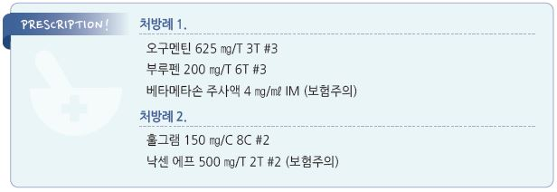

# 편도 주위 농양 Peritonsillar Abscess


## 일반 사항

*   Peritonsillar abscess : 감염에 의해서 유발된 palatine tonsil의 capsule과 인두 근육 사이 조직의 염증 반응으로,

    tonsil의 capsule과 인두 근육 사이에 고름의 축적이 있음
* Peritonsillar cellulitis : 고름의 축적은 없음

## 원인균

* 호기성 균주 : Group A Streptococcus , S. aureus , H. influenzae
* 혐기성 균주 : Fusobacterium , PeptoStreptococcus , Prevotella

## 임상 양상

* 고열, malaise
* 심한 인후통, 귀의 통증 (보통 한쪽)
* 입 벌림 장애, 삼킴 통증, 침 흘림, 힘을 뺀 목소리, 구강 악취
* 홍반성 연구개 부종, 편도 부종, 환부 반대쪽으로의 uvula 변위
* 경부 림프절병증

## 진단

* 보통 검사 없이 임상적으로 진단
* needle aspiration
* 구강 내 초음파, CT, MRI : 목 등 인근 조직으로의 감염 확산 또는 합병증 의심 시 고려

***

## Management

### 치료 방침

* 배농, 항생제, 지지 치료(충분한 수분 공급, 통증 조절)

### 배농

*   needle aspiration : 고름 유무 확인 및 제거 목적으로 시행

    •다음의 경우에는 보류 : 크기 ＜1 ㎝, 목소리 변화가 없는 경우, 침흘림이나 개구 장애가 없음

    •배농 후에도 개구 장애, 삼킴 통증, 연하 곤란이 호전되지 않으면 추가 검사 또는 의뢰
* Incision & Drainage : 중증 또는 적절한 약물 치료 24시간 후에도 반응하지 않는 경우 고려

#### Needle aspiration technique

> ```
> Ref. Peritonsillar abscess. AFP 2017:15;95(8)
> ```

* 시술 전 airway complication을 다룰 준비를 함
*   시술자와 환자가 마주 앉고 적절한 조명으로 시야 확보 → 연구개를 촉진하여 유동 부위 확인

    → 마취제 스프레이를 뿌리고 수 분 후 1\~2% lidocaine±epinephrine으로 유동 부위 점막을 국소 마취(25-G)

    → 설압자로 혀를 누르고 18-G 10 ㎖ 주사기를 최대 유동 부위에 찌르고 흡인(8 ㎜ 이상 삽입 금지)

    → 더 이상 고름이 나오지 않을 때까지 흡인(고름이 나오지 않으면 약간 하부에서 재시도)
* 경동맥이 tonsillar pillar 외하방 2 ㎝ 부위에 있음을 유의

### 진통제

* naproxen : 275 ㎎ tid, 500 ㎎ bid \[아나프록스, 낙센] (보험주의)
* ibuprofen : 400 ㎎ tid\~qid \[부루펜]
* acetaminophen : 650\~1,300 ㎎ tid \[타이레놀]

### 항생제

* GAS, S. aureus 및 호흡기 anaerobes를 치료할 수 있는 제제 선택
* 투여 기간 : 10\~14일
* 3세대 cephalosporin 정맥 주사 : ceftriaxone \[트리악손], cefotaxime \[세포탁심]

\[plus] ampicillin-sulbactam \[유나신] or clindamycin \[훌그램]

* amoxicillin/clav. : amox 기준 500 ㎎ bid \[오구멘틴]
* clindamycin : 600 ㎎ bid or 300 ㎎ qid \[훌그램]

### 고용량 Steroid

* 비-경구 1회 투여로 염증 완화 효과 기대
* 추가 연구 필요

> **질병코드** J36 편도주위농양

J39.0 인두뒤 및 인두옆 농양


