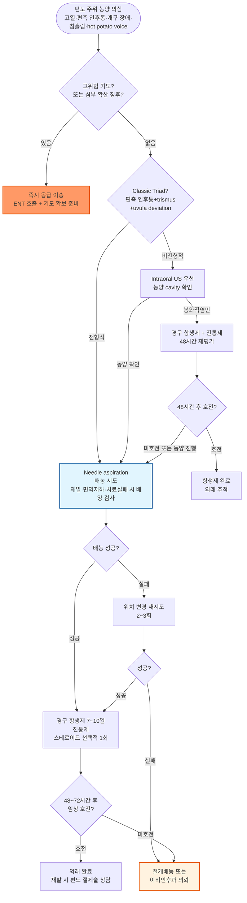

# 편도 주위 농양 Peritonsillar Abscess

## <mark style="color:green;">일반 사항</mark>

* 편도 주위 농양 (Peritonsillar Abscess, PTA) : 구개 편도의 capsule과 인두 수축근 사이의 편도 주위 공간에 고름이 축적된 상태
* 성인의 두경부 심부 감염 중 가장 흔한 형태; 주로 15\~35세에 호발
* 유발 기전 : Weber 점액선(편도 상극 부위 소타액선) 감염 → 편도 주위 봉와직염 → 농양 형성으로 진행하는 것이 유력한 가설
* 편도 주위 봉와직염 (Peritonsillar Cellulitis) : 동일한 해부학적 부위의 감염이나 고름 축적 없이 봉와직염 단계에 머문 상태 - 조기 발견 시 항생제 단독으로 치료 가능
* 합병증 : 기도 폐쇄, 흡인성 폐렴, 후인두 농양 (retropharyngeal abscess), Ludwig's angina, 경정맥 패혈성 혈전정맥염 (Lemierre syndrome), 패혈증

## <mark style="color:green;">원인균</mark>

* 대부분 호기성·혐기성 균주의 복합 감염
* 호기성 균주 : Group A β-hemolytic Streptococcus (GABHS), _S. aureus_, _H. influenzae_
* 혐기성 균주 : _Fusobacterium necrophorum_, _Peptostreptococcus_ spp., _Prevotella_ spp.
* 임상 포인트 : 특히 15\~30세 젊은 성인에서 _Fusobacterium necrophoru&#x6D;_&#xC774; 핵심 병원균으로 주목받고 있으며, β-lactamase를 생성하여 페니실린 단독 치료 실패와 연관됨 → β-lactam/β-lactamase inhibitor 또는 clindamycin 병용이 권장되는 근거
  * _F. necrophorum_ 감염은 Lemierre syndrome(경정맥 패혈성 혈전정맥염 + 혐기성 패혈 전이)의 주요 원인균임을 항상 기억할 것
* MRSA는 routine coverage 불필요 - 치료 실패 또는 위험 인자(피부 반복 감염, 교정시설 등) 있을 때만 고려

## <mark style="color:green;">임상 양상</mark>

* 고열(38.5°C 이상), 오한, 전신 권태감
* 점진적으로 악화되는 심한 편측 인후통, 동측 이통 (referred otalgia)
* 개구 장애 (trismus) : 내측 익상근(medial pterygoid muscle) 연축으로 발생; 가장 특징적인 증상
* 연하 통증, 연하 곤란, 침 흘림
* 힘을 뺀 (hot potato) 음성 : 공명 공간 변형에 의한 특징적 음성 변화
* 구강 악취
* 이학적 소견 : 환측 편도·편도 전주(anterior pillar) 및 연구개의 홍반성 부종, 반대측으로의 구개수(uvula) 변위, 경부 림프절병증

## <mark style="color:green;">진단</mark>

#### <mark style="color:$primary;">임상 진단 (Classic Triad)</mark>

* '⓵ 편측 심한 인후통, ⓶ trismus, ⓷ uvula 반대측 변위' 세 가지가 모두 갖춰진 경우
* 영상 없이 즉시 needle aspiration 시도 가능

#### <mark style="color:$primary;">비전형적 소견</mark>

**구강 내 초음파 (Intraoral ultrasound)**&#x20;

* 농양 vs 봉와직염 감별의 1차 영상 선택
* 민감도·특이도 각 90% 이상, 침상 가능, 방사선 노출 없음
* 농양 cavity 확인 및 needle aspiration 유도에 유용

**고름 흡인**&#x20;

* 진단 겸 치료법 (흡인되지 않으면 봉와직염으로 판단)

#### <mark style="color:$primary;">CT (조영 증강)</mark>&#x20;

* 후인두 농양, Ludwig's angina, 심부 경부 감염 등 심부 확산이 의심될 때 시행

### <mark style="color:orange;">감별 진단</mark>

#### <mark style="color:$primary;">PTA vs 중증 편도염 vs 급성 후두개염 감별</mark>

<table><thead><tr><th width="155">항목</th><th width="189.11767578125">편도 주위 농양 (PTA)</th><th width="155.00006103515625">중증 편도염</th><th>급성 후두개염</th></tr></thead><tbody><tr><td>발병 양상</td><td>점진적 (수일)</td><td>급성</td><td>급격 (수 시간)</td></tr><tr><td>통증 부위</td><td>편측, 매우 심함</td><td>양측, 심함</td><td>삼킬 때 극심 (out of proportion)</td></tr><tr><td>Trismus</td><td><strong>흔함</strong></td><td>❌ 없음</td><td>❌ 없음</td></tr><tr><td>음성 변화</td><td>Muffled "hot potato"</td><td>약간 변화</td><td>저음·답답한 음성</td></tr><tr><td>침흘림</td><td>가능</td><td>드묾</td><td><strong>매우 흔함</strong></td></tr><tr><td>호흡 곤란</td><td>드묾 (late sign)</td><td>없음</td><td><strong>흔함</strong></td></tr><tr><td>Stridor</td><td>❌</td><td>❌</td><td><strong>특징적</strong></td></tr><tr><td>자세</td><td>특별한 자세 없음</td><td>정상</td><td>Tripod position (앞으로 기댐)</td></tr><tr><td>구강 시진</td><td>연구개 부종 + anterior pillar bulging + uvula 변위 (반대측으로)</td><td>양측 편도 비대 ± <br>삼출물</td><td>구강 정상 또는 거의 정상</td></tr><tr><td>기도 위험도</td><td>⚠️ 중등도</td><td>낮음</td><td>🚨 매우 높음 - 즉시 대응</td></tr><tr><td>확진</td><td>Aspiration / intraoral US</td><td>임상 진단</td><td>Lateral neck X-ray / CT (직접 후두경은 경련 유발 위험)</td></tr></tbody></table>


**급성 후두개염(epiglottitis)은 성인에서도 발생하며, 구강 소견이 정상에 가까워 PTA로 오인될 수 있음.** "삼킬 수 없는 정도의 극심한 인후통 + 호흡 곤란 + 침흘림 + 앞으로 기댐" 조합 시 후두개염을 항상 배제해야 함


#### <mark style="color:$primary;">기타 감별 질환</mark>

<table><thead><tr><th width="139.58819580078125">질환</th><th width="318.11767578125">감별 포인트</th><th>비고</th></tr></thead><tbody><tr><td>편도 주위 <br>봉와직염</td><td>개구 장애 경미; uvula 변위 없음; intraoral US에서 농양 cavity 없음</td><td>항생제 단독 치료 후 48시간 재평가</td></tr><tr><td>전염성 단핵구증 <br>(EBV)</td><td>양측성 심한 편도 비대, 전신 림프절병증, 비장비대; 혈액검사(lymphocytosis, atypical lymphocyte, Monospot)</td><td>amoxicillin/ampicillin 투여 시 75~100%에서 발진(maculopapular rash) 발생 - 반드시 피할 것; PTA와 EBV는 공존 가능</td></tr><tr><td>후인두 농양</td><td>경부 강직, 경부 굴곡 제한, 양측 인후벽 부종</td><td>CT 확인 필수; 즉시 이비인후과 의뢰</td></tr><tr><td>Ludwig's <br>angina</td><td>악하 공간 부종·경결, 혀 거상, 기도 폐쇄 위험</td><td>응급 기도 확보 필요</td></tr><tr><td>편도 종양</td><td>무통성; 항생제 무반응; 편측 편도 비대 지속</td><td>악성 종양 배제 위해 조직검사</td></tr></tbody></table>

### <mark style="color:$danger;">🚩 Red Flags!</mark>

<mark style="color:$danger;">**즉각 조치 또는 응급 이송**</mark> <mark style="color:$danger;">- 기도 위협 또는 심부 감염 확산</mark>

**고위험 기도 (High-risk Airway) - 즉시 ENT 호출 + 기도 확보 준비**

* 침흘림(drooling) + 심한 개구 장애 + 음성 소실 동반 → 기도 폐쇄 임박
* 천명(stridor), 호흡 곤란, tripod position
* 경구 섭취 완전 불가

**심부 감염 확산 또는 전신 합병증**

* 악하 공간 부종, 혀 거상, 경부 경결 동반 **Ludwig's angina** :&#x20;
* 경부 강직, 경추 굴곡 제한 동반 **후인두 농양** :&#x20;
* \- **15\~30세에서 특히 경계** : 인후통 이후 수일 내 고열 지속 + 경정맥 주행부(흉쇄유돌근 전연) 압통 + 폐 전이 병변(흉통·기침·혈담) 동반 시 → 즉시 응급실 이송, CT angiography 필요 **🔴 Lemierre syndrome** 강력 의심&#x20;
*
* **패혈증 또는 쇼크** : 저혈압, 빈맥, 의식 변화

<mark style="color:$warning;">**당일 또는 조기 의뢰 (이비인후과)**</mark>

* 소아 또는 면역 저하 환자 (면역억제제 복용, 당뇨, HIV)
* 개구 장애가 심하여 구강 내 시술이 불가능한 경우
* 심한 탈수로 경구 수분 섭취 불가; 경구 항생제 복용 곤란
* **양측성 편도 주위 농양** (드물지만 기도 위험 높음 → 입원 적극 고려)
* 초음파 또는 CT에서 심부 경부 감염 확산이 의심되는 경우
* 재발성 PTA (동측 2회 이상)

<mark style="color:$info;">**외래 추적 / 추가 평가 계획**</mark> <mark style="color:$info;">- 즉각 위험 낮으나 호전 없으면 의뢰</mark>

* 배농 후 48\~72시간 이내에 개구 장애·발열·인후통이 호전되지 않는 경우
* 항생제 투여 48시간 후에도 봉와직염이 농양으로 진행하는 경우
* 동일 편측 PTA 재발 → 편도 절제술 상담

***



<p align="center"><strong>편도 주위 농양 진단 및 치료 알고리듬</strong></p>

<p align="center"><em><mark style="color:$info;">Ref. Galioto NJ. Peritonsillar Abscess. Am Fam Physician. 2017;95(8):501-506. / Roscoe DL et al. Peritonsillar Abscess. In: UpToDate. 2024.</mark></em></p>

***

## <mark style="background-color:$warning;">Management</mark>


**치료 3원칙 : 배농 + 항생제 + 지지 치료**

배농(needle aspiration 또는 I\&D)이 치료의 핵심이며, 항생제와 병행 시 치료 성공률이 높다. 수분 공급과 통증 조절로 회복을 지원한다.



🚨 **외래에서 절대 놓치면 안 되는 3가지**

1. **기도 폐쇄 (Airway compromise)** - stridor, drooling + 심한 trismus 동반 시 즉시 응급 이송
2. **심부 경부 감염 (Deep neck infection)** - 후인두 농양, Ludwig's angina 배제
3. **Lemierre syndrome** - 특히 젊은 성인에서 고열 지속 + 경정맥 압통 + 폐 증상 동반 시 의심


### <mark style="color:orange;">입원 기준</mark>

* 기도 폐쇄 위험 또는 심부 경부 감염 확산 의심
* 심한 탈수 또는 경구 섭취 불가
* 면역 저하 환자
* 외래 치료 48시간 후에도 호전 없는 경우

### <mark style="color:orange;">배농 (Drainage)</mark>

#### <mark style="color:$primary;">Needle aspiration</mark>

_<mark style="color:$info;">(Ref. Peritonsillar abscess. AFP 2017;95(8):501-506)</mark>_

**Drain vs No Drain 결정 원칙**


**배농 시행** (다음 중 하나라도 해당):

* Trismus (개구 장애)
* Uvula deviation
* 침흘림 (drooling)
* 항생제 치료 실패

**배농 보류 - 항생제 단독 + 48시간 재평가** (다음 모두 해당 시):

* Intraoral US에서 abscess cavity 없음 (봉와직염으로 확인)
* 목소리 변화 없음, 침흘림 없음, 개구 장애 없음

→ "크기 < 1 ㎝"만으로 배농 보류를 결정하지 않는다. 크기 기준은 영상(US) 확인이 전제될 때만 보조적으로 참고.


**Needle aspiration safety checklist**

* ☐ 흡인기(suction) 및 후두경·airway backup 확보
* ☐ 조명 및 시야 충분히 확보 (환자·시술자 마주 앉기)
* ☐ 국소 마취 후 최대 유동(fluctuance) 부위 확인
* ☐ **가장 흔한 위치 : Superior pole (편도 상극, 전주 상외측)** 에서 시작
* ☐ 삽입 깊이 **8 ㎜ 이하** 유지 - 그 이상 삽입 금지
  * 💡 **Tip** : 바늘 캡(needle cap)을 8\~10 ㎜만 남기고 잘라 가드(guard)로 끼워두면 깊이 초과를 물리적으로 방지할 수 있어 초심자에게 매우 유용
* ☐ 바늘 방향 **절대 외측(lateral) 금지** - 경동맥 손상 방지

**시술 순서**:

1. 시술 전 기도 합병증 대처 준비 (흡인기·후두경 확보)
2. 시술자와 환자가 마주 앉고 적절한 조명으로 시야 확보
3. 연구개를 촉진하여 최대 유동(fluctuance) 부위 확인 (보통 편도 상극)
4. 마취제 스프레이 도포 → 수 분 후 1\~2% lidocaine ± epinephrine으로 점막 국소 마취 (25-G)
5. 설압자로 혀를 누르고 **18-G 바늘 부착 10 ㎖ 주사기**를 superior pole(상극 전주 상외측)에 삽입·흡인
   * 삽입 깊이 8 ㎜ 이상 금지 (경동맥 손상 방지)
   * 고름이 나오지 않으면 **약간 하방으로 위치를 바꿔 2\~3회 재시도** (동일 세션에서 가능)
   * 더 이상 흡인되지 않을 때까지 계속


⚠️ **경동맥(internal carotid artery)은 tonsillar pillar 외하방 약 2 ㎝ 부위에 위치**한다. 바늘을 너무 깊이 또는 외측으로 삽입하지 않도록 주의할 것.


#### <mark style="color:$primary;">Incision & Drainage (I\&D)</mark>

* Needle aspiration 실패 또는 적절한 항생제 치료 24시간 후 반응 없는 경우
* 이비인후과 의뢰하여 시행

### <mark style="color:orange;">진통제</mark>

* naproxen sodium : 275 ㎎ tid 또는 550 ㎎ bid <mark style="color:blue;">\[아나프록스 275 ㎎]</mark> _(보험 주의)_
* ibuprofen : 400 ㎎ tid\~qid <mark style="color:blue;">\[부루펜 400 ㎎]</mark>
* acetaminophen : 650~~1,000 ㎎ tid~~qid <mark style="color:blue;">\[타이레놀 ER 650 ㎎]</mark>
* 중증 통증 : tramadol 또는 경구 opioid 단기 병용 고려
* **NSAIDs 사용 시 위장관 보호** : 고령자, 위장관 궤양·출혈 병력, 스테로이드 병용 환자에서는 PPI (예: omeprazole 20 ㎎ qd <mark style="color:blue;">\[오메프라졸]</mark>) 또는 H2 차단제를 루틴하게 병용 처방

### <mark style="color:orange;">항생제</mark>

* **목표 균주** : GABHS, _Fusobacterium necrophorum_ 포함 혐기성균, _S. aureus_
* β-lactam 단독(페니실린 등)은 β-lactamase 생성 혐기성균 커버 불충분 → **β-lactam/β-lactamase inhibitor 또는 clindamycin** 포함 요법이 표준
* **투여 기간** : 7~~10일 (임상 반응 불충분 시 10~~14일까지 연장)
* MRSA는 routine coverage 불필요; 치료 실패 또는 고위험군에서만 고려 (TMP/SMX, clindamycin)


⚠️ **전염성 단핵구증(EBV) 동반 가능성을 항상 고려할 것**

양측성 편도 부종, 현저한 전신 림프절병증, 비장비대 동반 시 EBV를 의심하고 혈액검사 시행. **EBV 감염 환자에서 amoxicillin 또는 ampicillin 처방 시 75\~100%에서 maculopapular rash 발생** - 반드시 피할 것. 대체제: clindamycin 또는 azithromycin.


**배양 검사 (Culture & Sensitivity)**

경험적 항생제가 원칙이나, 다음 상황에서는 **흡인액 배양 검사를 반드시 시행**:

* 재발성 PTA (동측 2회 이상)
* 면역 저하 환자
* 초기 적절한 항생제 치료 후에도 반응 없는 경우

#### <mark style="color:$primary;">경구 (외래)</mark>

* **1차** : amoxicillin/clavulanate 625 ㎎ tid <mark style="color:blue;">\[오구멘틴 625 ㎎]</mark>
* **페니실린 알레르기** : clindamycin 300 ㎎ qid 또는 600 ㎎ bid <mark style="color:blue;">\[훌그램 150 ㎎]</mark>

#### <mark style="color:$primary;">정맥 주사 (입원)</mark>

* **1차** : ampicillin/sulbactam 3 g q6h IV <mark style="color:blue;">\[유나신-S]</mark>
* **대안** : ceftriaxone 1\~2 g qd IV <mark style="color:blue;">\[트리악손]</mark> **반드시** + metronidazole 500 ㎎ q8h IV 또는 clindamycin 600 ㎎ q8h IV <mark style="color:blue;">\[달라신 C]</mark> _(ceftriaxone 단독은 혐기성균 커버 부족 - 단독 사용 금지)_
* 구강 섭취 가능해지면 동등한 경구 항생제로 전환하여 총 7\~10일 완료

### <mark style="color:orange;">코르티코스테로이드 (단회, 선택적 사용)</mark>

* 메타분석에서 통증 감소 및 회복 시간 단축 효과 확인; 단 모든 환자에 routine 투여는 아님
* **적응증 : 중등도 이상의 통증 + 삼킴 곤란 + trismus 동반 시 선택적으로 사용**
* **dexamethasone** 8\~10 ㎎ IM 또는 IV 1회 _(국내 급여 외 사용 시 주의)_
* **betamethasone** 4\~8 ㎎ IM 1회 <mark style="color:blue;">\[베타메타손 4 ㎎/㎖]</mark> _(보험 주의)_


💡 **국내 급여 실무 팁** : 상기도 감염에 대한 스테로이드 주사는 급여 인정 범위가 제한적이므로, 투여 시 "trismus로 인해 경구 섭취 불가, 배농 시술 보조 목적의 단회 사용"과 같이 **진료기록부에 적응증 및 투여 근거를 구체적으로 기재**할 것.


### <mark style="color:orange;">편도 절제술 상담</mark>

* **Interval tonsillectomy** (배농 후 4\~6주) : 동측 재발성 PTA (2회 이상), 반복성 편도염 병력, 편도 비대로 인한 기도 문제 동반 시 이비인후과에 상담

***

### <mark style="color:red;">질병코드</mark>

J36 편도주위농양

J39.0 인두뒤 및 인두옆 농양

***

## <mark style="color:purple;">처방례</mark>

> **처방례 1. 성인, 외래 치료 - 배농 성공 후 경구 항생제 (중등도)**
>
> ```
> 오구멘틴 625 ㎎/T   3T   #3   (tid × 7~10일)
> 타이레놀 ER 650 ㎎/T   2T   #2   (bid pc)
> 부루펜 400 ㎎/T   3T   #3   (tid pc)
> 오메프라졸 20 ㎎/C   1C   #1   (qd ac, NSAIDs 병용 기간)
> 베타메타손 주사액 4 ㎎/㎖   1앰플   IM 1회   (보험 주의, 중등도 이상 trismus·삼킴 곤란 시 선택적)
> ```
>
> _✽배농 성공 확인 후 처방. acetaminophen + NSAID 병용 시 위점막 보호를 위해 PPI 루틴 처방. 스테로이드는 중등도 이상 통증·trismus·삼킴 곤란 동반 시 선택적으로 투여; 투여 근거를 진료기록부에 기재할 것._

> **처방례 2. 페니실린/아목시실린 알레르기 환자**
>
> ```
> 훌그램 150 ㎎/C   4C   #2   (bid × 7~10일)
> 낙센에프 500 ㎎/T   2T   #2   (bid pc, 보험 주의)
> 베타메타손 주사액 4 ㎎/㎖   1앰플   IM 1회   (보험 주의, 중등도 이상 증상 시 선택적)
> ```
>
> _✽clindamycin은 Fusobacterium 포함 혐기성균 커버가 우수하여 PTA 대체제로 적합. 위장 장애(구역·설사)가 흔하므로 식후 복용 지도. C. difficile 장염 가능성 안내 필요._

> **처방례 3. 봉와직염(배농 불필요) 단계 - 초기 경구 치료, 48시간 재평가 예정**
>
> ```
> 오구멘틴 625 ㎎/T   3T   #3   (tid × 5일, 재평가 후 연장)
> 부루펜 400 ㎎/T   3T   #3   (tid pc)
> 오메프라졸 20 ㎎/C   1C   #1   (qd ac, NSAIDs 병용 기간)
> ```
>
> _✽NSAIDs 단독 + PPI 병용으로 위장 보호. 통증이 심할 경우 타이레놀 ER 추가 가능(NSAIDs 2종 중복 투여는 피할 것). 48시간 후 농양 진행 여부 반드시 재진 확인. EBV 감염 가능성 고려 시 amoxicillin계 처방 전 monospot 검사 시행._

***

### <mark style="color:$success;">핵심 복약 지도</mark>

> **항생제는 반드시 끝까지 드셔야 합니다**
>
> * 증상이 나아져도 중간에 항생제를 끊으면 균이 완전히 제거되지 않아 재발하거나 내성균이 생길 수 있습니다.
> * 처방된 7\~10일 전 과정을 빠짐없이 복용해 주십시오.
> * 식사와 무관하게 복용 가능하나, 위장 장애 시 식후 복용을 권장합니다.

> **오구멘틴(amoxicillin/clavulanate) 주의 사항**
>
> * 가장 흔한 부작용은 구역·구토·설사입니다. 심한 설사나 복통이 지속되면 즉시 내원하십시오.
> * 페니실린 계열 알레르기가 있으신 분은 반드시 처방 전에 말씀해 주십시오.

> **훌그램(clindamycin) 주의 사항**
>
> * 복용 중 묽은 설사가 잦거나 혈변이 나타나면 즉시 복용을 중단하고 내원하십시오 (항생제 관련 C. difficile 장염 가능성).
> * 반드시 충분한 물(200 ㎖ 이상)과 함께 복용하고, 복용 후 30분간 눕지 마십시오 (식도 자극 방지).

> **진통제 복용 방법**
>
> * 소염진통제(부루펜, 낙센)는 식후 복용을 권장합니다.
> * 타이레놀과 소염진통제를 함께 복용할 수 있으나, 소염진통제를 2종류 동시에 복용하는 것은 피하십시오.
> * 위장 통증이 생기거나 대변이 검게 나오면 즉시 내원하십시오.

> **이럴 때는 즉시 내원하거나 응급실을 방문하십시오**
>
> * 숨쉬기가 힘들거나 목이 막히는 느낌이 드는 경우 - **즉시 응급실**
> * 배농 후 2\~3일이 지나도 발열·통증·입 벌리기 어려움이 나아지지 않는 경우
> * 항생제 복용 중 전신에 발진이 나타나거나 얼굴·입술이 붓는 경우 - **즉시 응급실**
> * 목이나 턱 주위가 갑자기 딱딱하게 붓거나 숨이 차는 경우 - **즉시 응급실**

***

### <mark style="color:blue;">환자 안내서</mark>


**편도 주위 농양 - 편도 주위에 고름이 찬 상태입니다**

편도 주위 농양은 목 안쪽 편도 옆의 공간에 세균이 감염되어 고름(농양)이 형성된 질환입니다. 성인에서 흔한 목 감염의 한 종류로, 적절한 배농과 항생제 치료로 대부분 회복됩니다.


#### <mark style="color:$primary;">왜 생기나요?</mark>

* 세균이 편도 주변 조직에 침투하면 염증이 생기고, 일부에서는 고름이 고이는 농양으로 발전합니다.
* 편도염이나 인두염이 반복되는 분, 흡연자에서 조금 더 잘 생깁니다.
* 드물게 재발하는 경우, 이비인후과에서 편도 절제술이 필요한지 상담을 받으시는 것이 좋습니다.

#### <mark style="color:$primary;">치료는 어떻게 하나요?</mark>

* **배농(고름 제거)** : 주사기로 고름을 뽑아내는 것이 치료의 핵심입니다. 처음에는 통증이 있지만, 배농 후 통증이 빠르게 줄어드는 경우가 많습니다.
* **항생제** : 세균을 완전히 없애기 위해 7\~10일 복용합니다. **증상이 좋아져도 반드시 끝까지 드십시오.**
* **스테로이드 주사 1회** : 염증과 부종을 빠르게 줄이기 위해 주사 1회를 맞을 수 있습니다.

#### <mark style="color:$primary;">집에서 어떻게 관리하나요?</mark>

* 충분한 수분 섭취 : 물, 보리차, 이온 음료 등을 자주 마셔 탈수를 예방하십시오.
* **따뜻한 소금물 가글 (하루 3\~4회)** 로 구강 내 세균 감소에 도움을 줄 수 있습니다.
* 부드럽고 삼키기 쉬운 음식 위주로 드십시오 (죽, 요구르트, 부드러운 면류 등).
* **충분한 휴식**을 취하십시오. 고열이 있는 동안은 무리한 활동을 삼가십시오.
* 금연하십시오. 흡연은 치유를 늦추고 재발 위험을 높입니다.

#### <mark style="color:$primary;">이럴 때는 즉시 병원(응급실)을 방문하세요</mark>

* 숨쉬기가 어렵거나 목이 막히는 느낌이 드는 경우
* 침을 삼키지 못하고 자꾸 흘리는 경우
* 목이나 턱 아래가 갑자기 딱딱하게 부어오르는 경우
* 배농 후 2\~3일이 지나도 발열이 계속되고 입이 벌려지지 않는 경우
* 약 복용 후 얼굴·입술이 붓거나 전신에 발진이 생기는 경우
