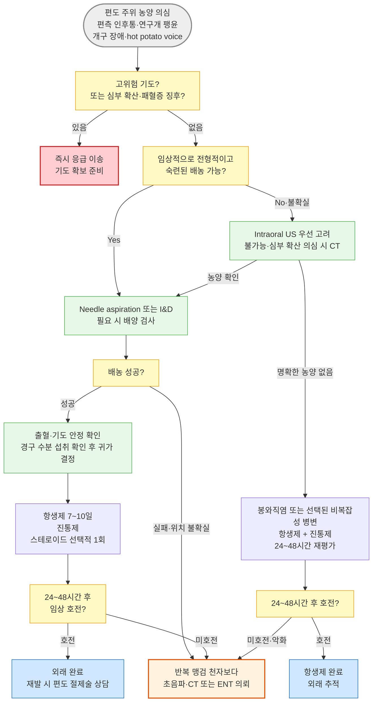

# 편도 주위 농양 Peritonsillar Abscess

## <mark style="color:green;">일반 사항</mark>

* 편도 주위 농양 (Peritonsillar Abscess, PTA) : 구개 편도의 capsule과 인두 수축근 사이의 편도 주위 공간에 고름이 축적된 상태
* 성인의 두경부 심부 감염 중 가장 흔한 형태; 주로 15\~35세에 호발
* 유발 기전 : Weber 점액선(편도 상극 부위 소타액선) 감염 → 편도 주위 봉와직염 → 농양 형성으로 진행하는 것이 유력한 가설
* 편도 주위 봉와직염 (Peritonsillar Cellulitis) : 동일한 해부학적 부위의 감염이나 고름 축적 없이 봉와직염 단계에 머문 상태 - 조기 발견 시 항생제 단독으로 치료 가능
* 합병증 : 기도 폐쇄, 흡인성 폐렴, 후인두 농양 (retropharyngeal abscess), Ludwig's angina, 경정맥 패혈성 혈전정맥염 (Lemierre syndrome), 패혈증

## <mark style="color:green;">원인균</mark>

* 대부분 호기성·혐기성 균주의 복합 감염
* 호기성 균주 : Group A β-hemolytic Streptococcus (GABHS), _S. aureus_, _H. influenzae_
* 혐기성 균주 : _Fusobacterium necrophorum_, _Peptostreptococcus_ spp., _Prevotella_ spp.
* 임상 포인트 : 특히 15\~30세 젊은 성인에서는 _Fusobacterium necrophorum_이 중요한 병원균임. PTA는 다균성 감염이 흔하여 국내 외래에서는 β-lactam/β-lactamase inhibitor가 널리 사용되지만, 충분히 배농된 면역 정상 환자에서 β-lactam 단독요법이 반드시 열등하다는 근거는 없음
  * _F. necrophorum_ 감염은 Lemierre syndrome(경정맥 패혈성 혈전정맥염 + 혐기성 패혈 전이)의 주요 원인균임을 항상 기억할 것
* MRSA는 routine coverage 불필요 - 치료 실패 또는 위험 인자(피부 반복 감염, 교정시설 등) 있을 때만 고려

## <mark style="color:green;">임상 양상</mark>

* 발열, 오한, 전신 권태감; 항생제를 먼저 투여받았거나 국소 감염에 머문 경우 발열이 없을 수 있음
* 점진적으로 악화되는 심한 편측 인후통, 동측 이통 (referred otalgia)
* 개구 장애 (trismus) : 내측 익상근(medial pterygoid muscle) 연축으로 발생; 가장 특징적인 증상
* 연하 통증, 연하 곤란, 침 흘림
* 먹먹하고 우물거리는 음성(muffled “hot potato” voice) : 공명 공간 변형에 의한 특징적 음성 변화
* 구강 악취
* 이학적 소견 : 환측 편도·편도 전주(anterior pillar) 및 연구개의 홍반성 부종, 반대측으로의 구개수(uvula) 변위, 경부 림프절병증

### <mark style="color:$danger;">🚩 Red Flags!</mark>

<mark style="color:$danger;">**즉각 조치 또는 응급 이송**</mark> <mark style="color:$danger;">- 기도 위협 또는 심부 감염 확산</mark>

**고위험 기도 (High-risk Airway) - 즉시 ENT 호출 + 기도 확보 준비**

* 분비물을 전혀 처리하지 못하는 심한 침흘림, 빠르게 진행하는 구강저·경부 부종
* 협착음(stridor), 호흡 곤란, 저산소증·청색증, tripod position
* 의식 저하 또는 호흡 피로 징후

**심부 감염 확산 또는 전신 합병증**

* 악하 공간 부종, 혀 거상, 경부 경결 동반 → Ludwig's angina
* 경부 강직, 경추 굴곡 제한 동반 → 후인두 농양
* 인후통 이후 수일 내 고열 지속 + 경정맥 주행부(흉쇄유돌근 전연) 압통 + 폐 전이 병변(흉통·기침·혈담) 동반 → Lemierre syndrome (15\~30세에서 특히 경계)
* 저혈압, 빈맥, 의식 변화 → 패혈증 또는 쇼크&#x20;

<mark style="color:$warning;">**당일 긴급 평가 또는 의뢰 (이비인후과)**</mark>

* 소아 또는 면역 저하 환자(면역억제제 복용, 조절되지 않는 당뇨병, HIV 등)
* 개구 장애가 심하여 구강 내 시술이 불가능한 경우
* 심한 탈수로 경구 수분 섭취 불가; 경구 항생제 복용 곤란
* 양측성 편도 주위 농양&#x20;
* 초음파 또는 CT에서 심부 경부 감염 확산이 의심되는 경우 → 기도·전신 상태에 따라 즉시 응급 이송
* 치료 후 다시 발생한 급성 PTA 의심(특히 동측 2회 이상)

<mark style="color:$info;">**외래 추적 / 추가 평가 계획**</mark> <mark style="color:$info;">- 즉각 위험 낮으나 호전 없으면 의뢰</mark>

* 배농 후 24\~48시간 이내에 개구 장애·발열·인후통이 호전되지 않거나 악화하는 경우
* 항생제 투여 24\~48시간 후에도 봉와직염이 농양으로 진행하거나 증상이 악화하는 경우
* 급성기 치료 종료 후 반복성 편도염·PTA 병력에 대한 interval tonsillectomy 상담 계획

## <mark style="color:green;">진단</mark>

#### <mark style="color:$primary;">임상 진단</mark>

* 편측 심한 인후통, trismus, 연구개 팽윤 및 구개수의 반대측 편위는 PTA를 강하게 시사하지만, 이 소견들만으로 농양과 봉와직염을 확실히 구분할 수는 없음
* 전형적인 소견이 있고 숙련된 시술자가 즉시 배농할 수 있는 경우에는 영상 없이 진단적 needle aspiration을 시행할 수 있음
* 진단이 불확실하거나 비전형적 소견, 심한 trismus, 초기 흡인 실패가 있으면 초음파 또는 조영 증강 CT로 재평가

#### <mark style="color:$primary;">비전형적 소견</mark>

**구강 내 초음파 (Intraoral ultrasound)**&#x20;

* 농양 vs 봉와직염 감별 시 우선 고려할 수 있는 영상; 시술자 숙련도와 장비 접근성을 고려
* 2023년 메타분석 : 전체 초음파 민감도 86%, 특이도 76%; 구강 내 초음파 민감도 91%, 특이도 75%로 배제에 비교적 유용하나 확진 특이도는 중등도
* 심한 trismus로 구강 내 초음파가 어려우면 경부 초음파 또는 CT 고려
* 농양 cavity 확인 및 needle aspiration 유도에 유용

**고름 흡인**&#x20;

* 진단 겸 치료법. 고름이 흡인되지 않아도 봉와직염으로 단정하지 말고, 부정확한 위치·작은 또는 다방성 농양·하극/후방 농양을 고려하여 초음파·CT 또는 이비인후과 평가

#### <mark style="color:$primary;">CT (조영 증강)</mark>&#x20;

* 진단이 불확실하거나 심한 trismus로 구강 내 평가가 어렵고 초음파를 시행할 수 없는 경우, 초기 흡인 실패, 하극/후방 농양 또는 후인두 농양·Ludwig's angina 등 심부 확산이 의심될 때 시행
* 기도 불안정 환자에서는 영상검사를 위해 기도 처치를 지연하지 않음

### <mark style="color:orange;">감별 진단</mark>

#### <mark style="color:$primary;">PTA vs 중증 편도염 vs 급성 후두개염 감별</mark>

<table><thead><tr><th width="155">항목</th><th width="189.11767578125">편도 주위 농양 (PTA)</th><th width="155.00006103515625">중증 편도염</th><th>급성 후두개염</th></tr></thead><tbody><tr><td>발병 양상</td><td>점진적 (수일)</td><td>급성</td><td>급격할 수 있음</td></tr><tr><td>통증 부위</td><td>편측, 매우 심함</td><td>대개 양측</td><td>구강 소견에 비해 연하통이 매우 심함</td></tr><tr><td>Trismus</td><td><strong>흔함</strong></td><td>드묾</td><td>대개 없음</td></tr><tr><td>음성 변화</td><td>Muffled “hot potato” voice</td><td>경미할 수 있음</td><td>먹먹하거나 쉰 음성</td></tr><tr><td>침흘림</td><td>가능</td><td>드묾</td><td>분비물 처리 곤란 시 발생</td></tr><tr><td>호흡 곤란</td><td>드묾 (진행 시 발생)</td><td>대개 없음</td><td><strong>기도 폐쇄 위험</strong></td></tr><tr><td>Stridor</td><td>비전형적</td><td>비전형적</td><td>나타나면 중증 기도 폐쇄 시사</td></tr><tr><td>자세</td><td>특별한 자세 없음</td><td>정상</td><td>Tripod position 가능</td></tr><tr><td>구강 시진</td><td>연구개 부종 + anterior pillar bulging + uvula 반대측 편위</td><td>양측 편도 비대 ± <br>삼출물</td><td>구강 소견이 정상 또는 경미할 수 있음</td></tr><tr><td>기도 위험도</td><td>진행 정도에 따라 다름</td><td>대개 낮음</td><td>🚨 매우 높음 - 즉시 대응</td></tr><tr><td>진단 확인</td><td>Aspiration / 초음파; 필요 시 조영 증강 CT</td><td>임상 진단</td><td>기도가 안정적이면 ENT의 flexible nasolaryngoscopy; X-ray/CT는 보조 검사</td></tr></tbody></table>


**급성 후두개염(epiglottitis)은 성인에서도 발생하며, 구강 소견이 정상에 가까워 PTA로 오인될 수 있음.** 구강 소견에 비해 심한 연하통, 분비물 처리 곤란, 호흡 곤란 또는 협착음이 있으면 즉시 기도 평가와 이비인후과 협진이 필요함. 기도 불안정 시 영상이나 무리한 인두 검사를 위해 기도 확보를 지연하지 않음


#### <mark style="color:$primary;">기타 감별 질환</mark>

<table><thead><tr><th width="139.58819580078125">질환</th><th width="318.11767578125">감별 포인트</th><th>비고</th></tr></thead><tbody><tr><td>편도 주위 <br>봉와직염</td><td>PTA와 소견이 중복될 수 있음; 초음파에서 명확한 농양 cavity 없음</td><td>항생제 치료 후 24~48시간 재평가</td></tr><tr><td>전염성 단핵구증 <br>(EBV)</td><td>양측성 심한 편도 비대, 후경부 림프절병증, 비장비대; CBC 및 필요 시 EBV 특이 항체</td><td>Aminopenicillin 투여 후 반구진성 발진 위험 증가; PTA와 공존 가능</td></tr><tr><td>후인두 농양</td><td>경부 강직, 경부 굴곡 제한, 인두후벽 팽윤</td><td>기도가 안정적이면 조영 증강 CT; 즉시 이비인후과 의뢰</td></tr><tr><td>Ludwig's <br>angina</td><td>악하 공간 부종·경결, 혀 거상, 기도 폐쇄 위험</td><td>응급 기도 평가·확보</td></tr><tr><td>편도 종양</td><td>무통성; 항생제 무반응; 편측 편도 비대 지속</td><td>악성 종양 배제 위해 이비인후과 평가·조직검사</td></tr></tbody></table>


외래에서 절대 놓치면 안 되는 3가지 : \
**기도 폐쇄** (Airway compromise) : 협착음, 호흡 곤란, 저산소증 또는 분비물을 전혀 처리하지 못하는 심한 침흘림이 있으면 즉시 응급 이송\
**심부 경부 감염** (Deep neck infection) : 후인두 농양, Ludwig's angina 배제\
**Lemierre syndrome** : 특히 젊은 성인에서 고열 지속 + 경정맥 압통 + 폐 증상 동반 시 의심


***


```mermaid
graph TD
    A([편도 주위 농양 의심<br/>편측 인후통·연구개 팽윤<br/>개구 장애·hot potato voice]) --> B[고위험 기도?<br/>또는 심부 확산·패혈증 징후?]
    B -- 있음 --> C[즉시 응급 이송<br/>기도 확보 준비]
    B -- 없음 --> D[임상적으로 전형적이고<br/>숙련된 배농 가능?]
    D -- Yes --> G[Needle aspiration 또는 I&D<br/>필요 시 배양 검사]
    D -- No·불확실 --> E[Intraoral US 우선 고려<br/>불가능·심부 확산 의심 시 CT]
    E -- 농양 확인 --> G
    E -- 명확한 농양 없음 --> F[봉와직염 또는 선택된 비복잡성 병변<br/>항생제 + 진통제<br/>24~48시간 재평가]
    G --> H[배농 성공?]
    H -- 성공 --> O[출혈·기도 안정 확인<br/>경구 수분 섭취 확인 후 귀가 결정]
    H -- 실패·위치 불확실 --> J[반복 맹검 천자보다<br/>초음파·CT 또는 ENT 의뢰]
    O --> I[항생제 7~10일<br/>진통제<br/>스테로이드 선택적 1회]
    I --> K[24~48시간 후<br/>임상 호전?]
    K -- 호전 --> L[외래 완료<br/>재발 시 편도 절제술 상담]
    K -- 미호전 --> J
    F --> M[24~48시간 후 호전?]
    M -- 호전 --> N[항생제 완료<br/>외래 추적]
    M -- 미호전·악화 --> J
style A fill:#eeeeee,stroke:#888888,stroke-width:2px
classDef yellow fill:#fff9c4,stroke:#f39c12
class B,D,H,M,K yellow
classDef blue fill:#d0e8ff,stroke:#1a6abf
class N,L blue
classDef lightGreen fill:#e8f8e8,stroke:#4caf50
class G,E,O lightGreen
    style C fill:#ffcdd2,stroke:#c62828,stroke-width:2px
    style J fill:#fff3e0,stroke:#e65100,stroke-width:2px
```

<p align="center"><strong>편도 주위 농양 진단 및 치료 알고리듬</strong></p>

<p align="center"><em><mark style="color:$info;">Ref. Forner D et al. Otolaryngol Head Neck Surg. 2020;163:915-922. / Long B, Gottlieb M. Ann Emerg Med. 2023;82:101-107. / Kim DJ et al. Acad Emerg Med. 2023;30:859-869. / Voruz F et al. Diagnostics. 2025;15:228.</mark></em></p>

***

## <mark style="background-color:$warning;">Management</mark>

### <mark style="color:orange;">치료 원칙</mark>&#x20;

* 치료 원칙 : 기도 평가 + 감염원 조절(source control) + 항생제 + 수분·통증 조절
  * 임상적으로 의미 있는 농양에는 needle aspiration 또는 I\&D와 항생제 병행이 전통적인 표준 치료
  * 다만 기도 위험·심부 확산·패혈증·현저한 trismus가 없는 선택된 비복잡성 PTA에서는 전문의 판단, 치료 실패 시 즉시 배농할 수 있는 체계 및 24\~48시간 내 추적을 전제로 약물 치료 단독을 고려할 수 있음. 배농 생략의 환자 선택 기준과 근거 수준은 아직 확립되지 않음

**입원 기준**

* 기도 폐쇄 위험 또는 심부 경부 감염 확산 의심
* 심한 탈수 또는 경구 섭취 불가
* 면역 저하 환자
* 외래 치료 24\~48시간 후에도 호전이 없거나 악화

## <mark style="color:green;">배농 (Drainage)</mark>

#### <mark style="color:$primary;">Needle aspiration</mark>

**Drain vs No Drain 결정 원칙**

* 배농 우선 : 영상 또는 진단적 흡인으로 확인된 임상적으로 의미 있는 농양, 현저한 trismus·침흘림·muffled voice, 항생제 치료 실패
* 배농 보류 가능 : 영상에서 명확한 농양 cavity가 없고 봉와직염이 의심되는 경우, 또는 기도·심부 확산 위험이 없고 증상이 경미한 선택된 비복잡성 병변으로 신뢰할 수 있는 24\~48시간 추적이 가능한 경우
* 농양 크기만으로 배농 여부를 결정하지 않고 증상, 위치, 기도 위험, 면역 상태와 추적 가능성을 함께 판단

**Needle aspiration safety checklist**

* 흡인기(suction) 및 후두경·airway backup 확보
* 충분한 술기 경험과 기도·출혈 합병증에 즉시 대처할 수 있는 진료 환경에서 시행
* 조명 및 시야 충분히 확보 (환자·시술자 마주 앉기)
* 국소 마취 후 최대 유동(fluctuance) 부위 확인
* 가장 흔한 위치(Superior pole-편도 상극, 전주 상외측)에서 시작
* 삽입 깊이 약 8\~10 ㎜ 이하 유지
  * Tip : 바늘 캡(needle cap)을 약 8\~10 ㎜만 노출되도록 잘라 가드(guard)로 끼워두면 깊이 초과를 방지하는 데 도움이 됨
* 바늘 방향 절대 외측(lateral) 금지 - 경동맥 손상 방지

**시술 순서**

1. 시술 전 기도 합병증 대처 준비 (흡인기·후두경 확보)
2. 시술자와 환자가 마주 앉고 적절한 조명으로 시야 확보
3. 연구개를 촉진하여 최대 유동(fluctuance) 부위 확인 (보통 편도 상극)
4. 마취제 스프레이 도포 → 수 분 후 1\~2% lidocaine ± epinephrine으로 점막 국소 마취 (25-G)
5. 설압자로 혀를 누르고 18-G 바늘 부착 10 ㎖ 주사기를 superior pole(상극 전주 상외측)에 삽입·흡인
   * 삽입 깊이 8 ㎜ 이상 금지 (경동맥 손상 방지)
   * 고름이 나오지 않고 위치가 불확실하면 반복적인 맹검 천자보다 초음파 유도, CT 또는 이비인후과 의뢰를 우선. 해부학적 위치와 시야가 명확하고 술기 경험이 있는 경우에만 제한적으로 방향 조정
   * 더 이상 흡인되지 않을 때까지 계속


내경동맥(internal carotid artery)은 일반적으로 천자 목표점의 약 2\~2.5 ㎝ 후외측(posterolateral)에 위치함. 바늘을 너무 깊이 또는 외측으로 삽입하지 않도록 주의


#### <mark style="color:$primary;">Incision & Drainage (I\&D)</mark>

* Needle aspiration으로 충분히 배농되지 않거나 다방성 농양, 재축적 또는 적절한 항생제 치료에도 반응이 없는 경우
* 전문과 의뢰

#### <mark style="color:$primary;">배농 후 관찰 및 귀가</mark>

* 출혈·흡인 여부와 기도 안정성을 확인하고, 진통·수액 치료 후 경구 수분 섭취가 가능한지 관찰
* 호흡이 안정되고 패혈증이 없으며 활동성 출혈 없이 경구 수분과 약물을 섭취할 수 있을 때 외래 치료 고려
* 귀가 환자는 24\~48시간 내 재평가하고, 그 전에 호흡 곤란·출혈·경부 부종·통증 악화가 있으면 즉시 내원하도록 교육

### <mark style="color:orange;">편도 절제술 상담</mark>

* Interval tonsillectomy : 재발성 PTA(특히 2회 이상), 반복성 편도염 병력, 편도 비대로 인한 기도 문제 또는 종양 의심 시 전문과 상담. 수술 시점은 급성 염증이 가라앉은 뒤 환자 상태와 이비인후과 판단에 따라 결정
* 급성기 편도 절제술(quinsy tonsillectomy)은 선택된 환자에서 시행할 수 있으나 routine 치료는 아님


2025년 성인 41명의 소규모 무작위시험에서는 급성기 편도 절제술이 배농보다 유리하다는 결과로 연구가 조기 종료되었으나, 단일 소규모 연구이므로 모든 환자의 routine 치료를 변경할 근거로 일반화하지 않음


## <mark style="color:green;">항생제</mark>

* 목표 균주 : GABHS 및 _Streptococcus anginosus_ group, _Fusobacterium necrophorum_ 등 구강 혐기성균
* 다균성 감염을 고려하여 amoxicillin/clavulanate가 흔히 사용되지만, 충분히 배농된 면역 정상 환자에서는 β-lactam 단독요법이 더 넓은 요법보다 재발을 증가시킨다는 근거가 없음. Metronidazole 또는 clindamycin을 모든 환자에게 일률적으로 추가하지 않음
* 투여 기간 : 일반적으로 7\~10일; 중증도, 배농 적절성 및 임상 반응에 따라 10\~14일까지 고려하되 문서 내 처방 기간을 일관되게 적용
* MRSA는 routine coverage 불필요. 배양 결과, 기존 MRSA 감염·보균 또는 중증 치료 실패 등 위험이 있을 때만 추가 고려
  * 중증 입원 환자 : 기본 구강인두 감염 요법에 vancomycin 추가 고려
  * TMP/SMX 단독은 GAS 및 혐기성균 커버가 불충분하므로 PTA 단독 요법으로 사용하지 않음


**전염성 단핵구증(EBV) 동반 가능성을 항상 고려할 것**

양측성 편도 부종, 후경부 림프절병증, 비장비대 동반 시 EBV를 고려. 필요하면 CBC와 EBV 특이 항체(VCA IgM/IgG, EBNA)를 임상 시점에 맞춰 시행하며, Monospot은 위양성·위음성 때문에 EBV 확진검사로 일률적으로 사용하지 않음. EBV 감염에서는 aminopenicillin 투여 후 반구진성 발진 위험이 증가하므로 불필요한 처방을 피하되, 세균성 PTA가 동반되면 적절한 항생제 치료가 필요함. Azithromycin은 _Fusobacterium_ 및 구강 혐기성균 치료 신뢰도가 낮아 PTA의 일반적인 대체제로 권고하지 않음


**배양 검사 (Culture & Sensitivity)**

* 경험적 항생제가 원칙이며 routine 배양의 임상적 이득은 제한적임. 재발성 PTA, 면역 저하, 중증 감염 또는 초기 적절한 치료에도 반응이 없을 때는 흡인액의 그람 염색·호기성/혐기성 배양 및 감수성 검사를 고려

#### <mark style="color:$primary;">경구 (외래)</mark>

* 1차 : amoxicillin/clavulanate 625 ㎎ tid <mark style="color:blue;">\[오구멘틴 625 ㎎]</mark>
* 중증 즉시형 페니실린 알레르기 : clindamycin 300\~450 ㎎ q6\~8h <mark style="color:blue;">\[훌그램 150 ㎎]</mark>; 지역 내성률과 _C. difficile_ 감염 위험 고려
* 비중증 지연형 페니실린 알레르기는 알레르기 병력을 재평가하고, 필요 시 cephalosporin + metronidazole 요법을 고려

#### <mark style="color:$primary;">정맥 주사 (입원)</mark>

* 1차 : ampicillin/sulbactam 3 g q6h IV <mark style="color:blue;">\[유나신-S]</mark>
* 대안 : ceftriaxone 1\~2 g qd IV <mark style="color:blue;">\[트리악손]</mark> + metronidazole 500 ㎎ q8h IV
* 중증 즉시형 β-lactam 알레르기 : clindamycin 600\~900 ㎎ q8h IV <mark style="color:blue;">\[달라신 C]</mark>; 중증 감염이나 치료 실패 시 감염내과·이비인후과 자문 및 배양 결과에 따라 조정
* 구강 섭취가 가능해지면 동등한 경구 항생제로 전환하여 총 7\~10일 완료

<p align="center"><em><mark style="color:$info;">Ref. Moen CM et al. J Laryngol Otol. 2023;137:992-996. / Loggarfve M et al. Clin Microbiol Infect. 2026; online ahead of print. doi:10.1016/j.cmi.2026.07.044.</mark></em></p>

## <mark style="color:green;">지지 치료</mark>

### <mark style="color:orange;">진통제</mark>

* naproxen sodium : 275 ㎎ tid 또는 550 ㎎ bid <mark style="color:blue;">\[아나프록스 275 ㎎]</mark> (보험 주의)
* ibuprofen : 400 ㎎ tid\~qid <mark style="color:blue;">\[부루펜 400 ㎎]</mark>
* acetaminophen 일반제 : 650\~1,000 ㎎ q6\~8h; 모든 acetaminophen 함유 제제의 일일 총량과 제품별 허가사항 확인
  * Acetaminophen ER 650 ㎎ <mark style="color:blue;">\[타이레놀 ER 650 ㎎]</mark>은 해당 서방형 제품의 투여 간격과 1일 최대량을 따름. 간질환, 과음, 고령·저체중 환자는 최대량을 낮춤
* 중증 통증 : tramadol 또는 경구 opioid 단기 병용 고려
* NSAIDs 사용 시 위장관 보호 : 고령, 위장관 궤양·출혈 병력, 항응고제·항혈소판제 또는 지속적인 전신 스테로이드 병용 등 위장관 고위험군에서는 PPI(예: omeprazole 20 ㎎ qd <mark style="color:blue;">\[오메프라졸]</mark>) 병용 고려. 단기간 NSAIDs를 사용하는 저위험 성인에게 일률적으로 처방하지 않음

### <mark style="color:orange;">Steroid</mark>

* 소규모 연구에서 첫 24시간의 통증·연하 증상을 완화할 가능성이 있으나, 48시간 이후 이득과 재발·합병증 감소 효과는 불확실함; 모든 환자에 routine 투여하지 않음
* 단회, 선택적 사용
* 적응증 : 중등도 이상의 통증 + 삼킴 곤란 + trismus 동반 시 선택적으로 사용
* dexamethasone : 8\~10 ㎎ IM 또는 IV 1회 <mark style="color:blue;">\[덱메타손]</mark>; 제품별 허가사항·급여기준 확인


**국내 사용 유의사항** : 제품별 허가사항과 최신 급여기준을 확인하고, 통증·연하 곤란·trismus 등 임상적 투여 근거를 의무기록에 남길 것


***

### <mark style="color:red;">질병코드</mark>

J36 편도주위농양

J39.0 인두뒤 및 인두옆 농양 — 해당 심부 경부 농양이 실제로 진단된 경우에만 사용

***

## <mark style="color:purple;">처방례</mark>

> **처방례 1. 성인, 외래 치료 - 배농 성공 후 경구 항생제 (중등도)**
>
> ```
> 오구멘틴 625 ㎎/T   3T   #3   (tid × 7~10일)
> 타이레놀 ER 650 ㎎/T   2T   #2   (bid pc)
> 부루펜 400 ㎎/T   3T   #3   (tid pc)
> 덱메타손주 5 ㎎/㎖   2앰플   IM 또는 IV 1회   (중등도 이상 trismus·삼킴 곤란 시 선택적)
> ```
>
> _✽배농 후 출혈·기도 안정과 경구 수분 섭취 가능 여부를 확인한 뒤 처방. PPI는 고령, 소화성궤양·출혈 병력, 항응고제·항혈소판제 복용 등 위장관 고위험군에서만 선택적으로 병용. 스테로이드는 중등도 이상 통증·trismus·삼킴 곤란 동반 시 단회 선택적으로 투여하고 투여 근거를 진료기록부에 기재할 것._

> **처방례 2. 중증 즉시형 페니실린/아목시실린 알레르기 환자**
>
> ```
> 훌그램 150 ㎎/C   2C   #4   (qid × 7~10일)
> 낙센에프 500 ㎎/T   2T   #2   (bid pc, 보험 주의)
> 덱메타손주 5 ㎎/㎖   2앰플   IM 또는 IV 1회   (중등도 이상 증상 시 선택적)
> ```
>
> _✽Clindamycin은 중증 즉시형 β-lactam 알레르기의 대체제로 사용할 수 있으나 지역 내성률을 고려. 위장 장애(구역·설사)가 흔하며 C. difficile 장염 가능성을 안내. 비중증 지연형 알레르기는 병력을 재평가하여 cephalosporin 사용 가능 여부를 판단._

> **처방례 3. 봉와직염(배농 불필요) 단계 - 초기 경구 치료, 24~48시간 내 재평가 예정**
>
> ```
> 오구멘틴 625 ㎎/T   3T   #3   (tid × 5일, 재평가 후 연장)
> 부루펜 400 ㎎/T   3T   #3   (tid pc)
> ```
>
> _✽통증이 심할 경우 타이레놀 ER 추가 가능(NSAIDs 2종 중복 투여는 피할 것). 24~48시간 내 농양 진행 여부를 반드시 재평가. EBV가 의심되면 임상 시점에 맞춰 EBV 특이 항체검사를 고려하며 Monospot 결과만으로 확진·배제하지 않음._

***

### <mark style="color:$success;">핵심 복약 지도</mark>

> **항생제는 처방된 기간과 용법에 맞추어 복용하십시오**
>
> * 증상이 나아져도 임의로 중단하거나 기간을 늘리지 말고 처방된 기간과 용법을 지켜 주십시오.
> * 복용 중 부작용이 생기거나 24\~48시간 내 호전되지 않으면 임의로 약을 바꾸지 말고 처방기관에 연락하십시오.
> * 오구멘틴은 위장 장애를 줄이기 위해 식사 시작 시 복용하고, 훌그램은 식사와 관계없이 복용할 수 있습니다.

> **오구멘틴(amoxicillin/clavulanate) 주의 사항**
>
> * 가장 흔한 부작용은 구역·구토·설사입니다. 심한 설사나 복통이 지속되면 즉시 내원하십시오.
> * 페니실린 계열 알레르기가 있으신 분은 반드시 처방 전에 말씀해 주십시오.
> * 식사 시작 시 복용하면 위장 장애를 줄이는 데 도움이 됩니다.

> **훌그램(clindamycin) 주의 사항**
>
> * 복용 중 묽은 설사가 잦거나 혈변이 나타나면 즉시 복용을 중단하고 내원하십시오 (항생제 관련 C. difficile 장염 가능성).
> * 반드시 충분한 물(200 ㎖ 이상)과 함께 복용하고, 복용 후 30분간 눕지 마십시오 (식도 자극 방지).

> **진통제 복용 방법**
>
> * 소염진통제(부루펜, 낙센)는 식후 복용을 권장합니다.
> * 타이레놀과 소염진통제를 함께 복용할 수 있으나, 소염진통제를 2종류 동시에 복용하는 것은 피하십시오.
> * 위장 통증이 생기거나 대변이 검게 나오면 즉시 내원하십시오.

> **이럴 때는 즉시 내원하거나 응급실을 방문하십시오**
>
> * 숨쉬기가 힘들거나 목이 막히는 느낌이 드는 경우 - **즉시 응급실**
> * 배농 후 24\~48시간 내 발열·통증·입 벌리기 어려움이 나아지지 않거나 그 전에 악화하는 경우
> * 약 복용 후 호흡 곤란, 쉰목소리, 얼굴·입술·혀 부종, 어지럼 또는 실신이 나타나는 경우 - **즉시 응급실**
> * 전신 상태가 안정적이고 발진만 나타난 경우에는 약을 임의로 계속 복용하지 말고 당일 처방기관에 연락·진료
> * 목이나 턱 주위가 갑자기 딱딱하게 붓거나 숨이 차는 경우 - **즉시 응급실**

***

### <mark style="color:blue;">환자 안내서</mark>


**편도 주위 농양 - 편도 주위에 고름이 찬 상태입니다**

편도 주위 농양은 목 안쪽 편도 옆의 공간에 세균이 감염되어 고름(농양)이 형성된 질환입니다. 성인에서 흔한 목 감염의 한 종류로, 적절한 배농과 항생제 치료로 대부분 회복됩니다.


#### <mark style="color:$primary;">왜 생기나요?</mark>

* 세균이 편도 주변 조직에 침투하면 염증이 생기고, 일부에서는 고름이 고이는 농양으로 발전합니다.
* 편도염이나 인두염이 반복되는 분, 흡연자에서 조금 더 잘 생깁니다.
* 드물게 재발하는 경우, 이비인후과에서 편도 절제술이 필요한지 상담을 받으시는 것이 좋습니다.

#### <mark style="color:$primary;">치료는 어떻게 하나요?</mark>

* **배농(고름 제거)** : 주사기로 고름을 뽑아내는 것이 치료의 핵심입니다. 처음에는 통증이 있지만, 배농 후 통증이 빠르게 줄어드는 경우가 많습니다.
* **항생제** : 처방된 기간과 용법에 맞추어 복용합니다. 증상이 좋아져도 임의로 중단하거나 기간을 늘리지 마십시오.
* **스테로이드 주사 1회** : 통증과 삼킴 곤란을 빠르게 줄이기 위해 선택적으로 주사 1회를 맞을 수 있습니다. 모든 환자에게 필요한 치료는 아닙니다.

#### <mark style="color:$primary;">집에서 어떻게 관리하나요?</mark>

* 충분한 수분 섭취 : 물, 보리차, 이온 음료 등을 자주 마셔 탈수를 예방하십시오.
* 배농 부위에서 피가 나지 않고 의료진이 허용한 경우, **따뜻한 소금물로 가볍게 가글**하면 인후 불편감 완화에 도움이 될 수 있습니다.
* 부드럽고 삼키기 쉬운 음식 위주로 드십시오 (죽, 요구르트, 부드러운 면류 등).
* **충분한 휴식**을 취하십시오. 고열이 있는 동안은 무리한 활동을 삼가십시오.
* 흡연은 PTA 발생과 연관되어 있으므로 금연하십시오.
* 퇴원 후 **24\~48시간 내 예정된 재평가**를 받으십시오. 그 전에 증상이 악화하면 예정일을 기다리지 말고 즉시 내원하십시오.

#### <mark style="color:$primary;">이럴 때는 즉시 병원에 연락하거나 응급실을 방문하세요</mark>

* 숨쉬기가 어렵거나 목이 막히는 느낌이 드는 경우
* 침을 삼키지 못하고 자꾸 흘리는 경우
* 목이나 턱 아래가 갑자기 딱딱하게 부어오르는 경우
* 배농 후 24\~48시간 내 발열·통증·입 벌리기 어려움이 호전되지 않거나 그 전에 악화하는 경우
* 약 복용 후 호흡 곤란, 쉰목소리, 얼굴·입술·혀 부종, 어지럼 또는 실신이 생기는 경우
* 전신 상태가 안정적이고 발진만 생긴 경우에는 당일 처방기관에 연락하여 진료받으십시오.
