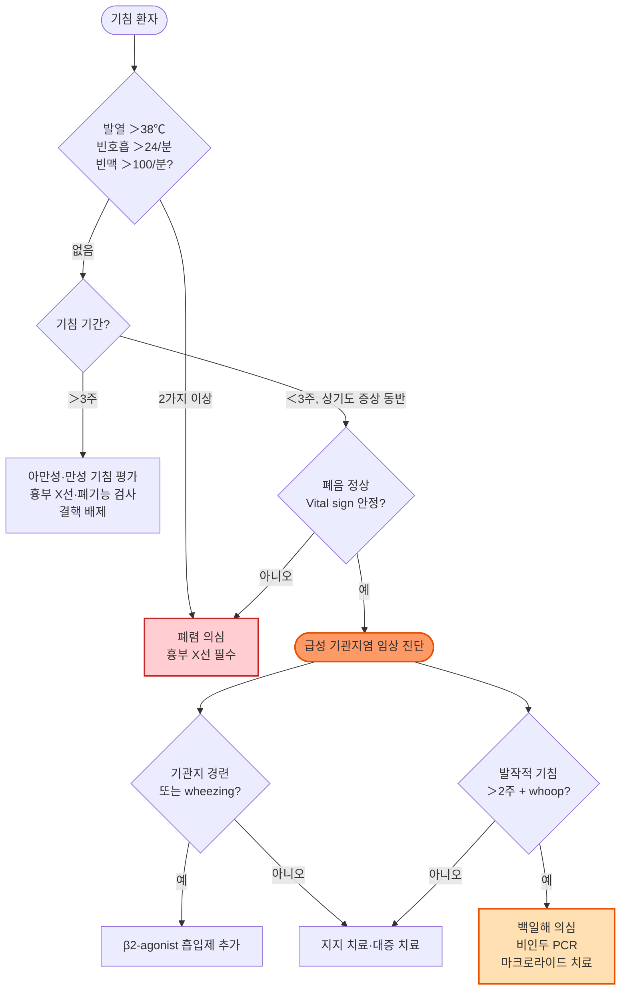

# 급성 기관지염 Acute Bronchitis

## <mark style="color:green;">일반 사항</mark>

* 기침이 주요 증상인 하기도 염증; 폐렴의 영상학적·임상적 증거가 없는 것으로 정의
* 급성 기관지염의 기침은 평균 약 **3주** 지속 (범위 1~4주); 환자들은 보통 1주일 내에 낫기를 기대하므로 사전 교육이 중요 \[NICE, 2023]
* ＞3주 지속 시 급성 기관지염의 범주를 넘어서며 추가 평가 필요

## <mark style="color:green;">원인 및 위험 인자</mark>

* **감염** (대부분): 바이러스(＞90%), 세균(＜10%), 진균(드묾)
  * 바이러스: rhinovirus, influenza virus, adenovirus, respiratory syncytial virus(RSV), coronavirus
  * 비정형균: _Mycoplasma pneumoniae_, _Chlamydia pneumoniae_
  * 세균: _Bordetella pertussis_, _Haemophilus influenzae_, _Moraxella catarrhalis_, _Streptococcus pneumoniae_
* **비감염**: 화학적·물리적 기도 자극 (오염 물질, 흡연, 유해가스)

### <mark style="color:orange;">위험 인자</mark>

* 계절: 겨울·초봄; 대기 오염; 흡연(능동·수동); 환경 변화
* 연령: 영아, 고령
* 기저 질환: 만성 부비동염, 편도/아데노이드 비대, 만성 폐질환(COPD·천식), 호흡기 알레르기, GERD, 면역 저하
* 기도 삽관, 알코올 남용

## <mark style="color:green;">임상 양상</mark>

* 대부분 **상기도 전구 증상**(코막힘, 인두통, 콧물)으로 시작한 뒤 마른기침 발생
* 기침은 보통 아침에 심하고, 점차 가래·점액을 동반하는 습성 기침(productive cough)으로 변화
* **일시적 기관지 과민 반응** 양상: 운동·찬 공기 흡입 시 악화; 쉰 목소리 동반 가능
* 기침으로 인한 흉부 불편감; 후비루; 인두 발적
* 청진: 기침으로 맑아지는 rhonchi; 간혹 wheezing
* 전신 증상: malaise, 발열(대부분 미열; 환자의 약 ⅓에서 관찰)
* 발열·빈호흡·빈맥이 없으면 폐렴 가능성 낮음

### <mark style="color:$danger;">🚩 Red Flags!</mark>

<mark style="color:$danger;">**즉각 조치 또는 이송**</mark> <mark style="color:$danger;">— 생명 위협 또는 즉각적 호흡기 손상 가능성</mark>

* 빈호흡(＞24회/분) + 빈맥(＞100회/분) + 발열(＞38℃) — 폐렴 가능성 높음, 즉각 영상 검사 및 입원 평가
* 산소포화도 ＜94% 또는 청색증
* 호흡 보조근 사용, 흡기 시 흉벽 함몰 등 호흡 곤란의 징후
* 대량 객혈

<mark style="color:$warning;">**당일 또는 조기 의뢰**</mark>

* 고열(＞39℃) + 화농성 가래 + 흉부 국소 청진 이상 소견 — 폐렴 배제 위해 흉부 X선 필요
* 2주 이상 지속되는 발작성 기침 + 흡기성 whoop 또는 기침 후 구토 — 백일해(_Bordetella pertussis_) 의심; 전파 차단 및 확진 검사
* 고령·면역 저하·만성 폐질환 환자에서 증상 악화
* 혈담 지속 또는 체중 감소 동반 — 결핵·폐 종양 배제 필요

<mark style="color:$info;">**외래 추적 / 추가 평가 계획**</mark> <mark style="color:$info;">— 즉각 위험 낮으나 호전 없으면 추가 평가</mark>

* 3주 이상 기침 지속: 흉부 X선, 폐기능 검사, 결핵 배제 검사 시행
* 적절한 치료에도 증상 개선 없거나 반복적 기관지염 — 천식·COPD·GERD 감별
* ACEI 복용 중인 환자: 약제 유발 기침 여부 재평가

## <mark style="color:green;">진단</mark>

* **임상 진단**: 폐렴·천식·COPD 등의 증거가 없고, 5일 이상(평균 9일) 지속되는 기침
* 임상 양상 + 신체검사(폐음 정상, vital sign 안정)만으로 대부분 진단 가능
* 발열·빈호흡·빈맥·저산소증이 없으면 영상 검사는 권고하지 않음

### <mark style="color:orange;">검사</mark>

* **보통 불필요**: 신체검사상 폐 소견 및 vital sign이 정상이면 흉부 X선 권고 안 함
* **실험실 검사**: WBC↑(약 20%에서); CRP 상승 시 폐렴 등 고려; 가래 도말(결핵 의심 시)
* **영상 검사**: 흉부 X선 — 폐렴·종양 등 감별 시 시행; ≥3주 지속 시 권고
* **백일해 의심 시**: 비인두 도말 PCR 또는 배양; 발병 후 3주 이내에 시행


**항생제 처방 전 폐렴 배제 기준 (CRB-65 참고)**\
발열(＞38℃), 빈호흡(＞24회/분), 빈맥(＞100회/분) 중 2가지 이상이거나 의식 변화·청진상 국소 이상음 동반 시 폐렴을 적극 배제할 것. CRP ≥ 20 mg/L 이상이면 세균성 하기도 감염 가능성 상승.


### <mark style="color:orange;">감별 진단</mark>

<table><thead><tr><th width="180">감별 질환</th><th width="260">시사하는 소견</th><th>비고</th></tr></thead><tbody><tr><td>폐렴</td><td>빈맥(＞100/분), 빈호흡(＞24/분), 발열(＞38℃), 국소 폐음 이상</td><td>흉부 X선으로 확인</td></tr><tr><td>백일해</td><td>＞2주 발작적 기침, 흡기성 whoop, 기침 후 구토</td><td>성인 재유행 주의; PCR 확진</td></tr><tr><td>천식</td><td>반복 기침·wheezing, 운동/알레르겐 유발, 기관지확장제 반응</td><td>폐기능 검사</td></tr><tr><td>감기(URTI)</td><td>콧물·코막힘·재채기 등 코 증상 우세, 기침 경미</td><td>하기도 침범 없음</td></tr><tr><td>COPD 악화</td><td>흡연력, 기저 폐기능 저하, 운동 시 호흡 곤란</td><td>폐기능 검사</td></tr><tr><td>GERD</td><td>식후·야간 기침, 속쓰림, 목이물감</td><td>PPI 시험 치료</td></tr><tr><td>약제 유발 기침</td><td>ACEI 복용력, 복용 후 수 주 내 기침 시작</td><td>ACEI 중단 후 호전</td></tr><tr><td>결핵</td><td>＞3주 기침, 발한·체중 감소·혈담, 고위험군</td><td>가래 도말·PCR</td></tr></tbody></table>


녹색 또는 노란 가래 색만으로 바이러스와 세균 감염을 감별할 수 없음 — 화농성 가래가 항생제 처방의 단독 근거가 되어서는 안 됨.


***



<p align="center"><strong>급성 기관지염 진단 및 치료 알고리듬</strong></p>

<p align="center"><em><mark style="color:$info;">Ref. ACP, Ann Intern Med 2016; NICE NG120, 2023</mark></em></p>

***

## <mark style="background-color:$warning;">Management</mark>


**치료 핵심 원칙**\
급성 기관지염은 바이러스 감염이 대부분이므로 **항생제는 통상 불필요**. 지지 치료와 대증 치료를 중심으로 하며, 환자에게 기침이 평균 3주 지속될 수 있음을 사전 안내하는 것이 항생제 요구를 줄이는 데 효과적이다.


### <mark style="color:orange;">항생제 스튜어드십</mark>

* 합병증 없는 급성 기관지염에서 항생제는 기침 기간을 약 0.5일 단축시킬 뿐이며, 내성균 유발·부작용 위험 때문에 권고하지 않음 \[Cochrane, 2017; ACP, 2016]
* **항생제 고려 기준**:
  * 백일해 확진 또는 강력 의심 → azithromycin
  * 만성 기관지염 급성 악화(AECB) + 화농성 가래 ＞2주 지속 → amoxicillin-clavulanate 또는 respiratory fluoroquinolone 고려
  * 고령·면역 저하·만성 폐질환 환자에서 세균성 중복 감염 의심 → 5일 이내 단기 처방 \[ACP]


**⚠️ 항생제 요청 환자 응대 팁**\
"이 기침은 바이러스가 원인이어서 항생제가 듣지 않습니다. 기침은 평균 3주까지 지속될 수 있고, 항생제는 그 기간을 의미 있게 줄이지 못하면서 부작용이 생길 수 있습니다. 증상 완화 처방을 드리겠습니다." — 이러한 사전 안내(가이드라인에 근거한 설명)가 환자 만족도를 유지하면서 항생제 처방을 줄이는 데 효과적임.


## <mark style="color:green;">비-약물 치료 및 예방</mark>

* **금연** 및 호흡기 자극 회피(간접흡연, 유해가스, 분진); 대기 오염 시 외출 자제
* **수분 섭취** 증가 (기도 분비물 점도 완화)
* **가습**: 습도 유지(40~60%)는 도움이 될 수 있으나 일관된 근거 부족; 가습기 사용 시 위생 관리 필수 (곰팡이·세균 번식 주의); 뜨거운 가습기는 화상 위험
* **꿀(honey)**: 성인에서 기침 완화에 제한적 근거 있음 (소아 5세 미만 금기; Clostridium botulinum 위험)
* **기저 질환 관리**: 천식, 부비동염, 위식도역류(GERD)
* **예방접종**: 인플루엔자 백신(매년), 폐렴구균 백신(고위험군·고령자)

## <mark style="color:green;">약물 치료</mark>

### <mark style="color:orange;">해열·진통제</mark>

* ibuprofen 400 ㎎ tid~qid (식후) <mark style="color:blue;">\[부루펜]</mark>
* acetaminophen 650~1,300 ㎎ tid <mark style="color:blue;">\[타이레놀 이알]</mark>

### <mark style="color:orange;">진해제</mark>

* **근거 미약**: RCT에서 급성 기관지염에 대한 진해제(dextromethorphan, codeine)의 유의한 효과 미입증 \[Cochrane, 2014]
* dextromethorphan 15~30 ㎎ tid~qid (단기 사용; 의존성 주의) <mark style="color:blue;">\[메디코프]</mark>
* levodropropizine 60 ㎎ tid (말초성 진해제; 졸림 적음) <mark style="color:blue;">\[드로피진]</mark>
* codeine 제제: 효과 제한적; 남용·의존 우려로 권고 안 함

### <mark style="color:orange;">점액 용해제</mark>

* 유효성을 입증하는 강력한 근거 부족; 불편 증상 완화 목적으로 제한적 사용
* ambroxol 30 ㎎ tid <mark style="color:blue;">\[무코솔반]</mark>
* acetylcysteine 200 ㎎ tid <mark style="color:blue;">\[에이스틴]</mark>
* erdosteine 300 ㎎ bid <mark style="color:blue;">\[에르도스]</mark>

### <mark style="color:orange;">코 울혈 제거제</mark>

* 부비동 증상 동반 시 제한적 사용 (☞ [감기](062_-common-cold.md))
* pseudoephedrine, xylometazoline (단기 사용; ≤3일)

### <mark style="color:orange;">β2-agonist (기관지확장제)</mark>

* 기도 폐쇄·기관지 경련·wheezing이 있는 경우에 도움; 단순 기관지염에 일상 사용은 권고 안 함
* **흡입제** (1차 선택):
  * salbutamol (albuterol) 100 ㎍/puff, 1~2 puff q4~6h prn <mark style="color:blue;">\[벤토린 에보할러]</mark>
* **경구제** (흡입 불가 시 대안):
  * procaterol 50 ㎍ qd~bid <mark style="color:blue;">\[메프친]</mark>
* **경피제** (소아):
  * tulobuterol: 6개월~3세 미만 0.5 ㎎, 3~9세 미만 1 ㎎, 9세 이상 2 ㎎ qd (취침 전 흉부·상완·등에 부착) <mark style="color:blue;">\[호쿠날린 패취]</mark>
  * 경구·전신 β2-agonist는 진전(tremor)·심계항진 부작용 주의

### <mark style="color:orange;">항생제</mark>

* (☞ [호흡기 감염 항생제 선택](093_-antibiotics-respiratory.md))
* **백일해** 확진·강력 의심:
  * azithromycin 500 ㎎ 1일차, 이후 250 ㎎ qd × 4일 <mark style="color:blue;">\[지스로맥스]</mark>
  * clarithromycin 500 ㎎ bid × 7일 <mark style="color:blue;">\[클래리시드]</mark>
* **세균성 기관지염** (화농성 가래 ＞2주, 고위험군):
  * amoxicillin-clavulanate 625 ㎎ tid × 5~7일 <mark style="color:blue;">\[오구멘틴]</mark>
  * doxycycline 100 ㎎ bid × 5일 (atypical 커버 필요 시)

***

### <mark style="color:red;">질병코드</mark>

J20 급성 기관지염

J20.0 _Mycoplasma pneumoniae_에 의한 급성 기관지염

J20.9 상세불명의 급성 기관지염

J68.0 화학 물질·가스·흡입에 의한 급성 기관지염

***

## <mark style="color:purple;">처방례</mark>

> **처방례 1. 바이러스성 기관지염 — 기침·발열 동반, 경증**
>
> ```
> 드로피진 60 ㎎/T  3T  #3  (tid, 식후)
> 타이레놀 이알 650 ㎎/T  3T  #3  (tid, 식후)
> 뮤테란 200 ㎎/T  3T  #3  (tid, 식후)    ← 점액 용해제 옵션
> ```
>
> _✽ 바이러스성 기관지염 1차: 항생제 없이 대증 치료. 기침이 평균 3주 지속될 수 있음을 사전 설명._

> **처방례 2. 기관지 경련·wheezing 동반**
>
> ```
> 벤토린 에보할러 100 ㎍/puff  필요시 1~2 puff  (q4~6h prn)
> 드로피진 60 ㎎/T  3T  #3  (tid, 식후)
> 타이레놀 이알 650 ㎎/T  3T  #3  (tid, 식후)
> ```
>
> _✽ 흡입 β2-agonist는 wheezing·기관지 경련 확인 후 처방. 증상 호전 없으면 천식 감별 평가._

> **처방례 3. 세균성 기관지염 — 화농성 가래 ＞2주, 고위험군**
>
> ```
> 오구멘틴 625 ㎎/T  3T  #3  (tid, 식후)
> 애니펜 300 ㎎/T  3T  #3  (tid, 식후)
> 메프친 50 ㎍/T  1T  #2  (bid)
> 드로피진 60 ㎎/T  3T  #3  (tid, 식후)    ← 필요시 추가
> ```
>
> _✽ 항생제 사용 시 5일로 제한 권고 \[ACP]. 폐렴·결핵 배제 후 처방할 것._

> **처방례 4. 소아 — wheezing 동반**
>
> ```
> 호쿠날린 패취 1 ㎎/매  1매  qd  (취침 전 흉부 부착, 3~9세 미만)
> 드로피진 시럽 1 ㎎/㎖  5 ㎖  tid  (식후)
> 타이레놀 시럽 160 ㎎/5 ㎖  필요시 (체중 기준)
> ```
>
> _✽ 소아 tulobuterol 패취는 연령별 용량 확인 필수. 3일 이상 wheezing 지속 시 소아과 의뢰._

***

### <mark style="color:$success;">핵심 복약 지도</mark>

> **항생제를 처방하지 않은 경우**
>
> 이 기침은 바이러스 감염에 의한 것으로, 항생제는 바이러스에 효과가 없습니다. 기침은 평균 3주 정도 지속될 수 있으며, 처방약은 기침과 불편 증상을 완화하기 위한 것입니다. 증상이 3주를 넘거나 고열·호흡 곤란이 생기면 다시 방문해 주십시오.

> **진해제 (드로피진 등)**
>
> 1. 기침이 심할 때 식후에 복용합니다.
> 2. 드로피진(레보드로프로피진)은 말초성 진해제로 졸림 부작용이 적습니다.
> 3. 4~5일 이상 사용해도 기침이 심하면 재진하십시오.

> **β2-agonist 흡입제 (벤토린 에보할러)**
>
> 1. 숨쉬기 힘들거나 쌕쌕거림이 있을 때에만 사용합니다(필요시 흡입).
> 2. 사용 전 잘 흔들고, 숨을 최대한 내쉰 뒤 흡입기를 입에 물고 천천히 깊게 들이마십니다.
> 3. 흡입 후 10초간 숨을 멈추었다가 내쉽니다.
> 4. 하루 4회 이상 필요하다면 천식을 감별해야 하므로 반드시 재진하십시오.
> 5. 드물게 손 떨림·심계항진이 나타날 수 있습니다.

> **tulobuterol 패취 (호쿠날린 패취, 소아)**
>
> 1. 취침 전 가슴·상완·등 중 한 곳에 붙입니다 (매일 같은 부위 반복 금지; 피부 자극 예방).
> 2. 24시간마다 새 패취로 교체합니다.
> 3. 연령별 용량을 반드시 확인: 6개월~3세 미만 0.5 ㎎, 3~9세 미만 1 ㎎.
> 4. 첩부 부위에 발적·가려움이 생기면 사용을 중단하고 방문하십시오.

> **항생제 (오구멘틴 등) 처방 시**
>
> 1. 처방 기간(보통 5~7일)을 반드시 완료하십시오. 증상이 좋아져도 임의 중단하지 마십시오.
> 2. 식중·식후 복용 시 위장 부작용(오심·설사)을 줄일 수 있습니다.
> 3. 설사가 심하거나 두드러기·발진이 생기면 즉시 중단하고 방문하십시오.

> **언제 다시 병원을 방문해야 하나요?**
>
> * 기침이 **3주 이상** 지속되는 경우
> * **고열(38℃ 이상)** 이 다시 오르거나 지속되는 경우
> * 호흡 곤란, 숨이 차거나 **산소포화도 저하** 느껴질 때 — 즉시 내원
> * **혈담(피 섞인 가래)** 이 나오는 경우
> * 기침이 점점 심해지면서 **체중 감소·야간 발한** 동반 시

***

### <mark style="color:blue;">환자 안내서</mark>


**급성 기관지염 — 기침은 길어질 수 있지만, 대부분 저절로 낫습니다**

급성 기관지염은 기관지(폐로 이어지는 공기 통로)에 생긴 염증으로, 대부분 바이러스가 원인입니다. 항생제는 바이러스에 효과가 없으며, 기침은 평균 약 3주까지 지속될 수 있습니다. 처방약은 기침과 불편함을 줄이기 위한 것입니다.


#### <mark style="color:$primary;">왜 기침이 이렇게 오래 지속되나요?</mark>

* 바이러스가 기관지 점막을 자극하면, 염증이 가라앉은 뒤에도 기관지가 일시적으로 과민 상태가 됩니다.
* 이 과민 반응이 정상화되는 데 2~3주가 걸리므로 기침이 길게 느껴집니다.
* 3주 이내에 점차 좋아진다면 정상적인 경과입니다.

#### <mark style="color:$primary;">집에서 어떻게 관리하나요?</mark>

* **수분을 충분히 드십시오**: 물·따뜻한 차를 자주 마시면 가래가 묽어져 기침이 편해집니다.
* **금연**: 흡연은 기관지 염증을 악화시키고 회복을 늦춥니다. 주변 흡연도 피하십시오.
* **실내 환경**: 건조하지 않도록 적절한 습도(40~60%)를 유지하십시오. 가습기를 사용할 경우 매일 물을 교체하고 청결히 관리하세요.
* **대기 오염·찬 공기**: 미세먼지가 심한 날에는 외출을 자제하고, 마스크를 착용하십시오.
* **꿀**: 성인에서 따뜻한 물에 꿀 한 스푼을 타서 마시면 기침 완화에 약간 도움이 될 수 있습니다. (5세 미만 소아에게는 절대 주지 마십시오.)
* **충분한 휴식**: 무리한 활동은 회복을 늦춥니다.

#### <mark style="color:$primary;">처방약은 어떻게 복용하나요?</mark>

* **진해제**: 기침이 심해 잠을 자기 어렵거나 일상생활이 불편할 때 복용합니다. 항생제가 아닙니다.
* **항생제를 처방받지 않은 경우**: 이 기침은 바이러스가 원인이므로 항생제가 필요하지 않습니다. 항생제를 임의로 구입해 드시지 마십시오.
* **항생제를 처방받은 경우**: 증상이 좋아져도 처방 기간을 끝까지 복용하십시오.

#### <mark style="color:$primary;">이럴 때는 즉시 병원을 방문하세요</mark>

* 호흡이 빠르거나 숨이 찰 때
* 38℃ 이상의 열이 다시 오르거나 지속될 때
* 피 섞인 가래(혈담)가 나올 때
* 기침이 3주 이상 지속되거나 점점 심해질 때
* 가슴 통증이 새로 생기거나 심해질 때
