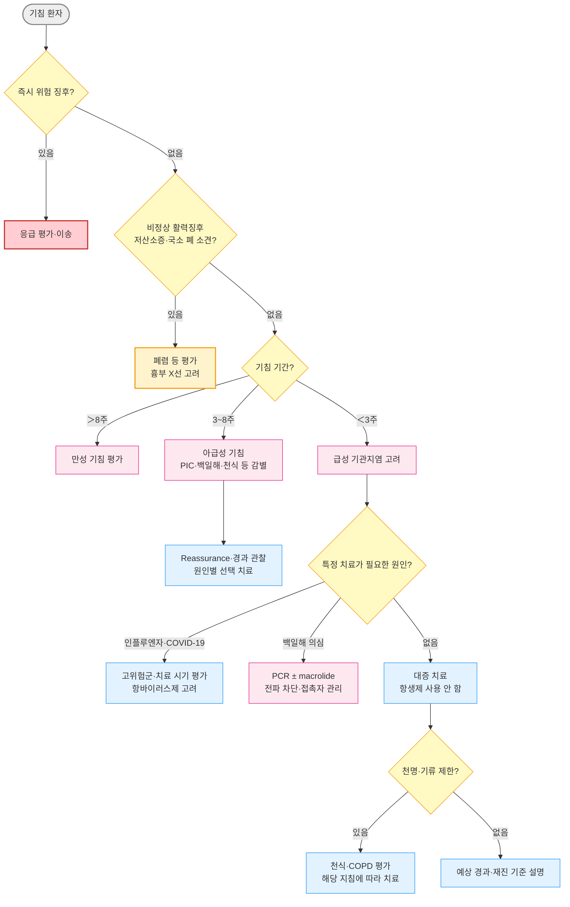

# 급성 기관지염 Acute Bronchitis

## <mark style="color:green;">일반 사항</mark>

* 기침이 주요 증상인 하기도 염증; 폐렴의 영상학적·임상적 증거가 없는 것으로 정의
* 급성 기관지염의 기침은 평균 약 3주 지속 (범위 1\~4주); 환자들은 보통 1주일 내에 낫기를 기대하므로 사전 교육이 중요 (☞ [기침](../220_/006_-cough.md))

### <mark style="color:orange;">기침 기간에 따른 분류</mark>

<table><thead><tr><th width="105.26312255859375">기간</th><th width="216.84210205078125">분류</th><th>핵심 의미</th></tr></thead><tbody><tr><td>＜3주</td><td>급성 기침</td><td>급성 기관지염이 흔하지만 감기·폐렴·인플루엔자·COVID-19·천식 악화 등 감별</td></tr><tr><td>3~8주</td><td>아급성 기침</td><td>감염 후 기침(PIC)이 흔하나 백일해·천식·UACS·GERD 등 감별</td></tr><tr><td>＞8주</td><td>만성 기침</td><td>천식·UACS·GERD·결핵 등 체계적 평가 필요</td></tr></tbody></table>


**PIC (Post-Infectious Cough)** : 호흡기 감염 후 기침이 3\~8주 지속되는 상태. 다른 원인을 배제한 뒤 진단하며 대부분 자연 호전한다. 단순 PIC에는 항생제가 필요하지 않고, reassurance와 경과 관찰·safety-netting이 치료의 핵심이다. 천식 등 기저 기도질환이 없는 환자에서 ICS·기관지확장제의 효과를 뒷받침하는 근거는 충분하지 않다.


## <mark style="color:green;">원인</mark>

* 감염(대부분 바이러스성)
  * 바이러스: rhinovirus, influenza virus, SARS-CoV-2, adenovirus, respiratory syncytial virus(RSV), parainfluenza virus, human metapneumovirus 등
  * 드문 세균성 원인 또는 유사 증후군: _Bordetella pertussis_, _Mycoplasma pneumoniae_, _Chlamydia pneumoniae_
  * _H. influenzae_, _M. catarrhalis_, _S. pneumoniae_ 등은 합병증 없는 급성 기관지염보다 폐렴·COPD 악화 등 별도 진단에서 중요
* 비감염: 화학적·물리적 기도 자극 (오염 물질, 흡연, 유해가스)

### <mark style="color:orange;">위험 인자</mark>

* 겨울·초봄의 호흡기 바이러스 유행, 환자와의 밀접 접촉
* 흡연(능동·수동), 대기 오염·분진·유해가스 노출
* 고령, 면역 저하, 만성 심폐질환은 급성 기관지염 자체보다 폐렴·중증 호흡기감염 위험을 높이므로 낮은 역치로 평가

## <mark style="color:green;">임상 양상</mark>

* 대부분 상기도 전구 증상(코막힘, 인두통, 콧물)으로 시작한 뒤 마른기침 발생
* 마른기침 또는 가래를 동반한 기침; 경과 중 객담이 생기거나 색이 변해도 세균 감염을 의미하지 않음
* 일시적 기관지 과민 반응 양상: 운동·찬 공기 흡입 시 악화; 쉰 목소리 동반 가능
* 기침으로 인한 흉부 불편감; 후비루; 인두 발적
* 청진: 기침으로 맑아지는 rhonchi; 간혹 wheezing
* 전신 증상: malaise, 발열(대부분 미열; 환자의 약 ⅓에서 관찰)
* 정상 활력징후와 국소 경화 소견의 부재는 건강한 성인에서 폐렴 가능성을 낮추지만, 고령자·면역 저하자에서는 비전형적일 수 있음

### <mark style="color:$danger;">🚩 Red Flags!</mark>

<mark style="color:$danger;">**즉각 조치 또는 이송**</mark>

* 심한 호흡 곤란, 호흡 보조근 사용·흉벽 함몰, 청색증, 의식 변화, 혈역학적 불안정
* 산소포화도 ＜94% 또는 평소 기저치보다 유의한 감소(만성 저산소증 환자는 개인 기저치 고려)
* 기도 유지 또는 가스교환을 위협하는 대량 객혈

<mark style="color:$warning;">**당일 또는 조기 의뢰**</mark>

* 빈맥(≥100회/분), 빈호흡(≥24회/분), 체온 ≥38℃ 중 하나라도 있거나 국소 crackle·기관지 호흡음·egophony 등 → 폐렴 평가 및 흉부 X선 고려
* 고령·면역 저하·만성 심폐질환 환자의 전신 상태 또는 호흡기 증상 악화
* 발작성 기침, 흡기성 whoop, 기침 후 구토 또는 백일해 환자 접촉력 → 기침 기간이 2주 미만이어도 백일해 검사·치료 고려
* 지속·반복되는 혈담 또는 체중 감소·야간 발한 동반 → 결핵·폐 종양 등 평가

<mark style="color:$info;">**외래 추적 / 추가 평가 계획**</mark> <mark style="color:$info;">- 즉각 위험 낮으나 호전 없으면 추가 평가</mark>

* 3주 이상 기침 지속 → PIC를 고려하되 백일해·천식·UACS·GERD 등 감별
* 적절한 치료에도 증상 개선 없거나 반복적 기관지염 → 천식, COPD, GERD, UACS
* ACEI 복용 중인 환자 → 약제 유발 기침

## <mark style="color:green;">진단</mark>

* 임상 진단: 급성 기침(대개 3주 이내)이 주 증상이고 폐렴·천식 악화·COPD 악화 등 다른 원인이 확인되지 않는 경우
* 최소 기침 기간 기준은 없으며, 임상 양상·활력징후·신체검사로 대부분 진단
* 건강한 성인에서 활력징후가 정상이고 국소 폐 소견이 없으면 폐렴 가능성이 낮아 영상 검사를 통상 시행하지 않음

### <mark style="color:orange;">검사</mark>

* 보통 불필요 : 신체검사상 폐 소견 및 vital sign이 정상이면 흉부 X선 권고 안 함
* 실험실 검사: 통상 불필요. 폐렴 등 감별이 불확실할 때 CBC·CRP를 선택적으로 시행; 결핵 의심 시 객담 항산균 도말·배양 및 핵산증폭검사
* 흉부 X선: 비정상 활력징후, 저산소증, 국소 폐 소견, 객혈, 호흡 곤란, 전신 상태 악화 또는 결핵·종양 위험이 있을 때 시행
  * 기침이 3주 이상이라는 이유만으로 일률적으로 촬영하지 않으며, 예상 경과를 벗어나 지속·악화되면 임상 위험에 따라 시행
  * 고령자·면역 저하자는 정상 체온 또는 비전형적 증상으로 폐렴이 나타날 수 있어 낮은 역치로 고려
* 백일해 의심 시: 비인두 검체 PCR(대체로 기침 시작 후 3\~4주 이내; 3주 이후 민감도 감소) 또는 배양(첫 2주가 가장 적합, 항생제 전 채취)


**급성 호흡기감염에서 CRP point-of-care 해석**

임상 평가 후 폐렴 여부 또는 항생제 필요성이 불확실할 때 보조적으로 활용한다. 초기 폐렴·고령자·면역 저하자에서는 낮은 CRP만으로 폐렴을 배제하지 않는다.

* CRP ＜20 ㎎/L → 항생제를 통상 처방하지 않음
* CRP 20\~100 ㎎/L → 임상 소견·위험 인자와 종합하여 back-up 항생제 여부 판단
* CRP ＞100 ㎎/L → 즉시 항생제 필요성 및 폐렴·중증 세균 감염 평가; 흉부 X선 고려

　_(단위 주의 : 위 기준은 ㎎/L 단위)_

_<mark style="color:$info;">Ref. NICE NG120, 2019; NICE NG237, 2023</mark>_


### <mark style="color:orange;">감별</mark>

<table><thead><tr><th width="137.894775390625">질환</th><th width="331.5789794921875">시사하는 소견</th><th>비고</th></tr></thead><tbody><tr><td>폐렴</td><td>빈맥(≥100/분), 빈호흡(≥24/분), 체온 ≥38℃ 중 하나 또는 국소 폐음 이상</td><td>흉부 X선 고려</td></tr><tr><td>COVID-19·인플루엔자</td><td>급성 발열·근육통·인후통, 유행 또는 노출력</td><td>결과가 치료·감염 관리에 영향을 주면 항원검사 또는 PCR</td></tr><tr><td>백일해</td><td>발작성 기침, 흡기성 whoop, 기침 후 구토, 환자 접촉력</td><td>기침 2주 미만도 가능; 시기별 PCR·배양</td></tr><tr><td>천식</td><td>반복 기침·wheezing, 운동/알레르겐 유발, 기관지확장제 반응</td><td>안정 후 폐기능 검사 등으로 확인</td></tr><tr><td>감기(URTI)</td><td>콧물·코막힘·재채기 등 코 증상 우세, 기침 경미</td><td>상기도 증상 우세</td></tr><tr><td>COPD 악화</td><td>기저 COPD, 호흡 곤란·기침·객담이 평소보다 악화</td><td>폐렴·심부전·폐색전증 등 감별</td></tr><tr><td>GERD</td><td>식후·야간 기침, 속쓰림, 목이물감</td><td>동반 증상과 전체 임상상에 따라 평가</td></tr><tr><td>약제 유발 기침</td><td>ACEI 복용력, 복용 후 수 주 내 기침 시작</td><td>대체 약제 검토; 중단 후 경과 관찰</td></tr><tr><td>결핵</td><td>＞3주 기침, 발한·체중 감소·혈담, 고위험군</td><td>객담 항산균 도말·배양·핵산증폭검사</td></tr></tbody></table>


녹색 또는 노란 가래 색만으로 바이러스와 세균 감염을 감별할 수 없음 - 화농성 가래가 항생제 처방의 단독 근거가 되어서는 안 됨


#### <mark style="color:$primary;">Bedside 감별표</mark>

<table><thead><tr><th width="105">소견</th><th>급성 기관지염</th><th>폐렴</th><th>천식 악화</th></tr></thead><tbody><tr><td>병태 핵심</td><td>대개 바이러스성 기도 염증</td><td>폐 실질 감염</td><td>가변적 기류 제한</td></tr><tr><td>발병</td><td>URTI 후 점진적</td><td>급성·아급성; 전신 상태 악화 가능</td><td>반복적 / trigger 기반</td></tr><tr><td>기침</td><td>건성 또는 습성</td><td>건성 또는 습성</td><td>건성 ± 야간·운동 유발 기침</td></tr><tr><td>가래 양상</td><td>점액성·화농성 혼재; 색으로 세균 감별 불가</td><td>화농성·혈성 객담 가능; 색만으로 병원체 판별 불가</td><td>점액성·희고 끈적함; 소량 가능</td></tr><tr><td>발열</td><td>없음 또는 미열</td><td>흔하지만 고령자·면역 저하자에서는 없을 수 있음</td><td>드묾</td></tr><tr><td>호흡 곤란</td><td>없거나 경미</td><td>가능</td><td>발작적</td></tr><tr><td>청진</td><td>diffuse rhonchi / wheeze(기침 후 변할 수 있음)</td><td>focal crackle·기관지 호흡음·egophony 등</td><td>diffuse wheeze; 심한 경우 호흡음 감소</td></tr><tr><td>Vital sign</td><td>대개 정상</td><td>빈호흡·빈맥·발열 가능</td><td>중증도에 따라 빈호흡·빈맥</td></tr><tr><td>SpO₂</td><td>대개 정상</td><td>감소 가능</td><td>중증 시 감소</td></tr><tr><td>흉부 X선</td><td>침윤 없음</td><td>새로운 침윤</td><td>대개 정상</td></tr><tr><td>치료 방향</td><td>설명·대증 치료</td><td>중증도 평가 및 원인에 따른 치료</td><td>기관지확장제 등 천식 지침에 따른 치료</td></tr></tbody></table>

***


```mermaid
graph TD
    A([기침 환자]) --> B{즉시 위험 징후?}
    B -- "있음" --> C[응급 평가·이송]
    B -- "없음" --> D{비정상 활력징후<br/>저산소증·국소 폐 소견?}
    D -- "있음" --> E[폐렴 등 평가<br/>흉부 X선 고려]
    D -- "없음" --> F{기침 기간?}
    F -- "＞8주" --> CC[만성 기침 평가]
    F -- "3~8주" --> PIC[아급성 기침<br/>PIC·백일해·천식 등 감별]
    F -- "＜3주" --> G[급성 기관지염 고려]
    PIC --> PIC2[Reassurance·경과 관찰<br/>원인별 선택 치료]
    G --> H{특정 치료가 필요한 원인?}
    H -- "인플루엔자·COVID-19" --> AV[고위험군·치료 시기 평가<br/>항바이러스제 고려]
    H -- "백일해 의심" --> P[PCR ± macrolide<br/>전파 차단·접촉자 관리]
    H -- "없음" --> SUP[대증 치료<br/>항생제 사용 안 함]
    SUP --> SX{천명·기류 제한?}
    SX -- "있음" --> AIR[천식·COPD 평가<br/>해당 지침에 따라 치료]
    SX -- "없음" --> FU[예상 경과·재진 기준 설명]
style A fill:#eeeeee,stroke:#888888,stroke-width:2px
classDef yellow fill:#fff9c4,stroke:#f39c12
class B,D,F,H,SX yellow
classDef pink fill:#fde8f0,stroke:#e91e8c
class CC,PIC,G,P pink
classDef sky fill:#e3f2ff,stroke:#2196f3
class PIC2,AV,SUP,AIR,FU sky
    style C fill:#ffcdd2,stroke:#c62828,stroke-width:2px
    style E fill:#fff3cd,stroke:#f39c12,stroke-width:2px

```

<p align="center"><strong>급성 기관지염 진단 및 치료 알고리듬</strong></p>

***

## <mark style="background-color:$warning;">Management</mark>

### <mark style="color:orange;">치료 원칙</mark>

* 바이러스 감염이 대부분이므로 항생제는 통상 불필요. 지지 치료와 대증 치료를 중심으로 치료

#### <mark style="color:$primary;">항생제 스튜어드십</mark>

* 합병증 없는 급성 기관지염에서 항생제는 기침 기간을 평균 약 0.5일 단축시킬 뿐이며, 내성균 유발·부작용 위험 때문에 급성 기관지염 자체는 항생제 적응증이 아님
* "세균성 기관지염"은 독립적 entity로 거의 인정되지 않음; 화농성 가래는 세균 감염의 신뢰할 수 있는 지표가 아니며(바이러스 감염에서도 발생), 단순 기관지염에서 항생제를 처방하는 근거로 사용해서는 안 됨
* 백일해 확진 또는 강력 의심 시에는 증상 단축보다 전파 차단을 위해 macrolide 사용
* 고령·면역 저하·기저 심폐질환 등 합병증 고위험군에서 전신 상태가 좋지 않거나 경과가 악화되면 폐렴·COPD 악화·기관지확장증 악화 등 구체적 진단을 재평가
  * 폐렴 여부 또는 항생제 필요성이 불확실하면 흉부 X선과 필요 시 CRP를 활용하고, 임상 판단에 따라 즉시 또는 back-up 항생제 고려
  * COPD 급성 악화는 급성 기관지염의 항생제 예외가 아닌 별도 진단이며, 항생제 적응증과 약제는 COPD 지침에 따름


**항생제를 처방하지 않을 때의 설명과 safety-netting**\
"이 기침은 바이러스가 원인이어서 항생제가 효과가 없습니다. 기침은 평균 3주까지 지속될 수 있고, 항생제는 기침 기간을 하루도 의미 있게 줄이지 못하면서 부작용이 생길 수 있습니다. 지금은 증상 완화 치료를 드리고, 만약 3일 후에도 고열이 지속되거나 숨이 차면 다시 오시면 그 때 재평가하겠습니다." - safety-net instruction을 함께 제공하는 것이 환자 만족도를 유지하면서 항생제 처방을 줄이는 데 효과적임


## <mark style="color:green;">비-약물 치료 및 예방</mark>

* 금연 및 호흡기 자극 회피(간접흡연, 유해가스, 분진); 대기 오염 시 외출 자제
* 탈수를 피할 정도의 적절한 수분 섭취; 과도한 수분 섭취가 기침 기간을 줄인다는 근거는 없음
* 가습: 건조한 환경에서 불편감 완화에 도움이 될 수 있으나 근거는 제한적. 가습기 사용 시 매일 물 교체·청결 관리, 과습·곰팡이·세균 번식 주의; 뜨거운 증기 흡입은 화상 위험 때문에 피함
* 꿀(honey): 1세 이상에서 급성 기침의 단기 증상 완화에 제한적인 근거가 있어 선택적으로 시도 가능. 당뇨병·벌꿀 알레르기·열량에 주의하며, 영아 보툴리누스증 위험으로 12개월 미만에서는 금기
* 기저 질환 관리 : 천식, 부비동염, 위식도역류(GERD)
* 예방접종: 연령·위험도에 따라 인플루엔자·COVID-19·폐렴구균·RSV 백신 권고를 확인. 이는 특정 급성 기관지염 치료가 아니라 중증 호흡기감염 예방 목적

## <mark style="color:green;">약물 치료</mark>

### <mark style="color:orange;">해열·진통제</mark>

* ibuprofen: 200\~400 ㎎ q6\~8h prn; 가능한 최저 유효 용량·최단 기간 사용. 신기능 저하·위장관 출혈 위험·심혈관질환·고령자 주의 <mark style="color:blue;">\[부루펜]</mark>
* acetaminophen: 500\~1,000 ㎎ q6\~8h prn; 일반 성인 일일 최대 4,000 ㎎. 간질환·고위험 음주자·쇠약한 고령자는 더 낮은 상한 적용; 타 감기약·복합 진통제와 중복 주의
  * acetaminophen ER 650 ㎎: 1회 2정 q8h, 24시간 최대 6정(3,900 ㎎) <mark style="color:blue;">\[타이레놀 이알]</mark>

### <mark style="color:orange;">진해제</mark>

* 근거 미약 : RCT에서 급성 기관지염에 대한 진해제(dextromethorphan, codeine)의 유의한 효과 미입증; 사용 시 수면 장애·심한 기침에 한해 단기 제한
* dextromethorphan 15\~30 ㎎ q6\~8h prn; 일일 최대 120 ㎎(단기 사용). 과량·남용, 졸림, serotonin syndrome 위험 및 MAOI·serotonergic drug 병용에 주의
  * 국내에서는 주로 acetaminophen·pseudoephedrine·guaifenesin 등이 포함된 복합제로 유통되므로 성분과 총용량을 확인
* levodropropizine 60 ㎎ tid(적어도 6시간 간격; 어지럼·졸림 가능) <mark style="color:blue;">\[드로피진]</mark>
* codeine 제제: 급성 기관지염에서 사용 비권장 (avoid) - 효과 미입증, 호흡 억제 위험(특히 고령자), 남용·의존 우려; 많은 가이드라인에서 완전 기피 권고
  * 국내 허가사항에 따라 12세 미만은 금기이며, 호흡기능이 손상된 12\~18세에서는 사용하지 않음. 제품별 연령 제한 확인

### <mark style="color:orange;">점액 용해제</mark>

* 합병증 없는 급성 기관지염에서 routine use를 권고하지 않음. 임상시험 근거가 제한적이며 기본 처방례에서 제외
* 국내 허가 용량 예: ambroxol 30 ㎎ tid <mark style="color:blue;">\[무코솔반]</mark>, acetylcysteine 200 ㎎ tid <mark style="color:blue;">\[에이스틴]</mark>, erdosteine 300 ㎎ bid <mark style="color:blue;">\[에르도스]</mark>

### <mark style="color:orange;">코 울혈 제거제</mark>

* 부비동 증상 동반 시 제한적 사용 (☞ [감기](060_-common-cold.md#decongestant))
* 비내 울혈제거제 :   phenylephrine <mark style="color:blue;">\[시네프린]</mark>, xylometazoline <mark style="color:blue;">\[오트리빈]</mark> (단기 사용; ≤3일)
* pseudoephedrine : 60 ㎎/T ½\~1T tid\~qid <mark style="color:blue;">\[슈다페드]</mark>
  * 성인 최대 240 ㎎/d; 복합 감기약과 pseudoephedrine 단일제 중복 복용 시 과량 투여 주의

### <mark style="color:orange;">β2-agonist (기관지확장제)</mark>

* 단순 급성 기침에서 routine use 비권장. 천명·가변적 기류 제한이 있으면 천식·COPD 등 기저 기도질환을 평가하고 해당 지침에 따라 사용
* 흡입제(경구제보다 우선): salbutamol(albuterol) 100 ㎍/puff, 1\~2 puff q4\~6h prn <mark style="color:blue;">\[벤토린 에보할러]</mark>
* 진전·심계항진·빈맥·저칼륨혈증 등에 주의. 반복적으로 필요하거나 반응이 불충분하면 진단 재평가

### <mark style="color:orange;">항생제</mark>

* (☞ [호흡기 감염 항생제 선택](093_-antibiotics-respiratory.md))
* 백일해 확진·강력 의심 (전파 차단 목적; 증상 단축 효과는 제한적):
  * azithromycin 500 ㎎ 1일차, 이후 250 ㎎ qd × 4일 (총 5일) <mark style="color:blue;">\[지스로맥스]</mark>
  * clarithromycin 500 ㎎ bid × 7일 <mark style="color:blue;">\[클래리시드]</mark>
  * macrolide 금기 또는 내성 의심 시 TMP-SMX를 고려하되 연령·임신·신기능·약물상호작용 확인
* 유효 항생제 치료 시작 후 5일까지 비말 격리. 치료하지 않으면 기침 시작 후 21일까지 전파 가능
* 가족 및 영아·임산부 등 고위험 밀접 접촉자는 노출 후 예방요법 검토


_Mycoplasma pneumoniae_의 국내 macrolide 내성은 주로 소아 폐렴 자료에서 보고된 것으로, 단순 급성 기관지염에 경험적 macrolide 또는 fluoroquinolone을 처방하는 근거가 아니다. 폐렴이 의심되면 폐렴 지침에 따라 진단·치료한다.


### <mark style="color:orange;">항바이러스제</mark>

* 인플루엔자 의심 시 유행 상황·중증도·합병증 위험과 발병 시점을 평가 (☞ [인플루엔자](069_-influenza.md))
  * 고위험군·진행성 또는 중증 환자·입원 환자: 48시간이 지났더라도 가능한 한 빨리 치료
  * 합병증 위험이 낮은 경증 외래 환자: 증상 발생 48시간 이내이면 임상 판단으로 고려
* oseltamivir : 75 ㎎ bid × 5일 <mark style="color:blue;">\[타미플루]</mark>
  * 신기능 저하 시 치료 용량: CrCl 30\~60 ㎖/min → 30 ㎎ bid, CrCl 10\~30 ㎖/min → 30 ㎎ qd; 혈액투석·복막투석 환자는 제품별 허가사항에 따라 별도 조절
* 음식과 관계없이 복용 가능하나, 음식과 함께 복용하면 구역·구토를 줄일 수 있음
* 인플루엔자 신속항원검사(RAT) 또는 임상 진단 기반으로 처방; 음성이더라도 유행기·고위험군에서 임상적 판단으로 처방 가능
* SARS-CoV-2 감염 가능성이 있고 고위험군이면 치료 가능 기간 내 검사와 항바이러스제 적합성·약물상호작용 평가 (☞ [코로나19](070_1_-covid-19.md))

### <mark style="color:orange;">감염 후 기침과 흡입 치료</mark>&#x20;

* 단순 PIC는 대부분 자연 호전하며, 천식 등 기저 기도질환이 없는 환자에서 ICS·기관지확장제의 routine 사용을 뒷받침하는 근거는 불충분
* 우선 reassurance, 유발 자극 회피, 경과 관찰 및 재진 기준을 설명
* 천명, 반복되는 야간·운동 유발 기침, 가역적 기류 제한 또는 호산구성 염증 등 천식성 기도질환을 시사하는 소견이 있으면 폐기능검사 등을 시행하고 해당 질환 지침에 따라 흡입 치료 고려
* 기침이 8주를 넘거나 새 red flag가 생기면 만성 기침으로 재평가

***

### <mark style="color:red;">질병코드</mark>

J20 급성 기관지염

J20.0 \_Mycoplasma pneumoniae\_에 의한 급성 기관지염

J20.9 상세불명의 급성 기관지염

J68.0 화학물질, 가스, 훈증기 및 물김에 의한 기관지염 및 폐렴

***

## <mark style="color:purple;">처방례</mark>

> **처방례 1. 바이러스성 기관지염 - 기침·발열 동반, 경증**
>
> ```
> 드로피진 60 ㎎/T  3T  #3  (tid, 적어도 6시간 간격)
> 타이레놀 500 ㎎/T  필요시 1~2T  (q6~8h prn)
> ```
>
> _✽ 바이러스성 기관지염 1차: 항생제 없이 필요한 경우에만 단기 대증 치료. 기침이 평균 3주 지속될 수 있음을 사전 설명. 점액용해제는 routine으로 추가하지 않음._

> **처방례 2. 기관지 경련·wheezing 동반 (objective bronchospasm 확인 시)**
>
> ```
> 벤토린 에보할러 100 ㎍/puff  필요시 1\~2 puff  (q4\~6h prn)
> 드로피진 60 ㎎/T  3T  #3  (tid, 적어도 6시간 간격)
> ```
>
> _✽ 단순 기침에는 SABA를 routine으로 사용하지 않음. 반복 천명 또는 가변적 기류 제한이 있으면 천식·COPD를 평가하고 해당 지침에 따라 치료._

> **처방례 3. 백일해 확진 또는 강력 의심 - 성인**
>
> ```
> 지스로맥스 250 ㎎/T  총 6T
> 1일차 2T qd, 2\~5일차 1T qd
> ```
>
> _✽ 주된 목적은 전파 차단. 유효 항생제 치료 시작 후 5일까지 비말 격리하고 밀접 접촉자 중 예방요법 대상 평가._

> **처방례 4. 인플루엔자 의심 - 고위험 성인**
>
> ```
> 타미플루 75 ㎎/cap  2cap  #2  (bid, 5일)
> 드로피진 60 ㎎/T  3T  #3  (tid, 적어도 6시간 간격)    ← 필요시
> 타이레놀 500 ㎎/T  필요시 1~2T  (q6~8h prn)
> ```
>
> _✽ 고위험군·진행성 또는 중증 환자는 발병 48시간이 지났더라도 가능한 한 빨리 투여. 신기능에 따라 감량하며, 음식과 관계없이 복용 가능하나 오심이 있으면 음식과 함께 복용._

***

### <mark style="color:$success;">핵심 복약 지도</mark>

> **항생제를 처방하지 않은 경우**
>
> 이 기침은 바이러스 감염에 의한 것으로, 항생제는 바이러스에 효과가 없습니다. 기침은 평균 3주 정도 지속될 수 있으며, 처방약은 기침과 불편 증상을 완화하기 위한 것입니다. 증상이 3주를 넘거나 고열·호흡 곤란이 생기면 다시 방문해 주십시오.

> **진해제 (드로피진 등)**
>
> 1. 기침이 심해 수면이나 일상생활에 지장이 있을 때 처방된 방법으로 단기간 복용합니다.
> 2. 드로피진(레보드로프로피진)은 적어도 6시간 간격을 두고 복용하며, 어지럼·졸림이 생길 수 있습니다.
> 3. 4\~5일 이상 사용해도 기침이 심하면 재진하십시오.

> **β2-agonist 흡입제 (벤토린 에보할러)**
>
> 1. 의사가 천명·기도 폐쇄를 확인하고 처방한 경우에만 사용합니다(단순 기침에는 사용하지 않음).
> 2. 사용 전 잘 흔들고, 숨을 최대한 내쉰 뒤 흡입기를 입에 물고 천천히 깊게 들이마십니다.
> 3. 흡입 후 10초간 숨을 멈추었다가 내쉽니다.
> 4. **고령자·흡입기 사용이 서투른 환자**: 스페이서(spacer)를 함께 사용하면 폐 도달률이 크게 향상됩니다 - 처방 시 스페이서 제공 또는 사용법 교육 권장.
> 5. 하루 4회 이상 필요하다면 천식을 감별해야 하므로 반드시 재진하십시오.
> 6. 드물게 손 떨림·심계항진이 나타날 수 있습니다.

> **항생제를 처방한 경우**
>
> 1. 처방된 기간을 반드시 완료하십시오. 증상이 좋아져도 임의 중단하지 마십시오.
> 2. 복용법은 처방 지시를 따르십시오. 위장 불편이 있으면 음식과 함께 복용할 수 있습니다.
> 3. 심한 설사, 두드러기, 호흡 곤란 또는 빠르게 진행하는 발진이 생기면 복용을 중단하고 진료받으십시오.
> 4. **신장이 좋지 않은 경우**: 용량 조절이 필요할 수 있으므로 의사에게 반드시 알리십시오.

> **항바이러스제 (타미플루) 복약 지도**
>
> 1. 증상 발생 후 가능한 한 빨리 시작할수록 효과가 큽니다. 고위험군·중증 환자는 48시간이 지났더라도 치료할 수 있습니다.
> 2. 5일 처방 기간을 반드시 완료하십시오.
> 3. 음식과 관계없이 복용할 수 있으나, 구역·구토가 있으면 음식과 함께 복용하십시오.
> 4. 드물게 신경정신과적 부작용(청소년에서 이상행동 등)이 보고된 바 있어 보호자의 관찰이 필요합니다.

> **언제 다시 병원을 방문해야 하나요?**
>
> * **즉시 또는 당일 평가**: 심한 호흡 곤란, 청색증, 의식 변화, 심한 흉통, 많은 객혈, 측정된 산소포화도 저하
> * **조기 재진**: 38℃ 이상의 열이 지속·재발하거나 혈담·전신 상태 악화가 있는 경우
> * **외래 재평가**: 기침이 3주 이상 지속되거나 체중 감소·야간 발한이 동반되는 경우

***

### <mark style="color:blue;">환자 안내서</mark>


**급성 기관지염 - 기침은 길어질 수 있지만, 대부분 저절로 낫습니다**

급성 기관지염은 기관지(폐로 이어지는 공기 통로)에 생긴 염증으로, 대부분 바이러스가 원인입니다. 항생제는 바이러스에 효과가 없으며, 기침은 평균 약 3주까지 지속될 수 있습니다. 처방약은 기침과 불편함을 줄이기 위한 것입니다.


#### <mark style="color:$primary;">왜 기침이 이렇게 오래 지속되나요?</mark>

* 바이러스가 기관지 점막과 기침 반사를 자극하면 다른 증상이 좋아진 뒤에도 기침이 남을 수 있습니다.
* 기침은 보통 2\~3주에 걸쳐 서서히 좋아집니다.
* 3주 이내에 점차 호전되고 새로운 위험 증상이 없다면 흔히 볼 수 있는 경과입니다.

#### <mark style="color:$primary;">집에서 어떻게 관리하나요?</mark>

* **적절히 수분을 섭취하십시오**: 탈수되지 않도록 물·따뜻한 차를 드십시오. 억지로 과도하게 마실 필요는 없습니다.
* **금연**: 흡연은 기관지 염증을 악화시키고 회복을 늦춥니다. 주변 흡연도 피하십시오.
* **실내 환경**: 건조하다면 적절한 습도를 유지할 수 있습니다. 가습기를 사용할 경우 매일 물을 교체하고 청결히 관리하며, 뜨거운 증기 흡입은 화상 위험 때문에 피하십시오.
* **대기 오염·찬 공기**: 미세먼지가 심한 날에는 외출을 자제하고, 마스크를 착용하십시오.
* **꿀**: 따뜻한 물에 소량 타서 마시면 기침 완화에 도움이 될 수 있습니다. 당뇨병이나 벌꿀 알레르기가 있으면 주의하고, **12개월 미만 영아에게는 절대 주지 마십시오**(영아 보툴리누스증 위험).
* **충분한 휴식**: 무리한 활동은 회복을 늦춥니다.

#### <mark style="color:$primary;">처방약은 어떻게 복용하나요?</mark>

* **진해제**: 기침이 심해 잠을 자기 어렵거나 일상생활이 불편할 때 복용합니다. 항생제가 아닙니다.
* **항생제를 처방받지 않은 경우**: 이 기침은 바이러스가 원인이므로 항생제가 필요하지 않습니다. 항생제를 임의로 구입해 드시지 마십시오.
* **항생제를 처방받은 경우**: 증상이 좋아져도 처방 기간을 끝까지 복용하십시오.

#### <mark style="color:$primary;">이럴 때는 즉시 또는 당일 진료를 받으세요</mark>

* 호흡이 매우 빠르거나 숨이 차고, 입술이 파래지거나 의식이 흐려질 때
* 산소포화도를 측정했을 때 낮거나 평소보다 뚜렷하게 떨어질 때
* 심한 가슴 통증 또는 많은 양의 객혈이 생길 때
* 38℃ 이상의 열이 지속·재발하거나 전신 상태가 점점 나빠질 때

#### <mark style="color:$primary;">다시 외래 진료를 받아야 하는 경우</mark>

* 소량이라도 혈담이 반복될 때
* 기침이 3주 이상 지속되거나 점점 심해질 때
* 체중 감소·야간 발한이 동반될 때
* 진해제·기관지확장제가 계속 필요하거나 쌕쌕거림이 반복될 때
