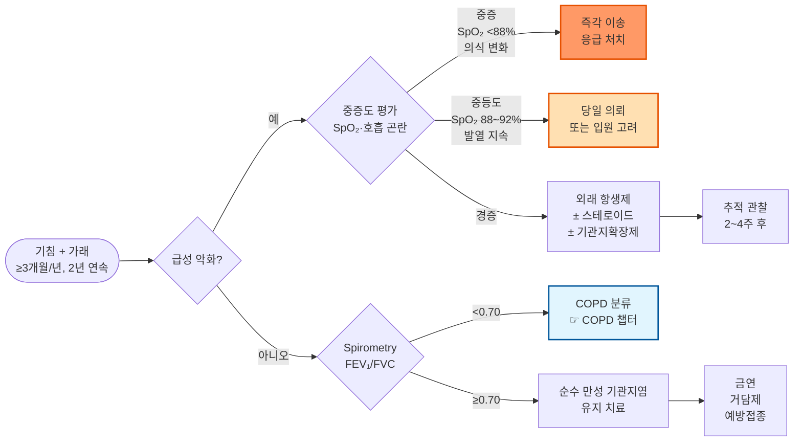

# 만성 기관지염 Chronic Bronchitis

* 임상적 정의 (GOLD 2024) : **2년 연속으로 각각 ≥ 3개월** 동안 거의 매일 기침과 가래가 있는 경우
* 기류 제한이 없는 **순수 만성 기관지염**과, 기류 제한이 동반된 **COPD의 표현형**으로서의 만성 기관지염으로 구분
* 유병률 : 성인의 약 10%; 흡연자에서 3~4배 높음; 45세 이후 남성에서 더 흔함
* 합병증 : 폐렴, 폐기종, 폐성심, 호흡부전

***

## <mark style="color:green;">원인 및 위험 인자</mark>

* **흡연** : 가장 중요한 위험 인자; 현재·과거 흡연자의 약 25%에서 만성 기관지염 발생
* 대기 오염 : 실내(조리·난방 연기), 실외(미세먼지, 이산화황)
* 직업성 분진·화학물질 : 광부, 용접, 목공, 섬유 등
* 반복되는 하기도 감염 : 소아기 폐렴 등 반복 감염
* 유전 요인 : α1-antitrypsin 결핍
* 기도 과민성 : 천식 동반 시 악화 빠름

## <mark style="color:green;">임상 양상</mark>

* **주 증상** : 만성 기침(주로 아침), 점액성·점액농성 가래, 호흡 곤란(운동 시 → 안정 시로 진행)
* **급성 악화 (AECOPD)** : 가래 증가·색 변화(황색·녹색), 기침 악화, 호흡 곤란 악화
  * 경증 악화 : 증상 악화, 활동 제한, 정상 활력 징후
  * 중등도 악화 : 발열, 안정 시 호흡 곤란, SpO₂ 93% 미만
  * 중증 악화 : 의식 변화, SpO₂ < 88%, 보조 호흡근 사용
* **청진** : 호기 연장, 수포음(crackles), 천명음(wheezing)

### <mark style="color:$danger;">🚩 Red Flags!</mark>

<mark style="color:$danger;">**즉각 조치 또는 이송**</mark> <mark style="color:$danger;">— 생명 위협 또는 즉각적 위해 가능성</mark>

* SpO₂ < 88% 또는 급격한 저하
* 의식 변화, 혼수, 심한 혼동
* 호흡 보조근 사용·역설 호흡(역설적 흉복벽 운동)
* 혈역학적 불안정 (저혈압, 빈맥 > 130회/분)
* 동맥혈 가스 분석상 pH < 7.30 (급성 호흡성 산증)

<mark style="color:$warning;">**당일 또는 조기 의뢰**</mark>

* 중등도 악화 : 안정 시 호흡 곤란, SpO₂ 88~92%, 발열 > 38.5°C 지속
* 중증 기저 COPD (FEV₁ < 50%) 환자의 모든 급성 악화
* 항생제 치료 72시간 후에도 호전 없는 경우
* 폐렴·기흉·흉막염 의심 (흉통 동반, 일측 호흡음 감소)

<mark style="color:$info;">**외래 추적 / 추가 평가 계획**</mark> <mark style="color:$info;">— 즉각 위험 낮으나 호전 없으면 의뢰</mark>

* 연 ≥ 2회 급성 악화 반복 → 예방 전략 검토, 호흡기내과 의뢰
* 기류 제한 의심 (운동 시 호흡 곤란 진행) → 폐기능 검사(spirometry) 시행
* 현재 흡연 중 → 금연 상담·약물 지원 연계

## <mark style="color:green;">진단</mark>

* **임상 진단** : 2년 이상 연속으로 각 1년에 ≥ 3개월 기침·가래 기준 충족
* **폐기능 검사 (spirometry)** : 기류 제한 유무 확인 — FEV₁/FVC < 0.70이면 COPD로 분류
* **흉부 X선** : 폐기종·폐렴·기흉 감별
* **가래 배양** : 급성 악화 시 세균 원인균 확인 (농성 가래 동반 시)
* **혈액 검사** : CRP, WBC — 세균 감염 시 상승
* **맥박 산소포화도 (SpO₂)** : 급성 악화 평가에 필수

### <mark style="color:orange;">감별 진단</mark>

<table><thead><tr><th width="155">질환</th><th width="220">주요 감별점</th><th>확인 방법</th></tr></thead><tbody><tr><td>천식</td><td>가역적 기류 제한, 알레르기력, 야간·새벽 악화</td><td>기관지 확장제 반응 검사, 알레르기 검사</td></tr><tr><td>COPD</td><td>비가역적 기류 제한, FEV₁/FVC < 0.70</td><td>Spirometry (기관지 확장제 후)</td></tr><tr><td>기관지 확장증</td><td>다량의 농성 객담, 반복 폐렴, 곤봉지</td><td>흉부 HRCT</td></tr><tr><td>폐결핵</td><td>체중 감소, 야간 발한, 혈담, 결핵 노출력</td><td>흉부 X선, 도말·배양</td></tr><tr><td>폐암</td><td>혈담, 체중 감소, 쉰 목소리, 40세↑ 흡연자</td><td>흉부 CT, 기관지경</td></tr></tbody></table>

***



<p align="center"><strong>만성 기관지염 진단 및 치료 알고리듬</strong></p>

<p align="center"><em><mark style="color:$info;">Ref. GOLD 2024. Global Initiative for Chronic Obstructive Lung Disease.</mark></em></p>

***

## <mark style="background-color:$warning;">Management</mark>


**치료 목표** : 증상 완화 및 삶의 질 개선, 급성 악화 빈도·중증도 감소, 질병 진행(COPD 이행) 억제, 합병증 예방


### <mark style="color:orange;">치료 방침</mark>

* **금연** : 유일한 질병 진행 억제 수단; 모든 환자에서 최우선 개입 (☞ [금연](smoking-cessation.md))
* 기류 제한이 있으면 COPD에 준하여 관리 (☞ [COPD](068_-copd.md))
* 기류 제한이 없어도 연 ≥ 2회 악화 시 장기 관리 필요
* 예방접종 : 매년 인플루엔자; 65세 이상 또는 중증 기저 질환자 — 폐렴구균 접종

## <mark style="color:green;">비-약물 치료 및 예방</mark>

* **금연** : 니코틴 대체 요법, varenicline, bupropion 병용 권고
* **호흡 재활** : 급성 악화 후 4주 이내 시작; 운동 내성 및 삶의 질 개선
* **수분 섭취** : 하루 1.5~2 L 이상 → 기도 점액 희석 및 배출 용이
* **실내 공기질 관리** : 간접흡연 회피, 환기 개선, 공기 청정기 사용
* **호흡 운동** : 복식 호흡, pursed-lip 호흡 — 동적 과팽창 감소

## <mark style="color:green;">약물 치료</mark>

### <mark style="color:orange;">거담제 및 점액용해제</mark>

* ambroxol : 점액 분비 조절 및 섬모 운동 촉진 <mark style="color:blue;">\[뮤코덱스]</mark> 30 ㎎/T bid~tid
* erdosteine : 가래 점도 감소; 산화 스트레스 억제; 급성 악화 예방 효과 확인 (EQUALIFE 연구) <mark style="color:blue;">\[에르도스]</mark> 300 ㎎/T bid
* acetylcysteine : 점액 분해; 고용량(600 ㎎/d)에서 악화 예방 가능성 <mark style="color:blue;">\[뮤코원]</mark> 200 ㎎ tid 또는 600 ㎎ qd (effervescent)

### <mark style="color:orange;">기관지확장제 (급성 악화 시)</mark>

#### <mark style="color:$primary;">속효성 β₂-작용제 (SABA)</mark>

* salbutamol : 기관지 경련 완화; 작용 발현 5분, 지속 4~6시간
  * 흡입기 : <mark style="color:blue;">\[벤토린 에보할러]</mark> 100 ㎍/puff, 2 puffs prn (최대 qid)
  * 네뷸라이저 : <mark style="color:blue;">\[벤토린 네뷸]</mark> **2.5 ㎎/2.5 ㎖/A**, 1 A + saline 2 ㎖ 분무

#### <mark style="color:$primary;">속효성 항콜린제 (SAMA)</mark>

* ipratropium : 기관지 확장; 작용 발현 15분, 지속 6~8시간
  * 흡입기 : <mark style="color:blue;">\[아트로벤트]</mark> 20 ㎍/puff, 2 puffs tid~qid
  * 네뷸라이저 : 250 ㎍/1 ㎖/A 또는 500 ㎍/2 ㎖/A

### <mark style="color:orange;">항생제 (급성 악화 시 세균 감염 의심)</mark>


**항생제 처방 기준 (Anthonisen 기준, 1987)**\
다음 3가지 중 **2가지 이상** 충족 시 항생제 투여 권고\
① 가래 양 증가　② 가래 농도 증가(색 변화)　③ 호흡 곤란 악화


* amoxicillin/clavulanate : 1차 선택; S. pneumoniae, H. influenzae, M. catarrhalis 커버 <mark style="color:blue;">\[오구멘틴]</mark> 375~625 ㎎ tid × 5~7일
* azithromycin : 비정형균 의심 또는 β-lactam 불내성 시 <mark style="color:blue;">\[지스로맥스]</mark> 500 ㎎ qd × 3일 또는 250 ㎎ qd × 5일
* doxycycline : 대안; 비정형균 포함 광범위 커버 100 ㎎ bid × 5~7일

### <mark style="color:orange;">전신 스테로이드 (급성 악화 시)</mark>

* prednisolone : 회복 기간 단축, 치료 실패율 감소; **5일 투여 = 14일과 동등 효과** (REDUCE 연구, NEJM 2013)
  * <mark style="color:blue;">\[소론도]</mark> 30~40 ㎎/d × **5일** (단기 투여; 보험 적용 주의)

***

### <mark style="color:red;">질병코드</mark>

J41 단순성 및 점액화농성 만성 기관지염

J41.0 단순성 만성 기관지염

J41.1 점액화농성 만성 기관지염

J42 상세불명의 만성 기관지염

***

## <mark style="color:purple;">처방례</mark>

> **처방례 1. 급성 악화 — 경증 (세균 감염 의심)**
>
> ```
> 오구멘틴 375 ㎎/T   3T  #3  × 7일
> 소론도 5 ㎎/T        6T  #3  × 5일   (보험 적용 주의)
> 뮤코덱스 30 ㎎/T     3T  #3
> ```
>
> _✽ Anthonisen 기준 2가지 이상 충족 시 항생제 처방. 스테로이드는 5일 단기 처방이 표준(REDUCE 연구). 처방 시 "급성 악화" 명시 권고._

> **처방례 2. 급성 악화 — β-lactam 불내성 또는 비정형균 의심**
>
> ```
> 지스로맥스 500 ㎎/T   1T  #1  × 3일
> 소론도 5 ㎎/T          6T  #3  × 5일
> 뮤코덱스 30 ㎎/T       3T  #3
> ```
>
> _✽ 이전 β-lactam 실패, 페니실린 알레르기, 또는 Mycoplasma/Chlamydia 의심 시 macrolide 우선 선택._

> **처방례 3. 급성 악화 + 기관지 경련 동반 (천명음)**
>
> ```
> 오구멘틴 375 ㎎/T   3T  #3  × 7일
> 소론도 5 ㎎/T        6T  #3  × 5일
> 벤토린 에보할러      2 puffs  필요시 (최대 qid)
> 아트로벤트           2 puffs  tid~qid
> ```
>
> _✽ 기관지 경련(천명음)이 동반될 때 SABA와 SAMA를 병용. 흡입기 사용법을 반드시 교육. SABA 단독보다 병용 시 기관지 확장 효과 우수._

> **처방례 4. 유지기 — 기류 제한 없는 순수 만성 기관지염**
>
> ```
> 에르도스 300 ㎎/T   2T  #2
> ```
>
> _✽ Erdosteine은 급성 악화 예방 효과(연간 악화 횟수 감소)가 RCT에서 확인됨(EQUALIFE 연구). COPD 동반 시 흡입 기관지확장제 추가 (☞ [COPD](068_-copd.md))._

***

### <mark style="color:$success;">핵심 복약 지도</mark>

> **항생제(오구멘틴, 지스로맥스)에 대하여**
>
> 1. 처방된 기간 동안 **끝까지** 복용하십시오. 증상이 좋아져도 중단하면 내성균이 생길 수 있습니다.
> 2. 오구멘틴은 소화 장애가 생길 수 있으니 **식후**에 복용하십시오.
> 3. 지스로맥스는 하루 한 번, 3일 또는 5일만 복용합니다. 72시간 후에도 호전 없거나 악화되면 다시 내원하십시오.

> **스테로이드(소론도)에 대하여**
>
> 1. 급성 악화 회복을 돕기 위해 **단기간(5일)만** 사용합니다. 장기 복용 시 혈당 상승, 골다공증, 면역 저하 등의 부작용이 생깁니다.
> 2. **식후** 복용으로 속쓰림을 줄이십시오.
> 3. 5일 처방이 완료되면 스스로 중단하십시오 — 용량을 늘리거나 기간을 연장하려면 반드시 의사와 상의하십시오.
> 4. 당뇨병이 있는 분은 복용 중 혈당이 일시적으로 높아질 수 있으니 평소보다 혈당 모니터링을 자주 하십시오.

> **흡입제(벤토린, 아트로벤트)에 대하여**
>
> 1. **먼저 숨을 충분히 내쉰 후** 흡입기 구멍을 입에 물고, 깊고 천천히 들이마시면서 동시에 분사하십시오.
> 2. 흡입 후 **10초간 숨을 참았다가** 천천히 내쉬십시오.
> 3. 벤토린은 증상이 있을 때 사용하는 약입니다 — 증상이 없을 때는 매번 사용할 필요가 없습니다.
> 4. 사용 후 입을 헹구면 목의 건조함과 자극감을 줄일 수 있습니다.

> **거담제(뮤코덱스, 에르도스)에 대하여**
>
> 1. 가래를 묽게 하고 배출을 쉽게 도와주는 약입니다.
> 2. 복용 중에는 **물을 하루 1.5 L 이상** 충분히 마시면 효과가 좋아집니다.
> 3. 오심·소화 불쾌감이 생기면 식후에 복용하십시오.

> **언제 다시 병원을 방문해야 하나요?**
>
> * 항생제 복용 72시간 후에도 가래·호흡 곤란이 호전되지 않는 경우
> * 호흡이 더 힘들어지거나 안정 시에도 숨이 찬 경우 — **즉시 내원**
> * 입술이나 손발이 파래지는 경우 (청색증) — **즉시 내원**
> * 발열 38.5°C 이상 지속 또는 흉통이 새로 생기는 경우

***

### <mark style="color:blue;">환자 안내서</mark>


**만성 기관지염, 꾸준한 관리가 핵심입니다**

만성 기관지염은 기관지 점막이 지속적으로 자극·염증을 받아 기침과 가래가 2년 이상 반복되는 상태입니다. 적절히 관리하면 일상 생활이 가능하지만, 방치하면 폐 기능이 점차 나빠져 COPD로 이행될 수 있습니다.


#### <mark style="color:$primary;">왜 만성 기관지염이 생기나요?</mark>

* 가장 흔한 원인은 **흡연**입니다. 담배 연기가 기관지를 반복 자극해 점막이 두꺼워지고 가래 분비가 늘어납니다.
* 오염된 공기, 직업성 분진, 반복되는 호흡기 감염도 원인이 됩니다.
* 시간이 지나면서 기도가 좁아지는 **COPD(만성폐쇄성폐질환)**로 이행될 수 있으므로 조기 관리가 중요합니다.

#### <mark style="color:$primary;">급성 악화를 어떻게 알아차리나요?</mark>

* 평소보다 가래가 **더 많아지거나 노란색·녹색**으로 변하고, 기침과 숨참이 갑자기 나빠지면 급성 악화입니다.
* 세균 감염이 가장 흔한 원인으로, 항생제 치료가 필요한 경우가 많습니다.
* 악화가 반복될수록 폐 기능이 빠르게 저하되므로 **조기에 병원을 방문**하는 것이 중요합니다.


**자가 행동 계획 (Action Plan) — 악화 조기 대처**

| 상태 | 신호 | 대처 |
|------|------|------|
| 평소 | 정상 가래·호흡 | 유지 치료 + 금연 + 예방접종 |
| 경고 | 가래 색 변화·양 증가 | 즉시 내원; 항생제 처방 받기 |
| 위험 | 안정 시 숨참·청색증 | 즉시 응급실 |



#### <mark style="color:$primary;">일상생활에서 어떻게 관리하나요?</mark>

* **금연이 가장 중요합니다.** 금연만으로도 기침·가래가 줄고 폐 기능 악화 속도를 늦출 수 있습니다. 혼자 어렵다면 금연 상담과 보조약을 도움받으십시오.
* **물을 충분히** 드십시오 (하루 1.5~2 L). 가래가 묽어져 배출이 쉬워집니다.
* 미세먼지가 많은 날은 외출을 자제하고 마스크를 착용하십시오.
* 실내 환기를 자주 하고 간접흡연 환경을 피하십시오.
* **매년 독감(인플루엔자) 예방접종**을 받으십시오. 감염으로 인한 악화를 예방합니다.
* 65세 이상이거나 폐 기능이 나쁜 분은 **폐렴구균 예방접종**도 받으십시오.

#### <mark style="color:$primary;">이럴 때는 즉시 병원을 방문하세요</mark>

* 안정 상태에서도 숨이 차거나 입술·손발이 파래지는 경우
* 발열이 38.5°C를 넘고 2~3일 이상 지속되는 경우
* 항생제 복용 3일 후에도 가래와 호흡 곤란이 호전되지 않는 경우
* 가래에 피가 섞여 나오는 경우 (혈담)
