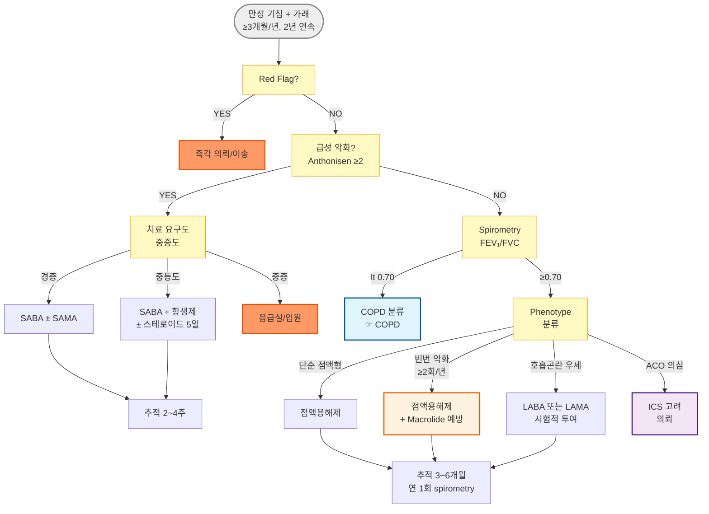

# 만성 기관지염 Chronic Bronchitis

* 임상적 정의 : **2년 연속으로 각각 ≥ 3개월** 동안 거의 매일 기침과 가래가 있는 상태
* 만성 기관지염은 독립 질환이라기보다 **만성 기도 질환 스펙트럼(chronic airway disease spectrum) 상의 증상 phenotype**으로 이해해야 함
  * 정상 폐기능(spirometry)에서도 만성 기관지염이 있으면 향후 **FEV₁ 감소 속도 증가·COPD 이행 위험 상승** (코호트 연구)
  * 기류 제한이 동반되면 COPD의 표현형으로 분류됨
* 유병률 : 성인의 약 **5~15%** (지역·흡연율에 따라 차이); 45세 이후 남성에서 더 흔함
* 합병증 : 폐렴, 폐기종, 폐성심, 호흡부전, 폐암 위험 증가

***

## <mark style="color:green;">원인 및 위험 인자</mark>

* **흡연** : 가장 중요한 위험 인자; 현재·과거 흡연자의 약 25%에서 발생
* 대기 오염 : 실내(조리·난방 연기), 실외(미세먼지, 이산화황)
* 직업성 분진·화학물질 : 광부, 용접, 목공, 섬유 등
* 반복되는 하기도 감염 (소아기 폐렴 등)
* 유전 요인 : α₁-antitrypsin 결핍
* 기도 과민성 : 천식 동반 시 악화 가속

## <mark style="color:green;">임상 양상</mark>

* **주 증상** : 만성 기침(주로 아침), 점액성·점액농성 가래, 호흡 곤란(운동 시 → 안정 시로 진행)
* **청진** : 호기 연장, 수포음(crackles), 천명음(wheezing)

### <mark style="color:orange;">급성 악화 (AECOPD) 중증도 분류</mark>


**급성 악화 판단 (Anthonisen 기준)** : 기침·가래·호흡 곤란 중 **≥ 2가지**가 악화될 때 급성 악화로 판단합니다.\
중증도는 **치료 요구도(treatment requirement)** 기준으로 분류합니다. SpO₂는 중증도 판단에 보조적으로 활용하되 단독 기준으로 사용하지 않습니다.


<table><thead><tr><th width="100">중증도</th><th width="260">치료 요구도 기준</th><th>SpO₂ 참고</th></tr></thead><tbody><tr><td>경증</td><td>SABA 단독으로 조절 가능; 활동 제한은 있으나 안정 시 호흡 곤란 없음</td><td>≥ 93%</td></tr><tr><td>중등도</td><td>SABA + 항생제 ± 전신 스테로이드 필요; 외래 치료 가능</td><td>88~92%</td></tr><tr><td>중증</td><td>응급실 방문 또는 입원 필요; 안정 시 호흡 곤란·보조 호흡근 사용</td><td>< 88%</td></tr></tbody></table>

### <mark style="color:$danger;">🚩 Red Flags!</mark>

<mark style="color:$danger;">**즉각 조치 또는 이송**</mark> <mark style="color:$danger;">- 생명 위협 또는 즉각적 위해 가능성</mark>

* SpO₂ 급격 저하 또는 안정 시 < 88%
* 의식 변화, 혼수, 심한 혼동
* 호흡 보조근 사용·역설 호흡(역설적 흉복벽 운동)
* 혈역학적 불안정 (저혈압, 빈맥 > 130회/분)
* 동맥혈 가스 분석상 pH < 7.30 (급성 호흡성 산증)

<mark style="color:$warning;">**당일 또는 조기 의뢰**</mark>

* 중등도 이상 악화 : 안정 시 호흡 곤란, 발열 > 38.5°C 지속
* 중증 기저 COPD (FEV₁ < 50%) 환자의 모든 급성 악화
* 항생제 치료 72시간 후에도 호전 없는 경우
* **신규 혈담(hemoptysis)** - 폐암·결핵 등 악성·감염성 원인 반드시 배제
* 폐렴·기흉·흉막염 의심 (흉통 동반, 일측 호흡음 감소)

<mark style="color:$info;">**외래 추적 / 추가 평가 계획**</mark> <mark style="color:$info;">- 즉각 위험 낮으나 호전 없으면 의뢰</mark>

* 연 ≥ 2회 급성 악화 반복 → 예방 전략 검토, 호흡기내과 의뢰
* 기류 제한 의심 (운동 시 호흡 곤란 진행) → spirometry 시행
* 현재 흡연 중 → 금연 상담·약물 지원 연계

## <mark style="color:green;">진단</mark>

* **임상 진단** : 2년 이상 연속으로 각 1년에 ≥ 3개월 기침·가래 기준 충족
* **폐기능 검사 (spirometry)** : 기류 제한 유무 확인 필수


**FEV₁/FVC 해석 주의**\
고정 비율(fixed ratio) FEV₁/FVC < 0.70 기준만 사용하면 **고령에서 과진단, 젊은 환자에서 과소진단** 가능성이 있습니다. 최근 경향은 **GLI(Global Lung Function Initiative) 예측식을 활용한 LLN(lower limit of normal)** 기준을 권장하므로, 해석이 불확실한 경우 호흡기내과에 의뢰하십시오.


* **흉부 X선** : 폐기종·폐렴·기흉 감별; 기본 검사로 시행
* **흉부 CT 고려** : 아래 상황에서 시행
  * 혈담(hemoptysis) 동반
  * 비대칭적 천명음
  * 체중 감소·야간 발한
  * 치료에 반응하지 않는 난치성 증상
  * 기관지 확장증 의심
* **가래 배양** : 급성 악화 시 세균 원인균 확인 (농성 가래 동반 시)
* **혈액 검사** : CRP, WBC (세균 감염 시 상승); **혈중 호산구(blood eosinophil)** - 스테로이드 반응성 예측에 활용
* **CAT 점수 (COPD Assessment Test)** : 증상 부하 객관화; 초진 시 baseline으로 측정하고 추적에 활용 (8점 이상 = 중등도 이상 증상 부하)


**폐암 검진 (LDCT) 대상 여부 확인**\
54~74세이고 흡연력 ≥ 30갑년(pack-year)인 경우 **국가 폐암 검진(저선량 흉부 CT, LDCT)** 대상입니다. 만성 기관지염 진단 시 해당 여부를 반드시 확인하고 안내하십시오.


### <mark style="color:orange;">감별 진단</mark>


다음 상황에서 감별 진단을 적극 고려하십시오: **비흡연자에서 천명음**, **발병 3주 이내 급성 경과**, **정상 spirometry인데 증상이 심함**, **삽화성 호흡 곤란**, **발열이 뚜렷한 경우**, **식후·누웠을 때 기침 악화 (GERD 의심)**, **후비루·목 이물감 동반 (UACS 의심)**


<table><thead><tr><th width="155">질환</th><th width="235">주요 감별점</th><th>확인 방법</th></tr></thead><tbody><tr><td>급성 기관지염</td><td>급성 경과 (< 3주), 상기도 감염 후, 자연 호전</td><td>임상 경과 추적</td></tr><tr><td>COPD</td><td>흡연력 + 지속 호흡 곤란 + 비가역적 기류 제한</td><td>Spirometry (기관지확장제 후)</td></tr><tr><td>천식</td><td>가변적 기류 제한, 알레르기력, 야간·새벽 악화</td><td>가역성 검사, 알레르기 검사</td></tr><tr><td>천식-COPD 중복 (ACO)</td><td>천식력 + 흡연 + 기류 제한; ICS 반응성 ↑</td><td>Spirometry + 알레르기 검사 + eos</td></tr><tr><td>상기도 기침 증후군 (UACS)</td><td>후비루, 목의 이물감·헛기침; 흡연과 무관할 수 있음</td><td>비경·인후두 검사, 항히스타민제 반응</td></tr><tr><td>위식도 역류 질환 (GERD)</td><td>식후·누웠을 때 기침 악화, 속쓰림; 가래 없음</td><td>임상 증상, PPI 시험적 투여 반응</td></tr><tr><td>기관지 확장증</td><td>다량 농성 객담, 반복 폐렴, 곤봉지</td><td>흉부 HRCT</td></tr><tr><td>폐결핵</td><td>체중 감소, 야간 발한, 혈담, 결핵 노출력</td><td>흉부 X선, 도말·배양</td></tr><tr><td>폐암</td><td>혈담, 체중 감소, 쉰 목소리, 40세↑ 흡연자</td><td>흉부 CT, 기관지경</td></tr></tbody></table>

***



<p align="center"><strong>만성 기관지염 4-Step 진단·치료 알고리듬</strong></p>

<p align="center"><em><mark style="color:$info;">Ref. GOLD 2024. Global Initiative for Chronic Obstructive Lung Disease; ERS 2023.</mark></em></p>

***

## <mark style="background-color:$warning;">Management</mark>


**치료 목표** : 증상 완화 및 삶의 질 개선, 급성 악화 빈도·중증도 감소, COPD 이행 억제, 합병증 예방


### <mark style="color:orange;">치료 방침</mark>

* **금연** : 유일한 질병 진행 억제 수단; 모든 환자에서 최우선 개입 (☞ [금연](smoking-cessation.md))
* 기류 제한이 있으면 COPD에 준하여 관리 (☞ [COPD](068_-copd.md))
* 기류 제한이 없어도 연 ≥ 2회 악화 시 장기 관리 전략 수립 필요
* **예방접종** : 매년 인플루엔자 백신; 65세 이상 또는 만성 폐 질환자 - 폐렴구균 접종

## <mark style="color:green;">비-약물 치료 및 예방</mark>

* **금연** : 니코틴 대체 요법, varenicline, bupropion 병용 권고
* **호흡 재활** : 급성 악화 후 4주 이내 시작; 운동 내성·삶의 질 개선
* **수분 섭취** : 하루 1.5~2 L 이상 → 기도 점액 희석 및 배출 용이
* **흡입기 교육 (특히 고령 환자)** : 흡입기 조작 실패가 흔함; 스페이서 사용·네뷸라이저 전환 고려
* **실내 공기질 관리** : 간접흡연 회피, 환기 개선, 공기 청정기 사용
* **호흡 운동** : 복식 호흡, pursed-lip 호흡 - 동적 과팽창 감소

## <mark style="color:green;">약물 치료</mark>

### <mark style="color:orange;">거담제 및 점액용해제</mark>


**처방 적응증** : 만성 가래가 지속되거나 연간 급성 악화 ≥ 2회인 환자에서 사용. Erdosteine과 N-acetylcysteine은 악화 빈도 감소에 관한 RCT 근거 있음 (ERS/NICE).


* ambroxol : 점액 분비 조절 및 섬모 운동 촉진 <mark style="color:blue;">\[뮤코덱스]</mark> 30 ㎎/T bid~tid
* erdosteine : 가래 점도 감소 + 항산화; 악화 감소 효과 (EQUALIFE 연구) <mark style="color:blue;">\[에르도스]</mark> 300 ㎎/T bid
* acetylcysteine (NAC) : 점액 분해 + 항산화; **고용량 1,200 ㎎/d(600 ㎎ bid)에서 악화 예방 효과** (PANTHEON 연구) <mark style="color:blue;">\[뮤코원]</mark> 200 ㎎ tid (표준용량) 또는 600 ㎎ effervescent bid (고용량, 악화 예방 목적)

### <mark style="color:orange;">기관지확장제 - 급성 악화 시</mark>

#### <mark style="color:$primary;">속효성 β₂-작용제 (SABA)</mark>

* salbutamol : 기관지 경련 완화; 작용 발현 5분, 지속 4~6시간
  * 흡입기 : <mark style="color:blue;">\[벤토린 에보할러]</mark> 100 ㎍/puff, 2 puffs prn (최대 qid)
  * 네뷸라이저 : <mark style="color:blue;">\[벤토린 네뷸]</mark> **2.5 ㎎/2.5 ㎖/A**, 1 A + saline 2 ㎖ 분무

#### <mark style="color:$primary;">속효성 항콜린제 (SAMA)</mark>

* ipratropium : 기관지 확장; 작용 발현 15분, 지속 6~8시간
  * 흡입기 : <mark style="color:blue;">\[아트로벤트]</mark> 20 ㎍/puff, 2 puffs tid~qid
  * 네뷸라이저 : 250 ㎍/1 ㎖/A 또는 500 ㎍/2 ㎖/A

### <mark style="color:orange;">기관지확장제 - 유지 치료 (증상 지속 시)</mark>


**LABA/LAMA 유지 치료** : 기류 제한이 없어도 증상(호흡 곤란·천명)이 지속되는 경우 LABA 또는 LAMA를 시험적으로 투여할 수 있습니다. **ICS 단독 사용은 권장하지 않습니다** (폐렴 위험 증가).


* 증상 지속 + 호흡 곤란 우세 → LABA 또는 LAMA 시험적 투여 (☞ [COPD 흡입제](068_-copd.md#inhaler))
* 천식-COPD 중복(ACO) 의심 (천식력 + 기류 제한 + eosinophilia) → ICS 포함 요법 고려; 호흡기내과 의뢰

### <mark style="color:orange;">Macrolide 장기 예방 요법 (빈번 악화 환자)</mark>


⚠️ **빈번 악화(≥ 2회/년) 환자**에서 azithromycin 저용량 장기 투여가 악화 빈도 감소 효과가 있습니다. **GOLD 가이드라인은 기류 제한이 있는 COPD 환자**를 주요 대상으로 합니다. 기류 제한이 없는 순수 만성 기관지염에서는 근거가 상대적으로 적으므로, 이 경우 증상 부하와 악화 빈도를 종합적으로 판단하여 처방하십시오. 부작용 모니터링이 필수이며, **활동성 결핵 배제 후** 처방합니다.


* azithromycin 250 ㎎ qd 또는 500 ㎎ 3회/주 (장기 투여)
  * **모니터링** : 청력 검사 (청력 저하 위험), 심전도 (QTc 연장 위험), 결핵 배제
  * MAC(비결핵 항산균) 감염 배제 고려
  * 현재 흡연 중인 환자에서는 효과 감소

### <mark style="color:orange;">항생제 - 급성 악화 시 세균 감염 의심</mark>


**항생제 처방 기준 (Anthonisen 기준)**\
다음 3가지 중 **≥ 2가지** 충족 시 항생제 투여 권고\
① 가래 양 증가　② **가래 농성 변화 ★** (세균 감염을 시사하는 가장 강력한 지표; 이 항목이 포함된 2가지 이상 충족 시 처방 강력 권고)　③ 호흡 곤란 악화\
※ 가래 색 변화만으로는 불충분하나 농성 변화가 동반된 경우 세균 감염 가능성이 유의하게 높습니다.


#### <mark style="color:$primary;">항생제 역치를 낮춰야 하는 고위험군</mark>

다음 중 하나 이상 해당 시 항생제 처방 결정을 적극 고려:

* 연령 ≥ 65세
* FEV₁ < 50% (중증 이상 기류 제한)
* 연간 악화 ≥ 2회
* 심혈관계 동반 질환

#### <mark style="color:$primary;">Pseudomonas 위험군 - 항생제 선택 변경 필요</mark>

다음 요인이 있는 경우 항녹농균 커버 항생제 선택 및 호흡기내과 협진:

* 잦은 항생제 사용력 (최근 3개월 내 ≥ 2회)
* 중증 COPD (FEV₁ < 30%)
* 기관지 확장증 동반

#### <mark style="color:$primary;">항생제 선택</mark>

* amoxicillin/clavulanate : 1차 선택; S. pneumoniae, H. influenzae, M. catarrhalis 커버 <mark style="color:blue;">\[오구멘틴]</mark> 375~625 ㎎ tid × 5~7일
* azithromycin : 비정형균 의심 또는 β-lactam 불내성 시 <mark style="color:blue;">\[지스로맥스]</mark> 500 ㎎ qd × 3일 또는 250 ㎎ qd × 5일
* doxycycline : 대안; 비정형균 포함 광범위 커버 100 ㎎ bid × 5~7일

### <mark style="color:orange;">전신 스테로이드 - 급성 악화 시 (선택적 사용)</mark>


**모든 급성 악화에 routine 처방하지 않습니다.** 중등도 이상 악화 또는 기관지확장제에 반응 불충분 시 사용. **혈중 호산구 ≥ 300/μL인 eosinophilic phenotype**에서 반응성이 더 좋습니다.


* prednisolone : 회복 기간 단축, 치료 실패율 감소; **5일 투여 = 14일과 동등 효과** (REDUCE 연구, NEJM 2013)
  * <mark style="color:blue;">\[소론도]</mark> 30~40 ㎎/d × **5일**
  * 💡 **보험 실무 팁** : J41·J42 단독 상병으로 고용량 처방 시 삭감 사례 있음 → **급성 악화 상병(J44.1 등)을 병기**하거나 "급성 악화" 진료 기록을 명확히 남길 것

***

### <mark style="color:red;">질병코드</mark>

J41 단순성 및 점액화농성 만성 기관지염

J41.0 단순성 만성 기관지염

J41.1 점액화농성 만성 기관지염

J42 상세불명의 만성 기관지염

***

## <mark style="color:purple;">처방례</mark>

> **처방례 1. 급성 악화 - 경증·중등도 (세균 감염 의심, 표준)**
>
> ```
> 오구멘틴 375 ㎎/T   3T  #3  × 7일
> 소론도 5 ㎎/T        6T  #3  × 5일   (보험 적용 주의)
> 뮤코덱스 30 ㎎/T     3T  #3
> ```
>
> _✽ Anthonisen 기준 ≥ 2가지 충족 시 항생제 처방; 가래 농성 변화 포함 시 처방 강력 권고. 스테로이드는 중등도 이상 악화 또는 기관지확장제 불충분 반응 시 추가 (5일 단기; REDUCE 연구). 고위험군(≥ 65세, FEV₁ < 50%, 심혈관 동반)에서는 항생제 적극 투여. **소론도 고용량 처방 시 급성 악화 상병(J44.1 등) 병기 권장** (삭감 예방)._

> **처방례 2. 급성 악화 - β-lactam 불내성 또는 비정형균 의심**
>
> ```
> 지스로맥스 500 ㎎/T   1T  #1  × 3일
> 소론도 5 ㎎/T          6T  #3  × 5일
> 뮤코덱스 30 ㎎/T       3T  #3
> ```
>
> _✽ 이전 β-lactam 실패, 페니실린 알레르기, 또는 Mycoplasma/Chlamydia 의심 시._

> **처방례 3. 급성 악화 + 기관지 경련 동반 (천명음)**
>
> ```
> 오구멘틴 375 ㎎/T   3T  #3  × 7일
> 소론도 5 ㎎/T        6T  #3  × 5일
> 벤토린 에보할러      2 puffs  prn  (최대 qid)
> 아트로벤트           2 puffs  tid~qid
> ```
>
> _✽ 천명음 동반 시 SABA와 SAMA 병용; 단독보다 기관지 확장 효과 우수. 흡입기 사용법 반드시 교육. 고령·흡입기 조작 어려운 경우 네뷸라이저 전환 고려._

> **처방례 4. 유지기 - 순수 만성 기관지염 (빈번 악화 없음)**
>
> ```
> 에르도스 300 ㎎/T   2T  #2
> ```
>
> _✽ 만성 가래 지속·악화 예방 목적. COPD 동반 시 흡입 기관지확장제 추가 (☞ COPD 챕터)._

> **처방례 5. 유지기 - 빈번 악화 환자 (≥ 2회/년)**
>
> ```
> 에르도스 300 ㎎/T    2T  #2
> 지스로맥스 250 ㎎/T  1T  #1  (주 3회 장기 투여)
> ```
>
> _✽ Macrolide 장기 예방 요법은 기류 제한이 있는 COPD 환자에서 근거가 더 확립되어 있음. 기류 제한이 없는 순수 만성 기관지염에서는 증상 부하와 악화 빈도를 종합 판단하여 처방. 시작 전 활동성 결핵 배제 필수. 처방 후 1·3·6개월 주기로 청력 및 QTc 모니터링. 현재 흡연 중이면 효과 감소._

***

### <mark style="color:$success;">핵심 복약 지도</mark>

> **항생제(오구멘틴, 지스로맥스)에 대하여**
>
> 1. 처방된 기간 동안 **끝까지** 복용하십시오. 증상이 좋아져도 중단하면 내성균이 생길 수 있습니다.
> 2. 오구멘틴은 소화 장애가 생길 수 있으니 **식후**에 복용하십시오.
> 3. 지스로맥스는 하루 한 번, 3일 또는 5일만 복용합니다. 72시간 후에도 호전 없거나 악화되면 다시 내원하십시오.

> **스테로이드(소론도)에 대하여**
>
> 1. 급성 악화 회복을 돕기 위해 **단기간(5일)만** 사용합니다. 장기 복용 시 혈당 상승, 골다공증, 면역 저하 등의 부작용이 생깁니다.
> 2. **식후** 복용으로 속쓰림을 줄이십시오.
> 3. 5일 처방이 완료되면 스스로 중단하십시오. 기간을 연장하려면 반드시 의사와 상의하십시오.
> 4. 당뇨병이 있으신 분은 복용 중 혈당이 일시적으로 높아질 수 있으니 혈당 모니터링을 자주 하십시오.

> **흡입제(벤토린, 아트로벤트)에 대하여**
>
> 1. **먼저 숨을 충분히 내쉰 후** 흡입기 구멍을 입에 물고, 깊고 천천히 들이마시면서 동시에 분사하십시오.
> 2. 흡입 후 **10초간 숨을 참았다가** 천천히 내쉬십시오.
> 3. 벤토린은 증상이 있을 때 사용하는 약입니다. 증상이 없을 때는 매번 사용할 필요가 없습니다.
> 4. 사용 후 입을 헹구면 목의 건조함과 자극감을 줄일 수 있습니다.

> **거담제(뮤코덱스, 에르도스)에 대하여**
>
> 1. 가래를 묽게 하고 배출을 쉽게 도와주는 약입니다.
> 2. 복용 중에는 **물을 하루 1.5 L 이상** 충분히 마시면 효과가 좋아집니다.
> 3. 오심·소화 불쾌감이 생기면 식후에 복용하십시오.

> **장기 예방 항생제(지스로맥스 주 3회)에 대하여**
>
> 1. 폐 감염이 반복되는 것을 예방하기 위해 처방된 약입니다. 증상이 없어도 꾸준히 복용하십시오.
> 2. 이 약은 심장 리듬에 영향을 줄 수 있어 **정기적인 심전도·청력 검사**가 필요합니다.
> 3. 귀에서 소리가 나거나 청력이 떨어지는 느낌이 생기면 즉시 내원하십시오.

> **언제 다시 병원을 방문해야 하나요?**
>
> * 항생제 복용 72시간 후에도 가래·호흡 곤란이 호전되지 않는 경우
> * 호흡이 더 힘들어지거나 안정 시에도 숨이 찬 경우 - **즉시 내원**
> * 입술이나 손발이 파래지는 경우 (청색증) - **즉시 내원**
> * 가래에 피가 섞이는 경우 (혈담) - **빠른 시일 내 내원**
> * 발열 38.5°C 이상 지속 또는 흉통이 새로 생기는 경우

***

### <mark style="color:blue;">환자 안내서</mark>


**만성 기관지염, 꾸준한 관리가 핵심입니다**

만성 기관지염은 기관지 점막이 지속적으로 자극·염증을 받아 기침과 가래가 2년 이상 반복되는 상태입니다. 단순한 증상처럼 보이지만 방치하면 폐 기능이 점차 나빠져 COPD(만성폐쇄성폐질환)로 진행될 수 있습니다.


#### <mark style="color:$primary;">왜 만성 기관지염이 생기나요?</mark>

* 가장 흔한 원인은 **흡연**입니다. 담배 연기가 기관지를 반복 자극해 점막이 두꺼워지고 가래 분비가 늘어납니다.
* 오염된 공기, 직업성 분진, 반복되는 호흡기 감염도 원인이 됩니다.
* 시간이 지나면서 **COPD**로 이행될 수 있으므로 조기 관리가 중요합니다.

#### <mark style="color:$primary;">급성 악화를 어떻게 알아차리고 대처하나요?</mark>

* 평소보다 가래가 **더 많아지거나 노란색·녹색으로 변하고**, 기침과 숨참이 갑자기 나빠지면 급성 악화입니다.
* 세균 감염이 가장 흔한 원인으로, 항생제 치료가 필요한 경우가 많습니다.
* 악화가 반복될수록 폐 기능이 빠르게 저하되므로 **조기에 병원을 방문**하는 것이 중요합니다.


**자가 행동 계획 (Action Plan) - 악화 조기 대처**

<table><thead><tr><th width="90">상태</th><th width="220">신호</th><th>대처</th></tr></thead><tbody><tr><td>평소</td><td>정상 가래·호흡</td><td>유지 치료 + 금연 + 예방접종</td></tr><tr><td>경고</td><td>가래 색 변화·양 증가, 숨참 악화</td><td>즉시 내원; 항생제 처방 받기</td></tr><tr><td>위험</td><td>안정 시 숨참·청색증·의식 변화</td><td>즉시 응급실</td></tr></tbody></table>


#### <mark style="color:$primary;">일상생활에서 어떻게 관리하나요?</mark>

* **금연이 가장 중요합니다.** 금연만으로도 기침·가래가 줄고 폐 기능 악화 속도를 늦출 수 있습니다. 혼자 어렵다면 금연 상담과 보조약을 이용하십시오.
* **물을 충분히** 드십시오 (하루 1.5~2 L). 가래가 묽어져 배출이 쉬워집니다.
* 미세먼지가 많은 날은 외출을 자제하고 마스크를 착용하십시오.
* 실내 환기를 자주 하고 간접흡연 환경을 피하십시오.
* **매년 독감 예방접종**을 받으십시오. 65세 이상이거나 폐 기능이 나쁘신 분은 **폐렴구균 예방접종**도 받으십시오.

#### <mark style="color:$primary;">이럴 때는 즉시 병원을 방문하세요</mark>

* 안정 상태에서도 숨이 차거나 입술·손발이 파래지는 경우
* 가래에 피가 섞여 나오는 경우
* 항생제 복용 3일 후에도 가래와 호흡 곤란이 호전되지 않는 경우
* 발열이 38.5°C를 넘고 2~3일 이상 지속되거나 흉통이 새로 생기는 경우
