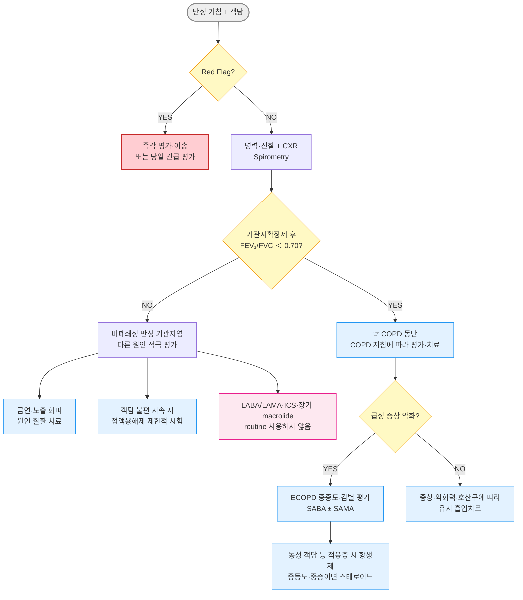

# 만성 기관지염 Chronic Bronchitis

* 임상적 정의 : 다른 원인으로 설명되지 않는 만성 기침과 객담이 2년 연속으로 각각 연간 ≥ 3개월 동안 지속되는 상태
* 만성 기관지염은 임상적 증상 표현형으로, 폐활량검사가 정상인 환자에서도 발생할 수 있음
  * 기관지확장제 후 FEV₁/FVC ＜ 0.70의 지속성 기류 제한이 동반되면 COPD의 만성 기관지염 표현형으로 분류
  * 기류 제한이 없는 만성 기관지염도 향후 폐 기능 저하·COPD 발생 및 호흡기 사건 위험 증가와 연관되므로 추적 필요
* 유병률은 정의, 연령, 흡연 및 환경 노출에 따라 크게 다름. 흡연자에서 흔하지만 비흡연자에서도 발생 가능
* 만성 객담 과분비는 폐 기능 저하, 호흡기 감염·악화 및 삶의 질 저하와 연관되지만, 폐기종·폐암·폐성심 등을 만성 기관지염 자체의 직접 합병증으로 단정하지 않음

## <mark style="color:green;">원인 및 위험 인자</mark>

* 흡연 : 가장 중요한 교정 가능 위험 인자. 궐련 외 전자담배·가열담배 등 흡입 노출도 확인
* 대기 오염 : 실내 조리·난방 연기, 실외 미세먼지·대기오염
* 직업성 분진·흄·화학물질 : 광업, 용접, 목공, 섬유·건설업 등
* 소아기 중증 호흡기 감염 및 폐 성장 저하 병력
* 천식, 기관지확장증, 위식도 역류 등 만성 기침·객담을 유발하거나 악화시키는 질환
* α₁-antitrypsin 결핍은 만성 기관지염 자체보다 조기 발생 폐기종·COPD의 위험 인자이므로, 젊은 COPD·비흡연 COPD·기저부 우세 폐기종·가족력에서 평가

## <mark style="color:green;">임상 양상</mark>

* 주 증상 : 만성 기침, 점액성 또는 점액농성 객담
* 호흡 곤란·천명·운동능력 저하는 COPD, 천식, 기관지확장증 또는 심폐질환 동반 가능성을 시사
* 청진은 정상일 수 있으며 호기 연장, 천명음, 거친 호흡음 또는 수포음이 들릴 수 있음

### <mark style="color:orange;">증상의 급성 악화</mark>

* **COPD가 확인된 환자** : COPD 급성 악화(exacerbation of COPD, ECOPD)는 수일에 걸쳐(통상 ≤ 14일) 호흡 곤란 및/또는 기침·객담이 평소보다 악화되는 사건으로, 빈호흡·빈맥이 동반될 수 있음
* **기류 제한이 확인되지 않은 환자** : 증상이 급격히 악화되어도 곧바로 ECOPD로 진단하지 않고 급성 기관지염, 폐렴, 천식, 기관지확장증 악화, 폐색전증, 심부전, 기흉 등을 평가
* 고전적 Anthonisen 3대 증상은 호흡 곤란 증가, 객담량 증가, 객담 농성 증가이며, 급성 악화의 확진기준이라기보다 항생제 필요성 판단에 참고
* ECOPD 중증도는 투여한 약제나 입원 여부만으로 분류하지 않고 호흡 곤란 정도, 호흡수, 심박수, SaO₂, 의식상태와 필요 시 CRP·동맥혈 가스 분석을 종합하여 평가

### <mark style="color:$danger;">🚩 Red Flags!</mark>

<mark style="color:$danger;">**즉각 조치 또는 이송**</mark>

* 새로 발생한 안정 시 심한 호흡 곤란, 문장 단위 대화 불가, 청색증
* SpO₂의 급격한 저하 또는 안정 시 ＜ 88% — 단, 환자의 평소 수치와 산소치료 여부를 함께 판단
* 의식 변화, 심한 혼동, 졸림
* 호흡 보조근 사용, 역설적 흉복벽 운동, 호흡 피로
* 혈역학적 불안정, 새로 발생한 중증 부정맥
* 다량 객혈 또는 객혈과 호흡 곤란·저산소증·혈역학적 이상 동반
* 동맥혈 가스 분석상 급성 호흡성 산증 또는 환기부전

<mark style="color:$warning;">**당일 긴급 평가 또는 조기 의뢰**</mark>

* 안정 시 호흡 곤란, 호흡수·심박수의 뚜렷한 증가, 지속되는 고열
* 흉통, 편측 호흡음 감소 — 폐렴·기흉·폐색전증·급성 심장질환 감별
* 새로 발생한 소량 객혈, 원인 불명의 체중 감소·야간 발한
* 중증 COPD 또는 재택 산소치료 환자에서 평소보다 뚜렷한 증상 악화
* 초기 치료 48～72시간 후에도 호전이 없거나 악화

<mark style="color:$info;">**외래 추적 / 추가 평가 계획**</mark> <mark style="color:$info;">- 즉각 위험은 낮으나 원인 평가 필요</mark>

* 연간 중등도 이상 호흡기 악화가 반복되거나 입원을 요한 악화 병력
* 진행하는 운동 시 호흡 곤란, 산소포화도 저하 또는 기류 제한 의심
* 금연이 어렵거나 직업·환경 노출이 지속됨
* 만성 다량 농성 객담 또는 반복 폐렴 — 기관지확장증 평가

## <mark style="color:green;">진단</mark>

* 임상 진단 : 다른 원인을 배제한 후 2년 연속으로 각각 연간 ≥ 3개월 동안 지속되는 기침·객담
* 병력 : 흡연력(pack-year), 전자담배·가열담배, 직업·환경 노출, 복용약(ACE 억제제 등), 천식·알레르기, 역류, 반복 감염·결핵 병력 확인
* 폐기능 검사(spirometry) : COPD·천식 등 기류 제한 유무를 확인하기 위해 시행
  * COPD는 임상적으로 의심되는 환자에서 **기관지확장제 후 FEV₁/FVC ＜ 0.70**으로 확인
  * 고정비율은 고령에서 과진단, 젊은 환자에서 과소진단 가능성이 있으므로 경계값에서는 검사 반복, 검사 품질, 증상·노출 및 GLI-LLN을 함께 고려
* 흉부 X선 : 만성 기침의 기본 평가로 폐렴, 종괴, 결핵, 심부전 및 기타 구조적 질환 감별
* 흉부 CT 고려 : 혈담, 비대칭적 국소 천명음, 체중 감소·야간 발한, 반복 폐렴, 다량 농성 객담, 기관지확장증 의심, 흉부 X선 이상 또는 치료에 반응하지 않는 증상
* 객담 검사 : 모든 환자에게 routine으로 시행하지 않음
  * 반복되는 농성 객담, 기관지확장증, 중증 기류 제한, 잦은 악화, 최근 항생제 사용, 과거 Pseudomonas 검출 또는 초기 치료 실패 시 일반 세균 배양
  * 결핵·비결핵항산균 의심 시 항산균 도말·배양 및 분자검사
* 혈액 검사 : 임상 상황에 따라 CBC, CRP. 혈중 호산구는 COPD의 ICS 반응 가능성 평가에 활용할 수 있으나 만성 기관지염이나 천식을 단독 진단하지 못함
* CAT(COPD Assessment Test) : COPD가 확인된 환자의 증상 부하·추적에 활용; 통상 CAT ≥ 10을 높은 증상 부하의 기준으로 사용


**폐암 검진(LDCT) 대상 여부 확인** : 국가폐암검진은 54～74세 중 문진표 등으로 확인된 ≥ 30갑년 현재 흡연 고위험군을 대상으로 2년마다 시행합니다. 기존 국가폐암검진 대상자가 검진 후 금연한 경우에는 금연 15년 이내이면서 74세까지 대상에 포함될 수 있으므로 국민건강보험공단 대상 여부를 확인합니다. 혈담·체중 감소 등 증상이 있으면 검진 대상 여부와 관계없이 진단적 평가를 시행합니다.


### <mark style="color:orange;">감별 진단</mark>

<table><thead><tr><th width="155">질환</th><th width="235">주요 감별점</th><th>확인 방법</th></tr></thead><tbody><tr><td>급성 기관지염</td><td>급성 경과, 상기도 감염 후 발생, 대부분 자연 호전</td><td>임상 경과, 필요 시 폐렴 배제</td></tr><tr><td>COPD</td><td>노출력, 지속 호흡 곤란·기침·객담, 지속성 기류 제한</td><td>기관지확장제 후 spirometry</td></tr><tr><td>천식</td><td>증상과 기류 제한의 변동성, 야간·새벽 악화, 유발인자</td><td>Spirometry 가역성, PEF 변동성 등</td></tr><tr><td>천식과 COPD 동반</td><td>천식의 임상적 특징과 COPD의 지속성 기류 제한이 함께 존재</td><td>각 질환의 진단기준으로 평가; 호산구만으로 진단하지 않음</td></tr><tr><td>상기도 기침 증후군(UACS)</td><td>비증상, 후비루감, 목 이물감·헛기침</td><td>비강·인후두 평가, 원인별 치료 반응</td></tr><tr><td>위식도 역류 질환(GERD)</td><td>속쓰림·산 역류, 식후 또는 누울 때 악화</td><td>전형적 역류증상 평가; 필요 시 추가검사</td></tr><tr><td>기관지확장증</td><td>만성 다량 농성 객담, 반복 폐렴, 객혈</td><td>흉부 HRCT, 객담 배양</td></tr><tr><td>폐결핵·비결핵항산균증</td><td>체중 감소, 야간 발한, 혈담, 노출력 또는 구조적 폐질환</td><td>흉부 영상, 객담 도말·배양·분자검사</td></tr><tr><td>폐암</td><td>새로운 기침 변화, 혈담, 체중 감소, 쉰 목소리, 흡연력</td><td>흉부 CT, 필요 시 기관지경·조직검사</td></tr><tr><td>심부전</td><td>기좌호흡, 야간 호흡 곤란, 부종, 수포음</td><td>BNP/NT-proBNP, 심전도, 심초음파 등</td></tr></tbody></table>

***


```mermaid
graph TD
    A([만성 기침 + 객담]) --> B{Red Flag?}
    B -- YES --> C[즉각 평가·이송<br/>또는 당일 긴급 평가]
    B -- NO --> D[병력·진찰 + CXR<br/>Spirometry]
    D --> E{기관지확장제 후<br/>FEV₁/FVC ＜ 0.70?}
    E -- YES --> F[☞ COPD 동반<br/>COPD 지침에 따라 평가·치료]
    E -- NO --> G[비폐쇄성 만성 기관지염<br/>다른 원인 적극 평가]
    G --> H[금연·노출 회피<br/>원인 질환 치료]
    G --> I[객담 불편 지속 시<br/>점액용해제 제한적 시험]
    G --> J[LABA/LAMA·ICS·장기 macrolide<br/>routine 사용하지 않음]
    F --> K{급성 증상 악화?}
    K -- YES --> L[ECOPD 중증도·감별 평가<br/>SABA ± SAMA]
    K -- NO --> M[증상·악화력·호산구에 따라<br/>유지 흡입치료]
    L --> N[농성 객담 등 적응증 시 항생제<br/>중등도·중증이면 스테로이드]
style A fill:#eeeeee,stroke:#888888,stroke-width:2px
classDef yellow fill:#fff9c4,stroke:#f39c12
class B,E,K yellow
classDef L_red fill:#ffcdd2,stroke:#c62828,stroke-width:2px
class C L_red
classDef sky fill:#e3f2ff,stroke:#2196f3
class F,H,I,L,M,N sky
style J fill:#fde8f0,stroke:#e91e8c
```

<p align="center"><strong>만성 기관지염 진단·치료 알고리듬</strong></p>

***

## <mark style="background-color:$warning;">Management</mark>

### <mark style="color:orange;">치료 방침</mark>

* 치료 목표 : 기침·객담과 삶의 질 개선, 원인 노출 제거, COPD 및 구조적 폐질환 확인, COPD 동반 시 악화 예방
* 금연 및 유해 흡입 노출 회피가 가장 중요한 개입 (☞ [금연](../230_/190_-smoking.md))
* 기류 제한이 확인되면 COPD에 준하여 관리 (☞ [COPD](072_-copd.md))
* 기류 제한이 없으면 COPD 흡입제·전신 스테로이드·항생제를 경험적으로 장기 투여하지 않고 다른 원인과 동반 질환을 치료
* 예방접종 : 연령·기저질환·국내 권고에 따라 인플루엔자, 코로나19, 폐렴구균, RSV 등 접종 여부 확인 (☞ [예방접종](../250_/210_-vaccination.md))

## <mark style="color:green;">비-약물 치료 및 예방</mark>

* 금연 치료 : 행동 상담과 함께 니코틴 대체요법, varenicline 또는 bupropion 중 환자에게 적절한 약제를 선택; 필요한 경우 근거가 있는 병합요법 고려
* 직업·환경 노출 감소 : 작업장 환기·보호구, 간접흡연 회피, 미세먼지 고농도 노출 최소화
* 수분 섭취 : 탈수를 피하도록 하되 일률적으로 1.5～2 L 이상을 강제하지 않음. 심부전·신장질환 등 수분 제한이 필요한 환자는 기저질환 지침을 우선
* 객담 배출 교육 : 효과적인 기침법. 매일 다량 객담이 있으면 기관지확장증 등 원인을 평가하고, 선택적으로 oscillating PEP 등 기도청결요법 고려
* 흡입기 교육 : COPD·천식으로 흡입제를 사용하는 경우 기기별 사용법과 순응도를 반복 확인. pMDI 사용이 어려우면 스페이서 등 적절한 전달기구를 선택하며 네뷸라이저가 일률적으로 우월하지는 않음
* 호흡 재활 : 기능 제한이 있는 COPD, 특히 입원을 요한 악화 후 조기에 고려; 정상 spirometry인 단순 만성 기관지염에 일률 적용하지 않음

## <mark style="color:green;">약물 치료</mark>

### <mark style="color:orange;">거담제 및 점액용해제</mark>

* 금연·노출 회피와 원인 평가 후에도 불편한 객담이 지속될 때 제한적으로 시험할 수 있음
* 점액용해제는 만성 기관지염 또는 COPD에서 악화를 소폭 줄이고 삶의 질을 약간 개선할 수 있으나 연구 간 이질성이 크며 효과는 제한적
* erdosteine : 점액용해·항산화 작용. <mark style="color:blue;">[에르도스, 뮤코원]</mark> 300 ㎎/T bid — 제품별 허가사항 확인
* acetylcysteine(NAC) : 점액용해·항산화 작용. 200 ㎎ tid 등 제품별 허가사항에 따라 투여
  * 고용량 600 ㎎ bid의 악화 예방 효과는 연구 결과가 일관되지 않으므로 모든 환자에게 routine으로 권고하지 않음
* 일정 기간 사용 후 객담·기침·삶의 질의 임상적 이득이 없으면 중단


만성 기관지염을 현저하고 일관되게 개선하는 특정 약물은 아직 없습니다. 기관지 내 cryospray, rheoplasty, targeted lung denervation 등은 연구 단계이며 routine 진료에 사용하지 않습니다.


### <mark style="color:orange;">기관지확장제</mark>

* 기류 제한이 없는 만성 기관지염에서 LABA 또는 LAMA를 증상 치료 목적으로 routine 시험 투여하지 않음
* COPD가 확인되면 증상과 악화력에 따라 LABA/LAMA 등 유지 흡입치료를 선택 (☞ [COPD](072_-copd.md#undefined-10))
* 천식이 동반되면 천식 지침에 따라 ICS 포함 치료. 호산구 증가만으로 천식-COPD 동반을 진단하거나 ICS를 시작하지 않음

### <mark style="color:orange;">COPD 급성 악화 시 기관지확장제</mark>

* SABA를 초기 기관지확장제로 사용하고 임상 상황에 따라 SAMA 병용
* salbutamol : <mark style="color:blue;">[벤토린 에보할러]</mark> 100 ㎍/puff, 1～2 puffs prn; 반복 사용 횟수는 악화 중증도와 허가사항에 따라 조절
* ipratropium : <mark style="color:blue;">[아트로벤트엔에어로솔]</mark> 20 ㎍/puff, 제품별 허가사항에 따라 투여
* 중증 악화 또는 pMDI 사용이 어려운 상황에서는 네뷸라이저 제형을 고려

### <mark style="color:orange;">항생제 — COPD 급성 악화에서 선택적 사용</mark>

* 비폐쇄성 만성 기관지염의 단순 증상 악화나 객담 색 변화만으로 항생제를 routine 처방하지 않음
* COPD 급성 악화에서 다음 상황이면 항생제 고려:
  * 호흡 곤란 증가, 발열, 객담량 증가, 객담 농성 증가 중 ≥ 2가지가 있으며 **객담 농성 증가가 포함**
  * 이전 악화에서 임상적으로 의미 있는 양성 객담배양 병력
  * 비침습 또는 침습 기계환기 필요
* 항생제는 지역 내성률, 최근 항생제 사용, 과거 배양 결과, 알레르기와 동반 질환을 고려하여 선택
* 외래 치료 기간은 통상 5일. 48～72시간 후 반응을 확인
* 객담배양은 잦은 악화, 중증 기류 제한, 기계환기, 기관지확장증, 과거 Pseudomonas 검출 또는 치료 실패에서 시행

#### <mark style="color:$primary;">외래 항생제 예시</mark>

* amoxicillin/clavulanate : <mark style="color:blue;">[오구멘틴]</mark> 625 ㎎ tid × 5일 — 신기능 및 제품별 허가사항 확인
* doxycycline : 100 ㎎ bid × 5일 — 임신·수유 및 금기 확인
* azithromycin : <mark style="color:blue;">[지스로맥스]</mark> 500 ㎎ qd × 3일 — QT 연장·약물상호작용과 국내 내성률 고려

### <mark style="color:orange;">전신 스테로이드 — COPD 급성 악화</mark>

* 비폐쇄성 만성 기관지염의 악화에 routine으로 사용하지 않음
* COPD의 중등도·중증 급성 악화에서 회복 기간과 치료 실패를 줄이기 위해 사용
* prednisolone : 30～40 ㎎ **1일 1회** × 5일 <mark style="color:blue;">[소론도]</mark>
* 혈중 호산구 ≥ 300/μL를 급성기 전신 스테로이드의 확정적 투여 기준으로 사용하지 않음
* 5일 단기요법은 일반적으로 감량 없이 종료할 수 있으나, 최근 반복 투여·장기 스테로이드 복용·부신기능저하 위험은 별도 평가

### <mark style="color:orange;">Macrolide 장기 예방 요법</mark>

* 기류 제한이 없는 순수 만성 기관지염에는 표준치료로 권고하지 않음
* 금연과 적절한 COPD 유지 흡입치료에도 악화가 지속되는 일부 COPD 환자, 특히 현재 비흡연자에서 호흡기내과 협진하에 고려
* 시작 전 심전도(QTc), 간기능, 청각 증상·위험, 약물상호작용 및 객담 항산균 검사를 포함한 결핵·비결핵항산균증 가능성 평가
* 사용 중 임상적 이득, QTc, 간기능, 청각 이상, 내성균 및 비결핵항산균을 모니터링
* azithromycin 250 ㎎ qd 또는 500 ㎎ 주 3회가 최대 1년간 연구되었으며, 1년을 넘는 효과·안전성 근거는 없음

***

### <mark style="color:red;">질병코드</mark>

J41 단순성 및 점액화농성 만성 기관지염

J41.0 단순성 만성 기관지염

J41.1 점액화농성 만성 기관지염

J42 상세불명의 만성 기관지염


J44.1은 급성 악화를 동반한 COPD 코드입니다. 폐활량검사와 임상 소견으로 COPD가 확인되지 않은 순수 만성 기관지염 환자에게 보험 적용을 목적으로 추가하지 않습니다.


***

## <mark style="color:purple;">처방례</mark>

> **처방례 1. 비폐쇄성 만성 기관지염 — 불편한 객담에 대한 단기 시험**
>
> ```
> 에르도스 300 ㎎/T   2T  #2  × 14일
> ```
>
> _✽ 금연·노출 회피와 다른 원인 평가가 우선입니다. 임상적 이득이 없으면 관성적으로 장기 처방하지 않습니다._

> **처방례 2. COPD 급성 악화 — 기관지 경련, 항생제 적응증 없음**
>
> ```
> 벤토린 에보할러      1～2 puffs  prn
> 아트로벤트엔에어로솔  제품별 허가사항에 따라 투여
> ```
>
> _✽ 객담 농성 증가 등 세균성 악화 소견이 없으면 항생제를 일률적으로 추가하지 않습니다. 흡입 횟수가 빠르게 증가하거나 효과가 짧으면 즉시 재평가합니다._

> **처방례 3. COPD 급성 악화 — 항생제 적응증 충족**
>
> ```
> 오구멘틴 625 ㎎/T    3T  #3  × 5일
> 벤토린 에보할러      1～2 puffs  prn
> ```
>
> _✽ 객담 농성 증가가 포함된 임상 증상 조합, 과거 배양 결과, 최근 항생제와 지역 내성률을 확인합니다. 48～72시간 후 호전이 없으면 폐렴·내성균·기관지확장증 등 다른 원인을 재평가합니다._

> **처방례 4. COPD 중등도 급성 악화 — 전신 스테로이드 추가**
>
> ```
> 소론도 5 ㎎/T         8T  #1  qAM  × 5일
> 벤토린 에보할러       1～2 puffs  prn
> ```
>
> _✽ Prednisolone은 40 ㎎을 아침에 1회 복용합니다. 항생제는 별도의 적응증이 있을 때만 추가합니다. 당뇨병, 최근 반복 스테로이드 투여 및 부작용 위험을 확인합니다._

***

### <mark style="color:$success;">핵심 복약 지도</mark>

> **항생제(오구멘틴, 지스로맥스)에 대하여**
>
> 1. 처방된 용량과 기간을 지켜 복용하고 남은 약을 보관하거나 다른 사람과 나누어 복용하지 마십시오.
> 2. 오구멘틴은 식사 시작 시 복용하면 위장 불편을 줄일 수 있습니다.
> 3. 심한 설사, 전신 발진·호흡 곤란 등 이상반응이 나타나면 복용을 중단하고 즉시 진료받으십시오.
> 4. 48～72시간 후에도 호전되지 않거나 악화되면 다시 내원하십시오.

> **스테로이드(소론도)에 대하여**
>
> 1. 아침 식후에 처방된 1일 용량을 한 번에 복용합니다.
> 2. 급성 악화 회복을 위해 단기간(통상 5일)만 사용하며 임의로 기간을 연장하지 마십시오.
> 3. 당뇨병이 있으면 복용 중 혈당이 일시적으로 높아질 수 있으므로 혈당을 더 자주 확인하십시오.

> **pMDI 흡입제(벤토린, 아트로벤트)에 대하여**
>
> 1. 흡입기를 흔들고 숨을 충분히 내쉰 뒤, 천천히 깊게 들이마시기 시작하면서 한 번 분사하십시오.
> 2. 가능한 약 10초간 숨을 참은 뒤 천천히 내쉬십시오. 추가 흡입이 필요하면 제품 지침에 따른 간격을 두십시오.
> 3. 흡입 횟수가 평소보다 급격히 늘거나 효과가 오래 지속되지 않으면 악화 신호일 수 있으므로 즉시 진료받으십시오.

> **점액용해제(에르도스테인 등)에 대하여**
>
> 1. 객담을 묽게 하여 배출을 돕는 약입니다.
> 2. 탈수되지 않도록 적절히 수분을 섭취하되, 심장·신장질환으로 수분 제한 중이면 담당 의사의 지시를 따르십시오.
> 3. 일정 기간 사용해도 객담이나 기침이 개선되지 않으면 계속 복용하지 말고 진료 시 상의하십시오.

> **언제 다시 병원을 방문해야 하나요?**
>
> * 안정 시에도 숨이 차거나 입술·손발이 파래지는 경우 — **즉시 응급실**
> * 의식이 흐려지거나 문장 단위로 말하기 어려운 경우 — **즉시 응급실**
> * 많은 피를 토하거나 혈담과 호흡 곤란·어지럼이 동반되는 경우 — **즉시 응급실**
> * 소량이라도 새로 혈담이 생긴 경우 — **당일 또는 조기 평가**
> * 치료 48～72시간 후에도 호전되지 않거나 고열·흉통이 새로 생기는 경우

***

### <mark style="color:blue;">환자 안내서</mark>


**만성 기관지염은 원인 확인과 금연이 핵심입니다**

만성 기관지염은 다른 원인 없이 기침과 가래가 2년 연속으로 해마다 3개월 이상 지속되는 상태입니다. 폐 기능이 정상일 수도 있지만 일부에서는 COPD와 함께 나타나므로 폐활량검사로 확인하는 것이 중요합니다.


#### <mark style="color:$primary;">왜 만성 기관지염이 생기나요?</mark>

* 가장 중요한 원인은 흡연입니다. 전자담배·가열담배와 간접흡연도 기관지를 자극할 수 있습니다.
* 미세먼지, 조리·난방 연기, 직업성 분진·화학물질도 영향을 줄 수 있습니다.
* 천식, 기관지확장증, 역류질환, 결핵 등 다른 질환이 비슷한 증상을 일으킬 수 있으므로 원인 평가가 필요합니다.

#### <mark style="color:$primary;">증상이 갑자기 나빠지면 어떻게 하나요?</mark>

* 평소보다 숨이 차거나 기침·가래가 갑자기 늘고 객담이 농성으로 변하면 진료받으십시오.
* 증상 악화는 바이러스·세균 감염, 대기오염 또는 다른 심폐질환으로 생길 수 있습니다.
* 누런 가래가 있다고 모두 항생제가 필요한 것은 아닙니다. 진찰 후 폐렴 여부와 항생제 필요성을 판단합니다.


**자가 행동 계획(Action Plan)**


<table><thead><tr><th width="90">상태</th><th width="220">신호</th><th>대처</th></tr></thead><tbody><tr><td>평소</td><td>평소 수준의 기침·가래·호흡</td><td>금연, 노출 회피, 처방된 유지치료와 예방접종</td></tr><tr><td>경고</td><td>가래 양·농성 증가, 숨참·기침 악화, 발열</td><td>의료진에게 연락하거나 조기에 내원하여 원인과 치료 필요성 평가</td></tr><tr><td>위험</td><td>안정 시 심한 숨참, 청색증, 의식 변화, 다량 객혈</td><td>즉시 119 또는 응급실</td></tr></tbody></table>

#### <mark style="color:$primary;">일상생활에서 어떻게 관리하나요?</mark>

* **금연이 가장 중요합니다.** 혼자 어렵다면 금연 상담과 금연치료 약물을 이용하십시오.
* 간접흡연과 직업성 분진·연기 노출을 줄이고, 미세먼지 고농도 시에는 노출을 최소화하십시오.
* 탈수를 피할 정도로 수분을 섭취하십시오. 심부전·신장질환으로 수분 제한 중이면 담당 의사의 지시를 우선합니다.
* 연령과 기저질환에 따라 독감, 코로나19, 폐렴구균, RSV 등 필요한 예방접종을 확인하십시오.
* 처방받지 않은 항생제·스테로이드·흡입제를 임의로 사용하지 마십시오.

#### <mark style="color:$primary;">이럴 때는 즉시 병원을 방문하세요</mark>

* 안정 상태에서도 숨이 차거나 입술·손발이 파래지는 경우
* 의식이 흐려지거나 말하기 어려울 정도로 숨이 찬 경우
* 많은 피를 토하거나 혈담과 호흡 곤란·어지럼이 함께 나타나는 경우
* 흉통, 한쪽 가슴의 갑작스러운 통증 또는 호흡 곤란이 새로 생기는 경우

