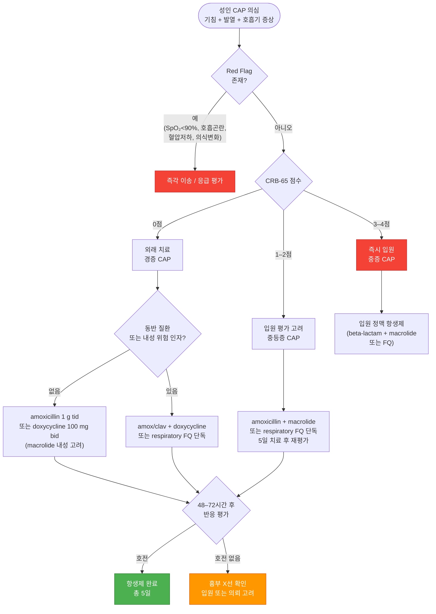

# 폐렴 Pneumonia

## <mark style="color:green;">일반 사항</mark>

* 감염 등에 의해 발생하는 terminal bronchiole 이하 폐 실질 조직의 염증성 질환
* 경과 : 보통 상기도 감염 발생 수일 후 발병 → 2주 내 회복
  * 적절한 치료 시 건강한 환자의 회복 기간 : 발열/빈호흡 3일, 백혈구 수준 4일, 기침/피로감 2주, 흉부 X선 1달
* 재발성 폐렴 : 영상 검사로 진단된 폐렴이 총 ≥3회 또는 ≥2회/년 발생; 기저 질환 감별을 요함

***

## <mark style="color:green;">원인</mark>

* 바이러스 감염 : 폐렴의 \~40% 차지 (소아에서는 \~90% 차지)
  * influenza, adenovirus, parainfluenza, **coronavirus (SARS-CoV-2 포함)**, RSV
* 세균 감염
  * typical (세균의 85%) : _S. pneumoniae_, _H. influenzae_, _S. aureus_, GAS, _M. catarrhalis_
  * atypical (세균의 15%) : _Legionella_ sp., _M. pneumoniae_, _C. pneumoniae_
* 기타 : 흡인(이물, 위산), 알레르기, 약물, 방사선 치료

### <mark style="color:orange;">상황별 주요 원인 세균</mark>

<table><thead><tr><th width="220">상황</th><th>주요 원인균</th></tr></thead><tbody><tr><td>장기 입원, 보호시설 거주자</td><td>그람음성 균주 (예: 녹농균)</td></tr><tr><td>COPD, 흡연</td><td><em>H. influenzae</em>, <em>P. aeruginosa</em>, <em>Legionella</em>, <em>S. pneumoniae</em></td></tr><tr><td>음주</td><td><em>S. pneumoniae</em>, 혐기성균, 그람음성균, 결핵균</td></tr><tr><td>젊은 성인, 여름/가을</td><td><em>M. pneumoniae</em></td></tr><tr><td>냉방 노출</td><td><em>Legionella</em></td></tr><tr><td>흡인, 불결한 치아 위생</td><td>혐기성, mixed flora</td></tr></tbody></table>

### <mark style="color:orange;">위험 인자</mark>

* 흡연
* 영양 결핍, 면역 저하
* 집단생활
* ＜5세, ＞65세
* 최근(6개월 내) 항생제 치료, 항생제 내성
* 최근 입원(90일 내 ≥2일)
* 기저 질환 : 만성 폐질환(천식, COPD, 기관지확장증), 흡인성 질환(GERD), PPI 장기 복용, 만성 심/신/간 질환, 당뇨병, 신경계 질환, 알코올 남용, 무비증, 악성 종양

***

## <mark style="color:green;">임상 양상</mark>

* 호흡기 : 기침, 가래, 호흡 곤란, (심호흡 시) 흉부 불편감 또는 통증; crackle, rale, rhonchi, 비대칭 호흡음, egophony, 타진상 둔탁음
* 소화기 : 구역, 구토, 설사, 복통
* 전신 : 빈맥, 발열, 피로, 두통, 근육통
  * 고령에서는 발열 등의 임상 증상이 뚜렷하지 않을 수 있음

### <mark style="color:orange;">비전형성 폐렴 (Mycoplasma)</mark>

* 마른기침, 가벼운 인두염, 미열, 오한, 설사 등 가벼운 증상으로 시작
* 호흡 곤란은 드묾, 초기에 청진 소견이 뚜렷하지 않음


**국내 _M. pneumoniae_ macrolide 내성 주의**\
국내 _M. pneumoniae_ macrolide 내성률은 소아에서 70–90%, 성인에서도 높게 보고됨. 비정형 폐렴 의심 시 macrolide에 반응하지 않으면 doxycycline 또는 respiratory fluoroquinolone으로 전환을 고려.


### <mark style="color:$danger;">🚩 Red Flags!</mark>

<mark style="color:$danger;">**즉각 이송 또는 응급 평가**</mark>

* 중등도 이상의 호흡 곤란 (빈호흡 ≥30/분, 늑간 함몰, 청색증)
* 저산소증 (SpO₂ ＜90% 또는 청색증)
* 수축기혈압 ＜90 mmHg, 심박수 ≥125/분
* 의식 저하 또는 혼란 (confusion/altered mental status)
* ＜6개월 소아

<mark style="color:$warning;">**당일 의뢰 또는 입원 평가**</mark>

* CURB-65 ≥2점 또는 PSI ≥71점
* 흉부 X선상 다엽 침범, 농흉 의심
* 심한 구토, 경구 섭취 곤란, 탈수
* 고령(＞65세), 면역 저하 환자의 중등증 이상 증상

<mark style="color:$info;">**외래 추적 / 추가 평가 계획**</mark> <mark style="color:$info;">- 즉각 위험 낮으나 호전 없으면 의뢰</mark>

* 48–72시간 항생제 치료 후 임상적 호전이 없음 (발열 지속, 증상 악화)
* 50세 이상 mycoplasma 폐렴 : 완치 여부 확인 요함
* 재발성 폐렴(총 ≥3회 또는 ≥2회/년) : 기저 원인 감별을 위한 추가 검사

***

## <mark style="color:green;">진단</mark>

* 임상 소견 또는 영상 검사로 폐렴의 바이러스와 세균 원인을 구별하는 것은 어려움
* 경험적 항생제 치료가 효과적이기 때문에 외래에서의 CAP의 원인균 감별을 위한 일률적인 실험실 검사는 권고하지 않음

### <mark style="color:orange;">급성 기침 성인에서의 폐렴 진단 — Diehr Rule</mark>

<table><thead><tr><th width="240">항목</th><th width="100">배점</th></tr></thead><tbody><tr><td>콧물</td><td>-2점</td></tr><tr><td>인후통</td><td>-1점</td></tr><tr><td>근육통</td><td>+1점</td></tr><tr><td>야간 발한</td><td>+1점</td></tr><tr><td>가래 (하루 종일)</td><td>+1점</td></tr><tr><td>호흡수 ＞25/분</td><td>+2점</td></tr><tr><td>체온 ＞37.8℃</td><td>+2점</td></tr></tbody></table>

<table><thead><tr><th width="100">총점</th><th width="160">폐렴 가능성</th><th width="130">누적 민감도</th><th>누적 특이도</th></tr></thead><tbody><tr><td>-3점</td><td>0.0%</td><td>100%</td><td>8%</td></tr><tr><td>-2점</td><td>0.7%</td><td>91%</td><td>40%</td></tr><tr><td>-1점</td><td>1.6%</td><td>74%</td><td>70%</td></tr><tr><td>0점</td><td>2.2%</td><td>59%</td><td>88%</td></tr><tr><td>1점</td><td>8.8%</td><td>33%</td><td>96%</td></tr><tr><td>2점</td><td>10.3%</td><td>20%</td><td>99%</td></tr><tr><td>3점</td><td>25.0%</td><td>11%</td><td>99%</td></tr><tr><td>≥4점</td><td>29.4%</td><td>4%</td><td>100%</td></tr></tbody></table>

_<mark style="color:$info;">Ref. Diehr P et al. Prediction of pneumonia in outpatients with acute cough. J Chronic Dis 1984;37(2):215–25.</mark>_

### <mark style="color:orange;">중증 CAP 진단 기준 (ATS/IDSA)</mark>

**주 기준 ≥1개** 또는 **부 기준 ≥3개** 충족 시 중증 CAP

<mark style="color:$primary;">**주 기준 (Major criteria)**</mark>

* Vasopressor가 필요한 septic shock
* Mechanical ventilation이 필요한 호흡 부전

<mark style="color:$primary;">**부 기준 (Minor criteria)**</mark>

* 호흡수 ≥30/분
* PaO₂/FiO₂ ratio ≤250
* Multilobar infiltrates
* Confusion/disorientation
* 요독증 (BUN ≥20 ㎎/㎗)
* Leukopenia (WBC ＜4,000/㎕, 감염 외 원인)
* Thrombocytopenia (PLT ＜100,000/㎕)
* Hypothermia (중심 체온 ＜36℃)
* 적극적인 수분 공급이 필요한 저혈압

### <mark style="color:orange;">영상 검사</mark>

* 임상적으로 폐렴이 의심되는 환자가 치료에 반응하는 경우 영상 검사가 반드시 필요하지는 않음
  * 임상적 평가의 민감도가 50% 이하이므로 폐렴 의심 시 흉부 X선 검사가 필수라는 견해가 있음
* consolidation, air bronchogram, effusion 감별
* F/U X선 검사 대상 : 2–3일 간의 항생제 치료에 반응 없음, 재발에 대한 치료 4–6주 후
  * 치유 후 pulmonary opacity의 소실에는 6주 이상 소요
  * 5–7일 내 회복된 환자에 대하여 일률적인 흉부 영상 검사는 권고하지 않음

### <mark style="color:orange;">실험실 검사</mark>

* 대상 : 중등증 이상의 증상 또는 예상과 다른 진행 시 고려
* WBC
  * 바이러스성 : 정상 or 약간↑, lymphocyte 우세
  * 세균성 : 15,000–40,000/㎣, granulocyte 우세; ＜5,000/㎣ 이하 시 나쁜 조짐
* CRP : ＞30 ㎎/L
* 가래/혈액 그람염색 및 배양 검사 : 민감도와 특이도가 낮고 위양성이 흔함; 외래에서는 권고하지 않음, 입원 환자에 대하여 항생제 투여 전 시행
  * cavitary opacity가 있으면 fungus 가래 검사 및 Mycobacterium 배양 검사 시행
* _S. pneumoniae_ & _Legionella_ 소변 Ag : 민감도와 특이도가 가래 검사보다 높음; 중증 (WBC↓, 무비증, 만성 중증 간질환, 알코올 남용, 흉막 삼출) 및 유행 위험 시 고려
* influenza 검사 : 지역 사회에 influenza가 유행하고 있는 경우 고려
* 중증, 치료 실패 시 기관지경 검사, 유의미한 흉막 삼출액이 있는 경우 thoracentesis 고려

***



<p align="center"><strong>CAP 진단 및 치료 알고리듬 (외래)</strong></p>

<p align="center"><em><mark style="color:$info;">Ref. ATS/IDSA Clinical Practice Guidelines for CAP, 2019/2023; NICE NG138, 2023</mark></em></p>

***

## <mark style="background-color:$warning;">Management</mark>

### <mark style="color:orange;">치료 방침</mark>

* 입원 치료 여부 결정 : 임상적 판단 및 예후에 대한 clinical prediction rule 적용
  * ATS/IDSA에서는 CURB-65보다 PSI 선호
* 충분한 휴식, 영양/수분 섭취
* 항생제 투여

### <mark style="color:orange;">입원 치료 결정을 위한 Clinical Rules</mark>

#### <mark style="color:$primary;">CURB-65 / CRB-65</mark>

① Confusion : 사람, 장소, 시간에 대한 착란\
② Uremia : BUN ＞19 ㎎/㎗\
③ Respiratory rate ≥30회/분\
④ BP : SBP ＜90 또는 DBP ≤60 ㎜Hg\
⑤ ≥65세

외래 진료에서는 ②번 항목을 제외한 **CRB-65** 이용을 권장; 혈액 검사가 가능한 경우 **CURB-65** 사용 권장

▶ 배점 : 각 항목에 1점씩 부여\
▶ 판정 및 조치 (CURB-65와 CRB-65 동일)

* **0–1점** = 외래 치료
* **2점** = 입원 가능한 병원으로 의뢰 및 평가
* **≥3점** = 즉시 입원 치료

#### <mark style="color:$primary;">PSI (Pneumonia Severity Index)</mark>

<table><thead><tr><th width="260">위험 인자</th><th width="80">배점</th></tr></thead><tbody><tr><td colspan="2"><em>상황 요인</em></td></tr><tr><td>연령 (남성)</td><td>나이(yr)점</td></tr><tr><td>연령 (여성)</td><td>나이(yr)-10점</td></tr><tr><td>Nursing home 거주</td><td>+10</td></tr><tr><td colspan="2"><em>동반 질환</em></td></tr><tr><td>암</td><td>+30</td></tr><tr><td>만성 간질환</td><td>+20</td></tr><tr><td>CHF</td><td>+10</td></tr><tr><td>만성 신장 질환</td><td>+10</td></tr><tr><td>뇌혈관 질환</td><td>+10</td></tr><tr><td colspan="2"><em>진찰 소견</em></td></tr><tr><td>Altered mental status</td><td>+20</td></tr><tr><td>호흡수 ≥30/분</td><td>+20</td></tr><tr><td>SBP ＜90 ㎜Hg</td><td>+20</td></tr><tr><td>체온 ≥40℃ 또는 ＜35℃</td><td>+15</td></tr><tr><td>맥박 ≥125/분</td><td>+10</td></tr><tr><td colspan="2"><em>검사 소견</em></td></tr><tr><td>동맥혈 pH ＜7.35</td><td>+30</td></tr><tr><td>BUN ＞29 ㎎/㎗</td><td>+20</td></tr><tr><td>Na ＜130 m㏖/L</td><td>+20</td></tr><tr><td>Glucose ＞249 ㎎/㎗</td><td>+10</td></tr><tr><td>Hematocrit ＜30%</td><td>+10</td></tr><tr><td>PaO₂ ＜60 ㎜Hg</td><td>+10</td></tr><tr><td>흉부 X선상 pleural effusion</td><td>+10</td></tr></tbody></table>

▶ 판정 및 조치

* **≤70점** = 외래 치료
* **71–90점** = 입원 치료 고려
* **≥91점** = 입원 치료

_<mark style="color:$info;">Ref. PSI/PORT Score : https://www.mdcalc.com/psi-port-score-pneumonia-severity-index-cap</mark>_

***

## <mark style="color:green;">약물 치료</mark>

### <mark style="color:orange;">항생제</mark>

* 대부분의 폐렴이 바이러스에 의한 것이므로 항생제 투여는 신중하게 결정해야 하지만 급성 질환에서 조기 항생제 투여가 결과를 향상시킴을 고려해야 함
* 선택 : 환자 위치(외래, 입원, or ICU), 위험 요인, 지역의 항생제 내성 패턴에 따른 경험적 선택
* 투여 기간 : 임상 척도들(vital sign, 섭식 능력, 정신 능력)이 안정될 때까지 **≥5일**
* 재평가 : 항생제 투여 종료 3일 후 재평가, 악화되면 즉시 재평가

#### <mark style="color:$primary;">동반 질환 또는 MRSA / P. aeruginosa 위험 인자¹⁾ 없음</mark>

* amoxicillin 1 g tid <mark style="color:blue;">\[파목신]</mark>
* doxycycline 100 ㎎ bid <mark style="color:blue;">\[독시사이클린]</mark>
* Macrolide²⁾
  * azithromycin 500 ㎎ ×1d → 250 ㎎ qd ×4d <mark style="color:blue;">\[지스로맥스]</mark>
  * clarithromycin 500 ㎎ bid 또는 ER 1 g qd <mark style="color:blue;">\[클래리시드]</mark>

#### <mark style="color:$primary;">동반 질환 있음³⁾</mark>

다음 중 하나와 macrolide²⁾ 또는 doxycycline 병용:

* amoxicillin/clavulanate 500/125 ㎎ tid, 875/125 ㎎ bid, 또는 2,000/125 ㎎ bid <mark style="color:blue;">\[오구멘틴]</mark>
* cefpodoxime 200 ㎎ bid <mark style="color:blue;">\[바난]</mark>
* cefuroxime 500 ㎎ bid <mark style="color:blue;">\[진네트]</mark>

　　또는 단독 요법:

* Respiratory fluoroquinolone
  * levofloxacin 750 ㎎ qd <mark style="color:blue;">\[크라비트]</mark>
  * moxifloxacin 400 ㎎ qd <mark style="color:blue;">\[아벨록스]</mark>
  * gemifloxacin 320 ㎎ qd <mark style="color:blue;">\[팩티브]</mark>


¹⁾ MRSA / _P. aeruginosa_ 위험 인자 : 호흡기 검출 병력 또는 최근(3개월 내) 입원 AND 비경구 항생제 투여\
²⁾ 지역 내 pneumococcal macrolide 내성률이 ＜25%인 경우 적용. **국내 성인 _S. pneumoniae_ macrolide 내성률은 50% 이상으로 보고되어 macrolide 단독 경험적 치료는 권장하지 않음**\
³⁾ 동반 질환 : 만성 심장·폐·간·신질환, 당뇨병, 알코올 남용, 악성 종양, 무비증


_<mark style="color:$info;">Ref. ATS/IDSA CAP Guideline 2019; IDSA CAP Update 2023</mark>_

#### <mark style="color:$primary;">Mycoplasma pneumoniae / Chlamydophila pneumoniae</mark>

* 1차 선택 : doxycycline (국내 macrolide 내성 고려 시 우선)
* 2차 선택 : macrolide, respiratory fluoroquinolone


국내 _M. pneumoniae_ macrolide 내성률이 높아 (소아 70–90%, 성인에서도 상당) macrolide 치료 실패 시 지체 없이 doxycycline 또는 fluoroquinolone으로 전환.


### <mark style="color:orange;">NICE 지침 (2023)</mark>

* 치료 기간 : **5일** (단 미생물학적 검사상 추가 치료 필요, 48시간 내 발열 지속, 또는 임상적 불안정 소견\* ≥1개 있는 경우는 예외)
  * \*SBP ＜90 ㎜Hg, 심박수 ＞100/분, 호흡수 ＞24/분, SaO₂ ＜90% 또는 PaO₂ ＜60 ㎜Hg (room air)

**경증** (CRB65=0점 또는 CURB65=0–1점)

* 1차 선택 : amoxicillin 500 ㎎ tid ×5d
* 대체 (Pc allergy, 비정형 폐렴) : doxycycline 200 ㎎ ×1d → 100 ㎎ qd ×4d, 또는 clarithromycin 500 ㎎ bid ×5d

**중등증** (CRB65=1–2점 또는 CURB65=2점)

* 1차 선택 : amoxicillin 500 ㎎ tid ×5d + clarithromycin 500 ㎎ bid ×5d (atypical 의심 시 macrolide 추가)
* 대체 : doxycycline 또는 clarithromycin 단독

**중증** (CRB65=3–4점 또는 CURB65=3–5점)

* 48시간 정맥 주사 후 가능하면 경구제로 전환

### <mark style="color:orange;">항바이러스제</mark>

* oseltamivir, zanamivir, peramivir : influenza 감염 시 고려 (☞ [인플루엔자](069_-influenza.md))
* acyclovir : 면역 저하 환자에서의 CMV, HSV 감염 시 고려 <mark style="color:blue;">\[메노바]</mark>
* ribavirin : RSV 감염 시 일부 환자에서 고려 (부작용/비용 대비 효과 제한적)

### <mark style="color:orange;">해열·진통제</mark>

* acetaminophen 650–1,300 ㎎ tid <mark style="color:blue;">\[타이레놀]</mark>
* ibuprofen 400–800 ㎎ tid <mark style="color:blue;">\[부루펜]</mark>

***

## <mark style="color:green;">치료에 반응하지 않는 폐렴의 원인</mark>

* **잘못된 진단** : 울혈성 심부전, 폐색전증, 심근경색, 악성 종양, 사르코이드증, 혈관염(예: 베게너 육아종증), 신부전, 폐출혈, 폐쇄성 폐렴, 약제 유발성 폐질환, 호산구성 폐렴, 과민성 폐렴
* **환자 요인** : 국소 부위 폐쇄/이물질, 면역 저하, 폐렴 합병증(농흉, 폐렴 주위 삼출액)
* **약제 요인** : 약제 선택/용량/용법 잘못, 약제 이상 반응(약물열), 약물 상호 작용
* **원인균 요인** : 내성균, 병원 내 중복 감염, 흔치 않은 원인균 (예: _Mycobacterium_, _Nocardia_, 진균, 바이러스, 혐기균)
* **전이성 감염** : 심내막염, 수막염, 관절염, 심낭염, 복막염

***

## <mark style="color:green;">예방</mark>

* 폐렴 및 인플루엔자 예방접종 (☞ 예방접종 챕터)
* 금연
* 손 씻기, 건강한 생활 습관 (충분한 영양 섭취, 규칙적 운동)

***

### <mark style="color:red;">질병코드</mark>

J12 달리 분류되지 않은 바이러스폐렴\
J15 달리 분류되지 않은 세균성 폐렴\
J18 상세불명 병원체의 폐렴

***

## <mark style="color:purple;">처방례</mark>

> **처방례 1. 경증 (동반 질환 없음)**
>
> ```
> 파목신 500 ㎎/C   3C #3   ×5d
> 부루펜 400 ㎎/T   3T #3
> 코푸 시럽 20 ㎖/P 4P #4
> ```
>
> _✽동반 질환 없는 경증 CAP. amoxicillin 단독 1차 선택. 해열·진통에 ibuprofen 병용. 기침 완화 목적으로 진해제 추가._

> **처방례 2. 경증 (Pc 알레르기 또는 비정형 폐렴 의심)**
>
> ```
> 독시사이클린 100 ㎎/C   2C qd (첫날 4C)   ×5d
> 타이레놀 500 ㎎/T        3T #3
> 코데닝 6T #3
> ```
>
> _✽Pc 알레르기 또는 mycoplasma 폐렴 의심 시 doxycycline 선택. 첫날 loading dose (200 ㎎) 후 100 ㎎/day 유지. 국내 macrolide 내성 고려 시 doxycycline 우선._

> **처방례 3. 중등증 (동반 질환 있음 — 병용 요법)**
>
> ```
> 오구멘틴 625 ㎎/T   3T #3   ×5–7d
> 클래리시드 500 ㎎/T 2T #2   ×5d
> 애니펜 300 ㎎/T     3T #3
> 코푸 시럽 20 ㎖/P   4P #4
> ```
>
> _✽CURB-65 1–2점 또는 동반 질환 있는 중등증 CAP. amox/clav + macrolide 병용. 보험 기준 항생제 병용 요법 적용 주의._

> **처방례 4. 중등증 (Respiratory FQ 단독 요법)**
>
> ```
> 크라비트 500 ㎎/T   1T qd   ×5d
> 타이레놀 500 ㎎/T   3T #3
> 코푸 시럽 20 ㎖/P   4P #4
> ```
>
> _✽동반 질환 있거나 beta-lactam+macrolide 병용이 어려운 경우 respiratory fluoroquinolone 단독 요법. levofloxacin 750 ㎎ qd도 가능(5일). 결핵 배제 후 처방._

***

### <mark style="color:$success;">핵심 복약 지도</mark>

* **항생제는 처방된 기간(보통 5일) 동안 빠짐없이 복용하세요.** 증상이 좋아지더라도 임의 중단 시 내성균 발생 및 재발 위험이 있습니다.
* **amoxicillin / amox-clav는 식후 복용**하면 위장 자극을 줄일 수 있습니다. 설사가 심하면 즉시 알려 주세요.
* **doxycycline은 반드시 충분한 물(200 ㎖ 이상)과 함께** 복용하고, 복용 후 30분은 눕지 마세요(식도 자극 방지). 일광 과민 반응이 생길 수 있으니 햇빛 노출을 줄이세요.
* **Azithromycin(지스로맥스)은 공복 또는 식후 1시간**에 복용합니다. 복용 중 QT 연장 가능성이 있으므로 심장 질환이 있으면 반드시 의사에게 알려 주세요.
* **Fluoroquinolone(크라비트, 아벨록스)은 칼슘, 마그네슘, 철분 보충제와 2시간 이상 간격**을 두고 복용하세요. 건 파열 또는 힘줄 통증이 생기면 즉시 중단하고 내원하세요.
* 48–72시간 후에도 발열이 지속되거나 호흡이 더 힘들어지면 즉시 내원 또는 응급실을 방문하세요.
* 수분을 충분히 섭취하고(하루 1.5–2 L 이상) 절대 안정을 취하세요.

***

### <mark style="color:blue;">환자 안내서</mark>

**폐렴이란?**\
폐렴은 폐 안에 세균, 바이러스 등이 침입하여 생기는 염증입니다. 기침, 가래, 발열, 호흡 곤란이 주요 증상입니다.

**치료 기간은?**\
항생제를 보통 5일간 복용합니다. 증상이 나아져도 처방을 완료해야 재발을 막을 수 있습니다. 발열과 빠른 숨은 2–3일, 기침과 피로는 2주, 흉부 X선의 정상화는 1달 이상 걸릴 수 있습니다.

**이럴 때는 바로 병원/응급실로 오세요**

* 숨이 더 가빠지거나 입술·손발이 파래짐
* 48–72시간이 지나도 열이 떨어지지 않음
* 가슴 통증이 심해지거나 의식이 흐릿해짐
* 물을 마시기 어려울 정도로 구역·구토가 심함

**회복 중 주의사항**

* 충분한 휴식이 가장 중요합니다. 무리하지 마세요.
* 물을 자주 마시고, 영양가 있는 음식을 드세요.
* 금연하세요. 흡연은 폐렴 회복을 크게 늦춥니다.
* 손을 자주 씻고, 가족 등 주변 사람에게 전파되지 않도록 기침 예절을 지켜 주세요.

**예방하려면?**\
폐렴구균 백신(23가 또는 13가)과 인플루엔자 백신을 매년 접종받으세요. 특히 65세 이상, 만성 질환자, 면역 저하자는 반드시 접종하세요.
