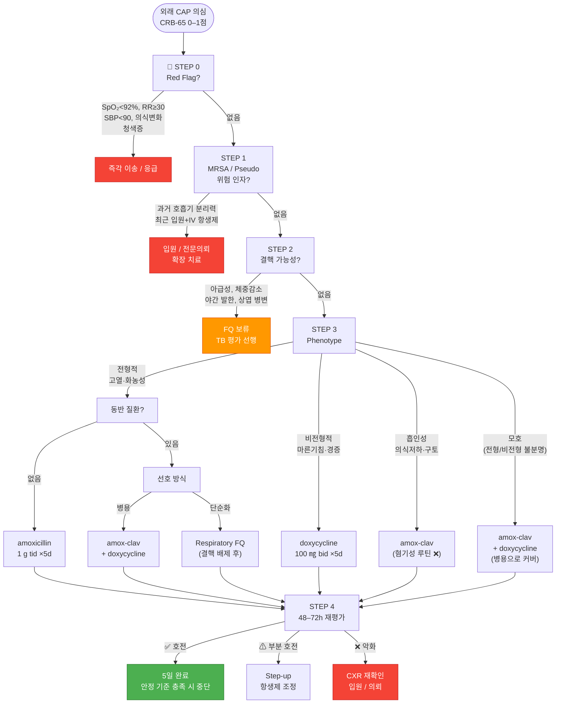
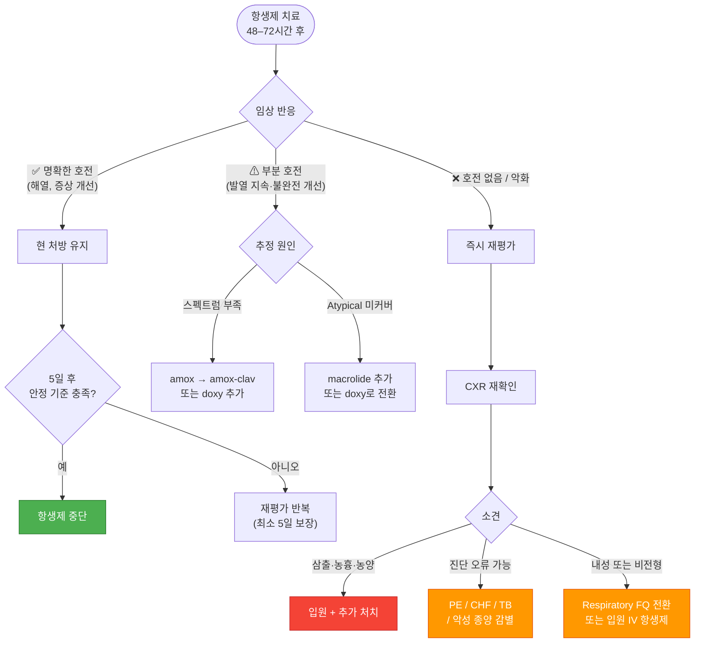

# 폐렴 Pneumonia

## <mark style="color:green;">일반 사항</mark>

* 감염 등에 의해 발생하는 terminal bronchiole 이하 폐 실질 조직의 염증성 질환
* 경과 : 보통 상기도 감염 발생 수일 후 발병 → 2주 내 회복
  * 적절한 치료 시 건강한 환자의 회복 기간 : 발열/빈호흡 3일, 백혈구 수준 4일, 기침/피로감 2주, 흉부 X선 1달
* 재발성 폐렴 : 영상 검사로 진단된 폐렴이 총 ≥3회 또는 ≥2회/년 발생; 기저 질환 감별을 요함


바이러스성 폐렴의 비율이 증가하고 있으나, **성인 CAP에서는 세균성 폐렴(특히 _S. pneumoniae_)이 여전히 중요한 원인이며 초기 경험적 항생제 치료가 예후를 개선함.** 또한 바이러스 감염 이후 세균성 폐렴이 2차적으로 발생하는 viral-bacterial coinfection이 흔하므로, 일시적으로 호전된 후 증상이 다시 악화될 때 세균성 중복 감염을 반드시 고려해야 함


***

## <mark style="color:green;">원인</mark>

* 바이러스 감염 : 폐렴의 \~40% 차지 (소아에서는 \~90% 차지)
  * influenza, adenovirus, parainfluenza, coronavirus (SARS-CoV-2 포함), RSV
* 세균 감염
  * typical (세균의 85%) : _S. pneumoniae_, _H. influenzae_, _S. aureus_, GAS, _M. catarrhalis_
  * atypical (세균의 15%) : _Legionella_ sp., _M. pneumoniae_, _C. pneumoniae_
* 기타 : 흡인(이물, 위산), 알레르기, 약물, 방사선 치료

### <mark style="color:orange;">상황별 주요 원인 세균</mark>

<table><thead><tr><th width="230">상황</th><th>주요 원인균</th></tr></thead><tbody><tr><td>장기 입원, 보호시설 거주자</td><td>그람음성 균주 (예: 녹농균)</td></tr><tr><td>COPD, 흡연</td><td><em>H. influenzae</em>, <em>P. aeruginosa</em>, <em>Legionella</em>, <em>S. pneumoniae</em></td></tr><tr><td>음주</td><td><em>S. pneumoniae</em>, 혐기성균, 그람음성균, 결핵균</td></tr><tr><td>젊은 성인, 여름/가을</td><td><em>M. pneumoniae</em></td></tr><tr><td>냉방 노출</td><td><em>Legionella</em></td></tr><tr><td>흡인, 불결한 치아 위생</td><td>구강 내 혼합 세균 (혐기성 포함)</td></tr></tbody></table>


**흡인성 폐렴에서의 항생제 선택** : 단순 흡인성 폐렴에서는 routine 혐기성균 커버가 필요하지 않음. 폐농양이나 농흉이 동반된 경우에 한하여 혐기성균 커버를 고려


### <mark style="color:orange;">위험 인자</mark>

* 흡연
* 영양 결핍, 면역 저하
* 집단생활
* ＜5세, ＞65세
* 최근(6개월 내) 항생제 치료, 항생제 내성
* 최근 입원(90일 내 ≥2일)
* 기저 질환 : 만성 폐질환(천식, COPD, 기관지확장증), 흡인성 질환(GERD), PPI 장기 복용, 만성 심/신/간 질환, 당뇨병, 신경계 질환, 알코올 남용, 무비증, 악성 종양

***

## <mark style="color:green;">임상 양상</mark>

* 호흡기 : 기침, 가래, 호흡 곤란, (심호흡 시) 흉부 불편감 또는 통증; crackle, rhonchi, 비대칭 호흡음, egophony, 타진상 둔탁음
* 소화기 : 구역, 구토, 설사, 복통
* 전신 : 빈맥, 발열, 피로, 두통, 근육통
  * 고령에서는 발열 등의 임상 증상이 뚜렷하지 않을 수 있음

### <mark style="color:orange;">CAP 표현형 분류</mark>

표현형 파악은 경험적 항생제 선택의 출발점이 됨

<table><thead><tr><th width="140">표현형</th><th width="230">임상 특징</th><th width="200">주요 원인균</th><th>치료 방향</th></tr></thead><tbody><tr><td>전형적 세균성</td><td>급격한 발병, 고열·오한, 화농성 가래, 국소 crackle</td><td><em>S. pneumoniae</em>, <em>H. influenzae</em></td><td>β-lactam 우선</td></tr><tr><td>비전형성</td><td>마른기침, 경증 발열, 두통·근육통, 초기 청진 소견 미미</td><td><em>M. pneumoniae</em>, <em>C. pneumoniae</em>, <em>Legionella</em></td><td>doxycycline 우선</td></tr><tr><td>바이러스 우세</td><td>상기도 감염 선행, 전신 증상 두드러짐</td><td>Influenza, SARS-CoV-2, RSV</td><td>대증 ± 항바이러스</td></tr><tr><td>흡인성</td><td>의식 저하·구토 병력, 하엽 의존성 병변</td><td>구강 내 혼합 세균</td><td>amox-clav (혐기성 루틴 커버 불필요)</td></tr><tr><td>중증 염증형</td><td>Sepsis physiology, 다장기 침범</td><td><em>S. pneumoniae</em>, <em>Legionella</em>, MRSA</td><td>입원 광범위 IV 항생제</td></tr></tbody></table>

### <mark style="color:orange;">비전형성 폐렴 (Mycoplasma)</mark>

* 마른기침, 가벼운 인두염, 미열, 오한, 설사 등 가벼운 증상으로 시작
* 호흡 곤란은 드묾, 초기에 청진 소견이 뚜렷하지 않음


**국내 _M. pneumoniae_ macrolide 내성 주의** : 국내 내성률이 소아 70–90%, 성인에서도 높게 보고됨. 비전형성 폐렴 의심 시 macrolide에 48–72시간 반응이 없으면 doxycycline 또는 respiratory fluoroquinolone으로 조기 전환 고려


### <mark style="color:$danger;">🚩 Red Flags!</mark>

<mark style="color:$danger;">**즉각 이송 또는 응급 평가**</mark>

* 중등도 이상의 호흡 곤란 (빈호흡 ≥30/분, 늑간 함몰, 청색증)
* 저산소증 (SpO₂ ＜90%; 외래에서는 ＜92%도 주의)
* 수축기혈압 ＜90 mmHg, 심박수 ≥125/분
* 의식 저하 또는 혼란 (confusion/altered mental status)
* ＜6개월 소아

<mark style="color:$warning;">**당일 의뢰 또는 입원 평가**</mark>

* CURB-65 ≥2점 또는 PSI ≥71점
* 흉부 X선상 다엽 침범, 농흉 의심
* 심한 구토, 경구 섭취 곤란, 탈수
* 고령(＞65세) 또는 면역 저하 환자의 중등증 이상 증상

<mark style="color:$info;">**외래 추적 / 추가 평가 계획**</mark> <mark style="color:$info;">- 즉각 위험 낮으나 호전 없으면 의뢰</mark>

* 48–72시간 항생제 치료 후 임상적 호전이 없음 (발열 지속, 증상 악화)
* 재발성 폐렴 (총 ≥3회 또는 ≥2회/년) : 기저 원인 감별을 위한 추가 검사

***

## <mark style="color:green;">진단</mark>

* 임상 소견 또는 영상 검사만으로 폐렴의 바이러스와 세균 원인을 구별하는 것은 어려움
* 경험적 항생제 치료가 효과적이기 때문에 외래에서의 CAP 원인균 감별을 위한 일률적인 실험실 검사는 권고하지 않음

### <mark style="color:orange;">영상 검사</mark>

* 임상적 평가의 민감도가 50% 이하이므로 **폐렴이 의심되면 가능한 경우 흉부 X선 촬영을 권장**; 특히 진단이 불확실하거나, vital sign 이상이 있거나, 고령 환자에서는 초기 CXR이 진단 정확도를 높임
* **폐 초음파 (POCUS)** : CXR 결과가 불확실하거나 즉각적인 영상 판독이 필요한 경우 유용한 보조 수단; consolidation(tissue sign), B-line 증가(간질성 부종), pleural effusion 등을 침상 옆에서 신속하게 확인 가능. 방사선 피폭이 없어 임산부·소아에서도 활용 가능
* 치료에 반응하는 경우 추적 영상 검사가 반드시 필요하지는 않음
* consolidation, air bronchogram, effusion 감별
* F/U X선 검사 대상 : 2–3일 간의 항생제 치료에 반응 없음, 재발에 대한 치료 4–6주 후
  * 치유 후 pulmonary opacity의 소실에는 6주 이상 소요
  * 5–7일 내 회복된 환자에 대하여 일률적인 추적 흉부 영상 검사는 권고하지 않음

### <mark style="color:orange;">실험실 검사</mark>

* 대상 : 중등증 이상의 증상 또는 예상과 다른 진행 시 고려
* WBC
  * 바이러스성 : 정상 or 약간↑, lymphocyte 우세
  * 세균성 : 15,000–40,000/㎣, granulocyte 우세; ＜5,000/㎣ 이하 시 나쁜 조짐
* CRP
  * ＞30 ㎎/L : 세균성 폐렴 가능성 높음
  * ＜20 ㎎/L : 폐렴 가능성 낮음; 항생제 보류를 고려할 수 있는 보조 지표 (NICE 지침)
  * 단독 사용보다는 임상 소견과 함께 해석
* **Procalcitonin (PCT)**
  * 항생제 **시작** 결정에는 권장되지 않음
  * 세균성 vs 바이러스성 감별의 **보조 지표**로 활용 가능 (세균성에서 상승, 바이러스성에서 정상 경향); 단 민감도·특이도가 제한적이므로 단독 판단은 금물
  * PCT **감소 추세**는 항생제 중단 판단에 보조적으로 활용 가능
* 가래/혈액 그람염색 및 배양 검사 : 민감도와 특이도가 낮고 위양성이 흔함; 외래에서는 권고하지 않음, 입원 환자에 대하여 항생제 투여 전 시행
  * cavitary opacity가 있으면 fungus 가래 검사 및 Mycobacterium 배양 검사 시행
* _S. pneumoniae_ & _Legionella_ 소변 항원 : 민감도와 특이도가 가래 검사보다 높음; 중증 및 유행 위험 시 고려
* influenza 검사 : 지역 사회에 influenza가 유행하고 있는 경우 고려
* 중증, 치료 실패 시 기관지경 검사, 유의미한 흉막 삼출액이 있는 경우 thoracentesis 고려

### <mark style="color:orange;">CAP vs 감별 질환</mark>

항생제 치료에 반응하지 않을 때 반드시 고려

<table><thead><tr><th width="170">감별 질환</th><th width="280">Key Clue</th><th>감별 검사</th></tr></thead><tbody><tr><td>폐색전증 (PE)</td><td>흉막성 통증 + 정상 또는 비특이적 CXR, 빈맥, 위험 인자</td><td>D-dimer, CT-PA</td></tr><tr><td>울혈성 심부전</td><td>양측성 침윤 + 발목 부종, 기좌호흡, BNP 상승</td><td>BNP/NT-proBNP, 심초음파</td></tr><tr><td>결핵</td><td>아급성 경과, 체중 감소, 야간 발한, 상엽 병변, 공동</td><td>CXR/CT, AFB 도말·배양, IGRA</td></tr><tr><td>악성 종양</td><td>비해소성 폐렴, 흡연 병력, 체중 감소</td><td>흉부 CT, 기관지경</td></tr><tr><td>호산구성 폐렴</td><td>항생제 반응 없음, 혈액 호산구↑, 약물·기생충 노출</td><td>CBC differential, BAL</td></tr><tr><td>과민성 폐렴</td><td>항원(조류·곰팡이 등) 노출 병력, 재발성 경과</td><td>항원 회피 시 호전 여부, HRCT</td></tr></tbody></table>

### <mark style="color:orange;">중증 CAP 진단 기준 (ATS/IDSA)</mark>

**주 기준 ≥1개** 또는 **부 기준 ≥3개** 충족 시 중증 CAP

<mark style="color:$primary;">**주 기준 (Major criteria)**</mark>

* Vasopressor가 필요한 septic shock
* Mechanical ventilation이 필요한 호흡 부전

<mark style="color:$primary;">**부 기준 (Minor criteria)**</mark>

* 호흡수 ≥30/분
* PaO₂/FiO₂ ratio ≤250
* Multilobar infiltrates
* Confusion/disorientation
* 요독증 (BUN ≥20 ㎎/㎗)
* Leukopenia (WBC ＜4,000/㎕, 감염 외 원인)
* Thrombocytopenia (PLT ＜100,000/㎕)
* Hypothermia (중심 체온 ＜36℃)
* 적극적인 수분 공급이 필요한 저혈압


**참고 : 급성 기침 성인에서의 폐렴 진단 - Diehr Rule**\
배점 : 콧물 −2점, 인후통 −1점, 근육통 +1점, 야간 발한 +1점, 가래(하루 종일) +1점, 호흡수 ＞25/분 +2점, 체온 ＞37.8℃ +2점.\
판정 : 점수가 높을수록 폐렴 가능성 증가 (1점≒8.8%, 2점≒10.3%, ≥4점≒29.4%). 단독 사용보다 임상 판단의 보조 도구로 활용.\
_Ref. Diehr P et al. J Chronic Dis 1984;37(2):215–25._


***



<p align="center"><strong>CAP 외래 항생제 선택 알고리듬</strong></p>

<p align="center"><em><mark style="color:$info;">Ref. ATS/IDSA CAP Guideline 2019/2023; NICE NG138, 2023</mark></em></p>

***

## <mark style="background-color:$warning;">Management</mark>

### <mark style="color:orange;">치료 방침</mark>

* 입원 치료 여부 결정 : 임상적 판단 및 예후에 대한 clinical prediction rule 적용 (ATS/IDSA에서는 CURB-65보다 PSI 선호)
* 충분한 휴식, 영양/수분 섭취
* 항생제 투여

### <mark style="color:orange;">입원 치료 결정을 위한 Clinical Rules</mark>

#### <mark style="color:$primary;">CURB-65 / CRB-65</mark>

① Confusion : 사람, 장소, 시간에 대한 착란\
② Uremia : BUN ＞19 ㎎/㎗\
③ Respiratory rate ≥30회/분\
④ BP : SBP ＜90 또는 DBP ≤60 ㎜Hg\
⑤ ≥65세

외래 진료에서는 ②번 항목을 제외한 **CRB-65** 이용을 권장; 혈액 검사가 가능한 경우 **CURB-65** 사용 권장

▶ 배점 : 각 항목에 1점씩 부여\
▶ 판정 및 조치

* **0–1점** = 외래 치료
* **2점** = 입원 가능한 병원으로 의뢰 및 평가
* **≥3점** = 즉시 입원 치료

#### <mark style="color:$primary;">PSI (Pneumonia Severity Index)</mark>

<table><thead><tr><th width="280">위험 인자</th><th width="80">배점</th></tr></thead><tbody><tr><td colspan="2"><em>상황 요인</em></td></tr><tr><td>연령 (남성)</td><td>나이(yr)점</td></tr><tr><td>연령 (여성)</td><td>나이(yr)−10점</td></tr><tr><td>Nursing home 거주</td><td>+10</td></tr><tr><td colspan="2"><em>동반 질환</em></td></tr><tr><td>암</td><td>+30</td></tr><tr><td>만성 간질환</td><td>+20</td></tr><tr><td>CHF</td><td>+10</td></tr><tr><td>만성 신장 질환</td><td>+10</td></tr><tr><td>뇌혈관 질환</td><td>+10</td></tr><tr><td colspan="2"><em>진찰 소견</em></td></tr><tr><td>Altered mental status</td><td>+20</td></tr><tr><td>호흡수 ≥30/분</td><td>+20</td></tr><tr><td>SBP ＜90 ㎜Hg</td><td>+20</td></tr><tr><td>체온 ≥40℃ 또는 ＜35℃</td><td>+15</td></tr><tr><td>맥박 ≥125/분</td><td>+10</td></tr><tr><td colspan="2"><em>검사 소견</em></td></tr><tr><td>동맥혈 pH ＜7.35</td><td>+30</td></tr><tr><td>BUN ＞29 ㎎/㎗</td><td>+20</td></tr><tr><td>Na ＜130 m㏖/L</td><td>+20</td></tr><tr><td>Glucose ＞249 ㎎/㎗</td><td>+10</td></tr><tr><td>Hematocrit ＜30%</td><td>+10</td></tr><tr><td>PaO₂ ＜60 ㎜Hg</td><td>+10</td></tr><tr><td>흉부 X선상 pleural effusion</td><td>+10</td></tr></tbody></table>

▶ 판정 및 조치

* **≤70점** = 외래 치료
* **71–90점** = 입원 치료 고려
* **≥91점** = 입원 치료


PSI는 CURB-65에 비해 저위험군(외래 치료 가능 환자) 선별에 더 민감하며, 사망률 예측력이 높아 ATS/IDSA 가이드라인에서 우선 권고됨. 다만 계산이 복잡하므로 외래에서는 CRB-65로 초기 선별 후 필요 시 PSI를 적용하는 단계적 접근이 실용적


_<mark style="color:$info;">Ref. PSI/PORT Score : https://www.mdcalc.com/psi-port-score-pneumonia-severity-index-cap</mark>_

***

## <mark style="color:green;">약물 치료</mark>

### <mark style="color:orange;">항생제</mark>

* 성인 CAP에서 초기 경험적 항생제 치료는 예후를 개선하므로 임상적으로 폐렴이 의심되면 조기 투여를 고려
* 선택 : 환자 위치(외래, 입원, or ICU), 위험 요인, 지역의 항생제 내성 패턴에 따른 경험적 선택

**투여 기간 및 중단 기준**

* **최소 5일** 투여 후 다음 안정 기준을 모두 충족하면 중단 고려
  * afebrile ≥48시간
  * 심박수 ＜100/분
  * 호흡수 ＜24/분
  * SBP ≥90 ㎜Hg
  * 정상 의식, 경구 섭취 가능
* 재평가 : 항생제 투여 종료 3일 후 재평가, 악화되면 즉시 재평가


**🇰🇷 한국 임상 환경 특이사항 (Korea-Specific)**

* **Macrolide 단독 치료 비권장** : 국내 _S. pneumoniae_ macrolide 내성률 ≥50%; _M. pneumoniae_ 소아 내성률 70–90%. Macrolide 단독 경험적 치료는 국내에서 일반적으로 권장하지 않음
* **Fluoroquinolone 사용 전 결핵 가능성 평가 필수** : 국내 결핵 유병률이 높아 FQ는 결핵 증상을 일시 억제하여 진단을 지연시킬 수 있음. 아급성 경과, 체중 감소, 야간 발한, 상엽 병변 등이 있으면 FQ 보류 후 TB 평가 선행
* **흡인성 폐렴** : 단순 흡인성 폐렴에서 혐기성균 routine 커버 불필요; 폐농양·농흉 동반 시에만 고려
* **MRSA / _P. aeruginosa_ 위험 인자** : 과거 호흡기 검체 분리력이 가장 중요한 위험 인자; 최근 입원(90일 내) AND 비경구 항생제 투여력이 그 다음


#### <mark style="color:$primary;">동반 질환 없음 (MRSA / P. aeruginosa 위험 인자 없음)</mark>

전형적 폐렴 의심:

* amoxicillin 1 g tid <mark style="color:blue;">\[파목신]</mark>

비전형성 폐렴 의심 또는 macrolide 대체:

* doxycycline 100 ㎎ bid <mark style="color:blue;">\[독시사이클린]</mark>


Macrolide (azithromycin, clarithromycin)는 **국내 내성률**을 고려하여 단독 1차 선택에서 제외. 단, 지역 내 내성률이 ＜25%임이 확인된 경우 또는 특수 상황(doxycycline 금기 등)에서 고려 가능


#### <mark style="color:$primary;">동반 질환 있음¹⁾</mark>

다음 중 하나 + doxycycline 병용:

* amoxicillin/clavulanate 500/125 ㎎ tid, 875/125 ㎎ bid, 또는 2,000/125 ㎎ bid <mark style="color:blue;">\[오구멘틴]</mark>
* cefpodoxime 200 ㎎ bid <mark style="color:blue;">\[바난]</mark>
* cefuroxime 500 ㎎ bid <mark style="color:blue;">\[진네트]</mark>

또는 단독 요법 (**결핵 가능성 배제 후**):

* Respiratory fluoroquinolone
  * levofloxacin 750 ㎎ qd <mark style="color:blue;">\[크라비트]</mark>
  * moxifloxacin 400 ㎎ qd <mark style="color:blue;">\[아벨록스]</mark>
  * gemifloxacin 320 ㎎ qd <mark style="color:blue;">\[팩티브]</mark>

¹⁾ 동반 질환 : 만성 심장·폐·간·신질환, 당뇨병, 알코올 남용, 악성 종양, 무비증

_<mark style="color:$info;">Ref. ATS/IDSA CAP Clinical Practice Guidelines 2019; IDSA Update 2023</mark>_

#### <mark style="color:$primary;">Mycoplasma pneumoniae / Chlamydophila pneumoniae</mark>

* 1차 선택 : doxycycline 100 ㎎ bid (국내 macrolide 내성 고려)
* 2차 선택 : respiratory fluoroquinolone (결핵 배제 후)
* Macrolide는 국내 내성률 고려하여 치료 반응 확인 후 결정

### <mark style="color:orange;">NICE 지침 (2023)</mark>

* 치료 기간 : **5일** (단 미생물학적 검사상 추가 치료 필요, 48시간 내 발열 지속, 또는 임상적 불안정 소견\* ≥1개 있는 경우 예외)
  * \* SBP ＜90 ㎜Hg, 심박수 ＞100/분, 호흡수 ＞24/분, SaO₂ ＜90% 또는 PaO₂ ＜60 ㎜Hg (room air)

**경증** (CRB65=0점 또는 CURB65=0–1점)

* 1차 선택 : amoxicillin 500 ㎎ tid ×5d
* 대체 (Pc allergy, 비정형 폐렴) : doxycycline 200 ㎎ ×1d → 100 ㎎ qd ×4d, 또는 clarithromycin 500 ㎎ bid ×5d

**중등증** (CRB65=1–2점 또는 CURB65=2점)

* 1차 선택 : amoxicillin 500 ㎎ tid ×5d + clarithromycin 500 ㎎ bid ×5d (atypical 의심 시 macrolide 추가)
* 대체 : doxycycline 또는 clarithromycin 단독

**중증** (CRB65=3–4점 또는 CURB65=3–5점)

* 48시간 정맥 주사 후 가능하면 경구제로 전환

### <mark style="color:orange;">48–72시간 재평가 및 단계적 치료 조정</mark>



<p align="center"><strong>48–72시간 재평가 및 항생제 조정 알고리듬</strong></p>

### <mark style="color:orange;">항바이러스제</mark>

* oseltamivir, zanamivir, peramivir : influenza 감염 시 고려 (☞ [인플루엔자](069_-influenza.md))
* acyclovir : 면역 저하 환자에서의 CMV, HSV 감염 시 고려 <mark style="color:blue;">\[메노바]</mark>
* ribavirin : RSV 감염 시 일부 환자에서 고려 (부작용/비용 대비 효과 제한적)

### <mark style="color:orange;">해열·진통제</mark>

* acetaminophen 650–1,300 ㎎ tid <mark style="color:blue;">\[타이레놀]</mark>
* ibuprofen 400–800 ㎎ tid <mark style="color:blue;">\[부루펜]</mark>

***

## <mark style="color:green;">치료에 반응하지 않는 폐렴의 원인</mark>

### <mark style="color:orange;">1. 진단 오류 (Diagnostic Error)</mark>

폐렴으로 오인하기 쉬운 질환들; 항생제 반응이 없으면 반드시 재고

* 울혈성 심부전, 폐색전증, 심근경색
* 악성 종양, 사르코이드증, 혈관염 (예: 베게너 육아종증)
* 약제 유발성 폐질환, 호산구성 폐렴, 과민성 폐렴
* 폐출혈, 폐쇄성 폐렴, 신부전

### <mark style="color:orange;">2. 숙주 요인 (Host Problem)</mark>

치료가 적절하더라도 반응이 부족할 수 있는 상황

* 국소 부위 폐쇄 (이물질, 종양에 의한 폐쇄)
* 면역 저하 (HIV, 고용량 스테로이드, 항암 치료)
* 폐렴 합병증 : 농흉, 폐렴 주위 삼출액, 폐농양

### <mark style="color:orange;">3. 병원체·약제 요인 (Pathogen / Drug Issue)</mark>

항생제 선택이나 병원체에 문제가 있는 경우

* **약제 요인** : 약제 선택/용량/용법 잘못, 약물열, 약물 상호 작용
* **병원체 요인** : 내성균, 병원 내 중복 감염, 흔치 않은 원인균 (_Mycobacterium_, _Nocardia_, 진균, 바이러스, 혐기균)
* **전이성 감염** : 심내막염, 수막염, 관절염, 심낭염, 복막염


**항생제 실패 패턴별 감별 단서**

* 48시간 이후 발열 지속 → 내성균, 비전형 원인균, 약제 미적용 병원체 고려
* 저산소증 진행·악화 → 농흉/삼출액 등 합병증, 또는 진단 오류
* CXR 소견 지속되나 증상 호전 → 정상 회복 경과 (opacity 소실까지 6주 이상 소요); 반드시 치료 실패로 해석하지 않음


***

## <mark style="color:green;">예방</mark>

* 폐렴 및 인플루엔자 예방접종 (☞ 예방접종 챕터)
* 금연
* 손 씻기, 건강한 생활 습관 (충분한 영양 섭취, 규칙적 운동)

### <mark style="color:orange;">성인 폐렴구균 예방접종 권고 (2026년 기준)</mark>

기존 23가 다당류 백신(PPSV23) 중심에서 단백접합백신(PCV)으로 패러다임이 전환됨

<table><thead><tr><th width="180">대상</th><th width="220">권고 접종 방법</th><th>비고</th></tr></thead><tbody><tr><td>65세 이상 (PCV 미접종)</td><td>PCV20 단독 1회<br>또는 PCV15 1회 → PPSV23 1회 (1년 후)</td><td>PCV20 단독이 가장 단순; 국내 급여 기준 확인 필요</td></tr><tr><td>65세 이상 (과거 PPSV23만 접종)</td><td>PCV20 또는 PCV15 1회 추가 (≥1년 간격)</td><td>PCV 추가로 접합백신 커버리지 확보</td></tr><tr><td>19–64세 고위험군*</td><td>PCV20 단독 1회<br>또는 PCV15 → PPSV23 순차 접종</td><td>65세 도달 후 추가 접종 여부는 이전 접종력에 따라 결정</td></tr><tr><td>면역 저하자 (무비증, HIV, 이식 등)</td><td>PCV20 또는 PCV15 → PPSV23 (8주 후) → 5년 후 PPSV23 반복 고려</td><td>전문의와 상담 권장</td></tr></tbody></table>

\* 고위험군 : 만성 폐·심·간·신질환, 당뇨병, 알코올 남용, 흡연, 무비증, 면역 저하 등

_<mark style="color:$info;">Ref. ACIP Adult Immunization Schedule 2025; 대한감염학회 성인 예방접종 지침 2024</mark>_

***

### <mark style="color:red;">질병코드</mark>

J12 달리 분류되지 않은 바이러스폐렴\
J15 달리 분류되지 않은 세균성 폐렴\
J18 상세불명 병원체의 폐렴

***

## <mark style="color:purple;">처방례</mark>

> **처방례 1. 경증 - 전형적 세균성 (동반 질환 없음)**
>
> ```
> 파목신 500 ㎎/C   2C #3   ×5d   (= amoxicillin 1 g tid)
> 부루펜 400 ㎎/T   3T #3
> 코푸 시럽 20 ㎖/P 4P #4
> ```
>
> _✽동반 질환 없는 경증 전형적 CAP. amoxicillin 1 g tid가 가이드라인 권고 용량(S. pneumoniae 내성 극복). 파목신 500 mg 2캡슐 = 1 g. 5일 후 안정 기준 충족 시 중단._

> **처방례 2. 경증 - 비전형성 폐렴 의심 (Mycoplasma / Pc 알레르기)**
>
> ```
> 독시사이클린 100 ㎎/C   1C bid   ×5d
>   (첫날 로딩: 1C bid = 총 200 ㎎, 이후 1C bid 유지)
> 타이레놀 500 ㎎/T        3T #3
> 코데닝 6T #3
> ```
>
> _✽비전형성 폐렴 의심, Pc 알레르기, 또는 국내 macrolide 내성 고려 시. 표준 용법은 1C bid ×5d (IDSA) 또는 첫날 2C qd 로딩 후 1C qd ×4d (NICE). 처방례는 1C bid로 통일. 식도 자극 예방을 위해 충분한 물(200 ㎖ 이상)과 함께 복용하고 복용 후 30분간 눕지 않도록 안내._

> **처방례 3. 중등증 - 동반 질환 있음 (병용 요법)**
>
> ```
> 오구멘틴 625 ㎎/T    3T #3   ×5–7d
> 독시사이클린 100 ㎎/C 1C bid  ×5d
> 애니펜 300 ㎎/T      3T #3
> 코푸 시럽 20 ㎖/P    4P #4
> ```
>
> _✽동반 질환 있는 중등증 CAP. amox/clav + doxycycline 병용. 보험 기준 항생제 병용 요법 적용 여부 확인._

> **처방례 4. 중등증 - Respiratory FQ 단독 요법**
>
> ```
> 크라비트 500 ㎎/T   1T qd   ×5d
> 타이레놀 500 ㎎/T   3T #3
> 코푸 시럽 20 ㎖/P   4P #4
> ```
>
> _✽beta-lactam + doxycycline 병용이 어렵거나 단순화가 필요한 경우. levofloxacin 750 ㎎ qd ×5d도 동등한 대안. **반드시 처방 전 결핵 가능성(아급성 경과, 체중 감소, 상엽 병변) 배제.**_

***

### <mark style="color:$success;">핵심 복약 지도</mark>

* **항생제는 처방된 기간(보통 5일) 동안 빠짐없이 복용하세요.** 증상이 좋아지더라도 임의 중단 시 내성균 발생 및 재발 위험이 있습니다.
* **amoxicillin / amox-clav는 식후 복용**하면 위장 자극을 줄일 수 있습니다. 설사가 심하면 즉시 알려 주세요.
* **doxycycline은 반드시 물 200 ㎖ 이상과 함께** 복용하고, 복용 후 30분은 눕지 마세요(식도 자극 방지). 햇빛 과민 반응이 생길 수 있으니 외출 시 자외선 차단을 권장합니다.
* **Fluoroquinolone(크라비트, 아벨록스)은 칼슘·마그네슘·철분 보충제와 2시간 이상 간격**을 두고 복용하세요. 힘줄 통증이 생기면 즉시 중단하고 내원하세요.
* 48–72시간 후에도 발열이 지속되거나 호흡이 더 힘들어지면 즉시 내원 또는 응급실을 방문하세요.
* 수분을 충분히 섭취하고(하루 1.5–2 L 이상) 충분히 쉬세요.

***

### <mark style="color:blue;">환자 안내서</mark>

**폐렴이란?**\
폐렴은 폐 안에 세균, 바이러스 등이 침입하여 생기는 염증입니다. 기침, 가래, 발열, 호흡 곤란이 주요 증상입니다.

**치료 기간은?**\
항생제를 보통 5일간 복용합니다. 증상이 나아져도 처방을 완료해야 재발을 막을 수 있습니다. 발열과 빠른 숨은 2–3일, 기침과 피로는 2주, 흉부 X선의 정상화는 1달 이상 걸릴 수 있습니다.

**이럴 때는 바로 병원 / 응급실로 오세요**

* 숨이 더 가빠지거나 입술·손발이 파래짐
* 48–72시간이 지나도 열이 떨어지지 않음
* 가슴 통증이 심해지거나 의식이 흐릿해짐
* 물을 마시기 어려울 정도로 구역·구토가 심함

**회복 중 주의사항**

* 충분한 휴식이 가장 중요합니다. 무리하지 마세요.
* 물을 자주 마시고, 영양가 있는 음식을 드세요.
* 금연하세요. 흡연은 폐렴 회복을 크게 늦춥니다.
* 손을 자주 씻고, 기침 예절을 지켜 주변 사람에게 전파되지 않도록 하세요.
* 스마트워치 등 웨어러블 기기가 있다면, 수면 중 심박수·산소포화도·호흡수 변화를 확인하세요. 회복 중에도 산소포화도가 지속적으로 낮거나 심박수가 빠를 경우 의사에게 알려 주세요.

**예방하려면?**\
폐렴구균 백신과 인플루엔자 백신을 접종받으세요. 65세 이상이거나 만성 질환이 있으면 PCV20(단독) 또는 PCV15→PPSV23 순차 접종을 의사와 상담하세요. 인플루엔자 백신은 매년 접종이 필요합니다.
