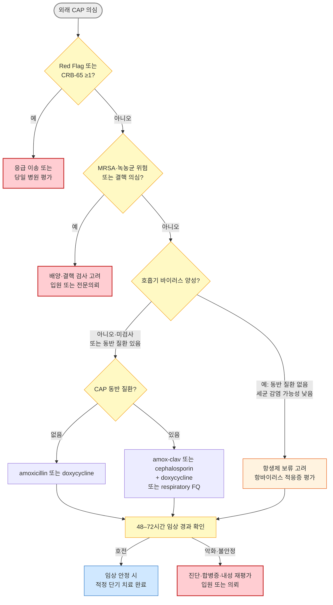
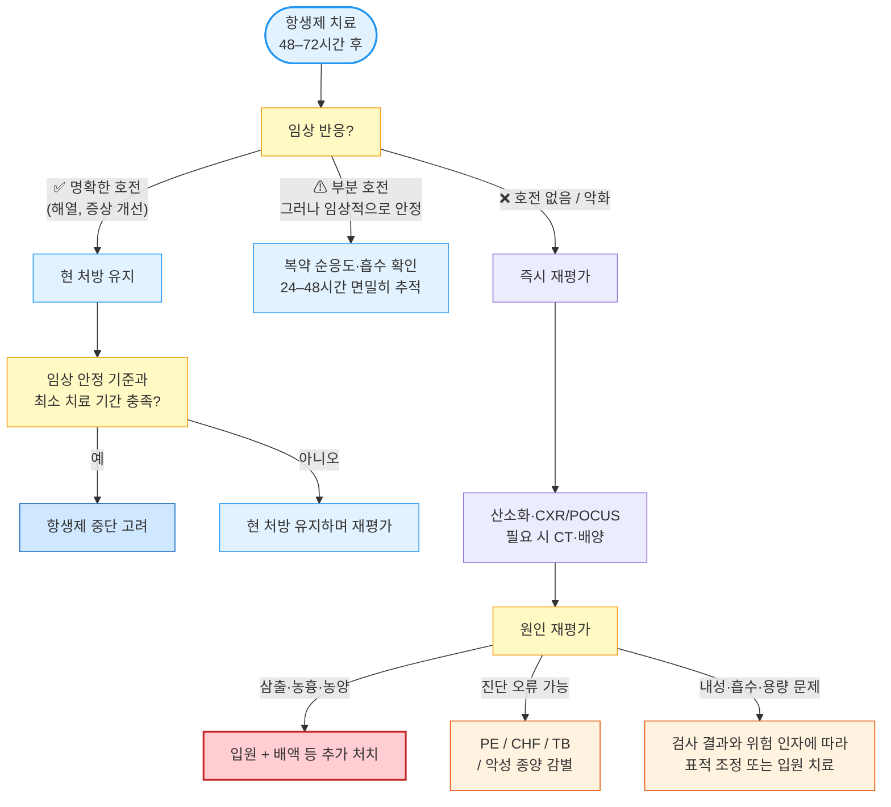

# 폐렴 Pneumonia

## <mark style="color:green;">일반 사항</mark>

* 폐렴은 감염에 의해 terminal bronchiole 이하 폐 실질에 염증과 새로운 침윤이 발생하는 질환. 약물·방사선·과민반응 등에 의한 비감염성 폐렴염(pneumonitis)과 구분
* 경과 : 적절히 치료해도 증상별 회복 속도가 다름. 발열은 대개 1주 이내 호전하지만 기침·호흡 곤란은 수 주, 피로는 수개월 지속될 수 있으며 영상학적 음영 소실은 임상 증상보다 늦음
* 재발성 폐렴 : 각 발병 사이 임상적·영상학적 호전이 확인된 별개의 폐렴이 반복되는 경우. 동일 부위 반복 시 기관지 폐쇄·이물·종양, 서로 다른 부위 반복 시 흡인·면역 저하·기관지확장증 등을 평가


성인 CAP에서는 바이러스의 역할이 커졌지만 세균성 폐렴, 특히 _S. pneumoniae_는 여전히 중요한 원인임. 바이러스 검사 양성만으로 세균 동시감염을 배제할 수 없으며, 항생제 필요성은 치료 장소·중증도·동반 질환과 세균 감염 가능성을 함께 판단함. 일시적으로 호전된 뒤 발열·호흡기 증상이 다시 악화되면 2차 세균성 폐렴을 고려


## <mark style="color:green;">원인</mark>

* 바이러스 감염 : 검사법과 유행 시기에 따라 검출 비율이 크게 달라짐
  * influenza, adenovirus, parainfluenza, coronavirus (SARS-CoV-2 포함), RSV
* 세균 감염
  * 전형적 세균 : _S. pneumoniae_, _H. influenzae_, _S. aureus_, GAS, _M. catarrhalis_
  * 비전형적 세균 : _Legionella_ sp., _M. pneumoniae_, _C. pneumoniae_
* 흡인 : 감염성 흡인성 폐렴과 화학적 흡인성 폐렴염을 구분

### <mark style="color:orange;">상황별 주요 원인 세균</mark>

<table><thead><tr><th width="230">상황</th><th>주요 원인균·해석</th></tr></thead><tbody><tr><td>COPD, 흡연</td><td><em>S. pneumoniae</em>, <em>H. influenzae</em>, <em>M. catarrhalis</em>. COPD·흡연만으로 녹농균 위험군으로 분류하지 않음</td></tr><tr><td>기관지확장증, 과거 녹농균 호흡기 분리력</td><td><em>P. aeruginosa</em> 가능성 증가</td></tr><tr><td>인플루엔자 후 악화</td><td><em>S. pneumoniae</em>, <em>S. aureus</em> 등 2차 세균성 폐렴</td></tr><tr><td>오염된 급수·배관·냉각탑 에어로졸 노출, 여행</td><td><em>Legionella</em></td></tr><tr><td>흡인 위험·불량한 치아 위생</td><td>일반 CAP 원인균과 구강 내 혼합 세균. 폐농양·농흉 시 혐기성균 고려</td></tr><tr><td>보호시설 거주</td><td>보호시설 거주만으로 MRSA·녹농균 광범위 치료를 결정하지 않고 과거 분리력·최근 입원 및 비경구 항생제 투여력을 확인</td></tr></tbody></table>


**흡인 후 항생제 선택** : 위 내용물의 급성 흡인에 의한 흡인성 폐렴염은 24–48시간 내 지지 치료만으로 호전할 수 있어 일률적인 항생제가 필요하지 않음. 감염성 흡인성 폐렴에는 표준 CAP 항생제를 사용하고, 폐농양·농흉이 의심되는 경우에만 추가 혐기성균 치료를 고려


### <mark style="color:orange;">위험 인자</mark>

* 흡연
* 영양 결핍, 면역 저하
* 집단생활
* 고령(특히 ＞65세)
* 최근 항생제 치료
* 최근 90일 내 입원 및 비경구 항생제 투여
* 기저 질환 : 만성 폐질환(천식, COPD, 기관지확장증), 흡인성 질환(GERD), PPI 장기 복용, 만성 심/신/간 질환, 당뇨병, 신경계 질환, 알코올 남용, 무비증, 악성 종양

## <mark style="color:green;">임상 양상</mark>

* 호흡기 : 기침, 가래, 호흡 곤란, (심호흡 시) 흉부 불편감 또는 통증; crackle, rhonchi, 비대칭 호흡음, egophony, 타진상 둔탁음
* 소화기 : 구역, 구토, 설사, 복통
* 전신 : 빈맥, 발열, 피로, 두통, 근육통
  * 고령에서는 발열 등의 임상 증상이 뚜렷하지 않을 수 있음

### <mark style="color:orange;">임상 양상에 따른 원인 추정의 한계</mark>

* 급격한 고열·화농성 가래·국소 crackle은 세균성 폐렴을, 마른기침·두통·근육통·초기 청진 소견의 부재는 바이러스 또는 비전형적 세균을 시사할 수 있음
* 그러나 임상 양상만으로 전형적 세균·비전형적 세균·바이러스를 신뢰성 있게 구별할 수 없으므로, 이를 단독으로 항생제 계열 선택의 기준으로 사용하지 않음
* 경험적 항생제는 치료 장소와 중증도, 동반 질환, 최근 항생제 사용, 지역 내성, MRSA·녹농균 위험 인자, 바이러스 검사 결과와 약물 금기를 종합하여 선택

### <mark style="color:orange;">마이코플라스마 폐렴</mark>

* 마른기침, 가벼운 인두염, 미열, 오한, 설사 등 가벼운 증상으로 시작
* 호흡 곤란은 드묾, 초기에 청진 소견이 뚜렷하지 않음


**국내&#x20;**_**M. pneumoniae**_**&#x20;macrolide 내성 주의** : 국내 소아에서 높은 내성률이 보고되지만 이를 성인 내성률에 그대로 적용할 수는 없음. 성인에서는 지역 역학과 임상 반응을 함께 판단하고, macrolide 치료 후 48–72시간에도 호전이 없으면 진단·중증도·합병증을 재평가한 뒤 doxycycline 또는 respiratory fluoroquinolone 전환을 고려


### <mark style="color:$danger;">🚩 Red Flags!</mark>

<mark style="color:$danger;">**즉각 이송 또는 응급 평가**</mark>

* 중등도 이상의 호흡 곤란 (빈호흡 ≥30/분, 늑간 함몰, 청색증)
* 저산소증 (SpO₂ ＜90%; 외래에서는 ＜92%도 주의)
* 수축기혈압 ＜90 mmHg, 심박수 ≥125/분
* 의식 저하 또는 혼란 (confusion/altered mental status)

<mark style="color:$warning;">**당일 의뢰 또는 입원 평가**</mark>

* CRB-65 ≥1점, CURB-65 ≥2점 또는 PSI ≥71점이면서 외래 치료의 안전성이 불확실한 경우
* 흉부 X선상 다엽 침범, 농흉 의심
* 심한 구토, 경구 섭취 곤란, 탈수
* 고령(＞65세) 또는 면역 저하 환자의 중등증 이상 증상

<mark style="color:$info;">**외래 추적 / 추가 평가 계획**</mark> <mark style="color:$info;">- 즉각 위험 낮으나 호전 없으면 의뢰</mark>

* 치료 시작 48–72시간 후에도 전혀 호전되지 않거나 발열·호흡기 증상이 악화됨
* 임상·영상학적 호전이 확인된 별개의 폐렴이 반복됨 : 기저 원인 감별을 위한 추가 검사

## <mark style="color:green;">진단</mark>

* 임상 소견 또는 영상 검사만으로 폐렴의 바이러스와 세균 원인을 구별하는 것은 어려움
* 경험적 항생제 치료가 효과적이기 때문에 외래에서의 CAP 원인균 감별을 위한 일률적인 실험실 검사는 권고하지 않음

#### <mark style="color:$primary;">Diehr Rule - 성인 폐렴의 임상 진단 Tool</mark>

　　_<mark style="color:$info;">Ref. Diehr P et al. J Chronic Dis 1984;37(2):215–25.</mark>_

* 배점 : 콧물 −2점, 인후통 −1점, 근육통 +1점, 야간 발한 +1점, 가래(하루 종일) +1점, 호흡수 ＞25/분 +2점, 체온 ＞37.8℃ +2점.
* 판정 : 점수가 높을수록 폐렴 가능성 증가 (1점≒8.8%, 2점≒10.3%, ≥4점≒29.4%).&#x20;
* 단독 사용보다 임상 판단의 보조 도구로 활용

#### <mark style="color:$primary;">중증 CAP 진단 기준 (ATS/IDSA)</mark>

* 주 기준 ≥1개 또는 부 기준 ≥3개 충족 시 중증 CAP

**주 기준 (Major criteria)**

* Vasopressor가 필요한 septic shock
* 침습적 mechanical ventilation이 필요한 호흡 부전

**부 기준 (Minor criteria)**

* 호흡수 ≥30/분
* PaO₂/FiO₂ ratio ≤250
* Multilobar infiltrates
* Confusion/disorientation
* 요독증 (BUN ≥20 ㎎/㎗)
* Leukopenia (WBC ＜4,000/㎕, 항암 치료 등이 아닌 감염으로 인한 경우)
* Thrombocytopenia (PLT ＜100,000/㎕)
* Hypothermia (중심 체온 ＜36℃)
* 적극적인 수분 공급이 필요한 저혈압

### <mark style="color:orange;">영상 검사</mark>

* 임상적 평가의 민감도가 50% 이하이므로 폐렴이 의심되면 가능한 경우 흉부 X선 촬영을 권장; 특히 진단이 불확실하거나, vital sign 이상이 있거나, 고령 환자에서는 초기 CXR이 진단 정확도를 높임
* 폐 초음파 (POCUS) : 숙련된 검사자가 표준화된 방법으로 시행할 수 있다면 CXR의 대안 또는 보조 검사로 활용 가능. consolidation(tissue sign), dynamic air bronchogram, pleural effusion 등을 확인할 수 있으나 B-line은 폐렴·폐부종·간질성 폐질환 등에서 나타나는 비특이적 소견이며, 심부 병변이나 종양·폐색전증 같은 대체 진단 평가에는 한계가 있음
* 치료에 반응하는 경우 추적 영상 검사가 반드시 필요하지는 않음
* 초기 영상에서 consolidation, air bronchogram, pleural effusion과 폐쇄성 병변 여부를 확인
* F/U X선 검사 대상 : 증상 지속·악화, 동일 부위 반복, 초기 영상에서 폐쇄성 병변이 의심되거나 고령 흡연자 등 폐암 위험이 높은 경우 약 6주 후 고려
  * 치유 후 pulmonary opacity의 소실에는 6주 이상 소요
  * 5–7일 내 회복된 환자에 대하여 일률적인 추적 흉부 영상 검사는 권고하지 않음

### <mark style="color:orange;">실험실 검사</mark>

* 대상 : 중등증 이상의 증상 또는 예상과 다른 진행 시 고려
* WBC : 백혈구 증가·호중구 우세는 세균 감염을 지지할 수 있으나 바이러스와 세균을 확정적으로 구별하지 못함. 감염으로 인한 WBC ＜4,000/㎕는 중증 CAP 부 기준
* CRP
  * 진찰 후에도 하기도감염에서 항생제 필요성이 불확실할 때 보조적으로 사용 가능
  * ＜20 ㎎/L이면 routine 항생제를 권하지 않고, 20–100 ㎎/L이면 필요 시 지연 처방, ＞100 ㎎/L이면 즉시 항생제를 고려하는 NICE 기준이 있으나 폐렴 여부나 세균성 원인을 확정하는 절단점은 아님
  * 중증도·영상 소견과 함께 해석
* Procalcitonin (PCT)
  * 항생제 시작 결정에는 권장되지 않음
  * 세균성 vs 바이러스성 감별의 보조 지표로 활용 가능 (세균성에서 상승, 바이러스성에서 정상 경향); 단 민감도·특이도가 제한적이므로 단독 판단은 금물
  * PCT 감소 추세는 항생제 중단 판단에 보조적으로 활용 가능
* 가래 그람염색·배양 및 혈액배양 : 외래와 비중증 입원 CAP에서 일률적으로 시행하지 않음. 중증 CAP, MRSA·녹농균 경험적 치료, 과거 호흡기 분리력 또는 최근 90일 내 입원하면서 비경구 항생제를 투여받은 경우에는 항생제 투여 전에 시행
  * 공동(cavity)이 있으면 결핵균 핵산증폭검사·AFB 도말/배양을 우선 고려하고, 숙주·노출·영상에 따라 진균 검사를 선택
* _S. pneumoniae_ 소변 항원 : routine 검사하지 않으며 중증 CAP에서 고려
* _Legionella_ 소변 항원 : 중증 CAP 또는 여행·유행 등 역학적 위험이 있을 때 고려; 중증이면 하기도 검체 배양 또는 핵산증폭검사 병행 고려
* influenza 검사 : 지역사회 유행 시 신속 분자검사를 권장하며 신속 항원검사보다 선호. SARS-CoV-2·RSV 등 검사는 유행 상황과 치료·격리 결정에 따라 시행
* 중증, 치료 실패 시 기관지경 검사, 유의미한 흉막 삼출액이 있는 경우 thoracentesis 고려

### <mark style="color:orange;">감별</mark>

* 항생제 치료에 반응하지 않을 때 반드시 고려

<table><thead><tr><th width="134.21051025390625">감별 질환</th><th width="280">Key Clue</th><th>감별 검사</th></tr></thead><tbody><tr><td>폐색전증 (PE)</td><td>흉막성 통증 + 정상 또는 비특이적 CXR, 빈맥, 위험 인자</td><td>임상확률 평가, D-dimer, CT-PA</td></tr><tr><td>울혈성 심부전</td><td>양측성 침윤 + 발목 부종, 기좌호흡, BNP 상승</td><td>BNP/NT-proBNP, 심초음파</td></tr><tr><td>결핵</td><td>아급성 경과, 체중 감소, 야간 발한, 상엽 병변, 공동</td><td>CXR/CT, 객담 결핵균 핵산증폭검사·AFB 도말/배양. IGRA만으로 활동성 결핵을 진단·배제하지 않음</td></tr><tr><td>악성 종양</td><td>비해소성 폐렴, 흡연 병력, 체중 감소</td><td>흉부 CT, 기관지경</td></tr><tr><td>호산구성 폐렴</td><td>항생제 반응 없음, 혈액 호산구↑, 약물·기생충 노출</td><td>CBC differential, BAL</td></tr><tr><td>과민성 폐렴</td><td>항원(조류·곰팡이 등) 노출 병력, 재발성 경과</td><td>항원 회피 시 호전 여부, HRCT</td></tr></tbody></table>

***


```mermaid
flowchart TD
    A([외래 CAP 의심]) --> B{"Red Flag 또는<br/>CRB-65 ≥1?"}
    B -- 예 --> C[응급 이송 또는<br/>당일 병원 평가]
    B -- 아니오 --> D{"MRSA·녹농균 위험<br/>또는 결핵 의심?"}
    D -- 예 --> E[배양·결핵 검사 고려<br/>입원 또는 전문의뢰]
    D -- 아니오 --> F{"호흡기 바이러스 양성?"}
    F -- "예: 동반 질환 없음<br/>세균 감염 가능성 낮음" --> G[항생제 보류 고려<br/>항바이러스 적응증 평가]
    F -- "아니오·미검사<br/>또는 동반 질환 있음" --> H{CAP 동반 질환?}
    H -- 없음 --> I[amoxicillin 또는 doxycycline]
    H -- 있음 --> J[amox-clav 또는 cephalosporin<br/>+ doxycycline<br/>또는 respiratory FQ]
    I --> K[48–72시간 임상 경과 확인]
    J --> K
    G --> K
    K -- 호전 --> L[임상 안정 시<br/>적정 단기 치료 완료]
    K -- 악화·불안정 --> M[진단·합병증·내성 재평가<br/>입원 또는 의뢰]
style A fill:#eeeeee,stroke:#888888,stroke-width:2px
classDef yellow fill:#fff9c4,stroke:#f39c12
class B,D,F,H,K yellow
classDef L_red fill:#ffcdd2,stroke:#c62828,stroke-width:2px
class C,E,M L_red
style G fill:#fff3e0,stroke:#e65100
style L fill:#d0e8ff,stroke:#1a6abf

```

<p align="center"><strong>CAP 외래 항생제 선택 알고리듬</strong></p>

<p align="center"><em><mark style="color:$info;">Ref. ATS/IDSA CAP Guideline 2019; ATS focused update 2025 (print 2026); NICE NG250, 2025</mark></em></p>

***

## <mark style="background-color:$warning;">Management</mark>

### <mark style="color:orange;">치료 방침</mark>

* 입원 치료 여부 결정 : 임상적 판단 및 예후에 대한 clinical prediction rule 적용 (ATS/IDSA에서는 CURB-65보다 PSI 선호)
* 충분한 휴식, 영양/수분 섭취
* 항생제 투여

### <mark style="color:orange;">입원 치료 결정을 위한 Clinical Rules</mark>

#### <mark style="color:$primary;">CURB-65 / CRB-65</mark>

1. Confusion : 사람, 장소, 시간에 대한 착란
2. Uremia : BUN ＞19 ㎎/㎗
3. Respiratory rate ≥30회/분
4. BP : SBP ＜90 또는 DBP ≤60 ㎜Hg
5. ≥65세

* 외래에서는 BUN을 제외한 CRB-65를 활용할 수 있고, 검사 가능한 경우 CURB-65 또는 PSI를 적용. 점수는 임상 판단·산소화·경구 섭취 가능성·돌봄 여건을 대체하지 않음
* 배점 : 각 항목에 1점씩 부여
* CRB-65 판정 및 조치
  * 0점 = 대체로 외래 치료
  * 1–2점 = 당일 병원 평가·의뢰 고려
  * 3–4점 = 긴급 입원 평가
* CURB-65 판정 및 조치
  * 0–1점 = 대체로 외래 치료
  * 2점 = 입원 평가
  * ≥3점 = 입원 및 필요 시 중환자 치료 평가

#### <mark style="color:$primary;">PSI (Pneumonia Severity Index)</mark>

<table><thead><tr><th width="281.6842041015625">위험 인자</th><th width="180.75494384765625">배점</th></tr></thead><tbody><tr><td><em>상황 요인</em></td><td></td></tr><tr><td>연령 (남성)</td><td>나이(yr)=점수</td></tr><tr><td>연령 (여성)</td><td>나이(yr)−10=점수</td></tr><tr><td>Nursing home 거주</td><td>+10</td></tr><tr><td><em>동반 질환</em></td><td></td></tr><tr><td>암</td><td>+30</td></tr><tr><td>만성 간질환</td><td>+20</td></tr><tr><td>CHF</td><td>+10</td></tr><tr><td>만성 신장 질환</td><td>+10</td></tr><tr><td>뇌혈관 질환</td><td>+10</td></tr><tr><td><em>진찰 소견</em></td><td></td></tr><tr><td>Altered mental status</td><td>+20</td></tr><tr><td>호흡수 ≥30/분</td><td>+20</td></tr><tr><td>SBP ＜90 ㎜Hg</td><td>+20</td></tr><tr><td>체온 ≥40℃ 또는 ＜35℃</td><td>+15</td></tr><tr><td>맥박 ≥125/분</td><td>+10</td></tr><tr><td><em>검사 소견</em></td><td></td></tr><tr><td>동맥혈 pH ＜7.35</td><td>+30</td></tr><tr><td>BUN ＞29 ㎎/㎗</td><td>+20</td></tr><tr><td>Na ＜130 m㏖/L</td><td>+20</td></tr><tr><td>Glucose ＞249 ㎎/㎗</td><td>+10</td></tr><tr><td>Hematocrit ＜30%</td><td>+10</td></tr><tr><td>PaO₂ ＜60 ㎜Hg</td><td>+10</td></tr><tr><td>흉부 X선상 pleural effusion</td><td>+10</td></tr></tbody></table>

* 판정 및 조치
  * ≤70점 = 외래 치료
  * 71–90점 = 입원 치료 고려
  * ≥91점 = 입원 치료
* PSI는 CURB-65에 비해 저위험군(외래 치료 가능 환자) 선별에 더 민감하며, 사망률 예측력이 높아 ATS/IDSA 가이드라인에서 우선 권고됨. 다만 계산이 복잡하므로 외래에서는 CRB-65로 초기 선별 후 필요 시 PSI를 적용하는 단계적 접근이 실용적

_<mark style="color:$info;">Ref. PSI/PORT Score : https://www.mdcalc.com/psi-port-score-pneumonia-severity-index-cap</mark>_

## <mark style="color:green;">약물 치료</mark>

### <mark style="color:orange;">항생제</mark>

* 임상적으로 세균성 CAP 또는 세균 동시감염이 의심되면 경험적 항생제를 조기 투여. 호흡기 바이러스 양성인 동반 질환 없는 안정된 외래 환자에서 세균 감염 가능성이 낮다면 항생제 보류를 고려할 수 있음(ATS 2025 조건부 권고, 근거 수준 매우 낮음)
* 선택 : 환자 위치(외래, 입원, or ICU), 위험 요인, 지역의 항생제 내성 패턴에 따른 경험적 선택


2025 focused update는 ATS 단독 지침이며 2019 ATS/IDSA 공동 지침을 네 가지 쟁점에서 보완함. 특히 바이러스 양성 CAP의 항생제 권고는 근거 수준이 매우 낮으므로 세균 동시감염 가능성과 항생제 위해를 개별적으로 판단


**투여 기간 및 중단 기준**

* 매일 임상 안정성을 평가하며 다음 기준을 모두 충족하면 중단 시점을 결정
  * 해열 및 체온 안정
  * 심박수 ＜100/분
  * 호흡수 ＜24/분
  * SBP ≥90 ㎜Hg
  * SpO₂ ≥90% (room air 또는 환자의 평상시 산소 요구량)
  * 정상 의식, 경구 섭취 및 약물 흡수 가능
* 임상적으로 안정된 외래 및 입원 비중증 CAP에서는 최소 3일을 전제로 ＜5일 치료를 고려할 수 있음(ATS 2025 조건부 권고, 낮은 근거). 국내 외래에서는 5일 요법도 여전히 합리적
* 중증 CAP는 ≥5일 치료. MRSA·녹농균·_Legionella_ 등 특정 병원체, 균혈증, 폐농양·농흉 또는 폐외 감염은 병원체와 합병증에 따라 연장
* 재평가 : 치료 시작 48–72시간 내 호전이 없거나 언제든 악화하면 즉시 재평가; 호전 중인 모든 환자에게 종료 3일 후 방문을 일률적으로 요구하지 않음


**한국 임상 환경 특이사항 (Korea-Specific)**

* **Macrolide 단독 치료 비권장** : 국내 _S. pneumoniae_의 높은 macrolide 내성을 고려하면 경험적 단독 요법으로 일반적으로 권장하지 않음. _M. pneumoniae_의 소아 내성률을 성인에 그대로 적용하지 않음
* **Fluoroquinolone 사용 전 결핵 가능성 평가** : FQ는 결핵 증상을 일시 억제하여 진단을 지연시킬 수 있음. 아급성 경과, 체중 감소, 야간 발한, 상엽 병변 등이 있으면 객담 결핵균 검사를 시행하고 가능하면 평가가 끝날 때까지 FQ를 보류
* **흡인성 폐렴** : 표준 CAP 치료에 별도의 혐기성균 약제를 routine으로 추가하지 않으며 폐농양·농흉 동반 시 고려. 급성 화학적 흡인성 폐렴염은 항생제 없이 지지 치료 가능
* **MRSA /&#x20;**_**P. aeruginosa**_**&#x20;위험 인자** : 과거 호흡기 검체 분리력이 가장 중요한 위험 인자; 최근 입원(90일 내) AND 비경구 항생제 투여력이 그 다음


#### <mark style="color:$primary;">동반 질환 없음 (MRSA / P. aeruginosa 위험 인자 없음)</mark>

* &#x20;amoxicillin 1 g tid <mark style="color:blue;">\[파목신]</mark>
* &#x20;또는 doxycycline 100 ㎎ bid <mark style="color:blue;">\[독시사이클린]</mark>
* Macrolide (azithromycin, clarithromycin)는 국내 내성률을 고려하여 단독 1차 선택에서 제외. 단, 지역 내 내성률이 ＜25%임이 확인된 경우 또는 특수 상황(doxycycline 금기 등)에서 고려 가능

#### <mark style="color:$primary;">동반 질환 있음¹⁾</mark>

**다음 중 하나 + doxycycline 병용**

* amoxicillin/clavulanate 500/125 ㎎ tid, 875/125 ㎎ bid, 또는 서방형 총 2,000/125 ㎎ bid <mark style="color:blue;">\[오구멘틴]</mark> (국내 가용 제형·허가사항 확인)
* cefpodoxime 200 ㎎ bid <mark style="color:blue;">\[바난]</mark>
* cefuroxime 500 ㎎ bid <mark style="color:blue;">\[진네트]</mark>

**또는 단독 요법 (결핵 가능성 배제 후)**

* Respiratory fluoroquinolone
  * levofloxacin 750 ㎎ qd (국내 가용 제품의 함량·허가사항과 신기능에 따른 용량 확인)
  * moxifloxacin 400 ㎎ qd <mark style="color:blue;">\[아벨록스]</mark>
  * gemifloxacin 320 ㎎ qd <mark style="color:blue;">\[팩티브]</mark>

¹⁾ 동반 질환 : 만성 심장·폐·간·신질환, 당뇨병, 알코올 남용, 악성 종양, 무비증

#### <mark style="color:$primary;">확인된 Mycoplasma pneumoniae / Chlamydia pneumoniae</mark>

* 1차 선택 : doxycycline 100 ㎎ bid (국내 macrolide 내성 고려)
* 2차 선택 : respiratory fluoroquinolone (결핵 배제 후)
* Macrolide는 감수성·지역 내성 및 임상 반응을 고려하여 결정

### <mark style="color:orange;">NICE 지침 (NG250, 2025)</mark>

* 치료 기간 : 5일 (단 미생물학적 검사상 추가 치료 필요, 48시간 내 발열 지속, 또는 임상적 불안정 소견²⁾ ≥1개 있는 경우 예외)
  * ²⁾SBP ＜90 ㎜Hg, 심박수 ＞100/분, 호흡수 ＞24/분, SaO₂ ＜90% 또는 PaO₂ ＜60 ㎜Hg (room air)

**경증** (CRB65=0점 또는 CURB65=0\~1점)

* 1차 선택 : amoxicillin 500 ㎎ tid ×5d
* 대체 (Pc allergy, 비정형 폐렴) : doxycycline 200 ㎎ ×1d → 100 ㎎ qd ×4d, 또는 clarithromycin 500 ㎎ bid ×5d

**중등증** (CRB65=1\~2점 또는 CURB65=2점)

* 1차 선택 : amoxicillin 500 ㎎ tid ×5d + clarithromycin 500 ㎎ bid ×5d (atypical 의심 시 macrolide 추가)
* 대체 : doxycycline 또는 clarithromycin 단독

**중증** (CRB65=3\~4점 또는 CURB65=3\~5점)

* 48시간 정맥 주사 후 가능하면 경구제로 전환

### <mark style="color:orange;">48\~72시간 재평가 및 단계적 치료 조정</mark>


```mermaid
flowchart TD
    A(["항생제 치료<br/>48–72시간 후"]) --> B[임상 반응?]

    B -- "✅ 명확한 호전<br/>(해열, 증상 개선)" --> C[현 처방 유지]
    C --> D["임상 안정 기준과<br/>최소 치료 기간 충족?"]
    D -- 예 --> E[항생제 중단 고려]
    D -- 아니오 --> F[현 처방 유지하며 재평가]

    B -- "⚠ 부분 호전<br/>그러나 임상적으로 안정" --> G[복약 순응도·흡수 확인<br/>24–48시간 면밀히 추적]

    B -- "❌ 호전 없음 / 악화" --> J[즉시 재평가]
    J ---> K[산소화·CXR/POCUS<br/>필요 시 CT·배양]
    K --> L[원인 재평가]
    L -- "삼출·농흉·농양" --> M[입원 + 배액 등 추가 처치]
    L -- "진단 오류 가능" --> N["PE / CHF / TB<br/>/ 악성 종양 감별"]
    L -- "내성·흡수·용량 문제" --> O[검사 결과와 위험 인자에 따라<br/>표적 조정 또는 입원 치료]
style A fill:#e3f2ff,stroke:#2196f3,stroke-width:2px
classDef yellow fill:#fff9c4,stroke:#f39c12
class B,D,L yellow
classDef sky fill:#e3f2ff,stroke:#2196f3
class C,F,G sky
classDef orange50 fill:#fff3e0,stroke:#e65100
class N,O orange50
    style E fill:#d0e8ff,stroke:#1a6abf
    style M fill:#ffcdd2,stroke:#c62828,stroke-width:2px

```

<p align="center"><strong>48–72시간 재평가 및 항생제 조정 알고리듬</strong></p>

### <mark style="color:orange;">항바이러스제</mark>

* oseltamivir, zanamivir, peramivir : influenza 감염 시 고려 (☞ [인플루엔자](069_-influenza.md))
* SARS-CoV-2 : 중증 진행 고위험군에서는 증상 발생 후 허용된 기간 내 항바이러스 치료 고려 (☞ [코로나19](070_1_-covid-19.md))
* acyclovir : 면역 저하 환자의 HSV 폐렴에서 전문의 판단하에 고려 <mark style="color:blue;">\[메노바]</mark>. CMV 폐렴의 표준 치료제가 아니며 CMV 폐렴은 ganciclovir 기반 전문 치료가 필요
* ribavirin : 중증 면역 저하자의 RSV 하기도감염 등 제한된 상황에서 전문의 판단하에 고려

### <mark style="color:orange;">전신 corticosteroid</mark>

* 비중증 CAP에서는 routine 사용하지 않음
* 입원한 중증 CAP에서는 조기 전신 corticosteroid를 조건부로 고려할 수 있음(ATS 2025 조건부 권고, 낮은 근거)
* 인플루엔자 관련 폐렴에는 위 중증 CAP 권고를 적용하지 않음. 불응성 패혈성 쇼크는 패혈증 지침에 따라 별도로 판단

### <mark style="color:orange;">해열·진통제</mark>

* acetaminophen 500–1,000 ㎎ q6–8h prn <mark style="color:blue;">\[타이레놀]</mark> (1,300 ㎎ 1회 용량은 650 ㎎ 서방형 2정 용법에 해당; 제품별 1일 최대 용량 확인)
* ibuprofen 200–400 ㎎ tid–qid prn <mark style="color:blue;">\[부루펜]</mark> (고령, 신질환·심부전·위장관 출혈 위험에서는 피하거나 신중히 사용)

## <mark style="color:green;">치료에 반응하지 않는 폐렴의 원인</mark>

#### <mark style="color:$primary;">1. 진단 오류 (Diagnostic Error)</mark>

* 폐렴으로 오인하기 쉬운 질환들; 항생제 반응이 없으면 반드시 재고
  * 울혈성 심부전, 폐색전증, 심근경색
  * 악성 종양, 사르코이드증, 혈관염 (예: 베게너 육아종증)
  * 약제 유발성 폐질환, 호산구성 폐렴, 과민성 폐렴
  * 폐출혈, 폐쇄성 폐렴, 신부전

#### <mark style="color:$primary;">2. 숙주 요인 (Host Problem)</mark>

* 치료가 적절하더라도 반응이 부족할 수 있는 상황
  * 국소 부위 폐쇄 (이물질, 종양에 의한 폐쇄)
  * 면역 저하 (HIV, 고용량 스테로이드, 항암 치료)
  * 폐렴 합병증 : 농흉, 폐렴 주위 삼출액, 폐농양

#### <mark style="color:$primary;">3. 병원체·약제 요인 (Pathogen / Drug Issue)</mark>

* 항생제 선택이나 병원체에 문제가 있는 경우
  * 약제 요인 : 약제 선택/용량/용법 잘못, 약물열, 약물 상호 작용
  * 병원체 요인 : 내성균, 병원 내 중복 감염, 흔치 않은 원인균 (_Mycobacterium_, _Nocardia_, 진균, 바이러스, 혐기균)
  * 전이성 감염 : 심내막염, 수막염, 관절염, 심낭염, 복막염


**항생제 실패 패턴별 감별 단서**

* 48시간 이후 발열 지속만으로 치료 실패로 단정하지 않음. 임상적 안정 여부와 증상 추세를 함께 평가하며, 전혀 호전이 없거나 악화하면 내성균·미커버 병원체·복약/흡수 문제·합병증·진단 오류를 재평가
* 저산소증 진행·악화 → 농흉/삼출액 등 합병증, 또는 진단 오류
* CXR 소견 지속되나 증상 호전 → 정상 회복 경과 (opacity 소실까지 6주 이상 소요); 반드시 치료 실패로 해석하지 않음


## <mark style="color:green;">예방</mark>

* 예방접종 : [폐렴](../231_/210_-vaccination.md#pneumococcal-pneumonia) 및 [인플루엔자](../231_/210_-vaccination.md#influenza)&#x20;
* 금연
* 손 씻기, 건강한 생활 습관 (충분한 영양 섭취, 규칙적 운동)

### <mark style="color:orange;">성인 폐렴구균 예방접종</mark>

* 접종 백신과 간격은 연령, 기저 질환, 과거 PCV·PPSV23 접종력 및 국내 허가·권고에 따라 달라짐
* 미국 ACIP는 50세 이상 모든 성인에게 PCV15, PCV20 또는 PCV21을 권고함. PCV15 사용 시 통상 1년 후 PPSV23을 1회 접종하고, 면역 저하·인공와우·뇌척수액 누출에서는 최소 8주 간격을 고려. PCV20 또는 PCV21 후에는 PPSV23이 필요하지 않음
* PCV21이 모든 환자에서 PCV20보다 우선하는 것은 아니며, 혈청형 분포와 국내 백신 가용성을 고려
* 국내 대상·접종력별 일정과 급여 기준은 [예방접종](../231_/210_-vaccination.md#pneumococcal-pneumonia) 챕터의 최신 표를 따름

_<mark style="color:$info;">Ref. CDC Pneumococcal Vaccine Recommendations, 2026; 국내 예방접종 지침 및 제품별 허가사항</mark>_

***

### <mark style="color:red;">질병코드</mark>

J12 달리 분류되지 않은 바이러스폐렴

J13 폐렴연쇄구균에 의한 폐렴

J14 헤모필루스 인플루엔자에 의한 폐렴

J15 달리 분류되지 않은 세균성 폐렴

J16 달리 분류되지 않은 기타 감염성 병원체에 의한 폐렴

J18 상세불명 병원체의 폐렴

J69 고형물 및 액체에 의한 폐렴

***

## <mark style="color:purple;">처방례</mark>

> **처방례 1. 경증 CAP - 동반 질환 없음 (amoxicillin 선택)**
>
> ```
> 파목신 500 ㎎/C   2C #3   ×5d   (= amoxicillin 1 g tid)
> 부루펜 400 ㎎/T   3T #3
> 코푸 시럽 20 ㎖/P 4P #4
> ```
>
> _✽동반 질환 없는 경증 CAP의 1차 선택 중 하나. 파목신 500 ㎎ 2캡슐=amoxicillin 1 g. 치료 기간은 임상 안정성을 확인하여 결정하며 국내 외래에서는 5일 요법이 실용적._

> **처방례 2. 경증 CAP - 동반 질환 없음 (doxycycline 선택)**
>
> ```
> 독시사이클린 100 ㎎/C   1C bid   ×5d
> 타이레놀 500 ㎎/T        3T #3
> 코데닝 6T #3
> ```
>
> _✽동반 질환 없는 경증 CAP의 대안 또는 penicillin 알레르기에서 고려. 식도 자극 예방을 위해 충분한 물(200 ㎖ 이상)과 함께 복용하고 복용 후 30분간 눕지 않도록 안내._

> **처방례 3. 외래 CAP - 동반 질환 있음 (병용 요법)**
>
> ```
> 오구멘틴 625 ㎎/T    3T #3   ×5–7d
> 독시사이클린 100 ㎎/C 1C bid  ×5d
> 애니펜 300 ㎎/T      3T #3
> 코푸 시럽 20 ㎖/P    4P #4
> ```
>
> _✽외래 치료가 가능한 안정된 환자 중 동반 질환이 있는 CAP. amox/clav+doxycycline 병용. 중등증·불안정 소견이 있으면 외래 처방보다 입원 평가를 우선하며 보험 기준상 병용 인정 여부 확인._

> **처방례 4. 외래 CAP - 동반 질환 있음 (Respiratory FQ 단독 요법)**
>
> ```
> 아벨록스 400 ㎎/T   1T qd   ×5d
> 타이레놀 500 ㎎/T   3T #3
> 코푸 시럽 20 ㎖/P   4P #4
> ```
>
> _✽beta-lactam+doxycycline 병용이 어렵거나 단독 요법이 적절한 경우. QT 연장, 대동맥류·박리 위험, 힘줄·신경계 이상, 약물 상호 작용을 확인. **결핵 가능성이 있으면 객담 검사를 시행하고 가능하면 평가가 끝날 때까지 FQ를 보류.**_

***

### <mark style="color:$success;">핵심 복약 지도</mark>

* **항생제는 처방받은 용량과 기간대로 복용하고 임의로 중단하거나 연장하지 마세요.** 치료 기간 변경이 필요하면 의사와 상의하세요.
* **amoxicillin / amox-clav는 식후 복용**하면 위장 자극을 줄일 수 있습니다. 설사가 심하면 즉시 알려 주세요.
* **doxycycline은 반드시 물 200 ㎖ 이상과 함께** 복용하고, 복용 후 30분은 눕지 마세요(식도 자극 방지). 햇빛 과민 반응이 생길 수 있으니 외출 시 자외선 차단을 권장합니다.
* **Fluoroquinolone(크라비트, 아벨록스)은 제산제와 철분·아연·마그네슘·칼슘 함유 보충제에 의해 흡수가 감소할 수 있으므로 제품별 권장 간격을 확인하세요.** 힘줄 통증, 말초 감각 이상, 심한 신경계 증상이 생기면 복용을 중단하고 즉시 상담하세요.
* 48–72시간 후에도 뚜렷한 호전이 없거나 발열이 지속되면 재평가를 받으세요. 호흡 곤란·청색증·의식 변화가 발생하거나 악화하면 즉시 응급실을 방문하세요.
* 심부전·신질환 등 수분 제한 사유가 없다면 탈수되지 않도록 수분을 섭취하고 충분히 쉬세요.

***

### <mark style="color:blue;">환자 안내서</mark>

**폐렴이란?**\
폐렴은 폐 안에 세균, 바이러스 등이 침입하여 생기는 염증입니다. 기침, 가래, 발열, 호흡 곤란이 주요 증상입니다.

**치료 기간은?**\
항생제가 필요한 경우 대개 단기간 복용하지만 중증도·원인균·회복 속도에 따라 달라집니다. 처방받은 용량과 기간을 지키고 임의로 중단하거나 연장하지 마세요. 발열은 대개 1주 이내 호전하지만 기침·숨참은 수 주, 피로는 더 오래 지속될 수 있으며 흉부 X선은 증상보다 늦게 정상화됩니다.

**이럴 때는 바로 병원 / 응급실로 오세요**

* 숨이 더 가빠지거나 입술·손발이 파래짐
* 48–72시간이 지나도 열이 떨어지지 않음
* 가슴 통증이 심해지거나 의식이 흐릿해짐
* 물을 마시기 어려울 정도로 구역·구토가 심함

**회복 중 주의사항**

* 충분한 휴식이 가장 중요합니다. 무리하지 마세요.
* 물을 자주 마시고, 영양가 있는 음식을 드세요.
* 금연하세요. 흡연은 폐렴 회복을 크게 늦춥니다.
* 손을 자주 씻고, 기침 예절을 지켜 주변 사람에게 전파되지 않도록 하세요.
* 가정용 산소포화도계를 사용한다면 수치만 보지 말고 숨참·청색증·의식 변화 등 증상을 함께 살피세요. 지속적으로 낮거나 평소보다 뚜렷하게 감소하면 즉시 의료진에게 알리세요.

**예방하려면?**\
폐렴구균 백신과 인플루엔자 백신을 접종받으세요. 폐렴구균 백신의 종류와 간격은 연령·기저 질환·과거 접종력에 따라 달라지므로 의사와 상담하세요. 인플루엔자 백신은 매년 접종이 필요합니다.
