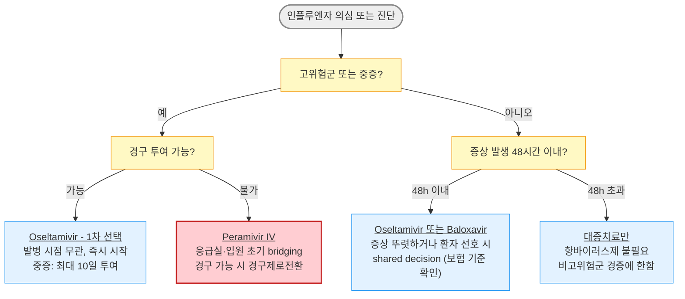

# 인플루엔자 Influenza

## <mark style="color:green;">일반 사항</mark>

* influenza 바이러스 감염에 의한, 갑자기 시작되는 전신 증상 및 호흡기 증상을 특징으로 하는 급성 호흡기 질환
* 전염 경로 : 주로 비말(droplet) 및 직간접 접촉 전파; 밀폐된 공간이나 에어로졸 발생 시술 시에는 에어로졸(airborne-like) 전파 가능성 존재
* 잠복기 : 1\~4일 (평균 2일)
* 증상 기간 : 전신 증상(발열·근육통) 3\~7일; 기침·피로감은 1\~2주 지속 가능
* 전염 기간 : 증상 발생 1\~2일 전 - 발생 후 5\~7일 (또는 발열 소멸 후 24시간); 면역저하자·소아에서는 연장 가능 (>10일)
* 유행 시기 : 겨울\~봄 (10월\~4월)
* 호발 연령 : 소아 (3개월\~16세), 젊은 성인
* 호발 조건 : 밀집된 환경 (예: 학교, 요양원, 군대, 교도소)

### <mark style="color:orange;">합병증</mark>

* 호흡기계 : 1차성 인플루엔자 폐렴, 2차성 세균성 폐렴 (_S. pneumoniae_ 가장 흔함; _H. influenzae_, _S. aureus_ necrotizing pneumonia 포함), 기관지염, 부비동염, 중이염, 기흉
* 신경계 : 뇌염, 척수염, 길랭-바레증후군
* 심장 : 심근염 (급성 악화 또는 급사 위험; 회복기에도 운동 제한 권고)
* 기타 : 횡문근 융해증; 기저 심혈관 질환자에서 급성 심근경색(AMI) 트리거

#### <mark style="color:$primary;">합병증 발병 고위험군</mark>

* <5세 (특히 <2세), 고령 (≥65세), 임신 (특히 3분기), 출산 2주 이내 산모, 집단·밀집 거주
* 기저 질환자 : 면역 저하, 악성 종양, 만성 폐/심/신/간 질환, 당뇨병, 대사 이상, 근육 질환, 뇌졸중, 발달 장애, 고도 비만
* 최근 1년 이내 심혈관 사건(심근경색, 뇌졸중) 병력 - 인플루엔자가 AMI의 직접 트리거가 될 수 있음

## <mark style="color:green;">원인</mark>

* 원인균 : influenza A(주로; 조류·돼지 등 동물 감염 가능), B, C형

### <mark style="color:orange;">항원 변이</mark>

#### <mark style="color:$primary;">항원 대변이 (antigenic shift)</mark>

* 바이러스 표면의 HA(hemagglutinin) 또는 NA(neuraminidase)가 새로운 아형으로 교체
* 주로 A형에서 발생하며 대유행(pandemic) 유발

#### <mark style="color:$primary;">항원 소변이 (antigenic drift)</mark>

* HA·NA에서의 소수 아미노산 변화로 인한 항원성 변화 (아형은 동일)
* A형 및 B형 모두에서 발생하며 소유행(epidemic) 유발; 거의 매년 발생 → 매년 예방접종 필요


다음에 해당하는 경우 조류 인플루엔자(Avian Influenza) 감염을 의심하고 즉시 보건 당국에 신고 : '발열 + 호흡기 증상' 발생 10일 이내에 발생 지역 여행력 또는 가금류·야생조류 접촉력이 있음


### <mark style="color:$danger;">🚩 Red Flags!</mark>

<mark style="color:$danger;">**즉각 조치 또는 응급 이송**</mark>

* 호흡 곤란, 청색증 - 폐렴·호흡 부전 의심
* 의식 변화 (혼돈, 섬망) 또는 경련
* 저혈압 또는 쇼크 징후
* 중증 탈수 - 기립 시 현기증 + 소변량 현저히 감소 + 피부 탄력 저하 동반

<mark style="color:$warning;">**당일 또는 조기 의뢰**</mark>

* 흉부 압박감 또는 지속적 흉통
* 지속적 구토로 경구 수분·약물 섭취 불가
* 고위험군 (임신부, ≥65세, 면역저하자)에서 증상 악화 또는 호전 없음
* 초기 호전 후 재악화 + 고열 지속 >3\~5일 + focal crackle → 세균성 중복 감염
* 회복기 중 운동 시 호흡 곤란·흉통·심계항진 → 심근염

<mark style="color:$info;">외래 추적 / 추가 평가 계획</mark> <mark style="color:$info;">- 즉각 위험 낮으나 호전 없으면 의뢰</mark>

* 항바이러스제 투여 48\~72시간 후에도 발열이 전혀 호전되지 않음
* 소아에서 환각·이상 행동 발생 → oseltamivir 부작용,  뇌염
* 해열 후 재발열 → 세균성 합병증, 2차 감염
* 독감 후 피로감·기침이 2주 이상 지속 → post-viral syndrome, 심근염

## <mark style="color:green;">임상 양상</mark>

* 고열 (38\~41℃, 3\~7일간), 오한, 두통, 근육통 - 갑작스러운 발병이 특징
* 기침 (nonproductive), 인후통, 콧물; 전형적 증상은 환자의 50%에서만 나타남
* 소화기 증상 (주로 소아) : 구역/구토, 설사
* 고령자 비전형적 증상 : 고열 없이 기력 저하·식욕 부진·섬망(delirium)만으로 내원하는 경우 多; 유행 시기에는 독감을 적극 의심할 것

**독감 후 세균성 폐렴 의심 신호 (Bacterial Superinfection)**

* 초기 호전 → 재악화 + 아래 중 1개 이상 동반 : ⓵ Persistent fever > 3\~5일, ⓶ 화농성 객담 증가, ⓷ pleuritic chest pain, ⓸ focal crackle, ⓹ 산소포화도 감소 또는 WBC 상승
* 조치 : CXR ± 세균 검사 ± 항생제 평가
  * Empiric 항생제는 _S. pneumonia&#x65;_&#xB97C; 1차 표적으로, _S. aureus_(MRSA 포함) 중증 의심 시 coverage 확대 고려

#### <mark style="color:$primary;">독감 vs 감기 임상 양상</mark>

<table><thead><tr><th width="150">증상</th><th width="230">독감 (인플루엔자)</th><th>감기 (일반 상기도감염)</th></tr></thead><tbody><tr><td>발열</td><td>흔함, 급성·고열 (38\~41℃)</td><td>± (미열)</td></tr><tr><td>기침</td><td>흔함, 심함</td><td>흔함</td></tr><tr><td>근육통</td><td>흔함, <strong>심함</strong></td><td>± 경미</td></tr><tr><td>두통</td><td>흔함</td><td>±</td></tr><tr><td>피로감</td><td><strong>중증</strong>, 초기부터</td><td>± 경증</td></tr><tr><td>인후통</td><td>±</td><td>흔함</td></tr><tr><td>코 막힘</td><td>±</td><td>흔함</td></tr><tr><td>재채기</td><td>±</td><td>흔함</td></tr><tr><td>발병 양상</td><td><strong>갑작스러움</strong> (수 시간~1일)</td><td>서서히 (1~3일)</td></tr></tbody></table>

* 독감은 감기보다 전신 증상이 강하며, 근육통·피로감이 호흡기 증상을 압도함

#### <mark style="color:$primary;">독감 vs 세균성 폐렴 vs COVID-19 임상 양상</mark>

<table><thead><tr><th width="137.631591796875">특징</th><th>인플루엔자</th><th>세균성 폐렴</th><th>COVID-19</th></tr></thead><tbody><tr><td>발병 양상</td><td><strong>급성</strong> (수 시간~1일)</td><td>비교적 점진적</td><td>다양함 (점진적 흔함)</td></tr><tr><td>발열</td><td>흔함, 고열</td><td>흔함</td><td>다양함</td></tr><tr><td>근육통</td><td><strong>심함</strong> (특징적)</td><td>경미~중등도</td><td>중등도</td></tr><tr><td>피로감</td><td><strong>매우 심함</strong>, 초기부터</td><td>중등도</td><td>흔함</td></tr><tr><td>기침</td><td>흔함 (dry)</td><td>흔함</td><td>흔함</td></tr><tr><td>객담</td><td>보통 없음</td><td>흔함 (화농성)</td><td>±</td></tr><tr><td>호흡곤란</td><td>초기에는 드묾</td><td>흔함</td><td>중등도~흔함</td></tr><tr><td>청진</td><td>대개 정상</td><td>crackle, focal finding</td><td>정상~diffuse crackle</td></tr><tr><td>콧물/인후통</td><td>±</td><td>드묾</td><td>흔함</td></tr><tr><td>후각/미각 저하</td><td>드묾</td><td>없음</td><td>특징적 (초기 변이에서)</td></tr><tr><td>GI 증상</td><td>소아에서 흔함</td><td>드묾</td><td>비교적 흔함</td></tr><tr><td>핵심 단서</td><td>고열 + 심한 근육통 + 갑작스러운 발병</td><td>호흡곤란 + focal crackle + CXR 침윤</td><td>상기도 증상 + 노출력; 후각 저하</td></tr></tbody></table>

## <mark style="color:green;">진단</mark>

* 유행 시기에는 임상 양상만으로 진단 가능; 유행 시기에 고열 + 심한 근육통 + 갑작스러운 발병 시 독감으로 추정(influenza until proven otherwise)
* 코로나19·독감 동시 유행기에는 콤보 신속 항원 검사 (COVID-19 + 인플루엔자 A/B) 사용 권장
* 소아·고령자에서는 RSV와의 감별도 고려 (multiplex PCR 유용)

**인플루엔자의사환자 정의** \[인플루엔자 표본 감시 기준]

* 다음 **두 가지** 해당:&#x20;
  1. ≥38℃의 갑작스러운 발열
  2. 기침 또는 인후통


급성 고열 + 기침의 양성 예측률 ≈85%; 기침이 없으면 독감 가능성이 낮음


### <mark style="color:orange;">검사</mark>

* 지역 사회 유행 시기에 독감과 일치하는 증상을 가진 정상 면역 외래 환자 → 검사 불필요 (임상 진단으로 충분)
* 인플루엔자 검사 고려 대상 : 유행기에 급성 발열성 호흡기 질환이 발생한 면역저하자, 검사 결과가 치료 결정에 영향을 줄 때 (항바이러스제·항생제 투여 결정, 고위험군, 입원 결정), 치료에 반응하지 않을 때, 인플루엔자 관련 합병증 의심 시

#### <mark style="color:$primary;">신속 항원 검사 (RAT, Rapid Antigen Test)</mark>

* 키트에 포함된 면봉으로 비강 또는 인두 분비물 채취; 수 분 내 진단
* 정확도 : 특이도 90\~95%, 민감도 50\~70% (소아 70\~90%, 성인 40\~60%)
  * 유병률이 낮은 시기 → 위양성률 증가; 유병률이 높은 시기 → 위음성률 증가
  * 지역사회 독감의사환자 비율 10\~30%일 때 가장 정확
  * 최적 검사 시기 : 증상 발생 후 24\~48시간 (바이러스 역가 최고점); 72시간 이후에는 위음성률 급증
  * 검체 채취 방법이 정확도에 큰 영향을 미침
* 임상적으로 독감이 강력히 의심되나 RAT 음성 → 위음성 가능성 고려 (임상적 판단 우선)
* 현재 COVID-19 + 인플루엔자 A/B 콤보 RAT가 널리 사용됨; RSV 포함 multiplex RAT도 활용 가능

#### <mark style="color:$primary;">기타 검사</mark>

* RT-PCR : 비인두 분비물 검사; 민감도·특이도가 가장 높음; 1\~8시간 후 판정
* 직간접 면역형광법 : 수 시간 후 판정
* 바이러스 배양 : 수일 후 판정; 역학 연구·항바이러스제 내성 연구에 이용
* CBC : WBC 정상 또는 약간 감소; WBC 증가 시 세균 중복 감염 의심
* 흉부 X선 : 폐렴 의심 시 고려
* EKG + troponin : 회복기에 흉통·심계항진·운동 시 호흡 곤란 발생 시 - 심근염 배제 목적
* 세균 검사 : 심한 증상광범위 폐렴, 호흡 부전, 저혈압, 발열) 환자, 초기 호전 후 악화 환자에서 고려
* 항바이러스제 내성 검사 : 7\~10일 치료에도 지속적 바이러스 증식이 확인된 환자에서 고려

***



<p align="center"><strong>항바이러스제 선택 알고리듬</strong></p>

***

## <mark style="background-color:$warning;">Management</mark>

**항바이러스제 투여 단계**

1. **즉시 투여 권장** - 고위험군 (≥65세, <5세, 임신부, 면역저하, 만성 질환, 최근 심혈관 사건), 중증(severe)·악화 경과, 입원 환자\
   → 검사 결과·발병 시점에 무관하게 즉시 시작; 입원·중증 환자는 48시간 초과 시에도 효과 있음
2. **선택적 투여 가능** - 비고위험군 + 증상 발생 <48시간 + 증상이 뚜렷하거나 환자 선호 높음\
   → shared decision; 질병 기간 약 1일 단축; 국내 보험 급여 기준 확인 필요
3. **투여 불필요** - 비고위험군 + 합병증 없는 경증(mild) + 증상 발생 >48시간 또는 회복 단계\
   → 대증치료만 \[NICE, IDSA, WHO 2024]

**RAT 음성이어도 치료를 시작해야 하는 경우 :** 고위험군 또는 임상적으로 독감이 강력히 의심되는 경우에는 RAT가 음성이더라도 즉시 항바이러스제 치료 시작; 검사 결과를 기다리지 않음

## <mark style="color:green;">비-약물 치료</mark>

* 안정·충분한 휴식
* 충분한 수분 및 영양 섭취
* 금연 (기도 점막 회복 촉진)
* 실내 공기 가습, 비강 식염수 스프레이 (점막 건조 완화)
* 발열 시 미온수 찜질, 얇은 옷 착용; 과도한 보온 금지
* 천식·COPD 환자 : 평소 사용하는 흡입제(기관지확장제·흡입 스테로이드)를 평소보다 철저히 사용; 호흡 곤란 악화 시 즉시 내원

## <mark style="color:green;">약물 치료</mark>

### <mark style="color:orange;">대증 치료</mark>

<table><thead><tr><th width="155">증상</th><th width="265">약제 선택</th><th>주의사항</th></tr></thead><tbody><tr><td>발열·근육통·두통</td><td>아세트아미노펜 (1차)<br>NSAID (중등도 이상)</td><td>18세 미만 : 아스피린 금기 (Reye 증후군)<br>고령·신기능 저하 : NSAID 주의 (탈수 동반 시 AKI 위험)</td></tr><tr><td>기침 (dry/  nonproductive)</td><td>덱스트로메토르판, 레보드로프로피진</td><td>화농성 객담 있는 경우 과도한 진해 억제 피함; 독감 후 기침은 1~3주 지속 가능</td></tr><tr><td>인후통</td><td>[경증] 트로키(lozenge), 생리식염수 가글; [중등증] 아세트아미노펜 또는 NSAID</td><td>-</td></tr><tr><td>콧물 (수양성)</td><td>항히스타민제</td><td>고령자 : 항콜린 부작용 (요폐, 인지 저하) 주의</td></tr><tr><td>코막힘</td><td>국소 비충혈완화제 (3일 이내)</td><td>3일 초과 연속 사용 시 반동성 비염 위험</td></tr><tr><td>구역·구토</td><td>식후 복용 (oseltamivir 관련 예방)<br>위장관 운동 촉진제 (예: mosapride)</td><td>지속 시 탈수 평가; 경구 불가 → peramivir IV 고려</td></tr></tbody></table>

* **항생제** : 세균성 중복 감염 (광범위 폐렴, 호흡 부전, 저혈압, 초기 호전 후 악화)이 의심되는 경우에 한하여 사용 (☞ [폐렴](068_-pneumonia.md)); 인플루엔자 단독 감염에 대한 예방적 항생제는 권고하지 않음


**스테로이드 routine 사용 금지** : 인플루엔자 감염에서 명확한 적응증(천식·COPD 급성 악화, 중증 상기도 부종 등) 없이 고용량 스테로이드를 투여하면 바이러스 배출 기간 연장 및 사망률 증가 → 루틴한 스테로이드 사용은 피함


### <mark style="color:orange;">항바이러스제</mark>

* Neuraminidase inhibitor (oseltamivir, zanamivir, peramivir) : A·B형 모두에 효과
* Cap-dependent endonuclease inhibitor (baloxavir) : A·B형 모두에 효과; 바이러스 복제 초기 단계 차단 → 24시간 내 바이러스 부하 신속 감소
* M2 inhibitor (amantadine, rimantadine) : A형에만 효과; 내성 빈발로 현재 권고하지 않음
* 투여 시기 : 증상 발생 후 가능한 한 빨리 (<48시간) 치료 시작; <24시간에 시작 시 최대 효과
  * 입원·중증 환자는 48시간 초과 시에도 효과 있음 - 발병 시점에 무관하게 즉시 투여
  * 비-고위험군에서 증상 발생 <48시간인 경우 질병 기간 단축·증상 완화 목적으로 투여할 수 있으며, 증상이 뚜렷하거나 환자 선호가 높은 경우 shared decision으로 결정 (보험 주의)
* 효과 : 평균 회복 기간 약 1일 단축 (고령·쇠약 환자에서 2\~3일 단축)
* 투여 후 호전되었다가 재악화 → 2차 감염 및 합병증 여부 확인
* 투여 48\~72시간 후에도 발열이 전혀 호전되지 않으면 내성(H275Y 등) 또는 합병증 가능성 조기 재평가
* 보험 주의 : 현재 외래에서는 Oseltamivir, Zanamivir만 보험 급여 가능


**WHO 2024 인플루엔자 진료 지침 주요 업데이트**

* 비-중증 고위험군 : baloxavir 조건부 권고 (증상 발생 48시간 이내)
* 중증 환자 : oseltamivir 조건부 권고
* 비-고위험군 비-중증 : 어떤 항바이러스제도 권고하지 않음 \[WHO, 2024]


#### <mark style="color:$primary;">Oseltamivir</mark>

* 1차 선택제; 소아, 임신부, 고위험군, 입원 환자, 중증·복잡 경과 외래 환자에서 우선 선택
* 용법 : 아래 용량을 1일 2회, 5일간 투여; 중증 환자에서는 최대 10일까지 투여 가능

<table><thead><tr><th width="240">연령/체중</th><th width="141.28125">치료 용량 (1회)</th></tr></thead><tbody><tr><td>생후 2주~1세 미만</td><td>3 ㎎/㎏</td></tr><tr><td>1~12세, ≤15 ㎏</td><td>30 ㎎</td></tr><tr><td>1~12세, >15~23 ㎏</td><td>45 ㎎</td></tr><tr><td>1~12세, >23~40 ㎏</td><td>60 ㎎</td></tr><tr><td>1~12세, >40 ㎏</td><td>75 ㎎</td></tr><tr><td>≥13세</td><td>75 ㎎ ¹⁾</td></tr></tbody></table>

　¹⁾고도 비만 환자도 표준 용량 유지

* 부작용 : 구역, 구토 (식사와 함께 복용 시 감소), 소아 신경정신계 이상 (환각, 이상 행동)
  * 환각이 약의 부작용인지 뇌염 증상인지 논란이 있음; 처방 시 보호자에게 창문·문 잠금 등 주의 관찰 지도 필요

**신 기능 저하 시 용량 조절**

<table><thead><tr><th width="193.6842041015625">신기능</th><th width="248.78948974609375">치료 용량</th><th>예방 용량</th></tr></thead><tbody><tr><td>CrCl 30~60 ㎖/분</td><td>30 ㎎ bid</td><td>30 ㎎ qd</td></tr><tr><td>CrCl 10~30 ㎖/분</td><td>30 ㎎ qd</td><td>30 ㎎ qod</td></tr><tr><td>CrCl &#x3C;10 ㎖/분 (ESRD)</td><td>30 ㎎ 단회 또는 주치의 판단</td><td>30 ㎎ qod</td></tr><tr><td>혈액투석 환자 (HD)</td><td>투석 후 30 ㎎ (투석 세션당 1회)</td><td>주 1회 투석 후 30 ㎎</td></tr></tbody></table>

* 임신부 : 미국 pregnancy category C (호주 B1); 위험·이득을 고려하여 투여 가능
* 영아 : 생후 <2주 만삭아 또는 <1세 미숙아 → 위험·이득을 고려하여 투여 가능
* <mark style="color:blue;">\[타미플루]</mark> 30, 45, 75 ㎎/캡슐 / <mark style="color:blue;">\[한미플루 현탁용분말]</mark> 6 ㎎/㎖

#### <mark style="color:$primary;">Zanamivir</mark>

* 용법 : 10 ㎎ (5 ㎎ 흡입기 2회 흡입) bid × 5일; ≥7세 허가; 중증 환자에서는 권고하지 않음 (근거 부족)
* 부작용 : 천식·COPD 환자에서 기관지 수축 (사용 시 기관지확장제 사전 투여 권장); 락토오스 과민 반응 시 금기
* <mark style="color:blue;">\[리렌자 로타디스크]</mark> 5 ㎎/흡입 (포장당 20회 흡입, 5일분)

#### <mark style="color:$primary;">Baloxavir marboxil</mark>

* 기전 : cap-dependent endonuclease 억제 → mRNA 전사 차단; neuraminidase inhibitor와 다른 기전으로 내성 교차 없음
* 특징 : 단회 경구 투여; 인플루엔자 B형에서 oseltamivir 대비 증상 회복 기간 >24시간 추가 단축; oseltamivir 대비 바이러스 배출(viral shedding) 중단 속도가 유의하게 빠름 → 감염 확산 방지 측면에서 유리
* 적용 대상 : 복약 순응도 우려(단회 투여 선호), 빠른 바이러스 배출 중단 필요(집단 생활자, 집단 발병), 인플루엔자 B형 감염(oseltamivir 대비 \~1일 추가 단축); \[허가] 성인 및 만 1세 이상 소아에서의 인플루엔자 A형 또는 B형 바이러스 감염증의 치료 (비급여)
* 용법 : <80 ㎏ → 40 ㎎ 1회; ≥80 ㎏ → 80 ㎎ 1회 <mark style="color:blue;">\[조플루자]</mark>
* 부작용 : 설사, 기침, 비강·인후 자극, 두통, 위장 장애
* 주의 : 유제품·칼슘 강화 음료·제산제 등 다가 양이온 함유 식품과 동시 복용 시 흡수 감소 → 복용 2시간 전후 회피

**Baloxavir 내성 및 병용 요법 주의**

* 치료 중 PA I38 mutation 발생 시 내성 획득 및 바이러스 rebound 가능; A/H3N2형에서 특히 빈번하며, 소아에서 발생률이 높음
* 소아 투여 후 48\~72시간 내 임상 호전이 없으면 oseltamivir로 교체 또는 병용을 고려
* 중증 환자에서 neuraminidase inhibitor + baloxavir 병용 요법은 RCT 근거 불충분 → 중증에서는 oseltamivir 단독(최대 10일)을 우선
* 면역저하자에서 단독사용 시 내성·rebound 위험이 있음

#### <mark style="color:$primary;">Peramivir</mark>

* 임상적 위치 : 응급실·입원 초기에 IV로 신속하게 시작하는 bridging 약제; 경구 가능 상태가 되면 oseltamivir로 전환
* 적응 대상 : 경구 복용이 불가능한 환자 (예: 심한 구토, 위장관 흡수 장애, 의식 저하); \[허가] 성인 및 6개월 이상 소아의 A형 또는 B형 인플루엔자 바이러스 감염증의 치료에 허가 (비급여)
* 용법 : 300\~600 ㎎ 1회 IV; 수액에 혼합 (≤100 ㎖)하여 15\~30분간 주입; 중증 또는 우려 시 600 ㎎ 사용 가능 <mark style="color:blue;">\[페라미플루]</mark>
* 부작용 : 중증 피부 반응, 설사, 호중구 감소, 단백뇨
* 주의 : 신 기능 장애자, 고령자에서 감량; 임신부 - 연구 부족으로 사용 권고하지 않음

## <mark style="color:green;">예방</mark>

### <mark style="color:orange;">노출 후 항바이러스제 투여</mark>

#### <mark style="color:$primary;">투여 대상</mark>

* 독감 환자와 접촉한 합병증 발병 고위험군인 백신 미접종자; 유행 균주와 백신 균주 불일치 또는 낮은 백신 반응자 (예: 장기 이식, 면역억제제 투여)도 미접종자로 간주
* 의료시설 또는 장기 요양 시설 종사 백신 미접종자
* 가족 등 독감 환자와 밀접 접촉하는 자
* 장기 요양 시설의 모든 거주자 (백신 접종 여부 무관)

#### <mark style="color:$primary;">투여 시점 및 기간</mark>

* 노출 후 48시간 이내 투여 시작
* 투여 기간 : 노출 후 7\~10일; 장기 요양 시설의 경우 마지막 환자 발생 후 10\~14일까지
* 백신 미접종자 → 백신 접종 + 2주간 예방적 항바이러스제 병행 투여
  * 생백신 접종 시 항바이러스제와 14일 간격 필요 (생백신 효과 저해 방지) (☞ ㅇ)

#### <mark style="color:$primary;">예방적 항바이러스제 용량</mark>

**Oseltamivir** (국내 ≥1세, CDC ≥3개월 승인):

<table><thead><tr><th width="240">연령/체중</th><th width="173.912841796875">예방 용량 (1회, qd)</th></tr></thead><tbody><tr><td>3개월\~&#x3C;1세</td><td>3 ㎎/㎏</td></tr><tr><td>1\~12세, ≤15 ㎏</td><td>30 ㎎</td></tr><tr><td>1\~12세, >15\~23 ㎏</td><td>45 ㎎</td></tr><tr><td>1\~12세, >23\~40 ㎏</td><td>60 ㎎</td></tr><tr><td>1\~12세, >40 ㎏</td><td>75 ㎎</td></tr><tr><td>≥13세</td><td>75 ㎎</td></tr></tbody></table>

* 신 기능 저하 시 감량 : CrCl 30\~60 ㎖/분 → 30 ㎎ qd; CrCl 10\~30 ㎖/분 → 30 ㎎ qod

**Zanamivir** : 10 ㎎ (2회 흡입) qd; ≥7세 허가 (✽FDA ≥5세 승인)

**Baloxavir** : 증상이 있는 사람과 밀접 접촉 후 40 ㎎ 1회 (≥80 ㎏ → 80 ㎎); ≥1세 허가&#x20;

### <mark style="color:orange;">노출 전 항바이러스제 투여</mark>

* 중증 합병증이 우려되는 사람 (예: 장기 이식 병동 입원, 심각한 면역 저하, 입원 중인 신생아) 중 백신 사용이 어렵거나 백신 효과를 기대할 수 없는 경우

### <mark style="color:orange;">격리 기간</mark>

* 등교·등원·출근 중지 기간 : 해열제 없이 정상 체온 회복 후 24시간이 경과할 때까지
* 의료기관 종사자 : 증상 발생 후 7일 또는 각 기관의 감염 관리 지침에 따라 더 엄격한 기간 적용; 직종별 차이 확인 필요
* 중증 증상 또는 면역저하자 : 의사 판단에 따라 격리 기간 연장 가능
* 입원 환자 : 표준 예방책 + 비말 예방책 적용; 증상 발생 후 7일 또는 해열 후 24시간 중 **더 긴** 시점까지

### <mark style="color:orange;">예방접종</mark>

☞ [인플루엔자 예방접종](../231_/210_-vaccination.md#influenza)


**심혈관 질환자에서의 인플루엔자 예방 및 치료의 중요성** : 인플루엔자 백신 접종과 적절한 항바이러스제 치료는 기저 심혈관 질환이 있는 환자에서 급성 심근경색 및 심부전 악화 위험을 유의하게 감소시킴. 특히 최근 1년 이내 심혈관 사건 병력이 있는 환자에서 매년 예방접종을 반드시 권고


***

### <mark style="color:red;">질병코드</mark>

J10 확인된 계절성 인플루엔자바이러스에 의한 인플루엔자

J11 바이러스가 확인되지 않은 인플루엔자

***

## <mark style="color:purple;">처방례</mark>

> **처방례 1. 성인 치료 (전형적)**
>
> ```
> 타미플루 75 ㎎/C    2C  #2  × 5일
> 코데닝              6T  #3
> 애니펜 300 ㎎/T     3T  #3
> 가스모틴 5 ㎎/T     3T  #3
> ```
>
> _✽식사와 함께 복용하면 구역·구토 부작용을 줄일 수 있음. 증상이 호전되더라도 5일 완전 복용._

> **처방례 2. 소아 치료 (체중 20 ㎏, 만 4세)**
>
> ```
> 한미플루 현탁용분말 6 ㎎/㎖    1병  (조제 후 45 ㎎/7.5 ㎖  bid × 5일)
> 타이레놀 현탁액 160 ㎎/5 ㎖   필요시
> ```
>
> _✽체중별 용량: >15\~23 ㎏ → 45 ㎎ bid. 현탁액 조제 후 냉장 보관, 10일 이내 사용._\
> &#xNAN;_✽소아에서 환각·이상 행동 발생 시 즉시 내원하도록 보호자에게 설명. **아스피린 성분 제제는 18세 미만 금기 (Reye 증후군).**_

> **처방례 3. Baloxavir 단회 투여 (인플루엔자 B형 또는 단회 복용 선호 성인)**
>
> ```
> 조플루자 40 ㎎/T    1T  단회 (식사와 무관하게 복용 가능)
> 애니펜 300 ㎎/T     3T  #3  × 3일
> ```
>
> _✽증상 발생 48시간 이내 복용해야 효과적. 인플루엔자 B형에서 oseltamivir 대비 약 1일 이상 추가 회복 효과._\
> &#xNAN;_✽칼슘 보충제·제산제·유제품 등과 동시 복용 시 흡수 감소 - 2시간 전후 회피._\
> &#xNAN;_✽소아·면역저하자에서는 내성(PA I38, 특히 A/H3N2) 및 viral rebound 가능 - 48\~72시간 내 호전 없으면 oseltamivir 교체 고려._

> **처방례 4. 접촉자 예방 - 성인 (고위험군, 노출 후 48시간 이내)**
>
> ```
> 타미플루 75 ㎎/C    1C  qd  × 10일
> ```
>
> _✽장기 요양 시설 유행 발생 시 마지막 환자 발생 후 10\~14일까지 투여 연장._\
> &#xNAN;_✽백신 미접종자 → 예방약 시작과 동시에 백신 접종; 단 생백신 시 14일 간격 필요._

> **처방례 5. 접촉자 예방 - 소아 (체중 15 ㎏ 이하, ≥1세)**
>
> ```
> 한미플루 현탁용분말 6 ㎎/㎖    1병  (조제 후 30 ㎎/5 ㎖  qd × 10일)
> ```
>
> _✽체중별 예방 용량: ≤15 ㎏ → 30 ㎎ qd._

***

### <mark style="color:$success;">핵심 복약 지도</mark>

> **타미플루(oseltamivir) 복용 방법**
>
> 1. **식사 중 또는 직후** 복용하십시오 - 구역·구토 부작용을 줄일 수 있습니다.
> 2. **1일 2회(아침·저녁), 5일간** 복용하십시오. 증상이 호전되어도 중단하지 마십시오 - 중단 시 바이러스 재활성화 및 내성 위험이 있습니다.
> 3. 복용을 잊은 경우 : 다음 복용 시간이 **2시간 이상** 남아 있으면 즉시 복용, **2시간 미만**이면 그냥 넘기고 다음 정해진 시간에 복용하십시오.

> **소아 신경정신계 이상 반응 주의 (보호자 지도)**
>
> * oseltamivir 복용 소아에서 드물게 **환각, 이상 행동**이 보고됩니다. 이것이 약의 부작용인지 독감 자체 증상인지 논란이 있습니다.
> * 복용 기간 중 아이를 혼자 두지 마시고, **창문·문을 잠가 추락 사고를 예방**하십시오.
> * 이상 행동 발생 시 즉시 내원하십시오.
> * **아스피린 성분 해열제는 18세 미만에서 절대 복용하지 마십시오** (Reye 증후군 위험).

> **조플루자(baloxavir) 복용 주의사항**
>
> * 단 **1회** 복용으로 치료가 완료됩니다.
> * **칼슘 보충제, 제산제(위산제), 유제품** 등과 동시 복용하면 약 흡수가 크게 줄어듭니다 - 복용 **2시간 전후**에는 이러한 식품·약제를 피하십시오.

> **천식·COPD 환자 주의사항**
>
> * 독감은 천식·COPD의 급성 악화를 흔히 유발합니다. 평소 사용하는 **흡입제(기관지확장제, 흡입 스테로이드)를 규칙적으로 철저히 사용**하십시오.
> * 숨이 차거나 호흡 곤란이 악화되면 즉시 내원하십시오.

> **격리 및 전파 예방**
>
> * 해열제 없이 정상 체온 회복 후 **24시간**까지 학교·직장에 가지 마십시오. (해열제를 드셨다면 마지막 복용 후 **48시간** 경과 후 가능) \[질병관리본부 기준]
> * 외출 시 마스크 착용, 손 씻기 (30초 이상), 기침·재채기 시 팔꿈치로 가리기
> * 회복 중에도 면역저하자·고령자·임신부 등 고위험군과의 근접 접촉은 주의하십시오.

> **언제 다시 병원을 방문해야 하나요?**
>
> * 항바이러스제 복용 **48\~72시간 후에도 발열이 전혀 호전되지 않는** 경우 - 조기 재평가
> * 처음 나아지다가 **다시 악화**되는 경우 - 세균성 폐렴 등 2차 감염 의심
> * 소아에서 **환각, 이상 행동** 발생 시 - 즉시 내원
> * **호흡 곤란, 흉부 압박감, 의식 변화** 발생 시 - 즉시 응급실
> * **2주 이상 피로감이 지속**되거나 회복 후 가슴 두근거림이 있는 경우 - 심근염 평가 고려 (EKG + troponin)

***

### <mark style="color:blue;">환자 안내서</mark>


**독감(인플루엔자)은 감기와 다른 전신 질환입니다**

독감은 인플루엔자 바이러스에 의한 급성 호흡기 질환으로, 갑작스러운 고열·심한 근육통·극심한 피로감이 특징입니다. 감기보다 훨씬 심한 몸살과 전신 쇠약감이 오는 것이 핵심 차이입니다. 대부분 1\~2주 내에 자연 회복되지만, 어린이·고령자·임신부·만성 질환자에서는 폐렴·심근염 등 합병증이 생길 수 있습니다.


#### <mark style="color:$primary;">독감은 어떻게 전파되나요?</mark>

* 기침·재채기·대화 시 나오는 작은 비말(침방울)을 통해 주로 전파됩니다.
* 바이러스가 묻은 물체를 만진 뒤 눈·코·입을 만져도 감염될 수 있습니다.
* 증상이 생기기 **1\~2일 전부터** 이미 전파력이 있으므로, 증상이 없어도 유행 시기에는 주의가 필요합니다.

#### <mark style="color:$primary;">집에서 어떻게 관리하나요?</mark>

* **충분히 쉬십시오.** 무리한 활동은 회복을 늦춥니다.
* **물을 자주 마십시오.** 발열·발한으로 탈수가 오기 쉽습니다. 구역이 있을 때는 소량씩 자주 마십시오.
* **해열제를 사용하십시오.** 고열로 불편하면 아세트아미노펜(타이레놀)을 복용하십시오. **18세 미만 소아·청소년에게는 아스피린을 절대 주지 마십시오** (Reye 증후군 위험).
* 실내 습도를 적절히 유지하고 (50\~60%), 환기를 자주 하십시오.
* **마스크를 착용**하고 가족과 거리를 두십시오. 특히 고령자·영유아·임신부와의 접촉을 피하십시오.

#### <mark style="color:$primary;">항바이러스제(타미플루 등)는 언제 필요한가요?</mark>

* 독감은 대부분 자연 회복되므로, **건강한 성인에서는 항바이러스제가 반드시 필요하지 않습니다.**
* 다음에 해당하면 처방받는 것이 도움이 됩니다:
  * 65세 이상 고령자, 임신부, 2세 미만 영아
  * 당뇨병·심장병·폐 질환·면역 저하 등 만성 질환자
  * 최근 1년 이내 심근경색·뇌졸중 병력이 있는 분
  * 증상이 심하거나 빠르게 나빠지는 경우
* 항바이러스제는 **증상 발생 후 48시간 이내**에 복용할수록 효과가 큽니다.

#### <mark style="color:$primary;">예방접종이 중요합니다</mark>

* 인플루엔자 바이러스는 매년 조금씩 모양이 바뀌기 때문에 **매년** 새 백신을 맞아야 합니다.
* 접종 권장 시기 : **10월\~11월** (늦어도 12월까지)
* 고위험군 (65세 이상, 임신부, 만성 질환자, 의료인)은 **무료 접종**이 지원됩니다.
* 예방접종 후 2주부터 효과가 나타납니다; 접종 후에도 완전한 예방은 어려우므로 손 씻기·마스크 착용 등 위생 관리를 병행하십시오.
* 심장 질환이 있는 분은 독감 예방접종이 **심근경색 위험을 낮춰주므로** 반드시 매년 접종하십시오.

#### <mark style="color:$primary;">이럴 때는 즉시 병원을 방문하세요</mark>

* 숨이 차거나 호흡이 힘들 때
* 가슴에 압박감이 있거나 아플 때
* 구토가 지속되어 물도 마시기 어려울 때
* 소변이 거의 나오지 않거나 입이 심하게 마를 때
* 말이 어눌하거나 의식이 흐려질 때
* 어린이에서 깨우기 힘들 정도로 무기력하거나 환각·이상 행동이 나타날 때
* 처음에 나아지다가 갑자기 다시 나빠질 때
* 회복 후에도 극심한 피로감이나 가슴 두근거림이 2주 이상 지속될 때
