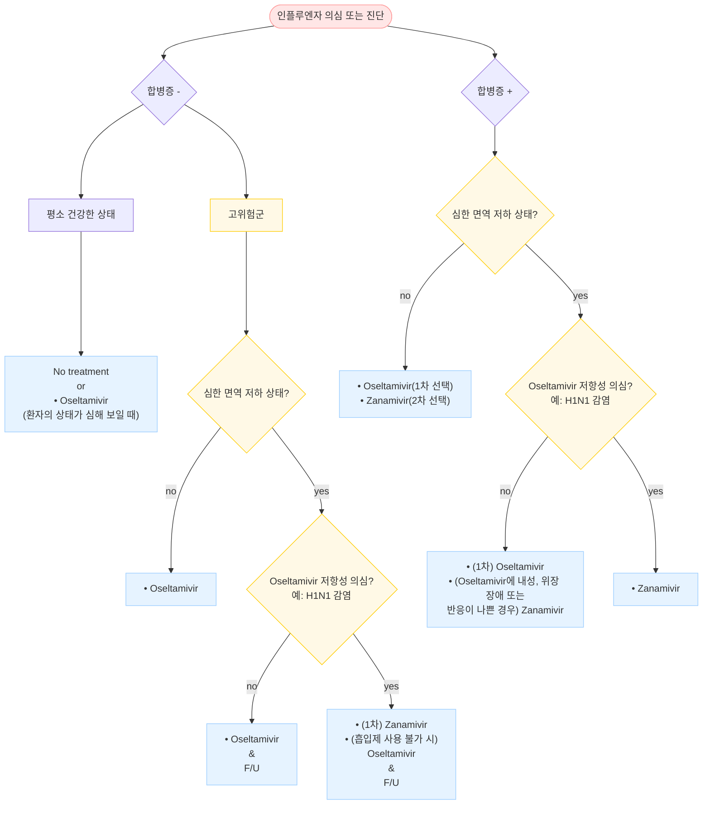
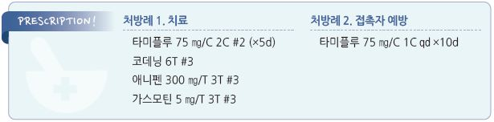

# 인플루엔자 Influenza

## 일반 사항

* influenza 바이러스 감염에 의한, 갑자기 시작되는 전신 증상 및 호흡기 증상을 일으키는 급성 호흡기 질환
* 전염 경로 : 기침/재채기/대화/호흡 시의 호흡기 분비물에 의한 공기 매개(droplet, airborne) 및 직간접 접촉 전염
* 잠복기 : 1\~4일(평균 2일)
* 증상 기간 : 7\~14일
*   전염 기간 : 증상 발생 1~~2일 전~~발생 후 5\~7일(or 발열 소멸 후 24시간);

    면역저하자와 소아에서는 연장될 수 있음(＞10일)
* 유행 시기 : 겨울~~봄(10월~~4월)
* 호발 연령 : 소아(3개월\~16세), 젊은 성인
* 호발 조건 : 밀집된 환경(예: 학교, 요양원, 군대, 교도소)

### 합병증

* 호흡기계 : 폐렴, 기관지염, 부비동염, 중이염, 기흉
* 신경계 : 뇌염, 척수염, 길랭-바레증후군
* 기타 : 심근염, 횡문근 융해증

#### 합병증 발병 고위험군

* ＜5세(특히 ＜2세), 고령(≥65세), 임신(특히 3분기), 출산 2주 내 산모, 집단/밀집 거주
* 기저 질환자 : 면역 저하, 악성 종양, 만성 폐/심/신/간 질환, 당뇨병, 대사 이상, 근육 질환, 뇌졸중, 발달 장애, 고도 비만

## 원인

* 원인균 : influenza A(주로; 조류, 돼지 등 감염 가능), B, C

#### 항원 변이

*   항원 대변이(antigenic shift) : 바이러스 표면의 HA(hemagglutinin) 또는 NA(neuraminidase)가 새로운 아형의 HA나 NA로

    바뀜; 주로 A형에서 발생하며 대유행 유발
*   항원 소변이(antigenic drift) : HA나 NA에서의 소수의 아미노산 변화로 인한 항원성의 변화(아형은 동일); A형 및 B형

    모두에서 발생하며 소유행 유발. 거의 매년 발생

## 임상 양상

* 고열(38\~41℃, 3\~7일간), 오한, 두통, 근육통
*   기침(nonproductive), 인후통, 콧물 (전형적 증상은 환자의 50%에서만

    발생함)
* 소화기 증상(주로 소아에서 발생) : 구역/구토, 설사

| **증상** | **독감** | **감기** |
| ------ | ------ | ------ |
| 발열     | 흔함, 급성 | ±      |
| 기침     | 흔함, 심함 | 흔함     |
| 근육통    | 흔함     | ±      |
| 두통     | 흔함     | ±      |
| 피로감    | 중증     | ±, 경증  |
| 인후통    | ±      | 흔함     |
| 코 막힘   | ±      | 흔함     |
| 재채기    | ±      | 흔함     |

### Ref Flags!

* 호흡 곤란
* 흉부 압박감
* 지속되는 구토
* 탈수 증상(예: 기립 시 어지럼, 소변량 감소)
* 혼돈

## 진단

* 유행 시기에는 임상 양상만으로 진단 가능

#### 인플루엔자의사환자 정의 \[인플루엔자 표본 감시 기준]

* 다음 두 가지 해당
  * ≥38℃의 갑작스러운 발열
  * 기침 또는 인후통
* 급성 고열 & 기침에 의한 양성 예측률 85%; 기침이 없으면 독감 가능성이 적음

### 검사

* 지역 내 독감이 유행하는 시기에 독감과 일치하는 증상을 가진 정상 면역 환자에 대한 진단을 위한 검사는 권고하지 않음
*   인플루엔자 검사 고려 대상 : 유행 시기에 급성 발열성 호흡기 질환이 발생한 면역저하자, 검사 결과가 치료에 영향을 줄

    때(예: 항바이러스제, 항생제 투여 결정, 고위험군, 입원 결정), 치료에 반응하지 않음, 인플루엔자 관련 합병증 의심 시

#### 신속 항원 검사 (RAT, Rapid antigen test)

* 키트에 포함된 면봉을 이용하여 코 또는 인두 분비물 채취 검사, 수 분 내 진단
* 정확도 : 특이도 90\~95%, 민감도 50\~70%(소아 70\~90%, 성인 40\~60%)
  * 유병률이 낮은 시기에는 위양성률이 높고, 유병률이 높은 시기에는 위음성률이 높아짐
  * 지역 사회 독감의사환자 비율이 10\~30%일 때 가장 정확
  * 증상 발생 후 빨리(증상 발생 72시간 내) 검사해야 정확도 향상
  * 검체 채취 방법이 검사 정확도에 큰 영향을 미침
* 임상적으로 독감이 강력히 의심되나 신속 항원 검사에서 음성인 경우에는 위음성 고려

#### 기타

* RT-PCR : 비인두 분비물 검사; 민감도 및 특이도가 가장 높은 검사. 1\~8시간 후 판정
* 직간접 면역형광법 : 수 시간 후 판정
* 바이러스 배양 : 수일 후 판정. 역학 연구나 항바이러스제 내성 연구 등에 이용
* CBC : WBC 정상 또는 약간 감소; WBC 증가 시 세균 중복 감염 의심
* 흉부 X선 : 폐렴 의심 시 고려
* 세균 검사 : 심한 증상(광범위 폐렴, 호흡 부전, 저혈압, 발열)이 있는 환자, 초기 호전 후 악화되는 환자에서 시행; 항바이러스제 치료 3\~5일 후 호전되지 않는 환자에서 고려
* 항바이러스제 내성 검사 : 항바이러스제 치료 중 또는 직후에 검사로 확인된 인플루엔자 감염 환자, 7\~10일간의 항바이러스제 치료에도 지속되는 바이러스 증식이 확인된 환자에서 고려

***

## Management

## 비-약물 치료

* 안정/휴식, 충분한 수분 및 영양 섭취
* 금연
* 공기 가습, 비강 식염수 스프레이

## 약물 치료

* 대증 치료 : 진통제, 해열제, 진해제, 소화기계 약제 (☞ p.284, p.370)
* 항바이러스제 : 합병증 발생 고위험군에 대하여 조기에 투여 시작; 증상 발생 ＜24시간에 시작해야 최대 효과
*   항생제 : 심한 증상(광범위 폐렴, 호흡 부전, 저혈압, 발열)이 있는 환자, 초기 호전 후 악화 환자(특히 항바이러스제 투여

    환자)에서 시행 (☞ p.308)

### 항바이러스제

* Neuraminidase inhibitor(예: oseltamivir, zanamivir, peramivir) : A/B형 모두에 효과
* M2 inhibitor(예: amantadine, rimantadine) : A형에만 효과; 내성균의 출현으로 권고하지 않음
*   투여 적응증 : 중증 또는 악화 경과, 합병증 발병 고위험군 (보험기준 ☞ p.1181)

    •건강한 환자의 감염에 대해여 항바이러스제는 권고하지 않음 \[NICE, IDSA]

    •고위험군이 아닌 환자라도 증상 발생 ＜48시간인 경우에는 질병 기간 단축과 증상 완화 목적으로 항바이러스제를

    투여할 수 있으나, 합병증이 발생하지 않은 증상 발생 ＞48시간의 환자에 대한 항바이러스제 투여는 권고하지 않음
* 투여 시기 : 증상 발생 후 가능한 한 빨리(＜48시간) 치료 시작
* 효과 : 평균 회복 기간이 1일(고령, 쇠약한 환자에서는 2\~3일) 단축됨
* 투여 후 호전되었다가 다시 악화되는 경우에는 2차 감염 및 합병증 여부 확인
* 중증 환자에서는 치료 기간을 연장할 수 있음
*   임신부 : oseltamivir는 미국 pregnancy category C(호주 등급 B1)이지만 위험과 이득을 고려하여 투여할 수 있음;

    peramivir는 연구 부족으로 금지
* 영아 : 생후 ＜2주 만삭아 또는 ＜1세 미숙아는 위험과 이득을 고려하여 oseltamivir 투여 가능

#### Oseltamivir

* 1차 선택제
* 용법 : 아래 용량을 1일 2회, 5일간 투여
  * 생후 2주\~1세 : 3 ㎎/㎏
  * 1\~12세 : ≤15 ㎏- 30 ㎎; ＞15\~23 ㎏- 45 ㎎; ＞23\~40 ㎏- 60 ㎎; ＞40 ㎏ 75 ㎎
  * ≥13세 : 75 ㎎
* 부작용 : 구역, 구토, 소아 신경정신계 이상(예: 환각)
  * 환각이 약의 부작용인지 병에 따른 증상인지 논란; 처방 시 보호자에게 창문 잠금 등 주의 관찰 설명
* 신 기능 저하자에서의 용량 조절 : CrCl 30\~60 ㎖/분-30 ㎎ bid, 10\~30 ㎖/분-30 ㎎ qd
* \[타미플루] 30, 45, 75 ㎎/C, \[한미플루 현탁용분말] 6 ㎎/㎖

#### Zanamivir

* 용법 : 10 ㎎ (5 ㎎ 용기 2번 흡입) bid ×5d; ≥7세 허가; 중증 환자에서는 권고 안 함(연구 부족)
* 부작용 : 천식 또는 COPD 환자에서 기관지 수축; 락토오스에 과민 반응이 있는 경우 금지
* \[리렌자 로타디스크] 5 ㎎/흡입 (포장 당 20번 흡입/5일분)

#### Baloxavir

* 기전 : mRNA transcription system에 작용하는 cap-dependent endonuclease를 억제
* 용법 : 40\~80 ㎏- 40 ㎎ 1회; ≥80 ㎏- 80 ㎎ 1회; ≥12세 허가 \[조플루자]
* 부작용 : 설사, 기침, 코/목 자극, 두통, 위장 장애

#### Peramivir

* 경구제 복용이 불가능한 환자에 대하여 고려
* 부작용 : 중증 피부 반응, 설사, 호중구 감소, 단백뇨
* 주의 : 신 기능 장애자, 고령자
* 용법 : 600 ㎎ 1회 IV (국내 허가 300 ㎎, 중증 우려 시 600 ㎎); 수액에 혼합(≤100 ㎖로 조제)하여 15\~30분간 IV \[페라미플루]; ≥2세 허가 (비보험)
*

*

## 예방

### 노출 후 항바이러스제 투여

*   투여 대상

    •독감 환자와 접촉한 합병증 발병 고위험군인 백신 미-접종자

    * 유행 균주와 백신 균주가 mis-matching되거나, 낮은 백신 반응자(예: 장기 이식, 면역억제제 투여)도 미-접종자로 간주

•의료시설 또는 장기 요양 시설에 종사하는 백신 미-접종자

•가족 등 독감 환자와 밀접하게 접촉하는 자

•장기 요양 시설의 모든 거주자 (백신 접종 여부 무관)

* 투여 시점 : 노출 후 48시간 이내 투여를 시작해야 함
*   백신 미-접종자는 백신 접종 및 2주간 예방적 항바이러스제 투여

    •생백신의 경우에는 백신 접종과 항바이러스제 투여 사이에 14일의 간격이 필요함 (☞ p.1106)
* 투여 기간 : 노출 후 7~~10일; 장기 요양 시설의 경우 마지막 환자 발생 후 10~~14일까지
* Oseltamivir : 국내 ≥1세, CDC ≥3개월에서 사용 승인
  * 3개월\~＜1세 : 3 ㎎/㎏ qd
  * 1\~12세 : ≤15 ㎏-30 ㎎; ＞15\~23 ㎏-45 ㎎; ＞23\~40 ㎏-60 ㎎; ＞40 ㎏-75 ㎎ qd
  * ≥13세 : 75 ㎎ qd
  * 신 기능 저하자에서는 감량 : CrCl 30\~60 ㎖/분-30 ㎎ qd, 10\~30 ㎖/분-30 ㎎ qod
* Zanamivir : 10 ㎎(2번 흡입) qd; ≥7세 허가 (✽FDA ≥5세 승인)
* Xofluza : 증상이 있는 사람과 밀접 접촉 후 40 ㎎ 1회; ≥12세 허가

### 노출 전 항바이러스제 투여 대상

* 중증 합병증이 우려되는 사람(예: 장기 이식 병동 입원, 심각한 면역 저하, 입원 중인 신생아) 중 백신 사용이 어렵거나 백신 효과를 기대할 수 없는 경우

### 격리 기간

* 인플루엔자로 인한 등교, 등원, 출근 중지 기간 : 해열제 없이 정상 체온 회복 후 24시간이 경과할 때까지; 단 해열제를 투한 경우에는 마지막 해열제 투약 시점부터 48시간 경과 해야 함
* 중증의 증상을 보이거나 면역저하자 등의 경우는 의사의 판단에 따라 등교, 등원, 출근 제한 기간이 달라질 수 있음 \[질병관리본부(2022)]

### 예방접종

☞ ㅇ**질병코드** J10 확인된 계절성 인플루엔자바이러스에 의한 인플루엔자

J11 바이러스가 확인되지 않은 인플루엔자

