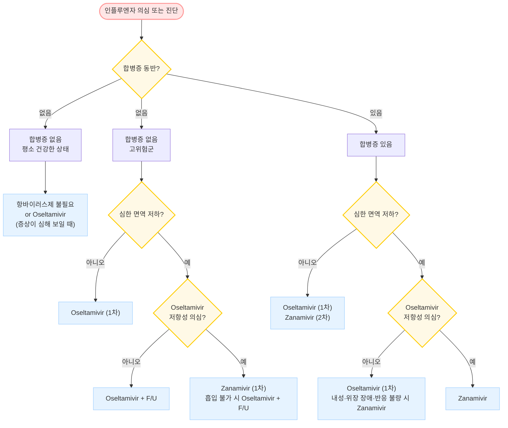

# 인플루엔자 Influenza


## <mark style="color:green;">일반 사항</mark>

* influenza 바이러스 감염에 의한, 갑자기 시작되는 전신 증상 및 호흡기 증상을 특징으로 하는 급성 호흡기 질환
* 전염 경로 : 기침·재채기·대화·호흡 시 호흡기 분비물을 통한 공기 매개(droplet, airborne) 및 직간접 접촉 전염
* 잠복기 : 1\~4일 (평균 2일)
* 증상 기간 : 7\~14일
* 전염 기간 : 증상 발생 1\~2일 전 ― 발생 후 5\~7일 (또는 발열 소멸 후 24시간); 면역저하자·소아에서는 연장 가능 (>10일)
* 유행 시기 : 겨울\~봄 (10월\~4월)
* 호발 연령 : 소아 (3개월\~16세), 젊은 성인
* 호발 조건 : 밀집된 환경 (예: 학교, 요양원, 군대, 교도소)

### <mark style="color:orange;">합병증</mark>

* 호흡기계 : 폐렴, 기관지염, 부비동염, 중이염, 기흉
* 신경계 : 뇌염, 척수염, 길랭-바레증후군
* 기타 : 심근염, 횡문근 융해증

#### <mark style="color:$primary;">합병증 발병 고위험군</mark>

* <5세 (특히 <2세), 고령 (≥65세), 임신 (특히 3분기), 출산 2주 이내 산모, 집단·밀집 거주
* 기저 질환자 : 면역 저하, 악성 종양, 만성 폐/심/신/간 질환, 당뇨병, 대사 이상, 근육 질환, 뇌졸중, 발달 장애, 고도 비만

***

## <mark style="color:green;">원인</mark>

* 원인균 : influenza A(주로; 조류·돼지 등 동물 감염 가능), B, C형

### <mark style="color:orange;">항원 변이</mark>

#### <mark style="color:$primary;">항원 대변이 (antigenic shift)</mark>

* 바이러스 표면의 HA(hemagglutinin) 또는 NA(neuraminidase)가 새로운 아형으로 교체
* 주로 A형에서 발생하며 **대유행(pandemic)** 유발

#### <mark style="color:$primary;">항원 소변이 (antigenic drift)</mark>

* HA·NA에서의 소수 아미노산 변화로 인한 항원성 변화 (아형은 동일)
* A형 및 B형 모두에서 발생하며 **소유행(epidemic)** 유발; 거의 매년 발생 → 매년 예방접종 필요

***

## <mark style="color:green;">임상 양상</mark>

* 고열 (38\~41℃, 3\~7일간), 오한, 두통, 근육통 — 급격한 발병이 특징
* 기침 (nonproductive), 인후통, 콧물; 전형적 증상은 환자의 50%에서만 나타남
* 소화기 증상 (주로 소아): 구역/구토, 설사

<table><thead><tr><th width="160">증상</th><th width="240">독감 (인플루엔자)</th><th>감기 (일반 상기도감염)</th></tr></thead><tbody><tr><td>발열</td><td>흔함, 급성·고열 (38\~41℃)</td><td>± (미열)</td></tr><tr><td>기침</td><td>흔함, 심함</td><td>흔함</td></tr><tr><td>근육통</td><td>흔함, 심함</td><td>± 경미</td></tr><tr><td>두통</td><td>흔함</td><td>±</td></tr><tr><td>피로감</td><td>중증, 초기부터</td><td>± 경증</td></tr><tr><td>인후통</td><td>±</td><td>흔함</td></tr><tr><td>코 막힘</td><td>±</td><td>흔함</td></tr><tr><td>재채기</td><td>±</td><td>흔함</td></tr><tr><td>발병 양상</td><td>갑작스러움 (수 시간 내)</td><td>서서히 (1\~3일)</td></tr></tbody></table>

### <mark style="color:$danger;">🚩 Red Flags!</mark>

<mark style="color:$danger;">**즉각 조치 또는 응급 이송**</mark> <mark style="color:$danger;">— 생명 위협 또는 즉각적 위해 가능성</mark>

* 호흡 곤란, 청색증 — 폐렴·호흡 부전 의심
* 의식 변화(혼돈, 섬망) 또는 경련
* 저혈압 또는 쇼크 징후
* 중증 탈수 — 기립 시 현기증 + 소변량 현저히 감소 + 피부 탄력 저하 동반

<mark style="color:$warning;">**당일 또는 조기 의뢰**</mark>

* 흉부 압박감 또는 지속적 흉통
* 지속적 구토로 경구 수분·약물 섭취 불가
* 고위험군 (임신부, ≥65세, 면역저하자)에서 증상 악화 또는 호전 없음
* 초기 호전 후 재악화 — 세균성 중복 감염(폐렴, 부비동염 등) 의심

<mark style="color:$info;">**외래 추적 / 추가 평가 계획**</mark> <mark style="color:$info;">— 즉각 위험 낮으나 호전 없으면 의뢰</mark>

* 항바이러스제 투여 3\~5일 후에도 호전 없는 경우 — 내성 또는 합병증 평가
* 소아에서 환각·이상 행동 발생 — oseltamivir 부작용 vs. 뇌염 감별 필요
* 해열 후 재발열 — 세균성 합병증 또는 2차 감염 의심

***

## <mark style="color:green;">진단</mark>

* 유행 시기에는 임상 양상만으로 진단 가능
* **코로나19·독감 동시 유행기**에는 콤보 신속 항원 검사(COVID-19 + 인플루엔자 A/B) 사용 권장

### <mark style="color:orange;">인플루엔자의사환자 정의</mark> <mark style="color:orange;">\[인플루엔자 표본 감시 기준]</mark>

다음 **두 가지** 해당:

* ≥38℃의 갑작스러운 발열
* 기침 또는 인후통


급성 고열 + 기침의 양성 예측률 ≈85%; 기침이 없으면 독감 가능성이 낮음


### <mark style="color:orange;">검사</mark>

* **지역 사회 유행 시기**에 독감과 일치하는 증상을 가진 정상 면역 외래 환자 → 검사 불필요 (임상 진단으로 충분)
* **인플루엔자 검사 고려 대상**: 유행기에 급성 발열성 호흡기 질환이 발생한 면역저하자, 검사 결과가 치료 결정에 영향을 줄 때 (항바이러스제·항생제 투여 결정, 고위험군, 입원 결정), 치료에 반응하지 않을 때, 인플루엔자 관련 합병증 의심 시

#### <mark style="color:$primary;">신속 항원 검사 (RAT, Rapid Antigen Test)</mark>

* 키트에 포함된 면봉으로 비강 또는 인두 분비물 채취; 수 분 내 진단
* **정확도**: 특이도 90\~95%, 민감도 50\~70% (소아 70\~90%, 성인 40\~60%)
  * 유병률이 낮은 시기 → 위양성률 증가; 유병률이 높은 시기 → 위음성률 증가
  * 지역사회 독감의사환자 비율 10\~30%일 때 가장 정확
  * 증상 발생 후 빨리 (72시간 이내) 검사해야 정확도 향상
  * 검체 채취 방법이 정확도에 큰 영향을 미침
* 임상적으로 독감이 강력히 의심되나 RAT 음성 → **위음성 가능성 고려** (임상적 판단 우선)
* 현재 COVID-19 + 인플루엔자 A/B **콤보 RAT**가 널리 사용됨

#### <mark style="color:$primary;">기타 검사</mark>

* **RT-PCR** : 비인두 분비물 검사; 민감도·특이도가 가장 높음; 1\~8시간 후 판정
* **직간접 면역형광법** : 수 시간 후 판정
* **바이러스 배양** : 수일 후 판정; 역학 연구·항바이러스제 내성 연구에 이용
* **CBC** : WBC 정상 또는 약간 감소; WBC 증가 시 세균 중복 감염 의심
* **흉부 X선** : 폐렴 의심 시 고려
* **세균 검사** : 심한 증상 (광범위 폐렴, 호흡 부전, 저혈압, 발열) 환자, 초기 호전 후 악화 환자, 항바이러스제 치료 3\~5일 후 호전 없는 환자에서 고려
* **항바이러스제 내성 검사** : 항바이러스제 치료 중/직후 확인된 감염 환자, 7\~10일 치료에도 지속적 바이러스 증식이 확인된 환자에서 고려

***



<p align="center"><strong>항바이러스제 선택 알고리듬</strong></p>

<p align="center"><em><mark style="color:$info;">Ref. IDSA Influenza Clinical Practice Guidelines / CDC Influenza Antiviral Recommendations (2024–2025)</mark></em></p>

***

## <mark style="background-color:$warning;">Management</mark>


**인플루엔자 치료 원칙**

* **합병증 발병 고위험군** → 증상 발생 즉시 항바이러스제 투여 시작; 검사 결과를 기다리지 않음
* **비고위험군, 증상 발생 <48시간** → 항바이러스제 투여 고려 가능 (질병 기간 단축 목적)
* **비고위험군, 합병증 없는 증상 발생 >48시간** → 항바이러스제 권고하지 않음 \[NICE, IDSA, WHO 2024]
* 중증 또는 악화 경과 → 증상 발생 시점에 무관하게 항바이러스제 투여


***

## <mark style="color:green;">비-약물 치료</mark>

* 안정·충분한 휴식
* 충분한 수분 및 영양 섭취
* 금연 (기도 점막 회복 촉진)
* 실내 공기 가습, 비강 식염수 스프레이 (점막 건조 완화)
* 발열 시 미온수 찜질, 얇은 옷 착용; 과도한 보온 금지

***

## <mark style="color:green;">약물 치료</mark>

* **대증 치료** : 진통·해열제 (☞ p.284), 진해제 (☞ p.370), 소화기계 약제
  * ⚠️ 소아·청소년에서 아스피린 투여 금지 — Reye 증후군 위험
* **항생제** : 세균성 중복 감염 (광범위 폐렴, 호흡 부전, 저혈압, 초기 호전 후 악화)이 의심되는 경우에 한하여 사용 (☞ p.308); 인플루엔자 단독 감염에 대한 예방적 항생제는 권고하지 않음

### <mark style="color:orange;">항바이러스제</mark>

* **Neuraminidase inhibitor** (oseltamivir, zanamivir, peramivir) : A·B형 모두에 효과
* **Cap-dependent endonuclease inhibitor** (baloxavir) : A·B형 모두에 효과; 바이러스 복제 초기 단계 차단 → 24시간 내 바이러스 부하 신속 감소
* **M2 inhibitor** (amantadine, rimantadine) : A형에만 효과; 내성 빈발로 현재 **권고하지 않음**
* **투여 적응증** : 중증 또는 악화 경과, 합병증 발병 고위험군 (보험 기준 ☞ p.1181)
  * 건강한 환자의 합병증 없는 감염 → 항바이러스제 **권고하지 않음** \[NICE, IDSA]
  * 고위험군이 아닌 환자라도 증상 발생 <48시간이면 질병 기간 단축·증상 완화 목적으로 투여 가능
* **투여 시기** : 증상 발생 후 가능한 한 빨리 (<48시간) 치료 시작; 증상 발생 <24시간에 시작 시 최대 효과
* **효과** : 평균 회복 기간 약 1일 단축 (고령·쇠약 환자에서 2\~3일 단축)
* 투여 후 호전되었다가 재악화 → **2차 감염 및 합병증** 여부 확인
* 중증 환자에서는 치료 기간 연장 가능


**WHO 2024 인플루엔자 진료 지침 주요 업데이트**

* 비중증 고위험군: baloxavir 조건부 권고 (증상 발생 48시간 이내)
* 중증 환자: oseltamivir 조건부 권고
* 비고위험군 비중증: 어떤 항바이러스제도 권고하지 않음 \[WHO, 2024]


#### <mark style="color:$primary;">Oseltamivir</mark>

* **1차 선택제** (소아, 임신부, 입원 환자, 중증·복잡 경과 외래 환자에서 우선 선택)
* **용법** : 아래 용량을 1일 2회, 5일간 투여

| 연령/체중 | 치료 용량 (1회) |
| --- | --- |
| 생후 2주\~1세 미만 | 3 ㎎/㎏ |
| 1\~12세, ≤15 ㎏ | 30 ㎎ |
| 1\~12세, >15\~23 ㎏ | 45 ㎎ |
| 1\~12세, >23\~40 ㎏ | 60 ㎎ |
| 1\~12세, >40 ㎏ | 75 ㎎ |
| ≥13세 | 75 ㎎ |

* **부작용** : 구역, 구토 (식사와 함께 복용 시 감소), 소아 신경정신계 이상 (환각, 이상 행동)
  * 환각이 약의 부작용인지 뇌염 증상인지 논란이 있음; 처방 시 보호자에게 창문·문 잠금 등 주의 관찰 지도 필요
* **신 기능 저하 시 감량** : CrCl 30\~60 ㎖/분 → 30 ㎎ bid; CrCl 10\~30 ㎖/분 → 30 ㎎ qd
* **임신부** : 미국 pregnancy category C (호주 B1); 위험·이득을 고려하여 투여 가능
* **영아** : 생후 <2주 만삭아 또는 <1세 미숙아 → 위험·이득을 고려하여 투여 가능
* <mark style="color:blue;">\[타미플루]</mark> 30, 45, 75 ㎎/캡슐 / <mark style="color:blue;">\[한미플루 현탁용분말]</mark> 6 ㎎/㎖

#### <mark style="color:$primary;">Zanamivir</mark>

* **용법** : 10 ㎎ (5 ㎎ 흡입기 2회 흡입) bid × 5일; ≥7세 허가; 중증 환자에서는 권고하지 않음 (근거 부족)
* **부작용** : 천식·COPD 환자에서 기관지 수축 (사용 시 기관지확장제 사전 투여 권장); 락토오스 과민 반응 시 금기
* <mark style="color:blue;">\[리렌자 로타디스크]</mark> 5 ㎎/흡입 (포장당 20회 흡입, 5일분)

#### <mark style="color:$primary;">Baloxavir marboxil</mark>

* **기전** : cap-dependent endonuclease 억제 → mRNA 전사 차단; neuraminidase inhibitor와 다른 기전으로 내성 교차 없음
* **특징** : **단회 경구 투여**; 인플루엔자 B형에서 oseltamivir 대비 증상 회복 기간 >24시간 추가 단축 (CAPSTONE-2, 2019)
* **용법** : <80 ㎏ → 40 ㎎ 1회; ≥80 ㎏ → 80 ㎎ 1회; **≥12세** 허가 (<mark style="color:blue;">\[조플루자]</mark>)
  * ✽ FDA는 2022년 건강한 소아 **≥5세**에서도 체중 기반 용량으로 치료 승인 확대; 국내 허가 기준 확인 필요
* **부작용** : 설사, 기침, 비강·인후 자극, 두통, 위장 장애
* **주의** : 유제품·칼슘 강화 음료 등 다가 양이온 함유 식품과 동시 복용 시 흡수 감소 → 2시간 전후 복용 회피

#### <mark style="color:$primary;">Peramivir</mark>

* **적응증** : 경구 복용이 불가능한 환자 (예: 심한 구토, 위장관 흡수 장애, 의식 저하)
* **용법** : 300\~600 ㎎ 1회 IV; 수액에 혼합 (≤100 ㎖)하여 15\~30분간 주입; ≥2세 허가 (비급여)
  * 중증 또는 우려 시 600 ㎎ 사용 가능 (국내 허가 300 ㎎ 기준)
* **부작용** : 중증 피부 반응, 설사, 호중구 감소, 단백뇨
* **주의** : 신 기능 장애자, 고령자에서 감량
* **임신부** : 연구 부족으로 사용 권고하지 않음
* <mark style="color:blue;">\[페라미플루]</mark>

***

## <mark style="color:green;">예방</mark>

### <mark style="color:orange;">노출 후 항바이러스제 투여</mark>

#### <mark style="color:$primary;">투여 대상</mark>

* 독감 환자와 접촉한 **합병증 발병 고위험군인 백신 미접종자**
  * 유행 균주와 백신 균주 불일치 또는 낮은 백신 반응자 (예: 장기 이식, 면역억제제 투여)도 미접종자로 간주
* 의료시설 또는 장기 요양 시설 종사 백신 미접종자
* 가족 등 독감 환자와 밀접 접촉하는 자
* 장기 요양 시설의 **모든 거주자** (백신 접종 여부 무관)

#### <mark style="color:$primary;">투여 시점 및 기간</mark>

* 노출 후 **48시간 이내** 투여 시작
* 투여 기간 : 노출 후 7\~10일; 장기 요양 시설의 경우 마지막 환자 발생 후 10\~14일까지
* 백신 미접종자 → 백신 접종 + 2주간 예방적 항바이러스제 병행 투여
  * ⚠️ **생백신** 접종 시 항바이러스제와 14일 간격 필요 (생백신 효과 저해 방지) (☞ p.1106)

#### <mark style="color:$primary;">예방적 항바이러스제 용량</mark>

**Oseltamivir** (국내 ≥1세, CDC ≥3개월 승인):

| 연령/체중 | 예방 용량 (1회, qd) |
| --- | --- |
| 3개월\~<1세 | 3 ㎎/㎏ |
| 1\~12세, ≤15 ㎏ | 30 ㎎ |
| 1\~12세, >15\~23 ㎏ | 45 ㎎ |
| 1\~12세, >23\~40 ㎏ | 60 ㎎ |
| 1\~12세, >40 ㎏ | 75 ㎎ |
| ≥13세 | 75 ㎎ |

신 기능 저하 시 감량: CrCl 30\~60 ㎖/분 → 30 ㎎ qd; CrCl 10\~30 ㎖/분 → 30 ㎎ qod

**Zanamivir** : 10 ㎎ (2회 흡입) qd; ≥7세 허가 (✽FDA ≥5세 승인)

**Baloxavir** : 증상이 있는 사람과 밀접 접촉 후 40 ㎎ 1회 (≥80 ㎏ → 80 ㎎); ≥12세 허가 (<mark style="color:blue;">\[조플루자]</mark>)

### <mark style="color:orange;">노출 전 항바이러스제 투여</mark>

* 중증 합병증이 우려되는 사람 (예: 장기 이식 병동 입원, 심각한 면역 저하, 입원 중인 신생아) 중 백신 사용이 어렵거나 백신 효과를 기대할 수 없는 경우

### <mark style="color:orange;">격리 기간</mark>

* 등교·등원·출근 중지 기간 : **해열제 없이** 정상 체온 회복 후 24시간이 경과할 때까지
  * 해열제를 사용한 경우 : 마지막 해열제 투약 시점으로부터 **48시간** 경과 후
* 중증 증상 또는 면역저하자 : 의사 판단에 따라 격리 기간 연장 가능 \[질병관리본부, 2022]
* 입원 환자 : 표준 예방책 + 비말 예방책 적용; 증상 발생 후 7일 또는 해열 후 24시간 중 **더 긴** 시점까지

### <mark style="color:orange;">예방접종</mark>

☞ [인플루엔자 예방접종](../231_/210_-vaccination.md#influenza)

***

### <mark style="color:red;">질병코드</mark>

J10 확인된 계절성 인플루엔자바이러스에 의한 인플루엔자

J11 바이러스가 확인되지 않은 인플루엔자

***

## <mark style="color:purple;">처방례</mark>

> **처방례 1. 성인 치료 (전형적)**
>
> ```
> 타미플루 75 ㎎/C    2C  #2  × 5일
> 코데닝              6T  #3
> 애니펜 300 ㎎/T     3T  #3
> 가스모틴 5 ㎎/T     3T  #3
> ```
>
> _✽식사와 함께 복용하면 구역·구토 부작용을 줄일 수 있음. 증상이 호전되더라도 5일 완전 복용._

> **처방례 2. 소아 치료 (체중 20 ㎏, 만 4세)**
>
> ```
> 한미플루 현탁용분말 6 ㎎/㎖    1병  (조제 후 45 ㎎/7.5 ㎖ bid × 5일)
> 타이레놀 현탁액 160 ㎎/5 ㎖   필요시
> ```
>
> _✽체중별 용량: >15\~23 ㎏ → 45 ㎎ bid. 현탁액 조제 후 냉장 보관, 10일 이내 사용._
> _✽소아에서 환각·이상 행동 발생 시 즉시 내원하도록 보호자에게 설명._

> **처방례 3. Baloxavir 단회 투여 (성인, 인플루엔자 B형 또는 단회 복용 선호)**
>
> ```
> 조플루자 40 ㎎/T    1T  1회 (식사와 무관하게 복용 가능)
> 애니펜 300 ㎎/T     3T  #3  × 3일
> ```
>
> _✽증상 발생 48시간 이내 복용해야 효과적. 인플루엔자 B형에서 oseltamivir 대비 약 1일 이상 추가 회복 효과._
> _✽칼슘 보충제·제산제·유제품 등과 동시 복용 시 흡수 감소 — 2시간 전후 회피._

> **처방례 4. 접촉자 예방 — 성인 (고위험군, 노출 후 48시간 이내)**
>
> ```
> 타미플루 75 ㎎/C    1C  qd  × 10일
> ```
>
> _✽장기 요양 시설 유행 발생 시 마지막 환자 발생 후 10\~14일까지 투여 연장._
> _✽백신 미접종자 → 예방약 시작과 동시에 백신 접종; 단 생백신 시 14일 간격 필요._

> **처방례 5. 접촉자 예방 — 소아 (체중 15 ㎏ 이하, ≥1세)**
>
> ```
> 한미플루 현탁용분말 6 ㎎/㎖    1병  (조제 후 30 ㎎/5 ㎖ qd × 10일)
> ```
>
> _✽체중별 예방 용량: ≤15 ㎏ → 30 ㎎ qd._

***

### <mark style="color:$success;">핵심 복약 지도</mark>

> **타미플루(oseltamivir) 복용 방법**
>
> 1. **식사 중 또는 직후** 복용하십시오 — 구역·구토 부작용을 줄일 수 있습니다.
> 2. **1일 2회(아침·저녁), 5일간** 복용하십시오. 증상이 호전되어도 중단하지 마십시오 — 중단 시 바이러스 재활성화 및 내성 위험이 있습니다.
> 3. 복용을 잊은 경우: 다음 복용 시간이 **2시간 이상** 남아 있으면 즉시 복용, **2시간 미만**이면 그냥 넘기고 다음 정해진 시간에 복용하십시오.

> **소아 신경정신계 이상 반응 주의 (보호자 지도)**
>
> * oseltamivir 복용 소아에서 드물게 **환각, 이상 행동**이 보고됩니다. 이것이 약의 부작용인지 독감 자체 증상인지 아직 논란이 있습니다.
> * 복용 기간 중 아이를 혼자 두지 마시고, **창문·문을 잠가 추락 사고를 예방**하십시오.
> * 이상 행동 발생 시 즉시 내원하십시오.

> **조플루자(baloxavir) 복용 주의사항**
>
> * 단 **1회** 복용으로 치료가 완료됩니다.
> * **칼슘 보충제, 제산제(위산제), 유제품** 등과 동시 복용하면 약 흡수가 크게 줄어듭니다 — 복용 **2시간 전후**에는 이러한 식품·약제를 피하십시오.

> **격리 및 전파 예방**
>
> * 해열제 없이 정상 체온 회복 후 **24시간**까지 학교·직장에 가지 마십시오. (해열제를 드셨다면 마지막 복용 후 **48시간** 경과 후 가능)
> * 외출 시 마스크 착용, 손 씻기 (30초 이상), 기침·재채기 시 팔꿈치로 가리기
> * 회복 중에도 면역저하자·고령자·임신부 등 고위험군과의 근접 접촉은 주의하십시오.

> **언제 다시 병원을 방문해야 하나요?**
>
> * 항바이러스제 복용 **3\~5일 후에도 호전이 없는** 경우
> * 처음 나아지다가 **다시 악화**되는 경우 (폐렴·부비동염 등 2차 감염 의심)
> * 소아에서 **환각, 이상 행동** 발생 시 — 즉시 내원
> * **호흡 곤란, 흉부 압박감, 의식 변화** 발생 시 — 즉시 응급실

***

### <mark style="color:blue;">환자 안내서</mark>


**독감(인플루엔자)은 감기와 다른 급성 호흡기 질환입니다**

독감은 인플루엔자 바이러스에 의한 급성 호흡기 질환으로, 갑작스러운 고열·심한 근육통·극심한 피로감이 특징입니다. 대부분 1\~2주 내에 자연 회복되지만, 어린이·고령자·임신부·만성 질환자 등에서는 폐렴 등 합병증이 생길 수 있습니다.


#### <mark style="color:$primary;">독감은 어떻게 전파되나요?</mark>

* 기침·재채기·대화 시 나오는 작은 비말(침방울)을 통해 전파됩니다.
* 바이러스가 묻은 물체를 만진 뒤 눈·코·입을 만져도 감염될 수 있습니다.
* 증상이 생기기 **1\~2일 전부터** 이미 전파력이 있으므로, 증상이 없어도 유행 시기에는 주의가 필요합니다.

#### <mark style="color:$primary;">집에서 어떻게 관리하나요?</mark>

* **충분히 쉬십시오.** 무리한 활동은 회복을 늦춥니다.
* **물을 자주 마십시오.** 발열·발한으로 탈수가 오기 쉽습니다. 구역이 있을 때는 소량씩 자주 마십시오.
* **해열제를 사용하십시오.** 고열로 불편하면 아세트아미노펜(타이레놀)을 복용하십시오. 소아·청소년에게는 **아스피린을 주지 마십시오** (Reye 증후군 위험).
* 실내 습도를 적절히 유지하고 (50\~60%), 환기를 자주 하십시오.
* **마스크를 착용**하고 가족과 거리를 두십시오. 특히 고령자·영유아·임신부와의 접촉을 피하십시오.

#### <mark style="color:$primary;">항바이러스제(타미플루 등)는 언제 필요한가요?</mark>

* 독감은 대부분 자연 회복되므로, **건강한 성인에서는 항바이러스제가 반드시 필요하지 않습니다.**
* 다음에 해당하면 처방받는 것이 도움이 됩니다:
  * 65세 이상 고령자, 임신부, 2세 미만 영아
  * 당뇨병·심장병·폐 질환·면역 저하 등 만성 질환자
  * 증상이 심하거나 빠르게 나빠지는 경우
* 항바이러스제는 **증상 발생 후 48시간 이내**에 복용할수록 효과가 큽니다.

#### <mark style="color:$primary;">예방접종이 중요합니다</mark>

* 인플루엔자 바이러스는 매년 유행 균주가 바뀌므로 **매년** 예방접종을 받으십시오.
* 접종 권장 시기 : **10월\~11월** (늦어도 12월까지)
* 고위험군 (65세 이상, 임신부, 만성 질환자, 의료인)은 **무료 접종**이 지원됩니다.
* 예방접종 후 2주 후부터 효과가 나타납니다; 접종 후에도 완전한 예방은 어려우므로 손 씻기·마스크 착용 등 위생 관리를 병행하십시오.

#### <mark style="color:$primary;">이럴 때는 즉시 병원을 방문하세요</mark>

* 숨이 차거나, 호흡이 빠르거나 힘드십시오
* 가슴이 압박감이 있거나 아프십시오
* 구토가 지속되어 물도 마시기 어려우십시오
* 소변이 거의 나오지 않거나 입이 심하게 마르십시오
* 말이 어눌하거나 의식이 흐려지십시오
* 어린이에서 깨우기 힘들 정도로 무기력하거나 환각·이상 행동이 나타나십시오
* 처음에 나아지다가 갑자기 다시 나빠지십시오
