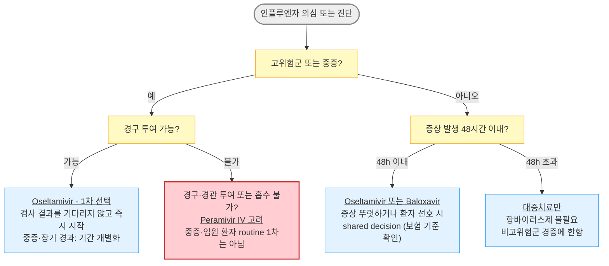

# 인플루엔자 Influenza

## <mark style="color:green;">일반 사항</mark>

* influenza 바이러스 감염에 의한, 갑자기 시작되는 전신 증상 및 호흡기 증상을 특징으로 하는 급성 호흡기 질환
* 전염 경로 : 감염자가 기침·재채기·대화·호흡할 때 배출하는 호흡기 입자(비말 및 작은 입자)를 통해 주로 전파; 오염된 손·물체를 통한 접촉 전파도 가능. 의료기관에서 에어로졸 발생 시술 시에는 공기주의 적용
* 잠복기 : 1\~4일 (평균 2일)
* 증상 기간 : 전신 증상(발열·근육통) 3\~7일; 기침·피로감은 1\~2주 지속 가능
* 전염 기간 : 일반적으로 증상 발생 약 1일 전부터 발생 후 5\~7일까지; 면역 저하자·소아에서는 10일 이상 연장 가능
* 유행 시기 : 국내에서는 주로 겨울\~봄에 유행하나, 유행 시기와 규모는 절기별로 달라질 수 있음
* 역학 : 모든 연령에서 발생하며 소아에서 감염률이 높음; 중증 합병증은 영유아·고령자·임신부·기저 질환자에서 흔함
* 전파 위험이 높은 환경 : 학교, 요양원, 군대, 교도소 등 밀집·집단생활 환경

### <mark style="color:orange;">합병증</mark>

* 호흡기계 : 1차성 인플루엔자 폐렴, 2차성 세균성 폐렴 (_S. pneumoniae_ 가장 흔함; _H. influenzae_, _S. aureus_ necrotizing pneumonia 포함), 기관지염, 부비동염, 중이염
* 신경계 : 뇌염, 척수염, 길랭-바레증후군
* 심장 : 심근염·심낭염; 심근염이 의심되거나 확인된 경우 운동을 제한하고 전문 평가
* 기타 : 횡문근 융해증; 기저 심혈관 질환자에서 급성 심근경색(AMI) 트리거

#### <mark style="color:$primary;">합병증 발병 고위험군</mark>

* ＜5세 (특히 ＜2세), 고령 (≥65세), 임신 전 기간, 출산 2주 이내 산모
* 기저 질환자 : 면역 저하, 악성 종양, 만성 폐/심/신/간 질환, 당뇨병 등 대사 질환, 신경·신경근 질환, 뇌졸중, 발달 장애, 고도 비만(BMI ≥40 ㎏/㎡)
* 최근 심혈관 사건(심근경색, 뇌졸중) 병력이 있는 환자를 포함한 심혈관 질환자 - 인플루엔자가 급성 심혈관 사건의 트리거가 될 수 있음

## <mark style="color:green;">원인</mark>

* 원인 바이러스 : 계절성 인플루엔자는 주로 influenza A·B형에 의해 발생. C형은 대개 산발적이고 경한 감염을 일으킴

### <mark style="color:orange;">항원 변이</mark>

#### <mark style="color:$primary;">항원 대변이 (antigenic shift)</mark>

* 서로 다른 인플루엔자 A 바이러스 사이의 유전자 분절 재편성(reassortment) 등으로 HA(hemagglutinin) 또는 NA(neuraminidase)가 크게 변하여 새로운 아형 출현
* A형에서 발생하며 대유행(pandemic)을 유발할 수 있음

#### <mark style="color:$primary;">항원 소변이 (antigenic drift)</mark>

* HA·NA에서의 소수 아미노산 변화로 인한 항원성 변화 (아형은 동일)
* A형 및 B형 모두에서 발생하며 계절 유행(epidemic)을 유발; 거의 매년 발생 → 매년 예방접종 필요


조류·돼지 등 동물 유래 신종 인플루엔자 A 감염이 의심되면 일반 계절성 인플루엔자와 구분하여 즉시 관할 보건소에 신고·상담한다. 발병 전 10일 이내 발생 지역 방문, 감염·폐사한 가금류·야생조류·돼지 또는 기타 감염 가능 포유류와의 접촉, 관련 환경 노출력을 확인한다. 결막염만으로 발현할 수도 있으며, 구체적인 사례 정의와 신고 범위는 해당 시점의 질병관리청 지침을 따른다.


### <mark style="color:$danger;">🚩 Red Flags!</mark>

<mark style="color:$danger;">**즉각 조치 또는 응급 이송**</mark>

* 호흡 곤란, 청색증 - 폐렴·호흡 부전 의심
* 의식 변화 (혼돈, 섬망) 또는 경련
* 저혈압 또는 쇼크 징후
* 중증 탈수 - 기립 시 현기증 + 소변량 현저히 감소 + 피부 탄력 저하 동반
* 심한·지속적인 흉통, 실신 또는 급격한 전신 상태 악화

<mark style="color:$warning;">**당일 또는 조기 의뢰**</mark>

* 경증이더라도 새로 발생한 흉부 압박감·흉통 또는 심계항진
* 지속적 구토로 경구 수분·약물 섭취 불가
* 고위험군에서 증상 악화 또는 예상 경과보다 호전이 더딤
* 초기 호전 후 재악화·재발열, 화농성 객담, 산소포화도 저하 또는 국소 수포음 → 세균성 중복 감염 평가
* 회복기 중 운동 시 호흡 곤란·흉통·심계항진 → 심근염
* 소아에서 환각·이상 행동 발생 → 아이를 혼자 두지 말고 사고를 예방하면서 즉시 평가; 인플루엔자 관련 뇌병증/뇌염 및 약물 관련 가능성 감별

<mark style="color:$info;">외래 추적 / 추가 평가 계획</mark> <mark style="color:$info;">- 즉각 위험 낮으나 호전 없으면 의뢰</mark>

* 항바이러스제 투여 48\~72시간 후에도 전혀 호전되지 않거나 악화
* 해열 후 재발열 → 세균성 합병증, 2차 감염
* 기침·피로감이 2주 이상 지속되거나 악화 → 폐렴, 기저 질환 악화 등 추가 평가; 흉통·새로운 호흡 곤란·심계항진·실신·운동불내력 동반 시 심근염 평가

## <mark style="color:green;">임상 양상</mark>

* 발열·오한, 두통, 근육통·권태감이 갑자기 시작하는 경우가 전형적이나, 발열이 없거나 증상이 비전형적일 수 있음
* 기침(주로 마른기침), 인후통, 콧물
* 소화기 증상 (주로 소아) : 구역/구토, 설사
* 고령자 비전형적 증상 : 고열 없이 기력 저하·식욕 부진·섬망(delirium)만으로 내원하는 경우 多; 유행 시기에는 독감을 적극 의심할 것

**독감 후 세균성 폐렴 의심 신호 (Bacterial Superinfection)**

* 초기 호전 후 재악화·재발열 또는 지속적 고열과 함께 다음 중 하나 이상 동반 : ⓵ 화농성 객담 증가, ⓶ 흉막성 흉통, ⓷ 국소 수포음, ⓸ 산소포화도 감소, ⓹ WBC 상승
* 조치 : CXR ± 세균 검사 ± 항생제 평가
  * 경험적 항생제는 _S. pneumoniae_를 주요 표적으로 하며, 중증·괴사성 폐렴에서는 _S. aureus_(MRSA 포함) 및 _S. pyogenes_까지 고려

#### <mark style="color:$primary;">독감 vs 감기 임상 양상</mark>

<table><thead><tr><th width="150">증상</th><th width="230">독감 (인플루엔자)</th><th>감기 (일반 상기도감염)</th></tr></thead><tbody><tr><td>발열</td><td>흔함, 갑작스러운 발열(고열 가능)</td><td>± (미열)</td></tr><tr><td>기침</td><td>흔함, 심함</td><td>흔함</td></tr><tr><td>근육통</td><td>흔함, <strong>심함</strong></td><td>± 경미</td></tr><tr><td>두통</td><td>흔함</td><td>±</td></tr><tr><td>피로감</td><td><strong>중증</strong>, 초기부터</td><td>± 경증</td></tr><tr><td>인후통</td><td>±</td><td>흔함</td></tr><tr><td>코 막힘</td><td>±</td><td>흔함</td></tr><tr><td>재채기</td><td>±</td><td>흔함</td></tr><tr><td>발병 양상</td><td><strong>갑작스러움</strong> (수 시간~1일)</td><td>서서히 (1~3일)</td></tr></tbody></table>

* 독감은 감기보다 전신 증상이 강하며, 근육통·피로감이 호흡기 증상을 압도함

#### <mark style="color:$primary;">독감 vs 세균성 폐렴 vs COVID-19 임상 양상</mark>

<table><thead><tr><th width="137.631591796875">특징</th><th>인플루엔자</th><th>세균성 폐렴</th><th>COVID-19</th></tr></thead><tbody><tr><td>발병 양상</td><td><strong>급성</strong> (수 시간~1일)</td><td>비교적 점진적</td><td>다양함 (점진적 흔함)</td></tr><tr><td>발열</td><td>흔함, 고열</td><td>흔함</td><td>다양함</td></tr><tr><td>근육통</td><td><strong>심함</strong> (특징적)</td><td>경미~중등도</td><td>중등도</td></tr><tr><td>피로감</td><td><strong>매우 심함</strong>, 초기부터</td><td>중등도</td><td>흔함</td></tr><tr><td>기침</td><td>흔함 (dry)</td><td>흔함</td><td>흔함</td></tr><tr><td>객담</td><td>보통 없음</td><td>흔함 (화농성)</td><td>±</td></tr><tr><td>호흡곤란</td><td>초기에는 드묾</td><td>흔함</td><td>중등도~흔함</td></tr><tr><td>청진</td><td>대개 정상</td><td>crackle, focal finding</td><td>정상~diffuse crackle</td></tr><tr><td>콧물/인후통</td><td>±</td><td>드묾</td><td>흔함</td></tr><tr><td>후각/미각 저하</td><td>드묾</td><td>없음</td><td>특징적 (초기 변이에서)</td></tr><tr><td>GI 증상</td><td>소아에서 흔함</td><td>드묾</td><td>비교적 흔함</td></tr><tr><td>핵심 단서</td><td>고열 + 심한 근육통 + 갑작스러운 발병</td><td>호흡곤란 + focal crackle + CXR 침윤</td><td>상기도 증상 + 노출력; 후각 저하</td></tr></tbody></table>


인플루엔자와 COVID-19는 임상 양상이 크게 중복되므로 증상만으로 신뢰성 있게 감별할 수 없다. 후각·미각 저하도 현재 유행하는 모든 COVID-19 변이에서 일관된 특징이 아니다. 검사 결과와 지역사회 유행 상황을 함께 판단하며, 한 병원체 양성도 다른 병원체와의 동시 감염을 배제하지 않는다.


## <mark style="color:green;">진단</mark>

* 지역사회 유행이 확인된 시기에 전형적인 증상을 보이는 외래 환자는 임상적으로 추정 진단할 수 있음. 다만 증상은 비특이적이므로 검사 결과가 치료·격리·추가 검사 결정에 영향을 주면 검사 시행
* COVID-19·인플루엔자 동시 유행기에는 상황에 따라 COVID-19 + 인플루엔자 A/B 동시 검사를 고려; 입원·중증 환자에서는 신속항원검사보다 신속 분자검사 또는 RT-PCR 우선
* 소아·고령자에서는 RSV와의 감별도 고려 (multiplex PCR 유용)

**인플루엔자의사환자 정의** \[인플루엔자 표본감시를 위한 조작적 정의]

* 다음 **두 가지** 해당:&#x20;
  1. ≥38℃의 갑작스러운 발열
  2. 기침 또는 인후통


위 정의는 감시 목적이며 개인 환자의 확진·배제 기준이 아니다. 발열과 기침은 유행기에 인플루엔자 가능성을 높이지만 예측도는 지역사회 유행률에 따라 크게 달라지며, 고령자·면역 저하자에서는 발열이 없을 수 있다.


### <mark style="color:orange;">검사</mark>

* 지역 사회 유행 시기에 독감과 일치하는 증상을 가진 정상 면역 외래 환자 → 검사 불필요 (임상 진단으로 충분)
* 인플루엔자 검사 고려 대상 : 유행기에 급성 발열성 호흡기 질환이 발생한 면역 저하자, 검사 결과가 치료 결정에 영향을 줄 때 (항바이러스제·항생제 투여 결정, 고위험군, 입원 결정), 치료에 반응하지 않을 때, 인플루엔자 관련 합병증 의심 시

#### <mark style="color:$primary;">신속 항원 검사 (RAT, Rapid Antigen Test)</mark>

* 키트에 포함된 면봉으로 비강 또는 인두 분비물 채취; 수 분 내 진단
* 정확도 : 전통적 신속항원검사의 민감도는 대체로 50\~70%, 특이도는 대체로 매우 높음(대개 ＞90%, 최신 성능 기준 제품은 더 높음); 디지털 판독기를 사용하는 제품은 민감도가 더 높을 수 있음
  * 유병률이 낮은 시기 → 위양성률 증가; 유병률이 높은 시기 → 위음성률 증가
  * 검체는 가능한 한 조기에 채취하며, 일반적으로 발병 후 3\~4일 이내에 양성 가능성이 높음
  * 검체 채취 방법이 정확도에 큰 영향을 미침
* 임상적으로 독감이 강력히 의심되나 RAT 음성 → 위음성 가능성 고려 (임상적 판단 우선)
* 현재 COVID-19 + 인플루엔자 A/B 콤보 RAT가 널리 사용됨; RSV 포함 multiplex RAT도 활용 가능

#### <mark style="color:$primary;">기타 검사</mark>

* 신속 분자검사 : 높은 민감도·특이도; 일부 현장검사는 약 15\~30분 내 판정
* RT-PCR 및 기타 분자검사 : 비인두 또는 제품별 적합 검체 사용; 매우 높은 민감도·특이도, 검사법에 따라 약 45분\~수 시간 후 판정
* 직간접 면역형광법 : 수 시간 후 판정
* 바이러스 배양 : 수일 후 판정; 역학 연구·항바이러스제 내성 연구에 이용
* CBC : WBC 정상 또는 약간 감소; WBC 증가 시 세균 중복 감염 의심
* 흉부 X선 : 폐렴 의심 시 고려
* EKG + troponin : 회복기에 새로운 흉통·심계항진·실신·운동 시 호흡 곤란이 발생하면 심근염 평가 목적으로 고려
* 세균 검사 : 광범위 폐렴, 호흡 부전, 저혈압 등 중증 환자 또는 초기 호전 후 재악화·재발열 환자에서 고려
* 하기도 검체 분자검사 : 중증 하기도 질환에서 상기도 검체가 음성이거나 중증·장기 경과 환자의 치료기간 결정을 위해 기관흡인액 등으로 고려
* 항바이러스제 내성 검사 : 면역 저하자에서 치료 중에도 지속적인 바이러스 증식이 객관적으로 확인되거나 진행성 하기도 질환이 지속될 때 감염내과 및 검사실과 협의하여 고려

***


```mermaid
graph TD
    Start([인플루엔자 의심 또는 진단])

    Q1[고위험군 또는 중증?]
    Q2[증상 발생 48시간 이내?]
    Q3[경구 투여 가능?]

    R1["<u>Oseltamivir - 1차 선택</u><br/>검사 결과를 기다리지 않고 즉시 시작<br/>중증·장기 경과: 기간 개별화"]
    R2["<u>Oseltamivir 또는 Baloxavir</u><br/>증상 뚜렷하거나 환자 선호 시<br/>shared decision (보험 기준 확인)"]
    R3["<u>대증치료만</u><br/>항바이러스제 불필요<br/>비고위험군 경증에 한함"]
    R4["경구·경관 투여 또는 흡수 불가?<br/><u>Peramivir IV 고려</u><br/>중증·입원 환자 routine 1차는 아님"]

    Start --> Q1
    Q1 -- 예 --> Q3
    Q1 -- 아니오 --> Q2
    Q2 -- 48h 이내 --> R2
    Q2 -- 48h 초과 --> R3
    Q3 -- 가능 --> R1
    Q3 -- 불가 --> R4

    style Start fill:#eeeeee,stroke:#888888,stroke-width:2px
classDef yellow fill:#fff9c4,stroke:#f39c12
class Q1,Q2,Q3 yellow
classDef sky fill:#e3f2ff,stroke:#2196f3
class R1,R2,R3 sky
    style R4 fill:#ffcdd2,stroke:#c62828,stroke-width:2px
```

<p align="center"><strong>항바이러스제 선택 알고리듬</strong></p>

***

## <mark style="background-color:$warning;">Management</mark>

**항바이러스제 투여 단계**

1. **즉시 투여 권장** - 고위험군 (≥65세, ＜5세, 임신부, 면역 저하, 만성 질환 등), 중증(severe)·악화 경과, 입원 환자\
   → 검사 결과·발병 시점에 무관하게 즉시 시작; 입원·중증 환자는 48시간 초과 시에도 효과 있음
2. **선택적 투여 가능** - 비고위험군 + 증상 발생 ＜48시간 + 증상이 뚜렷하거나 환자 선호 높음\
   → shared decision; 질병 기간 약 1일 단축; 국내 보험 급여 기준 확인 필요
3. **일반적으로 투여하지 않음** - 비고위험군 + 합병증 없는 경증(mild) + 증상 발생 ＞48시간 또는 회복 단계\
   → 대증치료 중심

**RAT 음성이어도 치료를 시작해야 하는 경우 :** 고위험군 또는 임상적으로 독감이 강력히 의심되는 경우에는 RAT가 음성이더라도 즉시 항바이러스제 치료 시작; 검사 결과를 기다리지 않음


**지침별 권고 차이** : WHO 2024는 비-중증 고위험군에서 baloxavir를 조건부 권고하고 비-중증 환자에서 oseltamivir 사용을 반대 권고한다. 반면 CDC·IDSA·AAP는 고위험 외래 환자에서 oseltamivir를 포함한 조기 항바이러스제 치료를 권고한다. 국내 진료에서는 국내 허가·급여기준과 환자 위험도, 임신 여부, 중증도를 함께 고려한다. 중증·입원 환자에서는 oseltamivir가 우선이다.


## <mark style="color:green;">비-약물 치료</mark>

* 안정·충분한 휴식
* 충분한 수분 및 영양 섭취
* 금연 (기도 점막 회복 촉진)
* 실내 공기 가습, 비강 식염수 스프레이 (점막 건조 완화)
* 발열 시 미온수 찜질, 얇은 옷 착용; 과도한 보온 금지
* 천식·COPD 환자 : 처방된 유지 흡입제는 중단하지 않고 평소대로 사용하며, 악화 시 개인별 행동계획에 따라 속효성 기관지확장제를 사용하고 조기에 진료; 임의로 용량을 증량하지 않음

## <mark style="color:green;">약물 치료</mark>

### <mark style="color:orange;">대증 치료</mark>

<table><thead><tr><th width="155">증상</th><th width="265">약제 선택</th><th>주의사항</th></tr></thead><tbody><tr><td>발열·근육통·두통</td><td>아세트아미노펜 (1차)<br>NSAID (필요 시)</td><td>18세 미만 : 아스피린 금기 (Reye 증후군)<br>고령·신기능 저하 : NSAID 주의 (탈수 동반 시 AKI 위험)</td></tr><tr><td>기침 (dry/nonproductive)</td><td>덱스트로메토르판, 레보드로프로피진</td><td>화농성 객담 있는 경우 과도한 진해 억제 피함; 독감 후 기침은 1~3주 지속 가능</td></tr><tr><td>인후통</td><td>[경증] 트로키(lozenge), 생리식염수 가글; [중등증] 아세트아미노펜 또는 NSAID</td><td>-</td></tr><tr><td>콧물 (수양성)</td><td>항히스타민제</td><td>고령자 : 항콜린 부작용 (요폐, 인지 저하) 주의</td></tr><tr><td>코막힘</td><td>국소 비충혈완화제 (3일 이내)</td><td>3일 초과 연속 사용 시 반동성 비염 위험</td></tr><tr><td>구역·구토</td><td>Oseltamivir를 식사와 함께 복용</td><td>지속 시 탈수·약물 흡수 평가; 일률적인 위장관운동촉진제 병용은 권고하지 않음. 경구·경관 투여 불가 또는 흡수 불량 → peramivir IV 고려</td></tr></tbody></table>

* **항생제** : 세균성 중복 감염 (광범위 폐렴, 호흡 부전, 저혈압, 초기 호전 후 악화)이 의심되는 경우에 한하여 사용 (☞ [폐렴](068_-pneumonia.md)); 인플루엔자 단독 감염에 대한 예방적 항생제는 권고하지 않음


**스테로이드 routine 사용 금지** : 인플루엔자 감염에서 명확한 적응증(천식·COPD 급성 악화, 중증 상기도 부종 등) 없이 전신 스테로이드를 사용하지 않음. 관찰연구에서 바이러스 배출 지연과 사망률 증가의 연관성이 보고되었으며 WHO 2024도 중증 인플루엔자에서 보조적 corticosteroid 사용을 조건부로 반대 권고


### <mark style="color:orange;">항바이러스제</mark>

* Neuraminidase inhibitor (oseltamivir, zanamivir, peramivir) : A·B형 모두에 효과
* Cap-dependent endonuclease inhibitor (baloxavir) : A·B형 모두에 효과; 바이러스 복제 초기 단계 차단 → 24시간 내 바이러스 부하 신속 감소
* M2 inhibitor (amantadine, rimantadine) : A형에만 효과; 내성 빈발로 현재 권고하지 않음
* 투여 시기 : 증상 발생 후 가능한 한 빨리 (＜48시간) 치료 시작; ＜24시간에 시작 시 최대 효과
  * 입원·중증 환자는 48시간 초과 시에도 효과 있음 - 발병 시점에 무관하게 즉시 투여
  * 비-고위험군에서 증상 발생 ＜48시간인 경우 질병 기간 단축·증상 완화 목적으로 투여할 수 있으며, 증상이 뚜렷하거나 환자 선호가 높은 경우 shared decision으로 결정 (보험 주의)
* 효과 : 합병증 없는 외래 환자에서 조기에 투여하면 평균 증상 기간을 약 1일 단축; 고위험·입원 환자에서는 조기 투여가 합병증·입원기간·사망 위험 감소와 연관된 관찰 근거가 있음
* 투여 후 호전되었다가 재악화 → 2차 감염 및 합병증 여부 확인
* 투여 48\~72시간 후에도 호전이 없거나 악화하면 질환의 자연경과, 폐렴·세균성 중복 감염·탈수·다른 진단을 우선 재평가; 면역 저하자에서 지속적인 바이러스 증식이 확인되면 내성 평가 고려
* 보험 주의 : 국내 허가·급여 기준은 유행주의보 발령 여부, 연령·위험군 및 검사 결과 등에 따라 달라질 수 있으므로 해당 절기의 건강보험 급여기준 확인


**WHO 2024 인플루엔자 진료 지침 주요 업데이트**

* 비-중증 고위험군 : baloxavir 조건부 권고
* 중증 환자 : oseltamivir 조건부 권고
* 비-중증 저위험군 : baloxavir는 조건부 반대 권고
* 모든 비-중증 환자 : oseltamivir·zanamivir는 강한 반대, peramivir는 조건부 반대 권고


#### <mark style="color:$primary;">Oseltamivir</mark>

* 1차 선택제; 소아, 임신부, 고위험군, 입원 환자, 중증·복잡 경과 외래 환자에서 우선 선택
* 용법 : 아래 용량을 1일 2회, 5일간 투여. 중증·장기 경과 또는 면역 저하 환자에서는 임상 경과와 필요한 경우 하기도 검체 RT-PCR 결과를 바탕으로 치료기간 연장을 개별 결정; 일률적인 고용량 투여는 권고하지 않음

<table><thead><tr><th width="240">연령/체중</th><th width="141.28125">치료 용량 (1회)</th></tr></thead><tbody><tr><td>생후 2주~1세 미만 만삭아</td><td>3 ㎎/㎏</td></tr><tr><td>1~12세, ≤15 ㎏</td><td>30 ㎎</td></tr><tr><td>1~12세, ＞15~23 ㎏</td><td>45 ㎎</td></tr><tr><td>1~12세, ＞23~40 ㎏</td><td>60 ㎎</td></tr><tr><td>1~12세, ＞40 ㎏</td><td>75 ㎎</td></tr><tr><td>≥13세</td><td>75 ㎎ ¹⁾</td></tr></tbody></table>

　¹⁾고도 비만 환자도 표준 용량 유지

* 부작용 : 구역, 구토 (식사와 함께 복용 시 감소), 소아 신경정신계 이상 (환각, 이상 행동)
  * 환각이 약의 부작용인지 뇌염 증상인지 논란이 있음; 처방 시 보호자에게 창문·문 잠금 등 주의 관찰 지도 필요

**신 기능 저하 시 용량 조절**

<table><thead><tr><th width="193.6842041015625">신기능</th><th width="248.78948974609375">치료 용량</th><th>예방 용량</th></tr></thead><tbody><tr><td>CrCl 31~60 ㎖/분</td><td>30 ㎎ bid</td><td>30 ㎎ qd</td></tr><tr><td>CrCl 11~30 ㎖/분</td><td>30 ㎎ qd</td><td>30 ㎎ qod</td></tr><tr><td>혈액투석(HD), CrCl ≤10 ㎖/분</td><td>30 ㎎을 각 투석 직후 투여(치료기간 5일 이내) ¹⁾</td><td>초회 30 ㎎ 후 격회 투석 직후 30 ㎎ ²⁾</td></tr><tr><td>지속성 외래복막투석(CAPD), CrCl ≤10 ㎖/분</td><td>투석 교환 직후 30 ㎎ 단회</td><td>투석 교환 직후 30 ㎎, 이후 주 1회 ²⁾</td></tr><tr><td>투석하지 않는 ESRD</td><td colspan="2">권고하지 않음</td></tr></tbody></table>

　¹⁾증상이 투석 사이에 발생하면 초회 용량을 즉시 투여할 수 있으며, 이후 투석 후 용량은 별도로 투여. ²⁾예방기간과 투석 일정에 따라 조정하며 국내 허가사항 확인.

* 임신부 : 임신 주수와 관계없이 인플루엔자 치료의 우선 선택제; 비임신 성인과 같은 용량 사용. 수유 중에도 우선 고려 가능
* 영아 : 생후 ＜2주 만삭아 치료와 생후 3개월 미만 예방 투여는 허가 외 사용이 될 수 있으며 중증 위험과 근거를 고려하여 결정. 미숙아는 만삭아의 체중당 용량을 그대로 적용하지 않고 월경 후 연령과 국내 허가사항·소아과 지침에 따라 조정
* <mark style="color:blue;">\[타미플루]</mark> 30, 45, 75 ㎎/캡슐 / <mark style="color:blue;">\[한미플루 현탁용분말]</mark> 6 ㎎/㎖

#### <mark style="color:$primary;">Zanamivir</mark>

* 용법 : 10 ㎎ (5 ㎎ 흡입기 2회 흡입) bid × 5일; 치료는 ≥7세. 중증·입원 환자에서는 근거가 부족하여 routine으로 권고하지 않음
* 부작용·금기 : 기관지경련 위험 때문에 천식·COPD 등 기도 질환자에게 권고하지 않음. 제형에 유당이 포함되어 있으므로 유단백(milk protein) 알레르기 환자에게 금기이며, 단순 유당불내증과 구분
* <mark style="color:blue;">\[리렌자 로타디스크]</mark> 5 ㎎/흡입 (포장당 20회 흡입, 5일분)

#### <mark style="color:$primary;">Baloxavir marboxil</mark>

* 기전 : cap-dependent endonuclease 억제 → mRNA 전사 차단; neuraminidase inhibitor와 다른 기전으로 내성 교차 없음
* 특징 : 단회 경구 투여; 고위험 외래 환자 연구의 인플루엔자 B형 하위군에서 oseltamivir보다 증상 개선 시간이 24시간 이상 짧았으며 바이러스 부하를 빠르게 감소시킴
* 2025년 CENTERSTONE RCT : 발병 48시간 이내 치료한 5~64세 지표환자에서 5일까지의 검사 확인 가정 내 전파가 placebo 대비 감소(9.5% vs 13.4%)했으나, 증상성 전파 감소는 통계적으로 유의하지 않았고 치료 중 내성 변이가 7.2%에서 검출됨. 이를 모든 집단생활자에게 우선 처방해야 한다는 의미로 확대 해석하지 않음
* 적용 대상 : 비-중증 인플루엔자에서 증상 발생 48시간 이내이고 단회 복용이 유리한 경우 또는 인플루엔자 B형 등에서 고려. 임신부·수유부, 중증·입원 환자 및 중증 면역 저하자에게는 권고하지 않음
* 국내 허가 : 성인 및 만 1세 이상 소아의 인플루엔자 A형 또는 B형 감염증 치료(비급여); 연령·제형별 최신 허가사항 확인
* 용법 : 체중 ＜20 ㎏ → 2 ㎎/㎏ 1회(투여 가능한 제형 확인); 20~＜80 ㎏ → 40 ㎎ 1회; ≥80 ㎏ → 80 ㎎ 1회 <mark style="color:blue;">\[조플루자]</mark>
* 부작용 : 임상시험에서 placebo보다 뚜렷하게 흔한 이상반응은 없었으며 설사, 기관지염, 구역, 두통 등이 보고됨; 시판 후 과민반응·중증 피부반응에 유의
* 주의 : 유제품·칼슘 강화 음료, 다가 양이온을 함유한 제산제·완하제·경구 보충제(칼슘·철·마그네슘·아연 등)와 함께 복용하지 않음. 일반 음식과는 복용 가능하며 임의의 ‘2시간 전후’ 간격을 근거 없이 적용하지 않음

**Baloxavir 내성 및 병용 요법 주의**

* 치료 중 PA I38 mutation 발생 시 내성 획득 및 바이러스 rebound 가능; A/H3N2형에서 특히 빈번하며, 소아에서 발생률이 높음
* 48\~72시간 내 임상 호전이 없거나 악화하면 폐렴·세균성 중복 감염·다른 진단을 우선 재평가; 경험적 oseltamivir 교체·병용을 일률적으로 권고하지 않음
* 입원 환자에서 neuraminidase inhibitor + baloxavir 병용은 임상적 우월성이 입증되지 않음. 중증에서는 oseltamivir 표준 용량을 우선하고 치료기간은 경과에 따라 개별화
* 중증 면역 저하자에서는 단독 사용 시 내성·rebound 우려가 있어 권고하지 않음

#### <mark style="color:$primary;">Peramivir</mark>

* 임상적 위치 : 경구·경관 투여가 불가능하거나 위장관 흡수를 신뢰하기 어려운 환자에서 고려하는 정주 약제. 입원·중증 환자에서 임상적 이득 근거가 충분하지 않아 routine 1차 치료 또는 정형화된 bridging 요법으로 권고하지 않음
* 허가 대상 : 성인 및 6개월 이상 소아의 A형 또는 B형 인플루엔자 바이러스 감염증 치료(비급여)
* 용법 : 성인 300 ㎎ 1회 IV, 합병증 위험이 높은 중증 환자는 600 ㎎ 1회 고려; 소아 10 ㎎/㎏(최대 600 ㎎) 1회. 15분 이상 정주하며 제품별 최신 국내 허가사항 확인 <mark style="color:blue;">\[페라미플루]</mark>
* 부작용 : 중증 피부 반응, 설사, 호중구 감소, 단백뇨
* 주의 : CrCl ＜50 ㎖/분에서 감량. 임신·수유 자료가 제한적이므로 oseltamivir를 우선하고, 경구·경관 투여가 불가능하며 이득이 위험을 상회할 때 개별 고려

## <mark style="color:green;">예방</mark>

### <mark style="color:orange;">노출 후 항바이러스제 투여</mark>

#### <mark style="color:$primary;">투여 대상</mark>

* 감염 시 입원·중증 위험이 매우 높은 노출자(중증 면역 저하자 등), 특히 백신 미접종 또는 백신 반응이 낮을 것으로 예상되는 경우
* 중증 고위험자를 보호해야 하는 밀접 접촉자 중 선별된 경우
* 장기 요양 시설 등에서 인플루엔자 집단발생 통제를 위해 노출된 거주자(백신 접종 여부 무관) 및 상황에 따라 종사자
* 일반 건강인이나 모든 가족 접촉자에게 일률적으로 투여하지 않음. 증상 감시와 증상 발생 시 즉시 조기 치료하는 전략을 대안으로 설명

#### <mark style="color:$primary;">투여 시점 및 기간</mark>

* 노출 후 48시간 이내 투여 시작
* 산발적 노출 후 투여 기간 : 마지막 노출 후 7일이 일반적 지침 권고이나, 국내 oseltamivir 허가사항의 접촉 후 예방기간은 10일일 수 있으므로 적용 근거와 제품 허가사항을 구분하여 확인
* 장기 요양 시설 집단발생 : 최소 2주간 투여하면서 마지막 환자 확인 후 최소 7일까지 지속
* 불활성화 인플루엔자 백신은 항바이러스제와 함께 접종 가능. 백신 접종 후 면역이 형성되는 약 2주간 예방 투여가 필요한지는 노출 지속 여부와 환자 위험도에 따라 결정
* 약독화 생백신(LAIV) 접종 전에는 oseltamivir·zanamivir 48시간, peramivir 5일, baloxavir 17일의 간격을 두며, LAIV 접종 후에는 가능하면 2주간 항바이러스제 투여를 피함. 의학적으로 항바이러스제가 필요하면 치료를 우선하고 LAIV 재접종 여부를 판단

#### <mark style="color:$primary;">예방적 항바이러스제 용량</mark>

**Oseltamivir** (예방 국내 허가 일반적으로 ≥1세; CDC는 생후 ≥3개월에서 권고):

<table><thead><tr><th width="240">연령/체중</th><th width="173.912841796875">예방 용량 (1회, qd)</th></tr></thead><tbody><tr><td>3개월\~&#x3C;1세</td><td>3 ㎎/㎏</td></tr><tr><td>1\~12세, ≤15 ㎏</td><td>30 ㎎</td></tr><tr><td>1\~12세, ＞15\~23 ㎏</td><td>45 ㎎</td></tr><tr><td>1\~12세, ＞23\~40 ㎏</td><td>60 ㎎</td></tr><tr><td>1\~12세, ＞40 ㎏</td><td>75 ㎎</td></tr><tr><td>≥13세</td><td>75 ㎎</td></tr></tbody></table>

* 신 기능 저하 시 감량 : CrCl 31\~60 ㎖/분 → 30 ㎎ qd; CrCl 11\~30 ㎖/분 → 30 ㎎ qod

**Zanamivir** : 10 ㎎ (5 ㎎씩 2회 흡입) qd; 예방은 일반적으로 ≥5세에서 사용하며 국내 허가사항 확인. 천식·COPD 등 기도 질환자와 유단백 알레르기 환자에게 사용하지 않음

**Baloxavir** : 증상이 있는 환자와 밀접 접촉 후 48시간 이내 1회 투여; 치료와 같은 체중별 용량 사용. 국내 예방 적응증의 허가 연령·제형 및 비급여 여부 확인

### <mark style="color:orange;">노출 전 항바이러스제 투여</mark>

* 지역사회 유행 기간 전체에 걸친 routine 노출 전 예방은 권고하지 않음. 장기 이식 병동 입원, 중증 면역 저하 등에서 백신 접종이 어렵거나 충분한 백신 반응을 기대할 수 없고 지속적 노출 위험이 매우 높을 때 감염내과와 상의하여 제한적으로 고려

### <mark style="color:orange;">격리 기간</mark>

* 등교·등원·출근 중지 기간 : 해열제 없이 정상 체온 회복 후 24시간이 경과할 때까지
* 의료기관 종사자 : 해열제 없이 24시간 이상 무열 후 복귀를 기본으로 하되, 지속되는 호흡기 증상과 담당 환자의 위험도를 고려하여 기관 감염관리 지침 적용. 조혈모세포이식 병동 등 보호환경 근무자는 더 엄격하게 적용
* 중증 증상 또는 면역 저하자 : 의사 판단에 따라 격리 기간 연장 가능
* 입원 환자 : 표준주의 + 비말주의 적용; 증상 발생 후 7일 또는 해열제 없이 발열 및 호흡기 증상이 소실된 후 24시간 중 **더 긴** 시점까지. 소아·중증 면역 저하자는 연장 고려

### <mark style="color:orange;">예방접종</mark>

☞ [인플루엔자 예방접종](../231_/210_-vaccination.md#influenza)


**심혈관 질환자에서 인플루엔자 예방의 중요성** : 인플루엔자는 급성 심근경색 및 심부전 악화의 트리거가 될 수 있다. 인플루엔자 백신은 심혈관 질환자의 주요 심혈관 사건 감소와 관련되므로 매년 접종을 적극 권고하며, 감염 시에는 고위험군으로 조기 항바이러스제 치료를 고려한다.


***

### <mark style="color:red;">질병코드</mark>

J09 확인된 동물매개 또는 범유행 인플루엔자바이러스에 의한 인플루엔자

J10 확인된 계절성 인플루엔자바이러스에 의한 인플루엔자

J11 바이러스가 확인되지 않은 인플루엔자

***

## <mark style="color:purple;">처방례</mark>

> **처방례 1. 성인 치료 (전형적)**
>
> ```
> 타미플루 75 ㎎/C    2C  #2  × 5일
> 코데닝              6T  #3  × 3일
> 애니펜 300 ㎎/T     3T  #3  × 3일
> ```
>
> _✽식사와 함께 복용하면 구역·구토 부작용을 줄일 수 있음. 증상이 호전되더라도 5일 완전 복용._

> **처방례 2. 소아 치료 (체중 20 ㎏, 만 4세)**
>
> ```
> 한미플루 현탁용분말 6 ㎎/㎖    조제 후 총 75 ㎖ 이상  (7.5 ㎖ bid × 5일)
> 타이레놀 현탁액 160 ㎎/5 ㎖    7.5 ㎖ prn  q4\~6h  (최대 5회/일)
> ```
>
> _✽체중별 용량: ＞15\~23 ㎏ → 45 ㎎ bid. 5일 치료에 필요한 총량은 75 ㎖이므로 조제 후 용량과 병 수를 확인. 보관방법·사용기간은 해당 제품 허가사항에 따름._\
> _✽소아에서 환각·이상 행동 발생 시 아이를 혼자 두지 말고 즉시 진료받도록 보호자에게 설명. **아스피린 성분 제제는 18세 미만 금기 (Reye 증후군).**_

> **처방례 3. Baloxavir 단회 투여 (인플루엔자 B형 또는 단회 복용 선호 성인)**
>
> ```
> 조플루자 40 ㎎/T    1T  단회 (식사와 무관하게 복용 가능)
> 애니펜 300 ㎎/T     3T  #3  × 3일
> ```
>
> _✽증상 발생 48시간 이내 복용. 고위험 환자 연구의 인플루엔자 B형 하위군에서 oseltamivir보다 증상 개선 시간이 24시간 이상 짧았음._\
> _✽칼슘·철·마그네슘·아연 보충제, 다가 양이온 함유 제산제·완하제, 유제품·칼슘 강화 음료와 함께 복용하지 않음._\
> _✽소아·중증 면역 저하자에서는 내성(PA I38 등) 및 viral rebound에 유의. 48\~72시간 내 호전이 없거나 악화하면 합병증·다른 진단을 우선 재평가하며 경험적 교체·병용은 일률적으로 권고하지 않음._

> **처방례 4. 접촉자 예방 - 성인 (고위험군, 노출 후 48시간 이내)**
>
> ```
> 타미플루 75 ㎎/C    1C  qd  × 10일
> ```
>
> _✽국내 허가사항에 따른 접촉 후 예방기간의 예. 일반 지침은 마지막 노출 후 7일을 사용하며, 노출 양상·환자 위험도·국내 허가사항에 따라 결정._\
> _✽장기 요양 시설 집단발생 시 최소 2주간 투여하면서 마지막 환자 확인 후 최소 7일까지 지속._\
> _✽불활성화 백신은 함께 접종 가능. 약독화 생백신은 항바이러스제별 간격을 확인._

> **처방례 5. 접촉자 예방 - 소아 (체중 15 ㎏ 이하, ≥1세)**
>
> ```
> 한미플루 현탁용분말 6 ㎎/㎖    조제 후 총 50 ㎖ 이상  (5 ㎖ qd × 10일)
> ```
>
> _✽체중별 예방 용량: ≤15 ㎏ → 30 ㎎ qd._

***

### <mark style="color:$success;">핵심 복약 지도</mark>

> **타미플루(oseltamivir) 복용 방법**
>
> 1. **식사 중 또는 직후** 복용하십시오 - 구역·구토 부작용을 줄일 수 있습니다.
> 2. **1일 2회(아침·저녁), 5일간** 복용하십시오. 증상이 호전되어도 처방된 기간을 완료하십시오. 임의로 중단하면 치료 효과가 충분하지 않을 수 있습니다.
> 3. 복용을 잊은 경우 : 다음 복용 시간이 **2시간 이상** 남아 있으면 즉시 복용, **2시간 미만**이면 그냥 넘기고 다음 정해진 시간에 복용하십시오.

> **소아 신경정신계 이상 반응 주의 (보호자 지도)**
>
> * oseltamivir 복용 소아에서 드물게 **환각, 이상 행동**이 보고됩니다. 이것이 약의 부작용인지 독감 자체 증상인지 논란이 있습니다.
> * 복용 기간 중 아이를 혼자 두지 마시고, **창문·문을 잠가 추락 사고를 예방**하십시오.
> * 이상 행동 발생 시 즉시 내원하십시오.
> * **아스피린 성분 해열제는 18세 미만에서 절대 복용하지 마십시오** (Reye 증후군 위험).

> **조플루자(baloxavir) 복용 주의사항**
>
> * 단 **1회** 복용으로 치료가 완료됩니다.
> * **칼슘·철·마그네슘·아연 보충제, 다가 양이온이 든 제산제·완하제, 유제품·칼슘 강화 음료**와 함께 복용하지 마십시오. 일반 음식과는 복용할 수 있습니다.

> **천식·COPD 환자 주의사항**
>
> * 독감은 천식·COPD의 급성 악화를 흔히 유발합니다. 처방된 **유지 흡입제를 중단하지 말고 평소대로 사용**하십시오. 임의로 용량을 늘리지 말고, 악화 시 안내받은 행동계획에 따라 속효성 기관지확장제를 사용하십시오.
> * 숨이 차거나 호흡 곤란이 악화되면 즉시 내원하십시오.

> **격리 및 전파 예방**
>
> * 해열제를 사용하지 않고 정상 체온이 회복된 뒤 **최소 24시간**이 지날 때까지 학교·직장에 가지 마십시오. 기관별 복귀 기준이 더 엄격하면 해당 지침을 따르십시오.
> * 외출 시 마스크 착용, 손 씻기 (30초 이상), 기침·재채기 시 팔꿈치로 가리기
> * 회복 중에도 면역 저하자·고령자·임신부 등 고위험군과의 근접 접촉은 주의하십시오.

> **언제 다시 병원을 방문해야 하나요?**
>
> * 항바이러스제 복용 **48\~72시간 후에도 호전이 없거나 악화**하는 경우 - 폐렴·세균성 중복 감염·탈수·다른 원인 재평가
> * 처음 나아지다가 **다시 악화**되는 경우 - 세균성 폐렴 등 2차 감염 의심
> * 소아에서 **환각, 이상 행동** 발생 시 - 즉시 내원
> * **호흡 곤란, 흉부 압박감, 의식 변화** 발생 시 - 즉시 응급실
> * 기침·피로감이 2주 이상 지속되면서 호전되지 않거나 악화하는 경우 - 합병증·다른 원인 평가
> * 회복 중 새로운 **흉통·호흡 곤란·심계항진·실신·운동불내성**이 발생하는 경우 - 심근염 평가 고려 (EKG + troponin)

***

### <mark style="color:blue;">환자 안내서</mark>


**독감(인플루엔자)은 감기와 다른 전신 질환입니다**

독감은 인플루엔자 바이러스에 의한 급성 호흡기 질환으로, 갑작스러운 발열·근육통·피로감과 기침이 흔합니다. 다만 고령자·면역 저하자에서는 고열이 없을 수 있고 증상만으로 COVID-19 등과 확실히 구분할 수 없습니다. 대부분 1\~2주 내에 자연 회복되지만, 어린이·고령자·임신부·만성 질환자에서는 폐렴·심근염 등 합병증이 생길 수 있습니다.


#### <mark style="color:$primary;">독감은 어떻게 전파되나요?</mark>

* 기침·재채기·대화·호흡할 때 나오는 호흡기 입자를 통해 주로 전파됩니다.
* 바이러스가 묻은 물체를 만진 뒤 눈·코·입을 만져도 감염될 수 있습니다.
* 증상이 생기기 약 **1일 전부터** 전파할 수 있으므로 유행 시기에는 주의가 필요합니다.

#### <mark style="color:$primary;">집에서 어떻게 관리하나요?</mark>

* **충분히 쉬십시오.** 무리한 활동은 회복을 늦춥니다.
* **물을 자주 마십시오.** 발열·발한으로 탈수가 오기 쉽습니다. 구역이 있을 때는 소량씩 자주 마십시오.
* **해열제를 사용하십시오.** 고열로 불편하면 아세트아미노펜(타이레놀)을 복용하십시오. **18세 미만 소아·청소년에게는 아스피린을 절대 주지 마십시오** (Reye 증후군 위험).
* 실내가 지나치게 건조하지 않도록 적정 습도를 유지하고 환기를 자주 하십시오.
* **마스크를 착용**하고 가족과 거리를 두십시오. 특히 고령자·영유아·임신부와의 접촉을 피하십시오.

#### <mark style="color:$primary;">항바이러스제(타미플루 등)는 언제 필요한가요?</mark>

* 독감은 대부분 자연 회복되므로, **건강한 성인에서는 항바이러스제가 반드시 필요하지 않습니다.**
* 다음에 해당하면 증상이 시작된 즉시 의료진에게 연락하여 조기 치료를 받는 것이 중요합니다:
  * 65세 이상 고령자, 임신부·출산 2주 이내 산모, 5세 미만 소아(특히 2세 미만)
  * 당뇨병·심장병·폐 질환·면역 저하 등 만성 질환자
  * 심근경색·뇌졸중 등 심혈관·신경계 질환이 있는 분
  * 증상이 심하거나 빠르게 나빠지는 경우
* 항바이러스제는 **증상 발생 후 48시간 이내**에 복용할수록 효과가 크지만, 고위험군·중증·입원 환자는 48시간이 지났더라도 치료가 도움이 될 수 있으므로 검사를 기다리지 말고 조기에 진료받으십시오.

#### <mark style="color:$primary;">예방접종이 중요합니다</mark>

* 인플루엔자 바이러스는 매년 조금씩 모양이 바뀌기 때문에 **매년** 새 백신을 맞아야 합니다.
* 국내에서는 일반적으로 유행 전에 접종하도록 권고하지만, 접종하지 못했다면 인플루엔자 유행이 지속되는 동안에도 접종할 수 있습니다.
* 국가예방접종 무료 지원 대상은 해당 절기 질병관리청 기준을 확인하십시오. 의학적 접종 권장 대상과 국가 무료 지원 대상은 같지 않으며, 지방자치단체별 추가 지원이 있을 수 있습니다.
* 예방접종 후 2주부터 효과가 나타납니다; 접종 후에도 완전한 예방은 어려우므로 손 씻기·마스크 착용 등 위생 관리를 병행하십시오.
* 심장 질환이 있는 분은 독감 예방접종이 주요 심혈관 사건 감소와 관련되므로 매년 접종을 적극 권고합니다.

#### <mark style="color:$primary;">이럴 때는 즉시 병원을 방문하세요</mark>

* 숨이 차거나 호흡이 힘들 때
* 가슴에 압박감이 있거나 아플 때
* 구토가 지속되어 물도 마시기 어려울 때
* 소변이 거의 나오지 않거나 입이 심하게 마를 때
* 말이 어눌하거나 의식이 흐려질 때
* 어린이에서 깨우기 힘들 정도로 무기력하거나 환각·이상 행동이 나타날 때
* 처음에 나아지다가 갑자기 다시 나빠질 때
* 기침·피로감이 2주 이상 지속되면서 좋아지지 않거나 악화할 때
* 회복 중 새로운 흉통·호흡 곤란·가슴 두근거림·실신·운동 시 심한 숨참이 나타날 때
