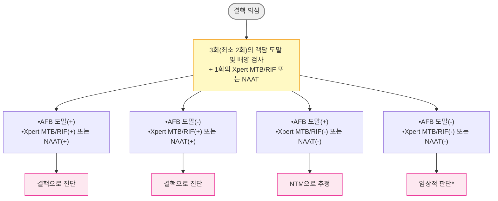
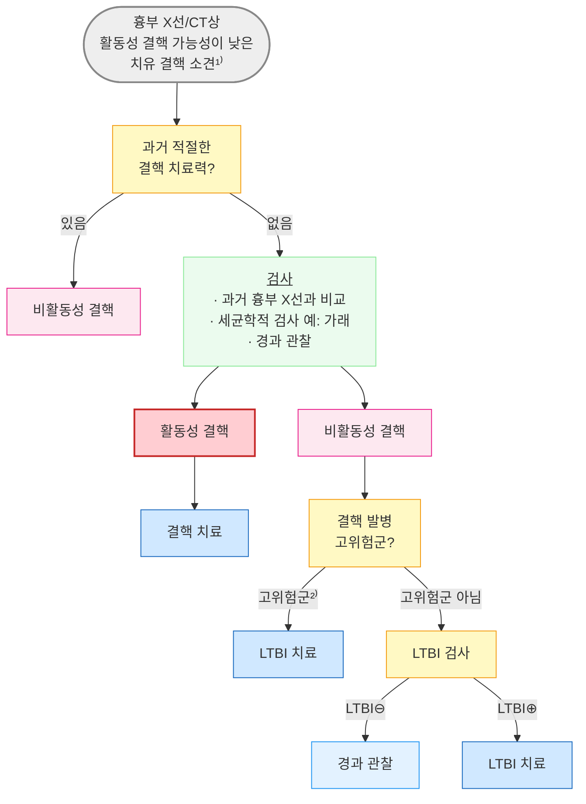
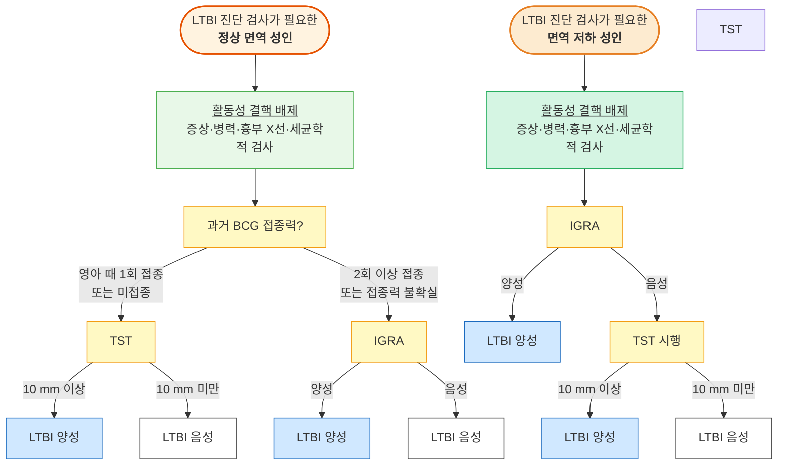
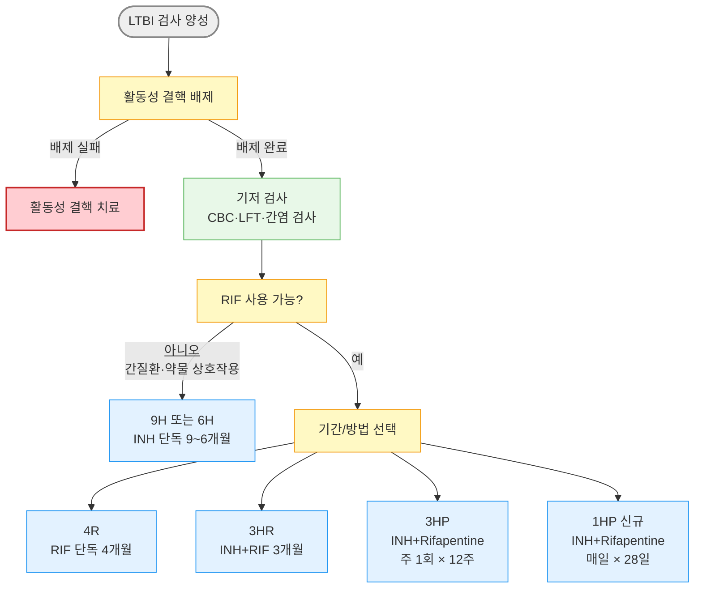

# 결핵 Tuberculosis

## <mark style="color:green;">일반 사항</mark>

* 원인균: Mycobacterium tuberculosis, M. bovis, M. africanum
* 전염: 활동성 결핵 환자의 호흡기 분비물의 공기 매개 감염; 기침·재채기·말하기·웃기 등을 할 때 배출되어 수 시간 동안 공기 중에 떠다니며 감염을 일으킴
* 경과: 결핵균에 노출된 사람의 20\~30%가 감염 (노출 강도·환기 조건·면역 상태에 따라 달라짐) → '박멸', '초감염', 또는 '잠복결핵' 중 하나의 경과를 보임
* 반드시 진단 즉시 관할 보건소에 신고

### <mark style="color:orange;">용어 정의</mark>

**초감염 결핵 (Primary tuberculosis)**

* 결핵균 감염 후 잠복결핵을 거치지 않고 바로 발생한 결핵

**잠복결핵감염 (Latent TB infection, LTBI)**

* 체내에 소수의 살아 있는 결핵균이 존재하지만 임상 증상이 없고 균이 외부로 배출되지 않아 타인에게 전파되지 않는 상태
* 면역학적 검사(TST, IGRA)에서는 양성이나 가래 결핵균 검사와 흉부 X선 검사에서는 음성

**활동성 결핵**

* 결핵 병변에서 결핵균이 증식하면서 병을 일으키고 있는 상태
* 초감염 또는 LTBI의 재활성화에 의함
* 분류
  1. 도말·배양·PCR 검사 등 세균학적으로 진단된 결핵
  2. 세균학적으로 진단되지는 않았지만 증상, 영상/조직 검사 등으로 진단된 결핵

**전염성 결핵**

* 다음 중 하나 이상에 해당
  1. 호흡기 검체의 도말·배양·PCR 검사에서 양성
  2. 흉부 X선상 공동 관찰
  3. 주치의가 전염성이 있다고 판단하는 경우 (검사 결과 무관)


전염력은 객담 도말 양성, 공동성 병변, 기침 강도, 균량과 밀접하게 연관됨. PCR(Xpert/NAAT) 양성 단독이면서 도말(-)인 환자는 전염력이 상대적으로 낮을 수 있으나, 최종 판단은 임상 소견을 종합하여 결정함


**재활성화 결핵 (Reactivation TB)**

* LTBI 상태에서 면역 기전이 약해지면서 결핵균이 활성화되어 결핵이 발병한 상태
* 일생 동안 LTBI의 5\~10%가 재활성화되며, 발병 사례의 ½이 감염 후 첫 2년 내 발생 (당뇨병·투석·HIV·면역억제제 사용자 등 고위험군에서는 재활성화 위험이 수십 배 높아질 수 있음)

**자연 치유된 결핵 병변 (Spontaneously healed TB lesion)**

* 흉부 X선에서 유소견이면서 활동성 결핵이 배제되고 결핵이나 LTBI 치료 경력이 없는 경우
* 결핵 발병의 상대 위험도가 높으므로(6\~19배) LTBI 치료를 권고

### <mark style="color:orange;">고위험군</mark>

* 건강 검진 결과 폐결핵 관련 유소견자
* ≥65세, 청소년, 마른 체형(이상 체중의 <90%)
* 면역저하자 및 만성질환자: 신부전, 당뇨병, 규폐증, HIV 감염, 위절제술 또는 공회장우회술 시행 or 예정, 면역억제제·TNF 대항제 또는 장기간 스테로이드(prednisone ≥15 ㎎/d × ≥1달) 사용 or 예정
* 취약 계층: 광부, 알코올/마약 중독자, 노숙인, 이탈 주민
* 결핵 발생률이 높은 국가에서 입국한 외국인 (예: 러시아, 중국, 몽골, 인도, 인도네시아, 말레이시아, 베트남, 태국, 필리핀, 우즈베키스탄)

## <mark style="color:green;">임상 양상</mark>

* 결핵 초기에는 무증상이 많음
* 폐 증상: 지속되는 기침, 수포음(rale), 호흡 곤란(진행 시·흉수 발생 시), 객혈(공동 형성 시)
* 전신 증상: 발열, 야간 발한, 체중 감소, 무력감, 식욕 부진, 무통성 림프절 부종

### <mark style="color:$danger;">🚩 Red Flags!</mark>

<mark style="color:$danger;">**즉각 조치 또는 응급 의뢰**</mark>

* 대량 객혈(hemoptysis) 또는 급격한 호흡 부전
* 극심한 두통·의식 변화·경부 강직·광선 공포증 → 결핵성 수막염
* 고열·전신 소모증·흉부 X선 속립성 음영 → 속립성 결핵(miliary TB)
* 심낭 삼출, 쇼크 전구 증상 → 결핵성 심낭염

<mark style="color:$warning;">**당일 또는 조기 의뢰**</mark>

* 치료 4개월 후에도 배양 양성, 이전 치료 실패력, INH/RIF 내성 확인 → 다제 내성 결핵(MDR-TB)
* 중증 면역저하자에서의 폐외 결핵 의심(뇌·척추·복막·신장)
* 중증 항결핵제 부작용: ALT ≥5×ULN의 간독성, 전신 발진(스티븐스-존슨증후군 의심), 시력 저하(EMB 시신경염)
* HIV 동반 결핵 또는 면역억제제 투여 중 발병

<mark style="color:$info;">**외래 추적 / 추가 평가 계획**</mark> <mark style="color:$info;">- 즉각 위험은 낮으나 호전 없으면 의뢰</mark>

* 2주 이상 지속되는 원인 불명의 기침
* 표준 치료 중 호전 없음: 치료 2개월 후 객담 배양 양성 지속
* 치료 중 ALT 3\~5×ULN 이하 경도 상승 또는 경미한 위장 증상
* 치료 종결 후 호흡 곤란 지속, 기관지 확장증, COPD 등 결핵 후 폐 질환 의심

## <mark style="color:green;">진단</mark>


**결핵 진단을 놓치기 쉬운 상황**

* "반복되는 폐렴" - 동일 부위 재발 또는 항생제 치료 후 일시 호전·재악화
* 퀴놀론계 항생제 사용 후 일시적으로 호전되는 경우 (퀴놀론이 항결핵 효과를 가짐)
* COPD 악화처럼 보이는 경우
* 고령자의 무열성·무기침 결핵
* 당뇨병 환자의 비전형 흉부 X선 소견
* 체중 감소 없는 초기 결핵
* COVID-19 이후 지속되는 기침·체중 감소·비전형 폐침윤
* 스테로이드 또는 면역억제제 투여 중 또는 투여 후 악화


### <mark style="color:orange;">검사 대상</mark>

* 환자 접촉자 (☞ [접촉자 관리](070_-tuberculosis.md#접촉자-관리))
* 뚜렷한 원인 없이 >2주 기침과 가래가 있는 경우 결핵 가능성을 고려하여 검사
* 다음의 경우 연 1회 이상 흉부 X선으로 결핵 검진: ≥65세, 기숙사 입소 or 예정
* 고령자·당뇨병·면역저하자에서는 기침이 경미하거나 없더라도 설명되지 않는 흉부 X선 이상이 있으면 결핵 평가를 시행한다

### <mark style="color:orange;">진단 및 조치</mark>

폐결핵 의심 시 흉부 X선, 가래 항산균 도말 및 배양 검사, Tb-PCR 검사를 시행하고 결과에 따라 아래 알고리듬에 따라 조치한다. 결핵 확인 시 보건소 신고 의무.

***



<p align="center"><strong>폐결핵 진단 알고리듬</strong></p>

<p align="center"><em><mark style="color:$info;">Ref. 대한결핵및호흡기학회. 결핵 진료지침. 2024.</mark></em></p>

NAAT = nucleic acid amplification test; NTM = nontuberculous mycobacteria (비결핵 항산균)\
\*도말(-) 폐결핵 정의: 흉부 X선상 활동성 결핵 의심 소견이 있으면서 도말 및 PCR 검사가 모두 음성이고, NTM 항생제에도 반응이 없는 경우 도말 음성 폐결핵으로 정의하여 결핵 치료를 시행할 수 있음. 흉부 X선 의심 소견이 없는 경우에는 이 기준을 적용하지 않음

### <mark style="color:orange;">결핵(TB) vs 비결핵 항산균(NTM) 감별</mark>

<table><thead><tr><th width="158.9473876953125">특징</th><th width="224.6842041015625">결핵 (TB)</th><th>비결핵 항산균 (NTM)</th></tr></thead><tbody><tr><td>전염성</td><td>있음</td><td>거의 없음 (사람 간 전파 드묾)</td></tr><tr><td>접촉자 조사</td><td>필요</td><td>불필요</td></tr><tr><td>법정 신고</td><td>필수</td><td>불필요</td></tr><tr><td>상엽 공동</td><td>흔함</td><td>가능 (M. kansasii 등)</td></tr><tr><td>면역저하 시 위험</td><td>위험 ↑↑</td><td>위험 ↑</td></tr><tr><td>PCR (MTB)</td><td>양성</td><td>음성</td></tr><tr><td>치료</td><td>표준 4제 요법 (지침 기반)</td><td>균종별 상이 (MAC, M. kansasii 등)</td></tr><tr><td>격리</td><td>초기 격리 필요</td><td>불필요</td></tr></tbody></table>

***

### <mark style="color:orange;">영상 검사</mark>

* 흉부 X선: 정상 면역 시 주로 상엽, 면역 저하 시 하엽 침범; 고령자에서는 하엽 또는 비전형적 폐렴 양상으로 나타날 수 있음
  * 환자의 \~⅓에서 비전형적 소견을 보임; 흉부 X선 단독으로 결핵 유무를 판단하지 않음
  * X선상 폐결핵 의심 시 과거 사진과 비교하고 가래 결핵균 검사 시행
  * 폐렴 치료에 반응하지 않으면 폐결핵 의심
* 흉부 CT: 다음의 경우 고려
  * 도말 음성 폐결핵에서 흉부 X선으로 활동성 여부를 판단하기 어려운 경우
  * 결핵과 다른 유사 질환의 감별이 어려운 경우
  * 활동성 폐결핵의 전형적 CT 소견: centrilobular nodule, tree-in-bud appearance, 공동(cavity); 이 소견들이 상엽·하엽 후분절에 분포하면 결핵을 강하게 시사함
* 치료 중에도 영상 소견은 악화될 수 있으며, 회복 후에도 영상 소견의 호전에는 수개월 이상 소요될 수 있음

### <mark style="color:orange;">검체 검사</mark>

#### <mark style="color:$primary;">가래 항산균 도말 및 배양 검사</mark>

* 3회(최소 2회) 시행; 1회차는 즉시, 2·3회차는 아침 기상 직후 채담하여 시행

**채담 방법**

1. 음식물과 세균을 제거하기 위해 물로 입안을 헹구어 냄
2. 두 번 깊게 숨을 들이쉰 후 서서히 내쉼 → 깊게 숨을 들이쉰 후 세게 숨을 내쉼 → 다시 깊게 숨을 들이쉰 후 기침을 하면서 가래통에 충분한 양(≥3 ㎖)의 가래를 모음
3. 보관: 냉장 보관, 가래통이 햇빛에 노출되지 않도록 함(종이로 감싸거나 봉투에 담음)

* 전염 위험을 감안하여 외부와 환기가 잘 되는 곳에서 시행
* 유도객담 채취: 가래가 잘 나오지 않는 경우 고려; 네뷸라이저로 고장성(3\~4.5%) 식염수를 15\~30분간 흡입 후 기침을 자극하여 가래를 얻음

#### <mark style="color:$primary;">가래 결핵균 핵산증폭검사 (NAAT; Tb-PCR)</mark>

* 결핵이 의심되는 모든 환자에서 시행; 항산균 증식이 확인되면 결핵균과 NTM 감별 검사를 시행
* 위양성을 감안하여 결핵이 의심되지 않는 경우에는 시행하지 않음
* 폐외 결핵 검체(흉수, 뇌척수액, 소변 등)에 대해서는 민감도가 낮음

#### <mark style="color:$primary;">Xpert</mark><sup><mark style="color:$primary;">®<mark style="color:$primary;"></sup> <mark style="color:$primary;">MTB/RIF / Xpert MTB/RIF Ultra</mark>

* 가래 검체에 대한 자동화된 real-time PCR 검사 시스템
* MTB DNA 및 RIF 내성 변이를 2시간 내에 진단
* **Xpert Ultra**: 기존 Xpert 대비 민감도 향상 (특히 도말 음성·소아·저균량 결핵); 국내에서도 사용 증가 추세. trace 결과는 임상 맥락과 함께 해석 필요
* 대상: 다제 내성 결핵의 고위험, 신속한 결핵 진단, 약제 내성 확인이 필요한 경우 (재치료, 중증 결핵, HIV 감염)
* RIF 내성 가능성이 낮은 상황에서 내성으로 나오면 다른 검사로 확인 필요

### <mark style="color:orange;">면역학적 진단 (결핵균 감염 검사)</mark>

* 위양성이 가능하며 활동성 결핵과 LTBI의 구별 안 됨
* 결핵이 의심되지만 결핵균 검사가 음성이고 진단이 어려운 경우 보조적으로 사용 가능

#### <mark style="color:$primary;">투베르쿨린 검사 (Tuberculin Skin Test, TST)</mark>

* 장점: 검사 오류 가능성이 적음, 질병 진행 위험도 예측 가능, 저렴한 비용
* 단점: 위양성, 활동성 결핵과 LTBI 구별 불가, 2회 방문 필요, 검사 부작용, 영아(<3개월)에서 위음성 가능성 높음
* 검사 제외 대상: 결핵 과거력, LTBI 진단력, BCG를 ≥1세 접종 또는 ≥2회 접종, 검사할 피부 상태가 불량, 피부 자극 우려(간질환, SLE, 스티븐스-존슨증후군, 백혈병, 심한 아토피, 켈로이드 피부, 조절되지 않는 당뇨병)

**검사 방법 (Mendel-Mantoux Test)**

* 검사 항원: 2TU PPD RT 23
* 부위: 정맥에서 멀리 떨어지고 피부 병변이 없는 팔꿈치 관절 5\~10 ㎝ 아래 전박 안쪽 피부
* 주입 방법: 0.1 ㎖ 피내 주사, 6\~10 ㎜의 팽진을 만듦; PPD가 많이 흘러나왔거나 팽진이 생기지 않은 경우 반대쪽 전박 또는 같은 쪽 이전 주사 부위에서 5 ㎝ 떨어진 곳에 재시행
* 생백신과 동시 접종 가능; 따로 시행하는 경우 생백신 접종 4주 이후에 TST 시행

**판독 방법**

* 접종 후 48\~72시간 사이에 판독 (☞ [CDC Mantoux 교육자료](https://www.cdc.gov/tb/education/mantoux/))
* 팔꿈치를 약간 구부린 상태에서 팔의 길이 방향과 직각으로 경결 부위의 가장 긴 지름을 ㎜ 단위로 측정(발적 부위는 측정하지 않음); 여러 차례 측정한 경우 최대값으로 판정
* 수포나 괴사 반응이 있으면 크기와 모습을 병기 (예: 18B, 20V, 25N)
* 판정에 1세 이전에 접종한 BCG 접종력은 고려하지 않음

**TST 양성 기준**

<table><thead><tr><th width="193.6842041015625">대상</th><th>양성 기준</th></tr></thead><tbody><tr><td>일반</td><td>경결 ≥10 ㎜</td></tr><tr><td>HIV 감염자</td><td>경결 ≥5 ㎜</td></tr><tr><td>신생아 (BCG 접종)</td><td>경결 ≥10 ㎜</td></tr><tr><td>신생아 (BCG 미접종)</td><td>경결 ≥5 ㎜</td></tr><tr><td>강양성</td><td>경결 ≥15 ㎜, 또는 경결 크기에 상관없이 수포(B)·소수포(V)·괴사(N) 동반</td></tr></tbody></table>

* 지연(72시간 이후) 판독한 경우에도 양성에 해당되는 값을 보이면 양성으로 판정

**투베르쿨린 연속검사 (serial TST)**

* 균 침범 후 8주 이내 검사 시 위음성 가능 → 접촉자에서 최초 음성이면 마지막 접촉 시점으로부터 8\~10주 후 재검
* 양전(positive conversion): 처음 검사 음성 → 재검에서 양성; 최근 감염을 의미
* 양전 판정 기준
  1. ≥19세: 이전 음성 → 재검에서 ≥10 ㎜
  2. <19세
     1. 이전 결과 <5 ㎜ → 두 번째 결과 ≥10 ㎜
     2. 전염력이 높은 전염원, 긴밀·장기간 접촉, <5세 또는 면역저하자, 이전 결과 5\~9 ㎜ → 이전 결과보다 ≥6 ㎜ 증가

#### <mark style="color:$primary;">인터페론감마 분비검사 (Interferon-gamma Releasing Assay, IGRA)</mark>

* 원리: 결핵균에 감작된 T 림프구를 결핵균 항원으로 자극하여 분비되는 인터페론 감마를 측정
* 장점: 위양성 가능성이 적음(특이도 높음), BCG 접종에 영향 받지 않음, 1회 방문으로 완료, 재검사 시 증폭 효과 없음 (<mark style="color:blue;">\[QuantiFERON]</mark>, <mark style="color:blue;">\[T-SPOT]</mark>)
* 단점: 활동성 결핵과 LTBI 구별 불가, 까다로운 검체 관리(튜브 온도 관리, 채취 후 배양까지 시간 제한), 소아에서의 임상 자료 부족, 고비용
* 5\~18세에서는 일반적으로 IGRA 단독 사용은 권하지 않음; <5세에서는 적용하지 않음

**QuantiFERON**<sup>**®**</sup>**&#x20;검사 방법**

1. 전용 blood collection tube 준비 (보관 조건: 2\~25℃에서 15개월; >25℃ 보관 시 폐기)
2. 혈액 채취
   1. 회색·빨강·보라색의 3개 튜브에 각 1 ㎖씩 채혈
      * 냉장 보관하던 tube를 미리 꺼내어 ≥17℃ 되도록 하고 채혈하는 동안 17\~25℃ 유지
      * 반드시 회색(Nil) → 빨강(Tb-Ag) → 보라색(Mitogen) 순으로 채취
      * 2\~3초에 걸쳐 혈액을 튜브 라벨의 검정색 마크까지 천천히 주입
   2. 튜브 벽면에 코팅된 항원이 혈액에 녹도록 10회 이상 충분히 부드럽게 흔들어 줌 (심하게 흔들면 겔이 망가질 수 있으므로 주의)
   3. 채혈한 튜브는 17\~27℃에서 보관하며 16시간 이내에 배양 시작

### <mark style="color:orange;">약제 감수성 검사</mark>

* 모든 결핵 환자의 첫 배양 분리 균주에 대하여 최소한 INH 및 RIF에 대해 시행
* INH 또는 RIF에 대한 내성이 확인된 경우 다른 항결핵제(퀴놀론제, 주사제 포함)에 대해서도 시행; 그 외 2차 항결핵제는 검사 정확성이 떨어지므로 필요한 경우에만 시행
* 3개월 이상 치료에도 배양 양성 또는 치료 실패 의심 시 재시행
* 신속 내성 검사: 재치료 등 다제 내성 결핵이 의심되는 경우 도말 양성 검체 또는 배양된 결핵균을 대상으로 INH/RIF에 대한 신속 내성 검사 시행

### <mark style="color:orange;">조직 검사</mark>

* 대상: 폐외 결핵 진단 또는 치료 반응 평가가 필요한 경우
* 조직 검체에 대해 항산균 배양 검사와 Tb-PCR 검사를 함께 시행

***

## <mark style="background-color:yellow;">Management</mark>

* 활동성 결핵은 ≥6개월의 복합 항결핵제 요법이 필수
* 다제 내성 결핵, 치료 실패, 중증 폐외 결핵, 중증 간질환자는 전문 의료기관에 의뢰
* 금연·금주 (특히 항결핵제의 간독성을 고려하여 치료 기간 중 금주)

## <mark style="color:green;">예방</mark>

### <mark style="color:orange;">환자 격리 및 해제</mark>

**격리**

* 격리 개시: 전염력 의심 때부터
* 외출이 불가피한 경우 마스크 착용 (덴탈 마스크 가능)

**입원 명령 대상**

1. 다제 내성 전염성 호흡기 결핵 환자 (신속 내성 검사 및 Xpert에서 RIF 내성의 경우도 다제 내성으로 간주)
2. 치료 비순응 환자
3. 주치의가 입원 명령이 필요하다고 판단하고 자치단체장이 승인한 경우

**격리 해제 기준** (다음을 모두 충족)

1. 최소 2주간의 결핵 치료 시행 (전염력은 치료 개시 2주 내에 급속히 감소함; 단, 다제내성 결핵 또는 낮은 약제 순응도에서는 전염 기간이 더 길 수 있음)
2. 가래 도말검사 연속 ≥3회 음성 (첫 음성 결과 확인 후 8\~24시간 간격으로 연속 2회 시행)
3. 임상적 호전
4. 담당 의사가 전파 우려가 충분히 감소되었고 퇴원 후 치료에 순응할 것이라고 판단


가래 도말검사 양성인 경우에도 임상 소견이 호전되어 퇴원이 가능할 경우에는 퇴원하여 균 음전 시까지 집에서 격리 치료할 수 있음. 낮은 약제 순응도·통원 치료 불가능·지속적 균 배출(내성 결핵)의 경우 보다 장기간의 주의를 요함.\
PCR 양성 지속은 격리 해제의 배제 기준이 아님: PCR은 사균(dead bacilli)의 DNA를 수개월간 검출할 수 있으므로, 격리 해제 여부는 도말검사 음전 및 임상 소견을 기준으로 판단


### <mark style="color:orange;">BCG 접종</mark>

* 생후 4주 이내의 모든 신생아에게 시행 (☞ [예방접종](../231_/210_-vaccination.md#bcg))

## <mark style="color:green;">접촉자 관리</mark>

* 전염성 결핵 환자의 밀접 접촉자에 대하여 접촉자 조사 시행
* 전염성 결핵 환자 접촉자의 1%가 결핵 진단; 접촉자의 20\~30%는 LTBI로 진단
* LTBI 양성 진단 시 LTBI 치료 시행

#### <mark style="color:$primary;">접촉자 분류</mark>

* 가족 접촉자 : 전염 가능 기간에 같은 주거 공간에서 생활한 접촉자 (가족, 군 내무반, 요양 시설·기숙사 같은 방)
* 밀접 접촉자 : 밀폐 공간에서 장시간 직접 접촉 (연속 8시간 이상 또는 누적 40시간 이상)
* 일상 접촉자 : 가족·밀접 접촉자 이외; 일반적으로 조사 생략 (역학 조사반 판단 시에만 시행)

#### <mark style="color:$primary;">**지표환자 검사 결과 및 전염 가능 기간**</mark>

<table><thead><tr><th width="220">지표환자 검사 결과</th><th>전염 가능 기간 (소급 기준)</th></tr></thead><tbody><tr><td>도말 양성</td><td>증상 발생 3개월 전 또는 진단 3개월 전 중 더 이른 날부터</td></tr><tr><td>도말 음성 / PCR 양성</td><td>진단일로부터 1개월 전부터</td></tr><tr><td>도말·PCR 모두 음성</td><td>결핵 진단일부터</td></tr></tbody></table>

#### <mark style="color:$primary;">**접촉자 검진 절차**</mark>

기침·가래 등 결핵 증상 확인 및 흉부 X선 검사 → 결핵 의심 시 추가 검사(객담 검사) → 양성이면 결핵 치료 시작, 음성이면 LTBI 감별 검사(TST &/or IGRA) → LTBI 양성이면 LTBI 치료, 음성이면 2차 검진 절차 수행

#### <mark style="color:$primary;">**의료기관 종사자 관리**</mark>

* 신규 고용 시 LTBI 기저 검사 시행; 과거 활동성 결핵이나 LTBI로 치료한 경우 또는 LTBI 검사 양성으로 확인된 경우는 검사 시행하지 않음

<table><thead><tr><th width="71.25">군</th><th>해당 부서</th></tr></thead><tbody><tr><td>1군</td><td>호흡기 결핵 환자와 접촉 가능성이 높은 곳: 호흡기/감염 내과 외래·병동, 기관지 내시경실, 결핵균 검사실, 폐기능 검사실, 흉부 영상 촬영실, 내과 중환자실, 응급실, 소아호흡기알레르기 클리닉</td></tr><tr><td>2군</td><td>면역 약한 환자 접촉: 신생아실, 분만의료기관, 조산원, 산후조리원, 장기 이식 병동, 혈액암 병동, 투석실, HIV 관련 부서</td></tr><tr><td>3군</td><td>호흡기 감염 우려 부서: 치과, 흉부외과, 마취과, 부검/해부 병리 업무</td></tr></tbody></table>

* 주기적 LTBI 진단 방법: 2단계 TST 또는 IGRA; 가능한 기저 검사와 같은 방법 적용
* LTBI 치료 대상: LTBI 양성인 1·2·3군 종사자, 2년 이내 양전, 흉부 X선 상 과거 치료력 없이 자연 치유된 병변 + LTBI 양성
* 결핵 환자를 검진·치료하는 의료인(의사, 의료기사, 간호사 등): 매년 LTBI 검진 실시

## <mark style="color:green;">잠복결핵감염 (LTBI)</mark>


**최근 LTBI 치료 경향** : 최근 LTBI 치료는 rifamycin 기반 단기 요법(4R, 3HR, 3HP, 1HP)을 우선 고려하는 추세. 기존 9H(INH 9개월) 대비 복약 완료율이 높고 간독성 위험이 낮음. RIF 사용이 불가능한 경우(중증 간질환, 중요 약물 상호작용 등)에 한해 9H 또는 6H를 선택


* LTBI 양성 환자는 평생에 걸쳐 5\~10%에서 활동성 결핵이 발생 (이들 중 ½은 감염 후 2년 이내에 발생)

#### <mark style="color:$primary;">선별 검사 대상</mark>

<table><thead><tr><th width="101.57894897460938">권고 강도</th><th>대상</th></tr></thead><tbody><tr><td>시행</td><td>전염성 결핵 환자 접촉, HIV 감염, 면역억제제/TNF 길항제/생물학적 제제/소분자 억제제 투여(예정), 흉부 X선 상 과거 치료력 없는 자연 치유 결핵 병변, 규폐증</td></tr><tr><td>권고</td><td>스테로이드 장기 투여, 투석, 혈액암, 의료기관 종사자</td></tr><tr><td>고려</td><td>당뇨병, 고형암, 위절제술(예정)</td></tr><tr><td>제외</td><td>과거 활동성 결핵 또는 LTBI로 치료한 환자, LTBI 검사 양성으로 확인된 자 (이 경우 검사가 유용하지 않음)</td></tr></tbody></table>

* ≤96개월 소아 결핵 환자의 경우 폐외 결핵이더라도 접촉자 검진 시행 (가족 전염원 확인 목적)
* 대형 강의실·복도 등 넓은 공간에서의 전염 가능성은 낮음.

***



<p align="center"><strong>자연 치유된 결핵 병변이 있는 경우의 검사 과정</strong></p>

<p align="center">¹⁾칼슘이 침착된 단순 결절 및 폐쇄부와 기저부의 흉막 비후는 제외.<br>²⁾고위험군: HIV 감염, 장기 이식으로 면역억제제 복용자, TNF 대항제 사용자</p>

<p align="center"><em><mark style="color:$info;">Ref. 결핵진료지침. 대한결핵및호흡기학회; 2024. 그림 VII-9.</mark></em></p>

***

#### <mark style="color:$primary;">LTBI 검사 방법 및 양성 기준</mark>

<table><thead><tr><th width="180">검사</th><th width="220">양성 기준</th><th>비고</th></tr></thead><tbody><tr><td>TST</td><td>경결 ≥10 ㎜ (일반)<br>경결 ≥5 ㎜ (HIV/면역저하)</td><td>BCG 접종력의 영향을 받을 수 있음</td></tr><tr><td>IGRA (QuantiFERON)</td><td>≥0.35 IU/mL (음성 대조 보정 후)</td><td>BCG 접종에 영향 받지 않음</td></tr><tr><td>IGRA (T-SPOT)</td><td>항원 패널 A 또는 B ≥8 spots</td><td>BCG 접종에 영향 받지 않음</td></tr></tbody></table>

* 5\~18세에서는 TST와 IGRA를 병행 사용하는 것이 권고되며, 한 가지 검사만 양성이면 LTBI로 진단한다. <5세에서는 IGRA 단독 사용은 권장하지 않는다.

***



<p align="center"><strong>잠복결핵감염 진단 알고리듬</strong></p>

<p align="center"><em><mark style="color:$info;">Ref. 결핵진료지침. 대한결핵및호흡기학회; 2024. 그림 VII-10, 11.</mark></em></p>

***

#### <mark style="color:$primary;">치료 결정 및 기저 검사</mark>

* 치료 결정 전 반드시 활동성 결핵의 가능성을 배제해야 함
* 기저 검사: CBC, AST/ALT, 빌리루빈, B형/C형 간염 검사; 필요시 HIV, 임신 검사
* 간독성 위험군(만성 간질환, 알코올 남용, 고령)에서는 치료 중 매달 간기능 검사 시행

***



<p align="center"><strong>LTBI 치료 약제 선택 알고리듬</strong></p>

<p align="center"><em><mark style="color:$info;">Ref. 대한결핵및호흡기학회. 결핵 진료지침. 2024.</mark></em></p>

***

#### <mark style="color:$primary;">LTBI 치료 약제 및 용법</mark>

* 전염원의 약제 감수성 결과가 있는 경우 이를 참고하여 요법 선택
* 치료 완료 기준
  * 9H: 12개월 내에 처방 약제의 80% 이상 복용
  * 4R: 6개월 내에 처방 약제의 80% 이상 복용
  * 3HR: 4개월 내에 처방 약제의 80% 이상 복용
  * 3HP: 16주 내에 11회 이상 복용
  * 1HP: 28일 이내에 처방 약제의 80% 이상 복용
* 재치료: 결핵 발병 위험군이 전염성 결핵 환자와 최근 접촉한 경우, 과거에 적절한 LTBI 치료를 완료하였더라도 재치료 고려
* LTBI 치료 중 활동성 결핵이 발생한 경우: LTBI 치료에 사용 중이었던 약제를 포함한 초치료 표준 처방으로 새로이 치료 시작

<table><thead><tr><th width="73.68423461914062">요법</th><th width="155.52630615234375">처방</th><th width="77.36834716796875">기간</th><th width="80">복약 완료율</th><th width="78.94732666015625">간독성 위험</th><th>비고</th></tr></thead><tbody><tr><td>4R<br>(권장)</td><td>Rifampicin 단독</td><td>4개월</td><td>높음</td><td>낮음</td><td>가장 널리 쓰이는 표준 요법; INH 내성·부작용 시에도 선택 가능</td></tr><tr><td>3HR (권장)</td><td>INH + Rifampicin</td><td>3개월</td><td>높음</td><td>보통</td><td>4R과 함께 우선 고려</td></tr><tr><td>1HP<br>(권장)</td><td>INH + Rifapentine 매일</td><td>1개월 (28일)</td><td>매우 높음</td><td>낮음</td><td>BRIEF TB 연구 근거; 짧은 기간으로 선호도 급증; 전문가 처방 권고</td></tr><tr><td>3HP (대체)</td><td>INH + Rifapentine 주 1회</td><td>3개월 (12주)</td><td>높음</td><td>낮음</td><td>직접 복약 확인(DOT) 권장; 전문가 처방 권고</td></tr><tr><td>9H¹⁾</td><td>INH 단독</td><td>9개월</td><td>낮음</td><td>높음</td><td>RIF 사용 불가 시에만 선택 (중증 간질환, 중요 약물 상호작용)</td></tr><tr><td>6H¹⁾</td><td>INH 단독</td><td>6개월</td><td>낮음</td><td>높음</td><td>9H에 비해 효과 다소 낮음; RIF 사용 불가 시 대안</td></tr></tbody></table>

　¹⁾ RIF 사용 불가 시 차선책

## <mark style="color:green;">활동성 결핵 치료</mark>

### <mark style="color:orange;">치료 전 조치</mark>

* 병력 청취: 항결핵제 부작용 발생 위험 평가, 임신 가능성
* 기저 검사: 시력, CBC, LFT(AST, ALT, ALP, 빌리루빈), RFT(Cr)
* 약제 감수성 검사: 치료 시작 시 얻은 배양 양성 결핵균에 대해 시행

### <mark style="color:orange;">항결핵제</mark>

<table><thead><tr><th width="196.25">성분명 (약어)</th><th width="313.75">용량 및 투약 방법</th><th>주요 부작용</th></tr></thead><tbody><tr><td><strong>Group I -</strong></td><td><strong>- 1차 선택 항결핵제</strong></td><td></td></tr><tr><td><strong>Isoniazid</strong> (INH, H)</td><td>5 ㎎/㎏ [300 ㎎] qd, 공복</td><td>간독성, 말초신경염, 피부 과민 반응</td></tr><tr><td><strong>Rifampicin</strong> (RIF, R)</td><td>8~12 ㎎/㎏ [450 ㎎ (&#x3C;50 ㎏) ~ 600 ㎎ (≥50 ㎏)] qd, 공복</td><td>간독성, 위장장애, 독감 유사 증상, 혈소판 감소증, 체액 색소 변화</td></tr><tr><td><strong>Ethambutol</strong> (EMB, E)</td><td>15~20 ㎎/㎏ [&#x3C;50 ㎏: 0.8 g, 50~70 ㎏: 1.2 g, >70 ㎏: 1.6 g] qd, 공복 또는 식후</td><td>시신경염(시력 저하, 색각 변화)</td></tr><tr><td><strong>Pyrazinamide</strong> (PZA, Z)</td><td>20~30 ㎎/㎏ [&#x3C;46 ㎏: 1 g, 46~70 ㎏: 1.5 g, >70 ㎏: 2 g] qd, 공복 또는 식후</td><td>간독성, 관절통, 위장 장애</td></tr><tr><td><strong>Rifabutin</strong> (RFB)</td><td>5 ㎎/㎏ [300 ㎎] qd, 공복 또는 식후</td><td>간독성, 호중구 감소증</td></tr><tr><td><strong>Group II -</strong></td><td><strong>- 주사제</strong> (경구제 사용 불가 시; 최근 all-oral regimen 선호로 사용 감소 추세)</td><td></td></tr><tr><td><strong>Streptomycin</strong> (S)<br><strong>Kanamycin</strong> (Km)<br><strong>Amikacin</strong> (Am)<br><strong>Capreomycin</strong> (Cm)</td><td>&#x3C;50세: 15 ㎎/㎏ [1 g] IM/IV<br>≥50세: 10 ㎎/㎏ [750 ㎎] IM/IV</td><td>이독성, 신독성, 입 주위 감각 이상</td></tr><tr><td><strong>Group III -</strong></td><td><strong>- 2차 선택제: 호흡기 퀴놀론제</strong></td><td></td></tr><tr><td><strong>Levofloxacin</strong> (Lfx)</td><td>750~1,000 ㎎ qd, 공복 또는 식후</td><td>위장장애, 두통, 어지럼, 관절통</td></tr><tr><td><strong>Moxifloxacin</strong> (Mfx)</td><td>400 ㎎ qd, 공복 또는 식후</td><td>QT 연장, 위장장애</td></tr><tr><td><strong>Group IV -</strong></td><td><strong>- 경구용 2차 항결핵제</strong></td><td></td></tr><tr><td><strong>Cycloserine</strong> (Cs)</td><td>10~15 ㎎/㎏ [&#x3C;46 ㎏: 500 ㎎, ≥46 ㎏: 750 ㎎] #1~2, 공복</td><td>우울증, 정신 장애</td></tr><tr><td><strong>Prothionamide</strong> (Pto)</td><td>15~20 ㎎/㎏ [&#x3C;46 ㎏: 500 ㎎, 46~70 ㎏: 750 ㎎, >70 ㎏: 1,000 ㎎] #2, 공복</td><td>위장 장애, 간독성</td></tr><tr><td><strong>p-Aminosalicylic acid</strong> (PAS)</td><td>150 ㎎/㎏ [12 g] #3 (3.3 g/pack tid), 식후</td><td>식욕 부진, 구역/구토, 복부 불편감, 간독성</td></tr><tr><td><strong>Group V - 전문가 자문 필요 약제</strong></td><td>Linezolid (Lzd), Bedaquiline (Bdq), Pretomanid (Pa), Delamanid (Dlm), Clofazimine (Cfz), Imipenem/cilastatin (Ipm), Meropenem (Mpm), Amoxicillin/clavulanate (Amx/Clv), High-dose Isoniazid (Hr)</td><td></td></tr></tbody></table>

* 공복 표시가 없는 경우는 식후 복용; 최대량이 표시되지 않은 경우 권고량이 최대량임
* Group V 약제들은 전문가 자문이 필요. 주사제(Group II)는 이독성·신독성 모니터링이 필수
* Ethambutol 사용 시 치료 전 및 치료 중 정기적 시력 검사가 필요하며, 신기능 저하자 또는 ≥25 ㎎/㎏/d 투여 시 위험이 증가

<p align="center"><em><mark style="color:$info;">Ref. 대한결핵및호흡기학회. 결핵 진료지침. 2024.</mark></em></p>

#### <mark style="color:$primary;">Isoniazid (INH)</mark>

* 100 ㎎/T <mark style="color:blue;">\[유한짓]</mark>
* \[부작용] 말초신경염: Vit B6 결핍과 관련. 통상 용량(≤300 ㎎/d)에서는 흔하지 않으나 임신, 영양실조, 알코올 남용, 고령, 간질 기왕력, 만성콩팥병, 당뇨병에서 더 흔함
  * 예방: Pyridoxine 10\~25 ㎎/d 병용 (위험군에서는 25\~50 ㎎/d)

#### <mark style="color:$primary;">Rifampicin (RIF)</mark>

* 150 ㎎/C, 300 ㎎/C, 600 ㎎/T <mark style="color:blue;">\[리팜핀]</mark>
* \[부작용] 혈소판 감소: 투여 중단 후 주기적 혈소판 검사; 정상 회복 후에도 RIF는 재투여하지 않음
* 주의: 소변·눈물·땀이 오렌지색으로 변색; 소프트 콘택트렌즈 착색 주의
* 약물 상호 작용: CYP450 유도와 관련하여 다음 약제들의 혈중 농도 감소에 주의 - 경구 피임약, 스테로이드, quinidine, phenytoin, warfarin, 인슐린, sulfonylurea

**Rifampicin의 주요 약물 상호작용**

<table><thead><tr><th width="272.75">약제</th><th width="174.25">상호작용 결과</th><th>임상적 주의사항</th></tr></thead><tbody><tr><td>DOAC (rivaroxaban, apixaban)</td><td>혈중 농도 급감</td><td>혈전색전증 위험 증가; 가능하면 대체 항응고제 고려</td></tr><tr><td>Tacrolimus / Cyclosporine</td><td>농도 급감</td><td>이식 거부 위험; 농도 모니터링 필수</td></tr><tr><td>Azole 항진균제 (fluconazole, voriconazole 등)</td><td>항진균 효과 감소</td><td>병용 시 용량 조정 또는 대체 필요</td></tr><tr><td>HIV 항바이러스제 (PI, NNRTI)</td><td>상호 농도 변화</td><td>Rifabutin으로 대체 권고</td></tr><tr><td>경구 피임약</td><td>피임 효과 감소</td><td>치료 기간 중 추가 피임 수단 사용</td></tr><tr><td>SGLT-2 억제제 (dapagliflozin) / DPP-4 억제제</td><td>혈중 농도 감소 가능</td><td>혈당 조절 모니터링 강화; 필요 시 용량 조정</td></tr><tr><td>칼슘채널차단제 (CCB; amlodipine, nifedipine)</td><td>혈중 농도 감소</td><td>혈압 조절 모니터링; 필요 시 대체 또는 증량 고려</td></tr></tbody></table>

#### <mark style="color:$primary;">Ethambutol (EMB)</mark>

* 400 ㎎/T; 고용량 사용 시 2개월 후 감량 <mark style="color:blue;">\[마이암부톨 제피]</mark>
* \[부작용] 시신경증 : 시력 저하, 적록 색맹, 중심 암증, 주변 시각 장애; 용량·투여 기간과 관련. 신기능 저하 또는 ≥25 ㎎/㎏/d 투여 시 위험 증가; 당뇨병 환자는 미세혈관 합병증으로 인해 기저적 시신경 취약성이 높으므로 정기 시력·색각 검사를 강화
* 시력 모니터링 : 치료 시작 전 기저 시력 검사 후 매달 시력·색각 검사 권고 (이상 발생 즉시 EMB 중단)
* 어린 소아에서는 시신경병증 모니터링이 어려울 수 있으므로 주의한다; WHO 권장 용량(15–20 ㎎/㎏/d) 범위 내 2개월 집중기 사용에서의 독성 위험은 낮음

#### <mark style="color:$primary;">Pyrazinamide (PZA)</mark>

* 250 ㎎/T, 500 ㎎/T <mark style="color:blue;">\[피라진아미드]</mark>
* \[부작용] 관절통 : ⅓에서 주로 치료 2개월 이내에 발생 → NSAID 투여로 관리
* \[부작용] 고요산혈증·통풍: PZA로 인한 고요산혈증은 매우 흔하나, 증상이 없는 무증상 고요산혈증만으로는 약제를 중단하지 않고 관찰; 실제 통풍 발작은 드묾. 통풍 환자 또는 ≥2개월 사용 시 요산 모니터링 시행

#### <mark style="color:$primary;">Aminoglycoside계</mark>

* <mark style="color:blue;">\[황산스트렙토마이신 주]</mark>, <mark style="color:blue;">\[카나마이신황산염 주]</mark>, <mark style="color:blue;">\[아미킨 주]</mark>
* \[부작용] 이독성(이명/어지럼), 입 주위 감각 이상, 두통 → 심한 경우 감량
* 용법 : 5\~7일/주 qd → 2\~4개월 후 또는 임상적 호전(균 음전) 시 2\~3일/주 qd

### <mark style="color:orange;">초치료 (New patient)</mark>

#### <mark style="color:$primary;">치료 원칙</mark>

1. 초치료 대상 : ⓵ 이전에 결핵 치료를 받은 적이 없거나, ⓶ <1개월의 결핵 치료를 받은 환자
2. 내성 발현 예방을 위해 ≥3가지 항결핵제의 병합 요법 시행
3. 최고 혈중 농도가 중요하므로 정확한 용량을 1일 1회 복용
4. 간헐적으로 증식하는 균까지 멸균하기 위해 규칙적으로 ≥6개월 이상 장기 치료

#### <mark style="color:$primary;">표준 6개월 요법: 2HRZE/4HR(E)</mark>

* 초기 집중 치료기 (2개월): H·R·Z·E 4제 병합
* 유지 치료기 (4개월): H·R·E 3제; 약제 감수성 검사에서 INH·RIF에 감수성이 확인되면 3개월째부터 에탐부톨은 제외할 수 있음

#### <mark style="color:$primary;">9개월 요법: 9HRE</mark>

* 초치료 시 PZA를 사용하지 못하는 경우 H·R·E 9개월 투여
* 복합제 사용으로 투약 순응도 향상 가능: <mark style="color:blue;">\[리파터]</mark> (RIF 300 ㎎ + INH 150 ㎎), <mark style="color:blue;">\[튜비스투]</mark> (RIF 150 ㎎ + INH 75 ㎎)

#### <mark style="color:$primary;">치료 기간 연장</mark>

* 치료 전 흉부 X선상 공동이 있고 집중 치료기 2개월 완료 시점의 객담 배양 양성인 경우 유지 치료 기간 연장을 고려

#### <mark style="color:$primary;">기저 및 치료 중 추구 검사</mark>

<table data-header-hidden><thead><tr><th width="203.7894287109375"></th><th width="55.368499755859375"></th><th width="43.789398193359375"></th><th width="44.842132568359375"></th><th width="44.8421630859375"></th><th width="44.84210205078125"></th><th width="44.84210205078125"></th><th width="44.84210205078125"></th><th width="44.84210205078125"></th><th width="44.8421630859375"></th><th width="49.05267333984375"></th></tr></thead><tbody><tr><td><strong>검사법</strong></td><td><strong>기저</strong></td><td><strong>1</strong>¹⁾</td><td><strong>2</strong></td><td><strong>3</strong></td><td><strong>4</strong></td><td><strong>5</strong></td><td><strong>6</strong></td><td><strong>7</strong></td><td><strong>8</strong></td><td><strong>9</strong>²⁾</td></tr><tr><td>미생물검사</td><td></td><td></td><td></td><td></td><td></td><td></td><td></td><td></td><td></td><td></td></tr><tr><td>객담항산균 도말&#x26;배양검사</td><td>●</td><td>●</td><td>●</td><td>○</td><td>○</td><td></td><td></td><td></td><td></td><td>○</td></tr><tr><td>Xpert MTB/RIF 검사</td><td>●</td><td></td><td></td><td></td><td></td><td></td><td></td><td></td><td></td><td></td></tr><tr><td>신속감수성검사</td><td>●</td><td></td><td></td><td></td><td></td><td></td><td></td><td></td><td></td><td></td></tr><tr><td>통상감수성검사</td><td></td><td></td><td>●</td><td></td><td></td><td></td><td></td><td></td><td></td><td></td></tr><tr><td>흉부 X선/기타영상검사</td><td>●</td><td>○</td><td>●</td><td>○</td><td>○</td><td>○</td><td>○</td><td>○</td><td>○</td><td>●</td></tr><tr><td>임상적 평가</td><td></td><td></td><td></td><td></td><td></td><td></td><td></td><td></td><td></td><td></td></tr><tr><td>체중</td><td>●</td><td>●</td><td>●</td><td>●</td><td>●</td><td>●</td><td>●</td><td>●</td><td>●</td><td></td></tr><tr><td>증상&#x26;약물순응도 평가</td><td>●</td><td>●</td><td>●</td><td>●</td><td>●</td><td>●</td><td>●</td><td>●</td><td>●</td><td></td></tr><tr><td>시력평가</td><td>●</td><td>●</td><td>○</td><td>○</td><td>○</td><td>○</td><td>○</td><td>○</td><td>○</td><td></td></tr><tr><td>검사실 검사</td><td></td><td></td><td></td><td></td><td></td><td></td><td></td><td></td><td></td><td></td></tr><tr><td>CBC</td><td>●</td><td>○</td><td>○</td><td>○</td><td>○</td><td>○</td><td>○</td><td>○</td><td>○</td><td></td></tr><tr><td>간기능</td><td>●</td><td>○</td><td>○</td><td>○</td><td>○</td><td>○</td><td>○</td><td>○</td><td>○</td><td></td></tr><tr><td>신기능</td><td>●</td><td>○</td><td>○</td><td>○</td><td>○</td><td>○</td><td>○</td><td>○</td><td>○</td><td></td></tr><tr><td>HIV</td><td>○</td><td></td><td></td><td></td><td></td><td></td><td></td><td></td><td></td><td></td></tr><tr><td>B/C형 간염</td><td>○</td><td></td><td></td><td></td><td></td><td></td><td></td><td></td><td></td><td></td></tr><tr><td>당뇨</td><td>○</td><td></td><td></td><td></td><td></td><td></td><td></td><td></td><td></td><td></td></tr><tr><td>폐기능 검사</td><td></td><td></td><td></td><td></td><td></td><td></td><td></td><td></td><td></td><td>○</td></tr></tbody></table>

　● 반드시 시행, ○ 필요시 시행

　¹⁾치료 중 (단위: 개월), ²⁾치료 종결 (6개월 혹은 9개월 치료 종결 시점에 해당)

　_<mark style="color:$info;">Ref. 대한결핵및호흡기학회. 결핵 진료지침. 2024. 표 II-5.</mark>_

#### <mark style="color:$primary;">치료 효과 평가</mark>

* 가래 도말 또는 배양 양성 환자: 치료 시작 후 2회 연속 음성이 나올 때까지 매달 도말·배양 검사 시행; 치료 종결 시점에 마지막 가래 검사 시행
* 임상적으로 치료 실패가 의심되는 경우: 추가 가래 도말·배양 → 배양 양성 시 이 결핵균에 대해 약제 감수성 검사 추가 시행
* 흉부 X선 단독으로 치료 반응을 평가하지 않음
* 역설적 반응 : 치료 도중(보통 치료 시작 2개월 이후) 치료 실패 없이 면역 반응 증가로 임상 증상 및 영상 소견이 일시적으로 악화되는 현상(고열, 림프절염 발생/악화, CNS 병변 악화, 폐결핵 병변 악화, 흉수 증가); 항결핵제를 적절히 복용 중이며 객담 검사 음성이고 다른 질환의 가능성이 거의 없으면 기존 치료를 유지
* 치료 종결 시점에 결핵 후 폐 질환에 대하여 평가; 호흡 곤란이 있거나 영상 검사에서 유의미한 후유증이 관찰되면 치료 종결 시점 혹은 종결 후 6개월 이내에 폐기능 검사 권고

#### <mark style="color:$primary;">초치료 결과 분류</mark>

* 완치 : 치료 종료 후(마지막 달) 가래 배양 음성 & 이전 시행 배양 ≥1회 음성
* 완료 : 마지막 달의 도말·배양 음성 결과는 없지만 이전 ≥1회 음성이고 치료 실패 기준에 해당되지 않음
* 실퍠 : 치료 4개월 후 또는 그 이후 시행한 배양이 양성
* 추적 방문 중단 : 치료를 시작하지 않았거나 연속 2달 이상 치료가 중단된 경우
* 평가 미정 : 다른 기관으로 전출되었거나 치료 결과를 알 수 없는 경우
* 치료 성공 : 완치 또는 완료된 경우

#### <mark style="color:$primary;">결핵 후 폐 질환 (Post-TB Lung Disease, PTLD)</mark>

* 치료 종결 ≠ 폐 기능 회복 : 세균학적 치료 성공 후에도 상당수 환자에서 만성 폐 기능 손상이 남음
* 주요 후유증 : 기관지 확장증, 만성 기류 제한(COPD 유사 패턴), 파괴폐(destroyed lung), 반복 세균 감염, 객혈, 제한성 환기 장애, 만성 저산소혈증
* 위험 인자 : 치료 지연, 중증 병변, 공동 형성, 반복 결핵, 흡연, 당뇨병
* 치료 종결 후에도 호흡기 증상·흉부 영상 이상·폐기능 저하가 지속되면 호흡기내과 의뢰 및 장기 추적 관리

### <mark style="color:orange;">부작용 대처</mark>

#### <mark style="color:$primary;">간독성</mark>

* 증상: 간 효소 수치 상승, 전신 쇠약감, 구역, 구토, 우상복부 불쾌감, 가려움, 황달
  * 고령, 간질환 기왕력, 알코올 남용자에서 정기적 간 효소 검사
* 조치: ALT ≥3×ULN + 간염 증상, 또는 ALT ≥5×ULN 시 INH·RIF·PZA 투여 중단
* 재투여: ALT ≤2×ULN(기존 간질환자는 정상화) 시, 1주마다 RIF → INH → PZA 순서로 한 가지씩 간기능 검사하면서 재투여; 필요시 저용량으로 시작, 점차 증량
* 재투여 기간이 길어지고 내성 발생이 우려될 경우: 간독성이 적은 ≥3가지 약제(ethambutol, cycloserine, quinolone, aminoglycoside)를 투여하면서 한 가지씩 재투여 시도

#### <mark style="color:$primary;">위장 장애</mark>

* 구역·구토·식욕 저하가 심하거나 >1주 지속 시 먼저 간 검사로 간독성 여부 확인
* 간독성과 무관한 경우: 복용 시간 변경(식후, 취침 시), 분할 복용(한 성분의 약은 절대로 분할 투여하지 않음), 위장약 병용

#### <mark style="color:$primary;">피부 발진</mark>

* 가려움을 동반한 국소 발진: 항히스타민제로 완화 시도
* RIF 복용 중 출혈성 발진: 투여 중단 후 주기적 혈소판 수치 검사; 정상 회복 후에도 RIF는 재투여하지 않음
* 점막 침범·발열 동반 전신 홍반성 발진: 모든 약제 투여를 즉시 중단; 필요시 일시적으로 3가지의 다른 항결핵제 투여; 발진 호전 시 2\~3일 간격으로 RIF → INH → PZA 순서로 한 가지씩 재투여

#### <mark style="color:$primary;">Drug Fever</mark>

* 결핵 자체에 의한 발열과 약제에 의한 발열의 감별 필요
* 약제열인 경우 모든 약제 중단 시 24시간 이내에 발열 소실
* 원인 약제 확인: 발열 소실 후 한 가지 약제씩 재투여하면서 원인 약제 확인

<table><thead><tr><th width="200">재투여 순서</th><th>모니터링</th></tr></thead><tbody><tr><td>RIF (저용량부터)</td><td>24~48시간 후 발열 여부 확인 → 발열 있으면 RIF가 원인 약제</td></tr><tr><td>INH (저용량부터)</td><td>24~48시간 후 발열 여부 확인 → 발열 있으면 INH가 원인 약제</td></tr><tr><td>PZA (저용량부터)</td><td>24~48시간 후 발열 여부 확인 → 발열 있으면 PZA가 원인 약제</td></tr><tr><td>EMB</td><td>24~48시간 후 발열 여부 확인</td></tr></tbody></table>

### <mark style="color:orange;">특별한 경우의 치료</mark>

#### <mark style="color:$primary;">실패 후 재치료</mark>

* 치료 실패 결핵의 재치료는 전문가에게 의뢰
* 치료 실패의 원인을 찾기 위한 병력 청취
* 1·2차 항결핵제에 대한 약제 감수성 검사 및 INH/RIF에 대한 신속 내성 검사 시행
* 치료 실패 후 재치료로 새로운 항결핵제를 추가할 때는 한 가지씩 추가하지 않음

#### <mark style="color:$primary;">치료 중단 후 재치료</mark>

* 결핵 치료 초기(결핵균의 양이 많은 시기)에 중단되거나 치료 중단을 자주 할수록 약제 내성균이 증가하고 치료 실패 위험이 증가
* 2개월 이상 항결핵제 투여 중단 시 신고
* 병력 청취 등으로 중단 원인을 파악하고 재치료 시 교육·상담·사회적 지지 제공
* 치료 중단 후 재치료 시작 시 반드시 가래 배양 검사와 약제 감수성 검사를 시행
* 이전 치료 중 부작용이 발생하지 않았으면 표준 치료 요법으로 재치료; 부작용이 발생한 경우에는 해당 약제는 제외하고 ≥3가지의 약제로 구성

**초기 집중 치료기 중단 시 대처**

* 치료 중단 기간 <14일: 치료를 유지하면서 초기 집중 치료기 동안 복용해야 하는 약제들을 모두 복용한 후 유지기로 이행
* 치료 중단 기간 ≥14일: 처음부터 치료를 다시 시작

**유지기 중단 시 대처**

* 총 유지기 기간의 <80% 복용 후 중단 & 중단 기간 <2개월: 남은 기간 모두 복용
* 중단 기간 ≥2개월: 처음부터 다시 치료 시작
* 총 유지기 기간의 ≥80% 복용: 치료 시작 시 도말 음성이었으면 치료 종결, 도말 양성이었으면 유지기 남은 기간을 모두 복용하고 종결
  * 예외 : 치료 시작 시 공동(cavity)이 있었거나 집중기 2개월 완료 시점에 배양 양성이었던 고위험군에서는 80% 달성 여부와 무관하게 전문가 판단에 따라 추가 복용을 고려한다

#### <mark style="color:$primary;">재발 결핵</mark>

* 권고에 따른 초치료 종료 후 재발한 경우: 초치료 시 사용한 약제로 재치료
* 초치료 종료 2년 이내에 재발한 경우: 치료 기간을 3개월 연장하여 9개월 요법으로 재치료
* 결핵균에 대한 신속 내성 검사를 시행하여 다제 내성 결핵 여부 확인 및 처방 조정

#### <mark style="color:$primary;">내성 결핵</mark>

**INH 단독 내성 결핵**

* REZ (R, E, Z) 6\~9개월 치료; INH는 중단
* 병변의 범위가 넓고 심한 경우 퀴놀론계 약제 추가 고려
* 초치료 표준 요법(HREZ)으로 치료를 시작한 후 PZA 중단 시점에서 INH 단독 내성으로 확인되면 INH를 중단하고 RE로 총 12개월간 치료

**RIF 단독 내성 결핵**

* RIF 중단
* HEZ (H, E, Z) + 퀴놀론 12\~18개월 치료 (PZA를 최소 2개월 사용)
* 병변의 범위가 넓고 심한 경우 주사제 병용 고려

**다제 내성 (MDR) 결핵 및 광범위 약제 내성 (XDR) 결핵**

* 전문 의료기관에 의뢰
* 치료 기간: MDR-TB 치료력이 없는 경우 최소 20개월 (집중 치료기를 최소 8개월로 함)


**BPaL/BPaLM 요법 (최신 MDR/pre-XDR/XDR-TB 치료)** : WHO 2022 가이드라인 및 국내 최신 지침은 전처치가 없는 pre-XDR·XDR-TB 및 일부 MDR-TB에서 BPaL(Bedaquiline + Pretomanid + Linezolid) 또는 BPaLM(+ Moxifloxacin) 6\~9개월 요법을 권고함. 기존 18\~20개월 요법에 비해 치료 기간을 단축하고 치료 성공률을 높임. 반드시 전문가와 상의하여 처방


### <mark style="color:orange;">특수 상황</mark>

#### <mark style="color:$primary;">임신</mark>

* 초치료: 6개월 표준 치료 \[2HREZ/4HR(E)] 또는 9개월 치료 \[9HRE]
* 모유 수유: 1차 항결핵제 치료 시 모유 수유 가능; INH 투여 시 피리독신 병용

#### <mark style="color:$primary;">간질환자</mark>

* 간 손상이 심하지 않은 만성 간질환자: 9HRE 및 정기적 간 효소 검사
* 중증·불안정한 간 기능 변화를 보이는 만성 간질환자: 의뢰

#### <mark style="color:$primary;">신질환자</mark>

* 신기능 저하자: 투약 간격 연장, 1일 투여량 변경; INH·RIF·Moxifloxacin은 조절 필요 없음
* 투석 환자: 투석 직후 항결핵제 투여

#### <mark style="color:$primary;">폐외 결핵</mark>

<table><thead><tr><th width="220">부위</th><th width="148">치료 요법</th><th>비고</th></tr></thead><tbody><tr><td>결핵성 수막염</td><td>2HREZ/7<br>~10HR(E)</td><td>사망·신경학적 후유증 위험 높음; 스테로이드 보조 요법 권고 (prednisolone 또는 dexamethasone, 초기 용량에서 6~8주에 걸쳐 점진적 감량)</td></tr><tr><td>결핵성 심낭염</td><td>2HREZ/4HR(E)</td><td>스테로이드 보조 요법 추가</td></tr><tr><td>결핵성 복막염, 장 결핵, 속립성 결핵, 비뇨생식기 결핵</td><td>2HREZ/4HR(E)</td><td>복막: 복강경 복막 생검으로 진단</td></tr><tr><td>결핵성 흉막염</td><td>2HREZ/4HR(E)</td><td>흉수 ADA >40 IU/L 의심 소견; 흉수 多·loculated 시 흉수 배액 고려</td></tr><tr><td>기관지 결핵</td><td>폐결핵 동일</td><td>기관지 협착 주의; 협착 위험 높으면 스테로이드 고려</td></tr><tr><td>림프절 결핵</td><td>2HREZ/4HR(E)</td><td>조직 검사 및 배양 시행; 적절한 치료에도 호전 없으면 제거</td></tr><tr><td>골·관절 결핵</td><td>6~9개월</td><td>약제 무반응·감염 진행·신경 손상 시 수술</td></tr></tbody></table>

***

### <mark style="color:red;">질병코드</mark>

* A15\~A19 결핵
* R76.80 잠복결핵감염 (LTBI)

***

## <mark style="color:purple;">처방례</mark>

> **처방례 1. 활동성 폐결핵 초치료 - 집중 치료기 (체중 50\~70 ㎏)**
>
> ```
> Isoniazid [유한짓] 100 ㎎/T              3T qd 공복
> Rifampicin [리팜핀] 300 ㎎/C             2C qd 공복
> Pyrazinamide [피라진아미드] 500 ㎎/T     3T qd 공복 또는 식후
> Ethambutol [마이암부톨 제피] 400 ㎎/T    3T qd 공복 또는 식후
> Pyridoxine 25 ㎎/T                       1T qd
> ```
>
> _✽ 2개월 집중 치료기(4제 요법). 체중 50\~70 ㎏ 기준. 반드시 보건소 신고 후 처방(신고 의무). 약제 감수성 검사 결과에 따라 처방 조정. PZA·EMB는 공복이 어려우면 식후로 변경 가능._

> **처방례 2. 활동성 폐결핵 초치료 - 유지기 (약제 감수성 확인 후)**
>
> ```
> Isoniazid [유한짓] 100 ㎎/T              3T qd 공복
> Rifampicin [리팜핀] 300 ㎎/C             2C qd 공복
> Ethambutol [마이암부톨 제피] 400 ㎎/T    3T qd 공복 또는 식후
> Pyridoxine 25 ㎎/T                       1T qd
> ```
>
> _✽ 4개월 유지기. INH·RIF 감수성 확인 시 3개월째부터 EMB 제외 가능. 복합제(\[리파터] 2T qd 또는 \[튜비스투] 4T qd)로 변경하면 복약 순응도 향상._

> **처방례 3. 잠복결핵감염 (LTBI) 치료 - 4R 요법 (표준)**
>
> ```
> Rifampicin [리팜핀] 300 ㎎/C   2C qd 공복   (체중 ≥50 ㎏; <50 ㎏이면 1.5C)
> ```
>
> _✽ 총 4개월(16주) 투여. 기저 간기능 검사 후 시작; 활동성 결핵 배제 필수. 소변·땀의 오렌지색 변색 미리 설명. 경구 피임약 등 CYP450 상호 작용 약제 확인._

> **처방례 4. 잠복결핵감염 (LTBI) 치료 - 9H 요법 (RIF 사용 불가 시)**
>
> ```
> Isoniazid [유한짓] 100 ㎎/T    3T qd 공복
> Pyridoxine 25 ㎎/T             1T qd
> ```
>
> _✽ 총 9개월 투여 (12개월 내 완료). RIF 상호 작용이 많은 환자(HIV 치료 중, 항응고제 복용자 등)에서 선호. 간독성 위험군(만성 간질환, 알코올 남용, 고령)에서는 매달 간기능 검사 시행._

***

### <mark style="color:$success;">핵심 복약 지도</mark>

* **규칙적 복용이 치료 성패의 핵심이다**: 매일 같은 시간에 빠짐없이 복용; 증상이 호전되어도 임의로 중단하면 내성균이 생겨 치료가 매우 어려워짐을 반드시 설명한다
* **공복 복용**: INH·RIF는 흡수를 높이기 위해 식사 30분\~1시간 전 공복에 복용; 위장 장애가 심하면 식후 복용 가능
* **체액 색깔 변화**: RIF 복용 중 소변·눈물·땀이 오렌지색으로 변하는 것은 정상; 소프트 콘택트렌즈는 착색되므로 렌즈 착용을 피하도록 안내
* **금주 권고**: 알코올은 간독성 위험을 높이므로 치료 기간 중 금주
* **Pyridoxine 병용**: 당뇨, 임신, 알코올 남용, 고령, 신장병 등 위험군에서 INH 복용 시 말초신경염 예방을 위해 Pyridoxine 25\~50 ㎎/d 병용
* **부작용 즉시 보고**: 황달·짙은 소변·극심한 피로(간독성), 시력 저하·색각 변화(EMB 시신경염), 전신 발진·점막 침범(중증 피부 반응)이 발생하면 즉시 내원하도록 설명
* **복약 지원 제도 안내**: 보건소에서 DOT(직접 복약 확인 치료) 및 치료 관련 지원을 받을 수 있음을 안내

***

### <mark style="color:blue;">환자 안내서</mark>

**결핵이란?**\
결핵은 결핵균이 주로 폐에 감염되는 법정 감염병입니다. 기침·재채기 등을 통해 공기로 전파되지만, 치료를 시작하면 전염력이 빠르게 줄어들어 보통 2주 후에는 일상생활이 가능해집니다.

**약을 규칙적으로 끝까지 복용하세요**

* 보통 **6\~9개월** 동안 여러 가지 약을 함께 복용합니다
* 증상이 좋아져도 임의로 약을 끊으면 안 됩니다. 치료 중 멈추면 내성 결핵이 생겨 치료가 훨씬 어려워집니다
* 매일 같은 시간에 복용하는 습관을 들이세요

**전파 예방 수칙**

* 치료 시작 후 2주 동안은 타인과의 접촉을 최소화하고, 외출 시 마스크를 착용하세요
* 기침·재채기 시 입과 코를 막고, 환기를 자주 하세요
* 가래는 휴지에 받아 봉투에 밀봉하여 버리세요

**약 복용 시 주의할 점**

* 식사 30분\~1시간 전 공복에 복용하는 것이 좋습니다 (위장 불편 시 식후 복용 가능)
* 리팜핀 복용 중 소변·눈물·땀이 오렌지색으로 변하는 것은 정상입니다
* 황달·심한 피로, 시력 변화, 전신 발진이 생기면 즉시 병원에 알려주세요
* 치료 중 금주를 꼭 지켜주세요

**가족과 주변 분들께**

* 가족 등 접촉자는 담당 의사나 보건소에 알려 결핵 및 잠복결핵 검사를 받아야 합니다
* 잠복결핵으로 진단되면 예방 치료를 통해 결핵 발병 위험을 크게 줄일 수 있습니다

**잠복결핵감염(LTBI)이란?**\
몸 안에 결핵균이 잠자고 있는 상태로, 증상이 없고 전파도 되지 않습니다. 하지만 면역이 떨어지면 활동성 결핵으로 발병할 수 있어 예방 치료가 필요합니다. 처방대로 잠복결핵 치료약을 복용하면 결핵 발병 위험을 60\~90% 줄일 수 있습니다.
