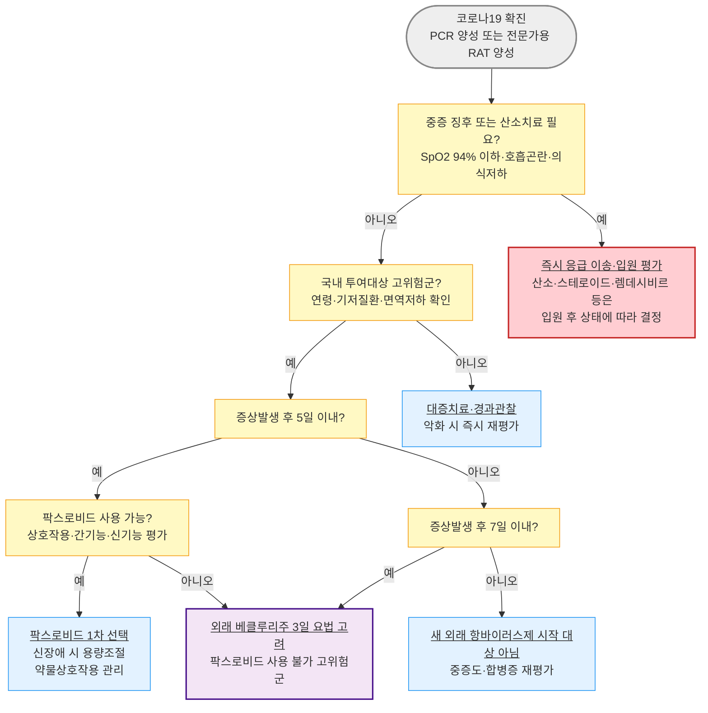

# 코로나19 (신종 코로나바이러스 감염증) COVID-19


**2026년 주요 변경 사항**

* **팍스로비드** : 2026.1.14. 품목허가 변경으로 eGFR＜30 ㎖/min의 중증 신장애 및 혈액투석 환자도 용량조절 투여 가능 - 1일차와 2\~5일차 용량이 다르므로 처방·조제·복약지도 시 표준 용량과 혼동하지 않도록 주의
* **라게브리오(몰누피라비르)** : 국내 품목허가·시중유통 없이 긴급사용승인 정부물량으로만 사용되었으며, 정부 재고 유효기간 종료에 따라 2026.3.17.부터 국내 공급·사용 중단 - 현재 국내 활성 치료제로 처방하지 않음


## <mark style="color:green;">일반 사항</mark>

* SARS-CoV-2(Severe Acute Respiratory Syndrome Coronavirus 2) 감염에 의한 급성 호흡기 질환
* 다른 이름 : Coronavirus Disease 2019 (COVID-19)
* 전염 경로 : 감염자가 호흡·말하기·기침·재채기할 때 배출하는 감염성 호흡기 입자와 비말의 흡입 또는 점막 침착이 주된 경로. 환기가 불충분한 실내에서는 미세 호흡기 입자가 축적되어 전파 위험이 증가하며, 오염된 표면을 통한 전파는 가능하지만 주된 경로는 아님
* 잠복기 : 평균 3\~5일 (범위 1\~14일); 변이주에 따라 변동
* 전염 기간 : 증상 발생 1\~2일 전부터 발생 후 5\~10일까지 감염력 지속; 면역 저하자·중증 환자에서는 연장 가능
* 국내 법정감염병 분류 : 제4급 감염병(표본감시 대상, 2023.8.31.자 하향 조정) - 신고·격리 기준은 질병관리청 최신 고시로 반드시 재확인
* 임상 스펙트럼 : 무증상 감염부터 상기도 증상, 폐렴, 급성호흡곤란증후군(ARDS), 다발성 장기부전까지 광범위

### <mark style="color:orange;">합병증</mark>

* 호흡기계 : 바이러스성 폐렴, 급성호흡곤란증후군(ARDS), 세균성 중복 감염(2차 세균성 폐렴)
* 혈관·응고계 : 정맥혈전색전증(폐색전증·심부정맥혈전증), 미세혈관 혈전증
* 심장 : 심근염, 부정맥, 기존 심혈관 질환의 급성 악화(급성 심근경색·심부전 트리거)
* 신경계 : 뇌병증, 뇌졸중, 길랭-바레증후군, 후각·미각 소실(지속형)
* 소아 : 다기관염증증후군(MIS-C, Multisystem Inflammatory Syndrome in Children) - 감염 수 주 후 발생 가능
* 지연 합병증 : Long COVID(감염 후 지속 증상) - 감염 후 보통 3개월 이내 발생하거나 지속되고 최소 2개월 이상 이어지며, 다른 진단으로 설명되지 않고 일상 기능에 영향을 주는 피로, 운동 후 불쾌감(PEM), 인지장애("brain fog"), 호흡곤란 등

#### <mark style="color:$primary;">중증 진행 고위험군</mark>

✽ 2025 IDSA Living Guideline(JAMA Clinical Guidelines Synopsis, 2026.6.30) 및 질병관리청 치료제 투여대상 기준(2025\~2026) 통합

* **고위험(예상 입원율 약 6% 이상)** : 75세 이상, HIV 감염(CD4 &#x3C;200/μL), 고형장기이식·혈액암으로 면역억제 치료 중, 최근 12개월 이내 B세포 고갈 치료(rituximab 등)
* **위험 증가(예상 입원율 0.5\~6%)** : 65\~74세, 만성 심폐질환, HIV 감염(CD4 ≥200/μL), 당뇨, 비만(BMI≥30 ㎏/㎡), 임신(현재 또는 분만 후 6주 이내)
* **국내 치료제 투여대상 기준(60세 이상 또는 18세 이상 기저질환자·면역저하자)은 위 IDSA 분류와 세부 항목이 다름** - §Management 표 참조
* 그 외 위험 인자 : 만성 신장애, 만성 간장애, 겸상적혈구질환, 신경발달장애·정신질환, 최근 1년 이내 심혈관 사건 병력

<table><thead><tr><th width="125">구분</th><th width="275">2025 IDSA Living Guideline</th><th>국내 질병관리청 투여대상 기준</th></tr></thead><tbody><tr><td><strong>연령</strong></td><td>75세 이상은 고위험, 65\~74세는 위험 증가군으로 분류</td><td>60세 이상</td></tr><tr><td><strong>기저질환·면역저하</strong></td><td>예상 입원위험을 바탕으로 연령, HIV의 CD4 수치, 장기이식·혈액암 치료, B세포 고갈 치료 및 만성질환 등을 계층화</td><td>18세 이상 면역저하자 또는 당뇨·고혈압·심혈관질환·만성 신장질환·만성 폐질환·BMI≥30·신경발달장애/정신질환 등 기저질환자</td></tr><tr><td><strong>주된 목적</strong></td><td>항바이러스제의 임상적 절대 이득과 근거 수준 판단</td><td>국내 정부공급·급여 등 투여 적격성 판단</td></tr></tbody></table>

_✽ 두 기준은 목적과 세부 항목이 다르다. 국내 적격 여부와 별개로 환자의 연령, 면역상태, 동반질환, 증상 정도 및 치료 접근성을 종합하여 임상적 이득을 판단한다._

## <mark style="color:green;">원인 및 위험 인자</mark>

* 원인 : SARS-CoV-2(베타코로나바이러스); 변이주(오미크론 계열 등)에 따라 전파력·중증도·백신 및 자연면역 회피능이 달라짐
* 위험 인자는 위 "중증 진행 고위험군" 참조

### <mark style="color:orange;">COVID-19 rebound와 재감염의 구분</mark>

* COVID-19 rebound는 초기 호전 또는 음전 후 대개 3\~7일경 증상이나 양성 반응이 다시 나타나는 현상으로, 항바이러스제 치료 여부와 관계없이 발생할 수 있음
* 대개 초기 감염보다 경미하며 입원으로 이어지는 경우는 드물지만, 재발 기간에는 전파 가능성을 고려하여 마스크를 착용하고 고위험자와의 접촉을 최소화
* 재감염은 이전 감염에서 회복한 뒤 새로 SARS-CoV-2에 감염된 경우이며, 새로운 노출력·증상·역학 상황과 검사 경과를 종합하여 판단. 90일 이상 경과하면 재감염 가능성이 커지지만 더 짧은 간격의 재감염도 가능하므로 시간 간격만으로 rebound와 재감염을 확정하지 않음
* Ct값은 검체 채취 상태와 검사 장비·시약의 영향을 받아 검사 간 직접 비교가 어려우므로 단독 구분 기준으로 사용하지 않음. 서로 다른 바이러스 계통이 확인되면 재감염의 강한 근거가 되지만 유전체 분석은 일상 진료에서 제한적
* 재치료(retreatment)의 임상적 이득은 확립되지 않았음 - 증상이 악화되거나 고위험 환자이면 중증 진행·세균성 중복감염·새로운 재감염 여부를 재평가하고, 재감염으로 판단되면 새로운 감염으로 간주하여 치료 적격성을 다시 평가

### <mark style="color:$danger;">🚩 Red Flags!</mark>

<mark style="color:$danger;">**즉각 조치 또는 응급 이송**</mark>

* 실내공기(room air)에서 SpO₂ 94% 이하 또는 기저치보다 의미 있는 산소포화도 저하 - 저산소혈증·폐렴
* 심한 호흡곤란, 호흡수 증가, 말할 때 숨참 - ARDS 진행 위험
* 지속적 흉통 또는 흉부 압박감
* 의식 저하, 혼돈, 각성 유지 곤란
* 입술·안면의 청색증
* 소아 : 최근 2\~6주 이내 COVID-19 감염·노출력 + 지속 발열 + 발진·결막충혈·심한 복통/구토·의식 변화·저혈압 중 하나 이상 - MIS-C 의심 → 즉시 소아과/응급실 의뢰. 쇼크·심장 침범 징후가 있으면 발열 기간과 관계없이 응급 이송
* 소아 : 무기력, 수유·경구 섭취 저하, 탈수 징후(소변량 감소, 눈물 없음)

<mark style="color:$warning;">**당일 또는 조기 의뢰**</mark>

* 고위험군(65세 이상, 면역저하, 만성 심폐질환 등)에서 3일 이상 지속되거나 재상승하는 발열
* SpO₂ 95%로 경계치에 있거나 안정 시 대비 운동 시 저하가 뚜렷한 경우(만성 폐질환자는 평소 기저치와 비교)
* 경구 섭취 저하로 탈수가 우려되는 고령·소아 환자
* 임신부의 호흡기 증상 악화 또는 태동 감소 동반
* 항바이러스제 투여 대상 고위험군인데 아직 처방받지 못함(팍스로비드는 증상발생 5일 이내, 렘데시비르는 7일 이내가 치료 개시의 창임)
* 초기 호전 후 재악화 + 발열 지속 - 세균성 중복 감염 의심 (☞ [폐렴](068_-pneumonia.md))

<mark style="color:$info;">**외래 추적 / 추가 평가 계획**</mark> <mark style="color:$info;">- 즉각 위험 낮으나 호전 없으면 의뢰</mark>

* 감염 후 보통 3개월 이내 발생하거나 지속되어 최소 2개월 이상 이어지는 피로·인지장애·호흡곤란 - Long COVID 평가 및 다른 원인 감별
* 초기 호전 또는 음전 후 발생한 경미한 증상 재발(COVID-19 rebound) - 치료 여부와 관계없이 발생 가능; 대개 자연 호전하나 악화 시 재평가
* 5일 이상 지속되거나 재악화되는 증상 - 세균성 중복감염 감별 필요

## <mark style="color:green;">임상 양상</mark>

* **상기도 증상** : 발열, 인후통, 기침, 코막힘/콧물, 근육통, 두통, 피로감
* **후각·미각 소실** : 초기 변이주에서 특징적이었으나 최근 변이주에서는 빈도 감소
* **위장관 증상** : 오심, 구토, 설사(소아에서 상대적으로 흔함)
* **하기도/중증 진행 징후** : 호흡곤란, 흉부 압박감, 저산소혈증(SpO₂ ≤94%, room air 또는 기저치보다 의미 있는 저하), 폐렴
* 고령자에서는 발열 없이 기력 저하·식욕 부진·섬망만으로 내원하는 경우가 있어 유행 시기에는 적극적으로 의심할 것

✽ 인플루엔자·세균성 폐렴과의 임상 양상 비교는 인플루엔자 챕터의 "독감 vs 세균성 폐렴 vs COVID-19" 표 참조 (☞ [인플루엔자](069_-influenza.md))

## <mark style="color:green;">진단</mark>

* **진단 기준**(질병관리청) : ① 검체에서 SARS-CoV-2 특이 유전자 검출(PCR 양성) 또는 ② 신속항원검사(전문가용 RAT) 결과 양성
* 자가검사(가정용 신속항원검사) 양성은 임상적 진단의 참고 자료로 활용하되, 치료제 처방 등 공식 확진 절차에는 전문가용 검사 기준 적용
* 중증도 판정 : 산소치료 필요 여부(SpO₂ ≤94%, room air 또는 기저치보다 의미 있는 저하)를 중요한 기준으로 하되, 호흡수·호흡곤란·영상상 폐렴·기저질환을 함께 평가하여 치료제 선택과 의뢰 여부를 결정
* 코로나19·인플루엔자 동시 유행기에는 임상 양상과 지역 유행 상황에 따라 콤보 신속항원검사(COVID-19 + 인플루엔자 A/B)를 고려; 필요한 경우 RSV 포함 multiplex PCR 활용

### <mark style="color:orange;">검사</mark>

* 고위험군의 중등도 이상 증상, 폐렴·저산소혈증 의심 시 : 흉부 영상(X-ray/CT), CBC, 전해질, 신기능, CRP, 동맥혈가스분석
* MIS-C 의심 소아 : 검사를 마친 뒤 의뢰하지 말고 즉시 소아과/응급실로 의뢰; 의뢰·입원기관에서 CBC, CRP/ESR, ferritin, BNP, troponin, 심초음파 등 시행
* 회복기 흉통·심계항진·운동 시 호흡곤란 발생 시 : EKG + troponin - 심근염 배제 목적

### <mark style="color:orange;">감별 진단</mark>

<table><thead><tr><th width="130">질환</th><th width="260">COVID-19와의 주요 차이</th><th>감별 포인트</th></tr></thead><tbody><tr><td><strong>인플루엔자</strong></td><td>임상적으로 구별 어려움; 항바이러스제 계열이 다름</td><td>동시 유행기에는 신속항원/PCR 동시검사 권장 (☞ <a href="069_-influenza.md">인플루엔자</a>)</td></tr><tr><td><strong>감기(비-COVID 상기도감염)</strong></td><td>중증 진행 위험이 낮음</td><td>고위험군이 아니면 검사·항바이러스제 불필요 (☞ <a href="060_-common-cold.md">감기</a>)</td></tr><tr><td><strong>세균성 폐렴</strong></td><td>COVID-19 회복기 중복감염으로도 발생 가능</td><td>발열 재상승, 국소 흉부 소견, 백혈구 증가·CRP 상승 (☞ <a href="068_-pneumonia.md">폐렴</a>)</td></tr><tr><td><strong>급성 기관지염</strong></td><td>중증 진행 위험 매우 낮음</td><td>고위험 인자 없는 경증 기침 우세 시 (☞ <a href="066_-acute-bronchitis.md">급성 기관지염</a>)</td></tr></tbody></table>

### <mark style="color:orange;">Long COVID 평가 및 관리</mark>

* **정의** : SARS-CoV-2 감염 후 보통 3개월 이내 새로 발생하거나 지속되고 최소 2개월 이상 이어지며, 다른 진단으로 설명되지 않고 일상 기능에 영향을 주는 증상
* **주요 증상** : 피로, 운동 후 불쾌감(PEM/PESE), 호흡곤란·흉통·심계항진, 집중력·기억력 저하, 수면장애, 두통, 불안·우울, 지속되는 후각·미각 변화 등
* **진단 접근** : 단일 확진검사는 없으며 병력·진찰을 바탕으로 빈혈, 갑상선질환, 심폐질환, 수면장애, 약물 부작용 및 정신건강 문제 등 다른 원인을 감별. CBC, 신기능·간기능·갑상선기능, 심전도, 흉부영상, 폐기능검사 등은 모든 환자에게 일괄 시행하지 않고 증상과 임상소견에 따라 선택
* **관리** : 증상과 기능장애에 맞춘 다학제적·개별화 관리가 원칙. PEM/PESE가 있으면 고정된 단계적 운동 증량을 피하고 pacing과 에너지 보존을 우선하며, PEM/PESE가 없는 경우에만 증상 허용 범위에서 신중하게 재활 강도를 조절
* 새로운 저산소혈증, 진행하는 흉통·실신, 신경학적 결손 또는 다른 Red Flag가 있으면 Long COVID로 단정하지 말고 급성 심폐·신경계 질환을 우선 평가

***



<p align="center"><strong>코로나19 항바이러스제 선택 알고리듬</strong></p>

<p align="center"><em><mark style="color:$info;">Ref. 질병관리청 코로나19 치료제 사용 안내 제13-2판(2025); 의료진을 위한 코로나19 치료제 처방 안내 Q&#x26;A(2026.2.26); 2025 IDSA Living Guideline (JAMA Clinical Guidelines Synopsis, 2026.6.30)</mark></em></p>

***

## <mark style="background-color:$warning;">Management</mark>


**항바이러스제 치료 원칙**

팍스로비드는 증상발생 후 5일 이내, 외래 렘데시비르는 7일 이내 시작해야 하며 이득은 고위험군에서 가장 크다. 위험 인자가 없는 환자는 항바이러스제로 인한 입원 감소 효과가 미미하여 통상 사용하지 않는다(2025 IDSA Living Guideline).


**항바이러스제 투여 단계 (IDSA 2025 위험군 기준)**

1. **고위험(예상 입원율 약 6% 이상)** - 니르마트렐비르-리토나비르 또는 정맥 렘데시비르 권고(SR, moderate COE); 병용금기·렘데시비르 접근 불가 시 국제 지침에서는 몰누피라비르를 고려할 수 있으나 국내에서는 2026.3.17.부터 사용 중단(CR, low COE)
2. **위험 증가(예상 입원율 약 0.5\~6%)** - 니르마트렐비르-리토나비르(CR, moderate COE) 또는 렘데시비르(CR, low COE)는 환자 선호·상호작용·정맥주사 접근성·절대 이득을 함께 고려하여 결정하며, 몰누피라비르는 일상적으로 권고하지 않음
3. **위험 인자 없음** - 니르마트렐비르-리토나비르·렘데시비르 비사용 제안; 몰누피라비르는 강하게 반대 권고(SR, moderate COE)

### <mark style="color:orange;">국내 치료제 투여대상 기준(질병관리청, 2025\~2026)</mark>

✽ 국내 정부공급/급여 기준은 IDSA 위험군 정의보다 연령·기저질환 목록으로 단순화되어 있으며, 산소치료 필요 여부로 경·중등증/중증을 구분함

<table><thead><tr><th width="110">치료제</th><th width="230">투여대상</th><th>용법·용량</th></tr></thead><tbody><tr><td><strong>팍스로비드</strong></td><td>60세 이상 또는 18세 이상 면역저하자·기저질환자(당뇨·고혈압·심혈관질환·만성 신장질환·만성 폐질환·BMI≥30·신경발달장애/정신질환) + 증상발생 5일 이내 + 산소치료 불필요</td><td>니르마트렐비르 300 ㎎+리토나비르 100 ㎎ bid 5일간(신장애 시 용량조절, 처방례 참조)</td></tr><tr><td><strong>베클루리주</strong><br>(경·중등증)</td><td>60세 이상 또는 성인·소아(40 ㎏ 이상) 기저질환자·면역저하자 + 증상발생 7일 이내 + 산소치료 불필요 + 팍스로비드 사용 불가</td><td>1일차 200 ㎎, 2\~3일차 100 ㎎ qd, IV infusion 30\~120분, 총 3일</td></tr><tr><td><strong>베클루리주</strong><br>(입원 중증)</td><td>입원 중인 성인·소아(생후 28일 이상, 체중 3 ㎏ 이상)로서 폐렴, SpO₂≤94%(room air), 보조산소·기계환기·ECMO 필요 중 하나 이상에 해당</td><td>1일차 200 ㎎, 이후 100 ㎎ qd, IV infusion 30\~120분, 기본 총 5일. 5일 후 임상적으로 호전되지 않으면 최대 10일까지 연장 가능(소아 체중별 용량은 허가사항 확인)</td></tr></tbody></table>

_<mark style="color:$info;">코로나19 확진 정의 : ① PCR 등 특이 유전자 검출 또는 ② 신속항원검사(전문가용 RAT) 양성. 정부공급·건강보험 급여·본인부담 기준은 서로 다를 수 있으므로 질병관리청 코로나19 치료제 사용 안내 최신판 및 HIRA 고시로 확인.</mark>_

### <mark style="color:orange;">팍스로비드 처방 전 필수 확인 사항</mark>


**⚠️ 팍스로비드 약물상호작용 - 약제별 관리 방법이 다름**

처방 전 반드시 환자의 처방약·일반의약품·건강기능식품을 확인하고 **DUR** 및 최신 상호작용 자료로 검토한다. 병용금기 성분의 개수와 목록은 허가 변경에 따라 달라질 수 있으며, 청구상 사유 기재가 임상적으로 안전한 병용을 의미하지 않는다.

* **중단해도 치료 창 내 팍스로비드 사용이 어려운 강력한 CYP3A 유도제** : 세인트존스워트, 카르바마제핀, 페노바르비탈, 페니토인, 프리미돈, 리팜피신, 아팔루타마이드, 엔잘루타마이드 등. 효소 유도효과가 수일 이상 지속될 수 있으므로 임의 중단 후 팍스로비드를 투여하지 말고 렘데시비르 등 대체 치료 고려
* **정해진 기간 중단 가능한 약물** : 심바스타틴·로바스타틴은 팍스로비드 시작 최소 12시간 전부터 중단하고, 투여 중 및 종료 후 5일까지 중단. 다른 약물은 성분별 중단·재개 시점 확인
* **용량조절·혈중농도 모니터링·전문가 자문이 필요한 약물** : 사이클로스포린·타크로리무스·에베로리무스·시롤리무스 등 면역억제제. 단순 중단·재개하지 말고 농도 모니터링이 불가능하면 팍스로비드 병용을 피함
* **중단 위험이 커 대체 항바이러스제를 우선 고려할 약물** : 최근 관상동맥 중재술 후 clopidogrel·ticagrelor, 일부 항부정맥제·항응고제 등. 예를 들어 amiodarone은 혈중농도 상승에 따른 중대한 부정맥 위험과 긴 반감기 때문에 단기간 중단만으로 상호작용을 해소하기 어려우며, rivaroxaban은 노출 증가에 따른 출혈 위험으로 병용을 피한다. 다른 DOAC·warfarin도 동일하게 처리하지 말고 적응증·신기능·혈전 및 출혈 위험에 따라 최신 자료와 전문가 자문으로 개별 판단
* PDE-5 억제제, 진정수면제, 항정신병약, 항경련제 등은 성분·적응증·용량에 따라 금기 또는 조정 방법이 다르므로 약물군 전체를 동일하게 처리하지 않음
* 최신 목록·병용주의/용량조절 정보는 [covid-ddi.or.kr](https://covid-ddi.or.kr/)(대한항균요법학회)에서 성분명/제품명으로 조회


* 상호작용 약물을 조정하며 처방하는 경우 요양급여 청구상 특정내역 기재가 필요할 수 있으나, 이는 병용 안전성을 보증하거나 실제 금기 병용을 허용하는 절차가 아님
* 약물 중단·대체로 기저질환 악화가 우려되거나 안전한 모니터링이 불가능하면 팍스로비드 대신 렘데시비르 등 대체 치료 고려
* 신장애 : eGFR 30\~59 ㎖/min에서 용량조절, eGFR ＜30 ㎖/min(혈액투석 포함)은 2026.1.14. 품목허가 변경으로 용량조절 투여 가능(기존 투여금지에서 개선) - 용량은 처방례 참조
* 간장애 : 중증 간장애(Child-Pugh C)에서는 투여가 권장되지 않음
* 임부 : 팍스로비드는 유익성이 위해성을 상회한다고 판단될 때 사용; 몰누피라비르는 임신 중 투여하지 않음(동물실험에서 태아 골격 이상 등 확인)

## <mark style="color:green;">비-약물 치료</mark>

* 안정·충분한 휴식, 충분한 수분 섭취
* 발열 시 가볍고 편한 옷을 입고 과도한 보온을 피함; 오한을 유발하는 찬물 마사지나 과도한 미온수 찜질은 불필요
* 실내 습도 유지, 자주 환기
* 천식·COPD 환자 : 조절을 위해 처방받은 기존 흡입제(기관지확장제·흡입 스테로이드)는 평소 용법대로 계속 사용하며 의료진 지시 없이 임의로 증량하지 않음; 호흡곤란 악화 시 즉시 내원

## <mark style="color:green;">약물 치료</mark>

### <mark style="color:orange;">대증 치료</mark>

<table><thead><tr><th width="140">증상</th><th width="230">약제 선택</th><th>주의사항</th></tr></thead><tbody><tr><td>발열·근육통·두통</td><td>아세트아미노펜(1차); 필요 시 NSAID</td><td>18세 미만 : 아스피린 금기(Reye 증후군); 고령·신기능 저하·탈수 시 NSAID 주의</td></tr><tr><td>기침</td><td>수면·일상생활을 방해할 때 덱스트로메토르판, 레보드로프로피진 등 고려</td><td>진해제는 증상 완화 목적이며 COVID-19 경과를 바꾸지 않음; 호흡곤란·저산소증·폐렴 징후를 먼저 평가</td></tr><tr><td>인후통</td><td>[경증] 트로키·생리식염수 가글; [중등증] 아세트아미노펜/NSAID</td><td>-</td></tr><tr><td>구역·구토</td><td>원인·중증도와 병용약을 확인하여 적절한 항구토제 고려</td><td>지속 시 탈수·전해질 이상 평가</td></tr></tbody></table>

* **항생제** : 초기 호전 후 발열 재상승, 국소 흉부 소견, 화농성 객담과 영상·검사 소견 등으로 세균성 중복 감염이 의심되는 경우에 한해 사용(☞ [폐렴](068_-pneumonia.md)); 폐렴·호흡부전·저혈압만으로 세균감염을 단정하지 않으며 코로나19 단독 감염에 예방적 항생제는 사용하지 않음. Procalcitonin(PCT)은 세균성 감염 여부를 단독으로 확정하거나 항생제 사용을 결정하는 검사가 아니며, 일상적 시행 근거가 충분하지 않음


**⚠️ 외래 경증·중등증 COVID-19에서 피해야 할 치료**

* 산소치료가 필요하지 않은 환자에게 COVID-19 치료 목적으로 전신 스테로이드를 사용하지 않음
* 세균성 감염의 근거 없이 항생제를 사용하지 않음
* COVID-19만을 이유로 외래에서 항응고제·항혈소판제를 새로 시작하지 않음
* COVID-19 치료 목적으로 흡입 스테로이드를 새로 시작하지 않음. 단, 천식·COPD 등 기존 적응증으로 사용 중인 흡입제는 임의로 중단하지 않음


### <mark style="color:orange;">니르마트렐비르-리토나비르</mark>

* 기전 : 니르마트렐비르는 SARS-CoV-2 3CL protease 억제제; 리토나비르는 CYP3A 억제를 통해 니르마트렐비르 혈중농도를 높이는 pharmacokinetic booster
* <mark style="color:blue;">\[팍스로비드]</mark> 니르마트렐비르 150 ㎎×2정+리토나비르 100 ㎎×1정/팩
* 표준 용법 : 니르마트렐비르 300 ㎎(150 ㎎×2정)+리토나비르 100 ㎎ bid, 식사와 무관, 12시간마다, 5일간
* 복용을 잊은 경우 : 8시간 이내면 즉시 복용, 8시간 경과 시 다음 예정 시간에 정량 복용(두 배 복용 금지)
* 부작용 : 미각 이상(쓴맛, dysgeusia)이 흔함 - 임의 복용 중단 방지 복약지도 필요
* COVID-19 rebound : 초기 호전 후 증상·양성 반응이 다시 나타날 수 있으나 치료 여부와 관계없이 발생 가능하며 대개 경미함; 재치료의 임상적 이득은 확립되지 않음

### <mark style="color:orange;">렘데시비르</mark>

* 기전 : RNA-dependent RNA polymerase 억제
* <mark style="color:blue;">\[베클루리주]</mark> 100 ㎎/바이알, 정맥주사용 동결건조분말
* 정맥 투여 전용(IV infusion, 30\~120분); 신장애(투석 포함)·간장애(Child-Pugh A/B/C) 모두 용량조절 불필요(2024.12.3. 품목허가 변경)
* 투여 전 및 치료 중 간기능검사와 임상상태를 확인하고, 주입 중·후 과민반응과 주입 관련 반응을 관찰
* 경·중등증 : 1일차 200 ㎎, 2\~3일차 100 ㎎ qd, 총 3일
* 입원 중증 : 1일차 200 ㎎, 이후 100 ㎎ qd, 기본 총 5일; 5일 후 임상적으로 호전되지 않으면 최대 10일까지 연장 가능. 산소치료·전신 스테로이드·면역조절제 등은 환자 상태에 따라 결정
* 다른 경로로 투여하지 않음; 전원 시 잔여용량은 원칙적으로 인계하지 않음(타 병원 보유량 없을 시 예외)

### <mark style="color:orange;">몰누피라비르</mark>


**2026.3.17.부로 국내 사용 중단** - 국내 품목허가·시중유통 없이 긴급사용승인 정부물량으로만 사용되었으므로 현재 국내 활성 치료제로 처방하지 않음. 아래 내용은 국제 지침·과거 국내 사용 기록을 위한 참고 사항


* 기전 : RNA-dependent RNA polymerase에 오류를 유도하는 뉴클레오시드 유사체(mutagenic)
* <mark style="color:blue;">\[라게브리오]</mark> 200 ㎎/캡슐
* 표준 용법 : 800 ㎎(200 ㎎×4캡슐) bid, 식사와 무관, 5일간; 캡슐은 부수거나 열지 않고 통째로 복용(연하곤란 시 현탁액 조제 가능, 4캡슐을 물 40 ㎖에 희석)
* 임부 금기; 수유부는 투여 중 및 마지막 투여 후 4일간 수유 비권장; 가임기 여성은 투여 중 및 마지막 투여 후 4일간, 가임기 배우자가 있는 남성은 투여 중 및 마지막 투여 후 3개월간 효과적인 피임 필요
* 18세 미만 소아·청소년에는 골·연골 영향 우려로 투여하지 않음

## <mark style="color:green;">예방</mark>

### <mark style="color:orange;">격리 기간</mark>

✽ 국내 코로나19는 제4급 감염병으로 하향 조정되어(2023.8.31.) 법적 강제 격리 의무는 없지만, 전파 예방을 위한 자율격리 권고는 유지됨 - 최신 지침은 질병관리청 공지로 재확인

* 지역사회 확진자 : 확진 후 5일간 자택 격리와 외출 자제를 권고. 부득이하게 외출할 때는 KF94 또는 동급 마스크를 착용하고 고위험자와의 접촉을 피함
* 감염취약시설 입소자·의료기관 입원환자 : 원칙적으로 7일간 격리 권고
* 중증 면역저하자 등 : 바이러스 배출 기간이 길어질 수 있어 임상 판단에 따라 최대 20일까지 연장 고려
* 활동 재개 : 권고 격리기간이 지난 뒤에도 발열이 지속되거나 증상이 호전되지 않으면 접촉 최소화와 마스크 착용을 계속하고 재평가. 해열제 없이 발열이 소실되고 전반적 증상이 호전된 후 최소 24시간 경과 여부도 함께 고려
* 의료기관 종사자 : 각 기관의 감염관리 지침과 업무복귀 기준 적용

### <mark style="color:orange;">예방접종</mark>

☞ [코로나19 예방접종](../231_/210_-vaccination.md#covid-19)

* 2025\~2026절기 국가예방접종 대상은 65세 이상, 생후 6개월 이상 면역저하자, 감염취약시설 입원·입소자였음
* 2026\~2027절기 국가예방접종 대상은 65세 이상, 면역저하자 및 감염취약시설 입원·입소자이며 XFG 균주 백신을 사용. 65세 이상과 12세 이상 면역저하자·시설 입원·입소자는 2026년 10월부터 접종하며, 12세 미만 대상자의 시작 일정은 추후 질병관리청 공고를 확인. 면역저하자를 포함한 모든 고위험군을 일률적으로 "연 1회"로 단정하지 않음

***

### <mark style="color:red;">질병코드</mark>

U07.1 코로나바이러스감염증-19, 바이러스가 확인된 경우

U07.2 코로나바이러스감염증-19, 바이러스가 확인되지 않았으나 임상적·역학적으로 진단된 경우

U09.9 상세불명의 코로나19 이후 병태

_✽ U09.9는 급성 COVID-19가 지난 뒤 임상적으로 확인된 후유 상태를 기록하는 코드이며, 코드 기재 자체가 특정 검사·치료의 급여를 보장하지 않는다. 실제 증상·후유증을 진료기록에 남기고 최신 심사·청구 기준을 확인한다._

U10.9 상세불명의 코로나19와 관련된 다발계통염증성증후군

***

## <mark style="color:purple;">처방례</mark>

> **처방례 1. 표준 용법 - 60세 이상, 신기능 정상**
>
> ```
> 팍스로비드 니르마트렐비르 150 ㎎ 2정 + 리토나비르 100 ㎎ 1정   1회분(총 3정)  bid  × 5일
> ```
>
> _✽ 증상발생 5일 이내, 산소치료 불필요한 60세 이상 환자. 식사와 무관하게 12시간 간격 복용; 5일 전체 과정 완료가 중요함을 복약지도. DUR로 병용금기 약물 사전 확인 필수_

> **처방례 2. 중등도 신장애 (eGFR 30\~59 ㎖/min)**
>
> ```
> 팍스로비드 니르마트렐비르 150 ㎎ 1정 + 리토나비르 100 ㎎ 1정   1회분(총 2정)  bid  × 5일
> ```
>
> _✽ 니르마트렐비르만 절반 용량으로 감량된 전용 포장 사용; 리토나비르는 100 ㎎ bid 유지_

> **처방례 3. 중증 신장애/혈액투석 환자 (eGFR＜30 ㎖/min)**
>
> ```
> 1일차 : 팍스로비드(니르마트렐비르 300 ㎎+리토나비르 100 ㎎)   qd
> 2~5일차 : 팍스로비드(니르마트렐비르 150 ㎎+리토나비르 100 ㎎)   qd
> ```
>
> _✽ 2026.1.14. 품목허가 변경으로 중증 신장애·투석 환자도 용량조절 후 투여 가능(기존 투여금지에서 개선); 총 11정. 혈액투석을 진행하는 날에는 투석 종료 후 투여. 중증 신장애용 포장 또는 허가된 조제 지시에 따라 조제하고, 표준 용량과 혼동하지 않도록 1일 1회 복용 및 날짜별 정제 수를 반복 확인한다. 환자가 임의로 정제를 제거하거나 용량을 변경하지 않도록 안내_

> **처방례 4. 병용금기 약물(스타틴) 복용자 - 일시중단 후 팍스로비드**
>
> ```
> (심바스타틴: 팍스로비드 시작 최소 12시간 전부터 중단, 투여 중 및 종료 후 5일까지 중단)
> 팍스로비드 니르마트렐비르 150 ㎎ 2정 + 리토나비르 100 ㎎ 1정   1회분(총 3정)  bid  × 5일
> ```
>
> _✽ 심바스타틴·로바스타틴은 시작 최소 12시간 전부터 중단하고 팍스로비드 종료 후 5일이 지난 뒤 재개. 청구상 특정내역 기재가 임상적으로 안전한 병용을 의미하지 않으며, 약물을 안전하게 조정할 수 없으면 베클루리주 고려_

> **처방례 5. 팍스로비드 사용 불가(중증 간장애 등) - 베클루리주**
>
> ```
> 1일차 : 베클루리주(렘데시비르) 200 ㎎   IV infusion (30~120분)
> 2~3일차 : 베클루리주(렘데시비르) 100 ㎎   IV infusion qd
> ```
>
> _✽ 증상발생 7일 이내이며 Child-Pugh C 중증 간장애, 병용금기 약물 조정 불가 등으로 팍스로비드를 사용할 수 없는 경증·중등증 고위험 환자에 사용. 정부물량 사용 시 담당기관 지정 여부 확인 필요; 요양급여 청구 시 특정내역 MX999에 "주사치료제" 기재_

***

### <mark style="color:$success;">핵심 복약 지도</mark>

> **팍스로비드 - 병용금기 및 복용법**
>
> * 12시간 간격으로 5일간 복용하십시오(예: 아침 8시, 저녁 8시). 증상이 호전된 것처럼 느껴져도 5일 과정을 반드시 완료하십시오.
> * 복용 전 현재 복용 중인 모든 약(처방약·일반의약품·건강기능식품 포함, 특히 세인트존스워트)을 반드시 알려주십시오 - 심각한 약물상호작용이 발생할 수 있습니다.
> * 복용을 잊은 경우, 8시간 이내면 즉시 복용하고, 8시간을 넘겼다면 거른 용량은 건너뛰고 다음 예정 시간에 정량만 복용하십시오(두 배 복용 금지).
> * 입에서 쓴맛(미각 이상)이 흔히 발생할 수 있으나 이 때문에 임의로 중단하지 마십시오.
> * 처음 호전된 뒤 3\~7일경 증상이나 검사 양성 반응이 다시 나타나는 COVID-19 rebound가 있을 수 있습니다. 치료 여부와 관계없이 발생할 수 있고 대개 경미하지만, 재발 기간에는 마스크를 착용하고 고위험자와의 접촉을 피하십시오. 증상이 심해지면 다시 내원하십시오.
> * 병용금기·상호작용에 대한 최신 정보는 [covid-ddi.or.kr](https://covid-ddi.or.kr/)에서 확인할 수 있습니다.

> **언제 다시 병원을 방문해야 하나요?**
>
> * 산소포화도가 94% 이하로 떨어지거나 평소보다 뚜렷하게 낮아지고 호흡곤란이 심해지는 경우 - 즉시 응급실
> * 3일 이상 지속되거나 다시 오르는 고열
> * 의식이 흐려지거나 평소와 다르게 처지는 경우
> * 항바이러스제 복용 중 새로운 심한 부작용(예: 심한 알레르기 반응)이 발생하는 경우

***

### <mark style="color:blue;">환자 안내서</mark>


**코로나19, 대부분은 집에서 회복되지만 고위험군은 빠른 진단·치료가 중요합니다**

건강한 성인 대부분은 감기와 비슷하게 앓고 지나가지만, 고령이나 기저질환이 있는 분은 증상 초기(발생 후 5일 이내)에 항바이러스제를 복용하면 중증으로 진행할 위험을 크게 낮출 수 있습니다.


#### <mark style="color:$primary;">코로나19란 무엇인가요?</mark>

* 신종 코로나바이러스(SARS-CoV-2) 감염으로 생기는 호흡기 질환입니다
* 발열, 인후통, 기침, 콧물, 몸살, 두통 등 감기와 비슷한 증상이 흔합니다
* 대부분 1\~2주 내 자연 호전되지만, 일부에서는 폐렴 등 중증으로 진행할 수 있습니다

#### <mark style="color:$primary;">항바이러스제는 누가, 언제 복용해야 하나요?</mark>

* **60세 이상**이거나, **18세 이상이면서** 당뇨·고혈압·심장병·폐질환·만성 콩팥병·비만·면역저하 등 기저질환이 있는 분은 항바이러스제 치료를 적극 고려해야 합니다
* 먹는 치료제 팍스로비드는 증상이 시작된 지 **5일 이내**에 복용을 시작해야 효과가 있으므로, 확진되면 바로 진료를 받으십시오
* 증상 시작 후 5일이 지났더라도 7일 이내라면, 팍스로비드를 사용할 수 없는 고위험 환자에서 3일간 주사 치료제(베클루리주)를 고려할 수 있습니다
* 이미 산소치료가 필요할 정도로 심하다면 특정 약을 외래에서 선택하기보다 즉시 응급실에서 입원 평가를 받아야 합니다

#### <mark style="color:$primary;">집에서 어떻게 관리하나요?</mark>

* **충분히 쉬고 물을 자주 마십시오.** 발열이 심하면 아세트아미노펜 등 해열제를 사용할 수 있습니다.
* 법적 격리 의무는 없지만 **확진 후 5일간은 가능한 한 집에서 쉬고 외출을 자제하십시오.** 특히 고령자·기저질환자·영유아와의 접촉을 피하십시오.
* 부득이하게 외출하거나 다른 사람과 함께 있어야 할 때는 KF94 또는 동급 마스크를 착용하십시오.
* **환기를 자주 하십시오.**
* 5일이 지난 뒤에도 발열이 계속되거나 증상이 좋아지지 않으면 다른 사람과의 접촉을 줄이고 마스크 착용을 계속하면서 진료를 받으십시오.

#### <mark style="color:$primary;">예방접종이 중요합니다</mark>

* 고위험군(고령자, 임신부, 만성질환자, 면역저하자)은 변이주에 맞춰 갱신되는 백신 접종으로 중증화를 예방할 수 있습니다
* 접종 시기·대상은 매 시즌 바뀔 수 있으므로 질병관리청 공지를 확인하십시오

#### <mark style="color:$primary;">이럴 때는 즉시 응급실로 가세요</mark>

* 숨쉬기가 힘들거나 가슴이 답답한 느낌이 지속되는 경우
* 입술이나 얼굴이 파랗게 변하는 경우
* 평소와 다르게 혼란스러워하거나 깨우기 힘든 경우
* (소아) 최근 2\~6주 이내 코로나19를 앓았거나 노출된 뒤 지속 발열과 발진, 눈 충혈, 심한 복통·구토, 처짐이 함께 나타나는 경우 - 즉시 소아과/응급실. 저혈압·의식 변화가 있으면 발열기간과 관계없이 응급실
* (소아) 처지고 잘 먹지 못하며 소변량이 눈에 띄게 줄어드는 경우

#### <mark style="color:$primary;">회복 후에도 증상이 계속되면?</mark>

* 감염 후 보통 3개월 이내 시작되거나 지속된 피로감, 집중력 저하, 숨참 등이 2개월 이상 이어지고 일상생활에 영향을 주면 진료를 받으십시오(이른바 '롱코비드')

_<mark style="color:$info;">Ref. 질병관리청 코로나19 치료제 사용 안내 제13-2판(2025.2.17.); 질병관리청 의료진을 위한 코로나19 치료제 처방 안내 Q&#x26;A 리플렛(2026.2.26.); 질병관리청 코로나바이러스감염증-19 의료기관 감염예방·관리 제3판; 질병관리청 2025\~2026절기 코로나19 국가예방접종 안내 및 2026\~2027절기 코로나19 국가예방접종사업 계획·XFG 균주 백신 도입 발표; 2025 IDSA Living Guideline on COVID-19 Treatment (JAMA Clinical Guidelines Synopsis, 2026.6.30.); WHO Post COVID-19 condition clinical case definition and rehabilitation guidance; CDC COVID-19 outpatient treatment, rebound and reinfection guidance; NICE COVID-19 rapid guideline-identifying and managing co-infections; 한국표준질병·사인분류 제9차 개정(KCD-9).</mark>_
