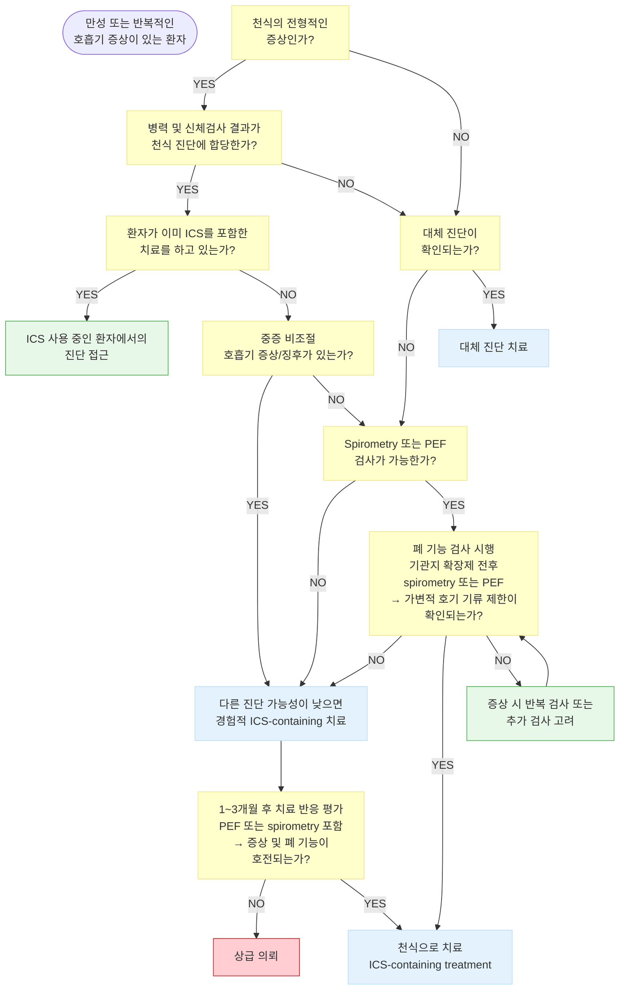
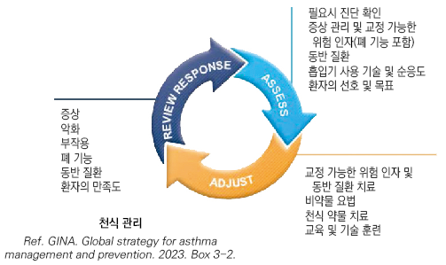
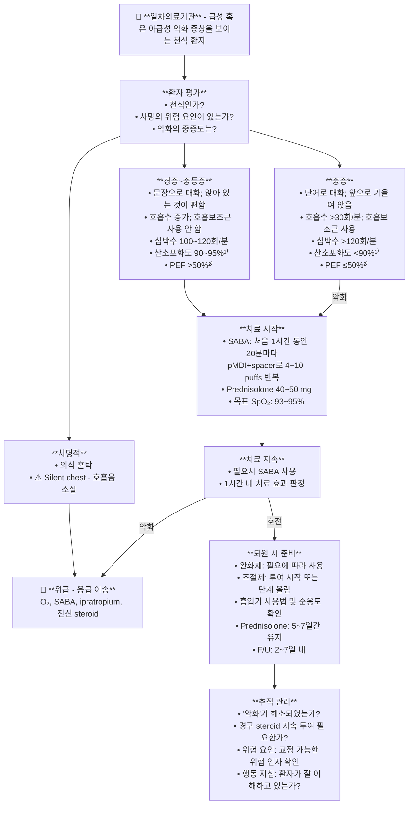
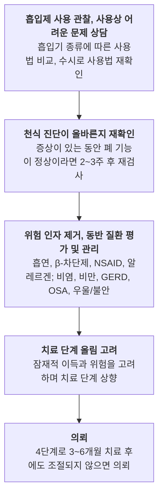

# 천식 Asthma

## <mark style="color:green;">일반 사항</mark>

* 기도의 만성 염증을 특징으로 임상적·병태생리학적으로 다양한 표현형을 보이고, 가변적인 호기 기류 제한과 함께 변동성이 있는 쌕쌕거림(wheezing), 호흡 곤란(shortness of breath), 가슴 답답함(chest tightness), 기침(cough) 증상이 나타나는 질환
* 환자의 ≥80%가 <6세에 첫 증상을 보이며, 이 중 일부가 지속적인 천식 증상을 보임
* 밤이나 이른 아침에 주로 악화
* 폐 기능 검사에서 기류 제한, 기관지 유발 시험에서 양성 결과
* 조절되지 않으면 유발 인자에 더욱 쉽게 영향을 받지만, 적절한 관리를 통하여 일상적인 생활은 물론 극심한 강도의 운동도 가능

### <mark style="color:orange;">병태 생리</mark>

* 기도 염증, 기도 과민, 기도 폐쇄의 상호 작용에 의해 가역적으로 증상 발생
* 장기간 지속되면 비가역 상태가 되어 기류 제한이 지속됨

#### <mark style="color:$primary;">기도 염증</mark>

* 비만 세포 활성화, 활성 호산구 수↑, T세포(NK T-cell, TH2-cell)↑ → 염증 매개체↑

#### <mark style="color:$primary;">기도 과민</mark>

* 정상인에게는 반응이 발생하지 않는 적은 자극에도 기도 수축이 발생
* 알레르겐 등 유발 인자에 의해 쉽게 증상 발생
* 영향 : 기도 비후, 기도 상피 세포 손상, 기도 내 신경 계통 이상, 기도 근육 이상

#### <mark style="color:$primary;">기도 폐쇄</mark>

* 병인 : 기도 수축, 기도 과민에 의한 기도 비후, 점액 분비 증가
* 기도 수축 : 알레르기 관련 세포들에서 분비되는 화학 매개체에 의해 기관지 평활근 수축
* 기도 비후 : 기도 주변 미세 혈관 투과성 증가 → 혈관 내 액체가 기도 점막 조직으로 유입 → 기도 안쪽 지름 감소
* mucus plug 형성 : 기도 내 goblet cell, submucosal gland에서 점액 분비물 분비; 천식 발작 시 심해짐
* airway remodeling(기도개형) : 천식 발작이 반복되면서 기도의 탄력성 및 주변 폐 조직의 변성, 기도 벽 비후로 점차 비가역적 상태가 됨; 경증 천식 환자 및 짧은 병력에서도 발생될 수 있음

### <mark style="color:orange;">천식 표현형 (Asthma Phenotypes)</mark>

* 천식은 단일 질환이 아니라 다양한 임상적·염증성 표현형(phenotype)의 집합
* 표현형에 따라 증상 양상, 악화 위험, ICS 반응성, 생물학적 제제 반응, 동반 질환이 달라짐
* 특히 중증 또는 조절되지 않는 천식에서 표현형 평가가 필수
* 표현형은 시간에 따라 변할 수 있으며 반복 평가가 필요

#### <mark style="color:$primary;">주요 임상 표현형</mark>

<table><thead><tr><th width="146">표현형</th><th width="247">특징</th><th>치료 반응 및 특징</th></tr></thead><tbody><tr><td><strong>알레르기성 천식</strong><br>(allergic asthma)</td><td>• 가장 흔한 표현형<br>• 소아~청소년기 시작 흔함<br>• 아토피/알레르기비염/아토피 피부염 동반<br>• 특이 IgE(+), 피부 단자 검사(+)</td><td>• ICS 반응 우수<br>• 알레르겐 회피 및 면역 치료 고려<br>• 중증 시 anti-IgE (omalizumab) 고려</td></tr><tr><td><strong>호산구성 천식</strong><br>(eosinophilic asthma)</td><td>• 성인 발병 흔함<br>• 혈중 eosinophil↑, FeNO↑<br>• 반복 악화 및 steroid 의존 경향<br>• 비용종 동반 흔함</td><td>• ICS 반응 양호<br>• biologic 반응 우수<br>• anti-IL-5/IL-5R, anti-IL-4Rα 고려</td></tr><tr><td><strong>비만 관련 천식</strong><br>(obesity-related asthma)</td><td>• 여성 및 성인 발병 흔함<br>• dyspnea가 두드러짐<br>• eosinophilic inflammation 적은 경우 많음<br>• OSA, GERD 동반 흔함</td><td>• ICS 반응 상대적으로 낮음<br>• 체중 감량 중요<br>• 동반 질환 교정 필수</td></tr><tr><td><strong>비-T2 천식</strong><br>(non-type 2 asthma)</td><td>• neutrophilic 또는 paucigranulocytic 패턴<br>• 흡연, 오염, 직업 노출 관련 가능<br>• steroid resistance 경향</td><td>• ICS 반응 제한적<br>• biologic 효과 제한적<br>• 흡연 중단 및 노출 회피 중요</td></tr><tr><td><strong>AERD/NERD</strong><br>(Aspirin/NSAID 악화 호흡기 질환)</td><td>• aspirin/NSAID 복용 후 비염·기관지 수축<br>• 비용종 및 만성 비부비동염 흔함<br>• 중등~중증 천식 경향</td><td>• NSAID 회피<br>• LTRA 도움 가능<br>• 중증 시 biologic 고려</td></tr></tbody></table>

#### <mark style="color:$primary;">Type 2 (T2) 염증</mark>

* 많은 천식 환자에서 type 2 염증이 중요한 병태생리 (IL-4, IL-5, IL-13 경로 활성화)
* T2 염증 시 : eosinophilia, FeNO 증가, IgE 증가, steroid 반응성 양호

<table><thead><tr><th width="250">T2 염증 시사 지표</th><th>의미</th></tr></thead><tbody><tr><td>혈중 eosinophil ≥150~300/µL</td><td>eosinophilic asthma 시사; ≥300/µL에서 biologic 효과 확실</td></tr><tr><td>FeNO ≥25 ppb</td><td>T2 airway inflammation 시사; ICS 반응 예측</td></tr><tr><td>혈청 total IgE 상승</td><td>allergic phenotype 가능성</td></tr><tr><td>비용종/아토피 동반</td><td>T2 phenotype 지지</td></tr><tr><td>ICS 반응 우수</td><td>T2 inflammation 가능성</td></tr></tbody></table>

#### <mark style="color:$primary;">표현형과 관련된 생물학적 제제 선택</mark>

<table><thead><tr><th width="260">상황</th><th>우선 고려 생물학적 제제</th></tr></thead><tbody><tr><td>IgE↑ + 알레르기성 천식</td><td>omalizumab <mark style="color:blue;">[졸레어]</mark> (anti-IgE)</td></tr><tr><td>혈중 eosinophil ≥300/µL</td><td>mepolizumab, benralizumab, reslizumab (anti-IL-5/IL-5R)</td></tr><tr><td>FeNO↑ &#x26;/or eosinophil↑ + OCS 의존</td><td>dupilumab <mark style="color:blue;">[듀피젠트]</mark> (anti-IL-4Rα)</td></tr><tr><td>표현형 불명확 / 복합형 중증 천식</td><td>tezepelumab <mark style="color:blue;">[테즈스파이어]</mark> (anti-TSLP; 바이오마커 무관)</td></tr></tbody></table>

## <mark style="color:green;">원인</mark>

### <mark style="color:orange;">숙주 인자</mark>

* 유전(아토피/기도 과민/기도 염증 관련 유전자), 비만, 연령/성별(14세 이전에는 남자가 2배 더 많고, 성인기에는 여자가 더 많음), 미숙아/저체중 출생아

### <mark style="color:orange;">유발 또는 악화 인자</mark>

#### <mark style="color:$primary;">악화 유발 인자</mark>

* 알레르겐 : 집먼지진드기, 털 있는 동물(개, 고양이), 바퀴벌레, 곰팡이, 꽃가루
* 직업적 감작 및 알레르겐 : 밀가루, 페인트, 실험 쥐
* 호흡기 감염 : 주로 바이러스
* 대기 오염 : 오염 물질(흡연, 먼지, 황사, 매연, 연기, 오존), 요리, 찬 공기, 안개, 저기압, 건조 또는 높은 습도, 자극적 냄새, 화학 물질
* 음식, 첨가제(아황산염) : 흔하지 않음
* 운동, 과호흡, 크게 웃음, 울음
* 감정적 스트레스, 월경
* 약물 : aspirin, NSAID, β-차단제
* 동반 질환 : 비염, 비부비동염, 아토피, GERD, 폐쇄수면무호흡증

#### <mark style="color:$primary;">악화 위험 인자</mark>

* 조절되지 않는 천식 증상
* 약물 : ICS 미처방, 불순응, 부적절한 흡입 기술, 과도한 SABA 사용
  * SABA 사용량에 따른 위험 평가 :

<table><thead><tr><th width="220">SABA 사용량</th><th>임상적 의미</th></tr></thead><tbody><tr><td>≥3 canisters/년</td><td>천식 조절 불량 신호 - 치료 재평가 필요</td></tr><tr><td>>200회/월 (약 2통/월)</td><td>사망률 증가 위험</td></tr><tr><td>≥12 canisters/년</td><td>사망 위험 유의미하게 증가</td></tr></tbody></table>

* 동반 질환 : 비만, 만성 비부비동염, GERD, 확인된 음식 알레르기, 불안, 우울, 임신
* 흡연, 감작된 알레르겐, 대기 오염 노출
* 사회 경제적 문제
* 천식으로 ICU 입원 또는 기도 삽관 병력
* 최근 12개월에 ≥1회 중증 악화
* 낮은 FEV₁(특히 <60%), 가래/혈액의 호산구증가증, FeNO↑

**지속적 기류 제한 발생 위험 인자**

* 조산 or 저체중 출산, 영아기 과체중; ICS 사용 안함; 담배, 유해 화학 물질, 직업적 노출; 초기의 낮은 FEV₁; 만성 점액 과다 분비; 가래/혈액 호산구 증가

**비 가변적 기류 제한 발생 위험 인자**

* 긴 유병 기간, 고령, 남성, 흡연, 높은 호기산화질소(FeNO) 값

### <mark style="color:orange;">보호 인자</mark>

* 위생 가설 : 어린 시절에 감염에 노출되면 면역계가 비-알레르기 경로를 따라 발달되어 천식 등 알레르기 질환의 발생이 감소될 수 있다는 주장
  * 근거 예: 형제가 많은 가정 또는 보육 시설, 감염 노출이 많은 비도시 지역에서 자란 어린이들은 알레르기 질환 발생 위험이 낮음
* 모유 수유 : 모유 수유아는 천식 증상 발생이 적음

## <mark style="color:green;">임상 양상</mark>

**특징적 임상 증상**

* 때에 따라 달라지는 쌕쌕거림, 호흡 곤란, 가슴 답답함, 기침
* 일반적으로 ≥2개의 호흡기 증상 출현 (성인에서 기침만 있는 경우는 드묾)
* 때에 따라 다양한 증상 발생, 중증도 변화
* 종종 밤 또는 기상 시 증상 악화
* 종종 운동, 웃음, 알레르겐, 찬 공기에 의해 증상 유발
* 종종 바이러스 감염 시 증상이 발생하거나 더 악화됨

**진찰 소견**

* 종종 정상
* 호기 시 쌕쌕거림(천명음, wheezing) : 질환 발생 중에도 나타나지 않을 수 있음
  * 수포음(crackles)은 간질성 폐질환·심부전에서 들리는 소리로 천식의 전형적 소견이 아님
* 알레르기비염, 비용종 소견

**천식 가능성이 높은 특징**

* 쌕쌕거림, 호흡 곤란, 가슴 답답함, 기침 중 하나 이상 존재
* 증상이 이른 아침 또는 밤에 악화; 시간에 따라 변화
* 환경에 따라 변화 : 감기, 운동, 항원 노출, 날씨 변화, 강한 냄새, 담배 연기 노출 후 발생
* 기관지 확장제 치료에 반응
* 병력 : 소아기 호흡기 증상 시작, 알레르기비염/아토피 병력
* 가족력 : 천식 또는 알레르기 질환

**천식 가능성이 낮은 특징**

* 다른 호흡기 증상이 없는 기침 / 만성적인 가래 배출
* 어지럼 또는 이상 감각을 동반한 호흡 곤란 / 흉통
* 호흡 소리가 시끄러운 운동 유발성 호흡 곤란

### <mark style="color:$danger;">🚩 Red Flags!</mark>

<mark style="color:$danger;">**즉각 이송 / 응급 처치**</mark>

* Silent chest - 청진상 호흡음 소실 (폐포 환기 극감)
* 청색증 (cyanosis), SpO₂ <90%
* 의식 혼탁, 반응 저하
* 서맥(bradycardia) 또는 심한 빈맥(>120/분)
* 극심한 호흡근 피로, 말 한 마디도 못하는 상태
* PEF <33% 예측치 또는 개인 최고치


**Silent chest (청진상 호흡음 소실) = 임박한 호흡 부전(impending respiratory failure) 징후.** wheezing 감소가 호전처럼 보일 수 있으나, 폐포 환기가 극감한 상태임. 즉시 응급 이송. **ABGA 소견**: 중증 천식에서는 과호흡으로 PaCO₂가 낮은 것이 일반적임. **"정상" PaCO₂ (35\~45 mmHg)는 호흡근 피로로 인한 환기 저하를 의미하는 불길한 징후**로, 즉각적인 처치가 필요


<mark style="color:$warning;">**당일 의뢰 또는 긴급 평가**</mark>

* SABA 반복 흡입 후 1시간 이내 충분한 호전 없음
* 중증 급성 악화 (단어로만 대화, 앞으로 기울여 앉음, SpO₂ 90\~93%)
* PEF 33\~50% 예측치
* 응급 처치 후 퇴원했으나 2\~7일 이내 재악화
* 최근 1년 내 ICU 입원 또는 기도 삽관 병력

<mark style="color:$info;">**외래 추적 / 추가 평가 계획**</mark> <mark style="color:$info;">- 즉각 위험 낮으나 호전 없으면 의뢰</mark>

* Step 3 이상의 치료에도 3개월 이상 '조절 안 됨' 상태 지속
* 연간 ≥2회 중증 악화
* FEV₁이 예측치의 <60%로 지속 감소
* 직업성 천식 의심 (직장에서 악화, 휴가 시 호전)
* 혈중 호산구 ≥300/µL, FeNO ≥25 ppb, 혈청 IgE 상승

## <mark style="color:green;">진단</mark>

* 특징적 증상 병력과 입증된 가변적 호기 제한으로 진단
* 유지 치료(ICS-containing treatment; 조절제)를 사용하기 전에 진단하는 것이 유용

#### <mark style="color:$primary;">입증된 가변적 호기 기류 제한</mark>

　(Evidence of variable expiratory airflow limitation)

**폐 기능 검사에서 건강한 사람보다 큰 변동성**

* 예)
  1. 기관지 확장제 흡입 후 FEV₁이 기저치의 >12% & >200 ㎖ 증가 (<12세는 예측치의 >12% 증가를 기준으로 함, 200 ㎖ 기준은 적용하지않음)
  2. 2주간 1일 2회 측정한 평균 일중 PEF 변동이 >10%
  3. ICS-containing Tx. 4주 후 FEV₁이 기저치의 >12% 및 >200 ㎖ 증가
  4. 운동 유발 검사에서 FEV₁가 기저치보다 >10% & >200 ㎖ 감소
  5. 기관지 유발 검사에서 메타콜린 또는 히스타민 흡입 후 FEV₁가 기저치보다 ≥20% 또는 표준화된 과호흡, 고장성 식염수, 만니톨 흡입 후 FEV₁가 기저치보다 ≥15% 감소
  6. 외래 매 방문 시 FEV₁이 >12% & >200 ㎖ 변동

**AND 호기 기류 제한 확인**

* FEV₁이 감소했을 때 FEV₁/FVC 또한 정상 하한치 대비 감소 확인 (정상 참고치: 성인 >0.75\~0.8, 소아 >0.9)


아침 일찍 또는 기관지 확장제 치료 중단(12\~24시간) 후 반복적 검사가 필요할 수 있음. 심한 악화 또는 바이러스 감염 시에는 기관지 확장제 가역성이 사라질 수 있으며, bronchial challenge test 등의 추가 검사를 시행할 수 있음


#### <mark style="color:$primary;">이미 ICS(조절제)를 사용하고 있는 환자에서의 천식의 확진</mark>

1. 가변적 호흡기 증상(+) & 기류 제한(+) 상태 : 천식 확진. 천식 조절을 평가하고 ICS-containing Tx.를 점검
2. 가변적 호흡기 증상(+), 기류 제한(-) 상태 : 기관지 확장제 사용을 중단 후(마지막 사용 후SABA은 4시간, ICS-LABA bid 제품은 24시간, ICS-LABA qd 제품은 36시간) 평가하거나 증상 발생 시 spirometry 검사
3. if FEV1 >70% 예측치 (현재 치료가 과도한지 확인하는단계): ICS-containing Tx. 단계 감량 및 2\~4주 후 재평가
4. if FEV1 <70% 예측치 (치료가 부족한지 확인하는 단계) : 3개월 동안 ICS-containing Tx. 단계 증량 후 재평가
5. 호흡기 증상이 거의 없고 정상 폐 기능, 가변적 기류 제한 없음 : 기관지 확장제 중단 후 재검. 정상이면 다른 질환 고려
6. 지속적인 호흡 곤란 & 비가역적 기류 제한(+) 상태 : 3개월간 ICS-containing Tx. 단계 증량 후 평가. 반응 없으면 의뢰, 천식-COPD 중복 가능성 고려

### <mark style="color:orange;">검사</mark>

#### <mark style="color:$primary;">폐활량 측정 (Spirometry)</mark>

* 가변적인 기류 제한, 질환의 중증도 파악; 향후 위험도 예측에 유용
* 측정 시기 : 천식 진단 시, 치료 시작 3\~6개월 후, 주기적(최소 매 1\~2년)
* FEV₁이 PEF보다 천식 진단 및 관리에 있어 신뢰성이 높음


**PEF의 역할**: PEF는 spirometry의 대체 진단 검사가 아니라 변동성 추적 및 자가 모니터링 도구로 사용한다. 4세 이후 적용 가능. **일중 변동 계산식**: (하루 중 최고치 − 최저치) ÷ 평균값 × 100 (%). 2주 측정 평균 >10% 이상 시 천식 시사.


#### <mark style="color:$primary;">기관지 수축 유발 시험 (bronchoprovocation challenge test)</mark>

* 기도 과민성을 평가; 민감도 보통, 특이도 낮음; 6세 이후 적용
* 천식이 의심되지만 정상 호흡음 또는 정상 폐 기능 환자에서 유용
* 유발 방법 : 메타콜린, 히스타민, 만니톨, 찬 공기, 자발적 과호흡, 운동 부하

#### <mark style="color:$primary;">피부 단자 검사</mark>

* 알레르기, 아토피 진단 목적; 천식 특이 검사는 아님; 4세 이후 적용
* 알레르겐과 천식의 관련성은 병력으로 확인해야 함

#### <mark style="color:$primary;">실험실 검사</mark>

* 특이 IgE 검사 : 피부 단자 검사보다 비싸며 부정확함
* 호산구 분율 : 아토피 등 다른 질환에서도 증가됨. 보조적으로 사용
* 호기 산화질소 (FeNO) 해석 :
  * <25 ppb : eosinophilic inflammation 가능성 낮음; ICS 감량 고려 가능
  * 25–50 ppb : intermediate - 임상 맥락 및 증상과 함께 해석 필요
  * > 50 ppb : T2 airway inflammation 가능성 높음; ICS 반응 좋음, biologic 적응증 평가


**FeNO 해석 시 주의**: ⓵ 흡연자 및 기관지 수축 상태에서는 수치가 낮게 측정될 수 있음, ⓶ 급성 바이러스 감염 시 일시적으로 높아질 수 있음, 단독 수치보다 임상 증상·호산구·IgE와 함께 종합 해석 필요


#### <mark style="color:$primary;">영상 검사</mark>

* 흉부 X선 : 정상 또는 과팽창 소견; 다른 질환 배제 목적으로 시행

***



<p align="center"><strong>천식 관리 및 예방 알고리듬</strong></p>

<p align="center"><em><mark style="color:$info;">Ref. GINA. Global strategy for asthma management and prevention. 2024. Box 1-1.</mark></em></p>

### <mark style="color:orange;">감별</mark>

* 쌕쌕거림 : 천식, 상기도 감염 또는 기능 부전, COPD, 기관연화증, 이물 흡인
* 기침만 있는 상태 : cough-variant asthma, ACEI 유발성 기침, GERD, 성대 기능 장애, 만성 부비동염, 상기도기침증후군(후비루)

#### <mark style="color:$primary;">주요 질환의 감별</mark>

| 특징        | 천식              | COPD            | 성대 기능 장애 (VCD)           | 심부전             |
| --------- | --------------- | --------------- | ------------------------ | --------------- |
| 증상 가변성    | +++ (높음)        | + (낮음)          | +++ (발작적)                | - (지속적)         |
| 야간 증상     | 흔함              | 가능              | 드묾                       | 흔함 (야간 호흡곤란)    |
| Wheeze 특성 | 호기성             | 호기성             | 흡기성 (stridor)            | 심장성 (습성)        |
| 기관지확장제 반응 | 좋음 (FEV₁ >12%↑) | 부분적             | 없음                       | 없음              |
| FEV₁/FVC  | 정상↔감소 (가역적)     | 감소 (비가역적)       | 정상                       | 정상↔감소           |
| 흡연력       | 무관              | 흔함              | 무관                       | 무관              |
| 진단 단서     | 아토피, 가족력, 야간 악화 | >40세, 흡연, 만성 가래 | 발성 시 악화, throat clearing | S3, 하지 부종, BNP↑ |

#### <mark style="color:$primary;">상기도 감염 vs 천식</mark>

<table><thead><tr><th width="155.7894287109375"></th><th width="198.9473876953125">반복되는 상기도 감염</th><th>천식</th></tr></thead><tbody><tr><td>1 episode의 기간</td><td>&#x3C;10일</td><td>>10일</td></tr><tr><td>주증상</td><td>기침, 콧물, 코 막힘</td><td>기침, 쌕쌕거림, 호흡 곤란</td></tr><tr><td>특징</td><td>• 쌕쌕거림은 경미<br>• episode들 사이에 무증상 기간</td><td>• episode가 ≥4회/년 또는 중증 &#x26;/or 야간 악화<br>• 활동 또는 크게 웃을 때 증상 발생<br>• 알레르기 질환 동반, 부모형제 천식 병력</td></tr></tbody></table>

#### <mark style="color:$primary;">연령별 감별 질환의 증상 및 상태</mark>

12\~39세

<table><thead><tr><th width="400.21051025390625">증상</th><th>상태(감별 질환)</th></tr></thead><tbody><tr><td>재채기, 가려움, 코 막힘, throat-clearing</td><td>만성 상기도기침증후군</td></tr><tr><td>호흡곤란, 흡기 시 천명(stridor)</td><td>유발성 성문폐쇄</td></tr><tr><td>어지럼, 감각 이상, 한숨</td><td>과호흡·기능적 호흡장애</td></tr><tr><td>재발성 감염, 가래 동반 기침</td><td>기관지확장증</td></tr><tr><td>과도한 기침과 점액 생성</td><td>낭성섬유증</td></tr><tr><td>심잡음</td><td>선천성 심질환</td></tr><tr><td>호흡곤란, 조기 폐기종 가족력</td><td>알파1-항트립신 결핍증</td></tr><tr><td>증상이 갑자기 발생</td><td>흡입된 이물질</td></tr></tbody></table>

≥40세

<table><thead><tr><th width="400.2105712890625">증상</th><th>상태(감별 질환)</th></tr></thead><tbody><tr><td>호흡곤란, 조기 폐기종 가족력</td><td>알파1-항트립신 결핍증</td></tr><tr><td>증상이 갑자기 발생</td><td>흡입된 이물질</td></tr><tr><td>호흡곤란, 흡기 시 천명(stridor)</td><td>유발성 성문폐쇄</td></tr><tr><td>어지럼, 감각 이상, 한숨</td><td>과호흡·기능적 호흡장애</td></tr><tr><td>기침, 가래, 활동 시 호흡곤란, 흡연 또는 유해물질 노출</td><td>COPD</td></tr><tr><td>재발성 감염, 가래 동반 기침</td><td>기관지확장증</td></tr><tr><td>활동 시 호흡곤란, 야간 증상, 발목 부종</td><td>심부전</td></tr><tr><td>ACE 억제제 복용력</td><td>약물 유발성 기침</td></tr><tr><td>활동 시 호흡곤란, 비생산성 기침, 곤봉지</td><td>실질성 폐질환</td></tr><tr><td>갑작스런 호흡곤란, 흉통</td><td>폐색전증</td></tr><tr><td>기관지확장제에 반응 없는 호흡곤란</td><td>중심기도 폐쇄</td></tr></tbody></table>

All ages

<table><thead><tr><th width="400.21051025390625">증상</th><th>상태(감별 질환)</th></tr></thead><tbody><tr><td>만성 기침, 객혈, 호흡곤란, 피로, 발열, 야간 발한, 식욕 저하, 체중 감소</td><td>결핵</td></tr><tr><td>발작적 기침, 때때로 흡기 시 천명</td><td>백일해</td></tr></tbody></table>

<p align="center"><em><mark style="color:$info;">Ref. GINA. Global strategy for asthma management and prevention. 2024. Box 1–3.</mark></em></p>

### <mark style="color:orange;">천식의 중증도 및 조절 상태 평가</mark>

#### <mark style="color:$primary;">위험 인자 평가</mark>

* 진단 시 및 주기적(최소 매 1\~2년)으로 위험 인자를 평가 (특히 악화를 경험했던 환자)
* 치료 시작 및 조절제 치료 3\~6개월 후 FEV₁ 측정, 이후 주기적으로 평가

#### <mark style="color:$primary;">천식 조절 검사 (Asthma Control Test, ACT)</mark>

* 판정 : 20\~25점 well controlled, 16\~19점 not well controlled, 5\~15점 very poorly controlled
* 점수가 높을수록 양호; 유의미한 점수 차이는 최소 3점

<table><thead><tr><th width="279.47369384765625">질문 : 지난 4주 동안</th><th width="80">1점</th><th width="80">2점</th><th width="80">3점</th><th width="79.99993896484375">4점</th><th width="74.73681640625">5점</th></tr></thead><tbody><tr><td>1. 직장·집에서 활동 시 천식으로 인하여 지장을 받은 시간이 얼마나 됩니까?</td><td>항상</td><td>대부분</td><td>약간</td><td>아주 조금</td><td>없음</td></tr><tr><td>2. 얼마나 자주 호흡 곤란이 있었습니까?</td><td>하루 두 번 이상</td><td>하루 한 번</td><td>주 3~6번</td><td>주 1~2번</td><td>없음</td></tr><tr><td>3. 천식 증상¹⁾으로 밤에 잠에서 깨거나 일찍 일어났습니까?</td><td>주 4일 밤 이상</td><td>주 2~3일 밤</td><td>주 한 번</td><td>주 한두 번</td><td>없음</td></tr><tr><td>4. 살부타몰 같은 응급 흡입기를 얼마나 자주 사용했습니까?</td><td>하루 3번 이상</td><td>하루 1~2번</td><td>주 2~3번</td><td>주 한 번 이하</td><td>없음</td></tr><tr><td>5. 천식을 얼마나 잘 조절했다고 평가하겠습니까?</td><td>전혀 조절 못함</td><td>잘 조절 못함</td><td>다소 조절</td><td>잘 조절</td><td>완벽하게 조절</td></tr></tbody></table>

¹⁾ 쌕쌕거림, 기침, 호흡곤란, 가슴 답답함이나 통증

#### <mark style="color:$primary;">천식 증상 관리 수준</mark>

* 최근 4주 동안 다음 사항 유무
  1. 주간 천식 증상이 ≥3회/주 발생
  2. 천식 때문에 밤에 잠에서 깨어난 날이 있다
  3. ≥3회/주 완화제 사용이 필요하다
  4. 천식 때문에 어떤 활동에도 제한을 받는다
* 판정 : 1개도해당 없음 = '충분한 조절'; 1\~2개 해당 = '부분 조절'; 3\~4개 해당 = '조절 안 됨'

#### <mark style="color:$primary;">중증도에 따른 증상/징후</mark>

<table><thead><tr><th width="180">구분</th><th width="150">경증</th><th width="160">중등증</th><th>중증</th></tr></thead><tbody><tr><td>호흡 곤란 발생</td><td>걷는 동안</td><td>휴식 중</td><td>휴식 중</td></tr><tr><td>대화</td><td>일상 대화 가능</td><td>짧은 문장 가능</td><td>단어만 가능</td></tr><tr><td>각성도</td><td>약간 흥분</td><td>흥분</td><td>흥분</td></tr><tr><td>호흡수</td><td>증가</td><td>증가</td><td>종종 >30/분</td></tr><tr><td>부호흡근 사용</td><td>usually not</td><td>commonly</td><td>usually</td></tr><tr><td>쌕쌕거림</td><td>중등도; 호기 끝</td><td>loud; 호기 전체</td><td>loud; 호흡 전체</td></tr><tr><td>맥박수</td><td>&#x3C;100/분</td><td>100~120/분</td><td>>120/분</td></tr><tr><td>Pulsus paradoxus</td><td>&#x3C;10 ㎜Hg</td><td>10~25 ㎜Hg</td><td>20~40 ㎜Hg</td></tr><tr><td>치료 단계</td><td>Step 1~2</td><td>Step 3~4</td><td>Step 5</td></tr></tbody></table>

***

## <mark style="background-color:$warning;">Management</mark>

### <mark style="color:orange;">치료 방침</mark>

* 모든 성인/청소년 천식 환자는 ICS-containing therapy를 받아야 함. SABA 단독 치료는 더 이상 권고하지 않음 \[GINA 2024]
* 현대 천식 치료는 완화제 선택에 따라 두 개의 Track으로 구조화

<table><thead><tr><th width="92.21051025390625">전략</th><th width="130.89471435546875">완화제</th><th width="141.894775390625">유지 치료</th><th>핵심 원리</th></tr></thead><tbody><tr><td>Track 1<br>(선호)</td><td>저용량 ICS-formoterol<br>(AIR 요법)</td><td>ICS-formoterol</td><td>• 증상 시 ICS 자동 노출 → adherence 자동 보장<br>• 중증 악화 예방 우월<br>• 단일 흡입기 전략 가능 (MART)</td></tr><tr><td>Track 2<br>(대체)</td><td>SABA</td><td>ICS 또는<br>ICS-LABA</td><td>• SABA 단독 사용 절대 금지<br>• ICS adherence 낮으면 위험<br>• Track 1 불가능/비선호 시 선택</td></tr></tbody></table>

MART= Maintenance and Reliever Therapy

#### <mark style="color:$primary;">Step별 Track 1 / Track 2 약물 흐름</mark>

<table data-header-hidden><thead><tr><th width="63.6842041015625"></th><th width="89.47369384765625"></th><th width="280"></th><th></th></tr></thead><tbody><tr><td>Step</td><td>증상</td><td>Track 1 (선호)<br>- 완화제: ICS-formoterol</td><td>Track 2 (대체)<br>- 완화제: SABA</td></tr><tr><td><strong>1</strong></td><td>≤1회/월</td><td>필요시 저용량 ICS-FMT (AIR-only; 유지 없음)<br><mark style="color:blue;">[심비코트 160/4.5]</mark> prn</td><td>SABA 사용 즉시 ICS 병용 (복합제 or 별도 흡입)<br><mark style="color:blue;">[벤토린]</mark> + <mark style="color:blue;">[풀미코트]</mark> prn</td></tr><tr><td><strong>2</strong></td><td>≥2회/월<br>&#x3C;5일/주</td><td>필요시 저용량 ICS-FMT (AIR-only)<br><mark style="color:blue;">[심비코트 160/4.5]</mark> prn</td><td>저용량 ICS 매일 유지 + SABA prn<br><mark style="color:blue;">[풀미코트 200]</mark> qd + <mark style="color:blue;">[벤토린]</mark> prn</td></tr><tr><td><strong>3</strong></td><td>거의 매일<br>또는 야간 증상</td><td>저용량 ICS-FMT 유지(매일) + 동일 흡입기 prn (MART)<br><mark style="color:blue;">[심비코트 160/4.5]</mark> bid + prn</td><td>저용량 ICS-LABA 유지 + SABA prn<br><mark style="color:blue;">[세레타이드 100]</mark> bid + <mark style="color:blue;">[벤토린]</mark> prn</td></tr><tr><td><strong>4</strong></td><td>조절 불량<br>+위험인자</td><td>중간용량 ICS-FMT 유지 + 저용량 ICS-FMT prn (MART)<br><mark style="color:blue;">[심비코트 320/9]</mark> bid + <mark style="color:blue;">[심비코트 160/4.5]</mark> prn</td><td>중/고용량 ICS-LABA 유지 + SABA prn; LAMA 추가 가능<br><mark style="color:blue;">[세레타이드 250]</mark> bid + <mark style="color:blue;">[벤토린]</mark> prn</td></tr><tr><td><strong>5</strong></td><td>중증<br>불응성</td><td>전문가 의뢰 + phenotyping + biologic 추가 (omalizumab, mepolizumab, benralizumab, dupilumab, tezepelumab); 최후 수단으로 저용량 OCS 추가</td><td></td></tr></tbody></table>

* 목표 : 증상 조절, 비가역적 기류 제한/악화/사망 등 천식 관련 위험 최소화
* 위험 인자 관리, 약물 치료, 알레르겐 면역 요법, 환경 관리, 환자 교육

#### <mark style="color:$primary;">천식 관리 사이클 (Assess → Adjust → Review)</mark>



<p align="center"><em><mark style="color:$info;">Ref. GINA. Global strategy for asthma management and prevention. 2024. Box 3-3.</mark></em></p>

1. 평가(Assessment) : 증상 조절 상태, 위험 인자, 동반 질환 평가; 폐 기능 평가
2. 치료 조정(Adjust treatment) : 증상에 따른 ICS 포함 조절제 치료
   * 모든 천식 환자에게 흡입제 사용 방법 및 자가 관리 방법 교육
3. 치료 반응 검토(Review response) : 증상 조절 정도, 부작용, 폐 기능, 환자 만족도 평가
   * 초 치료 2\~3개월 후 또는 증상에 따라 검토

#### <mark style="color:$primary;">교육</mark>

* 환자에게 행동 지침을 제공하고 면밀히 모니터링하며 추적 관찰 일정을 제공
* 모든 환자에게 흡입제 교육 시행; 조절제를 증상 없어도 지속하도록 격려; 자가 관리 방법 교육

## <mark style="color:green;">위험 인자 관리</mark>

* 일률적인 알레르겐 회피 조치는 권고하지 않음 (시행이 어렵고 효과가 제한적)
* 증상이 있는 환자에서 피부 반응 검사 또는 특정 IgE Ab 검사로 입증된 알레르겐을 피함

#### <mark style="color:$primary;">실내 알레르겐 회피 방법</mark>

* 집먼지진드기 : 침구류는 매주 뜨거운(60℃) 물에 세탁하여 열로 건조, 베개/매트리스 밀폐 커버 사용, HEPA 필터 장착 청소기, 카펫 제거(특히 침실)
* 곰팡이 : 표백제로 청소, 누수/습한 곳 수리, 에어컨 청소, 실내 습도 <50% 유지
* 바퀴벌레 : 구제, 음식물 노출 금지, 누수 처리
* 애완동물 비듬 : 침실 출입 금지, 자주 목욕, HEPA 필터; 동물 키우기 중단 후 알레르겐 감소에 수개월 소요

#### <mark style="color:$primary;">대기 오염/실외 알레르겐 회피</mark>

* 담배 연기, 먼지 회피
* 꽃가루·곰팡이 농도 높을 때 창문 차단, 실내 공기 청정기 사용
* 심한 추위/건조/대기 오염 시 야외 활동 자제; 외출 시 KF80 이상 마스크
* 직업적 노출 회피

#### <mark style="color:$primary;">약물 주의</mark>

* 유발 약물 복용 후 보통 30\~120분 후 콧물, 코 막힘, 기관지 연축 발생
* NSAID, aspirin : 이상 반응이 있었던 경우 외에는 금기 아님
* 점안액을 포함하여 [β-차단제](../225_/095_-hypertension.md#v-v-adrenergic-receptor-blocker-bb) 주의; 심장 선택적 β-차단제는 금기 아님

#### <mark style="color:$primary;">동반 질환 관리</mark>

* [GERD](../224_/081_-gerd.md) : 천식 환자에서 유병률 높음; β-작용제, 테오필린 등이 하부 식도 괄약근 이완 가능; GERD 증상 있으면 관리
* [불안](../221_/025_-anxiety-disorder.md), [우울증](../221_/027_-depression.md) : 천식 환자에서 유병률 높음; 급성 악화의 위험 인자; 정신 건강 평가 및 관리
* 비염, 비부비동염 : 동반 시 [비내 steroid](../222_/051_-allergic-rhinitis.md#undefined-19) 등 함께 치료하는 것이 천식 단독 치료보다 효과적
* 비만 : 적정 체중 유지; 5\~10% 체중 감량으로도 천식 조절에 도움

### <mark style="color:orange;">급성 악화를 줄이기 위한 위험 인자 관리 방법</mark>

* 악화 위험 인자(증상 조절 불량 포함)가 하나 이상 있는 모든 환자
  * ICS(흡입 스테로이드) 포함 치료를 처방
  * 가능하다면 항염증성 완화제(ICS-포르모테롤 또는 ICS-SABA) 요법으로 변경 - SABA 단독 완화제보다 중증 악화 위험을 줄임
  * 환자의 건강 문해력에 맞는 서면 행동계획(action plan)을 제공
  * 저위험 환자보다 더 자주 추적 관찰
  * 흡입기 사용법과 복약 순응도를 자주 점검하고 교정
  * 수정 가능한 위험 인자를 확인하고 관리
* 지난 1년간 중증 악화 ≥1회
  * 가능하다면 항염증성 완화제(필요 시 ICS-포르모테롤 또는 ICS-SABA) 요법으로 변경
  * 수정 가능한 위험인자가 없으면 치료 단계(step-up) 고려
  * 악화를 유발할 수 있는 회피 가능한 요인 확인
* 담배 연기 또는 전자담배 노출
  * 환자 및 가족에게 금연을 적극 권장하고, 상담 및 지원 자원 제공
  * 천식 조절이 불량하면 ICS 용량 상향 고려
* FEV₁ 저하(특히 예측치 &60%)
  * 복약 순응도 및 흡입기 사용법 문제 해결
  * 3개월간 고용량 ICS 치료 시도 고려
  * COPD 등 다른 폐질환 배제
  * 호전 없으면 전문가 자문
* 비만
  * 체중 감량 전략 제공
  * 탈조건화, 기계적 제한, 수면무호흡 등으로 인한 증상과 천식 증상 구분
* 주요 심리적 문제
  * 정신건강 평가 시행
  * 불안 증상과 천식 증상 구분하도록 돕고, 공황발작 관리에 대한 조언 제공
* 주요 사회경제적 문제
  * 지역 비용에 맞는 가장 비용 효율적인 ICS 기반 요법 선택
  * 흡입기 사용법 최적화로 약물 효과 극대화
* 음식 알레르기 확인된 경우
  * 적절한 음식 회피, 아나필락시스 행동계획 수립, 에피네프린 주사기 처방, 전문가 자문
* A 직업적 또는 가정 내 자극물 노출
  * 가능한 한 빨리 노출 제거
  * 전문가 자문
* 알레르겐 감작된 경우
  * 효과 근거가 있는 경우 단순 회피 전략 시도(비용 고려)
  * 회피 불가능 시 천식 치료 단계 상향 고려
  * FEV₁ &70%인 성인 또는 청소년 HDM(집먼지진드기) 감작 천식 환자에서 SLIT(설하면역요법) 추가 고려
* 중등도/고용량 ICS 사용에도 객담 호산구증 지속
  * 증상 조절 수준과 관계없이 ICS 용량 증량

## <mark style="color:green;">약물 치료</mark>

### <mark style="color:orange;">흡입 도구 (Inhaler device)</mark>

* 흡입제 : 전신 부작용을 최소화하면서 고농도의 약제를 기도 점막에 투여할 수 있음
* 흡입 도구 종류 : pMDI(>8세), breath actuated pMDIs(>7세), DPI(>5세), soft mist inhaler, nebulizer (☞ 흡입제 사용법: [의약품안전나라](https://nedrug.mfds.go.kr/pbp/CCBFC03/getItem?tchmtrId=SU201911240021), [아산병원](https://www.youtube.com/watch?v=a810wpL3rAM))

#### <mark style="color:$primary;">환자 상황별 흡입기 선택 전략</mark>

<table><thead><tr><th width="238.4210205078125">환자 상황</th><th>추천 흡입기</th></tr></thead><tbody><tr><td>조작법 오류 (고령, 소아)</td><td>DPI 또는 breath-actuated MDI (BAI)</td></tr><tr><td>흡입력 불충분 (중증 악화, 영아)</td><td>MDI + spacer 또는 nebulizer</td></tr><tr><td>고령자, 악력 저하</td><td>Soft mist inhaler 또는 DPI (낮은 저항성)</td></tr><tr><td>일반 성인, 흡입력 충분</td><td>DPI 또는 pMDI+spacer</td></tr><tr><td>모든 환자</td><td>흡입 기술을 매 방문 시 재확인 - 잘못된 사용이 치료 실패의 주요 원인</td></tr></tbody></table>

#### <mark style="color:$primary;">MDI (metered-dose inhaler, 정량 흡입기)</mark>

* 용법 : 천천히(5초간) 흡입 후 5\~10초간 호흡 정지
* pMDI : 잘못된 사용이 많으므로 사용법을 교육하고 방문 시마다 확인
* spacer : MDI를 제대로 사용하지 못하는 경우의 보조 기구; puff 당 5\~10회 또는 30초간 호흡
* breath-actuated MDI : 호흡에 따라 분무; pMDI를 잘 사용하지 못하는 환자에 적용

#### <mark style="color:$primary;">DPI (dry powder inhaler)</mark>

* pMDI보다 사용이 용이하지만 충분한 흡입력 필요

#### <mark style="color:$primary;">Nebulized aerosol</mark>

* 가장 효과적이지만 분무 장치가 필요; 마스크보다 마우스피스가 유리
* steroid 사용 시 분무되는 약제가 눈에 닿지 않도록 주의; 분무 후 코/입 주변 세척

### <mark style="color:orange;">치료제 종류</mark>

<table><thead><tr><th width="144.21051025390625">구분</th><th width="240">특징</th><th>종류</th></tr></thead><tbody><tr><td>조절제<br>(Controller)</td><td>• 기도 염증 완화, 증상 조절, 악화 예방<br>• 매일 규칙적으로 지속 사용</td><td>• 흡입 steroid (가장 효과적)<br>• 흡입/경구 지속성 β-작용제<br>• 크로몰린제<br>• 항류코트리엔제<br>• 경구 steroid<br>• 항IgE항체, 단클론항체</td></tr><tr><td>완화제<br>(Reliever)</td><td>• 신속한 기도 확장으로 현재 증상 개선<br>• 필요시 사용</td><td>• 흡입/경구 속효성 β-작용제 (SABA)<br>• 저용량 ICS-formoterol (선호)<br>• 흡입 항콜린제</td></tr></tbody></table>

#### <mark style="color:$primary;">흡입 스테로이드 (Inhaled corticosteroid, ICS)</mark>

* 지속성 천식에서 가장 효과적인 약물; 가능한 한 모든 천식 환자에서 진단 초기부터 사용 권고
* 작용 : 항염, 기도 과민성 개선, 폐 기능 개선, 증상 감소, 삶의 질 호전, 악화/사망 위험 감소
* 흡연자에서는 효능이 감소되므로 증량이 필요할 수 있음; 증상 조절과 폐 기능 회복에 1\~2주 소요

**용법**

* 대부분의 천식은 저용량 ICS로 조절됨
* 반응이 부족할 경우 : ⓵ 사용 방법 확인, ⓶ 다른 계열 조절제 추가(일반적으로 증량보다 효과적이며 부작용 적음. 예: ICS + LABA)

<table><thead><tr><th width="290">성분명 [상품명]</th><th width="122.631591796875">저용량 (µg/d)</th><th width="129.47369384765625">중간용량 (µg/d)</th><th width="123.38568115234375">고용량 (µg/d)</th></tr></thead><tbody><tr><td>beclomethasone dipropionate¹⁾ (standard particle)</td><td>200–500</td><td>>500–1000</td><td>>1000</td></tr><tr><td>budesonide²⁾ [DPI]<br><mark style="color:blue;">[풀미코트 터부헬러]</mark> </td><td>200–400</td><td>400–800</td><td>>800</td></tr><tr><td>ciclesonide¹⁾²⁾ [MDI] <mark style="color:blue;">[알베스코]</mark></td><td>80–160</td><td>160–320</td><td>>320</td></tr><tr><td>fluticasone propionate²⁾ [DPI/MDI]<br><mark style="color:blue;">[후루타사이드]</mark></td><td>100–250</td><td>>250–500</td><td>>500</td></tr><tr><td>mometasone furoate <br>(standard particle)</td><td>200–400</td><td>440</td><td>>440</td></tr></tbody></table>

_MDI = metered-dose inhaler, DPI = dry powder inhaler_\
¹⁾폐에서 불활성화되는 pro-drug; 국소 부작용 적음, ²⁾전신 부작용 적음

**부작용**

* 국소 : 구강 칸디다증, 쉰 목소리, 기침(상기도 자극)
  * 예방 : spacer 사용, 흡입 후 구강 세척 (저용량 간헐적 사용 시 구강 세척 필요 없음)
* 전신 (고용량 장기 사용 시) : 부신 기능 억제, 골다공증, 백내장, 녹내장, 성장 저하(소아)

#### <mark style="color:$primary;">흡입 지속성 β-작용제 (Long-acting inhaled β2-agonist, LABA)</mark>

* 작용 : 기관지 확장, 수축 예방; 작용 지속 시간 ≥12시간; 보통 1일 2회 사용
* 적용 : LABA 단독 사용 금지; 단독 사용 시 천식 악화 위험; ICS와의 복합제로만 권고
  * ICS+LABA 병용이 ICS 증량보다 효과적이며 '조절' 상태에 더 빨리 도달
* 부작용 : 천식 급성 악화(단독 사용 시), 두통, 근육 경련, 심혈관 자극, 저칼륨혈증
* formoterol : 5\~10분 내 효과 발현 → 조절제 및 완화제 효능을 가짐 (MART 사용 가능)
* salmeterol : 늦은 작용, 투여 1시간 후 최대 기관지 확장 효과

#### <mark style="color:$primary;">ICS-LABA</mark>

<table><thead><tr><th width="220">성분명</th><th width="310">상품명 [제형] (단위 µg)</th><th>기본 용법</th></tr></thead><tbody><tr><td>fluticasone-salmeterol</td><td><mark style="color:blue;">[세레타이드 디스커스]</mark> [DPI: 100/50, 250/50, 500/50]</td><td>1 puff bid</td></tr><tr><td></td><td><mark style="color:blue;">[세레타이드 에보할러]</mark> [MDI: 50/21, 125/21, 250/21]</td><td>2 puffs bid</td></tr><tr><td>fluticasone-vilanterol</td><td><mark style="color:blue;">[렐바 엘립타]</mark> [DPI: 100/25, 200/25]</td><td>1 puff qd</td></tr><tr><td>fluticasone-formoterol</td><td><mark style="color:blue;">[플루티폼 흡입제]</mark> [MDI: 50/5, 125/5, 250/10]</td><td>2 puffs bid</td></tr><tr><td>budesonide-formoterol¹</td><td><mark style="color:blue;">[심비코트]</mark> [DPI/MDI: 80/4.5, 160/4.5, 320/9]</td><td>1~2 puffs bid</td></tr><tr><td>beclomethasone-formoterol¹⁾</td><td><mark style="color:blue;">[포스터]</mark> [DPI/MDI: 100/6]</td><td>1~2 puffs bid</td></tr></tbody></table>

¹⁾formoterol 포함 → 조절제 및 완화제 작용 (MART/AIR 요법 가능)

#### <mark style="color:$primary;">항류코트리엔제 (Leukotriene modifier)</mark>

* 적용 : 알레르겐에 의한 천식, 경증 지속성 천식의 대체제, aspirin 과민성 천식, 알레르기비염 동반
* 효과 : 저용량 ICS보다 효과 적음. ICS 병용에 있어서 LABA보다 효과 적음
* 부작용 : 간 효소 수치 상승(zafirlukast, zileuton)


**montelukast** **FDA 블랙박스 경고** : 자살 충동, 공격성, 우울 등 신경정신계 이상 반응 위험; 처방 전 위험·이득 평가 및 치료 중 모니터링 필수


**류코트리엔 수용체 대항제 (LTRA)**

* montelukast : 10 ㎎ hs qd <mark style="color:blue;">\[싱귤레어]</mark>
* zafirlukast : 20 ㎎ bid 공복 복용; warfarin 대사 억제
* pranlukast : 225 ㎎ bid <mark style="color:blue;">\[오논]</mark>, 50 ㎎ bid <mark style="color:blue;">\[씨투스]</mark>

**류코트리엔 합성 억제제 (5-lipoxygenase inhibitor)**

* zileuton : 600 ㎎ qid; warfarin, theophylline, propranolol 대사 억제

#### <mark style="color:$primary;">크로몰린제 (Chromone)</mark>

* 적용 : 운동 유발성 기관지 경련에서 SABA 부작용(떨림, 심박동 증가) 있는 경우의 대체제
* 부작용 : 기침, 인후 자극, 기관지 수축, 불쾌한 맛
* cromolyn : 1% 20 ㎎/2 ㎖ 네뷸라이저 2\~4회/d

## <mark style="color:green;">조절제 추가제 (Add-on controller medications)</mark>

#### <mark style="color:$primary;">지속성 항콜린제 (LAMA)</mark>

* 적용 : ICS±LABA에도 불구하고 악화되는 환자에서 Step 4\~5 시 soft mist inhaler로 추가
* 부작용 : 입마름(드묾)
* tiotropium : 18 ㎍/C qd <mark style="color:blue;">\[스피리바]</mark> (보험기준 ☞ p.1182)

#### <mark style="color:$primary;">전신 스테로이드</mark>

* 작용 : 중증 급성 악화 시 증상 완화 및 재발 예방, 사망률 감소; 투여 4\~6시간 후 효과
* 적용 : 장기 사용의 부작용을 고려하여 심한 급성 악화에만 단기 사용
* prednisolone : 40\~50 ㎎/d × 5\~10d <mark style="color:blue;">\[소론도]</mark>; >2주 사용 후 중단 시 tapering 필요
* 전신적 steroid 사용 중에도 ICS는 계속 사용함
* 부작용
  * 단기 사용 : 당 대사 이상, 혈압 상승, 식욕 증가, 체액 저류, 감정 변화, 불면, 소화성 궤양
  * 장기 사용 : 고혈압, 당뇨병, HPA axis 억제, 백내장, 녹내장, 골다공증 (✽3개월 이상 사용 시 골다공증 예방 조치 필요)

#### <mark style="color:$primary;">생물학적 제제 - Anti-IgE 및 Anti-IL 계열 (Step 5)</mark>

<table><thead><tr><th width="126.3157958984375">기전</th><th width="231.5789794921875">성분명 [상품명]</th><th>선택 기준</th></tr></thead><tbody><tr><td>Anti-IgE</td><td>omalizumab <mark style="color:blue;">[졸레어 주]</mark></td><td>혈청 IgE 상승, 알레르기성 천식</td></tr><tr><td>Anti-IL-5</td><td>mepolizumab</td><td>혈중 eosinophil ≥300/µL 또는 가래 호산구 ≥3%</td></tr><tr><td>Anti-IL-5R</td><td>reslizumab, benralizumab</td><td></td></tr><tr><td>Anti-IL-4Rα</td><td>dupilumab <mark style="color:blue;">[듀피젠트]</mark></td><td>FeNO↑ &#x26;/or eos↑, OCS 의존 (6세 이상)</td></tr><tr><td>Anti-TSLP</td><td>tezepelumab <mark style="color:blue;">[테즈스파이어]</mark></td><td>표현형 무관 (중증 불응성 천식 전반)</td></tr></tbody></table>


**tezepelumab**: anti-TSLP 단클론항체. 호산구·FeNO·IgE 수준에 관계없이 효과가 확인된 첫 생물학적 제제. 표현형 불분명한 경우 우선 고려 가능. (GINA 2024)


## <mark style="color:green;">완화제 (Reliever)</mark>

#### <mark style="color:$primary;">저용량 ICS-formoterol - AIR(Anti-inflammatory Reliever) 요법</mark>


경증 천식에서도 SABA 단독 사용은 중증 악화 위험 증가와 관련됨. 모든 단계에서 증상 기반 저용량 ICS-formoterol 사용을 SABA보다 우선 권고 \[GINA 2024]


* 작용 : 기관지 확장(즉각) + ICS에 의한 항염(지속) → 급성 악화 위험 감소
* SABA 단독 대비 중증 악화 발생 유의미하게 감소
* 종류 : beclomethasone-, budesonide-, fluticasone-formoterol

**AIR/MART 실제 용법**

<table><thead><tr><th width="180">약제</th><th width="200">유지 (MART)</th><th>증상 시 (AIR)</th></tr></thead><tbody><tr><td><mark style="color:blue;">[심비코트]</mark> 160/4.5</td><td>1 puff bid</td><td>1 puff prn (최대 6회/일)</td></tr><tr><td><mark style="color:blue;">[포스터]</mark> 100/6</td><td>1~2 puffs bid</td><td>1 puff prn (최대 8회/일)</td></tr><tr><td>Step 1~2 (AIR-only)</td><td>유지 없음</td><td>증상 시 저용량 ICS-formoterol만</td></tr></tbody></table>

* formoterol 최대 72 µg/d (심비코트 기준 최대 8 puffs/일; 유지+완화 합산)

#### <mark style="color:$primary;">속효성 흡입 β-작용제 (SABA)</mark>

**효과 및 용법**

* 가장 빠른 기관지 확장제; 보통 4\~6시간 지속
* 증상 발생 시 또는 운동 전(운동 유발성 기관지 경련 예방) 사용
* SABA는 기관지만 확장하고 기도 염증(airway inflammation)을 해결하지 못함
* SABA 단독 사용은 심한 악화를 예방할 수 없으며, 규칙적·빈번한 사용이 악화 위험을 증가시킴; 증상 완화 중에도 염증이 지속되어 악화 위험이 유지됨 → ICS 병용이 필수

**부작용**

* 떨림, 빈맥; 초기에 발생하며 빠르게 적응됨

<table><thead><tr><th width="116.4210205078125">성분명</th><th width="227.78948974609375">흡입제</th><th width="251.157958984375">네불라이저용 액</th><th>작용 (hr)</th></tr></thead><tbody><tr><td>salbutamol</td><td>1~2 puffs, 100 µg/puff <br><mark style="color:blue;">[벤토린 에보할러]</mark></td><td>2.5 mg/2.5 ml/A <br><mark style="color:blue;">[벤토린 네뷸]</mark></td><td>4–6</td></tr></tbody></table>

#### <mark style="color:$primary;">**속효성 항콜린제 (Short-acting anticholinergics)**</mark>

* 작용 : SABA보다 효과 적음; SABA에 추가 시 입원 위험 감소 (FDA ≥12세 승인)
* 장기 사용은 권고하지 않음; 금기 : soy lecithin 과민 환자

<table><thead><tr><th width="122">성분명</th><th width="164.57891845703125">흡입제</th><th width="340.631591796875">네불라이저용 액</th><th>작용 (hr)</th></tr></thead><tbody><tr><td>ipratropium</td><td>2~3 puffs tid~qid</td><td>250 µg/1 ml/A, 500 µg/2 ml/A <mark style="color:blue;">[아트로벤트]</mark></td><td>6–8</td></tr></tbody></table>

## <mark style="color:green;">기타</mark>

#### <mark style="color:$primary;">테오필린 (Theophylline)</mark>

* 작용 : phosphodiesterase 억제(기관지 확장, 항염), adenosine receptors 길항
* 적용 : ICS 또는 ICS-LABA로 잘 조절되지 않는 천식 환자에서 추가
* 효과 : ICS-theophylline은 ICS-LABA보다 효과 적음
* 종류 : aminophylline 225\~450 ㎎ bid <mark style="color:blue;">\[아스콘틴 서방]</mark>, theophylline 200 ㎎ bid <mark style="color:blue;">\[테올란비]</mark>

**부작용**

* 구역, 구토, 설사, 불면, 흥분, 떨림, 두통, 부정맥, 발작, 사망
* 치료 용량 범위가 좁아 쉽게 부작용 발생
* 모니터링 대상 : 부작용 발생, 고용량(≥10 ㎎/㎏/d), 상호작용 약물(macrolide, ciprofloxacin, 항진균제, 결핵 치료제, 경구 피임제, cimetidine, zileuton) 또는 간질환, 울혈성 심부전

#### <mark style="color:$primary;">전신 β-작용제</mark>

* steroid와 병용하지 않은 반복적 단독 사용은 천식 악화 위험 증가

**속효성**

* fenoterol <mark style="color:blue;">\[베로텍]</mark>, procaterol <mark style="color:blue;">\[메프친]</mark>, terbutaline <mark style="color:blue;">\[베타투]</mark>

**지속성**

* bambuterol <mark style="color:blue;">\[밤벡]</mark>, formoterol <mark style="color:blue;">\[아토크]</mark>, 서방형 salbutamol <mark style="color:blue;">\[살부트론]</mark>, 경피 tulobuterol <mark style="color:blue;">\[호쿠날린 패취]</mark>

#### <mark style="color:$primary;">면역 치료 (Allergen-specific immunotherapy)</mark>

* 경증 천식 환자에서 증상 완화; 피하 적용제 - anaphylaxis(드묾); 설하 적용제 - 구강/위장관 증상

#### <mark style="color:$primary;">영양 요법</mark>

* 마그네슘 : 급성 악화의 호전에 도움
  * Mg sul. <mark style="color:blue;">\[황산마그네슘 주]</mark>, Mg lac. <mark style="color:blue;">\[마그네스]</mark>, Mg cit. <mark style="color:blue;">\[판토마그]</mark>
* Vit D : 부족 시 폐 기능 저하, 악화 빈도 증가 가능성; Vit D 공급이 천식에 도움이 된다는 증거는 없음

#### <mark style="color:$primary;">예방접종</mark>

* 인플루엔자 백신 : 중등도 이상 천식 환자에 매년 접종 권고 (☞ p.1122)
* 폐렴구균 백신 : 고령에서 고려; 천식 환자에게 일률적으로 권고할 근거 부족 (☞ p.1125)

#### <mark style="color:$primary;">운동/육체 활동</mark>

* 규칙적인 운동 (예: 수영)
* 호흡 운동 : 이완, SABA 사용 감소, 자기 관리 능력 향상에 기여
* 요가 : 일부 연구에서 효과

## <mark style="color:green;">단계별 치료법</mark>

### <mark style="color:orange;">MART (Maintenance And Reliever Therapy)</mark>

* MART는 formoterol을 포함하는 ICS 복합제를 유지 치료와 완화제로 동시 사용하는 전략

**MART 장점**

* 중증 악화 빈도 감소 - SABA 기반 전략 대비 우월
* 경구 스테로이드(steroid burst) 사용 감소
* 순응도 개선 - 단일 흡입기 전략으로 복잡성 최소화
* 알아채지 못한 증상 시에도 ICS 자동 노출 → airway inflammation 억제

**적용 약제** : ICS-formoterol 복합제 (formoterol의 속효성+지속성 특성 활용)

* budesonide-formoterol <mark style="color:blue;">\[심비코트]</mark>
* beclomethasone-formoterol <mark style="color:blue;">\[포스터]</mark>

<table><thead><tr><th width="174.21051025390625">전략</th><th width="244.73681640625">유지</th><th>증상 시 (완화)</th></tr></thead><tbody><tr><td>MART (Step 3~4)</td><td>ICS-formoterol 1~2 puffs bid</td><td>동일 흡입기 1 puff 추가 (최대 6회/일)</td></tr><tr><td>AIR-only (Step 1~2)</td><td>유지 없음</td><td>증상 시 저용량 ICS-formoterol만 흡입</td></tr></tbody></table>

* formoterol 최대 72 µg/d (심비코트 기준 8 puffs; 유지+완화 합산). 이 용량을 초과하는 경우 진료 후 단계 올림 또는 OCS 추가 고려.

### <mark style="color:orange;">Asthma medication options</mark>

* 대부분 저용량 ICS로 관리됨
* SABA 단독 사용 권고하지 않음 - 심한 악화 예방 불가, 빈번한 사용이 악화 위험 증가
* 완화제로 SABA보다 ICS-formoterol을 우선 권고
* 천식 증상으로 ≥1회/주 깨어나거나 대부분의 날에 증상 → STEP 3 이상 치료 선택
* 중증 악화 방지 및 증상 조절을 위하여 모든 천식 환자에 가능한 한 초기에 ICS 함유 조절제 권고

#### <mark style="color:$primary;">STEP 1 : 월 ≤1회 증상 발생 & 악화 위험 인자 없음</mark>

* 선호 : 필요시 저용량 ICS-formoterol (AIR)
  * budesonide-FMT 160-4.5/회 <mark style="color:blue;">\[심비코트]</mark>, beclomethasone-FMT 100-6 <mark style="color:blue;">\[포스터]</mark>
* 대체 : 필요시 SABA with 저용량 ICS (combination 또는 separate)
  * salbutamol <mark style="color:blue;">\[벤토린]</mark>, budesonide(200) <mark style="color:blue;">\[풀미코트]</mark>

#### <mark style="color:$primary;">STEP 2 : 월 ≥2회 but <4\~5일/주 발생</mark>

* 선호 : 필요시 저용량 ICS-formoterol (AIR)
  * budesonide-FMT(160-4.5) <mark style="color:blue;">\[심비코트]</mark>, beclomethasone-FMT(100-6) <mark style="color:blue;">\[포스터]</mark>
* 대체 : 매일 저용량 ICS + 필요시 SABA
  * budesonide(200 qd) <mark style="color:blue;">\[풀미코트]</mark>, salbutamol <mark style="color:blue;">\[벤토린]</mark>

#### <mark style="color:$primary;">STEP 3 : 거의 매일 증상 발생 or 천식 때문에 주 ≥1회 기상</mark>

* 선호 : 매일 & 필요시 저용량 ICS-formoterol (MART)
  * budesonide-FMT(160-4.5) <mark style="color:blue;">\[심비코트]</mark>, beclomethasone-FMT(100-6) <mark style="color:blue;">\[포스터]</mark>
* 대체 : 저용량 ICS-LABA 유지 + 필요시 SABA
  * fluticasone-salmeterol(100 bid) <mark style="color:blue;">\[세레타이드]</mark>, salbutamol <mark style="color:blue;">\[벤토린]</mark>
* 기타 : 중간 용량 ICS, or 저용량 ICS + LTRA

#### <mark style="color:$primary;">STEP 4 : 거의 매일 증상 or 주 ≥1회 기상 or 폐 기능 저하</mark>

* 선호 : 매일 중간용량 ICS-formoterol + 필요시 저용량 ICS-formoterol (MART)
  * budesonide-FMT(320-9 bid/qd) <mark style="color:blue;">\[심비코트]</mark>
* 대체 : 중/고용량 ICS-LABA + 필요시 SABA
  * fluticasone-salmeterol(250 bid) <mark style="color:blue;">\[세레타이드]</mark>, salbutamol <mark style="color:blue;">\[벤토린]</mark>
* 기타 : LAMA tiotropium(2 puffs qd) <mark style="color:blue;">\[스피리바]</mark> or LTRA pranlukast bid <mark style="color:blue;">\[씨투스]</mark> 추가

#### <mark style="color:$primary;">STEP 5 : 조절되지 않는 심한 천식 증상</mark>

* 의뢰 : expert assessment, phenotyping, add-on therapy
* 고용량 ICS-LABA 병합, LAMA 추가
* azithromycin 추가(3일 요법) : 투여 전 atypical mycobacteria 확인(가래 검사), long QTc 확인(ECG)
* 생물학적 제제 추가 : 표현형 기반으로 선택 (☞ 생물학적 제제 선택 체계)
  * 호산구 ≥300/µL 또는 FeNO ≥25 ppb → anti-IL-5/IL-5R, dupilumab <mark style="color:blue;">\[듀피젠트]</mark>
  * 알레르기성, IgE 상승 → omalizumab <mark style="color:blue;">\[졸레어]</mark>
  * 표현형 불명확 → tezepelumab <mark style="color:blue;">\[테즈스파이어]</mark>

***

<table><thead><tr><th width="97.26315307617188"></th><th>Step 1</th><th>Step 2</th><th>Step 3</th><th>Step 4</th></tr></thead><tbody><tr><td>증상 상태</td><td>≤1회/월 증상, 악화 위험 인자(-)</td><td>≥2회/월 but &#x3C;5d/주</td><td>거의 매일 증상 or ≥1회/주 기상</td><td>조절되지 않는 중증 상태, or 급성 악화</td></tr><tr><td><strong>Track 1</strong> <br>(선호)</td><td>필요시 저용량 ICS-FMT</td><td>필요시 저용량 ICS-FMT</td><td>매일 저용량 ICS-FMT 유지 (MART)</td><td>매일 중간 용량 ICS-FMT 유지(MART)</td></tr><tr><td></td><td>완화제: 필요시 </td><td>저용량 ICS-</td><td>FMT (AIR)</td><td></td></tr><tr><td><strong>Track 2</strong> <br>(대체)</td><td>필요시 SABA with 저용량 ICS¹⁾</td><td>매일 저용량 ICS 유지</td><td>매일 저용량 ICS-LABA 유지 (MART)</td><td>매일 중/고용량 ICS-LABA 유지</td></tr><tr><td></td><td>완화제: 필요시</td><td> SABA (단독 사</td><td>용 금지) or ICS</td><td> -SABA (AIR)</td></tr></tbody></table>

¹⁾ 복합제 사용 또는 SABA 사용 후 즉시 ICS 사용. ICS-LABA와 ICS-FMT 병용 금지

_Ref. GINA. Global strategy for asthma management and prevention. 2024. Box 4-6, 4-9._

## <mark style="color:green;">치료 단계 결정 및 조절</mark>

<table><thead><tr><th width="80">단계</th><th width="220">현재 단계 및 치료 방법</th><th>단계 내림 방법</th></tr></thead><tbody><tr><td>5</td><td>고용량 ICS-LABA + 경구 steroid(OCS)</td><td>• 고용량 ICS-LABA 유지하면서 OCS 용량 줄임<br>• OCS를 격일 투여 또는 고용량 ICS로 대체</td></tr><tr><td></td><td>고용량 ICS-LABA + 다른 치료제</td><td>• 의뢰</td></tr><tr><td>4</td><td>중/고용량 ICS-LABA 유지</td><td>• ICS 50% 감량, LABA 유지¹⁾<br>• 더 낮은 용량의 ICS-formoterol로 전환</td></tr><tr><td></td><td>중간 ICS-FMT 유지 &#x26; 완화</td><td>• ICS-FMT를 저용량으로 감량 &#x26; 필요시 사용</td></tr><tr><td>3</td><td>저용량 ICS-LABA 유지</td><td>• ICS-LABA를 하루 한 번으로 감량¹⁾</td></tr><tr><td></td><td>저용량 ICS-FMT 유지 &#x26; 완화</td><td>• ICS-FMT를 하루 한 번으로 감량<br>• 유지 없이 저용량 ICS-FMT만 필요시 사용 고려</td></tr><tr><td>2</td><td>저용량 ICS 유지</td><td>• 하루 한 번으로 감량<br>• 필요시 저용량 ICS-FMT 또는 SABA with ICS로 대체</td></tr></tbody></table>

¹⁾LABA 중단 시 천식 조절이 악화될 수 있음\
Ref. GINA. _Global strategy for asthma management and prevention._ 2024. Box 4-13.

### <mark style="color:orange;">단계 내림</mark>

* 기준 : 최소 2\~3개월 이상 천식 증상이 충분히 조절되고 폐 기능이 안정적일 때 고려
* 호흡기 감염, 여행, 임신 중 단계 내림 시도는 권하지 않음
* 방법 : ICS 용량을 25\~50%씩 단계적으로 감량하며 3개월 간격으로 관찰
  * 갑작스러운 중단은 급성 악화 위험을 높임
  * LABA는 ICS보다 먼저 중단하지 않음 (LABA 중단 후 증상 악화 가능)
* 내림 직후 증상 재발 또는 폐 기능 저하 시 즉시 이전 단계로 복귀

### <mark style="color:orange;">단계 올림</mark>

* 2\~3개월간의 적절한 조절제(ICS) 치료에도 증상 &/or 악화가 지속되는 경우 상위 단계로 '올림'
* 올림 전 확인 : 부정확한 흡입제 사용, 불순응, 위험 인자 노출(알레르겐, 흡연), 약물(NSAID, β-차단제), 동반 질환(알레르기비염), 잘못된 진단
* 일시적 단계 올림 : 바이러스 감염 또는 계절성 알레르겐 노출 시 1\~2주 동안 올림 후 복귀

## <mark style="color:green;">급성 악화 (Flare-up, Exacerbation, or Attack)</mark>

* 천식 증상과 폐 기능이 급속도로 악화되어 치료 수준의 변경이 필요한 상황
* 원인 : 호흡기 감염, 알레르겐 노출

### <mark style="color:orange;">Acute care</mark>

#### <mark style="color:$primary;">내원 전 대처</mark>

* 증상이 심할 때 완화제 사용; 한 번으로 호전되지 않으면 10\~20분 뒤 반복 사용
* 반복적인 완화제 사용에도 증상이 호전되지 않거나 악화되면 즉시 내원
* 완화제의 잦은 사용이 3일 이상 지속되면 내원

#### <mark style="color:$primary;">평가</mark>

* SABA 및 산소 투여를 시작하고 중증도를 평가
* 호흡 곤란(말하기), 호흡수, 맥박수, 산소 포화도, 폐 기능(PEF), anaphylaxis 확인

#### <mark style="color:$primary;">응급 이송</mark>

* 의식 혼탁, 호흡음이 잘 들리지 않는 경우 (silent chest), 중증 증상 시 응급 이송

#### <mark style="color:$primary;">치료 시작</mark>

* SABA 반복 (pMDI + spacer) : 첫 1시간 동안 20분마다 4\~10 puffs
* 경구 스테로이드 조기 투여 : prednisolone 40\~50 ㎎; 증상이 있는 즉시 시작; 주사제 대비 효과 차이 없음
* 산소 투여 목표
  * 성인 : SpO₂ 93\~95% (과도한 산소 투여는 PaO₂ 과잉↑, 과호흡 감소, CO₂ retention 악화 가능)
  * 임신부 : SpO₂ ≥95% (태아 저산소증 예방)
* 치료 시작 1시간 후 폐 기능(PEF 또는 FEV₁) 재평가

#### <mark style="color:$primary;">중증 악화에 대한 조치</mark>

* ipratropium bromide 추가, SABA 네뷸라이저 고려
* 치료 반응 부적절한 경우 MgSO₄ IV 고려

### <mark style="color:orange;">치료 계획 수정</mark>

* 흡입 완화제 흡입 빈도 늘림 (SABA, 저용량 ICS-formoterol)
* 조절제 빈도 늘림
  * ICS : 4배 용량
  * maintenance ICS-formoterol : 4배 용량 (formoterol 최대 72 ㎍/d)
  * maintenance ICS-other LABA : 단계 올림, 또는 별도의 ICS 추가 (4배 용량)
* 경구 steroid
  * prednisolone : 40\~50 ㎎/d × 5\~7d <mark style="color:blue;">\[소론도]</mark>
  * 가급적 아침에 투여; 2주 이내 사용 시 tapering 필요 없음

### <mark style="color:orange;">천식 악화 시 자가 관리 방법</mark>

<table><thead><tr><th width="230">약물 치료</th><th>악화된 천식을 위해 단기(1–2주) 변경</th></tr></thead><tbody><tr><td><strong>평소 사용 완화제 증량</strong></td><td></td></tr><tr><td>저용량 ICS-FMT¹⁾</td><td>필요시 사용 저용량 ICS-FMT의 사용 빈도를 늘림</td></tr><tr><td>SABA</td><td>SABA 사용 횟수를 늘림. MDI의 경우 스페이서 사용</td></tr><tr><td><strong>평소 사용 유지 치료 늘림</strong></td><td></td></tr><tr><td>ICS-FMT 유지 &#x26; 완화¹⁾</td><td>유지 용량을 두 배로 늘림 및 필요시 완화제로 추가 사용</td></tr><tr><td>ICS 유지 + SABA</td><td>ICS 4배 증량 고려</td></tr><tr><td>ICS+다른 LABA + SABA</td><td>ICS+LABA를 한 단계 높임</td></tr><tr><td><strong>경구 스테로이드 추가 및 진료</strong></td><td></td></tr><tr><td>경구 스테로이드(OCS)</td><td>중증 악화(PEF 또는 FEV₁ &#x3C;60% 예측치), 또는 48시간 이상 치료 반응 없는 경우 OCS 추가</td></tr></tbody></table>

¹ low dose budesonide or beclomethasone with formoterol; formoterol 최대 72 µg/d 중증 악화 시 5–10일간 prednisolone 40–50 mg/d; 2주 이내 tapering 불필요

Ref. GINA. _Global strategy for asthma management and prevention._ 2024. Box 9-2.

***



<p align="center"><strong>일차의료에서의 천식 악화 관리</strong></p>

<p align="center"><em><mark style="color:$info;">Ref. GINA. Global strategy for asthma management and prevention. 2024. Box 4-3.</mark></em></p>

_1) on air. 2) 예측치 또는 개인 최고치 대비_

***

## <mark style="color:green;">모니터링</mark>

* 치료 시작 시기에 중증도를 분류하고, 치료 중에 조절 정도와 치료 반응도를 평가
* 증상이 있을 때는 물론, 없을 때도 규칙적으로 증상 조절 여부, 위험 인자, 약물 부작용 등을 평가
* 진료 주기 : 치료 시작 1~~3개월 & 매 3~~12개월
  * 악화 후에는 1주 내, 조절제 투여를 중단한 경우에는 3\~6주 후 F/U

### <mark style="color:orange;">치료에 잘 반응하지 않는 환자 - 조절 불량 체크리스트</mark>

천식 '조절 안 됨'의 상당수는 진단 오류, 순응도 문제, 흡입기 오용에 기인합니다.

<table><thead><tr><th width="60">#</th><th width="260">점검 항목</th><th>확인 내용</th></tr></thead><tbody><tr><td>1</td><td>진단이 올바른가?</td><td>증상 시 정상 폐 기능 → 다른 진단 가능성 (VCD, 심부전, COPD 등)</td></tr><tr><td>2</td><td>흡입 기술이 올바른가?</td><td>흡입기 종류별 사용법 직접 시연 후 관찰; spacer 사용 여부</td></tr><tr><td>3</td><td>순응도(adherence)가 양호한가?</td><td>처방 이행 확인; "증상 없으면 안 쓴다"는 오해 교정</td></tr><tr><td>4</td><td>흡연하고 있는가?</td><td>흡연 시 ICS 효능 감소 → 금연 권고, 고용량 ICS 고려</td></tr><tr><td>5</td><td>비만인가?</td><td>ICS 반응 저하 가능; 체중 감량 권고</td></tr><tr><td>6</td><td>만성 비부비동염/비용종이 있는가?</td><td>비내 steroid 병합; 중증 비용종 시 biologic 고려</td></tr><tr><td>7</td><td>GERD가 있는가?</td><td>증상 평가 및 PPI 치료</td></tr><tr><td>8</td><td>수면무호흡증(OSA)이 있는가?</td><td>야간 증상, 비만, 코골이 확인 → 수면 검사 의뢰</td></tr><tr><td>9</td><td>생물학적 제제 적응증인가?</td><td>호산구 ≥300/µL, FeNO ≥25 ppb, IgE 상승 → Step 5 평가 의뢰</td></tr></tbody></table>



_Ref. GINA. Global strategy for asthma management and prevention. 2024. Box 2-4._

### <mark style="color:orange;">의뢰</mark>

* 천식 진단 곤란
* 직업적 천식 의심
* 중증 또는 지속되는 '조절 안 됨', 또는 잦은 악화
* 천식 관련 사망의 위험 인자 존재 : 죽음 직전의 천식 병력, 1년 내 입원 또는 응급실 방문, 경구 스테로이드 장기 사용, SABA 과사용, ICS-함유제 치료 미이행, 정신적 문제 병력, 음식 알레르기, 중증 동반 질환
* 경구 스테로이드 장기 또는 잦은 투여(2\~3 코스/년) 부작용 위험
* 천식 합병증 의심 : aspirin-exacerbated respiratory disease, allergic bronchopulmonary aspergillosis

## <mark style="color:green;">천식 + COPD</mark>


**GINA/GOLD 2024**: 'Asthma-COPD overlap(ACO)'은 단일 질환으로 정의하지 않는다. 천식과 COPD의 특징이 함께 존재하는 임상 상태를 기술하는 표현으로, **ICS를 포함한 치료 전략을 우선 고려**한다.


### <mark style="color:orange;">천식 및 COPD의 특징과 초기 치료 방법</mark>

<table><thead><tr><th width="130">구분</th><th width="230">천식 가능성이 매우 높음</th><th width="230">천식과 COPD의 특징 모두 있음</th><th>COPD 가능성이 높음</th></tr></thead><tbody><tr><td><strong>증상 양상</strong></td><td>• 시간에 따라 증상 강도 변화<br>• Trigger: 기침, 운동, 항원, 계절<br>• &#x3C;40세 시작<br>• BD/ICS로 증상 호전</td><td>• 간헐적 또는 상회적 증상<br>• 천식의 증상(trigger) 있음<br>• 흡연력 또는 BD/ICS로 호전<br>• 기류 제한 지속적일 수 있음</td><td>• 대부분의 날 호흡 곤란<br>• >40세 시작, 신체 활동 제한<br>• 흡연력 또는 노출력<br>• BD에 대한 반응 제한</td></tr><tr><td><strong>폐 기능</strong></td><td>• 다양한 기류 제한 (가역적)</td><td>• 지속되는 호기 기류 제한 + BD 가역성</td><td>• 지속적인 호기 기류 제한; BD 가역성 낮음</td></tr><tr><td><strong>치료 방향</strong></td><td><strong>Tx as Asthma</strong><br>• ICS 포함 치료<br>• ICS 없는 LABA/LAMA 금지<br>• OCS 유지 요법 회피</td><td><strong>Tx as Asthma</strong><br>• ICS 포함 치료<br>• 필요시 LABA &#x26;/or LAMA 추가<br>• ICS 없는 LABA/LAMA 금지</td><td><strong>Tx as COPD</strong><br>• LAMA &#x26;/or LABA 치료<br>• ICS 추가 [GOLD 지침]<br>• 고용량 ICS/OCS 유지 회피</td></tr></tbody></table>

BD = bronchodilator. 2–3개월 후 재검토; 반응 부적절하면 의뢰.

### <mark style="color:orange;">천식과 COPD에서의 spirometry 특징</mark>

<table><thead><tr><th width="300">Spirometric variable</th><th width="120">천식</th><th width="140">COPD</th><th>천식+COPD</th></tr></thead><tbody><tr><td><strong>BD 투여 후 FEV1/FVC 정상</strong></td><td>천식 진단에 적합</td><td>COPD 진단 적합 않음</td><td>적합하지 않음</td></tr><tr><td><strong>BD 투여 후 FEV1/FVC &#x3C; 0.7</strong></td><td>기류 제한 시사; 가역적</td><td>COPD 진단에 필요</td><td>천식+COPD 진단에 필요</td></tr><tr><td><strong>BD 투여 후 FEV1 ≥ 80%</strong></td><td>천식 진단에 적합 (조절 상태)</td><td>경증 지속 기류 제한에 적합</td><td>-</td></tr><tr><td><strong>BD 투여 후 FEV1 &#x3C; 80%</strong></td><td>천식 진단에 적합; 악화 위험</td><td>기류 제한 중증도 지표</td><td>COPD 및 천식</td></tr><tr><td><strong>FEV1 ≥ 12% &#x26; ≥ 200 mL 증가 (가역성)</strong></td><td>천식 경향 충분</td><td>흔함</td><td>-</td></tr><tr><td><strong>FEV1 ≥ 12% &#x26; > 400 mL 증가 (강한 가역성)</strong></td><td>천식 확률 높음</td><td>흔하지 않음</td><td>천식+COPD 진단에 적합</td></tr></tbody></table>

Ref. GINA. _Global initiative for Asthma._ 2024. Box 5-3.

## <mark style="color:green;">특별한 경우의 천식</mark>

### <mark style="color:orange;">기침형 천식 (Cough-variant Asthma)</mark>

* 만성적인 기침을 주증상으로 하는 기관지 천식의 한 아형
* 야간에 마른기침이 심하고 주간에는 특별한 이상이 없는 경우도 있음
* 경과 : 30%에서 전형적인 천식으로 이행
* 유발 인자 : 상기도 감염, 알레르겐, 담배 연기, 자극적인 냄새, 운동, 찬 공기
* 진단 : 기도 과민증 입증(기관지유발검사), 가래 내 호산구, 최대 호기 유량의 일중 변화 검사
* 치료 : ICS, SABA; ICS에 반응하지 않는 경우 항류코트리엔제 병합

### <mark style="color:orange;">직업성 천식 (Occupational Asthma)</mark>

* 성인에서 새로 발생하는 천식의 5\~20%가 직업과 관련; 성인 발병 천식 전례에서 직업 노출 확인
* 최초 노출 수 주\~수년 후 발생; 직장에서 악화, 휴가 시 호전
* 보통 직업성 비염이 직업성 천식에 앞서 발생
* 가능한 한 빨리 노출 제거, 약물 치료(일반 천식과 동일)
* 특이적 기관지 유발 시험 등 객관적 진단 요함(필요시 의뢰)

### <mark style="color:orange;">운동 유발 천식 (Exercise-induced Asthma)</mark>

* 운동 후 기관지 수축에 의하여 기침, 호흡곤란, 천명 발생
* 경과 : 운동 후 3분 내 발현 → 10\~15분 내 정점 → 30분(\~60분) 내 호전
* 진단 : 운동 후 5, 10, 15, 30분에 FEV₁ 측정 → 10% 이상 감소 시 진단

**예방 및 치료**

* 운동 15분 전 SABA 흡입 (매일 규칙적 단독 사용은 권고하지 않음); ICS-formoterol이 SABA보다 지속 효과 긺
* 규칙적 조절제(ICS) 투여 고려 (SABA 자주 사용 시); 대체 - LTRA 규칙적 투여

### <mark style="color:orange;">임신부</mark>


**핵심 원칙**: 천식 악화로 인한 **태아의 저산소증 위험이 약물 사용의 위험보다 훨씬 크다**. 임신 전과 동일하게 ICS를 포함한 조절제를 적극적으로 사용해야 하며, 증상이 조절되지 않는다고 판단할 경우 즉시 치료 단계를 올린다.


* 임신 중 ⅓에서는 악화, ⅓에서는 호전됨; 급성 악화는 임신 중기에 많음
* 잘 조절되지 않는 천식은 전자간증과 저체중아 출산 위험을 높임
* 임신 중에는 치료 단계 내림 삼가; 악화 시 적극적으로 대처
* 사용 가능 약제 : budesonide <mark style="color:blue;">\[풀미코트 터부헬러]</mark> (임신 중 가장 많은 안전성 자료), 흡입 β-작용제(albuterol), pranlukast <mark style="color:blue;">\[씨투스]</mark>, 테오필린
* 4\~6주마다 모니터링

### <mark style="color:orange;">수술 전후 조절</mark>

* 조절제 치료 유지
* 장기간 고용량 ICS 사용 또는 최근 6개월 내 >2주 전신 steroid 사용 환자 : 수술 전후 hydrocortisone 및 조절제 투여
* 응급 수술 : 안정될 때까지 전신 steroid 투여 고려

### <mark style="color:orange;">Perimenstrual Asthma</mark>

* 여성 천식 환자의 \~20%에서 월경 전 천식 증상 악화
* 치료 : OCS &/or LTRA가 도움이 될 수 있음

### <mark style="color:orange;">비만</mark>

* 과소 또는 과잉 진단 경향; 비만 환자의 천식은 조절이 보다 어려움
* 5\~10%의 체중 감량으로도 천식 조절에 도움

### <mark style="color:orange;">고령자</mark>

#### <mark style="color:$primary;">고령자의 특성</mark>

* 과소 진단 경향 (활동 저하로 증상 적거나, 노화에 따른 현상으로 치부)
* 심부전, 허혈성 심질환을 천식으로 오인 가능
* 동반 질환 및 복용 약물 많음; 특히 COPD 동반 가능성 높음
* steroid 부작용 (멍, 골다공증, 백내장) 많이 발생; 테오필린 청소율 감소
* 흡입기 사용이 부정확함 → DPI보다 soft mist inhaler 또는 MDI+spacer 고려

#### <mark style="color:$primary;">치료</mark>

* 일반적인 경우와 같음; 다만 고령자의 특성, 기저 질환, 복용 약물 고려
* β-차단제 복용 시 천식 치료 효과 감소 → 선택적 β-차단제로 전환 권고
* digoxin이나 항우울제 복용 시 천식 치료 약물의 농도가 영향을 받을 수 있음

### <mark style="color:orange;">운동선수</mark>

* 격한 운동선수는 천식, 알레르기성 및 비-알레르기성 비염, 만성 기침, 성대 기능 장애의 유병률이 높음
* β-작용제 사용을 줄이고 ICS를 사용 (내성 발생 우려)
* 예방 : 심한 추위, 대기 오염, 알레르겐, 높은 염소 농도 수영장 접촉을 피함

***

### <mark style="color:red;">질병코드</mark>

J45 천식

***

## <mark style="color:purple;">처방례</mark>

> **처방례 1. Step 1\~2 - AIR 요법 (Track 1, 선호)**
>
> ```
> 심비코트 터부헬러 160-4.5  1 puff  prn
> ```
>
> _✽증상 발생 시에만 흡입(AIR). SABA 단독 대비 급성 악화 예방 우월. 흡입 후 구강 세척 권장._

> **처방례 2. Step 2 - 매일 저용량 ICS + 필요시 SABA (Track 2, 대체)**
>
> ```
> 풀미코트 터부헬러 200  1 puff  qd
> 벤토린 에보할러 100  1~2 puffs  prn
> ```
>
> _✽조절제(풀미코트)는 증상 없어도 매일 흡입. 완화제(벤토린)는 증상 발생 시만 사용. 주 2회 이상 사용하면 재진 안내._

> **처방례 3. Step 3 - MART 요법 (Track 1, 선호)**
>
> ```
> 심비코트 터부헬러 160-4.5  1 puff  bid  (유지)
> 심비코트 터부헬러 160-4.5  1 puff  prn  (완화; 최대 6회/일)
> ```
>
> _✽유지 및 완화 모두 심비코트 사용(MART). 총 formoterol 72 µg/d 초과 금지. 3개월 이상 조절 달성 후 step-down 고려._

> **처방례 4. Step 4 - 중간용량 ICS-FMT MART (Track 1, 선호)**
>
> ```
> 심비코트 터부헬러 320-9  1 puff  bid  (유지)
> 심비코트 터부헬러 160-4.5  1 puff  prn  (완화)
> ```
>
> _✽조절 안 되면 LAMA(스피리바) 추가 또는 의뢰 고려. Biologic 적응증 평가 시 호산구, FeNO, IgE 측정._

> **처방례 5. Step 3 - ICS-LABA + SABA (Track 2, 대체)**
>
> ```
> 세레타이드 디스커스 250  1 puff  bid
> 벤토린 에보할러 100  1~2 puffs  prn
> ```
>
> _✽ICS-LABA는 매일 규칙적 흡입. Track 1 요법이 불가능하거나 환자가 비선호 시 선택. ICS-LABA와 ICS-FMT 병용하지 않음._

> **처방례 6. 급성 악화 단기 처치 + 조절제 단계 올림**
>
> ```
> 소론도정 5 mg  8T  qd pc  #5d
> 심비코트 터부헬러 160-4.5  2 puffs  bid  (2주간 증량 후 재평가)
> 벤토린 에보할러 100  2~4 puffs  q4~6h prn
> ```
>
> _✽경구 prednisolone은 아침 식후 복용; 5일 사용 시 tapering 불필요. 2주 후 증상 및 FEV₁ 재평가하여 step-down 여부 결정._

***

### <mark style="color:$success;">핵심 복약 지도</mark>

* **조절제(ICS 또는 ICS-LABA)는 증상이 없어도 매일 규칙적으로 흡입해야 합니다.**
  * "증상이 없으면 안 써도 되겠지"라는 생각으로 중단하면 기도 염증이 재발하고 급성 악화 위험이 높아집니다.
  * 효과가 나타나기까지 1\~2주 소요되므로 즉시 효과를 느끼지 못해도 지속 사용해야 합니다.
* **ICS 흡입 후에는 반드시 입을 헹구십시오 (물로 가글 후 뱉기).**
  * 구강 칸디다증(곰팡이 감염)과 쉰 목소리를 예방합니다.
* **완화제(SABA 또는 ICS-formoterol)는 증상 발생 시에만 사용합니다.**
  * 주 2회 이상 완화제가 필요하거나, 밤에 깰 정도의 증상이 월 2회 이상 발생하면 내원 안내.
  * **SABA를 ≥3통/년 사용하면 조절 불량**, ≥12통/년은 사망 위험 증가 → 즉시 치료 재평가.
* **흡입기 사용법을 정확히 익혀야 합니다.**
  * MDI : 충분히 천천히(5초간) 흡입 후 10초간 호흡 정지. spacer 사용 시 효과 향상.
  * DPI : 빠르고 강하게 흡입. 사용 전 로딩 확인.
  * 매 방문 시 사용법을 재확인합니다.
* **트리거(유발 인자)를 피하십시오 :** 집먼지진드기, 담배 연기, 꽃가루, 반려동물 비듬, 찬 공기, 강한 냄새, NSAIDs(이부프로펜, 아스피린).
* **서면화된 천식 행동 지침(written asthma action plan)을 항시 지참하십시오.**
* **인플루엔자 예방접종을 매년 맞으십시오** (중등도 이상 천식 환자).

***

### <mark style="color:blue;">환자 안내서</mark>

**천식이란?**

천식은 기도(숨길)에 생기는 만성 염증 질환입니다. 기도가 좁아지고 붓고 점액이 많이 생겨 숨쉬기가 어려워집니다. 적절히 치료하면 정상적인 생활은 물론 운동도 충분히 할 수 있습니다.

**천식의 주요 증상**

* 숨 쉴 때 쌕쌕거리는 소리; 숨이 가쁘고 답답한 느낌
* 가슴이 조이는 느낌; 기침 (특히 밤이나 이른 아침에 심함)

**두 가지 흡입기의 차이를 꼭 아세요**

<table><thead><tr><th width="100"></th><th width="230">조절제 (파란색·자주색 계열)</th><th>완화제 (보통 파란색)</th></tr></thead><tbody><tr><td>예</td><td>풀미코트, 심비코트(유지), 세레타이드</td><td>벤토린, 심비코트(증상 시)</td></tr><tr><td>사용 방법</td><td><strong>매일 규칙적으로</strong> 흡입</td><td>증상이 있을 때만</td></tr><tr><td>목적</td><td>기도 염증 억제, 악화 예방</td><td>즉각적인 기도 확장</td></tr><tr><td>효과 시작</td><td>1~2주 후</td><td>수분 내</td></tr></tbody></table>


흡입기 색상은 제조사마다 다를 수 있습니다. **반드시 성분명(예: budesonide, salbutamol)을 확인**하고, 처방전에 기재된 약 이름을 약사에게 확인하세요.



**기억하세요**: 조절제는 증상이 없어도 매일 씁니다. 완화제만 반복해서 쓰면 위험합니다.


**이럴 때는 즉시 병원(응급실)에 가세요**

* 완화제를 2~~3번 흡입해도 15~~20분 안에 좋아지지 않을 때
* 말하기 힘들 정도로 숨이 찰 때 / 입술이나 손발이 파래질 때
* 숨소리가 갑자기 조용해질 때 (호전이 아닐 수 있습니다)
* 완화제를 1주일에 3일 이상 사용해야 할 때

**일상에서 기억할 것들**

* 담배 연기, 미세먼지 심한 날 외출 시 마스크 착용
* 집 안 집먼지진드기 제거 : 침구를 매주 뜨거운 물(60℃ 이상)로 세탁
* 감기에 걸리면 천식이 악화될 수 있습니다 → 평소 조절제를 잘 사용하고, 악화되면 빨리 내원
* 운동은 오히려 천식에 도움이 됩니다. 운동 전 의사와 상담하세요
* **증상 일지 활용**: 매일 증상, 완화제 사용 횟수, 야간 각성 여부를 기록하면 조절 상태를 파악하는 데 도움이 됩니다
* 인플루엔자 예방접종을 매년 맞으세요 (중등도 이상 천식)
