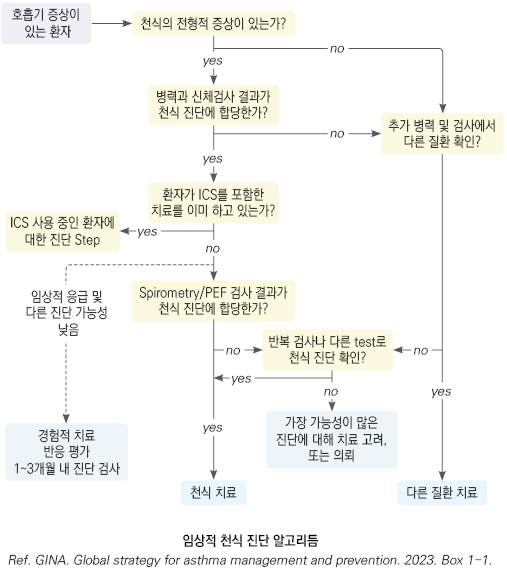
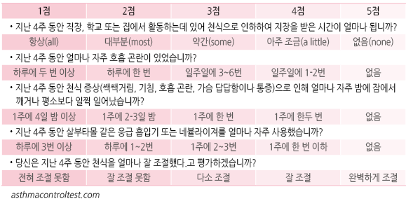
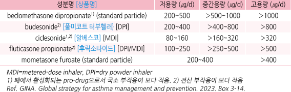
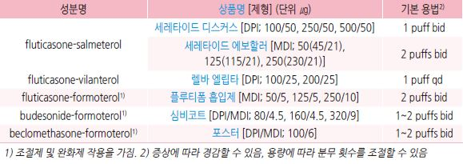
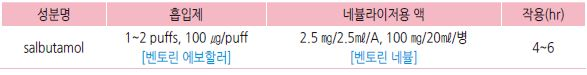
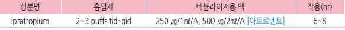
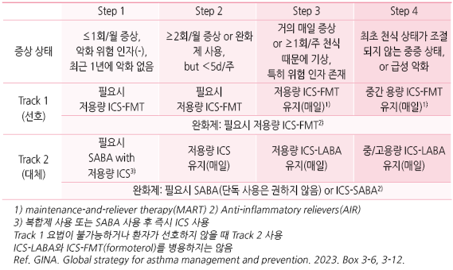
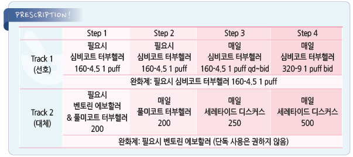

# 천식 Asthma


## 일반 사항

*   기도의 만성 염증을 특징으로 임상적, 병태·생리학적으로 다양한 표현형을 보이고 가변적인 호기 기류 제한과 함께

    변동성이 있는 ‘쌕쌕거림(wheezing), 호흡 곤란(shortness of breath), 가슴 답답함(chest tightness), 기침(cough)’

    증상이 나타나는 질환
* 환자의 ≥80%가 ＜6세에 첫 증상을 보이며 이중 일부가 지속적인 천식 증상을 보임
* 밤이나 이른 아침에 주로 악화
* 폐 기능 검사에서 기류 제한, 기관지 유발 시험에서 양성 결과
*   조절되지 않으면 유발 인자에 보다 쉽게 영향을 받지만, 적절한 관리를 통하여 일상적인 생활은 물론 극심한 강도의

    운동도 가능

## 병태 생리

* 기도 염증, 기도 과민, 기도 폐쇄의 상호 작용에 의해 가역적으로 증상 발생
* 장기간 지속되면 비가역 상태가 되어 기류 제한이 지속됨

#### 기도 염증

* 비만 세포 활성화, 활성 호산구 수↑, T세포(NK T-cell, TH2-cell)↑ → 염증 매개체↑

#### 기도 과민

* 정상인에게는 반응이 발생하지 않는 적은 자극에도 기도 수축이 발생
* 알레르겐 등 유발 인자에 의해 쉽게 증상 발생
* 영향 : 기도 비후, 기도 상피 세포 손상, 기도 내 신경 계통 이상, 기도 근육 이상

#### 기도 폐쇄

* 병인 : 기도 수축, 기도 과민에 의한 기도 비후, 점액 분비 증가
* 기도 수축 : 알레르기 관련 세포들에서 분비되는 화학 매개체에 의해 기관지 평활근 수축
* 기도 비후 : 기도 주변 미세 혈관 투과성 증가 → 혈관 내 액체가 기도 점막 조직으로 유입 → 기도 안쪽 지름 감소
* mucus plug 형성 : 기도 내 goblet cell, submucosal gland에서 점액 분비물 분비; 천식 발작 시 심해짐
*   airway remodeling(기도개형) : 천식 발작이 반복되면서 기도의 탄력성 및 주변 폐 조직의 변성, 기도 벽 비후로 점차

    비가역적 상태가 됨; 경증 천식 환자 및 짧은 병력에서도 발생될 수 있음

## 원인

### 숙주 인자

*   유전(아토피/기도 과민/기도 염증 관련 유전자), 비만, 연령/성별(14세 이전에는 남자가 2배 더 많고,

    성인기에는 여자가 더 많음), 미숙아/저체중 출생아

### 유발 또는 악화 인자

#### 악화 유발 인자

* 알레르겐 : 집먼지진드기, 털 있는 동물(개, 고양이), 바퀴벌레, 곰팡이, 꽃가루
* 직업적 감작 및 알레르겐 : 밀가루, 페인트, 실험 쥐
* 호흡기 감염 : 주로 바이러스
* 미생물
*   대기 오염 : 오염 물질(흡연, 먼지, 황사, 매연, 연기, 오존), 요리, 찬 공기, 안개, 저기압, 건조 또는 높은 습도, 자극적 냄새,

    화학 물질
* 음식, 첨가제(아황산염) : 흔하지 않음
* 운동, 과호흡, 크게 웃음, 울음
* 감정적 스트레스, 월경
* 약물 : aspirin, NSAID, β-차단제
* 동반 질환 : 비염, 비부비동염, 아토피, GERD, 폐쇄수면무호흡증

### 악화 위험 인자

* 조절되지 않는 천식 증상
* 약물 : ICS 미처방, 불순응, 부적절한 흡입 기술, 과도한 SABA 사용

> ✽SABA를 ＞200회/월 사용하는 상태의 경우 사망률 증가

* 동반 질환 : 비만, 만성 비부비동염, GERD, 확인된 음식 알레르기, 불안, 우울, 임신
* 흡연, 감작된 알레르겐, 대기 오염 노출
* 사회 경제적 문제
* 천식으로 ICU 입원 또는 기도 삽관 병력
* 최근 12개월에 ≥1회 중증 악화
* 낮은 FEV1(특히 ＜60%), 가래/혈액의 호산구증가증, FeNO↑

> ✽FeNO(fractional exhaled nitric oxide) : 염증 과정에서 생성이 증가되는 염증 매개체로 호기에서 NO를 측정하여 기도 염증을

> ```
> 정량적으로 평가(기도염증의 표지자)
> ```

#### 지속적 기류 제한 발생 위험 인자

*   조산 or 저체중 출산, 영아기 과체중; ICS 사용 안함; 담배, 유해 화학 물질, 직업적 노출; 초기의 낮은 FEV₁;

    만성 점액 과다 분비; 가래/혈액 호산구 증가

#### 비 가변적 기류 제한 발생 위험 인자

* 긴 유병 기간, 고령, 남성, 흡연, 높은 호기산화질소(FeNO) 값

### 보호 인자

*   위생 가설 : 어린 시절에 감염에 노출되면 면역계가 비-알레르기 경로를 따라 발달되어 천식 등 알레르기 질환의 발생이

    감소될 수 있다는 주장

    •근거 예: 형제가 많은 가정 또는 보육 시설, 감염 노출이 많은 비도시 지역에서 자란 어린이들은 알레르기 질환 발생 위험이

    낮음. 조기 항생제 사용 시 알레르기비염 발생에 나쁜 영향을 끼침
* 모유 수유 : 모유 수유아는 천식 증상 발생이 적음

## 진단 및 평가

* 특징적 증상 병력과 입증된 변동성 호기 제한으로 진단
* 유지 치료(ICS-containing treatment; 조절제)를 사용하기 전에 진단하는 것이 유용

### 진단 기준

**1. 특징적 임상 증상**

* 때에 따라 달라지는 쌕쌕거림, 호흡 곤란, 가슴 답답함, 기침
* 일반적으로 ≥2개의 호흡기 증상 출현 (성인에서 기침만 있는 경우는 드묾)
* 때에 따라 다양한 증상 발생, 중증도 변화 (History of variable respiratory symptom)
* 종종 밤 또는 기상 시 증상 악화
* 종종 운동, 웃음, 알레르겐, 찬 공기에 의해 증상 유발
* 종종 바이러스 감염 시 증상이 발생하거나 더 악화됨

**2. 검사상 가변적 호기 기류 제한** (Evidence of variable expiratory airflow limitation)

1. 폐 기능 검사에서 건강한 사람보다 큰 변동성.

예) ① 기관지 확장제 흡입 후 FEV₁이 기저치의 ＞12% & ＞200 ㎖ 증가,

```
② 2주간 1일 2회 측정한 평균 일중 PEF 변동이 ＞10%,

③ ICS-containing Tx. 4주 후 FEV₁이 기저치의 ＞12% 및 ＞200 ㎖ 증가,

④ 운동 유발 검사에서 FEV₁가 기저치보다 ＞10% & ＞200 ㎖ 감소,

⑤ 기관지 유발 검사에서 메타콜린 또는 히스타민 흡입 후 FEV₁가 기저치보다 ≥20% 또는 표준화된 과호흡,

    고장성 식염수, 만니톨 흡입 후 FEV₁가 기저치보다 ≥15% 감소,

⑥ 외래 매 방문 시 FEV₁이 ＞12% & ＞200 ㎖ 변동
```

AND 2. 호기 기류 제한 확인 : FEV₁이 감소했을 때(예: 위 검사 중) FEV₁/FVC 또한 정상 하한치 대비 감소 확인

```
(정상 참고치: 성인 ＞0.75~0.8, 소아 ＞0.9)
```

※ 아침 일찍 또는 기관지 확장제 치료 중단(12\~24시간) 후 반복적 검사가 필요할 수 있음, 심한 악화 또는 바이러스 감염

```
시에는 기관지 확장제 가역성이 사라질 수 있음, bronchial challenge test 등의 추가 검사를 시행할 수 있음
```

\*\*3. \*\***이미 ICS-containing Tx.(조절제)를 하고 있는 환자에서의 천식의 확진**

⑴ 가변적 호흡기 증상 & 기류 제한(+) 상태 : 천식 확진 단계. 천식 조절을 평가하고 ICS-containing Tx.를 점검

⑵ 가변적 호흡기 증상(+), 기류 제한(-) 상태 : 기관지 확장제 사용을 중단(SABA 사용 시 4시간, ICS-LABA bid 사용 시

```
24시간, ICS-LABA qd 사용 시 36시간)하거나 증상이 있을 때 spirometry 재평가(FEV1, 기관지 확장제 반응).

여전히 정상이라면 다른 질환 고려

 •if FEV1 ＞70%‚예측치 :  ICS-containing Tx. 단계 감량 및 2~4주 후 재평가, 이후 기관지 유발 검사 또는

기관지 확장제 반응 재평가 고려

 •if FEV1 ＜70%‚예측치 : 3개월 동안 ICS-containing Tx. 단계 증량, 이후 증상 및 폐 기능 재평가. 반응이 없다면

이전 치료로 돌아가거나 의뢰
```

⑶ 호흡기 증상이 거의 없고 정상 폐 기능을 보이고 가변적인 기류 제한이 없는 상태 : 기관지 확장제 중단하거나 증상이

```
있을 때 기관지 확장제 반응 재검. 정상인 경우 다른 질환 고려 

 •ICS-containing Tx. 단계 감량 고려  ① 증상 발생 및 폐 기능 감소 시 천식으로 진단하고, 이전 유효 최소 용량까지

ICS-containing Tx. 단계 증량, ② 가장 낮은 치료 단계에서 증상 또는 폐 기능의 변화가 없는 경우 ICS-containing Tx.

중단 및 12개월 이상 주의  관찰
```

⑷ 지속적인 호흡 곤란과 비가역적 기류 제한(+) 상태 : 3개월간 ICS-containing Tx. 단계 증량, 이후 증상 및 폐 기능 평가.

```
반응이 없으면 이전 치료로 복귀 및 의뢰, 천식-COPD 중복 가능성 고려
```

**※ 천식 확진을 위한 치료 단계 낮춤 방법**

1. 평가

* 천식 조절과 폐기능을 포함하여 환자의 현재 상태를 확인. 천식 악화의 위험 인자가 있는 경우 철저한 관리하에 단계 낮춤
* 적당한 때(예: 호흡기 감염, 휴가, 임신 등이 아님)를 선택
*   환자가 천식 악화를 인식하고 대처할 수 있도록 서면화된 천식 행동 지침 제공. 천식 악화 시 이전의 치료를 할 수 있는

    충분한 약이 있는지 확인

2. 조정

* ICS 25\~50% 감량 또는 다른 유지 치료(예: LABA, 항류코트리엔제) 중단. 2-4주 후 방문

3. 반응 점검

* 2\~4주 후 천식 조절의 평가 및 폐 기능 검사 재시행
* if 증상 증가(+) & 가변적 호기 기류 제한(+) : 천식으로 확진, 이전의 유효 최소 단계 선택
*   if 증상 화악(-) & 가변적 호기 기류 제한(-) : ICS-containing Tx 중단 및 2\~3주 후 천식 조절 평가와 폐 기능 검사 반복,

    1년 이상 환자를 추적 관찰

#### 진찰 소견

* 종종 정상
* 호기 시 쌕쌕거림(수포음) : 질환 발생 중에도 나타나지 않을 수 있음
* 알레르기비염, 비용종 소견

#### 천식 가능성이 높은 특징

* 쌕쌕거림, 호흡 곤란, 가슴 답답함, 기침 중 하나 이상 존재
* 증상이 이른 아침 또는 밤에 악화
* 시간에 따라 변화 : 때때로 갑작스런 악화, 저절로 호전, 수개월 동안 무증상
* 환경에 따라 변화 : 감기, 운동, 항원 노출, 날씨 변화, 강한 냄새, 담배 연기 노출 후 발생
* 기관지 확장제 치료에 반응
* 병력 : 소아기에 호흡기 증상 시작, 알레르기비염/아토피 병력
* 가족력 : 천식 또는 알레르기 질환 가족력

#### 천식 가능성이 낮은 특징 (다른 질환 가능성)

* 다른 호흡기 증상이 없는 기침
* 만성적인 가래 배출
* 어지럼 또는 이상 감각을 동반한 호흡 곤란
* 호흡 소리가 시끄러운 운동 유발성 호흡 곤란
* 흉통

### 검사

#### 폐활량 측정 (Spirometry)

* 가변적인 기류 제한, 질환의 중증도 파악; 향후 위험 예측에 유용
* 천식을 확진할 수는 없으나 반복 측정 및 증상 발현 시 검사로 민감도를 높일 수 있음
*   측정 시기 : 천식 진단 시, 치료 시작 3~~6개월 후, 주기적(최소 매1~~2년); 증상과 결과가 일치하지 않으면 추가 평가;

    일반적으로 6세 이후 적용
* peak expiratory flow(PEF) : 진단보다는 모니터링에 유용; 4세 이후 적용
* FEV₁이 PEF보다 천식 진단 및 관리에 있어 신뢰성이 높음

#### 기관지 수축 유발 시험 (bronchoprovocation challenge test)

* 기도 과민성을 평가; 민감도 보통, 특이도 낮음; 6세 이후 적용
* 천식이 의심되지만 정상 호흡음이 들리거나 또는 정상 폐 기능을 보이는 환자에서 유용
* 유발 방법 : 메타콜린, 히스타민, 만니톨, 찬 공기, 자발적 과호흡, 운동 부하

#### 피부 단자 검사

* 알레르기, 아토피 진단 목적; 천식 특이 검사는 아님; 4세 이후 적용
* 알레르겐과 천식의 관련성은 병력으로 확인해야 함

#### 실험실 검사

* 특이 IgE 검사 : 피부 단자 검사보다 비싸며 부정확함
* 호산구 분율, 호기 산화질소(FeNO)↑: 아토피 등 다른 질환에서도 증가됨. 보조적으로 사용

#### 영상 검사

* 흉부 X선 : 정상 또는 과팽창 소견. 천식의 특이 소견은 없음
*   다른 질환을 배제하기 위해 시행

    

### 감별

* 쌕쌕거림 : 천식, 상기도 감염 또는 기능 부전, COPD, 기관연화증, 이물 흡인
*   기침만 있는 상태 : cough-variant asthma, ACEI 유발성 기침, GERD, 성대 기능 장애, 만성 부비동염,

    chronic upper airway cough syndrome(후비루)

#### 상기도 감염과 천식의 감별

```

```

#### 상기도기침증후군

* 알레르기비염, 기타 비염, 세균성 비부비동염 등을 포함하는 기침증후군 (☞ p.38)
* 주증상 : 만성 기침
* 특징 : 쌕쌕거림 없음. 폐 기능 검사상 기류 제한 없음

#### GERD

* 증상 : 식사 때 기침; 평소 과식하면 역류/구토 발생 (☞ p.406)
* 특징 : 반복되는 호흡기 감염, 천식 치료에 반응하지 않음

#### 이물 흡인

* 증상 : 식사 또는 놀이 중 갑자기 발생, 심한 기침, stridor
* 특징 : 국소 폐 이상 징후

#### 결핵

* 증상 : 지속적인 폐 잡음, 기침; 항생제에 반응하지 않는 발열, 림프절 비대 (☞ p.319)
* 주변에 결핵 환자가 있음
* 천식 치료에 반응하지 않음

#### 선천성 심질환

* 증상 : 심잡음, 식사 중 청색증, 빈맥, 빈호흡, 간 비대, 성장 장애
* 천식 치료에 반응하지 않음

#### 면역 저하

* 증상 : 반복적인 발열 및 감염, 성장 장애

#### 연령별 감별 질환의 특징(상태 및 증상)

```

```

### 천식의 중증도 및 조절 상태 평가

#### 위험 인자 평가

* 진단 시 및 주기적(최소 매 1\~2년)으로 위험 인자를 평가 (특히 악화를 경험했던 환자)
* 치료 시작 및 조절제 치료 3\~6개월 후 FEV1 측정, 이후 주기적으로 평가

#### 천식 조절 검사(asthma control test, ACT)

* 판정 : 20~~25점 well controlled, 16~~19점 not well controlled, 5\~15점 very poorly controlled
*   점수가 높을수록 양호; 유의미한 점수 차이는 최소 3점

    

#### 천식 증상 관리 수준

```

```

#### 중증도에 따른 증상/징후

```

```

***

## Management

### 치료 방침

* 목표 : 증상 조절, 비가역적 기류 제한/악화/사망 등 천식 관련 위험 최소화
* 위험 인자 관리, 약물 치료, 알레르겐 면역 요법, 환경 관리, 환자 교육 (☞ p.865)
* 흡입 치료제(특히 ICS)를 우선 선택(빠른 효과, 적은 전신 부작용)

#### 천식 관리

* ‘평가-치료 조정-반응 검토’의 과정을 반복

⑴ 평가(Assessment) : 증상 조절 상태, 위험 인자, 동반 질환 평가

```
•치료 시작 전 진단 근거, 증상 조절 및 위험 인자 기록, 폐 기능 평가
```

⑵ 치료 조정(Adjust treatment) : 증상을 줄이고 악화를 예방하기 위하여 천식이 있는 모든 성인/청소년 환자에서 증상에

```
따른 치료 또는 매일 저용량 ICS를 포함하는 조절제 치료를 권고

•약물 : ICS를 포함하는 조절제, 완화제 흡입제

•위험 인자 및 동반 질환 관리

•비약물 요법

•치료 시작 시 모든 환자들에게 흡입제 사용 방법 및 자가 관리 방법 교육
```

⑶ 치료 반응 검토(Review response)

```
•치료 방법의 변경 때마다 증상 조절 정도, 부작용, 폐 기능, 환자 만족도 등의 반응 평가

•초 치료 2~3개월 후 또는 증상에 따라 치료 반응 검토
```

#### 교육

* 환자에게 행동 지침을 제공하고 면밀히 모니터링하며 추적 관찰 일정을 제공
*   모든 천식 환자에게 흡입제 교육을 시행하고, 증상이 간헐적이더라도 조절제를 잘 유지하도록 격려하고, 자가 관리 방법을

    교육

    

## 위험 인자 관리

* 일률적인 알레르겐 회피 조치는 권고하지 않음 (시행이 어렵고 효과가 제한적이며 간혹 부작용을 유발함)
* 증상이 있는 환자에서 피부 반응 검사 또는 특정 IgE Ab 검사로 입증된 알레르겐을 피함

#### 실내 환경 개선의 한계

* 감작된 환자에서 단일 실내 알레르겐 제거에 의한 임상적 이득은 명확치 않음
*   집먼지진드기에 대한 노출 감소가 천식 발생을 줄이는지는 논란이 있으며, 집먼지진드기가 집안 전체에 서식하므로

    효과적으로 감소시키기 어려움
* 도구(예: 진드기 전용 청소기)를 포함하여 집먼지진드기를 줄일 수 있는 입증된 물리적/화학적 방법은 없음
* 애완동물이 있는 경우 사용하는 방을 달리하는 것으로는 효과가 없음
* 좋지 않은 환경에 노출된 빈곤층 소아에서 통합적 관리 방법이 효과를 보였다는 연구가 있으나 충분한 근거는 없음

#### 실내 알레르겐 회피 방법

*   집먼지진드기 : 침구류는 매주 뜨거운(60℃) 물에 세탁하여 햇빛이나 열로 건조, 베개/매트리스 밀폐 커버 사용,

    먼지 제거 기기 사용(예: HEPA 필터 장착 청소기), 진드기 구제(예: 살충제), 카펫 제거(특히 침실), 헝겊 가구 사용 회피
* 곰팡이 : 표백제로 곰팡이가 핀 곳을 청소, 누수나 습한 곳이 있으면 수리, 에어컨 청소, 환기, 실내 습도 ＜50% 유지
*   바퀴벌레 : 바퀴벌레 구제, 음식물을 노출된 곳에 두지 않음, 사용한 식기는 즉시 세척, 집 안에 쓰레기나 종이를 보관하지

    않음, 누수 처리
*   애완동물 비듬 : 키우지 않음(특히 침실에 있지 않게 함), 자주 목욕시킴, HEPA 필터 사용; 동물 키우기를 중단한 후

    알레르겐이 감소하기까지 수개월이 걸림
* 실내 공기 오염 회피 : 공기 오염을 덜 시키는 난방/조리 기구 선택, 환기 조치

#### 대기 오염/실외 알레르겐 물질 회피 방법

* 담배를 포함한 연기, 먼지 회피
* 실외 꽃가루 및 곰팡이 농도가 높을 때는 창문 차단, 실내 공기 청정기 사용
* 심한 추위/건조/대기 오염 시 야외 활동을 피함
* 대기 오염 상태에서 외출 시 KF80 이상의 마스크 사용
* 직업적 노출 회피

#### 식이 관리

* 과일 및 채소 섭취 권장
* 음식 또는 식품 첨가제 섭취 제한은 인과 관계가 입증된 경우에만 시행
*   이유 초기에 계란, 우유, 땅콩, 견과류 등 알레르겐 식품 섭취가 천식 발생을 증가시킨다는 근거는 없음;

    소아 천식 예방을 위한 이유식 시작 지연 또는 특정 식품 섭취 제한은 권하지 않음
* 오메가-3, 항산화제, probiotics 등 건강기능식품의 천식 증상 개선 가능성은 근거가 부족함

#### 비만 관리

* 적정 체중 유지 권고
*   비만 시 천식 발생이 보다 많으며 기도에 대한 물리적 영향, 수면무호흡증, 복부 지방에 의한 폐 용적 감소,

    GERD 등과 관련하여 천식 조절이 보다 어려움

#### 약물 주의

* 유발 약물을 섭취했을 때 보통 30\~120분 후 콧물, 코 막힘, 눈물, 기관지 연축 발생
* NSAID, aspirin : 이상 반응이 있었던 경우 외에는 금기 아님
* 점안액을 포함하여 β-차단제 주의; 심장 선택적 β-차단제는 금기 아님 (☞ p.487)

#### 동반 질환 관리

*   GERD : 천식 환자에서 유병률이 보다 높으며 천식 치료를 위한 β-작용제, 테오필린 등이 하부 식도 괄약근을 이완 시킬 수

    있음; GERD 증상이 있는 경우 이를 관리 (☞ p.406)
* 감정적 스트레스 : 스트레스가 천식을 악화시키는 경우에 이완 요법 또는 호흡 요법이 도움이 될 수 있음
*   불안, 우울증 : 천식 환자에서 유병률이 보다 높으며 천식 급성 악화의 위험 인자가 됨; 정신 건강 평가 및 관리가 필요

    (☞ p.115, p.124)
*   비염, 비부비동염 : 천식과 동반되는 경우가 많음; 알레르기비염 등이 있는 경우 비내 steroid 제제 등을 이용하여 이를 함께

    치료하는 것이 천식만을 치료하는 것보다 효과적 (☞ p.240, p.253)

### 급성 악화를 줄이기 위한 위험 인자에 대한 대책

```

```

## 약물 치료

### 흡입 도구 (Inhaler device)

* 흡입제 : 전신 부작용을 최소화하면서 고농도의 약제를 기도 점막에 투여할 수 있음
*   흡입 도구 종류 : pMDI(＞8세), breath actuated pMDIs(＞7세), DPI(＞5세), soft mist inhalers, nebulized, wet aerosol

    (☞ 흡입제 사용법: [의약품안전나라](https://nedrug.mfds.go.kr/pbp/CCBFC03/getItem?tchmtrId=SU201911240021), [아산병원](https://www.youtube.com/watch?v=a810wpL3rAM))

#### MDI (metered-dose inhaler, 정량 흡입기)

* 용법 : 천천히(5초간) 흡입 후 5\~10초간 호흡 정지; puff 사이 대기 시간은 필요 없음
* pMDI (pressurized MDI) : 잘못된 사용이 많으므로 사용법을 교육하고 방문 시마다 확인
*   spacer : MDI를 제대로 사용하지 못하는 경우의 보조 기구; MDI를 spacer 내에 분무하고 puff 당 5\~10회 또는 30초간 호흡;

    정확히 사용된 MDI보다는 효과적이지 않음
* breath-actuated MDI : 호흡에 따라 분무되는 장치; pMDI를 잘 사용하지 못하는 환자에서 적용

#### DPI (dry powder inhaler)

* pMDI보다 사용이 용이하지만 충분한 흡입력이 필요

#### Nebulized aerosol

* 가장 효과적이지만 분무 장치가 필요; 마스크보다 마우스피스가 유리
* steroid 사용 시 분무되는 약제가 눈에 닿지 않도록 주의하며 분무 후 코/입 주변 세척

### 치료제 종류

```

```

### 약물에 의한 부작용의 위험 인자

* 전신 : 빈번한 경구 steroid 복용, 고강도 ICS의 과도한 사용(전신 흡수 증가), 다제약물 사용
* 국소 : 고강도 또는 고용량 ICS 사용, 부적절한 흡입 기술

### 조절제 (Controller)

* 악화 예방 및 증상 조절을 위하여 투여
* 치료 시작 수일 내 효과 발현, 3\~4개월 지속 사용 후 최대 효과

### 흡입 스테로이드 (Inhaled corticosteroid, ICS)

* 지속성 천식에서 가장 효과적인 약물; 가능한 한 모든 천식 환자에서 진단 초기부터 사용 권고
*   작용 : 항염, 기도 과민성 개선, 폐 기능 개선, 증상 감소, 삶의 질 호전, 악화 빈도/중증도/사망 등의 위험성 감소;

    흡연자에서는 효능이 감소되므로 증량이 필요할 수 있음
* 증상 조절과 폐 기능 회복에 1\~2주 소요

용법

* 대부분의 천식은 저용량 ICS로 조절됨; 일부 중증 천식 환자에서 고용량 장기 투여 고려
* 일반적으로 1일 1\~2회 흡입; 용량과 악화 예방 효과에 상관관계가 있음
*   반응이 부족할 경우 : ① 환자의 사용 방법을 확인, ② 증량보다 다른 계열의 조절제를 추가하는 것이 일반적으로 효과적이며

    부작용이 적음(예: ICS + LABA)

    

#### 부작용

* 흔하지 않음

> ✽결핵 고위험 지역에서 고용량 투여 시 결핵 위험이 있으나 활동성 결핵 및 폐렴에서 ICS는 금기가 아님

*   국소 : 구강 칸디다증, 쉰 목소리, 기침(상기도 자극)

    •칸디다증 예방 : spacer 사용, 흡입 후 구강 세척 (저용량 간헐적 사용 시 구강 세척 필요 없음)
*   전신 : 부신 기능 억제, 골다공증, 백내장, 녹내장, 출혈 경향, 성장 저하(소아), 비만(＜6세)

    •고용량 장기 사용 시 발생 가능성이 있으며 저용량을 사용하는 경우에는 거의 문제되지 않음

흡입 지속성 β-작용제 (Long-acting inhaled β2-agonist, LABA)

* 작용 : 기관지 확장, 수축 예방
* 작용 지속 시간 : ≥12시간; 보통 1일 2회 사용
*   적용 : LABA 단독으로는 사용하지 않음; 단독 사용 시 천식 악화를 일으킬 수 있어 ICS와의 복합제로만 권고

    (보험기준 ☞ p.1182)

    •ICS로 조절되지 않을 때 ICS 용량이나 강도를 높이는 것보다 ICS+LABA 병용이 효과적임

    •ICS+LABA 병용 요법이 ICS 단독 요법에 비해 ‘조절’ 상태에 보다 빨리 도달함
* 부작용 : 천식 급성 악화(단독 사용 시), 두통, 근육 경련, 심혈관 자극, 골격근 진전, 저칼륨혈증
* formoterol : 5\~10분 내 효과가 나타나 지속적으로 작용하는, 조절제 및 완화제 효능을 보임
* salmeterol : 늦은 작용, 투여 1시간 후 최대 기관지 확장 효과

### ICS-LABA



### 항류코트리엔제 (Leukotriene modifier)

* 작용 : 기관지 확장, 기침 감소, 폐 기능 개선, 기도 염증 감소, 천식 악화 감소
*   적용 : 알레르겐에 의한 천식, 비특이적 자극(찬 공기)에 의한 증상, 경증 지속성 천식에서의 대체제, aspirin 과민성 천식,

    알레르기비염 동반 (보험기준 ☞ p.1180)
* 효과 : 저용량 ICS보다 효과 적음. ICS 병용에 있어서 LABA보다 효과 적음
*   부작용 : 악몽(드묾). 간 효소 수치 상승(zafirlukast, zileuton); 자살 충동 등 정신 건강 부작용 발생 우려로 처방 전 평가 및

    치료 중 neuropsychiatric symptom 관찰을 요함

\*\* 류코트리엔 수용체 대항제 (cysteinyl-leukotriene 1 receptor antagonist, LTRA)\*\*

*   montelukast : 10 ㎎ hs qd \[싱귤레어]

    ; FDA] 정신 건강 부작용 위험이 있으며, 처방 시 이러한 부작용의 위험과 이점을 고려해야 함
* zafirlukast : 20 ㎎ bid 공복 복용; warfarin 대사 억제
* pranlukast : 225 ㎎ bid \[오논], 50 ㎎ bid \[씨투스]

\*\* 류코트리엔 합성 억제제 (5-lipoxygenase inhibitor)\*\*

* zileuton : 600 ㎎ qid; warfarin, theophylline, propranolol 대사 억제

### 크로몰린제 (Chromone)

* 작용 : 약간의 항염
*   적용 : 운동 유발성 기관지 경련 치료에서 SABA에 부작용(예: 떨림, 심박동 증가)이 있는 경우의 대체제, SABA 단독으로

    예방되지 않는 경우에 추가
* 부작용 : 기침, 인후 자극, 기관지 수축, 불쾌한 맛
* cromolyn : 1% 20 ㎎/2 ㎖ 네뷸라이저 2\~4회/d
* nedocromil sodium

## 조절제 추가제 (Add on controller medications)

### 지속성 항콜린제 (Long-acting anticholinergics or antimuscarinics, LAMA)

* 적용 : ICS±LABA에도 불구하고 악화되는 환자에서 Step 4 or Step 5 시 mist inhaler로 추가
* 부작용 : 입마름(드묾)
* tiotropium : 지속 작용. 4\~8주 사용 후 최대 효과; 18 ㎍/C qd \[스피리바] (보험기준 ☞ p.1182)

### 전신 스테로이드

* 작용 : 중증 급성 악화 시 증상 완화 및 재발 예방, 사망률 감소; 투여 4\~6시간 후 효과 발현
* 적용 : 장기 사용의 부작용을 고려하여 심한 급성 악화에만 단기 사용
* 경구제 선호 : 주사제 대비 효과 차이는 없으며 주사제보다 mineralocorticoid 작용이 적고 용량 조절에서 유리
* prednisolone : 40~~50 ㎎/d ×5~~10d 투여 후 증상 호전 및 폐 기능 회복 시 중단 \[소론도]
* ＞2주 사용 후 중단 시 tapering 필요
* 전신적 steroid 사용 중에도 ICS는 계속 사용함
*   부작용

    •단기 사용 : 당 대사 이상, 혈압 상승, 식욕 증가, 체액 저류, 체중 증가, moon face, 감정 변화, 불면, 소화성 궤양,

    대퇴골두 무균성 괴사; 고용량을 사용하는 경우에 드물게 발생

    •장기 사용 : 출혈, 고혈압, 당뇨병, HPA axis 억제, 백내장, 녹내장, 비만, 피부 얇아짐, 근력 약화, 골다공증(✽3개월 이상

    사용 시 골다공증에 대한 예방 조치 필요)
* 주의 : 결핵, 기생충 감염, 골다공증, 녹내장, 당뇨병, 우울증, 소화성 궤양

### Anti-IgE Ab

* 적용 : 혈청 IgE 상승, steroid 및 LABA로 조절되지 않는 중증 지속성 알레르기성 천식
* 효과 발현까지 3\~4개월 치료, 중단 후 ½에서 1년 내 재발
* omalizumab : 150 ㎎\~300 ㎎ 4주마다 SC \[졸레어 주] (보험주의)
* 부작용 : anaphylaxis(드묾), 주사 부위 통증, 고비용

### Monoclonal antibody

* Anti-IL5 & anti-IL5R : mepolizumab, reslizumab, benralizumab
*   Anti-IL4R

    •Dupilumab : eosinophilic phenotype을 가진, 경구 스테로이드가 요구되는 중증 환자에서 고려;

    초회 400 or 600 ㎎ → 200 or 300 ㎎ q2wk \[듀피젠트] (보험주의)

## 완화제 (Reliever)

### 속효성 흡입 β-작용제 (Short-acting inhaled beta2-agonist, SABA)

#### 효과

* 가장 효과적인 기관지 확장제
* 작용 : 기도 평활근 이완, 혈관 투과성 및 기도 부종 감소, mucociliary clearance 향상
* 보통 4\~6시간 지속
* 적용 : 증상 발생 시, 운동 전(운동 유발성 기관지 경련 예방)

#### 용법

* 증상 발생 등 필요시 ICS와 병용
*   SABA 단독 사용은 천식의 심한 악화를 예방할 수 없으며, 규칙적 또는 빈번한 사용이 악화의 위험을 증가시키므로

    권고하지 않음
* 흡입 도구 : MDI- 일반적인 급성 악화 시 적용; 네뷸라이저- 중증 급성 악화, 소아에서 적용
* 종류 : salbutamol, terbutaline, levalbuterol HFA, reproterol, pirbuterol

#### 부작용

* 떨림, 빈맥; 초기에 발생하며 빠르게 적응됨
* levalbuterol 및 R-albuterol은 빈맥/떨림 부작용 적음



### Low-dose ICS-formoterol

* 작용 : 급성 악화의 위험 감소
* 종류 : beclomethasone-, budesonide-, fluticasone-formoterol (☞ p.347)

### 속효성 항콜린제 (Short-acting anticholinergics)

* 작용 : SABA보다 효과 적음; SABA에 추가 시 입원 위험을 줄일 수 있음 (✽FDA ≥12세 승인)
* 적용 : 타 약제로 조절되지 않는 경우, 부작용/심장 질환 등으로 SABA를 사용할 수 없는 경우
* 장기 사용은 권고 않함
* 부작용 : 입마름, 쓴맛
* 금기 : soy lecithin 과민 환자
* 종류 : ipratropium bromide, oxitropium bromide



## 기타

### 테오필린 (Theophylline)

*   작용 : phosphodiesterase 억제(기관지 확장, 항염), adenosine receptors 길항(횡격막 근육 피로 감소,

    adenosine 강화 비만 세포 분비), 폐의 알레르겐에 대한 즉시 및 지연 반응 억제
* 적용 : ICS 또는 ICS-LABA로 잘 조절되지 않는 천식 환자에서 추가
* 효과 : ICS-theophylline은 ICS-LABA보다 효과 적음
* 종류 : aminophylline 225\~450 ㎎ bid \[아스콘틴 서방], theophylline 200 ㎎ bid \[테올란비]

#### 부작용

* 구역, 구토, 설사, 불면, 흥분, 떨림, 두통, 부정맥, 발작, 사망
* 치료 용량 범위가 좁아 쉽게 부작용 발생; 계속 사용하면 감소
*   모니터링 대상 : 통상 용량에서 부작용 발생, 고용량(≥10 ㎎/㎏/d) 사용, 치료 효과 미약, 대사에 영향 주는 약물 병용(예:

    macrolide, ciprofloxacin, 항진균제, 결핵 치료제, 경구 피임제, cimetidine, zileuton) 또는 질환(예: 간질환, 울혈성 심부전)

    •저용량에서는 부작용이 거의 없기 때문에 보통 혈중 농도를 측정할 필요 없음

### 전신 β-작용제

* steroid와 병용하지 않은 반복적 단독 사용은 천식 악화의 위험을 증가시킬 수 있음

#### 속효성

* 적용 : 흡입제를 사용할 수 없는 경우
* 종류 : fenoterol \[베로텍], procaterol \[메프친], terbutaline \[베타투]

#### 지속성

* 적용 : 기관지 확장 효과가 필요한 경우에 ICS에 추가
*   종류 : bambuterol \[밤벡], formoterol \[아토크], 서방형 salbutamol \[살부트론], 서방형 terbutaline,

    경피 tulobuterol \[호쿠날린 패취]

#### 부작용

* 흡입제보다 부작용 많음 (특히 테오필린에서 많음)
* 구역, 구토, 빈맥, 불안, 골격근 경련, 두통, 저칼륨혈증

### 면역 치료 (Allergen-specific immunotherapy)

* 작용 : 경증 천식 환자에서 증상 완화
* 부작용 : 피하 적용제- anaphylaxis(드묾); 설하 적용제- 구강 및 위장관 증상
* 알레르기가 천식의 중요한 원인이 되는 경우에 비용, 편의성, 부작용을 감안하여 고려

### 영양 요법

*   마그네슘 : 급성 악화의 호전에 도움

    •Mg sul. \[황산마그네슘 주], Mg lac. \[마그네스], Mg cit. \[판토마그]
* 셀레늄, 저염식, probiotics, 불포화 지방산, 척추 도수 치료, 동종 요법, 침술 : 효과 입증 안 됨
*   Vit D : Vit D 부족 시 폐 기능 저하, 천식 악화 빈도 증가, steroid에 대한 반응 부족 가능성

    •한계 : Vit D 공급이 천식에 도움이 된다는 증거는 없음

### 예방접종

* 인플루엔자 백신 : 중등도 이상 천식 환자에 대하여 매년 접종 권고 (☞ p.1122)
* 폐렴구균 백신 : 고령에서 고려; 천식 환자에게 일률적으로 권고할 근거는 부족함 (☞ p.1125)

### 운동/육체 활동

* 규칙적인 운동 (예: 수영)
* 호흡 운동 : 일부 연구에서 효과; 약물 요법에 추가할 때 유용; 이완, SABA 사용 감소, 자기 관리 능력 향상에 기여
* 요가 : 일부 질이 낮은 연구에서 효과

## 단계별 치료법

### Asthma medication options

* 대부분 저용량 ICS로 관리됨
* SABA의 단독 사용은 심한 악화를 예방할 수 없으며 규칙적 또는 빈번한 사용이 악화의 위험을 증가시키므로 권고하지 않음
* 완화제로 SABA보다 ICS-formoterol을 권고
* 천식 증상으로 ≥1회/주 깨어나거나 대부분의 날에 환자가 천식 증상으로 괴로운 경우 STEP 3 이상의 치료 선택
* 중증 ‘조절 안 됨’ 또는 급성 악화 상태에서는 경구 steroid 단기 적용 및 규칙적 조절제 치료(예: 중간 용량 ICS-LABA) 시작
* 중증 악화 방지 및 증상 조절을 위하여 모든 천식 환자에 대하여 가능한 한 초기에 ICS 함유 조절제 권고

#### STEP 1 : ≤1회/월 증상 발생 & 악화 위험 인자 없음

*   선호 : 필요시 저용량 ICS-formoterol(FMT)

    •budesonide-FMT : 상용량 160-4.5/회(평균 3\~4회/주 사용), 최대 FMT 54 ㎍/d \[심비코트]

    •beclomethasone-FMT : 상용량 100-6, 최대 FMT 36 ㎍/d \[포스터]
*   대체 : 필요시 SABA with 저용량 ICS (combination 또는 separate)

    •salbutamol \[벤토린], budesonide(200) \[풀미코트]

#### STEP 2 : ≥2회/월 but ＜4\~5일/주 발생

*   선호 : 필요시 저용량 ICS-FMT

    •budesonide-FMT(160-4.5) \[심비코트], beclomethasone-FMT(100-6) \[포스터]
*   대체 : 매일 저용량 ICS + 필요시 SABA

    •budesonide(200 qd) \[풀미코트], salbutamol \[벤토린]
*   기타 : 필요시 SABA with 저용량 ICS or LTRA

    •salbutamol \[벤토린], budesonide(200) \[풀미코트], pranlukast bid \[씨투스]

#### STEP 3 : 거의 매일 증상 발생 or 천식 때문에 ≥1회/주 기상

*   선호 : 매일 & 필요시 저용량 ICS-FMT

    •budesonide-FMT(160-4.5) \[심비코트], beclomethasone-FMT(100-6) \[포스터]
*   대체 : 저용량 ICS-LABA 유지 + 필요시 SABA

    •fluticasone-salmeterol(100 bid) \[세레타이드], salbutamol \[벤토린]
*   기타 : 중간 용량 ICS, or 저용량 ICS +LTRA

    •fluticasone(250 bid/qd) \[후릭소타이드],pranlukast bid \[씨투스]

#### STEP 4 : 거의 매일 증상 or 천식 때문에 ≥1회/주 기상 or 폐 기능 저하

*   선호 : 매일 중간용량 ICS-FMT + 필요시 저용량 ICS-FMT

    •budesonide-FMT(320-9 bid/qd) \[심비코트]
*   대체 : 중/고용량 ICS-LABA + 필요시 SABA

    •fluticasone-salmeterol(250 bid) \[세레타이드], salbutamol \[벤토린]
*   기타 : LAMA tiotropium(2 puffs qd) \[스피리바] or LTRA pranlukast bid \[씨투스] 추가;

    또는 ICS-LABA에서 ICS를 고용량으로 증량 \[세레타이드]\(500 bid)

#### STEP 5 : 조절되지 않는 심한 천식 증상

* 의뢰 : expert assessment, phenotyping, add-on therapy
*   고용량 ICS-LABA 병합, LAMA 추가, azithromycin 추가(3일 요법)\*, anti-immunoglobulin E 추가, anti-interleukin 추가,

    저용량 경구 steroid 추가

> \*azithromycin : 투여 전 atypical mycobacteria 확인(가래 검사), long QTc 확인(ECG), 내성 고려 

## 치료 단계 결정 및 조절

```

```

### 단계 내림

* 3개월 이상 ‘조절’ 상태로 유지되면 하위 치료 단계로 ‘내림’ 고려
* 급성 악화 위험 인자가 있거나 폐 기능이 저하되어 있으면 신중하게 결정; 내림 시 면밀한 감독
* 호흡기 감염, 여행, 임신 중 단계 내림 시도는 권하지 않음
* 보통 3개월 간격으로 ICS 용량을 25\~50%씩 내릴 수 있음
* 치료 단계를 너무 빨리 내리거나 ICS를 중단하는 것은 급성 악화의 위험을 높일 수 있음

### 단계 올림

* 2\~3개월간의 적절한 조절제(ICS) 치료에도 불구하고 증상 &/or 악화가 지속되는 경우 상위 치료 단계로 ‘올림’ 고려
*   올림 전 확인할 사항 : 부정확한 흡입제 사용, 불순응, 위험 인자 노출(예: 알레르겐, 흡연, 공기 오염),

    약물(예: NSAID, β-차단제), 동반 질환(예: 알레르기비염), 잘못된 진단
* 올림 후 반응 평가 : 올림 치료 2\~3개월 후 반응이 없을 때는 다시 이전 단계로 낮추고 다른 치료를 고려하거나 의뢰
*   일시적 단계 올림 : 바이러스 감염 또는 계절성 알레르겐 노출 등에 의한 일시적 악화 상황에 적용;

    1\~2주 동안 올림 치료 후 복귀
*   매일 조정(day-to-day adjustment) : 필요시 저용량 ICS-formoterol 투여 또는 저용량 ICS-formoterol & 완화제 투여를 하는

    경증 천식 환자에서 증상에 따라 매일 투여 용량을 조절

## 급성 악화 (Flare-up, Exacerbation, or Attack)

*   천식 증상과 폐 기능이 급속도로 악화되어 치료 수준의 변경이 필요한 상황; 일부 천식 환자는 급성 악화의 형태로

    천식이 처음 나타남
* 원인 : 호흡기 감염, 알레르겐 노출

### Acute care

#### 내원 전 대처

* 증상이 심할 때 증상 완화제 사용. 한 번 사용으로 호전되지 않으면 10\~20분 뒤 반복 사용
* 반복적인 완화제 사용에도 증상이 호전되지 않거나 악화되면 즉시 내원
* 완화제의 잦은 사용이 3일 이상 지속되면 내원
* 악화가 호전되었더라도 기존의 조절제 사용을 유지하면서 1\~2주 이내에 내원

#### 평가

* SABA 및 산소 투여를 시작하고 중증도를 평가
* 호흡 곤란(예: 말하기), 호흡수, 맥박수, 산소 포화도, 폐 기능(예: PEF), anaphylaxis 확인

#### 교정 가능한 원인 관리

```
(☞ 원인-악화 인자, 위험 인자 관리-급성 악화를 줄이기 위한 위험 인자에 대한 대책)
```

#### 응급 이송

* 의식 혼탁, 호흡음이 잘 들리지 않는 경우, 중증 증상 시 응급 이송

#### 치료 시작

*   SABA 반복(pMDI, spacer 사용), 경구 steroid, 산소 투여

    → 증상 반응 및 산소 포화도(93\~95%)를 자주 평가, 1시간 후 폐 기능 검사

#### 중증 악화에 대한 조치

* ipratropium bromide 추가, SABA 네뷸라이저 고려
* 치료 반응에 부적절한 경우 MgSO4 IV 고려

### 치료 계획 수정

* 흡입 완화제 흡입 빈도 늘림 (SABA, 저용량 ICS-formoterol)
*   조절제 빈도 늘림

    •ICS : 4배 용량

    •maintenance ICS-formoterol : 4배 용량 (formoterol 최대 72 ㎍/d)

    •maintenance ICS-other LABA : 단계 올림, 또는 별도의 ICS 추가 흡입 (4배 용량)

    •maintenance & reliever ICS-formoterol : 용량 유지; 필요시 완화제 증량 (formoterol 최대 72 ㎍/d)
*   경구 steroid

    •대상 : 2\~3일간의 조절/완화제 증량에 반응 없음; 급속한 악화 또는 PEF or FEV₁이 개인 최고치 혹은 예측치의 ＜60%;

    갑작스런 중증 악화 병력

    •prednisolone : 40~~50 ㎎/d(0.5~~1 ㎎/㎏/d) × 5\~7d \[소론도]

    •가급적 아침에 투여; 중단 전 검토; 2주 이내 사용 시 tapering 필요 없음

### 천식 악화 시 자가 관리 방법

```


```

## 모니터링

*   치료 시작 시기에 중증도를 분류하고, 치료 중에 조절 정도와 치료 반응도를 평가함

    •중증도 : 질병의 정도

    •조절 : 천식의 임상 증상이 최소화되고 치료 목적이 충족되는 정도

    •치료 반응도 : 천식 치료로 인한 조절의 용이성

    •장애 : 환자가 경험하고 있거나 최근에 경험했던 증상과 기능 제한의 빈도 및 강도

    •위험 : 천식 악화 또는 폐 기능의 점진적인 소실 등 이후에 발생 가능한 사건
* 증상이 있을 때는 물론, 없을 때도 규칙적으로 증상 조절 여부, 위험 인자, 약물 부작용 등을 평가
*   진료 주기 : 치료 시작 1~~3개월 & 매 3~~12개월

    •악화 후에는 1주 내, 조절제 투여를 중단한 경우에는 3\~6주 후 F/U

### 치료에 잘 반응하지 않는 환자에 대한 평가 및 대책

## 

### 의뢰

* 천식 진단 곤란
* 직업적 천식 의심
* 중증 또는 지속되는 '조절 안 됨', 또는 잦은 악화
*   천식 관련 사망의 위험 인자 존재 : 죽음 직전의 천식 병력, 1년 내 입원 또는 응급실 방문, 현재 또는 최근까지 경구

    스테로이드 사용, 흡입 스테로이드 자용을 하지 않고 있음, SABA 과사용, ICS-함유제 치료를 제대로 하고 있지 않음,

    문서화된 천식 치료 계획이 없거나 이행하고 있지 않음, 정신적 문제 병력, 음식 알레르기, 중증 질환(예: 폐렴,

    당뇨병, 부정맥) 동반
* 유의미한 치료 부작용 위험 : 유의미한 치료 부작용 존재, 경구 스테로이드 장기 또는 잦은 투여(2\~3 코스/년)
* 천식 합병증 의심 또는 아형 : aspirin-exacerbated respiratory Dz, allergic bronchopulmonary aspergillosis

## 천식 + COPD

### 천식 및 COPD의 특징과 초기 치료 방법

```
    
```

### 천식과 COPD에서의 spirometry 특징

```

```

## 특별한 경우의 천식

### 기침형 천식 (Cough-variant Asthma)

* 만성적인 기침을 주증상으로 하는 기관지 천식의 한 아형
* 야간에 마른기침이 심하고 주간에는 특별한 이상이 없는 경우도 있음
* 기전 : 기침 수용체의 민감도 증가
* 소아, 여성에서 보다 많음
* 경과 : 30%에서 전형적인 천식으로 이행
* 유발 인자 : 상기도 감염, 알레르겐, 담배 연기, 자극적인 냄새, 운동, 찬 공기
* 진단 : 기도 과민증 입증(기관지유발검사), 가래 내 호산구 검사, 최대 호기 유량의 일중 변화 검사(폐 기능 정상)
* 치료 : ICS, SABA; ICS에 반응하지 않는 경우 항류코트리엔제 병합

### 직업성 천식 (Occupational Asthma, Work-aggravated Asthma)

* 성인에서 새로 발생하는 천식의 5\~20%가 직업과 관련. 성인에서 시작된 모든 천식에 대하여 직업적 노출 병력을 확인해야 함
* 최초 노출 수 주\~수년 후에 발생할 수 있음
* 직장에서 악화; 작업에서 멀어지면 호전, 휴가 시 호전
* 보통 직업성 비염이 직업성 천식에 앞서 발생
* 알레르겐에 감작된 이후 노출 시마다 심하게 악화되어 비가역적 기류 제한이 발생할 수 있음
* 가능한 한 빨리 노출을 제거, 약물 치료(일반 천식과 동일)
* 특이적 기관지 유발 시험 등 객관적 진단을 요함(필요시 의뢰 검사)

### 운동 유발 천식 (Exercise induced Asthma)

* 운동을 마친 후 기관지 수축에 의하여 천식 증상(기침, 호흡곤란, 천명)이 발생
*   경과 : 운동 후 3분 내 발현하여 10\~15분 내 정점에 이르며 30분(\~60분) 내 호전;

    한 번 발생하고 나면 이후 3\~4시간 동안은 다시 운동해도 발생하지 않음
* 진단 : 운동 후 5분, 10분, 15분, 30분에 FEV₁ 측정 → 운동 전에 비해 10% 이상 감소 시 진단

\*\* 예방 및 치료\*\*

* 평소 적당한 운동, 운동 전 준비 운동
*   운동 15분 전 및 운동 후 SABA 흡입 (단독으로 매일 규칙적으로 사용하는 것은 권고 안 함);

    ICS-formoterol을 사용할 수 있으며 SABA보다 지속 효과가 긺
* 규칙적 조절제(ICS) 투여 고려(특히 SABA를 자주 사용 시); 대체- LTRA 규칙적 투여
* 천식 환자에서 치료 단계 올림을 고려

### 운동선수

* (격한) 운동선수는 천식, 알레르기성 및 비-알레르기성 비염, 만성 기침, 성대 기능 장애, 재발성 호흡기 감염의 유병률이 높음
* 내성이 발생하므로 β-작용제의 사용은 줄이고 ICS를 사용
* 예방 : 심한 추위, 대기 오염, 알레르겐, 높은 염소 농도의 수영장 물 접촉을 피함

### 수술 전후 조절

* 조절제 치료 유지
*   장기간 고용량 ICS 사용 또는 최근 6개월 내 ＞2주 전신 steroid 사용 환자 : 수술 전후 기간 동안 hydrocortisone 및

    조절제 투여
* 응급 수술 : 안정될 때까지 수술 기간 동안 전신 steroid 투여 고려
* 천식 약물 치료 없이 장기간 잘 조절된 환자 : 수술 전 steroid 사용은 필요 없음

### 임신부

* 임신 중 변화 : 임신 중 ⅓에서는 악화, ⅓에서는 호전됨; 급성 악화는 임신 중기에 많음
* 임신에 대한 영향 : 잘 조절되지 않는 천식은 전자간증과 저체중아 출산 위험을 높임
* 임신 중에는 치료 단계 내림은 삼가
* 악화 시 적극적으로 대처
*   사용 가능 약제 : ICS(budesonide) \[풀미코트 터부헬러], 흡입 β-작용제(albuterol), pranlukast \[씨투스],

    테오필린
* 4\~6주마다 모니터링

### Perimenstrual Asthma

* 여성 천식 환자의 \~20%에서 월경 전에 천식 증상 악화
* 종종 월경통, 월경 단축 또는 과다 발생
* 위험 인자 : 높은 연령, 비만, 중증/장기 천식 환자
* 치료 : OCS &/or LTRA가 도움이 될 수 있음

### 비만

* 과소 또는 과잉 진단 경향이 있음
* 비만 환자의 천식은 조절이 보다 어려움
* 치료 계획에 체중 감량을 포함시킴; 5\~10%의 감량으로도 천식 조절에 도움이 될 수 있음

### 고령자

#### 고령자의 특성

*   흔히 활동 저하로 인하여 증상이 적거나, 인지가 늦어지거나, 노화에 따른 일반적 현상(예: 생리학적인 폐 기능 감소)으로 치부되어

    과소 진단되는 경향이 있음
* 심부전, 허혈성 심질환 등의 심장 문제를 천식으로 오인하기도 함
* 동반 질환 및 다른 복용 약물들이 많음. 특히 COPD를 동반할 가능성이 많음
* steroid의 부작용(예: 멍, 골다공증, 백내장)이 보다 많이 발생
* 테오필린 청소율 감소
* 흡입기 사용이 부정확함

#### 치료

* 일반적인 경우와 같음. 다만 고령자의 특성, 기존에 복용하고 있는 약물이나 기저 질환을 감안하여 치료
* β-차단제를 복용하고 있는 경우 천식의 치료 효과가 감소됨(선택적 β-차단제로 전환 권고)
* digoxin이나 항우울제 복용 시 천식 치료 약물의 농도가 영향을 받을 수 있음

> \*\*질병코드 \*\* J45 천식


