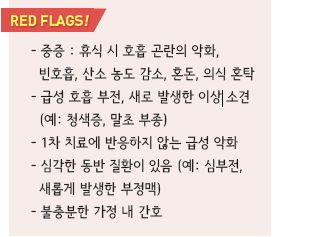
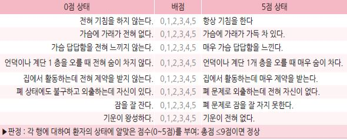
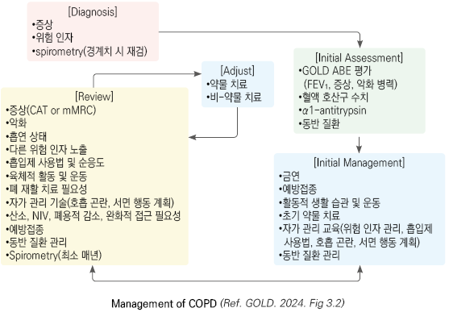
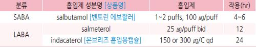
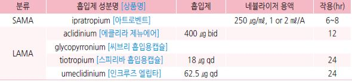
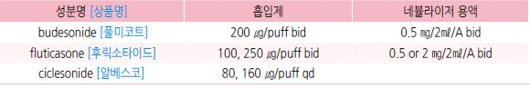
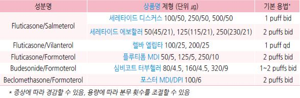
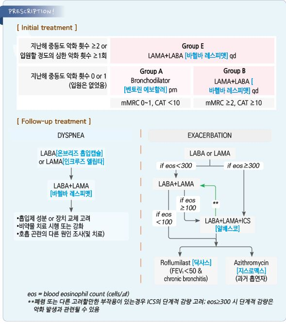

# 만성 폐쇄성 폐질환 COPD


## 일반 사항

*   지속적이고 종종 진행성인 기류 장애를 일으키는 기도의 이상\[기관지염, 세기관지염] &/or 폐포의 이상\[폐기종]에 기인하는

    만성 호흡기 증상(호흡 곤란, 기침, 가래, 악화)을 특징으로 하는 이질적인(heterogeneous) 폐질환
*   기전 : \[원인] Smoking/pollutant, Host factor → \[pathobiology] Impaired lung growth, Accelerated decline, Lung injury,

    Lung & systemic inflammation → \[병리] Small airway disorder or abnormality, Emphysema, Systemic effect

    → \[결과] Airway limitation, Resp Sx.
*   유병률 : ≥40세의 13.7%, ≥65세 남성의 46.8% (우리나라, 2017); 우리나라는 남성 우세, 미국은 성별 차이 없음;

    여성 흡연자는 남성보다 COPD에 걸릴 확률이 50% 더 높음
* 흔히 다른 만성 질환 동반 : 심혈관 질환, 근골격 이상, 대사증후군, 골다공증, 우울, 불안, 폐암
* 약물 치료가 폐 기능의 장기적인 저하를 개선시킨다는 확실한 증거는 없음. 생활 요법이 매우 중요함

#### Etiotype에 따른 분류

1.  COPD-G(genetically determined) : alpha-1 antitrypsin deficiency(AATD); other genetic variants with smaller

    effects acting in combination
2. COPD-D(abnormal lung development) : early life events(예: 조산, 저체중 출산)
3. Environmental COPD
   1. COPD-C(cigarette smoking) : 흡연(간접 흡연, 태아 노출 포함), 전자 담배, 대마초
   2. COPD-P(biomass & pollution) : 가정 내 오염, 대기 오염, 산불 연기, 직업적 노출
4. COPD-I(infection) : 소아 감염, 결핵, 산모의 HIV 감염
5. COPD-A(COPD & asthma) : 특히 소아 천식
6. COPD-U(COPD of unknown cause)

## 원인 또는 위험 인자

* 흡연
* 실내 공기 오염 : 요리, 화학 연료 사용, 환기 부족
* 실회 공기 오염
* 직업적 노출 : 먼지, 화학 물질/증기
* 연령 증가
* 유전 : α-1 antitrypsin 결핍
* 낮은 사회 경제적 상태
* 천식, 기도 과민
* 만성 기관지염
* 소아기의 중증 호흡기 감염, 폐 성장 지연 요인

## 임상 양상

※ dyspnea, activity limitation &/or cough with or without sputum, 급성 악화 가능

* 호흡 곤란(점차 악화, 활동 시 악화, 지속적), 오므린 입술 호흡(pursed-lip breathing), 부호흡근 사용, 호흡음 감소, 쌕쌕거림
* 만성 기침(초기에는 아침 기상 시 심함) ± 가래
*   과팽창(타진 시 폐 울림 증가), 흉부 전후 직경 증가(예: barrel chest,

    protruding abdomen), 횡격막 flattening
*   말초 또는 중심부 청색증(빈호흡, 빈맥 동반), 곤봉지, 중심 정맥압의

    상승, 우측 심부전
* 피로감, 체중 감소, 식욕 부진
* 하기도 감염 반복

## 진단

* 특징적 증상 및 반복되는 하기도 감염 병력 &/or 위험 인자 노출 경력 시 의심
*   기관지 확장제 사용 후 spirometry FEV1/FVC ＜0.7으로 진단(non-fully reversible airflow obstruction); 확장제 사용 전 ＜0.7

    → 사용 후 ≥0.7는 COPD 발생 위험 증가와 관련이 있음
* 초기 COPD 평가 : 기류 폐쇄 정도, 증상 양상/불편 정도, 악화 병력, 호산구 수, 동반 질환
* 초치료 후 증상이 지속되는 경우 폐 용적, 확산능, 운동 검사, 폐 영상 검사 등 고려

### 검사

* spirometry(FEV1, FVC) : 가장 유용
* 최대 호기 유속 : 민감도는 높으나 특이도가 낮아 단독으로는 진단에 적용할 수 없음
* 혈중 호산구 : ICS 효과 정도 예측에 유용하며 치료 방침 결정에 이용함; 수치가 높으면 ICS에 더 잘 반응할 가능성이 있음
* 혈중 산소 : SaO2, PaO2, pulse oxymetry(특히 야간)
*   흉부 X선 : hyperinflation, vascular marking 감소/bullae(emphysema), thickened bronchial marking(chronic bronchitis);

    특이적이지 않음, 다른 질환 감별에 이용
*   chest CT : 감별 진단(빈번한 악화, 폐기능 검사 중증도에 맞지 않는 증상), 폐 용적 제한(15\~45%의 FEV1, 과팽창의 증거),

    폐암 선별 검사 목적으로 시행
* α-1 antitrypsin deficiency 선별 검사 : 특히 이에 대한 유병률이 높은 지역에서 권고
*   6분보행검사 : 6분간 걸을 수 있는 최대 거리를 측정. ≥350 m이면 기능적 제한이 없는 상태,

    ＜150 m이면 심한 기능적 제한 상태; 현재의 삶의 질, 치료 후 평가 및 사망률 예측 도구
* CBC : 악화 시기에 WBC↑(neutrophilia), 만성 저산소증 시 RBC↑
* 가래 염색/배양 검사 : 세균 감염 감별 및 항생제 치료에 반응하지 않는 경우를 대비하여 고려

※ COPD 고위험군(예: α-1-antitrypsin 결핍, 직업적 toxin 노출)을 제외한 무증상 성인에 대한 COPD 선별 검사는

```
하지 않을 것을 권고 [USPSTF](2022)
```

### 감별 진단

* COPD : 중년기 시작, 느린 진행, 흡연 또는 기타 연기 노출 경력
* 천식 : 어린 시절 발병, 심한 증상 변동, 야간/새벽에 악화, 알레르기/비염/습진 동반, 비만 동반, 천식 가족력
* 울혈성 심부전 : 흉부 X선상 심장 비대, 폐부종; 폐 기능 검사상 기류 제한은 없음
* 기관지확장증 : 다량의 화농성 가래, 영상 검사상 기관지 확장/기관지벽 비후; 흔히 세균 감염 관련
* 결핵 : 연령 무관, 흉부 X선상 폐 침윤, 미생물학적 확인, 높은 결핵 유병 지역
*   폐쇄세기관지염 : 어린 시절 발병, 비흡연자, RA 병력, 급성 연기 노출력, 폐 또는 골수 이식 후 증상 발생,

    호기 CT상 음영 감소
* 광범위 범세기관지염 : 남성, 비흡연자, 대부분 만성 부비동염 동반; 영상 검사상 미만성 중심소엽성 결절 및 과팽창 소견
* 만성 알레르기비염, 후비루증후군, 상기도기침증후군, GERD, 약물(예: ACEI)

## 환자 평가

### Refined ABCD assessment tool

* spirometry, 환자 증상, 악화 병력을 종합하여 진단; 치료 방침 결정 및 예후 예측 도구로 활용


### 기류 폐쇄 중증도 분류

```

```

### mMRC (modified Medical Research Council) dyspnea scale

* 호흡 곤란 증상 평가 도구
* mMRC Grade 0 : 힘든 운동을 할 때만 숨참
* mMRC Grade 1 : 평지를 빨리 걷거나 약간의 오르막길을 걸을 때 숨참
*   mMRC Grade 2 : 평지를 걸을 때 숨이 차서 동년배보다 천천히 걷거나, 자기 자신의 속도로 걸어도 숨이 차서 멈추어

    쉬어야 함
* mMRC Grade 3 : 평지를 약 100 m 또는 몇 분 동안 걸으면 숨이 차서 멈추어야 함
* mMRC Grade 4 : 숨이 너무 차서 집을 나설 수 없거나 옷을 입거나 벗을 때도 숨참

### CAT (COPD assessment test)

*   환자의 불편 정도에 대한 포괄적 평가 도구

    

***

## Management

### 치료 방침

* 동반 질환 관리
*   비-약물 치료 : 금연, 적절한 영양 및 수분 공급, 활동적 생활 및 운동, 적정 체중 유지, 백신 접종 (인플루엔자, 폐렴, Tdap,

    대상포진, COVID-19), 호흡 재활 치료(Pt. group B, E)
* 약물 치료 : 기본 치료제- 흡입 기관지 확장제
* 혈중 산소 농도 저하 시(SaO2 ＜88%) O2 공급c(SaO2 ≥90% 유지)
* 폐쇄수면무호흡 동반 시 지속양압(CPAP) 치료
*   자가 관리 교육 : 위험 인자 관리, 흡입제 사용 교육, 급성 악화 시 대응 요령

    

## 약물 치료

### 기관지 확장제

* 직업적 호흡 곤란 환자 외 1차 선택제
* 흡입 기관지 확장제 : 증상 치료의 중심; 증상 예방 및 완화를 위하여 규칙적으로 투여
* 간헐적 호흡 곤란만 있는 환자를 제외하고는 속효성 제제보다 지속성 제제를 선호
*   SABA, SAMA : 규칙적 &/or 필요시 사용; FEV1 및 증상 완화 효과

    • 응급 약제로는 SABA(short-acting β2-agonist)를 선택 (☞ p.349) (보험기준 ☞ p.1181)

    • SABA & SAMA(short-acting anti-muscarinic agent) 병용 시 각각의 단독 사용보다 효과적
*   LABA(long-acting β2-agonist), LAMA(long-acting anti-muscarinic agent)

    • 폐 기능, 호흡 곤란, 건강 상태 개선 및 악화 빈도 감소에 유효

    • LABA보다 LAMA가 악화 감소에 효과적 (Group E에서 LAMA 우선 권고)

    • LABA & LAMA 각각의 단독 사용보다 병용 시 효과적
* tiotropium : 운동 기능 향상에 유효
*   theophylline : 약간의 기관지 확장/증상 완화 효과; 다른 제제에 효과가 없거나 사용하지 못하는 경우를 제외하고는

    권고하지 않음

#### β2-작용제

* 임상 증상은 호전시키나 폐 기능 악화 지연 또는 사망률 감소 효과는 입증 안 됨
* 부작용 : 서맥, 떨림
* SABA (short-acting β2-agonist) : fenoterol \[베로텍], levalbuterol, salbutamol \[살부타몰], terbutaline \[베타투]
*   LABA (long-acting β2-agonist) : \[bid] formoterol \[아토크], salmeterol; \[qd] indacaterol, olodaterol, vilanterol

    

#### Anti-muscarinics

* 호흡기 평활근의 M3 muscarine 수용체에서의 acetylcholine의 기관지 수축 작용 차단
* 악화 감소에 있어 LAMA가 LABA보다 유효
* 부작용 : 입마름
* SAMA (short-acting anti-muscarinic agent) : ipratropium, oxitropium
*   LAMA (long-acting anti-muscarinic agent) : aclidinium, glycopyrronium, tiotropium, umeclidinium

    

#### LAMA+LABA 흡입 복합제

```

```

* LAMA-LABA 요법이 ICS-LABA 요법에 비해 유효(중증 COPD 악화율 8% 감소, 폐렴 입원율 20% 감소)

#### Methylxanthine

* stable COPD에서 기관지 확장 효과
*   부작용 : 용량에 따른 독성 발생(유효 농도와 독성 발생 농도의 차이가 적음); 구역, 구토, 설사, 불면, 흥분, 떨림, 두통,

    부정맥, 발작
* 적용 : 다른 제제를 사용하기 어렵거나 효과가 없는 경우에만 선택
*   theophylline : 200 ㎎ bid, (필요시) 1~~2주 후 100~~200 ㎎ 증량 \[테올란 비] (☞ p.350)

    •감량 : 간/신 장애, ＞55세, CHF

    •치료 범위 : 8~~13 ㎍/㎖; 용량 조절이 된 이후에는 매 6~~12개월마다 레벨 체크

### Steroid

#### 흡입 Steroid

*   적용 권고 : LABA 사용에도 불구하고 COPD 악화로 입원 병력 또는 ≥2회/1년 악화, 혈중 eosinophil ≥300 cells,

    천식 동반 (☞ p.346)

    • ICS 반응은 eos ＞150 시 나타나기 시작하며 가장 좋은 반응은 ≥300에서 나타남
* 적용 고려 : LABA 사용에도 불구하고 ≥1회/1년 악화, 혈중 eosinophil 100\~299 cells/㎕
* 적용 안 함 : 반복되는 폐렴, eosinophil ＜100 cells/㎕, mycobacterial 병력
*   규칙적 사용시 폐렴 유발 위험 증가; 장기 단독 사용은 권고하지 않음

    

#### ICS+LABA 흡입 복합제

*   중증에서 ICS/LABA 병용이 개별 사용보다 유효; ICS/LABA/LAMA 병용도 유효 (보험주의)

    

#### LABA+LAMA+ICS

```

```

#### 전신 Steroid

* 장기(＞2주) 지속 사용에 대한 유익성은 불분명하며 부작용을 고려하여 단기간 제한적 사용
* prednisolone : 7.5\~15 ㎎/d \[소론도]

### Phosphodiesterase-4 억제제 (PDE4i)

* cAMP의 대사 억제 → 세포 내 cAMP 농도↑ → 항염증 효과, eosinophil 이동 및 화학 주성 억제 → FEV1 개선, 악화를 줄임
* 적용 : 중증의 기류 제한, 만성 기관지염 및 악화 시 LABA±ICS에 추가 고려
* 부작용 : 설사, 구역, 복통, 식욕 감퇴, 두통
* roflumilast : 0.5 ㎎ qd \[닥사스] (보험기준 ☞ p.1182)

### 항생제

* azithromycin 250 ㎎ 매일 또는 500 ㎎ 주 3회 장기(1년) 투여 시 악화가 감소하였으나 내성균 증가와 청력 장애 위험이 있음
* 악화 시 고려

### Mucolytics

* 규칙적 사용이 일부 환자에서 악화를 줄여주지만 일반적이지 않음; 선별적으로 고려
* acetylcysteine : 200 ㎎ tid \[뮤테란]
* carbocysteine : 375-750 ㎎ tid \[리나치올]
* erdosteine : 300 ㎎/C bid\~tid \[엘도스]

### 기타

* α-1 antitrypsin augmentation : IV augmentation 치료가 emphysema의 진행을 늦춤
* 진해제 : 유효성에 대한 증거 없음; 권고 안 함
* 저용량 지속형 opioid, neuromuscular electrical stimulation, O2, face fans blowing air : 호흡 곤란 완화 효과

### Initial pharmacological treatment

```

```

### Follow-up pharmacological treatment

```

```

## 예후 및 모니터링

* 안정될 때까지 매달, 안정 후 매 6개월마다 모니터링; 증상, 치료 효과, 흡입기 사용, 생활 습관 개선, 위험 요인 개선 등 점검
* 폐렴 악화 시 흉부 X선 또는 chest CT 시행
* 가정 산소 치료 시 수시(특히 야간) pulse oximetry 모니터링, 매년 또는 상태 변화 시 ABG 검사

> ✽가정 산소 치료 : 만성 중증 휴식 저산소증이 있는 환자에서 장기 공급 시 효과

* 1년에 한 번 이상 폐활량 검사 시행
* 심혈관 질환, 골다공증, 우울증, 폐암 동반 시 예후가 나쁨

### 비-약물 치료의 Follow-up

1. 초치료에 적절히 반응한다면 그 치료를 유지

* 매년 독감 백신 접종 등 권고 백신 일정을 수행, 자가 관리 교육, 금연 등 행동 위험 인자 평가
* 신체 활동, 운동 프로그램 유지, 적당한 수면, 건강한 식사 격려

2. 그렇지 않다면 우선 순위의 치료 가능한 목표를 고려

* 호흡 곤란 : 일반적 자가 관리 교육, 호흡 재활 프로그램 &/or 유지 운동 프로그램
* 악화 : 개별화된 자가 관리 교육; 악화 인자 회피, 증상 악화 모니터링/관리 방법, 악화 발생 시 연락처 정보

## 악화 (COPD exacerbation)

* ＜14일간의 호흡 곤란 &/or 기침 및 가래로 특징지어지는 사건
* 원인 : 기도 감염(가장 흔함), 대기 오염
*   증상 : 호흡 곤란 악화, 기침 증가, 가래 양 증가, 가래 색 변화(화농성), 부호흡근 사용, paradoxical chest wall movement,

    청색증 발생 또는 악화, 말초 부종, 정신 상태 악화

### 감별 진단

* 폐렴 : 흉부 X선
* 폐색전증 : 병력(객혈, 수술, 골절, 암, DVT), D-dimer, CT angiography
* 심부전 : 흉부 X선, NT pro-brain natriuretic peptide(Pro-BNP) & BNP, 심초음파
* 기흉, 흉수 : 흉부 X선, 흉부 초음파
* 심근경색, 부정맥 : 심초음파, troponin

### 중증도

* 경증 : VAS ＜5, RR ＜24/분, HR ＜95/분, resting SaO2 ≥92%, CRP ＜10 ㎎/L
* 중등증 : VAS ≥5, RR ≥24/분, HR ≥95/분, resting SaO2 ＜92%, CRP ≥10 ㎎/L
*   중증 : VAS, dyspnea, RR, HR, SaO2, CRP는 중등증과 동일; PaCO2 ＞45 ㎜Hg, pH ＜7.35

    _VAS=visual analog dyspnea scale_

### 입원 평가 대상

* 심각한 증상 : 호흡곤란, 산소포화도 감소, 혼란, 졸음
* 급성 호흡 부전
* 새로운 신체적 징후 발생 : 청색증, 말초 부종
* 초기 치료에 반응 없음
* 심각한 합병증 존재 : 심부전, 새롭게 발생한 부정맥
* 불충분한 가정 내 지원

### 치료

* SABA ± SAMA 투여 및 가능한 한 빨리 LABA로 유지 치료 시작
* 전신 steroid 고려 : prednisolone 30~~40 ㎎/d ×5~~7일 이내 \[소론도]
* 산소 공급 : 목표 SaO2 88\~92%; ABGs로 hypercapnia와 acidosis 모니터링(입원 치료)
* 항생제 : 악화의 많은 경우가 세균 감염과 무관하므로 항생제 투여는 보통 필요 없음; 호흡 곤란, 가래의 점도 증가/양 증가,

악화 및 입원 병력, 합병증 발생 위험 등이 있는 경우에 고려; 투여 전 가래 배양 검사 시행

#### 항생제

```
    [NICE] (2018)
```

**1차 선택제** : 경험적 선택

* amoxicillin 500 ㎎ tid ×5d \[파목신] (☞ p.311)
* doxycycline : 200 ㎎ ×1d & 100 ㎎ qd ×4d \[독시사이클린]
* clarithromycin : 500 ㎎ bid ×5d \[클래리시드]

\*\*2차 선택제 \*\*: 경구 1차 선택제에 2\~3일 내 호전되지 않는 경우

* 1차 선택제 내에서 교체

\*\*대체제 \*\*

* 항생제 반복 복용, 내성균 보유 병력, 합병증 발생 고위험 등 치료 실패 위험이 높은 경우
* amox/clav. : 500/125 ㎎ tid ×5d \[오구멘틴]
* sulfamethoxazole/trimethoprim : 유익성에 대한 세균학적 증거가 있는 경우 선택; 800/160 ㎎ bid ×5d \[셉트린]
* levofloxacin : 근골격계, 신경계 부작용 주의; 500 ㎎ qd ×5d \[크라비트]

\*\*IV \*\*

* 경구 항생제를 적용할 수 없거나 중증인 경우 고려; 입원 치료
* 투여 48시간 후 재검토하여 가능하면 경구 항생제로 전환

### 악화 예방

* 호흡 재활 치료, 금연, 칙적인 약제 투약
* 예방접종

> **질병코드** J42 상세불명의 만성 기관지염

J44 기타 만성 폐색성 폐질환


