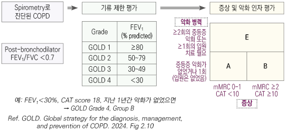
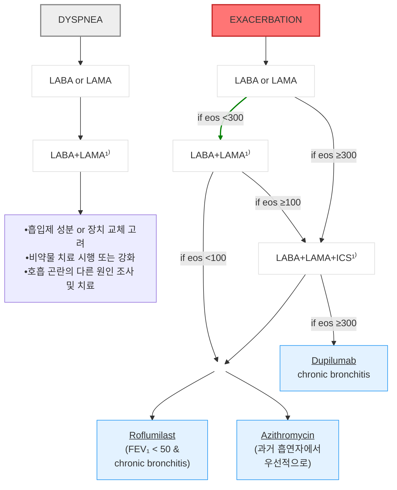

# 만성 폐쇄성 폐질환 COPD

## <mark style="color:green;">일반 사항</mark>

* 지속적이고 종종 진행성인 기류 장애를 일으키는 기도의 이상\[기관지염, 세기관지염] &/or 폐포의 이상\[폐기종]에 기인하는 만성 호흡기 증상(호흡 곤란, 기침, 가래, 악화)을 특징으로 하는 이질적인(heterogeneous) 폐질환
* 기전 : \[원인] Smoking/pollutant, Host factor → \[pathobiology] Impaired lung growth, Accelerated decline, Lung injury, Lung & systemic inflammation → \[병리] Small airway disorder or abnormality, Emphysema, Systemic effect → \[결과] Airway limitation, Resp Sx.
* 유병률 : ≥40세의 13.7%, ≥65세 남성의 46.8% (우리나라, 2017); 우리나라는 남성 우세, 미국은 성별 차이 없음; 여성 흡연자는 남성보다 COPD에 걸릴 확률이 50% 더 높음
* 흔히 다른 만성 질환 동반 : 심혈관 질환, 근골격 이상, 대사증후군, 골다공증, 우울, 불안, 폐암
* 약물 치료가 폐 기능의 장기적인 저하를 개선시킨다는 확실한 증거는 없음; 생활 요법이 매우 중요함

### <mark style="color:orange;">Etiotype에 따른 분류</mark>

1. COPD-G (genetically determined) : alpha-1 antitrypsin deficiency(AATD); 기타 소효과 유전 변이의 복합 작용
2. COPD-D (abnormal lung development) : early life events (조산, 저체중 출산 등)
3. Environmental COPD
   1. COPD-C (cigarette smoking) : 흡연(간접 흡연, 태아 노출 포함), 전자 담배, 대마초
   2. COPD-P (biomass & pollution) : 가정 내 오염, 대기 오염, 산불 연기, 직업적 노출
4. COPD-I (infection) : 소아 감염, 결핵, 산모의 HIV 감염
5. COPD-A (COPD & asthma) : 특히 소아 천식
6. COPD-U (COPD of unknown cause)

## <mark style="color:green;">원인 및 위험 인자</mark>

* 흡연 (간접 흡연, 전자 담배 포함)
* 실내 공기 오염 : 요리·화학 연료 사용, 환기 부족
* 실외 공기 오염
* 직업적 노출 : 먼지, 화학 물질/증기
* 연령 증가
* 유전 : α-1 antitrypsin 결핍
* 낮은 사회 경제적 상태
* 천식, 기도 과민
* 만성 기관지염
* 소아기의 중증 호흡기 감염, 폐 성장 지연 요인

## <mark style="color:green;">임상 양상</mark>

※ dyspnea, activity limitation &/or cough with or without sputum, 급성 악화 가능

* 호흡 곤란 : 점차 악화, 활동 시 악화, 지속적; pursed-lip breathing(오므린 입술 호흡), 부호흡근 사용, 호흡음 감소, 쌕쌕거림
* 만성 기침 (초기에는 아침 기상 시 심함) ± 가래
* 과팽창 : 타진 시 폐 울림 증가, 흉부 전후 직경 증가(barrel chest, protruding abdomen), 횡격막 flattening
* 말초 또는 중심부 청색증 (빈호흡, 빈맥 동반), 곤봉지, 중심 정맥압의 상승, 우측 심부전
* 피로감, 체중 감소, 식욕 부진
* 하기도 감염 반복

### <mark style="color:$danger;">🚩 Red Flags!</mark>

<mark style="color:$danger;">**즉각 조치 또는 이송**</mark>

* 급성 호흡 부전 : SaO2 급격히 감소, 심한 빈호흡, 청색증 악화
* 의식 혼탁 또는 혼수
* 혈역학적 불안정 (저혈압, 빈맥)

<mark style="color:$warning;">**당일 의뢰 또는 긴급 평가**</mark>

* 휴식 시 호흡 곤란의 급격한 악화 (중증 악화 의심)
* 새롭게 발생한 청색증, 말초 부종
* 초기 치료(SABA/SAMA)에 반응하지 않는 급성 악화
* 새롭게 발생한 심각한 동반 질환 (심부전, 부정맥)

<mark style="color:$info;">**외래 추적 / 추가 평가 계획**</mark> <mark style="color:$info;">- 즉각 위험 낮으나 호전 없으면 의뢰</mark>

* 폐 기능 검사상 중증(GOLD 3–4) 또는 급격한 FEV1 감소
* 악화 빈도 증가 (1년 2회 이상)
* 체중 감소, 삶의 질 현저히 저하
* 가정 내 지원 불충분

## <mark style="color:green;">진단</mark>

* 특징적 증상 및 반복되는 하기도 감염 병력 &/or 위험 인자 노출 경력 시 의심
* 기관지 확장제 사용 후 spirometry FEV1/FVC ＜0.7으로 진단(non-fully reversible airflow obstruction); 확장제 사용 전 ＜0.7 → 사용 후 ≥0.7는 COPD 발생 위험 증가와 관련
* 초기 평가 항목 : 기류 폐쇄 정도, 증상 양상/불편 정도, 악화 병력, 혈중 호산구 수, 동반 질환
* 초치료 후 증상이 지속되면 폐 용적, 확산능, 운동 검사, 폐 영상 검사 등 추가 고려


**COPD 선별 검사**: COPD 고위험군(α-1-antitrypsin 결핍, 직업적 toxin 노출 등)을 제외한 무증상 성인에 대한 COPD 선별 검사는 시행하지 않을 것을 권고 \[USPSTF 2022]


### <mark style="color:orange;">검사</mark>

* spirometry (FEV1, FVC) : 가장 유용한 진단 도구
* 최대 호기 유속 : 민감도는 높으나 특이도가 낮아 단독으로는 진단에 적용할 수 없음
* 혈중 호산구 : ICS 효과 정도 예측; 수치가 높을수록 ICS에 더 잘 반응
* 혈중 산소 : SaO2, PaO2, pulse oximetry (특히 야간)
* 흉부 X선 : hyperinflation, vascular marking 감소/bullae (emphysema), thickened bronchial marking (chronic bronchitis); 특이적이지 않음, 다른 질환 감별에 이용
* chest CT : 빈번한 악화 또는 폐기능 검사 중증도와 불일치하는 증상 감별, 폐 용적 제한술 대상 평가 (FEV1 15\~45%, 과팽창 증거), 폐암 선별 검사
* α-1 antitrypsin 결핍 선별 검사 : 특히 유병률이 높은 지역에서 권고
* 6분 보행 검사 (6MWT) : ≥350 m이면 기능적 제한 없음, ＜150 m이면 심한 기능적 제한; 삶의 질, 치료 효과 및 사망률 예측에 활용
* CBC : 악화 시 WBC↑(neutrophilia), 만성 저산소증 시 RBC↑
* 가래 염색/배양 검사 : 세균 감염 감별 및 항생제 반응 불량 시 대비하여 고려

### <mark style="color:orange;">환자 평가</mark>

#### <mark style="color:$primary;">ABE Assessment Tool (GOLD 2025)</mark>

spirometry, 환자 증상(mMRC ≥2 또는 CAT ≥10), 악화 병력을 종합하여 분류; 치료 방침 결정 및 예후 예측 도구




GOLD 2023부터 Group C와 D가 통합되어 **Group E**(Exacerbation risk)로 개편됨. 악화 위험이 높은 군에서는 증상 수준에 관계없이 적극적 치료가 권장됨.

* **Group A** : 호흡 곤란 낮음(mMRC 0–1, CAT ＜10) + 악화 적음(0–1회/년, 입원 없음) → SABD 필요시 단독
* **Group B** : 호흡 곤란 높음(mMRC ≥2 또는 CAT ≥10) + 악화 적음 → LAMA 또는 LABA
* **Group E** : 악화 ≥2회/년 또는 입원 악화 ≥1회/년 (증상 정도 무관) → LAMA+LABA; eos ≥300이면 LAMA+LABA+ICS


#### <mark style="color:$primary;">기류 폐쇄 중증도 (GOLD Grade)</mark>

<table><thead><tr><th width="130">GOLD 단계</th><th width="180">중증도</th><th width="230">FEV₁ 기준</th><th>치료 방향</th></tr></thead><tbody><tr><td>GOLD 1</td><td>Mild (경증)</td><td>FEV₁ ≥ 80% 예측치</td><td>SABD 필요 시</td></tr><tr><td>GOLD 2</td><td>Moderate (중등도)</td><td>50 ≤ FEV₁ ＜ 80%</td><td>LABA 또는 LAMA</td></tr><tr><td>GOLD 3</td><td>Severe (중증)</td><td>30 ≤ FEV₁ ＜ 50%</td><td>LABA+LAMA ± ICS</td></tr><tr><td>GOLD 4</td><td>Very Severe (매우 중증)</td><td>FEV₁ ＜ 30%</td><td>LABA+LAMA+ICS; 폐 재활, O₂, 수술 고려</td></tr></tbody></table>

SABD = short-acting bronchodilator

#### <mark style="color:$primary;">mMRC (modified Medical Research Council) Dyspnea Scale</mark>

* Grade 0 : 힘든 운동을 할 때만 숨참
* Grade 1 : 평지를 빨리 걷거나 약간의 오르막길을 걸을 때 숨참
* Grade 2 : 평지를 걸을 때 숨이 차서 동년배보다 천천히 걷거나, 자기 속도로 걸어도 멈추어 쉬어야 함
* Grade 3 : 평지를 약 100 m 또는 몇 분 걸으면 숨이 차서 멈추어야 함
* Grade 4 : 숨이 너무 차서 집을 나설 수 없거나 옷을 입고 벗을 때도 숨참

#### <mark style="color:$primary;">CAT (COPD Assessment Test)</mark>

* 환자의 불편 정도에 대한 포괄적 평가 도구 (8개 항목, 각 0~~5점, 총점 0~~40점)
* 총점 ≤9점 : 경미한 영향 / 10~~20점 : 중간 / 21~~30점 : 심함 / ≥31점 : 매우 심함

<table><thead><tr><th width="140">항목</th><th width="220">0점 상태</th><th width="80">배점</th><th>5점 상태</th></tr></thead><tbody><tr><td>기침</td><td>전혀 기침을 하지 않는다</td><td>0–5</td><td>항상 기침을 한다</td></tr><tr><td>가래</td><td>가슴에 가래가 전혀 없다</td><td>0–5</td><td>가슴에 가래가 가득 차 있다</td></tr><tr><td>가슴 답답함</td><td>가슴 답답함을 전혀 느끼지 않는다</td><td>0–5</td><td>매우 가슴 답답함을 느낀다</td></tr><tr><td>숨참</td><td>언덕이나 계단 1층을 오를 때 전혀 숨이 차지 않는다</td><td>0–5</td><td>언덕이나 계단 1층을 오를 때 매우 숨이 차다</td></tr><tr><td>집안 활동</td><td>집에서 활동하는데 전혀 제약을 받지 않는다</td><td>0–5</td><td>집에서 활동하는데 매우 제약을 받는다</td></tr><tr><td>외출 자신감</td><td>폐 상태에도 불구하고 외출하는데 자신이 있다</td><td>0–5</td><td>폐 문제로 외출하는데 자신이 없다</td></tr><tr><td>수면</td><td>잠을 잘 잔다</td><td>0–5</td><td>폐 문제로 잠을 잘 자지 못한다</td></tr><tr><td>기운</td><td>기운이 왕성하다</td><td>0–5</td><td>기운이 전혀 없다</td></tr></tbody></table>

### <mark style="color:orange;">감별 진단</mark>

<table><thead><tr><th width="190">질환</th><th>감별 포인트</th></tr></thead><tbody><tr><td>COPD</td><td>중년기 시작, 느린 진행, 흡연·기타 연기 노출 경력</td></tr><tr><td>천식</td><td>어린 시절 발병, 심한 증상 변동, 야간/새벽 악화, 알레르기/비염/습진 동반, 가족력</td></tr><tr><td>울혈성 심부전</td><td>흉부 X선상 심장 비대·폐부종; 폐 기능 검사상 기류 제한 없음</td></tr><tr><td>기관지확장증</td><td>다량의 화농성 가래, 영상상 기관지 확장/기관지벽 비후; 흔히 세균 감염 관련</td></tr><tr><td>결핵</td><td>연령 무관, 흉부 X선상 폐 침윤, 미생물학적 확인, 높은 결핵 유병 지역</td></tr><tr><td>폐쇄세기관지염</td><td>어린 시절 발병, 비흡연자, RA 병력, 급성 연기 노출력, 폐·골수 이식 후 발병, 호기 CT상 음영 감소</td></tr><tr><td>광범위 범세기관지염</td><td>남성, 비흡연자, 대부분 만성 부비동염 동반; 영상상 미만성 중심소엽성 결절 및 과팽창</td></tr><tr><td>기타</td><td>만성 알레르기비염, 후비루증후군, 상기도기침증후군, GERD, 약물(ACEI) 유발 기침</td></tr></tbody></table>

***

## <mark style="background-color:$warning;">Management</mark>

* 동반 질환 관리
* 비-약물 치료 : 금연, 적절한 영양 및 수분 공급, 활동적 생활 및 운동, 적정 체중 유지, 백신 접종 (인플루엔자, 폐렴구균, Tdap, 대상포진, COVID-19), 호흡 재활 치료 (Group B, E)
* 약물 치료 : 기본 치료제 — 흡입 기관지 확장제
* 혈중 산소 농도 저하 시 (SaO2 ＜88%) O2 공급 (목표 SaO2 ≥90%)
* 폐쇄수면무호흡 동반 시 지속양압(CPAP) 치료
* 자가 관리 교육 : 위험 인자 관리, 흡입제 사용 교육, 급성 악화 시 대응 요령

**COPD Management Cycle**

1. Diagnosis : 증상, 위험 인자, spirometry (경계치 시 재검)
2. Initial Assessment : GOLD ABE 평가(FEV₁, 증상, 악화 병력), 혈중 호산구 수치, α1-antitrypsin, 동반 질환
3. Initial Management : 금연, 예방접종, 활동적 생활 습관 및 운동, 초기 약물 치료, 자가 관리 교육, 동반 질환 관리
4. Review : 증상(CAT or mMRC), 악화, 흡연 상태, 다른 위험 인자 노출, 흡입제 사용법 및 순응도, 육체적 활동 및 운동, 폐 재활 치료 필요성, 자가 관리 기술, 산소, NIV, 폐용적 감소 등, 예방접종, 동반 질환 관리, Spirometry (최소 매년)
5. Adjust : 약물 치료, 비-약물 치료

## <mark style="color:green;">비-약물 치료 및 예방</mark>

### <mark style="color:orange;">금연</mark>

* COPD 진행을 늦추는 가장 효과적인 단일 중재; 모든 단계에서 적극 권고
* 약물 보조 : varenicline, bupropion, nicotine replacement therapy (NRT)
* (☞ [금연](../part1/smoking-cessation.md))

### <mark style="color:orange;">예방접종</mark>

* 인플루엔자 : 매년
* 폐렴구균 : PCV15 또는 PCV20; 미접종자 또는 PCV13 접종자에게 권고
* COVID-19, Tdap, 대상포진 : 표준 일정에 따라

### <mark style="color:orange;">호흡 재활 치료</mark>

* 대상 : 주로 Group B, E; 중등도\~중증 COPD에서 호흡 곤란, 운동 능력, 삶의 질 유의하게 개선
* 구성 : 운동 훈련, 호흡 근육 훈련, 교육, 영양 상담
* 악화 후 3\~4주 이내 시작 시 재입원율 감소 효과

### <mark style="color:orange;">장기 산소 치료</mark>

* 적응증 : 만성 중증 저산소증 (안정 상태에서 PaO2 ≤55 ㎜Hg 또는 SaO2 ≤88%; 또는 PaO2 56\~60 ㎜Hg + 심부전/적혈구증가증/폐고혈압 동반 시)
* 하루 **≥15시간** 사용 시 생존율 향상
* 목표 SaO2 88\~92% (고탄산혈증 환자에서 과도한 산소 공급 주의)
* 비-침습 양압 환기(NIV) : 만성 고탄산혈증 동반 중증 COPD에서 병원 재입원 및 사망률 감소

### <mark style="color:orange;">기타 비-약물 치료</mark>

* 영양 : 저체중 환자에서 영양 보충; 고지방/저탄수화물 식이 고려 (CO2 생성 감소)
* 수면 : 충분한 수면, 폐쇄수면무호흡 동반 시 CPAP
* 폐 용적 감소 수술(LVRS) / 기관지경 폐 용적 감소술(BLVR) : 이형성 폐기종, 심한 과팽창에서 선택적으로 고려
* 폐 이식 : 말기 COPD (BODE index 7\~10)에서 고려; 5년 생존율 약 50% 수준

## <mark style="color:green;">약물 치료</mark>

### <mark style="color:orange;">기관지 확장제</mark>

* 직업적 호흡 곤란 환자를 제외한 1차 선택제
* 흡입 기관지 확장제 : 증상 치료의 중심; 증상 예방 및 완화를 위하여 규칙적으로 투여
* 간헐적 호흡 곤란만 있는 환자를 제외하고는 속효성 제제보다 지속성 제제를 선호
* SABA, SAMA : 규칙적 &/or 필요시 사용; FEV1 및 증상 완화 효과
  * 응급 약제로는 SABA를 선택 (보험기준 ☞ p.1181)
  * SABA & SAMA 병용 시 각각의 단독 사용보다 효과적
* LABA, LAMA : 폐 기능, 호흡 곤란, 건강 상태 개선 및 악화 빈도 감소에 유효
  * LABA보다 LAMA가 악화 감소에 효과적 (Group E에서 LAMA 우선 권고)
  * LABA & LAMA 각각의 단독 사용보다 병용 시 효과적
* tiotropium : 운동 기능 향상에 유효
* theophylline : 약간의 기관지 확장/증상 완화 효과; 다른 제제에 효과가 없거나 사용하지 못하는 경우를 제외하고는 권고하지 않음

#### <mark style="color:$primary;">β2-작용제</mark>

* 임상 증상은 호전시키나 폐 기능 악화 지연 또는 사망률 감소 효과는 입증 안 됨
* 부작용 : **빈맥**, 떨림, 저칼륨혈증
* SABA : fenoterol <mark style="color:blue;">\[베로텍]</mark>, salbutamol <mark style="color:blue;">\[벤토린 에보할러]</mark>, terbutaline <mark style="color:blue;">\[베타투]</mark>
* LABA : \[bid] formoterol <mark style="color:blue;">\[아토크]</mark>, salmeterol; \[qd] indacaterol, olodaterol, vilanterol

<table><thead><tr><th width="110">분류</th><th width="280">성분명 [상품명]</th><th width="200">흡입제 용량</th><th>작용 시간(hr)</th></tr></thead><tbody><tr><td>SABA</td><td>salbutamol <mark style="color:blue;">[벤토린 에보할러]</mark></td><td>100 μg/puff 1~2 puffs prn</td><td>4–6</td></tr><tr><td>LABA</td><td>salmeterol</td><td>25 μg/puff bid</td><td>12</td></tr><tr><td></td><td>indacaterol <mark style="color:blue;">[온브리즈 흡입용캡슐]</mark></td><td>150 or 300 μg/C qd</td><td>24</td></tr></tbody></table>

#### <mark style="color:$primary;">Anti-muscarinics</mark>

* 호흡기 평활근의 M3 muscarine 수용체에서 acetylcholine의 기관지 수축 작용 차단
* 악화 감소에 있어 LAMA가 LABA보다 유효
* 부작용 : 입마름
* SAMA : ipratropium, oxitropium
* LAMA : aclidinium, glycopyrronium, tiotropium, umeclidinium

<table><thead><tr><th width="100">분류</th><th width="260">성분명 [상품명]</th><th width="140">흡입제 용량</th><th width="170">네뷸라이저 용액</th><th>작용 시간(hr)</th></tr></thead><tbody><tr><td>SAMA</td><td>ipratropium <mark style="color:blue;">[아트로벤트]</mark></td><td>—</td><td>250 μg/mL, 1~2 mL/A</td><td>6–8</td></tr><tr><td>LAMA</td><td>aclidinium <mark style="color:blue;">[에클리라 제뉴에어]</mark></td><td>400 μg bid</td><td>—</td><td>12</td></tr><tr><td></td><td>glycopyrronium <mark style="color:blue;">[씨브리 흡입용캡슐]</mark></td><td>50 μg 1C qd</td><td>—</td><td>24</td></tr><tr><td></td><td>tiotropium <mark style="color:blue;">[스피리바 흡입용캡슐]</mark></td><td>18 μg 1C qd</td><td>—</td><td>24</td></tr><tr><td></td><td>umeclidinium <mark style="color:blue;">[인크루즈 엘립타]</mark></td><td>62.5 μg qd</td><td>—</td><td>24</td></tr></tbody></table>

#### <mark style="color:$primary;">LAMA+LABA 흡입 복합제</mark>

* LAMA+LABA 요법이 ICS+LABA 요법에 비해 유효 (중증 COPD 악화율 8% 감소, 폐렴 입원율 20% 감소)

<table><thead><tr><th width="350">성분명 [상품명]</th><th width="180">흡입제 용량</th><th>작용 시간(hr)</th></tr></thead><tbody><tr><td>formoterol / aclidinium <mark style="color:blue;">[듀어클리어 제뉴에어]</mark></td><td>12/400 μg bid</td><td>12</td></tr><tr><td>indacaterol / glycopyrronium <mark style="color:blue;">[조터나 흡입용캡슐]</mark></td><td>110/50 μg 1C qd</td><td>24</td></tr><tr><td>olodaterol / tiotropium <mark style="color:blue;">[바헬바 레스피맷]</mark></td><td>5/5 μg 2 puffs qd</td><td>24</td></tr><tr><td>vilanterol / umeclidinium <mark style="color:blue;">[아노로 엘립타]</mark></td><td>25/62.5 μg qd</td><td>24</td></tr></tbody></table>

#### <mark style="color:$primary;">Methylxanthine</mark>

* stable COPD에서 기관지 확장 효과
* 부작용 : 용량에 따른 독성(유효 농도와 독성 농도의 차이가 적음); 구역, 구토, 설사, 불면, 흥분, 떨림, 두통, 부정맥, 발작
* 적용 : 다른 제제를 사용하기 어렵거나 효과가 없는 경우에만 선택
* theophylline 200 ㎎ bid, (필요시) 1~~2주 후 100~~200 ㎎ 증량 <mark style="color:blue;">\[테올란 비]</mark>
  * 감량 : 간/신 장애, ＞55세, CHF
  * 치료 범위 : 8~~13 ㎍/㎖; 용량 조절 후 매 6~~12개월마다 레벨 체크

### <mark style="color:orange;">Steroid</mark>

#### <mark style="color:$primary;">흡입 Steroid (ICS)</mark>

* 적용 권고 : LABA 사용에도 불구하고 COPD 악화로 입원 병력 또는 ≥2회/1년 악화, 혈중 eosinophil ≥300 cells/μL, 천식 동반
  * ICS 반응은 eos ＞150 시 나타나기 시작하며 가장 좋은 반응은 ≥300에서 나타남
* 적용 고려 : LABA 사용에도 불구하고 ≥1회/1년 악화, eosinophil 100\~299 cells/μL
* 적용 안 함 : 반복되는 폐렴, eosinophil ＜100 cells/μL, mycobacterial 감염 병력
* 규칙적 사용 시 폐렴 유발 위험 증가; 장기 단독 사용은 권고하지 않음

<table><thead><tr><th width="250">성분명 [상품명]</th><th width="200">흡입제</th><th>네불라이저 용액</th></tr></thead><tbody><tr><td>budesonide <mark style="color:blue;">[풀미코트]</mark></td><td>200 μg/puff bid</td><td>0.5 mg/2 mL/A bid</td></tr><tr><td>fluticasone <mark style="color:blue;">[후릭소타이드]</mark></td><td>100, 250 μg/puff bid</td><td>0.5 or 2 mg/2 mL/A bid</td></tr><tr><td>ciclesonide <mark style="color:blue;">[알베스코]</mark></td><td>80, 160 μg/puff qd</td><td>—</td></tr></tbody></table>

#### <mark style="color:$primary;">ICS+LABA 흡입 복합제</mark>

* 중증에서 ICS/LABA 병용이 개별 사용보다 유효; ICS/LABA/LAMA 3제 병용도 유효

<table><thead><tr><th width="230">성분명</th><th width="330">상품명 [제형, 단위 μg]</th><th>용법</th></tr></thead><tbody><tr><td>fluticasone / salmeterol</td><td><mark style="color:blue;">[세레타이드 디스커스]</mark> 100/50, 250/50, 500/50</td><td>1 puff bid</td></tr><tr><td></td><td><mark style="color:blue;">[세레타이드 에보할러]</mark> 50(45/21), 125(115/21), 250(230/21)</td><td>2 puffs bid</td></tr><tr><td>fluticasone / vilanterol</td><td><mark style="color:blue;">[렐바 엘립타]</mark> 100/25, 200/25</td><td>1 puff qd</td></tr><tr><td>fluticasone / formoterol</td><td><mark style="color:blue;">[플루티폼 MDI]</mark> 50/5, 125/5, 250/10</td><td>2 puffs bid</td></tr><tr><td>budesonide / formoterol</td><td><mark style="color:blue;">[심비코트 터부할러]</mark> 80/4.5, 160/4.5, 320/9</td><td>1~2 puffs bid</td></tr><tr><td>beclomethasone / formoterol</td><td><mark style="color:blue;">[포스터 MDI/DPI]</mark> 100/6</td><td>2 puffs bid</td></tr></tbody></table>

증상에 따라 경감할 수 있으며, 용량에 따라 분무 횟수를 조절할 수 있음

#### <mark style="color:$primary;">LABA+LAMA+ICS</mark>

<table><thead><tr><th width="420">성분명 [상품명]</th><th>용법</th></tr></thead><tbody><tr><td>fluticasone / umeclidinium / vilanterol <mark style="color:blue;">[트렐리지 엘립타]</mark></td><td>100/62.5/25 μg/puff qd</td></tr><tr><td>mometasone / glycopyrronium / indacaterol <mark style="color:blue;">[에너어 흡입용캡슐]</mark></td><td>160/50/150 1C qd</td></tr><tr><td>budesonide / formoterol / glycopyrrolate</td><td>320/9/14.4 μg 2 puffs bid</td></tr></tbody></table>

#### <mark style="color:$primary;">전신 Steroid</mark>

* 장기(＞2주) 지속 사용에 대한 유익성은 불분명하며 부작용을 고려하여 단기간 제한적 사용
* prednisolone 5 ㎎ : 3\~6T/d <mark style="color:blue;">\[소론도]</mark>

### <mark style="color:orange;">Phosphodiesterase-4 억제제 (PDE4i)</mark>

* cAMP의 대사 억제 → 세포 내 cAMP 농도↑ → 항염증 효과, eosinophil 이동 및 화학 주성 억제 → FEV1 개선, 악화 감소
* 적용 : 중증의 기류 제한 + 만성 기관지염 + 악화 시; LABA ± ICS에 추가 고려
* 부작용 : 설사, 구역, 복통, 식욕 감퇴, 두통, 체중 감소
* roflumilast 0.5 ㎎ qd <mark style="color:blue;">\[닥사스]</mark> (보험기준 ☞ p.1182)

### <mark style="color:orange;">항생제 (장기 예방 목적)</mark>

* azithromycin 250 ㎎ qd 또는 500 ㎎ 주 3회 장기(1년) 투여 시 악화 감소; 내성균 증가와 청력 장애 위험이 있음
* 대상 : **금연자**에서, 악화 빈도 높은 환자에서 선별적 고려; QTc 연장 주의

### <mark style="color:orange;">Mucolytics</mark>

* 규칙적 사용이 일부 환자에서 악화를 줄여주지만 일반적이지 않음; 선별적으로 고려
* acetylcysteine 200 ㎎ tid <mark style="color:blue;">\[뮤테란]</mark>
* carbocysteine 375\~750 ㎎ tid <mark style="color:blue;">\[리나치올]</mark>
* erdosteine 300 ㎎/C bid\~tid <mark style="color:blue;">\[엘도스]</mark>

### <mark style="color:orange;">기타</mark>

* α-1 antitrypsin augmentation : IV 보충 치료가 emphysema의 진행을 늦춤
* 진해제 : 유효성에 대한 증거 없음; 권고 안 함
* 저용량 지속형 opioid, neuromuscular electrical stimulation, 얼굴에 향하는 선풍기 : 호흡 곤란 완화 효과

### <mark style="color:orange;">초기 약물 치료 (Initial Pharmacological Treatment)</mark>

<figure><figcaption><p>Initial Pharmacological Treatment (GOLD 2025)</p></figcaption></figure>

### <mark style="color:orange;">유지 약물 치료 조정 (Follow-up Pharmacological Treatment)</mark>

1. 초치료에 적절히 반응한다면, 그 치료를 유지
2. 그렇지 않다면
   * 순응도, 흡입기 사용 방법, 영향을 줄 수 있는 동반 질환 등 확인
   * 표적이 되는 주된 치료 특성을 고려 (dyspnea or exacerbations)\
     두 가지 모두 표적이 된다면 exacerbation pathway를 선택
   * 현재의 치료와 향후 적응증에 맞춰 치료를 조정
   * 반응 평가, 조정 및 재평가
   * 이 권고는 진단 시의 ABE assessment에 의존하지 않음

***



<p align="center"><em><mark style="color:$info;">Ref. GOLD 2025, Fig 3.9</mark></em></p>

***

eos = blood eosinophil count (cells/μL)

¹⁾single inhaler 권고

## <mark style="color:green;">악화 관리 (Exacerbation)</mark>

### <mark style="color:orange;">정의 및 원인</mark>

* 정의 : ≤14일간의 호흡 곤란 &/or 기침 및 가래의 급성 악화로 추가 치료가 필요한 사건
* 원인 : 기도 감염(가장 흔함 — 바이러스·세균 혼합), 대기 오염, 순응도 저하

### <mark style="color:orange;">증상</mark>

호흡 곤란 악화, 기침 증가, 가래 양 증가, 가래 색 변화(화농성), 부호흡근 사용, paradoxical chest wall movement, 청색증 발생 또는 악화, 말초 부종, 정신 상태 악화

### <mark style="color:orange;">중증도 분류</mark>

* 경증 : VAS ＜5, RR ＜24/분, HR ＜95/분, resting SaO2 ≥92%, CRP ＜10 ㎎/L → 외래 치료
* 중등증 : VAS ≥5, RR ≥24/분, HR ≥95/분, resting SaO2 ＜92%, CRP ≥10 ㎎/L → 외래 또는 입원
* 중증 : 중등증 기준 + PaCO2 ＞45 ㎜Hg, pH ＜7.35 → 입원 또는 ICU

_VAS = visual analog dyspnea scale_

### <mark style="color:orange;">입원 평가 대상</mark>

* 심각한 증상 : 휴식 시 호흡 곤란, SaO2 급감, 혼란, 졸음
* 급성 호흡 부전
* 새로운 신체 징후 : 청색증, 말초 부종
* 초기 치료에 반응 없음
* 심각한 합병증 : 심부전, 새롭게 발생한 부정맥
* 불충분한 가정 내 지원

### <mark style="color:orange;">감별 진단</mark>

<table><thead><tr><th width="190">감별 질환</th><th>감별 검사</th></tr></thead><tbody><tr><td>폐렴</td><td>흉부 X선, CBC, CRP</td></tr><tr><td>폐색전증</td><td>D-dimer, CT angiography; 병력(객혈, 수술, 골절, 암, DVT)</td></tr><tr><td>심부전</td><td>흉부 X선, Pro-BNP/BNP, 심초음파</td></tr><tr><td>기흉/흉수</td><td>흉부 X선, 흉부 초음파</td></tr><tr><td>심근경색/부정맥</td><td>ECG, troponin</td></tr></tbody></table>

### <mark style="color:orange;">치료</mark>

* **기관지 확장제** : SABA ± SAMA 투여를 가능한 한 빨리 시작; 호전 후 LABA로 유지 치료 전환
* **전신 steroid** : prednisolone 30\~40 ㎎/d ×5일 이내 <mark style="color:blue;">\[소론도]</mark> — 5일 단기 요법이 14일 요법과 동등한 효과
* **산소 공급** : 목표 SaO2 88\~92%; ABG로 hypercapnia와 acidosis 모니터링 (입원 치료)
* **항생제** : 악화의 많은 경우가 세균 감염과 무관; 화농성 가래, 호흡 곤란 악화, 가래 증가가 모두 동반되거나 중증 악화 시 고려; 투여 전 가래 배양 검사 시행

#### <mark style="color:$primary;">항생제 선택 \[NICE 2018]</mark>

**1차 선택제** (경험적 선택)

* amoxicillin 500 ㎎ tid ×5일 <mark style="color:blue;">\[파목신]</mark>
* doxycycline : 200 ㎎ × 1일, 이후 100 ㎎ qd × 4일 <mark style="color:blue;">\[독시사이클린]</mark>
* clarithromycin 500 ㎎ bid ×5일 <mark style="color:blue;">\[클래리시드]</mark>

**2차 선택제** : 경구 1차 선택제에 2\~3일 내 호전되지 않는 경우 → 1차 선택제 내에서 교체

**대체제** : 항생제 반복 복용, 내성균 보유 병력, 합병증 발생 고위험 등 치료 실패 위험이 높은 경우

* amoxicillin/clavulanate 500/125 ㎎ tid ×5일 <mark style="color:blue;">\[오구멘틴]</mark>
* sulfamethoxazole/trimethoprim (유익성에 대한 세균학적 증거가 있는 경우) : 800/160 ㎎ bid ×5일 <mark style="color:blue;">\[셉트린]</mark>
* levofloxacin (근골격계, 신경계 부작용 주의) : 500 ㎎ qd ×5일 <mark style="color:blue;">\[크라비트]</mark>

**IV** : 경구 항생제를 적용할 수 없거나 중증인 경우; 입원 치료; 투여 48시간 후 재검토하여 가능하면 경구 전환

### <mark style="color:orange;">악화 예방</mark>

* 호흡 재활 치료, 금연, 규칙적인 약제 투약
* 예방접종 (인플루엔자, 폐렴구균)

## <mark style="color:green;">예후 및 모니터링</mark>

* 안정될 때까지 매달, 안정 후 매 6개월마다 모니터링; 증상, 치료 효과, 흡입기 사용, 생활 습관 및 위험 요인 점검
* 폐렴 악화 시 흉부 X선 또는 chest CT 시행
* 가정 산소 치료 시 pulse oximetry 수시 모니터링 (특히 야간); 매년 또는 상태 변화 시 ABG 검사
* 연 1회 이상 spirometry 시행
* 심혈관 질환, 골다공증, 우울증, 폐암 동반 시 예후 불량


**가정 산소 치료** : 만성 중증 휴식 저산소증이 있는 환자에서 장기 공급(≥15시간/일) 시 생존율 향상 효과


### <mark style="color:orange;">비-약물 치료 Follow-up</mark>

1. 초치료에 적절히 반응한다면, 그 치료를 유지
   * 매년 독감 백신 접종 등 권고 백신 일정 수행, 자가 관리 교육, 금연 등 행동 위험 인자 평가
   * 신체 활동·운동 프로그램 유지, 적당한 수면, 건강한 식사 격려
2. 그렇지 않다면 우선 순위의 치료 가능한 목표를 고려
   * 호흡 곤란 : 일반적 자가 관리 교육, 호흡 재활 프로그램 &/or 유지 운동 프로그램
   * 악화 : 개별화된 자가 관리 교육; 악화 유발 인자 회피, 증상 악화 모니터링·관리 방법, 악화 발생 시 연락처 정보

***

### <mark style="color:red;">질병코드</mark>

J42 상세불명의 만성 기관지염\
J44 기타 만성 폐색성 폐질환

***

## <mark style="color:purple;">처방례</mark>

> **처방례 1. 경증 (Group A — 간헐적 호흡 곤란)**
>
> ```
> salbutamol 흡입제 [벤토린 에보할러]  100 μg/puff  1~2 puffs  prn
> ```
>
> _✽ 증상이 간헐적인 Group A에서는 속효성 기관지 확장제(SABA 또는 SAMA)를 필요시 사용. 지속적 호흡 곤란으로 진행 시 LAMA 또는 LABA로 upgrade한다._

> **처방례 2. 중등도 (Group B — 지속적 호흡 곤란, 악화 적음)**
>
> ```
> tiotropium 흡입용캡슐 [스피리바]  18 μg/C  1C  qd
> ─────────────────────────────────────────
> salbutamol 흡입제 [벤토린 에보할러]  100 μg/puff  1~2 puffs  prn
> ```
>
> _✽ Group B에서는 LAMA 또는 LABA로 시작. 지속적 증상에는 LAMA+LABA 병용 복합제로 upgrade. tiotropium은 운동 내성 개선에 특히 유효하다._

> **처방례 3. 중등도-중증 (Group E — 빈번한 악화, eos ＜300)**
>
> ```
> vilanterol / umeclidinium 흡입제 [아노로 엘립타]  25/62.5 μg  1 puff  qd
> ─────────────────────────────────────────────────────────────
> salbutamol 흡입제 [벤토린 에보할러]  100 μg/puff  1~2 puffs  prn
> ```
>
> _✽ Group E(빈번한 악화)에서는 LAMA+LABA 복합제가 1차 권고. eos ＜300이면 ICS 추가 없이 유지; 이후 악화 지속 시 roflumilast (FEV1＜50%, 만성 기관지염) 또는 azithromycin (과거 흡연자) 추가 고려._

> **처방례 4. 중증 (Group E — 빈번한 악화, eos ≥300)**
>
> ```
> fluticasone / umeclidinium / vilanterol [트렐리지 엘립타]  100/62.5/25 μg  1 puff  qd
> ─────────────────────────────────────────────────────────────────────
> salbutamol 흡입제 [벤토린 에보할러]  100 μg/puff  1~2 puffs  prn
> ```
>
> _✽ eos ≥300 cells/μL이면 ICS 포함 3제 복합제(LABA+LAMA+ICS) 권고. 폐렴 반복, 흡연 중, eos＜100인 경우 ICS 추가를 재검토한다._

> **처방례 5. 급성 악화 — 외래 치료 (경·중등도)**
>
> ```
> prednisolone 5 ㎎ [소론도]  6T  qd  × 5일   (30 ㎎/d)
> ────────────────────────────────────────────────
> clarithromycin 500 ㎎ [클래리시드]  1T  bid  × 5일  ▷ 화농성 가래 동반 시
> ────────────────────────────────────────────────
> salbutamol 흡입제 [벤토린 에보할러]  100 μg/puff  2~4 puffs  q4~6h  (호전 후 prn)
> ```
>
> _✽ 급성 악화 시 전신 스테로이드 5일 단기 요법이 표준 (14일 요법과 효과 동등, 부작용 감소). 항생제는 화농성 가래 증가 또는 CRP ≥10 ㎎/L 등 세균 감염 징후가 있을 때만 투여. 회복 후 가능한 한 빨리 LABA/LAMA 유지 치료로 전환한다._

***

### <mark style="color:$success;">핵심 복약 지도</mark>

* **흡입제 사용법 교육** : 잘못된 흡입 기술은 치료 실패의 가장 흔한 원인; 흡입기 종류(MDI, DPI, SMI)에 따라 사용법이 다르므로 직접 시연하여 교육
  * MDI : 흔들기 → 숨을 끝까지 내쉬기 → 흡입구 물기 → 분무와 동시에 천천히 깊게 흡입(약 4\~5초) → 10초 참기
  * DPI : 캡슐/블리스터 장전 확인 → 숨을 끝까지 내쉬기 → **빠르고 강하게** 흡입 (느리게 흡입하면 약이 폐 깊이 도달하지 않음)
  * ICS 포함 흡입제 사용 후 반드시 **구강 헹굼** (구강 칸디다, 구내염 예방)
* **유지(controller) vs 응급(rescue) 흡입제 구분** : LAMA/LABA는 매일 규칙적으로 사용하는 유지제; SABA는 증상이 갑자기 심해질 때 사용하는 응급제 — 증상이 없어도 유지제를 중단하지 않도록 강조
* **전신 스테로이드 단기 요법** : 5일 이내 사용하므로 감량 없이 중단 가능; 혈당 상승(당뇨 환자 주의), 수면 장애, 기분 변화 등 일시적 부작용 설명
* **roflumilast (닥사스)** : 복용 초기 설사·구역 등 위장관 부작용이 흔하나 수 주 내 호전; 체중 감소 모니터링 필요; 복통이 심하면 의사에게 보고
* **theophylline** : 혈중 농도 범위가 좁아 유효 농도와 독성 농도의 차이가 적음; macrolide·fluoroquinolone 항생제, 흡연 상태 변화 시 독성 위험 증가 — 임의 용량 변경 금지

***

### <mark style="color:blue;">환자 안내서</mark>

**COPD(만성 폐쇄성 폐질환)에 대해 알아야 할 것들**

**COPD란 무엇인가요?**\
담배 연기나 공기 오염 등으로 기도와 폐가 좁아지고 손상되어 숨이 점점 더 차게 되는 만성 폐 질환입니다. 완치보다는 진행을 늦추고 증상을 조절하는 것이 치료 목표입니다.

**가장 중요한 것: 금연**\
지금 당장 금연하면 폐 기능 저하 속도가 크게 느려집니다. 금연 약물 처방도 가능하니 상담해 주세요.

**흡입제는 매일 사용하세요**\
증상이 없어 보여도 장기 흡입제(LAMA, LABA)는 매일 규칙적으로 사용해야 합니다. 사용 방법을 모르거나 잘 안 되면 언제든지 다시 알려달라고 하세요.

**응급 흡입제(살부타몰 등) 사용 시**\
숨이 갑자기 많이 차거나 심해질 때 사용합니다. 하루 4회 이상 자주 사용해야 한다면 의료진에게 알려주세요.

**예방접종을 챙기세요**\
독감 예방주사를 매년 맞고, 폐렴구균 예방주사도 맞으면 악화를 예방하는 데 도움이 됩니다.

**즉시 내원해야 하는 증상**\
숨이 갑자기 더 심하게 차거나, 가래가 진하고 색이 변하거나, 발이 붓거나, 입술·손발이 파래지면 즉시 병원에 오세요.

**규칙적인 운동을 하세요**\
무리하지 않는 선에서 걷기 등을 꾸준히 하면 호흡 기능을 유지하는 데 큰 도움이 됩니다.

**악화 행동 계획 (Exacerbation Action Plan)**

| 단계           | 상황                                   | 행동                                 |
| ------------ | ------------------------------------ | ---------------------------------- |
| 🟡 주의        | 평소보다 숨이 더 차고 가래가 늘었을 때               | 응급 흡입제 사용 횟수 늘리고, 다음 외래 일정을 앞당겨 연락 |
| 🔴 즉시 내원/119 | 숨이 매우 심하게 차거나, 입술이 파래지거나, 정신이 혼미해질 때 | 즉시 응급실 방문 또는 119 호출                |
