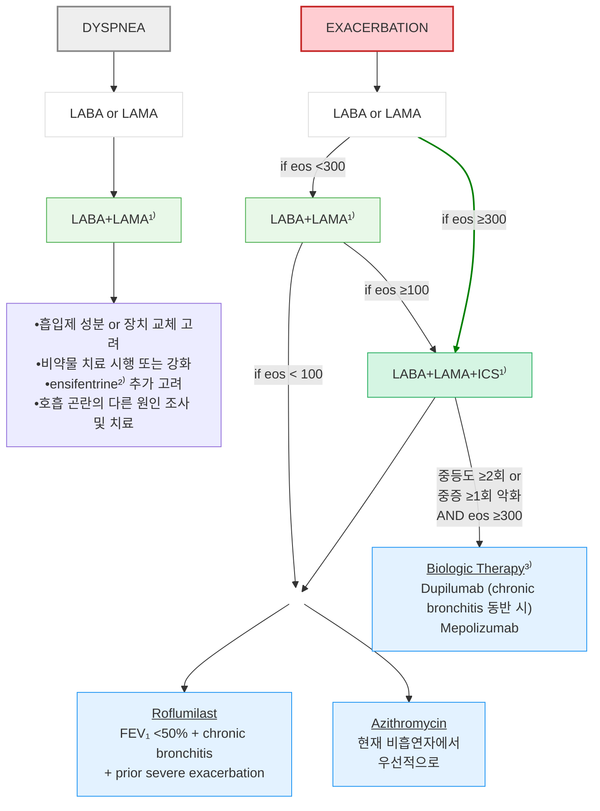
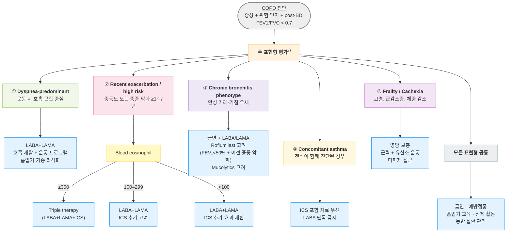
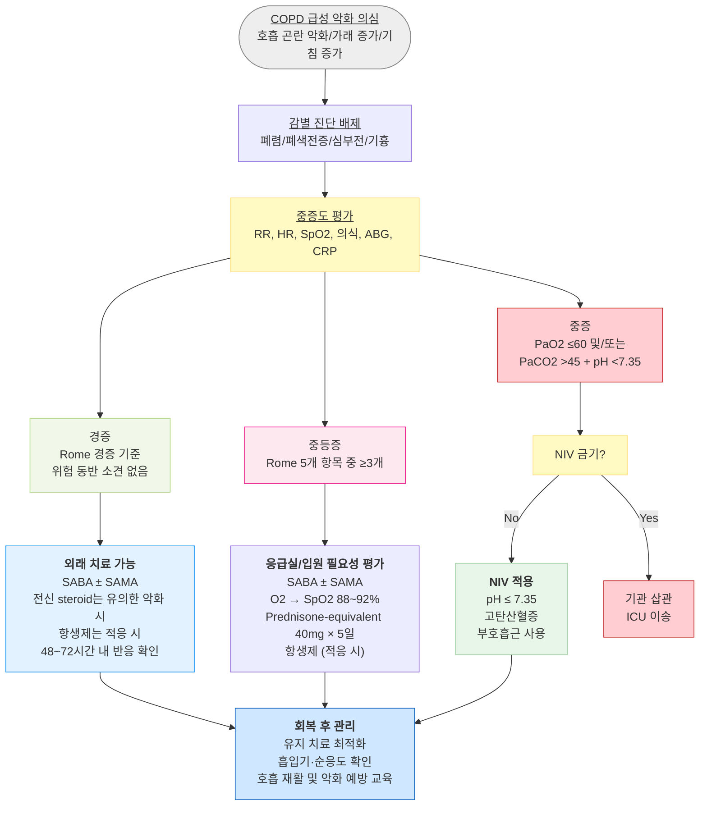

# 만성 폐쇄성 폐질환(COPD)

## <mark style="color:green;">일반 사항</mark>

* 지속적이고 종종 진행성인 기류 장애를 일으키는 기도의 이상\[기관지염, 세기관지염] &/or 폐포의 이상\[폐기종]에 기인하는 만성 호흡기 증상(호흡 곤란, 기침, 가래, 악화)을 특징으로 하는 이질적인(heterogeneous) 폐질환
* 기전 : \[원인] Smoking/pollutant, Host factor → \[pathobiology] Impaired lung growth, Accelerated decline, Lung injury, Lung & systemic inflammation → \[병리] Small airway disorder or abnormality, Emphysema, Systemic effect → \[결과] Airway limitation, Resp Sx.
* 유병률 : 국내 국민건강영양조사 자료(2017, 기관지확장제 사용 전 고정비 기준)에서 ≥40세 13.7%, ≥65세 남성 46.8%로 보고됨. 조사 연도, 대상 및 spirometry 정의에 따라 추정치가 달라지므로 수치 인용 시 정의와 연도를 함께 명시
* 흔히 다른 만성 질환 동반 : 심혈관 질환, 근골격 이상, 대사증후군, 골다공증, 우울, 불안, 폐암
* 흡입 약물은 증상과 악화를 줄이고 일부 고위험군에서 사망 위험 감소 가능성을 보이지만, 기류 폐쇄를 정상화하지는 못함. 금연, 예방접종, 신체 활동 및 호흡 재활을 함께 시행하는 것이 중요

### <mark style="color:orange;">Etiotype에 따른 분류</mark>

1. COPD-G (genetically determined) : alpha-1 antitrypsin deficiency(AATD); 기타 소효과 유전 변이의 복합 작용
2. COPD-D (abnormal lung development) : early life events (조산, 저체중 출산 등)
3. Environmental COPD
   1. COPD-C (cigarette smoking) : 흡연(간접 흡연, 태아 노출 포함), 전자 담배, 대마초
   2. COPD-P (biomass & pollution) : 가정 내 오염, 대기 오염, 산불 연기, 직업적 노출
4. COPD-I (infection) : 소아 감염, 결핵, 산모의 HIV 감염
5. COPD-A (COPD & asthma) : 특히 소아 천식 (☞ [천식 동반](072_-copd.md#asthma-overlap))
6. COPD-U (COPD of unknown cause)

## <mark style="color:green;">원인 및 위험 인자</mark>

* 흡연 (간접 흡연, 전자 담배 포함)
* 실내 공기 오염 : 요리·화학 연료 사용, 환기 부족
* 실외 공기 오염
* 직업적 노출 : 먼지, 화학 물질/증기
* 연령 증가
* 유전 : α-1 antitrypsin 결핍
* 낮은 사회 경제적 상태
* 천식, 기도 과민
* 만성 기관지염
* 소아기의 중증 호흡기 감염, 폐 성장 지연 요인

## <mark style="color:green;">임상 양상</mark>

※ dyspnea, activity limitation &/or cough with or without sputum, 급성 악화 가능

* 호흡 곤란 : 점차 악화, 활동 시 악화, 지속적; pursed-lip breathing(오므린 입술 호흡), 부호흡근 사용, 호흡음 감소, 쌕쌕거림
* 만성 기침 (초기에는 아침 기상 시 심함) ± 가래
* 과팽창 : 타진 시 폐 울림 증가, 흉부 전후 직경 증가(barrel chest, protruding abdomen), 횡격막 flattening
* 중심부 청색증(빈호흡, 빈맥 동반), 중심 정맥압 상승, 말초 부종 및 우측 심부전
  * 곤봉지는 단순 COPD의 전형적 소견이 아니므로 발견 시 폐암, 기관지확장증, 간질성폐질환 등 다른 원인을 조사
* 피로감, 체중 감소, 식욕 부진
* 하기도 감염 반복

### <mark style="color:$danger;">🚩 Red Flags!</mark>

<mark style="color:$danger;">**즉각 조치 또는 이송**</mark>

* 급성 호흡 부전 : SpO2가 평소보다 현저히 감소, 심한 빈호흡·호흡 노력 증가, 청색증 악화
* 의식 혼탁 또는 혼수
* 혈역학적 불안정(저혈압과 말초 관류 저하 등 쇼크 소견)

<mark style="color:$warning;">**당일 의뢰 또는 긴급 평가**</mark>

* 휴식 시 호흡 곤란의 급격한 악화 (중증 악화 의심)
* 새롭게 발생한 청색증, 말초 부종
* 초기 치료(SABA/SAMA)에 반응하지 않는 급성 악화
* 새롭게 발생한 심각한 동반 질환 (심부전, 부정맥)

<mark style="color:$info;">**외래 추적 / 추가 평가 계획**</mark> <mark style="color:$info;">- 즉각 위험 낮으나 호전 없으면 의뢰</mark>

* 폐 기능 검사상 중증(GOLD 3–4) 또는 급격한 FEV1 감소
* 중등도 또는 중증 악화 발생, 특히 1년 2회 이상으로 증가
* 체중 감소, 삶의 질 현저히 저하
* 가정 내 지원 불충분

## <mark style="color:green;">진단</mark>

* 특징적 증상 및 반복되는 하기도 감염 병력 &/or 위험 인자 노출 경력 시 의심
* 적절한 증상 또는 위험 인자 노출의 임상 맥락에서 기관지확장제 사용 후 spirometry FEV1/FVC ＜0.7이면 COPD 진단. 기관지확장제 사용 전 ＜0.7이나 사용 후 ≥0.7이면 향후 COPD 발생 위험이 증가하므로 추적 관찰
  * 고정비 ＜0.7은 고령자에서 과진단, 젊은 성인에서 과소진단할 수 있음. 젊은 환자 또는 경계치에서는 반복검사와 LLN/z-score를 함께 고려
  * 기관지확장제 반응성의 크기는 시간에 따라 변하며 천식과 COPD를 확실히 구분하거나 장기 치료 반응을 예측하지 못함
* 초기 평가 항목 : 기류 폐쇄 정도, 증상 양상/불편 정도, 악화 병력, 혈중 호산구 수, 동반 질환
* 초치료 후 증상이 지속되면 폐 용적, 확산능, 운동 검사, 폐 영상 검사 등 추가 고려


**COPD 선별 검사** : COPD 고위험군(α-1-antitrypsin 결핍, 직업적 toxin 노출 등)을 제외한 무증상 성인에 대한 COPD 선별 검사는 시행하지 않을 것을 권고 \[USPSTF 2022]



**PRISm (Preserved Ratio Impaired Spirometry)** : FEV1/FVC ≥0.7이나 FEV1이 감소된 상태. COPD 진단 기준에는 미치지 않으나 향후 COPD 발생 위험, 심혈관 위험 및 사망률 증가와 관련이 있어 원인 평가와 추적 관찰이 필요함 \[GOLD 2026]


### <mark style="color:orange;">검사</mark>

* spirometry (FEV1, FVC) : 가장 유용한 진단 도구
* 최대 호기 유속 : 민감도는 높으나 특이도가 낮아 단독으로는 진단에 적용할 수 없음
* 혈중 호산구 : ICS 사용 시 향후 악화 예방 효과의 가능성을 예측하는 biomarker (단순 증상 개선보다는 악화 빈도 감소에 초점); 단독으로 ICS 사용 여부를 결정하지 않으며, 악화 병력과 함께 해석해야 함

<table><thead><tr><th width="176.4705810546875">혈중 호산구 (cells/μL)</th><th width="194.11767578125">ICS 악화 예방 효과 가능성</th><th>임상적 의미</th></tr></thead><tbody><tr><td>＜100</td><td>낮음</td><td>ICS 추가 효과가 거의 없을 가능성; 세균 감염·폐렴 위험 인자도 함께 평가</td></tr><tr><td>100–299</td><td>연속적으로 증가</td><td>LABA+LAMA 치료 중 악화가 발생하면 ICS 추가 고려</td></tr><tr><td>≥300</td><td>가장 높음</td><td>Group E 초치료로 triple therapy 고려; ICS 중단 시 악화 위험 증가</td></tr></tbody></table>

* 산소화 및 환기 : pulse oximetry(SpO2); SpO2 ≤92%이거나 호흡 부전·우심부전이 의심되면 ABG(PaO2, PaCO2, pH) 고려. 야간 저산소증이 의심되는 경우 수면 중 평가
* 흉부 X선 : hyperinflation, vascular marking 감소/bullae (emphysema), thickened bronchial marking (chronic bronchitis); 특이적이지 않음, 다른 질환 감별에 이용
* chest CT : 빈번한 악화 또는 폐기능 검사 중증도와 불일치하는 증상 감별, 폐 용적 제한술 대상 평가 (FEV1 15\~45%, 과팽창 증거)
* 저선량 흉부 CT (LDCT, 폐암 선별) : 국내 국가폐암검진은 해당 연도 기준을 확인(일반적으로 만 54\~74세, 30갑년 이상 고위험군, 2년 주기). 미국 USPSTF는 50\~80세, ≥20갑년이면서 현재 흡연 또는 금연 후 15년 이내인 사람에게 매년 권고 \[USPSTF 2021]. COPD 자체만으로 선별검사 대상이 되는 것은 아님

<table><thead><tr><th width="210">CT phenotype</th><th width="230">주요 특징</th><th>임상적 시사점</th></tr></thead><tbody><tr><td>Emphysema-predominant</td><td>저밀도 영역 증가, 혈관 감소</td><td>저체중, DLCO 감소; 적합한 선택 환자에서 LVRS/BLVR 평가</td></tr><tr><td>Airway-predominant</td><td>기관지벽 비후, 점액 저류</td><td>임상적 만성 기관지염 및 악화 병력 평가; CT 소견만으로 roflumilast 적응이 되지는 않음</td></tr><tr><td>Mixed / normal CT</td><td>두 유형 혼재 또는 경미한 변화</td><td>spirometry 중증도와 증상 불일치 시 다른 원인도 평가</td></tr></tbody></table>

* DLCO (폐확산능) : 증상과 spirometry 중증도가 불일치할 때 폐기종 정도를 정량화하는 유용한 도구; DLCO 감소 ↔ 폐기종 우세형 및 폐 용적 감소술 적응 평가에 활용
* α-1 antitrypsin 결핍 선별 검사 : 모든 COPD 환자에게 일생에 최소 1회 시행 권고 \[GOLD 2026]; 특히 젊은 나이 발병, 비흡연자, 하부 폐 우세형 폐기종인 경우 중요
* 6분 보행 검사 (6MWT) : 기능 장애·예후 평가와 호흡 재활 반응 추적에 활용. 연령·성별·신장·검사 코스·산소 사용의 영향을 받으므로 단일 절대 절단값보다 기준 예측치와 환자 내 변화를 함께 해석
* CBC : 악화 시 WBC↑(neutrophilia), 만성 저산소증 시 RBC↑
* 가래 염색/배양 검사 : 세균 감염 감별 및 항생제 반응 불량 시 대비하여 고려

### <mark style="color:orange;">환자 평가</mark>

#### <mark style="color:$primary;">ABE Assessment Tool</mark>

COPD 진단 후 환자 증상(mMRC ≥2 또는 CAAT/CAT ≥10)과 지난 1년의 중등도·중증 악화 병력으로 분류하여 초기 약물 치료를 결정. FEV1에 따른 GOLD grade는 별도로 평가하며 ABE 분류에 포함하지 않음


GOLD 2023부터 Group C와 D가 통합되어 **Group E**(Exacerbation risk)로 개편됨. 악화 위험이 높은 군에서는 증상 수준에 관계없이 적극적 치료가 권장됨.

* **Group A** : 호흡 곤란 낮음(mMRC 0–1, CAAT/CAT ＜10) + 악화 없음(0회/년) → 기관지 확장제(단·장시간 무관; 이용 가능하고 부담 가능하다면 장시간 제제 선호, 매우 간헐적 호흡 곤란은 예외)
* **Group B** : 호흡 곤란 높음(mMRC ≥2 또는 CAAT/CAT ≥10) + 악화 없음(0회/년) → **LABA+LAMA**로 바로 시작(단일제보다 우수함이 RCT로 확인됨); 병용이 여의치 않으면 LAMA 또는 LABA 단독(계열 간 우열 근거 없음)
* **Group E** : **중등도 또는 중증 악화 1회 이상**/년(입원 여부·증상 정도 무관) → LABA+LAMA; eos ≥300이면 LABA+LAMA+ICS 우선 고려



**GOLD 2026 주요 개정** : Group E 기준이 기존의 "중등도 악화 ≥2회 또는 입원이 필요한 중증 악화 ≥1회"에서 **"중등도 또는 중증 악화 ≥1회"**로 완화됨. Group B의 LABA+LAMA 초치료 권고는 이전 GOLD부터 유지되는 원칙이며, 모든 환자에게 즉각적 증상 완화를 위한 속효성 기관지확장제를 함께 처방


#### <mark style="color:$primary;">기류 폐쇄 중증도 (GOLD Grade)</mark>

<table><thead><tr><th width="160">GOLD 단계</th><th width="210">중증도</th><th>기관지확장제 사용 후 FEV₁ 기준</th></tr></thead><tbody><tr><td>GOLD 1</td><td>Mild (경증)</td><td>FEV₁ ≥80% 예측치</td></tr><tr><td>GOLD 2</td><td>Moderate (중등도)</td><td>50% ≤ FEV₁ ＜80% 예측치</td></tr><tr><td>GOLD 3</td><td>Severe (중증)</td><td>30% ≤ FEV₁ ＜50% 예측치</td></tr><tr><td>GOLD 4</td><td>Very severe (매우 중증)</td><td>FEV₁ ＜30% 예측치</td></tr></tbody></table>


GOLD grade는 기류 폐쇄 정도와 예후 평가에 사용하며 약물 치료를 직접 결정하지 않음. 약물 치료는 증상, 악화 병력, 혈중 호산구 및 천식 동반 여부에 따라 결정


#### <mark style="color:$primary;">mMRC (modified Medical Research Council) Dyspnea Scale</mark>

* Grade 0 : 힘든 운동을 할 때만 숨참
* Grade 1 : 평지를 빨리 걷거나 약간의 오르막길을 걸을 때 숨참
* Grade 2 : 평지를 걸을 때 숨이 차서 동년배보다 천천히 걷거나, 자기 속도로 걸어도 멈추어 쉬어야 함
* Grade 3 : 평지를 약 100 m 또는 몇 분 걸으면 숨이 차서 멈추어야 함
* Grade 4 : 숨이 너무 차서 집을 나설 수 없거나 옷을 입고 벗을 때도 숨참

#### <mark style="color:$primary;">CAAT/CAT</mark>

* CAT(COPD Assessment Test)은 다른 만성 기도질환에도 적용할 수 있도록 CAAT(Chronic Airways Assessment Test)으로 명칭이 확대됨. 두 도구의 문항·점수는 동일하고 상호 교환 가능
* 환자의 건강 상태 영향을 평가하는 포괄적 도구(8개 항목, 각 0\~5점, 총점 0\~40점)
* 총점 : ≤9점 = 경미한 영향; 10\~20점 = 중간;  21\~30점 = 심함; ≥31점 = 매우 심함

<table><thead><tr><th width="118.82354736328125">항목</th><th width="254.11767578125">0점 상태</th><th width="80">배점</th><th>5점 상태</th></tr></thead><tbody><tr><td>기침</td><td>전혀 기침을 하지 않는다</td><td>0~5</td><td>항상 기침을 한다</td></tr><tr><td>가래</td><td>가슴에 가래가 전혀 없다</td><td>0~5</td><td>가슴에 가래가 가득 차 있다</td></tr><tr><td>가슴 답답함</td><td>가슴 답답함을 전혀 느끼지 않는다</td><td>0~5</td><td>매우 가슴 답답함을 느낀다</td></tr><tr><td>숨참</td><td>언덕이나 계단 1층을 오를 때 전혀 숨이 차지 않는다</td><td>0~5</td><td>언덕이나 계단 1층을 오를 때 매우 숨이 차다</td></tr><tr><td>집안 활동</td><td>집에서 활동하는데 전혀 제약을 받지 않는다</td><td>0~5</td><td>집에서 활동하는데 매우 제약을 받는다</td></tr><tr><td>외출 자신감</td><td>폐 상태에도 불구하고 외출하는데 자신이 있다</td><td>0~5</td><td>폐 문제로 외출하는데 자신이 없다</td></tr><tr><td>수면</td><td>잠을 잘 잔다</td><td>0~5</td><td>폐 문제로 잠을 잘 자지 못한다</td></tr><tr><td>기운</td><td>기운이 왕성하다</td><td>0~5</td><td>기운이 전혀 없다</td></tr></tbody></table>

### <mark style="color:orange;">감별</mark>

<table><thead><tr><th width="139.4117431640625">질환</th><th width="203.529296875">특징적 소견</th><th width="200.588134765625">COPD와의 감별점</th><th>주요 검사</th></tr></thead><tbody><tr><td><strong>COPD</strong></td><td>대개 성인기에 시작, 서서히 진행</td><td>흡연·대기오염·직업 노출 등이 흔하나 비흡연 COPD도 가능</td><td>post-BD FEV1/FVC ＜0.7</td></tr><tr><td><strong>천식</strong></td><td>연령 무관; 야간/새벽 악화와 증상 변동성</td><td>알레르기 병력과 변동성 기류 제한이 흔하나, 기관지확장제 반응성만으로 COPD와 구분할 수 없음</td><td>반복 spirometry/PEF 변동성, 기관지 유발 검사, FeNO 등 임상 맥락에 따라</td></tr><tr><td><strong>울혈성 심부전</strong></td><td>기좌호흡, 발작성 야간 호흡곤란</td><td>부종·울혈 소견; COPD와 동반 가능</td><td>흉부 X선, BNP/NT-proBNP, 심초음파</td></tr><tr><td><strong>기관지확장증</strong></td><td>만성 화농성 가래, 반복 감염</td><td>영상상 기관지 확장/기관지벽 비후</td><td>흉부 고해상 CT</td></tr><tr><td><strong>결핵</strong></td><td>체중 감소, 발열·야간 발한, 노출력</td><td>영상상 침윤·공동 등; 결핵 후 기류 폐쇄도 가능</td><td>AFB 도말/배양·핵산증폭검사, 영상</td></tr><tr><td><strong>폐쇄세기관지염</strong></td><td>비흡연자, RA/이식·독성 노출 병력</td><td>호기 CT상 air trapping</td><td>흡기·호기 고해상 CT</td></tr></tbody></table>

#### <mark style="color:$primary;">COPD vs 천식 vs 심부전 핵심 감별</mark>

<table><thead><tr><th></th><th>COPD</th><th>천식</th><th>심부전</th></tr></thead><tbody><tr><td>호흡곤란 양상</td><td>대개 활동 시, 지속적·진행성</td><td>발작적·변동성, 야간/새벽 악화 가능</td><td>기좌호흡, 발작성 야간 호흡곤란</td></tr><tr><td>흡연·유해 노출력</td><td>흔하나 필수는 아님</td><td>없을 수 있음</td><td>진단과 직접 관계없음</td></tr><tr><td>알레르기/비염</td><td>동반 가능</td><td>흔함</td><td>감별에 직접적이지 않음</td></tr><tr><td>흉부 X선</td><td>과팽창 가능, 정상일 수도 있음</td><td>대개 정상</td><td>심장 비대, 폐울혈·폐부종</td></tr><tr><td>기류 제한</td><td>post-BD FEV1/FVC ＜0.7</td><td>변동성 기류 제한; 지속성 폐쇄도 가능</td><td>대개 폐쇄성 기류 제한 없음</td></tr><tr><td>BNP/NT-proBNP</td><td>심장질환·우심부전 동반 시 상승 가능</td><td>대개 정상</td><td>상승 가능</td></tr></tbody></table>

### <mark style="color:orange;">천식 동반</mark> <a href="#asthma-overlap" id="asthma-overlap"></a>


**GOLD 2026 용어 변경** : "천식-COPD 중복(Asthma-COPD Overlap)"이라는 용어를 더 이상 사용하지 않음. 천식과 COPD는 병태생리가 다른 별개의 질환이나(단, 호산구 증가·부분적 가역성 등 일부 treatable trait를 공유할 수 있음), 한 환자에서 두 질환이 공존할 수 있다는 개념으로 재정의됨


다음 소견이 있으면 천식 동반 가능성을 고려함:

* 어린 시절 천식 또는 알레르기 병력
* 증상의 현저한 변동성 (특히 야간·새벽 악화)
* 기관지확장제 후 FEV1의 현저한 증가(예: ≥400 mL)는 천식을 시사할 수 있으나 단독 확진 기준은 아님
* 혈중 또는 객담 내 호산구 증가, 혈청 IgE 상승


천식 동반이 의심되면 약물 치료는 우선적으로 **천식 진료 지침을 따름**; 이 경우 ICS 병용은 필수이며 LABA 단독 치료는 피함 \[GOLD 2026]


#### <mark style="color:$primary;">COPD Management Cycle</mark>

1. Diagnosis : 증상, 위험 인자, spirometry (경계치 시 재검)
2. Initial Assessment : ABE 평가(증상, 지난 1년 악화 병력), 별도의 GOLD spirometry grade, 혈중 호산구 수치, α1-antitrypsin, 동반 질환
3. Initial Management : 금연, 예방접종, 활동적 생활 습관 및 운동, 초기 약물 치료, 자가 관리 교육, 동반 질환 관리
4. Review : 증상(CAT or mMRC), 악화, 흡연 상태, 다른 위험 인자 노출, 흡입제 사용법 및 순응도, 육체적 활동 및 운동, 폐 재활 치료 필요성, 자가 관리 기술, 산소, NIV, 폐용적 감소 등, 예방접종, 동반 질환 관리, Spirometry (최소 매년)
5. Adjust : 약물 치료, 비-약물 치료

***

## <mark style="background-color:$warning;">Management</mark>

* 동반 질환 관리
* 비-약물 치료 : 금연, 적절한 영양 및 수분 공급, 활동적 생활 및 운동, 적정 체중 유지, 백신 접종 (인플루엔자, 폐렴구균, Tdap, 대상포진, COVID-19), 호흡 재활 치료 (Group B, E)
* 약물 치료 : 기본 치료제 - 흡입 기관지 확장제
* 저산소혈증 시 산소치료 적응증 평가. 급성 악화에서는 고탄산혈증 위험을 고려하여 일반적으로 목표 SpO2 88\~92%로 조절하고, 안정기 장기산소치료는 별도 기준에 따라 처방
* 폐쇄수면무호흡 동반 시 지속양압(CPAP) 치료
* 자가 관리 교육 : 위험 인자 관리, 흡입제 사용 교육, 급성 악화 시 대응 요령

**약물 치료 단계적 접근 (Escalation Ladder)**

* **초치료(Initial)** : Group A - 기관지 확장제(단·장시간; 장시간 선호) / Group B - **LABA+LAMA** 병용 시작(병용 곤란 시 LAMA 또는 LABA 단독) / Group E - LABA+LAMA(eos ≥300이면 LABA+LAMA+ICS 우선 고려)\
  → 모든 군에 rescue SABA 병용 처방
* **추적(Follow-up)** - 지속되는 문제(호흡 곤란 or 악화)에 따라 경로 분리:
  * 호흡 곤란 지속 : LABA 또는 LAMA(단독 사용 중이었다면) → LABA+LAMA → 흡입기 성분/기종 교체, 비약물 치료 강화, ensifentrine 추가 고려(국내 미도입), 호흡 곤란의 다른 원인 조사
  * 악화 지속 : LABA 또는 LAMA → (eos ＜300) LABA+LAMA 또는 (eos ≥300) LABA+LAMA+ICS → 여전히 악화 시 Roflumilast(FEV1＜50%+만성 기관지염+이전 중증 악화/입원력) / Azithromycin(비흡연자 우선) / 생물학적제제(중등도 ≥2회 또는 중증 ≥1회 악화 + eos ≥300 시 Dupilumab\[만성 기관지염 동반] 또는 Mepolizumab)\
  → NIV, 장기 O2, LVRS/BLVR, 폐 이식 (말기)

## <mark style="color:green;">비-약물 치료 및 예방</mark>

### <mark style="color:orange;">금연</mark>

* COPD 진행을 늦추는 가장 효과적인 단일 중재; 모든 단계에서 적극 권고
* 약물 보조 : varenicline, bupropion, nicotine replacement therapy (NRT)
* (☞ [금연](../part1/smoking-cessation.md))

### <mark style="color:orange;">예방접종</mark>

* 인플루엔자 : 매년 접종. 고령자에서는 국내 접종 지침과 가용성에 따라 고용량 또는 면역증강 불활화 백신을 고려
* 폐렴구균 : 연령, 과거 접종력 및 국내 지침에 따라 PCV20 단독 또는 PCV15 이후 PPSV23 등 적용; 최신 국내 허가·접종 기준 확인
* **RSV** : GOLD 2026이 참조하는 기준에서는 75세 이상 성인과, COPD 등 중증 RSV 위험 인자가 있는 50\~74세 성인에게 1회 접종 권고. 매년 접종하는 백신이 아니며 국내에서는 제품별 허가 연령과 최신 예방접종 지침을 우선 적용(예방접종 챕터 참고)
* COVID-19, Tdap, 대상포진 : 표준 일정에 따라

### <mark style="color:orange;">호흡 재활 치료</mark>

* 대상 : 주로 Group B, E; 중등도\~중증 COPD에서 호흡 곤란, 운동 능력, 삶의 질 유의하게 개선
* 구성 : 운동 훈련, 호흡 근육 훈련, 교육, 영양 상담
* 입원 악화 후 4주 이내 조기 시작하면 삶의 질과 운동 능력을 개선하며 재입원 및 사망을 줄일 가능성이 있으나, 후자의 근거는 연구 간 이질성이 있음

### <mark style="color:orange;">장기 산소 치료</mark>

* 적응증 : 안정 상태에서 PaO2 ≤55 ㎜Hg 또는 SaO2 ≤88%(가능하면 3주 간격으로 2회 확인); 또는 PaO2 55\~60 ㎜Hg 또는 SaO2 88%이면서 폐고혈압, 말초 부종을 동반한 우심부전, 또는 적혈구증가증(Hct ＞55%)이 있는 경우
* 하루 **≥15시간** 사용 시 생존율 향상
* 산소 유량은 휴식·수면·활동 시 필요량에 맞춰 개별 처방하고, 시작 후 60\~90일에 실내공기 ABG 또는 산소포화도로 적응증과 처방 유량을 재평가
* 비-침습 양압 환기(NIV) : 최근 입원 후에도 현저한 주간 고탄산혈증이 지속되는 등 선택된 중증 COPD 환자에서 전문의 평가 후 고려. 환자 선정과 적절한 환기압 설정이 중요

### <mark style="color:orange;">Frailty 및 Sarcopenia 관리</mark>

* 고령 COPD 환자에서 frailty와 sarcopenia는 재입원율, 사망률, 운동 불내성과 강하게 연관됨
* 평가 : 악력 측정, 보행 속도, SARC-F 설문 등으로 근감소증 선별
* 중재 : 영양 보충(단백질 충분 섭취), 저항 운동 + 유산소 운동 병행, 호흡 재활과 통합

### <mark style="color:orange;">기타 비-약물 치료</mark>

* 영양 : 충분한 단백질 섭취와 근감소증 예방이 최우선; 저체중 환자에서 전반적 영양 보충 권고. 고지방/저탄수화물 식이는 CO2 생성 감소 이론적 근거가 있으나 임상 실용성은 제한적임
* 수면 : 충분한 수면, 폐쇄수면무호흡 동반 시 CPAP
* 폐 용적 감소 수술(LVRS) / 기관지경 폐 용적 감소술(BLVR) : 이형성 폐기종, 심한 과팽창에서 선택적으로 고려
* 폐 이식 : 말기 COPD (BODE index 7\~10)에서 고려; 5년 생존율 약 50% 수준

## <mark style="color:green;">약물 치료</mark>

### <mark style="color:orange;">기관지 확장제</mark>

* 대부분의 COPD 환자에서 1차 선택제
* 흡입 기관지 확장제 : 증상 치료의 중심; 증상 예방 및 완화를 위하여 규칙적으로 투여
* 간헐적 호흡 곤란만 있는 환자를 제외하고는 속효성 제제보다 지속성 제제를 선호
* SABA, SAMA : 규칙적 &/or 필요시 사용; FEV1 및 증상 완화 효과
  * 응급 약제로는 SABA를 선택 (☞ [보험기준](https://www.hira.or.kr/rc/insu/insuadtcrtr/InsuAdtCrtrPopup.do?mtgHmeDd=20220301\&sno=6\&mtgMtrRegSno=0006))
  * SABA & SAMA 병용 시 각각의 단독 사용보다 효과적
* LABA, LAMA : 폐 기능, 호흡 곤란, 건강 상태 개선 및 악화 빈도 감소에 유효
  * 단일제 간 비교에서는 LAMA가 LABA보다 악화 감소에 유리한 근거가 있으나, Group B와 E의 권고 초치료는 LABA+LAMA 병용
  * LABA & LAMA 각각의 단독 사용보다 병용 시 효과적
* tiotropium : 운동 기능 향상에 유효
* theophylline : 기관지 확장 효과는 제한적이며 독성 위험 때문에 routine use는 권고되지 않음; 다른 모든 제제를 사용하기 어렵거나 효과가 없는 경우에 한하여 마지막 수단으로 고려

#### <mark style="color:$primary;">흡입기 기종별 선택 원칙</mark>

<table><thead><tr><th width="110">기종</th><th width="200">특징</th><th width="180">적합 대상</th><th>주의사항</th></tr></thead><tbody><tr><td>DPI</td><td>흡입으로 약물이 방출되어 분무-흡입 동조 불필요</td><td>충분히 빠르고 강하게 흡입 가능한 환자</td><td>중증 악화 중이거나 흡입 유속이 낮은 쇠약 고령자에서 불리</td></tr><tr><td>pMDI</td><td>가압 용기; 분무-흡입 동조 필요</td><td>동조 가능한 환자</td><td>동조가 어려우면 spacer 병용; 흔들기 여부는 제품별 사용법 확인</td></tr><tr><td>SMI</td><td>낮은 속도로 비교적 오래 분무</td><td>흡입 유속이 낮거나 pMDI 동조가 어려운 환자</td><td>제품별 초기 장전·카트리지 교체·세척법 교육</td></tr><tr><td>네뷸라이저</td><td>분무-흡입 동조 불필요</td><td>중증 악화 또는 휴대 흡입기 사용이 어려운 환자</td><td>기기 세척·오염 방지; 유지치료 시 편의성·비용 고려</td></tr></tbody></table>


흡입기 기종 변경 시에는 반드시 새 기종의 사용법을 재교육하고, 다음 방문에서 사용 상태를 확인. 잘못된 흡입 기술은 치료 실패의 가장 흔한 원인임


#### <mark style="color:$primary;">β2-작용제</mark>

* 임상 증상은 호전시키나 폐 기능 악화 지연 또는 사망률 감소 효과는 입증 안 됨
* 부작용 : 빈맥, 떨림, 저칼륨혈증
* 흡입 SABA : fenoterol <mark style="color:blue;">\[베로텍]</mark>, salbutamol <mark style="color:blue;">\[벤토린 에보할러]</mark>
* 흡입 LABA : \[bid] formoterol, salmeterol; \[qd] indacaterol, olodaterol, vilanterol. 국내 경구 β2-작용제 제품(예: 아토크, 베타투)을 흡입제와 혼동하지 않도록 제형을 확인

<table><thead><tr><th width="86.47064208984375">분류</th><th width="280">성분명 [상품명]</th><th width="216.4705810546875">흡입제 용량</th><th width="128.58831787109375">작용 시간(hr)</th></tr></thead><tbody><tr><td>SABA</td><td>salbutamol <mark style="color:blue;">[벤토린 에보할러]</mark></td><td>100 μg/puff 1~2 puffs prn</td><td>4–6</td></tr><tr><td>LABA</td><td>salmeterol</td><td>25 μg/puff bid</td><td>12</td></tr><tr><td></td><td>indacaterol <mark style="color:blue;">[온브리즈 흡입용캡슐]</mark></td><td>150 or 300 μg/C qd</td><td>24</td></tr></tbody></table>

#### <mark style="color:$primary;">항콜린제(Antimuscarinics)</mark>

* 호흡기 평활근의 M3 muscarine 수용체에서 acetylcholine의 기관지 수축 작용 차단
* 악화 감소에 있어 LAMA가 LABA보다 유효
* 부작용 : 입마름
* SAMA : ipratropium, oxitropium
* LAMA : aclidinium, glycopyrronium, tiotropium, umeclidinium

<table><thead><tr><th width="92.941162109375">분류</th><th width="282.3529052734375">성분명 [상품명]</th><th width="132.941162109375">흡입제 용량</th><th width="139.4117431640625">네뷸라이저 용액</th><th>작용 시간(hr)</th></tr></thead><tbody><tr><td>SAMA</td><td>ipratropium <mark style="color:blue;">[아트로벤트]</mark></td><td>-</td><td>250 μg/mL, <br>1~2 mL/A</td><td>6–8</td></tr><tr><td>LAMA</td><td>aclidinium <mark style="color:blue;">[에클리라 제뉴에어]</mark></td><td>400 μg bid</td><td>-</td><td>12</td></tr><tr><td></td><td>glycopyrronium <mark style="color:blue;">[씨브리 흡입용캡슐]</mark></td><td>50 μg 1C qd</td><td>-</td><td>24</td></tr><tr><td></td><td>tiotropium <mark style="color:blue;">[스피리바 흡입용캡슐]</mark></td><td>18 μg 1C qd</td><td>-</td><td>24</td></tr><tr><td></td><td>umeclidinium <mark style="color:blue;">[인크루즈 엘립타]</mark></td><td>62.5 μg qd</td><td>-</td><td>24</td></tr></tbody></table>

#### <mark style="color:$primary;">LAMA+LABA 흡입 복합제</mark>

* COPD 단독 환자의 일반적인 초치료에서는 LAMA+LABA가 ICS+LABA보다 선호되며 폐렴 위험도 낮음. 단, ICS의 악화 예방 효과는 악화 병력과 혈중 호산구 수에 따라 달라짐

<table><thead><tr><th width="384.11767578125">성분명 [상품명]</th><th width="180">흡입제 용량</th><th width="125.058837890625">작용 시간(hr)</th></tr></thead><tbody><tr><td>formoterol / aclidinium <mark style="color:blue;">[듀어클리어 제뉴에어]</mark></td><td>12/400 μg 1 puff bid</td><td>12</td></tr><tr><td>indacaterol / glycopyrronium <mark style="color:blue;">[조터나 흡입용캡슐]</mark></td><td>110/50 μg 1C qd</td><td>24</td></tr><tr><td>olodaterol / tiotropium <mark style="color:blue;">[바헬바 레스피맷]</mark></td><td>2.5/2.5 μg/puff, 2 puffs qd(총 5/5 μg)</td><td>24</td></tr><tr><td>vilanterol / umeclidinium <mark style="color:blue;">[아노로 엘립타]</mark></td><td>25/62.5 μg 1 puff qd</td><td>24</td></tr></tbody></table>

#### <mark style="color:$primary;">Methylxanthine</mark>

* stable COPD에서 기관지 확장 효과는 제한적이며 독성 위험 때문에 routine use는 권고되지 않음
* 부작용 : 용량에 따른 독성(유효 농도와 독성 농도의 차이가 적음); 구역, 구토, 설사, 불면, 흥분, 떨림, 두통, 부정맥, 발작
* 적용 : 다른 모든 제제를 사용하기 어렵거나 효과가 없는 경우에 한하여 마지막 수단으로 선택
* theophylline은 다른 흡입치료를 사용할 수 없는 예외적 상황에서만 고려하며 저용량으로 시작 <mark style="color:blue;">\[테올란 비]</mark>
  * 고령, 간기능 저하, 심부전, 발열성 질환 및 약물 상호작용 시 청소율 감소에 주의. 성인 신기능 저하만으로 일률적인 감량이 필요한 것은 아님
  * 혈중 농도는 기관·검사실 기준과 임상상을 함께 해석하며, 시작·용량 변경·독성 의심·흡연 상태 또는 상호작용 약물 변화 시 측정

### <mark style="color:orange;">Steroid</mark>

#### <mark style="color:$primary;">흡입 Steroid (ICS)</mark>


**COPD에서 ICS의 위상** : ICS+LABA 단독 조합은 COPD 단독 환자에서 LABA+LAMA에 비해 우선 권고되지 않음. ICS는 적응증이 있는 환자에서 Triple therapy(LABA+LAMA+ICS) 형태로 사용하는 것이 원칙이며, ICS+LABA 조합은 천식 동반 환자 또는 기존 ICS+LABA로 안정 유지 중인 환자에서만 지속 가능


* Group E 초치료 : blood eosinophil ≥300 cells/μL이면 LABA+LAMA+ICS를 고려(직접적인 초치료 RCT 근거보다는 기존 치료 환자 자료에 근거한 실용적 권고)
* LABA+LAMA 치료 중 중등도 또는 중증 악화 발생 : eosinophil ≥100 cells/μL이면 LABA+LAMA+ICS로 escalation 권고. 효과는 연속적으로 증가하며 ≥300에서 가장 클 가능성
* ICS 사용에 불리한 요인 : 반복 또는 중증 폐렴, eosinophil ＜100 cells/μL, 이전 mycobacterial 감염 등. 절대 금기라기보다 기대 이득과 위험을 비교하되, 천식 동반 시 ICS 포함 치료가 필수
* ICS는 COPD에서 단독 유지치료로 사용하지 않으며, 규칙적 사용 시 폐렴 위험이 증가할 수 있음
* ICS 중단(Withdrawal) 기준 : 다음에 해당하는 경우 ICS 중단을 고려할 수 있다.
  * ICS가 부적절하게 시작되었거나 임상 반응이 없었던 경우
  * 유의한 부작용 또는 중증·반복 폐렴이 발생한 경우
  * 단, eos ≥300인 환자에서 ICS를 중단하면 악화 위험이 증가할 수 있으므로 신중히 결정한다.

#### <mark style="color:$primary;">ICS+LABA 흡입 복합제</mark>

* 천식 동반 환자 또는 기존 ICS+LABA로 안정 유지 중인 환자에서 지속 가능; 신규 COPD 단독 환자에서는 LABA+LAMA를 우선 고려
* COPD 허가 함량과 천식 허가 함량이 다를 수 있으므로 제품별 국내 허가사항을 확인하고 임의로 흡입 횟수를 조절하지 않음

<table><thead><tr><th width="230">성분명</th><th width="330">국내 제품 및 COPD 허가 함량 예</th><th>용법</th></tr></thead><tbody><tr><td>fluticasone / salmeterol</td><td><mark style="color:blue;">[세레타이드 디스커스]</mark> 500/50 μg</td><td>1 puff bid</td></tr><tr><td>fluticasone / vilanterol</td><td><mark style="color:blue;">[렐바 엘립타]</mark> 100/25 μg</td><td>1 puff qd</td></tr><tr><td>budesonide / formoterol</td><td><mark style="color:blue;">[심비코트 터부할러]</mark> 160/4.5 μg</td><td>2 puffs bid</td></tr><tr><td>beclomethasone / formoterol</td><td><mark style="color:blue;">[포스터]</mark> 100/6 μg</td><td>제품별 허가사항 확인</td></tr></tbody></table>


위 표는 대표 예시이며 동일 성분이라도 제형·함량별 COPD 허가 여부가 다를 수 있음. 처방 전 최신 국내 허가사항과 급여기준 확인


#### <mark style="color:$primary;">LABA+LAMA+ICS (Triple Therapy)</mark>

* ICS 적응증이 있는 환자에서 현재 COPD 약물 치료의 최적 병용 요법 (보험 주의)
* ETHOS, IMPACT 연구에서 악화 고위험 환자의 LAMA+LABA 대비 triple therapy가 사망 위험 감소 가능성을 시사했으나, 환자 선택과 ICS 관련 폐렴 위험을 함께 고려

<table><thead><tr><th width="522.3529663085938">성분명 [상품명]</th><th>용법</th></tr></thead><tbody><tr><td>fluticasone / umeclidinium / vilanterol <mark style="color:blue;">[트렐리지 엘립타]</mark> ¹⁾</td><td>100/62.5/25 μg 1 puff qd</td></tr><tr><td>budesonide / formoterol / glycopyrrolate <mark style="color:blue;">[브리즈트리 에어로스피어]</mark></td><td>160/4.5/7.2 μg/puff, 2 puffs bid ²⁾</td></tr></tbody></table>

¹⁾트렐리지 엘립타 : 100/62.5/25 μg이 COPD 적응 용량; 200/62.5/25 μg은 천식 용량\
²⁾표기 함량은 1 puff 기준. 제품별 최신 국내 허가사항과 급여기준 확인. 에너제어 흡입용캡슐은 천식 허가 제품이므로 COPD 허가 triple therapy 표에서 제외

#### <mark style="color:$primary;">전신 Steroid</mark>

* 안정기 COPD에서 전신 스테로이드의 장기 유지치료는 권고하지 않음(근병증, 골다공증, 당뇨, 감염 등 위해)
* 임상적으로 유의한 급성 악화에서만 단기간 사용: prednisone-equivalent 40 ㎎/d ×5일 \[GOLD 2026]. 국내에서 흔히 사용하는 prednisolone 30 ㎎/d ×5일은 NICE 기준에 부합하며 5일 요법은 일반적으로 감량 없이 중단 가능

### <mark style="color:orange;">Phosphodiesterase-4 억제제 (PDE4i)</mark>

* cAMP의 대사 억제 → 세포 내 cAMP 농도↑ → 항염증 효과, eosinophil 이동 및 화학 주성 억제 → FEV1 개선, 악화 감소
* 적용 : 최적 흡입치료에도 악화가 지속되며 FEV1 ＜50%, 임상적 만성 기관지염 및 이전 중증 악화/입원력이 있는 환자에서 추가 고려
* 부작용 : 설사, 구역, 복통, 식욕 감퇴, 두통, 체중 감소
* roflumilast : 0.5 ㎎ qd <mark style="color:blue;">\[닥사스]</mark> (☞ [보험기준](https://www.hira.or.kr/rc/insu/insuadtcrtr/InsuAdtCrtrPopup.do?mtgHmeDd=20211101\&sno=4\&mtgMtrRegSno=0002))

### <mark style="color:orange;">항생제 (장기 예방 목적)</mark>

* azithromycin : 250 ㎎ qd 또는 500 ㎎ 주 3회 장기(1년) 투여 시 악화 감소; 내성균 증가와 청력 장애 위험 있음
* 현재 흡연자에서는 효과가 감소할 수 있어, 악화 빈도 높은 비흡연·금연자에서 선별적으로 고려; QTc 연장 주의

### <mark style="color:orange;">생물학적 제제 (Biologic Therapy)</mark> <a href="#biologic-therapy" id="biologic-therapy"></a>


**GOLD 2026 신설** : LABA+LAMA+ICS(triple therapy)로도 악화가 지속되는 Type 2 염증 표현형 COPD 환자에서 생물학적 제제를 추가 고려. 적용 대상 - 중등도 악화 ≥2회 또는 중증 악화 ≥1회/년 지속 + 혈중 호산구 ≥300 cells/μL


* **dupilumab** <mark style="color:blue;">\[듀피젠트]</mark> : IL-4/IL-13 수용체 공통 부위 차단; 만성 기관지염 동반 COPD(GOLD 2-3)에서 악화 감소·폐기능 개선·삶의 질 개선(52주) 확인; 2025년 3월 국내 COPD 적응증 허가(2026년 8월 기준 건강보험 급여 미적용 - 비급여)
* **mepolizumab** <mark style="color:blue;">\[누칼라]</mark> : 항 IL-5 단클론항체; 만성 기관지염 동반 여부와 무관하게(GOLD 2-4) 악화 및 응급실 방문·입원 감소 확인; 미국은 2025년 5월 COPD 적응증 승인, 국내 COPD 적응증은 처방 시 최신 허가사항 확인
* benralizumab(항 IL-5 수용체)은 COPD 악화 감소 효과가 RCT에서 확인되지 않아 권고하지 않음

### <mark style="color:orange;">Mucolytics</mark>

* 규칙적 사용이 일부 환자에서 악화를 줄여주지만 일반적이지 않음; 선별적으로 고려
* acetylcysteine : 200 ㎎ tid <mark style="color:blue;">\[뮤테란]</mark>
* carbocysteine : 375\~750 ㎎ tid <mark style="color:blue;">\[리나치올]</mark>
* erdosteine : 300 ㎎ bid <mark style="color:blue;">\[엘도스]</mark>

### <mark style="color:orange;">기타</mark>

* α-1 antitrypsin augmentation : 중증 AATD와 폐기종이 있는 선택 환자에서 전문의가 고려하며 국내 도입·허가·접근성 확인 필요
* 진해제 : 유효성에 대한 증거 없음; 권고 안 함
* 저용량 지속형 opioid, neuromuscular electrical stimulation, 얼굴에 향하는 선풍기 : 호흡 곤란 완화 효과

### <mark style="color:orange;">초기 약물 치료 (Initial Pharmacological Treatment)</mark>

<table><thead><tr><th width="120">GOLD Group</th><th width="220">기준(치료 나이브 환자)</th><th>초치료</th></tr></thead><tbody><tr><td>Group A</td><td>악화 0회/년 + mMRC 0–1 및 CAAT/CAT ＜10</td><td>기관지확장제(단·장시간 무관, 장시간 선호)</td></tr><tr><td>Group B</td><td>악화 0회/년 + mMRC ≥2 또는 CAAT/CAT ≥10</td><td><strong>LABA+LAMA</strong>(불가 시 LAMA 또는 LABA 단독)</td></tr><tr><td>Group E</td><td>중등도 또는 중증 악화 ≥1회/년</td><td>LABA+LAMA; eos ≥300이면 LABA+LAMA+ICS 우선 고려</td></tr></tbody></table>

<p align="center"><em><mark style="color:$info;">Ref. GOLD 2026, Fig 3.8</mark></em></p>

### <mark style="color:orange;">유지 약물 치료 조정 (Follow-up Pharmacological Treatment)</mark>

1. 초치료에 적절히 반응한다면, 그 치료를 유지
2. 그렇지 않다면
   * 순응도, 흡입기 사용 방법, 영향을 줄 수 있는 동반 질환 등 확인
   * 표적이 되는 주된 치료 특성을 고려 (dyspnea or exacerbations)\
     두 가지 모두 표적이 된다면 exacerbation pathway를 선택
   * 현재의 치료와 향후 적응증에 맞춰 치료를 조정
   * 반응 평가, 조정 및 재평가
   * 이 권고는 진단 시의 ABE assessment에 의존하지 않음

***


```mermaid
graph TD
%% DYSPNEA pathway
D0[DYSPNEA] --> D1[LABA or LAMA]
    D1 --> D2["LABA+LAMA¹⁾"]
    D2 --> D3["•흡입제 성분 or 장치 교체 고려<br/>•비약물 치료 시행 또는 강화<br/>•ensifentrine²⁾ 추가 고려<br/>•호흡 곤란의 다른 원인 조사 및 치료"]

%% EXACERBATION pathway (중등도 또는 중증 악화 ≥1회/년)
E0[EXACERBATION] --> E1[LABA or LAMA]

    E2 -- "if eos ≥100" --> E3
    E1 -- "if eos <300" --> E2["LABA+LAMA¹⁾"]
    E1 -- "if eos ≥300" --> E3["LABA+LAMA+ICS¹⁾"]    

    
    E2 -- "if eos < 100" --> E4{ }
    E3 --> E4
    
    E4 --> E5["<u>Roflumilast</u><br/>FEV₁ <50% + chronic bronchitis<br/>+ prior severe exacerbation"]
    E4 --> E6["<u>Azithromycin</u><br/>현재 비흡연자에서<br/>우선적으로"]
    E3 -- "중등도 ≥2회 or<br/>중증 ≥1회 악화<br/>AND eos ≥300"--> E7["<u>Biologic Therapy</u>³⁾<br/>Dupilumab (chronic bronchitis 동반 시)<br/>Mepolizumab"]

style D0 fill:#eeeeee,stroke:#888888,stroke-width:2px
style D1 fill:#fff,stroke:#ddd
style D2 fill:#e8f8e8,stroke:#4caf50
style E0 fill:#ffcdd2,stroke:#c62828,stroke-width:2px
style E1 fill:#fff,stroke:#ddd
style E2 fill:#e8f8e8,stroke:#4caf50
style E3 fill:#d5f5e3,stroke:#27ae60
style E4 fill:none,stroke:none
classDef sky fill:#e3f2ff,stroke:#2196f3
class E5,E6,E7 sky

linkStyle 6 stroke:green,stroke-width:2px;
```

eos = blood eosinophil count (cells/μL)\
¹⁾single inhaler 권고 　²⁾PDE3/4 억제제, 흡입 분무형; 미국에서만 유통(국내 미도입) 　³⁾dupilumab 2025.3 국내 COPD 적응증 허가(2026.8 기준 건강보험 급여 미적용); mepolizumab은 처방 시 국내 COPD 적응증 확인

<p align="center"><em><mark style="color:$info;">Ref. GOLD 2026, Fig 3.9</mark></em></p>

***

### <mark style="color:orange;">표현형 기반 치료 (Phenotype-driven Treatment)</mark>

***


```mermaid
flowchart TD
    A(["<u>COPD 진단</u><br/>증상 + 위험 인자 + post-BD FEV1/FVC &lt; 0.7"])

    A --> B["<b>주 표현형 평가¹⁾</b>"]

    B --> C1["① <b>Dyspnea-predominant</b><br/>운동 시 호흡 곤란 중심"]
    C1 --> D1["LABA+LAMA<br/>호흡 재활 + 운동 프로그램<br/>흡입기 기종 최적화"]

    B --> C2["② <b>Recent exacerbation / high risk</b><br/>중등도 또는 중증 악화 ≥1회/년"]
    C2 --> E2["Blood eosinophil"]
    E2 -->|"≥300"| F2["Triple therapy<br/>(LABA+LAMA+ICS)"]
    E2 -->|"100–299"| G2["LABA+LAMA<br/>ICS 추가 고려"]
    E2 -->|"&lt;100"| H2["LABA+LAMA<br/>ICS 추가 효과 제한"]

    B --> C3["③ <b>Chronic bronchitis phenotype</b><br/>만성 가래·기침 우세"]
    C3 --> D3["금연 + LABA/LAMA<br/>Roflumilast 고려<br/>(FEV₁&lt;50% + 이전 중증 악화)<br/>Mucolytics 고려"]

    B ---> C4["④ <b>Concomitant asthma</b><br/>천식이 함께 진단된 경우"]
    C4 --> D4["ICS 포함 치료 우선<br/>LABA 단독 금지"]

    B --> C5["⑤ <b>Frailty / Cachexia</b><br/>고령, 근감소증, 체중 감소"]
    C5 --> D5["영양 보충<br/>근력 + 유산소 운동<br/>다학제 접근"]

    B ---> Z["<b>모든 표현형 공통</b>"]
    Z --> Z1["금연 · 예방접종<br/>흡입기 교육 · 신체 활동<br/>동반 질환 관리"]

   classDef sky fill:#e3f2ff,stroke:#2196f3
   class D1,F2,D3,D4,D5,G2,H2,Z1 sky
style A fill:#eeeeee,stroke:#888888,stroke-width:2px
    style B fill:#fff3e0,stroke:#ffcc80
    style C1 fill:#f1f8e9,stroke:#aed581
    style C2 fill:#fce4ec,stroke:#f48fb1
    style C3 fill:#ede7f6,stroke:#b39ddb
    style C4 fill:#fff8e1,stroke:#ffe082
    style C5 fill:#f3e5f5,stroke:#ce93d8
    style E2 fill:#fff9c4,stroke:#ffe082
    style Z fill:#eceff1,stroke:#b0bec5
```

¹⁾**주 표현형 평가**:  Dyspnea burden(mMRC / CAT), Exacerbation 빈도, Blood eosinophil, Chronic bronchitis 여부, Emphysema/hyperinflation, Asthma feature, Frailty/cachexia

<p align="center"><strong>COPD 표현형 기반 치료 알고리듬</strong></p>

<p align="center"><em><mark style="color:$info;">Ref. GOLD 2026</mark></em></p>

***

## <mark style="color:green;">악화 관리 (Exacerbation)</mark>

### <mark style="color:orange;">정의 및 원인</mark>

* 정의 : ≤14일간의 호흡 곤란 &/or 기침 및 가래의 급성 악화로 추가 치료가 필요한 사건
* 원인 : 기도 감염(가장 흔함 - 바이러스·세균 혼합), 대기 오염, 순응도 저하

### <mark style="color:orange;">증상</mark>

호흡 곤란 악화, 기침 증가, 가래 양 증가, 가래 색 변화(화농성), 부호흡근 사용, paradoxical chest wall movement, 청색증 발생 또는 악화, 말초 부종, 정신 상태 악화

### <mark style="color:orange;">중증도 분류</mark>

* 경증 : dyspnea VAS ＜5, RR ＜24/분, HR ＜95/분, 실내공기 또는 평소 산소 처방에서 resting SpO2 ≥92%이면서 평소 대비 감소 ≤3%, CRP ＜10 ㎎/L
* 중등증 : 다음 5개 중 **최소 3개** — VAS ≥5, RR ≥24/분, HR ≥95/분, 실내공기 또는 평소 산소 처방에서 SpO2 ＜92% 또는 평소보다 ＞3% 감소, CRP ≥10 ㎎/L
* 중증 : 중등증 임상 기준에 더해 ABG에서 PaCO2 ＞45 ㎜Hg이면서 pH ＜7.35인 고탄산혈증성 호흡부전


Rome 중증도만으로 치료 장소를 자동 결정하지 않음. 기저 COPD 중증도, 동반 질환, 의식 상태, 치료 반응과 가정 내 지원을 함께 평가하여 외래·응급실·입원 여부 결정


### <mark style="color:orange;">입원 평가 대상</mark>

* 심각한 증상 : 휴식 시 호흡 곤란, SpO2 급감, 혼란, 졸음
* 급성 호흡 부전
* 새로운 신체 징후 : 청색증, 말초 부종
* 초기 치료에 반응 없음
* 심각한 합병증 : 심부전, 새롭게 발생한 부정맥
* 불충분한 가정 내 지원

### <mark style="color:orange;">감별 진단</mark>

<table><thead><tr><th width="190">감별 질환</th><th>감별 검사</th></tr></thead><tbody><tr><td>폐렴</td><td>흉부 X선, CBC, CRP</td></tr><tr><td>폐색전증</td><td>D-dimer, CT angiography; 병력(객혈, 수술, 골절, 암, DVT)</td></tr><tr><td>심부전</td><td>흉부 X선, Pro-BNP/BNP, 심초음파</td></tr><tr><td>기흉/흉수</td><td>흉부 X선, 흉부 초음파</td></tr><tr><td>심근경색/부정맥</td><td>ECG, troponin</td></tr></tbody></table>

### <mark style="color:orange;">치료</mark>

* **기관지 확장제** : SABA ± SAMA 투여를 가능한 한 빨리 시작; 안정되면 기존 또는 새로 최적화한 장시간 기관지확장제 유지치료를 가능한 한 빨리 재개
* **전신 steroid** : 임상적으로 유의한 중등도·중증 악화에서는 prednisone-equivalent 40 ㎎/d ×5일 \[GOLD 2026]. prednisolone 30 ㎎/d ×5일도 NICE 권고 용량 <mark style="color:blue;">\[소론도]</mark>
* **산소 공급** : 목표 SpO2 88\~92%; ABG로 hypercapnia와 acidosis 모니터링(입원 치료)
  * 과도한 산소 공급은 CO2 retention과 respiratory acidosis를 악화시킬 수 있으므로 목표 범위에 맞춰 조절
* **NIV (비-침습 양압 환기)** : COPD 급성 악화에서 기관 삽관 및 사망률 감소 효과
  * 적응증 : respiratory acidosis (pH ≤7.35), 고탄산혈증, 부호흡근 사용을 동반한 심한 호흡 곤란
  * 적용 곤란/금기 : 기도 보호 불가 또는 협조 불가, 분비물 처리 불가, 혈역학적 불안정, 치료되지 않은 기흉 등
* **항생제** : 악화의 많은 경우가 세균 감염과 무관; 다음 기준으로 판단


**항생제 투여 기준 \[GOLD 2026]**

다음 증상 중 화농성 가래를 포함하여 2개 이상이면 항생제 투여 고려: 호흡 곤란 증가, 발열, 가래 양 증가, 가래 화농성 증가. 다음 상황에서도 고려\
1\. 이전 악화 시 객담 배양 양성 병력\
2\. 침습적 또는 비침습적 기계환기 필요

* CRP는 판단을 보조할 수 있으나 단독 기준으로 사용하지 않음. Point-of-care CRP 전략에서는 ＜20 ㎎/L이면 대개 항생제를 권고하지 않고, 20\~40 ㎎/L이면 화농성 가래 등 임상상에 따라 고려하며, ＞40 ㎎/L이면 투여를 권고하는 방식이 사용됨
* 객담 배양은 모든 외래 환자에게 routine으로 시행하지 않으며, 빈번한 악화, 중증 기류 폐쇄, 과거 내성균·Pseudomonas 분리, 기계환기 또는 경험적 치료 실패 시 우선 시행


#### <mark style="color:$primary;">항생제 선택 \[NICE 2018]</mark>

**1차 선택제** (경험적 선택)

* amoxicillin 500 ㎎ tid ×5일 <mark style="color:blue;">\[파목신]</mark>
* doxycycline : 200 ㎎ × 1일, 이후 100 ㎎ qd × 4일 <mark style="color:blue;">\[독시사이클린]</mark>
* clarithromycin 500 ㎎ bid ×5일 <mark style="color:blue;">\[클래리시드]</mark>

**2차 선택제** : 경구 1차 선택제에 2\~3일 내 호전되지 않는 경우 → 1차 선택제 내에서 교체

**대체제** : 항생제 반복 복용, 내성균 보유 병력, 합병증 발생 고위험 등 치료 실패 위험이 높은 경우

* amoxicillin/clavulanate 500/125 ㎎ tid ×5일 <mark style="color:blue;">\[오구멘틴]</mark>
* sulfamethoxazole/trimethoprim (유익성에 대한 세균학적 증거가 있는 경우) : 800/160 ㎎ bid ×5일 <mark style="color:blue;">\[셉트린]</mark>
* levofloxacin : 다른 권장 항생제가 부적절한 경우에만 선택; 건·근골격계, 말초신경 및 중추신경계의 중대하고 지속될 수 있는 이상반응에 주의. 500 ㎎ qd ×5일 <mark style="color:blue;">\[크라비트]</mark>

**IV** : 경구 항생제를 적용할 수 없거나 중증인 경우; 입원 치료; 투여 48시간 후 재검토하여 가능하면 경구 전환


**Pseudomonas 고위험군** : 다음에 해당하는 경우 Pseudomonas 감염 가능성이 높으므로 항녹농균 항생제 적용을 고려한다.

* 심한 기류 제한 (GOLD 3–4)
* 최근 반복 입원 또는 잦은 항생제 사용
* 과거 Pseudomonas 분리 병력
* 기관지확장증 동반


***


```mermaid
flowchart TD
    Start(["<u>COPD 급성 악화 의심</u><br/>호흡 곤란 악화/가래 증가/기침 증가"])

    Start --> Diff["<u>감별 진단 배제</u><br/>폐렴/폐색전증/심부전/기흉"]
    Diff --> Severity["<u>중증도 평가</u><br/>RR, HR, SpO2, 의식, ABG, CRP"]

    Severity --> Mild["경증<br/>Rome 경증 기준<br/>위험 동반 소견 없음"]
    Severity --> Moderate["중등증<br/>Rome 5개 항목 중 ≥3개"]
    Severity --> Severe["중증<br/>PaO2 ≤60 및/또는<br/>PaCO2 &gt;45 + pH &lt;7.35"]

    Mild --> OutTx["<b>외래 치료 가능</b><br/>SABA ± SAMA<br/>전신 steroid는 유의한 악화 시<br/>항생제는 적응 시<br/>48~72시간 내 반응 확인"]

    Moderate --> HospTx["<b>응급실/입원 필요성 평가</b><br/>SABA ± SAMA<br/>O2 → SpO2 88~92%<br/>Prednisone-equivalent 40mg × 5일<br/>항생제 (적응 시)"]

    Severe --> NIVcheck["NIV 금기?"]
    NIVcheck -->|"No"| NIV["<b>NIV 적용</b><br/>pH ≤ 7.35<br/>고탄산혈증<br/>부호흡근 사용"]
    NIVcheck -->|"Yes"| Intubation["기관 삽관<br/>ICU 이송"]

    OutTx --> Followup["<b>회복 후 관리</b><br/>유지 치료 최적화<br/>흡입기·순응도 확인<br/>호흡 재활 및 악화 예방 교육"]
    HospTx --> Followup
    NIV --> Followup

    style Start fill:#eeeeee,stroke:#888888
    style Mild fill:#f1f8e9,stroke:#aed581
    style Moderate fill:#fde8f0,stroke:#e91e8c
    style NIV fill:#e8f5e9,stroke:#a5d6a7
classDef yellow fill:#fff9c4,stroke:#ffe082    
class Severity,NIVcheck yellow
classDef red fill:#ffcdd2,stroke:#c62828
class Severe,Intubation red
    style Followup fill:#d0e8ff,stroke:#1a6abf
    style OutTx fill:#e3f2ff,stroke:#2196f3
```

<p align="center"><strong>COPD 급성 악화 관리 알고리듬</strong></p>

<p align="center"><em><mark style="color:$info;">Ref. GOLD 2026</mark></em></p>

***

### <mark style="color:orange;">악화 예방</mark>

* 호흡 재활 치료, 금연, 규칙적인 약제 투약
* 예방접종(인플루엔자, 폐렴구균, COVID-19, RSV 등 연령·위험도별 권고)

## <mark style="color:green;">예후 및 모니터링</mark>


**Disease Activity (질병 활성도) - GOLD 2026 신설 개념** : COPD 관리의 핵심 목표를 "악화 없음 + 증상 악화 없음 + 폐기능의 가속화된 저하 없음"으로 정의되는 **저활성도(low disease activity)** 상태 달성으로 명시함. 여기에 증상 부담이 낮은 상태까지 더해지면 "질병 조절(disease control)", 구조적 손상이 커 증상 조절까지는 어려우나 악화·저하가 없는 상태는 "질병 안정(disease stability)"으로 구분. 조기 진단·조기 개입이 구조적 손상을 최소화하여 이후 활성도 조절을 용이하게 함 \[GOLD 2026]


* 치료 시작·변경 후에는 임상 중증도에 따라 조기에 재평가하고, 안정 후에는 통상 3\~12개월 간격으로 개별화하여 모니터링; 증상, 악화, 치료 효과·부작용, 흡입기 사용, 순응도, 생활 습관 및 위험 요인 점검
* 폐렴 또는 다른 합병증이 의심되거나 증상과 폐기능이 불일치하면 흉부 X선 또는 필요 시 chest CT 시행
* 가정 산소 치료 시 pulse oximetry와 임상 상태를 모니터링하고, 시작 후 60\~90일 및 상태 변화 시 실내공기 산소포화도 또는 ABG로 적응증 재평가
  * 가정 산소 치료 : 만성 중증 휴식 저산소증이 있는 환자에서 장기 공급(≥15시간/일) 시 생존율 향상 효과
* 연 1회 이상 spirometry 시행
* 심혈관 질환, 골다공증, 우울증, 폐암 동반 시 예후 불량


**Beta-blocker와 COPD** : COPD 환자에서 심부전, 허혈성 심질환, 부정맥 등 심혈관 적응증이 있는 경우, 심장 선택적 β1-차단제(bisoprolol, metoprolol 등)는 안전하게 사용 가능하며 금기가 아님. β2-수용체 차단이 적어 기관지 수축 위험이 낮음. 심혈관 질환은 COPD 사망의 주요 원인이므로 적응증이 있다면 적극적으로 투여 고려


### <mark style="color:orange;">비-약물 치료 Follow-up</mark>

1. 초치료에 적절히 반응한다면, 그 치료를 유지
   * 매년 독감 백신 접종 등 권고 백신 일정 수행, 자가 관리 교육, 금연 등 행동 위험 인자 평가
   * 신체 활동·운동 프로그램 유지, 적당한 수면, 건강한 식사 격려
2. 그렇지 않다면 우선 순위의 치료 가능한 목표를 고려
   * 호흡 곤란 : 일반적 자가 관리 교육, 호흡 재활 프로그램 &/or 유지 운동 프로그램
   * 악화 : 개별화된 자가 관리 교육; 악화 유발 인자 회피, 증상 악화 모니터링·관리 방법, 악화 발생 시 연락처 정보

***

### <mark style="color:red;">질병코드</mark>

J42 상세불명의 만성 기관지염\
J44 기타 만성 폐색성 폐질환\
J44.0 급성 하기도감염을 동반한 만성 폐색성 폐질환\
J44.1 급성 악화를 동반한 상세불명의 만성 폐색성 폐질환\
J44.8 기타 명시된 만성 폐색성 폐질환\
J44.9 상세불명의 만성 폐색성 폐질환

***

## <mark style="color:purple;">처방례</mark>

> **처방례 1. 경증 (Group A - 간헐적 호흡 곤란)**
>
> ```
> salbutamol 흡입제 [벤토린 에보할러]  100 μg/puff  1~2 puffs  prn
> ```
>
> _✽ Group A는 단시간 또는 장시간 기관지 확장제 모두 가능하나, GOLD 2026은 이용 가능하고 비용 부담이 없다면 장시간 제제(LAMA 또는 LABA)를 선호하도록 권고(매우 간헐적인 호흡 곤란은 예외적으로 SABA prn 유지 가능). 위 처방은 매우 간헐적 증상의 예시이며, 규칙적 증상이면 장시간 제제로 시작을 고려한다._

> **처방례 2. Group B - 증상 부담 높음, 악화 없음**
>
> ```
> vilanterol / umeclidinium 흡입제 [아노로 엘립타]  25/62.5 μg  1 puff  qd
> ─────────────────────────────────────────────────────────────
> salbutamol 흡입제 [벤토린 에보할러]  100 μg/puff  1~2 puffs  prn
> ```
>
> _✽ 현행 GOLD에서 Group B는 LABA+LAMA 병용이 1차 권고(이 권고는 GOLD 2026에서 새로 도입된 것이 아니라 이전부터 유지). 병용이 여의치 않은 경우(비용·부작용 등) LAMA 또는 LABA 단독(예: tiotropium)도 가능하며 계열 간 우열 근거는 없다._

> **처방례 3. Group E - 중등도 또는 중증 악화 ≥1회/년, eos ＜300**
>
> ```
> vilanterol / umeclidinium 흡입제 [아노로 엘립타]  25/62.5 μg  1 puff  qd
> ─────────────────────────────────────────────────────────────
> salbutamol 흡입제 [벤토린 에보할러]  100 μg/puff  1~2 puffs  prn
> ```
>
> _✽ Group E(중등도 또는 중증 악화 1회 이상/년 - GOLD 2026부터 기준 완화)에서는 LAMA+LABA 복합제가 1차 권고. 초기 eos ＜300이면 ICS 없이 시작하지만, 치료 중 다시 중등도·중증 악화가 발생하면 eos ≥100에서는 triple therapy로 escalation한다. eos ＜100 또는 triple therapy에도 악화가 지속되면 azithromycin(현재 비흡연자)이나, FEV1＜50%+만성 기관지염+이전 중증 악화/입원력이 있는 경우 roflumilast를 고려한다. Triple therapy에도 중등도 ≥2회 또는 중증 ≥1회 악화가 지속되고 eos ≥300이면 dupilumab(만성 기관지염 동반) 또는 mepolizumab을 고려한다._

> **처방례 4. Group E - 중등도 또는 중증 악화 ≥1회/년, eos ≥300**
>
> ```
> fluticasone / umeclidinium / vilanterol [트렐리지 엘립타]  100/62.5/25 μg  1 puff  qd
> ─────────────────────────────────────────────────────────────────────
> salbutamol 흡입제 [벤토린 에보할러]  100 μg/puff  1~2 puffs  prn
> ```
>
> _✽ Group E에서 eos ≥300 cells/μL이면 ICS 포함 triple therapy를 고려한다. 반복·중증 폐렴 등 ICS 위해 요인을 함께 평가한다. 현재 흡연은 ICS 반응을 낮출 수 있으나 그 자체가 금기는 아니다._

> **처방례 5. 급성 악화 - 외래 치료 (경·중등도)**
>
> ```
> prednisolone 5 ㎎ [소론도]  6T  qd  × 5일   (30 ㎎/d)
> ────────────────────────────────────────────────
> clarithromycin 500 ㎎ [클래리시드]  1T  bid  × 5일  ▷ 항생제 적응 충족 시
> ────────────────────────────────────────────────
> salbutamol 흡입제 [벤토린 에보할러]  100 μg/puff  2~4 puffs  q4~6h  (호전 후 prn)
> ```
>
> _✽ 임상적으로 유의한 급성 악화에서는 전신 스테로이드 5일 단기 요법을 사용하며, 30 ㎎/d는 NICE 권고 용량이다(GOLD는 prednisone-equivalent 40 ㎎/d). 항생제는 화농성 가래를 포함한 증상 조합, 이전 객담 배양 또는 기계환기 필요 등을 근거로 결정하며 CRP 10 ㎎/L만으로 시작하지 않는다. 48\~72시간 내 반응을 확인하고 회복 후 장시간 유지치료를 최적화한다._

***

### <mark style="color:$success;">핵심 복약 지도</mark>

* **흡입기 사용법 교육** : 잘못된 흡입 기술은 치료 실패의 가장 흔한 원인; 흡입기 종류(MDI, DPI, SMI)에 따라 사용법이 다르므로 직접 시연하여 교육
  * MDI : 흔들기 → 숨을 끝까지 내쉬기 → 흡입구 물기 → 분무와 동시에 천천히 깊게 흡입(약 4\~5초) → 10초 참기
  * DPI : 캡슐/블리스터 장전 확인 → 숨을 끝까지 내쉬기 → **빠르고 강하게** 흡입 (느리게 흡입하면 약이 폐 깊이 도달하지 않음); **최대 흡기 유속(PIF)이 낮은 경우**(근력 저하, 고령, 중증 악화 중)에는 DPI가 약물을 충분히 전달하지 못할 수 있으므로 SMI 또는 네뷸라이저로 전환 고려
  * ICS 포함 흡입제 사용 후 반드시 **구강 헹굼** (구강 칸디다, 구내염 예방)
* **유지(controller) vs 응급(rescue) 흡입제 구분** : LAMA/LABA는 매일 규칙적으로 사용하는 유지제; SABA는 증상이 갑자기 심해질 때 사용하는 응급제 - 증상이 없어도 유지제를 중단하지 않도록 강조
* **전신 스테로이드 단기 요법** : 5일 이내 사용하므로 감량 없이 중단 가능; 혈당 상승(당뇨 환자 주의), 수면 장애, 기분 변화 등 일시적 부작용 설명
* **roflumilast (닥사스)** : 복용 초기 설사·구역 등 위장관 부작용이 흔하나 수 주 내 호전; 체중 감소 모니터링 필요; 복통이 심하면 의사에게 보고
* **theophylline** : 혈중 농도 범위가 좁아 유효 농도와 독성 농도의 차이가 적음; clarithromycin·erythromycin, ciprofloxacin 등 일부 항생제와 상호작용하고 금연 시 청소율이 감소할 수 있으므로 임의 용량 변경 금지

***

### <mark style="color:blue;">환자 안내서</mark>

**COPD(만성 폐쇄성 폐질환)에 대해 알아야 할 것들**

**COPD란 무엇인가요?**\
담배 연기나 공기 오염 등으로 기도와 폐가 좁아지고 손상되어 숨이 점점 더 차게 되는 만성 폐 질환입니다. 완치보다는 진행을 늦추고 증상을 조절하는 것이 치료 목표입니다.

**가장 중요한 것: 금연**\
지금 당장 금연하면 폐 기능 저하 속도가 크게 느려집니다. 금연 약물 처방도 가능하니 상담해 주세요.

**흡입제는 매일 사용하세요**\
증상이 없어 보여도 장기 흡입제(LAMA, LABA)는 매일 규칙적으로 사용해야 합니다. 사용 방법을 모르거나 잘 안 되면 언제든지 다시 알려달라고 하세요.

**응급 흡입제(살부타몰 등) 사용 시**\
숨이 갑자기 많이 차거나 심해질 때 처방된 방법대로 사용합니다. 평소보다 자주 필요하거나 효과가 충분하지 않으면 당일 의료진에게 연락하세요.

**예방접종을 챙기세요**\
독감 예방주사는 매년 맞고, 폐렴구균·COVID-19·RSV 등은 연령, 위험도와 과거 접종력에 맞춰 의료진과 접종 일정을 확인하세요.

**악화 시 연락하거나 즉시 내원해야 하는 증상**\
평소보다 숨이 차거나 가래가 늘고 화농성으로 변하면 당일 의료진에게 연락하세요. 응급 흡입제에도 호전되지 않는 심한 호흡곤란, 입술이 파래짐, 의식이 흐려짐, 흉통 또는 실신이 있으면 즉시 119를 부르거나 응급실로 가세요.

**규칙적인 운동을 하세요**\
무리하지 않는 선에서 걷기 등을 꾸준히 하면 호흡 기능을 유지하는 데 큰 도움이 됩니다.

**악화 행동 계획 (Exacerbation Action Plan)**

<table><thead><tr><th>단계</th><th>상황</th><th>행동</th></tr></thead><tbody><tr><td>🟡 주의</td><td>평소보다 숨이 더 차거나 가래가 늘고 색이 변할 때</td><td>응급 흡입제를 처방된 행동계획에 따라 사용하고 당일 의료진에게 연락. 서면 계획 없이 스테로이드·항생제를 임의로 시작하지 않음</td></tr><tr><td>🔴 즉시 내원/119</td><td>응급 흡입제에도 숨이 매우 차거나 입술이 파래지고, 흉통·실신 또는 의식 혼미가 있을 때</td><td>즉시 응급실 방문 또는 119 호출</td></tr></tbody></table>
