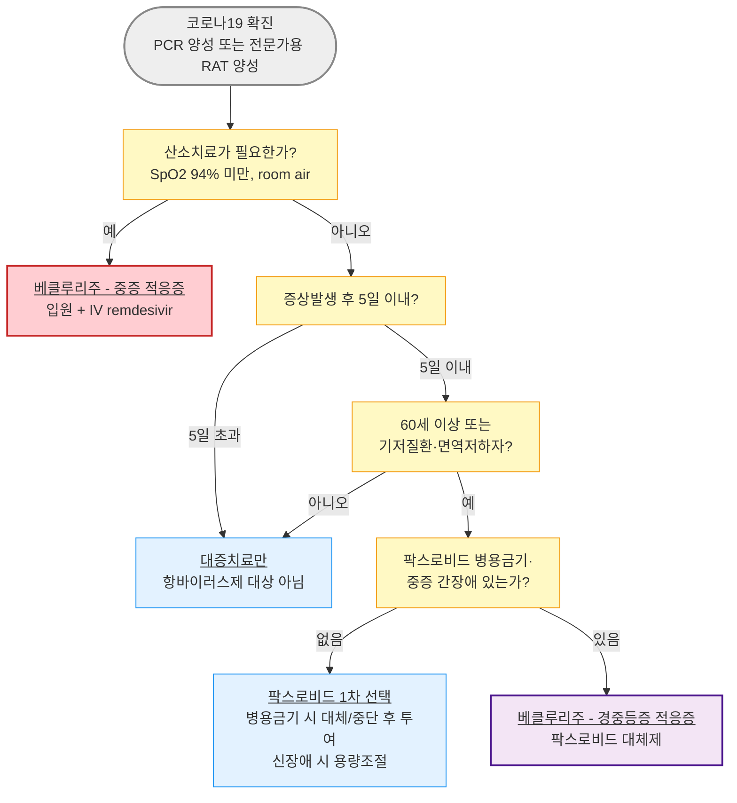

# 코로나19 Covid-19 Infection

## <mark style="color:green;">일반 사항</mark>

* SARS-CoV-2(Severe Acute Respiratory Syndrome Coronavirus 2) 감염에 의한 급성 호흡기 질환
* 다른 이름 : Coronavirus Disease 2019 (COVID-19)
* 전염 경로 : 비말·직간접 접촉 전파가 주된 경로; 밀폐된 공간·에어로졸 발생 시술 시에는 에어로졸 전파 가능성도 존재
* 잠복기 : 평균 3\~5일 (범위 1\~14일); 변이주에 따라 변동
* 전염 기간 : 증상 발생 1\~2일 전부터 발생 후 5\~10일까지 감염력 지속; 면역 저하자·중증 환자에서는 연장 가능
* 국내 법정감염병 분류 : 제4급 감염병(표본감시 대상, 2023.8.31.자 하향 조정) — 신고·격리 기준은 질병관리청 최신 고시로 반드시 재확인
* 임상 스펙트럼 : 무증상 감염부터 상기도 증상, 폐렴, 급성호흡곤란증후군(ARDS), 다발성 장기부전까지 광범위

### <mark style="color:orange;">합병증</mark>

* 호흡기계 : 바이러스성 폐렴, 급성호흡곤란증후군(ARDS), 세균성 중복 감염(2차 세균성 폐렴)
* 혈관·응고계 : 정맥혈전색전증(폐색전증·심부정맥혈전증), 미세혈관 혈전증
* 심장 : 심근염, 부정맥, 기존 심혈관 질환의 급성 악화(급성 심근경색·심부전 트리거)
* 신경계 : 뇌병증, 뇌졸중, 길랭-바레증후군, 후각·미각 소실(지속형)
* 소아 : 다기관염증증후군(MIS-C, Multisystem Inflammatory Syndrome in Children) — 감염 수 주 후 발생 가능
* 지연 합병증 : Long COVID(감염 후 지속 증상) — 급성기 이후 12주 이상 지속되는 피로, 운동 후 불쾌감(PEM), 인지장애("brain fog"), 호흡곤란 등

#### <mark style="color:$primary;">중증 진행 고위험군</mark>

✽ 2025 IDSA Living Guideline(JAMA Clinical Guidelines Synopsis, 2026.6.30) 및 질병관리청 치료제 투여대상 기준(2025\~2026) 통합

* **고위험(예상 입원율 6%)** : 75세 이상, HIV 감염(CD4 <200/μL), 고형장기이식·혈액암으로 면역억제 치료 중, 최근 12개월 이내 B세포 고갈 치료(rituximab 등)
* **위험 증가(예상 입원율 0.5\~6%)** : 65\~74세, 만성 심폐질환, HIV 감염(CD4 ≥200/μL), 당뇨, 비만(BMI≥30 ㎏/㎡), 임신(현재 또는 분만 후 6주 이내)
* **국내 치료제 투여대상 기준(60세/70세 및 기저질환 목록)은 위 IDSA 분류와 세부 항목이 다름** — §Management 표 참조
* 그 외 위험 인자 : 만성 신장애, 만성 간장애, 겸상적혈구질환, 신경발달장애·정신질환, 최근 1년 이내 심혈관 사건 병력

## <mark style="color:green;">원인 및 위험 인자</mark>

* 원인 : SARS-CoV-2(베타코로나바이러스); 변이주(오미크론 계열 등)에 따라 전파력·중증도·백신 및 자연면역 회피능이 달라짐
* 위험 인자는 위 "중증 진행 고위험군" 참조

### <mark style="color:orange;">Viral Rebound와 재감염의 구분</mark>

* 니르마트렐비르-리토나비르 투여 후 증상 재발(viral rebound)은 투여 종료 후 첫 주에 0.8\~6.6%에서 발생; 대개 초기 감염보다 경미하며 입원으로 이어지는 경우는 드묾(2025 IDSA Guideline)
* 재치료(retreatment)에 대한 공식 권고는 아직 없음 — 일시적 재발과 새로운 재감염을 구분하는 임상적 판단이 필요

### <mark style="color:$danger;">🚩 Red Flags!</mark>

<mark style="color:$danger;">**즉각 조치 또는 응급 이송**</mark>

* 실내공기(room air)에서 SpO₂ 94% 미만 또는 급격한 산소포화도 저하 - 저산소혈증·폐렴
* 심한 호흡곤란, 호흡수 증가, 말할 때 숨참 - ARDS 진행 위험
* 지속적 흉통 또는 흉부 압박감
* 의식 저하, 혼돈, 각성 유지 곤란
* 입술·안면의 청색증
* 소아 : 3일 이상 지속 고열 + 발진 + 결막충혈 ± 복통·구토 - MIS-C 의심 → 즉시 소아과/응급실 의뢰
* 소아 : 무기력, 수유·경구 섭취 저하, 탈수 징후(소변량 감소, 눈물 없음)

<mark style="color:$warning;">**당일 또는 조기 의뢰**</mark>

* 고위험군(65세 이상, 면역저하, 만성 심폐질환 등)에서 3일 이상 지속되거나 재상승하는 발열
* SpO₂ 94\~95%로 경계치에 근접하거나, 안정 시 대비 운동 시 저하가 뚜렷한 경우
* 경구 섭취 저하로 탈수가 우려되는 고령·소아 환자
* 임신부의 호흡기 증상 악화 또는 태동 감소 동반
* 항바이러스제 투여 대상 고위험군인데 아직 처방받지 못함 (증상발생 5\~7일 이내가 치료 개시의 창임)
* 초기 호전 후 재악화 + 발열 지속 - 세균성 중복 감염 의심 (☞ [폐렴](/broken/pages/d96688b8fdf5677383dc0bb1b769710adc826e80))

<mark style="color:$info;">**외래 추적 / 추가 평가 계획**</mark> <mark style="color:$info;">- 즉각 위험 낮으나 호전 없으면 의뢰</mark>

* 급성기 이후에도 12주 이상 지속되는 피로·인지장애·호흡곤란 - Long COVID 평가
* 항바이러스제 치료 종료 후 발생한 경미한 증상 재발(viral rebound) - 대개 자연 호전, 악화 시 재평가
* 5일 이상 지속되거나 재악화되는 증상 - 세균성 중복감염 감별 필요

## <mark style="color:green;">임상 양상</mark>

* **상기도 증상** : 발열, 인후통, 기침, 코막힘/콧물, 근육통, 두통, 피로감
* **후각·미각 소실** : 초기 변이주에서 특징적이었으나 최근 변이주에서는 빈도 감소
* **위장관 증상** : 오심, 구토, 설사(소아에서 상대적으로 흔함)
* **하기도/중증 진행 징후** : 호흡곤란, 흉부 압박감, 저산소혈증(SpO₂ ＜94%, room air), 폐렴
* 고령자에서는 발열 없이 기력 저하·식욕 부진·섬망만으로 내원하는 경우가 있어 유행 시기에는 적극적으로 의심할 것

✽ 인플루엔자·세균성 폐렴과의 임상 양상 비교는 인플루엔자 챕터의 "독감 vs 세균성 폐렴 vs COVID-19" 표 참조 (☞ [인플루엔자](/broken/pages/37968e8f4aaa57c08f63701089dba7835a0ef255))

## <mark style="color:green;">진단</mark>

* **진단 기준**(질병관리청) : ① 검체에서 SARS-CoV-2 특이 유전자 검출(PCR 양성) 또는 ② 신속항원검사(전문가용 RAT) 결과 양성
* 자가검사(가정용 신속항원검사) 양성은 임상적 진단의 참고 자료로 활용하되, 치료제 처방 등 공식 확진 절차에는 전문가용 검사 기준 적용
* 중증도 판정 : 산소치료 필요 여부(SpO₂ ＜94%, room air)를 기준으로 경증·중등증(산소치료 불필요) vs 중증(산소치료·기계환기·ECMO 필요)으로 구분하여 치료제 선택에 활용
* 코로나19·인플루엔자 동시 유행기에는 콤보 신속항원검사(COVID-19 + 인플루엔자 A/B) 사용 권장; RSV 포함 multiplex PCR도 활용 가능

### <mark style="color:orange;">검사</mark>

* 고위험군의 중등도 이상 증상, 폐렴·저산소혈증 의심 시 : 흉부 영상(X-ray/CT), CBC, 전해질, 신기능, CRP, 동맥혈가스분석
* MIS-C 의심 소아 : CBC, CRP/ESR, ferritin, BNP, troponin, 심초음파
* 회복기 흉통·심계항진·운동 시 호흡곤란 발생 시 : EKG + troponin - 심근염 배제 목적

### <mark style="color:orange;">감별 진단</mark>

<table><thead><tr><th width="130">질환</th><th width="260">COVID-19와의 주요 차이</th><th>감별 포인트</th></tr></thead><tbody><tr><td><strong>인플루엔자</strong></td><td>임상적으로 구별 어려움; 항바이러스제 계열이 다름</td><td>동시 유행기에는 신속항원/PCR 동시검사 권장 (☞ <a href="/broken/pages/37968e8f4aaa57c08f63701089dba7835a0ef255">인플루엔자</a>)</td></tr><tr><td><strong>감기(비-COVID 상기도감염)</strong></td><td>중증 진행 위험이 낮음</td><td>고위험군이 아니면 검사·항바이러스제 불필요 (☞ <a href="/broken/pages/d2d49d21fd4ba1da7ad969fec87cb47930bb9636">감기</a>)</td></tr><tr><td><strong>세균성 폐렴</strong></td><td>COVID-19 회복기 중복감염으로도 발생 가능</td><td>발열 재상승, 국소 흉부 소견, 백혈구 증가·CRP 상승 (☞ <a href="/broken/pages/d96688b8fdf5677383dc0bb1b769710adc826e80">폐렴</a>)</td></tr><tr><td><strong>급성 기관지염</strong></td><td>중증 진행 위험 매우 낮음</td><td>고위험 인자 없는 경증 기침 우세 시 (☞ <a href="/broken/pages/a0d982792ae360f09a0a9deb7c2224e34216e63f">급성 기관지염</a>)</td></tr></tbody></table>

***



<p align="center"><strong>코로나19 항바이러스제 선택 알고리듬</strong></p>

<p align="center"><em><mark style="color:$info;">Ref. 질병관리청 코로나19 치료제 사용 안내 제13-2판(2025); 의료진을 위한 코로나19 치료제 처방 안내 Q&#x26;A(2026.2.26); 2025 IDSA Living Guideline (JAMA Clinical Guidelines Synopsis, 2026.6.30)</mark></em></p>

***

## <mark style="background-color:$warning;">Management</mark>


**항바이러스제 치료 원칙**

증상발생 후 5\~7일 이내 시작해야 효과적이며, 이득은 고위험군에서 가장 크다. 위험 인자가 없는 환자는 항바이러스제로 인한 입원 감소 효과가 미미하여 사용하지 않는 것이 권고된다(2025 IDSA Living Guideline).


**항바이러스제 투여 단계 (IDSA 2025 위험군 기준)**

1. **고위험(예상 입원율 6%)** - 니르마트렐비르-리토나비르 또는 정맥 렘데시비르 권고(SR, moderate COE); 병용금기·렘데시비르 접근 불가 시 몰누피라비르 고려(CR, low COE)
2. **위험 증가(예상 입원율 0.5\~6%)** - 니르마트렐비르-리토나비르(CR, moderate COE) 또는 렘데시비르(CR, low COE) 사용을 제안하나 몰누피라비르는 권고하지 않음
3. **위험 인자 없음** - 니르마트렐비르-리토나비르·렘데시비르 비사용 제안; 몰누피라비르는 강하게 반대 권고(SR, moderate COE)


**⚠️ 라게브리오(몰누피라비르) 국내 공급 종료 안내**

정부 재고 소진으로 2026.3.17.부로 라게브리오의 (정부공급) 사용이 종료되었다. 처방이 필요한 고위험 환자는 팍스로비드 또는 베클루리주 등 대체 의약품 사용을 고려한다(질병관리청 리플렛, 2026.2.26). 시중유통 물량 재개 여부는 처방 전 최신 공지로 확인할 것.


### <mark style="color:orange;">국내 치료제 투여대상 기준(질병관리청, 2025\~2026)</mark>

✽ 국내 정부공급/급여 기준은 IDSA 위험군 정의보다 연령·기저질환 목록으로 단순화되어 있으며, 산소치료 필요 여부로 경·중등증/중증을 구분함

<table><thead><tr><th width="110">치료제</th><th width="230">투여대상</th><th>용법·용량</th></tr></thead><tbody><tr><td><strong>팍스로비드</strong></td><td>60세 이상 또는 18세 이상 면역저하자·기저질환자(당뇨·고혈압·심혈관질환·만성 신장질환·만성 폐질환·BMI≥30·신경발달장애/정신질환) + 증상발생 5일 이내 + 산소치료 불필요</td><td>니르마트렐비르 300 ㎎+리토나비르 100 ㎎ bid 5일간 (신장애 시 용량조절, 처방례 참조)</td></tr><tr><td><strong>베클루리주</strong><br>(경·중등증)</td><td>60세 이상 또는 성인·소아(40 ㎏ 이상) 기저질환자·면역저하자 + 증상발생 7일 이내 + 산소치료 불필요 + 팍스로비드 사용 불가</td><td>1일차 200 ㎎, 2\~3일차 100 ㎎ qd, IV infusion 30\~120분, 총 3일</td></tr><tr><td><strong>베클루리주</strong><br>(중증)</td><td>입원 중인 중증 또는 폐렴, SpO₂≤94%(room air), 보조산소·기계환기·ECMO 필요 환자</td><td>상동 (급여 기준 별도 확인)</td></tr><tr><td><strong>라게브리오</strong><br>(공급 종료)</td><td>70세 이상 + 증상발생 5일 이내 + 산소치료 불필요 + 다른 치료제 사용 불가/부적절 (2026.3.17.부 국내 정부공급 종료)</td><td>몰누피라비르 800 ㎎(200 ㎎×4캡슐) bid 5일간</td></tr></tbody></table>

_<mark style="color:$info;">코로나19 확진 정의 : ① PCR 등 특이 유전자 검출 또는 ② 신속항원검사(전문가용 RAT) 양성. 정부공급/시중유통 물량별 급여·본인부담 기준은 질병관리청 코로나19 치료제 사용 안내 최신판 및 HIRA 고시로 확인.</mark>_

### <mark style="color:orange;">팍스로비드 처방 전 필수 확인 사항</mark>


**⚠️ 병용금기 약물 40종(2026.1.14. 마바캄텐 추가 반영 기준)**

처방 전 반드시 **DUR**을 통해 병용금기 성분을 확인한다.

* **투여 전 복용 중단하더라도 팍스로비드 투여 불가(8종)** : 세인트존스워트(강한 CYP3A 유도), 카르바마제핀, 페노바르비탈, 페니토인, 프리미돈, 리팜피신, 아팔루타마이드, 엔잘루타마이드
* **복용중단 또는 대체성분 처방 시 투여 가능(32종)** : 아미오다론, 심바스타틴·로바스타틴(CYP3A 대사 의존도 높은 스타틴), 실데나필·타다라필 등 PDE-5 억제제, 트리아졸람·미다졸람(경구), 사이클로스포린·타크로리무스·에베로리무스·시롤리무스(면역억제제 — 병용 시 혈중농도 급상승 위험), 클로피도그렐·티카그렐러·리바록사반(항응고/항혈소판제), 콜키신, 탐스로신·실로도신·알푸조신(전립선비대증), 라놀라진, 이바브라딘, 드로네다론, 보리코나졸 등
* 최신 목록·병용주의/용량조절 정보는 [covid-ddi.or.kr](https://covid-ddi.or.kr/)(대한항균요법학회)에서 성분명/제품명으로 조회


* 병용금기 약물을 관리하며 처방하는 경우, 요양급여 청구 시 특정내역(의료기관 JT011, 약국 JT006)에 병용금기 처방 사유(의학적 근거)를 구체적으로 기재해야 함 (예: "A와 B가 병용금기이나 \~ 사유로 처방/조제함")
* 병용금기 약물 중단·대체로 기저질환 악화가 우려되면 입원 등 대안 고려
* 신장애 : eGFR 30\~59 ㎖/min에서 용량조절, eGFR ＜30 ㎖/min(혈액투석 포함)은 2026.1.14. 품목허가 변경으로 용량조절 투여 가능(기존 투여금지에서 개선) — 용량은 처방례 참조
* 간장애 : 중증 간장애(Child-Pugh C)에서는 투여가 권장되지 않음
* 임부 : 팍스로비드는 유익성이 위해성을 상회한다고 판단될 때 사용; 몰누피라비르는 임신 중 투여하지 않음(동물실험에서 태아 골격 이상 등 확인) — 가임기 남녀 복약지도 필요(핵심 복약 지도 참조)

## <mark style="color:green;">비-약물 치료</mark>

* 안정·충분한 휴식, 충분한 수분 섭취
* 발열 시 미온수 찜질, 얇은 옷 착용; 과도한 보온 금지
* 실내 습도 유지, 자주 환기
* 천식·COPD 환자 : 평소 사용하는 흡입제(기관지확장제·흡입 스테로이드)를 평소보다 철저히 사용; 호흡곤란 악화 시 즉시 내원

## <mark style="color:green;">약물 치료</mark>

### <mark style="color:orange;">대증 치료</mark>

<table><thead><tr><th width="140">증상</th><th width="230">약제 선택</th><th>주의사항</th></tr></thead><tbody><tr><td>발열·근육통·두통</td><td>아세트아미노펜(1차); NSAID(중등도 이상)</td><td>18세 미만 : 아스피린 금기(Reye 증후군); 고령·신기능 저하 시 NSAID 주의</td></tr><tr><td>기침</td><td>덱스트로메토르판, 레보드로프로피진</td><td>화농성 객담 있으면 과도한 진해 억제 피함</td></tr><tr><td>인후통</td><td>[경증] 트로키·생리식염수 가글; [중등증] 아세트아미노펜/NSAID</td><td>-</td></tr><tr><td>구역·구토</td><td>위장관 운동 촉진제(mosapride 등)</td><td>지속 시 탈수 평가</td></tr></tbody></table>

* **항생제** : 세균성 중복 감염(광범위 폐렴, 호흡부전, 저혈압, 초기 호전 후 악화)이 의심되는 경우에 한해 사용 (☞ [폐렴](/broken/pages/d96688b8fdf5677383dc0bb1b769710adc826e80)); 코로나19 단독 감염에 예방적 항생제는 권고하지 않음

### <mark style="color:orange;">니르마트렐비르-리토나비르</mark>

* 기전 : 니르마트렐비르는 SARS-CoV-2 3CL protease 억제제; 리토나비르는 CYP3A 억제를 통해 니르마트렐비르 혈중농도를 높이는 pharmacokinetic booster
* <mark style="color:blue;">\[팍스로비드]</mark> 니르마트렐비르 150 ㎎×2정+리토나비르 100 ㎎×1정/팩
* 표준 용법 : 니르마트렐비르 300 ㎎(150 ㎎×2정)+리토나비르 100 ㎎ bid, 식사와 무관, 12시간마다, 5일간
* 복용을 잊은 경우 : 8시간 이내면 즉시 복용, 8시간 경과 시 다음 예정 시간에 정량 복용(두 배 복용 금지)
* 부작용 : 미각 이상(쓴맛, dysgeusia)이 흔함 — 임의 복용 중단 방지 복약지도 필요
* Viral rebound : 투여 종료 후 0.8\~6.6%에서 증상 재발 가능; 대개 경미하며 재치료에 대한 공식 권고는 없음(2025 IDSA Guideline)

### <mark style="color:orange;">렘데시비르</mark>

* 기전 : RNA-dependent RNA polymerase 억제
* <mark style="color:blue;">\[베클루리주]</mark> 100 ㎎/바이알, 정맥주사용 동결건조분말
* 정맥 투여 전용(IV infusion, 30\~120분); 신장애(투석 포함)·간장애(Child-Pugh A/B/C) 모두 용량조절 불필요(2024.12.3. 품목허가 변경)
* 경·중등증 : 1일차 200 ㎎, 2\~3일차 100 ㎎ qd, 총 3일
* 중증(입원, 산소치료 필요) : 별도 적응증으로 급여 기준 확인 필요
* 다른 경로로 투여하지 않음; 전원 시 잔여용량은 원칙적으로 인계하지 않음(타 병원 보유량 없을 시 예외)

### <mark style="color:orange;">몰누피라비르</mark>


**2026.3.17.부로 국내 정부공급 종료** — 처방 전 재고·공급 상태 확인 필수


* 기전 : RNA-dependent RNA polymerase에 오류를 유도하는 뉴클레오시드 유사체(mutagenic)
* <mark style="color:blue;">\[라게브리오]</mark> 200 ㎎/캡슐
* 표준 용법 : 800 ㎎(200 ㎎×4캡슐) bid, 식사와 무관, 5일간; 캡슐은 부수거나 열지 않고 통째로 복용(연하곤란 시 현탁액 조제 가능, 4캡슐을 물 40 ㎖에 희석)
* 임부 금기; 수유부는 투여 중 및 마지막 투여 후 4일간 수유 비권장; 가임기 여성은 투여 중 및 종료 후 4개월, 가임기 배우자가 있는 남성은 투여 중 및 종료 후 3개월간 효과적인 피임 필요
* 18세 미만 소아·청소년에는 골·연골 영향 우려로 투여하지 않음

## <mark style="color:green;">예방</mark>

### <mark style="color:orange;">격리 기간</mark>

✽ 국내 코로나19는 제4급 감염병으로 하향 조정되어(2023.8.31.) 법적 강제 격리 의무는 없으며, 아래는 일반적 권고 사항임 — 최신 지침은 질병관리청 공지로 반드시 재확인

* 일반 권고 : 발열 소실 및 증상 호전 후 24시간 경과할 때까지 실내 마스크 착용·타인 접촉 최소화
* 고위험군·중증 환자·면역 저하자 : 배출 기간이 길어질 수 있어 격리 기간 연장을 고려
* 의료기관 종사자 : 각 기관의 감염 관리 지침에 따른 별도 기준 적용 가능

### <mark style="color:orange;">예방접종</mark>

☞ [코로나19 예방접종](/broken/pages/5800b40f0d61300f8f926a339765492166386837#covid-19)

* 고위험군(고령자, 면역저하자, 만성질환자, 임신부)에서 최신 변이주 대응 백신 접종이 중증 예방에 가장 효과적인 수단
* 접종 주기·대상은 질병관리청 예방접종 지침에 따름 — 변이주에 따라 매 시즌 갱신되므로 "최신"이라는 표현보다 접종 시점의 질병관리청 공지 확인 필요

***

### <mark style="color:red;">질병코드</mark>

U07.1 코로나바이러스감염증-19, 바이러스가 확인된 경우

U07.2 코로나바이러스감염증-19, 바이러스가 확인되지 않았으나 임상적·역학적으로 진단된 경우

***

## <mark style="color:purple;">처방례</mark>

> **처방례 1. 표준 용법 — 60세 이상, 신기능 정상**
>
> ```
> 팍스로비드 (니르마트렐비르 150 ㎎×2정+리토나비르 100 ㎎×1정)/팩   1팩  bid  × 5일
> ```
>
> _✽ 증상발생 5일 이내, 산소치료 불필요한 60세 이상 환자. 식사와 무관하게 12시간 간격 복용; 5일 전체 과정 완료가 중요함을 복약지도. DUR로 병용금기 약물 사전 확인 필수_

> **처방례 2. 중등도 신장애 (eGFR 30\~59 ㎖/min)**
>
> ```
> 팍스로비드 (니르마트렐비르 150 ㎎×1정+리토나비르 100 ㎎×1정)/팩   1팩  bid  × 5일
> ```
>
> _✽ 니르마트렐비르만 절반 용량으로 감량된 전용 포장 사용; 리토나비르는 100 ㎎ bid 유지_

> **처방례 3. 중증 신장애/혈액투석 환자 (eGFR＜30 ㎖/min)**
>
> ```
> 1일차 : 팍스로비드(니르마트렐비르 300 ㎎+리토나비르 100 ㎎)   qd
> 2~5일차 : 팍스로비드(니르마트렐비르 150 ㎎+리토나비르 100 ㎎)   qd
> ```
>
> _✽ 2026.1.14. 품목허가 변경으로 중증 신장애·투석 환자도 용량조절 후 투여 가능(기존 투여금지에서 개선); 총 11정. 혈액투석을 진행하는 날에는 투석 종료 후 투여_

> **처방례 4. 병용금기 약물(스타틴) 복용자 — 일시중단 후 팍스로비드**
>
> ```
> (기존 심바스타틴 복용 5일간 일시 중단)
> 팍스로비드 (니르마트렐비르 300 ㎎+리토나비르 100 ㎎)/팩   1팩  bid  × 5일
> ```
>
> _✽ 심바스타틴은 팍스로비드 투여 전 복용 중단 또는 대체 시 팍스로비드 투여가 가능한 약제 중 하나. 청구 시 특정내역(JT011/JT006)에 병용금기 처방 사유 기재 필수. 대체·중단이 임상적으로 위험한 경우(예: 최근 스텐트 삽입 후 이중항혈소판요법)는 팍스로비드 대신 베클루리주 고려_

> **처방례 5. 팍스로비드 사용 불가(중증 간장애 등) — 베클루리주**
>
> ```
> 1일차 : 베클루리주(렘데시비르) 200 ㎎   IV infusion (30~120분)
> 2~3일차 : 베클루리주(렘데시비르) 100 ㎎   IV infusion qd
> ```
>
> _✽ Child-Pugh C 중증 간장애, 병용금기 약물 대체 불가, 또는 팍스로비드 투여가 불가한 경증·중등증 고위험 환자에 사용. 정부물량 사용 시 담당기관 지정 여부 확인 필요; 요양급여 청구 시 특정내역 MX999에 "주사치료제" 기재_

***

### <mark style="color:$success;">핵심 복약 지도</mark>

> **팍스로비드 — 병용금기 및 복용법**
>
> * 12시간 간격으로 5일간 복용하십시오(예: 아침 8시, 저녁 8시). 증상이 호전된 것처럼 느껴져도 5일 과정을 반드시 완료하십시오.
> * 복용 전 현재 복용 중인 모든 약(처방약·일반의약품·건강기능식품 포함, 특히 세인트존스워트)을 반드시 알려주십시오 — 심각한 약물상호작용이 발생할 수 있습니다.
> * 복용을 잊은 경우, 8시간 이내면 즉시 복용하고, 8시간을 넘겼다면 거른 용량은 건너뛰고 다음 예정 시간에 정량만 복용하십시오(두 배 복용 금지).
> * 입에서 쓴맛(미각 이상)이 흔히 발생할 수 있으나 이 때문에 임의로 중단하지 마십시오.
> * 완치 후 며칠 뒤 증상이 다시 나타나는 경우(바이러스 재양전)가 있을 수 있으나 대개 경미하며 자연 호전됩니다. 증상이 심해지면 다시 내원하십시오.
> * 병용금기·상호작용에 대한 최신 정보는 [covid-ddi.or.kr](https://covid-ddi.or.kr/)에서 확인할 수 있습니다.

> **라게브리오(몰누피라비르) — 임신·수유·피임 주의**
>
> * 임신 중에는 복용하지 않습니다.
> * 수유 중이라면 복용 중 및 마지막 복용 후 4일간 수유를 권장하지 않습니다.
> * 가임기 여성은 복용 중 및 복용 종료 후 4개월간, 가임기 배우자가 있는 남성은 복용 중 및 종료 후 3개월간 효과적인 피임을 정확히 사용하십시오.
> * 캡슐은 씹거나 부수지 말고 통째로 삼키십시오. 삼키기 어려우면 의료진과 상의하십시오(현탁 조제 가능).
> * 현재 국내 정부공급이 종료(2026.3.17.부)되어 처방 전 재고 확인이 필요함을 안내하십시오.

> **언제 다시 병원을 방문해야 하나요?**
>
> * 산소포화도가 94% 미만으로 떨어지거나 호흡곤란이 심해지는 경우 — 즉시 응급실
> * 3일 이상 지속되거나 다시 오르는 고열
> * 의식이 흐려지거나 평소와 다르게 처지는 경우
> * 항바이러스제 복용 중 새로운 심한 부작용(예: 심한 알레르기 반응)이 발생하는 경우

***

### <mark style="color:blue;">환자 안내서</mark>


**코로나19, 대부분은 집에서 회복되지만 고위험군은 빠른 진단·치료가 중요합니다**

건강한 성인 대부분은 감기와 비슷하게 앓고 지나가지만, 고령이나 기저질환이 있는 분은 증상 초기(발생 후 5일 이내)에 항바이러스제를 복용하면 중증으로 진행할 위험을 크게 낮출 수 있습니다.


#### <mark style="color:$primary;">코로나19란 무엇인가요?</mark>

* 신종 코로나바이러스(SARS-CoV-2) 감염으로 생기는 호흡기 질환입니다
* 발열, 인후통, 기침, 콧물, 몸살, 두통 등 감기와 비슷한 증상이 흔합니다
* 대부분 1\~2주 내 자연 호전되지만, 일부에서는 폐렴 등 중증으로 진행할 수 있습니다

#### <mark style="color:$primary;">항바이러스제는 누가, 언제 복용해야 하나요?</mark>

* **60세 이상**이거나, 나이와 상관없이 당뇨·고혈압·심장병·폐질환·만성 콩팥병·비만·면역저하 등 기저질환이 있는 분은 항바이러스제 복용을 적극 고려해야 합니다
* 증상이 시작된 지 **5일 이내**에 복용을 시작해야 효과가 있으므로, 확진되면 바로 진료를 받으십시오
* 이미 산소 치료가 필요할 정도로 심하다면 먹는 약이 아니라 주사 치료제(베클루리주)나 입원 치료가 필요할 수 있습니다

#### <mark style="color:$primary;">집에서 어떻게 관리하나요?</mark>

* **충분히 쉬고 물을 자주 마십시오.** 발열이 심하면 아세트아미노펜 등 해열제를 사용할 수 있습니다.
* **증상이 있는 동안은 마스크를 착용하고 다른 사람과의 접촉을 최소화하십시오.** 특히 고령자·기저질환자·영유아와의 접촉을 피하십시오.
* **환기를 자주 하십시오.**
* 발열이 없어지고 증상이 뚜렷이 호전된 후에도 24시간 정도는 실내 마스크 착용을 이어가는 것이 권장됩니다.

#### <mark style="color:$primary;">예방접종이 중요합니다</mark>

* 고위험군(고령자, 임신부, 만성질환자, 면역저하자)은 변이주에 맞춰 갱신되는 백신 접종으로 중증화를 예방할 수 있습니다
* 접종 시기·대상은 매 시즌 바뀔 수 있으므로 질병관리청 공지를 확인하십시오

#### <mark style="color:$primary;">이럴 때는 즉시 응급실로 가세요</mark>

* 숨쉬기가 힘들거나 가슴이 답답한 느낌이 지속되는 경우
* 입술이나 얼굴이 파랗게 변하는 경우
* 평소와 다르게 혼란스러워하거나 깨우기 힘든 경우
* (소아) 3일 이상 고열이 지속되며 발진, 눈 충혈, 배 아픔이 함께 나타나는 경우 — 즉시 소아과/응급실
* (소아) 처지고 잘 먹지 못하며 소변량이 눈에 띄게 줄어드는 경우

#### <mark style="color:$primary;">회복 후에도 증상이 계속되면?</mark>

* 급성 증상이 지나간 뒤에도 피로감, 집중력 저하, 숨참 등이 12주 이상 계속되면 진료를 받으십시오(이른바 '롱코비드')

_<mark style="color:$info;">Ref. 질병관리청 코로나19 치료제 사용 안내 제13-2판(2025.2.17.); 의료진을 위한 코로나19 치료제 처방 안내 Q\&A 리플렛(2026.2.26.); 2025 IDSA Living Guideline on COVID-19 Treatment (JAMA Clinical Guidelines Synopsis, 2026.6.30.)</mark>_
