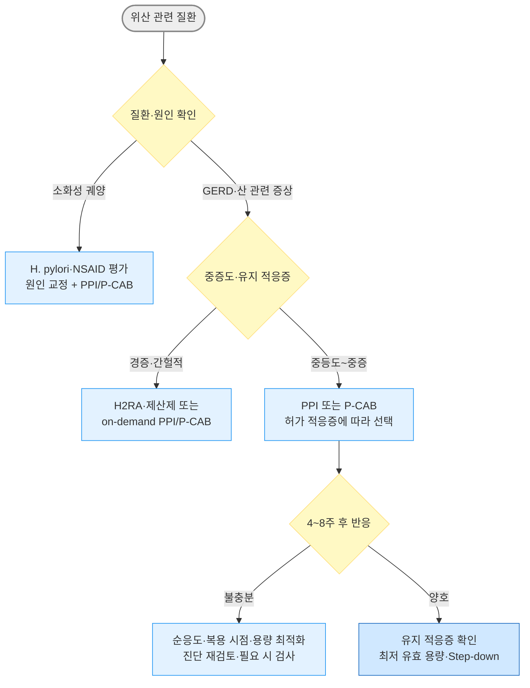

# 소화기계 약제

## <mark style="color:green;">처방 안전 요약</mark>

### <mark style="color:orange;">위험군별 주의 약제</mark>

#### <mark style="color:$primary;">**QT 연장 위험 약제**</mark>

* 심장 질환·QTc 연장·저칼륨혈증·저마그네슘혈증 환자에서 병용 주의; 아래 약제 2개 이상 병용 시 위험 증가
* **domperidone** : 강력한 CYP3A4 억제제 또는 QT 연장 약제와 병용 시 혈중 농도·부정맥 위험 증가; 제품별 병용 금기 확인
* **ondansetron** : QT 연장은 용량 의존적이며 단회 IV 투여량은 16 ㎎을 초과하지 않음(32 ㎎ 단회 IV 요법은 철회됨); 선천성 QT 연장증후군에서는 회피하고 저칼륨혈증·저마그네슘혈증은 투여 전 교정
* **erythromycin** : CYP3A4 기질·억제제; QT 연장 약제와 이중 위험
* **metoclopramide** : 드물지만 QTc 연장 보고; 고용량·IV 투여 시 주의

#### <mark style="color:$primary;">**CKD에서 주의 약제**</mark>

* eGFR ＜ 30 mL/min 환자에서 축적 독성 위험
* **MgO, Mg hydroxide** : 고마그네슘혈증 (고령 CKD에서 치명적)
* **Al hydroxide·phosphate 제산제** : Al 축적 독성 (뇌증, 골연화증)
* **Bismuth** : 장기·고용량에서 신경 독성; 중증 신장애에서 회피하고 CKD에서는 신중 사용
* **H2RA** : 신배설; CKD 시 성분·적응증별 용량 감량 또는 투여 간격 연장 필요
* **metoclopramide** : 신배설 비중이 높아 신기능 저하 시 노출 및 추체외로 이상반응 증가; 제품별 허가사항에 따라 감량
* **인산염 함유 관장제** : 고인산혈증·저칼슘혈증·급성 신손상 위험
* **sucralfate** : 장기 사용 시 Al 축적; CKD에서 주의

#### <mark style="color:$primary;">**고령자에서 주의 약제**</mark>

* **metoclopramide** : 추체외로 증상·지연운동이상증 위험↑; 만성 사용 회피
* **항콜린성 진경제** (dicyclomine, hyoscine N-butylbromide, hyoscyamine 등) : 인지 기능 저하, 섬망, 변비, 요폐, 낙상; Beers Criteria에서 강한 항콜린성 진경제 회피 권고
* **Benzodiazepine 계 보조 항구토제** (diazepam, lorazepam 등) : 낙상, 인지 저하; 고령에서 가능한 회피
* **1세대 항히스타민제** (dimenhydrinate, promethazine 등) : 과진정, 섬망, 낙상 위험
* **mineral oil (경구)** : 흡인 위험 (연하장애·와상 환자 금기)

### <mark style="color:orange;">장기 사용 주의 약제</mark>

<table><thead><tr><th width="150.11114501953125">약제</th><th width="322.4444580078125">장기 사용 문제</th><th>권고</th></tr></thead><tbody><tr><td>PPI</td><td>중단 시 일시적 반동성 위산 과분비 가능. 장 감염 외 폐렴·골절·CKD·치매 등은 주로 관찰 연구의 연관성이며 인과관계가 확립되지 않음</td><td>확실한 적응증이 있으면 유지하되 정기적으로 적응증·최저 유효 용량 재평가</td></tr><tr><td>metoclopramide</td><td>노출 기간·누적 용량에 따라 비가역적 지연운동이상증 위험 증가; 과거 추정치보다 실제 위험은 낮으나 고령 여성·당뇨병·간신장 기능 저하·항정신병약 병용 시 위험 증가</td><td>최단 기간(가능한 ≤12주) 사용; FDA boxed warning</td></tr><tr><td>domperidone</td><td>QT 연장·심실성 부정맥(심장돌연사)</td><td>구역·구토에 최저 유효 용량으로 최단 기간 사용; 장기 사용 필요 시 적응증과 심장 위험 재평가</td></tr><tr><td>자극성 하제</td><td>복통·설사·전해질 이상; 장기 안전성 자료는 제한적이나 치료 용량에서 대장 기능이 영구적으로 손상된다는 근거는 불충분</td><td>bisacodyl·Na picosulfate는 단기 또는 구제요법; 장기 필요 시 원인과 반응 재평가</td></tr><tr><td>MgO (고용량)</td><td>고마그네슘혈증—중증 CKD·고령에서 위험 증가</td><td>중증 신장애에서 회피; 장기 사용 시 신기능·필요 시 Mg 확인</td></tr><tr><td>항콜린성 진경제</td><td>인지 기능 저하(누적 항콜린 부담), 변비 악화, 요폐</td><td>고령에서 최소화; 인지 저하 병력자 회피</td></tr><tr><td>H2RA</td><td>연속 사용 수일~수주 후 내성(tachyphylaxis); 중단 후 일시적 반동 증상 가능</td><td>야간 증상에는 필요시 또는 단기간 사용; 지속 필요성 재평가</td></tr></tbody></table>

* **심장 질환자의 구역·구토** : 원인에 맞는 항구토제를 선택하고 QT 연장 위험 약제 병용·전해질 이상을 우선 점검; domperidone은 가능한 회피하며 itopride·mosapride도 적응증과 상호작용을 확인
* **CKD 환자의 속쓰림·역류** : MgO·Al 제산제 대신 **H2RA (용량 조절)** 또는 **PPI** 우선; CKD에서 Mg/Al 축적 독성 위험
* **고령 환자의 변비** : 자극성 하제나 항콜린 진경제 대신 **PEG** 또는 **lactulose** 우선; 전해질 불균형 및 인지 부담 감소

### <mark style="color:orange;">주요 약물 상호작용</mark>

<table><thead><tr><th width="157.77777099609375">약물</th><th width="177.7777099609375">기전</th><th>임상적 위험 및 주의</th></tr></thead><tbody><tr><td>erythromycin</td><td>CYP3A4 중등도 억제제 + 기질</td><td>일부 statin(횡문근융해), warfarin, cyclosporine 독성↑; QT 연장 약제 병용 시 심각한 부정맥 위험</td></tr><tr><td>cimetidine</td><td>CYP1A2·2C9·2C19·2D6·3A4 광범위 억제</td><td>theophylline, warfarin, phenytoin, diazepam, lidocaine 농도·독성↑; clopidogrel 활성화·항혈소판 효과↓ 가능. H2RA 중 상호작용 가장 많음 → famotidine 선호</td></tr><tr><td>PPI (특히 omeprazole)</td><td>CYP2C19 경쟁적 억제</td><td>clopidogrel 활성화 저해(임상적 유의성 논란); 위산 억제로 ketoconazole·itraconazole·atazanavir 흡수 감소</td></tr><tr><td>domperidone</td><td>CYP3A4 기질</td><td>강력한 CYP3A4 억제제 및 QT 연장 약제 병용 시 혈중 농도·부정맥 위험 증가; 제품별 금기 확인</td></tr><tr><td>sucralfate</td><td>킬레이션·흡착 (CYP 비관여)</td><td>quinolone, tetracycline, levothyroxine 등 흡수 감소 → 약제별 권장 간격 확인(일률적으로 2시간을 적용하지 않음)</td></tr><tr><td>Al/Mg 함유 제산제</td><td>킬레이션·흡착 (CYP 비관여)</td><td>quinolone, tetracycline, 철분제 등 흡수 저하 → 약제별 권장 간격 확인</td></tr><tr><td>P-CAB (tegoprazan 등)</td><td>약제별 CYP 대사 + 위산 억제</td><td>위산 의존 흡수 약제(atazanavir·rilpivirine·일부 azole계 등)의 농도 감소; CYP 상호작용은 성분별 허가사항 확인</td></tr></tbody></table>

## <mark style="color:green;">위장 운동 촉진제 (GI prokinetic agent)</mark>

<table><thead><tr><th width="260">성분명 [상품명]</th><th>주요 작용 기전</th></tr></thead><tbody><tr><td>metoclopramide <mark style="color:blue;">[맥페란]</mark></td><td>D2 길항, 5-HT4 작용; 고용량에서 5-HT3 길항</td></tr><tr><td>levosulpiride <mark style="color:blue;">[레보프라이드]</mark></td><td>D2 길항</td></tr><tr><td>clebopride <mark style="color:blue;">[크레보릴]</mark></td><td>D2 길항, 5-HT4 작용</td></tr><tr><td>itopride <mark style="color:blue;">[가나톤]</mark></td><td>D2 길항, acetylcholinesterase 억제</td></tr><tr><td>domperidone <mark style="color:blue;">[모티리움엠]</mark></td><td>말초 D2 길항</td></tr><tr><td>mosapride <mark style="color:blue;">[가스모틴]</mark>, <mark style="color:blue;">[가스티인 CR]</mark></td><td>선택적 5-HT4 작용</td></tr><tr><td>현호색·견우자 추출물(DA-9701) <mark style="color:blue;">[모티리톤]</mark></td><td>D2 길항, 5-HT4 작용 등 복합 기전</td></tr></tbody></table>

* 투여 시간 : 위 배출 촉진 목적 시 대개 식전 30분\~1시간(제품별 허가사항 확인). SIBO에서 위장운동촉진제를 야간 투여하는 방법은 제한적 근거의 허가 외 사용
* 금기 : 위장관 출혈, 위장관 폐색/천공
* 항콜린제와 상호 길항작용을 하여 효과가 상쇄될 수 있음
* **기능성 소화불량** : 국내 허가와 증상 양상에 따라 mosapride, itopride, DA-9701 등을 고려
* **위마비** : 기계적 폐색을 배제하고 객관적 위 배출 지연을 확인한 뒤 식사요법을 우선. [2025 AGA 지침](https://pubmed.ncbi.nlm.nih.gov/40976635/)은 metoclopramide 또는 erythromycin을 초기 약물치료로 조건부 제안하며, mosapride·itopride를 근거상 우선 약제로 보지는 않음

### <mark style="color:orange;">Dopamine D2 receptor antagonist</mark>

* 기전 : 도파민 수용체 차단 → acetylcholine 분비↑ → 위장관 수축↑; CTZ 억제 → 항구토 효과
* 대장 운동을 촉진할 수 있음
* 부작용
  * BBB 통과 약제 (metoclopramide, levosulpiride, clebopride) : 추체외로 증상, 진정, 저혈압, 설사, 근육 긴장 이상, 고프로락틴혈증(유즙 분비, 성 기능 장애) - (✘ Avoid 만성 사용·고령)
  * 중추 침투가 적은 약제 (domperidone, itopride) : 중추 부작용이 상대적으로 적음; domperidone은 심장 부작용 주의
* **고프로락틴혈증 모니터링** : BBB 통과 D2 길항제(metoclopramide, levosulpiride 등) 장기 투여 시 유즙 분비, 여성형유방증, 생리 불순, 성욕 감소 등의 증상으로 환자가 당황하는 경우가 많음. 처방 전 예상 부작용을 설명하고, 증상 발생 시 약제 교체 또는 중단을 고려
* **metoclopramide** : 지연운동이상증(tardive dyskinesia)은 드물지만 비가역적일 수 있으며 노출 기간·누적 용량에 따라 위험 증가. 과거 추정치보다 실제 위험은 낮은 것으로 평가되나 고령 여성·당뇨병·간신장 기능 저하·항정신병약 병용 시 위험이 높음. FDA boxed warning에 따라 가능한 최단 기간(대개 ≤12주) 사용하고, 신기능 및 중등도~중증 간장애에서 제품별 허가사항에 따라 감량
* **domperidone** : QT 연장·심실성 부정맥(심장돌연사) 위험. EMA는 성인 10 ㎎ tid 이하(최대 30 ㎎/d), 통상 1주 이내의 최단 사용을 권고함. 이 기간 제한을 MFDS 권고와 동일시하지 말고 국내 제품 허가사항을 별도로 확인. QT 연장·유의한 심장 질환·전해질 이상·강력한 CYP3A4 억제제 또는 QT 연장 약제 병용 시 회피/금기 여부 확인

### <mark style="color:orange;">Serotonin agonist</mark>

* 기전 : 5-HT4 수용체 작용 → acetylcholine 분비↑ → 위장관 수축↑
* 해당 약제 : metoclopramide, clebopride, mosapride, prucalopride
* mosapride : 중추 침투가 적어 중추 부작용이 상대적으로 적음; CYP3A4 억제제 병용 시 노출 증가 가능성이 있어 주의

### <mark style="color:orange;">Motilin receptor agonist</mark>

* 임상 적용 : 공복기 MMC(migrating motor complex) 촉진 → 위마비(gastroparesis)·소장 내 세균 과증식(SIBO)에 적용

#### <mark style="color:$primary;">Erythromycin</mark>

* 작용 : motilin과 구조적으로 유사; 저용량에서 motilin 수용체에 작용 (항균 용량이 아님)
* 주의 : CYP3A4 억제제/기질; QT 연장 약제 병용 금기
* 부작용 : 구역, 구토, 내성 발생
* 용법 : 50\~250 ㎎ tid의 저용량을 단기간 사용(허가 외 사용; 환자 상태·제형·전문가 판단에 따라 조정). 반복·장기 사용 시 tachyphylaxis와 항생제 내성 문제 고려
* (✘ Avoid: QT 연장 약제 병용, 중증 간 기능 저하)

### <mark style="color:orange;">Acetylcholinesterase inhibitor</mark>

* 대상 : 소장의 dysmotility 또는 pseudoobstruction
* 허가 : 중증 근무력증
* pyridostigmine : 60\~180 ㎎/d <mark style="color:blue;">\[메스티논]</mark>

## <mark style="color:green;">진경제 (GI antispasmodic agent)</mark>

* 종류 : 비선택적 항콜린제, 선택적 항콜린제, 칼슘차단제, 아편수용체 조절제
* 항콜린 계열 부작용 : 입마름, 소변 저류, 시야 흐림, 어지럼, 졸림, 녹내장 악화
* IBS·기능성 복통 : **trimebutine**, **pinaverium/mebeverine** 등을 고려; **항콜린성 진경제**(hyoscine N-butylbromide, dicyclomine 등)는 단기·급성 경련에 한정하고 **고령에서 회피**

### <mark style="color:orange;">약제</mark>

* trimebutine : 100\~200 ㎎ tid 식전; 약한 opioid agonist 효과 <mark style="color:blue;">\[포리부틴]</mark>
* cimetropium : 50 ㎎ tid <mark style="color:blue;">\[알기론]</mark>
* phloroglucinol : 160 ㎎ tid <mark style="color:blue;">\[후로스판]</mark>
* pinaverium : 50 ㎎ tid <mark style="color:blue;">\[디세텔]</mark>
* hyoscine N-butylbromide(scopolamine butylbromide) : 10\~20 ㎎ tid\~qid <mark style="color:blue;">\[부스코판]</mark> (✘ Avoid : 고령·BPH·협우각 녹내장)
* tiropramide : 100 ㎎ bid\~tid <mark style="color:blue;">\[티로파]</mark>
* dicyclomine : 10\~20 ㎎ tid\~qid <mark style="color:blue;">\[스파토민]</mark> (✘ Avoid : 고령)
* 주사제/기타 : hyoscine N-butylbromide <mark style="color:blue;">\[부스코판 주]</mark>, atropine <mark style="color:blue;">\[아트로핀 주]</mark>, hyoscyamine, otilonium, peppermint oil

## <mark style="color:green;">기타 항구토제</mark>

* 화학요법·수술 후 구역/구토 : **ondansetron**
* 멀미·내이 질환 : **dimenhydrinate** 또는 **meclizine**
* 임신성 구역/구토 : **doxylamine + pyridoxine**
* 만성 기능성 구역 : 저용량 **amitriptyline/nortriptyline**

### <mark style="color:orange;">항히스타민제, 1세대</mark>

* 대상 : 멀미, 내이 장애 관련 구역/구토; 항콜린 작용이 있음
* dimenhydrinate : 50 ㎎ tid\~qid <mark style="color:blue;">\[보나링에이]</mark> (✘ Avoid : 고령 - 과진정·섬망 위험)
* hydroxyzine : 진정·항콜린·QT 연장 위험이 있어 일반적인 구역·구토의 표준 약제로 권고하지 않음 <mark style="color:blue;">\[아디팜]</mark>
* meclizine : 멀미 25\~50 ㎎ 여행 1시간 전; 현훈 25\~100 ㎎/d 분할 <mark style="color:blue;">\[염산메클리진]</mark> (제품별 허가사항 확인)
* promethazine : 12.5\~25 ㎎ q4\~6h 필요시 (✘ Avoid : 고령, 2세 미만 소아)

### <mark style="color:orange;">Serotonin 5-HT3 antagonist</mark>

* 대상 : 화학요법·방사선치료 유발 및 수술 후 구역·구토의 핵심 약제; 원인에 따라 다른 계열과 병용
* 부작용 : 두통, 무기력, 변비, 어지럼, QT 연장 (IV 고용량 주의)
* ondansetron : 적응증별 4\~8 ㎎ 경구 또는 IV <mark style="color:blue;">\[조프란]</mark>; 단회 IV 용량은 16 ㎎을 초과하지 않음(32 ㎎ 단회 IV 요법 철회). 선천성 QT 연장증후군에서 회피하고 투여 전 전해질 이상 교정
* granisetron : CINV 경구 2 ㎎ qd 또는 1 ㎎ bid <mark style="color:blue;">\[카이트릴]</mark> (적응증·제형별 허가사항 확인)
* dolasetron : CINV 경구 100 ㎎ 1회; QT 연장 위험으로 IV CINV 요법은 사용하지 않으며 국내 허가·유통 여부 확인
* palonosetron : CINV 0.25 ㎎ IV 1회 <mark style="color:blue;">\[알록시 주]</mark> (반감기 약 40시간; PONV 용량은 적응증별 허가사항 확인)

### <mark style="color:orange;">NK1 antagonist</mark>

* 대상 : 화학요법 유발 구역/구토; 5-HT3 antagonist와 병용 시 상승 효과
* aprepitant : CINV 예방 시 제1일 125 ㎎, 제2\~3일 80 ㎎ qd <mark style="color:blue;">\[에멘드]</mark> (항암요법의 구토 유발 위험도와 병용요법에 따라 조정)
* fosaprepitant <mark style="color:blue;">\[에멘드 주]</mark>, netupitant/palonosetron 복합제 <mark style="color:blue;">\[아킨지오]</mark>, rolapitant(국내 허가·유통 여부 확인)

### <mark style="color:orange;">TCA</mark>

* 대상 : (저용량으로) 만성 특발성 구역, 기능성 구토
* amitriptyline : 10\~25 ㎎ hs부터 시작하여 반응·부작용에 따라 조정 <mark style="color:blue;">\[에트라빌]</mark>
* nortriptyline : 10\~25 ㎎ hs부터 시작하여 반응·부작용에 따라 조정 <mark style="color:blue;">\[센시발]</mark>
* (✘ Avoid 고령 - 항콜린 부작용·심독성; 심혈관 질환·BPH·녹내장 주의)

### <mark style="color:orange;">Benzodiazepine</mark>

* 대상 : 예기성 항암화학요법 유발 구역·구토 등에서 제한적으로 사용하는 보조요법; 일반적인 불안 동반 구토의 일률적 치료제로 사용하지 않음
* diazepam : 2.5 ㎎ qd\~tid <mark style="color:blue;">\[디아제팜]</mark>
* clonazepam : 0.25 ㎎ qd\~tid <mark style="color:blue;">\[리보트릴]</mark>
* lorazepam : 1\~4 ㎎/d #2\~3 <mark style="color:blue;">\[아티반]</mark>
* ✘ Avoid : 고령 - 낙상·진정·의존

### <mark style="color:orange;">임신성 구역·구토</mark>

* doxylamine/pyridoxine : 성분당 10 ㎎ 지연방출 복합제 등 국내 허가 제제를 우선 고려; 제품별 단계적 증량 용법 확인. FDA의 과거 A/B/C/D/X 임신등급은 2015년 이후 PLLR 서술형 체계로 대체됨
* pyridoxine : 10\~25 ㎎ q6\~8h 단독 또는 doxylamine과 병용 <mark style="color:blue;">\[피리독신]</mark>
* 생강 : 250 ㎎ q6h 또는 총 1 g/d 고려 가능; 출혈 위험 약제 병용·응고장애에서는 주의하고 중증 구토나 장폐쇄 의심 시 원인 평가 우선


**임신 구토 1차 요법** - doxylamine + pyridoxine 병용(ACOG·SMFM 권고). 반응 불충분 시 promethazine, prochlorperazine 또는 ondansetron 추가 고려; ondansetron은 임신 초기 선천성 심기형·구개열 연관성 논란이 있어 이득/위험 평가 후 사용


## <mark style="color:green;">복부 가스 제거제</mark>

### <mark style="color:orange;">Probiotics</mark>

* 작용(가설) : 장내 세균에 의한 가스 형성과 염증을 억제
* AGA 권고
  * 유익성·안전성 증거 부족 - 급성 위장관염, IBS, IBD, C. difficile 감염 등 대부분에 권고하지 않음
  * 조산아·저체중 출생아에서 일부 균주가 괴사성 장염·사망을 줄일 가능성이 있으나, 균주에 의한 균혈증·진균혈증과 사망 사례도 보고됨. NICU 전문진료 환경에서 균주·제품 품질·면역저하·중심정맥관 여부를 평가하여 사용
  * 항생제 복용 중 C. difficile 예방 및 pouchitis 관리를 위해 고려 가능
* 유산균·비피더스균 : Lacticaseibacillus rhamnosus <mark style="color:blue;">\[람노스]</mark>, Bifidobacterium bifidum 함유 제제, Lactobacillus acidophilus 함유 제제 <mark style="color:blue;">\[안티비오]</mark> 등(효과는 균주·조합별로 판단)
* Saccharomyces boulardii <mark style="color:blue;">\[비오플]</mark>
* Bacillus subtilis <mark style="color:blue;">\[메디락]</mark>
* 보험기준 : 균주·품목, 환자 연령과 적응증에 따라 제한되므로 최신 HIRA 급여기준 확인(과거 고시 문구를 그대로 적용하지 않음)

### <mark style="color:orange;">Galactosidase</mark>

* α-Galactosidase : 콩류 등 발효성 탄수화물 섭취로 인한 가스·팽만 감소에 고려
* β-Galactosidase(lactase) : 유당불내증 <mark style="color:blue;">\[갈타제]</mark>

### <mark style="color:orange;">Simethicone</mark>

* 기능성 팽만·영아 산통 등에서 일관된 효과 근거는 제한적이나 전신 흡수가 거의 없어 비교적 안전한 증상 완화제로 사용
* 용법 : 40\~80 ㎎ tid 식후 또는 취침 시 <mark style="color:blue;">\[가소콜]</mark>

### <mark style="color:orange;">비흡수성 항생제</mark>

* 작용 : 장내 세균 활동을 억제하여 탄수화물 발효 감소
* 대상 : 임상 소견과 위험 인자 또는 검사로 SIBO가 뒷받침되는 환자; 단순 복부 팽만만으로 반복 경험적 투여하지 않음
* 부작용 : 부종, 구역, 어지럼, 가스
* rifaximin : SIBO에 400 ㎎ tid × 7\~14일 등이 사용되나 허가 외 요법이며 최적 용량·기간은 확립되지 않음 <mark style="color:blue;">\[노르믹스]</mark>
  * 간성 뇌증에서의 함량·용량·투여 기간은 국가·제품별 허가사항이 다르므로 외국의 550 ㎎ bid 요법을 국내 허가로 단정하지 말고 식약처 허가사항 확인

### <mark style="color:orange;">Bismuth subsalicylate</mark>

* 대상 : 여행자 설사 증상 완화, 악취 방귀의 단기 완화; 소화성 궤양의 단독 치료제로 사용하지 않음
* 용법 : 525 ㎎ qid 또는 필요시; 국내 허가·유통 제품 여부 확인
* ✘ Avoid : CKD; 소아·청소년에서 바이러스 감염 시 - Reye 증후군 위험

## <mark style="color:green;">변비 치료제 (Laxative)</mark>

### <mark style="color:orange;">식이 섬유</mark>

* 소장 원위부·대장에서 발효되어 지방산과 가스를 생성; 위장관 기능과 감각에 영향
* 권장 용량 : 총 식이 섬유 20\~30 g/d를 목표로 서서히 증량; 효과와 내약성은 수일\~수주에 걸쳐 평가
* 심한 서행성 변비에서는 효과가 제한적일 수 있으며, 분변 매복·장관 협착/폐쇄에서는 악화 가능
* 부작용 : 복부 가스, 팽만감, 복통 (특히 대변 저류가 있는 경우)
* 함유 음식 : 밀기울, 전곡류, 채소, 과일

### <mark style="color:orange;">부피 형성 하제 (Bulk-forming)</mark>

* 함유 성분 : psyllium(차전자피), methylcellulose, isphagula, karaya, guar gum, wheat dextrin, 해초, 한천
* 충분한 물과 함께 섭취 필수 : Bulk-forming laxative는 장 내에서 수분을 흡수해 팽창하므로 수분 섭취가 부족하면 오히려 장 내에서 굳어 변비가 악화되거나, 드물게 장폐색을 유발할 수 있음
* 투여 2\~3일 내 반응
* 부작용 : 복부 가스, 팽만감, 협착 시 impaction, Ca·Fe 흡수 장애

<table><thead><tr><th width="260">성분명 [상품명]</th><th>용법</th></tr></thead><tbody><tr><td>psyllium <mark style="color:blue;">[무타실]</mark></td><td>1P qd~tid 공복</td></tr><tr><td>agiocur pregranules <mark style="color:blue;">[아기오]</mark></td><td>1~2P 저녁 식후</td></tr><tr><td>polycarbophil <mark style="color:blue;">[웰콘]</mark></td><td>2T (625 ㎎/T) qd~qid</td></tr><tr><td>methylcellulose (복합제)</td><td>-</td></tr></tbody></table>

### <mark style="color:orange;">삼투성 하제 (Hyperosmotics)</mark>

* 종류 : MgO, 비흡수성 다당류(lactulose, lactitol, sorbitol), glycerol, PEG
  * PEG가 lactulose보다 내약성·효과 우수(ACG 2021); 국내 접근성은 MgO가 높음
* 투여 1\~3일 내 반응; 장기 투여 가능
* 주의 : 중증 신장애(eGFR ＜30 mL/min/1.73㎡)에서는 Mg 제제 회피; 고령·경도~중등도 CKD에서도 용량과 혈청 Mg 모니터링 고려
* 부작용 : 구역, 복부 팽만, 가스, 설사

<table><thead><tr><th width="340">성분명 [상품명]</th><th>용법</th></tr></thead><tbody><tr><td>MgO <mark style="color:blue;">[마그밀에스]</mark></td><td>2T (250 ㎎/T) qd~tid</td></tr><tr><td>lactulose <mark style="color:blue;">[듀파락-이지]</mark></td><td>1~2P qd 아침 식전</td></tr><tr><td>lactitol <mark style="color:blue;">[포탈락]</mark></td><td>1P qd 식사와 함께</td></tr><tr><td>PEG (polyethylene glycol) 3350 <mark style="color:blue;">[마이라스]</mark> (비급여)</td><td>1P qd 아침</td></tr></tbody></table>

### <mark style="color:orange;">자극성 하제 (Stimulant)</mark>

* 작용 : 장 속으로의 수분 분비 및 장 운동 자극
* 종류 : anthraquinone계(senna, cascara), polyphenol계(Na picosulfate), 기타
  * _castor oil - 현재 거의 폐기됨_
  * _phenolphthalein - 발암 가능성으로 FDA OTC 퇴출(1999); 현재 사용되지 않음_
* 대상 : 다른 하제에 반응이 불충분할 때 **단기 또는 구제요법**으로 사용; senna는 조건부로 지속 사용 가능하나 장기 자료는 제한적
* 경구 투여 6\~12시간 후 반응; 직장 투여 15\~60분 후 반응
* 부작용 : 복통, 구역, 설사 및 과량 사용 시 전해질 불균형. 치료 용량에서 대장 기능이 영구적으로 손상된다는 근거는 불충분함 (✘ Avoid : 장폐쇄; 임신 중에는 필요 시 단기간·허가사항에 따라 사용)
* [AGA–ACG 2023 만성 특발성 변비 지침](https://pmc.ncbi.nlm.nih.gov/articles/PMC10542656/) : PEG는 만성 사용에 강한 권고; bisacodyl·Na picosulfate는 단기 또는 구제요법에 강한 권고; senna는 조건부 권고

<table><thead><tr><th width="260">성분명 [상품명]</th><th>용법</th></tr></thead><tbody><tr><td>bisacodyl <mark style="color:blue;">[비사코딜]</mark> (비급여)</td><td>5~10 ㎎ qd, 보통 취침 전; 장용정은 우유·제산제와 1시간 이상 간격</td></tr><tr><td>bisacodyl <mark style="color:blue;">[둘코락스 좌약]</mark></td><td>1S qd</td></tr><tr><td>senna <mark style="color:blue;">[아락실 과립]</mark> (복합제)</td><td>1~2P qd (취침 시)~bid</td></tr><tr><td>Na picosulfate <mark style="color:blue;">[피코락]</mark> (비급여)</td><td>1T 취침 시</td></tr></tbody></table>

### <mark style="color:orange;">대변 연화제 (Stool softener)</mark>

* 종류 : docusate, dehydrocholic acid
  * 복합제 : <mark style="color:blue;">\[둘코락스 에스]</mark> (bisacodyl + docusate sodium), <mark style="color:blue;">\[메이킨 에스]</mark> (bisacodyl + casanthranol + docusate sodium + dehydrocholic acid)
* 대상 : 수술 후, 출산 후, 치핵, 치열
* 충분한 물과 함께 섭취 필수
* docusate는 관행적으로 사용되지만 단독 변비 개선 효과를 뒷받침하는 근거가 제한적임

### <mark style="color:orange;">윤활제 (Lubricant)</mark>

* mineral oil : 15\~45 ㎖/d (✘ Avoid : 고령·연하장애 - 흡인 시 지방성 폐렴; 지용성 Vit 흡수 장애)
* glycerin : 직장용 삼투성 하제로 분류 <mark style="color:blue;">\[그린 관장약]</mark>

### <mark style="color:orange;">Prokinetic agent (5-HT4 agonist)</mark>

* 작용 : GI motility 조절 → 대장 통과 시간 단축
* 대상 : 다른 하제에 반응이 없는 환자
* 주의/금기 : 장폐쇄/천공 의심, 심한 염증성 장질환; 4주 이내 효과 없으면 재평가
* prucalopride : 2 ㎎ qd, 고령자 및 중증 신장애에서는 1 ㎎ qd <mark style="color:blue;">\[레졸로]</mark>; 부작용-두통, 복통, 구역, 설사. 과거 5-HT4 작용제와 달리 뚜렷한 심혈관 위험 증가는 확인되지 않았으나 새로운 우울감·자살사고 등 정신 증상 발생 시 중단하고 평가. 최신 국내 허가·급여기준 확인
* tegaserod : 허혈성 혈관 질환 문제로 사용 제한 (역사적 언급)
* renzapride : 국내 미허가; 임상 연구 단계

### <mark style="color:orange;">Colonic secretagogue</mark>

#### <mark style="color:$primary;">선택적 Chloride channel activator (ClC-2)</mark>

* 작용 : chloride·수분 분비 자극, 장 운동 증가
* 부작용 : 구역, 설사, 두통, 복부 팽만
* lubiprostone : 24 ㎍ bid <mark style="color:blue;">\[아미티자]</mark> (비급여)

#### <mark style="color:$primary;">Guanylate cyclase-C agonist</mark>

* 작용 : 수분 분비·장 운동 자극
* 부작용 : 설사, 복부 팽만; 기계적 장폐쇄에서 금기
* linaclotide : 성인 CIC 145 ㎍ qd(내약성에 따라 72 ㎍), 성인 IBS-C 290 ㎍ qd. [2026년 미국 FDA 기준](https://www.accessdata.fda.gov/drugsatfda_docs/label/2026/202811s023lbl.pdf)으로 7세 이상 소아 IBS-C 145 ㎍ qd, 2세 이상 소아 기능성 변비 72 ㎍ qd이며 **2세 미만 금기**. 국내 소아 허가와 동일한 것으로 해석하지 말고 국내 허가사항 확인
* plecanatide : 3 ㎎ qd; 국내 허가·유통 여부 확인

### <mark style="color:orange;">Opioid antagonist</mark>

* 작용 : peripherally acting μ-opioid receptor antagonist → opioid의 장 억제 효과 차단 (✽BBB 비통과 → 진통 작용 보존)
* 대상 : opioid 유발 변비(OIC); 일반 하제에 반응이 불충분할 때 고려. 장폐쇄에서 금기이며 opioid 금단 증상 가능
* methylnaltrexone, naloxegol, naldemedine <mark style="color:blue;">\[심프로익]</mark> (성분별 CYP3A4 상호작용·신장/간 기능 용량 확인)
* alvimopan은 일반적인 OIC 치료제가 아니라 수술 후 장운동 회복에 제한적으로 사용하는 약제로 구분

## <mark style="color:green;">지사제 (Antidiarrheal agent)</mark>

* 급성 설사의 기본 치료는 **경구수분보충**이며, 원인과 탈수·전해질 상태를 평가함
* 비감염성 급성 설사에서 **loperamide**를 선택적 증상 완화제로 사용할 수 있으나 침습성 감염 의심(혈변·고열·전신 독성) 및 장폐쇄에서는 사용하지 않음

### <mark style="color:orange;">Opiates</mark>

* 주의 : 이질·침습성 병원균 감염 시 증상 악화, 마비성 장폐색, 원인균 배출 지연
  * 혈변, 고열, 전신 독성, 치료에도 악화되는 설사에서 금기
* loperamide : 처음 4 ㎎, 이후 묽은 변마다 2 ㎎; 처방 최대 16 ㎎/d <mark style="color:blue;">\[로프민]</mark>. 과량 사용 시 QT 연장·torsades de pointes·심정지 위험 (✘ Avoid : 침습성 설사·장폐쇄)
* diphenoxylate : 2.5\~5 ㎎ qid

### <mark style="color:orange;">진경제 (항콜린제, 항무스카린제)</mark>

* 작용 : 복통·복부 불편감 호전
* 용법 : 통증 발생 전 또는 식전 30분 복용 (☞ [진경제](073_-gidrugs.md#gi-antispasmodic-agent))

### <mark style="color:orange;">5-HT3 antagonist</mark>

* 작용 : serotonin 차단 → 위장관 motility·sensation 억제 → 설사형 IBS 개선
* 부작용 : 변비, 급성 허혈성 대장염 (✘ Avoid: 허혈성 대장염 병력)
* alosetron : 기존 치료에 반응하지 않는 중증 IBS-D 성인 여성에서 제한적으로 사용; 심각한 변비·허혈성 대장염 위험. 국내 미허가

### <mark style="color:orange;">Probiotics</mark>

* 변비·설사 환자의 일부에서 효과; 신뢰할만한 연구 부족 (☞ [Probiotics](073_-gidrugs.md#probiotics))

### <mark style="color:orange;">흡착제</mark>

#### <mark style="color:$primary;">Dioctahedral smectite</mark>

* 알루미늄·마그네슘의 이중 silicate로 구성된 천연 점토
* 작용 : 장점막 보호; 병원성 세균, 독소, 바이러스, 가스, 담즙산 흡착·배설
* <mark style="color:blue;">\[스타빅]</mark> 3 g/20 ㎖ : 성인 20 ㎖ tid 식간 복용; 급성 설사 초기 용량과 소아 연령별 용량은 제품 허가사항 확인
* 다른 경구약의 흡수를 방해할 수 있으므로 통상 2시간 이상 간격을 둠

#### <mark style="color:$primary;">Kaolin-pectin</mark>

* <mark style="color:blue;">\[후라베린 큐 시럽]</mark> : 연령별 용량은 제품 허가사항 확인 (비급여)

#### <mark style="color:$primary;">Bismuth subsalicylate</mark>

* 작용 : 항염·항균; 여행자 설사 증상 완화, 바이러스성 장염 구토 완화
* 용법 : 525 ㎎, 필요시 1일 최대 8회
* ✘ Avoid : CKD; 소아·청소년 바이러스 감염 시 - Reye 증후군 위험

### <mark style="color:orange;">기타</mark>

* racecadotril : enkephalinase 억제로 장운동을 유의하게 억제하지 않고 과도한 장액 분비를 감소; 경구수분보충의 보조요법 <mark style="color:blue;">\[하이드라섹]</mark> (비급여)
* paregoric (camphorated tincture of opium) - 역사적 사용; 현재 거의 사용되지 않음

## <mark style="color:green;">제산제 (Antacid)</mark>

* 주의 : 상부 위장관 증상을 차폐함; 신부전 시 부작용 상승; PPI·H2RA 대체 이후 보조적 역할
* 용법 : 보통 1일 4회, 매 식후 1\~2시간 및 취침 시

<table><thead><tr><th width="280">성분명 [상품명]</th><th>주요 부작용 및 주의</th></tr></thead><tbody><tr><td>Al hydroxide/phosphate <mark style="color:blue;">[겔포스]</mark> (현탁액, 비급여), <mark style="color:blue;">[암포젤]</mark> (정)</td><td>변비; 장기 대량 투여 시 Al 독성. 중증 신장애에서 회피</td></tr><tr><td>almagate <mark style="color:blue;">[알마겔]</mark> (정/현탁액)</td><td>변비 또는 설사; Al 및 Mg 포함, CKD에서 축적 주의</td></tr><tr><td>Na bicarbonate <mark style="color:blue;">[타스나]</mark> (비급여)</td><td>Na·수분 저류, 알칼리혈증. (✘ Avoid : 심부전·고혈압·부종)</td></tr><tr><td>Ca carbonate <mark style="color:blue;">[씨씨본]</mark></td><td>고칼슘혈증, 대사성 알칼리증. (✘ Avoid : 고칼슘혈증·신결석)</td></tr><tr><td>Mg hydroxide/oxide <mark style="color:blue;">[마그밀]</mark>, <mark style="color:blue;">[마그밀에스]</mark></td><td>설사·고마그네슘혈증. 중증 신장애에서 회피</td></tr></tbody></table>

***

## <mark style="color:green;">위 점막 보호제 (Gastric mucosal protective agent)</mark>

### <mark style="color:orange;">Sucralfate</mark>

* Al hydroxide + sucrose octasulfate
* 작용 : 점막 보호·치유 촉진; 위산 중화 효과 없음
* 효과 : 소화성 궤양에서 H2RA와 동등한 효과
* 부작용 : 변비, Al 관련 독성; 중증 신장애에서 회피하고 CKD에서 장기 사용 주의
* 용법 : 공복 투여 (✽pH 3.5 이하에서 궤양 바닥에 부착)
  * 소화성 궤양 : 치료 1 g tid\~qid, 재발 예방 1 g bid <mark style="color:blue;">\[아루사루민]</mark> (정/액, 비급여)
  * 역류성식도염 : 1 g qid 식전 1시간 및 취침 시
* 약물 상호 작용 : quinolone·tetracycline·levothyroxine 등 여러 약제의 흡수 감소. 필요한 간격은 약제별로 다르므로 허가사항 확인(예: 일부 fluoroquinolone은 sucralfate 복용 전 2시간 또는 후 4\~6시간). 제산제는 sucralfate 전후 30분 이내 피함

### <mark style="color:orange;">Bismuth</mark>

* 작용 : 점막 보호; H. pylori 항균 작용
* 부작용 : 변비, 검은 변; 고용량 장기 시 신경 독성. 중증 신장애에서 회피
* tripotassium dicitrato bismuthate : 300 ㎎ qid 또는 600 ㎎ bid 식전/공복 <mark style="color:blue;">\[데놀]</mark>

### <mark style="color:orange;">Prostaglandin E analogue</mark>

* 작용 : 점막 보호·재생 증진
* 대상 : NSAID 투여 환자 (특히 위궤양·출혈 병력자에서 병용)
* 부작용 : 설사, 복통
* misoprostol : 200 ㎍ qid, 음식과 함께 복용 <mark style="color:blue;">\[싸이토텍]</mark>
* **NSAID 유발 궤양 예방 목적으로 임부에게 투여 금기** - 자궁 수축을 유발할 수 있으므로 가임기 여성에서 처방 시 임신 여부 확인 필수. 산과적 적응증에서의 전문적 사용과 구분

### <mark style="color:orange;">기타 점막 보호제</mark>

* Na alginate : 위식도 증상 완화, 포만감 효과; 부작용-변비·설사; 1\~3 g tid\~qid 공복 <mark style="color:blue;">\[라미나지 액]</mark>
* benexate betadex : 400 ㎎ bid <mark style="color:blue;">\[울굿]</mark>
* ecabet : 1 g bid <mark style="color:blue;">\[가스트렉스 과립]</mark>
* irsogladine : 4 ㎎ qd <mark style="color:blue;">\[가스론엔]</mark>
* polaprezinc : 75 ㎎ bid <mark style="color:blue;">\[프로맥]</mark>
* rebamipide : 100 ㎎ tid <mark style="color:blue;">\[무코스타]</mark>
* sulglycotide : 200 ㎎ tid <mark style="color:blue;">\[글립타이드]</mark>
* teprenone : 50 ㎎ tid <mark style="color:blue;">\[셀벡스]</mark>
* eupatilin : 60 ㎎ tid, 90 ㎎ bid <mark style="color:blue;">\[스티렌]</mark>

## <mark style="color:green;">위산 분비 억제제 (Gastric antisecretory drug)</mark>

* GERD·소화성 궤양·H. pylori 제균 : **PPI** 또는 **P-CAB** (현재 표준)
* P-CAB : 빠른 효과·식사 무관 복용이 장점. H. pylori 제균에서는 성분·항생제 조합·기간과 내성 양상에 따라 성적이 달라지므로 PPI 대비 일률적으로 우월하다고 단정하지 않음
* 야간 돌파 위산 : PPI + 취침 시 H2RA 단기 병용 가능 (보험 주의)
* H2RA : 경증 GERD 보조, PPI 효과 발현 전 즉각 완화, On-demand 사용

**위산 분비 억제제 3계열 비교**

<table><thead><tr><th width="141.4444580078125">특성</th><th>H2RA</th><th>PPI</th><th>P-CAB</th></tr></thead><tbody><tr><td>작용 기전</td><td>H2 수용체 길항</td><td>프로톤펌프 비가역적 억제</td><td>프로톤펌프 가역적 K 경쟁적 억제</td></tr><tr><td>복용 시점</td><td>대체로 식사 무관</td><td>대부분 식전 30~60분(일부 제형 예외)</td><td>대체로 식사 무관</td></tr><tr><td>효과 발현</td><td>빠름</td><td>초회부터 작용하나 충분한 효과까지 수일</td><td>빠름</td></tr><tr><td>산 억제</td><td>PPI/P-CAB보다 약함</td><td>강력</td><td>강력하고 야간 억제 우수</td></tr><tr><td>내성</td><td>연속 사용 수일~수주 후 tachyphylaxis</td><td>임상적으로 유의한 tachyphylaxis 없음</td><td>임상적으로 유의한 tachyphylaxis 없음</td></tr><tr><td>장기 안전성</td><td>장기 경험 풍부</td><td>장기 경험 풍부; 확실한 적응증에서 이득이 위험보다 큼</td><td>자료 축적 중</td></tr></tbody></table>

### <mark style="color:orange;">H2-수용체 차단제 (H2-receptor antagonist, H2RA)</mark>

* 내성 및 반동 : 연속 투여 수일\~수주 후 tachyphylaxis로 산 억제 효과가 감소할 수 있음. 중단 후 일시적 반동 증상이 가능하나 정확한 지속 기간을 일률적으로 적용하지 않음
* 제산제 동시 투여 시 H2RA 흡수 10\~20% 감소
* 주의 : 고령·CKD 시 성분별 감량. cimetidine 장기·고용량 사용 시 여성형유방증·발기부전과 약물 상호작용 주의
* **cimetidine** : CYP450 광범위 억제로 상호작용 가장 많음; 현재 거의 선호되지 않음 → **famotidine 우선 선택**
* 용량 보정 후 제제별 유의한 효과 차이 없음

<table><thead><tr><th width="220">성분명 [상품명]</th><th width="160">동등 효과 용량</th><th>상용량</th></tr></thead><tbody><tr><td>cimetidine <mark style="color:blue;">[에취투비]</mark></td><td>800 ㎎</td><td>200 ㎎ qid, 400 ㎎ bid</td></tr><tr><td>famotidine <mark style="color:blue;">[가스터]</mark>★</td><td>40 ㎎</td><td>20 ㎎ bid, 40 ㎎ hs</td></tr><tr><td>nizatidine* <mark style="color:blue;">[액시드]</mark></td><td>300 ㎎</td><td>150 ㎎ bid, 300 ㎎ hs</td></tr><tr><td>roxatidine <mark style="color:blue;">[록산]</mark></td><td>150 ㎎</td><td>75 ㎎ bid</td></tr><tr><td>lafutidine <mark style="color:blue;">[스토가]</mark></td><td>20 ㎎</td><td>10 ㎎ bid</td></tr></tbody></table>

★ famotidine : CYP 억제가 없어 상호작용 가장 적음; H2RA 중 현재 선호 제제\
\* 발암 물질 NDMA 함유로 ranitidine <mark style="color:blue;">\[큐란]</mark>, <mark style="color:blue;">\[잔탁]</mark> 일부 리콜(2019.09.) 후 전 제품 시장 철수; nizatidine 역시 일부 제품에서 NDMA 검출로 리콜 사례 있어 주의

### <mark style="color:orange;">프로톤 펌프 차단제 (Proton pump inhibitor, PPI)</mark>

* 기전 : prodrug → 위 벽세포 산성 환경에서 활성화 → H⁺-K⁺-ATPase에 비가역적 결합
* 산 분비 억제 : 표준 용량에서 24시간 ＞90%; 최대 효과 도달 5\~7일
* 투여 시간 : 아침 첫 식사 30\~60분 전; dexlansoprazole(이중 지연 방출)은 식사 무관
* 대사 : 간 CYP2C19·3A4
* 약물 상호 작용 : clopidogrel 활성화 저해(임상적 유의성 논란), 위산 의존 흡수 약제 흡수 감소, diazepam·warfarin·phenytoin 반감기 연장
  * **clopidogrel 병용** : PPI(특히 omeprazole)의 CYP2C19 억제로 항혈소판 효과 저해 우려가 있으나, 대규모 연구에서 실제 심혈관 사건 증가는 입증되지 않음. PPI가 필요하다면 과도하게 회피하지 않아도 됨; 상호작용이 적은 pantoprazole, rabeprazole을 선택할 수 있음; P-CAB은 CYP2C19 영향이 더 적어 대안이 될 수 있음.
* 안전성 : 장 감염 위험은 소폭 증가할 수 있음. 폐렴·골절·영양 결핍·급만성 신질환·치매·당뇨병 등은 주로 관찰 연구에서 연관성이 보고되었으나 인과관계는 확립되지 않음. 확실한 적응증이 있으면 잠재적 이득이 위험보다 큼([ACG GERD 지침](https://pmc.ncbi.nlm.nih.gov/articles/PMC8754510/))

　☞ [보험기준](https://www.hira.or.kr/rc/insu/insuadtcrtr/InsuAdtCrtrPopup.do?mtgHmeDd=20221201\&sno=8\&mtgMtrRegSno=0007)


**AGA 권고** (2022)\
• 확실한 적응증 없는 모든 PPI 만성 투여자 → 감량 고려; 정기 재평가\
• PPI bid 만성 투여자 → 대부분 qd로 step-down 고려\
• 유지 적응증 : complicated GERD(중증 미란성 식도염·바렛 식도·소화성 협착), 호산구성 식도염, 특발성 폐섬유증, 상부 GI 출혈 고위험\
• 장기 치료 후 중단 시 일시적 반동성 상부 위장관 증상이 발생할 수 있음을 안내; 감량 또는 즉시 중단 모두 가능하며 필요 시 H2RA·제산제 단기 투여 고려\
• PPI 관련 이상반응(PAAE) 우려만으로 중단할 필요 없음


<table><thead><tr><th width="257.77777099609375">성분명 [상품명]</th><th width="130">동등 효과 용량¹⁾</th><th width="182.22222900390625">소화성 궤양²⁾</th><th>GERD²⁾</th></tr></thead><tbody><tr><td>omeprazole <mark style="color:blue;">[오엠피]</mark></td><td>20 ㎎</td><td>20 ㎎ qd (10)</td><td>20 ㎎ qd</td></tr><tr><td>esomeprazole <mark style="color:blue;">[넥시움]</mark></td><td>20 ㎎</td><td>20 ㎎ qd (해당 없음)</td><td>20~40 ㎎ qd</td></tr><tr><td>lansoprazole <mark style="color:blue;">[란스톤]</mark></td><td>30 ㎎</td><td>30 ㎎ qd (15)</td><td>30 ㎎ qd</td></tr><tr><td>dexlansoprazole <mark style="color:blue;">[덱실란트 디알]</mark></td><td>-</td><td>(허가 없음)</td><td>30~60 ㎎ qd</td></tr><tr><td>pantoprazole <mark style="color:blue;">[판토록]</mark></td><td>40 ㎎</td><td>40 ㎎ qd (20)</td><td>40 ㎎ qd~bid</td></tr><tr><td>rabeprazole <mark style="color:blue;">[파리에트]</mark></td><td>20 ㎎</td><td>20 ㎎ qd (10)</td><td>10~20 ㎎ qd~bid</td></tr><tr><td>ilaprazole <mark style="color:blue;">[놀텍]</mark></td><td>-</td><td>10 ㎎ qd</td><td>20 ㎎ qd</td></tr></tbody></table>

**¹⁾** _GERD and dyspepsia in adults: investigation and management. NICE 2014._\
**²⁾** _Managing peptic ulcer disease in adults. NICE 2019_\
³⁾ 괄호 안의 용량은 _low dose_; on-demand 투여 가능 여부는 질환과 제품별 허가사항에 따라 판단

* 저용량 PPI를 위염 치료에 적용 : esomeprazole 10 ㎎ qd <mark style="color:blue;">\[에스코텐]</mark>, <mark style="color:blue;">\[에소메졸 디알 서방]</mark>

### <mark style="color:orange;">칼륨 경쟁적 위산 분비 억제제 (Potassium-competitive acid blocker, P-CAB)</mark>

* 기전 : 위 벽세포 H⁺/K⁺-ATPase에 K와 경쟁적·가역적 결합 → 산 억제; 활성화에 위산 불필요 → 빠른 발현·식사 무관 복용
* 장점 : 식전 복용 불필요, 빠른 초회 산 억제(복용 1\~2시간 후 작동), 야간 산 돌파 최소화
* **H. pylori 제균** : [ACG 2024](https://gi.org/journals-publications/ebgi/schoenfeld_sep2024/)는 감수성 확인 없는 clarithromycin 3제요법을 권고하지 않으며, 14일 bismuth 4제요법을 우선 권고하고 vonoprazan-amoxicillin 2제요법 등을 대안으로 제안함. 국내에서는 국내 내성 양상·가이드라인·제품 허가요법을 우선하며, P-CAB 기반 7일 clarithromycin 3제요법을 국제 지침의 보편적 우선 요법으로 해석하지 않음
* 장기 안전성 데이터는 아직 부족

<table><thead><tr><th width="140">성분명 [상품명]</th><th width="263.75">특징</th><th>주요 적응증 및 용법</th></tr></thead><tbody><tr><td>revaprazan <mark style="color:blue;">[레바넥스]</mark></td><td>초기 acid pump antagonist; 후속 P-CAB보다 산 억제 근거가 제한적</td><td>국내 제품별 허가 적응증·용량 확인</td></tr><tr><td>vonoprazan <mark style="color:blue;">[보신티]</mark></td><td>국제 임상 근거가 풍부하나 국내 품목·급여·실제 유통 상태가 변동 중</td><td>국내에서 처방 가능한 상품으로 단정하지 말고 최신 식약처 품목 상태와 실제 출시 여부 확인; H. pylori 요법은 항생제 감수성·국내 지침과 허가사항에 따라 선택</td></tr><tr><td>fexuprazan <mark style="color:blue;">[펙수클루]</mark></td><td>강력한 산 억제; 반감기 약 9시간</td><td>미란성 GERD 40 ㎎ qd × 4주(불충분 시 4주 추가); 급·만성 위염 점막 병변 개선 10 ㎎ bid × 2주</td></tr><tr><td>tegoprazan <mark style="color:blue;">[케이캡]</mark></td><td>빠른 산 억제, CYP3A4 대사; 장기 자료 축적 중</td><td>기능성 소화불량 25 ㎎ qd × 4주; 비미란성 GERD 50 ㎎ qd × 4주; 위궤양 50 ㎎ qd × 8주; H. pylori 제균 50 ㎎ bid × 7일(병용 항생제 및 국내 허가사항 확인)</td></tr><tr><td>zastaprazan <mark style="color:blue;">[자큐보]</mark></td><td>2024년 국내 허가·출시된 P-CAB</td><td>미란성 GERD 20 ㎎ qd × 4주; 치료되지 않으면 4주 추가 가능, 식사와 관계없이 복용</td></tr></tbody></table>

* tegoprazan 부작용(＞1%) : 구역, 설사, 소화불량, 상기도 감염, 흉부 불편감
* P-CAB은 성분별 대사와 허가사항이 다름. 간·신장 기능 저하, 고령, 임부·수유부에서 자료를 확인하고, 위산 의존 흡수 약제(atazanavir, rilpivirine, 일부 azole계 등)와의 병용을 피하거나 대체

***

<h4 align="center">위산 분비 억제제 선택 알고리듬</h4>

