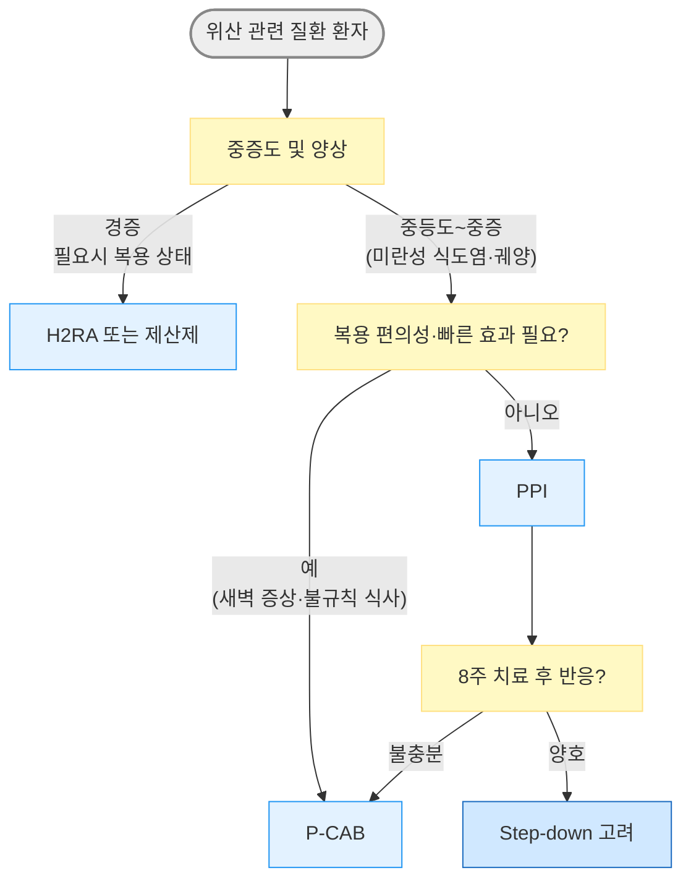

# 소화기계 약제

## <mark style="color:green;">처방 안전 요약</mark>

### <mark style="color:orange;">위험군별 주의 약제</mark>

#### <mark style="color:$primary;">**QT 연장 위험 약제**</mark>&#x20;

* 심장 질환·QTc 연장·저칼륨혈증·저마그네슘혈증 환자에서 병용 주의; 아래 약제 2개 이상 병용 시 위험 증가
* **domperidone** : CYP3A4 억제제(macrolide, azole계) 병용 금기; amiodarone·quinolone·항정신병약 등 QT 연장 약제 병용 시 추가적인 부정맥 위험
* **ondansetron** : IV 고용량(≥32 ㎎) 특히 주의; 선천성 QT 연장 환자 금기
* **erythromycin** : CYP3A4 기질·억제제; QT 연장 약제와 이중 위험
* **metoclopramide** : 드물지만 QTc 연장 보고; 고용량·IV 투여 시 주의

#### <mark style="color:$primary;">**CKD에서 주의 약제**</mark>&#x20;

* eGFR < 30 mL/min 환자에서 축적 독성 위험
* **MgO, Mg hydroxide** : 고마그네슘혈증 (고령 CKD에서 치명적)
* **Al hydroxide·phosphate 제산제** : Al 축적 독성 (뇌증, 골연화증)
* **Bismuth** : 신경 독성; CKD에서 금기
* **H2RA** : 신배설; CKD 시 용량 감량 필요 (famotidine 기준 eGFR 30\~50 시 50% 감량)
* **인산염 함유 관장제** : 고인산혈증·저칼슘혈증·급성 신손상 위험
* **sucralfate** : 장기 사용 시 Al 축적; CKD에서 주의

#### <mark style="color:$primary;">**고령자에서 주의 약제**</mark>&#x20;

* **metoclopramide** : 추체외로 증상·지연운동이상증 위험↑; 만성 사용 회피
* **항콜린성 진경제** (dicyclomine, scopolamine, hyoscyamine 등) : 인지 기능 저하, 섬망, 변비, 요폐, 낙상; Beers Criteria 회피 권고
* **Benzodiazepine 계 항구토제** (diazepam, lorazepam 등) :, 낙상, 인지 저하; 고령에서 가능한 회피
* **1세대 항히스타민제** (dimenhydrinate, promethazine 등) : 과진정, 섬망, 낙상 위험
* **mineral oil (경구)** : 흡인 위험 (연하장애·와상 환자 금기)

### <mark style="color:orange;">장기 사용 주의 약제</mark>

<table><thead><tr><th width="150.11114501953125">약제</th><th width="322.4444580078125">장기 사용 문제</th><th>권고</th></tr></thead><tbody><tr><td>PPI</td><td>반동성 위산 과분비(중단 후 최대 2개월), 영양 결핍(B12·Ca·Mg·Fe), C. difficile·폐렴 위험, 급만성 신질환; 치매·당뇨병 발생 위험 증가(관찰 연구 결과; 인과관계 미확립)</td><td>확실한 적응증 없는 장기 투여 지양; AGA 2022 권고에 따라 정기 재평가</td></tr><tr><td>metoclopramide</td><td>비가역적 지연운동이상증(tardive dyskinesia) - 3개월 이상 시 20%</td><td>최단 기간(가능한 ≤12주) 사용; FDA 블랙박스 경고</td></tr><tr><td>domperidone</td><td>QT 연장·심실성 부정맥(심장돌연사)</td><td>1주 이내 제한; 장기 처방 금지</td></tr><tr><td>자극성 하제</td><td>전해질 불균형; 장기 사용 시 의존·습관화 경향(대장 자율성 저하 가능성 논란)</td><td>단기(1~2주) 원칙; 만성 변비에는 PEG·MgO 우선</td></tr><tr><td>MgO (고용량)</td><td>고마그네슘혈증 - CKD 환자에서 치명적</td><td>CKD 금기; 신기능 정상에서도 장기 고용량 주의</td></tr><tr><td>항콜린성 진경제</td><td>인지 기능 저하(누적 항콜린 부담), 변비 악화, 요폐</td><td>고령에서 최소화; 인지 저하 병력자 회피</td></tr><tr><td>H2RA</td><td>반동성 위산 과분비 (2주 이상 시; 중단 후 9일간 지속)</td><td>장기 투여 시 점진적 감량 고려</td></tr></tbody></table>

* **심장 질환자의 구역·구토** : domperidone 대신 **itopride** 또는 **mosapride** 선택; 중추 부작용 없고 QT 연장 위험 낮음
* **CKD 환자의 속쓰림·역류** : MgO·Al 제산제 대신 **H2RA (용량 조절)** 또는 **PPI** 우선; CKD에서 Mg/Al 축적 독성 위험
* **고령 환자의 변비** : 자극성 하제나 항콜린 진경제 대신 **PEG** 또는 **lactulose** 우선; 전해질 불균형 및 인지 부담 감소

### <mark style="color:orange;">주요 약물 상호작용</mark>

<table><thead><tr><th width="157.77777099609375">약물</th><th width="177.7777099609375">기전</th><th>임상적 위험 및 주의</th></tr></thead><tbody><tr><td>erythromycin</td><td>CYP3A4 중등도 억제제 + 기질</td><td>statins(횡문근융해), warfarin, cyclosporine 독성↑; QT 연장 약제 병용 시 심각한 부정맥 위험</td></tr><tr><td>cimetidine</td><td>CYP1A2·2C9·2C19·2D6·3A4 광범위 억제</td><td>theophylline, warfarin, phenytoin, diazepam, lidocaine, clopidogrel 독성↑; H2RA 중 상호작용 가장 많음 → famotidine 선호</td></tr><tr><td>PPI (특히  omeprazole </td><td>CYP2C19 경쟁적 억제</td><td>clopidogrel 활성화 저해(임상적 유의성 논란); 위산 억제로 ketoconazole·itraconazole·atazanavir 흡수 감소</td></tr><tr><td>domperidone</td><td>CYP3A4 기질</td><td>azole계 항진균제·macrolide 병용 시 혈중 농도↑ → QT 연장 위험; 병용 금기</td></tr><tr><td>sucralfate</td><td>킬레이션·흡착 (CYP 비관여)</td><td>quinolone, tetracycline, theophylline 흡수 현저히 감소 → 2시간 간격 복용 필수</td></tr><tr><td>Al/Mg 함유 제산제</td><td>킬레이션·흡착 (CYP 비관여)</td><td>quinolone(흡수 최대 50% 감소), tetracycline, 철분제(Fe) 흡수 저하 → 2시간 이상 간격 복용 필수</td></tr><tr><td>P-CAB  (tegoprazan 등)</td><td>CYP3A4 대사 + 위산 억제</td><td>itraconazole·ketoconazole·atazanavir·rilpivirine 등 위산 의존 흡수 약제 농도 감소; CYP3A4 억제제와 병용 시 P-CAB 혈중 농도↑</td></tr></tbody></table>

## <mark style="color:green;">위장 운동 촉진제 (GI prokinetic agent)</mark>

<table><thead><tr><th width="260">성분명 [상품명]</th><th>주요 작용 기전</th></tr></thead><tbody><tr><td>metoclopramide <mark style="color:blue;">[맥페란]</mark></td><td>D2 길항, 5-HT4 항진, choline esterase 길항</td></tr><tr><td>levosulpiride <mark style="color:blue;">[레보프라이드]</mark></td><td>D2 길항</td></tr><tr><td>clebopride <mark style="color:blue;">[크레보릴]</mark></td><td>D2 길항, 5-HT4 항진</td></tr><tr><td>itopride <mark style="color:blue;">[가나톤]</mark></td><td>D2 길항, choline esterase 길항 (weak)</td></tr><tr><td>domperidone <mark style="color:blue;">[모티리움엠]</mark></td><td>D2 길항</td></tr><tr><td>mosapride <mark style="color:blue;">[가스모틴]</mark>, <mark style="color:blue;">[가스티인 CR]</mark></td><td>5-HT4 항진</td></tr><tr><td>corydaline <mark style="color:blue;">[모티리톤]</mark></td><td>D2 길항, 5-HT4 항진</td></tr></tbody></table>

* 투여 시간 : 위 배출 촉진 목적 시 식전 30분\~1시간, 소장 내 세균 과증식(SIBO) 치료 목적 시 야간
* 금기 : 위장관 출혈, 위장관 폐색/천공
* 항콜린제와 상호 길항작용을 하여 효과가 상쇄될 수 있음
* 기능성 소화불량·위마비 시 **mosapride** (중추 부작용 적음), **itopride** (D2 길항 + cholinesterase 억제)  선호; Metoclopramide는 단기 구역·구토에 한정; 고령·만성 사용 회피

### <mark style="color:orange;">Dopamine D2 receptor antagonist</mark>

* 기전 : 도파민 수용체 차단 → acetylcholine 분비↑ → 위장관 수축↑; CTZ 억제 → 항구토 효과
* 대장 운동을 촉진할 수 있음
* 부작용
  * BBB 통과 약제 (metoclopramide, levosulpiride, clebopride) : 추체외로 증상, 진정, 저혈압, 설사, 근육 긴장 이상, 고프로락틴혈증(유즙 분비, 성 기능 장애) - (✘ Avoid 만성 사용·고령)
  * BBB 비-통과 약제 (domperidone, itopride) : 중추 부작용 없음; domperidone은 심장 부작용 주의
* **고프로락틴혈증 모니터링** : BBB 통과 D2 길항제(metoclopramide, levosulpiride 등) 장기 투여 시 유즙 분비, 여성형유방증, 생리 불순, 성욕 감소 등의 증상으로 환자가 당황하는 경우가 많음. 처방 전 예상 부작용을 설명하고, 증상 발생 시 약제 교체 또는 중단을 고려
* **metoclopramide** : 비가역적 지연운동이상증(tardive dyskinesia) - 3개월 이상 투여 시 20%에서 발생. FDA 블랙박스 경고(2009). 가능한 최단 기간 사용; 고령자 만성 투여 금지. 간에서 광범위하게 대사되므로 **중증 간 장애 시 용량 감량** 필요
* **domperidone** : QT 연장·심실성 부정맥(심장돌연사) 위험. EMA·MFDS 권고 - ≤10 ㎎ tid, 최대 30 ㎎/d, 최단 기간(1주 이내), 구역·구토에만 적용. QT 연장 약제·CYP3A4 억제제(azole, macrolide) 병용 금기. (✘ Avoid: QTc 연장·심장 질환·전해질 이상·CYP3A4 억제제 병용)

### <mark style="color:orange;">Serotonin agonist</mark>

* 기전 : 5-HT4 수용체 작용 → acetylcholine 분비↑ → 위장관 수축↑
* 해당 약제 : metoclopramide, clebopride, mosapride, prucalopride
* mosapride : BBB를 통과하지 않아 중추 부작용 적음 (✘ Avoid CYP3A4 억제제 병용; macrolide 주의)

### <mark style="color:orange;">Motilin receptor agonist</mark>

* 임상 적용 : 공복기 MMC(migrating motor complex) 촉진 → 위마비(gastroparesis)·소장 내 세균 과증식(SIBO)에 적용

#### <mark style="color:$primary;">Erythromycin</mark>

* 작용 : motilin과 구조적으로 유사; 저용량에서 motilin 수용체에 작용 (항균 용량이 아님)
* 주의 : CYP3A4 억제제/기질; QT 연장 약제 병용 금기
* 부작용 : 구역, 구토, 내성 발생
* 용법 : 250 ㎎ tid × 5\~7d
* (✘ Avoid: QT 연장 약제 병용, 중증 간 기능 저하)

### <mark style="color:orange;">Acetylcholinesterase inhibitor</mark>

* 대상 : 소장의 dysmotility 또는 pseudoobstruction
* 허가 : 중증 근무력증
* pyridostigmine : 60\~180 ㎎/d <mark style="color:blue;">\[메스티논]</mark>

## <mark style="color:green;">진경제 (GI antispasmodic agent)</mark>

* 종류 : 비선택적 항콜린제, 선택적 항콜린제, 칼슘차단제, 아편수용체 조절제
* 항콜린 계열 부작용 : 입마름, 소변 저류, 시야 흐림, 어지럼, 졸림, 녹내장 악화
* IBS·기능성 복통 : **trimebutine**, **pinaverium/mebeverine** 선호; **비선택적 항콜린제**(scopolamine, dicyclomine)는 단기·급성 경련에 한정하고 **고령에서 회피**

### <mark style="color:orange;">약제</mark>

* trimebutine : 100\~200 ㎎ tid 식전; 약한 opioid agonist 효과 <mark style="color:blue;">\[포리부틴]</mark>
* cimetropium : 50 ㎎ tid <mark style="color:blue;">\[알기론]</mark>
* phloroglucinol : 160 ㎎ tid <mark style="color:blue;">\[후로스판]</mark>
* pinaverium : 50 ㎎ tid <mark style="color:blue;">\[디세텔]</mark>
* scopolamine : 10\~20 ㎎ tid\~qid <mark style="color:blue;">\[부스코판]</mark> (✘ Avoid : 고령·BPH·협우각 녹내장)
* tiropramide : 100 ㎎ bid\~tid <mark style="color:blue;">\[티로파]</mark>
* dicyclomine : 10\~20 ㎎ tid\~qid <mark style="color:blue;">\[스파토민]</mark> (✘ Avoid : 고령)
* 주사제/기타 : hyoscine <mark style="color:blue;">\[부스코판 주]</mark>, atropine <mark style="color:blue;">\[아트로핀 주]</mark>, hyoscyamine, otilonium, peppermint oil

## <mark style="color:green;">기타 항구토제</mark>

* 화학요법·수술 후 구역/구토 : **ondansetron**
* 멀미·내이 질환 : **dimenhydrinate** 또는 **meclizine**
* 임신성 구역/구토 : **doxylamine + pyridoxine**
* 만성 기능성 구역 : 저용량 **amitriptyline/nortriptyline**

### <mark style="color:orange;">항히스타민제, 1세대</mark>

* 대상 : 멀미, 내이 장애 관련 구역/구토; 항콜린 작용이 있음
* dimenhydrinate : 50 ㎎ tid\~qid <mark style="color:blue;">\[보나링에이]</mark> (✘ Avoid : 고령 - 과진정·섬망 위험)
* hydroxyzine : 25\~100 ㎎ q6h <mark style="color:blue;">\[아디팜]</mark>
* meclizine : 12.5\~25 ㎎ q4;6h; 25\~50 ㎎ q6h <mark style="color:blue;">\[염산메클리진]</mark>
* promethazine : 25 ㎎ bid (✘ Avoid : 고령, 2세 미만 소아)

### <mark style="color:orange;">Serotonin 5-HT3 antagonist</mark>

* 대상 : 화학요법·방사선치료, 수술 후 구토; **현재 항구토제의 주류**
* 부작용 : 두통, 무기력, 변비, 어지럼, QT 연장 (IV 고용량 주의)
* ondansetron : 4\~8 ㎎ bid <mark style="color:blue;">\[조프란]</mark> ← 현재 표준 항구토제 (✘ Avoid 선천성 QT 연장; IV ≥32 ㎎ 금기)
* granisetron : 1\~2 ㎎ bid <mark style="color:blue;">\[카이트릴]</mark>
* dolasetron : 100\~200 ㎎ qd
* palonosetron : 0.25\~0.5 ㎎ 1회 IV <mark style="color:blue;">\[알록시 주]</mark> (반감기 40시간; 지연성 구토에 우수)

### <mark style="color:orange;">NK1 antagonist</mark>

* 대상 : 화학요법 유발 구역/구토; 5-HT3 antagonist와 병용 시 상승 효과
* aprepitant : 초회 125 ㎎ qd, 이후 80 ㎎ qd <mark style="color:blue;">\[에멘드]</mark>
* fosaprepitant <mark style="color:blue;">\[에멘드 주]</mark>, netupitant <mark style="color:blue;">\[아킨지오]</mark>, rolapitant

### <mark style="color:orange;">TCA</mark>

* 대상 : (저용량으로) 만성 특발성 구역, 기능성 구토
* amitriptyline : 10\~25 ㎎ hs 또는 10 ㎎ bid\~tid <mark style="color:blue;">\[에트라빌]</mark>
* nortriptyline : 10\~25 ㎎ hs 또는 10 ㎎ bid\~tid <mark style="color:blue;">\[센시발]</mark>
* (✘ Avoid 고령 - 항콜린 부작용·심독성; 심혈관 질환·BPH·녹내장 주의)

### <mark style="color:orange;">Benzodiazepine</mark>

* 대상 : 불안 증상이 동반되어 있는 구토
* diazepam : 2.5 ㎎ qd\~tid <mark style="color:blue;">\[디아제팜]</mark>
* clonazepam : 0.25 ㎎ qd\~tid <mark style="color:blue;">\[리보트릴]</mark>
* lorazepam : 1\~4 ㎎/d #2\~3 <mark style="color:blue;">\[아티반]</mark>
* ✘ Avoid : 고령 - 낙상·진정·의존

### <mark style="color:orange;">임신성 구역·구토</mark>

* doxylamine : 5\~10 ㎎ qd 취침 시 <mark style="color:blue;">\[자미슬]</mark> (FDA 임신 투여 A등급)
* pyridoxine : 10 ㎎ q6hr <mark style="color:blue;">\[피리독신]</mark>
* 생강 : 250 ㎎ q6hr 또는 1 g qd (응고 장애, 소화성 궤양, 장 폐쇄에서는 금기)


**임신 구토 1차 요법** - doxylamine + pyridoxine 병용(ACOG·SMFM 권고). 반응 불충분 시 promethazine, prochlorperazine 또는 ondansetron 추가 고려; ondansetron은 임신 초기 선천성 심기형·구개열 연관성 논란이 있어 이득/위험 평가 후 사용


## <mark style="color:green;">복부 가스 제거제</mark>

### <mark style="color:orange;">Probiotics</mark>

* 작용(가설) : 장내 세균에 의한 가스 형성과 염증을 억제
* AGA 권고
  * 유익성·안전성 증거 부족 - 급성 위장관염, IBS, IBD, C. difficile 감염 등 대부분에 권고하지 않음
  * 조산아·저체중 출생아에서 특정 probiotics가 mortality와 necrotizing enterocolitis를 줄일 수 있음
  * 항생제 복용 중 C. difficile 예방 및 pouchitis 관리를 위해 고려 가능
* Lactobacillus : L. rhamnosus <mark style="color:blue;">\[람노스]</mark>, L. bifidus <mark style="color:blue;">\[락토필]</mark>, L. acidophilus <mark style="color:blue;">\[안티비오]</mark>
* Saccharomyces boulardii <mark style="color:blue;">\[비오플]</mark>
* Bacillus subtilis <mark style="color:blue;">\[메디락]</mark>
* [보험기준](https://www.hira.or.kr/rc/insu/insuadtcrtr/InsuAdtCrtrPopup.do?mtgHmeDd=20130901\&sno=1\&mtgMtrRegSno=0032) : 6세 미만에서의 급성 감염성 설사 또는 항생제에 의한 설사, 괴사성 장염

### <mark style="color:orange;">Galactosidase</mark>

* 대상 : 가스 형성 음식 유발성 팽만, 유당 불내성
* β-Galactosidase <mark style="color:blue;">\[갈타제]</mark>

### <mark style="color:orange;">Simethicone</mark>

* 효과가 입증되지 않음
* 용법 : 40\~80 ㎎ tid 식후 또는 취침 시 <mark style="color:blue;">\[가소콜]</mark>

### <mark style="color:orange;">비흡수성 항생제</mark>

* 작용 : 장내 세균 활동을 억제하여 탄수화물 발효 감소
* 대상 : 소장 내 세균 과증식(SIBO) 의심 복부 팽만·방귀
* 부작용 : 부종, 구역, 어지럼, 가스
* rifaximin : 400 ㎎ tid × 7\~14d <mark style="color:blue;">\[노르믹스]</mark>
  * 소장 내 세균 과증식(SIBO)에 400 ㎎ tid × 7\~14일. 간성 뇌증(hepatic encephalopathy) 예방 목적 시 550 ㎎ bid 장기 투여(최대 6개월) 허가

### <mark style="color:orange;">Bismuth subsalicylate</mark>

* 대상 : 악취 방귀, 소화성 궤양
* 용법 : 525 ㎎ qid 또는 필요시
* ✘ Avoid : CKD; 소아·청소년에서 바이러스 감염 시 - Reye 증후군 위험

## <mark style="color:green;">변비 치료제 (Laxative)</mark>

### <mark style="color:orange;">식이 섬유</mark>

* 소장 원위부·대장에서 발효되어 지방산과 가스를 생성; 위장관 기능과 감각에 영향
* 권장 용량 : 20\~30 g/d; 충분한 효과 발현까지 ＞6주 필요
* 서행성 변비·해부학적 문제에서는 효과 없거나 악화 가능
* 부작용 : 복부 가스, 팽만감, 복통 (특히 대변 저류가 있는 경우)
* 함유 음식 : 밀기울, 전곡류, 채소, 과일

### <mark style="color:orange;">부피 형성 하제 (Bulk-forming)</mark>

* 함유 성분 : psyllium, methylcellulose, isphagula, karaya, guar gum, wheat dextrin, 해초, 한천
* 충분한 물과 함께 섭취 필수; 투여 2\~3일 내 반응
* 부작용 : 복부 가스, 팽만감, 협착 시 impaction, Ca·Fe 흡수 장애

<table><thead><tr><th width="260">성분명 [상품명]</th><th>용법</th></tr></thead><tbody><tr><td>psyllium <mark style="color:blue;">[무타실]</mark></td><td>1P qd~tid 공복</td></tr><tr><td>agiocur pregranules <mark style="color:blue;">[아기오]</mark></td><td>1~2P 저녁 식후</td></tr><tr><td>polycarbophil <mark style="color:blue;">[웰콘]</mark></td><td>2T (625 mg/T) qd~qid</td></tr><tr><td>methylcellulose (복합제)</td><td>-</td></tr></tbody></table>

### <mark style="color:orange;">삼투성 하제 (Hyperosmotics)</mark>

* 종류 : MgO, 비흡수성 다당류(lactulose, lactitol, sorbitol), glycerol, PEG
  * PEG가 lactulose보다 내약성·효과 우수(ACG 2021); 국내 접근성은 MgO가 높음
* 투여 1\~3일 내 반응; 장기 투여 가능
* 주의 : CKD 환자 Mg 제제 사용 금기 (✘ Avoid MgO : CKD, eGFR < 30)
* 부작용 : 구역, 복부 팽만, 가스, 설사

<table><thead><tr><th width="340">성분명 [상품명]</th><th>용법</th></tr></thead><tbody><tr><td>MgO <mark style="color:blue;">[마그밀에스]</mark></td><td>2T (250 mg/T) qd~tid</td></tr><tr><td>lactulose <mark style="color:blue;">[듀파락-이지]</mark></td><td>1~2P qd 아침 식전</td></tr><tr><td>lactitol <mark style="color:blue;">[포탈락]</mark></td><td>1P qd 식사와 함께</td></tr><tr><td>PEG (polyethylene glycol) 3350 <mark style="color:blue;">[마이라스]</mark> (비보험)</td><td>1P qd 아침</td></tr></tbody></table>

### <mark style="color:orange;">자극성 하제 (Stimulant)</mark>

* 작용 : 장 속으로의 수분 분비 및 장 운동 자극
* 종류 : anthraquinone계(senna, cascara), polyphenol계(Na picosulfate), 기타
  * _castor oil - 현재 거의 폐기됨_
  * _phenolphthalein - 발암 가능성으로 FDA OTC 퇴출(1999); 현재 사용되지 않음_
* 대상 : 다른 하제에 반응 없는 환자에서 **단기 사용**
* 경구 투여 6\~12시간 후 반응; 직장 투여 15\~60분 후 반응
* 부작용 : 전해질 불균형, 복통, 구역; 장기 사용 시 의존·습관화 경향 (✘ Avoid : 만성 사용·임신·장폐쇄)

<table><thead><tr><th width="260">성분명 [상품명]</th><th>용법</th></tr></thead><tbody><tr><td>bisacodyl <mark style="color:blue;">[비사코딜]</mark> (비보험)</td><td>1~3T #1~3, 식후 30분</td></tr><tr><td>bisacodyl <mark style="color:blue;">[둘코락스 좌약]</mark></td><td>1S qd</td></tr><tr><td>senna <mark style="color:blue;">[아락실 과립]</mark> (복합제)</td><td>1~2P qd (취침 시)~bid</td></tr><tr><td>Na picosulfate <mark style="color:blue;">[피코락]</mark> (비보험)</td><td>1T 취침 시</td></tr></tbody></table>

### <mark style="color:orange;">대변 연화제 (Stool softener)</mark>

* 종류 : docusate, dehydrocholic acid
  * 복합제 : <mark style="color:blue;">\[둘코락스 에스]</mark> (bisacodyl + docusate sodium), <mark style="color:blue;">\[메이킨 에스]</mark> (bisacodyl + casanthranol + docusate sodium + dehydrocholic acid)
* 대상 : 수술 후, 출산 후, 치핵, 치열
* 충분한 물과 함께 섭취 필수

### <mark style="color:orange;">윤활제 (Lubricant)</mark>

* mineral oil : 15\~45 ㎖/d (✘ Avoid : 고령·연하장애 - 흡인 시 지방성 폐렴; 지용성 Vit 흡수 장애)
* glycerin <mark style="color:blue;">\[그린 관장약]</mark>

### <mark style="color:orange;">Prokinetic agent (5-HT4 agonist)</mark>

* 작용 : GI motility 조절 → 대장 통과 시간 단축
* 대상 : 다른 하제에 반응이 없는 환자
* 주의/금기 : 신장 기능 저하, 장폐쇄/천공 의심, 심한 염증성 장질환; 4주 이내 효과 없으면 재평가
* prucalopride : 1\~2 ㎎ qd <mark style="color:blue;">\[레졸로]</mark>; 부작용-두통, 복통; 드물게 심혈관 사건 보고 있어 심혈관 고위험군에서 주의 (보험기준: 기존 완하제에 반응 없는 만성 특발성 변비 성인 여성)
* tegaserod : 허혈성 혈관 질환 문제로 사용 제한 (역사적 언급)
* renzapride : 국내 미허가; 임상 연구 단계

### <mark style="color:orange;">Colonic secretagogue</mark>

#### <mark style="color:$primary;">선택적 Chloride channel activator (ClC-2)</mark>

* 작용 : chloride·수분 분비 자극, 장 운동 증가
* 부작용 : 구역, 설사, 두통, 복부 팽만
* lubiprostone : 24 ㎍ bid <mark style="color:blue;">\[아미티자]</mark> (비보험)

#### <mark style="color:$primary;">Guanylate cyclase-C agonist</mark>

* 작용 : 수분 분비·장 운동 자극
* 부작용 : 설사, 복부 팽만 (✘ Avoid 6세 미만 - FDA 금기)
* linaclotide : CIC 145 ㎍ qd; IBS-C 290 ㎍ qd; 소아 기능성 변비 72 ㎍ qd (FDA)
* plecanatide : 3 ㎎ qd

### <mark style="color:orange;">Opioid antagonist</mark>

* 작용 : peripherally acting μ-opioid receptor antagonist → opioid의 장 억제 효과 차단 (✽BBB 비통과 → 진통 작용 보존)
* 대상 : opioid 유발 변비(OIC); 다른 방법 실패 시 고려; 고령자 연구 부족
* alvimopan, methylnaltrexone, naloxegol

## <mark style="color:green;">지사제 (Antidiarrheal agent)</mark>

* 비감염성 급성 설사에서 **loperamide** (빠른 효과, OTC 접근) 선택 가능; 감염성·침습성 원인(혈변·고열·전신 독성)에서 loperamide는 금기

### <mark style="color:orange;">Opiates</mark>

* 주의 : 이질·침습성 병원균 감염 시 증상 악화, 마비성 장폐색, 원인균 배출 지연
  * 혈변, 고열, 전신 독성, 치료에도 악화되는 설사에서 금기
* loperamide : 처음 4 ㎎, 이후 필요시 2 ㎎; 최대 16 ㎎/d <mark style="color:blue;">\[로프민]</mark> (✘ Avoid : 감염성·침습성 설사·장폐쇄)
* diphenoxylate : 2.5\~5 ㎎ qid

### <mark style="color:orange;">진경제 (항콜린제, 항무스카린제)</mark>

* 작용 : 복통·복부 불편감 호전
* 용법 : 통증 발생 전 또는 식전 30분 복용 (☞ [진경제](073_.md#gi-antispasmodic-agent))

### <mark style="color:orange;">5-HT3 antagonist</mark>

* 작용 : serotonin 차단 → 위장관 motility·sensation 억제 → 설사형 IBS 개선
* 부작용 : 변비, 급성 허혈성 대장염 (✘ Avoid: 허혈성 대장염 병력)
* alosetron : 여성 0.5 ㎎ bid; 심각한 변비·허혈성 대장염 문제로 사용 제한

### <mark style="color:orange;">Probiotics</mark>

* 변비·설사 환자의 일부에서 효과; 신뢰할만한 연구 부족 (☞ [Probiotics](073_.md#probiotics))

### <mark style="color:orange;">흡착제</mark>

#### <mark style="color:$primary;">Dioctahedral smectite</mark>

* 알루미늄·마그네슘의 이중 silicate로 구성된 천연 점토
* 작용 : 장점막 보호; 병원성 세균, 독소, 바이러스, 가스, 담즙산 흡착·배설
* <mark style="color:blue;">\[스타빅]</mark> 3 g/20 ㎖ tid 식간 복용; 3\~4세-5 ㎖, ≥15세-20 ㎖; ＞24개월 허가

#### <mark style="color:$primary;">Kaolin-pectin</mark>

* <mark style="color:blue;">\[후라베린 큐 시럽]</mark> 3\~4세-5 ㎖, ≥15세-20 ㎖ tid (비보험)

#### <mark style="color:$primary;">Bismuth subsalicylate</mark>

* 작용 : 항염·항균; 여행자 설사 증상 완화, 바이러스성 장염 구토 완화
* 용법 : 525 ㎎, 필요시 1일 최대 8회
* ✘ Avoid : CKD; 소아·청소년 바이러스 감염 시 - Reye 증후군 위험

### <mark style="color:orange;">기타</mark>

* racecadotril : 장 운동 감소, 분비 억제; 로타 장염 등 급성 장염에 효과 <mark style="color:blue;">\[하이드라섹]</mark> (비보험)
* paregoric (camphorated tincture of opium) - 역사적 사용; 현재 거의 사용되지 않음

## <mark style="color:green;">제산제 (Antacid)</mark>

* 주의 : 상부 위장관 증상을 차폐함; 신부전 시 부작용 상승; PPI·H2RA 대체 이후 보조적 역할
* 용법 : 보통 1일 4회, 매 식후 1\~2시간 및 취침 시

<table><thead><tr><th width="280">성분명 [상품명]</th><th>주요 부작용 및 주의</th></tr></thead><tbody><tr><td>Al hydroxide/phosphate <mark style="color:blue;">[겔포스]</mark> (현탁액, 비보험), <mark style="color:blue;">[암포젤]</mark> (정)</td><td>변비; 장기 대량 투여 시 Al 독성. (✘ Avoid : CKD)</td></tr><tr><td>almagate <mark style="color:blue;">[알마겔]</mark> (정/현탁액)</td><td>변비 또는 설사</td></tr><tr><td>Na bicarbonate <mark style="color:blue;">[타스나]</mark> (비보험)</td><td>Na·수분 저류, 알칼리혈증. (✘ Avoid : 심부전·고혈압·부종)</td></tr><tr><td>Ca carbonate <mark style="color:blue;">[씨씨본]</mark></td><td>고칼슘혈증, 대사성 알칼리증. (✘ Avoid : 고칼슘혈증·신결석)</td></tr><tr><td>Mg hydroxide/oxide <mark style="color:blue;">[마그밀]</mark>, <mark style="color:blue;">[마그밀에스]</mark></td><td>설사. (✘ Avoid : CKD)</td></tr></tbody></table>

***

## <mark style="color:green;">위 점막 보호제 (Gastric mucosal protective agent)</mark>

### <mark style="color:orange;">Sucralfate</mark>

* Al hydroxide + sucrose octasulfate
* 작용 : 점막 보호·치유 촉진; 위산 중화 효과 없음
* 효과 : 소화성 궤양에서 H2RA와 동등한 효과
* 부작용 : 변비, Al 관련 독성 (✘ Avoid CKD)
* 용법 : 공복 투여 (✽pH 3.5 이하에서 궤양 바닥에 부착)
  * 소화성 궤양 : 치료 1 g tid\~qid, 재발 예방 1 g bid <mark style="color:blue;">\[아루사루민]</mark> (정/액, 비보험)
  * 역류성식도염 : 1 g qid 식전 1시간 및 취침 시
* 약물 상호 작용 : quinolone·tetracycline·theophylline 흡수 현저히 감소 → 2시간 간격 복용; PPI와 동시 복용 시 sucralfate 활성화 저해 → 2시간 간격 복용

### <mark style="color:orange;">Bismuth</mark>

* 작용 : 점막 보호; H. pylori 항균 작용
* 부작용 : 변비, 검은 변; 고용량 장기 시 신경 독성 (✘ Avoid CKD)
* colloidal bismuth subcitrate가 bismuth subsalicylate보다 흡수율이 높음
* tripotassium dicitrato bismuthate : 300 ㎎ qid 또는 600 ㎎ bid 식전/공복 <mark style="color:blue;">\[데놀]</mark>

### <mark style="color:orange;">Prostaglandin E analogue</mark>

* 작용 : 점막 보호·재생 증진
* 대상 : NSAID 투여 환자 (특히 위궤양·출혈 병력자에서 병용)
* 부작용 : 설사, 복통
* misoprostol : 200 ㎍ qid, 음식과 함께 복용 <mark style="color:blue;">\[싸이토텍]</mark>
* **misoprostol 임부 절대 금기** - 자궁 수축 유발; 유산·자궁 파열·태아 기형(Möbius 증후군 등) 위험. 가임기 여성에서 처방 시 임신 여부 확인 필수

### <mark style="color:orange;">기타 점막 보호제</mark>

* Na alginate : 위식도 증상 완화, 포만감 효과; 부작용-변비·설사; 1~~3 g tid~~qid 공복 <mark style="color:blue;">\[라미나지 액]</mark>
* benexate betadex : 400 ㎎ bid <mark style="color:blue;">\[울굿]</mark>
* ecabet : 1 g bid <mark style="color:blue;">\[가스트렉스 과립]</mark>
* irsogladine : 4 ㎎ qd <mark style="color:blue;">\[가스론엔]</mark>
* polaprezinc : 75 ㎎ bid <mark style="color:blue;">\[프로맥]</mark>
* rebamipide : 100 ㎎ tid <mark style="color:blue;">\[무코스타]</mark>
* sulglycotide : 200 ㎎ tid <mark style="color:blue;">\[글립타이드]</mark>
* teprenone : 50 ㎎ tid <mark style="color:blue;">\[셀벡스]</mark>
* eupatilin : 60 ㎎ tid, 90 ㎎ bid <mark style="color:blue;">\[스티렌]</mark>

## <mark style="color:green;">위산 분비 억제제 (Gastric antisecretory drug)</mark>

* GERD·소화성 궤양·H. pylori 제균 : **PPI** 또는 **P-CAB** (현재 표준)
* P-CAB : 빠른 효과·식사 무관 복용 장점; H. pylori 제균 성공률 PPI 대비 개선
* 야간 돌파 위산 : PPI + 취침 시 H2RA 단기 병용 가능 (보험 주의)
* H2RA : 경증 GERD 보조, PPI 효과 발현 전 즉각 완화, On-demand 사용

**위산 분비 억제제 3계열 비교**

<table><thead><tr><th width="141.4444580078125">특성</th><th>H2RA</th><th>PPI</th><th>P-CAB</th></tr></thead><tbody><tr><td>작용 기전</td><td>H2 수용체 길항</td><td>프로톤펌프 비가역적 억제</td><td>프로톤펌프 가역적 K 경쟁적 억제</td></tr><tr><td>복용 시점</td><td>식사 무관</td><td>식전 30~60분</td><td>식사 무관</td></tr><tr><td>효과 발현</td><td>빠름 (1~3시간)</td><td>느림 (최대 5~7일)</td><td>빠름 (1~2시간)</td></tr><tr><td>24hr 산 억제율</td><td>&#x3C;65%</td><td>>90%</td><td>>90%</td></tr><tr><td>야간 산 돌파</td><td>흔함</td><td>적음</td><td>매우 적음</td></tr><tr><td>내성</td><td>2주 이상 시 급속 내성 발생 (Tachyphylaxis)</td><td>거의 없음</td><td>거의 없음</td></tr><tr><td>장기 안전성</td><td>양호</td><td>다수 논란 있음</td><td>자료 축적 중</td></tr></tbody></table>

### <mark style="color:orange;">H2-수용체 차단제 (H2-receptor antagonist, H2RA)</mark>

* 반동 현상 : 2주 이상 투여 시 고가스트린혈증의 반동으로 위산 억제 효과 상쇄; 중단 후 위산 분비 증가 9일간 지속
* 제산제 동시 투여 시 H2RA 흡수 10\~20% 감소
* 주의 : 고령·CKD 시 감량 (✘ Avoid 고용량 장기 - 여성형유방증, 발기 부전)
* **cimetidine** : CYP450 광범위 억제로 상호작용 가장 많음; 현재 거의 선호되지 않음 → **famotidine 우선 선택**
* 용량 보정 후 제제별 유의한 효과 차이 없음

<table><thead><tr><th width="220">성분명 [상품명]</th><th width="160">동등 효과 용량</th><th>상용량</th></tr></thead><tbody><tr><td>cimetidine <mark style="color:blue;">[에취투비]</mark></td><td>800 mg</td><td>200 mg qid, 400 mg bid</td></tr><tr><td>famotidine <mark style="color:blue;">[가스터]</mark>★</td><td>40 mg</td><td>20 mg bid, 40 mg hs</td></tr><tr><td>nizatidine* <mark style="color:blue;">[액시드]</mark></td><td>300 mg</td><td>150 mg bid, 300 mg hs</td></tr><tr><td>roxatidine <mark style="color:blue;">[록산]</mark></td><td>150 mg</td><td>75 mg bid</td></tr><tr><td>lafutidine <mark style="color:blue;">[스토가]</mark></td><td>20 mg</td><td>10 mg bid</td></tr></tbody></table>

★ famotidine : CYP 억제가 없어 상호작용 가장 적음; H2RA 중 현재 선호 제제\
\* 발암 물질 NDMA 함유로 ranitidine <mark style="color:blue;">\[큐란]</mark>, <mark style="color:blue;">\[잔탁]</mark> 일부 리콜(2019.09.) 후 전 제품 시장 철수; nizatidine 역시 일부 제품에서 NDMA 검출로 리콜 사례 있어 주의

### <mark style="color:orange;">프로톤 펌프 차단제 (Proton pump inhibitor, PPI)</mark>

* 기전 : prodrug → 위 벽세포 산성 환경에서 활성화 → H⁺-K⁺-ATPase에 비가역적 결합
* 산 분비 억제 : 표준 용량에서 24시간 ＞90%; 최대 효과 도달 5\~7일
* 투여 시간 : 아침 첫 식사 30\~60분 전; dexlansoprazole(이중 지연 방출)은 식사 무관
* 대사 : 간 CYP2C19·3A4
* 약물 상호 작용 : clopidogrel 활성화 저해(임상적 유의성 논란), 위산 의존 흡수 약제 흡수 감소, diazepam·warfarin·phenytoin 반감기 연장
  * **clopidogrel 병용** : PPI(특히 omeprazole)의 CYP2C19 억제로 항혈소판 효과 저해 우려가 있으나, 대규모 연구에서 실제 심혈관 사건 증가는 입증되지 않음. PPI가 필요하다면 과도하게 회피하지 않아도 됨; 상호작용이 적은 pantoprazole, rabeprazole을 선택할 수 있음
* 부작용 : 폐렴(단기), 소장 내 세균 과증식, C. difficile 감염 위험, 영양 결핍(B12·Fe·Ca·Mg), 급만성 신질환; 치매·당뇨병 발생 위험 증가(관찰 연구 결과이며 인과관계 미확립)


**AGA 권고** (2022)\
• 확실한 적응증 없는 모든 PPI 만성 투여자 → 감량 고려; 정기 재평가\
• PPI bid 만성 투여자 → 대부분 qd로 step-down 고려\
• 유지 적응증 : complicated GERD(중증 미란성 식도염·바렛 식도·소화성 협착), 호산구성 식도염, 특발성 폐섬유증, 상부 GI 출혈 고위험\
• 장기(8주) 치료 후 중단 시 반동 현상 주의(중단 2주 후 위산 과분비, 2개월까지 지속) → H2RA·제산제 단기 투여 고려\
• PPI 관련 이상반응(PAAE) 우려만으로 중단할 필요 없음


<table><thead><tr><th width="257.77777099609375">성분명 [상품명]</th><th width="130">동등 효과 용량¹⁾</th><th width="182.22222900390625">소화성 궤양²⁾</th><th>GERD²⁾</th></tr></thead><tbody><tr><td>omeprazole <mark style="color:blue;">[오엠피]</mark></td><td>20 mg</td><td>20 mg qd (10)</td><td>20 mg qd</td></tr><tr><td>esomeprazole <mark style="color:blue;">[넥시움]</mark></td><td>20 mg</td><td>20 mg qd (해당 없음)</td><td>20~40 mg qd</td></tr><tr><td>lansoprazole <mark style="color:blue;">[란스톤]</mark></td><td>30 mg</td><td>30 mg qd (15)</td><td>30 mg qd</td></tr><tr><td>dexlansoprazole <mark style="color:blue;">[덱실란트 디알]</mark></td><td>-</td><td>(허가 없음)</td><td>30~60 mg qd</td></tr><tr><td>pantoprazole <mark style="color:blue;">[판토록]</mark></td><td>40 mg</td><td>40 mg qd (20)</td><td>40 mg qd~bid</td></tr><tr><td>rabeprazole <mark style="color:blue;">[파리에트]</mark></td><td>20 mg</td><td>20 mg qd (10)</td><td>10~20 mg qd~bid</td></tr><tr><td>ilaprazole <mark style="color:blue;">[놀텍]</mark></td><td>-</td><td>10 mg qd</td><td>20 mg qd</td></tr></tbody></table>

**¹⁾** _GERD and dyspepsia in adults: investigation and management. NICE 2014._\
**²⁾** _Managing peptic ulcer disease in adults. NICE 2019_\
³⁾ 괄호 안의 용량은 _on-demand low dose_

* 저용량 PPI를 위염 치료에 적용 : esomeprazole 10 ㎎ qd <mark style="color:blue;">\[에스코텐]</mark>, <mark style="color:blue;">\[에소메졸 디알 서방]</mark>

### <mark style="color:orange;">칼륨 경쟁적 위산 분비 억제제 (Potassium-competitive acid blocker, P-CAB)</mark>

* 기전 : 위 벽세포 H⁺/K⁺-ATPase에 K와 경쟁적·가역적 결합 → 산 억제; 활성화에 위산 불필요 → 빠른 발현·식사 무관 복용
* 장점 : 식전 복용 불필요, 빠른 초회 산 억제(복용 1\~2시간 후 작동), 야간 산 돌파 최소화
* **H. pylori 제균 성공률** : vonoprazan 기반 3제 요법이 PPI 기반 대비 우수한 제균율 보고(특히 **clarithromycin 내성균주**에서도 P-CAB의 강력한 산 억제가 항생제 안정성 향상에 기여). ACG 2024 가이드라인에서 vonoprazan 기반 요법을 대안으로 인정
* 장기 안전성 데이터는 아직 부족

<table><thead><tr><th width="140">성분명 [상품명]</th><th width="263.75">특징</th><th>주요 적응증 및 용법</th></tr></thead><tbody><tr><td>rebaprazan  <mark style="color:blue;">[레바넥스]</mark></td><td>산 억제 효능이 PPI보다 약함</td><td>소화성 궤양 200 ㎎ qd</td></tr><tr><td>vonoprazan</td><td>P-CAB 중 가장 강력한 산 억제 (pH ≥6 HTR 74%); 반감기 7시간; CYP3A4 대사; 임상 근거 가장 풍부</td><td>GERD 20 ㎎ qd × 4~8주; H. pylori 제균 20 ㎎ bid × 7d (amoxicillin·clarithromycin 병용)</td></tr><tr><td>fexuprazan  <mark style="color:blue;">[펙수클루]</mark></td><td>강력한 산 억제 (vonoprazan에 준함); 반감기 9.1시간</td><td>미란성 GERD 40 ㎎ qd × 4주 (불충분 시 4주 추가); 급·만성 위염 점막 병변 개선 10 ㎎ bid × 2주</td></tr><tr><td>tegoprazan  <mark style="color:blue;">[케이캡]</mark></td><td>hypergastrinemia가 PPI 수준으로 적음; 야간 산 억제 우수 가능성(연구 축적 중); CYP3A4 대사, 반감기 3.7~7.1시간</td><td>기능성 소화불량(FD) **25 ㎎ qd** × 4주 ← 국내 FD 허가 적응증; 비미란성 GERD 50 ㎎ qd × 4주; 위궤양 50 ㎎ qd × 8주; H. pylori 제균 50 ㎎ bid × 7d</td></tr></tbody></table>

* tegoprazan 부작용(＞1%) : 구역, 설사, 소화불량, 상기도 감염, 흉부 불편감
* 주의/금기 : **중증 간 장애**(CYP3A4 대사 비중 높아 혈중 농도 상승), 신 장애, 고령, 임부·수유부; 위산 의존 흡수 약제(atazanavir, nelfinavir, rilpivirine, itraconazole 등) 농도 감소

***

<h4 align="center">위산 분비 억제제 선택 알고리듬</h4>

