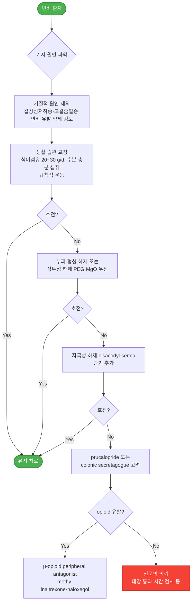

# 소화기계 약제

## <mark style="color:green;">위장 운동 촉진제 (GI prokinetic agent)</mark>

<table><thead><tr><th width="260">성분명 [상품명]</th><th>주요 작용 기전</th></tr></thead><tbody>
<tr><td>metoclopramide <mark style="color:blue;">[맥페란]</mark></td><td>D2 길항, 5-HT4 항진, choline esterase 길항</td></tr>
<tr><td>levosulpiride <mark style="color:blue;">[레보프라이드]</mark></td><td>D2 길항</td></tr>
<tr><td>clebopride <mark style="color:blue;">[크레보릴]</mark></td><td>D2 길항, 5-HT4 항진</td></tr>
<tr><td>itopride <mark style="color:blue;">[가나칸]</mark></td><td>D2 길항, choline esterase 길항 (weak)</td></tr>
<tr><td>domperidone <mark style="color:blue;">[모티리움엠]</mark></td><td>D2 길항</td></tr>
<tr><td>mosapride <mark style="color:blue;">[가스모틴]</mark>, <mark style="color:blue;">[가스티인 CR]</mark></td><td>5-HT4 항진</td></tr>
<tr><td>corydaline <mark style="color:blue;">[모티리톤]</mark></td><td>D2 길항, 5-HT4 항진</td></tr>
</tbody></table>

* 투여 시간 : 위 배출 촉진 목적 시 식전 30분~1시간, 소장세균과다증식증 치료 목적 시 야간
* 금기 : 위장관 출혈, 위장관 폐색/천공
* 항콜린제와 상호 길항작용을 하여 효과가 상쇄될 수 있음

### <mark style="color:orange;">Dopamine D2 receptor antagonist</mark>

* 기전
  * acetylcholine 분비를 억제하는 도파민 수용체를 억제 → acetylcholine 분비↑ → 위장관 평활근의 muscarinic receptor 자극 → 위장관 수축↑
  * medulla oblongata의 chemoreceptor trigger zone에 작용하여 구역/구토 억제; 항구토 위장 운동 촉진(anti-emetic prokinetic) 작용
* 대장 운동을 촉진할 수 있음
* 부작용
  * BBB 통과 약제 : metoclopramide, levosulpiride, clebopride; 추체외로 증상, 진정, 저혈압, 설사, 근육 긴장 이상 반응, 고프로락틴혈증(유즙 분비, 성 기능 장애)
  * BBB 비-통과 약제 : domperidone, itopride


⚠️ **metoclopramide** : 약 40%에서 부작용 발생; 졸음, 흥분, **비가역적 지연운동이상증(tardive dyskinesia)** — 3개월 이상 투여 시 20%에서 발생. FDA 블랙박스 경고(2009); 가능한 최단 기간 사용.



⚠️ **domperidone** : QT 연장 및 심실성 부정맥(심장돌연사) 위험. EMA·MFDS 권고 — 성인 ≤10 ㎎ tid, 최대 30 ㎎/d, 최단 기간(1주 이내) 사용. 구역·구토 증상에 한정 적용. QT 연장 약제·CYP3A4 억제제(azole계 항진균제, macrolide 등) 병용 금기. 심장 질환, QTc 연장, 전해질 이상 환자 금기.


### <mark style="color:orange;">Serotonin agonist</mark>

* 기전 : 5-HT4 또는 5-HT3 수용체에 작용 → acetylcholine 분비↑ → 위장관 수축↑
* 해당 약제 : metoclopramide, clebopride, mosapride, prucalopride
* mosapride : BBB를 통과하지 않아 중추 부작용이 적음; CYP3A4 억제제와 약물 상호 작용, macrolide와 병용 주의

### <mark style="color:orange;">Motilin receptor agonist</mark>

* 기전 : motilin 수용체 활성 → 하부 식도 괄약근, 위체부, 십이지장 상부, 원위부 대장 수축
* motilin : 부교감 신경 말단과 평활근에 작용하는 endogenous peptide hormone; 위장 팽만(예: 식사) 또는 공복 시 주기적으로 십이지장에서 분비되어 위장 운동 촉진 및 펩신 생산 자극

#### <mark style="color:$primary;">Erythromycin</mark>

* 작용 : motilin과 구조적으로 유사하며 저용량 투여 시 motilin 수용체에 작용
* 주의 : CYP3A4에 의해 대사되는 약제와 상호 작용(특히 QT 연장 약제)
* 부작용 : 구역, 구토, 내성 발생
* 용법 : 250 ㎎ tid × 5~7d

### <mark style="color:orange;">Acetylcholinesterase inhibitor</mark>

* 대상 : 소장의 dysmotility 또는 pseudoobstruction
* 허가 : 중증 근무력증
* pyridostigmine : 60~180 ㎎/d <mark style="color:blue;">[메스티논]</mark>

***

## <mark style="color:green;">진경제 (GI antispasmodic agent)</mark>

* 종류 : 비선택적 항콜린제, 선택적 항콜린제, 칼슘차단제, 아편수용체 조절제
* 부작용 : 입마름, 소변 저류, 시야 흐림, 어지럼, 졸림, 녹내장 악화

### <mark style="color:orange;">약제</mark>

* trimebutine : 100~200 ㎎ tid 식전; 약한 opioid agonist 효과 <mark style="color:blue;">[포리부틴]</mark>
* cimetropium : 50 ㎎ tid <mark style="color:blue;">[알기론]</mark>
* phloroglucinol : 160 ㎎ tid <mark style="color:blue;">[후로스판]</mark>
* pinaverium : 50 ㎎ tid <mark style="color:blue;">[디세텔]</mark>
* scopolamine : 10~20 ㎎ tid~qid <mark style="color:blue;">[부스코판]</mark>
* tiropramide : 100 ㎎ bid~tid <mark style="color:blue;">[티로파]</mark>
* dicyclomine : 10~20 ㎎ tid~qid <mark style="color:blue;">[스파토민]</mark>
* 주사제/기타 : hyoscine <mark style="color:blue;">[부스코판 주]</mark>, atropine <mark style="color:blue;">[아트로핀 주]</mark>, hyoscyamine, otilonium, peppermint oil

***

## <mark style="color:green;">기타 항구토제</mark>

### <mark style="color:orange;">항히스타민제, 1세대</mark>

* 대상 : 멀미, 내이 장애 관련 구역/구토; 항콜린 작용이 있음
* dimenhydrinate : 50 ㎎ tid~qid <mark style="color:blue;">[보나링에이]</mark>
* hydroxyzine : 25~100 ㎎ q6h <mark style="color:blue;">[아디팜]</mark>
* meclizine : 12.5~25 ㎎ q4~6h; 25~50 ㎎ q6h <mark style="color:blue;">[염산메클리진]</mark>
* promethazine : 25 ㎎ bid

### <mark style="color:orange;">Serotonin 5-HT3 antagonist</mark>

* 대상 : 화학요법 및 방사선치료, 수술 후 구토
* 부작용 : 두통, 무기력, 변비, 어지럼, 부정맥(QT 연장)
* ondansetron : 4~8 ㎎ bid <mark style="color:blue;">[조프란]</mark>
* granisetron : 1~2 ㎎ bid <mark style="color:blue;">[카이트릴]</mark>
* dolasetron : 100~200 ㎎ qd
* palonosetron : 0.25~0.5 ㎎ 1회 IV <mark style="color:blue;">[알록시 주]</mark>

### <mark style="color:orange;">NK1 antagonist</mark>

* 대상 : 화학요법 유발 구역/구토 (항암제와 병용 시 5-HT3 antagonist보다 우수)
* aprepitant : 초회 125 ㎎ qd, 이후 80 ㎎ qd <mark style="color:blue;">[에멘드]</mark>
* fosaprepitant <mark style="color:blue;">[에멘드 주]</mark>, netupitant <mark style="color:blue;">[아킨지오]</mark>, rolapitant

### <mark style="color:orange;">TCA</mark>

* 대상 : (저용량으로) 만성 특발성 구역, 기능성 구토
* amitriptyline : 10~25 ㎎ hs 또는 10 ㎎ bid~tid <mark style="color:blue;">[에트라빌]</mark>
* nortriptyline : 10~25 ㎎ hs 또는 10 ㎎ bid~tid <mark style="color:blue;">[센시발]</mark>

### <mark style="color:orange;">Benzodiazepine</mark>

* 대상 : 불안 증상이 동반되어 있는 구토
* diazepam : 2.5 ㎎ qd~tid <mark style="color:blue;">[디아제팜]</mark>
* clonazepam : 0.25 ㎎ qd~tid <mark style="color:blue;">[리보트릴]</mark>
* lorazepam : 1~4 ㎎/d #2~3 <mark style="color:blue;">[아티반]</mark>

### <mark style="color:orange;">임신성 구역·구토</mark>

* doxylamine : 5~10 ㎎ qd 취침 시 <mark style="color:blue;">[자미슬]</mark> (✽FDA 임신 투여 A등급)
* pyridoxine : 10 ㎎ q6hr <mark style="color:blue;">[피리독신]</mark>
* 생강 : 250 ㎎ q6hr 또는 1 g qd (응고 장애, 소화성 궤양, 장 폐쇄에서는 금기)


**임신 오조증(hyperemesis gravidarum)의 1차 약물 치료** — doxylamine + pyridoxine 병용이 ACOG·SMFM 권고 1차 요법. 반응이 불충분할 경우 promethazine, prochlorperazine, 또는 ondansetron을 추가 고려; 단, ondansetron은 임신 초기 선천성 심기형·구개열 연관성 논란이 있어 이득과 위험을 평가하여 사용.


***

## <mark style="color:green;">복부 가스 제거제</mark>

### <mark style="color:orange;">Probiotics</mark>

* 작용(가설) : 장내 세균에 의한 가스 형성과 염증을 억제
* AGA 권고
  * 유익성과 안전성에 대한 증거가 부족하므로 급성 위장관염, IBS, IBD, C. difficile 감염 등 대부분의 소화기 문제에 대하여 권고하지 않음
  * 조산아·저체중 출생아에서 특정 probiotics가 mortality와 necrotizing enterocolitis를 줄일 수 있음
  * 항생제 복용 중 C. difficile 예방 및 외과적으로 치료된 궤양성 대장염 합병증인 pouchitis 관리를 위해 probiotics를 고려
* Lactobacillus : L. rhamnosus <mark style="color:blue;">[람노스]</mark>, L. bifidus <mark style="color:blue;">[락토필]</mark>, L. acidophilus <mark style="color:blue;">[안티비오]</mark>
* Saccharomyces boulardii <mark style="color:blue;">[비오플]</mark>
* Bacillus subtilis <mark style="color:blue;">[메디락]</mark>

> 보험기준 : ① 6세 미만에서의 급성 감염성 설사 또는 항생제에 의한 설사, ② 괴사성 장염

### <mark style="color:orange;">Galactosidase</mark>

* 대상 : 가스 형성 음식 유발성 팽만, 유당 불내성
* β-Galactosidase <mark style="color:blue;">[갈타제]</mark>

### <mark style="color:orange;">Simethicone</mark>

* 효과가 입증되지 않음
* 용법 : 40~80 ㎎ tid 식후 또는 취침 시 <mark style="color:blue;">[가소콜]</mark>

### <mark style="color:orange;">비흡수성 항생제</mark>

* 작용 : 장내 세균 활동을 억제하여 탄수화물 발효 감소; 장기 사용에 대한 효과는 입증되지 않음
* 대상 : 소장세균과다증식증(SIBO) 의심 복부 팽만, 방귀
* 부작용 : 부종, 구역, 어지럼, 가스
* rifaximin : 400 ㎎ tid × 7~14d <mark style="color:blue;">[노르믹스]</mark>


rifaximin은 SIBO에 400 ㎎ tid × 7~14일 투여. 간성 뇌증(hepatic encephalopathy) 예방 목적 시 550 ㎎ bid 장기 투여(최대 6개월) 허가됨.


### <mark style="color:orange;">Bismuth subsalicylate</mark>

* 대상 : 악취가 나는 방귀, 소화성 궤양
* 용법 : 525 ㎎ qid 또는 필요시

***

## <mark style="color:green;">변비 치료제 (Laxative)</mark>

***

<strong>변비의 단계적 약물 선택 알고리듬</strong>

***

### <mark style="color:orange;">식이 섬유</mark>

* 소장 원위부 및 대장에서 발효되고 지방산과 가스를 생성하여 위장관 기능과 감각에 영향을 줌
* 권장 용량 : 20~30 g/d
* 충분한 효과 발현까지 ＞6주의 기간이 필요할 수 있음
* 서행성 변비나 해부학적 문제가 있는 경우에는 효과가 없거나 변비 관련 증상을 악화시킬 수 있음
* 부작용 : 복부 가스, 팽만감, 복통(특히 대변 저류가 있는 경우)
* 함유 음식 : 밀기울, 전곡류, 채소, 과일

### <mark style="color:orange;">부피 형성 하제 (Bulk-forming)</mark>

* 함유 성분 및 식품 : psyllium, methylcellulose, isphagula, 씨앗, karaya, guar gum, wheat dextrin, 해초, 한천
* 충분한 물과 함께 섭취해야 효과
* 투여 2~3일 내 반응
* 서행성 변비나 해부학적 문제가 있는 경우 효과가 없거나 변비 관련 증상을 악화시킬 수 있음
* 부작용 : 복부 가스, 팽만감, 협착 시 impaction, Ca·Fe 흡수 장애

<table><thead><tr><th width="260">성분명 [상품명]</th><th>용법</th></tr></thead><tbody>
<tr><td>psyllium <mark style="color:blue;">[무타실]</mark></td><td>1P qd~tid 공복</td></tr>
<tr><td>agiocur pregranules <mark style="color:blue;">[아기오]</mark></td><td>1~2P 저녁 식후</td></tr>
<tr><td>polycarbophil <mark style="color:blue;">[웰콘]</mark></td><td>2T (625 mg/T) qd~qid</td></tr>
<tr><td>methylcellulose (복합제)</td><td>-</td></tr>
</tbody></table>

### <mark style="color:orange;">삼투성 하제 (Hyperosmotics)</mark>

* 종류 : MgO, 비흡수성 다당류(lactulose, lactitol, sorbitol), glycerol, PEG
  * 일부에서 PEG가 보다 효과적 (ACG 가이드라인, 2021)
* 투여 1~3일 내 반응
* 주의 : 신 기능 저하 환자에서 Mg 제제 사용 금지
* 부작용 : 구역, 복부 팽만, 가스, 설사; 특히 비흡수성 다당류에서 흔함; 점차 호전되며 심각한 부작용은 거의 없음(장기간 투여 가능)

<table><thead><tr><th width="340">성분명 [상품명]</th><th>용법</th></tr></thead><tbody>
<tr><td>MgO <mark style="color:blue;">[마그밀에스]</mark></td><td>2T (250 mg/T) qd~tid</td></tr>
<tr><td>lactulose <mark style="color:blue;">[듀파락-이지]</mark></td><td>1~2P qd 아침 식전</td></tr>
<tr><td>lactitol <mark style="color:blue;">[포탈락]</mark></td><td>1P qd 식사와 함께</td></tr>
<tr><td>PEG (polyethylene glycol) 3350 <mark style="color:blue;">[마이라스]</mark> (비보험)</td><td>1P qd 아침</td></tr>
</tbody></table>

### <mark style="color:orange;">자극성 하제 (Stimulant)</mark>

* 작용 : 장 속으로의 수분 분비 및 장 운동 자극
* 종류
  * surfactant laxative : dehydrocholic acid, castor oil
  * anthraquinone : senna, cascara
  * polyphenol : phenolphthalein, Na picosulfate
* 대상 : 다른 하제에 반응 없는 환자에서 단기 사용
* 경구 투여 6~12시간 후 반응; 직장 투여 15~60분 후 반응
* 부작용 : 전해질 불균형, 복통, 구역, 팽만감; 임신 시 금기

<table><thead><tr><th width="260">성분명 [상품명]</th><th>용법</th></tr></thead><tbody>
<tr><td>bisacodyl <mark style="color:blue;">[비사코딜]</mark> (비보험)</td><td>1~3T #1~3, 식후 30분</td></tr>
<tr><td>bisacodyl <mark style="color:blue;">[둘코락스 좌약]</mark></td><td>1S qd</td></tr>
<tr><td>senna <mark style="color:blue;">[아락실 과립]</mark> (복합제)</td><td>1~2P qd (취침 시)~bid</td></tr>
<tr><td>Na picosulfate <mark style="color:blue;">[피코락]</mark> (비보험)</td><td>1T 취침 시</td></tr>
</tbody></table>

### <mark style="color:orange;">대변 연화제 (Stool softener)</mark>

* 종류 : docusate, dehydrocholic acid
  * 복합제 : <mark style="color:blue;">[둘코락스 에스]</mark> (bisacodyl + docusate sodium), <mark style="color:blue;">[메이킨 에스]</mark> (bisacodyl + casanthranol + docusate sodium + dehydrocholic acid)
* 대상 : 수술 후, 출산 후, 치핵, 치열
* 충분한 물과 함께 섭취해야 효과

### <mark style="color:orange;">윤활제 (Lubricant)</mark>

* mineral oil : 15~45 ㎖/d
* glycerin <mark style="color:blue;">[그린 관장약]</mark>
* 경구제 부작용 : 흡인 시 지방성 폐렴, 지용성 Vit 흡수 장애(✽장에서 윤활제에 결합되어 배설)

### <mark style="color:orange;">Prokinetic agent (5-HT4 agonist)</mark>

* 작용 : GI motility 조절 → 대장 통과 시간 단축
* 대상 : 다른 하제에 반응이 없는 환자
* 주의/금기 : 신장 기능 저하, 장폐쇄/천공 의심, 심한 염증성 장질환
* 4주 이내에 효과가 없는 경우 재평가
* prucalopride : 부작용-두통, 복통; 1~2 ㎎ qd <mark style="color:blue;">[레졸로]</mark> (보험기준: 기존 완하제에 적절한 반응이 없는 만성 특발성 변비 성인 여성)
* tegaserod : 여성 변비형 과민대장증후군, 만성 변비 치료; 허혈성 혈관 질환 문제로 사용 제한
* renzapride : 부작용-설사, 두통, 복통, 허혈성 장염

### <mark style="color:orange;">Colonic secretagogue</mark>

#### <mark style="color:$primary;">선택적 Chloride channel activator (ClC-2)</mark>

* 작용 : 장 속으로의 chloride 및 수분 분비 자극, 장 운동 증가
* 부작용 : 구역, 설사, 두통, 복부 팽만, 복통, 부글거림
* lubiprostone : 24 ㎍ bid <mark style="color:blue;">[아미티자]</mark> (비보험)

#### <mark style="color:$primary;">Guanylate cyclase-C agonist</mark>

* 작용 : 장 속으로의 수분 분비 및 장 운동 자극
* 부작용 : 설사, 복부 팽만
* linaclotide : 만성 특발성 변비(CIC) 145 ㎍ qd; IBS-C 290 ㎍ qd; 6세 이상의 기능성 변비에 대해 FDA 승인 72 ㎍ qd (✽6세 미만 금기)
* plecanatide : 3 ㎎ qd

### <mark style="color:orange;">Opioid antagonist</mark>

* 작용 : peripherally acting μ-opioid receptor antagonist; opioid의 장에 대한 영향을 줄임
* 대상 : opioid 유발 변비 (✽BBB를 통과하지 않으므로 opioid의 진통 작용을 감소시키지 않음)
* 다른 방법에 효과 없을 때 고려; 고령자에서는 연구 부족
* alvimopan, methylnaltrexone, naloxegol

***

## <mark style="color:green;">지사제 (Antidiarrheal agent)</mark>

### <mark style="color:orange;">Opiates</mark>

* 주의 : 이질 및 침습성 병원균에 의한 감염 시 증상을 악화시킬 수 있고 마비성 장폐색을 일으키거나 원인균 배출을 지연시킬 수 있음
  * 혈변, 고열, 전신 독성, 치료에도 악화되는 설사 환자에서는 제한
* loperamide : 처음 4 ㎎, 이후 필요시 2 ㎎; 최대 16 ㎎/d <mark style="color:blue;">[로프민]</mark>
* diphenoxylate : 2.5~5 ㎎ qid

### <mark style="color:orange;">진경제 (항콜린제, 항무스카린제)</mark>

* 작용 : 복통 및 복부 불편감 호전
* 용법 : 통증 발생 전 또는 식전 30분 복용 (☞ [진경제](073_.md#gi-antispasmodic-agent))

### <mark style="color:orange;">5-HT3 antagonist</mark>

* 작용 : 위장관 motility 및 sensation의 매개체인 serotonin 작용을 억제시켜 설사 개선
* 부작용 : 변비, 급성 허혈성 대장염
* alosetron : 여성 0.5 ㎎ bid; 부작용 문제로 사용상 제한

### <mark style="color:orange;">Probiotics</mark>

* 변비 또는 설사 환자의 일부에서 효과; 신뢰할만한 연구 부족 (☞ [복부 가스 제거제 — Probiotics](073_.md#probiotics))

### <mark style="color:orange;">흡착제</mark>

#### <mark style="color:$primary;">Dioctahedral smectite</mark>

* 알루미늄 및 마그네슘의 이중 silicate로 구성된 천연 점토
* 작용 : 장점막 보호; 병원성 세균, 독소, 바이러스, 가스, 담즙산 흡착 및 배설
* <mark style="color:blue;">[스타빅]</mark> 3 g/20 ㎖ tid 식간 복용; 3~4세-5 ㎖, ≥15세-20 ㎖; ＞24개월 허가

#### <mark style="color:$primary;">Kaolin-pectin</mark>

* <mark style="color:blue;">[후라베린 큐 시럽]</mark> 3~4세-5 ㎖, ≥15세-20 ㎖ tid (비보험)

#### <mark style="color:$primary;">Bismuth subsalicylate</mark>

* 작용 : 항염·항균; 여행자 설사의 증상 완화, 바이러스성 장염 관련 구토 완화
* 용법 : 525 ㎎, 필요시 1일 최대 8회

### <mark style="color:orange;">기타</mark>

* paregoric : 아편제 (camphorated tincture of opium)
* racecadotril : 장 운동 감소, 분비 억제; 로타 장염 등 급성 장염에 효과 <mark style="color:blue;">[하이드라섹]</mark> (비보험)

***

## <mark style="color:green;">제산제 (Antacid)</mark>

* 주의 : 상부 위장관 증상을 차폐함; 신부전 시 부작용이 상승함
* 용법 : 보통 1일 4회, 매 식후 1~2시간 및 취침 시

<table><thead><tr><th width="280">성분명 [상품명]</th><th>주요 부작용</th></tr></thead><tbody>
<tr><td>Al hydroxide/phosphate <mark style="color:blue;">[겔포스]</mark> (현탁액, 비보험), <mark style="color:blue;">[암포젤]</mark> (정)</td><td>변비; 장기 대량 투여 시 대사 이상</td></tr>
<tr><td>almagate <mark style="color:blue;">[알마겔]</mark> (정/현탁액)</td><td>변비 또는 설사</td></tr>
<tr><td>Na bicarbonate <mark style="color:blue;">[타스나]</mark> (비보험)</td><td>Na·수분 저류, 알칼리혈증</td></tr>
<tr><td>Ca carbonate <mark style="color:blue;">[씨씨본]</mark></td><td>고칼슘혈증, 고인산혈증, 대사성 알칼리증, 신부전</td></tr>
<tr><td>Mg hydroxide/oxide <mark style="color:blue;">[마그밀]</mark>, <mark style="color:blue;">[마그밀에스]</mark></td><td>설사</td></tr>
</tbody></table>

***

## <mark style="color:green;">위 점막 보호제 (Gastric mucosal protective agent)</mark>

### <mark style="color:orange;">Sucralfate</mark>

* Al hydroxide + sucrose octasulfate
* 작용 : 점막 보호, 치유 촉진; 위산 중화 효과는 없음
* 효과 : 소화성 궤양에서 H2-수용체 차단제와 동등한 효과
* 부작용 : 변비, 알루미늄 관련 독성
* 용법 : 공복 투여 (✽pH 3.5 이하에서 효과적으로 위 점막 궤양 바닥에 부착됨)
  * 소화성 궤양 : 치료 1 g tid~qid, 재발 예방 1 g bid <mark style="color:blue;">[아루사루민]</mark> (정/액, 비보험)
  * 역류성식도염 : 1 g qid 식전 1시간 및 취침 시
* 약물 상호 작용 : tetracycline, norfloxacin, ciprofloxacin, theophylline 흡수 저하; PPI와 동시 복용 시 산성 환경이 중성화되어 sucralfate 활성화 저해 → 2시간 간격 복용 권고

### <mark style="color:orange;">Bismuth</mark>

* 작용 : 점막 보호; 헬리코박터에 대한 항균 작용
* H2-수용체 차단제 병용 시 흡수율 증가
* 부작용 : 변비, 검은 변; 고용량 장기 투여 시 신경 독성
* 주의 : 신부전
* colloidal bismuth subcitrate가 bismuth subsalicylate에 비해 흡수율이 높음
* tripotassium dicitrato bismuthate : 300 ㎎ qid 또는 600 ㎎ bid 식전/공복 복용 <mark style="color:blue;">[데놀]</mark>

### <mark style="color:orange;">Prostaglandin E analogue</mark>

* 작용 : 점막 보호, 재생 증진
* 대상 : NSAID 투여 시 (특히 위궤양 또는 출혈 병력자에서 병용)
* 부작용 : 설사, 복통


⚠️ **misoprostol은 임부 절대 금기** — 자궁 수축 유발; 유산, 자궁 파열, 태아 기형(Möbius 증후군 등) 위험. 가임기 여성에서 처방 시 반드시 임신 여부 확인. 피임 실패에 대한 설명 및 동의 필요.


* misoprostol : 200 ㎍ qid, 음식과 함께 복용 <mark style="color:blue;">[싸이토텍]</mark>

### <mark style="color:orange;">기타 점막 보호제</mark>

* Na alginate : 위식도 증상 완화, 포만감 유발을 통한 식욕 억제 효과; 약간의 콜레스테롤 저하 및 고혈압 예방 효과가 보고됨; 부작용-변비 또는 설사; 1~3 g tid~qid 공복 <mark style="color:blue;">[라미나지 액]</mark>
* benexate betadex : 400 ㎎ bid <mark style="color:blue;">[울굿]</mark>
* ecabet : 1 g bid <mark style="color:blue;">[가스트렉스 과립]</mark>
* irsogladine : 4 ㎎ qd <mark style="color:blue;">[가스론엔]</mark>
* polaprezinc : 75 ㎎ bid <mark style="color:blue;">[프로맥]</mark>
* rebamipide : 100 ㎎ tid <mark style="color:blue;">[무코스타]</mark>
* sulglycotide : 200 ㎎ tid <mark style="color:blue;">[글립타이드]</mark>
* teprenone : 50 ㎎ tid <mark style="color:blue;">[셀벡스]</mark>
* eupatilin : 60 ㎎ tid, 90 ㎎ bid <mark style="color:blue;">[스티렌]</mark>

***

## <mark style="color:green;">위산 분비 억제제 (Gastric antisecretory drug)</mark>


**위산 분비 억제제 계열 비교**

<table><thead><tr><th width="160">특성</th><th width="160">H2RA</th><th width="180">PPI</th><th>P-CAB</th></tr></thead><tbody>
<tr><td>작용 기전</td><td>H2 수용체 길항</td><td>프로톤펌프 비가역적 억제 (활성화 필요)</td><td>프로톤펌프 가역적 K 경쟁적 억제</td></tr>
<tr><td>복용 시점</td><td>식사 무관</td><td>식전 30~60분</td><td>식사 무관</td></tr>
<tr><td>효과 발현</td><td>빠름 (1~3시간)</td><td>느림 (최대 효과 5~7일)</td><td>빠름 (1~2시간)</td></tr>
<tr><td>24시간 산 억제율</td><td>&lt;65%</td><td>&gt;90%</td><td>&gt;90%</td></tr>
<tr><td>야간 산 돌파(nocturnal acid breakthrough)</td><td>흔함</td><td>적음</td><td>매우 적음</td></tr>
<tr><td>내성</td><td>2주 이상 시 발생</td><td>거의 없음</td><td>거의 없음</td></tr>
<tr><td>장기 안전성</td><td>양호</td><td>다수 논란 (골절·감염 등)</td><td>자료 축적 중</td></tr>
</tbody></table>


### <mark style="color:orange;">H2-수용체 차단제 (H2-receptor antagonist, H2RA)</mark>

* 반동 현상 : 2주 이상 투여 시 고가스트린혈증의 반동 현상으로 위산 억제 효과가 상쇄됨; 약물 중단 후 위산 분비 증가가 9일간 유지됨
* 제산제 동시 투여 시 H2RA의 흡수가 10~20% 감소됨
* 주의 : 고령, 신부전 시 감량 사용
* 부작용 : 고용량 장기 투여 시 여성형유방증, 발기 부전
* 용량 보정 후 제제별 유의한 효과 차이는 없음 (✽상병에 따른 보험 인정 용량 유의)
* 간에서 CYP450 작용을 저해함; theophylline, phenytoin, diazepam, lidocaine, quinidine, clopidogrel, warfarin 등의 효과가 증대됨

<table><thead><tr><th width="220">성분명 [상품명]</th><th width="160">동등 효과 용량</th><th>상용량</th></tr></thead><tbody>
<tr><td>cimetidine <mark style="color:blue;">[에취투비]</mark></td><td>800 mg</td><td>200 mg qid, 400 mg bid</td></tr>
<tr><td>famotidine <mark style="color:blue;">[가스터]</mark></td><td>40 mg</td><td>20 mg bid, 40 mg hs</td></tr>
<tr><td>nizatidine* <mark style="color:blue;">[액시드]</mark></td><td>300 mg</td><td>150 mg bid, 300 mg hs</td></tr>
<tr><td>roxatidine <mark style="color:blue;">[록산]</mark></td><td>150 mg</td><td>75 mg bid</td></tr>
<tr><td>lafutidine <mark style="color:blue;">[스토가]</mark></td><td>20 mg</td><td>10 mg bid</td></tr>
</tbody></table>

* 발암 물질인 NDMA 함유 문제로 ranitidine <mark style="color:blue;">[큐란]</mark>, <mark style="color:blue;">[잔탁]</mark> 판매 중지(2019.09.); FDA에서는 nizatidine의 제조 공법이 ranitidine과 유사하므로 주의 공지하였으나 제조사들은 자체 검사에서 검출되지 않았다고 발표함

### <mark style="color:orange;">프로톤 펌프 차단제 (Proton pump inhibitor, PPI)</mark>

* 기전 : prodrug으로서 복용·흡수 후 혈류를 거쳐 위장 벽세포의 산성 환경에서 활성화 → 산을 분비하는 효소인 H⁺-K⁺-ATPase(프로톤 펌프)에 결합·영구적 불활성화
* 산 분비 억제 효과 : 표준 용량에서 24시간 산 분비의 ＞90% 억제 (H2RA는 ＜65% 억제)
* 매일 반복 투여 시 5~7일에 최대 효과 도달; 빠른 효과 획득을 위해 투약 시작 2~3일간 bid 투여 또는 취침 시 H2RA를 병용할 수 있음 (보험 주의)
* 반감기는 60분이지만 새로운 펌프 합성까지 18시간이 소요되므로 24시간 이상 위산 억제 효과가 나타나며, 약제 중단 후 2~5일까지 효과가 지속됨
* 대상 : 소화성 궤양, GERD, NSAID 연관 궤양 치료·예방, H. pylori 제균
* 투여 시간 : 펌프가 활성화되는 식사 직전(아침 첫 식사 30~60분 전) 투여; dexlansoprazole(이중 지연 방출)은 식사 무관 복용 가능
* 표준 용량에서의 제제별 유의한 효과 차이 없음
  * 산 억제 효능 상대적 비교(omeprazole 기준 = 1.0) : pantoprazole 0.23, lansoprazole 0.90, esomeprazole 1.60, rabeprazole 1.82
* 대사 : 간 CYP2C19 및 3A4
* 약물 상호 작용 : diazepam, warfarin, phenytoin 제거 연장; clopidogrel 활성화 저해(임상적 유의성 논란 있음); 위산 의존 흡수 약제(ketoconazole, atazanavir 등) 흡수 감소


**clopidogrel과의 병용** — PPI(특히 omeprazole)가 CYP2C19를 통한 clopidogrel 활성화를 경쟁적으로 저해하여 항혈소판 효과가 감소할 수 있다는 우려가 있으나, 현재까지 대규모 연구에서 실제 심혈관 사건 증가는 입증되지 않았음. 임상적으로 PPI 필요 시 clopidogrel과의 병용을 과도하게 회피하지 않아도 됨; 다만 상대적으로 CYP2C19 억제 효과가 적은 pantoprazole, rabeprazole 선택을 고려할 수 있음.


* 부작용 : 폐렴(단기 사용에서 관찰됨), 소장 세균 증식, C. difficile 감염·여행자 설사 위험, 영양 결핍(Vit B12, iron, Ca, Mg), 골다공증·골절(?), 급·만성 신질환, 위암, 치매 증가(?) — 장기간 산 억제에 의한 장 미생물 변화 및 당뇨병 위험 증가 보고도 있음
* 저용량 PPI를 위염 치료에 적용 : esomeprazole 10 ㎎ qd <mark style="color:blue;">[에스코텐]</mark>, <mark style="color:blue;">[에소메졸 디알 서방]</mark>

<table><thead><tr><th width="210">성분명 [상품명]</th><th width="170">동등 효과 용량¹⁾</th><th width="200">소화성 궤양²⁾</th><th>GERD²⁾</th></tr></thead><tbody>
<tr><td>omeprazole <mark style="color:blue;">[오엠피]</mark></td><td>20 mg</td><td>20 mg qd (10)</td><td>20 mg qd</td></tr>
<tr><td>esomeprazole <mark style="color:blue;">[넥시움]</mark></td><td>20 mg</td><td>20 mg qd (해당 없음)</td><td>20~40 mg qd</td></tr>
<tr><td>lansoprazole <mark style="color:blue;">[란스톤]</mark></td><td>30 mg</td><td>30 mg qd (15)</td><td>30 mg qd</td></tr>
<tr><td>dexlansoprazole <mark style="color:blue;">[덱실란트 디알]</mark></td><td>-</td><td>(허가 사항 없음)</td><td>30~60 mg qd</td></tr>
<tr><td>pantoprazole <mark style="color:blue;">[판토록]</mark></td><td>40 mg</td><td>40 mg qd (20)</td><td>40 mg qd~bid</td></tr>
<tr><td>rabeprazole <mark style="color:blue;">[파리에트]</mark></td><td>20 mg</td><td>20 mg qd (10)</td><td>10~20 mg qd~bid</td></tr>
<tr><td>ilaprazole <mark style="color:blue;">[놀텍]</mark></td><td>-</td><td>10 mg qd</td><td>20 mg qd</td></tr>
</tbody></table>

**¹⁾** _GERD and dyspepsia in adults: investigation and management. NICE 2014._\
**²⁾** _Managing peptic ulcer disease in adults. NICE 2019_\
³⁾ 괄호 안의 용량은 _on-demand low dose_

**AGA 권고** (2022)

* 확실한 적응증이 없는 모든 PPI 만성 투여자는 약제 감량을 고려해야 함(✽증상 관리를 위한 경험적 투여는 이득이 없음)
* 적응증에 해당되는 PPI bid 만성 투여자의 대부분은 qd 투여로의 step-down을 고려해야 함
  * 고용량 PPI는 합병증 위험을 높일 수 있는 반면 효과는 입증되지 않음
* 다음의 경우는 중단을 시도하지 않음 : complicated GERD(예: 중증 미란성 식도염·식도 궤양·소화성 협착) 병력자, 바렛 식도, 호산구성 식도염, 특발성 폐섬유증, 상부 위장관 출혈 고위험
* PPI 장기(8주) 치료 후 중단 시 반동 현상 발생 유의(✽약제 중단 2주 후 위산 과다 분비 발생, 2개월까지 지속); 반동으로 상부 위장관 증상 발생 시 H2RA 또는 제산제 투여 고려
* PPI 중단 시 tapering 및 즉각 중단 모두 가능(✽6개월째 증상이 없을 가능성은 중단 전략에 관계 없음)
* PPI 관련 이상반응(PAAE) 우려 때문에 PPI 치료 중단을 결정하면 안 됨

### <mark style="color:orange;">칼륨 경쟁적 위산 분비 억제제 (Potassium-competitive acid blocker, P-CAB)</mark>

* 기전 : 위벽 세포의 프로톤펌프(H⁺/K⁺-ATPase)에 K와 경쟁적·가역적 결합 → 위산 분비 억제
* 위산에 의한 활성화가 필요 없어 식사와 관계없이 복용 가능; 빠른 효과 발현
* 결합 위치 차이 등으로 P-CAB 간의 효과와 부작용이 다를 수 있음 (연구 축적 중)

<table><thead><tr><th width="140">성분명 [상품명]</th><th width="200">특징</th><th>주요 적응증 및 용법</th></tr></thead><tbody>
<tr><td>rebaprazan <mark style="color:blue;">[레바넥스]</mark></td><td>위산 억제 효능이 PPI보다 약함</td><td>소화성 궤양 200 ㎎ qd</td></tr>
<tr><td>vonoprazan</td><td>강력한 제산 효과; PPI보다 긴 반감기 (7시간); CYP3A4 대사</td><td>GERD 20 ㎎ qd × 4~8주; H. pylori 제균 20 ㎎ bid × 7d (amoxicillin·clarithromycin 병용)</td></tr>
<tr><td>fexuprazan <mark style="color:blue;">[펙수클루]</mark></td><td>강력한 제산 효과</td><td>미란성 GERD 40 ㎎ qd × 4주 (불충분 시 4주 추가); 급·만성 위염 점막 병변 개선 10 ㎎ bid × 2주</td></tr>
<tr><td>tegoprazan <mark style="color:blue;">[케이캡]</mark></td><td>빠른 산 분비 억제 시작; hypergastrinemia가 PPI 수준으로 적음; CYP3A4 대사, 반감기 3.7~7.1시간</td><td>비미란성 GERD 50 ㎎ qd × 4주; 위궤양 50 ㎎ qd × 8주; H. pylori 제균 50 ㎎ bid × 7d</td></tr>
</tbody></table>

* tegoprazan 부작용(＞1%) : 구역, 설사, 소화불량, 상기도 바이러스 감염, 흉부 불편감
* tegoprazan 주의/금기 : 간·신 장애, 고령, 벤즈이미다졸류 과민, 임부, 수유부
* tegoprazan 약물 상호 작용 : 위산 의존 흡수 증가 약물의 농도↓ (예: atazanavir, nelfinavir, rilpivirine)


**P-CAB의 임상적 장점** — 식전 복용 불필요, 빠른 초회 산 억제(H. pylori 제균 요법에서 PPI보다 우수한 성적 보고), 야간 산 돌파 감소. 단 장기 안전성 데이터는 PPI 대비 축적 중.

