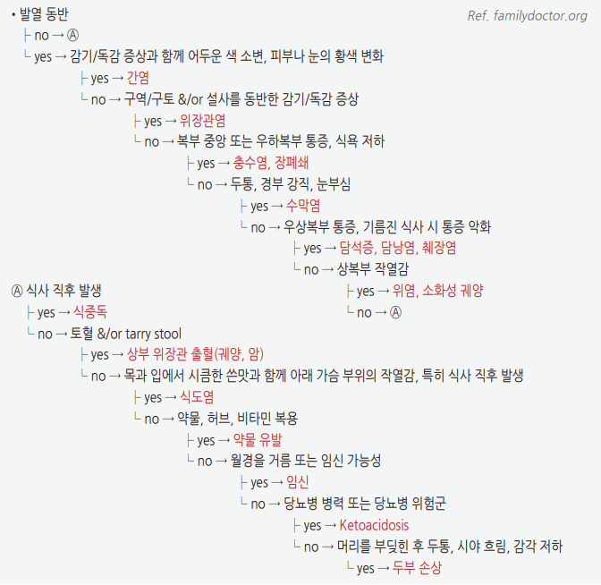

# 위장 질환의 감별

### 질병코드

* <mark style="color:$danger;">R10</mark> 복부 및 골반 통증
* <mark style="color:$danger;">R11</mark> 오심 및 구토
* <mark style="color:$danger;">R13</mark> 연하곤란
* <mark style="color:$danger;">R14</mark> 고창 및 관련 상태
* <mark style="color:$danger;">R19.7</mark> 설사, 상세불명


원인 질환이 확인되면 증상 코드보다 원인 질환 코드를 우선한다.


## <mark style="color:green;">위장관 증상 접근</mark>

위장관 증상을 체계적으로 평가할 때는 다음 5단계 순서로 접근한다.

### <mark style="color:orange;">Step 1 -</mark> <mark style="color:$danger;">🚩 Red Flags! 배제</mark>

<mark style="color:$danger;">**즉각 조치 또는 응급 의뢰**</mark>

* 반발압통(rebound tenderness), 판자배(rigid abdomen), 불수의적 근육 경직 → 복막 자극
* 토혈·혈변·흑색변과 혈역학적 불안정 또는 실신·의식 변화 → 중증 위장관 출혈
* 갑작스럽고 심한 복통, 특히 진찰 소견에 비해 통증이 매우 심하거나 쇼크 동반 → 장허혈·대동맥 질환 등 배제
* 심한 복통과 복부 팽만·가스/대변 배출 중단·지속적 구토 ± 장음 변화 → 급성 장폐색·교액 의심
* 지속적 담즙성 구토(bilious vomiting) 또는 분변성 구토(feculent vomiting)
* 감염이 의심되면서 저혈압·의식 변화·호흡곤란·저관류 등 장기기능장애 소견 → 패혈증/패혈성 쇼크 의심
* 쇼크 또는 의식 변화

<mark style="color:$warning;">**당일 또는 조기 의뢰**</mark>

* 새로 발생하거나 진행하는 삼킴곤란 또는 삼킴 통증
* 혈역학적으로 안정적이지만 원인이 확인되지 않은 흑색변·혈변·토혈
* 의도치 않은 유의한 체중 감소(예: ＞10%/6개월)
* 설명되지 않는 철결핍 또는 철결핍빈혈
* 심한 구역·구토로 탈수·전해질 이상 우려
* 야간 통증 또는 야간 설사
* 복부 종괴 촉지
* 40세 이상에서 새로 발생한 소화불량 또는 상부위장관 증상
  * 국내 기능성 소화불량 진료지침은 높은 위암 발생률을 고려하여 40세 이상 소화불량 환자에서 조기 상부위장관 내시경을 권고한다. 이 연령 기준을 모든 위장관 증상에 일률적으로 적용하지는 않는다.

<mark style="color:$info;">**외래 추적 / 추가 평가 계획**</mark> <mark style="color:$info;">- 즉각 위험은 낮으나 호전 없으면 의뢰</mark>

* 적절한 경험적 치료에도 반응하지 않는 소화불량
* _H. pylori_ 제균 실패 또는 제균 여부 미확인 → 이전 항생제 노출을 고려한 구제요법 및 제균 확인 계획
* 반복되는 복통 또는 만성 설사
* 조직검사상 위축성 위염·장상피화생 확인 → 병변 범위·조직학적 위험도·가족력에 따라 추적 계획
* 자가면역 위염 의심 → 철결핍·비타민 B12 결핍·악성빈혈·자가면역 갑상선질환 평가
* 위암·대장암 가족력이 있는 환자의 새로 발생하거나 지속되는 증상
* DGBI로 판단되지만 삶의 질 저하가 크거나 초기 치료에 반응하지 않는 경우

### <mark style="color:orange;">Step 2 - 해부학적 위치 분류</mark>

<table><thead><tr><th width="200">부위</th><th>주요 감별 질환</th></tr></thead><tbody><tr><td>식도</td><td>GERD, 식도염, 식도 운동장애</td></tr><tr><td>상복부</td><td>기능성 소화불량, 위염, 소화성 궤양(PUD), 췌담도 질환</td></tr><tr><td>우상복부</td><td>담석증, 담낭염, 담관염, 간질환</td></tr><tr><td>등으로 방사되는 상복부</td><td>췌장염, 췌장질환, 대동맥 질환</td></tr><tr><td>우하복부</td><td>충수염, 크론병(Crohn disease), 비뇨생식기 질환</td></tr><tr><td>좌하복부</td><td>게실염, 대장염, 비뇨생식기 질환</td></tr><tr><td>전반적 복통</td><td>장염, 장폐색, 장허혈, 복막염, DGBI</td></tr></tbody></table>


상복부 불편감·오심은 급성관상동맥증후군, 하엽 폐렴, 폐색전증, 대동맥 질환, 당뇨병케톤산증 등 비위장관 질환으로 나타날 수 있다. 고령자·당뇨병 환자·심혈관 위험군에서는 ECG ± troponin을, 임신 가능성이 있는 여성의 복통·구토에서는 임신반응검사를 임상적으로 고려한다.


### <mark style="color:orange;">Step 3 - 시간 및 유발·완화 패턴 평가</mark>

<table><thead><tr><th width="230">발생 양상</th><th>시사 진단</th></tr></thead><tbody><tr><td>갑작스러운 심한 통증</td><td>천공, 장허혈, 대동맥 질환, 담석 산통·요관 산통 등</td></tr><tr><td>급성 발현 후 수 시간~수일 지속</td><td>감염성 위장염, 충수염, 담낭염, 급성 췌장염, 장폐색</td></tr><tr><td>수 주~수개월 반복</td><td>DGBI, 소화성 궤양, 염증성 장질환, 담석 질환, 신생물</td></tr><tr><td>식후 악화</td><td>PDS, 담낭 질환, 위마비, 만성 장허혈; 위궤양에서도 가능</td></tr><tr><td>공복·야간 악화, 음식 또는 제산제로 일시 호전</td><td>십이지장궤양에서 가능하나 진단적 특이도는 낮음</td></tr><tr><td>복통이 배변과 연관되거나 배변 빈도·형태 변화 동반</td><td>IBS</td></tr><tr><td>금식 중에도 지속되는 야간 설사</td><td>분비성·염증성 설사 등 기질성 질환 가능성</td></tr><tr><td>수면 중 통증·설사로 각성</td><td>기질성 질환 가능성을 높이지만 단독 진단 기준은 아님</td></tr></tbody></table>


식사·배변과의 연관성 및 통증 위치는 가능성을 시사할 뿐 진단적 특이도가 제한적이다. 고전적인 위궤양·십이지장궤양 통증 패턴만으로 진단하거나 내시경 필요성을 판단하지 않는다.


### <mark style="color:orange;">Step 4 - DGBI 가능성 및 기질성 질환 평가</mark>

<table><thead><tr><th width="260">DGBI 가능성을 높이는 소견</th><th>기질성 질환 평가가 필요한 소견</th></tr></thead><tbody><tr><td>특정 증상 기반 진단기준 충족</td><td>체중 감소</td></tr><tr><td>증상 변동성이 큼</td><td>철결핍·빈혈</td></tr><tr><td>식사·배변·스트레스와 일정한 연관</td><td>진행성 악화</td></tr><tr><td>적절한 기본 평가에서 원인 질환이 확인되지 않음</td><td>야간 증상</td></tr><tr><td>만성적으로 반복되는 경과</td><td>고령에서 새로 발생한 증상</td></tr><tr><td>다른 DGBI 또는 만성 통증 증후군 동반</td><td>위장관 출혈·복부 종괴·지속 구토</td></tr></tbody></table>


스트레스 연관성이나 정상 검사 결과만으로 DGBI를 진단하거나 기질성 질환을 배제할 수 없다. DGBI는 증상 기반 기준과 제한적인 필수 평가를 이용한 적극적 진단이며, 기질성 질환과 동반될 수도 있다.


**DGBI**

* 기능성 위장관 질환(FGID)은 현재 **장-뇌 상호작용 장애(disorders of gut-brain interaction, DGBI)**라는 개념으로 분류함
* 장-뇌 축(gut-brain axis), 내장 과민성, 운동·점막/면역 기능 변화, 장내 미생물 및 중추 감작 등이 병태생리에 관여
* DGBI는 단일 진단명이 아니라 분류 체계임

**Rome IV 기반 DGBI 주요 분류-대표 질환**

* 위십이지장 기능성 질환: 기능성 소화불량(FD)―식후곤란증후군(PDS), 상복부통증증후군(EPS)
* 식도 기능성 질환: 기능성 흉통, 기능성 삼킴곤란, 기능성 가슴쓰림, 역류과민성
* 장 기능성 질환: 과민성 장 증후군(IBS), 기능성 변비, 기능성 설사, 기능성 복부 팽만/팽창
* 중추 매개 위장관 통증 장애: 중추매개 복통증후군(CAPS)
* 항문직장 기능성 질환: 기능성 배변장애

### <mark style="color:orange;">Step 5 - 경험적 치료 vs 조기 검사</mark>

<table><thead><tr><th width="260">상황</th><th>접근</th></tr></thead><tbody><tr><td>40세 미만 소화불량 + alarm feature 없음</td><td>국내에서는 _H. pylori_ test-and-treat 또는 제한된 기간의 경험적 치료 고려</td></tr><tr><td>40세 이상 새로 발생한 소화불량</td><td>조기 상부위장관 내시경 권고</td></tr><tr><td>전형적 GERD 증상 + alarm feature 없음</td><td>경험적 PPI 치료 가능</td></tr><tr><td>Alarm feature 존재</td><td>증상과 의심 질환에 맞추어 조기 내시경·영상·혈액검사</td></tr><tr><td>지속 구토 / 탈수</td><td>전해질·신기능 평가 및 폐색 등 원인에 따른 영상검사</td></tr><tr><td>만성 설사</td><td>기본 혈액·대변검사 후 적응증에 따라 대장내시경 및 생검</td></tr></tbody></table>

_<mark style="color:$info;">Ref. Clinical Practice Guidelines for Functional Dyspepsia in Korea. J Neurogastroenterol Motil. 2020; Second Asian Consensus Report on Functional Dyspepsia. 2026.</mark>_

## <mark style="color:green;">질환에 따른 주요 증상</mark>

<table><thead><tr><th width="220">질환</th><th>주요 증상 및 특징</th></tr></thead><tbody><tr><td>기능성 소화불량</td><td>증상을 설명할 구조적 질환이 없으면서 일상생활에 지장을 주는 식후 포만감, 조기 포만감, 상복부 통증, 상복부 작열감 중 하나 이상. 진단 전 최소 6개월 전에 시작되어 최근 3개월간 기준 충족 (☞ <a href="076_-functional-dyspepsia-fd.md">기능성 소화불량</a>)</td></tr><tr><td>식후곤란증후군(PDS)</td><td>일상생활에 지장을 주는 식후 포만감 및/또는 조기 포만감이 핵심 증상; 상복부 팽만·트림·구역은 동반 가능</td></tr><tr><td>위식도역류질환(GERD)</td><td>흉골 뒤 작열감(heartburn)과 산 역류가 전형적 증상이며, 작열감이 목 쪽으로 상승할 수 있음 (☞ <a href="081_-gerd.md">위식도역류질환</a>)</td></tr><tr><td>유문부 폐쇄, 위마비</td><td>식후 포만감, 조기 포만감, 오심·구토; 충분한 금식 후에도 유발되는 진수음(succussion splash)은 위 내용물 저류를 시사할 수 있으나 특이도는 제한적</td></tr><tr><td>장폐색</td><td>산통성 복통, 복부 팽만, 구토, 가스·대변 배출 감소/중단; 초기에는 고음성·증가된 장음이 들릴 수 있으나 진행하면 감소 또는 소실 가능</td></tr><tr><td>장마비</td><td>복부 팽만, 오심·구토, 가스·대변 배출 감소와 감소된 장음; 기계적 폐색과 감별 필요</td></tr><tr><td>장허혈</td><td>초기에는 복부 진찰 소견에 비해 매우 심한 통증(pain out of proportion)이 나타날 수 있으나, 진행하면 압통·복막자극징후 발생</td></tr><tr><td>내장성 복통</td><td>위치가 불명확한 정중선 주변 또는 광범위한 통증; 자율신경 증상 동반 가능</td></tr><tr><td>췌장염, 담낭염</td><td>구토로 호전되지 않는 지속적 상복부 또는 우상복부 통증; 각각 등 또는 우견갑부로 방사 가능</td></tr><tr><td>복막 자극</td><td>움직임·기침으로 악화되는 통증, 불수의적 guarding, rigidity, 반발압통</td></tr><tr><td>복벽 통증</td><td>국소적으로 명확한 압통; 복근을 긴장시킬 때 통증이 유지·증가하는 Carnett 징후가 시사적</td></tr><tr><td>삼투성 설사</td><td>금식 시 감소하거나 호전 (☞ <a href="083_-acute-diarrhea.md">설사</a>)</td></tr><tr><td>분비성 설사</td><td>금식 중에도 지속되는 다량의 수양성 설사</td></tr><tr><td>염증성 설사</td><td>혈변·점액변, 발열, 복통, 배변 절박감; 감염성 장염과 IBD 등 감별</td></tr></tbody></table>

## <mark style="color:green;">증상 및 병력에 따른 감별</mark>

<table><thead><tr><th width="300">증상 / 소견</th><th>시사 진단</th></tr></thead><tbody><tr><td>삼킴곤란, 삼킴 통증</td><td>구인두 또는 식도 질환; 진행성 고형식 삼킴곤란은 구조적 병변 우선 배제</td></tr><tr><td>설명되지 않는 흉부 통증</td><td>심장 원인을 먼저 평가한 후 GERD·식도 운동장애·기능성 흉통 고려</td></tr><tr><td>목의 덩어리 느낌(globus sensation)</td><td>인후두 또는 식도 질환, 기능성 globus</td></tr><tr><td>스트레스로 악화</td><td>DGBI에서 흔하지만 기질성 질환을 배제하지 않음</td></tr><tr><td>잠에서 깰 정도의 통증·설사</td><td>기질성 질환 가능성을 높임</td></tr><tr><td>불수의적 복부 근육 경직, 반발압통</td><td>복막 자극</td></tr><tr><td>발열</td><td>감염·염증 질환; 종양열 등도 감별</td></tr><tr><td>어지럼증과 이명을 동반한 구역/구토</td><td>전정계 질환</td></tr><tr><td>체중 감소, 피로감</td><td>종양, 염증 질환, 흡수장애, 내분비·대사 질환, 우울증 등</td></tr><tr><td>기립성 저혈압</td><td>실혈, 탈수, 패혈증, 자율신경계 이상</td></tr><tr><td>선홍색 또는 적갈색 혈변</td><td>대개 하부위장관 출혈; 혈역학적 불안정을 동반한 대량 혈변에서는 상부위장관 출혈도 고려</td></tr><tr><td>하부위장관 출혈(고령)</td><td>게실 출혈, 혈관이형성증, 대장암, 허혈성 대장염 등</td></tr><tr><td>하부위장관 출혈(청년)</td><td>항문 질환, 감염성 장염, 염증성 장질환 등</td></tr><tr><td>흑색변(melena)</td><td>대개 상부위장관 출혈; 소장 또는 우측 대장 출혈도 가능</td></tr><tr><td>복통이 배변과 연관됨</td><td>IBS 시사</td></tr><tr><td>반복적 복부 팽만</td><td>DGBI, 변비, 음식 불내성; 위험 인자가 있을 때 SIBO 등 고려</td></tr></tbody></table>

## <mark style="color:green;">구역·구토의 감별 진단</mark>

<figure><figcaption></figcaption></figure>

***

<table><thead><tr><th width="230">발생 양상·동반 소견</th><th>주요 감별 진단</th></tr></thead><tbody><tr><td>급성, 설사·복통 동반</td><td>감염성 위장염, 식중독</td></tr><tr><td>급성, 심한 복통·복부 팽만</td><td>장폐색, 장허혈, 충수염, 담낭염, 췌장염 등 급성 복부질환</td></tr><tr><td>약물 시작·증량 후</td><td>GLP-1/GIP 작용제, opioid, 항생제, digoxin, levodopa, 항암제 등</td></tr><tr><td>가임기 여성</td><td>임신; 복통·출혈 동반 시 자궁외임신 등 산부인과 응급질환</td></tr><tr><td>두통·시야 또는 신경학적 증상 동반</td><td>편두통, 두개내압 상승, 중추신경계 질환</td></tr><tr><td>현훈·이명 동반</td><td>말초 또는 중추 전정계 질환</td></tr><tr><td>대사 이상·전신질환 소견</td><td>DKA, 요독증, 부신기능저하, 고칼슘혈증, 갑상선질환 등</td></tr><tr><td>만성 식후 포만감·조기 포만감</td><td>위마비, 유문부 폐쇄, 기능성 소화불량</td></tr><tr><td>삽화성 반복 구토, 사이에는 호전</td><td>주기성 구토증후군, 편두통 관련 구토</td></tr><tr><td>장기간 cannabis 사용, 뜨거운 목욕으로 일시 호전</td><td>칸나비노이드 과다구토증후군(cannabinoid hyperemesis syndrome)</td></tr></tbody></table>

## <mark style="color:green;">약물에 의한 위장관 증상</mark>

<table><thead><tr><th width="230">증상</th><th>흔한 원인 약물</th></tr></thead><tbody><tr><td>GERD 악화</td><td>칼슘채널차단제(CCB), 질산염제(nitrates), 항콜린제, theophylline 등</td></tr><tr><td>약물 유발 식도염</td><td>bisphosphonate, doxycycline, 철분제, KCl, NSAIDs</td></tr><tr><td>위궤양 / 위장관 출혈</td><td>NSAIDs, aspirin; 항혈소판제·항응고제 병용 시 출혈 위험 증가</td></tr><tr><td>설사</td><td>metformin, 마그네슘 제제, 항생제, PPI, colchicine, acarbose, SSRI, 하제 등</td></tr><tr><td>변비</td><td>opioid, 항콜린제, 철분제, calcium, verapamil 등</td></tr><tr><td>오심 / 구토</td><td>GLP-1/GIP 작용제, digoxin, levodopa, 항암제, 항생제 등</td></tr><tr><td>조기 포만감 / 위배출 지연</td><td>GLP-1 수용체 작용제, GLP-1/GIP 이중 작용제, opioid, 항콜린제 등</td></tr></tbody></table>


GLP-1 수용체 작용제(예: semaglutide, liraglutide) 및 GLP-1/GIP 이중 작용제(예: tirzepatide)는 오심, 구토, 조기 포만감, 위배출 지연, 설사 또는 변비를 유발할 수 있다. 당뇨병·비만 치료제의 투여 여부와 시작·증량 시점을 병력 청취에 포함한다. 증상이 지속되거나 심하면 단순 약물 부작용으로 단정하지 말고 탈수, 담낭질환, 췌장염, 장폐색 등 다른 원인을 평가하며, 처방 의료진과 감량·일시 중단 여부를 협의한다.


## <mark style="color:green;">상부위장관 내시경 적응증</mark>

### <mark style="color:orange;">일반 원칙</mark>

* Alarm feature(경고 징후) 존재
* 40세 이상에서 새로 발생한 소화불량 또는 상부위장관 증상
* 원인 불명 위장관 출혈 또는 철결핍빈혈
* 지속 구토 또는 진행성 삼킴곤란·삼킴 통증
* 적절한 경험적 치료에도 지속되는 증상
* 내시경 결과가 진단·치료 방침 또는 조직검사 여부를 바꿀 가능성이 있는 경우


40세 미만이고 alarm feature가 없는 소화불량에서는 _H. pylori_ 요소호기검사(UBT) 또는 분변항원검사에 따른 **test-and-treat** 전략이나 제한된 기간의 경험적 치료를 고려할 수 있다. 다만 우리나라는 위암 고발생 지역이므로 위험도와 임상 경과에 따라 내시경 문턱을 낮춘다. _H. pylori_ 검사 전 PPI/PCAB는 최소 2주, 항생제와 bismuth는 최소 4주 중단한다. 제균 치료 후에는 항생제 종료 최소 4주 후, PPI/PCAB 중단 최소 2주 후 UBT·분변항원검사 또는 적절한 생검검사로 제균 성공을 확인한다.


### <mark style="color:orange;">우리나라 위암 국가검진</mark>

* **40세 이상** 남녀는 매 **2년**마다 위장조영검사(UGI) 또는 상부위장관 내시경을 시행한다.
* 이는 무증상 인구의 국가검진 주기이며, 증상 환자의 진단 내시경 시기와 동일한 개념이 아니다.
* 위축성 위염·장상피화생 환자의 추적 간격은 병변 범위, 조직학적 중증도(OLGA/OLGIM), 위암 가족력, _H. pylori_ 상태 및 내시경 질에 따라 개별화한다.
* 광범위 장상피화생, 불완전형 장상피화생, OLGA/OLGIM III–IV 또는 위암 직계가족력 등 고위험군에서는 1년 간격 내시경을 고려할 수 있으나, 국내 지침은 2년보다 짧은 간격이 위암 사망률을 낮추는지 근거가 불충분하여 일률적으로 권고하지 않는다.

_<mark style="color:$info;">Ref. Clinical Practice Guideline for Gastritis in Korea. J Korean Med Sci. 2023.</mark>_

### <mark style="color:orange;">GLP-1/GIP 작용제 복용 환자의 내시경 전 주의사항</mark>

GLP-1 수용체 작용제 및 GLP-1/GIP 이중 작용제는 상부위장관 내시경 시 위 내용물 잔류와 검사 중단·재검사 가능성을 높일 수 있다. 다만 위 내용물 잔류 증가가 임상적으로 유의한 흡인 위험 증가로 직접 이어지는지는 아직 불확실하다.

* OCULUS 무작위 연구(JAMA Intern Med 2026, 중간분석 60명): 시술 전 예정 용량 1회 유지군의 임상적으로 유의한 잔류 위 내용물 25.0% vs 보류군 3.1%; 위내시경 단독 하위군 46.7% vs 5.0%. 대장내시경을 함께 받아 전날 맑은 유동식을 섭취한 하위군에서는 양 군 모두 0%였으나, 식이 효과를 독립적으로 검증하도록 설계된 비교는 아님
* 국내 후향 연구(World J Diabetes 2025): GLP-1 제제 사용군에서 위점막 가시성 불량과 검사 중단·재검사 위험 증가 보고


⚠️ GLP-1/GIP 작용제 복용 환자의 상부위장관 내시경 전 관리

국내 표준 지침은 확립되지 않았으며 국제 다학제 권고도 약제 중단과 식이 관리 범위가 일치하지 않는다. 기존 다학제 권고는 대체로 무증상 환자에서 약제를 계속하면서 위험 기반 관리 또는 24시간 고형식 제한을 제안하지만, 2026년 OCULUS 연구에서는 시술 전 예정 용량 1회 보류가 잔류 위 내용물을 감소시켰다.

* 증량기, 고용량, 심한 오심·구토·복부 팽만·경구 섭취 곤란, 위마비 또는 위배출 지연 질환, opioid 사용 등 위험 인자를 확인한다.
* 약제 유지 또는 시술 전 예정 용량 보류는 당뇨병 조절 상태, 투여 목적, 증상 및 기관의 내시경·마취 프로토콜에 따라 개별 결정한다.
* 시술 전 24시간 고형식을 피하고 맑은 유동식만 섭취하는 방법은 잔류 위 내용물 감소를 위한 합리적 전략이다. 이후 금식 시간은 사용한 유동식의 열량과 마취·내시경 지침에 따른다.
* 당뇨병 환자는 식이 제한 또는 약제 보류 기간에 혈당을 모니터링하고 필요시 처방 의료진과 혈당강하제 조정을 협의한다.
* 심한 위장관 증상이 있으면 선택적 시술 연기를 우선 고려한다.
* 금식 미준수 또는 고위험 환자에서는 숙련된 검사자가 위 초음파(POCUS)를 고려할 수 있다. 잔류물이 의심되면 시술 연기 또는 기도 보호 전략은 내시경·마취팀이 개별 결정한다.


_<mark style="color:$info;">Ref. SPAQI multidisciplinary consensus statement. Br J Anaesth. 2025; Holding vs Continuing GLP-1/GIP Agonists Before Upper Endoscopy: OCULUS Randomized Clinical Trial. JAMA Intern Med. 2026.</mark>_

## <mark style="color:green;">트림 및 복부 팽만의 평가 및 관리</mark>


**bloating**은 주관적 팽만감, **distention**은 객관적 복부 팽창을 의미한다. 두 증상이 반드시 함께 존재하지는 않는다. 난치성 복부 팽창(refractory abdominal distention)에서는 횡격막-복벽 불협응(abdominophrenic dyssynergia, APD)을 고려하며, 횡격막 호흡 훈련이 도움이 될 수 있다.


<figure><figcaption></figcaption></figure>

<strong>트림의 진단 및 관리 알고리듬</strong>

<figure><figcaption></figcaption></figure>

<strong>복부 팽만의 진단 및 관리 알고리듬</strong>

_<mark style="color:$info;">APD = abdominophrenic dyssynergia; ARM = anorectal manometry; CBT = 인지행동치료; CD = celiac disease; CIP = chronic idiopathic intestinal pseudo-obstruction; CMP = comprehensive metabolic profile; FODMAP = fermentable oligosaccharides, disaccharides, monosaccharides and polyols; HRM = high-resolution manometry; NCGS = nonceliac gluten sensitivity; SIBO = small intestinal bacterial overgrowth; TLESR = transient lower esophageal sphincter relaxation; VH = visceral hypersensitivity</mark>_

<em><mark style="color:$info;">Ref. AGA Clinical Practice Update on Evaluation and Management of Belching, Abdominal Bloating, and Distention. Gastroenterology. 2023; Fig. 4, 5.</mark></em>

### <mark style="color:orange;">AGA 트림 및 복부 팽만 관리 핵심 권고</mark>

1. 병력·신체진찰과 impedance-pH 검사는 supragastric(식도상부) belching과 gastric belching 감별에 도움이 된다.
2. Supragastric belching에는 인지행동치료, 횡격막 호흡, speech therapy 및 central neuromodulator 등 brain-gut behavioral therapy를 단독 또는 병합하여 고려한다.
3. 원발성 복부 팽만/팽창 진단에 **Rome IV criteria**를 사용한다.
4. 탄수화물 효소 결핍은 식이 제한 및/또는 호흡 검사로 평가할 수 있다. SIBO 위험이 있는 일부 환자에서는 소장 흡인검사 또는 glucose/lactulose 기반 수소 호흡 검사를 고려한다.
5. 복부 팽만 환자에서 혈청검사로 celiac disease를 평가하고, 양성이면 소장 생검으로 확진한다.
6. Alarm feature, 최근 증상 악화 또는 비정상 신체진찰 소견이 있는 경우 복부 영상 및 상부위장관 내시경을 시행한다.
7. Gastric emptying study는 복부 팽만에 일상적으로 시행하지 않으며, 오심·구토가 동반된 경우 고려한다.
8. 변비 연관 복부 팽만 또는 배출 장애 환자에서는 골반저 질환을 배제하기 위한 anorectal physiology test를 고려한다.
9. Low-FODMAP 등 제한 식이는 가능하면 위장관 영양 전문 영양사의 지도하에 시행하고, 반응 확인 후 불필요한 장기 제한을 피한다.
10. **Probiotics는 복부 팽만/팽창 치료에 사용하지 않는다.**
11. 골반저 이상이 확인된 경우 biofeedback therapy가 도움이 될 수 있다.
12. Central neuromodulator(예: 항우울제)는 내장 과민성을 감소시키고 감각 역치를 높이며 심리적 동반 문제를 개선하여 복부 팽만 치료에 사용될 수 있다.
13. 변비가 동반된 경우 변비 약물 치료를 고려한다.
14. 최면요법, 인지행동치료 등 brain-gut behavioral therapy를 사용할 수 있다.
15. APD 치료에 횡격막 호흡 훈련 및 central neuromodulator를 사용할 수 있다.

## <mark style="color:green;">Clinical Pearls</mark>

* **Pain out of proportion** - 초기 장허혈에서는 진찰 소견에 비해 통증이 매우 심할 수 있음 → 응급 평가
* **야간 증상** - 수면 중 통증·설사로 반복해서 각성하면 기질성 질환 가능성이 높아지지만 단독 진단 기준은 아님
* **복통과 배변의 연관성** - IBS를 시사하지만 다른 질환을 배제하지 않음
* **진행성 삼킴곤란** - 구조적 식도 질환 배제 필요 → 내시경
* **산통성 복통 + 팽만 + 구토 + 가스/대변 배출 중단** - 장폐색 가능성 → 영상검사
* **식후 조기 포만감 + 오심/구토** - 기계적 폐색을 먼저 배제한 후 위마비 의심 시 표준화된 고형식 위배출검사 고려
* **증상 기반 기준 충족 + 적절한 기본 평가에서 원인 불명** - DGBI를 적극적으로 진단하고 brain-gut 접근 고려
* **GLP-1/GIP 작용제 시작·증량 후 위장관 증상** - 약물 관련성을 평가하되 지속적·중증 증상에서는 다른 원인을 함께 배제하고 처방 의료진과 용량 조정을 협의
