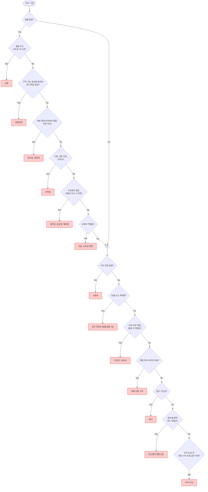
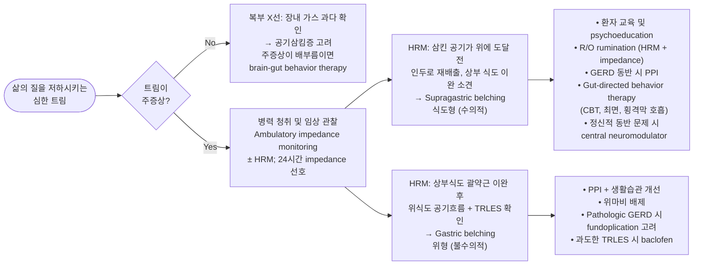
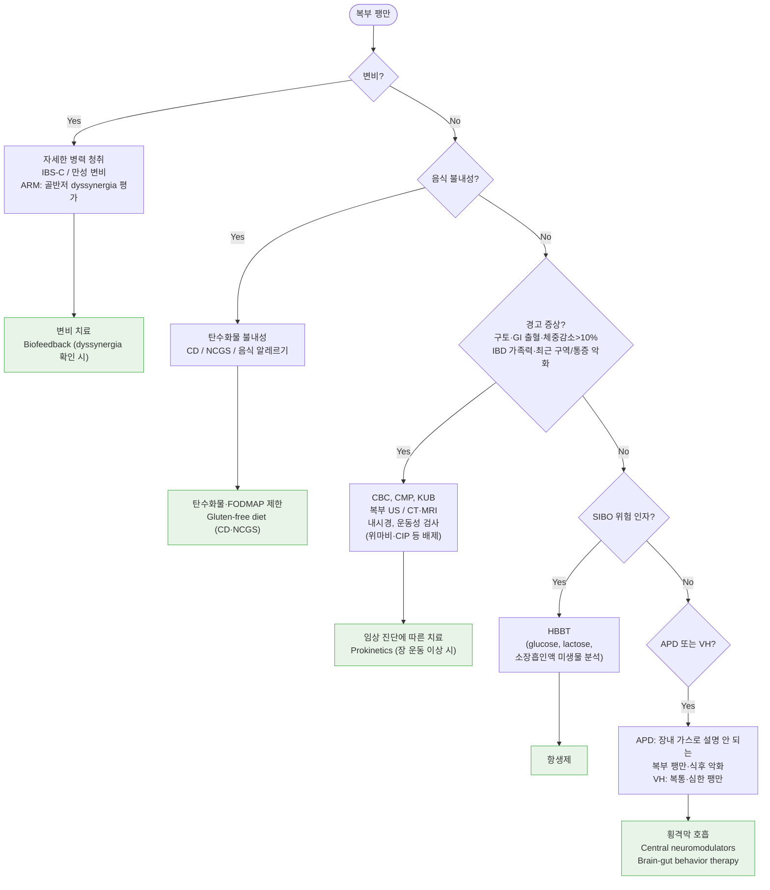

# 위장 질환의 감별

<<<<<<< HEAD

이 챕터는 위장관 증상의 감별 진단을 체계적으로 정리한 참조 챕터입니다. 기능성 소화불량, 위식도역류질환, 설사, 변비, 트림, 복부 팽만 등 개별 질환의 치료는 해당 챕터를 참조하십시오.

=======
### Red Flags!

* ＞50세에서 새로이 발생 - 점차 악화되는 삼킴곤란/통증, 조기 포만감
* 지속되는 구토 - 설명할 수 없는 식욕 부진
* 위장관 출혈(토혈, 흑색변) - 설명할 수 없는 체중 감소 (＞5%/3개월)
* 황달 - 다른 원인이 없는 발열
* 만져지는 복부 종괴 - 다른 원인이 없는 빈혈
* 소화기 악성 종양 가족력 - 소화성 궤양, 위장 수술, 악성 종양 병력
>>>>>>> 425fe522e2ec6f4a28b66d8086b2682bba317ebc

## <mark style="color:green;">질환에 따른 주요 증상</mark>

<<<<<<< HEAD
<table><thead><tr><th width="220">질환</th><th>주요 증상 및 특징</th></tr></thead><tbody>
<tr><td>기능성 소화불량</td><td>기질적 원인 없이 식후 포만감, 조기 포만감, 상복부 통증, 상복부 작열감이 6개월 중 3개월 이상 (☞ <a href="">기능성 소화불량</a>)</td></tr>
<tr><td>식후곤란증후군 (PDS)</td><td>식후 포만감, 팽만, 트림, 구역</td></tr>
<tr><td>위식도역류질환 (GERD)</td><td>상복부에서 시작하여 목으로 방사되는 흉골 뒤 작열감(heartburn) (☞ <a href="">위식도역류질환</a>)</td></tr>
<tr><td>유문폐쇄, 위마비</td><td>식사 1시간 내 발현; 청진 시 갑작스런 움직임에 첨벙하는 소리(succussion splash)</td></tr>
<tr><td>장폐쇄</td><td>식사 1시간 이후 발현; 구토로 증상 호전; 고음의 금속성 장음, 장 운동 증가</td></tr>
<tr><td>장마비</td><td>장음 소실</td></tr>
<tr><td>장허혈</td><td>심한 복통에 비해 압통 없음 (통증-소견 불일치, pain-examination mismatch)</td></tr>
<tr><td>내장 질환에 의한 복통</td><td>복부 중앙 또는 전체적 불편감</td></tr>
<tr><td>췌장염, 담낭염</td><td>구토로 호전되지 않는 상복부 통증; 등 또는 우견갑부로 방사 가능</td></tr>
<tr><td>복막염, 복벽 통증</td><td>염증 부위 통증; 복부 경직, 반사통(rebound tenderness)</td></tr>
<tr><td>삼투압성·자극성 설사</td><td>금식 시 호전 (☞ <a href="">설사</a>)</td></tr>
<tr><td>분비성 설사</td><td>금식해도 설사 지속</td></tr>
<tr><td>약물·독소·위장관 감염</td><td>급성 발생</td></tr>
<tr><td>기저 질환</td><td>만성적 발생</td></tr>
</tbody></table>

## <mark style="color:green;">증상 및 병력에 따른 감별</mark>
=======
* [기능성 소화불량](076_-functional-dyspepsia-fd.md) : 기질적 원인 없이 식후 포만감, 조기 포만감, 상복부 통증, 또는 상복부 작열감이 6개월 중 3개월 이상 나타남
* 식후곤란증후군 (postprandial distress syndrome) : 식후 포만감, 팽만, 트림, 구역
* [위식도역류질환 ](081_-gerd.md): 상복부에서 시작하여 목으로 방사되는 흉골 뒤 작열감(heartburn)
* 유문폐쇄, 위마비 : 식사 1시간 내 발현; 청진 시 갑작스런 움직임에 ‘첨벙’하는 소리
* 장폐쇄 : 식사 1시간 이후 발현. 구토에 의해 증상 호전; high-pitched 장음, 장 운동 증가
* 장마비 : 장음 소실
* 허혈 : 심한 복통; 압통 없음
* 내장 질환에 의한 복통 : 복부 중앙 또는 전체적 불편감
* 췌장염, 담낭염에 의한 통증 : 구토로 호전 되지 않는 상복부 통증
* 복막염, 복벽 통증 : 염증이 있는 부위 통증. 복부 경직, 반사통
* 삼투압 설사, 자극성 설사 : 금식하면 호전 (☞ p.416)
* 분비성 설사 : 금식해도 설사
* 약물, 독소, 위장관 감염 : 급성 발생
* 기저 질환 : 만성적 발생
>>>>>>> 425fe522e2ec6f4a28b66d8086b2682bba317ebc

<table><thead><tr><th width="300">증상 / 소견</th><th>시사 진단</th></tr></thead><tbody>
<tr><td>삼킴곤란, 삼킴 통증, 설명할 수 없는 흉부 통증</td><td>식도 질환</td></tr>
<tr><td>목의 덩어리 느낌(globus sensation)</td><td>식도 또는 인후부 이상, 기능성 위장관 질환</td></tr>
<tr><td>스트레스로 악화</td><td>기능성 질환</td></tr>
<tr><td>잠에서 깰 정도의 통증</td><td>기질적 질환</td></tr>
<tr><td>압통, 불수의적 복부 근육 경직</td><td>염증 질환</td></tr>
<tr><td>발열</td><td>염증 질환, 종양</td></tr>
<tr><td>어지럼증과 이명을 동반한 구역/구토</td><td>미로 질환(labyrinthine disease)</td></tr>
<tr><td>체중 감소, 피로감</td><td>종양, 염증 질환, 흡수 장애, 정신 질환</td></tr>
<tr><td>기립 시 저혈압</td><td>실혈, 탈수, 패혈증, 자율신경계 이상</td></tr>
<tr><td>선홍색 출혈, 적갈색 변</td><td>하부 위장관 출혈</td></tr>
<tr><td>하부 위장관 출혈 (고령)</td><td>종양, 게실염, 혈관 질환</td></tr>
<tr><td>하부 위장관 출혈 (청년)</td><td>항문 주위 질환, 염증성 장질환(IBD)</td></tr>
</tbody></table>

### <mark style="color:$danger;">🚩 Red Flags!</mark>

<mark style="color:$danger;">**즉각 조치 또는 응급 의뢰**</mark>

<<<<<<< HEAD
* 복막 자극 징후: 반사통, 판자배(rigid abdomen), 불수의적 근육 경직
* 대량 위장관 출혈: 토혈, 혈변, 기립성 저혈압 동반
* 급성 장폐색 또는 장허혈 의심: 심한 복통 + 장음 소실 또는 금속성 고음
* 패혈증 징후: 발열 + 빈맥 + 저혈압

<mark style="color:$warning;">**당일 또는 조기 의뢰**</mark>

* 새로 발생한 삼킴곤란 또는 삼킴 통증
* 흑색변 또는 혈변 (출혈 원인 불명)
* 비의도적 체중 감소 (>10% / 6개월)
* 심한 구역/구토로 탈수·전해질 이상 우려

<mark style="color:$info;">**외래 추적 / 추가 평가 계획**</mark> <mark style="color:$info;">- 즉각 위험은 낮으나 경과 관찰 필요</mark>

* 경험적 치료(PPI 4~8주)에 반응 없는 소화불량
* 50세 이상 신규 발생 위장관 증상
* 만성 복통에 체중 감소 또는 피로 동반
* 위암·대장암 가족력이 있는 환자의 조기 발생 증상

## <mark style="color:green;">구역·구토의 감별 진단</mark>

***

=======
<figure><figcaption></figcaption></figure>
>>>>>>> 425fe522e2ec6f4a28b66d8086b2682bba317ebc

<strong>구역·구토의 감별 진단 알고리듬</strong>

<em><mark style="color:$info;">Ref. familydoctor.org</mark></em>

***

<<<<<<< HEAD
## <mark style="color:green;">발생 시간에 따른 감별</mark>

<table><thead><tr><th width="230">발생 양상</th><th>시사 진단</th></tr></thead><tbody>
<tr><td>급성</td><td>급성 감염, 중독증, 장허혈</td></tr>
<tr><td>급성, 수 시간</td><td>담낭 선통(biliary colic)</td></tr>
<tr><td>수일~수 주</td><td>급성 췌장염</td></tr>
<tr><td>만성, 수 주~수개월, 간헐적</td><td>소화성 궤양</td></tr>
<tr><td>식사로 악화</td><td>위궤양, 과민성 장 증후군(IBS)</td></tr>
<tr><td>식사로 호전</td><td>십이지장 궤양</td></tr>
<tr><td>식후 설사, 배변 후 호전</td><td>IBS, 염증성 장질환(IBD)</td></tr>
<tr><td>만성 지속</td><td>만성 염증, 기저 질환, 신생물, 기능성 이상</td></tr>
</tbody></table>
=======
* 비특이적인 증상, 경고 징후가 있음
* 중년 이후(＞50세) 새로이 시작된 증상
* 치료에 반응하지 않음
  * 젊은 연령에서의 경고 징후가 없는 소화성 궤양 증상은 보통 즉각적인 내시경 검사 없이 외래 관리
>>>>>>> 425fe522e2ec6f4a28b66d8086b2682bba317ebc

## <mark style="color:green;">위장관 내시경 적응증</mark>

<<<<<<< HEAD
### <mark style="color:orange;">내시경 시행 원칙</mark>

* 비특이적인 증상이라도 경고 징후(alarm features) 동반 시
* 중년 이후(>50세) 새로 시작된 증상
* 경험적 치료에 반응하지 않는 경우
=======
* 남녀 모두 40세 이상에서 매 2년마다 UGI 또는 상부소화관 내시경 검사를 시행; 위점막의 조직학적 변화가 있거나 위암 직계 가족력이 있는 고위험군은 1년마다 검사 고려
>>>>>>> 425fe522e2ec6f4a28b66d8086b2682bba317ebc


젊은 연령에서 경고 징후가 없는 소화불량 증상은 즉각적인 내시경 검사 없이 경험적 PPI 치료(4~8주) 후 경과 관찰이 가능하다. *H. pylori* 양성 지역에서는 요소 호기 검사 또는 분변 항원 검사를 먼저 시행하는 **test-and-treat** 전략도 권고된다.


<<<<<<< HEAD
### <mark style="color:orange;">우리나라 위암 검진 권고안</mark>

* **40세 이상** 남녀 모두, 매 **2년**마다 위장 조영 검사(UGI) 또는 상부소화관 내시경 시행
* 위점막의 조직학적 변화(장상피화생, 위축성 위염) 또는 **위암 직계 가족력**이 있는 고위험군은 **1년마다** 검사 고려

### <mark style="color:orange;">ASGE 내시경 적응증 권고안</mark>

<table><thead><tr><th width="150">구분</th><th>내용</th></tr></thead><tbody>
<tr><td><strong>적응</strong></td><td>① 내시경 결과에 따라 치료 방법이 변경될 가능성이 있는 경우 ② 경험적 치료가 실패한 경우 ③ 영상 검사의 대안으로서 초기 평가 방법인 경우 ④ 치료 방법을 결정하기 어려운 경우</td></tr>
<tr><td><strong>비적응</strong></td><td>① 검사 결과가 치료 선택에 영향을 주지 않는 경우 ② 치유된 양성 질환의 주기적 추적 검사 (전암성 상태 추적은 제외)</td></tr>
</tbody></table>


Ref. ASGE Standards of Practice Committee. Appropriate Use of GI Endoscopy. *Gastrointest Endosc.* 2012


## <mark style="color:green;">트림 및 복부 팽만의 평가 및 관리</mark>

### <mark style="color:orange;">트림 감별 및 치료 알고리듬</mark>

***

<strong>트림의 감별 진단 및 치료 알고리듬</strong>

<em><mark style="color:$info;">Ref. AGA Clinical Practice Update on Belching, Abdominal Bloating, and Distension. Gastroenterology. 2021</mark></em>

***

### <mark style="color:orange;">복부 팽만 평가 및 치료 알고리듬</mark>

***

<strong>복부 팽만의 평가 및 치료 알고리듬</strong>

<em><mark style="color:$info;">Ref. AGA Clinical Practice Update on Bloating and Distension. Gastroenterology. 2021</mark></em>

=======
**대상**

1. 내시경 검사 결과에 따라 치료 방법이 변경될 가능성이 있는 경우
2. 양성으로 추정되는 소화기 문제에 대한 경험적 치료가 실패한 경우
3. 영상 검사 대안으로서의 초기 평가 방법인 경우
4. 치료 방법을 결정하기 어려운 경우

**제외 대상**

1. 검사 결과가 치료 선택에 영향을 주지 않는 경우
2. 전암성 상태의 추적이 아닌, 치유된 양성 질환의 주기적 추적 검사

<figure><figcaption></figcaption></figure>

<strong>트림의 진단 및 관리 알고리듬</strong>

<figure><figcaption></figcaption></figure>

<strong>복부 팽만의 진단 및 관리 알고리듬</strong>

_<mark style="color:$info;">APD = abdominophrenic dyssynergia; ARM = anorectal manometry; CBT = 인지행동치료; CD = celiac disease; CIP = chronic idiopathic intestinal pseudoobstruction; CMP = comprehensive metabolic profile; FODMAP = fermentable oligosaccharides, disaccharides, monosaccharides; HRM = high resolution manometry; NCGS = nonceliac gluten sensitivity; SIBO = small intestinal bacterial overgrowth; TRLES = transient relaxation of lower esophageal sphincter; VH = visceral hypersensitivity</mark>_

<em><mark style="color:$info;">Ref. AGA Clinical practice update on belching, abdominal bloating, and distention. Fig 4, 5.</mark></em>

>>>>>>> 425fe522e2ec6f4a28b66d8086b2682bba317ebc

***

### <mark style="color:orange;">AGA 트림 및 복부 팽만 관리 권고안</mark>

<<<<<<< HEAD
<table><thead><tr><th width="50">#</th><th>권고 내용</th></tr></thead><tbody>
<tr><td>1</td><td>병력 청취, 신체 검사, impedance pH 검사는 supragastric 또는 gastric belching 감별에 도움</td></tr>
<tr><td>2</td><td>Supragastric belching → brain-gut behavioral therapy (인지행동치료, 횡격막 호흡, speech therapy, central neuromodulator)</td></tr>
<tr><td>3</td><td>원발성 복부 팽만 진단에 <strong>Rome IV criteria</strong> 적용</td></tr>
<tr><td>4</td><td>식이 제한 및/또는 breath test로 탄수화물 효소 결핍 배제; 고위험군에서 소장흡인액 미생물 분석 및 glucose/lactulose 기반 수소 호흡 검사로 SIBO 평가</td></tr>
<tr><td>5</td><td>혈청 검사로 celiac병 배제; 양성 시 소장 생검으로 확진</td></tr>
<tr><td>6</td><td>복부 영상 및 상부 위장관 내시경은 경고 증상, 최근 악화, 또는 비정상 신체 진찰 환자에서만 시행</td></tr>
<tr><td>7</td><td>Gastric emptying study는 복부 팽만 환자에서 일상적으로 시행하지 않음; 오심/구토 동반 시 고려</td></tr>
<tr><td>8</td><td>변비 관련 복부 팽만 또는 배변 곤란 환자에서 골반저 이상 배제를 위한 anorectal physiology test 제안</td></tr>
<tr><td>9</td><td>식이 중재 필요 시 (예: low-FODMAP) 치료 경과 모니터링 권장</td></tr>
<tr><td>10</td><td>복부 팽만에 <strong>probiotics 사용 비권장</strong></td></tr>
<tr><td>11</td><td>골반저 이상 확인 시 biofeedback therapy 유효할 수 있음</td></tr>
<tr><td>12</td><td>Central neuromodulator(항우울제): 내장 과민성 감소, 감각 역치 향상, 심리적 동반 문제 개선</td></tr>
<tr><td>13</td><td>변비 동반 시 변비 치료 약물 고려</td></tr>
<tr><td>14</td><td>Psychological therapy (최면, brain-gut behavior therapy) 활용 가능</td></tr>
<tr><td>15</td><td>Abdominophrenic dyssynergia → 횡격막 호흡 및 central neuromodulator</td></tr>
</tbody></table>


Ref. Lacy BE, et al. AGA Clinical Practice Update on the Evaluation and Management of Belching, Abdominal Bloating, and Distension: Expert Review. *Gastroenterology.* 2021;162(1):134–145.


***

### <mark style="color:red;">질병코드</mark>

<table><thead><tr><th width="130">KCD 코드</th><th>진단명</th></tr></thead><tbody>
<tr><td>R10</td><td>복통 및 골반통</td></tr>
<tr><td>R11</td><td>구역 및 구토</td></tr>
<tr><td>R12</td><td>속쓰림</td></tr>
<tr><td>R13</td><td>삼킴곤란</td></tr>
<tr><td>R14</td><td>고창 및 관련 병태 (복부 팽만, 트림)</td></tr>
<tr><td>K30</td><td>기능성 소화불량</td></tr>
</tbody></table>
=======
    speech therapy, central neuromodulator)를 포함할 수 있음
3. 원발성 복부 팽만 진단에 Rome IV criteria를 사용해야 함
4. 식이 제한 &/or breath test로 탄수화물 효소 결핍을 배제할 수 있음; 위험 환자에서 흡인 소장액 미생물 분석 및 glucose or lactulose 기반 수소 호흡 검사를 SIBO 평가에 사용할 수 있음
5. 혈청 검사로 celiac병을 배제할 수 있으며 혈청 검사 양성 시 소장 생검로 확진해야 함
6. 복부 영상 및 상부 위장관 내시경 검사는 경고 증상, 최근 증상 악화, 또는 비정상 신체 진찰 환자에서만 시행해야 함
7. Gastric emptying study는 복부 팽만 환자에서 일상적으로 시행해서는 안되며, 오심/구토가 있는 경우 고려할 수 있음. Whole gut motility & radiopaque transit study는 신경근병성 질환에 대한 검사를 요구하는 추가적이고 난치성인 하부 위장관 증상이 있지 않는 한 시행하지 않음
8.  변비와 관련이 있어 보이는 복부 팽만 환자나 evacuation이 어려운 환자에서 골반저 이상을 감별하기 위한

    anorectal physiology test를 제안
9. 식이 중재가 필요할 때 (예: low FODMAP)는 monitor treatment를 선호
10. 복부 팽만 치료를 위해 Probiotics를 사용해서는 안 됨
11. 골반저 이상이 확인되었을 때 biofeedback therapy가 복부 팽만에 유효할 수 있음
12. Central neuromodulator(예: 항우울제)가 복부 팽만 치료에 사용됨. 이는 내장 과민성을 줄이고, 감각 역치를 높이고, 심리적 동반 문제를 개선함
13. 변비가 있는 경우 변비에 대한 약물 치료를 고려해야 함
14. Psychological therapy(예: 최면, 뇌‚장 행동 치료)를 사용할 수 있음
15. abdominophrenic dyssynergia 치료에 횡격막 호흡 및 central neuromodulator을 사용함
>>>>>>> 425fe522e2ec6f4a28b66d8086b2682bba317ebc
