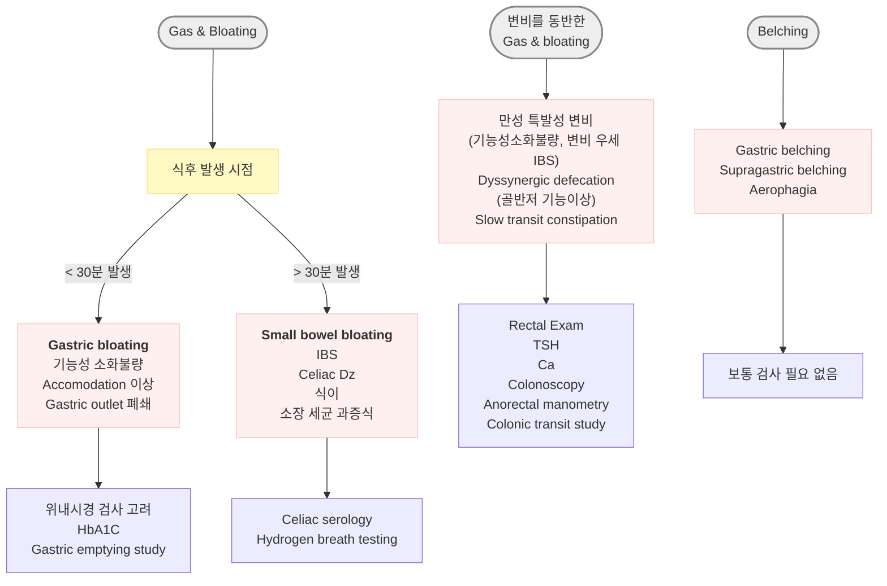
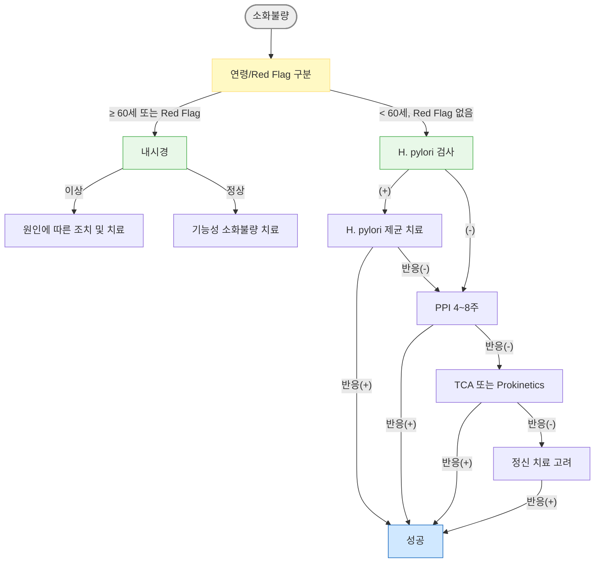

# 소화불량 Indigestion, Dyspepsia

## <mark style="color:green;">일반 사항</mark>

* **소화불량 (indigestion, dyspepsia)** : 구역, 구토, 역류, 상복부 답답함/통증, 가슴쓰림, 조기 포만감, 식후 팽만감 등 상복부의 다양한 증상을 아우르는 비특이적 용어
* 유형
  * **기질성 소화불량 (organic dyspepsia)** : 소화성 궤양, GERD, 위암, 췌담도 질환 등 기질적 원인이 확인되는 경우 (약 ¼)
  * **기능성 소화불량 (functional dyspepsia, FD)** : 증상을 설명할 만한 기질적 이상이 없는 경우 (약 ¾) (☞ [기능성 소화불량](076_-functional-dyspepsia.md))
* 유병률 : 성인 인구의 약 20\~25%; 원발 진료(primary care) 방문의 약 5% 차지
* 병태생리 : 위 운동 장애(위저부 이완 장애, 위배출 지연), 내장 감각 과민(visceral hypersensitivity), 뇌-장 축(brain-gut axis) 이상, 장내 미생물 불균형, 저도 염증(H. pylori 포함) 등 복합 기전

#### <mark style="color:$primary;">관련 증상 정의</mark>

* **구역 (nausea)** : 토하고 싶은 느낌
* **구토 (vomiting, emesis)** : 장/흉복벽 근육 수축에 의한 위장관 내용물의 입을 통한 압박 방출
* **역류 (regurgitation)** : 구역 없이 힘들이지 않은 상태에서의 위 내용물의 입을 통한 방출
* **되새김 (rumination)** : 위 내용물의 역류와 되씹고 되삼킴을 반복; 보통 조절 가능
* [삼킴곤란](077_-dysphagia.md) **(dysphagia)** : 음식물이 입에서 내려가는 과정의 문제; 가슴에 들러붙거나 걸려 있는 느낌
* **삼킴통증 (odynophagia)** : 삼킬 때의 통증; 감염 또는 정제/캡슐 약제에 의한 구인두·식도 점막 궤양, GERD 환자에서 식도 궤양 또는 염증 시 발생
* **인두이물감 (globus pharyngeus)** : 목 안의 덩어리 또는 꽉 찬 느낌; 불안증, 강박증에서 흔함; 삼킴에는 제한이 없거나 삼킴으로 호전
* **가슴쓰림 (heartburn)** : 흉골 하부의 타는 듯한 증상; 간헐적 발생; 식후·운동 중·누웠을 때 주로 발생; 물이나 제산제 복용으로 호전

## <mark style="color:green;">원인 및 위험 인자</mark>

* **기능성 소화불량** : 기질적 질병 없이 발생; 가장 흔한 원인 (☞ [기능성 소화불량](076_-functional-dyspepsia.md))
* **위식도역류질환 (GERD)** : 하부 식도괄약근(LES) 긴장 감소 또는 이완 (☞ 위식도역류질환)
* **내장 감각 과민 (visceral afferent hypersensitivity)** : 위장 감각 신경 과민; 소화불량 환자는 낮은 위저부 팽창 압력에서도 불편감을 느낌; IBS 환자에서도 관찰
* **LES 이완 유발 요인** : 음주, 흡연, 카페인, 지방식, 민트
* **복부 가스 생성** : 탄산음료, 당분, 불용성 식이 섬유, 껌 씹기, 빨리 먹기
* **H. pylori 감염** : 기능성 소화불량에서의 역할에는 논란이 있으나, 제균 치료가 장기 증상 완화에 기여할 수 있음 (NNT ≈ 12)
* **약물** : NSAID, aspirin, 산 분비 억제제/제산제, 항생제, 당뇨(예: metformin), 고혈압(예: ARB, CCB), 고지혈증(예: fibrates, orlistat), 치매(예: donepezil), SSRI, SNRI, 파킨슨(예: dopamine 작용제), steroid, estrogen, progesterone, digoxin, nitrate, bisphosphonate, iron
* **기타** : 유전, 비만, 임신, 스트레스, 우울, 불안, 신체화장애, 폭식증, 알코올 남용
* **기질적 원인** : 위장 운동 장애, 담석증, 담낭염, 췌장염, 충수돌기염, 게실염, 유당 불내성, 셀리악병, 장폐쇄, 위장관 수술 병력, 화학요법, 전정신경염, 폐렴, 요로 결석, PID


**급성 자기 제한적 소화불량**의 흔한 원인: 과식, 빠른 식사, 고지방 음식, 스트레스 상황에서의 식사, 과음, 과다 카페인 섭취


### <mark style="color:$danger;">🚩 Red Flags!</mark>

<mark style="color:$danger;">**즉각 조치 또는 의뢰**</mark>

* 위장관 출혈 징후 (토혈, 흑색변, 혈변)
* 지속되는 구토 + 탈수 징후 (빈맥, 저혈압, 활력 징후 이상)
* 급격한 심한 복통 (복막염, 천공, 허혈 의심)
* 복부 촉지 종괴

<mark style="color:$warning;">**당일 또는 조기 의뢰**</mark>

* 진행성 삼킴곤란 또는 삼킴통증
* 설명할 수 없는 체중 감소 (6개월 이내 ≥10% 감소)
* 황달 동반 소화불량
* 최근 NSAID/항응고제/항혈소판제 복용 중 증상 악화
* 위암 가족력이 있는 환자에서 지속적 소화불량

<mark style="color:$info;">**외래 추적 / 추가 평가 계획**</mark> <mark style="color:$info;">- 즉각 위험 낮으나 호전 없으면 의뢰</mark>

* ≥40세에서 새로 발생한 소화불량 (상부 위장관 내시경 고려)
* 경험적 치료(H. pylori 제균 또는 PPI 4\~8주)에 반응하지 않는 경우
* 반복 재발하는 소화불량
* 경험적 치료 종료 후 조기 재발

## <mark style="color:green;">임상 양상</mark>

* **상복부 통증 또는 작열감 (epigastric pain/burning)** : 식사와 무관하거나 공복 시 악화; 기능성 소화불량 EPS(epigastric pain syndrome) 아형의 주 증상
* **조기 포만감 (early satiety)** : 식사 시작 후 얼마 지나지 않아 포만감이 발생하여 정상 식사량을 마치지 못함; PDS(postprandial distress syndrome) 아형의 주 증상
* **식후 팽만감 (postprandial fullness)** : 식사 후 음식물이 위에 오래 남아 있는 불쾌한 느낌; PDS 아형
* **구역 (nausea)** : 구토를 동반하거나 단독으로 발생; 기능성 소화불량의 흔한 증상
* **가스/트림 (gas/belching)** : 삼킨 공기 또는 위장 내 가스 축적으로 발생
* **복부 팽만감 (bloating)** : 주관적 팽창 느낌; 기질적 또는 기능적 원인 가능


**기능성 소화불량 아형 구분 (Rome IV)**\
EPS(상복부 통증/작열감 우세)와 PDS(식후 불쾌감 우세)는 치료 방향이 다름 — EPS에는 PPI, PDS에는 prokinetics가 우선 (☞ [기능성 소화불량](076_-functional-dyspepsia.md))


## <mark style="color:green;">진단</mark>

* 증상과 징후를 근거로 진단; **Red Flag 유무가 초기 평가의 핵심**
* 신체검사 소견은 진단 특이성이 낮음 (기질적 원인 배제 목적으로 시행)
* 식사 내용과 증상 시간대를 기록하는 **식사 일기** 작성이 진단에 도움

### <mark style="color:orange;">Diagnostic Criteria \[ROME Ⅳ]</mark>

#### <mark style="color:$primary;">기능성 소화불량 (Functional dyspepsia)</mark>

　(☞ [기능성 소화불량](076_-functional-dyspepsia.md))

#### <mark style="color:$primary;">만성 구역/구토증후군 (Chronic nausea vomiting syndrome)</mark>

* 발생한 지 최소 6개월 되었고 최근 3개월간 다음 조건을 모두 충족

1. ≥1일/주 발생하는 일상생활에 지장을 주는 구역증
2. 다음 상태 배제 : 자가 유도 구토, 섭식 장애, 역류, 반추
3. 일상적인 검사(상부 소화기 내시경 포함)에서 기질적·전신적·대사 질환의 증거 없음

#### <mark style="color:$primary;">되새김증후군 (Rumination syndrome)</mark>

* 발생한 지 최소 6개월 되었고 최근 3개월간 다음 조건을 모두 충족

1. 뱉거나 다시 씹어 삼키게 되는, 섭취한 음식의 지속 또는 반복적인 역류
2. 역류 전 구역증이 선행되지 않음

#### <mark style="color:$primary;">인두이물감 (Globus pharyngeus)</mark>

* 최소 1회/주 발생하며 발생한 지 최소 6개월 되었고 최근 3개월간 다음 조건을 모두 충족

1. 진찰·후두경·내시경에서 구조적 이상이 없는, 인후부의 지속 또는 간헐적인, 통증이 없는 덩어리 또는 이물감
   1. 식간에 발생
   2. 삼킴곤란 또는 삼킴통증 없음
   3. 식도 근위부에 장애물(gastric inlet patch) 없음
2. 위식도 역류 또는 eosinophilic esophagitis가 원인이라는 증거 없음
3. 주요 식도 운동 이상 질환 없음\
   (예: achalasia, EGJ outflow obstruction, diffuse esophageal spasm, jackhammer esophagus, absent peristalsis)

#### <mark style="color:$primary;">기능성 가슴쓰림 (Functional heartburn)</mark>

* 최소 2회/주 발생하며 발생한 지 최소 6개월 되었고 최근 3개월간 다음 조건을 모두 충족

1. 흉골 뒤의 타는 듯한 불편감 또는 통증
2. 적절한 산 분비 억제제 치료에도 불구하고 증상이 완화되지 않음
3. 위식도 역류(산 노출 시간 증가 &/or 관련 역류 증상) 또는 eosinophilic esophagitis가 원인이라는 증거 없음
4. 주요 식도 운동 이상 질환 없음

#### <mark style="color:$primary;">기능성 삼킴곤란 (Functional dysphagia)</mark>

　(☞ [기능성 삼킴곤란](077_-dysphagia.md#functional-dysphagia))

### <mark style="color:orange;">검사</mark>

* **실험실 검사** : 다른 질환 배제 목적
  * CBC, 전해질, Ca, RFT, LFT, 단백질/알부민, TSH, amylase, lipase, u-hCG
* **H. pylori 검사** : Red Flag 없는 미조사 소화불량(uninvestigated dyspepsia)에서 test-and-treat 전략의 첫 단계로 권고 (☞ [헬리코박터 감염](080_-helicobacter-pylori-infection.md))
* **영상 검사** : 췌장·담관·혈관 질환, volvulus 의심 시
  * 흉부/복부 X선, CT, 복부 초음파
* **상부위장관내시경** : ≥40세, Red Flag 증상, 치료에 반응하지 않는 경우 (☞ [위장질환의 감별](074_.md#undefined-8))
  * \[미국소화기학회(ACG)] ＜60세에서 소화불량 원인 감별을 위한 일률적 내시경 검사는 권고하지 않음
* 난치성 증상 또는 진행성 체중 감소 시 셀리악병 혈청 검사, 기생충 검사, 변 지방/elastase 검사 고려

### <mark style="color:orange;">감별</mark>

#### <mark style="color:$primary;">증상 시작에 따라</mark>

* 갑자기 발생 : 담낭염, 식중독, 위장염, 췌장염, 약물
* 서서히 발생 : GERD, 위마비, 대사 이상, 임신, 약물

#### <mark style="color:$primary;">증상 발생 시간에 따라</mark>

* 식전 : 알코올, 뇌압 증가, 임신, 요독증
* 식사 중 또는 식후 : 정신적 문제, 소화성 궤양, pyloric stenosis
* 식사 1\~4시간 후 : 위장 출구 폐쇄(예: 궤양, 종양), 위마비
* 지속 : 신체화장애, 우울
* 불규칙 : 우울
* 이른 아침 : 임신

#### <mark style="color:$primary;">구토물의 양상에 따라</mark>

* 소화 안 된 음식물 : achalasia, 식도 질환(예: 게실, 협착)
* 부분 소화된 음식물 : 위장 출구 폐쇄, 위마비
* 담즙 포함 : 소장 근위부 폐쇄
* 악취 또는 대변성 : fistula, 장 폐쇄
* 대량 (＞1,500 ㎖/24h) : 기질적 문제 가능성

#### <mark style="color:$primary;">복통 부위/양상에 따라</mark>

　(☞ [복통](../220_/003_-abdominal-pain.md))

* Epigastric : 췌장 질환, 소화불량, 위염, 소화성 궤양, GERD, MI
* RUQ : 담관 질환, 담낭염
* RLQ : 충수염
* LLQ : 게실염
* Pelvic : PID, 난소 질환, 자궁외임신
* 심한 통증 : 담관 질환, 췌장 질환, 소장 폐쇄, peritoneal irritation
* 구토 전 심한 통증 : 소장 폐쇄

#### <mark style="color:$primary;">동반/관련 증상에 따라</mark>

* 발열 : 감염 질환
* 체중 감소 : 악성 종양
* 설사, malaise, 근육통, 두통 : 바이러스 감염
* 두통, 경부 강직, 어지럼, 국소 신경학적 이상 소견 : 뇌염, 뇌막염, 두부 손상, 편두통, 두개 내압 증가
* 조기 포만감, 식후 팽만감, 복부 불쾌감 : 위마비
* 반복되는 편두통, 과민 대장 증상 : cyclic vomiting syndrome
* 자세 관련 : 신경성
* 어지럼, 안진 : 전정신경염
* Lactose, 밀가루 음식, 콩류 등 음식과 관련된 복부 팽만 : lactose intolerance, 셀리악병, carbohydrate malabsorption, 올리고당 발효(예: 콩류)
* 가슴쓰림 : GERD, 소화불량
* 빈맥, 저혈압 : 탈수, 패혈증, 심근경색

***



<p align="center"><strong>Evaluation of patients with gas, bloating, or belching</strong></p>

<p align="center"><em><mark style="color:$info;">Ref. Am Fam Physician 2019;99(5) Fig 1.</mark></em></p>

***

## <mark style="background-color:$warning;">Management</mark>

### <mark style="color:orange;">치료 방침</mark>

* 심각한 기질적 원인이 없는 경우 안심시킴
* **Red Flag 없는 ＜60세** : H. pylori 검사 → *test-and-treat* 전략을 우선 시행
  → H. pylori (−)이거나 제균 후 증상 지속 시 4\~8주 경험적 PPI 치료
  → 경험적 치료에 반응하지 않거나 재발하는 경우 상부 소화기 내시경 검사 (☞ [기능성 소화불량](076_-functional-dyspepsia.md))
* **≥60세 또는 Red Flag 존재** : 내시경 우선 → 원인에 따른 치료
* 약물이 원인인 경우 용량 조절 또는 약물 교체

***



<p align="center"><strong>소화불량 진단 및 치료 알고리듬</strong></p>

<p align="center"><em><mark style="color:$info;">Ref. ACG Clinical Guideline: Management of Dyspepsia and Gastroparesis (2022)</mark></em></p>

***

## <mark style="color:green;">비-약물 치료 및 예방</mark>

### <mark style="color:orange;">식생활 교정</mark>

1. 아침 식사를 거르지 않는다.
2. 조금 더 먹고 싶을 때 수저를 놓는다 (소식).
3. 야식은 최소화; 잠자리에 들기 최소 2시간 전에 식사를 마친다.
4. 음식은 꼭꼭 씹어 먹는다; 씹지 않은 음식을 물로 삼키지 않는다.
5. 규칙적인 식사 시간을 유지하고 충분한 수면을 취한다.
6. 금연한다.
7. 적당히 운동한다 (식후 가벼운 산책도 효과적).
8. 스트레스를 관리한다.

### <mark style="color:orange;">회피 음식</mark>

* 개인적으로 증상을 유발하는 음식
* 유제품, 카페인 음료(커피, 차), 알코올
* 맵고 짠 자극적인 음식 : 매운 고추, 생마늘
* 지방이 많은 음식 : 육류, 버터, 튀긴 음식, 치즈
* 압축된 음식 : 면류, 떡
* 질긴 음식 : 뿌리채소(예: 도라지, 더덕), 질긴 고기, 점도가 높은 음식/빵
* 잡곡류 : 보리, 현미, 통밀
* 설탕/당분이 많이 든 음식

### <mark style="color:orange;">식이 요법</mark>

* 증상 초기에는 액상 음식 선택이 효과적
* 식후 증상이 주된 환자는 소식, 저지방 식사
* **Low-FODMAP diet** : FODMAP(Fermentable Oligo-, Di-, Mono-saccharide, And Polyol) 식품은 소장에서 천천히 흡수되고 대장 세균에 의해 발효되어 가스 형성 및 삼투압 작용을 유발
  * FODMAP 고함유 식품 : 과당(옥수수 시럽, 사과, 배, 꿀, 수박, 건포도), 유당, fructan(마늘, 양파, 부추, 아스파라거스, 아티초크), 밀 제품(빵, 파스타, 시리얼, 케이크), 소르비톨(stone fruits), 라피노오스(콩류, 양배추)

## <mark style="color:green;">약물 치료</mark>

### <mark style="color:orange;">H. pylori 제균 치료</mark>

* H. pylori 양성인 소화불량 환자에서 **1차 권고** (ACG 2022, 대한소화기학회)
* 제균 성공 시 약 10\~15%에서 장기적 증상 호전 기대 (NNT ≈ 12); 소화성 궤양·위암 예방 효과도 병행
* (☞ [헬리코박터 감염](080_-helicobacter-pylori-infection.md))

### <mark style="color:orange;">PPI (Proton Pump Inhibitor)</mark>

* **적응**: H. pylori (−) 또는 제균 후 증상 지속; EPS(상복부 통증/작열감) 아형에 우선 권장
* 식사 30분 전 복용이 원칙; 4\~8주 투여 후 재평가; 중단 후 재발 시 간헐적 또는 장기 투여 고려
* 동일 효능에서 제네릭 사용 무방

<table><thead><tr><th width="170">약물</th><th width="160">용량</th><th>상품명 예</th></tr></thead><tbody><tr><td>omeprazole</td><td>20 ㎎ qd</td><td><mark style="color:blue;">\[로섹]</mark></td></tr><tr><td>esomeprazole</td><td>20 ㎎ qd</td><td><mark style="color:blue;">\[넥시움]</mark></td></tr><tr><td>pantoprazole</td><td>40 ㎎ qd</td><td><mark style="color:blue;">\[판토록]</mark></td></tr><tr><td>rabeprazole</td><td>10\~20 ㎎ qd</td><td><mark style="color:blue;">\[파리에트]</mark></td></tr><tr><td>lansoprazole</td><td>30 ㎎ qd</td><td><mark style="color:blue;">\[란스톤]</mark></td></tr><tr><td>ilaprazole</td><td>10 ㎎ qd</td><td><mark style="color:blue;">\[놀텍]</mark></td></tr></tbody></table>

### <mark style="color:orange;">H2 차단제 (H2RA)</mark>

* PPI를 사용하기 어려운 경우 또는 경증에 대안으로 사용
* famotidine <mark style="color:blue;">\[가스터]</mark> 20 ㎎ bid (식전)
* cimetidine : 현재 사용 감소 (CYP 약물 상호작용 주의); ranitidine : NDMA 오염으로 시장 철수

### <mark style="color:orange;">Prokinetics</mark>

* **적응**: PDS(식후 팽만감, 조기 포만감) 아형에 우선 권장; H. pylori 제균 또는 PPI 치료에도 증상 지속 시 병용 또는 단독 사용
* 매 식사 30분 전 복용

<table><thead><tr><th width="170">약물</th><th width="180">용량</th><th>상품명</th></tr></thead><tbody><tr><td>mosapride</td><td>5 ㎎ tid (식전 30분)</td><td><mark style="color:blue;">\[가스모틴]</mark></td></tr><tr><td>itopride</td><td>50 ㎎ tid (식전 30분)</td><td><mark style="color:blue;">\[가나톤]</mark></td></tr><tr><td>metoclopramide</td><td>5\~10 ㎎ tid (식전)</td><td><mark style="color:blue;">\[맥페란]</mark></td></tr></tbody></table>


**⚠️ metoclopramide 장기 사용 주의**\
추체외로 증상(tardive dyskinesia) 위험 — 원칙적으로 단기(12주 이내) 사용; 고령자에서 특히 주의


### <mark style="color:orange;">저용량 항우울제 (TCA)</mark>

* H. pylori 제균 및 PPI 치료에도 증상 지속 시 고려 (☞ [소화기계 약제](073_.md))
* 기전 : 내장 과민성 감소, 통증 역치 상향; 항우울 효과와 무관한 저용량에서 작용
* amitriptyline <mark style="color:blue;">\[에나폰]</mark> 10\~25 ㎎ hs (취침 시); 불안/수면 장애 동반 시 특히 유리

### <mark style="color:orange;">제산제 및 기타</mark>

* **제산제** : 급성 증상 완화 목적의 단기 사용; magnesium hydroxide/aluminum hydroxide 복합제 (식후 또는 증상 발생 시)
* **simethicone** (소포제) : 가스/팽만감 증상에 효과적; 단독 또는 제산제 복합 제제로 사용

### <mark style="color:orange;">심리 치료</mark>

* 약물 치료에 반응하지 않는 기능성 소화불량에서 고려
* 인지행동치료(CBT), 최면요법, 이완요법이 일부 환자에서 효과적

***

### <mark style="color:red;">질병코드</mark>

K31.88 소화불량

K31.9 위 및 십이지장의 상세불명 질환

***

## <mark style="color:purple;">처방례</mark>

> **처방례 1.** H. pylori 양성 소화불량
>
> ```
> ※ H. pylori 제균 치료 시행
>    (☞ 헬리코박터 감염 챕터 참조)
> ```
>
> _✽제균 완료 후 4\~8주 내 증상 재평가; 지속 시 PPI 추가_\
> _✽제균 성공률 확인 위해 치료 종료 4주 후 요소 호기 검사(UBT) 또는 대변 항원 검사 권장_

> **처방례 2.** H. pylori 음성 또는 제균 후 지속 증상 — EPS 아형 (상복부 통증/작열감 우세)
>
> ```
> esomeprazole 20 ㎎/T  1T  qd  식전 30분  4주
> ```
>
> _✽4주 후 증상 재평가; 소실 시 투약 중단 후 관찰; 재발 시 간헐적 투여 고려_\
> _✽EPS 아형(상복부 통증·작열감 우세)에 우선 선택; PDS 아형(식후 팽만감 우세)에는 prokinetics 병용 또는 우선_

> **처방례 3.** H. pylori 음성 또는 제균 후 지속 증상 — PDS 아형 (식후 불쾌감 우세)
>
> ```
> mosapride 5 ㎎/T  1T  tid  식전 30분  4주
> ```
>
> _✽식후 팽만감, 조기 포만감이 주 증상인 PDS 아형에 우선; itopride 50 ㎎ tid (가나톤)로 대체 가능_\
> _✽PPI와 병용 가능 (EPS/PDS 혼합형)_

> **처방례 4.** 난치성 기능성 소화불량 (PPI + 저용량 TCA 병용)
>
> ```
> esomeprazole 20 ㎎/T  1T  qd  식전
> amitriptyline 10 ㎎/T  1T  hs  취침 시  4주
> ```
>
> _✽저용량 TCA(10\~25 ㎎)는 내장 과민성 억제 및 통증 역치 상향 목적; 항우울 용량보다 훨씬 낮음을 환자에게 설명_\
> _✽초기 졸림·구강건조·변비 부작용 사전 안내; 졸림은 1\~2주 내 대부분 개선_\
> _✽4주 후 효과 평가; 호전 시 유지 또는 감량; 불안/수면장애 동반 시 더욱 유리_

***

### <mark style="color:$success;">핵심 복약 지도</mark>

> **PPI(위산 억제제)를 처방 받으셨나요?**
>
> * PPI는 위산 분비를 억제하여 상복부 통증, 작열감, 속쓰림을 완화합니다.
> * **식사 30분 전 복용**이 원칙입니다 — 식후 복용 시 효과가 크게 감소합니다.
> * 처방 기간(보통 4\~8주)을 끝까지 복용하십시오; 증상이 좋아졌다고 임의로 중단하지 마십시오.
> * 장기 복용 시 마그네슘 감소, 감염(폐렴, C. difficile 장염) 위험이 소폭 증가하므로 필요 이상으로 장기 복용하지 않도록 합니다.

> **위장 운동 개선제(prokinetics)를 처방 받으셨나요?**
>
> * 식후 팽만감, 조기 포만감, 구역 증상에 효과적입니다.
> * **매 식사 30분 전 복용**해야 효과가 나타납니다 — 식후 복용 시 효과가 떨어집니다.
> * 증상이 있는 기간에 사용하고, 호전되면 감량하거나 중단하는 것이 원칙입니다.

> **저용량 항우울제(amitriptyline 등)를 처방 받으셨나요?**
>
> * 이 약은 항우울 목적이 아니라 **위장관의 통증 신호를 조절**하는 목적으로 매우 낮은 용량(10\~25 ㎎)으로 사용합니다.
> * 취침 전 복용하시면 초기 졸림 부작용이 수면에 도움이 될 수 있습니다.
> * 초기 구강건조, 변비가 생길 수 있지만 1\~2주 내 대부분 개선됩니다.
> * 임의 중단하지 마시고 충분한 기간(4\~8주) 복용 후 담당 의사와 상의하십시오.

> **언제 다시 병원을 방문해야 하나요?**
>
> * 치료 4\~8주 후에도 증상이 호전되지 않는 경우
> * **피를 토하거나 대변이 검게 변하는(흑색변)** 경우 — 즉시 내원
> * 음식을 삼키기 힘들어지거나 삼킬 때 통증이 생기는 경우 — 당일 내원
> * 체중이 원인 불명으로 계속 줄어드는 경우 — 조기 내원
> * 심한 복통 또는 고열이 동반되는 경우 — 즉시 내원

***

### <mark style="color:blue;">환자 안내서</mark>


**소화불량, 대부분은 기능적 문제입니다**

소화불량은 위 내시경 등 검사에서 특별한 이상이 발견되지 않는 "기능성 소화불량"이 가장 많습니다. 위가 음식을 소화하는 속도나 방식에 문제가 생기거나, 위장이 음식에 과민하게 반응하는 것이 주된 원인입니다. 생활 습관 교정과 적절한 약물 치료로 대부분 호전됩니다.


#### <mark style="color:$primary;">왜 소화불량이 생기나요?</mark>

* 위장 운동이 느려지거나 불규칙해지면 음식이 위에 오래 머물러 팽만감과 불편감이 생깁니다.
* 위장 신경이 예민해지면 정상적인 소화 과정에서도 통증이나 불편감을 느낍니다.
* 스트레스, 수면 부족, 불규칙한 식사, 음주, 흡연이 소화 기능을 나쁘게 합니다.
* 소염진통제(NSAID), 아스피린 등 일부 약물이 위장 점막을 자극할 수 있습니다.

#### <mark style="color:$primary;">일상생활에서 어떻게 관리하나요?</mark>

* 🍽️ **소식·천천히** : 한 번에 많이 먹지 말고, 배가 80% 정도 찰 때 식사를 마치십시오. 음식은 꼭꼭 씹어 드십시오.
* ⏰ **규칙적 식사** : 아침을 거르지 마십시오. 야식은 최소화하고, 잠자리에 들기 2시간 전에는 식사를 마치십시오.
* ☕ **자극 음식 줄이기** : 커피·차(카페인), 알코올, 맵고 짠 음식, 튀긴 음식, 탄산음료를 줄이십시오.
* 🚭 **금연** : 흡연은 위·식도 괄약근을 약하게 만들어 소화 장애를 악화시킵니다.
* 🏃 **가벼운 운동** : 식후 가벼운 산책은 위장 운동에 도움이 됩니다.
* 😌 **스트레스 관리** : 스트레스는 위장 기능에 직접 영향을 미칩니다. 규칙적인 수면과 이완 활동으로 스트레스를 줄이십시오.

#### <mark style="color:$primary;">약은 어떻게 드셔야 하나요?</mark>

* 위산 억제제(PPI)와 위장 운동 개선제(prokinetics) 모두 **식사 30분 전** 복용이 중요합니다.
* 증상이 좋아졌다고 임의로 중단하지 마시고 처방된 기간 동안 복용하십시오.
* 취침 전에 복용하는 약(amitriptyline 등)은 졸릴 수 있으니 반드시 **잠자리에 들기 직전** 복용하십시오.

#### <mark style="color:$primary;">이럴 때는 즉시 병원을 방문하세요</mark>

* 피를 토하거나 대변이 검게 변하는 경우
* 음식을 삼키기 힘들어지는 경우
* 체중이 원인 불명으로 계속 줄어드는 경우
* 심한 복통이나 고열이 함께 생기는 경우
