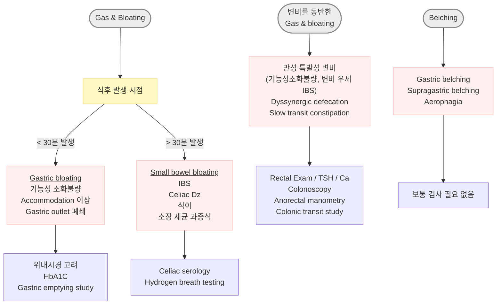
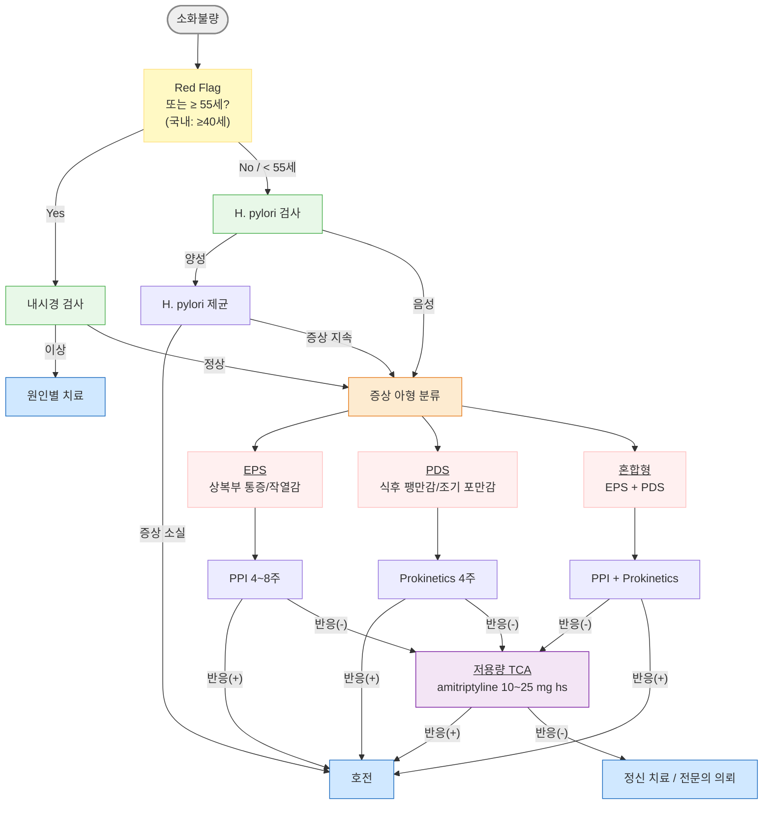

# 소화불량 Indigestion, Dyspepsia

## <mark style="color:green;">일반 사항</mark>

* **소화불량 (indigestion, dyspepsia)** : 구역, 구토, 역류, 상복부 답답함/통증, 가슴쓰림, 조기 포만감, 식후 팽만감 등 상복부의 다양한 증상을 아우르는 비특이적 용어
* 유형
  * **기질성 소화불량 (organic dyspepsia)** : 소화성 궤양, GERD, 위암, 췌담도 질환 등 기질적 원인이 확인되는 경우 (약 ¼ 해당)
  * **기능성 소화불량 (functional dyspepsia, FD)** : 증상을 설명할 만한 기질적 이상이 없는 경우 (약 ¾ 해당)
  * **급성 자기 제한적 소화불량 (acute self-limited dyspepsia)** : 짧은 기간(보통 수일\~1주 이내) 동안 나타나는 소화불량 증상으로, 시간이 지나면서 자연적으로 호전되는 형태. 기능성 소화불량(FD)과 달리 만성적이지 않고, 재발성 경과가 적음; 흔한 원인 - 과식, 빠른 식사, 고지방 음식, 스트레스 상황에서의 식사, 과음, 과다 카페인 섭취
* 기능성 소화불량은 뇌-장 상호작용 장애 (disorder of gut-brain interaction, DGBI)의 대표 질환으로 분류됨&#x20;
* 유병률 : 전체 성인 인구의 약 20\~25%; 1차진료(primary care) 방문의 약 5% 차지
* 병태생리 : 위 운동 장애(위저부 이완 장애, 위배출 지연), 내장 감각 과민(visceral hypersensitivity), 뇌-장 축(brain-gut axis) 이상, 장내 미생물 불균형, 저도 염증(H. pylori 포함) 등 복합 기전
  * "검사는 정상인데 왜 아픈가요?"라는 환자 질문에는 '내장 감각 과민'으로 설명할 수 있음
* **GERD overlap** : FD와 GERD는 상당 부분 중첩됨 - 상복부 작열감·식후 불편감·가슴쓰림이 함께 존재하는 경우가 외래에서 매우 흔함; PPI partial response도 흔히 관찰됨
* **IBS overlap** : 소화불량 환자의 약 1/3은 IBS 증상을 동반하며, 이 경우 치료가 더 까다로울 수 있음; Low-FODMAP, 뇌-장 접근이 특히 도움됨

#### <mark style="color:$primary;">관련 증상 정의</mark>

* **구역 (nausea)** : 토하고 싶은 느낌
* **구토 (vomiting, emesis)** : 장/흉복벽 근육 수축에 의한 위장관 내용물의 입을 통한 압박 방출
* **역류 (regurgitation)** : 구역 없이 힘들이지 않은 상태에서의 위 내용물의 입을 통한 방출
* **되새김 (rumination)** : 위 내용물의 역류와 되씹고 되삼킴을 반복; 무의식적이나 횡격막 호흡법 등 behavioral therapy로 조절 가능
* [삼킴곤란](077_-dysphagia.md) **(dysphagia)** : 음식물이 입에서 내려가는 과정의 문제; 가슴에 들러붙거나 걸려 있는 느낌
* **삼킴통증 (odynophagia)** : 삼킬 때의 통증; 감염 또는 정제/캡슐 약제에 의한 구인두·식도 점막 궤양, GERD 환자에서 식도 궤양 또는 염증 시 발생
* **인두이물감 (globus pharyngeus)** : 목 안의 덩어리 또는 꽉 찬 느낌; 불안증, 강박증에서 흔함; 삼킴에는 제한이 없거나 삼킴으로 호전
* **가슴쓰림 (heartburn)** : 흉골 하부의 타는 듯한 증상; 간헐적 발생; 식후·운동 중·누웠을 때 주로 발생; 물이나 제산제 복용으로 호전

## <mark style="color:green;">원인 및 위험 인자</mark>

* **기능성 소화불량** : 기질적 질병 없이 발생; 가장 흔한 원인
* **위식도역류질환 (GERD)** : 하부 식도괄약근(LES) 긴장 감소 또는 이완 (☞ [위식도역류질환](081_-gerd.md))
* **내장 감각 과민 (visceral hypersensitivity)** : 위장 감각 신경 과민; 소화불량 환자는 낮은 위저부 팽창 압력에서도 불편감을 느낌; IBS 환자에서도 관찰
* **LES 이완 유발 요인** : 음주, 흡연, 카페인, 지방식; peppermint는 GERD 환자에서 증상을 악화시킬 수 있으나, 일부 기능성 소화불량/IBS 환자에서는 증상 완화 효과도 있어 단순히 나쁜 음식으로 분류하기 어려움
* **복부 가스 생성** : 탄산음료, 당분, 불용성 식이 섬유, 껌 씹기, 빨리 먹기
* **H. pylori 감염** : 기능성 소화불량에서의 역할에는 논란이 있으나 제균 치료가 일부에서장기 증상 완화에 기여할 수 있음 (NNT ≈ 12)
* **약물** : NSAID, aspirin, 항생제, 당뇨(예: metformin), 고혈압(예: ARB, CCB), 고지혈증(예: fibrates, orlistat), 치매(예: donepezil), GLP-1 receptor agonist(예: semaglutide, tirzepatide - 구역·위배출 지연 매우 흔함; 새롭게 조기 포만감·구역 발생 시 연관성 확인), SSRI, SNRI, 파킨슨(예: dopamine 작용제), steroid, estrogen, progesterone, digoxin, nitrate, bisphosphonate, iron
  * 장기 PPI 사용은 일부 환자에서 bloating, dysbiosis 관련 증상을 유발할 수 있음
* **기타** : 유전, 비만, 임신, 스트레스, 우울, 불안, 신체화장애, 폭식증, 알코올 남용
* **기질적 원인** : 위장 운동 장애, 담석증, 담낭염, 췌장염, 충수돌기염, 게실염, 유당 불내성, 셀리악병, 장폐쇄, 위장관 수술 병력, 화학요법, 전정신경염, 폐렴, 요로 결석, PID

### <mark style="color:$danger;">🚩 Red Flags!</mark>

<mark style="color:$danger;">**즉각 조치 또는 의뢰**</mark>

* 위장관 출혈 징후 (토혈, 흑색변, 혈변) → 상부위장관 출혈
* 지속되는 구토 + 탈수 징후 (빈맥, 저혈압, 활력 징후 이상)
* 급격한 심한 복통 + 복막 자극 증상 (복막염, 천공, 허혈 의심)
* 고령자·당뇨·고혈압 환자에서 급성으로 발생한 상복부 불편감 → 심근경색

<mark style="color:$warning;">**당일 또는 조기 의뢰**</mark>

* 상복부 종괴 촉지 또는 림프절 종대
* 진행성 삼킴곤란 또는 삼킴통증
* 비의도적 체중 감소 (＞3 ㎏ 또는 체중의 5% 이상)
* 황달 동반 소화불량 (췌담도 질환 의심)
* 최근 NSAID/항응고제/항혈소판제 복용 중 증상 악화
* 위암 가족력이 있는 환자에서 지속적 소화불량
* ≥55세 신규 발생 또는 최근 변화한 소화불량 증상\
  ✽연령 기준은 지역에 따라 다름; 한국은 국가 위암 조기 검진 프로그램(만 40세 이상)과 연계하여 더 낮은 threshold 적용

<mark style="color:$info;">**외래 추적 / 추가 평가 계획**</mark> <mark style="color:$info;">- 즉각 위험 낮으나 호전 없으면 의뢰</mark>

* 새로 발생한 지속성 소화불량
* 새로 발견된 빈혈 (특히 원인 불명의 철 결핍성 빈혈)
* 경험적 치료(H. pylori 제균 또는 PPI 4\~8주)에 반응하지 않는 소화불량
* 반복 재발하는 소화불량 또는 구토
* 야간 증상(수면 방해) 동반 소화불량
* 원인 불명으로 ADL에 심각한 지장을 초래하는 경우
* 심한 불안·우울 등 정신건강 문제가 증상을 주도하는 경우

## <mark style="color:green;">임상 양상</mark>

* **상복부 통증 또는 작열감 (epigastric pain/burning)** : 식사와 무관하거나 공복 시 악화; EPS(epigastric pain syndrome) 아형의 주 증상
* **조기 포만감 (early satiety)** : 식사 시작 후 얼마 지나지 않아 포만감이 발생하여 정상 식사량을 마치지 못함; PDS(postprandial distress syndrome) 아형의 주 증상
* **식후 팽만감 (postprandial fullness)** : 식사 후 음식물이 위에 오래 남아 있는 불쾌한 느낌; PDS 아형
* **구역 (nausea)** : 구토를 동반하거나 단독으로 발생; 기능성 소화불량 및 위마비의 흔한 증상
* **가스/트림 (gas/belching)** : 삼킨 공기 또는 위장 내 가스 축적으로 발생
* **복부 팽만감 (bloating)** : 주관적 팽창 느낌; 기질적 또는 기능적 원인 가능

## <mark style="color:green;">진단</mark>

* 증상과 징후를 근거로 진단; Red Flags 유무가 초기 평가의 핵심
* 신체검사 소견은 진단 특이성이 낮음 (기질적 원인 배제 목적으로 시행)
* 식사-증상 일기 작성이 유용 - 음식 종류뿐 아니라 식사 속도, 식사량, 스트레스 상황, 수면 부족과의 연관을 함께 기록하면 유발 인자 파악에 도움

### <mark style="color:orange;">Diagnostic Criteria \[ROME Ⅳ]</mark>

* Rome IV(2016)는 현재 기능성 위장 질환 진단의 표준이나, Rome V 개정을 위한 국제 논의가 진행 중임 (2025년 기준 미발표)

#### <mark style="color:$primary;">기능성 소화불량 (Functional dyspepsia)</mark>

　☞ [기능성 소화불량](076_-functional-dyspepsia-fd.md)

#### <mark style="color:$primary;">만성 구역/구토증후군 (Chronic nausea vomiting syndrome)</mark>

* 발생한 지 최소 6개월 되었고 최근 3개월간 다음 조건을 모두 충족

1. ≥1일/주 발생하는 일상생활에 지장을 주는 구역증
2. 다음 상태 배제 : 자가 유도 구토, 섭식 장애, 역류, 반추
3. 일상적인 검사(상부 소화기 내시경 포함)에서 기질적·전신적·대사 질환의 증거 없음

#### <mark style="color:$primary;">되새김증후군 (Rumination syndrome)</mark>

* 발생한 지 최소 6개월 되었고 최근 3개월간 다음 조건을 모두 충족

1. 뱉거나 다시 씹어 삼키게 되는, 섭취한 음식의 지속 또는 반복적인 역류
2. 역류 전 구역증이 선행되지 않음

#### <mark style="color:$primary;">인두이물감 (Globus pharyngeus)</mark>

* 최소 1회/주 발생하며 발생한 지 최소 6개월 되었고 최근 3개월간 다음 조건을 모두 충족

1. 진찰·후두경·내시경에서 구조적 이상이 없는, 인후부의 지속 또는 간헐적인, 통증이 없는 덩어리 또는 이물감
   1. 식간에 발생
   2. 삼킴곤란 또는 삼킴통증 없음
   3. 식도 근위부에 장애물(gastric inlet patch) 없음
2. 위식도 역류 또는 eosinophilic esophagitis가 원인이라는 증거 없음
3. 주요 식도 운동 이상 질환 없음 (예: achalasia, EGJ outflow obstruction, diffuse esophageal spasm, jackhammer esophagus, absent peristalsis)

#### <mark style="color:$primary;">기능성 가슴쓰림 (Functional heartburn)</mark>

* 최소 2회/주 발생하며 발생한 지 최소 6개월 되었고 최근 3개월간 다음 조건을 모두 충족

1. 흉골 뒤의 타는 듯한 불편감 또는 통증
2. 적절한 산 분비 억제제 치료에도 불구하고 증상이 완화되지 않음
3. 위식도 역류(산 노출 시간 증가 &/or 관련 역류 증상) 또는 eosinophilic esophagitis가 원인이라는 증거 없음
4. 주요 식도 운동 이상 질환 없음

#### <mark style="color:$primary;">기능성 삼킴곤란 (Functional dysphagia)</mark>

　☞ [기능성 삼킴곤란](077_-dysphagia.md#functional-dysphagia)

### <mark style="color:orange;">검사</mark>

* **실험실 검사** : 다른 질환 배제 목적
  * CBC, 전해질, Ca, RFT, LFT, 단백질/알부민, TSH, amylase, lipase, u-hCG
* **H. pylori 검사** : Red Flag 없는 미조사 소화불량에서 test-and-treat 전략의 첫 단계로 권고 (☞ [헬리코박터 감염](080_-helicobacter-pylori-infection.md))
* **영상 검사** : 췌장·담관·혈관 질환, volvulus 의심 시
  * 흉부/복부 X선, CT, 복부 초음파
* **상부위장관내시경** : Red Flag 증상, 치료에 반응하지 않는 경우 (☞ [위장질환의 감별](074_.md#undefined-8))
  * ≥55세 새로 발생 소화불량 : 내시경 권고
  * 40\~54세 : 위암 위험 인자(가족력, 흡연, 체중 감소 등) 동반 또는 증상 지속 시 고려
  * 우리나라는 위암 유병률이 높고 국가 위암 조기 검진 프로그램(만 40세 이상, 2년마다 위내시경 또는 위장조영술)과 연계하여 40세 이상에서 새로운 소화불량 발생 시 내시경 검사를 우선 고려하는 경향이 강함
  * \[ACG] ＜60세에서 일률적 내시경 검사는 권고하지 않음
* 난치성 증상 또는 진행성 체중 감소 시 셀리악병 혈청 검사, 기생충 검사, 변 지방/elastase 검사 고려

### <mark style="color:orange;">감별</mark>

#### <mark style="color:$primary;">증상 시작에 따라</mark>

* 갑자기 발생 : 담낭염, 식중독, 위장염, 췌장염, 약물
* 서서히 발생 : GERD, 위마비, 대사 이상, 임신, 약물

#### <mark style="color:$primary;">증상 발생 시간에 따라</mark>

* 식전 : 알코올, 뇌압 증가, 임신, 요독증
* 식사 중 또는 식후 : 정신적 문제, 소화성 궤양, pyloric stenosis
* 식사 1\~4시간 후 : 위장 출구 폐쇄(예: 궤양, 종양), 위마비
* 지속 : 신체화장애, 우울
* 불규칙 : 우울
* 이른 아침 : 임신

#### <mark style="color:$primary;">구토물의 양상에 따라</mark>

* 소화 안 된 음식물 : achalasia, 식도 질환(예: 게실, 협착)
* 부분 소화된 음식물 : 위장 출구 폐쇄, 위마비
* 담즙 포함 : 소장 근위부 폐쇄
* 악취 또는 대변성 : fistula, 장 폐쇄
* 대량 (＞1,500 ㎖/24h) : 기질적 문제 가능성

#### <mark style="color:$primary;">복통 부위/양상에 따라</mark>

　☞ [복통](../220_/003_-abdominal-pain.md)

* Epigastric : 췌장 질환, 소화불량, 위염, 소화성 궤양, GERD, MI
* RUQ : 담관 질환, 담낭염
* RLQ : 충수염
* LLQ : 게실염
* Pelvic : PID, 난소 질환, 자궁외임신
* 심한 통증 : 담관 질환, 췌장 질환, 소장 폐쇄, peritoneal irritation
* 구토 전 심한 통증 : 소장 폐쇄

#### <mark style="color:$primary;">동반/관련 증상에 따라</mark>

* 발열 : 감염 질환
* 체중 감소 : 악성 종양
* 설사, malaise, 근육통, 두통 : 바이러스 감염
* 두통, 경부 강직, 어지럼, 국소 신경학적 이상 소견 : 뇌염, 뇌막염, 두부 손상, 편두통, 두개 내압 증가
* 조기 포만감, 식후 팽만감, 복부 불쾌감 : 위마비
* 반복되는 편두통, 과민 대장 증상 : cyclic vomiting syndrome
* 자세 관련 : 신경성
* 어지럼, 안진 : 전정신경염
* Lactose, 밀가루 음식, 콩류 등 음식과 관련된 복부 팽만 : lactose intolerance, 셀리악병, carbohydrate malabsorption, 올리고당 발효(예: 콩류)
* 가슴쓰림 : GERD, 소화불량
* 빈맥, 저혈압 : 탈수, 패혈증, 심근경색


**위마비(gastroparesis)** : 다음 상황에서 위마비 가능성을 적극 고려

* 당뇨병 환자 (특히 유병 기간이 긴 경우)
* GLP-1 receptor agonist(semaglutide, tirzepatide 등) 사용 중 새로 발생한 조기 포만감·구역
* 식후 수 시간이 지나도 음식물이 남아있는 느낌 또는 소화 안 된 음식물 구토
* 내시경에서 공복 임에도 음식물 저류 확인
* 체중 감소 동반

→ 위배출 검사(gastric emptying study) 또는 상부위장관내시경 고려


#### <mark style="color:$primary;">EPS / PDS / GERD overlap 감별</mark>

<table data-header-hidden><thead><tr><th width="160"></th><th></th><th></th><th></th></tr></thead><tbody><tr><td>구분</td><td>EPS (Epigastric Pain Syndrome)</td><td>PDS (Postprandial Distress Syndrome)</td><td>GERD overlap<br>(FD + GERD 중첩)</td></tr><tr><td><strong>핵심 증상</strong></td><td>상복부 통증, 작열감</td><td>조기 포만감, 식후 팽만감</td><td>가슴쓰림, 산 역류 + FD 증상</td></tr><tr><td><strong>식사와 관계</strong></td><td>식사와 무관하거나 공복 시 악화</td><td>식후 악화가 특징적</td><td>식후·눕거나 야간에 악화</td></tr><tr><td><strong>조기 포만감</strong></td><td>±</td><td>+++</td><td>±</td></tr><tr><td><strong>가슴쓰림/역류</strong></td><td>±</td><td>±</td><td>+++</td></tr><tr><td><strong>야간·체위성 증상</strong></td><td>드묾</td><td>드묾</td><td>흔함</td></tr><tr><td><strong>PPI 반응</strong></td><td>좋음</td><td>제한적/부분적</td><td>매우 좋음</td></tr><tr><td><strong>Prokinetics 반응</strong></td><td>제한적</td><td>좋음</td><td>일부 도움</td></tr><tr><td><strong>병태생리 핵심</strong></td><td>내장 과민 (visceral hypersensitivity)</td><td>위저부 accommodation 이상, 위배출 지연</td><td>산 역류 + FD 기전 혼합</td></tr><tr><td><strong>외래 표현</strong></td><td>속이 쓰리고 아프다</td><td>조금만 먹어도 꽉 찬다</td><td>신물 올라오고 타는 느낌</td></tr><tr><td><strong>1차 접근</strong></td><td>H. pylori → PPI</td><td>식사 조절 + prokinetics</td><td>생활 교정 + PPI</td></tr></tbody></table>

***



<p align="center"><strong>Evaluation of patients with gas, bloating, or belching</strong></p>

<p align="center"><em><mark style="color:$info;">Ref. Am Fam Physician 2019;99(5) Fig 1.</mark></em></p>

***

## <mark style="background-color:$warning;">Management</mark>

### <mark style="color:orange;">치료 방침</mark>

* 심각한 기질적 원인이 없는 경우 안심시킴
* Red Flag 없는 ＜55세 (국내 기준: ＜40세) : H. pylori 검사 → test-and-treat 전략 우선 시행 → H. pylori (−)이거나 제균 후 증상 지속 시 증상 아형(EPS/PDS/혼합)에 맞는 경험적 치료 (☞ [기능성 소화불량](076_-functional-dyspepsia.md)) → 경험적 치료에 반응하지 않거나 재발 시 상부 소화기 내시경 검사
* ≥55세 (국내: ≥40세) 또는 Red Flag 존재 : 내시경 우선 → 원인에 따른 치료
* 약물이 원인인 경우 용량 조절 또는 약물 교체; GLP-1 agonist 사용 중 새로운 소화불량 발생 시 연관성 확인
* PPI 효과 불충분하거나 CYP2C19 대사 우려(예: clopidogrel 병용) 시 P-CAB으로 교체 고려

***



<p align="center"><strong>소화불량 진단 및 치료 알고리듬 (증상 아형 기반)</strong></p>

***

## <mark style="color:green;">비-약물 치료 및 예방</mark>

### <mark style="color:orange;">식생활 교정</mark>

1. 아침 식사를 거르지 않는다.
2. 조금 더 먹고 싶을 때 수저를 놓는다 (소식).
3. 야식은 최소화; 잠자리에 들기 최소 2시간 전에 식사를 마친다.
4. 음식은 꼭꼭 씹어 먹는다; 씹지 않은 음식을 물로 삼키지 않는다.
5. 규칙적인 식사 시간을 유지하고 충분한 수면을 취한다.
6. 금연한다.
7. 적당히 운동한다 (식후 가벼운 산책도 효과적).
8. 스트레스를 관리한다.

### <mark style="color:orange;">회피 음식</mark>

근거 기반 회피 권고:

* 고지방 음식 : 육류, 버터, 튀긴 음식, 치즈
* 과식 (한 번에 많은 양 섭취)
* 맵고 짠 자극적인 음식 : 매운 고추, 생마늘
* 카페인 음료(커피, 차), 알코올, 탄산음료
* 개인적으로 증상을 유발하는 음식


다음 음식들은 소화가 느리거나 위 운동에 부담을 줄 수 있어 일부 환자에서 증상을 유발할 수 있음 - 개인 반응에 따라 회피 권고: 떡·면류(압축된 식품), 질긴 고기·뿌리채소(도라지, 더덕), 보리·현미·통밀, 당분이 많은 식품, 잡곡류


### <mark style="color:orange;">식이 요법</mark>

* 증상 초기에는 액상 음식 선택이 효과적
* 식후 증상이 주된 환자는 소식, 저지방 식사
* Low-FODMAP diet : FODMAP(Fermentable Oligo-, Di-, Mono-saccharide, And Polyol) 식품은 소장에서 천천히 흡수되고 대장 세균에 의해 발효되어 가스 형성 및 삼투압 작용을 유발; 특히 IBS overlap 또는 bloating 우세 환자에서 효과적 (순수 FD에서의 근거는 제한적); 실천이 매우 까다로우므로 식사 일기를 통해 개인별 유발 음식을 먼저 파악하는 것이 우선
  * FODMAP 고함유 식품 : 과당(옥수수 시럽, 사과, 배, 꿀, 수박, 건포도), 유당, fructan(마늘, 양파, 부추, 아스파라거스), 밀 제품(빵, 파스타, 시리얼), 소르비톨(stone fruits), 라피노오스(콩류, 양배추)

## <mark style="color:green;">약물 치료</mark>

#### <mark style="color:$primary;">H. pylori 제균 치료</mark>

* H. pylori 양성인 소화불량 환자에서 1차 권고 (ACG 2022, 대한소화기학회)
* 제균 성공 시 약 10\~15%에서 장기적 증상 호전 기대 (NNT ≈ 12); 소화성 궤양·위암 예방 효과도 병행
* (☞ [헬리코박터 감염](080_-helicobacter-pylori-infection.md))

#### [<mark style="color:$primary;">PPI</mark>](073_.md#proton-pump-inhibitor-ppi) <mark style="color:$primary;">(Proton Pump Inhibitor)</mark>

* 적응 : H. pylori (−) 또는 제균 후 증상 지속; EPS(상복부 통증/작열감) 아형 및 GERD overlap에 우선 권장 (보험주의)
* 식사 30분 전 복용이 원칙; 4\~8주 투여 후 재평가; 중단 후 재발 시 간헐적 또는 장기 투여 고려
* 동일 효능에서 제네릭 사용 무방


**PPI 약물 상호작용 주의**\
PPI는 위내 산도를 높여 일부 약물의 흡수·대사에 영향을 줄 수 있음:\
• Clopidogrel 병용 시 : omeprazole/esomeprazole은 CYP2C19 경쟁적 억제로 clopidogrel 활성화를 저해 - 항혈소판 효과 감소 우려; 심혈관 질환자에서는 pantoprazole 또는 rabeprazole 선호\
• 철분제 : 위산 감소 시 흡수 저하 - PPI와 간격을 두고 복용\
• 항진균제(itraconazole, ketoconazole) : 위산 필요 약물로 흡수 감소 가능


<table><thead><tr><th width="170">약물</th><th width="160">용량</th><th>상품명 예</th></tr></thead><tbody><tr><td>omeprazole</td><td>20 ㎎ qd</td><td><mark style="color:blue;">[오엠피]</mark></td></tr><tr><td>esomeprazole</td><td>20 ㎎ qd</td><td><mark style="color:blue;">[넥시움]</mark></td></tr><tr><td>pantoprazole</td><td>40 ㎎ qd</td><td><mark style="color:blue;">[판토록]</mark></td></tr><tr><td>rabeprazole</td><td>10~20 ㎎ qd</td><td><mark style="color:blue;">[파리에트]</mark></td></tr><tr><td>lansoprazole</td><td>30 ㎎ qd</td><td><mark style="color:blue;">[란스톤]</mark></td></tr><tr><td>ilaprazole</td><td>10 ㎎ qd</td><td><mark style="color:blue;">[놀텍]</mark></td></tr></tbody></table>

#### [<mark style="color:$primary;">H2 차단제</mark>](073_.md#h2-h2-receptor-antagonist-h2ra) <mark style="color:$primary;">(H2RA)</mark>

* PPI를 사용하기 어려운 경우 또는 경증에 대안으로 사용
* famotidine <mark style="color:blue;">\[가스터]</mark> 20 ㎎ bid (식전)
* cimetidine : 현재 사용 감소 (CYP 약물 상호작용 주의); ranitidine : NDMA 오염으로 시장 철수

#### [<mark style="color:$primary;">P-CAB</mark>](073_.md#potassium-competitive-acid-blocker-p-cab) <mark style="color:$primary;">(Potassium-Competitive Acid Blocker)</mark>

* PPI와 동등한 산 억제 효과; 국내(한국·일본 포함 아시아)에서 사용이 매우 활발하며 PPI 대안 또는 PPI 실패·부작용 시 교체 약제로 사용
* PPI 대비 장점 : 식사 여부와 상관없이 언제든 복용 가능; 초회 투여부터 빠른 약효 발현; CYP2C19 유전형에 덜 영향 받음 → clopidogrel 병용 시에도 상호작용 우려 적음
* 소화불량 특이 근거 : FD에 대한 대규모 임상 데이터는 아직 축적 중; 2025 아시아 합의 보고서(Asian Consensus)에서 치료 대안으로 언급되나 근거 수준은 PPI보다 낮음 - 효과 불확실 시 PPI로 복귀 고려

<table><thead><tr><th width="170">약물</th><th width="160">용량</th><th>상품명</th></tr></thead><tbody><tr><td>tegoprazan</td><td>25~50 ㎎ qd</td><td><mark style="color:blue;">[케이캡]</mark></td></tr><tr><td>fexuprazan</td><td>40 ㎎ qd</td><td><mark style="color:blue;">[펙수클루]</mark></td></tr></tbody></table>

#### [<mark style="color:$primary;">Prokinetics</mark>](073_.md#gi-prokinetic-agent)

* 적응 : PDS(식후 팽만감, 조기 포만감) 아형에 우선 권장; H. pylori 제균 또는 PPI 치료에도 증상 지속 시 병용 또는 단독 사용&#x20;
* 매 식사 30분 전 복용

<table><thead><tr><th width="154">약물</th><th width="180">용량</th><th>상품명 / 특이사항</th></tr></thead><tbody><tr><td>mosapride</td><td>5 ㎎ tid (식전 30분)</td><td><mark style="color:blue;">[가스모틴]</mark></td></tr><tr><td>itopride</td><td>50 ㎎ tid (식전 30분)</td><td><mark style="color:blue;">[가나톤]</mark> - D2 차단 + AChE 억제 기전; 추체외로 부작용이 metoclopramide보다 적어 장기 사용에 상대적으로 안전</td></tr><tr><td>metoclopramide</td><td>5~10 ㎎ tid (식전)</td><td><mark style="color:blue;">[맥페란]</mark></td></tr></tbody></table>


**metoclopramide 장기 사용 주의** : 추체외로 증상(tardive dyskinesia) 위험 - 원칙적으로 단기(12주 이내) 사용; 고령자에서 특히 주의


#### <mark style="color:$primary;">저용량</mark> [<mark style="color:$primary;">항우울제</mark>](073_.md#tca) <mark style="color:$primary;">(TCA)</mark>

* H. pylori 제균 및 PPI 치료에도 증상 지속 시 고려 (☞ [소화기계 약제](073_.md))
* 기전 : 내장 과민성 감소, 통증 역치 상향; 항우울 효과와 무관한 저용량에서 작용
* amitriptyline <mark style="color:blue;">\[에트라빌]</mark> 10\~25 ㎎ hs (취침 시); 불안/수면 장애 동반 시 특히 유리

#### <mark style="color:$primary;">제산제 및 기타</mark>

* [제산제](073_.md#antacid) : 급성 증상 완화 목적의 단기 사용; magnesium hydroxide/aluminum hydroxide 복합제 (식후 또는 증상 발생 시)
* [simethicone](073_.md#simethicone) (소포제) : 가스/팽만감 증상에 효과적; 단독 또는 제산제 복합 제제로 사용
* [프로바이오틱스](073_.md#probiotics-1)/프리바이오틱스 : FD 환자에서 장내 미생물 불균형(dysbiosis)이 관찰되며, 프로바이오틱스가 일부 환자에서 팽만감·구역 완화에 도움이 될 수 있음; 단, 근거 수준은 아직 제한적이며 균주·용량·기간에 대한 표준화된 권고가 없음 (2025 Asian consensus) - 다른 치료에 반응하지 않는 bloating 우세 환자에서 보조적으로 고려

#### <mark style="color:$primary;">심리 치료</mark>

* 약물 치료에 반응하지 않는 기능성 소화불량(DGBI)에서 고려; 근거 수준이 점차 높아지고 있음 (2025 Asian consensus)
* 인지행동치료(CBT), 최면요법(gut-directed hypnotherapy), 이완요법이 일부 환자에서 효과적
* mindfulness 기반 치료(MBSR) : 내장 과민성·통증 인식 조절에 효과적이라는 근거 축적 중; 불안·스트레스 동반 환자에서 특히 고려

### <mark style="color:orange;">증상 아형별 처방 방향</mark>

<table><thead><tr><th width="185">우세 증상</th><th width="199">가장 먼저 의심</th><th>우선 처방</th></tr></thead><tbody><tr><td>속쓰림 / 상복부 작열감</td><td>EPS, GERD overlap</td><td>PPI</td></tr><tr><td>조기 포만감</td><td>PDS (± 위마비)</td><td>Prokinetics</td></tr><tr><td>식후 팽만감</td><td>PDS, IBS overlap</td><td>식사 조절 ± prokinetics</td></tr><tr><td>신물 / 역류</td><td>GERD</td><td>PPI + 생활 교정</td></tr><tr><td>Bloating / 가스</td><td>IBS overlap</td><td>Low-FODMAP 고려</td></tr><tr><td>구역 우세</td><td>위마비, 약물 부작용</td><td>약물 검토 ± prokinetics</td></tr><tr><td>반복 재발 + 검사 정상</td><td>DGBI (기능성 소화불량)</td><td>저용량 TCA / 뇌-장 접근</td></tr></tbody></table>

***

### <mark style="color:red;">질병코드</mark>

K31.88 소화불량

K31.9 위 및 십이지장의 상세불명 질환

***

## <mark style="color:purple;">처방례</mark>

> **처방례 1.** H. pylori 양성 소화불량
>
> ```
> ※ H. pylori 제균 치료 시행
>    (☞ 헬리코박터 감염 챕터 참조)
> ```
>
> _✽제균 완료 후 4\~8주 내 1차 증상 재평가; 지속 시 증상 아형에 따라 PPI 또는 prokinetics 추가_\
> &#xNAN;_✽**증상 호전은 수개월에 걸쳐 서서히 나타날 수 있음** (6개월\~1년 소요 가능) - 제균 직후에도 증상이 지속되더라도 섣불리 치료 실패로 판단하지 않도록 환자에게 미리 설명_\
> &#xNAN;_✽제균 성공 확인: 치료 종료 4주 후 요소 호기 검사(UBT) 또는 대변 항원 검사 권장_

> **처방례 2.** H. pylori 음성 또는 제균 후 지속 증상 - EPS 아형 (상복부 통증/작열감 우세)
>
> ```
> esomeprazole 20 ㎎/T  1T  qd  식전 30분  4주
> ```
>
> _✽4주 후 증상 재평가; 소실 시 투약 중단 후 관찰; 재발 시 간헐적 투여 고려_\
> &#xNAN;_✽EPS 아형(상복부 통증·작열감 우세)에 우선 선택; PDS 아형(식후 팽만감 우세)에는 prokinetics 우선_

> **처방례 3.** H. pylori 음성 또는 제균 후 지속 증상 - PDS 아형 (식후 불쾌감 우세)
>
> ```
> mosapride 5 ㎎/T  1T  tid  식전 30분  4주
> ```
>
> _✽식후 팽만감, 조기 포만감이 주 증상인 PDS 아형에 우선; itopride 50 ㎎ tid <mark style="color:blue;">\[가나톤]</mark>로 대체 가능_\
> &#xNAN;_✽EPS/PDS 혼합형에는 PPI와 병용_

> **처방례 4.** 난치성 기능성 소화불량 (PPI + 저용량 TCA 병용)
>
> ```
> esomeprazole 20 ㎎/T  1T  qd  식전
> amitriptyline 10 ㎎/T  1T  hs  취침 시  4주
> ```
>
> _✽저용량 TCA(10\~25 ㎎)는 내장 과민성 억제 및 통증 역치 상향 목적; 항우울 용량보다 훨씬 낮음을 환자에게 설명_\
> &#xNAN;_✽초기 졸림·구강건조·변비 부작용 사전 안내; 졸림은 1\~2주 내 대부분 개선_\
> &#xNAN;_✽4주 후 효과 평가; 호전 시 유지 또는 감량; 불안/수면장애 동반 시 더욱 유리_

***

### <mark style="color:$success;">핵심 복약 지도</mark>

> **H. pylori 제균 치료를 받으셨나요?**
>
> * 제균에 성공해도 증상이 바로 좋아지지 않을 수 있습니다. **위장관 환경이 회복되는 데 6개월\~1년이 걸리기도 합니다.**
> * 제균 직후 "왜 아직도 속이 안 좋지?"라고 느낄 수 있지만, 이것은 치료 실패가 아닙니다. 꾸준히 관찰하십시오.
> * 제균 완료 4주 후 요소 호기 검사(UBT) 또는 대변 항원 검사로 제균 성공 여부를 반드시 확인하십시오.

> **PPI(위산 억제제)를 처방 받으셨나요?**
>
> * PPI는 위산 분비를 억제하여 상복부 통증, 작열감, 속쓰림을 완화합니다.
> * **식사 30분 전 복용**이 원칙입니다 - 식후 복용 시 효과가 크게 감소합니다.
> * 처방 기간(보통 4\~8주)을 끝까지 복용하십시오; 증상이 좋아졌다고 임의로 중단하지 마십시오.
> * 장기 복용 시 마그네슘 감소, 감염(폐렴, C. difficile 장염) 위험이 소폭 증가하므로 필요 이상으로 장기 복용하지 않도록 합니다.

> **위장 운동 개선제(prokinetics)를 처방 받으셨나요?**
>
> * 식후 팽만감, 조기 포만감, 구역 증상에 효과적입니다.
> * **매 식사 30분 전 복용**해야 효과가 나타납니다 - 식후 복용 시 효과가 떨어집니다.
> * 증상이 있는 기간에 사용하고, 호전되면 감량하거나 중단하는 것이 원칙입니다.

> **저용량 항우울제(amitriptyline 등)를 처방 받으셨나요?**
>
> * 이 약은 항우울 목적이 아니라 **위장관의 통증 신호를 조절**하는 목적으로 매우 낮은 용량(10\~25 ㎎)으로 사용합니다.
> * 취침 전 복용하시면 초기 졸림 부작용이 수면에 도움이 될 수 있습니다.
> * 초기 구강건조, 변비가 생길 수 있지만 1\~2주 내 대부분 개선됩니다.
> * 임의 중단하지 마시고 충분한 기간(4\~8주) 복용 후 담당 의사와 상의하십시오.

> **언제 다시 병원을 방문해야 하나요?**
>
> * 치료 4\~8주 후에도 증상이 호전되지 않는 경우
> * **피를 토하거나 대변이 검게 변하는(흑색변)** 경우 - 즉시 내원
> * 음식을 삼키기 힘들어지거나 삼킬 때 통증이 생기는 경우 - 당일 내원
> * 체중이 원인 불명으로 계속 줄어드는 경우 - 조기 내원
> * 심한 복통 또는 고열이 동반되는 경우 - 즉시 내원

***

### <mark style="color:blue;">환자 안내서</mark>


**소화불량, 대부분은 기능적 문제입니다**

소화불량은 위 내시경 등 검사에서 특별한 이상이 발견되지 않는 "기능성 소화불량"이 가장 많습니다. 위가 음식을 소화하는 속도나 방식에 문제가 생기거나, 위장이 음식에 과민하게 반응하는 것이 주된 원인입니다. 생활 습관 교정과 적절한 약물 치료로 대부분 호전됩니다.


#### <mark style="color:$primary;">왜 소화불량이 생기나요?</mark>

* 위장 운동이 느려지거나 불규칙해지면 음식이 위에 오래 머물러 팽만감과 불편감이 생깁니다.
* 위장 신경이 예민해지면 정상적인 소화 과정에서도 통증이나 불편감을 느낍니다.
* 스트레스, 수면 부족, 불규칙한 식사, 음주, 흡연이 소화 기능을 나쁘게 합니다.
* 소염진통제(NSAID), 아스피린, 일부 당뇨 주사제(GLP-1 계열) 등이 위장 운동이나 점막에 영향을 줄 수 있습니다.
* 장내 미생물 불균형(dysbiosis)도 소화 불편감에 관여할 수 있습니다. 프로바이오틱스가 일부 환자에서 도움이 될 수 있으나 효과는 개인차가 크며, 모든 환자에게 권고되지는 않습니다.

#### <mark style="color:$primary;">일상생활에서 어떻게 관리하나요?</mark>

* 🍽️ **소식·천천히** : 한 번에 많이 먹지 말고, 배가 80% 정도 찰 때 식사를 마치십시오. 음식은 꼭꼭 씹어 드십시오.
* ⏰ **규칙적 식사** : 아침을 거르지 마십시오. 야식은 최소화하고, 잠자리에 들기 2시간 전에는 식사를 마치십시오.
* ☕ **자극 음식 줄이기** : 커피·차(카페인), 알코올, 맵고 짠 음식, 튀긴 음식, 탄산음료를 줄이십시오.
* 🚭 **금연** : 흡연은 위·식도 괄약근을 약하게 만들어 소화 장애를 악화시킵니다.
* 🏃 **가벼운 운동** : 식후 가벼운 산책은 위장 운동에 도움이 됩니다.
* 😌 **스트레스 관리** : 스트레스는 위장 기능에 직접 영향을 미칩니다. 규칙적인 수면과 이완 활동으로 스트레스를 줄이십시오.

#### <mark style="color:$primary;">약은 어떻게 드셔야 하나요?</mark>

* 위산 억제제(PPI)와 위장 운동 개선제(prokinetics) 모두 **식사 30분 전** 복용이 중요합니다.
* 증상이 좋아졌다고 임의로 중단하지 마시고 처방된 기간 동안 복용하십시오.
* 취침 전에 복용하는 약(amitriptyline 등)은 졸릴 수 있으니 반드시 **잠자리에 들기 직전** 복용하십시오.

#### <mark style="color:$primary;">이럴 때는 즉시 병원을 방문하세요</mark>

* 피를 토하거나 대변이 검게 변하는 경우
* 음식을 삼키기 힘들어지는 경우
* 체중이 원인 불명으로 계속 줄어드는 경우
* 심한 복통이나 고열이 함께 생기는 경우
