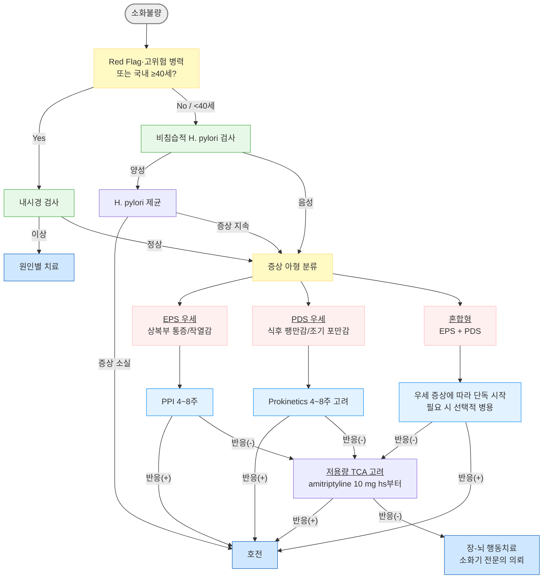

# 소화불량 Indigestion, Dyspepsia

## <mark style="color:green;">일반 사항</mark>

* **소화불량 (indigestion, dyspepsia)** : 상복부에서 기원한다고 생각되는 **상복부 통증·작열감, 식후 포만감 또는 조기 포만감**을 말함
  * 구역, 트림, 복부 팽만이 동반될 수 있으나 핵심 소화불량 증상은 아님. 반복적·지속적 구토는 다른 질환 또는 Red Flag를 시사하며, 전형적인 가슴쓰림·산 역류는 GERD 증상으로 별도 평가
* 유병률 : 전체 성인 인구의 약 20\~25%; 1차진료(primary care) 방문의 약 5% 차지
* 병태생리 : 위 운동 장애(위저부 이완 장애, 위배출 지연), 내장 감각 과민(visceral hypersensitivity), 뇌-장 축(brain-gut axis) 이상, 장내 미생물 불균형, 저도 염증(H. pylori 포함) 등 복합 기전
  * "검사는 정상인데 왜 아픈가요?"라는 환자 질문에는 '내장 감각 과민'으로 설명할 수 있음

#### <mark style="color:$primary;">유형</mark>

* **기질성 소화불량 (organic dyspepsia)** : 소화성 궤양, GERD, 위암, 췌담도 질환 등 기질적 원인이 확인되는 경우 (약 ¼ 해당)
* **기능성 소화불량 (functional dyspepsia, FD)** : 증상을 설명할 만한 기질적 이상이 없는 경우 (약 ¾ 해당); 기능성 소화불량은 뇌-장 상호작용 장애 (disorder of gut-brain interaction, DGBI)의 대표 질환으로 분류됨&#x20;
* **일시적 소화불량 증상** : 과식, 빠른 식사, 고지방 음식, 스트레스 상황에서의 식사, 과음, 과다 카페인 섭취 등에 의해 수일간 발생할 수 있음. 공인된 별도 진단 유형은 아니며, 지속·재발하거나 Red Flag가 동반되면 다른 원인을 평가
* **GERD overlap** : FD와 GERD는 상당 부분 중첩됨 - 상복부 작열감·식후 불편감·가슴쓰림이 함께 존재하는 경우가 외래에서 매우 흔함; PPI partial response도 흔히 관찰됨
* **IBS overlap** : 소화불량 환자의 약 1/3은 IBS 증상을 동반하며, 이 경우 치료가 더 까다로울 수 있음; Low-FODMAP, 뇌-장 접근이 특히 도움됨

#### <mark style="color:$primary;">관련 증상 정의</mark>

* **구역 (nausea)** : 토하고 싶은 느낌
* **구토 (vomiting, emesis)** : 장/흉복벽 근육 수축에 의한 위장관 내용물의 입을 통한 압박 방출
* **역류 (regurgitation)** : 구역 없이 힘들이지 않은 상태에서의 위 내용물의 입을 통한 방출
* **되새김 (rumination)** : 섭취한 음식물이 구역 없이 반복적으로 역류하여 다시 씹거나 삼키게 되는 현상; 대개 의도적인 행동이 아니며 횡격막 호흡법 등 행동치료로 조절 가능
* [삼킴곤란](077_-dysphagia.md) **(dysphagia)** : 음식물이 입에서 내려가는 과정의 문제; 가슴에 들러붙거나 걸려 있는 느낌
* **삼킴통증 (odynophagia)** : 삼킬 때의 통증; 감염 또는 정제/캡슐 약제에 의한 구인두·식도 점막 궤양, GERD 환자에서 식도 궤양 또는 염증 시 발생
* **인두이물감 (globus pharyngeus)** : 목 안의 덩어리 또는 꽉 찬 느낌; 삼킴에는 제한이 없거나 삼킴으로 호전되며 스트레스·불안에 의해 악화될 수 있음
* **가슴쓰림 (heartburn)** : 흉골 하부의 타는 듯한 증상; 간헐적 발생; 식후·운동 중·누웠을 때 주로 발생; 물이나 제산제 복용으로 호전

## <mark style="color:green;">원인 및 위험 인자</mark>

* **기능성 소화불량** : 기질적 질병 없이 발생; 가장 흔한 원인
* **위식도역류질환 (GERD)** : 하부 식도괄약근(LES) 긴장 감소 또는 이완 (☞ [위식도역류질환](081_-gerd.md))
* **내장 감각 과민 (visceral hypersensitivity)** : 위장 감각 신경 과민; 소화불량 환자는 낮은 위저부 팽창 압력에서도 불편감을 느낌; IBS 환자에서도 관찰
* **LES 이완 유발 요인** : 음주, 흡연, 카페인, 지방식; peppermint는 GERD 환자에서 증상을 악화시킬 수 있으나, 일부 기능성 소화불량/IBS 환자에서는 증상 완화 효과도 있어 단순히 나쁜 음식으로 분류하기 어려움
* **복부 가스 생성** : 탄산음료, 당분, 불용성 식이 섬유, 껌 씹기, 빨리 먹기
* **H. pylori 감염** : 기능성 소화불량에서의 역할에는 논란이 있으나 제균 치료가 일부에서 장기 증상 완화에 기여할 수 있음 (NNT ≈ 12)
* **약물** : NSAID, aspirin, 항생제, 당뇨(예: metformin), 고혈압(예: ARB, CCB), 고지혈증(예: fibrates, orlistat), 치매(예: donepezil), GLP-1 계열 약물(예: GLP-1 수용체작용제 semaglutide, GIP/GLP-1 이중작용제 tirzepatide - 구역·조기 포만감·위배출 지연 가능; 새 증상 발생 시 연관성 확인), SSRI, SNRI, 파킨슨(예: dopamine 작용제), steroid, estrogen, progesterone, digoxin, nitrate, bisphosphonate, iron
  * 장기 PPI 사용과 bloating 또는 장내 미생물 변화의 연관성이 보고되었으나 인과관계는 불확실함. 적응증과 최소 유효 용량을 주기적으로 재평가
* **기타** : 유전, 비만, 임신, 스트레스, 우울, 불안, 신체화장애, 폭식증, 알코올 남용
* **기질적 원인** : 위장 운동 장애, 담석증, 담낭염, 췌장염, 충수돌기염, 게실염, 유당 불내성, 셀리악병, 장폐쇄, 위장관 수술 병력, 화학요법, 전정신경염, 폐렴, 요로 결석, PID

### <mark style="color:$danger;">🚩 Red Flags!</mark>

　☞ [위장질환의 감별](074_.md#step-1-red-flags)

## <mark style="color:green;">임상 양상</mark>

* **상복부 통증 또는 작열감 (epigastric pain/burning)** : 식사와 무관하거나 공복 시 악화; EPS(epigastric pain syndrome) 아형의 주 증상
* **조기 포만감 (early satiety)** : 식사 시작 후 얼마 지나지 않아 포만감이 발생하여 정상 식사량을 마치지 못함; PDS(postprandial distress syndrome) 아형의 주 증상
* **식후 팽만감 (postprandial fullness)** : 식사 후 음식물이 위에 오래 남아 있는 불쾌한 느낌; PDS 아형
* **구역 (nausea)** : 구토를 동반하거나 단독으로 발생; 기능성 소화불량 및 위마비의 흔한 증상
* **가스/트림 (gas/belching)** : 삼킨 공기 또는 위장 내 가스 축적으로 발생
* **복부 팽만감 (bloating)** : 주관적 팽창 느낌; 기질적 또는 기능적 원인 가능

## <mark style="color:green;">진단</mark>

* 증상과 징후를 근거로 진단; Red Flags 유무가 초기 평가의 핵심
* 신체검사 소견은 진단 특이성이 낮음 (기질적 원인 배제 목적으로 시행)
* 식사-증상 일기 작성이 유용 - 음식 종류뿐 아니라 식사 속도, 식사량, 스트레스 상황, 수면 부족과의 연관을 함께 기록하면 유발 인자 파악에 도움

### <mark style="color:orange;">Diagnostic Framework \[ROME V, 2026]</mark>

* Rome V는 2026년 발표된 현행 DGBI 분류·진단 체계로, **임상 진단 기준과 연구용 진단 기준을 명시적으로 구분**하고 임상에서는 증상의 불편도·기능 영향과 환자 맥락을 함께 평가하도록 강조
* 아래 빈도·기간 기준은 기존 Rome IV 연구 기준을 참고용으로 제시한 것임. 임상에서 기계적으로 적용하지 않으며, Rome V의 질환별 세부 기준은 공식 원문을 확인

#### <mark style="color:$primary;">기능성 소화불량 (Functional dyspepsia)</mark>

　☞ [기능성 소화불량](076_-functional-dyspepsia-fd.md)

#### <mark style="color:$primary;">만성 구역/구토증후군 (Chronic nausea vomiting syndrome)</mark>

* 발생한 지 최소 6개월 되었고 최근 3개월간 다음 조건을 모두 충족

1. ≥1일/주 발생하는 일상생활에 지장을 주는 구역증
2. 다음 상태 배제 : 자가 유도 구토, 섭식 장애, 역류, 반추
3. 일상적인 검사(상부 소화기 내시경 포함)에서 기질적·전신적·대사 질환의 증거 없음

#### <mark style="color:$primary;">되새김증후군 (Rumination syndrome)</mark>

* 발생한 지 최소 6개월 되었고 최근 3개월간 다음 조건을 모두 충족

1. 뱉거나 다시 씹어 삼키게 되는, 섭취한 음식의 지속 또는 반복적인 역류
2. 역류 전 구역증이 선행되지 않음

#### <mark style="color:$primary;">인두이물감 (Globus pharyngeus)</mark>

* 최소 1회/주 발생하며 발생한 지 최소 6개월 되었고 최근 3개월간 다음 조건을 모두 충족

1. 진찰·후두경·내시경에서 구조적 이상이 없는, 인후부의 지속 또는 간헐적인, 통증이 없는 덩어리 또는 이물감
   1. 식간에 발생
   2. 삼킴곤란 또는 삼킴통증 없음
   3. 식도 근위부 위 점막 이소증(gastric inlet patch) 없음
2. 위식도 역류 또는 eosinophilic esophagitis가 원인이라는 증거 없음
3. 주요 식도 운동 이상 질환 없음 (예: achalasia, EGJ outflow obstruction, diffuse esophageal spasm, jackhammer esophagus, absent peristalsis)

#### <mark style="color:$primary;">기능성 가슴쓰림 (Functional heartburn)</mark>

* 최소 2회/주 발생하며 발생한 지 최소 6개월 되었고 최근 3개월간 다음 조건을 모두 충족

1. 흉골 뒤의 타는 듯한 불편감 또는 통증
2. 적절한 산 분비 억제제 치료에도 불구하고 증상이 완화되지 않음
3. 위식도 역류(산 노출 시간 증가 &/or 관련 역류 증상) 또는 eosinophilic esophagitis가 원인이라는 증거 없음
4. 주요 식도 운동 이상 질환 없음

#### <mark style="color:$primary;">기능성 삼킴곤란 (Functional dysphagia)</mark>

　☞ [기능성 삼킴곤란](077_-dysphagia.md#functional-dysphagia)

### <mark style="color:orange;">검사</mark>

#### <mark style="color:$primary;">**실험실 검사**</mark>&#x20;

* 모든 환자에게 일률적으로 시행하지 않고 병력·진찰 소견에 따라 선택
* CBC : 위장관 출혈, 빈혈, 체중 감소 의심 시
* 전해질, Ca, RFT, 혈당, TSH : 대사성 질환 또는 위장 운동 장애 의심 시
* LFT, amylase/lipase : 담도·췌장 질환 의심 시
* 단백질/알부민 : 영양불량 또는 흡수장애 의심 시
* u-hCG : 임신 가능성이 있는 환자

#### <mark style="color:$primary;">**H. pylori 검사**</mark>&#x20;

* Red Flag 없는 미조사 소화불량에서 test-and-treat 전략의 첫 단계로 권고 (☞ [헬리코박터 감염](080_-helicobacter-pylori-infection.md))

#### <mark style="color:$primary;">**영상 검사**</mark>&#x20;

* 췌장·담관·혈관 질환, volvulus 의심 시
* 흉부/복부 X선, CT, 복부 초음파

#### <mark style="color:$primary;">상부위장관내시경</mark>&#x20;

* 연령과 무관하게 Red Flag, 고위험 병력 또는 적절한 경험적 치료에도 지속되는 증상이 있으면 시행 (☞ [위장질환의 감별](074_.md#undefined-8))
* **국내에서는 ≥40세에 새로 발생한 미조사 소화불량이면 상부위장관내시경을 우선 고려**
* ＜40세이고 Red Flag가 없으면 비침습적 H. pylori test-and-treat 또는 경험적 치료를 우선 고려
* 위암 가족력, 위암 전구 병변, 흡연, 원인 불명 체중 감소 등 개인별 위암 위험과 이전 내시경·국가검진 결과를 함께 판단
* 우리나라 국가 위암검진은 만 40세 이상에서 2년마다 위내시경 또는 위장조영검사를 시행하나, 증상 평가가 필요한 경우에는 검진 주기와 별도로 진단 목적 내시경 여부를 판단
* \[ACG/CAG 참고] 북미에서는 ≥60세를 내시경 기준으로 제시하나 국내에 그대로 적용하지 않음

#### <mark style="color:$primary;">기타</mark>

* 셀리악병 혈청 검사 : 만성 설사, 철결핍, 체중 감소, 가족력 또는 IBS 중첩 시 고려
* 기생충 검사, 변 지방/elastase 검사 : 관련 노출력, 만성 설사 또는 흡수장애 소견이 있을 때 선택적으로 시행

### <mark style="color:orange;">감별</mark>

#### <mark style="color:$primary;">증상 시작에 따라</mark>

* 갑자기 발생 : 담낭염, 식중독, 위장염, 췌장염, 약물
* 서서히 발생 : GERD, 위마비, 대사 이상, 임신, 약물

#### <mark style="color:$primary;">증상 발생 상황에 따라</mark>

* 식후 포만감·조기 포만감 우세 : PDS, 위마비, 위출구 폐쇄 가능성
* 공복 또는 식사와 무관한 상복부 통증·작열감 : EPS, 소화성 궤양 등 고려
* 눕거나 야간에 악화되는 가슴쓰림·산 역류 : GERD 가능성
* 반복적·지속적 구토, 야간에 깨우는 증상 또는 진행성 악화는 전형적인 단순 소화불량으로 보지 않고 별도 평가

#### <mark style="color:$primary;">구토물의 양상에 따라</mark>

* 소화 안 된 음식물 : achalasia, 식도 질환(예: 게실, 협착)
* 부분 소화된 음식물 : 위장 출구 폐쇄, 위마비
* 담즙 포함 : 소장 근위부 폐쇄
* 악취 또는 대변성 : fistula, 장 폐쇄
* 구토량만으로 기질성 여부를 구분하지 않으며, 반복적·지속적 구토 자체를 Red Flag로 평가

#### <mark style="color:$primary;">복통 부위/양상에 따라</mark>

　☞ [복통](../220_/003_-abdominal-pain.md)

* Epigastric : 췌장 질환, 소화불량, 위염, 소화성 궤양, GERD, MI
* RUQ : 담관 질환, 담낭염
* RLQ : 충수염
* LLQ : 게실염
* Pelvic : PID, 난소 질환, 자궁외임신
* 심한 통증 : 담관 질환, 췌장 질환, 소장 폐쇄, peritoneal irritation
* 구토 전 심한 통증 : 소장 폐쇄

#### <mark style="color:$primary;">동반/관련 증상에 따라</mark>

* 발열 : 감염 질환
* 체중 감소 : 악성 종양
* 설사, malaise, 근육통, 두통 : 바이러스 감염
* 두통, 경부 강직, 어지럼, 국소 신경학적 이상 소견 : 뇌염, 뇌막염, 두부 손상, 편두통, 두개 내압 증가
* 조기 포만감, 식후 팽만감, 구역·구토 : 위마비 가능성(증상만으로 확진 불가)
* 반복되는 정형화된 구토 삽화와 편두통 병력 : cyclic vomiting syndrome
* 머리 움직임·자세 변화와 연관된 어지럼·구역 : 전정계 질환
* 어지럼, 안진 : 전정신경염
* Lactose, 밀가루 음식, 콩류 등 음식과 관련된 복부 팽만 : lactose intolerance, 셀리악병, carbohydrate malabsorption, 올리고당 발효(예: 콩류)
* 가슴쓰림 : GERD, 소화불량
* 빈맥, 저혈압 : 탈수, 패혈증, 심근경색


**위마비(gastroparesis)** : 다음 상황에서 위마비 가능성을 적극 고려

* 당뇨병 환자 (특히 유병 기간이 긴 경우)
* GLP-1 계열 약물(semaglutide, tirzepatide 등) 사용 중 새로 발생한 조기 포만감·구역
* 식후 수 시간이 지나도 음식물이 남아있는 느낌 또는 소화 안 된 음식물 구토
* 내시경에서 적절한 금식 후에도 음식물 저류 확인(단, 이 소견만으로 확진하지 않음)
* 체중 감소 동반

→ 먼저 상부위장관내시경 등으로 기계적 폐쇄를 배제. 위마비 진단에는 표준화된 **4시간 고형식 위배출 검사(gastric emptying study)**로 위배출 지연을 객관적으로 확인


#### <mark style="color:$primary;">EPS / PDS / GERD overlap 감별</mark>

<table data-header-hidden><thead><tr><th width="160"></th><th></th><th></th><th></th></tr></thead><tbody><tr><td>구분</td><td>EPS (Epigastric Pain Syndrome)</td><td>PDS (Postprandial Distress Syndrome)</td><td>GERD overlap<br>(FD + GERD 중첩)</td></tr><tr><td><strong>핵심 증상</strong></td><td>상복부 통증, 작열감</td><td>조기 포만감, 식후 팽만감</td><td>가슴쓰림, 산 역류 + FD 증상</td></tr><tr><td><strong>식사와 관계</strong></td><td>식사와 무관하거나 공복 시 악화 가능</td><td>식후 악화가 특징적</td><td>식후·눕거나 야간에 악화</td></tr><tr><td><strong>조기 포만감</strong></td><td>±</td><td>+++</td><td>±</td></tr><tr><td><strong>가슴쓰림/역류</strong></td><td>±</td><td>±</td><td>+++</td></tr><tr><td><strong>야간·체위성 증상</strong></td><td>드묾</td><td>드묾</td><td>흔함</td></tr><tr><td><strong>PPI 반응</strong></td><td>일부에서 도움</td><td>효과 제한적</td><td>효과 기대 가능</td></tr><tr><td><strong>Prokinetics 반응</strong></td><td>효과 제한적</td><td>일부에서 도움</td><td>선택적으로 고려</td></tr><tr><td><strong>병태생리 핵심</strong></td><td>내장 과민 (visceral hypersensitivity)</td><td>위저부 accommodation 이상, 위배출 지연</td><td>산 역류 + FD 기전 혼합</td></tr><tr><td><strong>외래 표현</strong></td><td>속이 쓰리고 아프다</td><td>조금만 먹어도 꽉 찬다</td><td>신물 올라오고 타는 느낌</td></tr><tr><td><strong>1차 접근</strong></td><td>H. pylori 평가 → PPI 고려</td><td>식사 조절 ± prokinetics 고려</td><td>생활 교정 + PPI</td></tr></tbody></table>


**가스·복부 팽만·트림이 우세한 경우**

이 증상들은 기능성 소화불량에 동반될 수 있으나 핵심 진단 증상은 아님. 식사·탄산음료·껌·공기 삼킴, 변비, IBS, 유당·탄수화물 흡수장애와 위상부 트림(supragastric belching) 등을 우선 평가한다. 증상 발생 후 30분을 기준으로 위와 소장 원인을 구분할 수는 없음. 호흡검사, 셀리악병 혈청검사, 영상·내시경, 위배출검사 및 항문직장 기능검사는 위험 인자·Red Flag와 임상적 의심이 있을 때 선택적으로 시행한다.


***

## <mark style="background-color:$warning;">Management</mark>

### <mark style="color:orange;">치료 방침</mark>

* 심각한 기질적 원인이 없는 경우 안심시킴
* Red Flag 없는 ＜40세 : 비침습적 H. pylori 검사 → test-and-treat 전략 우선 시행 → H. pylori (−)이거나 제균 성공 후 증상 지속 시 우세 증상(EPS/PDS/혼합)에 맞는 경험적 치료 (☞ [기능성 소화불량](076_-functional-dyspepsia-fd.md)) → 적절한 치료에 반응하지 않거나 반복 재발 시 상부위장관내시경 고려
* ≥40세 또는 Red Flag·고위험 병력 존재 : 상부위장관내시경 우선 고려 → 원인에 따른 치료
* 약물이 원인인 경우 용량 조절 또는 약물 교체; GLP-1 agonist 사용 중 새로운 소화불량 발생 시 연관성 확인
* PPI 효과가 불충분하거나 부작용·복약 순응도 문제가 있으면 P-CAB을 대안으로 고려할 수 있으나, 기능성 소화불량에 대한 근거와 국내 허가·보험 기준을 확인

***


```mermaid
graph TD
    Start([소화불량]) --> RF["Red Flag·고위험 병력<br/>또는 국내 ≥40세?"]
    RF -- "Yes" --> Endo["내시경 검사"]
    RF -- "No / <40세" --> HpTest["비침습적 H. pylori 검사"]

    Endo -- "이상" --> CauseTx["원인별 치료"]
    Endo -- "정상" --> Pheno

    HpTest -- "양성" --> HpErad["H. pylori 제균"]
    HpTest -- "음성" --> Pheno["증상 아형 분류"]
    HpErad -- "증상 소실" --> Done["호전"]
    HpErad -- "증상 지속" --> Pheno

    Pheno --> EPS["<u>EPS 우세</u><br/>상복부 통증/작열감"]
    Pheno --> PDS["<u>PDS 우세</u><br/>식후 팽만감/조기 포만감"]
    Pheno --> Mix["<u>혼합형</u><br/>EPS + PDS"]

    EPS --> PPI["PPI 4~8주"]
    PDS --> Prokin["Prokinetics 4~8주 고려"]
    Mix --> Both["우세 증상에 따라 단독 시작<br/>필요 시 선택적 병용"]

    PPI -- "반응(+)" --> Done
    Prokin -- "반응(+)" --> Done


    PPI -- "반응(-)" --> TCA["<u>저용량 TCA 고려</u><br/>amitriptyline 10 mg hs부터"]
    Prokin -- "반응(-)" --> TCA
    Both -- "반응(-)" --> TCA
    Both -- "반응(+)" --> Done
    TCA -- "반응(+)" --> Done
    TCA -- "반응(-)" --> Psych["장-뇌 행동치료<br/>소화기 전문의 의뢰"]

    style Start fill:#eeeeee,stroke:#888888,stroke-width:2px
    classDef yellow fill:#fff9c4,stroke:#ffe082
    class RF,Pheno yellow
    classDef green fill:#e8f8e8,stroke:#4caf50
    class HpTest,Endo green
    classDef pink fill:#FFF0F0,stroke:#FFC0C0
    class EPS,PDS,Mix pink
    classDef sky fill:#e3f2ff,stroke:#2196f3
    class PPI,Prokin,Both sky
    classDef blue fill:#d0e8ff,stroke:#1a6abf
    class Done,CauseTx,Psych blue
```

<p align="center"><strong>소화불량 진단 및 치료 알고리듬 (증상 아형 기반)</strong></p>

***

## <mark style="color:green;">비-약물 치료 및 예방</mark>

### <mark style="color:orange;">식생활 교정</mark>

1. 식사를 거른 뒤 과식하지 않도록 규칙적인 식사 시간을 유지한다.
2. 한 번에 많이 먹지 않고 증상에 따라 소량씩 나누어 먹는다.
3. 야식은 최소화; 잠자리에 들기 최소 2시간 전에 식사를 마친다.
4. 음식은 천천히 꼭꼭 씹어 먹는다.
5. 충분한 수면을 취한다.
6. 금연한다.
7. 적당히 운동한다 (식후 가벼운 산책도 효과적).
8. 스트레스를 관리한다.

### <mark style="color:orange;">증상 유발 음식의 선택적 회피</mark>

일률적인 제한 식단보다 식사-증상 일기를 이용해 개인별 유발 음식을 확인:

* 고지방 음식 : 지방이 많은 육류, 버터, 튀긴 음식, 치즈
* 과식 (한 번에 많은 양 섭취)
* 맵고 짠 자극적인 음식 : 매운 고추, 생마늘
* 카페인 음료(커피, 차), 알코올, 탄산음료
* 개인적으로 증상을 유발하는 음식


다음 음식들은 일부 환자에서 증상을 유발한다고 호소하지만 보편적으로 제한할 근거는 충분하지 않음. 개인 반응에 따라 선택적으로 조절: 떡·면류, 질긴 고기·뿌리채소, 보리·현미·통밀, 당분이 많은 식품, 잡곡류


### <mark style="color:orange;">식이 요법</mark>

* 심한 PDS 또는 위마비가 의심되어 고형식 섭취가 어려울 때에만 단기간 부드럽거나 액상인 음식을 고려; 일반적인 소화불량에서 routine으로 권고하지 않음
* 식후 증상이 주된 환자는 소식, 저지방 식사
* Low-FODMAP diet : FODMAP(Fermentable Oligo-, Di-, Mono-saccharide, And Polyol) 식품은 소장에서 잘 흡수되지 않고 장내 발효와 삼투압 작용으로 가스·팽만을 유발할 수 있음; IBS overlap 또는 bloating 우세 환자에서 제한적으로 고려하되 순수 FD에서의 근거는 부족함. 장기간 과도한 제한은 영양 불균형 위험이 있어 식사 일기로 개인별 유발 음식을 먼저 파악하고, 필요하면 영양 전문가의 지도를 받음
  * FODMAP 고함유 식품 : 과당(옥수수 시럽, 사과, 배, 꿀, 수박, 건포도), 유당, fructan(마늘, 양파, 부추, 아스파라거스), 밀 제품(빵, 파스타, 시리얼), 소르비톨(stone fruits), 라피노오스(콩류, 양배추)

## <mark style="color:green;">약물 치료</mark>

#### <mark style="color:$primary;">H. pylori 제균 치료</mark>

* H. pylori 양성인 소화불량 환자에서 제균 치료 권고 (ACG 2024, 국내 지침)
* 제균 성공 시 약 10\~15%에서 장기적 증상 호전 기대 (NNT ≈ 12); 소화성 궤양·위암 예방 효과도 병행
* 제균 성공 여부와 증상 호전은 별개로 평가. 제균 후 증상이 장기간 소실되면 H. pylori-연관 소화불량으로 볼 수 있으며, 제균 성공 후에도 증상이 지속되면 기능성 소화불량·GERD 등 다른 원인을 치료
* (☞ [헬리코박터 감염](080_-helicobacter-pylori-infection.md))

#### [<mark style="color:$primary;">PPI</mark>](073_.md#proton-pump-inhibitor-ppi) <mark style="color:$primary;">(Proton Pump Inhibitor)</mark>

* 적응 : H. pylori (−) 또는 제균 후 증상 지속; EPS(상복부 통증/작열감) 아형 및 GERD overlap에 우선 권장 (보험주의)
* 일반적으로 식사 30\~60분 전 복용; 4\~8주 투여 후 재평가하고 효과가 없으면 지속하지 않음. 중단 후 재발 시 적응증을 재평가하여 간헐적 또는 유지 투여 고려
* 동일 효능에서 제네릭 사용 무방


**PPI 약물 상호작용 주의**\
PPI는 위내 산도를 높여 일부 약물의 흡수·대사에 영향을 줄 수 있음:\
• Clopidogrel 병용 시 : omeprazole/esomeprazole은 CYP2C19 경쟁적 억제로 clopidogrel 활성화를 저해 - 항혈소판 효과 감소 우려; 심혈관 질환자에서는 pantoprazole 또는 rabeprazole 선호\
• 철분제 : 위산 감소로 비헴철 흡수가 저하될 수 있으며 단순히 복용 간격을 두는 것만으로 해결되지 않을 수 있음 - PPI 필요성·용량과 철분 투여 방법 재평가\
• 항진균제(itraconazole, ketoconazole) : 위산 필요 약물로 흡수 감소 가능


<table><thead><tr><th width="170">약물</th><th width="160">용량</th><th>상품명 예</th></tr></thead><tbody><tr><td>omeprazole</td><td>20 ㎎ qd</td><td><mark style="color:blue;">[오엠피]</mark></td></tr><tr><td>esomeprazole</td><td>20 ㎎ qd</td><td><mark style="color:blue;">[넥시움]</mark></td></tr><tr><td>pantoprazole</td><td>40 ㎎ qd</td><td><mark style="color:blue;">[판토록]</mark></td></tr><tr><td>rabeprazole</td><td>10~20 ㎎ qd</td><td><mark style="color:blue;">[파리에트]</mark></td></tr><tr><td>lansoprazole</td><td>30 ㎎ qd</td><td><mark style="color:blue;">[란스톤]</mark></td></tr><tr><td>ilaprazole</td><td>10 ㎎ qd</td><td><mark style="color:blue;">[놀텍]</mark></td></tr></tbody></table>

#### [<mark style="color:$primary;">H2 차단제</mark>](073_.md#h2-h2-receptor-antagonist-h2ra) <mark style="color:$primary;">(H2RA)</mark>

* PPI를 사용하기 어려운 경우 또는 경증에 대안으로 사용
* famotidine <mark style="color:blue;">\[가스터]</mark> 20 ㎎ bid (식사와 무관; 신기능 저하 시 감량·간격 조절)
* cimetidine : 현재 사용 감소 (CYP 약물 상호작용 주의); ranitidine : NDMA 오염으로 시장 철수

#### [<mark style="color:$primary;">P-CAB</mark>](073_.md#potassium-competitive-acid-blocker-p-cab) <mark style="color:$primary;">(Potassium-Competitive Acid Blocker)</mark>

* 빠르고 강한 산 억제 효과가 있으며 GERD 등 국내 허가 적응증에서는 PPI 대안으로 사용
* 식사 영향이 적고 초회 투여부터 빠르게 작용하며 CYP2C19 유전형의 영향을 덜 받음. 그러나 이것이 clopidogrel과의 상호작용이 P-CAB 전체에서 임상적으로 없음을 의미하지 않으므로 성분별 자료를 확인
* 기능성 소화불량에 대한 임상 연구는 제한적·이질적이며, 제2차 아시아 합의안(2025; 2026년 출판)도 확정적 결론을 내리지 않음. 국내 FD 허가 적응증·보험 기준을 확인하고 선택적으로 사용

<table><thead><tr><th width="170">약물</th><th width="160">국내 사용 용량 예</th><th>상품명 / 특이사항</th></tr></thead><tbody><tr><td>tegoprazan</td><td>25~50 ㎎ qd</td><td><mark style="color:blue;">[케이캡]</mark> - 적응증별 허가 용량 확인; FD 사용 시 허가·보험 기준 확인</td></tr><tr><td>fexuprazan</td><td>40 ㎎ qd</td><td><mark style="color:blue;">[펙수클루]</mark> - 적응증별 허가 용량 확인; FD 사용 시 허가·보험 기준 확인</td></tr></tbody></table>

#### [<mark style="color:$primary;">Prokinetics</mark>](073_.md#gi-prokinetic-agent)

* 적응 : PDS(식후 팽만감, 조기 포만감) 우세 환자에서 고려; H. pylori 제균 또는 산 분비 억제 치료에도 증상이 지속될 때 선택적 단독 또는 병용 사용&#x20;
* 복용 시점은 성분·제품별 허가사항을 확인하고, 효과와 이상반응을 4\~8주 내 재평가

<table><thead><tr><th width="154">약물</th><th width="180">용량</th><th>상품명 / 특이사항</th></tr></thead><tbody><tr><td>mosapride</td><td>5 ㎎ tid</td><td><mark style="color:blue;">[가스모틴]</mark> - 제품별 식전·식후 용법 확인</td></tr><tr><td>itopride</td><td>50 ㎎ tid (식전)</td><td><mark style="color:blue;">[가나톤]</mark> - D2 차단 + AChE 억제; 추체외로 증상은 드물지만 고프로락틴혈증·유즙분비 등에 주의</td></tr></tbody></table>


**metoclopramide는 기능성 소화불량의 routine 장기 치료제로 사용하지 않음** : 급성 구역·구토 등에 국내 허가사항에 따라 최단기간 사용하며, 현행 허가사항상 최대 치료기간(통상 5일)을 확인. 급성 근긴장이상, 정좌불능, 파킨슨증 및 지연성 운동장애 위험이 있어 고령자·파킨슨병 환자·항정신병약 병용 환자에서 특히 주의


#### <mark style="color:$primary;">저용량</mark> [<mark style="color:$primary;">항우울제</mark>](073_.md#tca) <mark style="color:$primary;">(TCA)</mark>

* H. pylori 제균 및 PPI 치료에도 증상 지속 시 고려 (☞ [소화기계 약제](073_.md))
* 기전 : 내장 과민성 감소, 통증 역치 상향; 항우울 효과와 무관한 저용량에서 작용
* amitriptyline <mark style="color:blue;">\[에트라빌]</mark> 10 ㎎ hs (취침 시)부터 시작하여 내약성과 반응에 따라 서서히 조절; 2\~4주에 이상반응·순응도를 확인하고 가능하면 8\~12주에 효과 판정
* 졸림, 구강건조, 변비, 배뇨곤란, 기립저혈압·낙상, 심전도 이상에 주의. 고령자, 녹내장, 전립선비대·요폐, 심장 전도장애 환자에서는 신중히 사용

#### <mark style="color:$primary;">제산제 및 기타</mark>

* [제산제](073_.md#antacid) : 급성 증상 완화 목적의 단기 사용; magnesium hydroxide/aluminum hydroxide 복합제 (식후 또는 증상 발생 시)
* [simethicone](073_.md#simethicone) (소포제) : 가스/팽만감의 단기 증상 완화에 선택적으로 사용하나 FD 자체에 대한 근거는 제한적
* [프로바이오틱스](073_.md#probiotics-1)/프리바이오틱스 : FD에서 일률적으로 권고할 근거가 부족하며 균주·용량·기간도 표준화되지 않음. 사용하더라도 효과와 비용을 일정 기간 후 재평가

#### <mark style="color:$primary;">심리 치료</mark>

* 약물 치료에 반응하지 않는 경우뿐 아니라 스트레스·불안과 증상의 연관이 뚜렷하거나 환자가 선호하는 경우에도 장-뇌 행동치료로 고려
* 인지행동치료(CBT), 최면요법(gut-directed hypnotherapy), 이완요법이 일부 환자에서 효과적
* mindfulness 기반 치료(MBSR) : 내장 과민성·통증 인식 조절에 효과적이라는 근거 축적 중; 불안·스트레스 동반 환자에서 특히 고려

### <mark style="color:orange;">증상 아형별 처방 방향</mark>

<table><thead><tr><th width="185">우세 증상</th><th width="199">먼저 고려</th><th>치료 방향</th></tr></thead><tbody><tr><td>상복부 작열감·통증</td><td>EPS, GERD overlap</td><td>PPI 우선 고려</td></tr><tr><td>조기 포만감</td><td>PDS (± 위마비)</td><td>식사 조절 ± prokinetics 고려</td></tr><tr><td>식후 팽만감</td><td>PDS, IBS overlap</td><td>식사 조절 ± prokinetics 고려</td></tr><tr><td>신물 / 역류</td><td>GERD</td><td>PPI + 생활 교정</td></tr><tr><td>Bloating / 가스</td><td>식이 요인, 변비, IBS overlap</td><td>원인 평가; IBS 중첩 시 Low-FODMAP 제한적 고려</td></tr><tr><td>구역 우세</td><td>위마비, 약물 부작용</td><td>원인 약물 검토; 위마비 의심 시 객관적 평가</td></tr><tr><td>반복 재발 + 적절한 검사 정상</td><td>DGBI (기능성 소화불량)</td><td>저용량 TCA 또는 장-뇌 행동치료 고려</td></tr></tbody></table>

***

### <mark style="color:red;">질병코드</mark>

K30 기능성 소화불량

R10.1 상복부 통증 (기능성 소화불량 확진 전 증상 코드가 필요한 경우)

✽ GERD, 소화성 궤양, 위염 등 원인 질환이 확인되면 해당 원인 질환 코드를 우선 사용

***

## <mark style="color:purple;">처방례</mark>

> **처방례 1.** H. pylori 양성 소화불량
>
> ```
> ※ H. pylori 제균 치료 시행
>    (☞ 헬리코박터 감염 챕터 참조)
> ```
>
> _✽제균 완료 후 4\~8주 내 증상 재평가; 증상이 지속되면 제균 성공 여부를 확인하면서 우세 증상에 따라 PPI 또는 prokinetics 고려_\
> _✽제균 성공과 증상 호전은 별개임. 제균 성공 후에도 증상이 지속되면 기능성 소화불량·GERD 등 다른 원인을 평가·치료_\
> _✽제균 성공 확인: 항생제 치료 종료 후 최소 4주에 요소 호기 검사(UBT) 또는 대변 항원 검사. 검사 전 PPI/P-CAB은 2주, 항생제·비스무트는 4주 중단_

> **처방례 2.** H. pylori 음성 또는 제균 후 지속 증상 - EPS 아형 (상복부 통증/작열감 우세)
>
> ```
> esomeprazole 20 ㎎/T  1T  qd  식전 30분  4주
> ```
>
> _✽4주 후 증상 재평가; 소실 시 투약 중단 후 관찰; 재발 시 간헐적 투여 고려_\
> _✽EPS 우세형(상복부 통증·작열감)에 우선 고려; PDS 우세형(식후 팽만감·조기 포만감)에서는 prokinetics를 선택적으로 고려_

> **처방례 3.** H. pylori 음성 또는 제균 후 지속 증상 - PDS 아형 (식후 불쾌감 우세)
>
> ```
> mosapride 5 ㎎/T  1T  tid  식전 30분  4주
> ```
>
> _✽식후 팽만감, 조기 포만감이 주 증상인 PDS 우세형에서 고려; itopride 50 ㎎ tid <mark style="color:blue;">\[가나톤]</mark>로 대체 가능_\
> _✽EPS/PDS 혼합형에서는 우세 증상에 따라 단독치료부터 시작하고, 반응이 불충분하면 선택적으로 병용_

> **처방례 4.** 난치성 기능성 소화불량 (PPI + 저용량 TCA 병용)
>
> ```
> esomeprazole 20 ㎎/T  1T  qd  식전
> amitriptyline 10 ㎎/T  1T  hs  취침 시  4주
> ```
>
> _✽저용량 TCA(10\~25 ㎎)는 내장 과민성 억제 및 통증 역치 상향 목적; 항우울 용량보다 훨씬 낮음을 환자에게 설명_\
> _✽초기 졸림·구강건조·변비·배뇨곤란·기립저혈압 가능성을 안내_\
> _✽4주 후 내약성과 순응도를 평가하고, 가능하면 8\~12주에 효과 판정; 효과가 있으면 일정 기간 유지 후 서서히 감량_

***

### <mark style="color:$success;">핵심 복약 지도</mark>

> **H. pylori 제균 치료를 받으셨나요?**
>
> * 제균에 성공해도 소화불량 증상이 바로 없어지지 않을 수 있습니다. 남은 증상은 기능성 소화불량이나 역류질환 등 다른 원인 때문일 수 있습니다.
> * 증상만으로 제균 성공 여부를 판단할 수 없습니다. 항생제 치료 종료 후 최소 4주에 요소 호기 검사(UBT) 또는 대변 항원 검사로 반드시 확인하십시오.
> * 정확한 검사를 위해 검사 전 PPI/P-CAB은 2주, 항생제·비스무트는 4주 중단해야 합니다. 중단 방법은 담당 의사와 상의하십시오.

> **PPI(위산 억제제)를 처방 받으셨나요?**
>
> * PPI는 위산 분비를 억제하여 상복부 통증, 작열감, 속쓰림을 완화합니다.
> * 일반적으로 **식사 30\~60분 전** 복용합니다. 제품별 복용법이 다를 수 있으므로 처방 지시를 따르십시오.
> * 보통 4\~8주 후 효과를 평가합니다. 효과가 없는데도 계속 복용하거나 임의로 장기 복용하지 마십시오.
> * 장기 복용과 일부 이상반응의 연관성이 보고되어 있으나, 적응증이 있으면 치료 이득이 더 큽니다. 장기 복용이 필요하면 담당 의사와 필요성·용량을 정기적으로 재평가하십시오.

> **위장 운동 개선제(prokinetics)를 처방 받으셨나요?**
>
> * 식후 팽만감, 조기 포만감, 구역 증상 완화를 위해 사용하며 효과에는 개인차가 있습니다.
> * 복용 시점은 약마다 다르므로 약 봉투와 처방 지시를 따르십시오.
> * 증상이 있는 기간에 사용하고, 호전되면 감량하거나 중단하는 것이 원칙입니다.

> **저용량 항우울제(amitriptyline 등)를 처방 받으셨나요?**
>
> * 이 약은 항우울 목적이 아니라 **위장관의 통증 신호를 조절**하는 목적으로 매우 낮은 용량(10\~25 ㎎)으로 사용합니다.
> * 취침 전 복용하며 초기에는 졸릴 수 있으므로 운전·위험한 기계 조작에 주의하십시오.
> * 구강건조, 변비, 배뇨곤란, 어지럼이 생길 수 있습니다. 심하거나 지속되면 담당 의사와 상의하십시오.
> * 2\~4주에는 부작용과 복용 상태를 확인하고, 효과는 보통 8\~12주까지 관찰한 뒤 담당 의사와 평가합니다. 중단할 때는 임의로 끊지 말고 서서히 감량하십시오.

> **언제 다시 병원을 방문해야 하나요?**
>
> * 치료 4\~8주 후에도 증상이 호전되지 않는 경우
> * **피를 토하거나 대변이 검게 변하는(흑색변)** 경우 - 즉시 내원
> * 음식을 삼키기 힘들어지거나 삼킬 때 통증이 생기는 경우 - 당일 내원
> * 체중이 원인 불명으로 계속 줄어드는 경우 - 조기 내원
> * 심한 복통 또는 고열이 동반되는 경우 - 즉시 내원

***

### <mark style="color:blue;">환자 안내서</mark>


**소화불량, 대부분은 기능적 문제입니다**

소화불량은 위 내시경 등 검사에서 특별한 이상이 발견되지 않는 "기능성 소화불량"이 가장 많습니다. 위가 음식을 소화하는 속도나 방식에 문제가 생기거나, 위장이 음식에 과민하게 반응하는 것이 주된 원인입니다. 생활 습관 교정과 적절한 약물 치료로 대부분 호전됩니다.


#### <mark style="color:$primary;">왜 소화불량이 생기나요?</mark>

* 위장 운동이 느려지거나 불규칙해지면 음식이 위에 오래 머물러 팽만감과 불편감이 생깁니다.
* 위장 신경이 예민해지면 정상적인 소화 과정에서도 통증이나 불편감을 느낍니다.
* 스트레스, 수면 부족, 불규칙한 식사, 음주, 흡연이 소화 기능을 나쁘게 합니다.
* 소염진통제(NSAID), 아스피린, 일부 당뇨 주사제(GLP-1 계열) 등이 위장 운동이나 점막에 영향을 줄 수 있습니다.
* 장내 미생물 불균형(dysbiosis)도 소화 불편감에 관여할 수 있습니다. 프로바이오틱스가 일부 환자에서 도움이 될 수 있으나 효과는 개인차가 크며, 모든 환자에게 권고되지는 않습니다.

#### <mark style="color:$primary;">일상생활에서 어떻게 관리하나요?</mark>

* 🍽️ **소량씩 천천히** : 한 번에 많이 먹지 말고 증상에 따라 식사량을 줄여 나누어 드십시오. 음식은 꼭꼭 씹어 드십시오.
* ⏰ **규칙적 식사** : 식사를 거른 뒤 과식하지 않도록 일정한 식사 시간을 유지하십시오. 야식은 최소화하고, 잠자리에 들기 2시간 전에는 식사를 마치십시오.
* ☕ **개인별 유발 음식 조절** : 식사-증상 일기로 본인에게 증상을 일으키는 음식을 확인하십시오. 커피·차(카페인), 알코올, 맵거나 기름진 음식, 탄산음료는 증상을 악화시킬 때 줄이십시오.
* 🚭 **금연** : 흡연은 위·식도 괄약근을 약하게 만들어 소화 장애를 악화시킵니다.
* 🏃 **가벼운 운동** : 식후 가벼운 산책은 위장 운동에 도움이 됩니다.
* 😌 **스트레스 관리** : 스트레스는 위장 기능에 직접 영향을 미칩니다. 규칙적인 수면과 이완 활동으로 스트레스를 줄이십시오.

#### <mark style="color:$primary;">약은 어떻게 드셔야 하나요?</mark>

* 위산 억제제(PPI)는 일반적으로 **식사 30~60분 전** 복용합니다. 위장 운동 개선제(prokinetics)는 성분·제품에 따라 복용 시점이 다르므로 약 봉투와 처방 지시를 따르십시오.
* 임의로 복용 기간을 늘리거나 중단하지 말고, 정해진 시점에 효과와 이상반응을 담당 의사와 재평가하십시오.
* 취침 전에 복용하는 약(amitriptyline 등)은 졸릴 수 있으니 반드시 **잠자리에 들기 직전** 복용하십시오.

#### <mark style="color:$primary;">이럴 때는 빨리 병원을 방문하세요</mark>

* 피를 토하거나 대변이 검게 변하는 경우: **즉시 진료**
* 갑자기 시작된 심한 복통, 실신·식은땀·호흡곤란 또는 고열이 동반되는 경우: **즉시 진료**
* 구토가 반복되어 물을 마시기 어렵거나 소변량이 줄어드는 경우: **당일 진료**
* 음식 삼키기가 점점 어려워지거나 삼킬 때 통증이 생기는 경우: **빠른 시일 내 진료**
* 특별한 이유 없이 체중이 계속 줄어드는 경우: **빠른 시일 내 진료**
