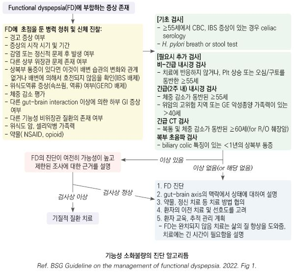

# 기능성 소화불량 Functional Dyspepsia, FD

## 일반 사항

* 위장관 증상이 소화성 궤양, GERD, 췌장/담낭 질환 등의 기질적 질병 없이 만성적으로 재발하는 상태
* 유병률 : 인구의 7% 추정
* postprandial distress syndrome(PDS) 및 epigastric pain syndrome(EPS)을 포함
* Refractory functional dyspepsia : 최소 2가지 방법의 치료에 반응하지 않으며 ≥8주 지속
* 대부분의 소화불량 환자는 증상의 기저 원인으로 기능성 소화불량을 가지고 있음
* 양성 질환이나 치료가 어려울 수 있음; 환자의 ⅓이 위약으로 호전됨
* 흔히 IBS, 위식도 역류 질환 동반

## 원인

* 불명 (☞ p.382)
* 추정 기전 : disorder of gut–brain interaction(DGBI)

### 관련 인자

* 식이
* 정신 사회적 요소 : 스트레스, 불안, 우울, 신체화장애
* 위장관 운동 이상, 내장 과민, 위장관 감염
* 흡연, 약물 복용
* 유전, 가족 환경, 여성

## 임상 양상

* postprandial fullness : 식후 위장에 음식이 지속적으로 존재하는 듯한 불편한 느낌
*   early satiety : 식사를 시작하면서 곧 느껴지는, 식사량에 부합하지 않는 불편한 위장 포만감. 통상적인 분량의 음식을

    다 먹을 수 없음
* epigastric pain : 심하고 불편한 주관적인 상복부 통증
* epigastric burning : 상복부의 주관적인 불편한 작열감

Red Flags!

☞ 소화불량

## 진단

* 다른 질환을 배제하여 진단
* 내시경 검사에서 유의미한 소견이 없고 H. pylori 제균 치료나 경험적 PPI 치료에 반응하지 않는 환자는 기능성 소화불량으로 추정
* 상부 위장관 경고 징후가 없고 성가신 상복부 통증이나 속쓰림, 조기 포만 &/or 식후 팽만 상태가 ＞8주 지속되면 FD로 진단 \[BSG]

### Diagnostic criteria \[ROME Ⅳ]

✽온라인 계산기  [https://www.mdcalc.com/calc/10002/rome-iv-diagnostic-criteria-functional-dyspepsia](https://www.mdcalc.com/calc/10002/rome-iv-diagnostic-criteria-functional-dyspepsia)

#### Functional dyspepsia

* 식후곤란증후군(PDS) &/or 상복부통증증후군(EPS) 진단 기준에 해당
* 발생한 지 최소 6개월 되었고 최근 3개월간 다음 두 가지 기준을 모두 충족
  1. 다음의 (일상생활에 지장을 주는) 4가지 불편한 증상 중 ≥1개 해당 : postprandial fullness(3d/wk), early satiety(3d/wk), epigastric pain(1d/wk), epigastric burning(1d/wk)
  2. 이들 증상을 설명할 수 있는 구조적 질환의 증거 없음(상부 내시경 검사 포함)

#### Postprandial distress syndrome (PDS, 식후곤란증후군)

* 발생한 지 최소 6개월 되었고 최근 3개월간 다음 중 ≥1개의 증상이 ≥3일/주 발생
  1. (일상생활에 지장을 주는) 불편한 식후 팽만감
  2. (평소 식사량을 다 먹을 수 없을 정도의) 불편한 조기 포만감
* (상부 내시경 검사를 포함한) 일상적 조사에서 증상을 설명할 만한 기질적, 전신적 또는 대사 질환의 증거 없음

**Supportive criteria**

1. 식후 상복부 통증 또는 작열감, 상복부 팽만, 과도한 트림, 구역 등이 있을 수 있음
2. 구토는 다른 이상의 가능성을 암시함
3. (비록 소화불량의 증상이 아니더라도) 작열감이 동반될 수 있음
4. 배변 또는 방귀로 완화되는 증상은 일반적으로 소화불량의 부분으로 고려하지 않음
5. 다른 소화기 증상(예: GERD, IBS)이 동반될 수 있음

#### Epigastric pain syndrome (EPS, 상복부통증증후군)

* 발생한 지 최소 6개월 되었고 최근 3개월간 다음 중 ≥1개의 증상이 ≥1일/주 발생
  1. (일상생활에 지장을 주는) 불편한 상복부 통증
  2. (일상생활에 지장을 주는) 불편한 상복부 작열감
* (상부 내시경 검사를 포함한) 일상적 조사에서 증상을 설명할 만한 기질적, 전신적 또는 대사 질환의 증거 없음

**Supportive criteria**

1. 통증이 음식물 섭취에 의해 유발 또는 호전되거나 공복 중 발생할 수 있음
2. 식후 상복부 부품, 트림, 구역 등이 있을 수 있음
3. 지속되는 구토는 다른 이상의 가능성을 암시함
4. (비록 소화불량의 증상이 아니더라도) 작열감이 동반될 수 있음
5. biliary pain 진단 기준에 해당되지 않음
6. 배변 또는 방귀로 완화되는 증상은 일반적으로 소화불량의 부분으로 고려하지 않음
7. 다른 소화기 증상(예: GERD, IBS)이 동반될 수 있음

### 검사

*   내시경 검사가 일률적으로 필요하지는 않으나 중증 또는 경고 증상이 있는 경우에는 고려해야 함 (☞ p.384)

    

***

## Management

### 치료 방침

* 생활 습관 개선 등 비약물 치료가 중요
* H. pylori(+) 환자에 대하여 제균 요법 시행; 제균 치료 후 박멸 확인 검사는 위암 위험도가 증가된 환자에서만 권고 \[BSG] (☞ p.403)
* H. pylori(-) or 제균 요법 후 환자에서 증상이 지속되면 4주간 위산 분비 억제제 투여 → 호전되지 않으면 약물 교체 → 지속 또는 재발 시 최소 유효 용량으로 증상 관리, PPI ‘필요시 복용’ 고려
* 심한 증상, 경고 징후, 난치성 환자 등은 의뢰
*

    

## 비-약물 치료

* 안심시킴
* 증상의 원리를 설명(gut-brain interaction, 식이, 스트레스, 인지, 행동, 감정과의 관련성 설명)
* 생활 습관 개선 : 금연, 음주 제한, 규칙적 생활, 적당한 운동(유산소 운동)
*   식이 요법 : 증상 유발 음식 회피(예: 카페인, 매운 음식, 밀, 고지방식), low FODMAP diet(근거는 부족. ☞ p.385);

    잘 씹어 먹기
* 심리 치료, 인지-행동 치료, 이완 요법, 스트레스 관리 : 일부에서 효과; 명상, 요가, psychotherapy, 최면
* 반드시 필요한 것 외의 약제 사용을 피함

## 약물 치료

### 위산 분비 억제제 (PPI, H2-수용체 차단제)

(☞ p.377) (보험주의)

* 기능성 소화불량 치료의 1차 선택제 (✽PPI가 보다 효과적이라는 보고가 있음)
* 특히 EPS에 유효
* 상복부 통증, 식후 팽만감 및 소화성 궤양 증상, GERD 동반 시 효과
* 장기 투여에 따른 부작용 우려가 있음 (특히 PPI)
* omeprazole : 20 ㎎ qd \[오엠피]
* dexlansoprazole : 30\~60 ㎎ qd \[덱실란트 디알]

### 위장관 운동 촉진제 (Prokinetics)

(☞ p.370)

* 특히 PDS에 유효
* H. pylori 제균 치료 또는 PPI, TCA 치료에도 증상이 지속되는 환자에서 고려
* 보통 매 식전 30분, 취침 시 prn
* metoclopramide(장기 복용 금지) \[맥페란], mosapride \[가스모틴], corydaline \[모티리톤]
* acotiamide : 100 ㎎ tid ×4wk; anticholinesterase 작용으로써 위장 운동 촉진

### 제산제

(☞ p.376)

* 일부 환자에서 유효
* 보통 매 식후 30분\~1시간, 취침 시 prn
* 제산제는 단기간 증상을 완화할 뿐 예방 효과가 없으므로 장기간 지속 또는 빈번한 투여는 피함
* Al hydroxide \[암포젤], almagate \[알마겔]

### 점막 보호제

(☞ p.376)

* EPS에 유효
* sucralfate \[아루사루민], eupatilin \[스티렌], benexate \[울굿], rebamipide \[무코스타]

### 위저부 이완제 (Fundus relaxant drug)

* 종류 : pyrimidinylpiperazine azapirone 유도체, 5-HT1A 수용체 작용제
* PDS, 조기 포만감에 유효
* tandospirone : 10 ㎎ tid ×4wk
* buspirone : 10 ㎎ tid ×4wk 식사 15분 전 복용 \[부스파]

### 항우울제

(☞ p.1147)

* gut–brain neuromodulator
* 대증 or 제균 요법으로 호전되지 않는 경우에 2차 약제로 TCA 고려; SSRI/SNRI는 효과 입증 안됨
* EPS에 유효
* 저용량으로 시작하여 점차 증량; 고령에서 주의
* amitriptyline : 10\~25 ㎎ 취침 시 \[에트라빌]
* imipramine : 25\~50 ㎎ 취침 시 \[이미프라민]

### 내장 과감각 억제제

* 일부에서 효과
* 5-HT3 수용체 대항제 : granisetron : 1 ㎎ tid \[카이트릴]
* opioid 촉진제 : fedotozine
* cholecystokinin 대항제 : proglumide
* somatostatin analogue : octreotide \[산도스타틴 라르 주]

### Probiotics

(☞ p.372)

* 논란; 일부 연구에서 효과

### **질병코드**&#x20;

K30 기능성 소화불량

## 처방례

처방례 1. Epigastric pain syndrome
\
덱실란트 디알 30 ㎎/C 1C (보험주의)
\
스티렌 60 ㎎/T 3T #3 식전


\
처방례 2. Postprandial distress syndrome
\
가스모틴 5 ㎎/T 3T #3 식전
\
알마겔 현탁액 1P 필요시


\
처방례 3. 심리적 문제 동반
\
모티리톤 30 ㎎/T 3T #3 식전
\
에트라빌 25 ㎎/T 1T 취침 시

