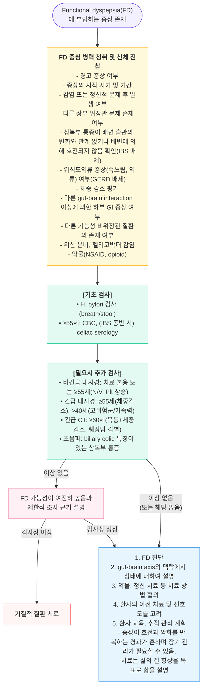
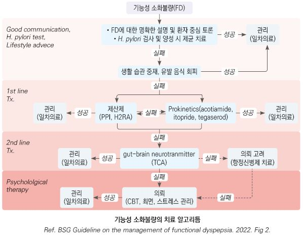
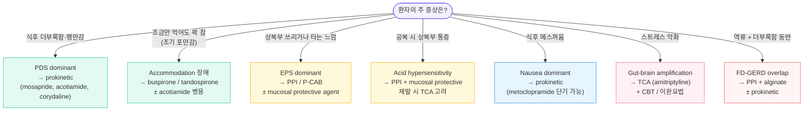

# 기능성 소화불량 Functional Dyspepsia (FD)

## <mark style="color:green;">일반 사항</mark>

* 위장관 증상이 소화성 궤양, GERD, 췌장/담낭 질환 등의 기질적 질병 없이 만성적으로 재발하는 상태
* 다른 이름 : indigestion, non-ulcer dyspepsia
* 유병률 : 인구의 약 7% (UK 6.8% \[BSG 2022])
* 분류 : postprandial distress syndrome(PDS) 및 epigastric pain syndrome(EPS)을 포함; 두 아형의 중복이 흔함
* Refractory functional dyspepsia : 최소 2가지 방법의 치료에 반응하지 않으며 ≥8주 지속
* 대부분의 소화불량 환자에서 증상의 기저 원인은 기능성 소화불량
* 양성 질환이나 치료가 어려울 수 있음; 환자의 ⅓이 위약으로 호전됨
* 흔히 IBS, 위식도역류 질환 동반

## <mark style="color:green;">원인 및 위험 인자</mark>

* 원인 불명 (☞ p.382)
* 추정 기전 : disorder of gut–brain interaction(DGBI)
  * **내장 과민성(visceral hypersensitivity)** : 위장 자극에 대한 과도한 감각 반응
  * **위 배출 지연** : 음식물의 위 통과 시간 연장
  * **위 적응(gastric accommodation) 장애** : 식후 위저부가 충분히 이완되지 않음; 특히 조기 포만감과 밀접하게 연관
  * 중추신경계–장신경계 이상 상호작용
  * **십이지장 미세염증(duodenal microinflammation)** : 일부 환자에서 십이지장 호산구증가증(duodenal eosinophilia), 비만세포(mast cell) 활성화 및 장 점막 투과성 증가가 관찰됨; post-infectious FD 및 음식 유발 FD와 연관
  * 장내 미생물총 이상 (dysbiosis) - 연구 진행 중; 아직 표준 치료 근거로 권고되지 않음 \[Second Asian Consensus 2025]
  * H. pylori 감염 (일부 환자에서 제균 후 장기 증상 호전)

### <mark style="color:orange;">관련 위험 인자</mark>

* 식이 : 카페인, 고지방식, 매운 음식, 밀
* 정신사회적 요소 : 스트레스, 불안, 우울, 신체화장애
* 위장관 운동 이상, 내장 과민, 위장관 감염(post-infectious FD)
* 흡연, NSAID·opioid 등 약물 복용
* 유전, 가족 환경, 여성

## <mark style="color:green;">임상 양상</mark>

* **postprandial fullness(식후 팽만감)** : 식후 위장에 음식이 지속적으로 존재하는 듯한 불편한 느낌
* **early satiety(조기 포만감)** : 식사를 시작하면서 곧 느껴지는, 식사량에 부합하지 않는 불편한 위장 포만감; 통상적인 분량의 음식을 다 먹을 수 없음
* **epigastric pain(상복부 통증)** : 심하고 불편한 주관적인 상복부 통증
* **epigastric burning(상복부 작열감)** : 상복부에 느껴지는 주관적인 화끈거림 또는 열감

### <mark style="color:$danger;">🚩 Red Flags!</mark>

(☞ 소화불량)

<mark style="color:$danger;">**즉각 조치 또는 의뢰**</mark>

* 토혈(hematemesis) 또는 흑색변(melena) - 상부위장관 출혈 의심
* 급성 심한 복통 + 복막 자극 증상 (반발 압통, 근강직)
* 빠르게 진행하는 연하 곤란 + 체중 감소 - 악성 종양 의심

<mark style="color:$warning;">**당일 또는 조기 의뢰**</mark>

* 비의도적 유의미한 체중 감소 (>3 kg 또는 체중의 5% 이상)
* 연하 곤란(dysphagia) 또는 연하통(odynophagia)
* 반복적·지속적 구토
* ≥55세 신규 발생 또는 최근 변화한 소화불량 증상 (✽연령 기준은 지역별 위암 유병률에 따라 다르며, 위암 발생률이 높은 한국·동아시아에서는 보다 적극적인 내시경 접근을 고려한다)
* 위암 또는 상부위장관 악성 종양 가족력 (특히 1촌)
* 상복부 종괴 촉지 또는 림프절 종대
* 새로 발견된 빈혈

<mark style="color:$info;">**외래 추적 / 추가 평가 계획**</mark> <mark style="color:$info;">- 즉각 위험 낮으나 호전 없으면 의뢰</mark>

* 2가지 이상의 치료에 반응하지 않는 refractory FD → 소화기내과 의뢰
* 심한 불안·우울 등 정신건강 문제가 증상을 주도하는 경우 → 정신건강의학과 협진
* 증상이 수면을 방해하거나 ADL에 심각한 지장을 초래하고 원인 불명인 경우

## <mark style="color:green;">진단</mark>

* 다른 질환을 배제하여 진단
* 상부 위장관 경고 징후가 없고 성가신 상복부 통증이나 속쓰림, 조기 포만 &/or 식후 팽만 상태가 ＞8주 지속되면 FD로 진단 \[BSG]

### <mark style="color:orange;">Test-and-Treat 전략</mark>


**경고 증상이 없는 환자 (한국 기준 ~40~55세 미만)의 표준 초기 접근**

1. **H. pylori 검사 우선** (요소 호기 검사 또는 대변 항원 검사)
2. **H. pylori 양성** → 제균 치료 시행 → 제균 성공 후 6~12개월 이상 증상 지속 시 FD로 확진
3. **H. pylori 음성** 또는 **제균 후 증상 지속** → phenotype에 따른 약물 치료(PPI / prokinetic) 4주 시도
4. 치료 불응 또는 경고 증상 발생 시 → 내시경 검사로 전환

한국을 포함한 동아시아에서는 위암 예방 효과를 고려하여 H. pylori 양성 시 **최우선적 제균**을 권고하는 경향이 강하다.


* 내시경 검사에서 유의미한 소견이 없고 H. pylori 제균 치료나 경험적 PPI 치료에 반응하지 않는 환자는 기능성 소화불량으로 추정

### <mark style="color:orange;">Diagnostic criteria \[ROME Ⅳ]</mark>

✽온라인 계산기 : [https://www.mdcalc.com/calc/10002/rome-iv-diagnostic-criteria-functional-dyspepsia](https://www.mdcalc.com/calc/10002/rome-iv-diagnostic-criteria-functional-dyspepsia)


현재 Rome IV 기준이 표준으로 사용 중이다. Rome V 개정 논의가 진행 중에 있으며, 향후 overlap syndrome 및 환자 중심 평가 강화 방향으로 개정이 예상된다.


#### <mark style="color:$primary;">Functional dyspepsia</mark>

* 식후곤란증후군(PDS) &/or 상복부통증증후군(EPS) 진단 기준에 해당
* 발생한 지 최소 6개월 되었고 최근 3개월간 다음 두 가지 기준을 모두 충족
  1. 다음의 (일상생활에 지장을 주는) 4가지 불편한 증상 중 ≥1개 해당 : postprandial fullness(3d/wk), early satiety(3d/wk), epigastric pain(1d/wk), epigastric burning(1d/wk)
  2. 이들 증상을 설명할 수 있는 구조적 질환의 증거 없음(상부 내시경 검사 포함)

#### <mark style="color:$primary;">Postprandial distress syndrome (PDS, 식후곤란증후군)</mark>

* 발생한 지 최소 6개월 되었고 최근 3개월간 다음 중 ≥1개의 증상이 ≥3일/주 발생
  1. (일상생활에 지장을 주는) 불편한 식후 팽만감
  2. (평소 식사량을 다 먹을 수 없을 정도의) 불편한 조기 포만감
* (상부 내시경 검사를 포함한) 일상적 조사에서 증상을 설명할 만한 기질적, 전신적 또는 대사 질환의 증거 없음

**Supportive criteria**

1. 식후 상복부 통증 또는 작열감, 상복부 팽만, 과도한 트림, 구역 등이 있을 수 있음
2. 구토는 다른 이상의 가능성을 암시함
3. (비록 소화불량의 증상이 아니더라도) 작열감이 동반될 수 있음
4. 배변 또는 방귀로 완화되는 증상은 일반적으로 소화불량의 부분으로 고려하지 않음
5. 다른 소화기 증상(예: GERD, IBS)이 동반될 수 있음

#### <mark style="color:$primary;">Epigastric pain syndrome (EPS, 상복부통증증후군)</mark>

* 발생한 지 최소 6개월 되었고 최근 3개월간 다음 중 ≥1개의 증상이 ≥1일/주 발생
  1. (일상생활에 지장을 주는) 불편한 상복부 통증
  2. (일상생활에 지장을 주는) 불편한 상복부 작열감
* (상부 내시경 검사를 포함한) 일상적 조사에서 증상을 설명할 만한 기질적, 전신적 또는 대사 질환의 증거 없음

**Supportive criteria**

1. 통증이 음식물 섭취에 의해 유발 또는 호전되거나 공복 중 발생할 수 있음
2. 식후 상복부 팽만, 트림, 구역 등이 있을 수 있음
3. 지속되는 구토는 다른 이상의 가능성을 암시함
4. (비록 소화불량의 증상이 아니더라도) 작열감이 동반될 수 있음
5. biliary pain 진단 기준에 해당되지 않음
6. 배변 또는 방귀로 완화되는 증상은 일반적으로 소화불량의 부분으로 고려하지 않음
7. 다른 소화기 증상(예: GERD, IBS)이 동반될 수 있음

### <mark style="color:orange;">검사</mark>

* 내시경 검사가 일률적으로 필요하지는 않으나 중증 또는 경고 증상이 있는 경우에는 고려해야 함 (☞ p.384)
* PDS와 위무력증(gastroparesis)은 증상이 겹칠 수 있음; 반복적인 구역·구토가 심한 경우 **위 배출 신티그래피(gastric emptying scintigraphy)**를 통한 감별을 고려한다

### <mark style="color:orange;">H. pylori-associated dyspepsia 개념</mark>


**진단 선후 관계 (Rome IV)**

H. pylori 양성 소화불량 환자에서는 **먼저 제균 치료를 시행**한다. 제균 성공 후에도 증상이 남는다면, **그때서야 비로소** 기능성 소화불량(FD)으로 진단할 수 있다.

반대로, 제균 후 **6~12개월 이상** 증상이 지속적으로 호전되면 이를 **H. pylori-associated dyspepsia**로 간주하며 FD와 구별한다. 이 6~12개월 기준은 임상적 즉시 의사결정 시점이 아닌, **장기적 예후 판단 기준**임에 주의한다.

동아시아에서는 위암 예방 목적으로도 H. pylori 제균이 강력히 권고된다.


***



<p align="center"><strong>기능성 소화불량 진단 알고리듬</strong></p>

<p align="center"><em><mark style="color:$info;">Ref. BSG Guideline on the management of functional dyspepsia. 2022. Fig 1.</mark></em></p>

***

## <mark style="background-color:$warning;">Management</mark>


**FD Phenotype-Driven Treatment - 아형 기반 치료 선택**

FD 치료는 단순한 순차적 escalation보다 **증상 표현형(phenotype)에 따른 초기 약제 선택**이 보다 현대적인 접근이다.


<table><thead><tr><th width="200">Phenotype</th><th width="220">우선 고려 약제</th><th>비고</th></tr></thead><tbody><tr><td>EPS dominant</td><td>PPI / P-CAB / TCA</td><td>산 과민성, 상복부 통증·작열감</td></tr><tr><td>PDS dominant</td><td>prokinetic / acotiamide / buspirone</td><td>식후 팽만·조기 포만감</td></tr><tr><td>EPS + PDS overlap</td><td>병용 치료</td><td>PPI + prokinetic 또는 PPI + TCA</td></tr><tr><td>불안·hypervigilance 우세</td><td>neuromodulator + CBT</td><td>검사 반복 정상, 증상 변동 큼</td></tr><tr><td>Post-infectious FD</td><td>prokinetic ± neuromodulator</td><td>장염 후 발생, nausea·PDS 흔함</td></tr><tr><td>Nausea dominant</td><td>prokinetic 중심</td><td>delayed emptying 고려</td></tr><tr><td>FD-GERD overlap</td><td>PPI + alginate ± prokinetic</td><td>역류·트림 동반, 야식 제한 병행</td></tr></tbody></table>

### <mark style="color:orange;">치료 방침</mark>

* 생활 습관 개선 등 비약물 치료가 중요
* **초기부터 phenotype(EPS/PDS/overlap)에 따라 약제를 선택**하는 것이 현대적 접근
* H. pylori(+) 환자에 대하여 제균 요법 시행; 제균 치료 후 박멸 확인 검사는 위암 위험도가 증가된 환자에서만 권고 \[BSG] (☞ p.403)
* H. pylori(-) 또는 제균 요법 후 증상 지속 시 → phenotype에 따른 약제 4주 투여 → 호전 없으면 교체 또는 병용 → 지속·재발 시 최소 유효 용량 유지
* 심한 증상, 경고 징후, 난치성 환자 등은 의뢰



### <mark style="color:orange;">FD-GERD Overlap</mark>

* FD와 GERD는 흔히 동반되며 외래에서 매우 흔한 임상 상황
* EPS는 non-erosive reflux disease(NERD)와 overlap되는 경우가 많음
* Overlap 환자는 PPI 단독 반응률이 낮을 수 있음
* 증상 : 상복부 작열감, 식후 역류, 과도한 트림, 흉부·상복부 불편감
* 치료 : PPI 또는 P-CAB + alginate 조합; prokinetic 병용 고려
* 행동 치료(야식 제한, 식후 자세 유지, 체중 감량) 병행 필수
* 난치성 overlap → 저용량 TCA + CBT/behavioral therapy 고려

## <mark style="color:green;">비-약물 치료 및 예방</mark>

* 안심시킴
* 증상의 원리를 설명(gut-brain interaction, 식이, 스트레스, 인지, 행동, 감정과의 관련성 설명)
* 생활 습관 개선 : 금연, 음주 제한, 규칙적 생활, 적당한 운동(유산소 운동)
* 식이 요법 : 증상 유발 음식 회피(예: 카페인, 매운 음식, 밀, 고지방식), low FODMAP diet(근거는 부족; ☞ p.385); 잘 씹어 먹기; 소량씩 자주 섭취
* **심리 치료 (근거 인정 \[BSG 2022, Second Asian Consensus 2025])** : 인지-행동 치료(CBT), gut-directed hypnotherapy, mindfulness, 이완 요법, psychotherapy - FD의 gut-brain amplification 고리를 차단하는 핵심 비약물 전략; 약물과 병용 시 상승 효과 기대
* 반드시 필요한 것 외의 약제(NSAID, opioid 등) 사용을 피함


**FD 증상 증폭 모델 (환자 설명용)**

아래 악순환 고리를 환자에게 설명하는 것이 explanation therapy의 핵심이다.

**음식 자극 → 위 운동 이상 / accommodation 장애 → 내장 과민성 증가 → 불안·hypervigilance·스트레스 → 증상 증폭 → 식사 회피 / 불안 강화 → 만성화**

치료 목표 : ① 위 운동 개선 → ② 과민성 감소 → ③ 증폭 고리 차단 → ④ 삶의 질 회복


## <mark style="color:green;">약물 치료</mark>

### <mark style="color:orange;">위산 분비 억제제 (PPI, H2-수용체 차단제, P-CAB)</mark>

(☞ p.377) (보험주의)

* **EPS dominant 또는 EPS+PDS overlap phenotype에서 1차로 고려** (✽PPI가 H2RA보다 더 효과적이라는 보고가 있음; PDS dominant 단독에서는 prokinetic을 우선)
* 특히 EPS에 유효; 상복부 통증, 식후 팽만감 및 소화성 궤양 증상, GERD 동반 시 효과
* 장기 투여에 따른 부작용 우려가 있음 (특히 PPI); 증상 조절 후 최소 유효 용량 또는 on-demand 투여로 전환 고려
* **H2RA** : PPI 장기 부작용이 우려되는 환자(고령, 골다공증, 저마그네슘혈증 등)에서 유효한 대안; 효과는 PPI보다 약하나 안전성 프로필 측면에서 선호되는 경우 있음

**PPI**

* omeprazole : 20 ㎎ qd <mark style="color:blue;">\[오엠피]</mark>
* dexlansoprazole : 30\~60 ㎎ qd <mark style="color:blue;">\[덱실란트 디알]</mark>

**P-CAB (Potassium-Competitive Acid Blocker)** (보험주의)


⚠️ **국내 P-CAB 급여 주의**\
P-CAB 제제의 국내 주요 급여 적응증은 **GERD, 위궤양, H. pylori 제균 치료**이다. FD 단독으로는 급여 처리가 어려울 수 있으며, FD-GERD overlap 또는 PPI 불응 사례에서 활용 시 급여 기준을 반드시 확인한다.


* tegoprazan 25 ㎎ qd : 국내 개발 P-CAB; **25 ㎎ 저용량이 기능성 소화불량 적응증**을 가짐 - FD 처방 시 활용 가능; 50 ㎎은 GERD/궤양용 <mark style="color:blue;">\[케이캡]</mark>
* fexuprazan 40 ㎎ qd : 국내 개발 P-CAB; FD + GERD 동반 또는 PPI 불응 EPS에서 고려 <mark style="color:blue;">\[펙수클루]</mark>

### <mark style="color:orange;">위장관 운동 촉진제 (Prokinetics)</mark>

(☞ p.370)

* 특히 PDS에 유효
* H. pylori 제균 치료 또는 PPI 치료에도 증상이 지속되는 환자에서 고려
* 보통 매 식전 30분, 취침 시 prn
* metoclopramide : 장기 복용 금지 (추체외로 증상 위험) <mark style="color:blue;">\[맥페란]</mark>
* mosapride : 5-HT4 수용체 작용으로 위장 운동 촉진 <mark style="color:blue;">\[가스모틴]</mark>
* corydaline : 한방 성분 기반 복합 제제; 위장 운동 촉진 및 제산 효과 <mark style="color:blue;">\[모티리톤]</mark>
* acotiamide : 100 ㎎ tid ×4wk; M1/M2 무스카린 수용체 차단 및 cholinesterase 억제 기전으로 위 배출·운동 촉진; PDS에서 위약 대비 유의한 증상 제거 입증(RCT); 삶의 질 및 장기 안전성 확인됨 \[Second Asian Consensus 2025]; 특히 식사 관련(meal-related) PDS에서 효과 기대; **국내 복합제 또는 대체 용량 존재 가능 - 허가 사항 확인 후 사용**

### <mark style="color:orange;">제산제</mark>

(☞ p.376)

* 일부 환자에서 유효; 단기 증상 완화에 한함
* 보통 매 식후 30분\~1시간, 취침 시 prn
* 예방 효과가 없으므로 장기간 지속 또는 빈번한 투여는 피함
* aluminium hydroxide <mark style="color:blue;">\[암포젤]</mark>, almagate <mark style="color:blue;">\[알마겔]</mark>

### <mark style="color:orange;">점막 보호제</mark>

(☞ p.376)

* EPS에 유효
* sucralfate <mark style="color:blue;">\[아루사루민]</mark>, eupatilin <mark style="color:blue;">\[스티렌]</mark>, benexate <mark style="color:blue;">\[울굿]</mark>, rebamipide <mark style="color:blue;">\[무코스타]</mark>

### <mark style="color:orange;">위저부 이완제 (Fundus relaxant drug)</mark>

* 종류 : pyrimidinylpiperazine azapirone 유도체, 5-HT1A 수용체 작용제
* PDS, 조기 포만감에 유효; 주로 PDS 또는 PDS 혼합형에 근거가 있음
* tandospirone : 10 ㎎ tid ×4wk; buspirone 대비 증상 호전 효과가 더 우수함이 RCT로 확인됨; **현재 이 계열 중 가장 강력한 근거 수준** \[Second Asian Consensus 2025]
* buspirone : 10 ㎎ tid ×4wk; 식사 15분 전 복용; **일부 연구에서 gastric accommodation 개선 및 조기 포만감 완화 효과가 보고됨; 근거 수준은 중등도 이하** <mark style="color:blue;">\[부스파]</mark>

### <mark style="color:orange;">항우울제 (Gut-brain neuromodulator)</mark>

(☞ p.1147)

* gut–brain neuromodulator로서 내장 과감각 억제 기전으로 작용
* 대증 or 제균 요법으로 호전되지 않는 경우에 2차 약제로 TCA 고려
* **SSRI/SNRI는 FD에 대한 효과가 입증되어 있지 않음** \[BSG 2022]
* EPS에 유효
* 저용량으로 시작하여 점차 증량; **고령자에서는 5~10 ㎎부터 시작** - 낙상·항콜린 부작용 주의
* amitriptyline : 일반 성인 10\~25 ㎎ / 고령자 5\~10 ㎎ 취침 시; 필요 시 2~4주 간격으로 증량 <mark style="color:blue;">\[에트라빌]</mark>
* imipramine : 25\~50 ㎎ 취침 시 <mark style="color:blue;">\[이미프라민]</mark>

### <mark style="color:orange;">실험적 / 근거 제한 약제</mark>

* 아래 약제들은 외래 활용성이 낮고 가이드라인 권고 수준이 약하여 routine use는 권장되지 않음
* granisetron(5-HT3 대항제), fedotozine(opioid 촉진제), proglumide(CCK 대항제), octreotide(somatostatin analogue) 등 - 연구 단계이거나 제한적 증거
* **식물성 제제(phytotherapy)** : 일부 가이드라인에서 단기 사용 가능성을 언급
  * **STW 5 (이베로가스트)** : 9가지 식물 추출물 복합 제제; 일부 RCT에서 FD 증상 호전 보고; 안전성 프로필 양호
  * **페퍼민트 오일** : 위장관 평활근 이완 기전; 소규모 연구에서 단기 증상 완화 가능성; 근거는 제한적

### <mark style="color:orange;">Probiotics</mark>

(☞ p.372)

* 특정 균주에서 일부 증상 개선 가능성이 보고되나 균주 간 결과가 일관되지 않으며 현재 **연구 단계**에 머물고 있음; routine use는 권고되지 않음 \[Second Asian Consensus 2025]

***

### <mark style="color:orange;">증상 기반 처방 결정 트리</mark>



<p align="center"><strong>FD 증상 기반 처방 결정 트리</strong></p>

<p align="center"><em><mark style="color:$info;">Ref. Second Asian Consensus Report on Functional Dyspepsia, 2025. BSG FD Guideline, 2022.</mark></em></p>

***

### <mark style="color:red;">질병코드</mark>

K30 기능성 소화불량

***

## <mark style="color:purple;">처방례</mark>

> **처방례 1. Epigastric pain syndrome (EPS)**
>
> ```
> 덱실란트 디알 30 ㎎/C   1C   qd       (보험주의)
> 스티렌 60 ㎎/T          3T   #3   식전
> ```
>
> _✽EPS에서는 PPI + 점막 보호제 조합을 1차로 시도. 4주 후 증상 호전 시 PPI 용량 감량 또는 on-demand 전환 고려._

> **처방례 2. Postprandial distress syndrome (PDS)**
>
> ```
> 가스모틴 5 ㎎/T    3T   #3   식전 30분
> 알마겔 현탁액      1P         필요시
> ```
>
> _✽PDS에서는 prokinetics를 1차로 선택. 제산제는 단기 보조 사용._

> **처방례 3. 심리적 문제 동반 / PPI-prokinetics 불응성**
>
> ```
> 모티리톤 30 ㎎/T    3T   #3   식전
> 에트라빌 10 ㎎/T    1T         취침 시
> ```
>
> _✽불안·우울 동반 또는 1차 약제 단독으로 반응이 없는 경우 저용량 TCA 병용을 고려. 항우울제가 아닌 gut-brain neuromodulator로 사용함을 환자에게 설명. **고령자는 5~10 ㎎부터 시작**하여 2~4주 간격으로 재평가 후 필요 시 증량 (일반 성인 최대 25~50 ㎎)._

> **처방례 4. PDS + 조기 포만감 (위저부 이완 부전 우세)**
>
> ```
> 가스모틴 5 ㎎/T    3T   #3   식전 30분
> 부스파 10 ㎎/T     3T   #3
> ```
>
> _✽조기 포만감이 두드러지는 PDS에서 prokinetics + 5-HT1A 작용제 병용을 고려. 4주 치료 후 재평가._

> **처방례 5. EPS + GERD 동반 또는 PPI 불응 (P-CAB 활용)**
>
> ```
> 케이캡 25 ㎎/T     1T   qd          ← tegoprazan (FD 적응증)
> 무코스타 100 ㎎/T  3T   #3   식후
> ```
>
> _✽tegoprazan(케이캡) 25 ㎎은 기능성 소화불량 허가 적응증을 가지고 있어 FD에서 급여 처방이 가능하다. EPS에 GERD가 동반되거나 PPI 불응 시 선택. 50 ㎎은 GERD/궤양용임에 주의._

***

### <mark style="color:$success;">핵심 복약 지도</mark>

> **위산 분비 억제제 (PPI / H2RA)**
>
> 1. 하루 한 번, 아침 식사 30분 전에 복용합니다.
> 2. 4주 치료 후 증상이 호전되면 의사와 상의하여 용량을 줄이거나 '증상이 있을 때만 복용'으로 전환합니다.
> 3. 장기 복용 시 마그네슘 저하, 골밀도 감소, 장내 감염 위험이 높아질 수 있으므로 불필요한 장기 사용은 피합니다.
> 4. 증상이 없어도 의사의 안내 없이 갑자기 중단하면 산 분비 반동(rebound) 현상이 나타날 수 있습니다.

> **위장관 운동 촉진제 (Prokinetics)**
>
> 1. 식사 30분 전에 복용하여 식사 중 약효가 충분히 발휘되도록 합니다.
> 2. 식후 팽만감, 조기 포만감 완화를 목적으로 사용합니다.
> 3. metoclopramide(맥페란)는 장기 복용 시 손발 떨림 등 추체외로 부작용이 생길 수 있으므로 단기(2~4주 이내) 사용을 원칙으로 합니다.

> **저용량 항우울제 (TCA - gut-brain neuromodulator)**
>
> 1. **우울증 치료약이 아니라**, 위장과 뇌 사이 신경 신호를 조절하여 통증 과민성을 낮추는 목적으로 사용합니다. 이 점을 환자에게 반드시 설명합니다.
> 2. 취침 전에 복용합니다 - 졸음 부작용을 수면에 활용할 수 있습니다.
> 3. 효과 발현까지 2~4주가 소요될 수 있습니다. 충분한 기간 복용 후 효과를 평가합니다.
> 4. 구갈, 변비, 어지러움이 나타날 수 있으며, 특히 고령자는 낙상에 주의합니다.
> 5. 임의로 중단하지 말고, 복용 중 기분 변화나 심각한 부작용이 생기면 즉시 알려주세요.

> **언제 다시 병원을 방문해야 하나요?**
>
> * 4주 치료 후에도 증상이 호전되지 않거나 오히려 악화되는 경우
> * 음식을 삼키기 어렵거나, 체중이 갑자기 감소하거나, 피를 토하거나, 검은 변이 나오는 경우 - **즉시 내원**
> * 약 복용 중 심한 두드러기, 복통, 황달 등 이상 반응이 발생한 경우 - **즉시 내원**

***

### <mark style="color:blue;">환자 안내서</mark>


**기능성 소화불량 - 위장과 뇌가 함께 만드는 불편함**

기능성 소화불량(FD)은 위나 십이지장에 궤양·종양 같은 구조적 이상이 없음에도 불구하고 식후 더부룩함·조기 포만감·상복부 통증이 반복되는 만성 소화 장애입니다. 위장관과 뇌 사이의 신호 이상(gut-brain interaction disorder)이 주된 원인으로 알려져 있습니다.

**치료 목표는 완치가 아닌 증상 조절과 삶의 질 향상입니다.** 증상이 좋아졌다 나빠지는 경과를 반복하는 경우가 많지만, 올바른 관리와 치료로 일상생활의 질을 크게 높일 수 있습니다.

**환자에게 이렇게 설명하세요**: "내시경이 정상이라 병이 없는 게 아니라, 위의 구조는 건강하지만 기능적으로 예민해진 상태(sensitive stomach)입니다. 위와 뇌 사이의 신호 조절 문제로 같은 자극에도 더 강하게 느끼는 것입니다."


#### <mark style="color:$primary;">왜 소화불량이 생기나요?</mark>

* 위장이 음식에 지나치게 민감하게 반응하거나(내장 과민), 음식이 위에서 배출되는 속도가 느리거나, 위가 충분히 늘어나지 않아 증상이 생깁니다.
* 스트레스·불안·우울은 장과 뇌 사이의 신호를 교란하여 증상을 악화시킵니다.
* 헬리코박터균 감염, 특정 음식(고지방식, 카페인, 매운 음식), 진통제(NSAIDs) 복용 등이 유발 또는 악화 요인이 될 수 있습니다.

#### <mark style="color:$primary;">일상생활에서 어떻게 관리하나요?</mark>

* **소량씩 천천히, 자주 드십시오.** 한 번에 많은 양을 먹으면 위에 부담이 됩니다.
* 증상을 유발하는 음식(기름진 음식, 커피, 알코올, 탄산음료, 매운 음식)을 피하거나 줄이십시오.
* **식사 후 바로 눕지 말고** 30분 이상 앉아 계십시오.
* **규칙적인 유산소 운동**(걷기, 수영 등)이 위장 운동과 심리 안정에 도움이 됩니다.
* **흡연은 증상을 악화시킵니다.** 금연을 강력히 권장합니다.
* 스트레스를 받을 때 증상이 심해진다면 복식 호흡, 명상, 요가 등 이완 기법을 시도해 보십시오.

#### <mark style="color:$primary;">약은 어떻게 써야 하나요?</mark>

* 처방된 약은 정해진 시간과 방법을 지켜 복용하십시오.
* 위산 억제제(PPI)는 보통 아침 식사 30분 전에 복용합니다.
* 위장 운동 촉진제는 식사 30분 전에 복용합니다.
* 저용량 항우울제를 처방받았다면, 이는 **우울증 치료가 아닌 위장 신경 조절 목적**입니다. 효과는 2~4주 후 나타납니다.
* 증상이 좋아졌다고 해서 임의로 약을 중단하지 마시고, 반드시 의사와 상의 후 감량하십시오.

#### <mark style="color:$primary;">이럴 때는 즉시 병원을 방문하세요</mark>

* 체중이 갑자기 빠지거나, 음식을 삼키기 힘들거나, 피를 토하거나, 검은 변이 나오는 경우
* 복통이 매우 심하거나 밤에 잠을 깨울 정도인 경우
* 기존 치료로 4주가 지나도 호전이 없거나 증상이 악화되는 경우
