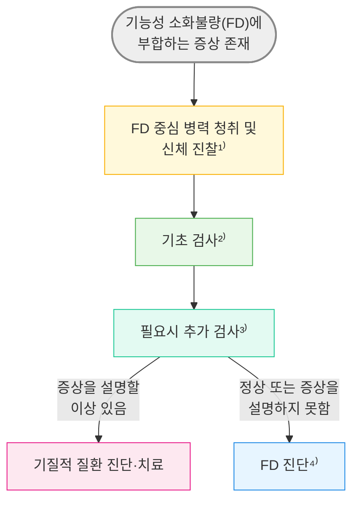
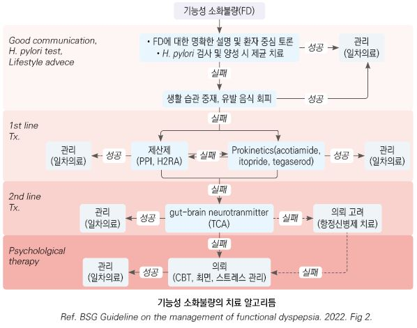

# 기능성 소화불량 Functional Dyspepsia, FD

## <mark style="color:green;">일반 사항</mark>

* 위장관 증상이 소화성 궤양, GERD, 췌장/담낭 질환 등의 기질적 질병 없이 만성적으로 재발하는 상태
* 과거에는 non-ulcer dyspepsia로 불렸음; indigestion 또는 dyspepsia는 기능성 소화불량보다 넓은 증상 개념
* 유병률 : FD 단독 약 7\~10% (UK 6.8% \[BSG 2022]; 전체 소화불량(dyspepsia) 유병률 20\~25% 중 약 ¾이 FD에 해당 - 수치 출처가 다르므로 직접 비교는 곤란 (☞ [소화불량](075_-indigestion-dyspepsia.md))
* 분류 : postprandial distress syndrome(PDS) 및 epigastric pain syndrome(EPS)을 포함; 두 아형의 중복이 흔함
* Refractory functional dyspepsia : 정의가 완전히 통일되어 있지는 않으나, 적절한 초기 치료에도 임상적으로 의미 있는 증상이 지속되는 경우를 지칭; 진단 전 복약 순응도와 기질적 질환을 재평가
* 대부분의 소화불량 환자에서 증상의 기저 원인은 기능성 소화불량
* 양성 질환이나 치료가 어려울 수 있음; 환자의 ⅓이 위약으로 호전됨
* 흔히 IBS, 위식도역류 질환 동반

## <mark style="color:green;">원인 및 위험 인자</mark>

* 원인 불명 (☞ [소화불량](075_-indigestion-dyspepsia.md))
* 추정 기전 : disorder of gut–brain interaction(DGBI)
  * 내장 과민성(visceral hypersensitivity) : 위장 자극에 대한 과도한 감각 반응
  * 위 배출 지연 : 음식물의 위 통과 시간 연장
  * 위 적응(gastric accommodation) 장애 : 식후 위저부가 충분히 이완되지 않음; 특히 조기 포만감과 밀접하게 연관
  * 중추신경계–장신경계 이상 상호작용
  * 십이지장 미세염증(duodenal microinflammation) : 일부 환자에서 십이지장 호산구증가증(duodenal eosinophilia), 비만세포(mast cell) 활성화 및 장 점막 투과성 증가가 관찰됨; post-infectious FD 및 음식 유발 FD와 연관
  * 장내 미생물총 이상 (dysbiosis) - 연구 진행 중; 아직 표준 치료 근거로 권고되지 않음
  * H. pylori 감염 (일부 환자에서 제균 후 장기 증상 호전)

### <mark style="color:orange;">관련 위험 인자</mark>

* 식이 : 카페인, 고지방식, 매운 음식, 밀
* 정신사회적 요소 : 스트레스, 불안, 우울, 신체화장애
* 위장관 운동 이상, 내장 과민, 위장관 감염(post-infectious FD)
* 흡연, NSAID·opioid 등 약물 복용
* 유전, 가족 환경, 여성

## <mark style="color:green;">임상 양상</mark>

* postprandial fullness(식후 충만감·더부룩함) : 식후 위장에 음식이 지속적으로 존재하는 듯한 불편한 느낌; bloating(팽만감)과 구별
* early satiety(조기 포만감) : 식사를 시작하면서 곧 느껴지는, 식사량에 부합하지 않는 불편한 위장 포만감; 통상적인 분량의 음식을 다 먹을 수 없음
* epigastric pain(상복부 통증) : 심하고 불편한 주관적인 상복부 통증
* epigastric burning(상복부 작열감) : 상복부에 느껴지는 주관적인 화끈거림 또는 열감

### <mark style="color:$danger;">🚩 Red Flags!</mark>

　☞ [위장질환의 감별](074_.md#step-1-red-flags)

## <mark style="color:green;">진단</mark>

* 전형적인 증상 양상과 적절한 평가를 바탕으로 적극적으로 진단하되, 증상을 설명할 기질적·전신적·대사 질환을 배제
* 임상적으로는 상부 위장관 경고 징후가 없고 일상생활에 지장을 주는 상복부 통증·상복부 작열감, 조기 포만감 및/또는 식후 충만감이 ＞8주 지속되면 FD를 적극적으로 진단할 수 있음(BSG); 연구 및 엄격한 Rome IV 진단은 아래 기간 기준을 적용

### <mark style="color:orange;">Test-and-Treat 전략</mark>

* 경고 증상이 없는 젊은 환자에서 내시경에 앞서 H. pylori 검사를 시행하여 양성이면 제균하고, 음성이면 경험적 약물 치료를 하는 초기 접근 방법
* 국내 적용 : 위암 역학을 고려한 국내 지침에 따라 ≥40세의 새로 발생한 소화불량은 조기 상부 위장관 내시경을 우선 고려. Test-and-Treat는 주로 ＜40세이면서 경고 증상이 없는 환자에서 고려

1. H. pylori 검사 우선 (요소 호기 검사 또는 대변 항원 검사)
2. H. pylori 양성 시 제균 치료 시행하고 제균 성공 여부 확인
3. H. pylori 음성 또는 제균 후에도 증상 지속 → 위산 억제제 또는 위장관 운동 촉진제 등 경험적 치료 시행
4. 치료 불응, 진단 불확실 또는 경고 증상 발생 시 → 내시경 및 필요한 추가 검사로 전환


**Test-and-Treat 전략의 근거**

1. 경고 증상 없는 젊은 환자 대부분은 내시경에서 중요한 이상 소견이 나오지 않음
2. H. pylori 제균의 이중 효과 : 소화불량 증상 호전 + 위암 예방
3. 불필요한 내시경 감소 : 검사에 따른 비용과 불편함, 부작용을 줄임


* H. pylori 제균 치료나 경험적 PPI 치료에 반응하지 않고 내시경 검사에서 유의미한 소견이 없는 환자는 기능성 소화불량으로 추정

### <mark style="color:orange;">Diagnostic criteria \[ROME Ⅳ]</mark>

　✽[온라인 계산기](https://www.mdcalc.com/calc/10002/rome-iv-diagnostic-criteria-functional-dyspepsia) &#x20;

#### <mark style="color:$primary;">Functional dyspepsia</mark>

* 식후곤란증후군(PDS) &/or 상복부통증증후군(EPS) 진단 기준에 해당
* 발생한 지 최소 6개월 되었고 최근 3개월간 다음 두 가지 기준을 모두 충족
  1. 다음의 (일상생활에 지장을 주는) 4가지 불편한 증상 중 ≥1개 해당 : postprandial fullness(식후 충만감, 3d/wk), early satiety(조기 포만감, 3d/wk), epigastric pain(상복부 통증, 1d/wk), epigastric burning(상복부 작열감, 1d/wk)
  2. 이들 증상을 설명할 수 있는 구조적 질환의 증거 없음(상부 내시경 검사 포함)

#### <mark style="color:$primary;">Postprandial distress syndrome (PDS, 식후곤란증후군)</mark>

* 발생한 지 최소 6개월 되었고 최근 3개월간 다음 중 ≥1개의 증상이 ≥3일/주 발생
  1. (일상생활에 지장을 주는) 불편한 식후 충만감
  2. (평소 식사량을 다 먹을 수 없을 정도의) 불편한 조기 포만감
* (상부 내시경 검사를 포함한) 일상적 조사에서 증상을 설명할 만한 기질적, 전신적 또는 대사 질환의 증거 없음

**Supportive criteria**

1. 식후 상복부 통증 또는 작열감, 상복부 팽만, 과도한 트림, 구역 등이 있을 수 있음
2. 구토는 다른 이상의 가능성을 암시함
3. 흉부작열감(heartburn)은 소화불량의 핵심 증상은 아니지만 동반될 수 있음
4. 배변 또는 방귀로 완화되는 증상은 일반적으로 소화불량의 부분으로 고려하지 않음
5. 다른 소화기 증상(예: GERD, IBS)이 동반될 수 있음

#### <mark style="color:$primary;">Epigastric pain syndrome (EPS, 상복부통증증후군)</mark>

* 발생한 지 최소 6개월 되었고 최근 3개월간 다음 중 ≥1개의 증상이 ≥1일/주 발생
  1. (일상생활에 지장을 주는) 불편한 상복부 통증
  2. (일상생활에 지장을 주는) 불편한 상복부 작열감
* (상부 내시경 검사를 포함한) 일상적 조사에서 증상을 설명할 만한 기질적, 전신적 또는 대사 질환의 증거 없음

**Supportive criteria**

1. 통증이 음식물 섭취에 의해 유발 또는 호전되거나 공복 중 발생할 수 있음
2. 식후 상복부 팽만, 트림, 구역 등이 있을 수 있음
3. 지속되는 구토는 다른 이상의 가능성을 암시함
4. 흉부작열감(heartburn)은 소화불량의 핵심 증상은 아니지만 동반될 수 있음
5. biliary pain 진단 기준에 해당되지 않음
6. 배변 또는 방귀로 완화되는 증상은 일반적으로 소화불량의 부분으로 고려하지 않음
7. 다른 소화기 증상(예: GERD, IBS)이 동반될 수 있음

### <mark style="color:orange;">검사</mark>

* 내시경 검사가 모든 환자에게 일률적으로 필요한 것은 아니나, 국내에서는 ≥40세의 새로 발생한 소화불량, 중증·경고 증상, 치료 불응 또는 진단 불확실 시 적극 고려 (☞ [위장질환의 감별](074_.md#undefined-5))
* 전형적 FD에서는 위 배출검사를 routine으로 시행하지 않음. PDS와 위마비(gastroparesis)는 증상이 겹치며 위 배출 지연만으로 명확히 구분되지 않음. 지속적 구토, 당뇨, 위 수술력, 체중감소 등 위마비 위험이 있는 선택된 환자에서 표준화된 고형식 위 배출 신티그래피를 고려

### <mark style="color:orange;">H. pylori-associated dyspepsia 개념</mark>


**진단 선후 관계 (Rome IV)**

* H. pylori 양성 소화불량 환자에서는 먼저 제균 치료를 시행. 제균 성공 후에도 증상이 지속되면 FD 가능성을 평가하고 치료
* 제균 후 증상이 소실되고 그 효과가 6개월 이상 유지되면 H. pylori-associated dyspepsia로 분류하여 FD와 구별. 이는 장기적 분류 기준이며, 분류를 위해 6\~12개월 동안 FD 치료를 보류할 필요는 없음
* 동아시아에서는 위암 예방 목적으로도 H. pylori 제균이 강력히 권고된다.


***


```mermaid
graph TD
    Start(["기능성 소화불량(FD)에 <br/>부합하는 증상 존재"])
    --> History["FD 중심 병력 청취 및<br/> 신체 진찰¹⁾"]
    History --> Labs["기초 검사²⁾"]
    Labs --> AddTest["필요시 추가 검사³⁾"]

    AddTest -- "증상을 설명할<br/>이상 있음" --> Organic["기질적 질환 진단·치료"]
    AddTest -- "정상 또는 증상을<br/>설명하지 못함" --> FD_Diag["FD 진단⁴⁾"]

    style Start fill:#eeeeee,stroke:#888888,stroke-width:2px
    style History fill:#fff9db,stroke:#fab005
    style Labs fill:#e8f8e8,stroke:#4caf50
    style AddTest fill:#e3faf2,stroke:#20c997
    style FD_Diag fill:#e7f5ff,stroke:#228be6
    style Organic fill:#fde8f0,stroke:#e91e8c
```

<p align="center"><strong>기능성 소화불량 진단 및 관리 알고리듬</strong></p>

¹⁾ FD 중심 병력 청취 및 신체 진찰\
\- 경고 증상 여부\
\- 증상의 시작 시기 및 기간\
\- 감염 또는 정신적 문제 후 발생 여부\
\- 다른 상부 위장관 문제 존재 여부\
\- 상복부 통증이 배변 습관의 변화와 관계 없거나 배변에 의해 호전되지 않음 확인(IBS 배제)\
\- 위식도역류 증상(속쓰림, 역류) 여부(GERD 배제)\
\- 체중 감소 평가\
\- 다른 gut-brain interaction 이상에 의한 하부 GI 증상 여부\
\- 다른 기능성 비위장관 질환의 존재 여부\
\- H. pylori 과거 검사·제균력, PPI·항생제 복용력\
\- 약물(NSAID, opioid, GLP-1 수용체 작용제 등)&#x20;

²⁾ 기초 검사\
\- H. pylori 검사(요소 호기 또는 대변 항원; 검사 전 PPI 중단 기간 고려)\
\- 필요 시 CBC 등 기본검사, IBS형 증상 동반 시 celiac serology 고려

³⁾ 필요시 추가 검사\
\- 상부 위장관 내시경: 국내에서는 ≥40세의 새로 발생한 소화불량, 경고 증상, 치료 불응 또는 진단 불확실 시 고려\
\- 복부 CT: 복통과 체중감소, 황달 등 췌장·담도 질환이 의심될 때 고려\
\- 초음파: biliary colic 특징이 있는 상복부 통증

⁴⁾ FD 진단\
\- gut-brain axis의 맥락에서 상태에 대하여 설명\
\- 약물, 정신 치료 등 치료 방법 협의\
\- 환자의 이전 치료 및 선호도를 고려\
\- 환자 교육, 추적 관리 계획: 증상이 호전과 악화를 반복하는 경과가 흔하며 장기 관리가 필요할 수 있음, 치료는 삶의 질 향상을 목표로 함을 설명

<p align="center"><em><mark style="color:$info;">Ref. BSG Guideline on the management of functional dyspepsia. 2022. Fig 1.</mark></em></p>

***

## <mark style="background-color:$warning;">Management</mark>

### <mark style="color:orange;">치료 방침</mark>

* 생활 습관 개선 등 비약물 치료가 중요
* PDS/EPS 아형은 증상 표현형을 이해하는 데 유용하지만 중복이 흔하고 특정 병태생리나 약물 반응을 정확히 예측하지 못함. 초기 약제는 우세 증상, 동반 GERD, 이전 치료 반응, 부작용 위험 및 국내 가용성을 종합하여 선택
* H. pylori(+) 환자에 대하여 제균 요법 시행 (☞ [헬리코박터](080_-helicobacter-pylori-infection.md))
* H. pylori(-) 또는 제균 요법 후 증상 지속 시 → 위산 억제제 또는 위장관 운동 촉진제 등 한 계열을 우선 시도 → 약제별 적절한 기간 후 반응을 평가하고 불응 시 다른 계열로 전환; 부분반응 시 선택적 병용 고려 → 지속·재발 시 최소 유효 용량 사용
* 심한 증상, 경고 징후, 난치성 환자 등은 의뢰

#### <mark style="color:$primary;">우세 증상을 참고한 약제 선택</mark>


PDS/EPS 아형만으로 약물 반응을 예측하거나 치료를 고정하지 않는다. 아래 표는 절대적 처방 기준이 아니라 환자별 초기 약제 선택에 참고하는 자료이다.


<table><thead><tr><th width="200">임상 상황</th><th width="220">고려할 수 있는 초기 접근</th><th>비고</th></tr></thead><tbody><tr><td>상복부 통증·작열감 우세</td><td>PPI 또는 H2RA</td><td>최저 유효 용량 사용; 반응이 없으면 다른 계열 고려</td></tr><tr><td>식후 충만감·조기 포만감 우세</td><td>국내 사용 가능한 prokinetic</td><td>약제별 근거와 부작용이 다름</td></tr><tr><td>EPS + PDS 중복</td><td>한 계열 우선 시도 후 전환 또는 선택적 병용</td><td>처음부터 routine 병용하지 않음</td></tr><tr><td>초기 치료 불응·통증 과민 우세</td><td>저용량 TCA ± gut–brain behavioral therapy</td><td>TCA는 FD에 허가 외 사용; 부작용 설명</td></tr><tr><td>조기 포만감+체중감소</td><td>영양·ARFID 평가; 전문의 판단하 mirtazapine 고려</td><td>근거 제한, 허가 외 사용</td></tr><tr><td>FD-GERD overlap</td><td>객관적 GERD는 해당 지침에 따라 치료</td><td>GERD 치료와 FD 치료를 구분</td></tr></tbody></table>




#### <mark style="color:$primary;">FD-GERD Overlap</mark>

* FD와 GERD는 흔히 동반되며 외래에서 매우 흔한 임상 상황
* FD와 NERD는 증상이 겹칠 수 있으나 상복부 작열감만으로 GERD를 진단하지 않음
* PPI 반응만으로 FD와 GERD를 확정적으로 구분할 수 없음
* 증상 : 상복부 작열감, 식후 역류, 과도한 트림, 흉부·상복부 불편감
* 치료 : 객관적으로 GERD가 동반되면 해당 GERD 지침과 국내 허가사항에 따라 PPI 또는 P-CAB을 사용; alginate를 보조적으로 고려. 잔여 FD 증상은 별도로 평가
* 역류가 동반되면 야식 제한, 식후 바로 눕지 않기, 과체중 시 체중 감량을 병행
* 난치성 증상에서는 진단을 재평가하고 저용량 TCA 또는 gut–brain behavioral therapy를 고려

## <mark style="color:green;">비-약물 치료 및 예방</mark>

* 안심시킴
* 증상의 원리를 설명(gut-brain interaction, 식이, 스트레스, 인지, 행동, 감정과의 관련성 설명)
* 생활 습관 개선 : 금연, 음주 제한, 규칙적 생활, 적당한 운동(유산소 운동)
* 식이 요법 : 개인별 증상 유발 음식, 특히 고지방식을 확인하여 제한하고 잘 씹어 소량씩 자주 섭취. Low FODMAP diet는 FD 단독에서 routine 권고할 근거가 부족하며 광범위한 제한식은 피함
* 심리 치료(특히 초기 치료 불응 시 고려 \[BSG 2022, Second Asian Consensus Report 2025; published 2026]) : 인지-행동 치료(CBT), gut-directed hypnotherapy, mindfulness, 스트레스 관리, psychotherapy; 연구 이질성과 국내 접근성을 고려
* 반드시 필요한 것 외의 약제(NSAID, opioid 등) 사용을 피함
* 중증·난치성 FD에서 심한 식사 회피, 체중감소 또는 영양불량이 있으면 avoidant/restrictive food intake disorder(ARFID) 등 섭식장애를 평가하고 지나치게 제한적인 식단을 피하기 위해 영양 전문가와 협진


**FD 증상 증폭 모델 :** 아래 악순환 고리를 환자에게 설명

* 음식 자극 → 위 운동 이상 / accommodation 장애 → 내장 과민성 증가 → 불안·hypervigilance·스트레스 → 증상 증폭 → 식사 회피 / 불안 강화 → 만성화
* 치료 목표 : 위 운동 개선 → 과민성 감소 → 증폭 고리 차단 → 삶의 질 회복


## <mark style="color:green;">약물 치료</mark>

#### [<mark style="color:$primary;">위산 분비 억제제</mark>](073_.md#gastric-antisecretory-drug) <mark style="color:$primary;">(PPI, H2-수용체 차단제, P-CAB)</mark>

　(보험주의)

* PPI 또는 H2RA를 초기 치료로 고려할 수 있으며, 상복부 통증·작열감이나 GERD가 동반된 환자에서 선택하기 쉬움. PDS/EPS 아형만으로 효과를 단정하지 않음
* 장기 투여에 따른 부작용 우려가 있음 (특히 PPI); 증상 조절 후 최소 유효 용량 또는 on-demand 투여로 전환 고려
* H2RA : 유효한 대안이나 PPI보다 열등하다고 단정할 수 없음. 연속 사용 시 7\~14일 이내 내성(tachyphylaxis)이 나타날 수 있어 단기 또는 간헐 사용 고려

**PPI**

* omeprazole : 20 ㎎ qd <mark style="color:blue;">\[오엠피]</mark>
* dexlansoprazole : 30 ㎎ qd; 음식과 관계없이 복용 가능 <mark style="color:blue;">\[덱실란트 디알]</mark>

**P-CAB (Potassium-Competitive Acid Blocker)**

* FD 자체에 대한 P-CAB의 효과 근거는 아직 불충분하며 국내 허가 적응증도 아님. GERD·위염 등 별도의 허가 적응증이 동반된 경우 해당 허가사항에 따라 사용
* tegoprazan <mark style="color:blue;">\[케이캡]</mark>, fexuprazan <mark style="color:blue;">\[펙수클루]</mark> 등: 객관적으로 GERD 등이 동반된 경우 해당 질환의 허가 용량을 적용; FD 치료 목적으로 routine 사용하지 않음


**국내 P-CAB 허가·급여 주의** : tegoprazan 25 ㎎은 기능성 소화불량 용량이 아니라 미란성 위식도역류질환 치료 후 유지요법 등에 사용하는 저용량 제제이다. FD 또는 PPI 불응 EPS 자체는 P-CAB의 국내 허가·급여 적응증이 아니며, 실제 동반 질환의 최신 허가사항과 급여기준을 확인


#### [<mark style="color:$primary;">위장관 운동 촉진제</mark>](073_.md#gi-prokinetic-agent) <mark style="color:$primary;">(Prokinetics)</mark>

* 일부 FD 환자에서 유효하며 식후 충만감·조기 포만감이 우세할 때 선택하기 쉬우나, 약제별 근거와 부작용이 다름
* H. pylori 제균 치료 또는 위산 억제 치료에도 증상이 지속되는 환자에서 고려할 수 있음
* 복용 시점은 제품별 허가사항에 따르며 모든 prokinetic을 취침 시 prn으로 사용하지 않음
* metoclopramide : 추체외로증상과 지연성 운동장애 위험 때문에 만성 FD에 routine 사용하지 않음. 다른 원인을 평가한 심한 구역·구토에 불가피하게 사용할 때만 최소 용량·최단기간 투여 <mark style="color:blue;">\[맥페란]</mark>
* mosapride : 5-HT4 수용체 작용으로 위장 운동 촉진 <mark style="color:blue;">\[가스모틴]</mark>
* 현호색·견우자 50% 에탄올연조엑스(DA-9701) : 30 ㎎ tid; 다중 수용체 작용을 통한 위장관 운동 조절 <mark style="color:blue;">\[모티리톤]</mark>
* acotiamide : 100 ㎎ tid ×4wk; M1/M2 무스카린 수용체 길항 및 acetylcholinesterase 억제 기전. PDS에서 유효성이 보고되었으나 **국내 미허가·미시판으로 실제 처방 불가**

#### [<mark style="color:$primary;">제산제</mark>](073_.md#antacid)

* 일부 환자에서 유효; 단기 증상 완화에 한함
* 보통 매 식후 30분\~1시간, 취침 시 prn
* 예방 효과가 없으므로 장기간 지속 또는 빈번한 투여는 피함
* aluminium hydroxide <mark style="color:blue;">\[암포젤]</mark>, almagate <mark style="color:blue;">\[알마겔]</mark>

#### [<mark style="color:$primary;">점막 보호제</mark>](073_.md#gastric-mucosal-protective-agent)

* 일부 약제에서 증상 개선이 보고되었으나 근거가 제한적이며, EPS에서 위산 억제제와의 routine 병용이 단독요법보다 우월하다고 확립되지 않음
* sucralfate <mark style="color:blue;">\[아루사루민]</mark>, eupatilin <mark style="color:blue;">\[스티렌]</mark>, benexate <mark style="color:blue;">\[울굿]</mark>, rebamipide <mark style="color:blue;">\[무코스타]</mark>

#### <mark style="color:$primary;">위저부 이완제 (Fundus relaxant drug)</mark>

* 종류 : pyrimidinylpiperazine azapirone 유도체, 5-HT1A 수용체 작용제
* PDS, 조기 포만감에 유효; 주로 PDS 또는 PDS 혼합형에 근거가 있음
* tandospirone : 10 ㎎ tid ×4wk; 소규모 RCT와 간접 비교에서 유효 가능성이 보고되었으나 근거 수준은 낮고, buspirone보다 우월하다는 직접 비교 RCT는 없음. 국내 통상 처방이 어려움
* buspirone : 10 ㎎ tid ×4wk; 식사 15분 전 복용. 일부 소규모 연구에서 gastric accommodation 및 조기 포만감 개선이 보고되었으나 결과가 일관되지 않음. 국내 FD 적응증은 없는 허가 외 사용 <mark style="color:blue;">\[부스파]</mark>

#### <mark style="color:$primary;">항우울제 (Gut-brain neuromodulator)</mark>

* gut–brain neuromodulator로서 내장 과감각 억제 기전으로 작용
* 대증 or 제균 요법으로 호전되지 않는 경우에 2차 약제로 [TCA ](073_.md#tca)고려
* SSRI/SNRI는 FD에 대한 효과가 입증되어 있지 않음 \[BSG 2022]
* 특히 통증이 두드러진 환자에서 근거가 있으나 PDS/EPS 아형만으로 사용 여부를 결정하지 않음
* 저용량으로 시작하여 점차 증량; 고령자에서는 5\~10 ㎎부터 시작 - 낙상·항콜린 부작용 주의
* amitriptyline : 일반 성인 10\~25 ㎎ / 고령자 5\~10 ㎎ 취침 시; 필요 시 2\~4주 간격으로 증량 <mark style="color:blue;">\[에트라빌]</mark>
* imipramine : 25 ㎎ 취침 시 시작하여 필요 시 50 ㎎까지 고려 <mark style="color:blue;">\[이미프라민]</mark>
* mirtazapine : 15 ㎎ 취침 시; 조기 포만감과 체중감소가 두드러진 난치성 FD에서 전문의 판단하에 고려할 수 있으나 근거는 제한적. 졸림·체중증가 및 대사 부작용 주의
* 위 약제들의 FD 사용은 국내 허가 외 사용이므로 근거, 대안 및 부작용을 설명

#### [<mark style="color:$primary;">Probiotics</mark>](073_.md#probiotics)

* 특정 균주에서 일부 증상 개선 가능성이 보고되나 균주 간 결과가 일관되지 않으며 현재 연구 단계에 머물고 있음; routine use는 권고되지 않음 \[Second Asian Consensus Report 2025; published 2026]

#### <mark style="color:$primary;">실험적 / 근거 제한 약제</mark>

* 아래 약제들은 외래 활용성이 낮고 가이드라인 권고 수준이 약하여 routine use는 권장되지 않음
* granisetron(5-HT3 대항제), fedotozine(opioid 촉진제), proglumide(CCK 대항제), octreotide(somatostatin analogue) 등 - 연구 단계이거나 제한적 증거
* 식물성 제제(phytotherapy) : 일부 가이드라인에서 단기 사용 가능성을 언급
  * STW 5 (이베로가스트) : 9가지 식물 추출물 복합 제제; 일부 RCT에서 FD 증상 호전이 보고되었으나 드물게 중증 약물유발 간손상이 보고되어 황달·진한 소변 등 발생 시 즉시 중단·평가
  * 페퍼민트 오일 단독의 FD 근거는 매우 제한적이며 하부식도괄약근 이완으로 역류를 악화시킬 수 있음. 연구는 주로 peppermint oil–caraway oil 복합제에 국한

***

### <mark style="color:orange;">증상 아형별 처방 방향</mark>

<table><thead><tr><th width="162">우세 증상</th><th width="188">고려할 상황</th><th>처방 방향</th></tr></thead><tbody><tr><td>식후 충만감·조기 포만감</td><td>식사 관련 증상 우세</td><td>국내 사용 가능한 prokinetic 한 계열 시도</td></tr><tr><td>상복부 통증·작열감</td><td>산 억제 치료 반응 가능</td><td>저용량 PPI 또는 H2RA 시도</td></tr><tr><td>초기 치료 불응·통증 과민</td><td>진단·순응도 재평가 후</td><td>저용량 TCA ± gut–brain behavioral therapy</td></tr><tr><td>조기 포만감+체중감소</td><td>영양불량·ARFID 감별</td><td>영양 개입; 선택적으로 mirtazapine 고려</td></tr><tr><td>지속적 구역·구토</td><td>FD 이외 질환·위마비 감별</td><td>원인 평가 후 선택적 치료</td></tr><tr><td>역류 증상 동반</td><td>FD-GERD overlap 가능</td><td>GERD가 확인되면 해당 지침에 따라 별도 치료</td></tr></tbody></table>

***

### <mark style="color:red;">질병코드</mark>

K30 기능성 소화불량

***

## <mark style="color:purple;">처방례</mark>

> **처방례 1. Epigastric pain syndrome (EPS)**
>
> ```
> 오엠피 20 ㎎/C   1C   qd   아침 식전 30분   (보험주의)
> ```
>
> _✽상복부 통증·작열감이 우세하면 저용량 PPI를 4\~8주 시도할 수 있다. 증상 호전 시 중단 또는 필요 시 최소 유효 용량으로 조정하며, 점막보호제의 routine 병용은 필요하지 않다._

> **처방례 2. Postprandial distress syndrome (PDS)**
>
> ```
> 가스모틴 5 ㎎/T    3T   #3   식전 30분
> 알마겔 현탁액      1P         필요시
> ```
>
> _✽식후 충만감·조기 포만감이 우세하면 국내 사용 가능한 prokinetic을 초기 약제로 선택할 수 있다. 제산제는 필요 시 단기 보조로만 사용한다._

> **처방례 3. 초기 치료 불응 / 통증 과민 우세**
>
> ```
> 에트라빌 10 ㎎/T    1T   qd   취침 시   (허가 외 사용)
> ```
>
> _✽진단·복약 순응도를 재평가한 뒤 저용량 TCA를 gut–brain neuromodulator로 고려. 불안·우울 동반 자체가 처방 기준은 아니며 별도의 정신질환은 해당 진단에 따라 치료한다. 고령자는 항콜린 부작용과 낙상 위험 때문에 가급적 피하거나 5\~10 ㎎부터 매우 신중하게 시작한다. 2\~4주 간격으로 재평가하여 필요 시 서서히 증량한다._

> **처방례 4. 조기 포만감 우세, 기존 치료 불응**
>
> ```
> 부스파 10 ㎎/T     3T   #3   식전 15분   (허가 외 사용)
> ```
>
> _✽Buspirone의 FD 효과는 연구 결과가 일관되지 않으므로 표준 1차 치료가 아니다. 조기 포만감이 두드러지고 기존 치료에 반응하지 않은 선택된 환자에서 근거와 허가 외 사용임을 설명한 후 4주간 시도하고, 효과가 없으면 중단한다._

***

### <mark style="color:$success;">핵심 복약 지도</mark>

> **위산 분비 억제제 (PPI / H2RA)**
>
> 1. 일반적인 PPI는 하루 한 번 아침 식사 30분 전에 복용합니다. Dexlansoprazole 등은 음식과 관계없이 복용할 수 있으므로 제품별 지시에 따릅니다.
> 2. 4\~8주 치료 후 증상이 호전되면 의사와 상의하여 중단하거나 최소 유효 용량 또는 '증상이 있을 때만 복용'으로 전환합니다.
> 3. PPI는 대체로 안전하지만 불필요한 장기 복용은 피합니다. 장기 사용과 여러 이상반응의 연관성이 보고되었으나 인과관계가 확정되지 않은 것도 많습니다.
> 4. 장기간 복용했다면 중단 후 일시적인 산 분비 반동이 생길 수 있으므로 중단 방법을 의사와 상의합니다.

> **위장관 운동 촉진제 (Prokinetics)**
>
> 1. 복용 시점과 횟수는 약제별로 다르므로 처방 지시에 따릅니다. Mosapride와 모티리톤은 일반적으로 식전에 복용합니다.
> 2. 식후 충만감, 조기 포만감 완화를 목적으로 사용합니다.
> 3. Metoclopramide(맥페란)는 손발 떨림, 근육 경직 등 추체외로 부작용과 지연성 운동장애 위험 때문에 만성 기능성 소화불량에 routine으로 사용하지 않습니다.

> **저용량 항우울제 (TCA - gut-brain neuromodulator)**
>
> 1. 기능성 소화불량에서는 우울증 치료 용량보다 낮은 용량으로 위장과 뇌 사이 신경 신호를 조절하여 통증 과민성을 낮추는 목적으로 사용합니다.
> 2. 취침 전에 복용합니다 - 졸음 부작용을 수면에 활용할 수 있습니다.
> 3. 효과 발현까지 2\~4주가 소요될 수 있습니다. 충분한 기간 복용 후 효과를 평가합니다.
> 4. 구갈, 변비, 어지러움이 나타날 수 있으며, 특히 고령자는 낙상에 주의합니다.
> 5. 임의로 중단하지 말고, 복용 중 기분 변화나 심각한 부작용이 생기면 즉시 알려주세요.

> **언제 다시 병원을 방문해야 하나요?**
>
> * 피를 토하거나 검은 변, 실신 또는 갑작스럽고 매우 심한 복통이 있는 경우 - **즉시 응급평가**
> * 음식을 삼키기 어렵거나, 원인 없이 체중이 감소하거나, 구토가 지속되는 경우 - **신속한 진료·내시경 평가**
> * 4\~8주간 치료해도 호전되지 않거나 악화되는 경우 - **외래 재평가**
> * 약 복용 중 심한 두드러기·호흡곤란·황달 등이 발생한 경우 - **즉시 내원**

***

### <mark style="color:blue;">환자 안내서</mark>


**기능성 소화불량 - 위장과 뇌가 함께 만드는 불편함**

기능성 소화불량(FD)은 위나 십이지장에 궤양·종양 같은 구조적 이상이 없음에도 불구하고 식후 더부룩함·조기 포만감·상복부 통증이 반복되는 만성 소화 장애입니다. 위장관과 뇌 사이의 상호작용 이상(disorder of gut–brain interaction)이 중요한 기전입니다.

**치료 목표는 증상을 줄이고 식사와 일상생활의 질을 회복하는 것입니다.** 증상이 좋아졌다 나빠지는 경과를 반복할 수 있지만, 적절한 관리와 치료로 장기간 호전될 수 있습니다.

**환자에게 이렇게 설명하세요**: "내시경이 정상이라 병이 없는 게 아니라, 위의 구조는 건강하지만 기능적으로 예민해진 상태(sensitive stomach)입니다. 위와 뇌 사이의 신호 조절 문제로 같은 자극에도 더 강하게 느끼는 것입니다."


#### <mark style="color:$primary;">왜 소화불량이 생기나요?</mark>

* 위장이 음식에 지나치게 민감하게 반응하거나(내장 과민), 음식이 위에서 배출되는 속도가 느리거나, 위가 충분히 늘어나지 않아 증상이 생깁니다.
* 스트레스·불안·우울은 장과 뇌 사이의 신호를 교란하여 증상을 악화시킵니다.
* 헬리코박터균 감염, 특정 음식(고지방식, 카페인, 매운 음식), 진통제(NSAIDs) 복용 등이 유발 또는 악화 요인이 될 수 있습니다.

#### <mark style="color:$primary;">일상생활에서 어떻게 관리하나요?</mark>

* **소량씩 천천히, 자주 드십시오.** 한 번에 많은 양을 먹으면 위에 부담이 됩니다.
* 특히 기름진 음식을 줄이고, 음식과 증상을 기록하여 본인에게 실제로 증상을 유발하는 음식만 선택적으로 피하십시오. 무리한 제한식은 영양 부족을 일으킬 수 있습니다.
* 역류 증상도 있다면 **식사 후 바로 눕지 마십시오.**
* **규칙적인 유산소 운동**(걷기, 수영 등)이 위장 운동과 심리 안정에 도움이 됩니다.
* 흡연과 기능성 소화불량의 연관성이 보고되어 있으며 전반적인 건강을 위해 금연을 권장합니다.
* 스트레스를 받을 때 증상이 심해진다면 복식 호흡, 명상, 요가 등 이완 기법을 시도해 보십시오.

#### <mark style="color:$primary;">약은 어떻게 써야 하나요?</mark>

* 처방된 약은 정해진 시간과 방법을 지켜 복용하십시오.
* 대부분의 위산 억제제(PPI)는 아침 식사 30분 전에 복용하지만, 음식과 관계없이 복용하는 제품도 있으므로 처방 지시에 따릅니다.
* 위장 운동 촉진제도 약제에 따라 복용 시점이 다르므로 처방 지시에 따릅니다.
* 저용량 항우울제를 처방받았다면 우울증 치료 용량보다 낮은 용량으로 위장 신경의 과민성을 조절하기 위한 것입니다. 효과를 평가하기까지 수 주가 필요할 수 있습니다.
* 약제별 치료 기간과 중단 방법이 다르므로 임의로 변경하지 말고 의사와 상의하십시오.

#### <mark style="color:$primary;">이럴 때는 다시 진료받으세요</mark>

* 피를 토하거나 검은 변, 실신 또는 갑작스럽고 매우 심한 복통이 있으면 **즉시 응급실을 방문하십시오.**
* 음식을 삼키기 점점 어려워지거나, 원인 없이 체중이 감소하거나, 구토가 지속되면 **신속히 진료받으십시오.**
* 4\~8주간 치료해도 호전되지 않거나 증상이 악화되면 외래에서 진단과 치료를 재평가하십시오.
