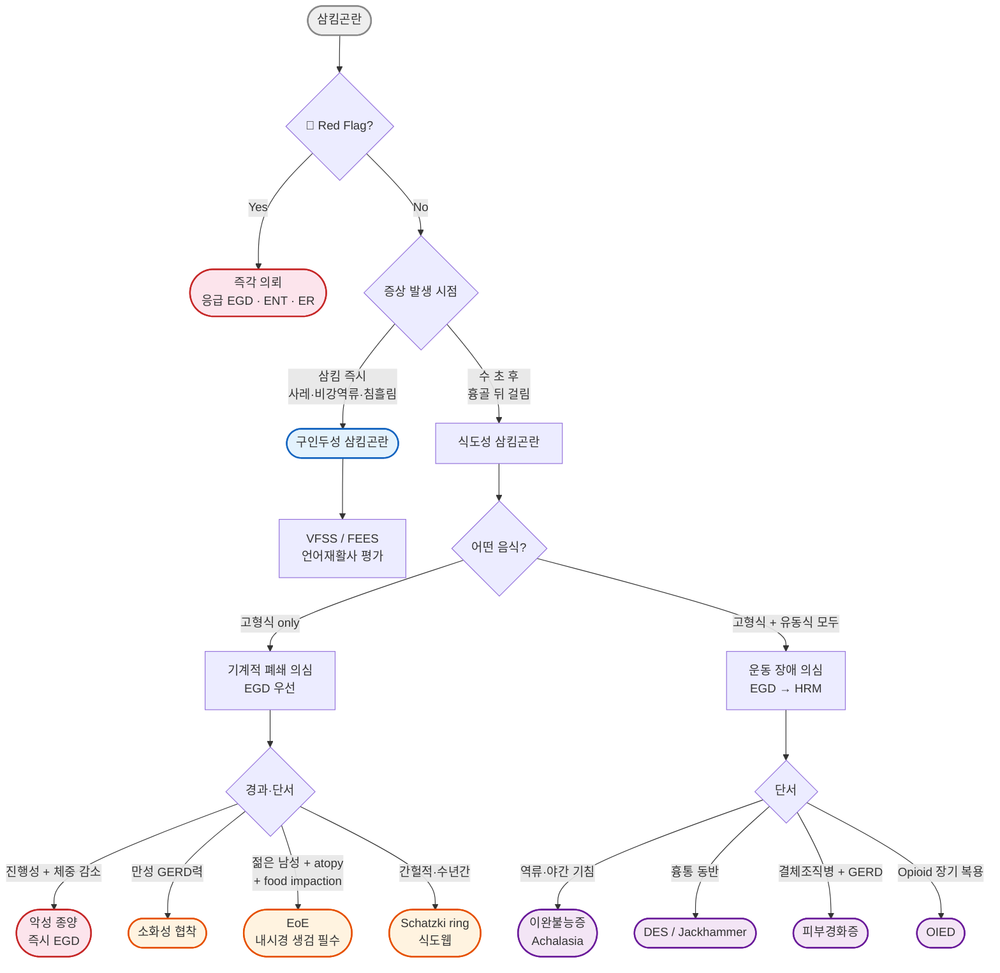

# 삼킴곤란 Dysphagia

## <mark style="color:green;">일반 사항</mark>

* **삼킴곤란(연하곤란, dysphagia)** : 구강에서 위장으로 음식물을 이동시키는 과정에서의 어려움; 부위와 기전에 따라 구분
* 삼킴(연하)은 구강기(oral phase) → 인두기(pharyngeal phase) → 식도기(esophageal phase)의 3단계로 이루어지며, 각 단계의 장애에 따라 임상 양상이 다름
* **유병률** : 지역사회 성인의 약 16~22%; 65세 이상에서는 27~44%에 이름
  * 입원 환자 및 요양 시설 거주 노인에서는 유병률이 더 높음
  * 뇌졸중 환자의 약 50%, 파킨슨병 환자의 50~80%에서 동반

### <mark style="color:orange;">삼킴곤란의 분류</mark>

<table><thead><tr><th width="170">유형</th><th width="260">정의</th><th>특징</th></tr></thead><tbody><tr><td>Oral dysphagia</td><td>구강에서 저작 및 bolus 형성 단계의 문제</td><td>씹기 어려움, 구강 내 음식물 조절 곤란</td></tr><tr><td>Oropharyngeal dysphagia</td><td>구인두→상부 식도로의 이송 장애</td><td>삼킴 시작 즉시 증상; 흡인, 비강 역류 동반 가능</td></tr><tr><td>Esophageal dysphagia</td><td>식도→위로의 이송 장애</td><td>삼킴 수 초 후 흉부 걸림 느낌</td></tr><tr><td>이송삼킴곤란 (transfer dysphagia)</td><td>삼킴 시 음식물이 비강 또는 기도로 유입</td><td>oropharyngeal dysphagia의 하위 개념; 흡인, 사레, 비강 역류</td></tr></tbody></table>

### <mark style="color:orange;">관련 증상 구분</mark>

* **삼킴통증(odynophagia)** : 삼킬 때 발생하는 통증; 구인두 또는 식도의 염증·궤양 (감염, 약물 유발, 위산 역류 등)
* **인두이물감(globus pharyngeus)** : 목 안의 이물감; 삼킴에 제한 없고 삼킴으로 오히려 호전됨 (☞ [소화불량](075_-indigestion-dyspepsia.md))
* **먹기공포증(phagophobia)** : 삼킴 자체에 대한 심리적 공포; 기질적 이상 없음


**Clinical Pearl — Globus vs 삼킴곤란 감별**: '목에 뭔가 걸린 느낌(globus sensation)'을 호소하지만 실제 음식물 통과에는 지장이 없고, 오히려 음식을 먹을 때 증상이 완화된다면 기질적 삼킴곤란보다 인두이물감(globus pharyngeus) 또는 GERD에 의한 감각 과민일 가능성이 높다. Globus는 삼킴을 방해하지 않는다는 점이 삼킴곤란과의 핵심 차이다.


### <mark style="color:orange;">노인 연하장애 — Presbyphagia & Sarcopenic Dysphagia</mark>

* **Presbyphagia (노인성 삼킴장애)** : 노화에 따른 근력 감소, 치아 손실, 타액 분비 감소, 감각 둔화로 인한 연하 기능 저하; 삼킴곤란이 없어도 silent aspiration 위험 증가
* **Sarcopenic dysphagia (근감소성 삼킴장애)** : 전신 근감소증(sarcopenia)이 연하 관련 근육(설골상근, 인두수축근, 식도괄약근)까지 침범하여 발생하는 삼킴곤란; 노인 연하장애 분야에서 최근 가장 주목받는 entity
  * 고령·저영양·반복 입원·장기 와상 환자에서 빈도 높음
  * **특징** : 전신 근감소증 + 원인 불명 연하 기능 저하; 신경 또는 구조적 이상 없음
  * **치료** : 연하 재활 운동 + 저항성 운동 + **영양 지원** — 류신(Leucine)이 풍부한 양질의 단백질(1.2~1.5 g/kg/일)과 **비타민 D** (결핍 시 보충) 공급이 근육 합성 촉진에 중요
* 반복 흡인성 폐렴의 중요한 위험 요인; 노인 외래에서 적극적인 연하 평가 권장

***

## <mark style="color:green;">원인 및 위험 인자</mark>

#### <mark style="color:$primary;">기계적 폐쇄</mark>

* **구인두(oropharyngeal)** : 두경부 암종, 편도 비대 및 편도주위농양, 후두개염, 인두 농양
* **Zenker diverticulum (인두식도게실)** : 윤상인두근 위쪽 Killian triangle의 점막 탈출; 노인 남성에서 호발; **입 냄새(halitosis)와 미소화된 음식물 역류**가 핵심 단서; 내시경·수술로 치료
* **윤상인두근 바(Cricopharyngeal bar)** : 상부 식도괄약근(UES) 불완전 이완으로 발생하는 바(bar) 형태의 근육 비대; Zenker diverticulum의 전구 병변; VFSS에서 인두 후벽의 돌출된 바 소견으로 확인; 증상 있는 경우 근절개술(myotomy) 또는 내시경 확장술 고려
* **식도(esophageal)** : 식도암, 소화성 협착(peptic stricture), Schatzki ring, 식도웹(esophageal web), 식도게실
* **외부 압박** : 갑상선 비대, 종격동 종양, 대동맥류, 심비대
* **경추 골성 돌기(cervical osteophyte)** : DISH(미만성 특발성 골격 과골증) 또는 전방 경추 골증식증; 노인에서 식도 외부 압박에 의한 구인두 삼킴곤란 유발; 경추 X-ray 또는 CT로 확인

#### <mark style="color:$primary;">염증성·면역성 질환</mark>

* **호산구성 식도염(Eosinophilic esophagitis, EoE)** : 성인 고형식 삼킴곤란 및 음식물 저류(food impaction)의 주요 원인; 젊은 남성·알레르기 병력 흔함
* **위식도역류질환(GERD)** : 만성 염증 → peptic stricture; 기능적 연하장애 유발
* 방사선 치료 후 섬유화, 구강점막염

#### <mark style="color:$primary;">신경근육 질환</mark>

* **뇌혈관 질환(CVA)** : 구인두성 삼킴곤란의 가장 흔한 원인
* 파킨슨병, 알츠하이머병, 다발성 경화증, ALS, 중증 근무력증
* **윤상인두근 기능 이상(Cricopharyngeal dysfunction)** : 상부 식도괄약근(UES) 이완 불충분 → 반복 삼킴, 흡인, 목의 걸림감; Zenker diverticulum의 병태생리적 기반
* **이완불능증(achalasia)** : 하부 식도괄약근 이완 불능 + 연동 소실
* **광범위 식도 연축(DES)**, jackhammer esophagus
* 피부경화증(scleroderma) : 식도 하부 2/3의 연동운동 소실 + 하부 식도괄약근(LES) 압력 저하가 특징 → 심각한 GERD + peptic stricture 유발; 당뇨병신경병증, SLE

#### <mark style="color:$primary;">약물 유발 운동 장애</mark>

* **Opioid 유발 식도 운동 장애(OIED, Opioid-Induced Esophageal Dysfunction)** : 만성 opioid 사용 → μ-opioid receptor 활성화 → EGJ outflow obstruction, 경련성 운동 이상(achalasia type III 유사 소견) 유발; HRM에서 achalasia 유사 패턴; opioid 감량·중단 시 호전 가능. tramadol은 μ-receptor 활성화가 상대적으로 약하므로 OIED 유발이 가능하나 전형적 opioid에 비해 낮음
* 항콜린제(타액 감소·식도 운동 저하), CCB, nitrate 장기 복용 시에도 식도 운동 저하 가능

#### <mark style="color:$primary;">감염</mark>

* 식도 칸디다증(면역저하자, 광범위 항생제, 흡입 스테로이드), CMV 식도염, HSV 식도염
* 디프테리아, 뇌막염, 라임병, 공수병

#### <mark style="color:$primary;">위험 인자</mark>

* 고령, 흡연, 과음, 비만, 철 결핍(Plummer-Vinson syndrome)
* GERD, 뇌졸중, COPD, 두경부암
* 두경부·흉부 수술, 방사선 치료, 화학요법
* 전신 근감소증(sarcopenia), 저영양, 장기 와상
* **알약 관련** : bisphosphonate, NSAID, tetracycline, doxycycline, clindamycin, TMP/SMX, 고용량 비타민 C, 철분제, 칼륨제제, 항콜린제
* **운동 장애 유발** : opioid(tramadol은 위험 낮음), 항콜린제, CCB


⚠️ **약제 유발성 식도염(Pill esophagitis)**: 알약을 소량의 물과 함께 또는 누운 상태에서 복용 시 식도 점막 직접 손상. 증상(삼킴통증, 흉통)은 복용 **직후 또는 수 시간 내**에 나타남.

<table><thead><tr><th width="200">대표 약물</th><th>기전</th><th>주의사항</th></tr></thead><tbody><tr><td>Bisphosphonate (알렌드로네이트)</td><td>직접 pH 손상</td><td>기립 자세 + 물 200 mL; 30분 금와위</td></tr><tr><td>Doxycycline / Tetracycline</td><td>직접 점막 손상</td><td>눕기 전 복용 금지; 충분한 물</td></tr><tr><td>NSAIDs / Aspirin</td><td>점막 보호 억제</td><td>식후 복용; 위험군에서 PPI 병용</td></tr><tr><td>Clindamycin</td><td>직접 점막 독성</td><td>눕기 전 복용 금지</td></tr><tr><td>Iron 제제, 칼륨제제</td><td>직접 점막 자극</td><td>충분한 물; 분할 복용</td></tr><tr><td>고용량 비타민 C</td><td>산성 자극</td><td>대용량 복용 회피</td></tr></tbody></table>


***

## <mark style="color:green;">임상 양상</mark>

* 구강 내 음식물 조절 어려움, 저작 곤란, 침 흘림
* 삼킴 시작 어려움, 삼킴 후 식도 걸림 느낌
* 삼킴 중 기침, 사레, 구역
* 음식물의 비강 역류 또는 기도 흡인
* 목소리 변화(쉰 목소리, 물 먹은 듯한 **wet voice** — 흡인 의심)
* 흡인성 폐렴(반복성 폐렴 시 silent aspiration 의심)
* 체중 감소, 탈수, 영양 결핍

### <mark style="color:$danger;">🚩 Red Flags!</mark>

<mark style="color:$danger;">**즉각 조치 또는 응급 의뢰**</mark> <mark style="color:$danger;">- 생명 위협 또는 긴급 처치 필요</mark>

* **급성 완전 음식물 저류(complete food/bolus impaction)** — 침도 못 삼킬 경우: **6시간 이내** 응급 내시경; 부분 저류(부드러운 음식·침은 넘어감): 24시간 이내 내시경
* **천명(stridor) 동반** — 상기도 폐쇄 또는 후두개염 의심; **기도 확보가 최우선** → 즉시 ER 이송; 기도 평가 전에 내시경 등 다른 처치 시도 금지
* 급성 발열 + 경부 강직 또는 경부 부종 — 경부 농양, 뇌수막염 의심
* 신속히 진행하는 삼킴 불능 + 체중 감소 + 전신 쇠약

<mark style="color:$warning;">**당일 또는 조기 의뢰**</mark>

* **진행성 고형식 삼킴곤란** (수 주~수개월 진행) — 식도암 또는 두경부암 의심
* 쉰 목소리가 삼킴곤란보다 **나중에** 발생 — 신경 손상 또는 악성 종양 의심
* **경부 이물감 + 삼킴곤란 3주 이상 지속** — 후두암 배제 위해 이비인후과 의뢰
* 설명할 수 없는 체중 감소 (3~6개월 내 체중의 ≥5%)
* 국소 신경학적 이상 동반

<mark style="color:$info;">**외래 추적 / 추가 평가 계획**</mark> <mark style="color:$info;">- 즉각 위험 낮으나 경과 관찰·평가 필요</mark>

* 4~8주 경험적 치료(PPI 등)에 호전 없는 경우 — 내시경 검사 고려
* 반복적 흡인성 폐렴 또는 wet voice 지속 — 연하 전문 평가(VFSS/FEES) 의뢰
* 고령 + 식욕 저하 + 서서히 진행하는 연하 어려움 — sarcopenic dysphagia 또는 신경퇴행성 질환 감별

***

## <mark style="color:green;">진단</mark>

### <mark style="color:orange;">1차 감별: 구인두성 vs 식도성</mark>


**외래 triage의 핵심**: 삼킴곤란을 접하면 구인두성인지 식도성인지를 먼저 판단한다. 단, **환자가 느끼는 걸림 위치가 실제 병변 위치와 일치하지 않는 경우가 흔하다.** 원위부 식도 병변도 '목에 걸린다'고 표현하는 경우가 많으므로, 위치 표현보다 증상 발생 시점·동반 증상·병력 전체를 종합하여 판단해야 한다.


<table><thead><tr><th width="190">특징</th><th width="220">구인두성 (Oropharyngeal)</th><th>식도성 (Esophageal)</th></tr></thead><tbody><tr><td>증상 발생 시점</td><td>삼킴 시작 즉시</td><td>삼킴 수 초 후</td></tr><tr><td>위치 표현</td><td>목, 상부 흉골</td><td>흉골 뒤, 흉부 중하부</td></tr><tr><td>사레 / 흡인</td><td>흔함</td><td>드묾</td></tr><tr><td>비강 역류</td><td>가능</td><td>없음</td></tr><tr><td>Wet voice / 식후 기침</td><td>흔함</td><td>드묾</td></tr><tr><td>침 흘림</td><td>흔함</td><td>드묾</td></tr><tr><td>주요 원인</td><td>신경근육 질환 (CVA, 파킨슨병 등)</td><td>기계적 폐쇄 / 운동 장애</td></tr><tr><td>우선 검사</td><td>VFSS / FEES</td><td>상부 소화관 내시경 (EGD)</td></tr></tbody></table>

### <mark style="color:orange;">고형식 → 유동식 진행 패턴: 핵심 임상 단서</mark>


**외래에서 가장 강력한 bedside clue**: 어떤 음식에서 증상이 있는지를 반드시 확인한다.

* **기계적 폐쇄** : 초기에는 고형식에서만 증상 → 병변이 진행·협착이 심해질수록 유동식까지 증상 확대
* **운동 장애** : 처음부터 고형식과 유동식 모두 증상 (연동 운동 자체의 문제이므로 음식 형태 무관)

이 단 하나의 질문만으로도 기계적 폐쇄 vs 운동 장애를 상당 부분 감별할 수 있다.


### <mark style="color:orange;">흡인 위험 침상 평가 단서</mark>

<table><thead><tr><th width="240">임상 소견</th><th>의미</th></tr></thead><tbody><tr><td>식사 중·후 기침</td><td>흡인 또는 흡인 직전(penetration)</td></tr><tr><td>Wet voice (식후 목소리 변화)</td><td>성대 위 음식물 잔류 → 흡인 의심</td></tr><tr><td>반복적 폐렴 (같은 폐 부위)</td><td>Silent aspiration 강력 의심</td></tr><tr><td>식사 시간 현저히 연장 (30분 이상)</td><td>연하 기능 저하, 피로성 흡인</td></tr><tr><td>식욕 저하 + 원인 불명 체중 감소</td><td>만성 삼킴곤란으로 인한 영양 결핍</td></tr><tr><td>침 흘림, 구강 분비물 조절 곤란</td><td>구인두 기능 저하</td></tr></tbody></table>

### <mark style="color:orange;">선별 검사 도구 — EAT-10</mark>


**EAT-10 (Eating Assessment Tool-10)** : 연하장애 선별을 위한 10문항 자가보고 설문지. 각 문항 0~4점(0=정상, 4=심각), 총점 **≥3점**이면 연하장애 의심 및 전문 평가 의뢰 기준.


\[증상 영역]\
1\. 삼킴 문제 때문에 체중이 감소하였습니다.\
2\. 삼킴 문제 때문에 외식이 어렵습니다.\
3\. 액체를 삼킬 때 힘이 듭니다.\
4\. 고형식을 삼킬 때 힘이 듭니다.\
5\. 알약을 삼킬 때 힘이 듭니다.\
6\. 삼킴이 고통스럽습니다.\
7\. 삼킴의 즐거움이 감소했습니다.\
8\. 삼킬 때 음식이 목에 걸립니다.\
9\. 먹을 때 기침이 납니다.\
10\. 삼킴은 스트레스를 줍니다.

### <mark style="color:orange;">검사</mark>

<table><thead><tr><th width="220">검사</th><th width="220">적응증</th><th>특이사항</th></tr></thead><tbody><tr><td>혈액 검사 (CBC, 단백질/albumin, TFT, Vit B12, anti-AChR Ab)</td><td>전신 질환, 영양 상태, 중증 근무력증 감별</td><td>초기 선별</td></tr><tr><td>상부 소화관 내시경 (EGD)</td><td>식도성 삼킴곤란의 1차 검사</td><td>점막 평가, 확장술 동시 시행 가능; <strong>EoE 의심 시 식도 근위부·원위부에서 각각 최소 6곳 이상 조직 생검 권장</strong></td></tr><tr><td>비디오 투시 연하 검사 (VFSS)</td><td>구인두 삼킴곤란, 흡인 평가</td><td>실시간 삼킴 역학·흡인 시점 평가; 방사선 피폭; 언어재활사 협력 권장</td></tr><tr><td>섬유내시경 연하 검사 (FEES)</td><td>VFSS의 대안; 침상 환자, 이동 어려운 환자</td><td>방사선 피폭 없음; 성대·인두 직접 관찰; VFSS와 상호 보완적</td></tr><tr><td>Barium esophagogram</td><td>EGD 음성이나 기계적 이상 의심, Schatzki ring, Zenker 게실</td><td>식도 전체 형태 파악에 유용</td></tr><tr><td>고해상도 식도 내압 검사 (HRM)</td><td>EGD 정상이나 운동 장애 의심</td><td>Chicago Classification v4.0 (2021); achalasia 아형, OIED, DES 분류; <strong>검사 전 6~12시간 금식 + 식도 운동 영향 약물(항콜린제, CCB, nitrate, opioid 등) 최소 2~3일 중단 안내 필요</strong></td></tr><tr><td>후두경 검사</td><td>경부 이물감 + 삼킴곤란 3주 이상 지속</td><td>후두암 배제; 이비인후과 의뢰</td></tr></tbody></table>


**Food impaction 응급 처치 경로**

* **완전 저류 (침도 삼키지 못함)** → 즉시 ER → **6시간 이내** 응급 내시경
* **불완전 저류 (부드러운 음식·침은 넘어감)** → 당일 ER → **24시간 이내** 내시경

내시경 시행 시 **EoE 조직 생검 반드시 고려**: food impaction 환자의 상당 비율에서 EoE가 확인됨. 내시경 소견이 정상처럼 보여도 생검(근위부 + 원위부 각 ≥6곳)을 시행해야 한다.


### <mark style="color:orange;">기능성 삼킴곤란 진단 기준</mark>


**기능성 삼킴곤란 (Functional Dysphagia)** — ROME Ⅳ 진단 기준

발생한 지 최소 6개월 되었고, **최근 3개월간** 다음 조건을 모두 충족하는 증상이 **≥1회/주** 발생:

1. 고형 또는 액상 음식물이 식도에 들러붙거나 걸려 있거나 비정상적으로 통과하는 느낌
2. 식도 점막 또는 구조적 이상이 증상의 원인이라는 증거 없음
3. GERD 또는 EoE가 증상의 원인이라는 증거 없음
4. 주요 식도 운동 이상 질환 없음 (achalasia, EGJ outflow obstruction, DES, jackhammer esophagus, absent peristalsis)

※ ROME V (2026년 예정)에서 기능성 식도 질환 분류가 일부 변경될 가능성이 있음 → 개정 시 기준 업데이트 필요


### <mark style="color:orange;">증상 및 병력에 따른 감별</mark>

<table><thead><tr><th width="280">단서</th><th>시사하는 진단</th></tr></thead><tbody><tr><td>삼킴 시작 즉시 사레, 비강 역류, 흡인</td><td>구인두성 삼킴곤란 (신경근육 원인 우선)</td></tr><tr><td>삼킴 수 초 후 흉골 하부 걸림 느낌</td><td>식도성 삼킴곤란</td></tr><tr><td>진행성 고형식 삼킴곤란, 수 주~수개월</td><td>악성 종양 (식도암, 두경부암) — until proven otherwise</td></tr><tr><td>수년간 지속되는 간헐적 고형식 삼킴곤란</td><td>양성 질환 (Schatzki ring, EoE)</td></tr><tr><td>고형식 + 유동식 모두 삼킴 장애</td><td>신경근육 장애, achalasia</td></tr><tr><td>지속적인 가슴쓰림 선행</td><td>소화성 협착 (peptic stricture)</td></tr><tr><td>쉰 목소리가 삼킴곤란보다 먼저</td><td>후두 질환</td></tr><tr><td>쉰 목소리가 삼킴곤란보다 나중에</td><td>신경 손상, 악성 종양</td></tr><tr><td>흉통 동반</td><td>DES, jackhammer esophagus, 기능성</td></tr><tr><td>입 냄새(halitosis) + 미소화 음식 역류</td><td>Zenker diverticulum (인두식도게실)</td></tr><tr><td>젊은 남성 + 알레르기 병력 + food impaction</td><td>EoE (호산구성 식도염)</td></tr><tr><td>알약 복용 직후 또는 수 시간 내 삼킴통증</td><td>약제 유발성 식도염</td></tr><tr><td>면역저하, 광범위 항생제·흡입 스테로이드</td><td>감염성 식도염 (칸디다, CMV, HSV)</td></tr><tr><td>Opioid 장기 복용</td><td>OIED (opioid 유발 식도 운동 장애)</td></tr><tr><td>노인 + 전신 근감소 + 구조적 이상 없음</td><td>Sarcopenic dysphagia, presbyphagia</td></tr></tbody></table>

***



<p align="center"><strong>삼킴곤란 진단 알고리듬</strong></p>

<p align="center"><em><mark style="color:$info;">Ref. ACG Clinical Guideline: Diagnosis and Management of Dysphagia. Am J Gastroenterol. 2023 / Chicago Classification v4.0. Neurogastroenterol Motil. 2021 (v5.0 발표 시 업데이트 필요)</mark></em></p>

***

## <mark style="background-color:$warning;">Management</mark>

### <mark style="color:orange;">치료 방침</mark>


삼킴곤란의 치료는 **원인 질환 치료**가 우선이며, 동시에 **영양·수분 상태 유지**와 **흡인 예방**에 중점을 둔다. 구인두성 삼킴곤란은 연하 재활 치료가 핵심이고, 식도성 삼킴곤란은 원인에 따라 내시경 시술 또는 수술을 포함한 전문과 협진이 필요하다.


* 영양 및 수분 섭취 상태 정기 모니터링; 의미 있는 체중 감소 시 영양 지원 계획 수립
* 흡인 위험 평가; 흡인성 폐렴 예방 우선
* 처방약 전체 검토 (opioid, 항콜린제, bisphosphonate 등 유발 약물 여부)
* 원인 질환 확인 및 전문과 의뢰
* 경구 섭취 불가 또는 흡인 위험 높을 경우 → 경관 영양 (L-tube 또는 PEG) 고려

***

## <mark style="color:green;">비-약물 치료</mark>

### <mark style="color:orange;">연하 재활: 보상 전략 vs 재활 전략</mark>


현대 연하 재활은 **보상 전략(Compensatory strategies)**과 **재활 전략(Rehabilitative strategies)**으로 구분된다. 보상 전략은 즉각적으로 흡인 위험을 줄이지만 근본 기능은 개선하지 않는다. 재활 전략은 시간이 걸리지만 연하 근육 기능 자체를 향상시킨다. 두 전략을 환자 상태에 맞게 병행하는 것이 원칙.


#### <mark style="color:$primary;">보상 전략 (Compensatory)</mark>

* **자세 조절** : 식사 시 90° 직립, 식후 30분 이상 직립 유지
* **턱 당김 기법(Chin-tuck maneuver)** : 턱을 당겨 후두개 공간 좁힘 → 흡인 위험 감소; 구인두 삼킴곤란의 1차 보상 기법
* **Head rotation** : 마비 측으로 고개 돌림 → 건강한 쪽 식도 우선 사용
* **식이 질감 조절** : IDDSI 단계에 맞게 (아래 참조)

#### <mark style="color:$primary;">재활 전략 (Rehabilitative)</mark>

* **Shaker exercise (고개 들기 운동)** : 누운 자세에서 발끝을 보듯 고개를 들어 1분 유지 → 1분 휴식 × 3회; 설골상근 강화 → UES 이완 개선
* **CTAR (Chin Tuck Against Resistance)** : 턱 아래 공에 저항하여 턱 당기기; 설골상근 강화
* **Effortful swallow (힘껏 삼킴)** : 의도적으로 세게 삼킴 → 인두 수축력 및 음식물 제거율 향상
* **Mendelsohn maneuver** : 삼킴 시 후두 거상을 의도적으로 2~3초 연장 → UES 개방 시간 증가
* **Masako maneuver** : 혀를 치아 사이에 살짝 물고 삼킴 → 후인두벽 수축 강화
* **감각 촉진** : 신맛(구연산·레몬즙) 또는 냉자극은 삼킴 반사를 촉진할 수 있음


언어재활사(SLP)와의 협력 하에 VFSS/FEES 결과를 바탕으로 개별화된 운동 프로그램을 처방하는 것이 원칙이다.


### <mark style="color:orange;">식이 조절 — IDDSI 기준</mark>


**IDDSI (International Dysphagia Diet Standardisation Initiative)** : 국제표준화 연하장애 식이 단계 (Level 0~7). 환자의 연하 능력에 맞는 식이 질감을 표준화하여 흡인 위험을 최소화한다.


<table><thead><tr><th width="130">IDDSI 단계</th><th width="200">음료/음식 질감</th><th>적용 대상</th></tr></thead><tbody><tr><td>Level 0</td><td>물처럼 흐름 (Thin)</td><td>정상 연하 기능</td></tr><tr><td>Level 1~2</td><td>약간 걸쭉 / 넥타 농도 (묽은 걸쭉)</td><td>흡인 위험 경증</td></tr><tr><td>Level 3~4</td><td>꿀 농도 / 푸딩 농도</td><td>흡인 위험 중등도</td></tr><tr><td>Level 5~6</td><td>잘게 썰린 / 부드러운 고형식</td><td>저작 능력 저하</td></tr><tr><td>Level 7</td><td>일반 식이</td><td>정상 연하 기능 회복</td></tr></tbody></table>


⚠️ **증점제(thickener) 사용의 단점**: 과도한 증점은 **수분 섭취 감소 → 탈수**, **식욕 저하**, **복약 순응도 저하**를 유발할 수 있다. 연하 평가 결과에 근거하여 개별화하고, 정기적으로 재평가하여 불필요한 증점을 지속하지 않도록 한다.



**Free Water Protocol**: 선별된 환자에서 구강 위생을 철저히 유지하는 조건으로 thin water 섭취를 허용하는 접근. 증점 음료만 고집할 때의 탈수 위험을 줄이면서 삶의 질을 개선할 수 있다. 언어재활사(SLP) 평가 후 적용 여부 결정.


***

## <mark style="color:green;">약물 치료</mark>

### <mark style="color:orange;">GERD / 소화성 협착</mark>

* **PPI (proton pump inhibitor)** : 위산 분비 억제로 증상 호전 및 협착 재발 방지
  * omeprazole 20~40 mg qd, pantoprazole 40 mg qd, esomeprazole 20~40 mg qd
  * 식전 30분 복용; 협착 확장술 후에는 장기 유지 필요 <mark style="color:blue;">\[넥시움 정]</mark>, <mark style="color:blue;">\[판토록 정]</mark>

### <mark style="color:orange;">호산구성 식도염 (EoE)</mark>


**최신 관점 (2023)**: 이전에 사용하던 "PPI-responsive EoE"라는 표현은 현재 권장되지 않는다. **PPI는 EoE의 1차 항염증 치료 옵션 중 하나**로 인정되며, PPI에 반응하더라도 EoE 진단이 배제되지 않는다.

**EoE 내시경 소견** (정상이어도 생검 필수): feline esophagus (다발성 동심성 고리), linear furrows (세로 홈), white exudates, stricture, mucosal fragility


* **1단계 — 식이 제한 요법** : 6-food elimination diet (우유, 밀, 달걀, 콩, 견과류, 해산물) 또는 원인 알레르겐 회피; 영양사 협력 권장
* **2단계 — PPI** : EoE의 1차 항염증 치료 옵션; esomeprazole 40 mg bid × 8~12주 후 내시경 재평가
* **3단계 — 국소 스테로이드** : PPI 무반응 또는 중등도~중증
  * fluticasone propionate 흡입기: 220 μg bid → 스페이서 없이 구강 분무 후 삼킴 <mark style="color:blue;">\[플루티폼 흡입기]</mark>
  * budesonide 점성 현탁액: 1 mg bid (소량 물에 녹여 천천히 삼킴) <mark style="color:blue;">\[풀미코트 레스피울]</mark>
    * **실무 팁**: 전용 현탁액 없을 시 budesonide 레스피울 액을 수크랄로스(인공감미료) 또는 꿀 소량에 섞어 걸쭉하게 만든 후 천천히 삼키도록 지도 (점성 높을수록 식도 접촉 시간 증가)
  * 복용 후 30~60분 음식·음료 금지; 복용 후 구강 세척(칸디다 예방)
* **4단계 — Dupilumab (IL-4/IL-13 억제 생물학적 제제)** : 다음 경우에 특히 고려 <mark style="color:blue;">\[듀피젠트 주]</mark>
  * Fibrostenotic EoE 또는 반복적 food impaction
  * 스테로이드 불응 또는 스테로이드 의존
  * 다발성 아토피 질환(천식, 아토피 피부염) 동반
  * 소화기내과 협진 후 사용; FDA 2022년 승인 (성인·소아 ≥12세)

### <mark style="color:orange;">식도 운동 장애</mark>

* **이완불능증(achalasia)** — 약물은 시술 전 단기 증상 완화 목적
  * CCB : diltiazem 60~90 mg 식전 30분 <mark style="color:blue;">\[헤르벤 서방정]</mark>; nifedipine 10~20 mg sublingual
  * isosorbide dinitrate 5 mg 식전 15분 설하 <mark style="color:blue;">\[이소켓 설하정]</mark>; 저혈압·기립성 저혈압 주의
* **광범위 식도 연축(DES) / Jackhammer**
  * CCB (diltiazem 60~90 mg bid~tid) 또는 nitrate; 유발 인자(차가운 음식, 탄산음료) 회피
  * sildenafil 50 mg prn : 식도 평활근 이완 (흉통 동반 DES)
* **Opioid 유발 식도 운동 장애(OIED)**
  * 원인 opioid 감량 또는 중단이 가장 효과적
  * methylnaltrexone (peripherally acting μ-opioid receptor antagonist): 위장관 opioid 영향 차단; 소화기내과 협진
* **기능성 삼킴곤란** : 저용량 TCA (amitriptyline 10~25 mg hs) 또는 SSRI; 인지행동치료(CBT) 병행

### <mark style="color:orange;">감염성 식도염</mark>

* **칸디다 식도염** : fluconazole 100~200 mg qd × 14~21일 <mark style="color:blue;">\[디플루칸 캡슐]</mark>; 면역저하자 200 mg qd; nystatin은 구인두 칸디다에만 유효하며 식도 감염에는 불충분
* **HSV 식도염** : acyclovir 400 mg × 5회/일 × 7~14일 <mark style="color:blue;">\[조비락스 정]</mark>; 면역저하자 14~21일
* **CMV 식도염** : ganciclovir 5 mg/kg IV q12h × 21~28일; 감염내과 협진

### <mark style="color:orange;">약제 유발성 식도염 (Pill esophagitis)</mark>

* 원인 약물 즉시 중단 또는 복용 방법 변경 (충분한 물, 직립 자세)
* sucralfate 1 g qid (식사 30분 전 및 취침 전): 점막 보호 <mark style="color:blue;">\[아루사루민 현탁액]</mark>
* PPI: omeprazole 20 mg bid × 4~8주; 대부분 수 주 내 자연 호전

***

## <mark style="color:green;">시술 및 기타 처치</mark>

<table><thead><tr><th width="180">상태</th><th>1차 시술/수술</th><th>비고</th></tr></thead><tbody><tr><td>이완불능증 (achalasia)</td><td>공기 풍선 확장술, POEM, Heller myotomy</td><td>POEM (경구내시경근절개술): 최소침습, 재발률 낮음; 소화기내과·흉부외과 협진</td></tr><tr><td>DES / Jackhammer</td><td>약물 치료 우선; 수직 근절개 (약물 불응 시)</td><td>내시경 확장술은 근거 제한적; 증상 조절에 일부 도움될 수 있으나 표준 치료는 아님</td></tr><tr><td>EoE</td><td>내시경 확장술 (endoscopic dilation)</td><td>협착 또는 food impaction 동반 시; 약물 치료 병행 필수</td></tr><tr><td>소화성 협착</td><td>내시경 확장술 (bougie 또는 balloon)</td><td>PPI 장기 유지로 재협착 방지</td></tr><tr><td>Schatzki ring</td><td>내시경 확장술 또는 링 절개</td><td>반복 확장 필요한 경우 있음</td></tr><tr><td>Zenker 게실</td><td>내시경 게실절개술 또는 외과 myotomy</td><td>내시경 접근이 1차로 증가 추세; 윤상인두근 절개 병행</td></tr><tr><td>피부경화증</td><td>PPI + 전신 치료</td><td>확장술은 협착 동반 시에만</td></tr><tr><td>두경부암·식도암 관련 협착</td><td>확장술, 스텐트 삽입, 방사선/항암 치료</td><td>종양내과·방사선종양과 협진</td></tr></tbody></table>

***

### <mark style="color:red;">질병코드</mark>

R13 삼킴곤란

K20 식도염

K20.0 호산구성 식도염

K22.2 식도 폐쇄

K22.4 식도 이형운동증

K22.4+Q39.5 식도이완불능증

***

## <mark style="color:purple;">처방례</mark>

> **처방례 1. GERD 관련 삼킴곤란 (경~중등도)**
>
> ```
> 에소메프라졸 마그네슘 40 mg (넥시움 정)   1T   qd   식전 30~60분
> (야간 증상 지속 시 추가: 파모티딘 20 mg (가스터 정)   1T   취침 전)
> ```
>
> _✽ PPI의 산 억제 효과는 야간에 일시적으로 약해질 수 있음(nocturnal acid breakthrough). 야간 역류 증상이 지속될 경우 취침 전 H₂ 차단제(famotidine 20 mg) 추가를 단기적으로 고려. 8~12주 후 내시경 재평가; 협착 있으면 내시경 확장술 병행. 확장술 후 PPI 장기 유지 필수._

> **처방례 2. 식도 칸디다증**
>
> ```
> 플루코나졸 50 mg (디플루칸 캡슐)   2T   qd   14일
> (면역저하자: 플루코나졸 50 mg   4T   qd   14~21일)
> ```
>
> _✽ 면역정상 성인에서 fluconazole 100 mg qd × 14일이 표준. 면역저하자에서는 200 mg qd × 14~21일로 증량 및 소화기내과 협진. nystatin은 구인두 칸디다에만 유효하며 식도 감염에는 불충분._

> **처방례 3. 호산구성 식도염 (EoE) — PPI 1차 후 국소 스테로이드**
>
> ```
> [1단계 — PPI 먼저 시도]
> 에소메프라졸 마그네슘 40 mg (넥시움 정)   1T   bid   식전 30분   8~12주
>
> [2단계 — PPI 무반응 시 국소 스테로이드 추가]
> 플루티카손 250 μg/회 흡입기 (플루티폼 흡입기)
>   → 스페이서 없이 구강에 2회 분무 후 삼킴 (흡입 금지)   bid
>   → 복용 후 30~60분 음식·음료 금지 / 복용 후 구강 세척
>
> (또는 Budesonide 현탁액 대안)
> 부데소니드 0.5 mg/2 mL 네뷸라이저 액 (풀미코트 레스피울) 2 amp
>   → 수크랄로스(스플렌다 등) 또는 꿀 소량에 섞어 걸쭉하게 만든 후
>   → 천천히 한 모금씩 삼킴 (흡입 금지)   bid
>   → 복용 후 30~60분 음식·음료 금지 / 복용 후 구강 세척
> ```
>
> _✽ 8~12주 후 내시경(생검 포함) 재평가. fibrostenotic EoE·다발성 아토피 동반·스테로이드 무반응 시 dupilumab(듀피젠트) 소화기내과 협진 후 고려._

> **처방례 4. 이완불능증 (achalasia) — 시술 대기 중 증상 완화**
>
> ```
> 딜티아젬 서방정 90 mg (헤르벤 서방정)   1T   식전 30분   bid
> (또는 이소소르비드 이질산염 5 mg (이소켓 설하정)   1T   식전 15분   설하)
> ```
>
> _✽ 약물 치료는 시술(POEM, 풍선 확장술, Heller myotomy) 전 단기 증상 완화 목적. 저혈압·기립성 저혈압 주의. 소화기내과·흉부외과 협진 의뢰 우선._

***

### <mark style="color:$success;">핵심 복약 지도</mark>

> **PPI (넥시움, 판토록 등) 복용 안내**
>
> 1. **식전 30분** 복용이 원칙입니다. 식사 직전이나 식후에 복용하면 효과가 절반 이하로 줄어듭니다.
> 2. 증상이 호전되더라도 **의사가 지시한 기간까지 복용**하십시오. 임의 중단 시 위산이 급격히 늘어 증상이 재발할 수 있습니다.
> 3. 8주 이상 장기 복용 시 마그네슘 수치 저하, 비타민 B12 결핍, 드물게 골다공증 위험이 증가할 수 있으므로 정기 혈액 검사를 받으십시오.

> **국소 스테로이드 (플루티폼 흡입기 — EoE용) 복용 안내**
>
> 1. 이 약은 **폐에 흡입하는 것이 아니라 삼키는 것**입니다. 스페이서 없이 구강에 분무한 즉시 삼켜 주십시오.
> 2. 복용 후 **30~60분은 음식이나 음료를 드시지 마십시오.** 바로 드시면 약이 씻겨 내려가 효과가 없어집니다.
> 3. 구강 칸디다증(아구창) 예방을 위해 **복용 후 물로 입을 헹궈 주십시오.**
> 4. 식이 제한(우유, 밀, 달걀 등 알레르겐 회피)을 병행하면 더욱 효과적입니다.

> **알약 복용 방법 안내 — 약제 유발성 식도염 예방**
>
> 1. 알약은 반드시 **충분한 물(최소 100 mL 이상)**과 함께 복용하십시오.
> 2. 복용 후 **최소 30분은 눕지 마십시오.** 취침 직전 복용은 피하세요.
> 3. **큰 정제** 삼키기 어려울 때는 Pop-bottle technique이 도움됩니다: 물을 머금은 채 알약을 혀에 올린 후 음료를 들이켜며 삼키는 방법.
> 4. **캡슐**은 살짝 턱을 당기는 자세(chin-down)로 복용하면 식도로 더 잘 내려갑니다.
> 5. bisphosphonate(골다공증약), 독시사이클린, 클린다마이신은 식도에 들러붙기 쉬우니 특히 주의하십시오.
> 6. 알약 복용 후 타는 듯한 통증이 생기면 즉시 복용을 중단하고 내원하십시오.

> **언제 다시 병원을 방문해야 하나요?**
>
> * 약 복용에도 4~8주 이내 증상이 호전되지 않는 경우
> * 삼킴 시 **심한 통증**이 생기거나 갑자기 악화된 경우 — 빠른 내원
> * **음식이 완전히 걸려 내려가지 않는 경우(food impaction)** — 즉시 응급실 방문
> * **체중 감소, 혈변, 심한 피로감**이 동반되는 경우 — 즉시 내원

***

### <mark style="color:blue;">환자 안내서</mark>


**삼킴곤란(연하곤란), 음식 삼키기가 어려운 증상입니다**

음식이나 음료를 삼킬 때 목이나 가슴에서 걸리거나 아프거나 사레가 드는 증상을 삼킴곤란이라고 합니다. 원인이 다양하므로 정확한 진단과 원인에 맞는 치료가 중요합니다.


#### <mark style="color:$primary;">왜 삼킴이 어려워지나요?</mark>

삼킴은 입 → 목구멍(인두) → 식도를 거쳐 위까지 음식물이 이동하는 과정입니다. 이 경로 어디에서든 문제가 생기면 삼킴곤란이 발생합니다. 흔한 원인으로는 위산 역류(GERD), 식도 협착, 식도 운동 장애, 알레르기성 식도 염증(EoE), 신경 질환(뇌졸중, 파킨슨병), 감염 등이 있으며, 노인에서는 근육 노화(근감소증)도 중요한 원인입니다.

#### <mark style="color:$primary;">식사할 때 이렇게 하세요</mark>

* **식사 중에는 허리를 세우고** 앉으십시오. 식후에도 최소 30분은 눕지 마세요.
* 음식을 **작은 크기**로 잘라서 **천천히, 충분히 씹어** 드십시오.
* **부드럽고 촉촉한 음식**(죽, 두부, 삶은 채소, 요거트)이 삼키기 쉽습니다. 딱딱하고 건조한 음식, 끈적이는 음식(떡, 흰쌀밥 덩어리)은 주의하세요.
* 식사 중에는 대화나 TV 시청보다 **삼킴에 집중**하세요.
* 식사 중 물을 함께 마시면 음식이 내려가는 데 도움이 됩니다.

#### <mark style="color:$primary;">흡인(사레)을 예방하려면</mark>

* 음식이 기도로 잘못 들어가는 것을 **흡인**이라고 합니다. 반복되면 폐렴이 생길 수 있어 위험합니다.
* 사레가 자주 들거나, 식후 기침이 잦거나, 식사 후 목소리가 변한다면 흡인이 의심됩니다.
* **턱을 약간 당기고(chin-tuck)** 삼키면 흡인 예방에 도움이 됩니다.
* 피로가 심할 때는 식사량을 줄이거나 잠깐 쉬어 가며 드십시오.

#### <mark style="color:$primary;">연하 재활 운동</mark>

* 의사나 언어재활사가 권장하는 **연하 운동**을 매일 꾸준히 하십시오.
* 대표적인 운동: **고개 들기 운동(Shaker exercise)** — 누운 자세에서 발끝을 보듯 고개를 들고 1분 유지, 1분 휴식 × 3회. 목 근육을 강화하여 삼킴을 개선합니다.
* 연하 운동은 수 주 이상 꾸준히 해야 효과가 나타납니다.

#### <mark style="color:$primary;">이럴 때는 즉시 병원을 방문하세요</mark>

* 음식이 완전히 걸려서 전혀 내려가지 않을 때 → **응급실 방문**
* 숨이 가쁘거나 목에서 쌕쌕 소리가 날 때 → **응급실 방문**
* 삼킴곤란과 함께 갑자기 체중이 많이 빠질 때
* 삼킴 시 매번 심한 통증이 있을 때
* 반복적으로 폐렴이 생기는 경우
