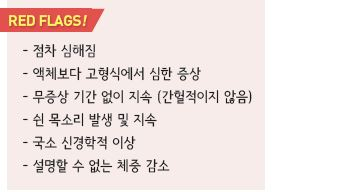
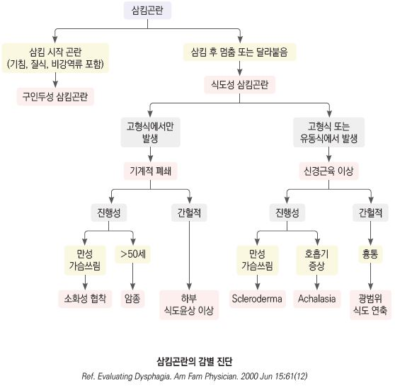

# 삼킴곤란 Dysphagia


## 삼킴곤란의 형태들

*   삼킴곤란 (dysphagia) : 구강에서 위장으로 음식물을 내려 보내는 것이 어려움; 삼킴곤란 부위에 따라 다음으로 구분

    •Oral dysphagia : 음식이 구강으로 들어가고 저작 및 덩어리를 형성하는 단계에서의 문제

    •Oropharyngeal dysphagia : 구인두로부터 상부 식도로 보내는 것이 어려움; 삼킴 시작 시 증상 발생

    •Esophageal dysphagia : 식도로부터 유문부로 보내는 것이 어려움; 삼킴 수 초 후 증상 발생. 음식이 식도에 걸려 있는 느낌
* 이송삼킴곤란 (transfer dysphagia) : 삼킬 때 코나 기도로 음식물이 넘어감
*   삼킴통증 (odynophagia) : 삼킬 때 발생하는 통증; 점막의 감염, 정제/캡슐 약제의 들러붙음, 위산 역류 등에 의한 구인두

    또는 식도의 염증이나 궤양 등에 의함
* 인두이물감 (globus pharyngeus) : 목 안의 이물감. 삼킴에 제한이 없거나 삼킴으로 호전됨 (☞ p.382)
* 먹기공포증 (phagophobia) : 삼킴에 대한 공포
* 삼킴거부 (refusal to swallow) : 정신적 또는 삼킴 문제에 대한 예기 불안과 관련

## 원인

* 충분히 씹지 않거나 너무 빨리 삼킴
*   기계적 폐쇄

    •구인두(oropharyngeal) : 암종, 후두개염, 인두염, 편도염, 편도 비대, 후두인두 게실

    •식도(eophageal) : 암종, 식도게실, 식도의 막양 구조, Schatzki ring, 식도염, 이물, 편도주위농양, 갑상선 질환, 종격동 압박,

    심 비대, 경추 골관절염
*   신경 근육 질환 : 이완불능증, 광범위 식도연축, 하부 식도괄약근 과긴장, scleroderma, CVA, 알츠하이머병, 파킨슨병, SLE,

    백혈병, 당뇨병신경병증, 뇌종양
* 감염 : 디프테리아, 뇌막염, 매독, 라임병, 공수병, 폴리오, CMV
* globus phenomenon

### 위험 인자

* 흡연, 과음, 비만, 철 결핍
* GERD, stroke, COPD, 만성 통증
* 약물 : quinine, Vit C, tetracycline, TMP/SMX, clindamycin, NSAID, procainamide, 항콜린제, bisphosphonate
* 두부/경부/흉부 외상, 수술 또는 방사선 치료

## 임상 양상

* 침 흘림
* 삼킬 수 없거나 삼킬 때 통증이 있음
* 목 또는 식도 부위에 음식이 걸린 느낌
* 삼키는 동안 기침 또는 토할 것 같음
* 말하는데 어려움
* 흡인성 폐렴
* 체중 감소

## 진단

### 검사 및 대상

* 치료로 호전되지 않거나 경고 징후가 있으면 검사 고려
* 혈액 검사 : CBC(감염), 단백질/albumin(영양 상태), TFT, cobalamin, anti-acetylcholine Ab(myasthenia)
* barium-contrast esophagogram : 폐색 의심, 식도 운동성 질환 의심 시
* videofluoroscopy : swallowing study. barium을 삼키기 어려울 때
* 상부 소화기 내시경 : 점막 상태 평가, 기계적 폐색 의심, 식도 운동성 질환 의심 시
* esophageal manometry : 내시경 검사상 진단이 불확실하거나 식도 운동성 질환 의심 시
* 후두암 검사 : 경부 이물감, 삼킴곤란이 3주 이상 다른 원인 없이 지속되는 경우

기능성 삼킴곤란 (Functional Dysphagia) Diagnostic criteria \[ROME Ⅳ]

*   발생한 지 최소 6개월 되었고 최근 3개월간 다음 조건을 모두 충족하는 증상이 ≥1회/주 발생

    ① 고형 또는 액상 음식물이 식도에 들러붙거나 걸려 있거나 비정상적으로 통과하는 느낌

    ② 식도 점막 또는 구조적 이상이 증상의 원인이라는 증거 없음

    ③ 위식도 역류(위산 노출 시간 증가 &/or 관련된 역류 증상) 또는 eosinophilic esophagitis가 증상의 원인이라는 증거 없음

    ④ 주요 식도 운동 이상 질환\*은 없음

> ```
> *예) achalasia, EGJ outflow obstruction, diffuse esophageal spasm, jackhammer esophagus, absent peristalsis)
> ```

### 증상/병력에 따른 감별

* 고형식 및 유동식 삼킴 장애 → 기능 장애/운동 장애 → 식도이완불능증
* 고형식 또는 유동식 bolus 삼킴 장애 → 구조 문제 → 식도협착, 식도륜, 종양
* 수 주\~수개월 지속, 진행 → 종양
* 수년간 지속되는 고형식에 대한 간헐적 증상 → 양성 질환
* suprasternal notch(상부 흉골) 부위 또는 목구멍 뒤쪽 부위 증상 → 구인두 문제
* 가슴 부위(하부 흉골) 증상 → 식도 문제
* 비강 역류, 기관지 흡인 동반 → 구인두 문제
* 흉통 동반 → 위식도역류질환, 운동 장애
* 입에서 신맛 느낌, 흉부 작열감 → GERD
* 신경 증상 동반 → 마비성
* 입 냄새 동반 → 식도 게실
* globus sensation(목구멍에 덩어리가 있는 느낌) → 인두 문제
* 목쉼이 선행 → 후두 문제
* 목쉼이 후행 → 신경 손상, 악성 종양
* 지속적인 가슴쓰림이 선행 → 소화성 협착
* 정제/캡슐제 복용 후 발생한 삼킴 통증 → 궤양성, 감염성 또는 약제 유발성 식도염
*   L-tube, 두경부 또는 식도 수술, 방사선 치료, 화학요법, 점막 질환력 → 식도협착

    

***

## Management

### 치료 방침

* 영양, 수분 섭취 상태 모니터링
* 적절한 자세, 적절한 활동, 근력 강화, 바이오피드백
*   영양, 식이 변경 : 부드럽고 걸쭉한 음식 섭취

    •신맛을 추가하면 미각을 자극하고 삼킴 반사를 개선할 수 있음. 예) 구연산(식용 베이킹 소다)

## 원인 질환별 식도 삼킴곤란 치료

```

```

## 예방

* 잘 맞지 않는 틀니 교정
* 식사 시 충분히 저작, 적절한 양의 물을 마심
* 액체 및 적당히 부드러운 음식 섭취
* 식사 중 알코올 섭취 회피
* 화학요법을 받는 두경부암 환자에서 예방적 삼킴 운동 시행

> **질병코드** R13 삼킴곤란
