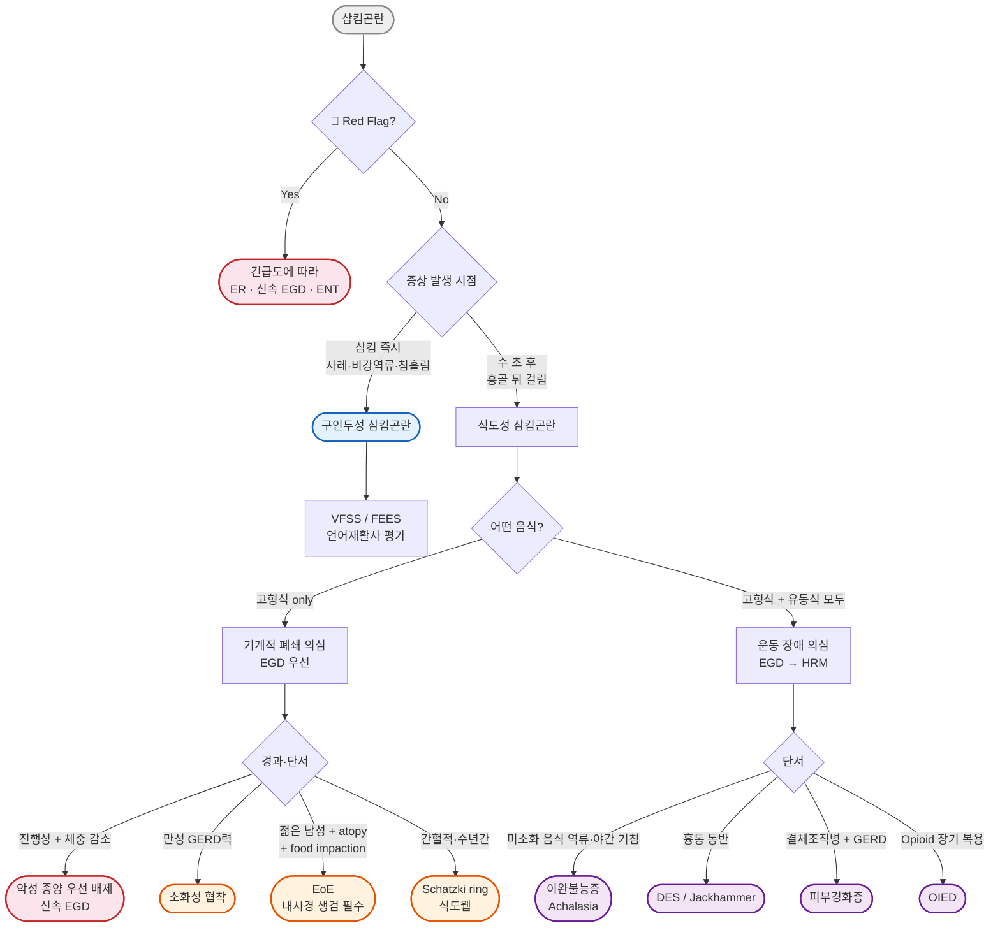

# 삼킴곤란 Dysphagia

## <mark style="color:green;">일반 사항</mark>

* 삼킴곤란(연하곤란, dysphagia) : 구강에서 위장으로 음식물을 이동시키는 과정에서의 어려움; 부위와 기전에 따라 구분
* 삼킴(연하)은 구강기(oral phase) → 인두기(pharyngeal phase) → 식도기(esophageal phase)의 3단계로 이루어지며, 각 단계의 장애에 따라 임상 양상이 다름
* 유병률 : 지역사회 성인의 약 16\~22%; 65세 이상에서는 27\~44%에 이름
  * 입원 환자 및 요양 시설 거주 노인에서는 유병률이 더 높음
  * 뇌졸중 환자의 약 50%, 파킨슨병 환자의 50\~80%에서 동반

#### <mark style="color:$primary;">삼킴곤란의 분류</mark>

<table><thead><tr><th width="181">유형</th><th width="184">정의</th><th>특징</th></tr></thead><tbody><tr><td>Oral dysphagia</td><td>구강에서 저작 및 bolus 형성 단계의 문제</td><td>씹기 어려움, 구강 내 음식물 조절 곤란</td></tr><tr><td>Oropharyngeal dysphagia</td><td>구인두→상부 식도로의 이송 장애</td><td>삼킴 시작 즉시 증상; 흡인, 비강 역류 동반 가능</td></tr><tr><td>Esophageal dysphagia</td><td>식도→위로의 이송 장애</td><td>삼킴 수 초 후 흉부 걸림 느낌</td></tr><tr><td>이송삼킴곤란 (transfer dysphagia)</td><td>삼킴 시 음식물이 비강 또는 기도로 유입</td><td>oropharyngeal dysphagia의 하위 개념; 흡인, 사레, 비강 역류</td></tr></tbody></table>

#### <mark style="color:$primary;">관련 증상 구분</mark>

* 삼킴통증(odynophagia) : 삼킬 때 발생하는 통증; 구인두 또는 식도의 염증·궤양 (감염, 약물 유발, 위산 역류 등)
* 인두이물감(globus pharyngeus) : 목 안의 이물감; 삼킴에 제한 없고 삼킴으로 오히려 호전됨 (☞ [소화불량](075_-indigestion-dyspepsia.md))
* 먹기공포증(phagophobia) : 삼킴 자체에 대한 심리적 공포; 기질적 이상 없음


**Globus vs 삼킴곤란 감별** : '목에 뭔가 걸린 느낌(globus sensation)'을 호소하지만 실제 음식물 통과에는 지장이 없고, 오히려 음식을 먹을 때 증상이 완화된다면 기질적 삼킴곤란보다 인두이물감(globus pharyngeus) 또는 GERD에 의한 감각 과민일 가능성이 높음; Globus는 삼킴을 방해하지 않는다는 점이 삼킴곤란과의 핵심 차이


### <mark style="color:orange;">노인 연하장애 - Presbyphagia & Sarcopenic Dysphagia</mark>

* Presbyphagia (노인성 연하 변화) : 노화에 따른 근력 감소, 치아 손실, 타액 분비 감소, 감각 둔화 등으로 나타나는 생리적 연하 기능 변화; 질환 자체를 뜻하지 않으며, 새로 발생한 증상성 삼킴곤란을 정상 노화로 간주해서는 안 됨. 뚜렷한 증상이 없어도 일부 노인에서는 silent aspiration 위험이 증가할 수 있음
* Sarcopenic dysphagia (근감소성 삼킴장애) : 전신 근감소증(sarcopenia)이 연하 관련 근육(설골상근, 인두수축근, 식도괄약근)까지 침범하여 발생하는 삼킴곤란; 노인 연하장애 분야에서 최근 가장 주목받는 entity
  * 고령·저영양·반복 입원·장기 와상 환자에서 빈도 높음
  * 특징 : 전신 근감소증 + 원인 불명 연하 기능 저하; 신경 또는 구조적 이상 없음
  * 치료 : 연하 재활 운동 + 전신 저항성 운동 + 영양 지원. 단백질 필요량은 영양 상태·신기능·동반 질환에 따라 개별화하며, 비타민 D는 결핍 시 보충
* 반복 흡인성 폐렴의 중요한 위험 요인; 노인 외래에서 적극적인 연하 평가 권장

### <mark style="color:orange;">**약제 유발성 식도염 (Pill esophagitis)**</mark>&#x20;

* 알약을 소량의 물과 함께 또는 누운 상태에서 복용하면 식도에 정체되어 점막을 직접 손상할 수 있음. 증상(급작스러운 삼킴통증, 흉통, 삼킴곤란)은 복용 수 시간\~수일 내 나타날 수 있음

<table><thead><tr><th width="273.3333740234375">대표 약물</th><th width="191.5555419921875">기전</th><th>주의사항</th></tr></thead><tbody><tr><td>Bisphosphonate (알렌드로네이트)</td><td>직접 점막 자극</td><td>일반 물 약 200 mL 이상과 복용; 복용 후 최소 30분 및 첫 음식 섭취 전까지 눕지 않음; 제품별 허가사항 확인</td></tr><tr><td>Doxycycline / Tetracycline</td><td>직접 점막 손상</td><td>취침 직전 복용 금지; 충분한 물과 복용</td></tr><tr><td>NSAIDs / Aspirin</td><td>직접 점막 손상·점막 방어 저하</td><td>충분한 물과 복용; 위장관 위험은 별도 평가</td></tr><tr><td>Clindamycin</td><td>직접 점막 독성</td><td>취침 직전 복용 금지; 충분한 물과 복용</td></tr><tr><td>Iron 제제, 칼륨제제</td><td>직접 점막 자극</td><td>충분한 물과 복용; 제형 변경 고려</td></tr><tr><td>고용량 비타민 C</td><td>산성 자극</td><td>불필요한 대용량 복용 회피</td></tr></tbody></table>

## <mark style="color:green;">원인 및 위험 인자</mark>

#### <mark style="color:$primary;">기계적 폐쇄</mark>

* 구인두(oropharyngeal) : 두경부 암종, 편도 비대 및 편도주위농양, 후두개염, 인두 농양
* Zenker diverticulum (인두식도게실) : 윤상인두근 위쪽 Killian triangle의 점막 탈출; 노인 남성에서 호발; 입 냄새(halitosis)와 미소화된 음식물 역류가 핵심 단서; 내시경·수술로 치료
* 윤상인두근 바(Cricopharyngeal bar) : 바륨 검사/VFSS에서 C3\~C6 전방에 보이는 윤상인두근의 돌출 소견; 무증상 우연 소견도 흔함. Zenker diverticulum과 연관될 수 있으나 모든 병변이 전구 병변인 것은 아님; 증상과 폐쇄 소견이 일치할 때 확장술 또는 근절개술 고려
* 식도(esophageal) : 식도암, 소화성 협착(peptic stricture), Schatzki ring, 식도웹(esophageal web), 식도게실
* 외부 압박 : 갑상선 비대, 종격동 종양, 대동맥류, 심비대
* 경추 골성 돌기(cervical osteophyte) : DISH(미만성 특발성 골격 과골증) 또는 전방 경추 골증식증; 노인에서 식도 외부 압박에 의한 구인두 삼킴곤란 유발; 경추 X-ray 또는 CT로 확인

#### <mark style="color:$primary;">염증성·면역성 질환</mark>

* 호산구성 식도염(Eosinophilic esophagitis, EoE) : 성인 고형식 삼킴곤란 및 음식물 저류(food impaction)의 주요 원인; 젊은 남성·알레르기 병력 흔함
* 위식도역류질환(GERD) : 역류성 식도염 및 만성 염증 → peptic stricture; 기능성 삼킴곤란은 GERD가 증상을 설명하지 않음을 확인한 뒤 진단
* 방사선 치료 후 섬유화, 구강점막염

#### <mark style="color:$primary;">신경근육 질환</mark>

* 뇌혈관 질환(CVA) : 구인두성 삼킴곤란의 가장 흔한 원인
* 파킨슨병, 알츠하이머병, 다발성 경화증, ALS, 중증 근무력증
* 윤상인두근 기능 이상(Cricopharyngeal dysfunction) : 상부 식도괄약근(UES) 이완 불충분 → 반복 삼킴, 흡인, 목의 걸림감; Zenker diverticulum의 병태생리적 기반
* 이완불능증(achalasia) : 하부 식도괄약근 이완 불능 + 연동 소실
* 광범위 식도 연축(DES), jackhammer esophagus
* 피부경화증(scleroderma) : 식도 하부 2/3의 연동운동 소실 + 하부 식도괄약근(LES) 압력 저하가 특징 → 심각한 GERD + peptic stricture 유발; 당뇨병신경병증, SLE

#### <mark style="color:$primary;">약물 유발 운동 장애</mark>

* Opioid 유발 식도 운동 장애(OIED, Opioid-Induced Esophageal Dysfunction) : 만성 opioid 사용 → μ-opioid receptor 활성화 → EGJ outflow obstruction, 경련성 운동 이상(achalasia type III 유사 소견) 유발; HRM에서 achalasia 유사 패턴; opioid 감량·중단 시 호전 가능. tramadol은 μ-receptor 활성화가 상대적으로 약하므로 OIED 유발이 가능하나 전형적 opioid에 비해 낮음
* 항콜린제는 타액 감소와 식도 운동 저하로 삼킴을 악화시킬 수 있음. CCB와 nitrate는 LES 압력·식도 수축을 낮추고 역류를 악화시킬 수 있으나, 일부 경련성 운동 장애의 단기 증상 조절에 사용되기도 함

#### <mark style="color:$primary;">감염</mark>

* 식도 칸디다증(면역 저하자, 광범위 항생제, 흡입 스테로이드), CMV 식도염, HSV 식도염
* 디프테리아·뇌막염·라임병·공수병 등은 드물게 구인두 기능 또는 신경계를 침범하여 삼킴곤란을 유발할 수 있으나, 감염성 식도염과는 구분

#### <mark style="color:$primary;">위험 인자</mark>

* 고령, 흡연, 과음, 비만, 철 결핍(Plummer-Vinson syndrome)
* GERD, 뇌졸중, COPD, 두경부암
* 두경부·흉부 수술, 방사선 치료, 화학요법
* 전신 근감소증(sarcopenia), 저영양, 장기 와상
* 알약 관련 : bisphosphonate, NSAID, tetracycline, doxycycline, clindamycin, TMP/SMX, 고용량 비타민 C, 철분제, 칼륨제제, 항콜린제
* 운동 장애 유발 : opioid(tramadol은 위험 낮음), 항콜린제, CCB

## <mark style="color:green;">임상 양상</mark>

* 구강 내 음식물 조절 어려움, 저작 곤란, 침 흘림
* 삼킴 시작 어려움, 삼킴 후 식도 걸림 느낌
* 삼킴 중 기침, 사레, 구역
* 음식물의 비강 역류 또는 기도 흡인
* 목소리 변화(쉰 목소리, 물 먹은 듯한 wet voice - 흡인 의심)
* 흡인성 폐렴(반복성 폐렴 시 silent aspiration 의심)
* 체중 감소, 탈수, 영양 결핍

### <mark style="color:$danger;">🚩 Red Flags!</mark>


**즉시 응급실 의뢰/응급 평가**

* 음식물 완전 저류로 침이나 구강 분비물도 삼키지 못함
* 호흡곤란, 천명/협착음, 청색증 등 기도 폐쇄 또는 중증 흡인 의심
* 갑작스러운 연하장애와 편측 마비·안면마비·구음장애·의식 변화 등 급성 신경학적 결손
* 부식성 물질 섭취, 날카로운 이물 또는 천공 의심(심한 흉통, 피하기종, 발열·쇼크)



**당일 또는 신속한 전문 평가**

* 진행성 삼킴곤란, 원인 불명 체중 감소, 철 결핍 빈혈 또는 위장관 출혈
* 지속적·심한 삼킴통증, 면역 저하자에서 새로 발생한 삼킴곤란/삼킴통증
* 반복 흡인 또는 흡인성 폐렴, 현저한 탈수·영양 결핍
* 쉰 목소리, 경부 종괴, 두경부암·식도암 위험이 동반된 새 삼킴곤란



그 밖의 연하곤란도 증상 양상에 따라 구인두성/식도성으로 구분하여 평가한다. 자세한 공통 기준은 ☞ [위장질환의 감별](074_-gidz.md#step-1-red-flags)


## <mark style="color:green;">진단</mark>

#### <mark style="color:$primary;">1차 감별 : 구인두성 vs 식도성</mark>


**외래 triage의 핵심** : 삼킴곤란을 접하면 구인두성인지 식도성인지를 먼저 판단한다. 단, 환자가 느끼는 걸림 위치가 실제 병변 위치와 일치하지 않는 경우가 흔하다. 원위부 식도 병변도 '목에 걸린다'고 표현하는 경우가 많으므로, 위치 표현보다 증상 발생 시점·동반 증상·병력 전체를 종합하여 판단해야 한다.


<table><thead><tr><th width="190">특징</th><th width="257.77777099609375">구인두성 (Oropharyngeal)</th><th>식도성 (Esophageal)</th></tr></thead><tbody><tr><td>증상 발생 시점</td><td>삼킴 시작 즉시</td><td>삼킴 수 초 후</td></tr><tr><td>위치 표현</td><td>목, 상부 흉골</td><td>흉골 뒤, 흉부 중하부</td></tr><tr><td>사레 / 흡인</td><td>흔함</td><td>드묾</td></tr><tr><td>비강 역류</td><td>가능</td><td>없음</td></tr><tr><td>Wet voice / 식후 기침</td><td>흔함</td><td>드묾</td></tr><tr><td>침 흘림</td><td>흔함</td><td>드묾</td></tr><tr><td>주요 원인</td><td>신경근육 질환 (CVA, 파킨슨병 등)</td><td>기계적 폐쇄 / 운동 장애</td></tr><tr><td>우선 검사</td><td>VFSS / FEES</td><td>상부 소화관 내시경 (EGD)</td></tr></tbody></table>

#### <mark style="color:$primary;">고형식 → 유동식 진행 패턴 평가</mark>

* 외래에서 가장 강력한 임상 단서
* 어떤 음식에서 증상이 있는지 확인
  * 기계적 폐쇄 : 초기에는 고형식에서만 증상 → 병변이 진행·협착이 심해질수록 유동식까지 증상 확대
  * 운동 장애 : 처음부터 고형식과 유동식 모두 증상 (연동 운동 자체의 문제이므로 음식 형태 무관)

#### <mark style="color:$primary;">흡인 위험 침상 평가 단서</mark>

<table><thead><tr><th width="282.22222900390625">임상 소견</th><th>의미</th></tr></thead><tbody><tr><td>식사 중·후 기침</td><td>흡인 또는 흡인 직전(penetration) 의심</td></tr><tr><td>Wet voice (식후 목소리 변화)</td><td>후두 전정부·인두 잔류 또는 흡인 의심</td></tr><tr><td>반복적 폐렴 (특히 중력 의존성 폐 부위)</td><td>Silent aspiration 의심</td></tr><tr><td>식사 시간 현저히 연장 (30분 이상)</td><td>연하 기능 저하, 피로성 흡인</td></tr><tr><td>식욕 저하 + 원인 불명 체중 감소</td><td>만성 삼킴곤란으로 인한 영양 결핍</td></tr><tr><td>침 흘림, 구강 분비물 조절 곤란</td><td>구인두 기능 저하</td></tr></tbody></table>


침상 소견이나 선별검사는 흡인 여부를 확진하지 못하며 silent aspiration을 놓칠 수 있다. 위험이 의심되면 VFSS 또는 FEES로 확인한다.


### <mark style="color:orange;">선별 검사 도구</mark>&#x20;

#### <mark style="color:$primary;">EAT-10 (Eating Assessment Tool-10)</mark>&#x20;

* 연하장애 선별을 위한 10문항 자가보고 설문지
* 각 문항 0\~4점 (정상=0점, 중증=4점); 총점 ≥3점이면 연하장애를 의심하고 전문 평가 고려. 선별도구일 뿐 원인 진단이나 흡인 배제에는 사용할 수 없음; 가능하면 검증된 한국어판(K-EAT-10) 사용

1. 삼킴 문제 때문에 체중이 감소하였습니다.
2. 삼킴 문제 때문에 외식이 어렵습니다.
3. 액체를 삼킬 때 힘이 듭니다.
4. 고형식을 삼킬 때 힘이 듭니다.
5. 알약을 삼킬 때 힘이 듭니다.
6. 삼킴이 고통스럽습니다.
7. 삼킴의 즐거움이 감소했습니다.
8. 삼킬 때 음식이 목에 걸립니다.
9. 먹을 때 기침이 납니다.
10. 삼킴은 스트레스를 줍니다.

### <mark style="color:orange;">검사</mark>

<table><thead><tr><th width="154.26312255859375">검사</th><th width="245.4736328125">적응증</th><th>특이사항</th></tr></thead><tbody><tr><td>혈액 검사 ¹⁾</td><td>빈혈·영양 결핍·전신 또는 신경근육 질환 의심</td><td>병력과 진찰에 따라 선택; 모든 환자의 일률적 초기 검사 아님</td></tr><tr><td>상부 소화관 내시경 (EGD)</td><td>식도성 삼킴곤란의 1차 검사</td><td>구조·점막 병변 평가, 조직검사 및 확장술 가능; 원인 불명 식도성 삼킴곤란/EoE 의심 시 내시경이 정상이어도 2개 이상의 식도 높이에서 총 6개 이상 생검</td></tr><tr><td>비디오 투시 연하 검사 (VFSS)</td><td>구인두 삼킴곤란, 흡인 평가</td><td>실시간 삼킴 역학·흡인 시점 및 음식 질감·보상 자세 효과 평가; 방사선 피폭; 언어재활사 협력 권장</td></tr><tr><td>섬유내시경 연하 <br>검사 (FEES)</td><td>구인두 삼킴곤란; 침상 환자, 이동 어려운 환자</td><td>방사선 피폭 없이 인두·후두와 분비물 관리 평가; 삼킴 순간 white-out 등 한계가 있어 VFSS와 상호 보완적</td></tr><tr><td>Barium esophagogram</td><td>Schatzki ring, Zenker 게실, 근위부 협착 의심; EGD 음성이나 폐쇄·운동 이상 의심</td><td>Zenker/고위 식도 병변 의심 시 EGD보다 먼저 고려; 폐쇄성 증상에는 가능하면 timed upright protocol + 13-mm barium tablet</td></tr><tr><td>고해상도 식도 내압 검사 (HRM)</td><td>EGD/생검으로 기계적·점막 원인을 배제한 뒤 운동 장애 의심</td><td>Chicago Classification v4.0; achalasia 아형, EGJOO, DES, hypercontractile esophagus 등 분류. 검사 전 금식 및 약물 중단은 검사 목적·반감기·안전성을 고려하여 검사실 지침에 따름</td></tr><tr><td>FLIP</td><td>HRM 결과가 경계성이거나 HRM을 완료하지 못했으나 EGJ 폐쇄 의심</td><td>EGJ 팽창성 평가; HRM의 보완검사이며 일률적 대체검사는 아님</td></tr><tr><td>후두경 검사</td><td>쉰 목소리·경부 종괴·상기도 증상 또는 지속되는 인두 증상</td><td>후두·하인두 병변 평가; 경고 증상 동반 시 기간을 기다리지 말고 이비인후과 의뢰</td></tr></tbody></table>

¹⁾ 필요에 따라 CBC, ferritin/철 검사, 전해질·신기능, 단백질/albumin, TFT, Vit B12 등. 피로성 연하장애·안검하수 등 중증 근무력증이 의심될 때 anti-AChR Ab 등 표적 검사

### <mark style="color:orange;">증상 및 병력에 따른 감별</mark>

<table><thead><tr><th width="334.73687744140625">단서</th><th>시사하는 진단</th></tr></thead><tbody><tr><td>삼킴 시작 즉시 사레, 비강 역류, 흡인</td><td>구인두성 삼킴곤란 (신경근육 원인 우선)</td></tr><tr><td>삼킴 수 초 후 흉골 하부 걸림 느낌</td><td>식도성 삼킴곤란</td></tr><tr><td>진행성 고형식 삼킴곤란, 수 주~수개월</td><td>악성 종양 (식도암, 두경부암) - until proven otherwise</td></tr><tr><td>수년간 지속되는 간헐적 고형식 삼킴곤란</td><td>양성 질환 (Schatzki ring, EoE)</td></tr><tr><td>고형식 + 유동식 모두 삼킴 장애</td><td>신경근육 장애, achalasia</td></tr><tr><td>지속적인 가슴쓰림 선행</td><td>소화성 협착 (peptic stricture)</td></tr><tr><td>쉰 목소리가 삼킴곤란보다 먼저</td><td>후두 질환</td></tr><tr><td>쉰 목소리가 삼킴곤란보다 나중에</td><td>신경 손상, 악성 종양</td></tr><tr><td>흉통 동반</td><td>DES, jackhammer esophagus, 기능성</td></tr><tr><td>입 냄새(halitosis) + 미소화 음식 역류</td><td>Zenker diverticulum (인두식도게실)</td></tr><tr><td>젊은 남성 + 알레르기 병력 + food impaction</td><td>EoE (호산구성 식도염)</td></tr><tr><td>알약 복용 직후 또는 수 시간 내 삼킴통증</td><td>약제 유발성 식도염</td></tr><tr><td>면역 저하, 광범위 항생제·흡입 스테로이드</td><td>감염성 식도염 (칸디다, CMV, HSV)</td></tr><tr><td>Opioid 장기 복용</td><td>OIED (opioid 유발 식도 운동 장애)</td></tr><tr><td>노인 + 전신 근감소 + 구조적 이상 없음</td><td>Sarcopenic dysphagia, presbyphagia</td></tr></tbody></table>

### <mark style="color:orange;">기능성 삼킴곤란 진단 기준 - ROME Ⅳ</mark>&#x20;

* 발생한 지 최소 6개월 되었고, 최근 3개월간 다음 조건을 모두 충족하는 증상이 ≥1회/주 발생:

1. 고형 또는 액상 음식물이 식도에 들러붙거나 걸려 있거나 비정상적으로 통과하는 느낌
2. 식도 점막 또는 구조적 이상이 증상의 원인이라는 증거 없음
3. GERD 또는 EoE가 증상의 원인이라는 증거 없음
4. 주요 식도 운동 이상 질환 없음 (achalasia, EGJ outflow obstruction, DES, jackhammer esophagus, absent peristalsis)

***


```mermaid
flowchart TD
    A([삼킴곤란]) --> B{🚩 Red Flag?}
    B -->|Yes| C([긴급도에 따라<br/>ER · 신속 EGD · ENT])

    B -->|No| D{증상 발생 시점}

    D -->|삼킴 즉시<br/>사레·비강역류·침흘림| E([구인두성 삼킴곤란])
    E --> F[VFSS / FEES<br/>언어재활사 평가]

    D -->|수 초 후<br/>흉골 뒤 걸림| G[식도성 삼킴곤란]
    G --> H{어떤 음식?}

    H -->|고형식 only| I[기계적 폐쇄 의심<br/>EGD 우선]
    I --> J{경과·단서}
    J -->|진행성 + 체중 감소| K([악성 종양 우선 배제<br/>신속 EGD])
    J -->|만성 GERD력| L([소화성 협착])
    J -->|젊은 남성 + atopy<br/>+ food impaction| M([EoE<br/>내시경 생검 필수])
    J -->|간헐적·수년간| N([Schatzki ring<br/>식도웹])

    H -->|고형식 + 유동식 모두| O[운동 장애 의심<br/>EGD → HRM]
    O --> P{단서}
    P -->|미소화 음식 역류·야간 기침| Q([이완불능증<br/>Achalasia])
    P -->|흉통 동반| R([DES / Jackhammer])
    P -->|결체조직병 + GERD| S([피부경화증])
    P -->|Opioid 장기 복용| T([OIED])

    style A fill:#eeeeee,stroke:#888888,stroke-width:2px
    style C fill:#fce4ec,stroke:#c62828,stroke-width:2px
    style E fill:#e3f2fd,stroke:#1565c0,stroke-width:2px
    style K fill:#fce4ec,stroke:#c62828,stroke-width:2px
    style L fill:#fff3e0,stroke:#e65100,stroke-width:2px
    style M fill:#fff3e0,stroke:#e65100,stroke-width:2px
    style N fill:#fff3e0,stroke:#e65100,stroke-width:2px
    style Q fill:#f3e5f5,stroke:#6a1b9a,stroke-width:2px
    style R fill:#f3e5f5,stroke:#6a1b9a,stroke-width:2px
    style S fill:#f3e5f5,stroke:#6a1b9a,stroke-width:2px
    style T fill:#f3e5f5,stroke:#6a1b9a,stroke-width:2px
```

<p align="center"><strong>삼킴곤란 진단 알고리듬</strong></p>

<p align="center"><em><mark style="color:$info;">Ref. ACG Clinical Guidelines: Clinical Use of Esophageal Physiologic Testing. Am J Gastroenterol. 2020 / Chicago Classification v4.0. Neurogastroenterol Motil. 2021</mark></em></p>

***

## <mark style="background-color:$warning;">Management</mark>

### <mark style="color:orange;">치료 방침</mark>

* 삼킴곤란의 치료는 원인 질환 치료가 우선이며, 동시에 영양·수분 상태 유지와 흡인 예방에 중점을 둠
* 구인두성 삼킴곤란은 연하 재활 치료가 핵심
* 식도성 삼킴곤란은 원인에 따라 내시경 시술 또는 수술을 포함한 전문과 협진이 필요
* 영양 및 수분 섭취 상태 정기 모니터링; 의미 있는 체중 감소 시 영양 지원 계획 수립
* 흡인 위험 평가; 흡인성 폐렴 예방 우선
* 처방약 전체 검토 (opioid, 항콜린제, bisphosphonate 등 유발 약물 여부)
* 원인 질환 확인 및 전문과 의뢰
* 경구 섭취가 안전하지 않거나 영양·수분 요구량을 충족하지 못하는 경우 예상 기간·치료 목표·환자 의사를 고려하여 비위관(NG tube) 또는 PEG 영양 고려. 경관 영양 자체가 구강 분비물·역류물 흡인을 예방하지는 않음


**Food impaction 응급 처치 경로**

* **완전 저류 (침이나 분비물도 삼키지 못함)** → 즉시 ER → 기도 보호 평가와 함께 가능한 한 빨리, 늦어도 **6시간 이내** 응급 내시경
* **불완전 저류 (침·분비물은 처리 가능)** → 당일 ER → **24시간 이내** 내시경

내시경 시행 시 **EoE 조직 생검을 고려**: food impaction 환자의 상당 비율에서 EoE가 확인됨. 점막 손상·천공 위험을 고려하여 안전하면 내시경 소견이 정상처럼 보여도 2개 이상의 식도 높이에서 총 6개 이상 생검한다. 당시 안전하게 생검하지 못했다면 조기 추적 EGD를 계획한다. 약물 투여가 내시경을 지연시켜서는 안 된다.


## <mark style="color:green;">비-약물 치료</mark>

### <mark style="color:orange;">연하 재활: 보상 전략 vs 재활 전략</mark>

* 보상 전략 : 즉각적으로 흡인 위험을 줄이지만 근본 기능은 개선하지 않음
* 재활 전략 : 시간이 걸리지만 연하 근육 기능 자체를 향상시킴
* 현대 연하 재활은 보상 전략(Compensatory strategies)과 재활 전략(Rehabilitative strategies)으로 구분.  두 전략을 환자 상태에 맞게 병행하는 것이 원칙

#### <mark style="color:$primary;">보상 전략 (Compensatory)</mark>

* 자세 조절 : 식사 시 90° 직립, 식후 30분 이상 직립 유지
* 턱 당김 기법(Chin-tuck maneuver) : 일부 환자에서 기도 입구를 좁히고 bolus 흐름을 조절하여 흡인을 줄일 수 있으나 모든 연하장애에 효과적인 것은 아님; VFSS/FEES로 효과 확인 후 적용
* Head rotation : 편측 인두 약화가 확인된 경우 약한 쪽으로 고개를 돌려 bolus를 상대적으로 건강한 쪽으로 유도; 개별 평가 후 적용
* 식이 질감 조절 : IDDSI 단계에 맞게 (아래 참조)

#### <mark style="color:$primary;">재활 전략 (Rehabilitative)</mark>

* Shaker exercise (고개 들기 운동) : 누운 자세에서 발끝을 보듯 고개를 들어 1분 유지 → 1분 휴식 × 3회; 설골상근 강화 → UES 이완 개선
* CTAR (Chin Tuck Against Resistance) : 턱 아래 공에 저항하여 턱 당기기; 설골상근 강화
* Effortful swallow (힘껏 삼킴) : 의도적으로 세게 삼킴 → 인두 수축력 및 음식물 제거율 향상
* Mendelsohn maneuver : 삼킴 시 후두 거상을 의도적으로 2\~3초 연장 → UES 개방 시간 증가
* Masako maneuver : 혀를 치아 사이에 살짝 물고 침 삼킴 → 후인두벽 움직임 훈련; 음식물과 함께 시행하지 않음
* 감각 촉진 : 신맛(구연산·레몬즙) 또는 냉자극은 삼킴 반사를 촉진할 수 있음


언어재활사(SLP)와의 협력 하에 VFSS/FEES 결과를 바탕으로 개별화된 운동 프로그램을 처방하는 것이 원칙. 경추질환·심한 쇠약 등에서는 Shaker exercise가 부적절할 수 있음


### <mark style="color:orange;">식이 조절 - IDDSI 기준</mark>

* **IDDSI (International Dysphagia Diet Standardisation Initiative)** : 국제표준화 연하장애 식이 단계 (Level 0\~7); 환자의 연하 능력에 맞는 식이 질감을 표준화하여 흡인 위험을 최소화함

<table><thead><tr><th width="130">IDDSI 단계</th><th width="241.0526123046875">표준 명칭</th><th>구분</th></tr></thead><tbody><tr><td>Level 0</td><td>Thin (묽은 액체)</td><td>음료</td></tr><tr><td>Level 1</td><td>Slightly Thick (약간 걸쭉)</td><td>음료</td></tr><tr><td>Level 2</td><td>Mildly Thick (약하게 걸쭉)</td><td>음료</td></tr><tr><td>Level 3</td><td>Moderately Thick / Liquidised</td><td>음료·음식</td></tr><tr><td>Level 4</td><td>Extremely Thick / Pureed</td><td>음료·음식</td></tr><tr><td>Level 5</td><td>Minced &amp; Moist (다지고 촉촉한 음식)</td><td>음식</td></tr><tr><td>Level 6</td><td>Soft &amp; Bite-sized (부드럽고 한입 크기 음식)</td><td>음식</td></tr><tr><td>Level 7</td><td>Regular / Easy to Chew</td><td>일반식·씹기 쉬운 일반식</td></tr></tbody></table>

* 과거의 nectar·honey·pudding 농도 용어를 IDDSI 단계와 단순 대응시키지 않음
* IDDSI 단계는 흡인 위험의 경증·중등도와 일대일 대응하지 않으며, VFSS/FEES에서 확인한 병태와 환자의 선호·수분 섭취·영양 상태에 따라 선택

* 증점제(thickener) 사용의 단점 : 과도한 증점은 수분 섭취 감소 → 탈수, 식욕 저하, 복약 순응도 저하를 유발할 수 있음. 연하 평가 결과에 근거하여 개별화하고, 정기적으로 재평가하여 불필요한 증점을 지속하지 않도록 함
* Free Water Protocol : 선별된 환자에서 구강 위생을 철저히 유지하는 조건으로 thin water 섭취를 허용하는 접근. 증점 음료만 고집할 때의 탈수 위험을 줄이면서 삶의 질을 개선할 수 있다. 언어재활사(SLP) 평가 후 적용 여부 결정

***

## <mark style="color:green;">약물 치료</mark>

### <mark style="color:orange;">GERD / 소화성 협착</mark>

**PPI (proton pump inhibitor)**&#x20;

* 위산 분비 억제로 증상 호전 및 협착 재발 방지
* omeprazole 20\~40 ㎎ qd, pantoprazole 40 ㎎ qd, esomeprazole 20\~40 ㎎ qd
* 식전 30분 복용; 협착 확장술 후에는 장기 유지 필요 <mark style="color:blue;">\[넥시움 정]</mark>, <mark style="color:blue;">\[판토록 정]</mark>

### <mark style="color:orange;">호산구성 식도염 (EoE)</mark>


**최신 관점 (ACG 2025)** : 이전에 사용하던 "PPI-responsive EoE"라는 표현은 현재 권장되지 않음. PPI는 EoE의 1차 항염증 치료 옵션 중 하나로 인정되며, PPI에 반응하더라도 EoE 진단이 배제되지 않음.

**EoE 내시경 소견** (정상이어도 생검 필수) : feline esophagus (다발성 동심성 고리), linear furrows (세로 홈), white exudates, stricture, mucosal fragility


* **초기 항염증 치료 - 공동 의사결정으로 한 가지 선택**
  * **PPI** : 고용량 PPI를 8\~12주 투여 후 내시경·조직검사로 반응 평가(예: esomeprazole 40 ㎎ bid). 국내 EoE 적응증·허가 용량·급여 여부와 제품별 허가사항 확인
  * **Swallowed topical steroid** : budesonide 또는 fluticasone 단일 성분을 식도에 도달하도록 삼킴. 국내 EoE 전용 제제의 허가·유통 여부를 확인하며, 천식용 제제 전용은 허가 외 사용
    * budesonide 점성 현탁액: 성인에서 흔히 1 ㎎ bid 사용. 전용 제제가 없을 때 budesonide 레스피울 액을 점성 매개체에 섞는 조제법은 허가 외 사용이므로 소화기내과 협진
    * fluticasone 단일 성분 정량분무 흡입제: 성인 총 880\~1,760 μg/일 범위가 흔히 사용되나 제형·용량을 확인. **fluticasone/formoterol 복합제는 사용하지 않음**
    * 투여 후 30\~60분 음식·음료를 피하고, 구강 칸디다 예방 방법은 제형별 복약지도에 따름
  * **경험적 제거식** : 가능하면 1-food(우유) 또는 2-food(우유·밀) 제거처럼 덜 제한적인 방식부터 시작하고 영양사와 협력. 알레르기검사만으로 제거 식품을 결정하지 않음
* **Dupilumab (IL-4/IL-13 신호 억제 생물학적 제제)** <mark style="color:blue;">\[듀피젠트 주]</mark>
  * PPI 등 초기 치료에 반응하지 않거나 불내성인 경우, 반복적 food impaction/fibrostenotic EoE 또는 치료가 필요한 다발성 아토피 질환이 동반된 경우 전문의가 고려
  * 미국에서는 2024년 1세 이상·체중 15 ㎏ 이상으로 적응증이 확대되었으나, 국내 허가 연령·체중·용량 및 급여 여부는 최신 허가사항 확인
* **반응 평가 및 유지 치료** : 증상만으로 관해를 판단하지 않고 보통 8\~12주 후 EGD와 생검으로 평가(조직학적 반응은 일반적으로 <15 eos/hpf). 관해 후에도 선택한 식이 또는 약물 유지 치료를 지속하여 재발·섬유화·협착 위험을 낮춤

### <mark style="color:orange;">식도 운동 장애</mark>

* **이완불능증(achalasia)** - 약물은 시술 전 단기 증상 완화 목적
  * 근치적 치료가 어렵거나 시술 대기 중인 선택된 환자에서만 단시간 작용 nitrate 또는 CCB를 고려. 효과가 제한적이고 저혈압·두통·말초부종 등이 흔하며 국내 적응증·제형 확인 필요
  * isosorbide dinitrate 5 ㎎ 식전 10\~15분 설하 또는 nifedipine 10\~30 ㎎ 식전 30\~45분 설하가 보고되어 있으나 허가 외 사용이며, nifedipine 설하 투여는 급격한 저혈압 위험에 특히 주의
* **광범위 식도 연축(DES) / Jackhammer**
  * GERD·기계적 폐쇄를 먼저 배제/치료하고, 선택된 환자에서 CCB 또는 nitrate 단기 시도; 증상을 유발하는 매우 뜨겁거나 찬 음식은 회피
  * sildenafil 등 평활근 이완제의 근거는 소규모 연구에 제한되므로 routine 처방하지 않음
* **Opioid 유발 식도 운동 장애(OIED)**
  * 원인 opioid 감량 또는 중단이 가장 효과적
  * methylnaltrexone 등 말초 μ-opioid 수용체 길항제는 증례 수준 근거만 있어 표준 치료가 아님
* **기능성 삼킴곤란** : 구조적·점막 질환, GERD/EoE 및 주요 운동 장애를 충분히 배제한 뒤 설명·안심, 식이/행동 조절과 필요 시 CBT 등 다학제 치료 고려. TCA/SSRI의 직접 근거는 제한적이며, 특히 고령자에서 TCA의 항콜린 부작용이 삼킴을 악화시킬 수 있으므로 routine 처방하지 않음

### <mark style="color:orange;">감염성 식도염</mark>

* **칸디다 식도염** : fluconazole 200\~400 ㎎ qd × 14\~21일 <mark style="color:blue;">\[디플루칸 캡슐]</mark>; 신기능에 따른 감량 및 약물상호작용 확인. nystatin은 구인두 칸디다에만 유효하며 식도 감염에는 불충분
* **HSV 식도염** : acyclovir 400 ㎎ × 5회/일 × 7\~14일 <mark style="color:blue;">\[조비락스 정]</mark>; 면역 저하자 14\~21일
* **CMV 식도염** : ganciclovir 5 ㎎/㎏ IV q12h × 21\~28일; 감염내과 협진

### <mark style="color:orange;">약제 유발성 식도염 (Pill esophagitis)</mark>

* 원인 약물 즉시 중단 또는 복용 방법 변경 (충분한 물, 직립 자세)
* sucralfate 또는 PPI는 통증·동반 산 역류에 보조적으로 고려할 수 있으나 근거는 제한적이며 일률적 필수 치료가 아님 <mark style="color:blue;">\[아루사루민 현탁액]</mark>
* 대부분 원인 약물 중단 후 수일\~수 주 내 호전. 지속되거나 출혈·체중 감소·심한 통증이 있으면 EGD 시행

## <mark style="color:green;">시술 및 기타 처치</mark>

<table><thead><tr><th width="180">상태</th><th>1차 시술/수술</th><th>비고</th></tr></thead><tbody><tr><td>이완불능증 (achalasia)</td><td>공기 풍선 확장술, POEM, Heller myotomy</td><td>Type I·II는 숙련도와 환자 특성에 따라 선택; type III는 긴 근절개가 가능한 POEM이 특히 유리. POEM 후 GERD 위험이 상대적으로 높아 추적 필요; 고령·빠른 체중 감소 시 pseudoachalasia 배제</td></tr><tr><td>DES / Hypercontractile esophagus</td><td>약물 치료 우선; 선택된 중증 불응 환자에서 긴 근절개/POEM 검토</td><td>침습 치료 근거가 제한적이므로 전문센터에서 증상-검사 일치 여부를 재확인</td></tr><tr><td>EoE</td><td>내시경 확장술 (endoscopic dilation)</td><td>임상적으로 의미 있는 협착/좁은 식도에서 고려; 확장술은 염증을 치료하지 않으므로 항염증 치료 병행</td></tr><tr><td>소화성 협착</td><td>내시경 확장술 (bougie 또는 balloon)</td><td>PPI 유지로 재협착 방지</td></tr><tr><td>Schatzki ring</td><td>내시경 확장술 또는 링 절개</td><td>반복 확장 필요한 경우 있음; EoE 가능성 평가</td></tr><tr><td>Zenker 게실</td><td>내시경 게실절개술 또는 외과 myotomy</td><td>내시경 치료가 증가 추세이며 윤상인두근 절개 병행; 해부학·크기·전문가 경험에 따라 선택</td></tr><tr><td>피부경화증</td><td>PPI + 전신 질환 관리</td><td>확장술은 협착 동반 시에만</td></tr><tr><td>두경부암·식도암 관련 협착</td><td>확장술, 스텐트 삽입, 방사선/항암 치료</td><td>종양내과·방사선종양과 협진</td></tr></tbody></table>

***

### <mark style="color:red;">질병코드</mark>

R13 삼킴곤란

K20 식도염

K20.0 호산구성 식도염

K22.2 식도 폐쇄

K22.4 식도 이형운동증

K22.0 분문의 이완불능증

Q39.5 식도의 선천협착

***

## <mark style="color:purple;">처방례</mark>

> **처방례 1. EGD로 확인된 역류성 식도염/소화성 협착**
>
> ```
> 에소메프라졸 마그네슘 40 ㎎ (넥시움 정)   1T   qd   식전 30~60분
> (야간 증상 지속 시 추가: 파모티딘 20 ㎎ (가스터 정)   1T   취침 전)
> ```
>
> _✽ 지속성·진행성 식도성 삼킴곤란은 PPI 경험적 치료에 앞서 EGD로 기계적·점막 원인을 평가한다. 야간 역류 증상이 객관적으로 지속되면 취침 전 H₂ 차단제를 단기 추가할 수 있으나 tachyphylaxis에 주의. 중증 역류성 식도염 또는 협착 등 적응증이 있을 때 추적 EGD/확장술과 PPI 유지 기간을 결정한다._

> **처방례 2. 식도 칸디다증**
>
> ```
> 플루코나졸 50 ㎎ (디플루칸 캡슐)   4~8T   qd   14~21일
> ```
>
> _✽ 성인 권장 용량은 fluconazole 200\~400 ㎎ qd × 14\~21일. 신기능에 따라 감량하고 QT 연장·간독성 및 warfarin, sulfonylurea 등 상호작용을 확인한다. 경구 섭취가 어렵거나 중증 면역 저하자는 전문과 협진. nystatin은 구인두 칸디다에만 유효하며 식도 감염에는 불충분._

> **처방례 3. 호산구성 식도염(EoE) - 초기 치료 선택 예시**
>
> ```
> [선택지 A - 고용량 PPI]
> 에소메프라졸 마그네슘 40 ㎎ (넥시움 정)   1T   bid   식전 30분   8~12주
>
> [선택지 B - swallowed topical steroid; 전문의 처방·국내 허가사항 확인]
> 부데소니드 0.5 ㎎/2 mL 네뷸라이저 액 (풀미코트 레스피울) 2 amp
>   → 처방받은 점성 매개체에 섞어 천천히 삼킴 (흡입 금지)   bid
>   → 복용 후 30~60분 음식·음료 금지 / 구강 위생은 제형별 지시에 따름
> ```
>
> _✽ PPI·swallowed topical steroid·덜 제한적인 경험적 제거식 중에서 공동 의사결정으로 초기 치료를 선택하며, 일률적인 순차 치료가 아님. 천식용 budesonide의 EoE 사용은 국내 허가 외 사용이다. 8\~12주 후 내시경·생검으로 재평가하고 관해 후 유지 치료를 결정한다. 반복 food impaction·fibrostenotic EoE·초기 치료 불응 또는 다발성 아토피 질환 동반 시 dupilumab을 소화기내과 협진 후 고려._


**이완불능증 약물 처방에 관한 주의** : nitrate·nifedipine 등의 약물 효과는 제한적이고 국내 이완불능증 허가 제형도 불확실하므로 일반 외래 처방례로 제시하지 않는다. 진단 확정과 POEM·풍선 확장술·Heller myotomy 등 근치 치료를 위한 소화기내과 의뢰가 우선이다.


***

### <mark style="color:$success;">핵심 복약 지도</mark>

> **PPI (넥시움, 판토록 등) 복용 안내**
>
> 1. 대부분의 PPI는 **식사 30\~60분 전** 복용이 가장 효과적입니다. 제품별 복용법과 처방 지시를 따르십시오.
> 2. 증상이 호전되더라도 **의사가 지시한 기간까지 복용**하십시오. 장기간 복용 후 임의로 갑자기 중단하면 일시적인 반동성 위산 분비로 증상이 재발할 수 있습니다.
> 3. 장기 복용 중 검사 여부는 신장질환, 영양 결핍, 골절 위험, 이뇨제 병용 등 개인의 위험 인자에 따라 결정합니다. 모든 환자에게 일률적인 정기 혈액검사가 필요한 것은 아닙니다.

> **삼켜서 사용하는 국소 스테로이드 - EoE용 복용 안내**
>
> 1. 천식용 제제를 EoE에 처방받은 경우에는 **폐로 흡입하는 것이 아니라 의사가 알려 준 방법으로 삼키는 것**입니다. 단일 성분 제제인지 반드시 확인하십시오.
> 2. 복용 후 **30\~60분은 음식이나 음료를 드시지 마십시오.** 바로 드시면 약이 씻겨 내려가 효과가 없어집니다.
> 3. 구강·식도 칸디다증이 발생할 수 있습니다. 입안의 흰 반점, 통증 또는 삼킴통증이 생기면 진료받으십시오. 구강 세척 시점과 방법은 처방받은 제형의 지시를 따르십시오.
> 4. 증상만 좋아졌다고 임의로 중단하지 말고, 예정된 내시경·조직검사로 염증이 호전되었는지 확인하십시오.

> **알약 복용 방법 안내 - 약제 유발성 식도염 예방**
>
> 1. 수분 제한이 없다면 알약은 **충분한 물(일반적으로 약 200 mL)**과 함께 복용하십시오. 약마다 필요한 물의 양이 다를 수 있으므로 허가사항을 확인하십시오.
> 2. 복용 후 **최소 30분은 눕지 마십시오.** 취침 직전 복용은 피하세요.
> 3. 이미 삼킴곤란이나 사레가 있다면 임의로 알약 삼키기 기법을 시도하지 말고 의사·약사에게 액상제, 더 작은 제형 또는 다른 투여 경로가 가능한지 문의하십시오.
> 4. 서방정·장용정·항암제 등은 임의로 부수거나 캡슐을 열지 마십시오. 분쇄 가능 여부를 약사에게 확인하십시오.
> 5. bisphosphonate(골다공증약), 독시사이클린, 클린다마이신은 식도에 들러붙기 쉬우니 특히 주의하십시오.
> 6. 알약 복용 후 타는 듯한 통증이나 새 삼킴곤란이 생기면 원인 약물의 다음 복용 여부를 처방의와 상의하고 신속히 내원하십시오.

> **언제 다시 병원을 방문해야 하나요?**
>
> * 약 복용에도 4\~8주 이내 증상이 호전되지 않는 경우
> * 삼킴 시 **심한 통증**이 생기거나 갑자기 악화된 경우 - 빠른 내원
> * **음식이 완전히 걸려 내려가지 않는 경우(food impaction)** - 즉시 응급실 방문
> * **체중 감소, 혈변, 심한 피로감**이 동반되는 경우 - 즉시 내원

***

### <mark style="color:blue;">환자 안내서</mark>


**삼킴곤란(연하곤란), 음식 삼키기가 어려운 증상입니다**

음식이나 음료를 삼킬 때 목이나 가슴에서 걸리거나 아프거나 사레가 드는 증상을 삼킴곤란이라고 합니다. 원인이 다양하므로 정확한 진단과 원인에 맞는 치료가 중요합니다.


#### <mark style="color:$primary;">왜 삼킴이 어려워지나요?</mark>

삼킴은 입 → 목구멍(인두) → 식도를 거쳐 위까지 음식물이 이동하는 과정입니다. 이 경로 어디에서든 문제가 생기면 삼킴곤란이 발생합니다. 흔한 원인으로는 위산 역류(GERD), 식도 협착, 식도 운동 장애, 알레르기성 식도 염증(EoE), 신경 질환(뇌졸중, 파킨슨병), 감염 등이 있으며, 노인에서는 전신 근감소증과 영양 부족도 중요한 원인입니다. 새로 생긴 삼킴곤란을 단순한 노화로 여기지 마십시오.

#### <mark style="color:$primary;">식사할 때 이렇게 하세요</mark>

* **식사 중에는 허리를 세우고** 앉으십시오. 식후에도 최소 30분은 눕지 마세요.
* 음식을 **작은 크기**로 잘라서 **천천히, 충분히 씹어** 드십시오.
* 음식의 질감과 음료의 농도는 연하검사 결과에 따라 달라집니다. 처방받은 IDDSI 단계가 있다면 그 지침을 따르십시오.
* 식사 중에는 대화나 TV 시청보다 **삼킴에 집중**하세요.
* 물이나 묽은 음료가 항상 안전한 것은 아닙니다. 물을 함께 마실지, 걸쭉하게 만들어야 할지는 의사나 언어재활사의 지시를 따르십시오.

#### <mark style="color:$primary;">흡인(사레)을 예방하려면</mark>

* 음식이 기도로 잘못 들어가는 것을 **흡인**이라고 합니다. 반복되면 폐렴이 생길 수 있어 위험합니다.
* 사레가 자주 들거나, 식후 기침이 잦거나, 식사 후 목소리가 변한다면 흡인이 의심됩니다.
* 턱 당기기(chin-tuck), 고개 돌리기 등의 자세는 환자마다 효과가 다릅니다. 연하검사에서 도움이 확인되어 교육받은 자세만 사용하십시오.
* 피로가 심할 때는 식사량을 줄이거나 잠깐 쉬어 가며 드십시오.

#### <mark style="color:$primary;">연하 재활 운동</mark>

* 의사나 언어재활사가 권장하는 **연하 운동**을 매일 꾸준히 하십시오.
* 고개 들기 운동(Shaker exercise) 등은 특정 연하 기능 저하에 사용하며, 목 질환이나 심한 쇠약이 있으면 적합하지 않을 수 있습니다. 처방받은 운동만 정확한 방법으로 시행하십시오.
* 연하 운동은 수 주 이상 꾸준히 해야 효과가 나타납니다.

#### <mark style="color:$primary;">이럴 때는 즉시 또는 신속히 병원을 방문하세요</mark>

* 음식이 완전히 걸려서 전혀 내려가지 않을 때 → **응급실 방문**
* 숨이 가쁘거나 목에서 쌕쌕 소리가 날 때 → **응급실 방문**
* 삼킴곤란과 함께 체중이 빠질 때 → **신속한 진료**
* 삼킴 시 매번 심한 통증이 있을 때 → **신속한 진료**
* 반복적으로 폐렴이 생기는 경우 → **신속한 진료**
