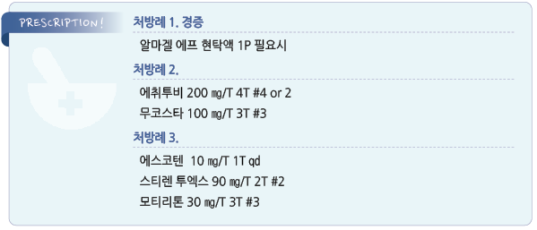

# 위염 Gastritis

## 일반 사항

* 위병증 (gastropathy) : 위 점막의 염증이 없는 epithelial 또는 endothelial damage
* 위염 (gastritis) : 조직학적으로 확인된 위 점막의 염증 상태

### 분류

* 위 점막의 patchy erythema : 보통 의미 없음
* erosive gastritis 또는 reactive gastropathy : NSAID, alcohol 등의 유해 인자에 의한 반응
* hemorrhagic gastritis : 저혈량, 저산소증 등 혈역학 이상에 대한 반응
* reflux gastritis : 지속적인 담즙 및 췌장액의 역류에 의한 반응; 보통 유문 장애와 관련되며 prepyloric antrum에 국한
* infectious gastritis : H. pylori 또는 기타 감염 관련
* atrophic gastritis : glandular structure loss; 고령, 지속적인 PPI 사용, 원발성 빈혈, 자가면역 질환 관련

### 만성 위염

*   만성 위염의 분류 및 진행 : 표재성 위염(superficial gastritis)

    → 위축성 위염(atrophic gastritis; gland distortion, destruction)

    → 위 위축(gastric atrophy)
* 창자화생 (intestinal metaplasia) : gastric gland가 소장의 mucosal gland처럼 변형된 상태. 위암의 주요 위험 인자

## 원인 및 위험 인자

* 감염 : H. pylori , S. aureus 외독소
* 소화액 역류
* ＞60세
* 위 점막 위축
* 음주
* 흡연
* 약물 : aspirin, NSAID
* 장기적인 약물 복용, 다제약물 복용
* 스트레스
* 심한 전신 질환, 심한 외상/화상
* 저혈량, 저산소증
* pernicious anemia
* 당뇨병, 갑상선 질환
* portal hypertension
* 방사선 치료
* H. pylori 감염 또는 위암 가족력

## 임상 양상

* 상복부 불편감/팽만감 : 보통 식후에 심해짐
* 상복부 쓰림/작열감, 구역, 구토
* 상복부 압통(보통 경증)
* 식욕 저하, 피로감

※ 복부 진찰 소견은 종종 정상이며, 임상 증상의 정도와 내시경 소견의 중증도가 일치하지 않는 경우가 많음

## 진단

* 내시경
  *   검사 대상 : 비특이적인 증상이나 경고 징후가 있는 경우, 위산 분비 억제제에 반응하지 않는 경우,

      중년 이후(＞50세)에 새로이 증상이 시작된 경우 (☞ p.381)
  * 정확도를 높이기 위하여 검사 전 2주간 PPI 중단 권고
* H. pylori 검사 (☞ ㅎ)
* 위장조영촬영
* 빈혈/출혈 검사 : anemia study(ferritin, TIBC, Fe, reticulocyte), 대변 잠혈 검사

***

## Management

### 치료 방침

* 금연, 금주, 식이 요법 (☞ p.385)
* 이완 요법
* 약물 주의 : NSAID 투여 시 중단 또는 COX-2 억제제 선택, aspirin 복용 시 중단 또는 대체 (☞ p.15)
* H. pylori 제균 대상에 해당되는 경우 제균 요법 시행 (☞ p.403)
* 만성 위염의 경우 후유증 치료를 목표로 함 (예: 만성 위염에 의한 빈혈에 대하여 Vit B12 투여) (☞ p.1023)
* 저혈량/저산소증 환자(특히 ICU 환자)는 H2 수용체 차단제, prostaglandin, sucralfate 등으로 예방 치료 고려

## 약물 치료

```
(☞ p.376)
```

#### 제산제

* 식후 1시간 및 취침 시 복용
* Al hydroxide \[암포젤], almagate \[알마겔]

#### H2-수용체 차단제

* 제산제보다 효과적이라는 증거는 불충분
* cimetidine : 200 ㎎ qid \[에취투비]
* famotidine : 20 ㎎ bid \[가스터]

#### 점막 보호제

* sucralfate : 1 g qid 공복 [아루사루민](../%EB%B9%84%EB%B3%B4%ED%97%98/)
* misoprostol : 100\~200 ㎍ qid \[싸이토텍]
* eupatilin : 60 ㎎ tid \[스티렌], 90 ㎎ bid \[스티렌 투엑스]
* rebamipide : 100 ㎎ tid \[무코스타]

#### PPI

* 저용량 PPI를 위염 치료에 적용
* eomeprazole : 10 ㎎ qd \[에스코텐] \[에소메졸 디알 서방]

## 모니터링

* 중증 또는 치료에 반응하지 않는 경우 6주 후 내시경 재검 고려
*   antrum과 body에 모두 위축성 위염이 있는 경우 매 3\~5년마다, low-grade dysplasia가 있는 경우 1년 내,

    high-grade dysplasia가 있는 경우 6\~12개월에 내시경 재검 고려

> **질병코드** K29 위염 및 십이지장염


