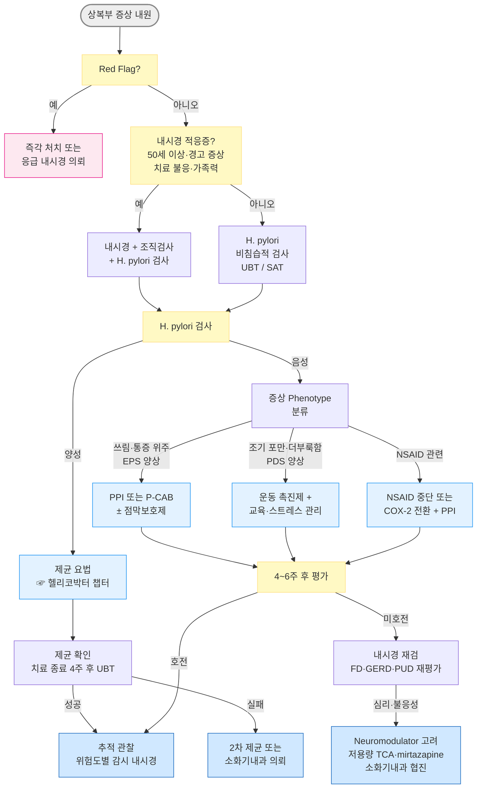

# 위염 Gastritis

## <mark style="color:green;">일반 사항</mark>

* **위병증 (gastropathy)** : 조직학적 염증 소견 없이 위 점막의 상피 또는 혈관 내피 손상만 있는 상태
* **위염 (gastritis)** : 조직학적으로 확인된 위 점막의 염증 상태; 임상 증상 및 내시경 소견만으로는 확진 불가
* **"위염" 과잉 진단 주의 - 증상 ≠ 위염**
  * 상복부 통증·속쓰림·더부룩함이 있다고 해서 모두 "위염"은 아님. 실제 외래에서는 기능성 소화불량(FD), GERD, 소화성 궤양, 약물 유발 증상, 담도 질환 등이 흔히 혼재하며, 이들이 진짜 원인인 경우가 많음
  * 내시경상 단순 발적(erythema, "minimal change gastritis")은 임상적으로 무의미한 경우가 매우 흔함. 경미한 점막 발적은 정상 변이 또는 비특이 변화일 수 있으며, 증상과의 연관성은 낮음; 내시경 소견이 곧 증상의 원인이라고 단정하지 말 것


최근 H. pylori 감염률 감소, 장기 PPI 사용 증가, 고령화로 인해 H. pylori 음성 위염의 비중이 증가하고 있음. 담즙 역류, 자가면역 위염, NSAID 관련 위병증의 상대적 중요성이 커지고 있음


#### <mark style="color:$primary;">분류</mark>

<table><thead><tr><th width="193.15789794921875">유형</th><th width="254.21051025390625">특징 및 원인</th><th>임상적 의의</th></tr></thead><tbody><tr><td>Patchy erythema</td><td>위 점막의 국소 발적; "minimal change gastritis"</td><td>대부분 임상적으로 무의미. 과잉 진단·치료 주의</td></tr><tr><td>Erosive gastritis / Reactive gastropathy</td><td>NSAID, 알코올 등 유해 인자</td><td>점막 손상; 출혈 가능</td></tr><tr><td>Hemorrhagic gastritis</td><td>저혈량, 저산소증 등 혈역학적 이상</td><td>스트레스 궤양과 연속선상</td></tr><tr><td>Reflux gastritis</td><td>담즙·췌장액의 역류; 유문 기능 장애와 관련</td><td>주로 antrum-predominant 패턴; body까지 침범 가능</td></tr><tr><td>Infectious gastritis</td><td>H. pylori, 기타 감염</td><td>가장 흔한 만성 위염 원인</td></tr><tr><td>Atrophic gastritis</td><td>선(gland) 구조 소실; 고령, 장기 PPI, 자가면역</td><td>위암 전구 병변 위험</td></tr></tbody></table>

### <mark style="color:orange;">만성 위염의 자연 경과 (Correa Cascade)</mark>

```
정상 위 점막
  ↓  H. pylori 감염, 자가면역, 노화 등
만성 표재성 위염 (Superficial gastritis)
  ↓
위축성 위염 (Atrophic gastritis) - 선(gland) 변형·소실
  ↓
장상피화생 (Intestinal metaplasia) - 위암의 주요 전구 병변
  ↓
이형성증 (Dysplasia) - Low-grade → High-grade
  ↓
위암 (Gastric cancer)
```


**OLGA/OLGIM 병기** : 조직검사를 기반으로 위암 위험도를 Stage I\~IV로 분류. Stage III\~IV는 3년마다 감시 내시경 권고. 1차 의료에서는 병기 판단보다 내시경 의뢰 결정이 실질적으로 중요

**OLGIM(장상피화생 기반) vs OLGA(위축 기반)** : OLGIM이 관찰자 간 일치도가 더 높고 위암 발생 위험 예측력이 우수하여 최근 임상적으로 더 선호됨


### <mark style="color:orange;">자가면역 위염 (Autoimmune Gastritis)</mark>

* 위 벽세포(parietal cell) 및 내인자(intrinsic factor)에 대한 자가항체 생성; H. pylori 음성, 주로 위체부(body) 침범
* 진행 순서 주의 : 철결핍빈혈이 B12 결핍보다 먼저 나타나는 경우가 흔함 - 위산 저하로 비헴철 흡수 장애 → 이후 내인자 결핍으로 Vit B12 흡수 장애(악성빈혈) 순으로 진행
* 갑상선 질환, 제1형 당뇨, 류마티스 질환과 동반 흔함
* 의심 시 검사: 항벽세포항체(anti-PCA), 항내인자항체(anti-IFA), 혈청 Vit B12, 혈청 가스트린, CBC

## <mark style="color:green;">원인 및 위험 인자</mark>

#### <mark style="color:$primary;">감염성</mark>

* H. pylori : 가장 흔한 만성 위염 원인; 국내 감염률 약 40\~50% (☞ [헬리코박터](080_-helicobacter-pylori-infection.md))
* 기타 : S. aureus 외독소, CMV·EBV (면역저하자), Anisakis (해산물 섭취 후 급성 증상)

#### <mark style="color:$primary;">화학적·물리적 자극</mark>

* 약물 : Aspirin, NSAID (비감염성 원인 중 가장 흔함), 스테로이드, 철분제, 항생제, bisphosphonate
* 알코올 : 위 점막 직접 손상 + 위산 분비 자극
* 담즙 역류 : 위 절제술 후, 유문 기능 이상
* 방사선 치료

#### <mark style="color:$primary;">전신 질환 및 생리적 스트레스</mark>

* 저혈량, 저산소증 (ICU, 심한 화상·외상, 패혈증)
* 당뇨병, 갑상선 질환
* Portal hypertension (portal hypertensive gastropathy)
* 자가면역 질환 (자가면역 위염, pernicious anemia)

#### <mark style="color:$primary;">생활 습관 및 기타</mark>

* 흡연, 과음, 고지방·자극성 식이, 불규칙한 식사, 심리적 스트레스
* ＞60세 (위 점막 재생 능력 저하)
* H. pylori 감염 또는 위암 가족력

## <mark style="color:green;">임상 양상</mark>

상복부 증상 (비특이적; 증상과 내시경 소견의 불일치가 매우 흔함)

* 상복부 불편감·팽만감 : 주로 식후 악화
* 상복부 쓰림·작열감, 속쓰림, 구역·구토, 조기 포만감
* 식욕 저하, 피로감

신체 소견

* 상복부 압통 (경증, 비특이적); 복막 자극 징후 없음 → 있으면 다른 진단 고려

만성 위염 동반 증상

* 피로감, 빈혈 증상 (위축성·자가면역 위염 시 철결핍빈혈 또는 악성빈혈)
* 체중 감소 → Red Flag

### <mark style="color:$danger;">🚩 Red Flags!</mark>

<mark style="color:$danger;">**즉각 조치 또는 응급 의뢰**</mark>

* 토혈(hematemesis) 또는 흑색변(melena) → 상부 소화관 출혈
* 급격하고 심한 복통 + 복막 자극 징후(반발압통, 근긴장) → 천공
* 활력 징후 불안정(저혈압, 빈맥) 동반 복통
* 의식 변화 동반 구토 (흡인 위험)

<mark style="color:$warning;">**당일 또는 조기 의뢰**</mark>

* 삼킴 곤란(dysphagia) 또는 연하 시 통증(odynophagia)
* 의도치 않은 체중 감소 (6개월 내 체중의 5% 이상)
* 지속적인 구토 또는 탈수 징후
* 복부 종괴 촉지
* 설명되지 않는 철결핍빈혈 (위암·출혈 감별 필요)
* 50세 이후 새로이 발생한 상복부 증상\*

<mark style="color:$info;">**외래 추적 / 추가 평가 계획**</mark> <mark style="color:$info;">- 즉각 위험 낮으나 호전 없으면 의뢰</mark>

* 4\~6주 표준 치료 후 증상 미호전 또는 재발 반복
* H. pylori 1차 제균 실패
* 조직검사상 위축성 위염·장상피화생 확인
* 자가면역 위염 의심 → 악성빈혈, 갑상선 질환


\* 연령 cutoff는 국가별 위암 유병률에 따라 다름. 우리나라의 높은 위암 발생률과 내시경 접근성을 고려하면 50세 기준이 적절하나, 국제 가이드라인에 따라 55\~60세 기준도 병용됨


## <mark style="color:green;">진단</mark>

### <mark style="color:orange;">검사</mark>&#x20;

#### <mark style="color:$primary;">내시경 검사</mark>

**적응증** (☞ [위장질환의 감별](074_.md))

* 경고 징후(Red Flag) 존재
* 위산 분비 억제제에 4\~6주 치료 후에도 반응 없는 경우
* 50세 이후 새로이 발생한 상복부 증상
* 위암 또는 H. pylori 감염 가족력
* 위암 가족력이 있는 경우 40세 미만이라도 내시경 시행 고려

**검사 전 준비**

* 정확한 조직학적 평가를 위해 PPI는 2주간 중단 권고
* H. pylori 검사 목적 시 항생제는 4주간 중단

**Updated Sydney System (조직검사)**

* Antrum 2곳 + body 2곳 + incisura angularis 1곳 생검 권장 (총 5개 부위)
* H. pylori 밀도, 염증 활성도, 만성 위염 정도, 위축, 장상피화생을 각각 0\~3등급으로 평가

#### <mark style="color:$primary;">Kyoto 내시경 분류 (Kyoto Classification)</mark>

**Kyoto classification (2013/2015)**: 내시경 소견을 기반으로 H. pylori 감염 상태 및 위암 위험도를 평가하는 체계. 위축(atrophy), 장상피화생(IM), 미만성 발적(diffuse redness), RAC(regular arrangement of collecting venules) 소실, 주름 비대 등의 소견을 점수화. 점수가 높을수록 위암 위험도 상승. 조직검사 없이도 H. pylori 감염 및 위축 상태를 예측하는 데 유용하다.

#### <mark style="color:$primary;">H. pylori 검사</mark>

(☞ [헬리코박터](080_-helicobacter-pylori-infection.md))

* 비침습적 : 요소호기검사(UBT, 1차 선택), 대변항원검사(SAT), 혈청항체 (과거 감염 반영; 치료 확인에 부적합)
* 침습적 (내시경 시행 시) : 신속 요소분해효소검사(CLO), 조직검사, 배양
* 제균 확인 : UBT 또는 SAT - 치료 종료 후 최소 4주, PPI 중단 후 2주 이상 경과 후 시행

#### <mark style="color:$primary;">혈액 및 기타 검사</mark>

* 빈혈 검사 : CBC, reticulocyte, Fe, ferritin, TIBC
  * ✦ **원인 불명의 철결핍빈혈** 시 자가면역 위염(AIG) 가능성을 반드시 고려할 것 (B12 결핍보다 먼저 나타남)
* Vit B12, 엽산 : 위축성·자가면역 위염 의심 시
* 자가항체 : 항벽세포항체(PCA), 항내인자항체(IFA) - 자가면역 위염 의심 시
* 대변 잠혈 검사 : 만성 출혈 스크리닝
* 혈청 가스트린 : 위축성 위염 시 상승; Zollinger-Ellison 감별 필요 시


**임신부 약물 안전성 (빠른 참고)**\
PPI (omeprazole, pantoprazole 등) : FDA category B (동물 실험 무해, 인체 대조 연구 부족) - 임신 중 필요 시 신중 사용 가능\
H2RA (famotidine) : FDA category B - 상대적으로 안전한 대안\
Misoprostol : **FDA category X - 임신 절대 금기** (자궁 수축 유발, 유산·조산 위험)\
✽ 정확한 최신 안전성 등급은 처방 전 반드시 확인할 것


### <mark style="color:orange;">위염 vs 기능성 소화불량 vs GERD - 감별</mark>

* "위염" 진단을 받은 환자의 상당수에서 FD 또는 GERD가 실제 원인임을 주목

<table><thead><tr><th width="171.47369384765625">특징</th><th>위염 (Gastritis)</th><th>기능성 소화불량 (FD)</th><th>GERD</th></tr></thead><tbody><tr><td>진단 기반</td><td>조직학적 염증</td><td>증상 기반, 구조적 이상 없음</td><td>증상 + 내시경/pH 검사</td></tr><tr><td>내시경-증상 연관</td><td>낮음</td><td>없음 (정상 내시경 흔함)</td><td>일부 존재 (미란성 식도염)</td></tr><tr><td>조기 포만감</td><td>±</td><td>+++ (PDS 핵심 증상)</td><td>±</td></tr><tr><td>식후 팽만감</td><td>+</td><td>+++</td><td>+</td></tr><tr><td>신물 역류·흉부 작열감</td><td>드묾</td><td>드묾</td><td>+++ (핵심)</td></tr><tr><td>누울 때·야간 악화</td><td>드묾</td><td>드묾</td><td>흔함</td></tr><tr><td>스트레스 연관</td><td>±</td><td>+++</td><td>++</td></tr><tr><td>H. pylori 연관</td><td>강함</td><td>일부 overlap</td><td>약함</td></tr><tr><td>NSAID 연관</td><td>강함</td><td>약함</td><td>약함</td></tr><tr><td>PPI 반응</td><td>일부 호전</td><td>Variable (불충분한 경우 많음)</td><td>비교적 좋음</td></tr><tr><td>Prokinetic 반응</td><td>제한적</td><td>좋음 (PDS 아형)</td><td>일부 overlap</td></tr><tr><td>치료 핵심</td><td>원인 제거 (H. pylori, NSAID)</td><td>Brain-gut axis 조절, 교육</td><td>산 역류 억제, 생활 교정</td></tr></tbody></table>

***



<p align="center"><strong>위염 진단 및 치료 알고리듬</strong></p>

***

## <mark style="background-color:$warning;">Management</mark>

### <mark style="color:orange;">치료 방침</mark>

* 원인 제거가 치료의핵심 - H. pylori 양성이면 제균, NSAID 관련이면 중단·대체; 약물 치료는 증상 완화와 점막 회복을 보조하는 역할
* H. pylori 제균 : 적응증 해당 시 우선 시행 (☞ [소화불량](075_-indigestion-dyspepsia.md), [헬리코박터](080_-helicobacter-pylori-infection.md))
* 유발 약물 중단·대체 : NSAID → 중단 또는 COX-2 억제제로 전환; Aspirin → 심혈관 위험 재평가 후 PPI 병용 (☞ p.15)
* 만성 위염 후유증 치료 : 위축성 위염에 의한 B12 결핍 → Vit B12 보충 (☞ [빈혈](../230_/192_-anemia.md#vit-b12-cobalamin-deficiency))
* 스트레스 궤양 예방 (ICU 고위험) : 기계 호흡·응고병증 동반 고위험 입원 환자에 PPI 우선 권고 (2018 SCCM/ESICM 지침; H2RA, sucralfate는 대안)

### <mark style="color:orange;">위염과 기능성 소화불량 Overlap</mark>


**외래 현실**: 내시경상 경미한 위염 소견이 있어도 증상의 주 원인이 기능성 소화불량(FD)인 경우가 매우 흔함. H. pylori (-)이고 NSAID를 복용하지 않는 환자에서 위염과 소화불량 증상이 공존한다면 FD overlap을 항상 고려


**FD overlap 가능성이 높은 경우**

* 식후 팽만감·조기 포만감이 주 증상 (FD-PDS 아형 시사)
* 스트레스 시 증상 악화, 증상 변동성 큼
* 내시경 소견이 정상 또는 경미한 발적 수준
* PPI 4\~6주 충분 용량 치료 후에도 반응 불충분
* 불안·우울 등 심리적 동반 증상

**치료 방향 전환**

* 운동 촉진제(prokinetic) 우선 추가 (mosapride, itopride, 모티리톤)
* 환자 교육 : 증상의 기전 설명, 경과 예측, 기능성 질환의 개념 설명
* 식이·스트레스 관리 적극 병행
* 장기 PPI 단독 투여의 효과를 재평가하고 step-down 계획 수립
* 필요 시 neuromodulator (저용량 TCA, mirtazapine) 고려 → 소화기내과 협진

### <mark style="color:orange;">모니터링 및 감시 내시경</mark>

* 중증 또는 치료 불응 : 6주 후 내시경 재검 고려
* 위축성 위염 (antrum + body 모두 침범) : 3\~5년마다 내시경
* 광범위 위축 또는 장상피화생, 위암 가족력 : 더 짧은 간격(1\~3년) 개별화 고려
* Low-grade dysplasia : 6\~12개월 내 내시경 재검
* High-grade dysplasia : 즉시 소화기내과 의뢰 (내시경 절제술 적응증)
* 자가면역 위염 : 3년마다 내시경; Vit B12·CBC 정기 모니터링; 위저선 폴립(fundic gland polyp) 및 신경내분비종양(NET, Type 1) 발생 위험 증가 - 내시경 시 주의 깊게 관찰


**국가 암검진**: 만 40세 이상은 2년마다 위내시경 무료 검진 가능


## <mark style="color:green;">비-약물 치료 및 예방</mark>

* 금연 : 위 점막 혈류 감소, 점막 재생 지연, H. pylori 제균율 저하
* 절주/금주 : 알코올은 위 점막 직접 손상 및 위산 분비 자극
* 식이 조절 : 자극성 음식(맵고 기름진 음식, 탄산음료, 커피, 신 과일즙) 제한; 소량씩 자주(5\~6회); 식후 바로 눕지 않기; 천천히 꼭꼭 씹어 먹기
* 스트레스 관리 : 인지행동치료, 이완 요법, 규칙적인 수면·운동

**약물 관련 위염 예방법**

* NSAID 장기 복용 불가피 시 : COX-2 억제제 선택 또는 PPI 병용
* 고위험 환자 (고령, 궤양 기왕력, 항응고제 병용) : Nonselective NSAID + PPI보다 COX-2 억제제 + PPI 조합이 재출혈 예방에 더 유리하다 (CONDOR, MEDAL trial)
* Aspirin 복용 중 위장 증상 : 장용정 변경 또는 PPI 병용 고려 (심혈관 위험·이익 재평가 선행)
* Bisphosphonate : 충분한 수분(200 mL)과 함께, 복용 후 30분 기립 유지

## <mark style="color:green;">약물 치료</mark>

　☞ [소화기계 약제](073_.md#gi-prokinetic-agent)

#### <mark style="color:$primary;">제산제 (Antacids)</mark>

* 위산 중화를 통한 즉각적 증상 완화; 궤양 치유 효과는 없음; 식후 1시간 및 취침 시 복용
* Al 함유 제산제는 신부전 시 장기 사용에 알루미늄 축적 독성 위험; Mg 함유 제제는 신부전 시 고마그네슘혈증 주의. 다른 약(항생제, 철분제, 갑상선 약 등)의 흡수를 방해하므로 2시간 간격 복용
* aluminum hydroxide <mark style="color:blue;">\[암포젤]</mark>
* almagate : Al + Mg <mark style="color:blue;">\[알마겔 에프]</mark>

#### <mark style="color:$primary;">H2-수용체 차단제 (H2RAs)</mark>

* 야간 위산 분비 억제에 효과적; PPI 대비 효과 제한적이나 단기·경증에 활용
* CYP 억제 작용 주의 : Cimetidine은 CYP1A2·CYP2C9·CYP2D6·CYP3A4 억제로 warfarin, theophylline, phenytoin 등 다수의 약물 상호작용 위험; Famotidine이 상호작용 적어 더 안전한 대안
* famotidine : 20 ㎎ bid - 1차 선택 <mark style="color:blue;">\[가스터 디]</mark>
* cimetidine : 400 ㎎ bid (또는 200 ㎎ qid) - 약물 상호작용 주의 <mark style="color:blue;">\[에취투비]</mark>

#### &#x20;<mark style="color:$primary;">PPI (양성자 펌프 억제제)</mark>

* H2RA보다 강력한 산 억제; 미란성 위염, NSAID 관련 위염, H. pylori 제균 병용 시 선호
* 증상 강도 및 미란 여부에 따라 표준 용량을 단기간 사용; 증상 조절 후 step-down 또는 중단을 반드시 계획할 것
* 식전 30분 복용으로 효과 극대화; CYP2C19 다형성에 따른 개인차 있음
* esomeprazole 10\~20 ㎎ qd <mark style="color:blue;">\[에스코텐]</mark>, <mark style="color:blue;">\[에소메졸 디알 서방]</mark>, <mark style="color:blue;">\[넥시움]</mark>
* pantoprazole 20\~40 ㎎ qd <mark style="color:blue;">\[판토록]</mark>
* rabeprazole 10\~20 ㎎ qd <mark style="color:blue;">\[파리에트]</mark>
* lansoprazole 15\~30 ㎎ qd <mark style="color:blue;">\[란스톤]</mark>


**PPI 장기 복용 주의**: 저마그네슘혈증, 골다공증(골절 위험), C. difficile 감염, 폐렴 위험. H. pylori 감염이 동반된 corpus-predominant gastritis에서 PPI 장기 사용 시 위축성 변화의 진행 가능성이 제기되고있음;  최소 유효 용량을 유지하고 불필요한 장기 복용은 피함 (PPI 단독이 위암을 직접 유발한다는 인과관계는 확립되지 않음)


#### <mark style="color:$primary;">P-CAB (칼륨경쟁적 위산 분비 억제제)</mark>

* PPI 대비 빠른 산 억제 발현, 식사 영향 적음, CYP2C19 유전형의 영향을 받지 않아 개인 간 반응 편차가 적음
* H. pylori 제균 요법 병용 시 PPI 대비 강력한 산 억제로 항생제 안정성을 높여 제균 성공률 향상에 기여
* 특히 야간 산 돌파(nocturnal acid breakthrough) 및 빠른 증상 조절이 필요한 경우에 유용
* tegoprazan : 20\~40 ㎎ qd <mark style="color:blue;">\[케이캡]</mark>
* vonoprazan : 10\~20 ㎎ qd <mark style="color:blue;">\[보신]</mark>
* fexuprazan : 40 ㎎ qd <mark style="color:blue;">\[펙수클루]</mark>&#x20;

#### <mark style="color:$primary;">점막 보호제 (Mucosal Protective Agents)</mark>

* sucralfate : 위 점막 피복; 공복에 복용 (1 g qid); Al 함유, 타 약물과 2시간 간격 <mark style="color:blue;">\[아루사루민]</mark>
* misoprostol : PGE1 유사체; NSAID 관련 위병증 예방에 효과적 (100\~200 ㎍ qid); 설사·복통 흔함; 임신 금기 <mark style="color:blue;">\[싸이토텍]</mark>
* rebamipide : 위 점막 PG 합성 촉진, 염증 억제 (100 ㎎ tid, 식후) <mark style="color:blue;">\[무코스타]</mark>
* eupatilin : Artemisia asiatica 추출 항산화·항염 성분 (60 ㎎ tid 또는 90 ㎎ bid, 식후) <mark style="color:blue;">\[스티렌]</mark>, <mark style="color:blue;">\[스티렌 투엑스]</mark>

#### <mark style="color:$primary;">위장관 운동 촉진제 (Prokinetics)</mark>

* 위배출 지연·팽만감·구역 동반 시, 특히 FD overlap이 의심되는 경우에 우선 추가 고려
* 고령자 prokinetic 주의 : D2 수용체 길항 작용이 있는 약제(metoclopramide, domperidone 등)는 고령자에서 추체외로 증상(EPS: 손 떨림, 근경직, 지연성 운동이상증)을 유발할 수 있음. 1차 의료에서 고령자에게는 EPS 위험이 낮은 mosapride 또는 itopride를 우선 선택하고, 증상 발생 시 즉시 중단할 것
* mosapride : 5-HT4 작용제; 위배출 촉진 (5 ㎎ tid, 식전) <mark style="color:blue;">\[가스모틴]</mark>
* itopride : D2 길항제 + AChE 억제 (50 ㎎ tid, 식전) <mark style="color:blue;">\[가나톤]</mark>
* Corydalis + Pharbitis nil 복합 추출물 (30 ㎎ tid, 식전) <mark style="color:blue;">\[모티리톤]</mark>

### <mark style="color:orange;">증상 Phenotype별 처방 방향</mark>

* 단일 '위염 처방'보다 증상 중심(phenotype-based)으로 접근하면 효율적임. 감별이 애매한 경우 우선 phenotype에 맞는 1차 약제를 선택하고 4\~6주 후 반응을 재평가

| 중심 증상                | 가능성 높은 진단                              | 우선 약제                                    | 핵심 생활 교정                               |
| -------------------- | -------------------------------------- | ---------------------------------------- | -------------------------------------- |
| 타는 듯 쓰림·공복·야간 악화     | Acid-related dyspepsia / 미란성 위염 / GERD | PPI 또는 P-CAB ± 점막보호제                     | 자극 음식·음주 제한, 야식 금지                     |
| 조기 포만감               | FD-PDS / 위배출 지연                        | 운동 촉진제 우선 (mosapride, itopride)          | 소량 빈식, 저지방 식사                          |
| 식후 팽만감·더부룩함          | FD / IBS overlap                       | 운동 촉진제 ± 점막보호제                           | 과식 금지, 탄산음료 제한, 천천히 먹기                 |
| 구역·메스꺼움              | 위배출 지연 / FD / 약물 유발                    | 운동 촉진제 ± 제토제                             | metformin·GLP-1 agonist·철분제 등 유발 약물 확인 |
| NSAID 복용 후 시작        | Reactive gastropathy / 미란성 위염          | NSAID 중단·감량 + PPI; 고위험 시 COX-2 억제제 + PPI | 공복 복용 금지, 충분한 수분                       |
| 신물·흉부 작열감·눕거나 야간 악화  | GERD / LPR                             | PPI 또는 P-CAB (표준 용량)                     | 야식 금지, 식후 눕지 않기, 체중 조절                 |
| 스트레스 연관·증상 변동성·검사 정상 | FD / Gut-brain axis disorder           | 환자 교육 + 운동 촉진제 ± neuromodulator 고려       | 스트레스 관리, CBT, 수면 교정                    |

***

### <mark style="color:red;">질병코드</mark>

K29.0 급성 출혈성 위염

K29.1 기타 급성 위염

K29.2 알코올성 위염

K29.3 만성 표재성 위염

K29.4 만성 위축성 위염

K29.5 상세불명의 만성 위염

K29.6 기타 위염

K29.7 상세불명의 위염

***

## <mark style="color:purple;">처방례</mark>

> **처방례 1. 경증 - 증상 시 제산제**
>
> ```
> 알마겔 에프 현탁액 1P  prn (식후 1시간 및 증상 시)
> ```
>
> _✽속쓰림·팽만감 경증에서 첫 선택. 필요 시에만 복용하도록 안내하고 장기 복용은 피한다._

> **처방례 2. 중등도 - H2RA + 점막보호제 + 운동 촉진**
>
> ```
> 가스터 디 20 ㎎/T    1T  qd
> 무코스타 100 ㎎/T    3T  #3  (식후)
> 모티리톤 30 ㎎/T     3T  #3  (식전)
> ```
>
> _✽팽만감·구역 동반 중등도 위염 또는 FD overlap 의심 시. 위배출 지연 소견 없으면 운동 촉진제 생략 가능._

> **처방례 3. 중등도-중증 / 미란성 위염 - PPI + 점막보호제**
>
> ```
> 에소메졸 디알 서방 20 ㎎/T   1T  qd  (식전 30분)
> 스티렌 투엑스 90 ㎎/T        2T  #2  (식후)
> 무코스타 100 ㎎/T             3T  #3  (식후)
> ```
>
> _✽미란성 위염, H2RA 치료 불응, NSAID 관련 위염 선택. 증상 조절 후 단계적 감량 또는 중단을 계획한다._

> **처방례 4. NSAID 불가피 복용 중 - 고위험 환자 위장 보호**
>
> ```
> (COX-2 억제제로 전환 또는 기존 NSAID 유지)
> 에소메졸 디알 서방 20 ㎎/T   1T  qd  (식전 30분)
> 무코스타 100 ㎎/T             3T  #3  (식후)
> ```
>
> _✽고위험 환자(고령, 궤양 기왕력, 항응고제 병용)에서는 COX-2 억제제 + PPI 조합이 nonselective NSAID + PPI보다 재출혈 예방 효과 우수 (CONDOR trial). Aspirin + NSAID 중복 투여는 피한다._

> **처방례 5. H. pylori 양성 → 제균 요법 (표준 3제)**
>
> ```
> (1차 표준 3제, 14일)
> 아목시실린 1,000 ㎎/T   2T  bid  (식후)
> 클래리스로마이신 500 ㎎/T  1T  bid  (식후)
> 에소메졸 디알 서방 20 ㎎/T  1T  bid  (식전 30분)
>   또는 P-CAB (케이캡 40 ㎎ bid) 으로 대체 가능
> ```
>
> _✽제균 요법 전 반드시 항생제 알레르기 확인. 클래리스로마이신 내성 지역(국내 내성률 \~30%)에서는 비스무트 4제 또는 레보플록사신 기반 요법 고려. 상세 요법은_ ☞ [_헬리코박터_](080_-helicobacter-pylori-infection.md) _챕터 참조. 치료 종료 4주 후 UBT로 제균 확인 필수._

***

### <mark style="color:$success;">핵심 복약 지도</mark>

> **제산제(알마겔 등) 복약 안내**
>
> * 식후 1시간 또는 속쓰림 증상이 있을 때 복용하십시오.
> * 다른 약(항생제, 철분제, 갑상선 약 등)과는 **2시간 간격**을 두고 복용하십시오. 위 점막에 달라붙어 다른 약의 흡수를 방해할 수 있습니다.
> * 신장 기능이 나쁜 경우 장기 복용은 피하고 의사에게 알리십시오.

> **H2 차단제(가스터 등) 복약 안내**
>
> * 보통 하루 1\~2회 규칙적으로 복용합니다. 취침 전 복용이 야간 산 분비 억제에 효과적입니다.
> * 증상이 나아져도 처방 기간 동안 임의로 중단하지 마십시오.
> * 신장 기능이 저하되어 있다면 용량 조정이 필요할 수 있으니 반드시 알려주십시오.

> **PPI / P-CAB 복약 안내**
>
> * PPI(에소메졸 등)는 **식사 30분 전**에 복용해야 효과가 가장 좋습니다.
> * P-CAB(케이캡, 타케캡)는 식사와 무관하게 복용 가능합니다.
> * 처음 며칠간은 효과가 서서히 나타납니다. 2\~3일 내에 완전히 호전되지 않아도 꾸준히 복용하십시오.
> * 증상이 조절되면 의사와 상의하여 용량을 줄이거나 중단하는 계획을 세우십시오. 수개월 이상 장기 복용 시 마그네슘 수치가 떨어지거나 뼈가 약해질 수 있습니다.

> **점막 보호제 복약 안내**
>
> * 무코스타(rebamipide)는 **식후** 복용, 아루사루민(sucralfate)은 **공복(식전 1시간 또는 식후 2시간)** 복용입니다. 복용 시점을 구분해 주십시오.
> * 아루사루민은 다른 약물 흡수를 방해하므로 다른 약과 2시간 간격을 두십시오.

> **언제 다시 병원을 방문해야 하나요?**
>
> * **까만 변(흑색변)이 나오거나 피를 토하는** 경우 → 즉시 응급실
> * **삼킬 때 통증이 있거나 음식이 내려가지 않는** 경우 → 당일 내원
> * **체중이 본인도 모르게 계속 줄어드는** 경우 → 당일 내원
> * 처방 약 복용에도 **4\~6주 이내에 증상이 나아지지 않는** 경우 → 재방문

***

### <mark style="color:blue;">환자 안내서</mark>


**위염, 제대로 알고 관리합시다**

위염은 위 점막에 염증이 생긴 상태입니다. 상복부 불편감·쓰림·구역 등 다양한 증상이 나타날 수 있지만, 비슷한 증상을 일으키는 다른 원인도 매우 많습니다. **위염은 증상만으로 진단되지 않으며, 내시경이나 검사 결과가 필요합니다.** 정확한 진단과 원인 교정, 생활 습관 개선이 치료의 핵심입니다.


#### <mark style="color:$primary;">왜 위염이 생기나요?</mark>

* 가장 흔한 원인은 **헬리코박터 파일로리(H. pylori) 세균 감염**입니다. 이 균이 위 점막에 상주하며 만성 염증을 일으킵니다.
* **진통소염제(NSAID), 아스피린** 등은 위 점막 보호 물질의 생성을 줄여 점막을 손상시킵니다.
* **음주, 흡연, 스트레스, 불규칙한 식사**도 위 점막을 약하게 만드는 중요한 요인입니다.
* 나이가 들면 위 점막의 재생 능력이 떨어져 위염이 생기기 쉽습니다.

#### <mark style="color:$primary;">일상생활에서 어떻게 관리하나요?</mark>

* **금연하십시오.** 흡연은 위 점막 회복을 방해합니다.
* **음주를 줄이거나 끊으십시오.** 술은 위 점막에 직접 독성을 줍니다.
* **자극적인 음식을 피하십시오.** 맵고 짠 음식, 탄산음료, 진한 커피는 증상을 악화시킬 수 있습니다.
* **소량씩 자주(5\~6회) 드십시오.** 과식·폭식은 위에 과부하를 줍니다.
* **식사 후 바로 눕지 마십시오.** 식후 최소 30분\~1시간은 앉아 계십시오.
* **스트레스를 관리하십시오.** 규칙적인 운동과 충분한 수면이 도움이 됩니다.

#### <mark style="color:$primary;">약은 어떻게 복용해야 하나요?</mark>

* 제산제(알마겔 등)는 증상이 있을 때 식후 1시간에 복용합니다.
* PPI(에소메졸 등)는 반드시 **식사 30분 전**에 복용해야 합니다.
* 점막 보호제는 종류에 따라 식전 또는 식후 복용이 다릅니다. 복약 안내를 꼭 확인하십시오.
* 헬리코박터 양성으로 제균 치료를 받는 경우: **처방된 약을 빠짐없이 끝까지 복용하는 것이 매우 중요합니다.** 중간에 임의로 중단하면 내성균이 생겨 치료가 더 어려워집니다.
* **약물 복용 시 반드시 의사·약사와 상의하십시오.** 특히 **임신 중 또는 임신 가능성이 있는 경우**, 위궤양 치료에 쓰는 일부 약물(misoprostol 등)은 절대 복용해서는 안 됩니다.
* PPI를 처방받으셨다면: 위산 억제제가 위암을 직접 유발한다는 근거는 없습니다. 다만 불필요한 장기 복용은 피하고, 증상이 조절되면 의사와 상의해 줄이거나 중단하는 것이 좋습니다.

#### <mark style="color:$primary;">이럴 때는 즉시 병원을 방문하세요</mark>

* **까만 변이 나오거나 피를 토하는** 경우 → 즉시 응급실
* **음식을 삼키기 어렵거나 삼킬 때 통증이 심한** 경우 → 당일 내원
* **갑자기 체중이 많이 빠지는** 경우 → 당일 내원
* **치료 후에도 4\~6주 이상 증상이 지속되는** 경우 → 외래 재방문
* **50세 이후 처음 생긴 상복부 증상**은 반드시 내시경 검사가 필요합니다.


**위 내시경 검진 안내**: 만 40세 이상이면 국가 암검진 프로그램을 통해 2년마다 위내시경을 무료로 받을 수 있습니다. 위염이 있는 경우 정기 검진을 통해 위암으로의 진행 여부를 조기에 확인하는 것이 중요합니다.

