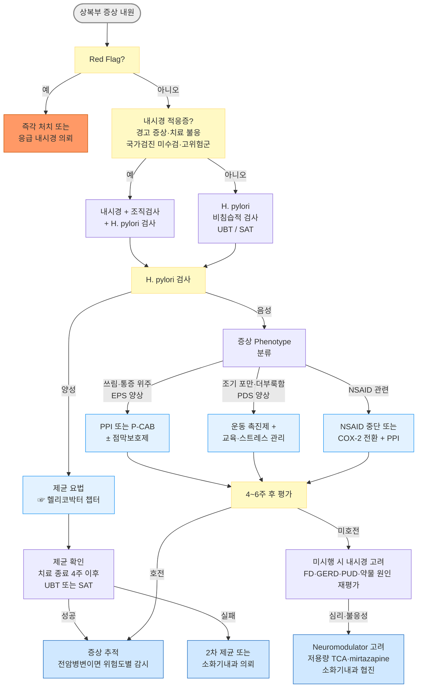

# 위염 Gastritis

## <mark style="color:green;">일반 사항</mark>

* **위병증 (gastropathy)** : 조직학적 염증 소견 없이 위 점막의 상피 또는 혈관 내피 손상만 있는 상태
* **위염 (gastritis)** : 조직학적으로 확인된 위 점막의 염증 상태; 임상 증상 및 내시경 소견만으로는 확진 불가
* **"위염" 과잉 진단 주의 - 증상 ≠ 위염**
  * 상복부 통증·속쓰림·더부룩함이 있다고 해서 모두 "위염"은 아님. 실제 외래에서는 기능성 소화불량(FD), GERD, 소화성 궤양, 약물 유발 증상, 담도 질환 등이 흔히 혼재하며, 이들이 진짜 원인인 경우가 많음
  * 내시경상 단순 발적(erythema, "minimal change gastritis")은 임상적으로 무의미한 경우가 매우 흔함. 경미한 점막 발적은 정상 변이 또는 비특이 변화일 수 있으며, 증상과의 연관성은 낮음; 내시경 소견이 곧 증상의 원인이라고 단정하지 말 것


H. pylori 음성인 조직학적 위염에서는 약물·담즙 역류에 의한 반응성 위병증, 자가면역 위염뿐 아니라 lymphocytic·eosinophilic·collagenous gastritis, Crohn병, CMV 등 드문 원인을 임상 맥락에 따라 감별한다. PPI 복용은 H. pylori 검사의 위음성과 위체부 우세 분포에 영향을 줄 수 있으므로 검사 시 복용력을 확인한다.


#### <mark style="color:$primary;">분류</mark>

<table><thead><tr><th width="193.15789794921875">유형</th><th width="254.21051025390625">특징 및 원인</th><th>임상적 의의</th></tr></thead><tbody><tr><td>Patchy erythema</td><td>위 점막의 국소 발적; "minimal change gastritis"</td><td>대부분 임상적으로 무의미. 과잉 진단·치료 주의</td></tr><tr><td>Erosive gastritis / Reactive gastropathy</td><td>NSAID, 알코올 등 유해 인자</td><td>점막 손상; 출혈 가능</td></tr><tr><td>Hemorrhagic gastritis</td><td>저혈량, 저산소증 등 혈역학적 이상</td><td>스트레스 관련 점막 손상과 연속선상</td></tr><tr><td>Reflux gastritis</td><td>담즙·췌장액의 역류; 위 수술 후 또는 유문 기능 장애와 관련</td><td>반응성 위병증 소견; 증상과의 인과관계는 신중히 판단</td></tr><tr><td>Infectious gastritis</td><td>H. pylori, 면역저하자의 CMV 등</td><td>H. pylori가 가장 흔한 만성 위염 원인</td></tr><tr><td>Atrophic gastritis</td><td>만성 염증에 의한 선(gland) 소실; 주원인은 H. pylori와 자가면역</td><td>위암 전구 병변; 범위·중증도에 따라 위험 층화</td></tr></tbody></table>

#### <mark style="color:$primary;">만성 위염의 자연 경과 (Correa Cascade)</mark>

```
정상 위 점막
  ↓  H. pylori 감염 및 환경·숙주 요인
만성 표재성 위염 (Superficial gastritis)
  ↓
위축성 위염 (Atrophic gastritis) - 선(gland) 변형·소실
  ↓
장상피화생 (Intestinal metaplasia) - 위암의 주요 전구 병변
  ↓
이형성증 (Dysplasia) - Low-grade → High-grade
  ↓
위암 (Gastric cancer)
```


**Correa cascade**는 주로 H. pylori 관련 다초점 위축성 위염에서 장형 위암으로 진행하는 경로이다. 자가면역 위염은 위체부 우세 위축·고가스트린혈증 및 Type 1 위 신경내분비종양 위험을 포함하는 별도 경로로 이해한다.

**OLGA/OLGIM 병기** : 조직검사를 기반으로 위암 위험도를 Stage 0\~IV로 분류. Stage III\~IV 또는 전정부와 위체부를 모두 침범한 광범위 위축·장상피화생은 약 3년마다 고품질 내시경 추적을 권고한다.

**OLGIM(장상피화생 기반) vs OLGA(위축 기반)** : OLGIM은 관찰자 간 일치도가 비교적 높지만 위축만 있고 장상피화생이 적은 고위험 환자를 과소평가할 수 있다. 어느 하나가 절대적으로 우월하다기보다 조직검사 범위·병리 판독과 함께 해석한다.


#### <mark style="color:$primary;">자가면역 위염 (Autoimmune Gastritis)</mark>

* 위 벽세포(parietal cell) 및 내인자(intrinsic factor)에 대한 자가항체와 관련되며 주로 위체부(body)를 침범함. H. pylori 음성은 진단 요건이 아니며 과거 또는 현재 감염이 병존할 수 있음
* 진행 순서 주의 : 철결핍빈혈이 B12 결핍보다 먼저 나타나는 경우가 흔함 - 위산 저하로 비헴철 흡수 장애 → 이후 내인자 결핍으로 Vit B12 흡수 장애(악성빈혈) 순으로 진행
* 자가면역 갑상선질환, 제1형 당뇨병 등 다른 자가면역질환과 동반 가능
* 의심 시 검사: CBC, Fe·ferritin, Vit B12 ± methylmalonic acid, 항벽세포항체(anti-PCA), 항내인자항체(anti-IFA), 공복 혈청 가스트린 ± pepsinogen I 및 I/II ratio, 갑상선 기능검사
  * Anti-PCA는 비교적 민감하지만 특이도가 낮고, anti-IFA는 특이도가 높지만 민감도가 낮음

## <mark style="color:green;">원인 및 위험 인자</mark>

#### <mark style="color:$primary;">감염성</mark>

* H. pylori : 가장 흔한 만성 위염 원인; 국내 성인 감염률은 조사 시기·연령·검사법에 따라 다르나 약 40% 전후로 보고됨 (☞ [헬리코박터](080_-helicobacter-pylori-infection.md))
* 기타 감염·기생충 : CMV 등(주로 면역저하자), Anisakis(생선회 섭취 후 급성 상복부 통증); 화농성 위염은 매우 드묾

#### <mark style="color:$primary;">화학적·물리적 자극</mark>

* 약물 : Aspirin, NSAID(비감염성 반응성 위병증의 가장 흔한 원인), 철분제 등. 스테로이드 단독의 위험은 크지 않으나 NSAID 병용 시 궤양·출혈 위험 증가
* 알코올 : 위 점막 직접 손상 + 위산 분비 자극
* 담즙 역류 : 위 절제술 후, 유문 기능 이상
* 방사선 치료

#### <mark style="color:$primary;">전신 질환 및 생리적 스트레스</mark>

* 저혈량, 저산소증 (ICU, 심한 화상·외상, 패혈증)
* Portal hypertension (portal hypertensive gastropathy)
* 자가면역 위염 및 악성빈혈(pernicious anemia); 당뇨병·갑상선질환은 위장운동 이상 또는 자가면역질환 동반 여부를 평가

#### <mark style="color:$primary;">생활 습관 및 기타</mark>

* 흡연·과음은 점막 손상 또는 위암 위험과 관련됨
* 고지방·자극성 식이, 불규칙한 식사, 심리적 스트레스는 소화불량 증상을 악화시킬 수 있으나 조직학적 위염의 직접 원인으로 단정하지 않음
* 고령과 위암 가족력은 위염의 직접 원인이라기보다 위암 위험도와 내시경 필요성을 판단하는 요인

## <mark style="color:green;">임상 양상</mark>

**상복부 증상**&#x20;

* 비특이적; 증상과 내시경 소견의 불일치가 매우 흔함
* 상복부 불편감·팽만감 : 주로 식후 악화
* 상복부 쓰림·작열감, 속쓰림, 구역·구토, 조기 포만감
* 식욕 저하, 피로감

**신체 소견**

* 상복부 압통 (경증, 비특이적); 복막 자극 징후 없음 → 있으면 다른 진단 고려

**만성 위염 동반 증상**

* 피로감, 빈혈 증상 (위축성·자가면역 위염 시 철결핍빈혈 또는 악성빈혈)
* 비의도적 체중 감소는 위염의 전형적 증상이라기보다 위암 등 기질적 질환을 배제해야 하는 경고 징후

### <mark style="color:$danger;">🚩 Red Flags!</mark>

　☞ [위장질환의 감별](074_.md#step-1-red-flags)

## <mark style="color:green;">진단</mark>

### <mark style="color:orange;">검사</mark>&#x20;

#### <mark style="color:$primary;">내시경 검사</mark>

**적응증** (☞ [위장질환의 감별](074_.md))

* 경고 징후(Red Flag) 존재
* 적절한 경험적 치료 후에도 증상이 지속·악화되거나 진단이 불확실한 경우
* 국가 위암검진 대상(40세 이상)이면서 최근 적절한 검사를 받지 않았거나 새 증상이 발생한 경우
* 위암 가족력 등 위암 고위험군; 연령만으로 모든 환자에게 즉시 재검을 요구하지 않고 최근 내시경 결과와 위험도를 함께 고려

**검사 전 준비**

* H. pylori 검사 목적이면 가능할 때 PPI 또는 P-CAB을 2주 이상 중단. 중단이 어렵다면 검사 민감도 저하 가능성을 해석에 반영
* 항생제와 bismuth는 H. pylori 검사 전 4주 이상 중단
* 단순한 위축·장상피화생 조직 평가만을 위해 모든 환자에서 PPI를 반드시 중단하는 것은 아님

**Updated Sydney System (조직검사)**

* Antrum 2곳 + body 2곳 + incisura angularis 1곳 생검 권장(총 5개 부위); 전정부/각절흔과 위체부 검체는 각각 구분된 용기에 담아 병리 의뢰
* H. pylori 밀도, 염증 활성도, 만성 위염 정도, 위축, 장상피화생을 각각 0\~3등급으로 평가

**Kyoto 내시경 분류 (Kyoto Classification)**

* 내시경 소견을 기반으로 H. pylori 감염 상태 및 위암 위험도를 평가하는 체계
* 위축(atrophy), 장상피화생(IM), 미만성 발적(diffuse redness), RAC(regular arrangement of collecting venules) 소실, 주름 비대 등의 소견을 점수화; 점수가 높을수록 위암 위험도 상승
* 일본 내에서는 임상적으로 널리 쓰이고 있으나 더 다양한 인구 집단에서의 검증 필요

#### <mark style="color:$primary;">H. pylori 검사</mark>

　(☞ [헬리코박터](080_-helicobacter-pylori-infection.md))

* 비침습적 : 요소호기검사(UBT) 또는 단클론 대변항원검사(SAT); 혈청항체는 과거 감염도 반영하므로 활동성 감염 진단과 제균 확인에 부적합
* 침습적 (내시경 시행 시) : 신속 요소분해효소검사(CLO), 조직검사, 배양
* 제균 확인 : 모든 치료 환자에서 UBT 또는 SAT로 확인. 치료 종료 후 최소 4주, PPI/P-CAB 중단 후 2주 이상 경과 후 시행

#### <mark style="color:$primary;">혈액 및 기타 검사</mark>

* 빈혈 검사 : CBC, reticulocyte, Fe, ferritin, TIBC
  * &#x20;원인 불명의 철결핍빈혈 시 자가면역 위염(AIG) 가능성을 고려 (B12 결핍보다 먼저 나타남)
* Vit B12, 엽산 : 위축성·자가면역 위염 의심 시
* 자가항체 : 항벽세포항체(PCA), 항내인자항체(IFA) - 자가면역 위염 의심 시
* 출혈·빈혈이 의심되면 CBC·철대사검사 및 적절한 내시경 평가를 우선하며, 음성 대변잠혈검사만으로 상부위장관 출혈을 배제하지 않음
* 공복 혈청 가스트린 : 위체부 위축성 위염에서 상승 가능. PPI/P-CAB과 신기능 저하도 수치를 높일 수 있으므로 복용력·신기능과 함께 해석; Zollinger-Ellison syndrome 감별 시 위산분비 상태를 함께 평가

### <mark style="color:orange;">위염 vs 기능성 소화불량 vs GERD 감별</mark>

* "위염" 진단을 받은 환자의 상당수에서 FD 또는 GERD가 실제 원인임을 주목

<table><thead><tr><th width="171.47369384765625">특징</th><th>위염 (Gastritis)</th><th>기능성 소화불량 (FD)</th><th>GERD</th></tr></thead><tbody><tr><td>진단 기반</td><td>조직학적 염증</td><td>증상 기준 충족 + 설명 가능한 구조적 질환 없음</td><td>전형적 증상으로 임상 진단 가능; 필요 시 내시경·역류검사</td></tr><tr><td>내시경-증상 연관</td><td>대체로 낮음</td><td>정상 또는 비특이적 소견 흔함</td><td>미란성 식도염이 있으면 객관적 근거</td></tr><tr><td>조기 포만감</td><td>비특이적</td><td>흔함(PDS 핵심 증상)</td><td>비전형적</td></tr><tr><td>식후 충만감·팽만감</td><td>비특이적</td><td>흔함</td><td>동반 가능</td></tr><tr><td>신물 역류·흉부 작열감</td><td>비전형적</td><td>주증상이면 다른 진단 고려</td><td>전형적</td></tr><tr><td>누울 때·야간 악화</td><td>비특이적</td><td>가변적</td><td>흔함</td></tr><tr><td>스트레스 연관</td><td>증상 악화 가능</td><td>흔함</td><td>증상 인지에 영향 가능</td></tr><tr><td>H. pylori 연관</td><td>강함</td><td>일부 overlap</td><td>직접적 연관 약함</td></tr><tr><td>NSAID 연관</td><td>강함(주로 반응성 위병증)</td><td>직접적 연관 약함</td><td>직접적 연관 약함</td></tr><tr><td>PPI 반응</td><td>NSAID 관련 미란 등 원인에 따라 다름</td><td>일부 환자에서 호전</td><td>산 역류 증상에서 비교적 양호</td></tr><tr><td>Prokinetic 반응</td><td>제한적</td><td>PDS에서 선택적으로 고려</td><td>routine 사용하지 않음</td></tr><tr><td>치료 핵심</td><td>원인 제거(H. pylori, NSAID 등)</td><td>교육·증상 아형별 치료·gut-brain axis 관리</td><td>산 역류 억제, 체중·식사시간 등 생활 교정</td></tr></tbody></table>

***


```mermaid
graph TD
    A([상복부 증상 내원])
    B[Red Flag?]
    C[즉각 처치 또는<br/>응급 내시경 의뢰]
    D[내시경 적응증?<br/>경고 증상·치료 불응<br/>국가검진 미수검·고위험군]
    E[내시경 + 조직검사<br/>+ H. pylori 검사]
    F[H. pylori<br/>비침습적 검사<br/>UBT / SAT]
    G[H. pylori 검사 ]
    H[제균 요법<br/>☞ 헬리코박터 챕터]
    I[증상 Phenotype<br/>분류]
    J[제균 확인<br/>치료 종료 4주 이후<br/>UBT 또는 SAT]
    K[증상 추적<br/>전암병변이면 위험도별 감시]
    L[2차 제균 또는<br/>소화기내과 의뢰]
    M[PPI 또는 P-CAB<br/>± 점막보호제]
    N[운동 촉진제 + <br/>교육·스트레스 관리]
    O[NSAID 중단 또는<br/>COX-2 전환 + PPI]
    P[4~6주 후 평가]
    Q[미시행 시 내시경 고려<br/>FD·GERD·PUD·약물 원인 재평가]
    R[Neuromodulator 고려<br/>저용량 TCA·mirtazapine<br/>소화기내과 협진]

    A --> B
    B -->|예| C
    B -->|아니오| D
    D -->|예| E
    D -->|아니오| F
    E --> G
    F --> G
    G ---->|양성| H
    G -->|음성| I
    H --> J
    J -->|성공| K
    J -->|실패| L
    I -->|쓰림·통증 위주<br/>EPS 양상| M
    I -->|조기 포만·더부룩함<br/>PDS 양상| N
    I -->|NSAID 관련| O
    M --> P
    N --> P
    O --> P
    P -->|호전| K
    P -->|미호전| Q
    Q -->|심리·불응성| R
style A fill:#eeeeee,stroke:#888888,stroke-width:2px
classDef yellow fill:#fff9c4,stroke:#ffe082
class B,D,G,P yellow
classDef sky fill:#e3f2ff,stroke:#2196f3
class H,M,N,O sky
classDef blue fill:#d0e8ff,stroke:#1a6abf
class K,L,R blue
    style C fill:#ff9966,stroke:#cc5500
```

<p align="center"><strong>위염 진단 및 치료 알고리듬</strong></p>

***

## <mark style="background-color:$warning;">Management</mark>

### <mark style="color:orange;">치료 방침</mark>

* 원인 제거가 치료의 핵심 - H. pylori 양성이면 제균, NSAID 관련이면 중단·대체; 약물 치료는 증상 완화와 점막 회복을 보조하는 역할
* H. pylori 제균 : 적응증 해당 시 우선 시행 (☞ [소화불량](075_-indigestion-dyspepsia.md), [헬리코박터](080_-helicobacter-pylori-infection.md))
* 유발 약물 중단·대체 : NSAID → 중단 또는 COX-2 억제제로 전환; Aspirin → 심혈관 위험 재평가 후 PPI 병용 (☞ [통증](../220_/001_-pain.md#nsaids))
* 만성 위염 후유증 치료 : 위축성 위염에 의한 B12 결핍 → Vit B12 보충 (☞ [빈혈](../230_/192_-anemia.md#vit-b12-cobalamin-deficiency))
* 스트레스 관련 상부위장관 출혈 예방(ICU 고위험) : 응고병증, 쇼크, 만성 간질환 등 위험인자가 있는 중환자에게 저용량 PPI 또는 H2RA 사용을 고려. 기계환기 단독은 확립된 독립 위험인자가 아니며, 위험인자 또는 중증 상태가 해소되면 중단하고 ICU 퇴실 후 불필요하게 지속하지 않음(2024 SCCM/ASHP 지침)

#### <mark style="color:$primary;">위염-기능성 소화불량 Overlap</mark>

* 내시경상 경미한 위염 소견이 있어도 증상의 주 원인이 기능성 소화불량(FD)인 경우가 매우 흔함. H. pylori (-)이고 NSAID를 복용하지 않는 환자에서 위염과 소화불량 증상이 공존한다면 FD overlap을 항상 고려

**FD overlap 가능성이 높은 경우**

* 식후 팽만감·조기 포만감이 주 증상 (FD-PDS 아형 시사)
* 스트레스 시 증상 악화, 증상 변동성 큼
* 내시경 소견이 정상 또는 경미한 발적 수준
* PPI 4\~6주 충분 용량 치료 후에도 반응 불충분
* 불안·우울 등 심리적 동반 증상

**치료 방향 전환**

* 운동 촉진제(prokinetic) 우선 추가 (mosapride, itopride, 모티리톤)
* 환자 교육 : 증상의 기전 설명, 경과 예측, 기능성 질환의 개념 설명
* 식이·스트레스 관리 적극 병행
* 장기 PPI 단독 투여의 효과를 재평가하고 step-down 계획 수립
* 필요 시 neuromodulator (저용량 TCA, mirtazapine) 고려 → 소화기내과 협진

#### <mark style="color:$primary;">모니터링 및 감시 내시경</mark>

* 증상 지속·악화 : 기존 내시경 시행 여부와 경고 징후를 확인한 뒤 미시행 환자는 내시경을 고려하고, 최근 적절한 내시경이 정상이었다면 FD·GERD·PUD·담췌질환·약물 원인을 재평가
* 광범위 위축 또는 장상피화생(전정부와 위체부 모두 침범), OLGA/OLGIM III\~IV : 약 3년마다 고품질 내시경
* 전정부에 국한된 경도\~중등도 위축·장상피화생 : 위암 가족력, 불완전형 장상피화생, 지속 H. pylori 감염 등 추가 위험인자가 없으면 별도의 감시 내시경을 일률적으로 권고하지 않음. 국내 국가암검진 주기와 개인 위험도를 함께 고려
* 내시경에서 보이는 Low-grade dysplasia : 전문기관에서 병변 재평가 후 내시경 절제술 고려. 비가시성 이형성증은 고화질 내시경·virtual chromoendoscopy를 이용한 재평가 및 추적 간격을 전문의와 결정
* High-grade dysplasia : 즉시 소화기내과 의뢰; 내시경 절제술을 우선 검토
* 자가면역 위염 : 최적 감시 간격은 불명확하므로 위축 범위·가족력·동반 병변에 따라 개별화; CBC·Fe/ferritin·Vit B12 정기 모니터링. 위선암 및 Type 1 위 신경내분비종양 위험을 고려하며, 작은 NET를 절제한 뒤에는 종양 부담에 따라 1\~2년 간격 내시경 고려


**국가 암검진** : 만 40세 이상은 2년마다 위내시경 또는 위장조영검사 대상. 본인부담 여부는 보험·소득·대상 조건에 따라 확인


## <mark style="color:green;">비-약물 치료 및 예방</mark>

* 금연 : 위 점막 혈류 감소, 점막 재생 지연, H. pylori 제균율 저하
* 절주/금주 : 알코올은 위 점막 직접 손상 및 위산 분비 자극
* 식이 조절 : 과식·폭식을 피하고 개인적으로 증상을 유발하는 음식만 선택적으로 제한. 모든 환자에게 맵고 기름진 음식·커피·신 과일즙을 일률적으로 금지하거나 하루 5\~6회 식사를 권할 근거는 부족함. GERD가 동반되면 야식과 식후 바로 눕기를 피함
* 스트레스 관리 : 인지행동치료, 이완 요법, 규칙적인 수면·운동

**약물 관련 위염 예방법**

* NSAID 장기 복용 불가피 시 : COX-2 억제제 선택 또는 PPI 병용
* 매우 높은 위장관 위험 환자(궤양 출혈 기왕력 등) : NSAID가 반드시 필요하면 심혈관 위험을 함께 평가하여 COX-2 억제제 + PPI 조합 고려
* Aspirin 복용 중 위장 증상 : 심혈관 적응증을 재평가하고, 지속이 필요하며 위장관 고위험이면 PPI 병용 및 H. pylori 평가 고려. 장용정 전환만으로 임상적으로 중요한 위장관 출혈이 예방되지는 않음
* Bisphosphonate : 충분한 수분(200 mL)과 함께, 복용 후 30분 기립 유지

## <mark style="color:green;">약물 치료</mark>

　☞ [소화기계 약제](073_.md#gi-prokinetic-agent)

#### <mark style="color:$primary;">제산제 (Antacids)</mark>

* 위산 중화를 통한 즉각적 증상 완화; 궤양 치유 효과는 없음; 식후 1시간 및 취침 시 복용
* Al 함유 제산제는 신부전 시 장기 사용에 알루미늄 축적 독성 위험; Mg 함유 제제는 신부전 시 고마그네슘혈증 주의. 다른 약(항생제, 철분제, 갑상선 약 등)의 흡수를 방해하므로 2시간 간격 복용
* aluminum hydroxide <mark style="color:blue;">\[암포젤]</mark>
* almagate : Al + Mg <mark style="color:blue;">\[알마겔 에프]</mark>

#### <mark style="color:$primary;">H2-수용체 차단제 (H2RAs)</mark>

* 야간 위산 분비 억제에 효과적; PPI 대비 효과 제한적이나 단기·경증에 활용
* CYP 억제 작용 주의 : Cimetidine은 CYP1A2·CYP2C9·CYP2D6·CYP3A4 억제로 warfarin, theophylline, phenytoin 등 다수의 약물 상호작용 위험; Famotidine이 상호작용 적어 더 안전한 대안
* famotidine : 20 ㎎ bid - 1차 선택 <mark style="color:blue;">\[가스터 디]</mark>
* cimetidine : 400 ㎎ bid (또는 200 ㎎ qid) - 약물 상호작용 주의 <mark style="color:blue;">\[에취투비]</mark>

#### &#x20;<mark style="color:$primary;">PPI (양성자 펌프 억제제)</mark>

* H2RA보다 강력한 산 억제; 미란성 위염, NSAID 관련 위염, H. pylori 제균 병용 시 선호
* 증상 강도·미란 여부와 적응증에 따라 표준 용량을 단기간 사용; 명확한 장기 적응증이 없으면 증상 조절 후 step-down 또는 중단을 계획
* 대부분의 일반형 PPI는 식전 30\~60분 복용으로 효과를 높일 수 있으나, 제형에 따라 식사 영향이 다르므로 제품별 허가사항 확인; CYP2C19 다형성에 따른 개인차 있음
* esomeprazole 10\~20 ㎎ qd <mark style="color:blue;">\[에스코텐]</mark>, <mark style="color:blue;">\[에소메졸 디알 서방]</mark>, <mark style="color:blue;">\[넥시움]</mark>
* pantoprazole 20\~40 ㎎ qd <mark style="color:blue;">\[판토록]</mark>
* rabeprazole 10\~20 ㎎ qd <mark style="color:blue;">\[파리에트]</mark>
* lansoprazole 15\~30 ㎎ qd <mark style="color:blue;">\[란스톤]</mark>


**PPI 장기 복용 주의**: 드문 저마그네슘혈증과 장감염 위험에 유의한다. 골절·폐렴·신장질환·치매 등과의 연관성이 관찰연구에서 보고되었으나 다수는 인과관계가 확립되지 않았다. H. pylori 감염이 동반된 위체부 우세 위염에서는 감염을 진단·치료하고, 명확한 적응증이 있으면 이론적 위험 때문에 필요한 PPI를 중단하지 않는다. 정기적으로 적응증을 재평가하여 최소 유효 용량을 사용한다.


#### <mark style="color:$primary;">P-CAB (칼륨경쟁적 위산 분비 억제제)</mark>

* PPI 대비 빠른 산 억제 발현, 식사 영향 적음, CYP2C19 유전형의 영향을 받지 않아 개인 간 반응 편차가 적음
* H. pylori 제균 요법 병용 시 PPI 대비 강력한 산 억제로 항생제 안정성을 높여 제균 성공률 향상에 기여
* 약제별 국내 허가 적응증과 용량이 서로 다르므로 “P-CAB 계열”이라는 이유만으로 동일 용량이나 적응증을 적용하지 않음
* tegoprazan : 적응증별 허가 용량 확인; H. pylori 제균요법 병용 시 50 ㎎ bid <mark style="color:blue;">\[케이캡]</mark>
* fexuprazan : 급성 위염 및 만성 위염의 급성 악화기 위점막 병변 개선 10 ㎎ bid, 2주; 미란성 GERD는 40 ㎎ qd로 용량이 다름 <mark style="color:blue;">\[펙수클루]</mark>&#x20;

#### <mark style="color:$primary;">점막 보호제 (Mucosal Protective Agents)</mark>

* 국내 허가 범위에서 증상·점막 병변에 따라 한 제제를 단기간 선택할 수 있으나, 미란 치유만을 목적으로 일률적으로 사용하거나 여러 점막보호제를 routine 병용하지 않음
* sucralfate : 위 점막 피복; 공복에 복용 (1 g qid); Al 함유, 타 약물과 2시간 간격 <mark style="color:blue;">\[아루사루민]</mark>
* misoprostol : PGE1 유사체; NSAID 관련 위병증 예방에 효과적 (100\~200 ㎍ qid); 설사·복통 흔함; 임신 금기 <mark style="color:blue;">\[싸이토텍]</mark>
* rebamipide : 위 점막 PG 합성 촉진, 염증 억제 (100 ㎎ tid, 식후) <mark style="color:blue;">\[무코스타]</mark>
* eupatilin : Artemisia asiatica 추출 항산화·항염 성분 (60 ㎎ tid 또는 90 ㎎ bid, 식후) <mark style="color:blue;">\[스티렌]</mark>, <mark style="color:blue;">\[스티렌 투엑스]</mark>

#### <mark style="color:$primary;">위장관 운동 촉진제 (Prokinetics)</mark>

* 위배출 지연·팽만감·구역이 동반되고 FD-PDS overlap이 의심되는 경우 단기간 선택적으로 고려; 조직학적 위염 자체를 치료하는 약제는 아님
* 고령자 prokinetic 주의 : metoclopramide 등 중추 D2 수용체 길항제는 추체외로 증상(EPS: 손 떨림, 근경직, 지연성 운동이상증)을 유발할 수 있음. Domperidone은 QT 연장·심실성 부정맥 위험에 유의한다. Mosapride 또는 중추신경계 침투가 적은 itopride도 환자별 금기·상호작용을 확인하고 이상반응 발생 시 중단
* mosapride : 5-HT4 작용제; 위배출 촉진 (5 ㎎ tid, 식전) <mark style="color:blue;">\[가스모틴]</mark>
* itopride : D2 길항제 + AChE 억제 (50 ㎎ tid, 식전) <mark style="color:blue;">\[가나톤]</mark>
* Corydalis + Pharbitis nil 복합 추출물 (30 ㎎ tid, 식전) <mark style="color:blue;">\[모티리톤]</mark>

### <mark style="color:orange;">증상 Phenotype별 처방 방향</mark>

* 단일 '위염 처방'보다 증상 중심(phenotype-based)으로 접근하면 효율적임. 감별이 애매한 경우 우선 phenotype에 맞는 1차 약제를 선택하고 4\~6주 후 반응을 재평가

<table><thead><tr><th>중심 증상</th><th>가능성 높은 진단</th><th>우선 접근</th><th>핵심 생활 교정</th></tr></thead><tbody><tr><td>타는 듯 쓰림·공복·야간 악화</td><td>Acid-related dyspepsia / 미란성 위염 / GERD</td><td>적응증에 따라 PPI 또는 P-CAB 단기간</td><td>개인 유발 음식·음주 제한; GERD 동반 시 야식 금지</td></tr><tr><td>조기 포만감</td><td>FD-PDS / 위배출 지연</td><td>운동 촉진제 단기간 고려(mosapride, itopride)</td><td>과식을 피하고 필요 시 소량 식사·저지방 식사</td></tr><tr><td>식후 팽만감·더부룩함</td><td>FD / IBS overlap</td><td>FD 치료 원칙에 따라 교육 ± 운동 촉진제</td><td>과식·탄산음료를 피하고 천천히 먹기</td></tr><tr><td>구역·메스꺼움</td><td>위배출 지연 / FD / 약물 유발</td><td>유발 원인 교정 ± 운동 촉진제·제토제</td><td>Metformin·GLP-1 수용체작용제·철분제 등 유발 약물 확인</td></tr><tr><td>NSAID 복용 후 시작</td><td>Reactive gastropathy / 미란성 위염</td><td>NSAID 중단·감량 + PPI; 매우 높은 위험이면 COX-2 억제제 + PPI 고려</td><td>자가 증량·중복 NSAID 복용 금지</td></tr><tr><td>신물·흉부 작열감·눕거나 야간 악화</td><td>GERD</td><td>PPI 또는 P-CAB(표준 용량)</td><td>야식 금지, 식후 눕지 않기, 과체중이면 체중 조절</td></tr><tr><td>스트레스 연관·증상 변동성·검사 정상</td><td>FD / Gut-brain interaction disorder</td><td>환자 교육 ± 증상 아형별 약제; 필요 시 neuromodulator</td><td>스트레스 관리, CBT, 수면·운동 습관 교정</td></tr></tbody></table>


**임신부 약물 안전성** \
FDA의 A·B·C·D·X 임신 문자등급은 폐기되었으므로 사용하지 않는다. 임신 중 위장 증상은 생활요법·제산제 등으로 시작하고, 산 억제제가 필요하면 임신 주수·중증도·개별 제제의 인체 자료를 검토하여 H2RA 또는 PPI를 선택한다.\
Misoprostol은 자궁 수축과 유산·조산 위험 때문에 임신부 및 임신 가능성이 있으면서 적절한 피임을 하지 않는 여성의 NSAID 유발 궤양 예방 목적으로 사용하지 않는다.\
✽ 국내 최신 허가사항의 임신·수유 위험 요약을 처방 전 확인할 것


***

### <mark style="color:red;">질병코드</mark>

K29.0 급성 출혈성 위염

K29.1 기타 급성 위염

K29.2 알코올성 위염

K29.3 만성 표재성 위염

K29.4 만성 위축성 위염

K29.5 상세불명의 만성 위염

K29.6 기타 위염

K29.7 상세불명의 위염

***

## <mark style="color:purple;">처방례</mark>

> **처방례 1. 경증 - 증상 시 제산제**
>
> ```
> 알마겔 에프 현탁액 1P  prn (식후 1시간 및 증상 시)
> ```
>
> _✽산 관련 속쓰림이 경미할 때 필요 시 사용한다. 팽만감이 주증상이면 FD 등 다른 원인을 평가하며, 제산제를 장기 반복하지 않는다._

> **처방례 2. 산 관련 증상이 주된 경증-중등도 환자 - H2RA**
>
> ```
> 가스터 디 20 ㎎/T    2T  #2
> ```
>
> _✽단기간 사용 후 반응을 재평가한다. 신기능 저하자는 용량 조정이 필요하다. 조기 포만감·식후 충만감이 주증상이면 위염 약제를 중첩하기보다 FD-PDS 치료 원칙에 따라 운동 촉진제를 선택적으로 사용한다._

> **처방례 3. NSAID 관련 미란성 위염 - PPI**
>
> ```
> 에소메졸 디알 서방 20 ㎎/T   1T  qd  (식전 30분)
> ```
>
> _✽가능하면 원인 NSAID를 중단·감량한다. 국내 위염 진료지침은 NSAID 관련 미란성 위염에서 PPI를 조건부로 고려하며 근거 수준은 매우 낮다. 증상·병변이 호전되면 명확한 장기 적응증이 없는 한 중단을 계획한다._

> **처방례 4. NSAID 불가피 복용 중 - 고위험 환자 위장 보호**
>
> ```
> (COX-2 억제제로 전환 또는 기존 NSAID 유지)
> 에소메졸 디알 서방 20 ㎎/T   1T  qd  (식전 30분)
> ```
>
> _✽궤양 출혈 기왕력 등 위장관 위험이 매우 높으면 심혈관 위험을 함께 평가하여 COX-2 억제제 + PPI를 고려한다. Aspirin + NSAID 중복 투여는 피한다. 점막보호제를 예방 목적으로 일률적으로 추가하지 않는다._

> **처방례 5. H. pylori 양성 - 감수성검사 불가 시 경험적 concomitant therapy 예시**
>
> ```
> (10일)
> 아목시실린 500 ㎎/T         4T  #2  (식후)
> 클래리스로마이신 500 ㎎/T    2T  #2  (식후)
> 메트로니다졸 250 ㎎/T        4T  #2  (식후)
> 에소메졸 디알 서방 20 ㎎/T   2T  #2  (식전 30분)
> ```
>
> _✽2025 개정 국내 지침은 clarithromycin 감수성검사 기반 맞춤치료를 우선 권고한다. 경험적 clarithromycin 3제요법은 감수성검사가 불가능하고 지역 내성률이 15% 미만으로 예상되는 제한적인 경우에만 고려한다. Bismuth 4제요법은 1차 경험치료로 사용할 수 있으나 이상반응과 구제요법 선택을 고려한다. Levofloxacin 요법은 감수성 또는 이전 fluoroquinolone 노출을 검토한 제한적 구제요법이다. 상세 요법은_ ☞ [_헬리코박터_](080_-helicobacter-pylori-infection.md) _챕터 참조. 모든 환자에서 치료 종료 4주 이후 UBT 또는 SAT로 제균을 확인한다._

***

### <mark style="color:$success;">핵심 복약 지도</mark>

> **제산제(알마겔 등) 복약 안내**
>
> * 식후 1시간 또는 속쓰림 증상이 있을 때 복용하십시오.
> * 다른 약(항생제, 철분제, 갑상선 약 등)과는 **2시간 간격**을 두고 복용하십시오. 위 점막에 달라붙어 다른 약의 흡수를 방해할 수 있습니다.
> * 신장 기능이 나쁜 경우 장기 복용은 피하고 의사에게 알리십시오.

> **H2 차단제(가스터 등) 복약 안내**
>
> * 보통 하루 1\~2회 규칙적으로 복용합니다. 취침 전 복용이 야간 산 분비 억제에 효과적입니다.
> * 증상이 나아져도 처방 기간 동안 임의로 중단하지 마십시오.
> * 신장 기능이 저하되어 있다면 용량 조정이 필요할 수 있으니 반드시 알려주십시오.

> **PPI / P-CAB 복약 안내**
>
> * 대부분의 일반형 PPI(에소메졸 등)는 **식사 30\~60분 전**에 복용하면 효과가 좋습니다. 다만 제형에 따라 차이가 있으므로 처방받은 제품의 복약 안내를 따르십시오.
> * P-CAB(케이캡, 펙수클루 등)는 식사와 무관하게 복용할 수 있으나 적응증별 용량이 다르므로 처방된 횟수와 기간을 지키십시오.
> * PPI는 충분한 효과가 나타나는 데 며칠 걸릴 수 있지만 P-CAB은 비교적 빠르게 작용합니다.
> * 명확한 장기 복용 사유가 없다면 증상이 조절된 뒤 의사와 상의하여 용량을 줄이거나 중단하십시오. 장기간 복용이 필요할 때는 임의로 중단하지 말고 적응증과 이상반응 위험을 정기적으로 재평가하십시오.

> **점막 보호제 복약 안내**
>
> * 무코스타(rebamipide)는 **식후** 복용, 아루사루민(sucralfate)은 **공복(식전 1시간 또는 식후 2시간)** 복용입니다. 복용 시점을 구분해 주십시오.
> * 아루사루민은 다른 약물 흡수를 방해하므로 다른 약과 2시간 간격을 두십시오.

> **언제 다시 병원을 방문해야 하나요?**
>
> * **까만 변(흑색변)이 나오거나 피를 토하는** 경우 → 즉시 응급실
> * 음식이 완전히 걸려 침도 삼키기 어렵거나 호흡이 불편한 경우 → 즉시 응급실
> * 새로 발생하거나 진행하는 연하곤란·연하통, 지속적인 비의도적 체중 감소 → 신속한 진료 및 내시경 평가
> * 처방 약 복용에도 **4\~6주 이내에 증상이 나아지지 않는** 경우 → 재방문

***

### <mark style="color:blue;">환자 안내서</mark>


**위염, 제대로 알고 관리합시다**

위염은 위 점막에 염증이 생긴 상태입니다. 상복부 불편감·쓰림·구역 등 다양한 증상이 나타날 수 있지만, 비슷한 증상을 일으키는 다른 원인도 매우 많습니다. **위염은 증상만으로 진단되지 않으며, 내시경이나 검사 결과가 필요합니다.** 정확한 진단과 원인 교정, 생활 습관 개선이 치료의 핵심입니다.


#### <mark style="color:$primary;">왜 위염이 생기나요?</mark>

* 가장 흔한 원인은 **헬리코박터 파일로리(H. pylori) 세균 감염**입니다. 이 균이 위 점막에 상주하며 만성 염증을 일으킵니다.
* **진통소염제(NSAID), 아스피린** 등은 위 점막 보호 물질의 생성을 줄여 점막을 손상시킵니다.
* 과음은 위 점막을 직접 손상시킬 수 있고, 흡연은 점막 회복과 헬리코박터 치료에 불리합니다.
* 스트레스·불규칙한 식사·특정 음식은 소화불량 증상을 악화시킬 수 있지만, 그것만으로 조직학적 위염이 생긴다고 단정할 수는 없습니다.

#### <mark style="color:$primary;">일상생활에서 어떻게 관리하나요?</mark>

* **금연하십시오.** 흡연은 위 점막 회복을 방해합니다.
* **음주를 줄이거나 끊으십시오.** 술은 위 점막에 직접 독성을 줍니다.
* **본인에게 증상을 일으키는 음식만 선택적으로 줄이십시오.** 모든 환자가 맵고 짠 음식·커피 등을 일률적으로 금지할 필요는 없습니다.
* **과식·폭식을 피하고 천천히 드십시오.** 필요하면 한 번 식사량을 줄이되 반드시 하루 5\~6회 먹을 필요는 없습니다.
* 역류 증상이 동반되면 야식을 피하고 식사 후 바로 눕지 마십시오.
* **스트레스를 관리하십시오.** 규칙적인 운동과 충분한 수면이 도움이 됩니다.

#### <mark style="color:$primary;">약은 어떻게 복용해야 하나요?</mark>

* 제산제(알마겔 등)는 증상이 있을 때 식후 1시간에 복용합니다.
* 대부분의 일반형 PPI(에소메졸 등)는 **식사 30\~60분 전**에 복용하지만 제형에 따라 다를 수 있으므로 제품별 복약 안내를 따르십시오.
* 점막 보호제는 종류에 따라 식전 또는 식후 복용이 다릅니다. 복약 안내를 꼭 확인하십시오.
* 헬리코박터 양성으로 제균 치료를 받는 경우: **처방된 약을 빠짐없이 끝까지 복용하는 것이 매우 중요합니다.** 중간에 임의로 중단하면 내성균이 생겨 치료가 더 어려워집니다.
* **약물 복용 시 반드시 의사·약사와 상의하십시오.** 특히 **임신 중 또는 임신 가능성이 있는 경우**, 위궤양 치료에 쓰는 일부 약물(misoprostol 등)은 절대 복용해서는 안 됩니다.
* PPI를 처방받으셨다면: 위산 억제제가 위암을 직접 유발한다는 근거는 없습니다. 다만 불필요한 장기 복용은 피하고, 증상이 조절되면 의사와 상의해 줄이거나 중단하는 것이 좋습니다.

#### <mark style="color:$primary;">이럴 때는 즉시 병원을 방문하세요</mark>

* **까만 변이 나오거나 피를 토하는** 경우 → 즉시 응급실
* **음식이 완전히 걸려 침도 삼키기 어렵거나 호흡이 불편한** 경우 → 즉시 응급실
* **새로 발생하거나 진행하는 연하곤란·연하통, 원인 모를 체중 감소** → 신속히 진료
* **치료 후에도 4\~6주 이상 증상이 지속되는** 경우 → 외래 재방문
* 새로 생긴 증상과 함께 빈혈·출혈·반복 구토·연하곤란·체중 감소가 있거나 위암 가족력이 있으면 내시경 필요성을 신속히 평가해야 합니다.


**위 내시경 검진 안내**: 만 40세 이상은 국가암검진에서 2년마다 위내시경 또는 위장조영검사 대상입니다. 본인부담 여부는 보험·소득·대상 조건에 따라 다를 수 있습니다. 검진은 위축성 위염·장상피화생 같은 위암 위험 병변과 조기 위암을 발견하는 데 도움이 됩니다.

