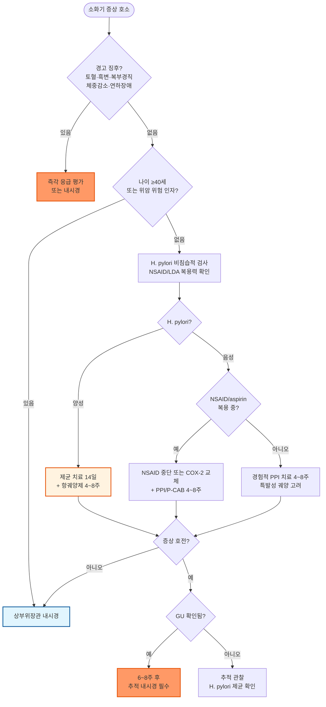
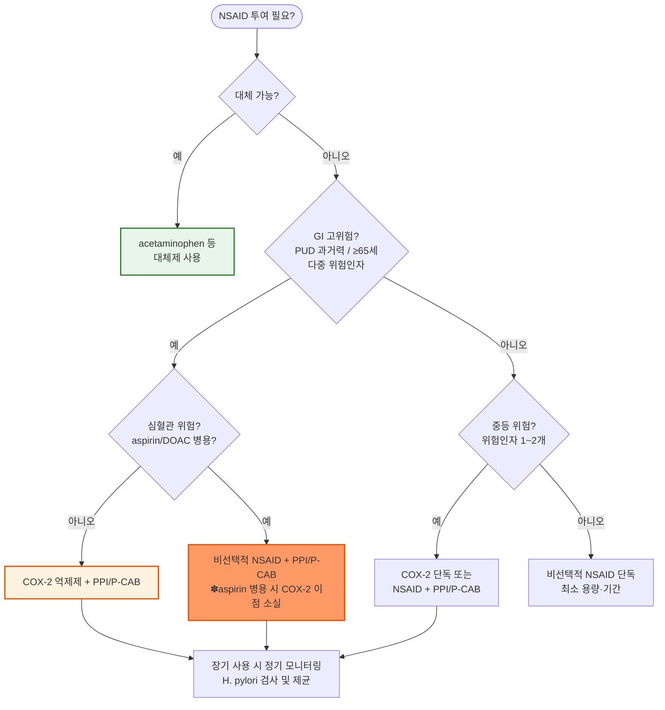

# 소화성 궤양 Peptic Ulcer Disease, PUD

## <mark style="color:green;">일반 사항</mark>

* 위십이지장 점막의 결손이 점막근층(muscularis mucosae)을 침범하는 병변; 통상 **5 ㎜ 이상** 깊이의 손상으로 정의
* 위궤양 (gastric ulcer, GU) : 55\~70세에 흔함; 위점막 방어기전 손상이 주된 기전
* 십이지장궤양 (duodenal ulcer, DU) : 30\~55세에 흔함; H. pylori 제균 치료 보급 이후 감소 추세
* 식도궤양 (esophageal ulcer) : GERD에 의해 식도 원위부에 호발; 중증 미란성 식도염(LA class C\~D)과 동반되거나 Barrett's esophagus의 합병으로 나타날 수 있음
* refractory peptic ulcer : PPI 표준 용량으로 8\~12주 치료 후에도 내시경 소견이 호전되지 않는 경우; 빈도 5\~10%
* recurrent peptic ulcer : 완전한 내시경적 치유 이후 다시 발생

#### <mark style="color:$primary;">역학</mark>

* 미국 유병률 약 2%; 국내는 H. pylori 제균 치료 보급 및 위암 검진 인프라로 **DU는 감소 추세, GU는 상대적으로 유지** (국내 유병률 정확한 통계는 부족하나 H. pylori 제균 이후 전반적 감소)
* NSAID 장기 사용자 중 **매년 2\~5%에서 증상이 있는 궤양 합병증 발생**; NSAID 사용자의 10\~30%에서 내시경적 GU, 2\~5%에서 DU 확인
* 경과 : 자연 치유율 60%; 치료에 의한 치유 성공률 90\~95%; 재발률 5\~30%
  * H. pylori (+) 환자에서 제균 성공 시 재발률 &lt;20% (vs. 미제균 시 60\~80%/년)
* 합병증 : 출혈 약 15\~25% (선행 증상 없이 발생 가능), 천공 &lt;5%, 위 배출구 폐쇄 &lt;5%
  * refractory/recurrent ulcer에서는 합병증 발생 가능성을 반드시 고려

***

## <mark style="color:green;">원인 및 위험 인자</mark>

#### <mark style="color:$primary;">병태생리</mark>

* **공격 인자** : 위산, 펩신, 담즙, 췌장액
* **방어 인자** : mucus, bicarbonate, 점막 혈류, prostaglandin, growth factor, cell turnover
* 위궤양 : 주로 방어기전 손상; 위산 분비는 정상(감소한 경우도 있음)
* 십이지장궤양 : 위산 분비 증가(정상인 경우도 있음)와 중탄산염 분비 감소

#### <mark style="color:$primary;">주요 원인</mark>

* **H. pylori 감염** : 소화성 궤양의 가장 중요한 원인 (DU의 70\~95%, GU의 60\~80%)
* **NSAID/aspirin** : H. pylori와 독립적이며 상가적 위험 인자
  * 비선택적 NSAID는 COX-1 억제로 prostaglandin 합성 감소 → 점막 방어력 저하
  * 국소(직접 점막 손상)와 전신(prostaglandin 억제) 두 가지 경로로 작용
  * **저용량 아스피린(LDA) 단독**도 고령에서 의미 있는 PUD/출혈 위험 인자; 과거 궤양 병력 또는 항응고제 병용 시 위험 현저히 증가
* **특발성(idiopathic) 궤양** : H. pylori 음성 + NSAID 비사용 환자에서 발생; 전체 PUD 중 비율은 낮으나 임상적으로 중요하며 최근 증가 추세; 고령, 동반 질환, occult aspirin/NSAID 사용, 미세 허혈 등 관련 가능; **재발 및 출혈 위험이 상대적으로 높음**

#### <mark style="color:$primary;">위험 인자</mark>

* **약물** : NSAID, aspirin(LDA 포함), steroid(NSAID 병용 시 위험 상승), bisphosphonate, 화학요법, 다제약물 복용
* **항응고제/항혈소판제** : anticoagulant(warfarin, DOAC), 항혈소판제(clopidogrel 등) - 특히 **DOAC(rivaroxaban, dabigatran 등)는 상부위장관 출혈 위험 증가**; 고위험군에서 PPI 예방 병용 고려
* **NSAID 관련 고위험 요소** : 과거 PUD/GI 출혈 병력, 고령(＞65세), 고용량 또는 복수 NSAID 복용, 스테로이드·anticoagulant 병용
* **흡연, 음주, 가족력**
* **기타** : 만성 신부전, 간경변, COPD, 크론병, 방사선 치료, gastrinoma, 림프종

***

## <mark style="color:green;">임상 양상</mark>

* **흔히 자각 증상이 없음** - 특히 NSAID/LDA 복용 중 무증상 궤양이 흔함; 출혈이나 천공이 첫 증상으로 나타나는 경우도 있음
* 증상이 있는 경우 흔히 주기적으로 발생하며 수주 단위로 악화와 완화 반복
* **상복부 복통/불편감/작열감**, 가슴쓰림, 산 역류, 조기 포만감, 트림, 구역, 구토
* **혈변, 검은 변** : 위장관 출혈의 증상; 선행 증상 없이 발생할 수 있음
* GU : 식후 악화
* DU : 새벽 공복 또는 식후 1\~3시간에 악화; 제산제나 음식물 섭취로 호전

### <mark style="color:$danger;">🚩 Red Flags!</mark>

　☞ [위장질환의 감별](074_.md#step-1-red-flags)

<mark style="color:$danger;">**즉각 조치 또는 의뢰**</mark> <mark style="color:$danger;">- 생명 위협 또는 즉각적 위해 가능성</mark>

* 토혈, 혈변, 흑변 동반 → 상부 위장관 출혈 의심 (즉시 응급 평가)
* 급격한 복통 악화 + 복부 경직 → 위장관 천공 의심 (즉시 외과 의뢰)
* 실신, 저혈압, 빈맥 동반 → 출혈성 쇼크 가능성 (즉시 이송)


🚨 **출혈성 PUD 의심 시 즉각 조치**

1. 활력징후 확인 및 모니터링
2. CBC / BUN / Cr / PT-INR / type & screen
3. 항혈전제·항응고제 복용 여부 확인
4. NPO + 정맥로 2개 확보
5. IV PPI 고용량 투여 고려 (omeprazole 80 ㎎ bolus → 8 ㎎/hr 지속 정주)
6. 응급 상부위장관 내시경 의뢰 (내원 24시간 이내; 고위험 시 12시간 이내)


<mark style="color:$warning;">**당일 또는 조기 의뢰**</mark>

* 연하 곤란, 연하 통증, 또는 구토로 인한 체중 감소 → 위 배출구 폐쇄 또는 악성 병변 의심
* 복통이 등이나 어깨로 방사 → 천공 또는 췌장 침범 가능성
* **40세 이상에서 새롭게 발생한 소화기 증상** → 악성 종양 배제를 위한 상부내시경 시행
* 빈혈 + 만성 흑변 → 만성 출혈 의심

<mark style="color:$info;">**외래 추적 / 추가 평가 계획**</mark> <mark style="color:$info;">- 즉각 위험 낮으나 호전 없으면 의뢰</mark>

* 4\~8주 적절한 약물 치료에도 증상 지속 → 내시경 검사 및 H. pylori 재검 고려
* 재발성 또는 불응성 궤양 → gastrinoma(ZES), 크론병 배제
* 위암 위험 인자 동반(가족력, H. pylori, 위축성 위염) 또는 이전 위암 병력

***

## <mark style="color:green;">진단</mark>

#### <mark style="color:$primary;">진찰</mark>

* 상복부 압통 : 비특이적; 고령의 ⅓에서는 잘 관찰되지 않음
* 합병증이 없는 PUD 환자는 대부분 비특이적 소견
* **모든 환자에서 NSAID/LDA 복용 이력 및 H. pylori 보균 여부를 확인**

#### <mark style="color:$primary;">실험실 검사</mark>

* 출혈/빈혈 평가 : CBC, 대변 잠혈, iron study (ferritin, TIBC, Fe, reticulocyte)
* 공복 혈청 gastrin : 다발성·재발성·불응성 궤양에서 gastrinoma(ZES) 의심 시 고려
  * PPI는 위산 억제로 gastrin을 상승시킬 수 있으므로 **가능하면 1\~2주 중단 후 측정**; PPI 중단이 어려운 경우 H2RA로 일시 교체 후 측정 고려

#### <mark style="color:$primary;">영상/내시경 검사</mark>

* **위장관 내시경 검사** : 진단 및 조직 검사, 출혈 병변 처치, 악성 여부 감별의 표준
* 위장관조영술 : 내시경 불가 시 대체 또는 보조적 역할

#### <mark style="color:$primary;">헬리코박터 검사</mark>

　☞ [헬리코박터](080_-helicobacter-pylori-infection.md)

* **대상** : 새롭게 발생된 PUD, PUD 과거력, 경험적 치료 후 지속되는 PUD 의심 증상
* **검사 방법** : 요소호기검사 (UBT, 비침습적, 1차 선택), 대변 항원 검사, 조직 검사 (CLO test + 조직)
* ✽ PPI 복용 중에는 UBT 위음성 가능성 → 검사 전 **2주 이상 PPI 중단** 권장 (H2RA는 1주 중단으로 충분)

### <mark style="color:orange;">내시경 검사 대상</mark>

* 경고 징후(Red Flags Tier 1\~2)가 있음
* 치료에 반응하지 않거나 재발
* **40세 이상에서 소화기 증상이 새로이 시작** ✽국제 가이드라인(55\~60세)과 달리 우리나라는 높은 위암 발생률과 국가검진 인프라를 고려해 40세 기준 적용 (☞ [위장질환의 감별](074_.md))


**우리나라 위암 검진 권고안** : 남녀 모두 **40세 이상**에서 **매 2년마다** UGI 또는 상부위장관 내시경 시행; 위점막 조직학적 변화(위축성 위염, 장상피화생) 또는 위암 직계 가족력이 있는 고위험군은 **1년마다** 검사 고려

※ 경고 징후 없는 40세 미만 연령의 PUD 의심 증상은 즉각적인 내시경 없이 외래에서 경험적 치료 가능


### <mark style="color:orange;">치료 후 내시경 추적 검사</mark>


⚠️ **위궤양(GU)은 모든 예에서 치유 확인 내시경이 원칙**

위궤양은 악성 종양(위암)과 내시경적으로 감별이 어려울 수 있으며, 양성으로 보이는 경우에도 반드시 치유 여부를 조직학적으로 확인해야 합니다. 치료 종료 후 6\~8주에 추적 내시경을 시행하며, 치유가 불완전하면 악성 감별을 위한 조직 검사를 재시행합니다.

십이지장궤양(DU)은 악성 가능성이 희박하므로, 증상 호전 시 추적 내시경을 생략할 수 있습니다.


* 증상 지속
* GU : **모든 예에서** 치료 종료 6\~8주 후 추적 내시경 (치유 확인 + 악성 배제)
* DU : 합병증, 증상 지속, 위험 인자가 있는 경우에 추적 고려
* H. pylori 관련 PUD : 제균 치료 종료 2\~4주 후 UBT 제균 확인; 내시경 추적은 GU 원칙 적용
* 위암 병력, giant gastric ulcer (＞2 ㎝), 악성 의심, 위암 위험 인자
* 이전 내시경에서 조직 검사 미시행 또는 불충분
* 이전 검사가 출혈 응급 상황에서 시행됨

### <mark style="color:orange;">감별 진단</mark>

* 상복부 증상은 PUD뿐 아니라 기능성 소화불량(FD), 위식도역류질환(GERD), 위암이 유사하게 나타날 수 있으며, **overlap 형태로 동반되는 경우도 흔함**

<table><thead><tr><th width="155">특징</th><th width="195">PUD</th><th width="185">기능성 소화불량 (FD)</th><th>위식도역류질환 (GERD)</th></tr></thead><tbody><tr><td>통증 양상</td><td>국소적 epigastric pain; 간헐적·주기적</td><td>모호한 불편감; 팽만·조기 포만감</td><td>흉골 하부 작열감(heartburn); 산 역류</td></tr><tr><td>식사 연관</td><td>GU 식후 악화, DU 공복/새벽 악화</td><td>식사 관련 불편감·포만감</td><td>누운 자세, 야식, 과식 후 악화</td></tr><tr><td>야간 통증</td><td>DU에서 흔함</td><td>드묾</td><td>가능 (야간 역류)</td></tr><tr><td>제산제 반응</td><td>비교적 좋음</td><td>가변적</td><td>일시적 개선</td></tr><tr><td>출혈 위험</td><td>있음</td><td>없음</td><td>드묾 (식도염 동반 시)</td></tr><tr><td>내시경 소견</td><td>점막 결손(궤양)</td><td>정상 또는 비특이적</td><td>역류성 식도염, 미란</td></tr></tbody></table>

***



<p align="center"><strong>소화성 궤양 진단 및 치료 알고리듬</strong></p>

<p align="center"><em><mark style="color:$info;">Ref. 약제 연관 소화성 궤양의 임상 진료지침 개정안, 2020; ACG H. pylori Guideline 2024</mark></em></p>

***

## <mark style="background-color:$warning;">Management</mark>


**치료 원칙** : ① 공격 인자 제거 (NSAID 중단, 금연, 절주), ② H. pylori 제균, ③ 위산 분비 억제로 점막 치유, ④ 합병증 예방


### <mark style="color:orange;">치료 방침</mark>

* 금연, 절주, 식이 조절 (자극적 음식, 공복 상태 회피)
* NSAID/aspirin 복용 시 중단 또는 COX-2 억제제로 교체; 다제약물 복용 검토 (☞ p.15)
* H. pylori 양성 시 제균 치료 (☞ [헬리코박터](080_-helicobacter-pylori-infection.md))
* 약물 치료 : 위산 분비 억제제(PPI 또는 P-CAB 1차 선택), 제산제(증상 완화 보조), 점막 보호제
* 치료 기간 : GU **8주**, DU **4\~6주**; NSAID 복용 지속 또는 H. pylori (+) 환자는 별도 일정

***

## <mark style="color:green;">비-약물 치료 및 예방</mark>

* **금연** : 흡연은 위점막 혈류를 감소시키고 prostaglandin 합성 억제 → 치유 지연, 재발 위험 증가
* **절주** : 알코올은 점막 직접 손상 및 위산 분비 자극; 특히 공복 시 음주 회피
* **식이** : 규칙적인 식사 시간 유지; 충분히 씹어 먹기; 야식 자제; 자극적 음식·커피·탄산음료는 개인별로 증상을 악화시킬 수 있으므로 불편감을 유발하면 줄이되, 궤양의 직접적 원인은 아님
* **스트레스 관리** : 급성 심리적 스트레스는 PUD 악화 인자; 이완 요법 권장
* **NSAID/aspirin 관리** : 가능한 한 최소 기간·최소 용량 사용; 불필요한 병용 회피
  * NSAID 식사 후 복용은 위 불편감(dyspepsia) 감소에 도움이 되나, 궤양 예방 효과는 없음 - **궤양 예방을 위해서는 PPI/P-CAB 병용이 필수**
  * 무증상 NSAID 복용자도 고위험 인자 있는 경우 예방적 약제 병용 필요 (☞ 아래 NSAID 관련 PUD 예방)

***

## <mark style="color:green;">약물 치료</mark>

### <mark style="color:orange;">Proton Pump Inhibitor (PPI)</mark>

　☞ [PPI](073_.md#proton-pump-inhibitor-ppi)

* 표준 용량에서 24시간 위산 분비의 ＞90% 억제; PUD 치료 1차 선택제
* 용법 : 보통 **아침 식전 30분 복용** (식전 복용 시 효과 극대화; 단 dexlansoprazole은 식사와 무관)
* 부작용 : 장기 투여 시 Vit B12·iron·Mg·Ca 흡수 저하, 세균성 장염·폐렴·골절 위험 소폭 증가, 중단 시 반동성 산과다분비

<table><thead><tr><th width="180">약물</th><th width="200">용량 (PUD)</th><th>상품명</th></tr></thead><tbody><tr><td>omeprazole</td><td>20~40 ㎎ qd</td><td><mark style="color:blue;">[오엠피]</mark></td></tr><tr><td>esomeprazole</td><td>20~40 ㎎ qd</td><td><mark style="color:blue;">[넥시움]</mark></td></tr><tr><td>lansoprazole</td><td>15~30 ㎎ qd</td><td><mark style="color:blue;">[란스톤]</mark></td></tr><tr><td>dexlansoprazole</td><td>30~60 ㎎ qd (식사 무관)</td><td><mark style="color:blue;">[덱실란트 디알]</mark></td></tr><tr><td>pantoprazole</td><td>40 ㎎ qd</td><td><mark style="color:blue;">[판토록]</mark></td></tr><tr><td>rabeprazole</td><td>10~20 ㎎ qd</td><td><mark style="color:blue;">[파리에트]</mark></td></tr><tr><td>ilaprazole</td><td>10 ㎎ qd</td><td><mark style="color:blue;">[놀텍]</mark></td></tr></tbody></table>


**PPI 치료 실패의 흔한 원인 (임상 pearl)**

* 복약 타이밍 오류 - 식사 후 복용 시 효과 30\~40% 감소
* 복약 순응도 불량 (증상 호전 시 임의 중단)
* NSAID/aspirin 지속 복용
* H. pylori 미제균 또는 재감염
* Nocturnal acid breakthrough (야간 산 분비 돌파)
* **CYP2C19 빠른 대사형(extensive/rapid metabolizer)** - 일부 PPI는 CYP2C19에 의해 빠르게 대사되어 산 억제 효과가 낮아질 수 있음; P-CAB 전환 또는 용량 증가 고려
* 기능성 소화불량(FD) overlap - 산 억제만으로 해결 불가한 비산성 증상



**PPI ↔ Clopidogrel 상호작용**

Clopidogrel 복용 환자에서 PPI 병용 시 CYP2C19 억제로 인한 항혈소판 효과 저하 우려가 있으나, 임상적 유의성에 대해서는 논란이 있음. CYP2C19 억제 영향이 상대적으로 적은 **pantoprazole** <mark style="color:blue;">\[판토록]</mark> 또는 **rabeprazole** <mark style="color:blue;">\[파리에트]</mark> 사용을 우선 고려; P-CAB은 CYP2C19 영향이 더 적어 대안이 될 수 있음.


### <mark style="color:orange;">Potassium-Competitive Acid Blocker (P-CAB)</mark>

　☞ [P-CAB](073_.md#potassium-competitive-acid-blocker-p-cab)

* PPI와 달리 산성 환경 활성화가 필요 없이 양성자 펌프를 직접·가역적으로 억제 → **빠른 산 분비 억제 개시**, **식사와 무관** 복용 가능, **야간 산 분비 억제 우수**
* **CYP2C19 유전다형성의 영향이 상대적으로 적음** → PPI 효과 불량 환자, clopidogrel 병용 환자에서 일관된 산 억제 효과 기대
* 최근 메타분석에서 PUD 치유율은 PPI와 유사; 초기(2주) 치유에서 일부 우세한 데이터; 장기 안전성은 PPI 수준으로 추정

<table><thead><tr><th width="220">약물</th><th width="240">용량 및 적응증</th><th>상품명</th></tr></thead><tbody><tr><td>tegoprazan</td><td>50 ㎎ qd ×4~8주 (위궤양; H. pylori 제균 병용 허가); 식사 무관</td><td><mark style="color:blue;">[케이캡]</mark></td></tr><tr><td>vonoprazan (보노프라잔)</td><td>20 ㎎ qd (위궤양; 미란성 GERD); 10 ㎎ qd (NSAID 투여 시 위·십이지장궤양 재발 방지); 식사 무관</td><td><mark style="color:blue;">[보신티]</mark></td></tr><tr><td>fexuprazan</td><td>40 ㎎ qd (미란성 GERD); 20 ㎎ qd (NSAID 유도성 PUD 예방; 2025년 12월부터 보험 급여 적용); 식사 무관</td><td><mark style="color:blue;">[펙수클루]</mark></td></tr><tr><td>revaprazan (레바프라잔)</td><td>200 ㎎ qd; 위산 분비 억제 능력이 PPI보다 약함 - 급성·만성 위염 보조적 용도</td><td><mark style="color:blue;">[레바넥스]</mark></td></tr></tbody></table>


tegoprazan은 **위궤양(GU) 치료 및 H. pylori 제균 병용요법** 허가; DU 단독 허가는 없으나 임상적으로 사용됨 - 보험 적용 전 확인 필요.

vonoprazan(보노프라잔)은 **위궤양, 미란성 GERD, NSAID 관련 궤양 재발 방지** 허가; H. pylori 제균 병용 요법도 적용 가능.

fexuprazan 20 ㎎은 **2025년 12월부터 NSAID 유도성 소화성궤양 예방에 보험 급여 적용**(고시 제2025-189호).

✽ revaprazan(레바프라잔) <mark style="color:blue;">\[레바넥스]</mark>과 rebamipide(레바미피드) <mark style="color:blue;">\[뮤코스타]</mark>는 기전이 전혀 다른 별개의 약물임 - 명칭 혼동 주의.


### <mark style="color:orange;">H2 Receptor Antagonist (H2RA)</mark>

　☞ [H2RA](073_.md#h2-h2-receptor-antagonist-h2ra)

* 표준 용량에서 24시간 위산 분비의 ＜65% 억제; PPI 대비 효과 발현 및 치유율 낮음
* 6주(DU)\~8주(GU) 투여로 치유율 85\~90%
* **적용 시기** : PPI 투여가 곤란하거나 반응 부족한 경우; ZES 평가를 위한 PPI 중단 시 bridge 요법; 증상 경감 보조 목적

<table><thead><tr><th width="180">약물</th><th width="220">용량</th><th>상품명</th></tr></thead><tbody><tr><td>cimetidine</td><td>400 ㎎ bid 또는 800 ㎎ hs</td><td><mark style="color:blue;">[에취투비]</mark></td></tr><tr><td>famotidine</td><td>20 ㎎ bid 또는 40 ㎎ hs</td><td><mark style="color:blue;">[가스터]</mark></td></tr></tbody></table>

### <mark style="color:orange;">제산제 및 점막 보호제</mark>

　☞ [제산제](073_.md#antacid)

* 제산제 단독으로는 치료 효과 부족; 증상 완화 또는 PPI 치료 초기 병용 목적
* sucralfate : 점막 보호 효과; NSAID 관련 PUD 예방에서 유효성 입증 불충분
* teprenone, rebamipide(레바미피드) : 점막 방어 인자 강화; 보조적 병용

### <mark style="color:orange;">NSAID 연관 PUD 예방</mark>

* **원칙** : NSAID 사용 자체를 피하고 acetaminophen 등 대체제 사용을 우선 고려
* **NSAID 필수 투여 시** : 위험도에 따라 예방 전략 선택

<table><thead><tr><th width="150">GI 위험도</th><th width="230">주요 위험 요소</th><th>권장 전략</th></tr></thead><tbody><tr><td>저위험</td><td>위험 인자 없음 (&lt;65세, 과거 궤양 없음)</td><td>비선택적 NSAID 단독</td></tr><tr><td>중등 위험</td><td>위험 인자 1~2개</td><td>COX-2 억제제 단독 또는 비선택적 NSAID + PPI/P-CAB</td></tr><tr><td>고위험</td><td>PUD/GI출혈 과거력, 위험 인자 다수</td><td>COX-2 억제제 + PPI/P-CAB</td></tr></tbody></table>


⚠️ **aspirin 병용 시 COX-2 억제제의 GI 보호 이점은 소실됨.** aspirin + NSAID 병용 환자는 고위험으로 간주, PPI를 반드시 병용.

⚠️ **DOAC(rivaroxaban, dabigatran 등) 복용 중 NSAID 병용**은 상부위장관 출혈 위험을 유의미하게 증가시킴 - 불가피한 경우 PPI 예방 병용 및 면밀한 모니터링.




<p align="center"><strong>NSAID 관련 소화성 궤양 예방 전략</strong></p>

<p align="center"><em><mark style="color:$info;">Ref. 약제 연관 소화성 궤양의 임상 진료지침 개정안, 2020; ACG NSAID Ulcer Prevention Guidelines</mark></em></p>

**예방 약제**

* **PPI** (선호) : 표준 용량; 또는 H2RA 통상 용량의 2배
* **vonoprazan 10 ㎎** : NSAID 투여 시 위·십이지장궤양 재발 방지 허가
* **fexuprazan 20 ㎎** : 2025년 12월부터 NSAID 유도성 PUD 예방 보험 급여 적용
* **misoprostol** (합성 prostaglandin E1 analog) : 200 ㎍ qid, 음식과 함께 복용 <mark style="color:blue;">[싸이토텍]</mark>; 설사·복통 부작용으로 순응도 낮음; **임신부 금기** (자궁 수축 유발 위험)

### <mark style="color:orange;">헬리코박터 제균</mark>

* **대상** : PUD가 있는 H. pylori 양성 환자 - 제균은 재발 방지의 핵심
* **제균 기간** : **14일 표준화 권장** (clarithromycin 내성 증가로 7일 요법은 실패율 상승; ACG 2024 가이드라인을 포함한 대부분 가이드라인에서 14일 권장)
* **1차 요법 선택** :
  * 내성 검사(PCR/배양) 가능 시 → 감수성에 기반한 맞춤형 치료 우선
  * 내성 검사 불가 시 → clarithromycin 내성률이 높은 국내 환경을 고려하여 **동시 4제 요법(concomitant)** 또는 **순차 요법(sequential)** 고려; 표준 3제 요법(PPI + amoxicillin + clarithromycin)은 내성률 ＞15% 지역에서 1차 권고에서 제외되는 추세
* **제균 확인** : 치료 종료 후 최소 4주 후 UBT 또는 대변 항원 검사로 제균 성공 여부 확인


제균 요법의 세부 처방(3제, 4제, 순차, concomitant, 구제 요법)은 ☞ [헬리코박터](080_-helicobacter-pylori-infection.md) 챕터 참조


### <mark style="color:orange;">불응 및 궤양 재발</mark>

* NSAID/LDA 등 약물 복용 지속 여부 및 금연 여부 재확인
* 다른 원인 배제 : gastrinoma(ZES), 악성 종양, 크론병
* H. pylori 재검사 : 양성 시 제균 치료 및 확인; 음성 시 위음성 가능성 고려 (PPI 복용 중 UBT 위음성 증가)
* 추가 치료 : 표준 용량 실패 시 **두 배 용량으로 6\~8주** 추가 치료; 재발 시 최소 유효 용량으로 유지 투여 고려


**Refractory ulcer 감별 체크리스트**

* NSAID/aspirin 지속 복용 여부 (occult 사용 포함 재확인)
* 복약 순응도 문제 (PPI 타이밍 오류 포함)
* H. pylori 위음성 가능성 (재검 또는 검사 방법 변경)
* 흡연 지속
* Giant ulcer (＞2 ㎝) 또는 복합 궤양
* Gastric malignancy (GU는 반드시 조직 검사 확인)
* Zollinger-Ellison syndrome (gastrinoma)
* Crohn disease
* CMV ulcer (면역저하 환자에서 고려)
* 기타 약제 (bisphosphonate, KCl, chemotherapy)


***

### <mark style="color:red;">질병코드</mark>

K25 위궤양

K26 십이지장궤양

K27 상세불명 부위의 소화성 궤양

***

## <mark style="color:purple;">처방례</mark>

> **처방례 1. 십이지장궤양 (경증, H. pylori 음성 또는 제균 완료 후)**
>
> ```
> 란스톤 30 ㎎/C    1C  qd  (아침 식전)          #28
> 알마겔 현탁액       1P  tid~qid  식후 및 취침 시  필요시
> ```
>
> _✽lansoprazole 30 ㎎ 4\~6주 투여; 제산제는 초기 증상 조절을 위한 보조 병용. H. pylori 양성이면 14일 제균 요법 병행 필요._

> **처방례 2. 위궤양 (표준 치료)**
>
> ```
> 넥시움 40 ㎎/T     1T  qd  (아침 식전)          #56
> ```
>
> _✽esomeprazole 40 ㎎ 8주 투여가 위궤양 표준; 4주 후 증상 호전 여부 재평가; 치료 종료 후 **추적 내시경 필수** (악성 감별). H. pylori 검사 필수._

> **처방례 3. 위궤양 (P-CAB 선택; 복약 편의 또는 야간 증상·PPI 불량 반응)**
>
> ```
> 케이캡 50 ㎎/T     1T  qd  (식사 무관)           #56
> ```
>
> _✽tegoprazan 50 ㎎ 위궤양 허가; 식전 복용 불가 환자, CYP2C19 광속 대사자(PPI 반응 불량), clopidogrel 병용, 야간 산 분비 억제 우선 필요 시 고려. 보험 기준 확인. 추적 내시경 필수._

> **처방례 4. NSAID 복용 지속 중인 위궤양 (COX-2 + PPI 병용)**
>
> ```
> 세레브렉스 200 ㎎/C   1C  bid  pc               #56
> 넥시움 20 ㎎/T        1T  qd   (아침 식전)       #56
> ```
>
> _✽NSAID 불가피 지속 시 COX-2 억제제로 교체 + PPI 병용이 최우선 전략. aspirin 또는 DOAC 병용 환자는 COX-2의 GI 이점 소실 - PPI 유지 필수._

> **처방례 5. NSAID 복용 중 PUD 예방 (고위험군, P-CAB 병용)**
>
> ```
> 이부프로펜 400 ㎎/T   1T  tid  pc
> 펙수클루 20 ㎎/T      1T  qd   (식사 무관)
> ```
>
> _✽2025년 12월부터 보험 급여 적용된 P-CAB 기반 NSAID-PUD 예방제. aspirin 병용 없는 환자. 비선택적 NSAID 유지 필수 시 PPI 또는 P-CAB 병용 선택._

> **처방례 6. H. pylori 제균 요법 - P-CAB 기반 3제 (14일)**
>
> ```
> 케이캡 50 ㎎/T            1T  bid  (아침·저녁 식전)  14일
> 아목시실린 1,000 ㎎       1T  bid  (식후 30분)       14일
> 클래리트로마이신 500 ㎎    1T  bid  (식후 30분)       14일
> ```
>
> _✽P-CAB 기반 3제 요법은 tegoprazan 또는 vonoprazan(보신티) 사용 가능; PPI 기반보다 일관된 pH 상승으로 제균율 향상 기대. clarithromycin 내성이 의심되는 경우 metronidazole 포함 4제 또는 concomitant 요법으로 전환. 제균 후 4\~6주간 PPI/P-CAB 단독 유지 권고; 제균 완료 후 UBT 확인 필수._

***

### <mark style="color:$success;">핵심 복약 지도</mark>

> **PPI/P-CAB (위산 분비 억제제)는 어떻게 복용해야 하나요?**
>
> * PPI (예: 넥시움, 란스톤, 판토록)는 **아침 식사 30분 전**에 복용해야 효과가 가장 좋습니다. 식사 중이나 후에 복용하면 효과가 약 30\~40% 감소합니다.
> * P-CAB (예: 케이캡, 보신티, 펙수클루)는 식사와 무관하게 복용할 수 있습니다.
> * **의사가 정한 치료 기간(위궤양 8주, 십이지장궤양 4\~6주)을 반드시 완료**해야 합니다. 증상이 사라져도 임의로 중단하지 마세요 - 점막이 아물고 있는 과정이 남아 있습니다.
> * 갑자기 중단하면 반동성 산 과다분비로 증상이 일시적으로 악화될 수 있습니다.

> **헬리코박터 제균 치료 시 주의사항**
>
> * 제균약(항생제 + 위산 억제제 조합)은 **14일 동안 한 번도 빠지지 않고** 복용해야 합니다. 중도 중단하면 항생제 내성균이 생겨 다음 치료가 훨씬 어려워집니다.
> * 메트로니다졸 성분 포함 시 **치료 기간 중 절대 금주** (심한 오심·구토 반응).
> * 복용 중 설사, 복통, 발진 등이 심하면 즉시 연락하세요.
> * 치료 종료 후 4주가 지나면 균이 없어졌는지 확인 검사를 받아야 합니다.

> **위궤양 치료 중인 환자에게 - 추적 내시경 안내**
>
> * 위궤양은 치료 후 반드시 **내시경 추적 검사**를 받아야 합니다. 증상이 없어졌다고 완치된 것이 아니며, 드물게 위암과 구별이 필요한 경우가 있습니다.
> * 보통 치료 종료 후 **6\~8주 후**에 내시경을 다시 시행합니다. 일정을 반드시 지켜주세요.
> * 십이지장궤양은 증상이 없어지면 추적 내시경이 필수는 아닙니다.

> **NSAID 복용 중인 환자에게**
>
> * 소염진통제(이부프로펜, 나프록센, 디클로페낙 등)는 속이 쓰리지 않아도 위 점막을 손상시킬 수 있습니다.
> * 식사 후 복용하면 위 불편감이 다소 줄어들 수 있으나, **궤양 자체를 예방하지는 못합니다**. 위 보호 약(PPI 또는 P-CAB)이 함께 처방된 경우 반드시 같이 복용해야 궤양과 출혈을 예방할 수 있습니다.
> * 아스피린, 항혈소판제, 혈액희석제(항응고제), 스테로이드를 함께 드시는 경우 반드시 의사에게 알려주세요 - 위장관 출혈 위험이 현저히 높아집니다.

> **언제 다시 병원을 방문해야 하나요?**
>
> * **검은 변(흑색변), 피가 섞인 토사물** → 즉시 응급실
> * **갑자기 심해지는 복통, 복부 경직** → 즉시 응급실 (천공 가능성)
> * **어지럼증·실신·빠른 맥박** 동반 → 즉시 응급실
> * 4\~8주 치료에도 증상이 지속되거나 다시 나빠지는 경우 - 내원
> * 위궤양 치료 완료 후 추적 내시경 일정 준수; 헬리코박터 제균 확인 검사 일정 준수

***

### <mark style="color:blue;">환자 안내서</mark>


**소화성 궤양, 제대로 알고 치료하면 완치할 수 있습니다**

소화성 궤양은 위나 십이지장의 점막이 파여 생기는 상처입니다. 헬리코박터균 감염이나 소염진통제 복용이 주된 원인이며, 약물 치료와 생활 습관 교정으로 충분히 나을 수 있습니다. 단, 치료 기간을 끝까지 완료하는 것이 중요합니다.


#### <mark style="color:$primary;">소화성 궤양은 왜 생기나요?</mark>

* 위 속에는 위산이 분비되는데, 보통 점막이 위산으로부터 자신을 보호합니다. 이 보호막이 손상되거나 위산이 지나치게 많이 분비되면 점막에 상처(궤양)가 생깁니다.
* **헬리코박터 파일로리균**은 위 점막에 살면서 보호막을 약하게 만드는 세균으로, 소화성 궤양의 가장 흔한 원인입니다. 제균 치료에 성공하면 재발률이 크게 줄어듭니다.
* **소염진통제(아스피린, 이부프로펜 등)**는 위 점막 보호 물질을 억제해 궤양을 유발할 수 있습니다. 증상이 없어도 점막이 손상되어 있을 수 있으므로 주의가 필요합니다.

#### <mark style="color:$primary;">어떤 증상이 나타나나요?</mark>

* 가장 흔한 증상은 **명치 부근의 쓰린 통증, 속쓰림**입니다.
* 위궤양은 식사 후 악화되는 경우가 많고, 십이지장궤양은 공복 시(새벽 포함) 아프다가 음식을 먹으면 좋아지는 특징이 있습니다.
* **증상이 전혀 없는 경우도 많습니다.** 특히 소염진통제를 드시는 분들은 모르는 사이에 궤양이 생길 수 있으므로, 정기적인 확인이 중요합니다.

#### <mark style="color:$primary;">일상생활에서 어떻게 관리하나요?</mark>

* **금연** : 담배는 궤양 치유를 늦추고 재발 위험을 높입니다. 금연은 어떤 약보다 효과적인 재발 예방책입니다.
* **절주** : 알코올은 위 점막을 직접 자극합니다. 특히 공복 음주는 삼가야 합니다.
* **규칙적인 식사** : 식사를 거르지 말고, 천천히 충분히 씹어 드세요. 맵고 자극적인 음식이나 커피·탄산음료는 일부 분들에게 증상을 악화시킬 수 있으므로, 본인에게 불편감을 유발하면 줄이는 것이 좋습니다. 이러한 음식이 궤양의 직접적인 원인이 되지는 않습니다.
* **소염진통제** : 소염진통제(이부프로펜 등)는 장기간 복용하면 위 점막을 손상시킬 수 있습니다. 반드시 **의사와 상의하여 복용 여부를 결정**하고, 복용이 필요한 경우에는 식사 후에 드시고 위 보호제를 함께 처방받으세요. 위 보호제를 함께 복용해야 궤양과 출혈을 예방할 수 있습니다.
* **스트레스 관리** : 극심한 스트레스는 궤양을 악화시킬 수 있습니다. 충분한 수면과 이완이 도움이 됩니다.

#### <mark style="color:$primary;">약은 얼마나 먹어야 하나요?</mark>

* 위궤양은 **8주**, 십이지장궤양은 **4\~6주** 동안 위산 억제제를 복용해야 합니다. 증상이 없어진다고 중간에 끊으면 속에서 아물지 않아 재발할 수 있습니다.
* **헬리코박터균이 있다면 14일 제균 치료**가 반드시 필요합니다. 제균에 성공하면 재발 위험이 크게 줄어듭니다. 치료 종료 후 4주가 지난 다음 균이 없어졌는지 확인 검사를 받으세요.
* **위궤양은 치료 후 반드시 내시경 추적 검사**를 받아야 합니다. 증상이 없어도 치유 여부를 확인해야 하며, 의사가 지정한 일정(보통 치료 종료 6\~8주 후)을 꼭 지켜주세요.

#### <mark style="color:$primary;">이럴 때는 즉시 병원을 방문하세요</mark>

* **검은 변(흑변·타르 같은 변), 피를 토하는 경우** → 위장관 출혈로 응급 상황입니다
* **갑자기 심해지는 심한 복통, 배가 딱딱해지는 느낌** → 즉시 응급실로
* **어지럽고 식은땀이 나며 맥박이 빨라지는 경우** → 즉시 응급실로
* 치료 중임에도 증상이 4주 이상 지속되거나 오히려 악화되는 경우 → 내원
