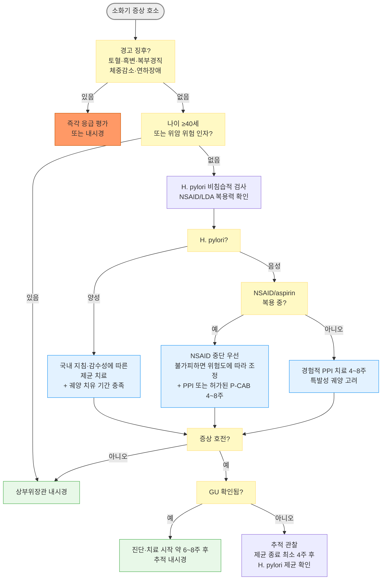
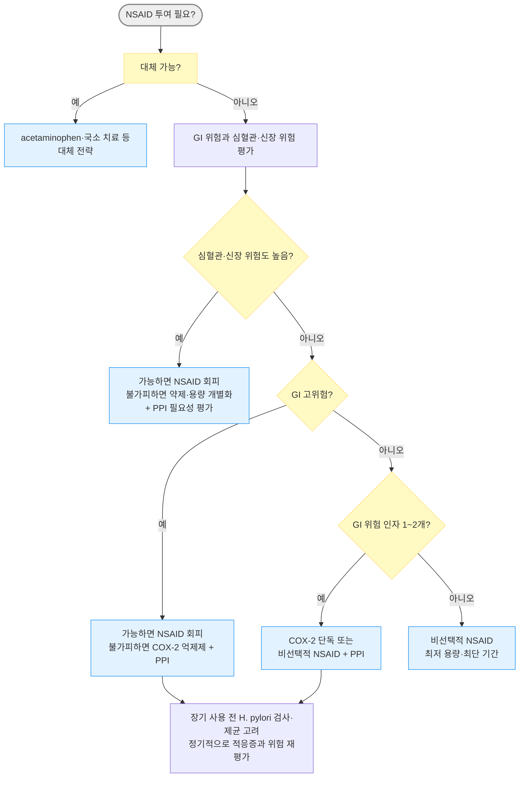

# 소화성 궤양 Peptic Ulcer, PUD

## <mark style="color:green;">일반 사항</mark>

* 위 또는 십이지장 점막의 결손이 점막근층(muscularis mucosae)을 넘어 침범한 병변; 내시경적으로 통상 직경 5 ㎜ 이상인 점막 결손을 궤양으로 정의
* 위궤양 (gastric ulcer, GU) : 55\~70세에 흔함; 위점막 방어기전 손상이 주된 기전
* 십이지장궤양 (duodenal ulcer, DU) : 30\~55세에 흔함; H. pylori 제균 치료 보급 이후 감소 추세
* 본 장의 소화성 궤양은 위궤양과 십이지장궤양을 대상으로 함; 식도궤양은 GERD·약제·감염 등 원인과 접근법이 달라 별도로 다룸
* refractory peptic ulcer : PPI 표준 용량으로 8\~12주 치료 후에도 내시경 소견이 호전되지 않는 경우; 빈도 5\~10%
* recurrent peptic ulcer : 완전한 내시경적 치유 이후 다시 발생

#### <mark style="color:$primary;">역학</mark>

* 미국 유병률 약 2%; 국내는 H. pylori 제균 치료 보급 및 위암 검진 인프라로 DU는 감소 추세, GU는 상대적으로 유지 (국내 유병률 정확한 통계는 부족하나 H. pylori 제균 이후 전반적 감소)
* NSAID 장기 사용자 중 매년 2\~5%에서 증상이 있는 궤양 합병증 발생; NSAID 사용자의 10\~30%에서 내시경적 GU, 2\~5%에서 DU 확인
* 경과 : 적절한 위산 억제 치료와 원인 교정으로 대부분 치유되며, H. pylori 제균 성공 시 재발과 재출혈 위험이 크게 감소
* 주요 합병증 : 출혈(선행 증상 없이 발생 가능), 천공·관통, 위 배출구 폐쇄
  * refractory/recurrent ulcer에서는 합병증 발생 가능성을 반드시 고려

## <mark style="color:green;">원인 및 위험 인자</mark>

#### <mark style="color:$primary;">병태생리</mark>

* 공격 인자 : 위산, 펩신, 담즙, 췌장액
* 방어 인자 : mucus, bicarbonate, 점막 혈류, prostaglandin, growth factor, cell turnover
* 위궤양 : 주로 방어 기전 손상; 위산 분비는 정상(감소한 경우도 있음)
* 십이지장궤양 : 위산 분비 증가(정상인 경우도 있음)와 중탄산염 분비 감소

#### <mark style="color:$primary;">주요 원인</mark>

* H. pylori 감염 : 소화성 궤양의 가장 중요한 원인 (DU의 70\~95%, GU의 60\~80%)
* NSAID/aspirin : H. pylori와 독립적이며 상가적 위험 인자
  * 비선택적 NSAID는 COX-1 억제로 prostaglandin 합성 감소 → 점막 방어력 저하
  * 국소(직접 점막 손상)와 전신(prostaglandin 억제) 두 가지 경로로 작용
  * 저용량 아스피린(LDA) 단독도 고령에서 의미 있는 PUD/출혈 위험 인자; 과거 궤양 병력 또는 항응고제 병용 시 위험 현저히 증가
* 특발성(idiopathic) 궤양 : H. pylori 음성 + NSAID 비사용 환자에서 발생; 전체 PUD 중 비율은 낮으나 임상적으로 중요하며 최근 증가 추세; 고령, 동반 질환, occult aspirin/NSAID 사용, 미세 허혈 등 관련 가능; 재발 및 출혈 위험이 상대적으로 높음

#### <mark style="color:$primary;">위험 인자</mark>

* 약물 : NSAID, aspirin(LDA 포함), steroid(NSAID 병용 시 위험 상승), 일부 경구 bisphosphonate·KCl 및 항암제 등; 실제 복용 약제와 OTC 진통제까지 확인
* 항응고제/항혈소판제 : warfarin, DOAC, clopidogrel 등은 궤양의 직접 원인이라기보다 기존 점막 병변의 출혈 위험과 중증도를 높임; 고위험군에서는 PPI 예방 병용 고려
* NSAID 관련 고위험 요소 : 과거 PUD/GI 출혈 병력, 고령(＞65세), 고용량 또는 복수 NSAID 복용, 스테로이드·anticoagulant 병용
* 흡연; 과음은 점막 손상과 증상을 악화시킬 수 있으나 H. pylori·NSAID와 같은 주된 궤양 원인은 아님
* 기타 : 만성 신부전, 간경변, COPD, 크론병, 방사선 치료, gastrinoma, 림프종

## <mark style="color:green;">임상 양상</mark>

* 흔히 자각 증상이 없음 - 특히 NSAID/LDA 복용 중 무증상 궤양이 흔함; 출혈이나 천공이 첫 증상으로 나타나는 경우도 있음
* 증상이 있는 경우 흔히 주기적으로 발생하며 수주 단위로 악화와 완화 반복
* 상복부 복통/불편감/작열감, 가슴쓰림, 산 역류, 조기 포만감, 트림, 구역, 구토
* 혈변, 검은 변 : 위장관 출혈의 증상; 선행 증상 없이 발생할 수 있음
* 일부에서 GU는 식후, DU는 공복·야간에 악화되고 음식이나 제산제로 호전되는 전형적 양상을 보일 수 있으나, 증상 양상만으로 궤양의 유무나 위치를 감별할 수 없음

### <mark style="color:$danger;">🚩 Red Flags!</mark>

　☞ [위장질환의 감별](074_.md#step-1-red-flags)

## <mark style="color:green;">진단</mark>

#### <mark style="color:$primary;">진찰</mark>

* 상복부 압통 : 비특이적; 고령의 ⅓에서는 잘 관찰되지 않음
* 합병증이 없는 PUD 환자는 대부분 비특이적 소견
* 모든 환자에서 NSAID/LDA 복용 이력 및 H. pylori 보균 여부를 확인

#### <mark style="color:$primary;">실험실 검사</mark>

* 현성 출혈 의심 : CBC, BUN/Cr, 전해질, 간기능, PT-INR, 혈액형 검사 및 type & screen/crossmatch; 대변 잠혈검사는 현성 출혈의 확인에 사용하지 않음
* 만성 잠재 출혈 또는 빈혈 : CBC, ferritin, Fe/TIBC, reticulocyte 등 철 결핍 평가
* 공복 혈청 gastrin : 다발성·재발성·불응성 궤양에서 gastrinoma(ZES) 의심 시 고려
  * PPI는 gastrin을 상승시키지만 ZES 의심 환자에서 임의 중단하면 심한 산 과다 합병증이 발생할 수 있음; 위내 pH 평가와 약제 조정은 소화기 전문의 감독 아래 시행

#### <mark style="color:$primary;">헬리코박터 검사</mark>

　☞ [헬리코박터](080_-helicobacter-pylori-infection.md)

* 대상 : 새롭게 진단된 PUD, 제균 여부가 확인되지 않은 PUD 과거력, 경험적 치료 후 지속되는 PUD 의심 증상
* 검사 방법 : 요소호기검사 (UBT, 비침습적, 1차 선택), 대변 항원 검사, 조직 검사 (CLO test + 조직)
* UBT·대변 항원검사 전 PPI/P-CAB은 2주, 항생제와 bismuth는 4주 이상 중단 권장; 필요 시 H2RA 또는 제산제로 일시 전환 가능
* 급성 출혈 중 조직 기반 검사는 위음성 가능성이 있으므로 초회 음성이면 출혈 안정 후 비침습적 검사로 재검

#### <mark style="color:$primary;">영상/내시경 검사</mark>

* 위장관 내시경 검사 : 진단 및 조직 검사, 출혈 병변 처치, 악성 여부 감별의 표준
* 위장관조영술 : 내시경 불가 시 대체 또는 보조적 역할

#### <mark style="color:$primary;">내시경 검사 대상</mark>

* Red Flags 해당
* 치료에 반응하지 않거나 재발
* 40세 이상에서 소화기 증상이 새로이 시작; 국제 가이드라인(55\~60세)과 달리 우리나라는 높은 위암 발생률과 국가검진 인프라를 고려해 40세 기준 적용 (☞ [위장질환의 감별](074_.md))


**우리나라 국가 위암 검진** : 남녀 모두 40세 이상에서 2년마다 위내시경 또는 위장조영검사 시행. 위축성 위염·장상피화생·위암 직계 가족력 등 고위험군의 내시경 간격은 국가검진 주기와 별도로 개별화\
※ 경고 징후 없는 40세 미만 연령의 PUD 의심 증상은 즉각적인 내시경 없이 외래에서 경험적 치료 가능


#### <mark style="color:$primary;">치료 후 내시경 추적 검사</mark>


**위궤양(GU)은 치유 확인 내시경이 원칙** : 위궤양은 위암과 내시경적으로 감별이 어려울 수 있으므로 국내 임상에서는 보수적으로 추적 내시경을 시행합니다. 통상 진단·치료 시작 후 약 6\~8주(치료 종료 무렵)에 내시경으로 치유 여부를 확인하고, 잔존 궤양·불완전 치유 또는 악성 의심 소견이 있으면 재생검합니다.

**십이지장궤양(DU)은** 악성 가능성이 희박하므로, 증상 호전 시 추적 내시경을 생략할 수 있습니다.


* 증상 지속
* GU : 통상 진단·치료 시작 후 약 6\~8주(치료 종료 무렵)에 추적 내시경 (치유 확인 + 악성 배제)
* DU : 합병증, 증상 지속, 위험 인자가 있는 경우에 추적 고려
* H. pylori 관련 PUD : 제균 치료 종료 최소 4주 후 UBT 또는 대변 항원검사로 제균 확인; 검사 전 PPI/P-CAB 2주 중단. 내시경 추적은 GU 원칙 적용
* 위암 병력, giant gastric ulcer (＞2 ㎝), 악성 의심, 위암 위험 인자
* 이전 내시경에서 조직 검사 미시행 또는 불충분
* 이전 검사가 출혈 응급 상황에서 시행됨

### <mark style="color:orange;">감별</mark>

* 상복부 증상은 PUD뿐 아니라 기능성 소화불량(FD), 위식도역류질환(GERD), 위암이 유사하게 나타날 수 있으며, overlap 형태로 동반되는 경우도 흔함

<table><thead><tr><th width="155">특징</th><th width="195">PUD</th><th width="185">기능성 소화불량 (FD)</th><th>위식도역류질환 (GERD)</th></tr></thead><tbody><tr><td>통증 양상</td><td>국소적 epigastric pain; 간헐적·주기적</td><td>모호한 불편감; 팽만·조기 포만감</td><td>흉골 하부 작열감(heartburn); 산 역류</td></tr><tr><td>식사 연관</td><td>GU 식후, DU 공복·야간 악화가 가능하나 감별력은 낮음</td><td>식사 관련 불편감·포만감</td><td>누운 자세, 야식, 과식 후 악화</td></tr><tr><td>야간 통증</td><td>DU에서 가능</td><td>가능</td><td>가능 (야간 역류)</td></tr><tr><td>제산제 반응</td><td>가변적</td><td>가변적</td><td>일시적 개선</td></tr><tr><td>출혈 위험</td><td>있음</td><td>없음</td><td>드묾 (식도염 동반 시)</td></tr><tr><td>내시경 소견</td><td>점막 결손(궤양)</td><td>정상 또는 비특이적</td><td>역류성 식도염, 미란</td></tr></tbody></table>


증상 양상과 제산제 반응은 진단을 확정하거나 GU와 DU를 구분하는 기준이 아닙니다. PUD 확진과 위암 감별에는 필요한 경우 상부위장관 내시경이 필요합니다.


***


```mermaid
graph TD
A([소화기 증상 호소]) --> B[경고 징후?<br/>토혈·흑변·복부경직<br/>체중감소·연하장애]
    B -- 있음 --> C[즉각 응급 평가<br/>또는 내시경]
    B -- 없음 --> D[나이 ≥40세<br/>또는 위암 위험 인자?]
    D -- 있음 ---> E[상부위장관 내시경]
    D -- 없음 --> F[H. pylori 비침습적 검사<br/>NSAID/LDA 복용력 확인]
    F --> G[H. pylori?]
    G -- 양성 --> H[국내 지침·감수성에 따른<br/>제균 치료<br/>+ 궤양 치유 기간 충족]
    G -- 음성 --> I[NSAID/aspirin<br/>복용 중?]
    I -- 예 --> J[NSAID 중단 우선<br/>불가피하면 위험도에 따라 조정<br/>+ PPI 또는 허가된 P-CAB 4~8주]
    I -- 아니오 --> K[경험적 PPI 치료 4~8주<br/>특발성 궤양 고려]
    H --> L[증상 호전?]
    J --> L
    K --> L
    L -- 아니오 --> E
    L -- 예 --> M[GU 확인됨?]
    M -- 예 --> N[진단·치료 시작 약 6~8주 후<br/>추적 내시경]
    M -- 아니오 --> O[추적 관찰<br/>제균 종료 최소 4주 후<br/>H. pylori 제균 확인]

style A fill:#eeeeee,stroke:#888888,stroke-width:2px
classDef yellow fill:#fff9c4,stroke:#ffe082
class B,D,G,I,L,M yellow
style C fill:#ff9966,stroke:#cc5500
classDef sky fill:#e3f2ff,stroke:#2196f3
class H,J,K sky
classDef lightGreen fill:#e8f8e8,stroke:#4caf50
class E,N lightGreen
```

<p align="center"><strong>소화성 궤양 진단 및 치료 알고리듬</strong></p>

***

## <mark style="background-color:$warning;">Management</mark>

### <mark style="color:orange;">치료 방침</mark>

* **치료 원칙** :&#x20;
  1. 공격 인자 제거 (NSAID 중단, 금연, 절주)
  2. H. pylori 제균
  3. 위산 분비 억제로 점막 치유
  4. 합병증 예방
* 금연과 과음 회피; 특정 음식은 궤양의 원인이 아니므로 증상을 유발하는 경우에만 제한
* NSAID는 가능하면 중단하고, 불가피하면 GI·심혈관·신장 위험을 평가하여 최저 유효 용량, COX-2 억제제 및 위장관 보호 전략을 개별화
* aspirin·항혈소판제·항응고제는 적응증과 혈전 위험을 확인한 뒤 조정하며 임의로 중단하지 않음
* H. pylori 양성 시 제균 치료 (☞ [헬리코박터](080_-helicobacter-pylori-infection.md))
* 약물 치료 : PPI가 표준 1차 선택이며, 국내 PUD 적응증이 허가된 P-CAB은 성분별 허가 범위에서 선택 가능. 제산제와 점막 보호제는 증상 완화 또는 보조 치료
* 치료 기간 : GU 8주, DU 4\~6주; NSAID 복용 지속 또는 H. pylori (+) 환자는 별도 일정


**출혈성 PUD 의심 시 즉각 조치**

1. 활력 징후 확인 및 모니터링
2. CBC / BUN / Cr / PT-INR / type & screen
3. 항혈전제·항응고제 복용 여부 확인
4. NPO + 정맥로 2개 확보
5. 혈역학적 불안정 시 결정질 수액으로 신속히 소생; Glasgow-Blatchford score로 위험도 평가. 안정된 비대량 출혈에서는 일반적으로 Hb ≤7 g/dL을 수혈 기준으로 고려하되 심혈관질환·활동성 허혈·지속 출혈에서는 개별화
6. 내시경 전 고용량 IV PPI를 고려할 수 있으나 내시경을 지연해서는 안 됨
7. 소생술 후 원칙적으로 내원 24시간 이내 상부위장관 내시경 및 필요 시 내시경 지혈
8. 내시경 지혈을 시행한 고위험 병변 또는 내시경 처치하지 않은 부착 혈괴(Forrest IIb)는 고용량 PPI를 72시간 지속 또는 간헐 정주 후 경구 PPI로 전환
9. 이차 심혈관 예방 목적 aspirin은 가능한 중단하지 않으며, 중단했다면 내시경적 지혈 확인 후 조기 재개. 다른 항혈전제·항응고제는 출혈 위험과 혈전 위험을 함께 평가하여 재개 시점 결정
10. 출혈 당시 H. pylori 검사가 음성이면 안정 후 재검하고, 양성이면 제균 후 성공 여부 확인


## <mark style="color:green;">비-약물 치료 및 예방</mark>

* 금연 : 흡연은 위점막 혈류를 감소시키고 prostaglandin 합성 억제 → 치유 지연, 재발 위험 증가
* 절주 : 과음은 위점막을 손상시키고 증상을 악화시킬 수 있으므로 피함
* 식이 : 특별한 궤양식은 필요하지 않음. 자극적 음식·커피·탄산음료 등은 개인별로 증상을 유발하면 줄이되 궤양의 직접적 원인은 아님
* 스트레스 관리 : 일상적 심리 스트레스는 PUD의 주된 원인이 아님. 중환자의 생리적 스트레스에 의한 stress-related mucosal disease와 구분
* NSAID/aspirin 관리 : 가능한 한 최소 기간·최소 용량 사용; 불필요한 병용 회피
  * NSAID 식사 후 복용은 위 불편감(dyspepsia) 감소에 도움이 될 수 있으나 궤양 예방 효과는 없음. 고위험군은 PPI 등 근거와 허가가 확인된 예방 약제를 병용
  * 무증상 NSAID 복용자도 고위험 인자 있는 경우 예방적 약제 병용 필요 (☞ 아래 NSAID 관련 PUD 예방)

## <mark style="color:green;">약물 치료</mark>

#### <mark style="color:$primary;">Proton Pump Inhibitor (</mark>[PPI](073_.md#proton-pump-inhibitor-ppi)<mark style="color:$primary;">)</mark>

* PUD 치료의 표준 1차 위산 억제제
* 용법 : 보통 아침 식전 30분 복용; bid 처방 시 아침·저녁 식사 전 복용
* 부작용 : 두통, 복통, 설사·변비 등. 장기 투여 시 일부 환자에서 저마그네슘혈증, Vit B12·철 결핍, 장관 감염 위험 등을 고려하되 폐렴·골절·신장질환 등 다수의 연관성은 주로 관찰연구에서 보고되어 인과성이 확립되지 않음

<table><thead><tr><th width="180">약물</th><th width="200">통상 성인 용량</th><th>상품명</th></tr></thead><tbody><tr><td>omeprazole</td><td>20 ㎎ qd</td><td><mark style="color:blue;">[오엠피]</mark></td></tr><tr><td>esomeprazole</td><td>20~40 ㎎ qd</td><td><mark style="color:blue;">[넥시움]</mark></td></tr><tr><td>lansoprazole</td><td>GU 30 ㎎ qd; DU 15~30 ㎎ qd</td><td><mark style="color:blue;">[란스톤]</mark></td></tr><tr><td>pantoprazole</td><td>40 ㎎ qd</td><td><mark style="color:blue;">[판토록]</mark></td></tr><tr><td>rabeprazole</td><td>10~20 ㎎ qd</td><td><mark style="color:blue;">[파리에트]</mark></td></tr><tr><td>ilaprazole</td><td>10 ㎎ qd</td><td><mark style="color:blue;">[놀텍]</mark></td></tr></tbody></table>

* GU는 통상 8주, DU는 4\~6주 치료하되 성분·제품별 국내 허가 용량과 기간을 확인
* dexlansoprazole은 국내 PUD 치료 적응증이 없어 표에서 제외


**PPI 치료 실패의 흔한 원인**

* 복약 타이밍 오류 - 대부분의 PPI는 식사 전 복용 시 산 억제 효과가 가장 좋음
* 복약 순응도 불량 (증상 호전 시 임의 중단)
* NSAID/aspirin 지속 복용
* H. pylori 미제균 또는 재감염
* Nocturnal acid breakthrough (야간 산 분비 돌파)
* CYP2C19 빠른 대사형(extensive/rapid metabolizer) - 일부 PPI는 CYP2C19에 의해 빠르게 대사되어 산 억제 효과가 낮아질 수 있음; P-CAB 전환 또는 용량 증가 고려
* 기능성 소화불량(FD) overlap - 산 억제만으로 해결 불가한 비산성 증상



**PPI ↔ Clopidogrel 상호작용**

Clopidogrel 복용 환자에서 omeprazole·esomeprazole은 CYP2C19 억제로 clopidogrel 활성화를 저하시킬 우려가 있어 가능하면 피하고, **pantoprazole** <mark style="color:blue;">\[판토록]</mark> 등 상호작용 가능성이 상대적으로 낮은 PPI를 우선 고려합니다. P-CAB도 성분별 대사·상호작용 특성이 다르므로 계열 전체를 안전한 대안으로 간주하지 말고 개별 허가사항과 상호작용 자료를 확인합니다.


#### <mark style="color:$primary;">Potassium-Competitive Acid Blocker (</mark>[P-CAB](073_.md#potassium-competitive-acid-blocker-p-cab)<mark style="color:$primary;">)</mark>

* PPI와 달리 산성 환경 활성화가 필요 없이 양성자 펌프를 직접·가역적으로 억제 → 빠른 산 분비 억제 개시, 식사와 무관 복용 가능, 야간 산 분비 억제 우수
* CYP2C19 유전다형성이 산 억제 효과에 미치는 영향이 상대적으로 적음. 다만 clopidogrel과의 상호작용은 P-CAB 성분별로 다르므로 개별 확인
* 허가된 적응증에서는 PUD 치유 또는 예방 효과가 PPI와 유사한 자료가 있으나 제품별 적응증이 다르고 장기·계열별 안전성 자료는 PPI보다 제한적

<table><thead><tr><th width="199.33331298828125">약물</th><th>국내 허가 용량 및 PUD 관련 적응증</th></tr></thead><tbody><tr><td>tegoprazan <mark style="color:blue;">[케이캡]</mark></td><td>50 ㎎ qd ×8주: 위궤양; H. pylori 제균 병용 시 50 ㎎ bid ×7일 허가; 식사 무관</td></tr><tr><td>vonoprazan <mark style="color:blue;">[보신티]</mark></td><td>20 ㎎ qd: 위궤양; 10 ㎎ qd: NSAID 투여 시 위·십이지장궤양 재발 방지; 식사 무관. 유통·급여와 세부 허가사항 확인</td></tr><tr><td>fexuprazan <mark style="color:blue;">[펙수클루]</mark></td><td>20 ㎎ qd: NSAID 유도성 위·십이지장궤양 예방; 2025년 12월부터 보험 급여 적용. 40 ㎎은 미란성 GERD 치료 용량이며 활동성 PUD 치료 적응증은 아님; 식사 무관</td></tr><tr><td>revaprazan <mark style="color:blue;">[레바넥스]</mark></td><td>200 ㎎ qd ×4주: 십이지장궤양; 급·만성 위염의 위점막 병변 개선에도 허가</td></tr></tbody></table>

* tegoprazan은 위궤양(GU) 치료 및 H. pylori 제균 병용요법 허가; DU 단독 허가는 없으나 임상적으로 사용됨 - 보험 주의
* vonoprazan을 H. pylori 제균요법에 사용하려면 국내 제균 적응증과 허가 용법을 별도로 확인하며, 해외 요법을 국내에서 자동 적용하지 않음
* fexuprazan 20 ㎎은 2025년 12월부터 NSAID 유도성 소화성궤양 예방에 보험 급여 적용.

#### <mark style="color:$primary;">H2 Receptor Antagonist (</mark>[H2RA](073_.md#h2-h2-receptor-antagonist-h2ra)<mark style="color:$primary;">)</mark>

* 표준 용량에서 24시간 위산 분비의 ＜65% 억제; PPI 대비 효과 발현 및 치유율 낮음
* 6주(DU)\~8주(GU) 투여로 치유율 85\~90%
* 적용 시기 : PPI 투여가 곤란한 경우 또는 증상 경감 보조 목적. PPI 반응 부족 시에는 우선 복약 순응도·원인 지속·악성 가능성을 재평가

<table><thead><tr><th width="180">약물</th><th width="220">용량</th><th>상품명</th></tr></thead><tbody><tr><td>cimetidine</td><td>400 ㎎ bid 또는 800 ㎎ hs</td><td><mark style="color:blue;">[에취투비]</mark></td></tr><tr><td>famotidine</td><td>20 ㎎ bid 또는 40 ㎎ hs</td><td><mark style="color:blue;">[가스터]</mark></td></tr></tbody></table>

#### [제산제](073_.md#antacid) <mark style="color:$primary;">및 점막 보호제</mark>

* 제산제 단독으로는 치료 효과 부족; 증상 완화 또는 PPI 치료 초기 병용 목적
* sucralfate : 점막 보호 효과; NSAID 관련 PUD 예방에서 유효성 입증 불충분
* teprenone <mark style="color:blue;">\[셀벡스]</mark>, rebamipide <mark style="color:blue;">\[레바미피드]</mark> : 점막 방어 인자 강화; 보조적 병용

### <mark style="color:orange;">NSAID 연관 PUD 예방</mark>

* 원칙 : NSAID 사용 자체를 피하고 acetaminophen 등 대체제 사용을 우선 고려
* NSAID 필수 투여 시 : 위험도에 따라 예방 전략 선택

<table><thead><tr><th width="118.88885498046875">GI 위험도</th><th width="294.4444580078125">주요 위험 요소</th><th>심혈관 위험이 낮을 때의 권장 전략</th></tr></thead><tbody><tr><td>저위험</td><td>위험 인자 없음 (&#x3C;65세, 과거 궤양 없음)</td><td>비선택적 NSAID를 최저 유효 용량·최단 기간 사용</td></tr><tr><td>중등 위험</td><td>위험 인자 1~2개</td><td>COX-2 억제제 단독 또는 비선택적 NSAID + PPI</td></tr><tr><td>고위험</td><td>과거 궤양 합병증·GI 출혈 또는 위험 인자 다수</td><td>가능하면 NSAID 회피; 불가피하면 COX-2 억제제 + PPI</td></tr></tbody></table>

* 심혈관 위험이 높으면 NSAID를 가능한 한 피함. 불가피한 경우 약제 선택과 용량은 심혈관·신장 위험 및 aspirin 병용 여부를 함께 고려하고 PPI 필요성을 평가
* GI 위험과 심혈관 위험이 모두 매우 높으면 NSAID 회피가 원칙
* P-CAB은 제품별 PUD 예방 적응증이 다르므로 허가된 성분·용량에 한해 선택


**Aspirin 병용 시 COX-2 억제제의 GI 보호 이점은 감소합니다.** Aspirin + NSAID 병용 환자는 출혈 고위험군으로 평가하고, NSAID 필요성을 재검토하며 사용 시 PPI를 병용합니다.

**DOAC(rivaroxaban, dabigatran 등) 복용 중 NSAID 병용**은 상부위장관 출혈 위험을 유의미하게 증가시킴 - 불가피한 경우 PPI 예방 병용 및 면밀한 모니터링.



```mermaid
graph TD
A([NSAID 투여 필요?]) --> B[대체 가능?]
    B -- 예 --> C[acetaminophen·국소 치료 등<br/>대체 전략]
    B -- 아니오 --> D[GI 위험과 심혈관·신장 위험 평가]
    D --> E{심혈관·신장 위험도 높음?}
    E -- 예 --> G[가능하면 NSAID 회피<br/>불가피하면 약제·용량 개별화<br/>+ PPI 필요성 평가]
    E -- 아니오 --> F{GI 고위험?}
    F -- 예 --> H[가능하면 NSAID 회피<br/>불가피하면 COX-2 억제제 + PPI]
    F -- 아니오 --> I{GI 위험 인자 1~2개?}
    I -- 예 --> J[COX-2 단독 또는<br/>비선택적 NSAID + PPI]
    I -- 아니오 --> K[비선택적 NSAID<br/>최저 용량·최단 기간]
    H --> L[장기 사용 전 H. pylori 검사·제균 고려<br/>정기적으로 적응증과 위험 재평가]
    J --> L

style A fill:#eeeeee,stroke:#888888,stroke-width:2px
classDef yellow fill:#fff9c4,stroke:#ffe082
class B,E,F,I yellow
classDef sky fill:#e3f2ff,stroke:#2196f3
class C,G,H,J,K sky
```

<p align="center"><strong>NSAID 관련 소화성 궤양 예방 전략</strong></p>

**예방 약제**

* PPI (선호) : 표준 용량; 또는 H2RA 통상 용량의 2배. 신기능에 따라 H2RA 감량
* vonoprazan 10 ㎎ : NSAID 투여 시 위·십이지장궤양 재발 방지 허가
* fexuprazan 20 ㎎ : 2025년 12월부터 NSAID 유도성 PUD 예방 보험 급여 적용
* misoprostol (합성 prostaglandin E1 analog) : 200 ㎍ qid, 음식과 함께 복용 <mark style="color:blue;">\[싸이토텍]</mark>; 설사·복통 부작용으로 순응도 낮음; 임신부 금기 (자궁 수축 유발 위험)

### [<mark style="color:orange;">헬리코박터 제균</mark>](080_-helicobacter-pylori-infection.md)

* 대상 : PUD가 있는 H. pylori 양성 환자 - 제균은 재발 방지의 핵심
* 제균요법과 기간은 국내 지침, 과거 항생제 노출, penicillin 알레르기 및 clarithromycin 감수성 검사 가능 여부에 따라 선택
  * 감수성 검사 가능 시 : 감수성 기반 맞춤형 치료 우선
  * 국내 지침의 주요 경험적 선택지 : 14일 표준 3제, 10일 동시 4제 또는 순차 요법 등. Clarithromycin 내성 가능성이 높으면 경험적 clarithromycin 3제의 제균율이 낮아질 수 있으므로 다른 권고 요법 고려
  * ACG 2024는 감수성 미확인 환자에서 14일 optimized bismuth 4제 요법을 우선하고, clarithromycin 감수성이 확인되지 않은 3제 요법은 피하도록 권고함. 국내 허가·보험 및 국내 지침과 구분하여 적용
* 제균 확인 : 치료 종료 최소 4주 후 UBT 또는 대변 항원검사. 검사 전 PPI/P-CAB 2주, 항생제·bismuth 4주 이상 중단

### <mark style="color:orange;">불응 및 궤양 재발</mark>

* NSAID/LDA 등 약물 복용 지속 여부 및 금연 여부 재확인
* 다른 원인 배제 : gastrinoma(ZES), 악성 종양, 크론병
* H. pylori 재검사 : 양성 시 제균 치료 및 확인; 음성 시 위음성 가능성 고려 (PPI 복용 중 UBT 위음성 증가)
* 추가 치료 : 원인과 복약 순응도를 재평가하고 GU는 재생검으로 악성을 배제. 필요 시 PPI를 bid로 증량하여 6\~8주 추가 치료하고, 원인 제거가 불가능한 재발성 궤양은 최소 유효 용량 유지 치료 고려
* Refractory ulcer 감별 체크 리스트
  * NSAID/aspirin 지속 복용 여부 (occult 사용 포함 재확인)
  * 복약 순응도 문제 (PPI 타이밍 오류 포함)
  * H. pylori 위음성 가능성 (재검 또는 검사 방법 변경)
  * 흡연 지속
  * Giant ulcer (＞2 ㎝) 또는 복합 궤양
  * Gastric malignancy (GU는 반드시 조직 검사 확인)
  * Zollinger-Ellison syndrome (gastrinoma)
  * Crohn disease
  * CMV ulcer (면역 저하 환자에서 고려)
  * 기타 약제 (bisphosphonate, KCl, chemotherapy)

***

### <mark style="color:red;">질병코드</mark>

K25 위궤양

K26 십이지장궤양

K27 상세불명 부위의 소화성 궤양

K28 위공장궤양

* 출혈·천공 동반 여부와 급성·만성 여부에 따라 K25\~K28의 세부 코드(.0\~.9)를 선택

***

## <mark style="color:purple;">처방례</mark>

> **처방례 1. 십이지장궤양 (경증, H. pylori 음성 또는 제균 완료 후)**
>
> ```
> 란스톤 30 ㎎/C    1C  qd  (아침 식전)          #28
> 알마겔 현탁액       1P  tid~qid  식후 및 취침 시  필요시
> ```
>
> _✽lansoprazole 30 ㎎ 4\~6주 투여; 제산제는 초기 증상 조절을 위한 보조 병용. H. pylori 양성이면 국내 지침과 감수성·항생제 노출력에 따라 선택한 제균요법 병행._

> **처방례 2. 위궤양 (표준 치료)**
>
> ```
> 넥시움 40 ㎎/T     1T  qd  (아침 식전)          #56
> ```
>
> _✽esomeprazole 40 ㎎ 8주 투여; 4주 후 증상 호전 여부 재평가. 통상 진단·치료 시작 후 약 6\~8주(치료 종료 무렵)에 추적 내시경으로 치유와 악성 가능성을 확인. H. pylori 검사 필수._

> **처방례 3. 위궤양 (P-CAB 선택; 복약 편의 또는 야간 증상·PPI 불량 반응)**
>
> ```
> 케이캡 50 ㎎/T     1T  qd  (식사 무관)           #56
> ```
>
> _✽tegoprazan 50 ㎎ qd 8주는 위궤양 허가 용법; 식전 복용이 어렵거나 PPI 반응이 불충분한 환자 등에서 고려. Clopidogrel 병용 시에는 P-CAB을 계열 전체의 안전한 대안으로 간주하지 말고 성분별 상호작용 확인. 보험 기준 확인. 추적 내시경 필요._

> **처방례 4. NSAID 복용 지속 중인 위궤양 (COX-2 + PPI 병용)**
>
> ```
> 세레브렉스 100 ㎎/C   1C  bid  pc               #56
> 넥시움 20 ㎎/T        1T  qd   (아침 식전)       #56
> ```
>
> _✽활동성 위궤양에서는 NSAID 중단이 우선. 불가피하게 지속할 때는 기저 질환의 유효 용량 범위에서 최저 용량의 COX-2 억제제 + PPI를 고려. Aspirin·DOAC 병용 시 출혈 위험이 높고 COX-2의 GI 이점이 감소하므로 NSAID 필요성을 다시 평가하고 PPI 유지._

> **처방례 5. NSAID 복용이 불가피한 환자의 PUD 예방 (허가된 P-CAB 병용)**
>
> ```
> 나프록센 250 ㎎/T      1T  bid  pc               #28
> 펙수클루 20 ㎎/T       1T  qd   (식사 무관)      #28
> ```
>
> _✽Fexuprazan 20 ㎎은 NSAID 유도성 위·십이지장궤양 예방 허가 및 2025년 12월부터 보험 급여 적용. NSAID는 적응증에 맞는 최저 유효 용량·최단 기간으로 사용하며, 심혈관·신장 위험과 aspirin·항응고제 병용 여부를 먼저 평가._

> **처방례 6. H. pylori 제균 요법 - Tegoprazan 기반 3제 (국내 허가 용법)**
>
> ```
> 케이캡 50 ㎎/T             1T  bid  (식사 무관)       7일
> 아목시실린 500 ㎎/T         2T  bid  (식후)            7일
> 클래리트로마이신 500 ㎎/T   1T  bid  (식후)            7일
> ```
>
> _✽Tegoprazan 50 ㎎ bid 기반 3제 요법의 국내 허가 기간은 7일. 국내 연구에서는 14일 요법의 제균율이 더 높았으나 현 허가 용법과 구분해야 함. Clarithromycin 감수성이 확인되지 않았거나 macrolide 노출력이 있으면 경험적 3제 요법보다 국내 지침의 다른 1차 요법을 우선 고려. 제균 후 산 억제제는 GU·합병성 궤양 등에서 총 치유 기간을 충족하도록 투여하고, 제균 종료 최소 4주 후 성공 여부를 확인._

***

### <mark style="color:$success;">핵심 복약 지도</mark>

> **PPI/P-CAB (위산 분비 억제제)는 어떻게 복용해야 하나요?**
>
> * 대부분의 PPI (예: 넥시움, 란스톤, 판토록)는 **아침 식사 30분 전**에 복용하면 효과가 가장 좋습니다. 하루 2회 처방된 경우에는 아침·저녁 식사 전에 복용합니다.
> * P-CAB (예: 케이캡, 보신티, 펙수클루)는 식사와 무관하게 복용할 수 있습니다.
> * **의사가 정한 치료 기간(위궤양 8주, 십이지장궤양 4\~6주)을 반드시 완료**해야 합니다. 증상이 사라져도 임의로 중단하지 마세요 - 점막이 아물고 있는 과정이 남아 있습니다.
> * 갑자기 중단하면 반동성 산 과다분비로 증상이 일시적으로 악화될 수 있습니다.

> **헬리코박터 제균 치료 시 주의사항**
>
> * 제균약(항생제 + 위산 억제제 조합)은 처방된 기간(요법에 따라 7\~14일) 동안 규칙적으로 복용해야 합니다. 임의로 중단하면 치료에 실패하고 다음 치료가 어려워질 수 있습니다.
> * 메트로니다졸 성분 포함 시 **치료 기간 중 절대 금주** (심한 오심·구토 반응).
> * 복용 중 설사, 복통, 발진 등이 심하면 즉시 연락하세요.
> * 치료 종료 후 최소 4주가 지나면 균이 없어졌는지 확인 검사를 받아야 합니다. 정확한 검사를 위해 위산 억제제는 검사 전 2주간 중단해야 하므로 중단 시점은 의사의 지시에 따르세요.

> **위궤양 치료 중인 환자에게 - 추적 내시경 안내**
>
> * 위궤양은 치료 후 반드시 **내시경 추적 검사**를 받아야 합니다. 증상이 없어졌다고 완치된 것이 아니며, 드물게 위암과 구별이 필요한 경우가 있습니다.
> * 보통 처음 진단하여 치료를 시작한 날로부터 약 **6\~8주 후(치료 종료 무렵)**에 내시경을 다시 시행합니다. 일정을 반드시 지켜주세요.
> * 십이지장궤양은 증상이 없어지면 추적 내시경이 필수는 아닙니다.

> **NSAID 복용 중인 환자에게**
>
> * 소염진통제(이부프로펜, 나프록센, 디클로페낙 등)는 속이 쓰리지 않아도 위 점막을 손상시킬 수 있습니다.
> * 식사 후 복용하면 위 불편감이 다소 줄어들 수 있으나, **궤양 자체를 예방하지는 못합니다**. 위 보호 약(PPI 또는 P-CAB)이 함께 처방된 경우 반드시 같이 복용해야 궤양과 출혈을 예방할 수 있습니다.
> * 아스피린, 항혈소판제, 혈액희석제(항응고제), 스테로이드를 함께 드시는 경우 반드시 의사에게 알려주세요 - 위장관 출혈 위험이 현저히 높아집니다.

> **언제 다시 병원을 방문해야 하나요?**
>
> * **검은 변(흑색변), 피가 섞인 토사물** → 즉시 응급실
> * **갑자기 심해지는 복통, 복부 경직** → 즉시 응급실 (천공 가능성)
> * **어지럼증·실신·빠른 맥박** 동반 → 즉시 응급실
> * 4\~8주 치료에도 증상이 지속되거나 다시 나빠지는 경우 - 내원
> * 위궤양 치료 완료 후 추적 내시경 일정 준수; 헬리코박터 제균 확인 검사 일정 준수

***

### <mark style="color:blue;">환자 안내서</mark>


**소화성 궤양, 제대로 알고 치료하면 완치할 수 있습니다**

소화성 궤양은 위나 십이지장의 점막이 파여 생기는 상처입니다. 헬리코박터균 감염이나 소염진통제 복용이 주된 원인이며, 약물 치료와 생활 습관 교정으로 충분히 나을 수 있습니다. 단, 치료 기간을 끝까지 완료하는 것이 중요합니다.


#### <mark style="color:$primary;">소화성 궤양은 왜 생기나요?</mark>

* 위 속에는 위산이 분비되는데, 보통 점막이 위산으로부터 자신을 보호합니다. 이 보호막이 손상되거나 위산이 지나치게 많이 분비되면 점막에 상처(궤양)가 생깁니다.
* **헬리코박터 파일로리균**은 위 점막에 살면서 보호막을 약하게 만드는 세균으로, 소화성 궤양의 가장 흔한 원인입니다. 제균 치료에 성공하면 재발률이 크게 줄어듭니다.
* **소염진통제(아스피린, 이부프로펜 등)**는 위 점막 보호 물질을 억제해 궤양을 유발할 수 있습니다. 증상이 없어도 점막이 손상되어 있을 수 있으므로 주의가 필요합니다.

#### <mark style="color:$primary;">어떤 증상이 나타나나요?</mark>

* 가장 흔한 증상은 **명치 부근의 쓰린 통증, 속쓰림**입니다.
* 일부 환자는 위궤양이 식후, 십이지장궤양이 공복이나 야간에 더 아플 수 있지만, 증상만으로 궤양의 위치나 유무를 판단할 수는 없습니다.
* **증상이 전혀 없는 경우도 많습니다.** 특히 소염진통제를 드시는 분들은 정기적으로 약의 필요성과 궤양·출혈 위험, 위 보호제 필요 여부를 의사와 함께 평가해야 합니다.

#### <mark style="color:$primary;">일상생활에서 어떻게 관리하나요?</mark>

* **금연** : 담배는 궤양 치유를 늦추고 재발 위험을 높일 수 있으므로 금연하세요.
* **절주** : 알코올은 위 점막을 직접 자극합니다. 특히 공복 음주는 삼가야 합니다.
* **식사** : 특별한 궤양식은 필요하지 않습니다. 맵고 자극적인 음식이나 커피·탄산음료는 일부 분들에게 증상을 악화시킬 수 있으므로 본인에게 불편감을 유발할 때만 줄이세요. 이러한 음식이 궤양의 직접적인 원인은 아닙니다.
* **소염진통제** : 소염진통제(이부프로펜 등)는 위 점막을 손상시킬 수 있습니다. 반드시 **의사와 상의하여 복용 여부를 결정**하고, 처방된 경우 최저 용량으로 필요한 기간만 복용하세요. 식후 복용은 속 불편감을 줄일 수 있지만 궤양을 예방하지 못하며, 고위험군은 처방된 위 보호제를 함께 복용해야 합니다.
* **스트레스 관리** : 일상적 심리 스트레스가 소화성 궤양의 주된 원인은 아니지만 증상을 악화시킬 수 있으므로 충분한 수면과 휴식을 취하세요.

#### <mark style="color:$primary;">약은 얼마나 먹어야 하나요?</mark>

* 위궤양은 **8주**, 십이지장궤양은 **4\~6주** 동안 위산 억제제를 복용해야 합니다. 증상이 없어진다고 중간에 끊으면 속에서 아물지 않아 재발할 수 있습니다.
* **헬리코박터균이 있다면 처방된 기간(요법에 따라 7\~14일) 동안 제균 치료**가 필요합니다. 치료 종료 최소 4주 후 균이 없어졌는지 확인하고, 검사 전 위산 억제제 중단 시점은 의사의 지시에 따르세요.
* **위궤양은 치료 후 내시경 추적 검사**를 받아야 합니다. 증상이 없어도 치유 여부를 확인해야 하며, 의사가 지정한 일정(보통 진단·치료 시작 후 약 6\~8주)을 꼭 지켜주세요.

#### <mark style="color:$primary;">이럴 때는 즉시 병원을 방문하세요</mark>

* **검은 변(흑변·타르 같은 변), 피를 토하는 경우** → 위장관 출혈로 응급 상황입니다
* **갑자기 심해지는 심한 복통, 배가 딱딱해지는 느낌** → 즉시 응급실로
* **어지럽고 식은땀이 나며 맥박이 빨라지는 경우** → 즉시 응급실로
* 치료 중임에도 증상이 4주 이상 지속되거나 오히려 악화되는 경우 → 내원
