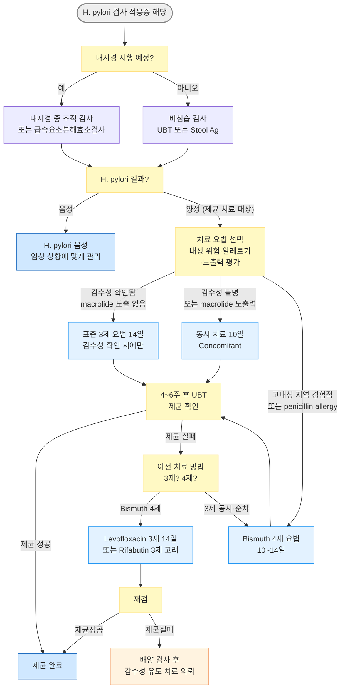

# 헬리코박터 감염 Helicobacter Pylori Infection

## <mark style="color:green;">일반 사항</mark>

* **정의** : 그람음성 나선형 세균인 _Helicobacter pylori_ (_H. pylori_)가 위 점막에 만성 감염을 일으키는 상태; 치료 없이는 감염 후 수십 년간 지속되는 만성 감염 상태를 형성함
* **유병률** : 전 인류의 약 50% 감염 추정; 한국 성인의 약 50\~60% (2020년대 기준 감소 추세)
* **전파 경로** : 주로 분변-경구 경로(contaminated water/food); 구강-경구 경로 가능성도 있음; 가족 내 전파가 가능하여 위암·소화성 궤양 환자의 1차 친족에서 높은 감염률을 보임
* **경과** : 감염자의 대다수(약 80\~85%)는 무증상이며 임상적 문제를 일으키지 않으나, 일부에서 소화성 궤양·위 MALT 림프종·위암의 위험 인자로 작용
* **제균 치료 효과** :
  * 소화성 궤양 및 위 MALT 림프종의 예후를 명확히 개선
  * **위암 예방 효과** : 2022년 이후 대규모 코호트 연구(한국 포함) 및 메타분석에서 제균 치료 시 위암 발생 위험 약 40\~60% 감소; 위암 절제 후 이시성 재발도 감소. Maastricht VI (2022) 및 ACG (2022) 가이드라인은 _H. pylori_ 감염 자체를 제균 치료 적응증으로 명시


**H. pylori → 위암 발암 경로 (Correa Cascade)**

_H. pylori_ 감염은 수십 년에 걸친 단계적 발암 경로를 통해 위암을 유발한다. **조기에 제균할수록 cascade 차단 효과가 크다.**

```
H. pylori 감염
   → 만성 활동성 위염 (chronic active gastritis)
      → 위 점막 위축 (atrophic gastritis)
         → 장상피화생 (intestinal metaplasia)
            → 이형성증 (dysplasia)
               → 위선암 (gastric adenocarcinoma)
```

위축성 위염 이전 단계에서 제균하면 암 예방 효과가 최대화된다. 위암 고위험 군(위암 가족력, 위 선종 절제 후 등)에서 조기 제균이 특히 중요.



**한국의 Clarithromycin 내성 상황 (임상 주의)**

국내 _H. pylori_ clarithromycin 내성률은 2020년대 기준 약 20\~30%로 증가 추세이며(일부 지역 30% 이상 보고), Maastricht VI (2022)에서 내성률 >15% 지역을 '고내성 지역'으로 분류합니다. 한국은 고내성 지역에 해당하므로, 내성 검사 없이 clarithromycin 포함 표준 3제 요법을 경험적으로 1차 선택하는 것은 더 이상 권장되지 않습니다. Bismuth 4제 요법 또는 동시 치료(concomitant therapy)를 우선 고려하는 방향으로 패러다임이 전환되고 있습니다.


***

## <mark style="color:green;">임상 양상</mark>

* **무증상** : 감염자의 약 80\~85%; 우연히 내시경 검사나 다른 검사 중 발견
* **비궤양성 소화불량 증상** : 명치 통증 또는 불쾌감, 팽만감, 구역, 조기 포만감
* **소화성 궤양 동반 시** :
  * 공복 또는 야간에 심해지는 명치 통증
  * 식후 통증 악화 (위궤양) 또는 완화 (십이지장궤양)
  * 구역, 구토, 흑변(melena), 토혈 등 합병증 시 긴급 평가 필요
* **MALT 림프종 동반 시** : 비특이적 상복부 불편감, 체중 감소, 피로감 등; 대부분 조기에 무증상

### <mark style="color:$danger;">🚩 Red Flags!</mark>

　☞ [위장질환의 감별](074_.md#step-1-red-flags)

## <mark style="color:green;">진단</mark>

### <mark style="color:orange;">검사 적응증</mark>

**검사 및 치료의 이익이 명확한 경우 (적극 권고)**

* 활동성 소화성 궤양
* 과거 소화성 궤양 병력 (제균 치료 받은 적 없는 경우)
* 위 MALT 림프종
* 조기 위암 내시경 절제 후 (이시성 재발 예방)
* 만 60세 미만의 경고 증상 없는 소화불량 환자 (비침습 검사 우선)
* 저용량 aspirin 장기 투여 중인 환자
* NSAID 장기 투여를 새로 시작하는 환자
* 원인 불명 철결핍빈혈, 특발성 혈소판감소성 자반(ITP)
* 위암 가족력이 있는 환자 (1차 친족) - 가족 구성원 screening 고려

**추가 적응증 (권고 강도 약함)**

* 위암 고위험 지역 거주 (한국 포함) - 만성 위염 환자에서도 제균 고려 (Maastricht VI, 2022)
* 기능성 소화불량증
* 양성 위선종 내시경 절제 후

**검사 제외 또는 이익 불분명한 경우**

* 소화성 궤양 병력 없는 전형적인 GERD
* 미란성 식도염, 바렛 식도, 식도선암 동반 시 (일부 연구에서 H. pylori와의 역상관 관계 보고; 제균 치료의 경과에 미치는 영향은 전반적으로 제한적)
* 기존 NSAID 복용 중인 환자에서의 이익은 불확실
* Lymphocytic gastritis, hyperplastic gastric polyp

### <mark style="color:orange;">검사 방법</mark>

<table><thead><tr><th width="110">구분</th><th width="185">검사명</th><th width="270">장점 (민감도/특이도)</th><th>단점</th></tr></thead><tbody><tr><td><strong>비침습 검사</strong></td><td><strong>요소호기검사 (Urea Breath Test, UBT)</strong></td><td>가장 정확 (민감도·특이도 >90%); 편리·신속; 제균 후 추적 검사 시 <strong>국내 1차 선택</strong></td><td>PPI, H2 차단제, 항생제, bismuth 복용 시 위음성 가능; 소량의 방사선 노출</td></tr><tr><td></td><td><strong>혈청 항체 검사 (ELISA)</strong></td><td>저렴·편리 (민감도 >80%, 특이도 >90%); 약제 영향 받지 않음; 초기 선별 검사에 유용</td><td>과거 감염과 현재 감염 구별 불가 → <strong>제균 후 추적 검사에 부적합</strong></td></tr><tr><td></td><td><strong>대변 항원 검사 (Stool Ag Test)</strong></td><td>저렴·편리 (민감도·특이도 >90%); 소아에서 선호; monoclonal 기반 제품은 국제 가이드라인에서 제균 확인에 UBT와 동등 수준으로 인정</td><td>냉장 보관 필요; 국내 가이드라인은 추적 검사에 UBT 우선 권고</td></tr><tr><td><strong>침습 검사</strong><br>(내시경)</td><td><strong>급속요소분해효소검사 (Rapid Urease Test)</strong></td><td>빠르고 간단 (민감도 80~95%, 특이도 95~100%)</td><td>PPI, H2 차단제, 항생제, bismuth 복용 시 위음성 가능; <strong>활동성 출혈 급성기에는 위음성률 증가</strong></td></tr><tr><td></td><td><strong>조직 검사 (Histology)</strong></td><td>민감도 80~90%, 특이도 >95%; 위염 중증도 및 장상피화생 동시 평가 가능</td><td>채취 부위에 따라 민감도 저하; 비용 높음; <strong>활동성 출혈 급성기에는 민감도 저하</strong></td></tr><tr><td></td><td><strong>배양 검사 (Culture)</strong></td><td>항생제 내성 패턴 직접 확인 가능 - <strong>제균 실패 반복 시 핵심 검사</strong></td><td>시간 소요(수 일), 복잡, 고비용; 균 생존 조건 엄격</td></tr><tr><td></td><td><strong>PCR 검사 (DPO-PCR)</strong></td><td>Clarithromycin 내성 유전자(23S rRNA 돌연변이) 신속 확인; 배양 없이 내성 판단 가능; 대학병원 중심으로 확대 중</td><td>상업적 키트 필요; 모든 내성 기전 검출 불가; 비용</td></tr></tbody></table>


**검사 전 휴약 기간 (위음성 방지)**\
비침습 검사(UBT, 대변 항원) 시행 전 : 항생제·bismuth 종료 후 **4주**, PPI 종료 후 **2주**, H2 차단제 종료 후 **1주** 이후 검사.\
혈청 항체 검사는 약제 영향을 받지 않으나, 치료 후 수개월 이상 항체가 유지되므로 추적 검사로 사용하지 않음.



**상부위장관 출혈(UGIB) 급성기 검사 주의**\
활동성 출혈 시 위 내 혈액이 RUT·조직 검사의 민감도를 현저히 낮춥니다. 급성기 음성 결과는 H. pylori를 배제하지 못합니다. 출혈 호전 후 재검사(UBT 또는 내시경 재평가)가 필요합니다.


***



<p align="center"><strong>H. pylori 진단 및 제균 치료 알고리듬</strong></p>

***

## <mark style="background-color:$warning;">Management</mark>

### <mark style="color:orange;">제균 치료 적응증 요약</mark>

**대한상부위장관·헬리코박터학회 적응증**

<table><thead><tr><th width="130">구분</th><th width="300">적응증</th><th>권고 강도</th></tr></thead><tbody><tr><td><strong>기존 적응증</strong></td><td>소화성 궤양(활동성·과거력), 위 MALT 림프종, 조기 위암 내시경 절제 후, 위암 가족력(1차 친족), 특발성 혈소판감소성 자반(ITP), 저용량 aspirin 장기 투여</td><td>강함</td></tr><tr><td><strong>추가 적응증</strong></td><td>원인 불명 철결핍빈혈, 양성 위선종 내시경 절제 후, 기능성 소화불량증</td><td>약함</td></tr><tr><td><strong>최신 추가 권고</strong></td><td>만성 위염 동반 H. pylori 감염 (위암 예방 목적); 고위험 군에서 검사-치료(test-and-treat) 전략</td><td>약함~중등도 (Maastricht VI, 2022)</td></tr></tbody></table>

**제균 치료 한계 (이익 불분명한 경우)**

* 장기간 NSAID 복용 중인 환자에서 H. pylori 제균만으로 소화성 궤양 발생 위험을 완전히 감소시키지 못함 → PPI 병용 유지 필요
* 일부 연구에서 H. pylori와 GERD 사이의 역상관 관계(inverse association)가 보고되었으나, 제균 치료가 GERD 발생 또는 경과에 미치는 영향은 전반적으로 제한적
* H. pylori 유병률 감소와 식도선암 증가 사이의 역상관 관계가 보고되나 인과관계는 불명확 → 식도 병변 동반 환자에서는 신중 판단

### <mark style="color:orange;">초치료 요법 선택</mark>


**경험적(empiric) Clarithromycin 3제 요법은 한국에서 더 이상 1차 선택으로 권장되지 않습니다**

한국은 clarithromycin 내성률 20\~30%의 고내성 지역으로, 내성 검사 없이 경험적으로 표준 3제 요법을 1차 선택하는 것은 점차 감소하고 있습니다 (Maastricht VI 2022, ACG 2024). Bismuth 4제 요법 또는 동시 치료(concomitant therapy)를 경험적 1차 치료로 우선 고려하십시오.


**1차 치료 요법 선택 기준**

<table><thead><tr><th width="290">임상 상황</th><th>우선 선택 요법</th></tr></thead><tbody><tr><td>Clarithromycin 감수성 확인 + macrolide 노출력 없음</td><td>표준 3제 요법 14일 (감수성 확인 시에만)</td></tr><tr><td>Clarithromycin 노출력 있음 / 감수성 불명</td><td>동시 치료 (concomitant) 10일</td></tr><tr><td>고내성 지역 경험적 치료 (한국 대부분)</td><td>Bismuth 4제 요법 10~14일</td></tr><tr><td>Penicillin 알레르기</td><td>Bismuth 4제 요법 (amoxicillin 제외 구성)</td></tr><tr><td>이전 제균 치료 실패</td><td>감수성 유도 치료 또는 bismuth 4제</td></tr></tbody></table>

#### <mark style="color:$primary;">표준 3제 요법 (Standard Triple Therapy) - 14일 ※ 경험적 사용 비권장</mark>

* 구성 : {PPI 표준 용량, amoxicillin 1 g <mark style="color:blue;">\[파목신]</mark>, clarithromycin 500 ㎎ <mark style="color:blue;">\[클래리시드]</mark>} bid × 14일
* 제균율 : clarithromycin 감수성 확인 시 80\~90%; 내성 시 50\~60% 수준으로 급감
* **경험적 사용 비권장** : 한국에서 내성 검사 없이 경험적으로 1차 선택하는 것은 감소 추세; clarithromycin 감수성 확인 후 선택적으로 사용
* DPO-PCR로 clarithromycin 내성 음성(감수성 확인) 시 표준 3제 요법 급여 인정 가능 (최신 고시 확인 필요)
* 7일 요법 사용 시 반드시 clarithromycin 내성 검사 선행
* ☞ [보험기준](https://www.hira.or.kr/rc/insu/insuadtcrtr/InsuAdtCrtrPopup.do?mtgHmeDd=20221201\&sno=8\&mtgMtrRegSno=0007)

#### <mark style="color:$primary;">동시 치료 (Concomitant Therapy) - 10일 (고내성 지역 권장)</mark>

* 구성 : {PPI 표준 용량, clarithromycin 500 ㎎, amoxicillin 1 g, metronidazole 500 ㎎ <mark style="color:blue;">\[후라시닐]</mark>} bid × 10일
* 제균율 : 약 85\~90%; clarithromycin 내성 균주에서도 비교적 높은 제균율 유지
* 고내성 한국 환경에서 경험적 1차 치료로 적합

#### <mark style="color:$primary;">순차 치료 (Sequential Therapy) - 10일</mark>

* 전반 5일 : {PPI 표준 용량, amoxicillin 1 g} bid
* 후반 5일 : {PPI 표준 용량, clarithromycin 500 ㎎, metronidazole 500 ㎎} bid
* 동시 치료보다 내성에 취약하여 최근 사용 빈도 감소 추세

#### <mark style="color:$primary;">Bismuth 4제 요법 (Bismuth Quadruple Therapy) - 10\~14일</mark>

* **표준 구성** : PPI 표준 용량 bid + bismuth subcitrate 120 ㎎ <mark style="color:blue;">\[데놀]</mark> qid + metronidazole 500 ㎎ tid + **tetracycline** 500 ㎎ qid
* 적응 : 고내성 지역 경험적 1차 치료; clarithromycin 내성 확인·의심 시; penicillin 알레르기; 재치료
* 제균율 : 약 85\~95% (항생제 내성에 비교적 강함)
* **주의** :
  * 복잡한 복용 스케줄 → 복약 달력(pill chart) 제공 권장 (아래 복약 도식 참조)
  * Tetracycline : 18세 미만, 임산부 금기; 국내 수급 현황 사전 확인 필요 (간헐적 공급 불안정)
  * Tetracycline을 amoxicillin으로 대체한 modified regimen도 일부 사용되나, 이는 고전적 표준 구성과 구분되어야 하며 근거 수준이 다름


**Tetracycline 수급 불가 시 Modified Bismuth 4제 요법**

구성 : PPI 표준 용량 bid + bismuth subcitrate 120 ㎎ qid + metronidazole 500 ㎎ tid + **amoxicillin 1 g bid**

✽표준 tetracycline 기반 요법과 구분해야 하며, 근거 수준이 낮음. Penicillin 알레르기 환자에게는 사용 불가. Metronidazole 내성 시 효과가 더욱 제한됨.



**Bismuth 4제 요법 복약 시간표**

✽테트라사이클린은 우유·제산제·철분제와 2시간 이상 분리 복용; 복용 후 30분은 눕지 말 것


| 시간        | 복용 약물                                                   |
| --------- | ------------------------------------------------------- |
| 아침 식전 30분 | PPI + 데놀                                                |
| 아침 식후     | 테트라사이클린 + 메트로니다졸                                        |
| 점심 식후     | 테트라사이클린 + 메트로니다졸                                        |
| 저녁 식전 30분 | PPI + 데놀                                                |
| 저녁 식후     | 테트라사이클린 + 메트로니다졸                                        |
| 취침 전      | 데놀 + 테트라사이클린 ⚠️ 충분한 물(200 ㎖)과 함께 복용 후 바로 눕지 않기 (식도염 예방) |

### <mark style="color:orange;">페니실린 알레르기 환자의 치료 전략</mark>

<table><thead><tr><th width="230">상황</th><th>권장 접근</th></tr></thead><tbody><tr><td>비아나필락시스 반응 (발진·두드러기 등)</td><td>알레르기 전문의 협진 또는 amoxicillin 탈감작 고려; 필요 시 bismuth 4제 요법 사용</td></tr><tr><td>아나필락시스·중증 반응 확인</td><td>Amoxicillin 완전 회피 → bismuth 4제 요법 (tetracycline + metronidazole; amoxicillin 제외) 우선</td></tr><tr><td>Bismuth 4제도 사용 불가</td><td>Levofloxacin + PPI + clarithromycin (감수성 확인 후) 또는 소화기내과 의뢰</td></tr></tbody></table>

### <mark style="color:orange;">PPI 표준 용량</mark>

* omeprazole 20 ㎎ <mark style="color:blue;">\[오엠피]</mark>
* esomeprazole 20 ㎎ <mark style="color:blue;">\[넥시움]</mark>
* lansoprazole 30 ㎎ <mark style="color:blue;">\[란스톤]</mark>
* rabeprazole 20 ㎎ <mark style="color:blue;">\[파리에트]</mark>
* pantoprazole 40 ㎎ <mark style="color:blue;">\[판토록]</mark>

☞ [보험기준](https://www.hira.or.kr/rc/insu/insuadtcrtr/InsuAdtCrtrPopup.do?mtgHmeDd=20221201\&sno=8\&mtgMtrRegSno=0007)

### <mark style="color:orange;">P-CAB (Potassium-Competitive Acid Blocker)</mark>

* **tegoprazan** 50 ㎎ <mark style="color:blue;">\[케이캡]</mark>
  * 국내 허가 : 표준 3제 요법 **7일** 투여 허가
  * PPI 대비 강력하고 안정적인 산 억제 효과; CYP2C19 대사 다형성 영향 적음 → 급속 대사자에서 유리
  * Tegoprazan 기반 3제 요법의 제균율이 PPI 기반보다 높다는 국내 연구 있음
  * 처방 시 tegoprazan 50 ㎎ bid (3제 요법 구성 내)
  * ✽허가상 7일 요법이나, 10일 이상 연장 시 제균율이 더 높다는 데이터 있음; 실제 임상에서 10일 이상 사용을 고려할 수 있으나, 보험 기준 및 허가 범위 확인 필요
* **fexuprazan** 40 ㎎ <mark style="color:blue;">\[펙수클루]</mark>
  * 국내 허가 : 헬리코박터 3제 요법 허가; 처방 시 fexuprazan 40 ㎎ bid
  * Tegoprazan과 동일한 P-CAB 계열; 강력하고 지속적인 산 억제


P-CAB은 PPI보다 빠른 산 억제 효과(복용 1\~2시간 내)를 보이며 식사 영향을 덜 받습니다. Vonoprazan 등 기타 P-CAB의 국내 허가 여부는 최신 허가사항을 확인하십시오.\
**P-CAB 기반 제균 요법의 급여 적용 범위는 PPI 기반 요법과 다를 수 있으므로 처방 전 최신 고시를 확인하십시오.**



**보험 급여 주의 사항**

* 위암 가족력, 위선종 절제 후 등 일부 적응증은 급여 대상이 아닐 수 있으며 **100/100 본인부담** 처방이 될 수 있음 → 처방 전 환자에게 안내 권장
* DPO-PCR로 clarithromycin 감수성 확인 시 표준 3제 요법 급여 가능 (최신 고시 확인)
* P-CAB 기반 요법은 허가 범위 내에서만 급여 인정되므로 처방 전 확인 필요


### <mark style="color:orange;">재치료 프로토콜</mark>


**제균 실패 흔한 원인 - 재치료 전 점검**

1. Clarithromycin 또는 fluoroquinolone 내성
2. 복약 불이행 (특히 bismuth 4제의 복잡한 스케줄)
3. PPI 산 억제 불충분 (CYP2C19 급속 대사형)
4. 흡연 (제균율 감소와 관련)
5. 제균 후 너무 이른 추적 검사 (휴약 기간 미준수)


#### <mark style="color:$primary;">1차 재치료 (표준 3제·동시·순차 치료 실패 후)</mark>

* Bismuth 4제 요법 14일 (상기 구성) - **1순위 권고**

#### <mark style="color:$primary;">2차 재치료 (Bismuth 4제 실패 후)</mark>

* **Levofloxacin 3제 요법 14일** : PPI 표준 용량 bid + amoxicillin 1 g bid + levofloxacin 500 ㎎ qd (또는 250 ㎎ bid) <mark style="color:blue;">\[크라비트]</mark>
  * 한국 levofloxacin 내성률 25\~30% → 사용 전 내성 여부 확인 권장
* **Rifabutin 3제 요법 14일** (levofloxacin 내성 또는 2차 이상 재치료 실패 시 고려) : PPI 표준 용량 bid + amoxicillin 1 g bid + rifabutin 150 ㎎ bid
  * **골수억제(호중구감소증) 가능성** - 치료 중 혈액 모니터링(CBC) 필요
  * 결핵 유병률이 높은 한국에서 rifamycin 계열 내성 문제를 고려해야 함 (결핵 치료 중 rifamycin과 교차 내성 가능성)
  * 국내 허가 여부 및 공급 현황 확인 필요; 소화기내과 협진 후 사용 권장
* **배양 검사 후 감수성 유도 치료** : 2회 이상 실패 시 소화기내과 의뢰 → 내시경 조직으로 배양·항생제 감수성 검사 시행 후 맞춤 치료

### <mark style="color:orange;">항생제 내성 관리 원칙 (Antimicrobial Stewardship)</mark>

H. pylori 치료는 항생제 stewardship 원칙을 준수해야 합니다.

* **동일 항생제 반복 사용 최소화** : 이전 치료에 사용한 항생제는 재치료에서 가능한 한 제외
* **Clarithromycin 반복 노출 회피** : 실패 후 clarithromycin 재사용은 내성 선택 위험이 높음
* **불필요한 salvage 반복 금지** : 경험적 치료 반복보다 배양·감수성 검사 우선
* **2회 이상 실패 시 susceptibility-guided therapy** : 소화기내과 의뢰 및 배양 검사 시행을 원칙으로 함
* 항생제 처방은 치료 완료 확인(UBT 음성) 이후 종결; 확인 없이 재처방 반복하지 않음

### <mark style="color:orange;">치료 후 추적 검사</mark>

* **방법** : UBT 선호 (가장 정확, 비침습); 내시경 추적이 필요한 경우 조직 검사
  * ✽국내 가이드라인은 추적 검사로 UBT 우선 권고; monoclonal stool antigen test는 국제 가이드라인에서 제균 확인에 UBT와 동등 수준으로 인정하나 국내에서는 UBT가 표준
* **시기** : 항생제·bismuth 종료 후 4주, PPI 종료 후 2주, H2 차단제 종료 후 1주 이후 시행
* _**H. pylori**_**&#x20;(+) 소화성 궤양 환자의 내시경 추적** : 병변 크기에 따라 치료 시작 6\~8주 후

### <mark style="color:orange;">부작용 관리</mark>

<table><thead><tr><th width="200">약물</th><th>주요 부작용</th><th>대처</th></tr></thead><tbody><tr><td>amoxicillin</td><td>설사, 복통, 발진, 드물게 알레르기 반응</td><td>페니실린 알레르기 사전 확인; 증상 심하면 중단</td></tr><tr><td>clarithromycin</td><td>Metallic taste, 구역, 복통, QT 연장</td><td>심장 질환·QT 연장 약물 병용 시 주의</td></tr><tr><td>metronidazole</td><td>Metallic taste, 구역, 구토; <strong>복용 중 및 종료 후 최소 48시간까지 음주 시 disulfiram 반응</strong> (홍조, 두통, 빈맥, 구토)</td><td>치료 기간 중 및 종료 후 48시간 음주 엄격 금지 교육</td></tr><tr><td>bismuth</td><td>변비, <strong>검은 변(흑색변)·흑색 혀</strong>, 구역</td><td>치료 중 일시적 현상임을 사전 교육; melena와 감별 필요</td></tr><tr><td>tetracycline</td><td>광과민성, 식도염(식후 바로 눕지 말 것)</td><td>충분한 물과 함께 복용 후 30분 기립; 유제품·제산제·철분제와 2시간 이상 분리 복용</td></tr><tr><td>levofloxacin</td><td>건염·건파열(고령), 혈당 변동, QT 연장, 광과민성</td><td>고령·스테로이드 병용 환자 주의</td></tr><tr><td>rifabutin</td><td><strong>골수억제(호중구감소증)</strong>, 포도막염, 피부 착색</td><td>치료 중 CBC 모니터링; 결핵 치료 중 환자 금기</td></tr></tbody></table>

***

### <mark style="color:red;">질병코드</mark>

B98.0 다른 장에서 분류된 질환의 원인으로서의 헬리코박터 파일로리균

***

## <mark style="color:purple;">처방례</mark>

> **처방례 1.** 동시 치료 10일 (고내성 지역 경험적 1차 치료 - 현재 한국 권장)
>
> ```
> 판토록 40 ㎎/T   2T   #2   (아침·저녁 식후)
> 클래리시드 필름코팅 500 ㎎/T   2T   #2   (아침·저녁 식후)
> 파목신 500 ㎎/C   4C   #2   (아침·저녁 식후)
> 후라시닐 500 ㎎/T   2T   #2   (아침·저녁 식후)
> ※ 총 10일 처방
> ※ 모든 약은 식사 직후 함께 복용
> ※ 복용 중 음주 절대 금지 (metronidazole 포함)
> ```
>
> _✽한국 고내성 환경에서 경험적 1차 치료로 권장. Clarithromycin 내성 균주에서도 4제 동시 투여로 제균율 85\~90% 유지. 동시 치료 실패 시 bismuth 4제 요법으로 재치료._

> **처방례 2.** 표준 3제 요법 14일 (clarithromycin 감수성 확인 후 선택적 사용)
>
> ```
> 판토록 40 ㎎/T   2T   #2   (아침·저녁 식후)
> 클래리시드 필름코팅 500 ㎎/T   2T   #2   (아침·저녁 식후)
> 파목신 500 ㎎/C   4C   #2   (아침·저녁 식후)
> ※ 총 14일; 1회 처방 시 보험 적용 일수 확인
> ※ Clarithromycin 감수성 확인 후 처방 권장; 경험적 처방 지양
> ```
>
> _✽한국의 clarithromycin 내성률(\~20\~25%)을 고려 시 경험적 사용은 제균율 저하 위험. 감수성 확인 시 14일 처방으로 제균율 80\~90% 기대._

> **처방례 3.** Bismuth 4제 요법 14일 (고내성·재치료·penicillin 알레르기) - 표준 tetracycline 기반
>
> ```
> 판토록 40 ㎎/T   2T   #2   (아침·저녁 식전 30분)
> 데놀 120 ㎎/T   4T   #4   (매 식전 30분, 취침 전 - 하루 4회)
> 후라시닐 500 ㎎/T   3T   #3   (매 식후)
> 테트라사이클린캡슐 500 ㎎/C   4C   #4   (매 식후, 취침 전)
> ※ 총 14일; 복잡한 스케줄 - 위 복약 시간표 참조
> ※ 데놀 복용 후 대변·혀가 검게 변하는 것은 정상
> ※ 테트라사이클린은 우유·제산제·철분제와 2시간 이상 분리; 복용 후 30분 기립
> ※ 복용 중 음주 절대 금지 (metronidazole)
> ```
>
> _✽고전적 bismuth 4제 요법의 표준 구성은 tetracycline 기반. Tetracycline을 amoxicillin으로 대체한 modified regimen도 일부 사용되나 표준 구성과 근거 수준이 다름; 가능하면 tetracycline 기반 유지 권장. 국내 tetracycline 수급 현황 사전 확인 필요._

> **처방례 4.** Levofloxacin 3제 요법 14일 (재치료 2차)
>
> ```
> 판토록 40 ㎎/T   2T   #2   (아침·저녁 식후)
> 크라비트 500 ㎎/T   1T   #1   (아침 식후)
> 파목신 500 ㎎/C   4C   #2   (아침·저녁 식후)
> ※ 총 14일; levofloxacin 내성 검사 후 사용 권장
> ※ 치료 중 및 이후 광과민성 주의
> ```
>
> _✽Levofloxacin 내성률 \~25%이므로 감수성 검사 없이 사용 시 실패 가능. 건염·건파열 위험이 있는 고령 환자, 스테로이드 병용 환자에서 주의._

> **처방례 5.** P-CAB 기반 3제 요법 (tegoprazan 사용 시)
>
> ```
> 케이캡 50 ㎎/T   2T   #2   (아침·저녁)
> 클래리시드 필름코팅 500 ㎎/T   2T   #2   (아침·저녁)
> 파목신 500 ㎎/C   4C   #2   (아침·저녁)
> ※ 허가 기준 7일 요법; clarithromycin 감수성 확인 후 사용
> ※ 임상 데이터상 10일 이상 연장 시 제균율 향상 보고 있음
> ※ P-CAB 기반 요법 급여 기준 처방 전 확인
> ```
>
> _✽PPI 산 억제 불충분 또는 CYP2C19 급속 대사자에서 P-CAB으로 전환 고려. 허가 기준은 7일이나 임상적으로 10일 이상 사용을 고려할 수 있음._

> **처방례 6.** P-CAB 기반 3제 요법 (fexuprazan 사용 시)
>
> ```
> 펙수클루 40 ㎎/T   2T   #2   (아침·저녁)
> 클래리시드 필름코팅 500 ㎎/T   2T   #2   (아침·저녁)
> 파목신 500 ㎎/C   4C   #2   (아침·저녁)
> ※ clarithromycin 감수성 확인 후 사용
> ※ 보험 기준 및 허가 범위 처방 전 확인
> ```
>
> _✽Tegoprazan과 동일한 P-CAB 계열. Fexuprazan 기반 3제 요법으로 국내 허가._

***

### <mark style="color:$success;">핵심 복약 지도</mark>

> **① 제균 치료를 끝까지 완료하는 것이 가장 중요합니다**
>
> * H. pylori 제균 치료는 대부분 10\~14일간 진행됩니다. 증상이 좋아지더라도 중단하지 마십시오.
> * 임의 중단 시 균이 완전히 제거되지 않고 항생제 내성이 발생할 수 있어, 이후 치료가 더 어려워집니다.
> * 처방된 모든 약을 매일 같은 시간에 규칙적으로 복용하십시오.

> **② 각 약물 복용 방법**
>
> * **PPI (위산 억제제)** : 식전 30분 또는 식후 복용 (약제에 따라 다름); 처방전 복용 지시 확인
> * **Amoxicillin (항생제)** : 식후 복용; 페니실린 알레르기가 있으면 처방 전 반드시 알림
> * **Clarithromycin (항생제)** : 식후 복용; 복용 중 금속 맛이 날 수 있으나 치료 종료 후 소실됨
> * **Metronidazole (항생제)** : 식후 복용; **치료 기간 중 및 치료 종료 후 최소 48시간까지 음주를 절대 금해야 합니다** - 홍조, 두근거림, 구역 등의 심한 반응이 생길 수 있습니다
> * **Bismuth (데놀)** : 식전 30분, 취침 전 복용; 복용 후 대변과 혀가 검게 변하는 것은 정상 반응
> * **Tetracycline** : 충분한 물(200 ㎖ 이상)과 함께 복용하고 복용 후 30분은 눕지 마십시오; 우유, 제산제, 철분제와 2시간 이상 분리 복용

> **③ 제균 치료 후 확인 검사가 반드시 필요합니다**
>
> * 치료 완료 후 4\~6주 뒤 요소호기검사(UBT)로 제균 성공 여부를 확인합니다.
> * 확인 검사 전 4주간 항생제를, 2주간 PPI를 복용하지 않아야 검사가 정확합니다.
> * 혈액 항체 검사는 치료 성공 여부 판정에 사용할 수 없습니다 (오래 양성 유지).

> **④ 부작용 대처**
>
> * 경미한 복통, 설사, 구역 : 치료 중 자주 나타나며 대부분 치료 완료 후 회복됨; 심하지 않으면 계속 복용
> * 발진, 두드러기, 심한 설사(혈변 동반) : 즉시 중단하고 병원 방문
> * Bismuth 복용 후 검은 변 : 정상 반응; 단, 혈액이 섞인 끈적한 흑색변(melena) 시에는 즉시 내원

> **언제 다시 병원을 방문해야 하나요?**
>
> * 제균 확인 검사(UBT) 결과 제균 실패 시 - 재치료 상담
> * 치료 완료 후에도 복통, 흑변, 체중 감소가 지속되는 경우 - 즉시 내원
> * 치료 중 심한 알레르기 반응(발진, 호흡 곤란) - 즉시 내원 또는 응급실

***

### <mark style="color:blue;">환자 안내서</mark>


**헬리코박터균 감염, 치료하면 위암 위험을 줄일 수 있습니다**

헬리코박터균(_H. pylori_)은 위 점막에 서식하는 세균으로, 전 세계 인구의 약 절반이 감염되어 있습니다. 대부분은 아무 증상이 없지만, 오랫동안 치료하지 않으면 위궤양이나 위암의 원인이 될 수 있습니다. 균을 제거(제균 치료)하면 궤양이 낫고 위암 위험도 낮출 수 있습니다.


#### <mark style="color:$primary;">헬리코박터균은 어떻게 감염되나요?</mark>

* 오염된 음식이나 물을 통해 전파됩니다 (분변-경구 경로).
* 어린 시절에 감염된 경우가 많으며, 위생 환경이 개선된 지금은 신규 감염률이 낮아졌습니다.
* 가족 간 전파가 가능합니다. 가족 중 소화성 궤양이나 위암 환자가 있다면 다른 가족도 검사를 고려해 볼 수 있습니다.

#### <mark style="color:$primary;">왜 제균 치료를 받아야 하나요?</mark>

* 위궤양의 가장 흔한 원인입니다 - 제균 치료 시 궤양이 잘 낫고 재발도 줄어듭니다.
* 최근 연구들에서 제균 치료를 받으면 위암 발생 위험이 약 40\~60% 줄어드는 것으로 나타났습니다. 치료하지 않으면 수십 년에 걸쳐 위 점막이 서서히 손상될 수 있습니다.
* 특발성 혈소판감소성 자반증(ITP)이나 원인 불명의 빈혈에도 도움이 될 수 있습니다.
* 다만 모든 감염자에게 반드시 치료가 필요한 것은 아니며, 의사와 상의 후 결정하십시오.

#### <mark style="color:$primary;">제균 치료는 어떻게 하나요?</mark>

* 보통 **2\~4종류의 약을 10\~14일간** 복용합니다 - 위산 억제제 1종과 항생제 2\~3종입니다.
* **처방받은 약을 끝까지 모두 복용하는 것이 가장 중요합니다.** 증상이 좋아져도 중단하면 안 됩니다.
* 항생제 복용 중에는 **술을 마시면 안 됩니다** - 특히 metronidazole을 포함하는 처방에서는 홍조·두근거림·구역 등의 심한 반응이 생길 수 있습니다. 치료 종료 후에도 **최소 48시간**은 음주를 삼가십시오.
* 데놀(bismuth) 복용 시 대변과 혀가 검게 변할 수 있는데, 이는 **정상 반응**으로 약을 끊을 필요가 없습니다.

#### <mark style="color:$primary;">치료 후 제균 확인이 필요합니다</mark>

* 치료 완료 후 **4\~6주 뒤** 요소호기검사(숨 쉬는 검사)로 균이 없어졌는지 확인합니다.
* 검사 전 2주간 위산 억제제(PPI)를 복용하지 않아야 검사가 정확합니다.
* 혈액 검사로는 제균 성공 여부를 알 수 없습니다.
* 제균에 실패한 경우 다른 약으로 재치료를 받을 수 있습니다.

#### <mark style="color:$primary;">재감염 예방과 생활 관리</mark>

* 손 씻기를 철저히 하고, 음식은 충분히 익혀 먹고, 오염 가능성이 있는 물은 끓여 마십시오.
* 제균 성공 후 재감염률은 연 1\~2%로 낮은 편이나, 위생 관리를 유지하는 것이 좋습니다.
* 재감염이 의심되거나, 정기 위내시경 시 H. pylori 재검이 필요하면 의사에게 말씀하십시오.

#### <mark style="color:$primary;">이럴 때는 즉시 병원을 방문하세요</mark>

* 치료 중 발진, 두드러기, 호흡 곤란 등 알레르기 증상
* 검은 끈적한 변(흑색변, melena), 토혈
* 심한 복통, 발열, 또는 치료 중 갑자기 상태가 나빠지는 경우
