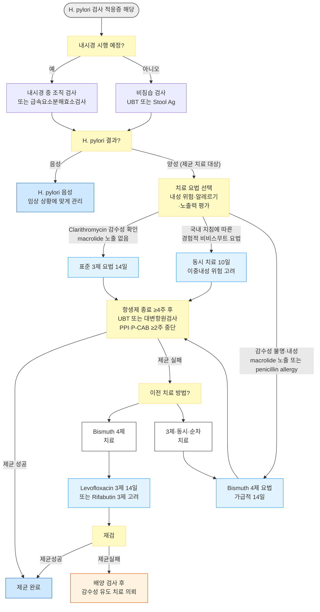

# 헬리코박터 감염 Helicobacter pylori Infection

## <mark style="color:green;">일반 사항</mark>

* 정의 : 그람음성 나선형 세균인 _Helicobacter pylori_ (_H. pylori_)가 위 점막에 만성 감염을 일으키는 상태; 치료 없이는 감염 후 수십 년간 지속되는 만성 감염 상태를 형성함
* 유병률 : 전 세계 인구의 약 절반이 감염된 것으로 추정됨. 국내 성인 감염률은 연령과 검사법에 따라 차이가 크며 감소 추세임. 2016\~2017년 전국 다기관 연구의 혈청양성률은 전체 41.5%, 제균력·위수술력 등을 제외한 무증상 집단에서는 43.9%였고 고령층에서 더 높았음
* 전파 경로 : 주로 분변-경구 경로(오염된 물/음식); 구강-구강 경로 가능성도 있음. 주로 소아기에 획득하며 가족·동거인 사이의 전파 가능
* 경과 : 감염자의 대다수(약 80\~85%)는 증상이 없지만 대부분 만성 활동성 위염이 지속되며, 일부에서 소화성 궤양·위 MALT 림프종·위암이 발생
* 제균 치료 효과
  * 소화성 궤양 및 위 MALT 림프종의 예후 개선
  * 위암 예방 효과 : 무증상 감염자 및 위암 고위험군을 포함한 연구와 메타분석에서 제균 치료 후 위암 발생 위험이 대체로 약 1/3\~1/2 감소; 조기 위암 절제 후 이시성(metachronous) 위암도 감소
  * Maastricht VI (2022)와 ACG 2024는 확인된 활동성 _H. pylori_ 감염을 원칙적으로 치료할 감염병으로 간주
* 우리나라의 clarithromycin 내성 상황 : 국내 clarithromycin 내성률은 지역·검사법에 따라 약 20\~30% 이상으로 보고됨. 국내 2020 지침은 표준 3제 14일, 동시 치료 10일, 순차 치료 10일을 1차 요법으로 인정하지만, 높은 내성과 ACG 2024 등 최신 국제 권고를 고려하면 감수성 미확인 상태에서 clarithromycin 포함 3제 요법을 경험적으로 사용하는 것은 가급적 피함. 과거 macrolide 노출력이 있거나 clarithromycin 감수성이 불명확한 경우에는 bismuth 4제 또는 감수성 유도 치료를 우선 고려


**H. pylori → 위암 발암 경로 (Correa Cascade)**

_H. pylori_ 감염은 수십 년에 걸친 단계적 발암 경로를 통해 위암을 유발

```
H. pylori 감염
   → 만성 활동성 위염 (chronic active gastritis)
      → 위 점막 위축 (atrophic gastritis)
         → 장상피화생 (intestinal metaplasia)
            → 이형성증 (dysplasia)
               → 위선암 (gastric adenocarcinoma)
```

조기에 제균할수록 cascade 차단 효과가 큼.  위축성 위염 이전 단계에서 제균하면 암 예방 효과가 최대화됨. 위암 고위험 군(위암 가족력, 위 선종 절제 후 등)에서 조기 제균이 특히 중요


## <mark style="color:green;">임상 양상</mark>

* 무증상 : 감염자의 약 80\~85%; 우연히 내시경 검사나 다른 검사 중 발견
* 소화불량 증상 : 명치 통증 또는 불쾌감, 팽만감, 구역, 조기 포만감. 증상만으로 감염 여부를 판단할 수 없음
* 소화성 궤양 동반 시 다음의 증상 발생
  * 명치 통증, 공복통 또는 야간통. 음식과 통증의 관계만으로 위궤양과 십이지장궤양을 신뢰성 있게 구분할 수 없음
  * 구역, 구토, 흑변(melena), 토혈 등 합병증 시 긴급 평가 필요
* MALT 림프종 동반 시 : 비특이적 상복부 불편감, 체중 감소, 피로감 등; 대부분 조기에 무증상

### <mark style="color:$danger;">🚩 Red Flags!</mark>

　☞ [위장질환의 감별](074_-gidz.md#step-1-red-flags)

## <mark style="color:green;">진단</mark>

#### <mark style="color:$primary;">검사 적응증</mark>

**검사 및 치료의 이익이 명확한 경우 (적극 권고)**

* 활동성 소화성 궤양
* 과거 소화성 궤양 병력 (제균 치료 받은 적 없는 경우)
* 위 MALT 림프종
* 조기 위암 내시경 절제 후 (이시성 재발 예방)
* 경고 증상이 없고 내시경을 우선 시행할 필요가 낮은 소화불량 환자에서 비침습 검사-치료 전략 고려
  * 국제 지침의 만 60세 미만 기준을 참고하되, 국내에서는 위암 위험·연령·가족력·최근 국가검진 내시경 여부를 함께 고려
* 소화성 궤양 병력이 있으면서 저용량 aspirin을 장기 투여하는 환자
* NSAID 장기 투여를 새로 시작하는 환자
* 원인 불명 철결핍빈혈, 특발성 혈소판감소성 자반(ITP)
* 위암 환자의 1차 친족
* ACG 2024 기준: _H. pylori_ 감염 성인의 동거 가족은 비혈청검사로 검사 고려

**추가 적응증 (권고 강도 약함)**

* 위암 고위험 지역 거주(우리나라 포함) - 만성 위염 환자에서도 제균 고려&#x20;
* 기능성 소화불량증
* 양성 위선종 내시경 절제 후

**독립적인 검사 적응증이 아니거나 근거가 제한적인 경우**

* 소화성 궤양 병력이 없는 전형적인 GERD, 미란성 식도염, Barrett 식도는 그 자체만으로 검사 적응증은 아님. 그러나 다른 적응증으로 활동성 감염이 확인되면 제균을 회피할 이유가 되지 않음
* 이미 NSAID를 장기간 복용 중인 환자에서는 제균만으로 궤양 위험을 충분히 낮추지 못하므로, 궤양 고위험군은 PPI 위장보호를 병행
* Lymphocytic gastritis는 연관성이 불확실하여 개별 판단
* 위 과형성 용종(hyperplastic gastric polyp)은 _H. pylori_ 연관성이 있고 제균 후 소실 또는 절제 후 재발 감소가 보고되어 검사·제균을 고려

#### <mark style="color:$primary;">검사 종류</mark>

**비침습검사**

<table><thead><tr><th width="160">검사명</th><th width="223">장점 (민감도/특이도)</th><th>단점</th></tr></thead><tbody><tr><td><strong>요소호기검사 (Urea Breath Test, UBT)</strong></td><td>가장 정확 (민감도·특이도 ＞90%); 편리·신속; 제균 후 추적 검사 시 국내 1차 선택</td><td>PPI·P-CAB, 항생제, bismuth 복용 시 위음성 가능. 국내에서 주로 사용하는 <sup>13</sup>C-UBT는 비방사성이며, <sup>14</sup>C-UBT만 미량의 방사선에 노출됨</td></tr><tr><td><strong>혈청 항체 검사 (ELISA)</strong></td><td>저렴·편리; 산분비억제제·항생제의 영향을 받지 않음</td><td>과거 감염과 현재 감염을 구별할 수 없고 유병률 감소 환경에서는 양성예측도가 낮음. UBT·대변항원검사 등이 곤란한 제한적 상황의 보조검사이며, 제균 후 추적 검사로 사용하지 않음</td></tr><tr><td><strong>대변 항원 검사 (Stool Ag Test)</strong></td><td>Monoclonal 기반 제품은 민감도·특이도 ＞90%; 국제 지침에서 제균 확인에 UBT와 동등한 대안</td><td>검체 취급·보관에 유의; 국내에서는 UBT를 주로 사용</td></tr></tbody></table>

**침습검사**

<table><thead><tr><th width="143">검사명</th><th width="226">장점 (민감도/특이도)</th><th>단점</th></tr></thead><tbody><tr><td><strong>급속요소분해효소검사 (Rapid Urease Test)</strong></td><td>빠르고 간단 (민감도 80~95%, 특이도 95~100%)</td><td>PPI, H2 차단제, 항생제, bismuth 복용 시 위음성 가능; 활동성 출혈 급성기에는 위음성률 증가</td></tr><tr><td><strong>조직 검사</strong></td><td>민감도 80~90%, 특이도 ＞95%; 위염 중증도 및 장상피화생 동시 평가 가능</td><td>채취 부위에 따라 민감도 저하; 비용 높음; 활동성 출혈 급성기에는 민감도 저하</td></tr><tr><td><strong>배양 검사</strong></td><td>항생제 내성 패턴 직접 확인 가능 - 제균 실패 반복 시 핵심 검사</td><td>시간 소요(수 일), 복잡, 고비용; 균 생존 조건 엄격</td></tr><tr><td><strong>PCR 검사</strong><br><strong>(DPO-PCR)</strong></td><td>Clarithromycin 내성 유전자(23S rRNA 돌연변이) 신속 확인; 배양 없이 내성 판단 가능; 대학병원 중심으로 확대 중</td><td>상업적 키트 필요; 모든 내성 기전 검출 불가; 비용</td></tr></tbody></table>

#### <mark style="color:$primary;">검사 유의점</mark>

* **검사 전 휴약** : 위음성 방지를 위해 UBT·대변항원검사는 항생제·bismuth 종료 후 최소 4주, PPI·P-CAB 종료 후 최소 2주 뒤 시행. 중단 기간에는 필요 시 H2 차단제 또는 제산제로 대체할 수 있으며, H2 차단제의 중단 시점은 검사기관 지침에 따름
  * 혈청 항체 검사는 약제의 영향을 받지 않지만, 항체가 치료 후 수개월 이상 유지되므로 추적 검사로 사용하지 않음
* **상부위장관 출혈(UGIB) 급성기 검사 주의** : 활동성 출혈 시 위 내 혈액이 RUT·조직 검사의 민감도를 현저히 낮춰 위음성을 초래할 수 있음; 출혈 호전 후 UBT 또는 내시경으로 재검

***


```mermaid
flowchart TD
    A([H. pylori 검사 적응증 해당]) --> B[내시경 시행 예정?]
    B -- 예 --> C[내시경 중 조직 검사<br/>또는 급속요소분해효소검사]
    B -- 아니오 --> D[비침습 검사<br/>UBT 또는 Stool Ag]
    C --> E[H. pylori 결과?]
    D --> E
    E -- 음성 --> F[H. pylori 음성<br/>임상 상황에 맞게 관리]
    E -- 양성 (제균 치료 대상) --> H[치료 요법 선택<br/>내성 위험·알레르기<br/>·노출력 평가]
    H -- Clarithromycin 감수성 확인<br/>macrolide 노출 없음 --> I[표준 3제 요법 14일]
    H -- 국내 지침에 따른<br/>경험적 비비스무트 요법 --> J[동시 치료 10일<br/>이중내성 위험 고려]
    H -- 감수성 불명·내성<br/>macrolide 노출 또는 penicillin allergy --> K[Bismuth 4제 요법<br/>가급적 14일]
    I --> L[항생제 종료 ≥4주 후<br/>UBT 또는 대변항원검사<br/>PPI·P-CAB ≥2주 중단]
    J --> L
    K --> L
    L -- 제균 성공 --> M[제균 완료]
    L -- 제균 실패 --> N[이전 치료 방법?]
    N --> S["Bismuth 4제 <br/>치료"] --> O[Levofloxacin 3제 14일<br/>또는 Rifabutin 3제 고려]
    N --> T["3제·동시·순차<br/>치료"] --> K
    O --> P[재검]
    P -- 제균성공 --> M[제균 완료]
    P -- 제균실패 --> Q[배양 검사 후<br/>감수성 유도 치료 의뢰]

style A fill:#eeeeee,stroke:#888888,stroke-width:2px
classDef yellow fill:#fff9c4,stroke:#ffe082
class B,E,H,L,N,P yellow
classDef sky fill:#e3f2ff,stroke:#2196f3
class I,J,K,O sky
classDef white fill:#fff,stroke:#333
class S,T white
classDef blue fill:#d0e8ff,stroke:#1a6abf
class F,M blue
style Q fill:#fff3e0,stroke:#e65100,stroke-width:1px
```

<p align="center"><strong>H. pylori 진단 및 제균 치료 알고리듬</strong></p>

***

## <mark style="background-color:$warning;">Management</mark>

### <mark style="color:orange;">제균 치료 적응증</mark>

**대한상부위장관·헬리코박터학회 적응증**

* 기존 적응증 : 소화성 궤양(활동성·과거력), 위 MALT 림프종, 조기 위암 내시경 절제 후, 위암 가족력(1차 친족), 특발성 혈소판감소성 자반(ITP), 소화성 궤양 병력이 있는 저용량 aspirin 장기 투여 환자
* 추가 적응증 : 원인 불명 철결핍빈혈, 양성 위선종 내시경 절제 후, 기능성 소화불량증 (권고강도: 약함)
* 국내 2020 지침의 허용 적응증 : 위축성 위염·장상피화생. 당시 근거가 제한되어 권고를 확정하지 못했으나, Maastricht VI 및 ACG 2024는 위암 고위험군·위축성 위염·장상피화생에서 검사와 치료를 권고
* 활동성 감염이 확인되면 특별한 금기나 치료 이득을 기대하기 어려운 상황이 아닌 한 제균 치료를 권고

**제균 치료 한계 (이익 불분명)**

* 장기간 NSAID 복용 중인 환자에서 제균만으로 소화성 궤양 위험이 충분히 감소하지 않음 → 궤양 고위험군에서는 PPI 위장보호 병행
* 일부 연구에서 H. pylori와 GERD 사이의 역상관 관계(inverse association)가 보고되었으나, 제균 치료가 GERD 발생 또는 경과에 미치는 영향은 전반적으로 제한적
* H. pylori 유병률 감소와 식도선암 증가 사이의 역상관 관계가 보고되나 인과관계는 불명확 → 식도 병변 동반 환자에서는 신중 판단

### <mark style="color:orange;">초치료 요법 선택</mark>

* 국내 2020 지침의 1차 요법 : 표준 3제 14일, 동시 치료 10일, 순차 치료 10일. Bismuth 4제 10\~14일은 다른 1차 요법을 사용하기 어려울 때 고려
* 최신 내성관리 관점 : 감수성 미확인 상태의 경험적 clarithromycin 3제는 가급적 피하며, clarithromycin 감수성이 확인되지 않았거나 과거 macrolide 노출력이 있으면 optimized bismuth 4제 14일을 우선 고려
* 어떤 요법을 선택하든 해당 의료기관·지역의 최근 제균율이 90% 이상인 요법을 우선하고, 치료 후 모든 환자에서 제균 성공을 확인

#### <mark style="color:$primary;">1차 치료 요법 선택 기준</mark>

<table><thead><tr><th width="395.57891845703125">임상 상황</th><th>우선 선택 요법</th></tr></thead><tbody><tr><td>clarithromycin 감수성 확인 + 유의한 macrolide 노출력 없음</td><td>표준 3제 요법 14일</td></tr><tr><td>감수성 미확인 상태에서 국내 지침에 따른 비비스무트 경험적 치료를 선택</td><td>동시 치료 10일; clarithromycin·metronidazole 이중내성 위험 고려</td></tr><tr><td>clarithromycin 감수성 불명·내성 또는 유의한 macrolide 노출력</td><td>optimized bismuth 4제 14일 우선 고려</td></tr><tr><td>진성 penicillin 알레르기</td><td>tetracycline 기반 bismuth 4제 14일</td></tr><tr><td>이전 제균 치료 실패</td><td>이전 사용 항생제를 피한 구제요법; 가능하면 감수성 유도 치료</td></tr></tbody></table>

#### <mark style="color:$primary;">표준 3제 요법 (Standard Triple Therapy) - 14일</mark>

* 구성 : {PPI 표준 용량, amoxicillin 1 g <mark style="color:blue;">\[파목신]</mark>, clarithromycin 500 ㎎ <mark style="color:blue;">\[클래리시드]</mark>} bid × 14일 (☞ [보험기준](https://www.hira.or.kr/rc/insu/insuadtcrtr/InsuAdtCrtrPopup.do?mtgHmeDd=20221201\&sno=8\&mtgMtrRegSno=0007))
* 제균율 : clarithromycin 감수성 확인 시 80\~90%; 내성 시 50\~60% 수준으로 급감
* 경험적 사용 비권장 : 한국에서 내성 검사 없이 경험적으로 1차 선택하는 것은 감소 추세; clarithromycin 감수성 확인 후 선택적으로 사용
* DPO-PCR로 clarithromycin 내성 음성(감수성 확인) 시 표준 3제 요법 급여 인정 가능 (최신 고시 확인 필요)
* 7일 요법 사용 시 반드시 clarithromycin 내성 검사 선행; 경험적 치료로는 권고 안함

#### <mark style="color:$primary;">동시 치료 (Concomitant Therapy) - 10일</mark>

* 구성 : {PPI 표준 용량, clarithromycin 500 ㎎, amoxicillin 1 g, metronidazole 500 ㎎ <mark style="color:blue;">\[후라시닐]</mark>} bid × 10일
* 제균율 : 국내 연구에서 대체로 표준 3제보다 높지만 지역·내성 양상에 따라 달라짐. Clarithromycin 단독 내성은 일부 극복할 수 있으나 clarithromycin·metronidazole 이중내성에서는 제균율이 크게 낮아질 수 있음
* 국내 2020 지침에서 경험적 1차 치료로 인정되나, 과거 macrolide 노출력이 있으면 clarithromycin 비포함 요법을 우선

#### <mark style="color:$primary;">순차 치료 (Sequential Therapy) - 10일</mark>

* 전반 5일 : {PPI 표준 용량, amoxicillin 1 g} bid
* 후반 5일 : {PPI 표준 용량, clarithromycin 500 ㎎, metronidazole 500 ㎎} bid
* 동시 치료보다 내성에 취약하여 최근 사용 빈도 감소 추세

#### <mark style="color:$primary;">Bismuth 4제 요법 (Bismuth Quadruple Therapy) - 10\~14일</mark>

* 표준 구성 : PPI 표준 용량 bid + bismuth subcitrate 120 ㎎ <mark style="color:blue;">\[데놀]</mark> qid + metronidazole 500 ㎎ tid + tetracycline 500 ㎎ qid
* 적응 : clarithromycin 감수성 불명·내성 또는 macrolide 노출력이 있는 경우의 경험적 1차 치료; 진성 penicillin 알레르기; clarithromycin 포함 요법 실패 후 재치료
* 제균율 : 약 85\~95% (항생제 내성에 비교적 강함)
* 주의
  * 복잡한 복용 스케줄 → 복약 달력(pill chart) 제공 권장 (아래 복약 도식 참조)
  * tetracycline : 18세 미만, 임산부 금기; 국내 수급 현황 사전 확인 필요 (간헐적 공급 불안정)
  * tetracycline을 amoxicillin으로 대체한 modified regimen도 일부 사용되나, 이는 고전적 표준 구성과 구분되어야 하며 근거 수준이 다름


**Tetracycline 수급 불가 시 Modified Bismuth 4제 요법**

구성 : PPI 표준 용량 bid + bismuth subcitrate 120 ㎎ qid + metronidazole 500 ㎎ tid + amoxicillin 1 g bid

✽표준 tetracycline 기반 요법과 구분해야 하며, 근거 수준이 낮음; penicillin 알레르기 환자에게는 사용 불가; metronidazole 내성 시 효과가 더욱 제한됨


**Bismuth 4제 요법 복약 시간표**

* tetracycline은 우유·제산제·철분제와 2시간 이상 분리 복용; 복용 후 30분은 눕지 말 것

<table><thead><tr><th width="132.4210205078125">시간</th><th>복용 약물</th></tr></thead><tbody><tr><td>아침 식전 30분</td><td>PPI + 데놀</td></tr><tr><td>아침 식후</td><td>테트라사이클린 + 메트로니다졸</td></tr><tr><td>점심 식전 30분</td><td>데놀</td></tr><tr><td>점심 식후</td><td>테트라사이클린 + 메트로니다졸</td></tr><tr><td>저녁 식전 30분</td><td>PPI + 데놀</td></tr><tr><td>저녁 식후</td><td>테트라사이클린 + 메트로니다졸</td></tr><tr><td>취침 전</td><td>데놀 + 테트라사이클린; 충분한 물(200 ㎖)과 함께 복용 후 바로 눕지 않기 (식도염 예방)</td></tr></tbody></table>

#### <mark style="color:$primary;">페니실린 알레르기 환자</mark>

* 비아나필락시스성 과거 반응 : 병력을 재평가하고 필요 시 피부검사·경구유발검사를 통해 penicillin allergy 표지 해제(delabeling) 고려; 확인 전에는 bismuth 4제 요법 사용
* 아나필락시스·중증 반응 : Amoxicillin 완전 회피 → bismuth 4제 요법 (tetracycline + metronidazole; amoxicillin 제외) 우선
* Bismuth 4제도 사용할 수 없는 경우 : 소화기내과 의뢰 후 감수성 유도 치료. Clarithromycin·fluoroquinolone 포함 요법은 해당 감수성이 확인된 경우에만 고려

### <mark style="color:orange;">재치료 프로토콜</mark>

**제균 실패 흔한 원인 - 재치료 전 점검**

1. clarithromycin 또는 fluoroquinolone 내성
2. 복약 불이행 (특히 bismuth 4제의 복잡한 스케줄)
3. PPI 산 억제 불충분 (CYP2C19 급속 대사형)
4. 흡연 (제균율 감소와 관련)
5. 제균 후 너무 이른 추적 검사 (휴약 기간 미준수)

#### <mark style="color:$primary;">1차 재치료 (표준 3제·동시·순차 치료 실패 후)</mark>

* Bismuth 4제 요법 14일 (상기 구성) - 1순위 권고

#### <mark style="color:$primary;">2차 재치료 (Bismuth 4제 실패 후)</mark>

* Levofloxacin 3제 요법 14일 : PPI 표준 용량 bid + amoxicillin 1 g bid + levofloxacin 500 ㎎ qd (또는 250 ㎎ bid) <mark style="color:blue;">\[크라비트]</mark>
  * 국내 fluoroquinolone 내성률이 높으므로 가급적 감수성이 확인된 경우에만 사용
* Rifabutin 3제 요법 14일 : bismuth 4제 실패 후 사용할 수 있는 국제 지침상의 구제요법이나 지침·제품별 rifabutin 및 amoxicillin 용량이 다름
  * 국내 H. pylori 적응증 허가·급여·공급 여부를 확인하고 소화기내과·감염내과 협진하에 감수성 유도 치료로 사용
  * 골수억제(호중구감소증), 포도막염 가능; 반복치료·혈액질환 등 고위험군에서 CBC 확인 고려
  * 활동성 결핵 또는 rifamycin 계열 치료력·치료 중인 환자는 내성 선택 위험을 고려하여 감염내과 협진
* 배양 검사 후 감수성 유도 치료 : 2회 이상 실패 시 소화기내과 의뢰 → 내시경 조직으로 배양·항생제 감수성 검사 시행 후 맞춤 치료

### <mark style="color:orange;">약제</mark>

#### <mark style="color:$primary;">PPI 표준 용량</mark>

* omeprazole 20 ㎎ <mark style="color:blue;">\[오엠피]</mark>
* esomeprazole 20 ㎎ <mark style="color:blue;">\[넥시움]</mark>
* lansoprazole 30 ㎎ <mark style="color:blue;">\[란스톤]</mark>
* rabeprazole 20 ㎎ <mark style="color:blue;">\[파리에트]</mark>
* pantoprazole 40 ㎎ <mark style="color:blue;">\[판토록]</mark>

　☞ [보험기준](https://www.hira.or.kr/rc/insu/insuadtcrtr/InsuAdtCrtrPopup.do?mtgHmeDd=20221201\&sno=8\&mtgMtrRegSno=0007)

#### <mark style="color:$primary;">P-CAB (Potassium-Competitive Acid Blocker)</mark>

* Tegoprazan 50 ㎎ <mark style="color:blue;">\[케이캡]</mark>
  * 국내 허가 : 표준 3제 요법 7일 투여 허가
  * PPI 대비 강력하고 안정적인 산 억제 효과; CYP2C19 대사 다형성 영향 적음 → 급속 대사자에서 유리
  * 7일 tegoprazan 기반 3제 요법은 lansoprazole 기반 3제 요법에 비열등했으나, clarithromycin 고내성 환경에서는 7일 요법의 절대 제균율이 충분하지 않을 수 있음
  * 처방 시 tegoprazan 50 ㎎ bid (3제 요법 구성 내)
  * 국내 실제진료 연구에서 14일 요법이 7일 요법보다 높은 제균율을 보였으나 허가 범위를 벗어날 수 있으므로 처방 전 허가·급여 기준 확인
* Fexuprazan 40 ㎎ <mark style="color:blue;">\[펙수클루]</mark>
  * 2026년 5월 국내에서 _H. pylori_ 제균을 위한 항생제 병용요법 적응증 추가 승인; 처방 시 fexuprazan 40 ㎎ bid
  * 허가된 병용 항생제와 총 투여기간은 최신 식약처 허가사항을 확인
  * Clarithromycin 내성군에서 PPI 기반 3제보다 제균율이 높았지만 절대 제균율은 충분하지 않아, 감수성 확인 원칙을 대체하지 않음


P-CAB은 PPI보다 빠르고 지속적인 산 억제 효과를 보이며 식사 영향을 덜 받음.\
P-CAB 기반 제균 요법의 급여 적용 범위는 PPI 기반 요법과 다를 수 있으므로 처방 전 최신 고시 확인 필요



**보험 급여 주의 사항**

* 위암 가족력, 위선종 절제 후 등 일부 적응증은 급여 대상이 아닐 수 있으며 100/100 본인부담 처방이 될 수 있음 → 처방 전 환자에게 안내 권장
* DPO-PCR로 clarithromycin 감수성 확인 시 표준 3제 요법 급여 가능 (최신 고시 확인)
* P-CAB 기반 요법은 허가 범위 내에서만 급여 인정되므로 처방 전 확인 필요


#### <mark style="color:$primary;">항생제 내성 관리 원칙 (Antimicrobial Stewardship)</mark>

* _H. pylori_ 치료는 항생제 stewardship 원칙을 준수
* 동일 항생제 반복 사용 최소화 : 이전 치료에 사용한 항생제는 재치료에서 가능한 한 제외
* Clarithromycin 반복 노출 회피 : 실패 후 clarithromycin 재사용은 내성 선택 위험이 높음
* 불필요한 salvage 반복 금지 : 경험적 치료 반복보다 배양·감수성 검사 우선
* 2회 이상 실패 시 susceptibility-guided therapy : 배양 검사 시행 또는 의뢰&#x20;
* 항생제 처방은 치료 완료 확인(UBT 음성) 이후 종결; 확인 없이 재처방 반복하지 않음

#### <mark style="color:$primary;">약물 부작용 관리</mark>

<table><thead><tr><th width="146.5263671875">약물</th><th>주요 부작용</th><th>대처</th></tr></thead><tbody><tr><td>amoxicillin</td><td>설사, 복통, 발진, 드물게 알레르기 반응</td><td>페니실린 알레르기 사전 확인; 알레르기 의심 시 즉시 중단·평가</td></tr><tr><td>clarithromycin</td><td>금속 맛, 구역, 복통, QT 연장; CYP3A4 약물상호작용</td><td>QT 연장 약물과 simvastatin·lovastatin 등 병용약 확인</td></tr><tr><td>metronidazole</td><td>금속 맛, 구역, 구토; 알코올 병용 시 홍조·두통·빈맥·구토 가능</td><td>치료 기간 중 및 종료 후 최소 3일까지 음주 금지 교육</td></tr><tr><td>bismuth</td><td>변비, 검은 변·흑색 혀, 구역</td><td>치료 중 일시적 현상임을 사전 교육; melena와 감별 필요</td></tr><tr><td>tetracycline</td><td>광과민성, 식도염</td><td>충분한 물과 함께 복용 후 30분은 눕지 않음; 유제품·제산제·철분제와 2시간 이상 분리</td></tr><tr><td>levofloxacin</td><td>건염·건파열, 말초신경병증, 중추신경계 이상, 혈당 변동, QT 연장</td><td>고령·신기능 저하·스테로이드 병용 환자 주의; 감수성 확인 후 제한적으로 사용</td></tr><tr><td>rifabutin</td><td>골수억제, 포도막염, 체액의 주황색 변색</td><td>전문의 협진; 반복치료·고위험군에서 CBC 확인 고려</td></tr></tbody></table>

### <mark style="color:orange;">치료 후 추적 검사</mark>

* 방법 : UBT 선호 (가장 정확, 비침습); 내시경 추적이 필요한 경우 조직 검사
  * 국내 가이드라인은 추적 검사로 UBT 우선 권고; monoclonal stool antigen test는 국제 가이드라인에서 제균 확인에 UBT와 동등 수준으로 인정하나 국내에서는 UBT가 표준
* 시기 : 항생제·bismuth 종료 후 최소 4주, PPI·P-CAB 종료 후 최소 2주 뒤 시행. 중단 기간에는 필요 시 H2 차단제 또는 제산제 사용
* 위궤양 : 치유 확인 및 악성 병변 배제를 위해 일반적으로 치료 후 6\~8주경 추적 내시경 고려
* 합병증 없는 십이지장궤양 : 증상이 호전되고 제균 성공이 확인되면 routine 추적 내시경은 일반적으로 불필요
* 위축성 위염·장상피화생, 위선종·조기 위암 절제 후 등 위암 고위험군은 제균 성공 후에도 기존 기준에 따른 내시경 추적을 지속

***

### <mark style="color:red;">질병코드</mark>

B98.0 다른 장에서 분류된 질환의 원인으로서의 헬리코박터 파일로리균

✽B98.0은 원인균을 표시하는 부가 코드로, 위염·소화성 궤양 등 해당 원인 질환 코드를 함께 사용

***

## <mark style="color:purple;">처방례</mark>

> **처방례 1.** 동시 치료 10일 (국내 지침상 경험적 1차 치료)
>
> ```
> 판토록 40 ㎎/T   2T   #2   (아침·저녁 식전 30분)
> 클래리시드 필름코팅 500 ㎎/T   2T   #2   (아침·저녁 식후)
> 파목신 500 ㎎/C   4C   #2   (아침·저녁 식후)
> 후라시닐 500 ㎎/T   2T   #2   (아침·저녁 식후)
> ※ 총 10일 처방
> ※ 판토록은 식전 30분, 항생제는 식후 복용
> ※ 복용 중 및 종료 후 최소 3일까지 음주 금지 (metronidazole 포함)
> ```
>
> _✽국내 2020 지침에서 경험적 1차 요법으로 인정. Clarithromycin·metronidazole 이중내성에서는 제균율이 낮아질 수 있으며, 과거 macrolide 노출력이 있으면 clarithromycin 비포함 요법을 우선한다. 동시 치료 실패 시 bismuth 4제 요법으로 재치료._

> **처방례 2.** 표준 3제 요법 14일 (clarithromycin 감수성 확인 후 선택적 사용)
>
> ```
> 판토록 40 ㎎/T   2T   #2   (아침·저녁 식전 30분)
> 클래리시드 필름코팅 500 ㎎/T   2T   #2   (아침·저녁 식후)
> 파목신 500 ㎎/C   4C   #2   (아침·저녁 식후)
> ※ 총 14일; 1회 처방 시 보험 적용 일수 확인
> ※ Clarithromycin 감수성 확인 후 처방 권장; 경험적 처방 지양
> ```
>
> _✽한국의 clarithromycin 내성률(\~20\~25%)을 고려 시 경험적 사용은 제균율 저하 위험. 감수성 확인 시 14일 처방으로 제균율 80\~90% 기대._

> **처방례 3.** Bismuth 4제 요법 14일 (고내성·재치료·penicillin 알레르기) - 표준 tetracycline 기반
>
> ```
> 판토록 40 ㎎/T   2T   #2   (아침·저녁 식전 30분)
> 데놀 120 ㎎/T   4T   #4   (매 식전 30분, 취침 전 - 하루 4회)
> 후라시닐 500 ㎎/T   3T   #3   (매 식후)
> 테트라사이클린캡슐 500 ㎎/C   4C   #4   (매 식후, 취침 전)
> ※ 총 14일; 복잡한 스케줄 - 위 복약 시간표 참조
> ※ 데놀 복용 후 대변·혀가 검게 변하는 것은 정상
> ※ 테트라사이클린은 우유·제산제·철분제와 2시간 이상 분리; 복용 후 30분 기립
> ※ 복용 중 및 종료 후 최소 3일까지 음주 금지 (metronidazole)
> ```
>
> _✽고전적 bismuth 4제 요법의 표준 구성은 tetracycline 기반. Tetracycline을 amoxicillin으로 대체한 modified regimen도 일부 사용되나 표준 구성과 근거 수준이 다름; 가능하면 tetracycline 기반 유지 권장. 국내 tetracycline 수급 현황 사전 확인 필요._

> **처방례 4.** Levofloxacin 3제 요법 14일 (재치료 2차)
>
> ```
> 판토록 40 ㎎/T   2T   #2   (아침·저녁 식전 30분)
> 크라비트 500 ㎎/T   1T   #1   (아침 식후)
> 파목신 500 ㎎/C   4C   #2   (아침·저녁 식후)
> ※ 총 14일; levofloxacin 내성 검사 후 사용 권장
> ※ 치료 중 및 이후 광과민성 주의
> ```
>
> _✽Levofloxacin 내성률 \~25%이므로 감수성 검사 없이 사용 시 실패 가능. 건염·건파열 위험이 있는 고령 환자, 스테로이드 병용 환자에서 주의._

> **처방례 5.** P-CAB 기반 3제 요법 (tegoprazan 사용 시)
>
> ```
> 케이캡 50 ㎎/T   2T   #2   (아침·저녁)
> 클래리시드 필름코팅 500 ㎎/T   2T   #2   (아침·저녁)
> 파목신 500 ㎎/C   4C   #2   (아침·저녁)
> ※ 허가 기준 7일 요법; clarithromycin 감수성 확인 후 사용
> ※ 국내 실제진료 연구에서 14일 요법의 제균율 향상이 보고되었으나 허가 범위 확인 필요
> ※ P-CAB 기반 요법 급여 기준 처방 전 확인
> ```
>
> _✽PPI 산 억제 불충분 또는 CYP2C19 급속 대사자에서 P-CAB으로 전환을 고려할 수 있다. 14일 연장 요법은 허가·급여 범위를 확인한다._

> **처방례 6.** P-CAB 기반 3제 요법 (fexuprazan 사용 시)
>
> ```
> 펙수클루 40 ㎎/T   2T   #2   (아침·저녁)
> 클래리시드 필름코팅 500 ㎎/T   2T   #2   (아침·저녁)
> 파목신 500 ㎎/C   4C   #2   (아침·저녁)
> ※ 총 7일 처방; 2026년 추가된 국내 허가사항의 병용요법·투여기간 재확인
> ※ clarithromycin 감수성 확인 후 사용 권장
> ※ 보험 기준 및 허가 범위 처방 전 확인
> ```
>
> _✽2026년 5월 fexuprazan 기반 3제 요법이 국내 허가되었다. Clarithromycin 내성군에서 PPI 기반 3제보다 제균율이 높았지만 절대 제균율은 충분하지 않아 감수성 확인 원칙을 대체하지 않는다._

***

### <mark style="color:$success;">핵심 복약 지도</mark>

> **① 제균 치료를 끝까지 완료하는 것이 가장 중요합니다**
>
> * H. pylori 제균 치료는 요법에 따라 7\~14일간 진행됩니다. 증상이 좋아지더라도 중단하지 마십시오.
> * 임의 중단 시 균이 완전히 제거되지 않고 항생제 내성이 발생할 수 있어, 이후 치료가 더 어려워집니다.
> * 처방된 모든 약을 매일 같은 시간에 규칙적으로 복용하십시오.

> **② 각 약물 복용 방법**
>
> * **PPI (위산 억제제)** : 일반적으로 식전 30분 복용; 처방전 복용 지시 확인
> * **P-CAB (위산 억제제)** : 식사와 관계없이 복용 가능; 처방전 복용 지시 확인
> * **Amoxicillin (항생제)** : 식후 복용; 페니실린 알레르기가 있으면 처방 전 반드시 알림
> * **Clarithromycin (항생제)** : 식후 복용; 복용 중 금속 맛이 날 수 있으나 치료 종료 후 소실됨
> * **Metronidazole (항생제)** : 식후 복용; **치료 기간 중 및 치료 종료 후 최소 3일까지 음주하지 마십시오** - 홍조, 두근거림, 구역 등의 심한 반응이 생길 수 있습니다
> * **Bismuth (데놀)** : 식전 30분, 취침 전 복용; 복용 후 대변과 혀가 검게 변하는 것은 정상 반응
> * **Tetracycline** : 충분한 물(200 ㎖ 이상)과 함께 복용하고 복용 후 30분은 눕지 마십시오; 우유, 제산제, 철분제와 2시간 이상 분리 복용

> **③ 제균 치료 후 확인 검사가 반드시 필요합니다**
>
> * 항생제 치료 완료 후 최소 4주 뒤 요소호기검사(UBT) 또는 대변항원검사로 제균 성공 여부를 확인합니다.
> * 확인 검사 전 항생제·bismuth는 최소 4주, PPI·P-CAB은 최소 2주간 복용하지 않아야 검사가 정확합니다.
> * 혈액 항체 검사는 치료 성공 여부 판정에 사용할 수 없습니다 (오래 양성 유지).

> **④ 부작용 대처**
>
> * 경미한 복통, 설사, 구역 : 치료 중 자주 나타나며 대부분 치료 완료 후 회복됨; 심하지 않으면 계속 복용
> * 발진, 두드러기, 심한 설사(혈변 동반) : 즉시 중단하고 병원 방문
> * Bismuth 복용 후 검은 변 : 정상 반응; 단, 혈액이 섞인 끈적한 흑색변(melena) 시에는 즉시 내원

> **언제 다시 병원을 방문해야 하나요?**
>
> * 제균 확인 검사(UBT) 결과 제균 실패 시 - 재치료 상담
> * 치료 완료 후에도 복통, 흑변, 체중 감소가 지속되는 경우 - 즉시 내원
> * 치료 중 심한 알레르기 반응(발진, 호흡 곤란) - 즉시 내원 또는 응급실

***

### <mark style="color:blue;">환자 안내서</mark>


**헬리코박터균 감염, 치료하면 위암 위험을 줄일 수 있습니다**

헬리코박터균(_H. pylori_)은 위 점막에 서식하는 세균으로, 전 세계 인구의 약 절반이 감염되어 있습니다. 대부분은 아무 증상이 없지만, 오랫동안 치료하지 않으면 위궤양이나 위암의 원인이 될 수 있습니다. 균을 제거(제균 치료)하면 궤양이 낫고 위암 위험도 낮출 수 있습니다.


#### <mark style="color:$primary;">헬리코박터균은 어떻게 감염되나요?</mark>

* 오염된 음식이나 물을 통해 전파됩니다 (분변-경구 경로).
* 어린 시절에 감염된 경우가 많으며, 위생 환경이 개선된 지금은 신규 감염률이 낮아졌습니다.
* 가족 간 전파가 가능합니다. 감염이 확인된 성인의 동거 가족이나 위암 환자의 1차 친족은 의사와 상의하여 검사를 고려할 수 있습니다.

#### <mark style="color:$primary;">왜 제균 치료를 받아야 하나요?</mark>

* 위궤양의 가장 흔한 원인입니다 - 제균 치료 시 궤양이 잘 낫고 재발도 줄어듭니다.
* 연구 대상과 위 점막 상태에 따라 차이가 있지만, 제균 치료를 받으면 위암 발생 위험을 대체로 약 1/3\~1/2 낮출 수 있습니다. 치료하지 않으면 수십 년에 걸쳐 위 점막이 서서히 손상될 수 있습니다.
* 특발성 혈소판감소성 자반증(ITP)이나 원인 불명의 빈혈에도 도움이 될 수 있습니다.
* 현재 감염이 정확히 확인되면 특별한 금기가 있거나 치료 이득을 기대하기 어려운 상황이 아닌 한 제균 치료를 권합니다. 구체적인 치료 방법과 급여 여부는 의사와 상의하십시오.

#### <mark style="color:$primary;">제균 치료는 어떻게 하나요?</mark>

* 보통 **3\~4종류의 약을 7\~14일간** 복용합니다 - 위산 억제제 1종과 항생제 2\~3종이며, 처방에 따라 bismuth를 함께 복용합니다.
* **처방받은 약을 끝까지 모두 복용하는 것이 가장 중요합니다.** 증상이 좋아져도 중단하면 안 됩니다.
* 항생제 복용 중에는 **술을 마시면 안 됩니다** - 특히 metronidazole을 포함하는 처방에서는 홍조·두근거림·구역 등의 심한 반응이 생길 수 있습니다. 치료 종료 후에도 **최소 3일간** 음주를 삼가십시오.
* 데놀(bismuth) 복용 시 대변과 혀가 검게 변할 수 있는데, 이는 **정상 반응**으로 약을 끊을 필요가 없습니다.

#### <mark style="color:$primary;">치료 후 제균 확인이 필요합니다</mark>

* 항생제 치료 완료 후 **최소 4주 뒤** 요소호기검사(숨 쉬는 검사) 또는 대변항원검사로 균이 없어졌는지 확인합니다.
* 검사 전 항생제·bismuth는 최소 4주, 위산 억제제(PPI·P-CAB)는 최소 2주간 복용하지 않아야 검사가 정확합니다.
* 혈액 검사로는 제균 성공 여부를 알 수 없습니다.
* 제균에 실패한 경우 다른 약으로 재치료를 받을 수 있습니다.
* 위축성 위염·장상피화생이 있거나 위선종·조기 위암을 치료받은 환자는 제균에 성공해도 담당 의사가 정한 일정에 따라 위내시경 추적을 계속해야 합니다.

#### <mark style="color:$primary;">재감염 예방과 생활 관리</mark>

* 손 씻기를 철저히 하고, 음식은 충분히 익혀 먹고, 오염 가능성이 있는 물은 끓여 마십시오.
* 제균 성공 후 재감염률은 연 1\~2%로 낮은 편이나, 위생 관리를 유지하는 것이 좋습니다.
* 재감염이 의심되거나, 정기 위내시경 시 H. pylori 재검이 필요하면 의사에게 말씀하십시오.

#### <mark style="color:$primary;">이럴 때는 즉시 병원을 방문하세요</mark>

* 치료 중 발진, 두드러기, 호흡 곤란 등 알레르기 증상
* 검은 끈적한 변(흑색변, melena), 토혈
* 심한 복통, 발열, 또는 치료 중 갑자기 상태가 나빠지는 경우
