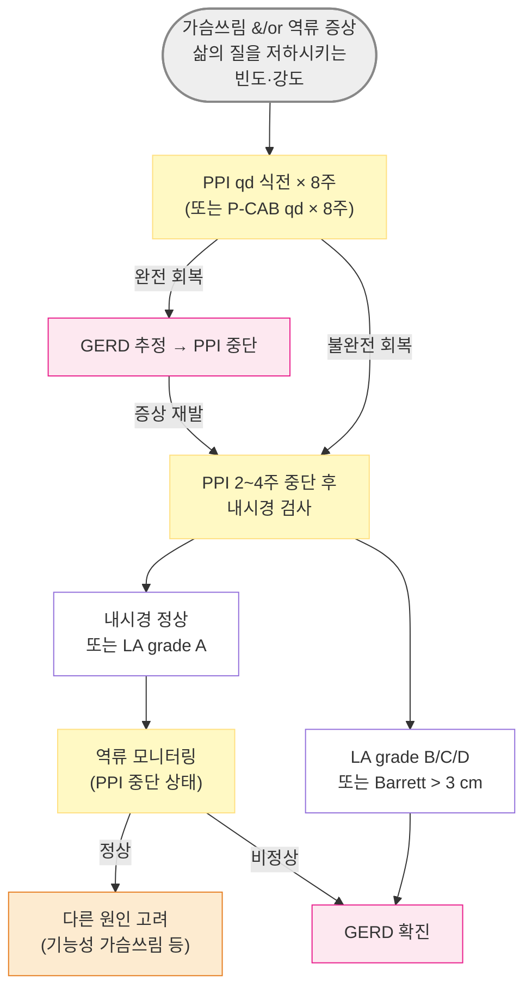
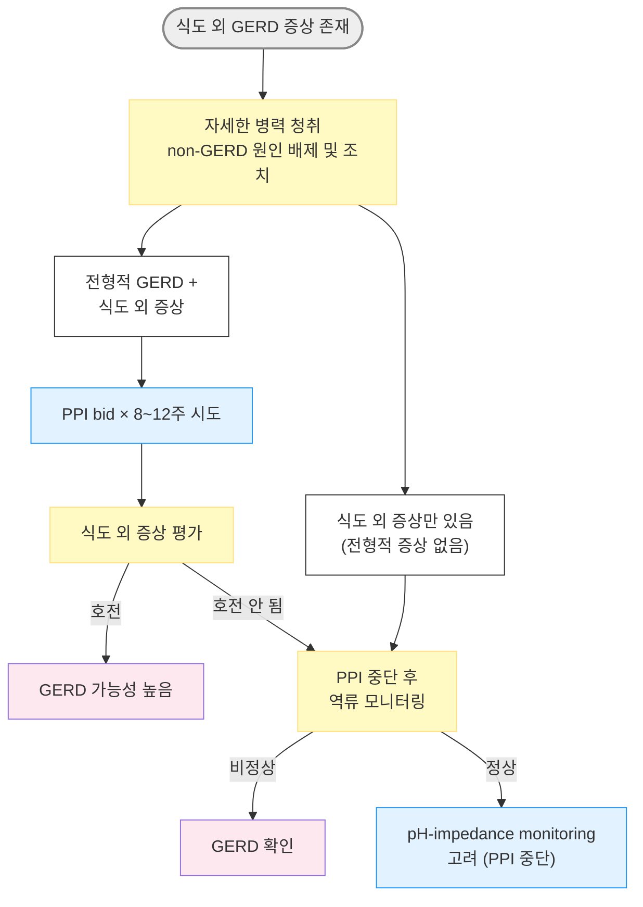
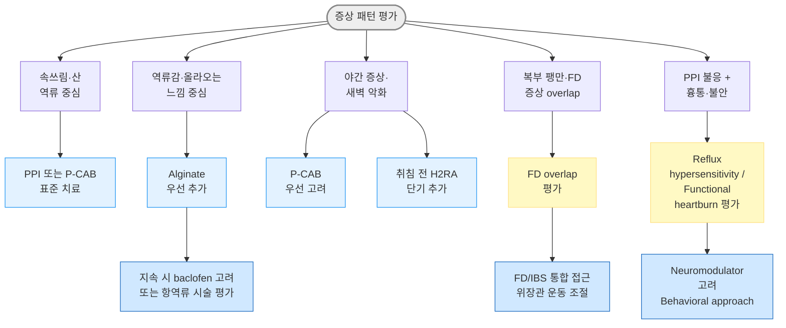
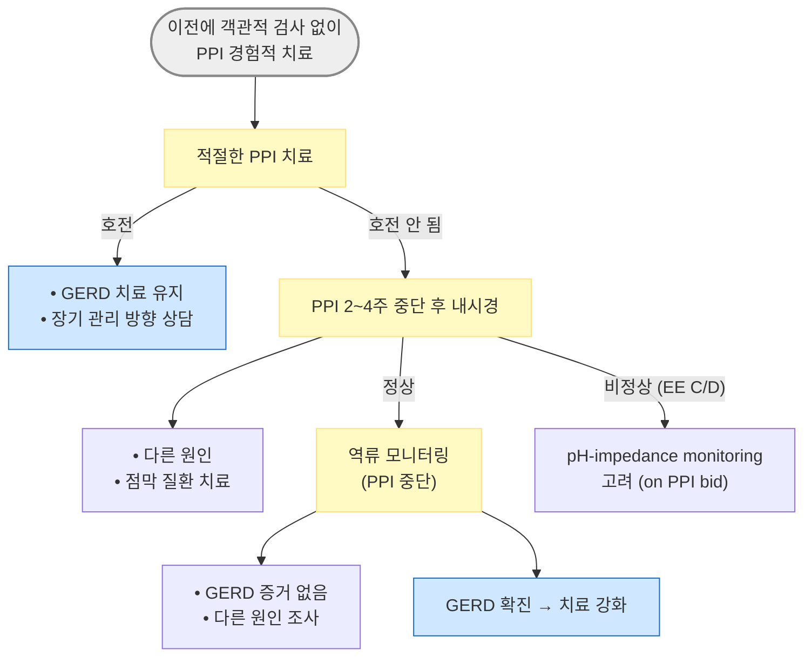
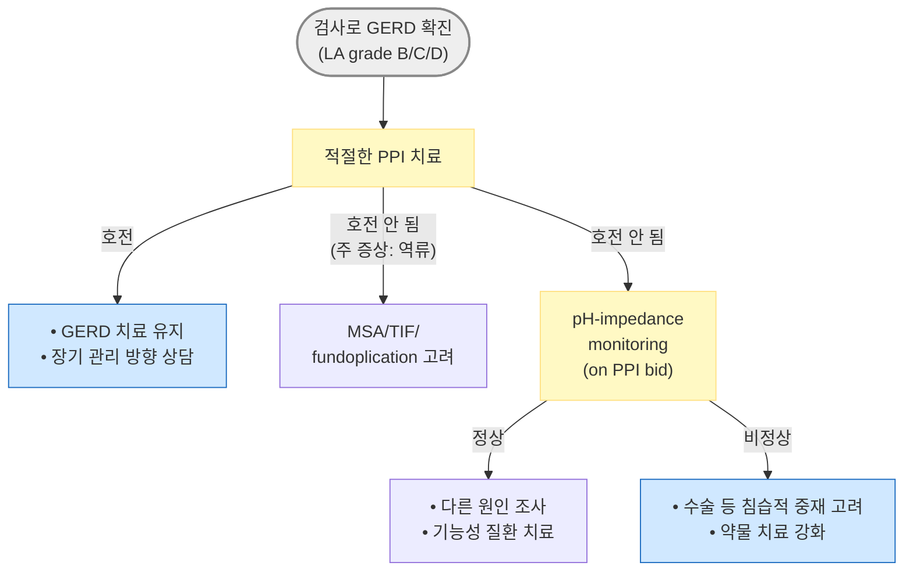

# 위식도역류질환 GERD

## <mark style="color:green;">일반 사항</mark>

* 위장 내용물 또는 위산의 역류로 인하여 일상생활에 의미 있는 지장을 주는 증상이나 합병증이 발생한 상태 (Montreal 정의, 2006)
* 유병률 : 미국 성인의 \~40%가 역류 증상 경험; 동아시아는 상대적으로 낮으나 증가 추세
* 모든 역류가 증상을 일으키는 것은 아니며 약간의 위식도역류는 대부분 정상 상태임
  * 역류 빈도와 식도염의 상관관계는 낮음; 역류의 중증도와 증상 정도는 비례하지 않음
* 역류에 대한 치료를 중단하면 재발하는 경우가 많음
* 합병증 : 바렛 식도 (adenocarcinoma 위험), peptic stricture, 식도 외 합병증

### <mark style="color:orange;">분류</mark>

<table><thead><tr><th width="190">아형</th><th width="190.52630615234375">비율</th><th>특징</th></tr></thead><tbody><tr><td><strong>NERD</strong> (Non-erosive reflux disease)</td><td>GERD의 50~85%</td><td>내시경상 점막 손상 없음; 비전형·식도 외 증상 주; 심각한 상태로의 진행 위험 낮음</td></tr><tr><td><strong>ERD</strong> (Erosive reflux disease)</td><td>GERD의 약 30~40%</td><td>내시경상 reflux esophagitis; 증상 중증도 더 높음; PPI 치료 반응이 NERD보다 양호</td></tr><tr><td><strong>바렛 식도</strong><br>(Barrett's esophagus)</td><td>만성 GERD의 5~15%(장기 증상 환자 기준)</td><td>식도 원주상피 화생; 식도 선암 위험 10~55배 ↑; 이형성 정도에 따라 감시 간격 조정</td></tr></tbody></table>


**GERD ≠ 산 과다 질환** : GERD 증상은 강한 산 역류만으로 발생하는 것이 아니며, weakly acidic reflux, non-acid reflux, reflux hypersensitivity(식도 지각 과민), 기능성 가슴쓰림 등이 동등하게 중요한 병태생리로 작용. 특히 NERD 환자의 상당수(\~40%)는 산 억제제에 반응이 낮은 기능성 기전이 주된 원인이며, 동일한 "GERD"라도 표현형(phenotype)에 따라 최적 치료 전략이 달라짐


**바렛 식도 감시 내시경 권고 간격**

* 이형성 없음 - 길이 ＜3 cm (short-segment) : 5년
* 이형성 없음 - 길이 ≥3 cm (long-segment) : 3년
* 저등급 이형성 (low-grade dysplasia, LGD) : 6\~12개월 (내시경 치료 또는 집중 감시)
* 고등급 이형성 (high-grade dysplasia, HGD) : 내시경 절제술 또는 고주파 절제 치료 고려


국내 및 아시아권에서는 바렛 식도 진단 시 조직검사상 장상피화생(intestinal metaplasia, IM) 확인을 핵심으로 보는 경향이 강함. IM 음성 바렛 식도는 선암 위험이 낮아 감시 간격이 달라질 수 있음


## <mark style="color:green;">원인 및 위험 인자</mark>

#### <mark style="color:$primary;">병태생리</mark>

* 위식도접합부 괄약근 압력 감소 → 하부식도괄약근(LES)의 일시적 부적절한 이완 (transient LES relaxation, TLESR)
* 타액 분비 저하 → 식도 산 청소율 감소
* 위산 비움 장애 (gastroparesis, 위 운동 저하)
* Hiatal hernia → hernia sac에서의 위산 저류 (acid pocket 형성)


_H. pylori_ 제균 후 위산 분비가 정상화되거나, 감염으로 인한 위축성 위염(위산 분비 감소)이 사라지면서 GERD가 새로 발생하거나 악화될 수 있음; 헬리코박터 유병률 감소가 GERD 증가와 관련된다는 보고 있음


#### <mark style="color:$primary;">위험 인자</mark>

* 비만, 과식, 폭식, 음주, 흡연
* 음식 : 매운 음식, 신 음식, 고지방식, 카페인 (개인차 있음)
* 임신
* 약물&#x20;

**LES 압력 감소 또는 위배출 지연 약물**

* 매우 높음 : CCB, nitrate, opioid; LES 압력 감소, 위배출 저하
* 높음 : 항콜린제, TCA, progesterone, theophylline; LES 이완, 위장운동 저하
* 중등도 : benzodiazepine, 도파민 작용제, GLP-1 수용체 작용제; LES tone 감소 또는 위배출 지연
* 중등도\~낮음 : quinidine; LES tone 감소 가능

　✽ β-차단제는 일부 보고 있으나 LES 직접 억제 근거는 약함

**식도 점막 직접 손상 약물 (pill esophagitis)**

* bisphosphonate : 대표적 약물성 식도염 원인
* doxycycline·tetracycline캡슐 : 정체 시 궤양 유발 가능
* potassium chloride : 국소 점막 손상 가능
* 철분제 : 식도 자극 가능
* NSAID, aspirin : 점막 손상 및 증상 악화 가능

## <mark style="color:green;">임상 양상</mark>

* 전형적 증상 : 위산 역류(신맛), 가슴쓰림(작열감), 삼킴곤란 - 주로 식후, 앙와위, 전굴 자세에서 악화
* 비전형 증상 : 상복부 압박감/통증, 소화불량, 구역, 복부 팽만, 트림, 입 냄새, 흉통, 목구멍 이물감(globus)
* 식도 외 증상 (LPR 포함) : 만성 기침, throat clearing, 쉰 목소리, 인후염, 천식·쌕쌕거림, 기관지 경련, dental erosion (치과적 합병증); 중이염·비부비동염과의 연관성도 보고되나 근거 강도는 낮음


인후 증상, 만성 기침, 쉰 목소리 등은 GERD와 연관될 수 있으나, GERD가 단독 원인인 경우는 제한적이며 과진단에 주의. 전형적 GERD 증상이 없는 경우 식도 외 증상을 GERD만으로 귀인하기 전에 이비인후과·호흡기 질환을 먼저 평가하는 것이 중요


### <mark style="color:$danger;">🚩 Red Flags!</mark>

(☞ [위장질환의 감별](074_.md#step-1-red-flags))

<mark style="color:$danger;">**즉각 조치 또는 의뢰**</mark>

* 토혈 또는 흑색변 → 상부 위장관 출혈
* 급격한 연하곤란 + 고형식 불통과 → 식도 종양·폐쇄
* 심한 흉통 →  급성 관동맥 증후군

<mark style="color:$warning;">**당일 또는 조기 의뢰**</mark>

* 설명되지 않는 체중 감소 (＞5% / 3\~6개월)
* 진행성 연하곤란 (고형식 → 연식으로 진행)
* 빈혈&#x20;
* 반복적 구토 또는 음식 regurgitation

<mark style="color:$info;">**외래 추적 / 추가 평가 계획**</mark> <mark style="color:$info;">- 즉각 위험 낮으나 호전 없으면 의뢰</mark>

* 50세 이상 + ＞5년 만성 GERD 증상 → 바렛 식도 선별
* 8주간 표준 PPI 치료에도 반응 없는 증상
* 비전형 증상(흉통, 만성 기침)으로 심·폐 질환 배제 후 추가 평가 필요
* 재발 반복 또는 지속적 치료가 필요한 상태

## <mark style="color:green;">진단</mark>

* 확립된 단일 표준 진단 기준(gold standard)은 없음
  * 전형적 증상에 기반한 미란성 식도염 진단의 민감도 30\~76%, 특이도 62\~96%
* 전형적인 가슴쓰림과 역류 증상이 있으나 경고 증상이 없는 환자 → 진단 검사 없이 경험적 PPI 치료 (qd 식전 × 8주) 후 반응 평가; 민감도 78%, 특이도 54%
* 가슴쓰림 없는 흉통 → 심질환 우선 배제 후, GERD를 포함한 식도 원인 평가 고려


**경험적 PPI 시험 치료** : 전형적 증상 + 경고 증상 없는 경우, PPI qd 식전 8주 투여 후 반응 평가. 완전 호전 → GERD 추정. 불완전 호전 또는 재발 → 내시경 검사 고려


#### <mark style="color:$primary;">내시경 검사</mark>

* 유의미한 수준의 민감도 및 특이도 없음; 가슴쓰림 환자의 ⅔에서 내시경으로 진단 안 됨
* 일률적 시행은 권고하지 않음

**내시경 검사 적응증**

* 경고 징후 (연하곤란, 체중 감소, 위장관 출혈, 빈혈)
* 4\~8주간 충분한 용량의 PPI 치료에도 지속되는 전형적 GERD 증상
* 잦은 GERD 증상으로 지속적 치료가 필요한 상태
* 비전형·식도 외 증상에 대한 감별이 필요한 상태
* 만성(＞5년) 증상을 가진 ＞50세 남성 (바렛 식도 선별)
* 소매 위절제술(sleeve gastrectomy) 또는 경구내시경 근절개술(POEM) 시행 후 GERD 증상 발생 - 내시경만으로는 제한적이며 UGI 조영술 또는 pH 모니터링 병행 권고
* 가급적 (2\~)4주간 PPI 투여 중단 후 검사 (그 사이 증상 완화용으로 제산제 복용 가능)
* 바렛 식도 외에 반복 시행은 필요 없음

**LA 분류 (Los Angeles classification of reflux esophagitis)**

<table><thead><tr><th width="139.52630615234375">등급</th><th>내시경 소견</th><th>임상적 의의</th></tr></thead><tbody><tr><td><strong>LA Grade A</strong></td><td>mucosal fold(s) 내 ≤5 ㎜ 크기의 미란, 몇 개 이하</td><td>정상과 구별 어려움; 단독으로는 GERD 진단 불충분</td></tr><tr><td><strong>LA Grade B</strong></td><td>mucosal fold(s) 내 ＞5 ㎜ 미란, 몇 개 이하</td><td>전형적 역류 증상 + PPI 반응 있으면 GERD 진단 가능</td></tr><tr><td><strong>LA Grade C</strong></td><td>mucosal fold를 넘어서는 미란 (전체 둘레의 ≤¾)</td><td>GERD 확진 (C·D는 중증 EE); P-CAB 또는 PPI 고용량 치료 고려</td></tr><tr><td><strong>LA Grade D</strong></td><td>전체 둘레의 ＞¾에 걸친 confluent erosions</td><td>중증; 적극적 치료 및 조기 재평가 필요</td></tr></tbody></table>

* 조직검사는 GERD 진단적 가치가 없지만 호산구성 식도염 배제를 위해 시행 가능

#### <mark style="color:$primary;">24시간 보행 식도 역류 모니터링</mark>

* 가장 신뢰도 높은 진단법 (ambulatory esophageal reflux monitoring)
* 적응 : GERD가 의심되지만 내시경에서 GERD 증거가 없는 경우
* 검사 7일 전부터 PPI 투여 중단 필요
* LA grade C·D 또는 long-segment Barrett's esophagus (＞3 ㎝) 환자에서는 단독 역류 모니터링 불필요

#### <mark style="color:$primary;">식도 압력측정법 (Esophageal manometry)</mark>

* 기능성 가슴쓰림, 이완불능증(achalasia), 하부식도경련 등 위장 운동 이상 진단
* 내시경 정상인 GERD 의심 환자에서 고려

#### <mark style="color:$primary;">UGI 조영 촬영</mark>

* 해부학적 이상 (hiatal hernia 등) 진단에 도움
* GERD 진단 목적으로는 권고하지 않음 (조영 촬영만으로 GERD 진단 불가)

#### <mark style="color:$primary;">H. pylori 검사</mark>

* 제균 치료 대상이 되는 경우 외에는 권고하지 않음

#### <mark style="color:$primary;">실험실 검사</mark>

* 빈혈 검사 (ferritin, TIBC, Fe, reticulocyte), Vit B12 (특히 PPI 장기 사용자), 대변 잠혈

### <mark style="color:orange;">감별</mark>

#### <mark style="color:$primary;">질환별 감별 포인트</mark>

<table><thead><tr><th width="210">질환</th><th>감별 포인트</th></tr></thead><tbody><tr><td>급성 관동맥 증후군</td><td>흉통 시 먼저 배제 필수; ECG, 심근효소</td></tr><tr><td>기능성 소화불량 (FD)</td><td>역류 증상 없음; 식후 포만감·조기 포만감 위주; FD-GERD overlap도 흔함</td></tr><tr><td>소화성 궤양</td><td>공복 통증, 음식으로 완화; 내시경으로 확인</td></tr><tr><td>호산구성 식도염</td><td>젊은 남성, 연하곤란, 알레르기력; 조직검사로 확진 (eosinophil ≥15/HPF)</td></tr><tr><td>이완불능증 (achalasia)</td><td>고형식·액체 모두 연하곤란; 식도 압력측정으로 확진</td></tr></tbody></table>

#### <mark style="color:$primary;">GERD 표현형별 역류 감별 (Rome IV 기반)</mark>

<table><thead><tr><th width="153.1578369140625">구분</th><th width="117.368408203125">역류 검사</th><th width="136.842041015625">증상-역류 연관성</th><th>특징 및 치료 접근</th></tr></thead><tbody><tr><td><strong>True GERD</strong></td><td>비정상 acid exposure</td><td>있음</td><td>전형적 GERD; PPI/P-CAB 반응 양호</td></tr><tr><td><strong>Reflux hypersensitivity</strong></td><td>정상 acid exposure</td><td>있음 (증상-역류 상관 양성)</td><td>식도 지각 과민; acid suppression 일부 효과; neuromodulator 도움 가능</td></tr><tr><td><strong>Functional heartburn</strong></td><td>정상</td><td>없음 (상관 음성)</td><td>기능성 통증; acid suppression 효과 제한적; neuromodulator, behavioral approach 중심</td></tr></tbody></table>


PPI 불응 환자에서 "지속적인 산 역류"만을 의미하지 않는다. Reflux hypersensitivity와 functional heartburn은 refractory GERD와 혼동되기 쉬우며, 반복적인 PPI 증량보다 표현형 재평가가 먼저다.


***



<p align="center"><strong>GERD 진단 알고리듬</strong></p>

<p align="center"><em><mark style="color:$info;">Ref. Katz PO et al. ACG Clinical Guideline: GERD. Am J Gastroenterol. 2022;117:27–56. Fig 1.</mark></em></p>

***

***



<p align="center"><strong>식도 외 GERD 증상 진단 알고리듬</strong></p>

<p align="center"><em><mark style="color:$info;">Ref. Katz PO et al. ACG Clinical Guideline: GERD. Am J Gastroenterol. 2022;117:27–56. Fig 2.</mark></em></p>

***

## <mark style="background-color:$warning;">Management</mark>

### <mark style="color:orange;">치료 원칙</mark>

* 생활 습관 개선 + 약물 치료 병행
* 전형적 증상이 있고 경고 증상이 없으면 진단적 검사 없이 역류 질환으로 간주하고 경험적 약물 치료
* PPI 치료로 호전되지 않으면 검사 또는 다른 질환 고려
* 객관적 검사로 역류가 입증되지 않은, 전형적 증상 없는 식도 외 증상에 대하여 경험적 PPI 요법은 권고하지 않음 \[ACG]

### <mark style="color:orange;">표현형 기반 접근 (Phenotype-based approach)</mark>

<table><thead><tr><th width="148.84210205078125">Phenotype</th><th>임상 특징</th><th width="130.4210205078125">PPI 반응</th><th>우선 치료 전략</th></tr></thead><tbody><tr><td><strong>Acid-dominant GERD</strong></td><td>전형적 가슴쓰림·산 역류, EE 동반 가능</td><td>양호</td><td>PPI 또는 P-CAB 표준 치료</td></tr><tr><td><strong>Nocturnal GERD</strong></td><td>야간 각성, 새벽 증상, 앙와위 악화</td><td>야간 breakthrough 흔함</td><td>P-CAB 우선 고려; 취침 전 H2RA 단기 추가; 침상 상체 거상</td></tr><tr><td><strong>Regurgitation-dominant</strong></td><td>"올라오는 느낌", volume reflux, 식후·전굴 시 악화</td><td>산 억제만으로 불충분 가능</td><td>alginate 우선 추가; baclofen 고려; 지속 시 항역류 시술 평가</td></tr><tr><td><strong>Meal-related reflux</strong></td><td>식후 즉각 악화, 과식·지방식 후 유발</td><td>중등</td><td>소식·체중 감량; alginate 병용 (acid pocket 차단)</td></tr><tr><td><strong>Hypersensitivity phenotype</strong></td><td>증상 강도 ≫ 검사 이상; 흉통·불안 동반 가능</td><td>제한적</td><td>neuromodulator; reassurance; behavioral approach</td></tr><tr><td><strong>Functional overlap</strong></td><td>복부 팽만, 조기 포만감, IBS/FD overlap</td><td>증상 변동성 큼</td><td>FD/IBS 동반 평가 및 통합 치료</td></tr></tbody></table>


동일한 "GERD"라도 phenotype에 따라 치료 반응과 최적 전략이 달라진다. 특히 PPI 불응 환자에서는 "어느 표현형인가?"를 먼저 재평가하는 것이 무조건적인 PPI 증량보다 중요하다.


***



<p align="center"><strong>증상 패턴별 처방 방향 알고리듬</strong></p>

***

***





<p align="center"><strong>GERD 증상 관리 알고리듬</strong></p>

<p align="center"><em><mark style="color:$info;">Ref. Katz PO et al. ACG Clinical Guideline: GERD. Am J Gastroenterol. 2022;117:27–56. Fig 3.</mark></em></p>

***

## <mark style="color:green;">비-약물 치료 및 예방</mark>

* 정상 체중 유지 : 과체중 또는 최근 체중 증가 시 체중 감량
* 금연, 음주 제한
* 운동 : 매일 30분의 중등도 이상의 신체 활동; 과도한 운동 회피 (마라톤 등 지나친 달리기는 해로울 수 있음)
* 식이 조절
  * 소식, 잘 씹어 먹을 것
  * 식사 중 및 식사 후 upright 자세 유지; 식사 후 3시간 이내 눕지 않음, 취침 전 2\~3시간 식사 피함
  * 카페인 음료 (커피·차)와 탄산음료는 1일 2잔 이하로 제한
  * 유발 음식 회피 (개인차 있음) : 지방식, 매운·자극적 음식, 산성 음식 (귤, 토마토)
* 야간 증상 시 : 침대 상체 부위를 약 15 ㎝ 올림 (머리만 올려서는 효과 없음; wedge pillow 이용), 왼쪽 측와위 취침
* 기타 : 허리 조이는 옷 피함, 유발 약물 복용 회피


**다음 5가지 생활습관 실천 시 약물 복용 50% 감소** 보고 : ⓵ 금연, ⓶ 카페인 ≤2컵/일, ⓷ 'prudent' 식단 (채소·과일·콩류·생선·전곡류), ⓸ 중등도 이상 신체 활동 ≥30분/일, ⓹ 정상 체중 (BMI ＜25) 유지


## <mark style="color:green;">약물 치료</mark>

* 경증, 간헐적 증상 : 필요시 제산제 또는 H2-차단제 투여
* NERD : H2-차단제 또는 PPI
* ERD 또는 지속되는 불편한 증상 : PPI (또는 P-CAB)
* EE 환자의 치료 반응이 NERD보다 양호함 (PPI 4주 치료 시 완전 증상 회복 : EE 70~~80% vs NERD 50~~60%); NERD 환자의 상당수가 기능성 기전 관련

### <mark style="color:orange;">PPI (Proton Pump Inhibitor)</mark>

* GERD의 가장 효과적인 약물 치료
* 치료율 : 가슴쓰림 완화 80\~90%, 완전 해소 \~50%; esophagitis healing \~80%
* 투여 후 4일 내 효과 발현; 최대 효과까지 수일 소요
* PPI 최대 효과 도달까지 초기 수일간 H2RA 병용 고려; 병용 시 주간 PPI + 취침 시 H2RA (보험 주의)
* 약제 선택은 비용·순응도·약물 상호작용 위주로 결정 - PPI 제제 간 임상적 치유율은 거의 차이가 없음
  * 산 억제 효능 상대치 (omeprazole 기준, 연구마다 차이 있음) : lansoprazole 0.90, pantoprazole 0.23, esomeprazole 1.60, rabeprazole \~1.60
* 표준 용량
  * omeprazole  : 20 ㎎ qd <mark style="color:blue;">\[오엠피]</mark>
  * esomeprazole : 40 ㎎ qd <mark style="color:blue;">\[넥시움]</mark>
  * lansoprazole : 30 ㎎ qd <mark style="color:blue;">\[란스톤]</mark>
  * dexlansoprazole : 60 ㎎ qd <mark style="color:blue;">\[덱실란트 디알]</mark> - 이중 지연 방출, 식사 무관 복용 가능
  * pantoprazole : 40 ㎎ qd <mark style="color:blue;">\[판토록]</mark>
  * rabeprazole: 20 ㎎ qd <mark style="color:blue;">\[파리에트]</mark>

#### <mark style="color:$primary;">용법</mark>

* 초치료 : 표준 용량으로 NERD 4주, ERD 8주 투여
* 투여 시간 : 펌프가 활성화되는 식전 30\~60분 복용; qd → 아침 식전, bid → 아침·저녁 식전; dexlansoprazole은 식사 무관
* 조절 불충분 시 : 복용 시간·순응도 먼저 평가 → 약제 교체 또는 증량 (표준 용량 bid × 8주) 또는 검사 고려
* 유지 치료 : 최소 유효 용량·간헐적 투여 지향 (✽흔히 치료 중단 3개월 내 증상 재발)
  * NERD : H2-차단제 bid 지속 또는 PPI 간헐적·필요시 투여
  * 식도 합병증 있었던 환자, PPI bid 투여 후 : PPI 최소 유효 용량 유지
  * 식도염에서 간헐적 투여는 효과적이지 않다는 보고 있음


**PPI 장기 사용 관련 부작용** : 골절, _Clostridioides difficile_ 감염, 저마그네슘혈증, Vit B12 결핍, 신질환 등과의 연관성이 보고되어 있으나, 대부분 observational data 기반이며 인과관계는 명확하지 않음. 명확한 적응증이 있다면 PPI 지속의 이득이 위험을 상회하는 경우가 많음. 다만 장기 사용 시 정기적 재평가를 권고

**CYP450 약물 상호작용** : omeprazole·esomeprazole + 클로피도그렐 병용 시 항혈소판 효과 감소 가능 (CYP2C19 경쟁 억제); pantoprazole·rabeprazole은 상대적으로 안전하여 클로피도그렐 병용 시 대안으로 권고. 중단 시 반동성 위산 과다 분비 주의 (서서히 감량 또는 H2RA로 전환 고려)


### <mark style="color:orange;">P-CAB (Potassium-Competitive Acid Blocker)</mark>


PPI와 달리 활성화에 산성 환경이 불필요하여 식사 무관 복용, 빠른 효과 발현 (PPI 대비 초기 산 억제 우월), CYP2C19 유전자형에 따른 개인차 적음


#### <mark style="color:$primary;">P-CAB 우선 고려 상황</mark>

* 중증 EE (LA grade C/D) - PPI 대비 우월한 치유율 근거 축적 중
* 야간 증상 - 야간 acid breakthrough 억제에 유리
* 신속한 증상 조절이 필요한 경우 - 투여 초기부터 빠른 효과 발현
* CYP2C19 extensive metabolizer 의심 - PPI 대사가 빨라 효과 감소
* PPI 부분 반응 - 약제 교체 선택지

#### <mark style="color:$primary;">약제</mark>

* tegoprazan <mark style="color:blue;">\[케이캡]</mark>
  * 부작용(＞1%) : 구역, 설사, 소화불량, 흉부 불편감
  * 주의·금기 : 간·신 장애, 고령, 임부, 수유부
  * 약물 상호작용 : 위산 의존 흡수 약물 (atazanavir, nelfinavir, rilpivirine) 농도 저하
  * 용법 : NERD 50 ㎎ qd × 4주; ERD 50 ㎎ qd × 4\~8주; 식사 무관
* fexuprazan <mark style="color:blue;">\[펙수클루]</mark>
  * 2022년 국내 허가 (ERD 치료); esomeprazole 대비 비열등한 EE 치유율
  * 용법 : ERD 40 ㎎ qd × 4\~8주; 식사 무관
* zastaprazan <mark style="color:blue;">\[자큐보]</mark>
  * 2024년 국내 허가 (ERD 치료), 국산 37호 신약 (제일약품)
  * 용법 : ERD 20 ㎎ qd × 4주 (미치유 시 4주 추가); 식사 무관

### <mark style="color:orange;">H2-수용체 차단제 (H2RA)</mark>

* 대상 : PPI 초기 수일간 병용; PPI로 증상 호전된 NERD의 유지; PPI 투여 불가 또는 야간 가슴쓰림 시 취침 전 추가
* 투여 30분 후 효과 발현, 약 8시간 지속; 장기 사용 시 tachyphylaxis로 효과 감소 주의

#### <mark style="color:$primary;">약제</mark>

* cimetidine : 200\~400 ㎎ bid <mark style="color:blue;">\[에취투비]</mark>
* famotidine : 10\~20 ㎎ bid <mark style="color:blue;">\[가스터]</mark>
* lafutidine : 10 ㎎ qd\~bid<mark style="color:blue;">\[스토가]</mark>

### <mark style="color:orange;">제산제</mark>

* 경증에서 가장 빠르게 속쓰림 증상을 완화 (지속 시간 ＜2시간)
* 신장병 환자에서는 Mg 함유 제제 사용을 피함
* almagate <mark style="color:blue;">\[알마겔]</mark>, aluminum hydroxide <mark style="color:blue;">\[암포젤]</mark>

### <mark style="color:orange;">점막 보호제</mark>

* alginic acid : 1\~3 g tid\~qid <mark style="color:blue;">\[라미나지]</mark>
  * 위 내용물 위에 부유하는 gel barrier를 형성하여 acid pocket을 중화·차단 - 식후 및 postprandial reflux에 특히 유효; alginate + 제산제 병용 시 효과 증대
  * 임신, 식후 breakthrough 증상, regurgitation-dominant 환자에서 유용
* sucralfate : 1 g qid (매 식전 1시간 및 취침 시) <mark style="color:blue;">\[아루사루민]</mark> (비보험)
  * 임신 중 가슴쓰림 완화에 사용 가능; 일반 GERD 치료제로는 권고하지 않음 \[ACG]
* eupatilin : 60 ㎎ tid <mark style="color:blue;">\[스티렌]</mark>, 90 ㎎ bid <mark style="color:blue;">\[스티렌 투엑스]</mark>

### <mark style="color:orange;">위장관 운동 촉진제</mark>

* 객관적인 gastroparesis의 증거가 없는 한 GERD 치료 목적의 투여는 권고하지 않음 \[ACG]
* metoclopramide <mark style="color:blue;">\[맥페란]</mark> : 장기 투여 시 tardive dyskinesia 등 심각한 부작용
* itopride <mark style="color:blue;">\[가나칸]</mark>, mosapride <mark style="color:blue;">\[가스모틴]</mark>, corydaline <mark style="color:blue;">\[모티리톤]</mark>

### <mark style="color:orange;">기타 약제</mark>

#### <mark style="color:$primary;">하부식도 괄약근 작용제 (GABA-B 수용체 작용제)</mark>

* 작용 : TLESR 억제 → LES 괄약근 이완 빈도 감소
* 적응 : 최적 PPI 치료에도 지속되는 역류 증상 + 객관적 GERD 증거; 특히 regurgitation 또는 belching predominance 환자에서 유효
* 금기 : CNS 이상 (뇌전증, 뇌졸중 등); 저용량 시작 후 점차 증량 (졸음, 어지럼 고려)
* baclofen : 5\~10 ㎎ tid <mark style="color:blue;">\[바크론]</mark>

#### <mark style="color:$primary;">항우울/항불안제 (Neuromodulator)</mark>

* reflux hypersensitivity·기능성 가슴쓰림, 우울·불안증이 GERD와 관련되는 경우 유효
* TCA, SSRI/SNRI, trazodone
* imipramine <mark style="color:blue;">\[이미프라민]</mark> 또는 nortriptyline <mark style="color:blue;">\[센시발]</mark> : 25 ㎎ 취침 시

#### <mark style="color:$primary;">Simethicone</mark>

* 팽만 완화에 간혹 도움
* 40\~80 ㎎ tid 식후 또는 취침 시 <mark style="color:blue;">\[가소콜]</mark>

## <mark style="color:green;">난치성 GERD (Refractory GERD)</mark>

* 정의 : 적절한 복약 순응도 하에서 PPI bid 8주 이상 투여에도 증상이 지속되는 경우


**Refractory GERD ≠ 지속적인 산 역류** : PPI bid 8주 이상에도 증상이 지속될 때, 무조건적인 PPI 증량이나 반복 교체 전에 원인을 재평가하는 접근이 중요. 실제 원인은 복약 오류, 기능성 질환 overlap, reflux hypersensitivity, supragastric belching, rumination syndrome, 기능성 소화불량, 불안·과각성 상태 등 다양


#### <mark style="color:$primary;">PPI가 효과 없는 경우 확인 사항</mark>

<table><thead><tr><th width="244.21051025390625">확인 사항</th><th>임상적 의미</th></tr></thead><tbody><tr><td>복용 시간 오류</td><td>PPI를 식후 복용하는 경우 매우 흔함 - 반드시 식전 30~60분 복용 확인</td></tr><tr><td>복약 순응도 부족</td><td>간헐적 복용, 조기 중단 여부 확인</td></tr><tr><td>야식·야간 음주</td><td>야간 reflux 지속의 흔한 원인</td></tr><tr><td>과식·비만·체중 증가</td><td>복압 증가 → 역류 악화</td></tr><tr><td>Regurgitation predominance</td><td>volume reflux는 acid suppression만으로 불충분 가능</td></tr><tr><td>기능성 질환 overlap</td><td>FD, IBS overlap 시 bloating·불편감 지속 가능</td></tr><tr><td>Reflux hypersensitivity</td><td>acid exposure는 정상이나 식도 지각 과민 존재 가능</td></tr><tr><td>Functional heartburn</td><td>GERD가 아닌 기능성 통증일 수 있음</td></tr><tr><td>Supragastric belching / rumination</td><td>식도로 공기를 빨아들였다 즉시 내뱉는 behavioral disorder; 반복적 트림·역류감 유발 - 약물이 아닌 인지행동치료·언어치료(speech therapy)가 우선; baclofen 보조 고려</td></tr><tr><td>비GERD 질환</td><td>호산구성 식도염, achalasia, 심질환 등 감별 필요</td></tr></tbody></table>

#### <mark style="color:$primary;">처치 원칙</mark>

* 약제 교체 또는 증량 (표준 용량 bid × 8주), 야간 증상 시 취침 전 H2RA 단기 추가
* PPI 중단 시 반동성 위산 과다 방지 : 2\~4주에 걸쳐 서서히 감량하거나 H2RA로 전환 후 중단 고려&#x20;
* 약물의 일상적인 추가 또는 두 가지 이상의 PPI 병용은 하지 않음
* PPI의 다른 적응증이 없는 한, 역류 검사에서 음성이면 PPI 중단 고려
* 추가 검사 고려
  * pH 모니터링 (역류 입증 미확인 환자)
  * pH-impedance monitoring on PPI bid (확인된 GERD로 PPI bid 치료에 부반응 시)
* 확인된 GERD로 PPI 조절 불가 시 → P-CAB으로 교체 고려; 수술적 치료 고려

## <mark style="color:green;">시술 및 기타 처치</mark>


수술적·내시경적 치료는 약물 치료에 반응하면서도 장기 약물 부작용이 우려되거나, 약물 중단 시 증상 재발이 반복되는 경우에 고려. 수술 전 반드시 객관적 역류 증거 (내시경 또는 pH 검사)를 확인


* 복강경 Nissen fundoplication : 표준 수술 치료; 최적 PPI 치료와 증상 조절 효과 유사하나 수술 합병증 및 부작용 (dysphagia, gas bloat syndrome) 고려
* 자기 괄약근 보조 장치 (MSA, LINX®) : 식도 하부에 자기 구슬 링 삽입; LES 압력 보강; 합병증 적고 삼킴 장애 발생률 낮음
* 경구 내시경 무절개 위저 성형술 (TIF, Transoral Incisionless Fundoplication) : 내시경적 partial fundoplication; 절개 없음; 중등증 GERD에 선호; hiatal hernia ＞2 cm이면 복강경 수복 병행 고려 (cTIF)

***

### <mark style="color:red;">질병코드</mark>

K21.0　식도염을 동반한 위-식도역류병

K21.9　식도염을 동반하지 않은 위-식도역류병

***

## <mark style="color:purple;">처방례</mark>

> **처방례 1. NERD / 경증·간헐적 증상**
>
> ```
> 가스터 20 ㎎/T   1T   bid   × 2주
> 알마겔 현탁액    1P   필요시
> ```
>
> _✽경증 또는 NERD에서 H2RA를 1\~2주 단기 투여. 증상 호전 후 필요시(prn) 투여로 전환 가능. 제산제는 즉각 증상 완화용으로 병용._

> **처방례 2. ERD (중등증, PPI 기반)**
>
> ```
> 덱실란트 디알 60 ㎎/C   1C   qd (식사 무관)   × 8주
> 라미나지 액              1P   tid (공복)
> ```
>
> _✽ERD에 대한 표준 PPI 치료 8주. dexlansoprazole은 이중 방출로 복용 시간 제약 없으며 야간 산 억제에 유리. alginic acid는 식후 acid pocket 차단 및 점막 보호 효과로 병용._

> **처방례 3. ERD (P-CAB - 중증 EE 또는 PPI 불충분 반응)**
>
> ```
> 케이캡 50 ㎎/T   1T   qd (식사 무관)   × 8주
> 알마겔 현탁액    1P   필요시
> ```
>
> _✽LA grade C/D의 중증 EE, PPI 불충분 반응, CYP2C19 extensive metabolizer 의심, 또는 야간 증상이 두드러질 때 P-CAB 선택. 첫날부터 최대 효과 발현이 장점._

> **처방례 4. 야간 증상 동반 또는 PPI 치료 초기 보조**
>
> ```
> 넥시움 40 ㎎/T   1T   아침 식전 30~60분
> 스토가 10 ㎎/T   1T   취침 시          (보험주의)
> ```
>
> _✽PPI 효과 발현 초기(1\~2주) 또는 야간 가슴쓰림 조절 불충분 시 취침 전 H2RA를 단기 추가. 장기 병용 시 tachyphylaxis 및 보험 기준 확인 필요._

***

### <mark style="color:$success;">핵심 복약 지도</mark>

**PPI 복용 시간이 핵심**

* PPI (dexlansoprazole, P-CAB 제외)는 반드시 **식전 30\~60분** 복용 - 위산 펌프가 활성화될 때 작용해야 효과적; 식후 복용 시 효과 현저히 감소
* dexlansoprazole <mark style="color:blue;">\[덱실란트 디알]</mark>, P-CAB (tegoprazan <mark style="color:blue;">\[케이캡]</mark>, fexuprazan <mark style="color:blue;">\[펙수클루]</mark>, zastaprazan <mark style="color:blue;">\[자큐보]</mark>) 은 식사 무관 복용 가능

**임의 중단 주의**

* GERD는 만성 질환으로 치료 중단 후 3개월 내 재발이 흔함; 의사 지시 없이 임의 중단하지 말 것
* PPI 갑자기 중단 시 반동성 위산 과다 분비 발생 가능 - 서서히 감량 권장

**약물 상호작용 주의 사항**

* omeprazole, esomeprazole + 클로피도그렐 병용 시 항혈소판 효과 감소 가능 → 의사에게 반드시 알릴 것
* P-CAB + 위산 의존성 흡수 약물 (atazanavir, rilpivirine 등) 병용 시 해당 약물 혈중 농도 저하 가능

**장기 복용 모니터링**

* PPI 1년 이상 장기 복용 시 정기 재평가; 혈청 마그네슘·Vit B12 수치 확인 권장 (관련 부작용은 observational 근거로 인과관계 불명확하나 주의 필요)
* 신장 기능 저하 환자에서 Mg 함유 제산제 주의

***

### <mark style="color:blue;">환자 안내서</mark>

**위식도역류질환(GERD)이란?**

위산이나 위 내용물이 거꾸로 식도로 올라와 가슴 쓰림, 신트림, 목 이물감 등을 일으키는 병입니다. 치료하지 않으면 식도 점막이 손상되고, 드물게 식도암 위험도 높아질 수 있습니다.

**생활습관이 절반입니다**

* 과식하지 말고 천천히 씹어 드세요
* 식사 후 바로 눕지 말고 최소 3시간은 앉아 계세요
* 취침 시 오른쪽보다 왼쪽으로 주무세요; 베개는 어깨까지 높이 받쳐 주세요
* 담배는 반드시 끊으세요; 커피·탄산음료는 하루 2잔 이하로 줄이세요
* 체중이 많이 나가신다면 5\~10% 감량만으로도 증상이 크게 좋아질 수 있습니다

**약은 이렇게 드세요**

* PPI 계열 약 (오메프라졸, 에소메프라졸, 란소프라졸, 파리에트)은 **밥 먹기 30\~60분 전**에 드세요 - 식후 복용하시면 효과가 크게 떨어집니다
* 덱실란트, 케이캡, 펙수클루, 자큐보는 식사와 관계없이 드셔도 됩니다
* 증상이 좋아졌다고 마음대로 약을 끊지 마세요 - 재발이 잘 되는 병입니다

**이런 증상이 새로 생기면 빨리 병원을 찾으세요**

* 음식을 삼키기가 갈수록 어려워질 때
* 이유 없이 체중이 빠질 때
* 토혈(피가 섞인 구토)이나 검은색 변이 나올 때
* 가슴 통증이 새로 생기거나 심해질 때
