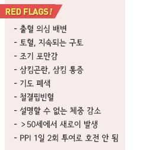
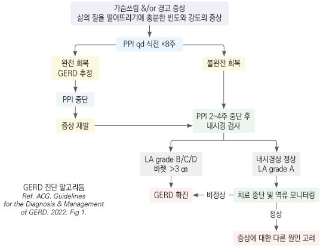
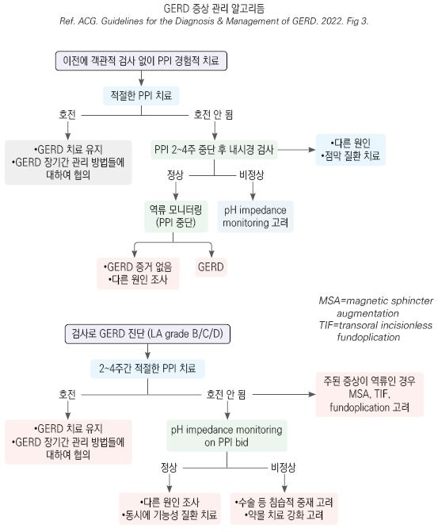
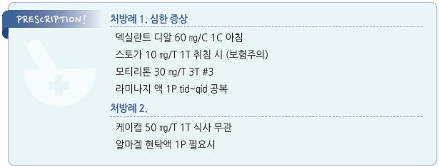

# 위식도역류질환 GERD


## 일반 사항

* 위장 내용물 또는 위산의 역류로 인하여 일상생활에 의미 있는 지장을 주는 증상이나 합병증이 발생한 상태
* 유병률 : 미국 성인의 40%가 역류 증상을 가지고 있음
*   모든 역류가 증상을 일으키는 것은 아니며 약간의 위식도역류는 대부분 정상 상태임

    •역류 빈도와 식도염의 상관관계는 낮음

    •역류의 중증도와 증상 정도는 비례하지 않음
* 역류에 대한 치료를 중단하면 재발하는 경우가 많음
* 합병증 : 바렛 식도(adenocarcinoma 위험), peptic stricture

#### 분류

*   NERD(non-erosive reflux Dz) : GERD의 50\~85% 해당; 비전형 또는 식도 외 증상을 주로 호소.

    심각한 상태로의 진행 위험은 낮으며 장기적인 관리는 필요 없음
* ERD : GERD 환자의 ⅓에서 reflux esophagitis가 있음

## 원인

* 위식도접합부 괄약근 압력 감소 - 하부 식도괄약근의 부적절한 이완
* 타액 분비 저하 - 위산 비움 장애
* hiatal hernia - hernia sac에서의 위산 저류 (acid pocket)

> ✽헬리코박터 유병률 감소가 GERD의 증가와 관련된다는 보고가 있음

### 위험 인자

* 비만, 과식, 폭식, 음주, 흡연
* 음식 : 매운 음식, 신 음식, 고지방식, 카페인
* 임신
*   약물 : 항생제, NSAID, aspirin, opioid, 항콜린제, theophylline, nitrate, β-작용제 or 차단제, CCB, bisphosphonate,

    quinidine, progesterone, benzodiazepine, TCA, 도파민 작용제, 철분제

## 임상 양상

*   전형적 증상 : (주로 식후에 발생하는) 위산 역류(신맛), 가슴쓰림(작열감),

    삼킴곤란
*   비전형 증상 : 상복부 압박감/통증, 소화불량, 구역, 복부 팽만, 트림,

    입 냄새, 흉통, 목구멍의 덩어리 느낌, dental erosion
*   식도 외 증상 : 만성 기침, throat clearing, 쉰 목소리, 인후염, 쌕쌕거림,

    천식, 기관지 경련

※ GERD가 다양한 식도 외 증상에 기여한다고 생각되고 있지만 종종

```
그 인과 관계는 명확하지 않음; 전형적 증상 없이 발생한 비전형 증상이나

식도 외 증상은 GERD에 의한 것이 아닐 수 있음
```

## 진단

* 명확한 진단 검사 방법은 없음

•(내시경상 점막 손상 및 pH 역류를 기준으로) 전형적 증상에 기반한 미란성 식도염(EE) 진단의 민감도 30\~76%,

```
특이도 62~96% 
```

*   전형적인 가슴쓰림과 역류 증상이 있으나 경고 증상이 없는 환자에 대하여 진단 테스트를 위하여 PPI 8주간 투여(qd 식전)

    → 치료에 대한 반응 평가 및 다른 질환 배제를 위하여 검사 고려; 민감도 78%, 특이도 54%
* 가슴쓰림이 없는 흉통이 있고, 적절한 검사를 통해 심질환이 배제된 환자에서 GERD 검사 권고

### 내시경 검사

* 유의미한 수준의 민감도 및 특이도 없음; 가슴쓰림 환자의 ⅔에서 내시경으로 진단 안 됨
*   일률적 시행은 권고하지 않음; 경고 증상(예: 연하곤란, 체중 감소, 위장관 출혈)이 있거나 바렛 식도의 위험 인자가 있는

    환자에 대한 첫 번째 평가로 내시경 검사를 권고
* 바렛 식도 외에 반복 시행은 필요 없음
* 가급적 (2\~)4주간 PPI 투여 중단 후 검사(그 사이 불편한 증상에 대하여 제산제 복용 가능)
* 조직 검사는 GERD 진단적 가치가 없지만 EE 진단을 위해 시행할 수 있음

#### 내시경 검사 대상

* 경고 징후에 해당
* 4\~8주간의 충분한 용량의 PPI 치료에도 지속되는 전형적 GERD 증상
* 잦은 GERD 증상 조절을 위하여 지속적 치료가 필요한 상태
* 비전형 또는 식도 외 증상에 대한 감별이 필요한 상태
* 만성(＞5년) 증상을 가진 ＞50세 남성

#### The Los Angeles(LA) classification of reflux esophagitis

* LA grade A : 정상과 구별할 수 없음; 몇 개 이하의 mucosal fold(s) & ≤5 ㎜ 크기의 미란
* LA grade B : 전형역 역류 증상이 있고 PPI에 반응하면 GERD로 진단 가능; 몇 개 이하의 mucosal fold(s) ＞5 ㎜
* LA grade C : GERD 진단 (grade C & D는 중증 EE); mucosal folds를 넘어서는 미란
* LA grade D : 중증; 둘레의 ＞¾에 걸쳐 확장되는 confluent erosions(circular defects)

### UGI

* 해부학적 이상 진단에 도움
* GERD 진단 목적의 시행은 권고하지 않음(조영 촬영만으로는 GERD를 진단할 수 없음)

### H. pylori 검사

* 제균 치료 대상이 되는 경우 외에는 권고하지 않음 (☞ p.403)

### 24시간 보행 식도 pH 측정법 (Ambulatory esophageal reflux monitoring)

* 가장 확실한 진단법
* 대상 : GERD가 의심되지만 명확하지 않으며, 내시경에서 GERD의 증거가 없는 경우 권고
* 검사 7일 전부터 PPI 투여를 중단해야 함
*   LA grade C or D 또는 long-segment(＞3 ㎝) 바렛 식도 환자에서 GERD 진단 검사로서 reflux monitoring만 하는 것은

    권고하지 않음

식도 압력측정법 (Esophageal manometry)

* 기능성 가슴쓰림, 이완불능증, 하부 식도경련 등의 위장 운동 이상을 진단
* 대상 : 내시경상 정상인 GERD 의심 환자에서 고려

### 실험실 검사

*   빈혈 검사(ferritin, TIBC, Fe, reticulocyte), Vit B12(특히 PPI 장기 사용자), 대변 잠혈

    

    ```
      
    ```

***

## Management

### 치료 방침

* 생활 습관 개선
* 약물 치료 : 전형적 증상이 있고 경고 증상이 없으면 진단적 검사 없이 역류 질환으로 간주하고 경험적 약물 치료
* PPI 치료로 호전되지 않으면 검사 또는 다른 질환 고려

※객관적 검사로 역류가 입증되지 않은, 가슴쓰림이나 역류 증상이 없는 식도 외 증상에 대하여 경험적 PPI 요법은 반대함 \[ACG]

## 비-약물 치료 및 예방

* 정상 체중 유지 : 과체중 또는 최근 체중 증가 시 체중 감량
* 금연, 음주 제한
* 운동 : 매일 30분의 중등도 이상의 신체 활동; 과도한 운동 회피(마라톤 등 지나친 운동이나 달리기는 해로울 수 있음)
*   식이 조절 (☞ p.385)

    •소식, 잘 씹어 먹을 것

    •식사 중 및 식사 후 upright 자세 유지, 식사 후 3시간 이내 눕지 않음

    •취침 전 2\~3시간에는 식사를 피함

    •유발 음식 회피 : 일률적인 적용은 권고하지 않으며 개인의 경험에 따라 결정함; 지방 식이, 매운 음식/자극적 음식(양파,

    마늘, 소금, 후추), 산성 음식(귤, 토마토), gluten 함유 식품(밀, 보리, 귀리), 콩류

•카페인 음료(커피, 차)와 탄산음료는 1일 2잔 이하로 제한

*   야간 증상이 있는 경우 침대 상체 부위를 15 ㎝ 정도 올림(머리만 올려서는 효과 없음; wedge pillow 이용),

    왼쪽으로 누워 취침(오른쪽을 아래로 자는 것을 피함)
* 기타 : 허리가 조이는 옷 착용을 피함, 유발 약물 복용을 피함,

> ✽다음의 5가지 사항을 실천했을 때 치료 약물 복용이 50% 감소했다는 보고가 있음 ① 금연, ② 카페인 제한(커피/차/소다수 ≤2컵/d), ③ “prudent” diet(예: 과일, 채소, 콩류, 생선, 가금류, 전곡류), ④ ≥30분/d의 중등도 이상의 활동, ⑤ 적정 체중(BMI ＜25) 유지

## 약물 치료

* 경증, 간헐적 증상 : 필요시 제산제 또는 산 분비 억제제(H2-차단제) 투여 (☞ p.376)
* NERD : H2-차단제 또는 PPI
* ERD or 지속되는 불편한 증상 : PPI

※ EE 환자의 치료 반응이 NERD 환자보다 좋음(PPI 4주 치료 시 완전 증상 회복 70~~80% vs 50~~60%);

```
NERD 환자의 상당수가 기능성 가슴쓰림 관련
```

### PPI

* 가장 효과적
* 치료율 : 가슴쓰림 완화- 80\~90%/해소- 50%; esophagitis healing- 80%
* 약제 간의 유의미한 효과 차이는 없으며 환자에 따른 차이는 있을 수 있음
* 투여 후 4일 내 효과 발현
* PPI 최대 효과 도달까지 수일간 H2RA 병용 고려; 병용 시 주간 PPI 및 취침 시 H2RA 투여 (보험 주의)
*   PPI 간의 전반적인 GERD 증상 완화 및 치유율은 거의 차이가 없음. 환자에 따른 차이는 있을 수 있음

    (✽산 억제 효능에는 차이가 있다는 보고가 있음;

    omeprazole 1.00, pantoprazole 0.23, lansoprazole 0.90, esomeprazole 1.60, rabeprazole 1.82)
* 부작용 : 골절, C. difficile 장염, 폐렴, 저마그네슘혈증, Vit B12 결핍
*   주의 : 중단 시 반동 현상 발생 (✽갑작스러운 PPI 중단 시 반동으로 인한 위산 과다 분비가 발생하지만 이것이 증상을

    증가시킨다는 강력한 증거는 부족); CYP450 약물 상호 작용
* omeprazole : 20 ㎎ qd \[오엠피]
* esomeprazole : 40 ㎎ qd \[넥시움]
* lansoprazole : 30 ㎎ qd \[란스톤]
* dexlansoprazole : 60 ㎎ qd \[덱실란트 디알]
* pantoprazole : 40 ㎎ qd \[판토록]
* rabeprazole : 20 ㎎ \[파리에트]

#### 용법

* 초치료 : 표준 용량으로 NERD- 4주, ERD- 8주간 투여
*   PPI로 잘 조절되지 않는 경우에는 복용 시간 및 순응도를 먼저 평가하고, 약물 교체 또는 증량(예: 표준 용량 bid ×8주)

    또는 검사를 고려
*   유지 치료 : PPI 장기 복용에 따른 부작용을 고려하여 결정 (✽흔히 치료 중단 3개월 내 증상이 재발됨)

    •NERD : H2-차단제 bid 지속 투여, or PPI를 2\~4주 단위로 간헐적 또는 필요시 투여

    •식도 합병증이 있었던 환자, PPI를 bid로 투여했던 환자 : PPI를 최소 유효 용량으로 투여

> ✽유지 요법 시 full-dose 투여가 half-dose 투여보다 효과적이라는 보고가 있음 　✽식도염에서는 간헐적 투여는 효과적이지 않다는 보고가 있음

*   투여 시간 : 펌프가 활성화되는 식전 30분 복용; qd 복용 시 아침 식전 30~~60분, bid 복용 시 아침/저녁 식전 30~~60분 복용

    (✽dexlansoprazole은 이중 지연 방출/흡수 되므로 식사 무관 복용 가능)

Potassium-competitive acid blocker (P-CAB)

*   tegoprazan : 강력한 제산 효과, 빠른 산 분비 억제 개시(투여 첫 날부터 최대 효과 발현)

    •부작용(＞1%) : 구역, 설사, 소화불량, 상기도 바이러스 감염, 흉부 불편감

    •주의/금기 : 간/신 장애, 고령, 임부, 수유부, benzimidazole 과민

    •약물 상호 작용 : 위산 의존 흡수 증가 약물(예: atazanavir, nelfinavir, rilpivirine)의 농도 저하

    •용법 : NERD- 50 ㎎ qd ×4주; ERD- 50 ㎎ qd ×4주\~8주 \[케이캡]

    •식사 무관 복용

### H2-수용체 차단제 (H2RA)

*   대상 : GERD에 대한 PPI 투여 초기 수일간 병용, PPI 치료로 증상 호전된 GERD, PPI를 투여할 수 없거나 PPI 치료에

    반응 부족(특히 야간 가슴쓰림 증상 시 취침 전 투여)
* 투여 30분 후 효과 발현, 8시간 지속
* cimetidine : 200\~400 ㎎ bid \[에취투비]
* famotidine : 10\~20 ㎎ bid \[가스터]
* lafutidine : 10 ㎎ qd\~bid \[스토가]

### 제산제

* 경증에서 가장 빠르게 속쓰림 증상을 완화시켜주지만 지속 시간이 짦음(＜2시간) (☞ p.352)
* 신장병 환자에서는 Mg 함유 제제 사용을 피함
* almagate \[알마겔], aluminum \[암포젤]

> (✽ alginic acid 제제가 보다 효과적이라는 보고가 있음)

### 점막 보호제

* 식도 점막을 보호; GERD에 대한 효과 입증 자료는 거의 없음
*   sucralfate : 1 g qid (매 식전 1시간 및 취침 시) \[아루사루민] (비보험)

    •GERD 치료제로서 임신 중인 경우 외에는 sucralfate를 권장하지 않음(임산부의 가슴쓰림과 역류 완화 효과 보고가 있음)\[ACG]
* alginic acid : 1~~3 g tid~~qid \[라미나지]

> ```
> ✽alginate와 제산제 병용 시 위산 역류에 대한 유동적인 장벽을 만들어 보다 효과적이라는 보고가 있음
> ```

* eupatilin : 60 ㎎ tid \[스티렌], 90 ㎎ bid \[스티렌 투엑스]

### 위장관 운동 촉진제

*   객관적인 gastroparesis의 증거가 없는 한 GERD 치료를 위한 투여는 그 종류에 관계없이 하지 않을 것을 권고

    (효과에 대한 유의미한 증거가 없음) \[ACG]
*   metoclopramide \[맥페란] : LES 압력 증가, esophageal peristalsis 향상, gastric emptying 강화; GERD에 대한

    유의미한 연구 결과는 거의 없는 반면 장기 투여 시 심각한 부작용 발생 우려
* itopride \[가나칸], mosapride \[가스모틴], corydaline \[모티리톤]

### Simethicone

* 팽만 완화에 간혹 도움
* 40\~80 ㎎ tid 식후 또는 취침 시 \[가소콜]

### 하부식도 괄약근 작용제 (GABA-B 수용체 작용제)

* 작용 : LES 괄약근 이완을 억제시킴
* 최적의 PPI 치료에도 불구하고 지속되는 역류 증상이 있는, GERD의 객관적인 증거가 있는 환자에서 고려
* 금기 : CNS 이상
* 용량 : 졸음 등 부작용을 피하기 위하여 저용량으로 시작, 점차 증량
* baclofen : 5\~10 ㎎ tid \[바크론]

### 항우울/항불안제

* 우울/불안증이 GERD와 관련되는 경우, 일부에서 유효
* TCA, SSRI/SNRI, trazodone (☞ p.1146)
*   imipramine \[이미프라민] or nortriptyline \[센시발] : 25 ㎎ 취침 시

    

## 난치성 GERD

* PPI로 잘 조절되지 않는 경우 복용 시간 및 순응도를 먼저 평가; 개별적으로 최적화된 PPI 치료
* 약물 교체 또는 증량(예: 표준 용량 bid ×8주) 또는 필요시 취침 시 H2 수용체 대항제 추가
* 약물의 일상적인 추가 또는 두 가지 이상의 PPI 투여는 하지 않음
* PPI를 지속해야하는 다른 적응증이 있지 않은 한, 치료 중단 후 역류 검사에서 음성이면 투여 중단
* 추가 검사 고려

•이전에 식도 pH 모니터링이나 내시경으로 확인되지 않은 GERD 환자에서 pH 모니터링 고려

•PPI bid 치료에 적절하게 반응하지 않은 확인된 GERD 환자에 대해 PPI 치료 유지 중

```
esophageal impedance-pH monitoring 고려
```

* PPI로 조절되지 않는 확인된 GERD 환자에서 수술적 치료 고려

> **질병코드** K21.0 식도염을 동반한 위-식도역류병

K21.9 식도염을 동반하지 않은 위-식도역류병


