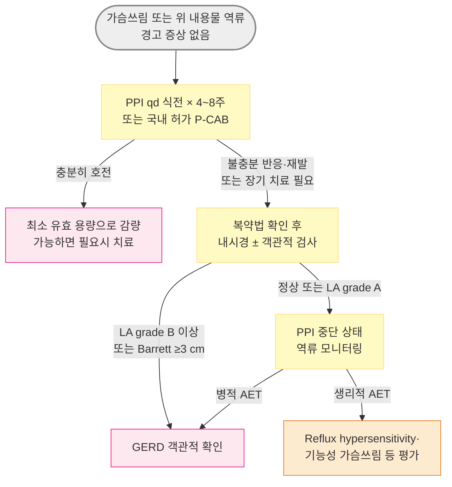
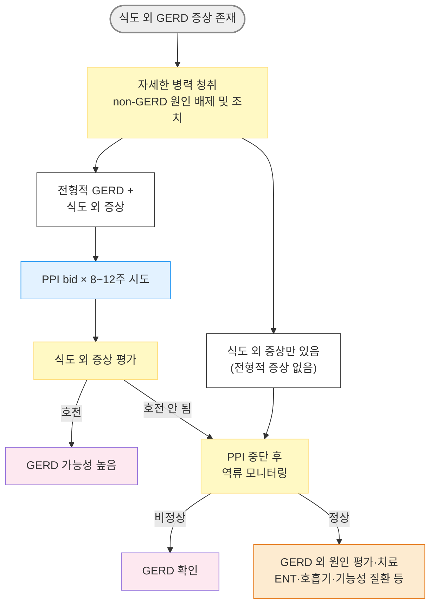
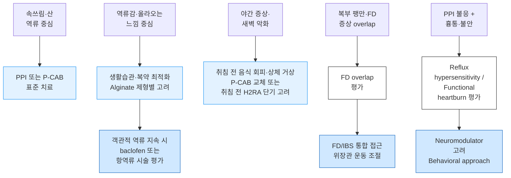
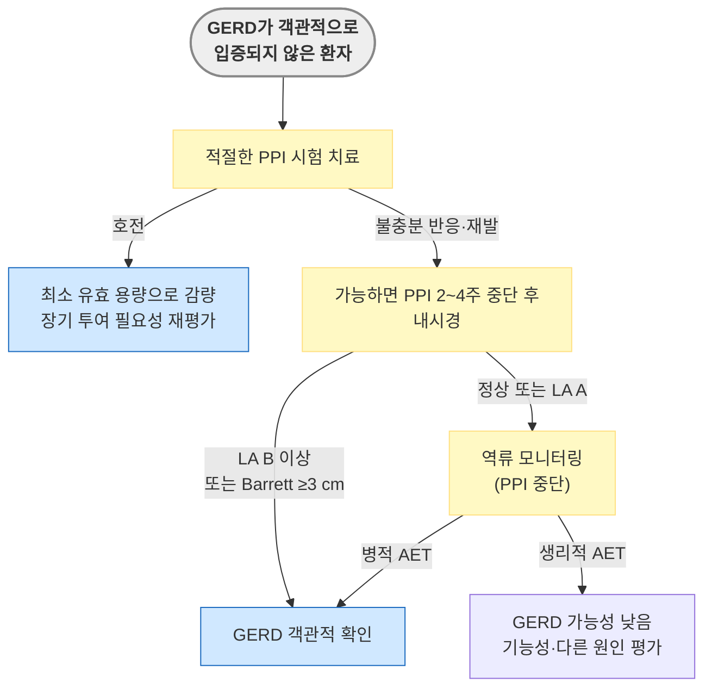
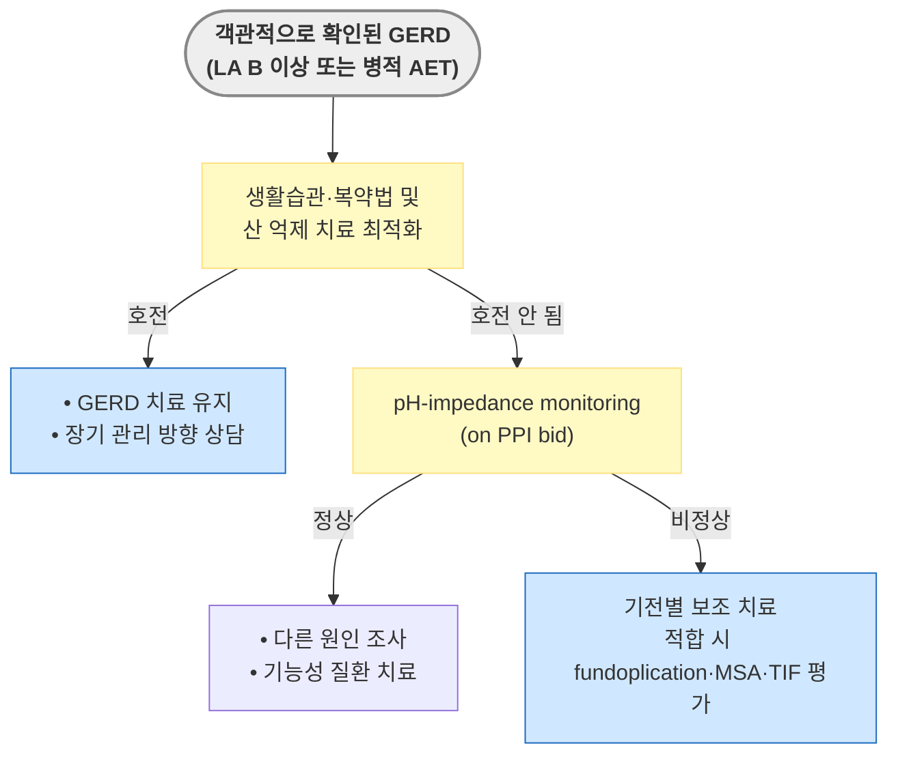

# 위식도역류질환 GERD

## <mark style="color:green;">일반 사항</mark>

* 위장 내용물 또는 위산의 역류로 인하여 일상생활에 의미 있는 지장을 주는 증상이나 합병증이 발생한 상태 (Montreal 정의, 2006)
* 유병률 : 미국 성인의 \~40%가 역류 증상 경험; 동아시아는 상대적으로 낮으나 증가 추세
* 모든 역류가 증상을 일으키는 것은 아니며 약간의 위식도역류는 대부분 정상 상태임
  * 역류 빈도와 식도염의 상관관계는 낮음; 역류의 중증도와 증상 정도는 비례하지 않음
* 역류에 대한 치료를 중단하면 재발하는 경우가 많음
* 합병증 : 바렛 식도 (adenocarcinoma 위험), peptic stricture, 식도 외 합병증

### <mark style="color:orange;">분류</mark>

<table><thead><tr><th width="190">아형</th><th width="190.52630615234375">비율</th><th>특징</th></tr></thead><tbody><tr><td><strong>NERD</strong> (Non-erosive reflux disease)</td><td>GERD의 약 50~70%<br>(지역·정의에 따라 차이)</td><td>내시경상 점막 손상이 없으나 객관적 역류가 확인된 경우; reflux hypersensitivity·기능성 가슴쓰림과 감별 필요; 중증 식도염으로 진행할 위험은 낮음</td></tr><tr><td><strong>ERD</strong> (Erosive reflux disease)</td><td>GERD의 약 30~40%</td><td>내시경상 reflux esophagitis; PPI 치료 반응이 NERD보다 양호한 경향</td></tr><tr><td><strong>바렛 식도</strong><br>(Barrett's esophagus)</td><td>만성 GERD 환자에서 위험 증가</td><td>식도 원주상피 화생; 식도선암의 상대위험은 증가하지만 비이형성 바렛 식도의 절대 진행 위험은 낮음(대략 연 0.1~0.3%); 이형성 정도에 따라 감시·치료</td></tr></tbody></table>


**GERD ≠ 산 과다 질환** : GERD는 항역류 장벽 이상, 산성·약산성 역류, 식도 청소 장애 등이 복합적으로 작용하는 질환. Reflux hypersensitivity(역류 과민)와 기능성 가슴쓰림은 GERD 유사 증상의 중요한 감별 질환이며, PPI 불응 환자에서는 객관적 역류 여부와 증상 발생 기전을 재평가해야 함


**바렛 식도 감시 내시경 권고 간격**

* 이형성 없음 - 길이 ＜3 cm (short-segment) : 5년
* 이형성 없음 - 길이 ≥3 cm (long-segment) : 3년
* 저등급 이형성 (low-grade dysplasia, LGD) : 경험 많은 위장관 병리의사의 확인 후 내시경 제거 치료(endoscopic eradication therapy, EET) 권고; 감시를 선택하면 6개월, 12개월 후 매년 추적
* 고등급 이형성 (high-grade dysplasia, HGD) : 병리 재확인 후 가시 병변은 내시경 절제하고 잔여 바렛 점막은 절제 치료


국내 및 아시아권에서는 바렛 식도 진단 시 조직검사상 장상피화생(intestinal metaplasia, IM) 확인을 핵심으로 보는 경향이 강함. IM 음성 바렛 식도는 선암 위험이 낮아 감시 간격이 달라질 수 있음


## <mark style="color:green;">원인 및 위험 인자</mark>

### <mark style="color:orange;">병태생리</mark>

* 하부식도괄약근(LES)의 일시적 이완(transient LES relaxation, TLESR) 증가 또는 낮은 LES 기저압
* 타액 분비 저하 → 식도 산 청소율 감소
* 위 배출 지연 (gastroparesis, 위 운동 저하)
* Hiatal hernia 및 횡격막각 기능 저하 → 위식도접합부 항역류 장벽 손상


_H. pylori_ 제균 후 일부 환자에서 역류성 식도염 증가가 보고되었으나 증상성 GERD에 대한 영향은 일관되지 않음. GERD 발생 우려는 적응증이 있는 제균 치료를 피할 이유가 아님


### <mark style="color:orange;">위험 인자</mark>

* 비만, 과식, 폭식, 음주, 흡연
* 음식 : 매운 음식, 신 음식, 고지방식, 카페인 (개인차 있음)
* 임신
* 약물

#### <mark style="color:$primary;">유발 약물</mark>

**LES 압력 감소 또는 위배출 지연 약물**

* 매우 높음 : CCB, nitrate, opioid; LES 압력 감소, 위배출 저하
* 높음 : 항콜린제, TCA, progesterone, theophylline; LES 이완, 위장운동 저하
* 중등도 : benzodiazepine, 도파민 작용제, GLP-1 수용체 작용제; LES tone 감소 또는 위배출 지연
* 중등도\~낮음 : quinidine; LES tone 감소 가능

　✽ β-차단제는 일부 보고 있으나 LES 직접 억제 근거는 약함

**식도 점막 직접 손상 약물 (pill esophagitis)**

* bisphosphonate : 대표적 약물성 식도염 원인
* doxycycline·tetracycline캡슐 : 정체 시 궤양 유발 가능
* potassium chloride : 국소 점막 손상 가능
* 철분제 : 식도 자극 가능
* NSAID, aspirin : 점막 손상 및 증상 악화 가능

## <mark style="color:green;">임상 양상</mark>

* 전형적 증상 : 위산·위 내용물 역류(신맛), 가슴쓰림(작열감) - 주로 식후, 앙와위, 전굴 자세에서 악화
* 비전형·동반 증상 : 상복부 압박감/통증, 소화불량, 구역, 복부 팽만, 트림, 입 냄새, 흉통, 목구멍 이물감(globus)
* 연하곤란·연하통은 GERD에서 동반될 수 있으나 경고 증상으로 간주하여 구조적·염증성·운동성 식도질환을 평가
* 식도 외 증상 (LPR 포함) : 만성 기침, throat clearing, 쉰 목소리, 인후염, 천식·쌕쌕거림, 기관지 경련, dental erosion (치과적 합병증); 중이염·비부비동염과의 연관성도 보고되나 근거 강도는 낮음


인후 증상, 만성 기침, 쉰 목소리 등은 GERD와 연관될 수 있으나, GERD가 단독 원인인 경우는 제한적이며 과진단에 주의. 전형적 GERD 증상이 없는 경우 식도 외 증상을 GERD만으로 귀인하기 전에 이비인후과·호흡기 질환을 먼저 평가하는 것이 중요


### <mark style="color:$danger;">🚩 Red Flags!</mark>

(☞ [위장질환의 감별](074_.md#step-1-red-flags))

<mark style="color:$danger;">**즉각 조치 또는 의뢰**</mark>

* 토혈 또는 흑색변 → 상부 위장관 출혈
* 음식물 걸림으로 침·물도 삼키지 못함 → 음식물 매복·식도 폐쇄 가능, 응급 내시경 평가
* 새로 발생한 심한 흉통, 호흡곤란·식은땀·실신 동반 → 급성 관동맥 증후군 등 심혈관 응급질환 우선 배제

<mark style="color:$warning;">**당일 또는 조기 의뢰**</mark>

* 설명되지 않는 체중 감소 (＞5% / 3\~6개월)
* 진행성 연하곤란 (고형식 → 연식으로 진행)
* 빈혈
* 반복적 구토, 진행성 연하곤란 또는 음식 역류(regurgitation)

<mark style="color:$info;">**외래 추적 / 추가 평가 계획**</mark> <mark style="color:$info;">- 즉각 위험 낮으나 호전 없으면 의뢰</mark>

* 만성 GERD + 바렛 식도 다중 위험 인자(50세 이상, 남성, 중심성 비만, 흡연, 가족력 등) → 선별 내시경 고려
* 8주간 표준 PPI 치료에도 반응 없는 증상
* 비전형 증상(흉통, 만성 기침)으로 심·폐 질환 배제 후 추가 평가 필요
* 재발 반복 또는 지속적 치료가 필요한 상태

## <mark style="color:green;">진단</mark>

* 확립된 단일 표준 진단 기준(gold standard)은 없음
  * 전형적 증상에 기반한 미란성 식도염 진단의 민감도 30\~76%, 특이도 62\~96%
* 전형적인 가슴쓰림과 역류 증상이 있으나 경고 증상이 없는 환자 → 진단 검사 없이 경험적 PPI 치료 (qd 식전 × 8주) 후 반응 평가; 민감도 78%, 특이도 54%
* 가슴쓰림 없는 흉통 → 심질환 우선 배제 후, GERD를 포함한 식도 원인 평가 고려


**경험적 PPI 시험 치료** : 전형적 증상 + 경고 증상 없는 경우, PPI qd 식전 8주 투여 후 반응 평가. 완전 호전 → GERD 추정. 불완전 호전 또는 재발 → 내시경 검사 고려


#### <mark style="color:$primary;">내시경 검사</mark>

* 유의미한 수준의 민감도 및 특이도 없음; 가슴쓰림 환자의 ⅔에서 내시경으로 진단 안 됨
* 일률적 시행은 권고하지 않음

**내시경 검사 적응증**

* 경고 징후 (연하곤란, 체중 감소, 위장관 출혈, 빈혈)
* 4\~8주간 충분한 용량의 PPI 치료에도 지속되는 전형적 GERD 증상
* 잦은 GERD 증상으로 지속적 치료가 필요한 상태
* 비전형·식도 외 증상에 대한 감별이 필요한 상태
* 만성 GERD와 바렛 식도 다중 위험 인자(50세 이상, 남성, 중심성 비만, 흡연, 바렛 식도·식도선암 가족력 등)가 있는 경우 선별 고려
* 소매 위절제술(sleeve gastrectomy) 또는 경구내시경 근절개술(POEM) 시행 후 GERD 증상 발생 - 내시경만으로는 제한적이며 UGI 조영술 또는 pH 모니터링 병행 권고
* 진단 목적이며 안전하게 중단할 수 있으면 가급적 2\~4주간 PPI 중단 후 검사(그 사이 증상 완화용 제산제 복용 가능). 출혈·폐쇄 등 경고 징후가 있으면 중단 기간을 기다리지 않고 검사
* 증상 조절만을 목적으로 한 routine 반복 검사는 불필요. 다만 LA grade C/D 식도염은 치료 후 치유 및 숨어 있던 바렛 식도 확인, 새로운 경고 증상·협착·바렛 식도 감시 시 반복 검사

**LA 분류 (Los Angeles classification of reflux esophagitis)**

<table><thead><tr><th width="139.52630615234375">등급</th><th>내시경 소견</th><th>임상적 의의</th></tr></thead><tbody><tr><td><strong>LA Grade A</strong></td><td>하나 이상의 점막 결손이 각각 ≤5 ㎜이고 두 점막 주름의 정상부 사이로 이어지지 않음</td><td>무증상인에서도 관찰 가능; 단독으로는 확정적 GERD 근거가 아님</td></tr><tr><td><strong>LA Grade B</strong></td><td>하나 이상의 점막 결손이 ＞5 ㎜이지만 두 점막 주름의 정상부 사이로 이어지지 않음</td><td>Lyon Consensus 2.0에서 확정적 GERD 근거</td></tr><tr><td><strong>LA Grade C</strong></td><td>둘 이상의 점막 주름 사이로 이어지지만 전체 식도 둘레의 ＜75%</td><td>중증 EE; 장기 유지 치료 또는 항역류 중재 고려</td></tr><tr><td><strong>LA Grade D</strong></td><td>전체 식도 둘레의 ≥75%에 걸친 점막 결손</td><td>중증 EE; 적극적 치료 및 치료 후 내시경 재평가</td></tr></tbody></table>

* 조직검사는 GERD 진단적 가치가 없지만 호산구성 식도염 배제를 위해 시행 가능

#### <mark style="color:$primary;">보행 식도 역류 모니터링</mark>

* 객관적 역류를 확인·배제하고 증상-역류 연관성을 평가하는 검사(ambulatory esophageal reflux monitoring)
* GERD가 입증되지 않은 환자(unproven GERD) : 내시경에서 LA grade B 이상 또는 long-segment Barrett's esophagus(≥3 ㎝)가 없으면 PPI 중단 상태에서 검사
  * 가능하면 무선 pH 모니터링을 48\~96시간 시행하여 일간 변동 평가; 이용할 수 없으면 24시간 catheter-based pH 또는 pH-impedance monitoring
  * 일반적으로 PPI는 검사 7일 전 중단하되 검사기관 지침에 따름
* 객관적으로 확인된 GERD(proven GERD)에서 최적 PPI 치료에도 증상이 지속 : PPI bid 복용 상태에서 24시간 pH-impedance monitoring 고려
* LA grade B 이상 또는 long-segment Barrett's esophagus는 GERD의 객관적 근거이므로 진단 확인만을 위한 off-PPI 역류 모니터링은 불필요

#### <mark style="color:$primary;">식도 압력측정법 (Esophageal manometry)</mark>

* GERD 또는 기능성 가슴쓰림을 단독으로 확진하는 검사는 아님
* 이완불능증(achalasia) 및 주요 식도운동장애 배제, 역류 검사 카테터 위치 결정, 항역류 수술·시술 전 식도 연동운동 평가
* 내시경·역류 모니터링이 정상인데 증상이 지속되거나 반추증후군·상부위장관 트림이 의심될 때 고해상도 임피던스 압력검사(HRIM) 고려

#### <mark style="color:$primary;">UGI 조영 촬영</mark>

* 해부학적 이상 (hiatal hernia 등) 진단에 도움
* GERD 진단 목적으로는 권고하지 않음 (조영 촬영만으로 GERD 진단 불가)

#### <mark style="color:$primary;">H. pylori 검사</mark>

* 제균 치료 대상이 되는 경우 외에는 권고하지 않음

#### <mark style="color:$primary;">실험실 검사</mark>

* GERD 진단을 위한 routine 실험실 검사는 없음
* 출혈·철결핍빈혈이 의심되면 CBC 및 ferritin 등 철대사 검사와 내시경 평가
* 장기 PPI 사용만을 이유로 Vit B12·Mg·신기능을 일률적으로 검사하지 않으며, 위험 인자 또는 임상적 의심이 있을 때 선택적으로 시행

### <mark style="color:orange;">감별</mark>

#### <mark style="color:$primary;">질환별 감별 포인트</mark>

<table><thead><tr><th width="210">질환</th><th>감별 포인트</th></tr></thead><tbody><tr><td>급성 관동맥 증후군</td><td>흉통 시 먼저 배제 필수; 임상 위험도에 따라 ECG, 심근 troponin</td></tr><tr><td>기능성 소화불량 (FD)</td><td>식후 포만감·조기 포만감·명치 통증/작열감이 주증상; FD-GERD overlap도 흔함</td></tr><tr><td>소화성 궤양</td><td>상복부 통증 양상만으로 구분하기 어려움; 위험 인자·경고 증상에 따라 <em>H. pylori</em> 검사 또는 내시경</td></tr><tr><td>호산구성 식도염</td><td>연하곤란·음식물 매복·아토피 병력; 여러 식도 부위 조직검사에서 eosinophil ≥15/HPF 및 다른 원인 배제</td></tr><tr><td>이완불능증 (achalasia)</td><td>고형식·액체 모두 연하곤란, 체중 감소·미소화 음식 역류; 고해상도 식도압력검사로 확진</td></tr></tbody></table>

#### <mark style="color:$primary;">GERD 표현형별 역류 감별 (Rome IV 기반)</mark>

<table><thead><tr><th width="153.1578369140625">구분</th><th width="117.368408203125">역류 검사</th><th width="136.842041015625">증상-역류 연관성</th><th>특징 및 치료 접근</th></tr></thead><tbody><tr><td><strong>객관적 GERD</strong></td><td>비정상 acid exposure 또는 LA grade B 이상</td><td>양성일 수도 음성일 수도 있음</td><td>증상연관성은 진단 신뢰도·치료 예측을 보조; PPI/P-CAB 등 산 억제 치료</td></tr><tr><td><strong>Reflux hypersensitivity</strong></td><td>정상 acid exposure</td><td>양성</td><td>식도 지각 과민; 선택적 산 억제, neuromodulator·행동치료 고려</td></tr><tr><td><strong>Functional heartburn</strong></td><td>정상 acid exposure</td><td>음성</td><td>기능성 식도질환; 불필요한 산 억제 치료를 중단하고 neuromodulator·행동치료 중심</td></tr></tbody></table>


**Lyon Consensus 2.0의 acid exposure time(AET)** : off-PPI 검사에서 AET ＜4%는 생리적, ＞6%는 병적이며 4\~6%는 경계 영역. 경계 영역은 역류 횟수, mean nocturnal baseline impedance(MNBI), 내시경·압력검사 소견 등 보조 지표와 함께 해석



PPI 불응 환자에서 "지속적인 산 역류"만을 의미하지 않는다. Reflux hypersensitivity와 functional heartburn은 refractory GERD와 혼동되기 쉬우며, 반복적인 PPI 증량보다 표현형 재평가가 먼저다.


***


```mermaid
graph TD
    A(["가슴쓰림 또는 위 내용물 역류<br/>경고 증상 없음"]) --> B["PPI qd 식전 × 4~8주<br/>또는 국내 허가 P-CAB"]
    B -- "충분히 호전" --> C["최소 유효 용량으로 감량<br/>가능하면 필요시 치료"]
    B -- "불충분 반응·재발<br/>또는 장기 치료 필요" --> G["복약법 확인 후<br/>내시경 ± 객관적 검사"]
    G -- "LA grade B 이상<br/>또는 Barrett ≥3 cm" --> J["GERD 객관적 확인"]
    G -- "정상 또는 LA grade A" --> K["PPI 중단 상태<br/>역류 모니터링"]
    K -- "병적 AET" --> J
    K -- "생리적 AET" --> L["Reflux hypersensitivity·<br/>기능성 가슴쓰림 등 평가"]
    style A fill:#eeeeee,stroke:#888888,stroke-width:2px
    classDef pink fill:#fde8f0,stroke:#e91e8c
    class J,C pink
    classDef yellow fill:#fff9c4,stroke:#ffe082
    class K,G,B yellow
    classDef orange fill:#fdebd0,stroke:#e67e22
    class L orange
```

<p align="center"><strong>GERD 진단 알고리듬</strong></p>

<p align="center"><em><mark style="color:$info;">Ref. ACG GERD Guideline 2022; AGA Clinical Practice Update 2022; Lyon Consensus 2.0, 2024.</mark></em></p>

***

***


```mermaid
graph TD
    Start(["식도 외 GERD 증상 존재"])
    History["자세한 병력 청취<br/>non-GERD 원인 배제 및 조치"]
    Typical["전형적 GERD +<br/>식도 외 증상"]
    Atypical["식도 외 증상만 있음<br/>(전형적 증상 없음)"]
    PPI_Trial["PPI bid × 8~12주 시도"]
    Symptoms_Check["식도 외 증상 평가"]
    Monitoring["PPI 중단 후<br/>역류 모니터링"]
    GERD_Confirm1["GERD 가능성 높음"]
    GERD_Confirm2["GERD 확인"]
    Other["GERD 외 원인 평가·치료<br/>ENT·호흡기·기능성 질환 등"]

    Start --> History
    History --> Typical
    History --> Atypical
    Typical --> PPI_Trial
    PPI_Trial --> Symptoms_Check
    Symptoms_Check -- "호전" --> GERD_Confirm1
    Symptoms_Check -- "호전 안 됨" --> Monitoring
    Atypical --> Monitoring
    Monitoring -- "비정상" --> GERD_Confirm2
    Monitoring -- "정상" --> Other

    style Start fill:#eeeeee,stroke:#888888,stroke-width:2px
    style History fill:#fff9c4,stroke:#ffe082
    classDef white fill:#fff,stroke:#333
class Typical,Atypical white
    classDef sky fill:#e3f2ff,stroke:#2196f3
class PPI_Trial sky
    classDef yellow fill:#fff9c4,stroke:#ffe082
class Symptoms_Check,Monitoring yellow
    classDef pink fill:#fde8f0
class GERD_Confirm1,GERD_Confirm2 pink
    classDef orange fill:#fdebd0,stroke:#e67e22
class Other orange
```

<p align="center"><strong>식도 외 GERD 증상 진단 알고리듬</strong></p>

<p align="center"><em><mark style="color:$info;">Ref. ACG GERD Guideline 2022; AGA Clinical Practice Update 2022.</mark></em></p>

***

## <mark style="background-color:$warning;">Management</mark>

### <mark style="color:orange;">치료 원칙</mark>

* 생활 습관 개선 + 약물 치료 병행
* 전형적 증상이 있고 경고 증상이 없으면 진단적 검사 없이 역류 질환으로 간주하고 경험적 약물 치료
* PPI 치료로 호전되지 않으면 검사 또는 다른 질환 고려
* 객관적 검사로 역류가 입증되지 않은, 전형적 증상 없는 식도 외 증상에 대하여 경험적 PPI 요법은 권고하지 않음 \[ACG]

### <mark style="color:orange;">표현형 기반 접근 (Phenotype-based approach)</mark>

<table><thead><tr><th width="148.84210205078125">Phenotype</th><th>임상 특징</th><th width="130.4210205078125">PPI 반응</th><th>치료 전략</th></tr></thead><tbody><tr><td><strong>Acid-dominant GERD</strong></td><td>전형적 가슴쓰림·산 역류, EE 동반 가능</td><td>양호</td><td>PPI 또는 국내 허가 P-CAB 표준 치료</td></tr><tr><td><strong>Nocturnal GERD</strong></td><td>야간 각성, 새벽 증상, 앙와위 악화</td><td>야간 breakthrough 가능</td><td>취침 전 음식 회피·침상 상체 거상·복약법 최적화; 지속 시 P-CAB 교체 또는 취침 전 H2RA 단기·필요시 추가 고려</td></tr><tr><td><strong>Regurgitation-dominant</strong></td><td>"올라오는 느낌", volume reflux, 식후·전굴 시 악화</td><td>산 억제만으로 불충분 가능</td><td>제제별 허가사항에 따른 alginate 고려; 객관적 역류가 지속되면 baclofen 또는 항역류 시술 평가</td></tr><tr><td><strong>Meal-related reflux</strong></td><td>식후 즉각 악화, 과식·지방식 후 유발</td><td>중등</td><td>소식·체중 감량, 식후 눕지 않기; alginate는 제형·허가 용법 확인</td></tr><tr><td><strong>Hypersensitivity phenotype</strong></td><td>증상 강도 ≫ 검사 이상; 흉통·불안 동반 가능</td><td>제한적</td><td>neuromodulator·인지행동치료·식도 지향 최면치료·횡격막 호흡 고려</td></tr><tr><td><strong>Functional overlap</strong></td><td>복부 팽만, 조기 포만감, IBS/FD overlap</td><td>증상 변동성 큼</td><td>FD/IBS 동반 평가 및 통합 치료</td></tr></tbody></table>


동일한 "GERD"라도 phenotype에 따라 치료 반응과 최적 전략이 달라진다. 특히 PPI 불응 환자에서는 "어느 표현형인가?"를 먼저 재평가하는 것이 무조건적인 PPI 증량보다 중요하다.


***


```mermaid
graph TD

    B["속쓰림·산 <br/>역류 중심"]
    C["역류감·올라오는<br/> 느낌 중심"]
    D["야간 증상·<br/>새벽 악화"]
    E["복부 팽만·FD <br/>증상 overlap"]
    F["PPI 불응 + <br/>흉통·불안"]
    B --> G["PPI 또는 P-CAB<br/>표준 치료"]
    C --> H["생활습관·복약 최적화<br/>Alginate 제형별 고려"]
    H --> I["객관적 역류 지속 시<br/>baclofen 또는<br/>항역류 시술 평가"]
    D --> J["취침 전 음식 회피·상체 거상<br/>P-CAB 교체 또는<br/>취침 전 H2RA 단기 고려"]
    E --> L["FD overlap <br/>평가"]
    L --> M["FD/IBS 통합 접근<br/>위장관 운동 조절"]
    F --> N["Reflux <br/>hypersensitivity /<br/>Functional <br/>heartburn 평가"]
    N --> O["Neuromodulator <br/>고려<br/>Behavioral approach"]


classDef sky fill:#e3f2ff,stroke:#2196f3
class G,H,J sky
classDef blue fill:#d0e8ff,stroke:#1a6abf
class M,I,O blue
classDef white fill:#fff,stroke:#333
class L,N white
```

<p align="center"><strong>증상 패턴별 처방 방향 알고리듬</strong></p>

***


```mermaid
graph TD
    Start1(["<b>GERD가 객관적으로<br/>입증되지 않은 환자</b>"]) --> PPI1["적절한 PPI 시험 치료"]
    PPI1 -- "호전" --> Success1["최소 유효 용량으로 감량<br/>장기 투여 필요성 재평가"]
    PPI1 -- "불충분 반응·재발" --> Scope1["가능하면 PPI 2~4주 중단 후<br/>내시경"]
    Scope1 -- "LA B 이상<br/>또는 Barrett ≥3 cm" --> GERD1["GERD 객관적 확인"]
    Scope1 -- "정상 또는 LA A" --> Monitor1["역류 모니터링<br/>(PPI 중단)"]
    Monitor1 -- "병적 AET" --> GERD1
    Monitor1 -- "생리적 AET" --> NoEvidence["GERD 가능성 낮음<br/>기능성·다른 원인 평가"]

    style Start1 fill:#eeeeee,stroke:#888888,stroke-width:2px
    classDef yellow fill:#fff9c4,stroke:#ffe082
    class Scope1,Monitor1,PPI1 yellow
    classDef blue fill:#d0e8ff,stroke:#1a6abf
    class Success1,GERD1 blue
```


```mermaid
graph TD
    Start2(["<b>객관적으로 확인된 GERD<br/>(LA B 이상 또는 병적 AET)</b>"]) --> PPI2["생활습관·복약법 및<br/>산 억제 치료 최적화"]
    PPI2 -- "호전" --> Success2["• GERD 치료 유지<br/>• 장기 관리 방향 상담"]
    PPI2 -- "호전 안 됨" --> Impedance2["pH-impedance monitoring<br/>(on PPI bid)"]

    Impedance2 -- "정상" --> Other2["• 다른 원인 조사<br/>• 기능성 질환 치료"]
    Impedance2 -- "비정상" --> Surgery["기전별 보조 치료<br/>적합 시 fundoplication·MSA·TIF 평가"]


style Start2 fill:#eeeeee,stroke:#888888,stroke-width:2px
classDef yellow fill:#fff9c4,stroke:#ffe082
class PPI2,Impedance2 yellow
classDef blue fill:#d0e8ff,stroke:#1a6abf
class Success2,Surgery blue
```

<p align="center"><strong>GERD 관리 알고리듬</strong></p>

<p align="center"><em><mark style="color:$info;">Ref. AGA Clinical Practice Update 2022; Lyon Consensus 2.0, 2024.</mark></em></p>

***

## <mark style="color:green;">비-약물 치료 및 예방</mark>

* 정상 체중 유지 : 과체중 또는 최근 체중 증가 시 체중 감량
* 금연, 음주 제한
* 규칙적인 신체 활동 권장; 식후 바로 시행하는 격렬한 운동은 증상을 유발하면 조절
* 식이 조절
  * 소식, 잘 씹어 먹을 것
  * 식후 바로 눕지 않고, 취침 전 2\~3시간 이내 식사 피함
  * 커피·차·탄산음료를 포함하여 증상이 반복적으로 재현되는 음식만 개별적으로 제한
  * 유발 가능 음식은 개인차가 큼 : 지방식, 매운·자극적 음식, 산성 음식(귤, 토마토) 등
* 야간 증상 시 : 침대 상체 부위를 약 15 ㎝ 올림 (머리만 올려서는 효과 없음; wedge pillow 이용), 왼쪽 측와위 취침
* 기타 : 허리 조이는 옷 피함, 유발 약물 복용 회피


근거가 비교적 일관된 생활요법은 과체중·비만 환자의 체중 감량, 취침 전 음식 회피, 야간 증상에서 침상 머리 쪽 거상 및 왼쪽 측와위임. 모든 환자에게 특정 음식을 일률적으로 금지하기보다 개인별 유발 요인을 확인


## <mark style="color:green;">약물 치료</mark>

* 경증, 간헐적 증상 : 필요시 제산제 또는 H2-차단제 투여
* NERD : H2-차단제 또는 PPI
* ERD 또는 지속되는 불편한 증상 : PPI (또는 P-CAB)
* EE 환자의 치료 반응이 NERD보다 양호함 (PPI 4주 치료 시 완전 증상 회복 : EE 70\~80% vs NERD 50\~60%); NERD 유사 증상에서는 reflux hypersensitivity·기능성 가슴쓰림 감별 필요

### <mark style="color:orange;">PPI (Proton Pump Inhibitor)</mark>

* GERD의 가장 효과적인 약물 치료
* 치료율 : 가슴쓰림 완화 80\~90%, 완전 해소 \~50%; esophagitis healing \~80%
* 첫 투여일부터 효과가 시작되며 안정된 최대 산 억제에는 약 3\~5일이 걸릴 수 있음
* H2RA의 routine 초기 병용은 권고하지 않음. 최적 PPI에도 야간 증상이 지속되면 취침 전 단기·필요시 병용 고려(보험 주의)
* 약제 선택은 비용·순응도·약물 상호작용·CYP2C19 영향 등을 고려. 제제 간 산 억제력 차이는 있으나 적절한 허가 용량에서 임상적 치유율 차이는 비교적 작음
* 대표적 1일 용량(적응증·제품별 국내 허가사항 확인)
  * omeprazole : 20 ㎎ qd <mark style="color:blue;">\[오엠피]</mark>
  * esomeprazole : 20\~40 ㎎ qd <mark style="color:blue;">\[넥시움]</mark>
  * lansoprazole : 15\~30 ㎎ qd <mark style="color:blue;">\[란스톤]</mark>
  * dexlansoprazole : NERD 30 ㎎ qd, ERD 치유 60 ㎎ qd <mark style="color:blue;">\[덱실란트 디알]</mark> - 이중 지연 방출, 식사 무관 복용 가능
  * pantoprazole : 40 ㎎ qd <mark style="color:blue;">\[판토록]</mark>
  * rabeprazole : 10\~20 ㎎ qd <mark style="color:blue;">\[파리에트]</mark>

#### <mark style="color:$primary;">용법</mark>

* 초치료 : 표준 용량으로 NERD 4주, ERD 8주 투여
* 투여 시간 : 펌프가 활성화되는 식전 30\~60분 복용; qd → 아침 식전, bid → 아침·저녁 식전; dexlansoprazole은 식사 무관
* 조절 불충분 시 : 복용 시간·순응도 먼저 평가 → 약제 교체 또는 증량 (표준 용량 bid × 8주) 또는 검사 고려
* 유지 치료 : 최소 유효 용량·간헐적 투여 지향 (✽흔히 치료 중단 3개월 내 증상 재발)
  * NERD : 증상 조절 후 PPI 간헐적·필요시 투여 또는 H2RA로 단계 하향 고려
  * LA grade B 이상, 바렛 식도, 소화성 협착 : 최소 1일 1회 장기 유지 치료 고려
  * LA grade C/D : 장기 PPI 유지 또는 항역류 중재; 임의 중단하지 않음


**PPI 장기 사용 관련 부작용** : 골절, _Clostridioides difficile_ 감염, 저마그네슘혈증, Vit B12 결핍, 신질환 등과의 연관성이 보고되어 있으나 대부분 observational data 기반이며 인과관계는 명확하지 않음. 명확한 적응증이 있다면 이득이 위험을 상회하는 경우가 많음. 장기 사용 시 적응증과 최소 유효 용량을 정기적으로 재평가하고, 검사실 모니터링은 위험 인자·임상적 의심이 있을 때 선택적으로 시행

**CYP450 약물 상호작용** : omeprazole·esomeprazole + 클로피도그렐 병용 시 CYP2C19 억제로 활성 대사체가 감소할 수 있음; 임상적 의미에는 논란이 있으나 pantoprazole·rabeprazole을 대안으로 고려. 장기 사용 중단 후 일시적 반동성 증상이 생길 수 있으며 즉시 중단 또는 단계적 감량을 환자별로 선택


### <mark style="color:orange;">P-CAB (Potassium-Competitive Acid Blocker)</mark>


PPI와 달리 활성화에 산성 환경이 불필요하여 식사 무관 복용, 빠른 효과 발현 (PPI 대비 초기 산 억제 우월), CYP2C19 유전자형에 따른 개인차 적음


#### <mark style="color:$primary;">P-CAB 고려 상황</mark>

* 중증 EE (LA grade C/D) - 일부 성분에서 PPI 대비 높은 치유율이 보고되었으나 성분별 근거·허가사항 확인
* 야간 증상 - 빠르고 지속적인 산 억제가 필요한 경우 선택지
* 신속한 증상 조절이 필요한 경우 - 투여 초기부터 빠른 효과 발현
* CYP2C19 extensive metabolizer 의심 - PPI 대사가 빨라 효과 감소
* PPI 부분 반응 - 약제 교체 선택지

#### <mark style="color:$primary;">약제</mark>

* tegoprazan <mark style="color:blue;">\[케이캡]</mark>
  * 부작용(＞1%) : 구역, 설사, 소화불량, 흉부 불편감
  * 주의 : 임부·수유부, 간·신기능 저하, 고령에서는 제품 허가사항 확인
  * 약물 상호작용 : 위산 의존 흡수 약물 (atazanavir, nelfinavir, rilpivirine) 농도 저하
  * 용법 : NERD 50 ㎎ qd × 4주; ERD 50 ㎎ qd × 4\~8주; 식사 무관
* fexuprazan <mark style="color:blue;">\[펙수클루]</mark>
  * 2022년 국내 허가 (ERD 치료); esomeprazole 대비 비열등한 EE 치유율
  * 용법 : ERD 40 ㎎ qd × 4\~8주; 식사 무관
* zastaprazan <mark style="color:blue;">\[자큐보]</mark>
  * 2024년 국내 허가 (ERD 치료), 국산 37호 신약 (제일약품)
  * 용법 : ERD 20 ㎎ qd × 4주 (미치유 시 4주 추가); 식사 무관

### <mark style="color:orange;">H2-수용체 차단제 (H2RA)</mark>

* 대상 : 경증·간헐적 증상, PPI로 호전된 NERD의 단계 하향 치료, PPI 투여 불가 또는 최적 PPI에도 지속되는 야간 가슴쓰림 시 취침 전 단기·필요시 추가
* 투여 30분 후 효과 발현, 약 8시간 지속; 장기 사용 시 tachyphylaxis로 효과 감소 주의

#### <mark style="color:$primary;">약제</mark>

* cimetidine : 200\~400 ㎎ bid <mark style="color:blue;">\[에취투비]</mark>
* famotidine : 10\~20 ㎎ bid <mark style="color:blue;">\[가스터]</mark>
* lafutidine : 10 ㎎ qd\~bid <mark style="color:blue;">\[스토가]</mark> - GERD 치료는 국내 허가 외 사용

### <mark style="color:orange;">제산제</mark>

* 경증에서 가장 빠르게 속쓰림 증상을 완화 (지속 시간 ＜2시간)
* 신기능 저하 환자에서는 Mg 또는 Al 함유 제산제의 반복·장기 사용을 피하거나 제한
* almagate <mark style="color:blue;">\[알마겔]</mark>, aluminum hydroxide <mark style="color:blue;">\[암포젤]</mark>

### <mark style="color:orange;">Alginate 및 점막 보호제</mark>

* sodium alginate : 1\~3 g tid\~qid <mark style="color:blue;">\[라미나지]</mark>
  * 국내 알긴산나트륨 단일제는 제품 허가사항에 따라 공복 투여. 해외의 식후 acid pocket 차단 근거는 주로 bicarbonate·제산제가 포함된 alginate raft 제제에서 도출되어 국내 단일제에 그대로 적용하지 않음
  * breakthrough·regurgitation 증상에서 보조적으로 고려하되 제형·허가 용법 확인
* sucralfate : 1 g qid (매 식전 1시간 및 취침 시) <mark style="color:blue;">\[아루사루민]</mark> (비급여)
  * 임신 중 가슴쓰림 완화에 사용 가능; 일반 GERD 치료제로는 권고하지 않음 \[ACG]
* eupatilin <mark style="color:blue;">\[스티렌, 스티렌 투엑스]</mark>은 위염의 위점막 병변 개선제이며 GERD 자체의 치료제는 아님

### <mark style="color:orange;">위장관 운동 촉진제</mark>

* 객관적인 gastroparesis의 증거가 없는 한 GERD 치료 목적의 투여는 권고하지 않음 \[ACG]
* metoclopramide <mark style="color:blue;">\[맥페란]</mark> : 위마비가 확인된 경우에 제한적으로 사용; 장기 투여 시 tardive dyskinesia 등 심각한 부작용
* itopride <mark style="color:blue;">\[가나칸]</mark>, mosapride <mark style="color:blue;">\[가스모틴]</mark>는 GERD에 routine으로 추가하지 않음
* 현호색·견우자 추출물 <mark style="color:blue;">\[모티리톤]</mark>은 기능성 소화불량 치료제로 GERD 적응증이 아님

### <mark style="color:orange;">기타 약제</mark>

#### <mark style="color:$primary;">하부식도 괄약근 작용제 (GABA-B 수용체 작용제)</mark>

* 작용 : TLESR 억제 → LES 괄약근 이완 빈도 감소
* 적응 : 최적 PPI 치료에도 지속되는 역류 증상 + 객관적 GERD 증거; 특히 regurgitation 또는 belching predominance에서 제한적으로 고려
* 주의 : 졸림, 어지럼, 혼돈, 낙상; 신기능 저하 시 축적 가능. 뇌전증 등 CNS 질환은 제품 허가사항에 따라 주의
* baclofen : 5\~10 ㎎ tid <mark style="color:blue;">\[바크론]</mark> - GERD 치료는 국내 허가 외 사용

#### <mark style="color:$primary;">항우울/항불안제 (Neuromodulator)</mark>

* reflux hypersensitivity·기능성 가슴쓰림 또는 식도 과각성에서 행동치료와 함께 개별적으로 고려(국내 허가 외 사용)
* TCA, SSRI/SNRI, trazodone
* imipramine <mark style="color:blue;">\[이미프라민]</mark> 또는 nortriptyline <mark style="color:blue;">\[센시발]</mark> : 저용량으로 시작하되 항콜린성 부작용·QT 연장·낙상 위험 고려
* 인지행동치료, 식도 지향 최면치료, 횡격막 호흡, 이완요법을 병행 또는 우선 고려

#### <mark style="color:$primary;">Simethicone</mark>

* 팽만 완화에 간혹 도움
* 40\~80 ㎎ tid 식후 또는 취침 시 <mark style="color:blue;">\[가소콜]</mark>

## <mark style="color:green;">난치성 GERD (Refractory GERD)</mark>

* 정의 : 적절한 복약 순응도 하에서 PPI bid 8주 이상 투여에도 증상이 지속되는 경우


**Refractory GERD ≠ 지속적인 산 역류** : PPI bid 8주 이상에도 증상이 지속될 때, 무조건적인 PPI 증량이나 반복 교체 전에 원인을 재평가하는 접근이 중요. 실제 원인은 복약 오류, 기능성 질환 overlap, reflux hypersensitivity, supragastric belching, rumination syndrome, 기능성 소화불량, 불안·과각성 상태 등 다양


#### <mark style="color:$primary;">PPI가 효과 없는 경우 확인 사항</mark>

<table><thead><tr><th width="244.21051025390625">확인 사항</th><th>임상적 의미</th></tr></thead><tbody><tr><td>복용 시간 오류</td><td>PPI를 식후 복용하는 경우 매우 흔함 - 반드시 식전 30~60분 복용 확인</td></tr><tr><td>복약 순응도 부족</td><td>간헐적 복용, 조기 중단 여부 확인</td></tr><tr><td>야식·야간 음주</td><td>야간 reflux 지속의 흔한 원인</td></tr><tr><td>과식·비만·체중 증가</td><td>복압 증가 → 역류 악화</td></tr><tr><td>Regurgitation predominance</td><td>volume reflux는 acid suppression만으로 불충분 가능</td></tr><tr><td>기능성 질환 overlap</td><td>FD, IBS overlap 시 bloating·불편감 지속 가능</td></tr><tr><td>Reflux hypersensitivity</td><td>acid exposure는 정상이나 식도 지각 과민 존재 가능</td></tr><tr><td>Functional heartburn</td><td>GERD가 아닌 기능성 통증일 수 있음</td></tr><tr><td>Supragastric belching / rumination</td><td>식도로 공기를 빨아들였다 즉시 내뱉는 behavioral disorder; 반복적 트림·역류감 유발 - 약물이 아닌 인지행동치료·언어치료(speech therapy)가 우선; baclofen 보조 고려</td></tr><tr><td>비GERD 질환</td><td>호산구성 식도염, achalasia, 심질환 등 감별 필요</td></tr></tbody></table>

#### <mark style="color:$primary;">대처 방법</mark>

* 약제 교체 또는 증량 (표준 용량 bid × 8주), 야간 증상 시 취침 전 H2RA 단기 추가
* PPI 중단 시 일시적인 반동성 상부위장관 증상 가능성을 설명. 즉시 중단 또는 2\~4주 단계적 감량·H2RA 전환을 환자별로 선택
* 약물의 일상적인 추가 또는 두 가지 이상의 PPI 병용은 하지 않음
* PPI의 다른 적응증이 없는 한, 역류 검사에서 음성이면 PPI 중단 고려
* 추가 검사 고려
  * pH 모니터링 (역류 입증 미확인 환자)
  * pH-impedance monitoring on PPI bid (확인된 GERD로 PPI bid 치료에 부반응 시)
* 확인된 GERD로 최적 PPI 조절이 불충분하면 P-CAB 교체 고려; 객관적 역류가 지속되고 해부학·식도운동 평가상 적합하면 수술·내시경 치료 고려

## <mark style="color:green;">시술 및 기타 처치</mark>


수술적·내시경적 치료는 객관적으로 확인된 GERD에서 최적 약물치료에도 troublesome regurgitation이 지속되거나, LA grade C/D 식도염·큰 hiatal hernia·명백한 항역류 장벽 손상이 있거나, 충분한 설명 후 장기 약물치료 대신 중재를 선호하는 경우 고려. 시술 전 이완불능증을 배제하고 식도 연동운동을 평가


* 복강경 Nissen fundoplication : 표준 수술 치료; 최적 PPI 치료와 증상 조절 효과 유사하나 수술 합병증 및 부작용 (dysphagia, gas bloat syndrome) 고려
* 자기 괄약근 보조 장치 (MSA, LINX®) : 식도 하부에 자기 구슬 링 삽입; regurgitation 우세 GERD에서 선택 가능. 일시적 연하곤란이 흔하며 지속성 연하곤란, 확장술·제거술 필요성, 드문 미란 및 MRI 조건을 확인
* 경구 내시경 무절개 위저 성형술 (TIF, Transoral Incisionless Fundoplication) : hiatal hernia ≤2 cm, 적절한 flap valve, 중증 식도염이 없는 선택 환자에서 고려. hiatal hernia ＞2 cm 또는 항역류 장벽 손상이 크면 복강경 수복을 병행한 cTIF 또는 수술 평가
* 비만 환자에서 수술이 필요하면 Roux-en-Y gastric bypass를 항역류 선택지로 고려; sleeve gastrectomy는 GERD를 악화시킬 수 있음

***

### <mark style="color:red;">질병코드</mark>

K21.0　식도염을 동반한 위-식도역류병

K21.9　식도염을 동반하지 않은 위-식도역류병

***

## <mark style="color:purple;">처방례</mark>

> **처방례 1. NERD / 경증·간헐적 증상**
>
> ```
> 가스터 20 ㎎/T   1T   bid   × 2주
> 알마겔 현탁액    1P   필요시
> ```
>
> _✽경증 또는 NERD에서 H2RA를 1\~2주 단기 투여. 증상 호전 후 필요시(prn) 투여로 전환 가능. 제산제는 즉각 증상 완화용으로 병용._

> **처방례 2. ERD (중등증, PPI 기반)**
>
> ```
> 덱실란트 디알 60 ㎎/C   1C   qd (식사 무관)   × 8주
> 라미나지 액              1P   tid (공복)
> ```
>
> _✽ERD에 대한 dexlansoprazole 치유 용량 8주. dexlansoprazole은 이중 지연 방출로 복용 시간 제약이 적음. 국내 알긴산나트륨 단일제는 제품 허가사항에 따라 공복 투여하며, 해외 alginate-antacid raft 제제의 식후 acid pocket 근거와 구분._

> **처방례 3. ERD (P-CAB - 중증 EE 또는 PPI 불충분 반응)**
>
> ```
> 케이캡 50 ㎎/T   1T   qd (식사 무관)   × 8주
> 알마겔 현탁액    1P   필요시
> ```
>
> _✽LA grade C/D의 중증 EE, PPI 불충분 반응, CYP2C19 extensive metabolizer 의심 또는 신속·지속적 산 억제가 필요한 경우 P-CAB을 선택할 수 있음. 빠른 효과 발현이 장점이며 성분별 국내 허가사항·급여기준 확인._

> **처방례 4. 최적 PPI에도 지속되는 야간 증상**
>
> ```
> 넥시움 40 ㎎/T   1T   아침 식전 30~60분
> 스토가 10 ㎎/T   1T   취침 시          (보험주의)
> ```
>
> _✽복용 시간·순응도와 취침 전 식사를 먼저 확인. 최적 PPI에도 야간 가슴쓰림이 지속될 때 취침 전 H2RA를 단기 또는 필요시 추가할 수 있음. 장기 연속 병용 시 tachyphylaxis가 발생하며, lafutidine의 GERD 적응증 및 보험 기준은 처방 전 확인._

***

### <mark style="color:$success;">핵심 복약 지도</mark>

**PPI 복용 시간이 핵심**

* PPI (dexlansoprazole, P-CAB 제외)는 반드시 **식전 30\~60분** 복용 - 위산 펌프가 활성화될 때 작용해야 효과적; 식후 복용 시 효과 현저히 감소
* dexlansoprazole <mark style="color:blue;">\[덱실란트 디알]</mark>, P-CAB (tegoprazan <mark style="color:blue;">\[케이캡]</mark>, fexuprazan <mark style="color:blue;">\[펙수클루]</mark>, zastaprazan <mark style="color:blue;">\[자큐보]</mark>) 은 식사 무관 복용 가능

**임의 중단 주의**

* GERD는 만성 질환으로 치료 중단 후 3개월 내 재발이 흔함; 의사 지시 없이 임의 중단하지 말 것
* 장기 PPI 중단 후 일시적인 반동성 증상이 생길 수 있음. 즉시 중단 또는 서서히 감량하는 방법 중 의사와 상의하여 선택

**약물 상호작용 주의 사항**

* omeprazole, esomeprazole + 클로피도그렐 병용 시 항혈소판 효과 감소 가능 → 의사에게 반드시 알릴 것
* P-CAB + 위산 의존성 흡수 약물 (atazanavir, rilpivirine 등) 병용 시 해당 약물 혈중 농도 저하 가능

**장기 복용 모니터링**

* PPI 장기 복용 시 적응증과 최소 유효 용량을 정기적으로 재평가. 혈청 Mg·Vit B12·신기능 검사는 위험 인자 또는 임상적 의심이 있을 때 선택적으로 시행
* 신장 기능 저하 환자에서 Mg·Al 함유 제산제의 반복·장기 사용 주의

***

### <mark style="color:blue;">환자 안내서</mark>

**위식도역류질환(GERD)이란?**

위산이나 위 내용물이 거꾸로 식도로 올라와 가슴 쓰림, 신트림, 목 이물감 등을 일으키는 병입니다. 치료하지 않으면 식도 점막이 손상되고, 드물게 식도암 위험도 높아질 수 있습니다.

**생활습관이 절반입니다**

* 과식하지 말고 천천히 씹어 드세요
* 식사 후 바로 눕지 말고, 취침 전 2\~3시간에는 음식을 피하세요
* 야간 증상이 있으면 왼쪽으로 눕고 침대 머리 쪽 전체를 15 ㎝가량 높이세요; 베개만 여러 개 쌓으면 복압이 증가할 수 있습니다
* 담배는 끊고, 커피·탄산음료 등은 증상을 반복적으로 유발할 때 줄이세요
* 체중이 많이 나가신다면 5\~10% 감량만으로도 증상이 크게 좋아질 수 있습니다

**약은 이렇게 드세요**

* PPI 계열 약 (오메프라졸, 에소메프라졸, 란소프라졸, 파리에트)은 **밥 먹기 30\~60분 전**에 드세요 - 식후 복용하시면 효과가 크게 떨어집니다
* 덱실란트, 케이캡, 펙수클루, 자큐보는 식사와 관계없이 드셔도 됩니다
* 증상이 좋아졌다고 마음대로 약을 끊지 마세요 - 재발이 잘 되는 병입니다

**이런 증상이 새로 생기면 빨리 병원을 찾으세요**

* 음식을 삼키기가 갈수록 어려워질 때
* 이유 없이 체중이 빠질 때
* 토혈(피가 섞인 구토)이나 검은색 변이 나올 때
* 가슴 통증이 새로 생기거나 심해질 때
