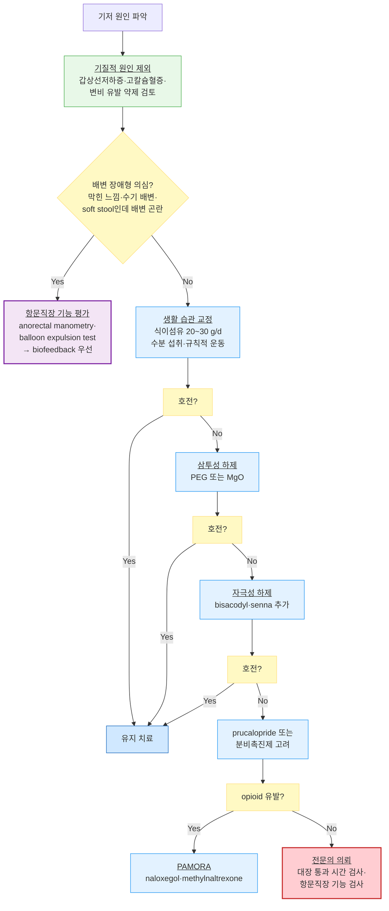

# 변비 Constipation

## <mark style="color:green;">일반 사항</mark>

* 정의 : 희발 배변(≤2회/주), 단단한 대변, 불완전한 배변감, 배변 시 과도한 힘주기, 항문 폐쇄감, 배변 유도를 위한 수지조작이 필요한 경우; 대변의 굳기, 배변 빈도와 어려움 등을 종합적으로 평가
* 일반적인 대변량 : 150\~200 g/d
* 대장 통과 시간 (normal colonic transit) : cecum까지 4시간, distal colon까지 12\~36시간
* 유병률 : 성인의 16%, >60세 인구의 ⅓; 고령에서는 동반 질환, 운동 능력 감소, 식사량 감소, 복용 약물 등의 요인에 의해 증가

## <mark style="color:green;">원인 및 위험 인자</mark>

### <mark style="color:orange;">1차성 (기능성)</mark>

#### <mark style="color:$primary;">Functional constipation (Normal transit constipation)</mark>

* 가장 흔한 형태 (전체의 약 ⅔)
* 대장 통과 시간 및 항문직장 기능은 정상
* 증상 : 복부 팽만, 복통; 생활 습관 교정과 하제에 비교적 잘 반응

#### <mark style="color:$primary;">Slow-transit constipation</mark>

* 기전 : myenteric plexus, cholinergic innervation, noradrenergic 근신경 전달 계통 이상
* 대장 통과 시간 >72시간; 골반저 기능은 정상
* 여성, 정신 질환(우울, 불안, 섭식 장애) 동반 시 더 흔함

#### <mark style="color:$primary;">Pelvic floor (Anorectal) dysfunction</mark>

* 기전 : 골반 근육의 조화운동부전(dyssynergia), 높은 basal sphincter pressure
* 증상 : 지속되는 과도한 긴장감, 막힌 느낌, 불완전한 배출감; 부드러운 대변조차 배변 곤란
* 바이오피드백 치료가 효과적; slow-transit constipation과 병존하는 경우 많음

### <mark style="color:orange;">2차성</mark>

<table><thead><tr><th width="175">범주</th><th>원인 질환 및 약물</th></tr></thead><tbody><tr><td>내분비/대사</td><td>당뇨병, 고칼슘혈증, 저칼륨혈증, 갑상선저하증, 부갑상선항진증, 요독증</td></tr><tr><td>근병증</td><td>amyloidosis, scleroderma, 근육긴장퇴행위축</td></tr><tr><td>신경 질환</td><td>자율신경병증, 뇌혈관질환, 파킨슨병, 척수 질환</td></tr><tr><td>정신 질환</td><td>불안증, 우울증, 신체화장애, 치매</td></tr><tr><td>구조 이상</td><td>항문열상, 협착, 치핵, 결장협착증, IBD, 결장 종괴, 직장탈출증, 직장류</td></tr><tr><td>약물</td><td>Al 또는 Ca 함유 제산제, 항콜린제, 항우울제(TCA &gt; SSRI), 항히스타민제, CCB, clonidine, 이뇨제, 철분제, levodopa, opioid, NSAID, 항정신병제, 교감신경 약제</td></tr><tr><td>기타</td><td>IBS-C, 임신</td></tr></tbody></table>

### <mark style="color:orange;">위험 인자</mark>

* 소아, 고령, 여성, 스트레스, 신체 활동 부족, 낮은 사회경제적 상태, 다제약물 복용

## <mark style="color:green;">임상 양상</mark>

* 희발 배변(주 ≤2회) 또는 단단하고 덩어리진 대변 (Bristol stool scale 1\~2)
* 배변 시 과도한 힘 필요, 배변에 시간이 많이 소요됨
* 불완전한 배출감, 항문 폐쇄감
* 하복부 불편감/팽만감
* 소아 : 복통, 식욕 부진, 변실금(가성 설사)이 나타날 수 있음

<figure><figcaption><p>Bristol Stool Form Scale - Types 1~2: 변비형, Types 3~4: 정상형, Types 6~7: 설사형</p></figcaption></figure>

### <mark style="color:$danger;">🚩 Red Flags!</mark>

<mark style="color:$danger;">**즉각 조치 또는 응급 이송**</mark> <mark style="color:$danger;">- 생명 위협 또는 즉각적 위해 가능성</mark>

* 급성 심한 복통 + 복막 자극 징후 (복근 강직, 반발통) → 복막염·장폐색 의심
* 급성 장폐색 소견 : 심한 복부 팽창, 구역·구토, 장음 소실
* 대량 직장 출혈 (hemodynamically unstable)

<mark style="color:$warning;">**당일 또는 조기 의뢰**</mark>

* 설명할 수 없는 체중 감소 + 배변 습관 변화 → 대장암 의심; 대장내시경 의뢰
* 혈변, 흑색변, 철결핍빈혈 동반 → 대장암 또는 상하부 위장관 출혈 감별
* 직장 탈출, 반복적 직장 출혈
* 설명되지 않는 진행성 배변 습관 변화 (체중 감소·빈혈·혈변·대장암 가족력 동반 시 우선 평가; 특히 대장암 선별 검사 대상 연령 ≥50세에서)
* 연령별 대장암 선별 검사(국가 암 검진 등) 미시행 상태에서 배변 습관 변화 발생
* 신생아 때부터 지속되는 변비 → Hirschsprung disease 의심 (소아에서 성장지연·심한 복부팽만 동반 시 포함)

<mark style="color:$info;">**외래 추적 / 추가 평가 계획**</mark> <mark style="color:$info;">- 즉각 위험 낮으나 호전 없으면 의뢰</mark>

* 식이·하제 치료에 4\~8주 이상 반응 없음 → slow-transit constipation 또는 pelvic floor dysfunction 평가 고려
* 대장암 가족력 → 정기 검진 계획 수립
* 불명열 동반 변비

## <mark style="color:green;">진단</mark>

### <mark style="color:orange;">기능성 변비 진단기준 \[Rome IV]</mark>


**증상이 최소 6개월 이상 지속되고**, 최근 3개월 동안 다음 기준 충족


**A.** 다음 항목 중 **≥2개** 해당

1. 배변 횟수의 >¼에서 힘을 주어야 함
2. 배변 횟수의 >¼에서 덩어리 또는 단단한 대변 (Bristol stool scale 1\~2)
3. 배변 횟수의 >¼에서 불완전한 배출감
4. 배변 횟수의 >¼에서 항문직장의 폐쇄 또는 막힌 느낌
5. 배변 횟수의 >¼에서 손가락 배출, 골반저 지지 등 수기 조작이 필요
6. 자발적인 배변이 주당 ≤2회

**B.** 무른 변은 드묾 (하제 사용 시는 제외)

**C.** 과민대장증후군 기준에 해당하지 않음

### <mark style="color:orange;">변비 아형 감별</mark>


임상 양상만으로 아형을 구분하는 것은 어려우나, 다음 특징이 있으면 생리 검사로 확인하고 치료 전략을 달리해야 한다.


<table><thead><tr><th width="170">항목</th><th width="130">Normal transit</th><th width="140">Slow-transit</th><th width="155">Dyssynergic defecation</th><th>IBS-C overlap</th></tr></thead><tbody><tr><td>핵심 병태생리</td><td>정상 통과 시간; 배변 인지 과민</td><td>대장 연동 운동 저하</td><td>골반저·항문 괄약근 협응 장애</td><td>Visceral hypersensitivity + 장-뇌 축 이상</td></tr><tr><td>흔한 환자</td><td>가장 흔함 (전체 ⅔)</td><td>젊은 여성; 정신 질환 동반</td><td>출산력·골반저 이상 여성</td><td>스트레스·불안 동반</td></tr><tr><td>항문 폐쇄감·수기 배변</td><td>드묾</td><td>드묾</td><td><strong>매우 특징적</strong></td><td>가능</td></tr><tr><td>Soft stool인데 배변 곤란</td><td>드묾</td><td>드묾</td><td><strong>강력 시사</strong></td><td>드묾</td></tr><tr><td>복부 팽만</td><td>흔함</td><td>매우 흔함</td><td>중등도</td><td>매우 흔함</td></tr><tr><td>복통·배변 후 완화</td><td>드묾</td><td>드묾</td><td>드묾</td><td><strong>특징적</strong></td></tr><tr><td>Colonic transit time</td><td>정상</td><td>지연 (&gt;72h)</td><td>정상 또는 경도 지연</td><td>다양</td></tr><tr><td>Anorectal manometry</td><td>정상</td><td>정상</td><td>비정상 (dyssynergia)</td><td>다양</td></tr><tr><td>핵심 치료</td><td>Fiber + PEG</td><td>PEG + prucalopride</td><td><strong>Biofeedback 우선</strong></td><td>통합 접근 (복통 포함)</td></tr><tr><td>흔한 함정</td><td>심한 병으로 오해</td><td>Refractory constipation</td><td>하제만 계속 증량</td><td>단순 변비로 간과</td></tr></tbody></table>


경고 징후가 없고 하제에 반응하는 경우 추가 검사는 대개 불필요. 다음에 해당 시 시행 : 경고 징후 존재, 식이 섬유 및 하제 치료에 반응하지 않음, 기질적 원인 의심


#### <mark style="color:$primary;">실험실 검사</mark>

* CBC, glucose, 전해질, Cr, Ca, TSH
* 대변 잠혈 검사

#### <mark style="color:$primary;">영상 및 기타 검사</mark>

<table><thead><tr><th width="215">검사</th><th>적응 및 특징</th></tr></thead><tbody><tr><td>직장 수지 검사<br><em>(모든 변비 환자에서 필수)</em></td><td>2차성 변비(괄약근 긴장, 직장항문 종괴, 직장탈출, 직장류) 감별; dyssynergia 조기 시사에 유용<br>• 배변 시뮬레이션(힘주기) 시 치골직장근(puborectalis)의 역설적 수축 또는 괄약근 이완 부전 관찰 → pelvic floor dysfunction 강력 시사</td></tr><tr><td>대장내시경</td><td>조직 검사·폴립 제거 동시 시행 가능; 경고 징후 있을 때 1차 선택</td></tr><tr><td>Barium enema</td><td>현재는 사용 빈도 감소 (대장내시경·CT colonography로 대체 추세); 대장 확장·협착 파악에는 유리하나 대부분의 환경에서 1차 선택이 아님</td></tr><tr><td>CT colonography</td><td>해부학적 이상, 종양 등 평가</td></tr><tr><td>Defecography</td><td>배변 활동 중 직장·주위 구조 형태 및 움직임 관찰; 직장류·직장탈출 평가에 유용</td></tr><tr><td>Colonic transit time</td><td>Radiopaque marker 섭취 후 120시간 뒤 X선 촬영; marker >20% 정체 시 delayed transit 진단</td></tr><tr><td>Anorectal manometry</td><td>직장 및 항문 괄약근의 기능 측정; pelvic floor dysfunction 진단에 필수</td></tr></tbody></table>

***



<p align="center"><strong>만성 변비 단계적 치료 알고리듬</strong></p>

<p align="center"><em><mark style="color:$info;">Ref. AGA Clinical Practice Guideline on the Medical Management of Constipation (2023); ACG Clinical Guideline: Management of Benign Anorectal Disorders (2021)</mark></em></p>

***

## <mark style="background-color:$warning;">Management</mark>


**치료 목표** : 정상 배변 패턴 회복(≥3회/주), 증상 개선(soft stool, 힘주기 불필요)\
**치료 원칙** : 기저 원인 제거 → 생활 습관 교정 → 단계적 하제 치료 → 전문의 의뢰


**1. 안심시킴** : 경증 변비는 비정상이 아님을 설명

**2. Fecal impaction**이 있는 경우 : 관장 또는 삼투성 하제로 먼저 해결


**⚠️ 고령자 분변 매복(fecal impaction) - 비전형 양상 주의**

다음이 동반될 때 fecal impaction을 반드시 감별할 것 :

* **Overflow diarrhea** (설사처럼 보이지만 실은 굳은 변 주위로 액상 변이 새어나오는 것)
* 요폐 (urinary retention)
* 급성 섬망 (특히 입원 고령 환자)
* 식욕 저하, 복부 팽창

치료 : 직장 수지 검사로 확인 → 수동 제거 ± glycerin 관장 / 온수 관장 → 이후 유지 하제 필수 시작; 고령에서는 인산 관장 대신 단순 온수 관장 우선 (전해질 불균형 위험)


**3. 변비 유발 약물** 복용 확인 및 회피, **정신사회적 문제** 및 **기저 질환** 관리

**4.** 식이 및 행동 개선 (☞ 비-약물 치료 참조)

**5.** 단계적 **하제 치료** (☞ 약물 치료 참조)

## <mark style="color:green;">비-약물 치료 및 예방</mark>

### <mark style="color:orange;">식이 개선</mark>

* **충분한 수분 섭취** : 탈수 상태인 경우 수분 섭취 증가가 효과적; 정상 수화 상태에서 수분 증가만으로 배변 호전 효과는 제한적
* **식이 섬유 섭취 증가** : 20\~30 g/d 목표; normal transit constipation에서 가장 효과적
  * 수용성·불용성 섬유 모두 대변 덩이 형성에 도움; **단, IBS-C에서는 불용성 섬유(밀기울 등)가 복부 팽만·통증을 악화시킬 수 있음** → 수용성·점성 섬유(psyllium) 우선: 배변 개선과 복통 완화 모두 효과적
  * 수용성 섬유 식품 : 가지, 귀리, 콩, 보리 (☞ [영양 지침](../231_/217_-nutritiondiet-guideline.md#undefined-14))
  * 불용성 섬유 식품 : 전곡류, 짙은 색 채소, 단단한 줄기, 밀기울, 사과/배의 껍질, 감자류
  * 복부 팽만·가스 유발 가능 → 7\~10일에 걸쳐 점진적으로 증량; 불편하면 일시 감량
  * ✽효과가 연구로 입증된 보충제 : psyllium (차전자피) 뿐임 (AGA 2023)
* **피할 음식** : 감, 바나나, 다량의 우유 (단, 우유는 설사를 유발할 수도 있음)
* **복부 팽만 동반 변비 / IBS-C 중복 환자 식이** : 부드럽고 담백한 조리; 채소는 연한 것; 식이 섬유를 과도하게 늘리지 않기 (10\~15 g/d로 제한; 과량 섬유는 팽만 악화); 자극성 강한 조미료·카페인 함유 음료 제한; FODMAP 식이 제한 고려

### <mark style="color:orange;">행동 개선</mark>

* **배변 훈련** : 아침 식사 후 30분 뒤 편안한 상태에서 15분 이내 배변 시도 (gastrocolic reflex 이용); 변의가 생기면 즉시 시도
  * 변기에 오래 앉아 과도하게 힘주지 않기 → 치핵·항문열상 위험 증가
* **배변 자세** : 양변기가 높은 경우 발판을 이용해 무릎 관절 및 고관절이 예각이 되도록(squat position 유사) → 항문직장각 개선
* **규칙적 운동** : 걷기 등 유산소 운동이 장 통과 시간 단축에 도움

### <mark style="color:orange;">바이오피드백</mark>

* 적응 : 골반저 기능 부전(pelvic floor dysfunction/dyssynergia)에 의한 배변 장애형 변비
* 방법 : 항문 괄약근의 비정상적 수축 패턴을 실시간으로 인지하고 교정하는 훈련
* 근거 : 배변 장애형 변비에서 하제 단독보다 우월한 효과; AGA 권고 (moderate evidence)
* ✽slow-transit constipation과 pelvic floor dysfunction이 병존하는 경우 바이오피드백 + 하제 병용

## <mark style="color:green;">약물 치료</mark>


**실전 1차 선택**

* 만성 변비 1차 : **PEG 3350** <mark style="color:blue;">\[마이락스]</mark> (내약성 우수, 안전성 높음) 또는 **MgO** <mark style="color:blue;">\[마그밀]</mark> (국내 접근성 높음)
* 급성·단기 : **bisacodyl** 좌약 <mark style="color:blue;">\[둘코락스]</mark> 또는 glycerin 관장
* 만성 변비 + 하제 실패 : **prucalopride** <mark style="color:blue;">\[레졸로]</mark> (5-HT4 agonist)
* OIC (opioid 유발 변비) : **naloxegol** <mark style="color:blue;">\[모벤틱]</mark> 또는 **methylnaltrexone** <mark style="color:blue;">\[릴리스터]</mark>


* 생활 습관 교정에 반응하지 않는 변비에 간헐적 또는 장기적 약물 투여 가능
* 하제 장기 사용 : 의존이나 위해의 명백한 증거 없음 (자극성 하제 포함; '불량 결장(cathartic colon)' 이론은 현재 근거 불충분); **필요 시 장기 사용 가능하나 환자별 부작용 모니터링은 필수**
* ≥3회/주 배변 달성 시 tapering 고려
* 만성 신부전 환자에서 Mg 제제 금기 (hypermagnesemia 위험)
* 말기암 등의 환자 : 부피 형성 하제보다 연화제 + 자극성 하제 병용 권장


**임신·수유부 변비 약제 선택**

* **1차 (안전)** : 식이 섬유 증량, PEG <mark style="color:blue;">\[마이락스]</mark>, lactulose <mark style="color:blue;">\[듀파락-이지]</mark> - 장내 흡수 거의 없어 임신·수유 중 안전하게 권고
* **단기 가능** : bisacodyl 단기 사용 가능 (임신 중 장기 사용 시 이론적 자궁 수축 유발 가능성 - 주의)
* **피할 약제** : Mg 제제 (대량 사용 시 태반 통과; 신기능 저하 산모 주의), castor oil (자궁 수축 유발 가능)
* MgO는 임신 중에도 단기·저용량 사용 허용되나 전신 흡수 가능성 고려하여 PEG 우선


### <mark style="color:orange;">Probiotics 및 장내 미생물</mark>

* 일부에서 배변 빈도 개선 보고되나 균주별 효과 차이가 크며 **표준 치료 권고 없음**
* 장내 미생물과 변비의 연관성 :
  * 일부 만성 변비 환자에서 dysbiosis 관찰 (Bifidobacterium 감소, methane 생성 archaea 증가)
  * **Methane-associated constipation** : methanogen overgrowth (IMO) → 메탄 가스 생성 증가 → 장 통과 시간 지연; 심한 복부 팽만 + 불응성 변비에서 고려 가능 (lactulose breath test로 간접 평가)
  * 향후 microbiome-targeted therapy 연구 진행 중이나 현재는 임상 적용 단계가 아님

### <mark style="color:orange;">부피 형성 하제 (Bulk-forming laxatives)</mark>

* psyllium (차전자피) : 연구로 효과가 입증된 유일한 식이 섬유 보충제 (AGA 2023); 충분한 수분 (200 ㎖ 이상)과 함께 복용 필수 <mark style="color:blue;">\[무타실 산]</mark> 1P qd\~bid 공복, <mark style="color:blue;">\[아기오 과립]</mark> 6 g/P 1\~2P 저녁 식후
  * 부작용 : 복부 가스, 팽만 (보통 수일 내 감소)
  * ✽충분한 수분 없이 복용 시 오히려 대변이 굳어지거나 식도 폐색 위험 증가

### <mark style="color:orange;">삼투성 하제 (Osmotic laxatives)</mark>

#### <mark style="color:$primary;">Polyethylene glycol (PEG 3350)</mark>

* **만성 변비 약물 치료에서 가장 근거 수준이 높은 장기 유지 하제** (AGA 2023 strong recommendation); 자극성 하제 대비 내약성 우수하며 장기 유지 치료에 적합
* 장내 흡수가 거의 없어 전신 부작용 최소; 임산부·소아에서도 안전하게 사용 가능
* 부작용 : 복부 팽만, 무른 변, 복부 가스, 구역 (용량 의존)
* <mark style="color:blue;">\[마이락스]</mark> 10 g/P 1\~2P 아침 식전 (비보험)

#### <mark style="color:$primary;">Magnesium oxide (MgO)</mark>

* 삼투압 기전으로 장내 수분 분비 증가; 국내 접근성 높음 (AGA 2023 conditional recommendation)
* 저용량 (500\~1,000 ㎎/d)으로 시작, 필요 시 증량
* 금기 : 신 장애 (hypermagnesemia 위험); 고령 환자에서 주의 (신기능 저하 가능성)
* ✽PPI 장기 복용자에서 마그네슘 흡수 감소로 **저마그네슘혈증** 가능성; 장기 병용 시 정기 혈중 Mg 모니터링 고려
* <mark style="color:blue;">\[마그밀]</mark> 500 ㎎/T 2T #2

#### <mark style="color:$primary;">Lactulose</mark>

* 비흡수성 이당류; 결장 세균에 의해 발효되어 삼투압 증가
* **PEG에 반응하지 않거나 불내성이 있는 경우 대체 옵션** (AGA 2023 conditional recommendation)
* 보통 1\~3일 내 반응; 부작용 : 배부름, 복부 가스 (발효 산물)
* <mark style="color:blue;">\[듀파락-이지 시럽]</mark> 15 ㎖/P 1P 아침 식전

### <mark style="color:orange;">자극성 하제 (Stimulant laxatives)</mark>

#### <mark style="color:$primary;">Bisacodyl</mark>

* 결장 점막에 직접 작용하여 연동 운동 촉진 + 수분 분비 증가
* AGA 2023 strong recommendation : rescue therapy 또는 다른 하제와 간헐적 병용 우선; 단기(≤4주) 권고이나 필요 시 장기 사용도 가능하며 명확한 장 신경 독성 근거 없음
* 부작용 : 복통(경련), 설사
* <mark style="color:blue;">\[둘코락스 정]</mark> 경구 / <mark style="color:blue;">\[둘코락스 좌약]</mark> 10 ㎎ 직장 투여 (15\~60분 내 빠른 효과)

#### <mark style="color:$primary;">Sodium picosulfate</mark>

* 경구 투여 후 결장에서 활성형으로 전환; bisacodyl과 유사한 기전 및 효과
* 부작용 : 복통(경련), 설사
* <mark style="color:blue;">\[피코락]</mark> 7.5 ㎎/T 1T 취침 시 (비보험)

#### <mark style="color:$primary;">Senna (sennosides)</mark>

* 안트라퀴논 유도체; 결장 연동 운동 촉진
* AGA 2023 conditional recommendation : 저용량 시작; rescue therapy 또는 다른 하제와 병용; 필요 시 장기 사용 가능 (cathartic colon 이론 근거 불충분)
* 부작용 : 고용량에서 복통(경련)
* <mark style="color:blue;">\[포리락스]</mark>, <mark style="color:blue;">\[비코그린]</mark>

### <mark style="color:orange;">연화제 (Stool softener)</mark>

* docusate sodium : 대변에 수분을 침투시켜 연화
  * **단독 효과는 근거가 매우 제한적; 만성 변비의 표준 치료로 권고되지 않음** (최신 체계적 문헌 고찰)
  * 적응 : 수술·출산 후, 치핵, 항문열상 등에서 배변 시 힘주기를 줄이기 위한 목적으로 자극성 하제와 단기 병용 가능

### <mark style="color:orange;">분비 촉진제 (Secretagogues)</mark>

#### <mark style="color:$primary;">Lubiprostone</mark>

* 장 상피 ClC-2 chloride channel 활성화 → 장내 수분·전해질 분비 증가 → 연동 운동 촉진
* AGA 2023 conditional recommendation : OTC 약제에 반응하지 않는 경우; 4주 사용 후 재평가
* 부작용 : 구역 (용량 의존; 음식과 함께 복용 시 감소)
* <mark style="color:blue;">\[아미티자]</mark> 24 mcg bid (비보험)

#### <mark style="color:$primary;">Linaclotide · Plecanatide</mark>

* guanylate cyclase-C (GC-C) agonist → cGMP 증가 → 장 분비 및 통과 시간 촉진
* AGA 2023 strong recommendation : OTC 약제 대체 또는 추가; linaclotide 12주, plecanatide 12주 사용
* 부작용 : 설사
* ✽prucalopride(운동 촉진 기전)와 달리 **장 분비 촉진 + 복통 완화** 효과도 있어 IBS-C에도 적응; **국내 미허가** (2026년 기준); 도입 시 재검토 요망

### <mark style="color:orange;">장 운동 촉진제 - 5-HT4 agonist</mark>

* prucalopride : 선택적 5-HT4 수용체 작용제 → 장 연동 운동 정상화
  * AGA 2023 strong recommendation : OTC 약제 대체 또는 추가; 4\~24주 사용
  * 용량 : 2 ㎎ qd 아침 식전; 고령(≥65세) 1 ㎎ qd
  * 보험 기준 : 만성 변비 환자로 다른 하제 치료에 반응하지 않은 경우 (☞ [소화기계 약제](073_.md#laxative))
  * 부작용 : 두통, 복통, 구역, 설사 (주로 치료 첫 1\~2일 발생 후 감소)
  * <mark style="color:blue;">\[레졸로]</mark>

### <mark style="color:orange;">IBAT 억제제 (Ileal bile acid transporter inhibitor)</mark>

* elobixibat : 회장 담즙산 운반체(ASBT/IBAT) 억제 → 담즙산의 결장 내 농도 증가 → TGR5·FXR 수용체 활성화 → 결장 분비 및 연동 운동 촉진
  * 용량 : 10 ㎎ qd 아침 식전 30분
  * 특징 : 결장 특이적 작용; 전신 흡수 최소; 일본·한국에서 만성 변비 치료제로 허가
  * 부작용 : 복통, 설사, 복부 팽만 (대부분 경증)

### <mark style="color:orange;">PAMORA - Opioid 유발 변비 (OIC)</mark>


Opioid-induced constipation (OIC)은 μ-opioid receptor peripheral antagonist (PAMORA)를 사용. 중추 진통 효과에 영향 없이 말초 장관 내 opioid 수용체를 차단.


* naloxegol : 말초 μ-opioid 수용체 길항제 (PEGylated naloxol); 25 ㎎ qd 공복 (식전 1시간 또는 식후 2시간)
  * 부작용 : 복통, 설사, 구역, 오한
  * 주의 : 강력한 CYP3A4 억제제(clarithromycin, itraconazole 등) 병용 시 12.5 ㎎/d로 감량
  * <mark style="color:blue;">\[모벤틱]</mark>
* methylnaltrexone : 피하주사 또는 경구 투여; 특히 말기암 등 중증 OIC
  * <mark style="color:blue;">\[릴리스터]</mark> (주사제)

### <mark style="color:orange;">관장 (Enema)</mark>

* 다른 치료 실패 시 또는 급성 fecal impaction; 직장점막 손상, 전해질 불균형 주의
* 고령에서 : 전해질 불균형 위험 고려 → 단순 온수 관장 권고
* Glycerin 관장 : 직장 자극 + 삼투성 기전; 15\~30분 내 빠른 효과

***

### <mark style="color:red;">질병코드</mark>

K59.0 변비

***

## <mark style="color:purple;">처방례</mark>

> **처방례 1.** 경증 변비 - 초기 치료 (부피 형성 + 삼투성 하제)
>
> ```
> 무타실 산  1P  qd 공복   (또는 아기오 과립 6 g/P  1~2P  저녁 식후)
> 마그밀 500 ㎎/T  2T  #2
> ※ 무타실·아기오 복용 시 반드시 충분한 수분(200 ㎖ 이상)과 함께 복용
> ※ 마그밀 : 신 기능 저하 환자 금기; 고령에서는 500 ㎎/d부터 시작
> ```

> **처방례 2.** 중등도 변비 - PEG 기반 삼투성 하제
>
> ```
> 마이락스 산 10 g/P  1~2P  아침 식전  (비보험)
> 마그밀 500 ㎎/T  1T  취침 시
> ※ 마이락스(PEG) : 장내 흡수 없어 임산부·소아에서도 비교적 안전
> ※ 보통 1~3일 내 반응; 반응 없으면 마이락스 용량 증량 또는 자극성 하제 추가
> ```

> **처방례 3.** 중등도\~중증 변비 - 삼투성 + 자극성 하제 병용
>
> ```
> 마그밀 500 ㎎/T  2T  #2
> 듀파락-이지 시럽 15 ㎖/P  1P  아침 식전
> 둘코락스 좌약 10 ㎎/T  1T  필요 시 취침 전
> ※ 둘코락스 좌약 : 2~3일 이상 배변 없을 때 사용; 매일 사용하지 않기
> ※ 복부 경련 심할 시 bisacodyl 용량 감량 또는 중단
> ```

> **처방례 4.** 만성 변비 - 하제 실패 후 prucalopride 추가
>
> ```
> 마그밀 500 ㎎/T  1T  취침 시
> 레졸로 2 ㎎/T  1T  qd 아침 식전
> ※ 고령(≥65세) : 레졸로 1 ㎎/d 시작
> ※ 두통·구역은 초기 수일간 흔히 발생하고 이후 감소 - 지속 복용 가능
> ※ 보험 기준 : 만성 변비로 **서로 다른 기전의 하제 2가지 이상** (예: 부피 형성 하제 + 삼투성 하제) 충분 기간 사용 후 반응 없는 경우 (삭감 방지 위해 기전 명기 권고; HIRA 기준 확인 필요)
> ```

> **처방례 5.** OIC - Opioid 유발 변비
>
> ```
> 모벤틱 25 ㎎/T  1T  qd 공복 (식전 1시간 또는 식후 2시간)
> 마그밀 500 ㎎/T  1T  취침 시  (필요 시 병용)
> ※ opioid 중단 시 모벤틱도 함께 중단
> ※ 강력한 CYP3A4 억제제 병용 시 12.5 ㎎/d로 감량
> ※ opioid 금단 유사 증상(복통, 설사, 오한) 발생 시 용량 감량 또는 중단
> ```

***

### <mark style="color:$success;">핵심 복약 지도</mark>

> **부피 형성 하제 (무타실, 아기오) - 반드시 수분과 함께**
>
> * 이 약은 **반드시 200 ㎖ 이상의 충분한 물**과 함께 복용해야 합니다. 수분 없이 복용하면 오히려 대변이 더 굳어질 수 있습니다.
> * 복부 팽만·가스는 복용 초기에 흔히 나타나며 수일 내 감소합니다. 처음에는 소량으로 시작하여 7\~10일에 걸쳐 서서히 증량합니다.
> * 효과가 즉각적이지 않습니다. 보통 수일\~1주 후부터 효과가 나타납니다.

> **삼투성 하제 - 약제별 주의사항**
>
> * **마그밀(MgO)** : 신장이 좋지 않은 분은 복용을 피하십시오. 혈중 마그네슘이 올라 근육 약화, 호흡 곤란이 생길 수 있습니다. 고령에서는 저용량부터 시작합니다.
> * **마이락스(PEG)** : 장에서 거의 흡수되지 않아 전신 부작용이 매우 적습니다. 필요한 경우 임산부·소아에서도 의사 지도하에 사용할 수 있습니다.
> * **듀파락(lactulose)** : 장 내 세균에 의해 발효되어 가스와 배부름이 생길 수 있습니다. 식전 공복에 복용하면 불편감이 줄어듭니다.

> **자극성 하제 (둘코락스, 피코락) - 사용 빈도 원칙**
>
> * 자극성 하제는 **단기간 또는 필요할 때만(rescue therapy)** 사용하는 것이 원칙입니다.
> * 복부 경련이 심하게 생기면 용량을 줄이거나 사용을 중단하고 알려주십시오.
> * ✽장기 사용이 장 신경을 손상시킨다는 '불량 결장(cathartic colon)' 이론은 현재 근거가 불충분하며, 최신 지침에서는 필요 시 장기 사용도 가능하다고 인정하고 있습니다.

> **prucalopride (레졸로) - 특별 안내**
>
> * 아침에 일어나자마자 **식전 공복에 복용**하십시오.
> * 복용 첫 1\~2일 두통, 구역, 설사가 생길 수 있으나 대부분 수일 내 사라집니다. 지속되면 알려주십시오.
> * 단순 하제와 달리, 이 약은 장의 **연동 운동 자체를 정상화**하는 기전으로 작용합니다.
> * 심장 질환이 있으신 분은 반드시 사전에 알려주십시오.

> **언제 다시 병원을 방문해야 하나요?**
>
> * 처방약 복용 후 **2\~4주 이상 배변 횟수가 주 3회 미만**으로 지속되는 경우
> * **혈변, 흑색변** 또는 심한 복통이 새롭게 생기는 경우 - 즉시 내원
> * **체중 감소** 또는 이유 없는 피로감이 동반되는 경우
> * **설명되지 않는 배변 습관 변화** (변비→설사, 점차 악화)가 지속될 경우

***

### <mark style="color:blue;">환자 안내서</mark>


**변비, 생활 습관으로 대부분 호전됩니다**

변비는 성인의 약 16%에서 나타나는 매우 흔한 증상입니다. 심각한 질환이 없는 경우가 대부분이지만, 올바른 식습관과 배변 습관 교정이 증상 개선의 핵심입니다.


#### <mark style="color:$primary;">왜 변비가 생기나요?</mark>

변비는 대장이 너무 느리게 움직이거나, 배변을 담당하는 골반 근육이 제대로 협조하지 못해서 생깁니다. 갑상선 기능 저하증, 당뇨병 같은 기저 질환이 원인이 되기도 하고, 마약성 진통제(opioid), 철분제, 혈압약, 항우울제 등 복용 중인 약물 때문에 생기기도 합니다. 현재 복용 중인 모든 약을 의사에게 알려주십시오.

#### <mark style="color:$primary;">일상에서 어떻게 관리하나요? 🥤</mark>

* **물 마시기** : 하루 6\~8잔(1.5\~2 L)의 충분한 수분을 섭취하십시오.
* **식이 섬유** : 채소, 과일, 잡곡, 콩류를 매일 충분히 드십시오. 하루 목표는 20\~30 g입니다.
* **피할 음식** : 감, 바나나, 흰 쌀밥은 대변을 굳힐 수 있습니다.
* **운동** : 규칙적인 걷기나 가벼운 유산소 운동이 장 운동을 활성화합니다.
* **배변 훈련** : **아침 식사 후 30분** 뒤에 편안한 상태로 화장실에 앉아 배변을 시도해 보십시오. 힘을 과도하게 주지 않도록 하십시오.
* **자세** : 양변기 사용 시 발 밑에 발판을 두어 무릎이 배꼽 방향으로 약간 높아지도록 앉으면 배변이 더 쉬울 수 있습니다. 🚽

#### <mark style="color:$primary;">약은 언제, 어떻게 써야 하나요? 💊</mark>

* 생활 습관 교정만으로 충분하지 않을 때 약물 치료를 시작합니다.
* **하제를 장기 복용해도 되나요?** 최신 의학 지침에서는 필요한 경우 장기 복용도 안전하다고 인정합니다. 단, 의사와 상의하면서 복용하는 것이 중요합니다.
* 약을 복용하다가 배변 횟수가 주 3회 이상으로 회복되면 서서히 줄여 나갑니다.
* 부피 형성 하제(무타실, 아기오)는 반드시 **충분한 물과 함께** 복용하십시오.

#### <mark style="color:$primary;">이럴 때는 즉시 병원을 방문하세요 🚨</mark>

* 대변에 피가 섞이거나 검은 변이 나올 때
* 심한 복통, 복부 팽창과 함께 구역·구토가 생길 때
* 체중이 이유 없이 줄거나 식욕이 크게 떨어질 때
* 대장암 정기 검진(국가 암 검진 등)을 받지 않은 상태에서 배변 습관이 갑자기 변한 경우
