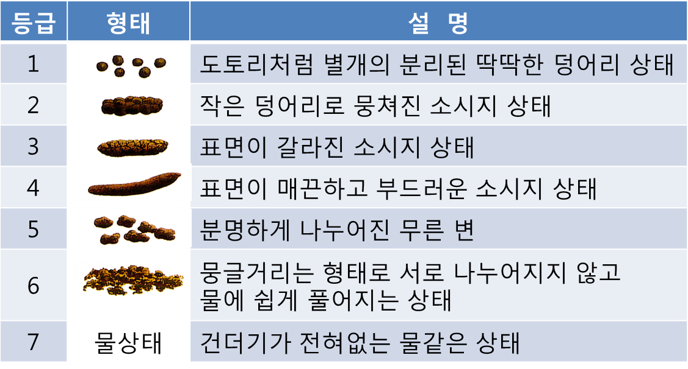
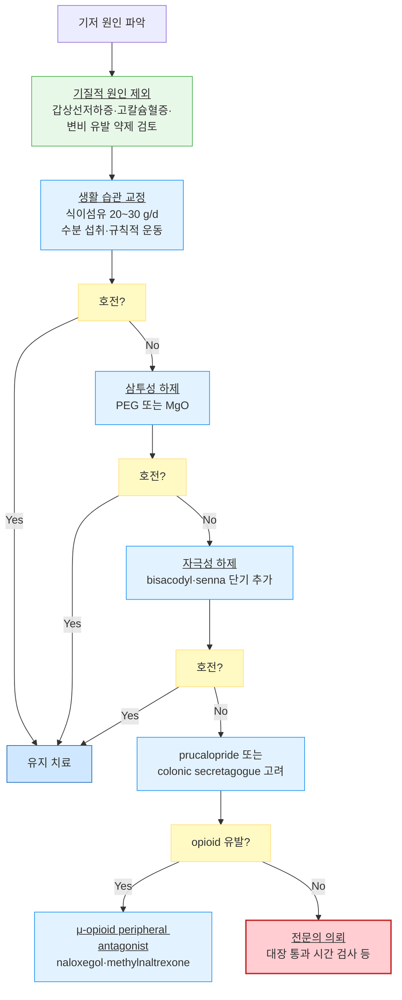

# 변비 Constipation

## 일반 사항

*   희발 배변(≤2회/주), 단단한 대변, 불완전한 배변감, 배변 시 과도한 힘주기, 항문 폐쇄감, 배변 유도를 위하여 수지조작이

    필요한 경우; 대변의 굳기, 배변 빈도와 어려움 등을 종합적으로 평가
* 일반적인 대변량 : 150\~200 g/d
* normal transit time : cecum까지 4시간, distal colon까지 12시간\~36시간
*   유병률 : 성인의 16%, ＞60세 인구의 ⅓;

    고령에서는 동반 질환, 운동 능력 감소, 식사량 감소, 복용 약물 등의 요인에 의해 증가

## 임상 양상

* 단단(Bristol stool form scale 1\~2)
* 배변 시 힘을 많이 줘야 함
* 배변에 시간이 많이 소요됨
* 불완전한 배출감
* 하복부 불편감/팽만감

<figure><figcaption></figcaption></figure>

### Red Flags!

* 심한 복통, 구역, 구토
* 불명열
* 설명할 수 없는 체중 감소
* 직장 탈출, 직장 출혈, 혈변, 철결핍빈혈
* 신생아 때부터 지속되는 변비
* 치료에 반응하지 않음
* 근래(특히 ＞50세) 새로이 시작되어 지속 또는 악화
* 대장암 가족력

## 원인

### 1차성

#### Functional constipation (Normal transit)

* 가장 흔한 형태 (⅔ 해당)
* transit time 및 sphincter function은 정상
* 증상 : 복부 팽만, 복통

#### Slow-transit constipation

* 기전 : myenteric plexus, cholinergic innervation, noradrenergic 근신경 전달 계통 이상
* colonic transit time ＞72시간
* 골반저 기능은 정상
* 여성, 정신 문제(우울, 불안, 섭식 장애)가 있는 경우에 보다 흔함

#### Pelvic floor(Anorectal) dysfunction

* 기전 : 골반 근육의 조화운동부전, 높은 basal sphincter pressure
* 증상 : 지속되는 과도한 긴장감, 막힌 느낌, 불완전한 배출감; 부드러운 대변조차 배변하기 힘듦

### 2차성

* 내분비/대사 이상 : 당뇨병, 고칼슘혈증, 저칼륨혈증, 갑상선저하증, 부갑상선항진증, 요독증
* 근병증 : amyloidosis, scleroderma, 근육긴장퇴행위축
* 신경 질환 : 자율신경병증, CVD, 파킨슨병, 척추 질환
* 정신 질환 : 불안증, 우울증, 신체화장애, 치매
* 구조 이상 : 항문열상, 협착, 치핵, 결장협착증, IBD, 결장의 종괴, 직장탈출증, 직장류
* 약물 : Al 또는 Ca 함유 제산제, 항콜린제, 항우울제, 항히스타민제, CCB, clonidine, 이뇨제, 철분제, levodopa, 아편마약류, NSAID, 항정신병제, 교감 신경 약제
* 기타 : IBS, 임신

### 위험 인자

* 소아, 고령, 여성, 스트레스, 신체 활동 부족, 낮은 사회 경제적 상태, 다제약물 복용

## 진단

### 기능성 변비(functional constipation) Diagnostic criteria&#x20;

* 발생한 지 최소 6개월 되었고 최근 3개월간 다음 기준을 충족 \[ROME Ⅳ]

A. 다음 조건 중 ≥2개 해당

1. 배변 횟수의 ＞¼에서 힘을 주어야 함
2. 배변 횟수의 ＞¼에서 덩어리 또는 단단한 대변(Bristol stool scale 1\~2)
3. 배변 횟수의 ＞¼에서 불완전한 배출감
4. 배변 횟수의 ＞¼에서 항문직장의 폐쇄 또는 막힌 느낌
5. 배변 횟수의 ＞¼에서 손가락 배출, 골반저 지지 등 수기 조작이 필요
6. 자발적인 배변이 주당 ≤2회

B. 무른 변을 보는 경우는 드묾 (하제 사용 시는 제외)

C. 과민대장증후군에 해당되지 않음

### 검사

* 보통 유용하지 않음
* 대상 : 경고 징후 해당, 식이 섬유 및 하제 치료에 반응하지 않음, 기질적 원인 의심

#### 실험실 검사

* CBC, glucose, 전해질, Cr, Ca, TSH
* 대변 잠혈

#### 영상/기타 검사

* 직장 수지 검사 : 2차성 변비(예: 괄약근 긴장, 직장항문 종괴, 직장탈출, 직장류) 감별 및 배변 장애 예측에 유용
* colonoscopy : 조직 검사나 폴립 제거 등을 동시에 시행할 수 있음
* barium enema : 저렴하며 대장의 확장과 중요한 병변 및 협착을 진단할 수 있기 때문에 변비만 있는 경우에는 대장내시경보다 유리
* defecography : 배변 활동 중의 장과 주위 구조물의 형태 및 움직임을 관찰할 수 있음
* CT : 해부학적 이상, 종양 등 진단
* colonic transit time 측정 : radiopaque marker 섭취 120시간 후에 X선상 marker가 ＞20% 정체되어 있으면 delayed transit으로 정의
* anorectal manometry : 직장 및 항문 괄약근의 작동 정도를 측정

***

## Management


치료 목표 : 증상 개선(soft, non-straining), ≥3회/주 배변


**1. 안심시킴** : 경증 변비는 비정상적인 것이 아님을 설명

**2. Fecal impaction**이 있는 경우 관장 또는 삼투성 하제로 이를 먼저 해결

**3. 변비 유발 약물** 복용 확인 및 회&#xD53C;**, 정신 사회적 문제 및 기저 질환 관리**

**4. 식이 개선**

* 충분한 수분 섭취 : 섭취가 부족한 경우 수분 섭취를 늘림
* 식이 섬유 섭취를 늘림 : 20\~30 g/d; normal transit time 환자에서 유익
  * 수용성 및 불용성 섬유 모두 대변 덩이 형성에 도움이 됨(반응이 즉각적으로 나타나지는 않음); 설사와 변비가 공존하는 과민대장증후군에서는 수용성 식이 섬유를 주로 선택함
  * 수용성 섬유 식품 : 가지, 귀리, 콩, 보리 (☞ [영양 지침](../231_/217_-nutritiondiet-guideline.md#undefined-14))
  * 불용성 섬유 식품 : 전곡류, 짙은 색 채소, 단단한 줄기, 밀기울, 사과/배의 껍질, 감자류
  * 복부 팽만, 가스가 유발될 수 있으며 보통 수일 후 감소함
  * 7\~10일에 걸쳐 점차 증량해 나가며 복부 가스 등 불편한 증상이 있는 경우 감량
* 피할 음식 : 감, 바나나, 많은 양의 우유 (우유는 설사를 유발할 수도 있음)
* 경련성 변비에 대한 식이 요법&#x20;
  * 음식의 조리는 부드럽고 담백하게 함&#x20;
  * 채소는 연한 것을 사용
  * 식이 섬유 섭취량을 조절(10\~15 g으로 제한)&#x20;
  * 자극성이 강한 조미료/향신료 사용을 피함
  * 커피, 콜라, 홍차, 녹차 등 카페인 함유 식품 섭취를 피함

**5. 행동 개선**

* 배변 환경 개선 : 편안한 배변 환경, 적당한 자세 확보 (✽양변기가 높은 경우 무릎 관절 및 고관절이 예각이 되도록 발판을 사용하면 도움이 되는 경우가 있음)
* 배변 훈련 : 규칙적 배변
  * 아침 식사 후 (30분 후) 편안한 상태로 15분 정도 배변 시도 또는 변의가 있을 때 배변 시도
  * 변기에 오래 앉아서 힘주지 않기; 과도한 힘주기는 치핵/항문열상 등의 문제를 일으킬 수 있음
* 규칙적 운동
* 바이오피드백 : 골반저 기능 부전에 의한 변비 환자에 적용

**6. 약물 치료** (☞ [소화기계 약제](073_.md#laxative))

* 생활 중재에 반응하지 않는 변비에 대해서 간헐적 또는 장기적 약물 투여를 할 수 있음
* 하제 : 장기 사용에 따른 의존이나 위해의 명백한 증거 없음
  * 만성 신부전 환자에서 Mg 제제는 금기
  * 말기암 등의 환자에서는 부피 형성 하제보다는 연화제와 자극성 하제 동시 사용 권장
  * ≥3회/주 배변을 하게 되면 tapering 고려
* 관장 : 다른 치료로 실패한 경우 선택; 직장점막 손상, 전해질 불균형 주의
  * 고령에서는 전해질 불균형 위험을 고려하여 단순 온수 관장을 권고
* probiotics : 논란; 일부에서 효과 (☞ p.372)
* 수술 또는 출산 후, 치핵, 항문 열상 : 배변 연화제(예: docusate)


**실전 1차 선택**

* 만성 변비 1차 : **PEG 3350** (내약성 우수, 안전성 높음) 또는 **MgO** (국내 접근성 높음)
* 급성·단기 : **bisacodyl** 또는 **glycerin 관장**
* 만성 변비 + 하제 실패 : **prucalopride** (5-HT4 agonist)
* OIC (opioid 유발 변비) : **naloxegol** 또는 **methylnaltrexone**


#### 약물 치료 과정 예

1. 경고 징후가 없으면 Normal transit constipation에 대하여 치료
   1. 충분한 물과 함께 ‘부피 형성 하제’ \[무타실, 아기오] &/or ‘삼투성 하제’ MgO \[마그밀] 투여
   2. 필요시 ‘삼투성 하제’ 추가 : lactulose \[듀파락-이지], PEG \[마이락스]\(비보험); 보통 1\~3일 내 반응
   3. 필요시 or 3\~4회/주 ‘자극성 하제’ 추가 : bisacodyl \[둘코락스], Na picosulfate \[피코락]\(비보험)
   4. 필요시 약물 조정
2. 호전 되지 않으면 실험실 검사 및 영상 검사 시행 → 검사에서 이상 없으면 slow-transit constipation에 대하여 치료
   1. 식이 섬유, 삼투성 하제(Mg), 자극성 하제(bisacodyl/Na picosulfate) 동시 투여
   2. 필요시 prucalopride \[레졸로] (보험기준 ☞ p.1183), lubiprostone \[아미티자]\(비보험) 추가
   3. 필요시 lactulose/PEG 추가
3. 호전되지 않으면 : 재평가, 수술 치료 고려

### 만성 특발성 변비의 약물 치료 권고 [AGA](../2023/)

**식이 섬유**

1. 식이 섬유 보충제 제안 : 특히 식이 섬유 섭취가 적은 환자에서 보충
   * 연구로 효과가 입증된 제제는 psyllium 뿐임
   * 식이 섬유 보충과 적절한 수분 공급
   * 부작용 : 복부 가스

**삼투성 하제**

2. PEG 권고
   * 부작용 : 북부 팽창, 무른 변, 복부 가스, 구역
3. MgO 제안 : 저용량(500\~1,000 ㎎/d)으로 시작, 필요시 증량
   * 신 장애 환자에서 회피(hypermagnesemia 위험)
4. Lactulose 제안(OTC 약제에 반응하지 않거나 불내성인 경우)
   * 부작용 : 배부품, 복부 가스

**자극성 하제**

5. Bisacodyl or Na picosulphate 권고 : 단기(≤4주) 사용, 저용량 시작, 내성에 따라 증량
   * 다른 변비 치료제와 함께 간헐적 사용 or rescue therapy
   * 부작용 : 복통(경련), 설사
6. Senna 제안 : 단기 사용, 저용량 시작, 반응이 없으면 증량
   * 장기 사용이 가능하지만 내성과 부작용에 대한 연구가 필요함
   * 부작용: 고용량에서 복통(경련)

**분비 촉진제**

7. Lubiprostone 제안 : OTC 약제에 반응하지 않는 경우 OTC 약제 대체 또는 추가, 4주 사용
   * 부작용 : 구역(용량 의존, 음식/물과 함께 복용하면 감소)
8. Linaclotide 권고 : OTC 약제에 반응하지 않는 경우 OTC 약제 대체 또는 추가, 12주 사용
   * 부작용 : 설사
9. Plecanatide 권고 : OTC 약제에 반응하지 않는 경우 OTC 약제 대체 또는 추가, 12주 사용
   * 부작용 : 설사5-HT4 agonist
10. Prucalopride 권고 : OTC 약제에 반응하지 않는 경우 OTC 약제 대체 또는 추가, 4\~24주 사용
    * 부작용 : 두통, 복통, 구역, 설사

### **질병코드**&#x20;

K59.0 변비

## 처방례

1. 부피 형성 하제 &/or 삼투성 하제 •무타실 산 1P qd~~bid 공복 OR •아기오 과립 6 g/P 1~~2P 저녁 식후 OR •마그밀 500 ㎎/T 2T #2
2. 필요시 삼투성 하제 추가 •듀파락-이지 시럽 15 ㎖/P 1P 아침 식전
3. 필요시 자극성 하제 추가 •둘코락스 좌약 10 ㎎/T 1T 취침 시 OR •피코락 7.5 ㎎/T 1T 취침 시 (비보험)
