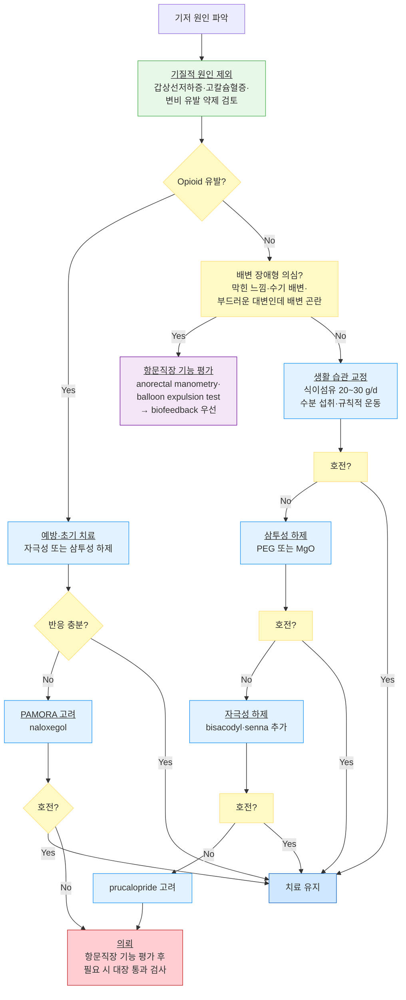

# 변비 Constipation

## <mark style="color:green;">일반 사항</mark>

* 정의 : 희발 배변(≤2회/주), 단단한 대변, 불완전한 배변감, 배변 시 과도한 힘주기, 항문 폐쇄감, 배변 유도를 위한 수지조작이 필요한 경우; 대변의 굳기, 배변 빈도와 어려움 등을 종합적으로 평가
* 유병률 : 성인의 16%, ＞60세 인구의 ⅓; 고령에서는 동반 질환, 운동 능력 감소, 식사량 감소, 복용 약물 등의 요인에 의해 증가

## <mark style="color:green;">원인 및 위험 인자</mark>

### <mark style="color:orange;">1차성 (기능성)</mark>

#### <mark style="color:$primary;">Functional constipation</mark>

* Rome IV 증상 기준을 충족하고 다른 원인으로 더 잘 설명되지 않는 변비
* 기능성 변비는 증상 기반 진단이며, 생리 검사에 따라 normal-transit constipation, slow-transit constipation, 배변장애가 포함될 수 있음

#### <mark style="color:$primary;">Normal-transit constipation</mark>

* 가장 흔한 생리학적 아형
* 대장 통과 시간은 정상이지만 단단한 대변, 힘주기, 불완전 배출감 등을 호소
* 생활 습관 교정과 부피 형성·삼투성 하제에 비교적 잘 반응

#### <mark style="color:$primary;">Slow-transit constipation</mark>

* 기전 : 대장의 추진성 운동 저하 등 여러 신경근육 기능 이상이 관여하는 것으로 추정
* 검사법별 정상범위를 벗어난 대장 통과 지연으로 진단; 배변장애가 병존할 수 있음
* 여성, 정신 질환(우울, 불안, 섭식 장애) 동반 시 더 흔함

#### <mark style="color:$primary;">Pelvic floor (Anorectal) dysfunction</mark>

* 기전 : 배변 시 골반저·항문괄약근의 이완 부전 또는 역설적 수축과 불충분한 복압 형성
* 증상 : 지속되는 과도한 긴장감, 막힌 느낌, 불완전한 배출감; 부드러운 대변조차 배변 곤란
* 바이오피드백 치료가 효과적; slow-transit constipation과 병존하는 경우 많음

### <mark style="color:orange;">2차성</mark>

<table><thead><tr><th width="132">범주</th><th>원인 질환 및 약물</th></tr></thead><tbody><tr><td>내분비/대사</td><td>당뇨병, 고칼슘혈증, 저칼륨혈증, 갑상선저하증, 부갑상선항진증, 요독증</td></tr><tr><td>근병증</td><td>amyloidosis, scleroderma, 근육긴장퇴행위축</td></tr><tr><td>신경 질환</td><td>자율신경병증, 뇌혈관질환, 파킨슨병, 척수 질환</td></tr><tr><td>정신 질환</td><td>불안증, 우울증, 신체화장애, 치매</td></tr><tr><td>구조 이상</td><td>항문열상, 협착, 결장협착증, IBD, 결장 종괴, 직장탈출증, 직장류</td></tr><tr><td>약물</td><td>Al 또는 Ca 함유 제산제, 항콜린제, 항우울제(TCA ＞ SSRI), 1세대 항히스타민제, CCB(특히 verapamil), clonidine, 이뇨제, 철분제, levodopa, opioid, 항정신병제, 교감신경 작용제</td></tr><tr><td>생리적 요인</td><td>임신</td></tr></tbody></table>

* IBS-C는 2차성 변비가 아니라 별개의 장-뇌 상호작용 장애이며 기능성 변비와 증상이 중복될 수 있음

### <mark style="color:orange;">위험 인자</mark>

* 고령, 여성, 스트레스, 신체 활동 부족, 낮은 사회경제적 상태, 다제약물 복용

## <mark style="color:green;">임상 양상</mark>

* 희발 배변(주 ≤2회) 또는 단단하고 덩어리진 대변 (Bristol stool scale 1\~2)
* 배변 시 과도한 힘 필요, 배변에 시간이 많이 소요됨
* 불완전한 배출감, 항문 폐쇄감
* 하복부 불편감/팽만감

<figure><figcaption></figcaption></figure>

### <mark style="color:$danger;">🚩 Red Flags!</mark>

<mark style="color:$danger;">**즉각 조치 또는 응급 이송**</mark>

* 급성 심한 복통 + 복막 자극 징후 (복근 강직, 반발통) → 복막염·장폐색
* 급성 장폐색 소견 : 심한 복부 팽창, 지속적인 구역·구토, 대변·가스 배출 중단 ± 장음 변화
* 대량 직장 출혈 (hemodynamically unstable)

<mark style="color:$warning;">**당일 또는 조기 의뢰**</mark>

* 설명할 수 없는 체중 감소와 지속적인 배변 습관 변화 → 대장암 등 기질적 질환 평가
* 혈변 또는 철결핍빈혈 동반 → 대장암·하부 위장관 출혈 평가
* 흑색변 → 상부 위장관 출혈 가능성을 우선 평가
* 직장 탈출, 반복적 직장 출혈
* 설명되지 않는 진행성 배변 습관 변화(특히 체중 감소·빈혈·혈변·대장암 가족력 동반 시)

<mark style="color:$info;">**외래 추적 / 추가 평가 계획**</mark> <mark style="color:$info;">- 즉각 위험 낮으나 호전 없으면 의뢰</mark>

* 식이·하제 치료에 4\~8주 이상 반응 없음
* 지속적인 발열·전신 증상과 함께 새로 발생한 변비
* 대장암 고위험 가족력 또는 연령·위험도에 맞는 대장암 선별검사 미시행

## <mark style="color:green;">진단</mark>

### <mark style="color:orange;">기능성 변비 진단기준 \[Rome IV]</mark>

* 증상이 최소 6개월 이상 지속되고, 최근 3개월 동안 다음 기준 충족

1. 다음 항목 중 ≥2개 해당
   1. 배변 횟수의 ＞¼에서 힘을 주어야 함
   2. 배변 횟수의 ＞¼에서 덩어리 또는 단단한 대변 (Bristol stool scale 1\~2)
   3. 배변 횟수의 ＞¼에서 불완전한 배출감
   4. 배변 횟수의 ＞¼에서 항문직장의 폐쇄 또는 막힌 느낌
   5. 배변 횟수의 ＞¼에서 손가락 배출, 골반저 지지 등 수기 조작이 필요
   6. 자발적인 배변이 주당 ≤2회
2. 무른 변은 드묾 (하제 사용 시는 제외)
3. 과민대장증후군 기준에 해당하지 않음

### <mark style="color:orange;">변비 아형 감별</mark>

* 임상 양상만으로 아형을 구분하는 것은 어려우나, 다음 특징이 있으면 생리 검사로 확인하고 치료 전략 수립

<table><thead><tr><th width="170">항목</th><th width="130">Normal transit</th><th width="140">Slow-transit</th><th width="155">Dyssynergic defecation</th><th>IBS-C overlap</th></tr></thead><tbody><tr><td>핵심 병태생리</td><td>대장 통과 시간 정상</td><td>대장 추진성 운동 저하</td><td>골반저·항문괄약근 협응 장애</td><td>Visceral hypersensitivity + 장-뇌 축 이상</td></tr><tr><td>항문 폐쇄감·수기 배변</td><td>가능</td><td>가능</td><td><strong>강력 시사</strong></td><td>가능</td></tr><tr><td>부드러운 대변인데 배변 곤란</td><td>가능</td><td>가능</td><td><strong>강력 시사</strong></td><td>가능</td></tr><tr><td>복부 팽만</td><td>흔함</td><td>흔함</td><td>가능</td><td>흔함</td></tr><tr><td>반복되는 복통과 배변의 연관성</td><td>두드러지지 않음</td><td>두드러지지 않음</td><td>두드러지지 않음</td><td><strong>진단에 중요</strong></td></tr><tr><td>Colonic transit time</td><td>정상</td><td>검사법별 정상범위를 벗어나 지연</td><td>정상 또는 지연</td><td>다양</td></tr><tr><td>항문직장 기능 검사</td><td>대개 정상</td><td>정상 또는 배변장애 병존</td><td>ARM·BET 등에서 비정상</td><td>다양</td></tr><tr><td>핵심 치료</td><td>Fiber + PEG</td><td>PEG ± prucalopride</td><td><strong>Biofeedback 우선</strong></td><td>복통을 포함한 통합 접근</td></tr><tr><td>흔한 함정</td><td>증상 중증도를 과소평가</td><td>배변장애 병존을 놓침</td><td>하제만 계속 증량</td><td>단순 변비로 간과</td></tr></tbody></table>

### <mark style="color:orange;">검사</mark>

* 경고 징후가 없고 하제에 반응하는 경우 추가 검사는 대개 불필요
* 경고 징후 존재, 식이 섬유 및 하제 치료에 반응하지 않음, 기질적 원인 의심 시 시행

#### <mark style="color:$primary;">실험실 검사</mark>

* 경고 징후가 없는 전형적인 만성 변비에서는 루틴 검사가 대개 불필요
* 병력·진찰에 따라 CBC, glucose, 전해질, Cr, Ca, TSH 등을 선택적으로 시행
* 분변잠혈검사는 연령·위험도에 따른 대장암 선별에 사용하며, 혈변·철결핍빈혈·체중 감소 등 경고 징후가 있는 환자의 진단 평가를 대신하지 않음

#### <mark style="color:$primary;">영상 및 기타 검사</mark>

<table><thead><tr><th width="200">검사</th><th>적응 및 특징</th></tr></thead><tbody><tr><td>직장 수지 검사</td><td>분변매복, 괄약근 긴장, 직장항문 종괴, 직장탈출·직장류를 확인하고 배변장애를 조기에 시사하는 중요한 검사; 배변 시뮬레이션에서 치골직장근의 역설적 수축 또는 괄약근 이완 부전이 관찰되면 배변장애 의심. 정상 소견만으로 배변장애를 배제할 수 없음</td></tr><tr><td>대장내시경</td><td>대장암 의심 소견, 혈변, 철결핍빈혈, 설명되지 않는 체중 감소·지속적인 배변 습관 변화 또는 대장암 선별검사 적응이 있을 때 시행</td></tr><tr><td>CT colonography</td><td>대장내시경이 불가능하거나 불완전한 경우 해부학적 이상·종양 평가의 대안; 조직검사·치료는 불가능</td></tr><tr><td>Anorectal manometry<br>+ balloon expulsion test</td><td>배변장애가 의심되거나 적절한 하제 치료에 반응하지 않을 때 함께 시행; 단일 검사 이상만으로 확진하지 않음</td></tr><tr><td>Defecography</td><td>ARM·BET 결과가 불일치하거나 직장류·직장탈출 등 구조적 배출장애가 의심될 때 추가</td></tr><tr><td>Colonic transit test</td><td>배변장애 평가·치료 후에도 증상이 지속될 때 고려; 방사선비투과 표지자 검사 등 검사법별 정상범위와 표지자 분포를 함께 해석</td></tr></tbody></table>

***


```mermaid
graph TD
    B[기저 원인 파악]
    B --> C[<u>기질적 원인 제외</u><br/>갑상선저하증·고칼슘혈증·<br/>변비 유발 약제 검토]
    C --> OIC{Opioid 유발?}
    OIC -->|Yes| OL[<u>예방·초기 치료</u><br/>자극성 또는 삼투성 하제]
    OL --> OR{반응 충분?}
    OR -->|No| PAM[<u>PAMORA 고려</u><br/>naloxegol]
    OR -->|Yes| Z[치료 유지]
    PAM --> PR{호전?}
    PR -->|Yes| Z
    PR -->|No| M
    OIC -->|No| DYS[배변 장애형 의심?<br/>막힌 느낌·수기 배변·<br/>부드러운 대변인데 배변 곤란]
    DYS -->|Yes| BF[<u>항문직장 기능 평가</u><br/>anorectal manometry·<br/>balloon expulsion test<br/>→ biofeedback 우선]
    DYS -->|No| D[<u>생활 습관 교정</u><br/>식이섬유 20~30 g/d<br/>수분 섭취·규칙적 운동]
    D --> E[호전?]
    E -->|No| F[<u>삼투성 하제</u><br/>PEG 또는 MgO]
    E -->|Yes| Z
    F --> G[호전?]
    G -->|No| H[<u>자극성 하제</u><br/>bisacodyl·senna 추가]
    G -->|Yes| Z
    H --> I[호전?]
    I -->|No| J[prucalopride 고려]
    I -->|Yes| Z
    J --> M[<u>의뢰</u><br/>항문직장 기능 평가 후<br/>필요 시 대장 통과 검사]
classDef yellow fill:#fff9c4,stroke:#ffe082
class E,G,I,OIC,OR,PR,DYS yellow
classDef sky fill:#e3f2ff,stroke:#2196f3
class D,F,H,J,OL,PAM sky
    style C fill:#e8f8e8,stroke:#4caf50
    style BF fill:#f3e5f5,stroke:#7b1fa2
    style Z fill:#d0e8ff,stroke:#1a6abf
    style M fill:#ffcdd2,stroke:#c62828
```

<p align="center"><strong>만성 변비 단계적 치료 알고리듬</strong></p>

***

## <mark style="background-color:$warning;">Management</mark>

* 치료 목표 : 편안한 자발적 완전 배변, 적절한 대변 굳기(Bristol stool scale 3\~4), 힘주기·폐쇄감 감소 및 환자 만족도 향상
* 치료 단계

1. 안심시킴 : 경증 변비인 경우 비정상이 아님을 설명
2. Fecal impaction이 있는 경우 : 위치와 장폐색 여부를 평가한 뒤 수지 제거·좌약·관장 또는 PEG 세척요법으로 먼저 해결
3. 기저 원인 파악 및 관리 : 변비 유발 약물 복용 확인 및 회피, 정신사회적 문제 및 기저 질환 관리
4. 생활습관 교정 : 식이 및 행동 개선
5. 단계적 하제 치료
6. 필요시 의뢰


**고령자 분변 매복(fecal impaction)** - 비전형 양상 주의

* 다음이 동반될 때 반드시 fecal impaction을 감별할 것 :\
  Overflow diarrhea (설사처럼 보이지만 실은 굳은 변 주위로 액상 변이 새어나오는 것),\
  요폐 (urinary retention),\
  급성 섬망 (특히 입원 고령 환자),\
  식욕 저하, 복부 팽창
* 치료 : 직장 수지 검사로 확인 → 원위부 직장 매복은 수지 제거 ± 좌약·적절한 관장; 근위부 매복은 기계적 장폐색을 배제한 뒤 경구 PEG 세척요법 고려 → 이후 유지 하제 시작
* 고령·신장질환·심부전 환자에서는 인산염 관장을 피하고, 비눗물 관장은 직장점막 손상 위험 때문에 사용하지 않음



**불응성 변비(refractory constipation)로 판단하기 전 확인 사항 - AGA 2026**

* 변비 유발 약물·신경계 질환 등 교정 가능한 2차 원인을 재검토
* 대부분의 만성 불응성 환자에서 anorectal manometry + balloon expulsion test 시행
* 배변장애가 확인되면 충분한 바이오피드백 치료 시행
* 부피 형성·삼투성·자극성 하제 및 국내 허가 처방약의 적절한 단독·병용 치료 여부 확인
* 대장 통과 검사는 원칙적으로 하제와 통과 시간에 영향을 주는 약물을 중단한 상태에서 시행; 수술은 서행성 변비를 객관적으로 확인하고 배변장애를 배제한 극히 일부 환자에서만 고려


## <mark style="color:green;">비-약물 치료 및 예방</mark>

### <mark style="color:orange;">식이 개선</mark>

* 충분한 수분 섭취 : 탈수 상태인 경우 수분 섭취 증가가 효과적
  * 정상 수화 상태에서 수분 증가만으로 배변 호전 효과는 제한적
*   식이 섬유 섭취 증가 : 20\~30 g/d 목표; normal transit constipation에서 가장 효과적

    * 식이 섬유는 대변량과 수분 보유를 증가시킬 수 있음; IBS-C에서는 불용성 섬유(밀기울 등)가 복부 팽만·통증을 악화시킬 수 있으므로 수용성·점성 섬유(psyllium)를 우선 섭취
    * 수용성 섬유 식품 : 가지, 귀리, 콩, 보리 (☞ [영양 지침](../231_/217_-nutritiondiet-guideline.md#undefined-14))
    * 불용성 섬유 식품 : 전곡류, 짙은 색 채소, 단단한 줄기, 밀기울, 사과/배의 껍질, 감자류
    * 복부 팽만·가스 유발 가능 - 7\~10일에 걸쳐 점진적으로 증량, 불편하면 일시 감량

    ✽연구된 섬유 보충제 중 psyllium(차전자피)의 효과 근거가 가장 분명함
* 특정 음식을 일률적으로 금지하기보다 개인별로 증상을 악화시키는 음식과 전체 식이 섬유 섭취량을 확인
* 복부 팽만 동반 변비 / IBS-C 중복 환자 : 식이 섬유를 갑자기 과량 증량하지 않고 psyllium을 소량부터 시도; 저FODMAP 식이는 팽만·복통 완화를 위해 제한적으로 고려하며 단기간 제한 후 단계적으로 재도입

### <mark style="color:orange;">행동 개선</mark>

* 배변 훈련 : 아침 식사 후 30분 뒤 편안한 상태에서 15분 이내 배변 시도 (gastrocolic reflex 이용); 변의가 생기면 즉시 시도
  * 변기에 오래 앉아 과도하게 힘주지 않기; 힘주기 → 치핵·항문열상 위험 증가
* 배변 자세 : 양변기가 높은 경우 발판을 이용해 무릎 관절 및 고관절이 예각이 되도록(squat position 유사) → 항문직장각 개선
* 규칙적 운동 : 걷기 등 유산소 운동이 장 통과 시간 단축에 도움

### <mark style="color:orange;">바이오피드백</mark>

* 적응 : 골반저 기능 부전(pelvic floor dysfunction/dyssynergia)에 의한 배변 장애형 변비
* 방법 : 항문 괄약근의 비정상적 수축 패턴을 실시간으로 인지하고 교정하는 훈련
* 근거 : 배변장애형 변비에서 하제 단독보다 우월한 효과; 배변장애가 확인되면 1차 치료로 권고
* slow-transit constipation과 pelvic floor dysfunction이 병존하는 경우 바이오피드백 + 하제 병용

## <mark style="color:green;">약물 치료</mark>


**1차 선택**

* 만성 변비 1차 : PEG 3350 <mark style="color:blue;">\[마이락스]</mark> (내약성 우수, 안전성 높음) 또는 MgO <mark style="color:blue;">\[마그밀]</mark> (국내 접근성 높음)
* 급성·단기 : bisacodyl 좌약 <mark style="color:blue;">\[둘코락스]</mark> 또는 glycerin 관장
* 만성 변비 + 일반 하제 실패 : prucalopride <mark style="color:blue;">\[레졸로]</mark> (5-HT4 agonist)
* OIC (opioid 유발 변비) : 일반 하제에 반응하지 않으면 naloxegol <mark style="color:blue;">\[모벤틱]</mark> 고려


* 생활 습관 교정에 반응하지 않는 변비에 간헐적 또는 장기적 약물 투여 가능
* 하제 장기 사용 : 적응에 맞게 최소 유효용량을 사용하고 효과·부작용을 정기적으로 평가; 자극성 하제가 장 신경을 손상시킨다는 명확한 근거는 없으나 장기 안전성 자료는 제한적
* 편안한 자발적 완전 배변과 적절한 대변 굳기가 일정 기간 유지되면 개별적으로 tapering 고려
* 유의한 신기능 저하에서는 Mg 제제를 피하거나 대체제를 우선하고, 불가피하면 저용량과 혈중 Mg·신기능 모니터링 고려
* 말기암·완화의료 환자 : 부피 형성 하제는 분변매복 위험 때문에 대개 피하고, 자극성 하제 ± 삼투성 하제를 증상과 섭취 상태에 맞게 사용
* 임신·수유부
  * 1차 (안전) : 식이 섬유 증량, PEG 3350 <mark style="color:blue;">\[마이락스]</mark>, lactulose <mark style="color:blue;">\[듀파락-이지]</mark> - 장내 흡수 거의 없어 임신·수유 중 안전하게 권고
  * 단기 가능 : bisacodyl 등 자극성 하제는 필요 시 단기간 사용
  * 피할 약제 : castor oil (자궁 수축 유발 가능); Mg 제제는 신기능 저하 산모에서 피하고 PEG를 우선 고려

### <mark style="color:orange;">Probiotics 및 장내 미생물</mark>

* 일부에서 배변 빈도 개선 보고되나 균주별 효과 차이가 크며 표준 치료 권고 없음
* 장내 미생물과 변비의 연관성
  * 일부 만성 변비 환자에서 dysbiosis 관찰 (Bifidobacterium 감소, methane 생성 archaea 증가)
  * Methane-associated constipation : methane 생성 증가와 장 통과 지연의 연관성이 보고되었으나, 호기검사를 만성 변비에서 일률적으로 시행하지 않음
  * 향후 microbiome-targeted therapy 연구 진행 중이나 현재는 임상 적용 단계가 아님
* 유산균제, 특히 유산균 음료가 변비에 도움이 되는 경우 유산균 외 다른 함유물의 영향일 수 있음

### <mark style="color:orange;">부피 형성 하제 (Bulk-forming laxatives)</mark>

<mark style="color:$primary;">**Psyllium (차전자피)**</mark>

* 연구된 섬유 보충제 중 효과 근거가 가장 분명함 (AGA-ACG 2023 conditional recommendation)
* 200 ㎖ 이상의 충분한 수분과 함께 복용; 충분한 수분 없이 복용 시 오히려 대변이 굳어지거나 식도 폐색 위험 증가
* 부작용 : 복부 가스, 팽만 (보통 수일 내 감소)
* <mark style="color:blue;">\[무타실 산]</mark> 1P qd\~bid 공복, <mark style="color:blue;">\[아기오 과립]</mark> 6 g/P 1\~2P 저녁 식후

### <mark style="color:orange;">삼투성 하제 (Osmotic laxatives)</mark>

<mark style="color:$primary;">**Polyethylene glycol (PEG 3350)**</mark>

* 만성 변비 약물 치료에서 가장 근거 수준이 높은 장기 유지 하제 (AGA-ACG 2023 strong recommendation)
* 자극성 하제 대비 내약성 우수하며 장기 유지 치료에 적합
* 장내 흡수가 거의 없어 전신 부작용이 적고 임신 중에도 우선 고려 가능
* 부작용 : 복부 팽만, 무른 변, 복부 가스, 구역 (용량 의존)
* <mark style="color:blue;">\[마이락스]</mark> 10 g/P 1\~2P qd; 물 또는 음료에 녹여 복용하며 식사·시간과 무관하게 투여 가능; 보통 1\~3일 내 효과 (비급여, 제품별 허가사항 확인)

<mark style="color:$primary;">**Magnesium oxide (MgO)**</mark>

* 삼투압 기전으로 장내 수분 분비 증가
* 저용량 (500\~1,000 ㎎/d)으로 시작, 필요 시 증량
* 유의한 신기능 저하에서는 피하거나 대체제를 우선; 고령, 고용량·장기 사용, 장운동 저하 환자는 hypermagnesemia에 특히 주의
* <mark style="color:blue;">\[마그밀]</mark> 500 ㎎/T 2T #2

<mark style="color:$primary;">**Lactulose**</mark>

* 비흡수성 이당류; 결장 세균에 의해 발효되어 삼투압 증가
* PEG에 반응하지 않거나 불내성이 있는 경우 대체 옵션
* 보통 1\~3일 내 반응; 부작용 : 배부름, 복부 가스 (발효 산물)
* <mark style="color:blue;">\[듀파락-이지 시럽]</mark> 15 ㎖/P 1P qd; 반응에 따라 조절

### <mark style="color:orange;">자극성 하제 (Stimulant laxatives)</mark>

<mark style="color:$primary;">**Bisacodyl**</mark>

* 결장 점막에 직접 작용하여 연동 운동 촉진 + 수분 분비 증가 (AGA-ACG 2023 strong recommendation)
* rescue therapy 또는 다른 하제와 간헐적 병용 우선
* 단기 또는 rescue therapy 근거가 가장 분명함; 임상적으로 장기 사용하기도 하나 최소 유효용량으로 효과·부작용을 정기 평가
* 부작용 : 복통(경련), 설사
* <mark style="color:blue;">\[둘코락스 정]</mark> 경구 / <mark style="color:blue;">\[둘코락스 좌약]</mark> 10 ㎎ 직장 투여 (15\~60분 내 빠른 효과)

<mark style="color:$primary;">**Sodium picosulfate**</mark>

* 경구 투여 후 결장에서 활성형으로 전환; bisacodyl과 유사한 기전 및 효과
* 부작용 : 복통(경련), 설사
* 국내 제품의 성분·함량과 허가 적응증을 확인하여 사용; 장정결용 복합제와 혼동하지 않도록 주의

<mark style="color:$primary;">**Senna (sennosides)**</mark>

* 안트라퀴논 유도체; 결장 연동 운동 촉진
* 저용량 시작, rescue therapy 또는 다른 하제와 병용, 필요 시 장기 사용 가능
  * 자극성 하제 장기 복용이 장 기능을 손상시킨다는 'cathartic colon' 가설은 현재 근거가 불충분하며, 독립적 질환 개념으로서의 타당성도 확립되지 않음
* 부작용 : 고용량에서 복통(경련)
* 국내에서는 복합제로 유통되는 경우가 많으므로 bisacodyl·docusate 등 중복 성분을 확인

### <mark style="color:orange;">연화제 (Stool softener)</mark>

<mark style="color:$primary;">**Docusate sodium**</mark>

* 대변에 수분을 침투시켜 연화
* 단독 효과는 근거가 매우 제한적; 만성 변비의 표준 치료로 권고되지 않음 (복합제로 유통됨)
* 관행적으로 수술·출산 후 또는 항문질환에서 사용되지만 효과 근거는 약하므로 PEG 등 근거가 더 분명한 약제를 우선 고려

### <mark style="color:orange;">분비 촉진제 (Secretagogues)</mark>

<mark style="color:$primary;">**Lubiprostone**</mark>

* 장 상피 ClC-2 chloride channel 활성화 → 장내 수분·전해질 분비 증가 → 연동 운동 촉진
* 해외에서는 일반 하제에 반응하지 않는 만성 특발성 변비에 사용; 4주 전후 효과와 이상반응 재평가
* 부작용 : 구역 (용량 의존; 음식과 함께 복용 시 감소)
* 24 mcg bid, 음식·물과 함께 복용; 2026년 9월 기준 국내 허가·유통되지 않으므로 해외 지침 참고용

<mark style="color:$primary;">**Linaclotide · Plecanatide**</mark>

* guanylate cyclase-C (GC-C) agonist → cGMP 증가 → 장 분비 및 통과 시간 촉진
* 해외에서는 일반 하제에 반응하지 않는 경우 대체 또는 추가하고 4\~12주에 효과·설사 여부를 재평가; 고정된 12주 치료로 제한하지 않음
* 부작용 : 설사
* 장 분비 촉진과 내장 통증 조절 효과가 있어 해외에서는 IBS-C에도 사용; 2026년 9월 기준 국내 미허가

### <mark style="color:orange;">장 운동 촉진제 - 5-HT4 agonist</mark>

<mark style="color:$primary;">**Prucalopride**</mark>

* 선택적 5-HT4 수용체 작용제 → 대장의 추진성 운동 촉진
* 일반 하제에 반응하지 않는 경우 대체 또는 추가; 4주 전후 반응을 평가하고 유효하면 유지 가능
* 용량 : 2 ㎎ qd, 식사와 무관; 고령(≥65세)은 1 ㎎ qd로 시작하여 필요 시 2 ㎎으로 증량. 중증 신기능 저하 또는 중증 간기능 저하는 1 ㎎ qd; 투석이 필요한 말기신부전에서는 사용하지 않음
* 보험 기준 : 만성 변비 환자로 다른 하제 치료에 반응하지 않은 경우 (☞ [소화기계 약제](073_.md#laxative))
* 부작용 : 두통, 복통, 구역, 설사(주로 치료 초기에 발생 후 감소); 새로 발생하거나 악화되는 우울감·자살사고가 있으면 중단하고 평가
* <mark style="color:blue;">\[레졸로]</mark>

### <mark style="color:orange;">IBAT 억제제 (Ileal bile acid transporter inhibitor)</mark>

<mark style="color:$primary;">**Elobixibat**</mark>

* 회장 담즙산 운반체(ASBT/IBAT) 억제 → 회장 담즙산 재흡수 감소 → 결장 내 담즙산 증가 → 수분 분비 및 대장 운동 촉진
* 용량 : 10 ㎎ qd 아침 식전 30분
* 특징 : 전신 흡수 최소; 일본 등 일부 국가에서 만성 변비 치료제로 사용되나 2026년 9월 기준 국내 미허가
* 부작용 : 복통, 설사, 복부 팽만 (대부분 경증)

***

**AGA-ACG 2023 recommendation 요약**

<table><thead><tr><th width="220">약제</th><th width="110">권고 등급</th><th>비고</th></tr></thead><tbody><tr><td>Polyethylene glycol (PEG)</td><td>Strong</td><td>1차 유지 하제; 장기 사용 근거 있음</td></tr><tr><td>Bisacodyl / Sodium picosulfate</td><td>Strong</td><td>단기 또는 rescue therapy; 장기 사용 시 정기 평가</td></tr><tr><td>Linaclotide</td><td>Strong</td><td>일반 하제 실패 후; 국내 미허가</td></tr><tr><td>Plecanatide</td><td>Strong</td><td>일반 하제 실패 후; 국내 미허가</td></tr><tr><td>Prucalopride</td><td>Strong</td><td>일반 하제 실패 후 대체 또는 추가</td></tr><tr><td>Psyllium (차전자피)</td><td>Conditional</td><td>식이 섬유 섭취 부족 환자에서 보충; 충분한 수분 필수</td></tr><tr><td>Magnesium oxide (MgO)</td><td>Conditional</td><td>저용량(500~1,000 ㎎/d)으로 시작; 유의한 신기능 저하에서 회피·주의</td></tr><tr><td>Lactulose</td><td>Conditional</td><td>PEG 불내성 또는 반응 없을 때 대체</td></tr><tr><td>Senna</td><td>Conditional</td><td>저용량 시작; rescue 또는 다른 하제와 병용</td></tr><tr><td>Lubiprostone</td><td>Conditional</td><td>일반 하제 실패 후; 국내 미허가·미유통</td></tr></tbody></table>

### <mark style="color:orange;">PAMORA - Opioid 유발 변비 (OIC)</mark>

* μ-opioid receptor peripheral antagonist(PAMORA)를 사용하여 중추 진통 효과에 영향 없이 말초 장관 내 opioid 수용체를 차단함으로써 Opioid-induced constipation(OIC)을 치료
* naloxegol : 25 ㎎ qd 공복 (식전 1시간 또는 식후 2시간) <mark style="color:blue;">\[모벤틱]</mark>
  * 부작용 : 복통, 설사, 구역, 오한
  * 금기 : 알려졌거나 의심되는 위장관 폐색 또는 반복 폐색 고위험, 강력한 CYP3A4 억제제(clarithromycin, itraconazole 등) 병용
  * 중등도 CYP3A4 억제제는 가능하면 피하고, 불가피하면 12.5 ㎎ qd로 감량하여 이상반응 모니터링
  * 시작 시 기존 유지 하제를 일단 중단하고, 3일 후 반응이 불충분하면 필요에 따라 재개

### <mark style="color:orange;">관장 (Enema)</mark>

* 다른 치료 실패 시 또는 급성 fecal impaction; 직장점막 손상, 전해질 불균형 주의
* 고령·신장질환·심부전 : 인산염 관장을 피하고 전해질 위험이 적은 관장액 선택; 비눗물 관장은 점막 손상 위험 때문에 피함
* Glycerin 관장 : 직장 자극 + 삼투성 기전; 15\~30분 내 빠른 효과

***

### <mark style="color:red;">질병코드</mark>

K59.0 변비

***

## <mark style="color:purple;">처방례</mark>

> **처방례 1.** 경증 변비 - 부피 형성 하제 우선
>
> ```
> 무타실 산  1P  qd 공복   (또는 아기오 과립 6 g/P  1~2P  저녁 식후)
> ※ 무타실·아기오 복용 시 반드시 충분한 수분(200 ㎖ 이상)과 함께 복용
> ※ 복부 팽만이 있으면 소량부터 서서히 증량
> ```

> **처방례 2.** 중등도 변비 - PEG 기반 삼투성 하제
>
> ```
> 마이락스 산 10 g/P  1~2P  qd  (비급여)
> ※ 식사와 무관하게 물 또는 음료에 녹여 복용 가능
> ※ 보통 1~3일 내 반응; 반응과 대변 굳기에 따라 10~20 g/d 범위에서 조절
> ```

> **처방례 3.** 중등도\~중증 변비 - 삼투성 + 자극성 하제 병용
>
> ```
> 마그밀 500 ㎎/T  2T  #2
> 둘코락스 좌약 10 ㎎/T  1T  필요 시 직장 투여
> ※ 마그밀 : 유의한 신기능 저하에서는 피하고 PEG 등 대체제 우선
> ※ 둘코락스 좌약 : 2~3일 이상 배변이 없을 때 rescue therapy로 사용
> ※ 복부 경련 심할 시 bisacodyl 용량 감량 또는 중단
> ```

> **처방례 4.** 만성 변비 - 하제 실패 후 prucalopride 추가
>
> ```
> 마그밀 500 ㎎/T  1T  취침 시
> 레졸로 2 ㎎/T  1T  qd  (식사와 무관)
> ※ 고령(≥65세) : 1 ㎎/d로 시작하여 필요 시 2 ㎎/d로 증량
> ※ 중증 신기능·간기능 저하 : 1 ㎎/d; 투석이 필요한 말기신부전에서는 사용하지 않음
> ※ 두통·구역은 초기 수일간 흔히 발생하고 이후 감소; 심하거나 지속되면 재평가
> ※ 새로 발생하거나 악화되는 우울감·자살사고가 있으면 중단하고 즉시 평가
> ※ 급여 처방 전 현행 HIRA 기준을 확인하고 기존 하제의 종류·용량·사용 기간 및 반응을 의무기록에 기재
> ```

> **처방례 5.** OIC - Opioid 유발 변비
>
> ```
> 모벤틱 25 ㎎/T  1T  qd 공복 (식전 1시간 또는 식후 2시간)
> ※ opioid 중단 시 모벤틱도 함께 중단
> ※ 시작할 때 기존 유지 하제는 일단 중단; 3일 후 반응이 부족하면 필요에 따라 재개
> ※ 강력한 CYP3A4 억제제(clarithromycin, itraconazole 등)와 병용 금기
> ※ 중등도 CYP3A4 억제제를 피할 수 없으면 12.5 ㎎/d로 감량
> ※ 위장관 폐색이 알려졌거나 의심되는 환자 또는 반복 폐색 고위험 환자에서 금기
> ※ opioid 금단 유사 증상(복통, 설사, 오한) 발생 시 용량 감량 또는 중단
> ```

***

### <mark style="color:$success;">핵심 복약 지도</mark>

> **부피 형성 하제 (무타실, 아기오) - 반드시 수분과 함께**
>
> * 이 약은 **반드시 200 ㎖ 이상의 충분한 물**과 함께 복용해야 합니다. 수분 없이 복용하면 오히려 대변이 더 굳어질 수 있습니다.
> * 복부 팽만·가스는 복용 초기에 흔히 나타나며 수일 내 감소합니다. 처음에는 소량으로 시작하여 7\~10일에 걸쳐 서서히 증량합니다.
> * 효과가 즉각적이지 않습니다. 보통 수일\~1주 후부터 효과가 나타납니다.

> **삼투성 하제 - 약제별 주의사항**
>
> * **마그밀(MgO)** : 신장 기능이 저하된 분은 복용 전 반드시 알려주십시오. 혈중 마그네슘이 올라 근육 약화, 졸림, 저혈압, 호흡 곤란이 생길 수 있습니다.
> * **마이락스(PEG)** : 장에서 거의 흡수되지 않아 전신 부작용이 적으며, 물 또는 음료에 녹여 식사와 무관하게 복용할 수 있습니다.
> * **듀파락(lactulose)** : 장 내 세균에 의해 발효되어 가스와 배부름이 생길 수 있습니다. 음식과 관계없이 복용할 수 있으며 불편하면 용량을 조절합니다.

> **자극성 하제 (둘코락스 등) - 사용 빈도 원칙**
>
> * 자극성 하제는 우선 **단기간 또는 필요할 때(rescue therapy)** 사용합니다. 장기 사용이 필요하면 최소 유효용량과 부작용을 정기적으로 평가합니다.
> * 복부 경련이 심하게 생기면 용량을 줄이거나 사용을 중단하고 알려주십시오.
> * ✽장기 사용이 장 신경을 손상시킨다는 명확한 근거는 없지만, 장기 안전성 자료는 제한적이므로 의사의 평가 없이 계속 증량하지 마십시오.

> **prucalopride (레졸로) - 특별 안내**
>
> * 하루 한 번 일정한 시간에 복용하며 음식과 관계없이 복용할 수 있습니다.
> * 복용 첫 1\~2일 두통, 구역, 설사가 생길 수 있으나 대부분 수일 내 사라집니다. 지속되면 알려주십시오.
> * 이 약은 대장의 추진성 운동을 촉진합니다.
> * 새로 생기거나 악화되는 우울감, 행동 변화 또는 자살 생각이 있으면 복용을 중단하고 즉시 의료진에게 알리십시오.

> **언제 다시 병원을 방문해야 하나요?**
>
> * 처방약을 2\~4주 사용해도 배변 횟수·대변 굳기·힘주기·불완전 배출감이 충분히 좋아지지 않는 경우
> * **혈변, 흑색변** 또는 심한 복통이 새롭게 생기는 경우 - 즉시 내원
> * **체중 감소** 또는 이유 없는 피로감이 동반되는 경우
> * **설명되지 않는 배변 습관 변화** (변비→설사, 점차 악화)가 지속될 경우

***

### <mark style="color:blue;">환자 안내서</mark>


**변비, 생활 습관과 적절한 치료로 조절할 수 있습니다**

변비는 성인에서 흔한 증상입니다. 심각한 질환이 없는 경우가 대부분이며, 식습관과 배변 습관을 교정하고 필요하면 적절한 약을 사용하여 조절할 수 있습니다.


#### <mark style="color:$primary;">왜 변비가 생기나요?</mark>

변비는 대장이 너무 느리게 움직이거나, 배변을 담당하는 골반 근육이 제대로 협조하지 못해서 생깁니다. 갑상선 기능 저하증, 당뇨병 같은 기저 질환이 원인이 되기도 하고, 마약성 진통제(opioid), 철분제, 혈압약, 항우울제 등 복용 중인 약물 때문에 생기기도 합니다. 현재 복용 중인 모든 약을 의사에게 알려주십시오.

#### <mark style="color:$primary;">일상에서 어떻게 관리하나요? 🥤</mark>

* **물 마시기** : 탈수되지 않도록 수분을 섭취하십시오. 심장·신장질환 등으로 수분 제한이 필요하면 담당 의사의 지시를 따르십시오.
* **식이 섬유** : 채소, 과일, 잡곡, 콩류와 차전자피 같은 수용성 섬유를 소량부터 서서히 늘리십시오. 복부 팽만이 심해지면 양을 줄이고 상담하십시오.
* **음식 기록** : 특정 음식을 일률적으로 피하기보다 본인의 증상을 악화시키는 음식과 전체 식사량을 확인하십시오.
* **운동** : 규칙적인 걷기나 가벼운 유산소 운동이 장 운동을 활성화합니다.
* **배변 훈련** : **아침 식사 후 30분** 뒤에 편안한 상태로 화장실에 앉아 배변을 시도해 보십시오. 힘을 과도하게 주지 않도록 하십시오.
* **자세** : 양변기 사용 시 발 밑에 발판을 두어 무릎이 배꼽 방향으로 약간 높아지도록 앉으면 배변이 더 쉬울 수 있습니다. 🚽

#### <mark style="color:$primary;">약은 언제, 어떻게 써야 하나요? 💊</mark>

* 생활 습관 교정만으로 충분하지 않을 때 약물 치료를 시작합니다.
* **하제를 장기 복용해도 되나요?** 약제에 따라 장기 복용이 가능하지만, 최소 유효용량을 사용하면서 효과와 부작용을 정기적으로 평가해야 합니다.
* 편안한 배변과 적절한 대변 굳기가 일정 기간 유지되면 의사와 상의하여 서서히 줄일 수 있습니다.
* 부피 형성 하제(무타실, 아기오)는 반드시 **충분한 물과 함께** 복용하십시오.

#### <mark style="color:$primary;">이럴 때는 다시 진료받으세요 🚨</mark>

* **즉시 진료** : 많은 피가 나오거나 어지럼·실신이 동반될 때, 검은 변이 나올 때, 심한 복통·복부 팽창과 함께 지속적인 구토 또는 대변·가스 배출 중단이 있을 때
* **빠른 시일 내 진료** : 소량이라도 혈변이 반복되거나 체중이 이유 없이 줄고 식욕이 크게 떨어질 때
* 배변 습관 변화가 지속되거나 연령·위험도에 맞는 대장암 정기 검진을 받지 않았을 때
